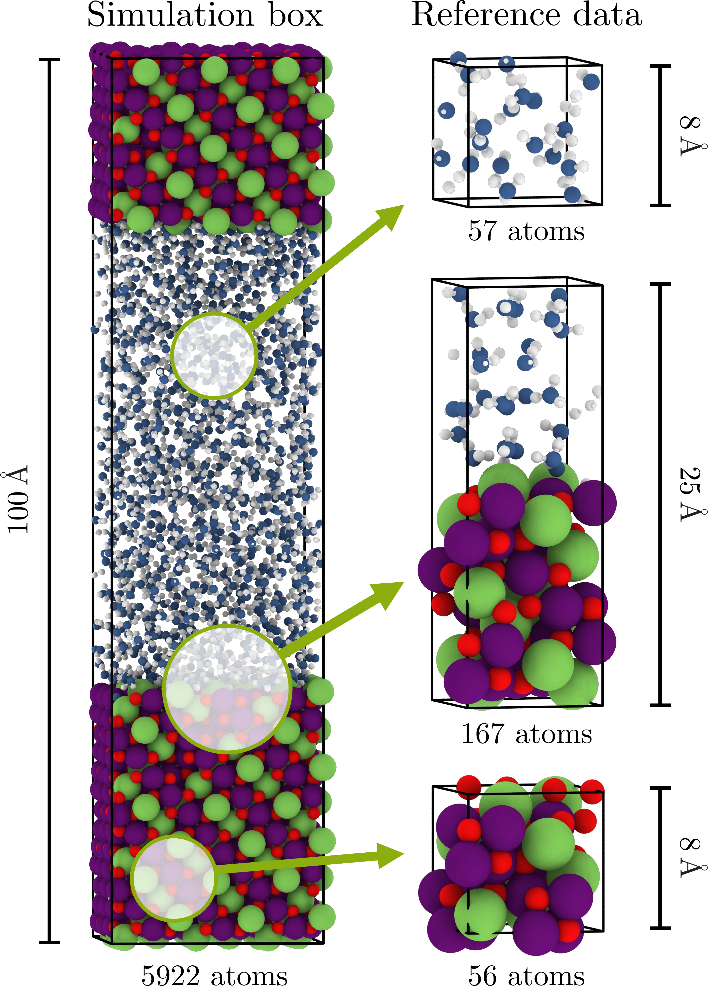
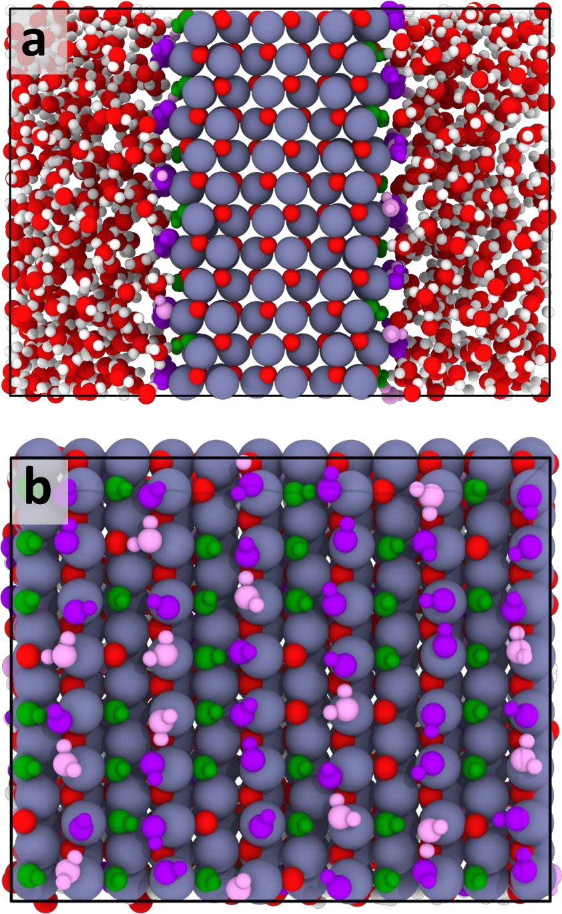

# Machine Learning Potentials for Heterogeneous Catalysis

## Reading prompts / 阅读提示

- **English:** Read each source block with its Chinese counterpart; figures and tables remain attached to their original captions.
- **中文：** 请将每一原文块与其中文译文对应阅读；图和表保留原始图注并放在相关正文附近。

## Terminology ledger / 术语表

- **English:** Technical terms, symbols, formulae, units and citation markers retain the source notation.
- **中文：** 技术术语、符号、化学式、单位和引文标记均保留原文记法。

## Full bilingual reader / 全文中英文对照

## Article information / 文章信息

**Source:** p.1 S001

**Original:** Perspective pubs.acs.org/acscatalysis

**中文:** 观点 pubs.acs.org/acscataanalysis

**Source:** p.1 S002

**Original:** Machine Learning Potentials for Heterogeneous Catalysis

**中文:** 机器学习在多相催化中的潜力

**Source:** p.1 S003

**Original:** Amir Omranpour,* Jan Elsner, K. Nikolas Lausch, and Jörg Behler*

**中文:** Amir Omranpour、* Jan Elsner、K. Nikolas Lausch 和 Jörg Behler*

**Source:** p.1 S004

**Original:** Cite This: ACS Catal. 2025, 15, 1616−1634 Read Online

**中文:** 引用此：ACS Catal。 2025, 15, 1616−1634 在线阅读

## I. INTRODUCTION / 引言

**Source:** p.1 S005

**Original:** I. INTRODUCTION

**中文:** 一、简介

**Source:** p.1 S006

**Original:** Heterogeneous catalysis plays an important role in many industrial processes and environmental applications by enabling chemical reactions of molecular species, which are typically in the gas or liquid phase, at solid catalyst surfaces.1−3

**中文:** 多相催化通过使分子物质（通常处于气相或液相）在固体催化剂表面发生化学反应，在许多工业过程和环境应用中发挥着重要作用。1−3

**Source:** p.1 S007

**Original:** These catalysts lower activation energies, enhance reaction rates, and offer selective pathways for desired products while substantially reducing energy consumption.2 Some of many important examples of heterogeneously catalyzed processes are, e.g., petrochemical refining,4 ammonia synthesis,5 hydrogenation reactions,6 fuel cells,7 polymerization reactions,8 and selective oxidations.9,10

**中文:** 这些催化剂可降低活化能，提高反应速率，并为所需产物提供选择性途径，同时大幅降低能耗。2 非均相催化过程的许多重要示例包括石化精炼、4 氨合成、5 加氢反应、6 燃料电池、7 聚合反应、8 和选择性氧化。9,10

**Source:** p.1 S008

**Original:** Atomic-level insights into catalytic processes are essential for advancing the rational design of improved catalysts. While experimental techniques for studying catalytic reactions in operando have significantly advancedusing methods such as Scanning Tunneling Microscopy (STM),11,12 Atomic Force Microscopy (AFM),11 Sum-Frequency Vibrational Spectroscopy (SFVS),13 and Surface-Enhanced Raman Spectroscopy (SERS)13,14obtaining comprehensive atomic-scale information from these experiments alone remains challenging.15

**中文:** 对催化过程的原子级洞察对于推进改进催化剂的合理设计至关重要。虽然使用扫描隧道显微镜 (STM)、11,12 原子力显微镜 (AFM)、11 和频振动光谱 (SFVS),13 和表面增强拉曼光谱 (SERS)13,14 等方法研究原位催化反应的实验技术已取得显着进步，但仅从这些实验中获取全面的原子尺度信息仍然具有挑战性。 15

**Source:** p.1 S009

**Original:** Thus, complementary information from theoretical studies is urgently needed. In particular, electronic structure calculations, most notably Density Functional Theory (DFT), now enable the study of moderately sized systems, on the order of

**中文:** 因此，迫切需要理论研究的补充信息。特别是电子结构计算，尤其是密度泛函理论 (DFT)，现在可以研究中等大小的系统，其数量级约为

**Source:** p.1 S010

**Original:** hundreds of atoms, with good accuracy. Consequently, to date, the most widely used theoretical approaches for investigating catalytic processes at the atomistic level are rooted in a static surface science approach,16−21 which involves calculating the thermodynamics of surface reaction intermediates by DFT. While these methods have been very successful in screening and predicting new catalysts, they often rely on rather simple structural models of the system under study, which is sometimes referred to as the complexity gap. For instance, the solvent’s impact is often only captured implicitly or including only a small number of explicit solvent molecules, the dynamic nature of catalytic interfaces is largely ignored, and the synergistic effects of adsorbed species are not explicitly considered. Additionally, for reactions at solid−liquid interfaces the structure of a solvent near a surface exhibits significant differences compared to the bulk liquid, and e.g., in case of water, the solvent itself may undergo dissociation and recombination and can thus actively participate in

**中文:** 数百个原子，具有良好的准确性。因此，迄今为止，在原子水平上研究催化过程的最广泛使用的理论方法植根于静态表面科学方法，16−21，其中涉及通过 DFT 计算表面反应中间体的热力学。虽然这些方法在筛选和预测新催化剂方面非常成功，但它们通常依赖于所研究系统的相当简单的结构模型，有时称为复杂性差距。例如，溶剂的影响通常仅被隐式捕获或仅包括少量显式溶剂分子，催化界面的动态性质在很大程度上被忽略，并且吸附物质的协同效应未被明确考虑。此外，对于固液界面的反应，表面附近的溶剂结构与本体液体相比表现出显着差异，例如，在水的情况下，溶剂本身可能会发生解离和重组，因此可以积极参与

**Source:** p.1 S011

**Original:** Received: October 31, 2024 Revised: January 3, 2025 Accepted: January 6, 2025 Published: January 15, 2025

**中文:** 收稿日期：2024年10月31日 修改日期：2025年1月3日 接受日期：2025年1月6日 发布日期：2025年1月15日

**Source:** p.1 S012

**Original:** ACS Catal. 2025, 15, 1616−1634

**中文:** ACS目录。 2025, 15, 1616−1634

**Source:** p.1 S013

**Original:** ACCESS Metrics & More Article Recommendations

**中文:** 访问指标及更多文章推荐

**Source:** p.1 S014

**Original:** ABSTRACT: The production of many bulk chemicals relies on heterogeneous catalysis. The rational design or improvement of the required catalysts critically depends on insights into the underlying mechanisms on the atomic scale. In recent years, substantial progress has been made in applying advanced experimental techniques to complex catalytic reactions in operando, but in order to achieve a comprehensive understanding, additional information from computer simulations is indispensable in many cases. In particular, ab initio molecular dynamics (AIMD) has become an important tool to explicitly address the atomistic level structure, dynamics, and reactivity of interfacial systems, but the high computational costs limit applications to systems consisting of at most a few hundred atoms for simulation times of up to tens of picoseconds. Rapid advances in the development of modern machine learning potentials (MLP) now offer a promising approach to bridge this gap, enabling simulations of complex catalytic reactions with ab initio accuracy at a small fraction of the computational costs. In this Perspective, we provide an overview of the current state of the art of applying MLPs to systems relevant for heterogeneous catalysis along with a discussion of the prospects for the use of MLPs in catalysis science in the years to come. KEYWORDS: Machine Learning Potentials, Heterogeneous Catalysis, Atomistic Simulation, Molecular Dynamics, Density Functional Theory

**中文:** 摘要：许多大宗化学品的生产依赖于多相催化。所需催化剂的合理设计或改进关键取决于对原子尺度基础机制的深入了解。近年来，将先进的实验技术应用于复杂的催化反应中已经取得了实质性进展，但为了实现全面的理解，在许多情况下来自计算机模拟的附加信息是必不可少的。特别是，从头算分子动力学（AIMD）已成为明确解决界面系统的原子级结构、动力学和反应性的重要工具，但高昂的计算成本限制了其在最多由数百个原子组成的系统中的应用，模拟时间长达数十皮秒。现代机器学习潜力 (MLP) 发展的快速进步现在提供了一种有前途的方法来弥补这一差距，能够以很小的计算成本从头开始准确地模拟复杂的催化反应。在本视角中，我们概述了将 MLP 应用于多相催化相关系统的最新技术，并讨论了未来几年 MLP 在催化科学中的使用前景。关键词: 机器学习潜力, 多相催化, 原子模拟, 分子动力学, 密度泛函理论

**Source:** p.2 S015

**Original:** ACS Catalysis pubs.acs.org/acscatalysis Perspective

**中文:** ACS 催化 pubs.acs.org/acscataanalysis 观点

**Source:** p.2 S016

**Original:** reactions.22 As heterogeneous catalysis increasingly involves solid−liquid interfacesowing to their ability to operate under milder conditions and improve selectivity1,10the gap between simplified static theoretical models and real experimental conditions is becoming ever more pronounced. In parallel to the development of electronic structure theory, various computer simulation techniques, such as Molecular Dynamics (MD)23 and Monte Carlo (MC),24 have been developed since the 1960s, which are able to account for finitetemperature effects. MD simulations, in particular, have been successfully applied to a range of biological and material systems. To effectively apply these methods, i.e., solving Newton’s equations of motion for systems with many atoms energies and forces for a large number of structures must be computed. These can be provided in terms of atomistic potentials, which are often called force fields in biology and chemistry,25−27 or empirical potentials in materials science.28−30 However, most of these models are fitted to a narrow range of experimental or ab initio data sets to reproduce specific properties and thus necessarily can reach only limited accuracy. This problem is particularly severe for catalytic systems, as not only an accurate representation of multiple bulk phases, i.e., the catalyst and the solvent exhibiting very different bonding patterns and interactions, but also of complex interfaces is required. In 1985, Car and Parrinello proposed a method31 to unify MD with electronic structure calculations, laying the foundation for what is now broadly referred to as ab initio Molecular Dynamics (AIMD).32 AIMD offers the potential to capture the time evolution of catalytic processes and provide mechanistic insight into reaction pathways with far greater accuracy than is possible using empirical models.33 Furthermore, an important advantage of AIMD is its general applicability to a wide range of systems of different chemical compositions without the need for any system-specific adjustments. However, AIMD comes with significant computational costs, driven by the need to perform electronic structure calculations at each MD time step, which places strong limitations on both the system size and the time scale accessible in the simulations. While enhanced sampling methods such as metadynamics34,35 and umbrella sampling36

**中文:** 22 由于多相催化能够在更温和的条件下运行并提高选择性，因此越来越多地涉及固液界面1,10，简化的静态理论模型与实际实验条件之间的差距变得越来越明显。在电子结构理论发展的同时，自 20 世纪 60 年代以来，各种计算机模拟技术（例如分子动力学 (MD)23 和蒙特卡罗 (MC)24）也得到了发展，这些技术能够解释有限温度效应。 MD 模拟尤其已成功应用于一系列生物和材料系统。为了有效地应用这些方法，即必须计算具有许多原子能量和力的系统的牛顿运动方程以及大量结构。这些可以通过原子势来提供，原子势在生物学和化学中通常被称为力场，25−27 或材料科学中的经验势。28−30 然而，这些模型中的大多数都适合于狭窄范围的实验或从头算数据集来重现特定属性，因此必然只能达到有限的精度。这个问题对于催化系统来说尤其严重，因为不仅需要准确表示多个体相，即表现出非常不同的键合模式和相互作用的催化剂和溶剂，而且还需要复杂的界面。 1985 年，Car 和 Parrinello 提出了一种方法31，将分子动力学与电子结构计算统一起来，为现在广泛称为从头算的分子动力学 (AIMD) 奠定了基础。32 AIMD 提供了捕获催化过程的时间演化的潜力，并以比使用经验模型更高的精度提供对反应路径的机制洞察。33 此外，AIMD 的一个重要优势是它普遍适用于各种不同化学物质的系统。无需任何特定于系统的调整。然而，由于需要在每个 MD 时间步执行电子结构计算，AIMD 带来了巨大的计算成本，这对系统尺寸和模拟中可访问的时间尺度都产生了很大的限制。而增强的抽样方法，如元动力学34,35和伞式抽样36

**Source:** p.2 S017

**Original:** can be used to speed up the sampling of rare events that are very relevant in catalytic reactions, the cubic scaling of DFT with the number of atoms ultimately limits the complexity of system that can be handled. Modern machine learning potentials (MLPs) allow to transfer the accuracy of first-principles electronic structure methods to large systems by constructing the high-dimensional potential energy surface based on reference electronic structure calculations for representative atomic configurations using machine learning (ML) techniques.37−44 This makes it feasible to run simulations for systems consisting of thousands of atoms for tens of nanoseconds, which greatly facilitates the study of catalytic systems. MLPs provide a high numerical consistency with the underlying reference electronic structure method, leading to typical energy errors of around 1 meV/atom and force errors on the order of 100 meV/Å. These errors are much smaller than the uncertainties associated with different exchange-correlation functionals in DFT. Consequently, substituting direct electronic structure calculations by MLPs has only a small impact on the accuracy of the obtained results. Additionally, MLPs are inherently capable of capturing reactive events, i.e., the breaking and formation of chemical bonds,

**中文:** 可用于加速催化反应中非常相关的罕见事件的采样，但 DFT 与原子数量的立方比例最终限制了可处理系统的复杂性。现代机器学习势（MLP）允许通过使用机器学习（ML）技术基于代表性原子构型的参考电子结构计算构建高维势能面，将第一原理电子结构方法的准确性转移到大型系统。37−44这使得对由数千个原子组成的系统进行数十纳秒的模拟成为可能，这极大地促进了催化系统的研究。 MLP 与基础参考电子结构方法具有高度的数值一致性，导致典型的能量误差约为 1 meV/原子，力误差约为 100 meV/Å。这些误差比 DFT 中不同交换相关函数相关的不确定性小得多。因此，用 MLP 代替直接电子结构计算对所得结果的准确性影响很小。此外，MLP 本质上能够捕获反应事件，即化学键的断裂和形成，

**Source:** p.2 S018

**Original:** ACS Catal. 2025, 15, 1616−1634 1617

**中文:** ACS目录。 2025, 15, 1616−1634 1617

**Source:** p.2 S019

**Original:** which are crucial for studying catalytic reactions. Figure 1 shows an example for a MLP-driven MD simulation of a reactive LiMn2O4 {100}Liwater interface.45

**中文:** 这对于研究催化反应至关重要。图 1 显示了反应性 LiMn2O4 {100}Li 水界面的 MLP 驱动 MD 模拟示例。 45

### Fig. 001

**Placed near:** p.2 S019
**Source:** p.2 C001

**Original caption:** Figure 1. Schematic representation of the LiMn2O4 {100}Liwater interface. On the left, the full simulation box for the final MD simulation is shown. On the right, the smaller reference systems (bulk LiMn2O4, bulk water, and the LiMn2O4 {100}Liwater interface) used for training the MLP model are displayed. Manganese atoms are colored violet, lithium atoms green, oxygen atoms red, and hydrogen atoms white. Oxygen atoms of the liquid phase are colored in blue. The figures were created using OVITO Pro (version 3.7.2).46

**中文图注:** 图 1. LiMn2O4 {100}Li 水界面示意图。左侧显示了最终 MD 模拟的完整模拟框。右侧显示了用于训练 MLP 模型的较小参考系统（散装 LiMn2O4、散装水和 LiMn2O4 {100}Li 水界面）。锰原子呈紫色，锂原子呈绿色，氧原子呈红色，氢原子呈白色。液相的氧原子呈蓝色。这些数字是使用 OVITO Pro（版本 3.7.2）创建的。46

**Source:** p.2 S020

**Original:** Since the introduction of the first MLP in 1995,47 MLPs have now become important tools in many fields of chemistry including catalysis, and in fact chemical processes at interfaces have been a driving force in their development. As MLPs now transition from the proof-of-concept phase to mature simulation tools, this Review aims to provide a perspective on their growing impact on heterogeneous catalysis research. As heterogeneous catalysis is a very broad topic, it is impossible to cover all aspects of machine learning in this field. In this perspective, we will thus focus on its use for gaining atomic-level insights and more specifically for representing potential energy surfaces governing catalytic reactions, which can then be used in large-scale simulations. Still, the examples discussed here can only cover some of the systems published in the literature, and other aspects and systems can be found in several related publications.48−57 We will not cover the more general application of machine learning techniques in heterogeneous catalysis, such as using ML to predict new catalysts bypassing the atomic level or exploring catalytic reaction networks, which are equally active fields of research.58−62 Further related applications of MLPs are recent works addressing challenges associated with identifying key intermediates and transition states, as well as constructing global potential energy surfaces,63−66 using the stochastic surface walking (SSW) method as implemented in the LASP code.67

**中文:** 自 1995 年推出第一个 MLP 以来，47 MLP 现在已成为包括催化在内的许多化学领域的重要工具，事实上，界面上的化学过程一直是其发展的驱动力。随着 MLP 现在从概念验证阶段过渡到成熟的模拟工具，本综述旨在提供其对多相催化研究日益增长的影响的视角。由于异质催化是一个非常广泛的话题，不可能涵盖该领域机器学习的所有方面。从这个角度来看，我们将重点关注其用于获得原子级见解，更具体地说，用于表示控制催化反应的势能表面，然后可用于大规模模拟。尽管如此，这里讨论的例子只能涵盖文献中发表的一些系统，其他方面和系统可以在几篇相关出版物中找到。48−57我们不会涵盖机器学习技术在多相催化中的更一般应用，例如使用ML来预测绕过原子水平的新催化剂或探索催化反应网络，这些都是同样活跃的研究领域。58−62 MLP的进一步相关应用是最近的工作，解决与识别关键中间体和过渡态以及构建相关的挑战。全局势能表面，63−66 使用 LASP 代码中实现的随机表面行走 (SSW) 方法。 67

**Source:** p.2 S021

**Original:** This perspective is organized as follows: first, a concise overview of MLPs is provided, followed by a summary of the

**中文:** 该观点的组织如下：首先，提供 MLP 的简明概述，然后总结

**Source:** p.3 S022

**Original:** ACS Catalysis pubs.acs.org/acscatalysis Perspective

**中文:** ACS 催化 pubs.acs.org/acscataanalysis 观点

**Source:** p.3 S023

**Original:** achievements of MLPs in elucidating different types of processes in heterogeneous catalysis. Next, several key considerations and challenges in using MLPs in catalysis are addressed along with potential solutions to be developed. Finally, an outlook on the possible future directions of the field is given.

**中文:** MLP 在阐明多相催化中不同类型的过程方面取得的成就。接下来，讨论了在催化中使用 MLP 的几个关键考虑因素和挑战，以及有待开发的潜在解决方案。最后对该领域未来可能的发展方向进行了展望。

**Source:** p.3 S024

**Original:** II. METHODS In recent years, the development of atomistic potentials using machine learning has become a very important topic, and many different methods have been proposed, each of which has its own advantages and disadvantages. In this perspective focusing on the application of MLPs in heterogeneous catalysis we do not attempt to provide a comprehensive overview of all the methodical details of MLPs, and we will just provide a bird’s eye view of the field. Instead, the interested readers are referred to several dedicated reviews addressing all the aspects of MLPs and their training in great detail.38−44,68−76

**中文:** 二.方法近年来，利用机器学习开发原子势已成为一个非常重要的课题，并且提出了许多不同的方法，每种方法都有自己的优点和缺点。从重点关注 MLP 在多相催化中的应用的角度来看，我们并不试图全面概述 MLP 的所有方法细节，而只是提供该领域的鸟瞰图。相反，感兴趣的读者可以参考几篇专门评论，详细讨论了 MLP 及其训练的所有方面。38−44,68−76

**Source:** p.3 S025

**Original:** II.A. Physical Classification of MLPs. There are several ways to classify the many different flavors of MLPs, each focusing on different aspects. Two possible viewpoints for such categorizations are centered either on the physics governing the atomic interactions71,74 or take a mathematical perspective.43 The former, which is of particular interest for catalysis, is based on the nature and range of atomic interactions that can be described and introduces four different generations of MLPs. The first generation of MLPs has been restricted to very lowdimensional systems, e.g., diatomic molecules in the gas phase approaching surface models in which the atomic positions of the surface had to be frozen to reduce the complexity of the potential energy landscape. This limitation was overcome by Behler and Parrinello with the development of high-dimensional neural network potentials (HDNNP) in 2007.77

**中文:** II.A. MLP 的物理分类。有多种方法可以对多种不同类型的 MLP 进行分类，每种方法侧重于不同的方面。这种分类有两种可能的观点，要么集中在控制原子相互作用的物理学71,74，要么采取数学角度。 43 前者对催化作用特别感兴趣，它基于可以描述的原子相互作用的性质和范围，并引入了四代不同的 MLP。第一代 MLP 仅限于非常低维的系统，例如接近表面模型的气相双原子分子，其中必须冻结表面的原子位置以降低势能景观的复杂性。 Behler 和 Parrinello 在 2007.77 开发了高维神经网络势 (HDNNP)，克服了这一限制

**Source:** p.3 S026

**Original:** HDNNPs introduced a decomposition of the total energy of the system into a sum of local environment-dependent atomic energy contributions Ei,

**中文:** HDNNPs 将系统总能量分解为局部环境相关原子能量贡献 Ei 的总和，

**Source:** p.3 S027

**Original:** N

**中文:** 氮

**Source:** p.3 S028

**Original:** atom =

**中文:** 原子=

**Source:** p.3 S029

**Original:** E E

**中文:** 电子

**Source:** p.3 S030

**Original:** i 1

**中文:** 我 1

**Source:** p.3 S031

**Original:** = (1)

**中文:** = (1)

**Source:** p.3 S032

**Original:** i

**中文:** 我

**Source:** p.3 S033

**Original:** where Natom is the total number of atoms in the system. Each atomic energy is then provided by machine learning, e.g., by an atomic neural network. This approach made it feasible to construct MLPs for condensed-phase systems containing large numbers of atoms, such as solid surfaces central to heterogeneous catalysis. However, due to the locality approximation, interactions beyond the cutoff, typically in the range of 5 to 10 Å, are only included in an averaged manner. This class of strictly local MLPs is nowadays categorized as second-generation (2G), and many different 2G potentials are now available, which provide very accurate energy surfaces.77−82 However, for some systems, it may be important to incorporate long-range interactions beyond the cutoff or even global phenomena like nonlocal charge transfer, for instance, in some complex oxide surfaces. Overcoming these limitations is the aim of third- and fourth-generation MLPs. In third-generation MLPs, electrostatic interactions are modeled using environment-dependent charges represented by machine learning models.83−91 These charges are used to compute the electrostatic energy, which is then combined with the short-range component given by eq 1 to yield the system’s

**中文:** 其中 Natom 是系统中的原子总数。然后，每个原子能量由机器学习（例如原子神经网络）提供。这种方法使得为包含大量原子的凝聚相系统（例如非均相催化的固体表面）构建 MLP 成为可能。然而，由于局部近似，超出截止值（通常在 5 至 10 Å 范围内）的相互作用仅以平均方式包含在内。这类严格局部的 MLP 现在被归类为第二代 (2G)，并且现在有许多不同的 2G 势可用，它们提供了非常精确的能量表面。 77−82 然而，对于某些系统，将超出截止范围的长程相互作用甚至是全局现象（例如，在某些复杂的氧化物表面中）纳入非局域电荷转移等全局现象可能很重要。克服这些限制是第三代和第四代 MLP 的目标。在第三代 MLP 中，静电相互作用是使用机器学习模型所代表的环境相关电荷来建模的。83−91 这些电荷用于计算静电能量，然后将其与等式 1 给出的短程分量相结合，得出系统的

**Source:** p.3 S034

**Original:** ACS Catal. 2025, 15, 1616−1634 1618

**中文:** ACS目录。 2025, 15, 1616−1634 1618

**Source:** p.3 S035

**Original:** total energy. By training the short-range component to capture only the nonelectrostatic contribution to the total energy, double-counting of energy contributions is avoided. The remaining shortcomings of third-generation MLPs stem from the assumed locality of atomic charges, which makes it impossible for such models to capture long-range charge transfer that may occur in certain systems.74 Several fourthgeneration MLPs have been proposed,92−96 which make use of global information to include these effects. Apart from these different capabilities of MLPs to incorporate explicit physics, all MLPs inherit the intrinsic limitations of the underlying training data, in particular, the accuracy of the employed electronic structure level of theory. For instance, if certain interactions, e.g., dispersion interactions, are poorly described in DFT calculations, then this will carry over to the constructed MLP. A more detailed discussion of the challenges and prospects of using MLPs to study heterogeneous catalysis will be presented in Section IV. II.B. Classification by Representation and Learning. From the mathematical viewpoint, MLPs can be classified based on how they handle the two central tasks:43 (a) representing the structure of the system and (b) learning the relationship between the representation and the associated potential energy surface (PES). According to this classification, MLPs can be divided into three families: (1) One family uses predefined descriptors in combination with nonlinear regression. This family typically employs descriptors that respect the three mandatory invariances of the atomic environment: translational, rotational, and permutational symmetries. Most of these descriptors are strictly local, defined by a specific cutoff radius. The relationship between the atomic environment descriptors and the associated PES is then learned by using nonlinear fitting functions through either shallow or deep neural networks or kernel regression methods. Some typical representatives of this family include secondgeneration MLPs like HDNNPs,77 Gaussian Approximation Potentials (GAP),78 and Deep Potential Molecular Dynamics (DeePMD).82

**中文:** 总能量。通过训练短程组件仅捕获对总能量的非静电贡献，可以避免能量贡献的重复计算。第三代 MLP 的其余缺点源于假设的原子电荷局部性，这使得此类模型无法捕获某些系统中可能发生的长程电荷转移。74 已经提出了几种第四代 MLP，92−96，它们利用全局信息来包含这些效应。除了 MLP 结合显式物理的这些不同能力之外，所有 MLP 都继承了基础训练数据的内在局限性，特别是所采用的电子结构理论水平的准确性。例如，如果某些相互作用（例如色散相互作用）在 DFT 计算中描述得不好，那么这将延续到构建的 MLP 中。第四节将更详细地讨论使用 MLP 研究多相催化的挑战和前景。 II.B.按表示和学习进行分类。从数学角度来看，MLP 可以根据它们处理两个中心任务的方式进行分类：43 (a) 表示系统的结构；(b) 学习表示和相关势能面 (PES) 之间的关系。根据这种分类，MLP 可分为三类：（1）一类使用预定义描述符与非线性回归相结合。该族通常使用尊重原子环境的三个强制不变性的描述符：平移对称性、旋转对称性和排列对称性。这些描述符中的大多数都是严格局部的，由特定的截止半径定义。然后通过浅层或深层神经网络或核回归方法使用非线性拟合函数来学习原子环境描述符和相关 PES 之间的关系。该家族的一些典型代表包括第二代 MLP，如 HDNNP、77 高斯近似势 (GAP)、78 和深势分子动力学 (DeePMD)。 82

**Source:** p.3 S036

**Original:** (2) Another family uses symmetric basis functions in combination with linear regression, albeit with nonlinearity included in the basis functions. Some typical MLPs in this category are Moment Tensor Potentials (MTP)81 and Atomic Cluster Expansion (ACE).79

**中文:** (2) 另一个系列将对称基函数与线性回归结合使用，尽管基函数中包含非线性。此类别中的一些典型 MLP 包括矩张量势 (MTP)81 和原子簇展开 (ACE).79

**Source:** p.3 S037

**Original:** (3) More recently, a third family has been introduced using message-passing neural networks (MPNN).97 In this approach, both the representation and the learning tasks are addressed simultaneously. Here, the descriptors are learned by the neural network during training. Some examples in this category include DTNN,98 SchNet,99 NequIP,100 Allegro,101 and MACE.102

**中文:** (3) 最近，使用消息传递神经网络 (MPNN) 引入了第三个系列。97 在这种方法中，表示和学习任务同时得到解决。这里，描述符是神经网络在训练期间学习的。此类别中的一些示例包括 DTNN、98 SchNet、99 NequIP、100 Allegro、101 和 MACE.102

**Source:** p.3 S038

**Original:** In spite of the large number of MLPs that have been published to date, they have not been equally used in studies relating to heterogeneous catalysis. A review of the literature indicates that to date HDNNP and DeePMD are by far the most commonly applied methods in this context. However, several types of MLP, including MPNNs, have been suggested only recently; therefore, it is expected that the number of studies employing these newer methods will grow substantially in the coming years.

**中文:** 尽管迄今为止已发表了大量的 MLP，但它们尚未在多相催化相关的研究中得到同等的应用。对文献的回顾表明，迄今为止，HDNNP 和 DeePMD 是迄今为止在这方面最常用的方法。然而，包括 MPNN 在内的几种类型的 MLP 直到最近才被提出。因此，预计未来几年采用这些新方法的研究数量将大幅增加。

**Source:** p.3 S039

**Original:** III. APPLICATIONS TO HETEROGENEOUS CATALYSIS

**中文:** 三．多相催化的应用

**Source:** p.3 S040

**Original:** III.A. Clusters and Surfaces. Clusters. Clusters are important in catalysis, where they are commonly utilized as

**中文:** III.A.簇和表面。集群。簇在催化中很重要，它们通常被用作

**Source:** p.4 S041

**Original:** ACS Catalysis pubs.acs.org/acscatalysis Perspective

**中文:** ACS 催化 pubs.acs.org/acscataanalysis 观点

**Source:** p.4 S042

**Original:** nanoparticles or nanoclusters to maximize the active surface area for chemical reactions. A key feature of these nanoparticles is their microstructure and morphology, which can be customized to enhance both functional properties and stability.103 Many catalysts, in fact, consist of metal clusters supported on oxides. The first applications of MLPs for metal and oxide clusters were reported for copper104 and zinc oxide clusters84 using HDNNPs. Further HDNNPs have been reported for Cu−Au nanoalloys employed in grand canonical MD simulations.105 For brass (Cu−Zn), HDNNP studies106,107 have shown that the element distribution within the nanoparticles is inhomogeneous, with zinc concentrated in the outermost layer and copper enriched in the subsurface layer. Alloying within the nanoparticle core occurs only at high zinc concentrations, forming bulk crystalline α-brass patterns. The nanoparticles’ melting temperature decreases with higher zinc content, consistent with the bulk phase behavior of brass. In Pt−Rh alloys, studies using ACE108 have shown that Pt atoms segregate on the surface, forming a monolayer, which contrasts with experimental core−shell nanoclusters having thicker Pt shells that are stabilized kinetically, not thermodynamically. For Au nanoparticles, HDNNP-driven simulations109 revealed a rigid outer atomic layer compared to the core, where changes in surface atom coordination at around 300 K result in surface defects. The simulations also revealed a dynamic coexistence of solid-like and liquidlike phases near the melting transition. Other studies on Au,110,111 Pt,112 and Na clusters113 using HDNNPs further confirm the reliability and robustness of MLP-based simulations. The dissociation of a CO2 molecule on Cu nanoclusters was investigated using DeePMD simulations and well-tempered metadynamics,114 showing that the nanoclusters exhibit surface premelting behavior which significantly affects catalytic activity. Point defects, such as vacancies and adatoms, were found to reduce the surface melting temperature, enabling reactions to occur under milder conditions. Solid Surfaces. The atomic environments on metal surfaces significantly differ from those in the bulk. Notably, reconstructions or imperfections on real surfaces can result in highly complex atomic configurations. Using ZnO as a case study of a multicomponent system,84 the third-generation HDNNP was introduced by incorporating environmentdependent charges to account for long-range electrostatic interactions. Copper104 was also investigated, covering both bulk and various surface structures, including defects. The neural network potential accurately reproduced key properties, such as lattice constants, cohesive energies, and surface energies. The oxidation of flat and stepped Pt surfaces, was studied using embedded atom neural network (EANN) potentials combined with grand-canonical Monte Carlo simulations,115 revealed the formation mechanism of the square planar PtO4 oxide unit on a flat Pt surface. Clusters at Surfaces. Studies of copper clusters supported on zinc oxide and their extension to the ternary CuZnO system using HDNNPs116,117 revealed a variety of structural patterns. Exploration of copper-ceria (CuO/CeO2) catalysts for lowtemperature CO oxidation revealed that the surface-substituted CuyCe1−yO2−x phase is more catalytically active than the bulk CuO phase.118 This was supported by in situ X-ray absorption spectroscopy, electron microscopy, and MLP-driven simulations, which revealed copper ion segregation on the 100 surfaces of nanoparticles. Additionally, the dynamic restructuring of 2 nm Pt nanoparticles on SiO2 in reactive environments

**中文:** 纳米粒子或纳米团簇以最大化化学反应的活性表面积。这些纳米粒子的一个关键特征是它们的微观结构和形态，可以对其进行定制以增强功能特性和稳定性。103 事实上，许多催化剂由氧化物负载的金属簇组成。据报道，MLP 在金属和氧化物簇中的首次应用是使用 HDNNP 在铜104 和氧化锌簇84 上进行的。进一步的 HDNNP 已被报道用于大规范 MD 模拟中使用的 Cu−Au 纳米合金。 105 对于黄铜 (Cu−Zn)，HDNNP 研究 106,107 表明纳米颗粒内的元素分布不均匀，锌集中在最外层，铜富集在次表面层。纳米粒子核心内的合金化仅在高锌浓度下发生，形成块状结晶 α-黄铜图案。纳米颗粒的熔化温度随着锌含量的增加而降低，这与黄铜的体相行为一致。在 Pt−Rh 合金中，使用 ACE108 的研究表明，Pt 原子在表面偏析，形成单层，这与具有较厚 Pt 壳的实验核壳纳米团簇形成鲜明对比，该核壳纳米团簇在动力学上而非热力学上是稳定的。对于 Au 纳米粒子，HDNNP 驱动的模拟109 揭示了与核心相比的刚性外原子层，其中表面原子配位在 300 K 左右的变化导致表面缺陷。模拟还揭示了熔化转变附近固相和液相的动态共存。使用 HDNNP 对 Au,110,111 Pt,112 和 Na 团簇 113 进行的其他研究进一步证实了基于 MLP 的模拟的可靠性和鲁棒性。使用 DeePMD 模拟和调和的元动力学研究了 CO2 分子在 Cu 纳米团簇上的解离，114 表明纳米团簇表现出表面预熔化行为，这显着影响催化活性。人们发现，空位和吸附原子等点缺陷可以降低表面熔化温度，使反应能够在更温和的条件下发生。固体表面。金属表面的原子环境与本体中的原子环境显着不同。值得注意的是，真实表面上的重建或缺陷可能会导致高度复杂的原子配置。以 ZnO 作为多组分系统的案例研究，84 通过结合环境相关电荷来解释长程静电相互作用，引入了第三代 HDNNP。还对 Copper104 进行了研究，涵盖块体和各种表面结构，包括缺陷。神经网络势准确地再现了关键属性，例如晶格常数、内聚能和表面能。使用嵌入式原子神经网络 (EANN) 电势结合大正则蒙特卡罗模拟研究了平坦和阶梯状 Pt 表面的氧化，115 揭示了平坦 Pt 表面上方形平面 PtO4 氧化物单元的形成机制。表面的簇。 对氧化锌负载的铜簇及其使用 HDNNPs116,117 扩展到三元 CuZnO 体系的研究揭示了多种结构模式。对用于低温 CO 氧化的铜-二氧化铈 (CuO/CeO2) 催化剂的探索表明，表面取代的 CuyCe1−yO2−x 相比本体 CuO 相更具催化活性。 118 这得到了原位 X 射线吸收光谱、电子显微镜和 MLP 驱动的模拟的支持，这些模拟揭示了纳米颗粒 100 个表面上的铜离子偏析。此外，在反应环境中 SiO2 上 2 nm Pt 纳米颗粒的动态重组

**Source:** p.4 S043

**Original:** ACS Catal. 2025, 15, 1616−1634 1619

**中文:** ACS目录。 2025, 15, 1616−1634 1619

**Source:** p.4 S044

**Original:** was studied using in situ spectroscopy and MD simulations with Allegro,119 revealing that nanoparticle surfaces lose their atomic order when exposed to CO gas, while their cores remain bulk-like. This challenges traditional models that assume idealized faceting, highlighting the need for models that account for realistic surface structures to predict catalyst function and stability. III.B. Solid−Gas Interfaces. Early MLPs. Since the early days of MLPs, their development was motivated by the challenge of accurately representing the PES for gas-surface dynamics. Before the breakthrough of MLPs, extensive work during the 1990s and early 2000s focused on analytic PESs for gas-surface dynamics, employing many different approaches.120−125 A primary limitation of these analytical PESs was their restriction to six dimensions for diatomic molecules on surfaces. Additionally, simulating chemical reaction probabilities, particularly in gas-surface dynamics, demands a precise mapping of energy landscapes. Even minor errors in the reaction barriers can lead to significant deviations in the predicted reaction probabilities, posing an additional challenge for PES representation. In response to these limitations, Blank et al.47 introduced the use of neural networks as a general, nonlinear fitting approach that avoids assumptions about the potential energy surface topology. This approach, using a limited set of data points, demonstrated the ability to model complex chemical interactions with high accuracy. It showed, for the first time, that feed-forward neural networks can accurately model PESs, outperforming traditional methods like splines. This technique was applied to systems such as CO on Ni(111) and H2 on Si(100), providing precise predictions of the potential energy. In 2004, Lorenz et al.126 took the next step by further reducing the number of training points by exploiting the underlying surface symmetries in periodic slabs. They demonstrated the accuracy and efficiency of neural network potentials (NNPs) for H2 interacting with the (2 × 2) potassium-covered Pd(100) surface. The sticking probability of H2/K(2 × 2)/Pd(100) was determined by MD simulations on the neural network PES and compared with results obtained using an independent analytical interpolation. It was shown that, by accounting for the symmetries underlying the particular system and incorporating feedback from dynamical simulations, a relatively moderate number of training points is needed to obtain a reliable fit.127

**中文:** 使用原位光谱学和 Allegro 的 MD 模拟进行了研究，119 揭示了纳米颗粒表面在暴露于 CO 气体时会失去原子顺序，而其核心仍保持块状。这对假设理想化刻面的传统模型提出了挑战，凸显了需要考虑现实表面结构的模型来预测催化剂功能和稳定性。 III.B.固气界面。早期的 MLP。自 MLP 早期以来，其发展的动力来自于准确表示气体表面动力学 PES 的挑战。在 MLP 取得突破之前，20 世纪 90 年代和 2000 年代初的大量工作集中于气体表面动力学的分析 PES，采用了许多不同的方法。120−125 这些分析 PES 的主要限制是它们对表面双原子分子的六维限制。此外，模拟化学反应概率，特别是在气体表面动力学中，需要精确绘制能量图。即使反应障碍中的微小错误也可能导致预测的反应概率出现显着偏差，这给 PES 表示带来了额外的挑战。为了应对这些限制，Blank 等人47 引入了使用神经网络作为通用的非线性拟合方法，避免了对势能表面拓扑的假设。这种方法使用有限的数据点集，展示了高精度模拟复杂化学相互作用的能力。它首次表明前馈神经网络可以准确地对 PES 进行建模，其性能优于样条等传统方法。该技术应用于 Ni(111) 上的 CO 和 Si(100) 上的 H2 等系统，提供了势能的精确预测。 2004 年，Lorenz 等人126 采取了下一步，通过利用周期性板中的底层表面对称性进一步减少训练点的数量。他们证明了 H2 与 (2 × 2) 钾覆盖的 Pd(100) 表面相互作用的神经网络电位 (NNP) 的准确性和效率。 H2/K(2 × 2)/Pd(100) 的粘附概率是通过神经网络 PES 上的 MD 模拟确定的，并与使用独立分析插值获得的结果进行比较。结果表明，通过考虑特定系统的对称性并结合动态模拟的反馈，需要相对适中的训练点数量才能获得可靠的拟合。 127

**Source:** p.4 S045

**Original:** Similar methodologies were employed by Behler et al. to study O2 dissociation on Al surfaces.128 Symmetrized functions were introduced129 to fully account for the surface’s symmetry and nonadiabatic effects were also investigated.130 Instead of molecular coordinates, the symmetrized functions, systematically constructed from atomic Fourier terms, were used as inputs to the neural network. This approach was validated for O2 interacting with the Al(111) surface. Building on this work, additional studies for O2 dissociation on Al were conducted by Carbogno et al.131,132

**中文:** Behler 等人也采用了类似的方法。研究 Al 表面上的 O2 离解。128 引入了对称函数 129 以充分解释表面的对称性，并且还研究了非绝热效应。130 使用从原子傅立叶项系统构建的对称函数作为神经网络的输入，而不是分子坐标。该方法针对 O2 与 Al(111) 表面相互作用进行了验证。在这项工作的基础上，Carbogno 等人对 Al 上的 O2 解离进行了额外的研究131,132

**Source:** p.4 S046

**Original:** O2 adsorption on Ag surfaces was also investigated133 and it was shown that the dissociation probabilities match experimental data, suggesting that the surface’s inertness is primarily due to energy barriers, with spin or charge nonadiabaticity playing a negligible role. Later, the conventional view that physisorption states significantly influence molecular scattering experiments was challenged.134 Despite the inability of semilocal DFT to accurately capture long-range van der Waals interactions and the absence of physisorption wells,

**中文:** 还研究了 Ag 表面上的 O2 吸附133，结果表明解离概率与实验数据相符，表明表面的惰性主要是由于能垒，自旋或电荷非绝热性的作用可以忽略不计。后来，物理吸附态显着影响分子散射实验的传统观点受到了挑战。 134 尽管半局域 DFT 无法准确捕获长程范德华相互作用并且缺乏物理吸附井，

**Source:** p.5 S047

**Original:** ACS Catalysis pubs.acs.org/acscatalysis Perspective

**中文:** ACS 催化 pubs.acs.org/acscataanalysis 观点

**Source:** p.5 S048

**Original:** experimental scattering trends were successfully reproduced in the simulations. It was suggested that molecular scattering is more influenced by the repulsive walls associated with chemisorption rather than by physisorption, casting doubt on the use of scattering data as indirect evidence of the existence of physisorption states. Ammonia Decomposition. The work discussed so far represents initial efforts to employ first-generation MLPs. Since then, MLPs have reached a level of maturity that allows them to be used to study some of the key challenging systems in catalysis, such as the Haber−Bosch process for ammonia synthesis,5 which is essential for producing fertilizers and sustaining global food production. Traditionally, theoretical modeling at operando industrial-level temperatures was unfeasible, often relying on extrapolations from lower-temperature results. However, the validity of this approach has been recently questioned by a series of works by Parrinello et al.135−138 In particular, these studies directly highlight the role of dynamics in ammonia decomposition on the iron surface that is relevant to the Haber−Bosch process. In the Haber−Bosch process, the rate-limiting step is believed to be the N2 decomposition on Fe catalysts, due to the strong triple bond of N2 molecules. N2 decomposition on Fe(111) was investigated135 using DeePMD and metadynamics simulations, revealing the disruptive effect of dynamic changes on the Fe(111) surface morphology, which significantly influences nitrogen adsorption and dissociation, particularly at elevated temperatures. The study highlights the risk of extrapolating low-temperature results to operando conditions (700 K for the N2 decomposition), due to the nonlinearity of catalytic behavior with temperature, and demonstrates that catalytic activity can only be accurately inferred from simulations that explicitly account for dynamics. Additionally, it has been shown136 that ammonia decomposition over a wustite-based bulk iron catalyst results in the formation of iron nitrides (Fe4N and Fe2N) at lower temperatures. The decomposition of Fe4N into Fe and N2 was identified as the rate-determining step, with activation energies of 172 and 173 kJ/mol, respectively. MD simulations demonstrated that nitrogen migration into the bulk of the catalyst is favored over recombination at the surface, significantly impacting the efficiency of nitrogen desorption and nitride formation. Al2O3(0001) Surface. The Al2O3(0001) surface is important in catalysis, as it serves as a stable support material for dispersing active catalytic species, enhancing activity and durability. Its well-defined atomic structure and low reactivity make it suitable for high-temperature catalytic processes, while its surface properties allow for controlled adsorption and surface reactions, making it valuable for studying heterogeneous catalysis. The stoichiometric reconstruction of the Al2O3(0001) surfaceconsidered one of surface science’s mysteries139was recently investigated140 using noncontact atomic force microscopy (nc-AFM) and DFT calculations enhanced by VASP’s on-the-fly MLPs,141−143 based on GAP. Imaging revealed the lateral atomic positions, while theoretical analysis indicated that aluminum rehybridization enables bonding with subsurface oxygen atoms, significantly stabilizing the reconstruction. In another study using an HDNNP, hydrogen atom scattering at the Al2O3(0001) surface was examined.144 The best agreement between experimental atom beam scattering and theory occurs at large initial kinetic energies and at both very low and high scattering angles,

**中文:** 模拟中成功再现了实验散射趋势。有人认为，分子散射更多地受到与化学吸附相关的排斥壁的影响，而不是受物理吸附的影响，这对使用散射数据作为物理吸附状态存在的间接证据产生了怀疑。氨分解。迄今为止讨论的工作代表了采用第一代 MLP 的初步努力。从那时起，MLP 已达到一定的成熟水平，使其可用于研究催化中一些具有挑战性的关键系统，例如氨合成的哈伯-博世工艺，5 这对于生产肥料和维持全球粮食生产至关重要。传统上，在工业水平温度下进行理论建模是不可行的，通常依赖于较低温度结果的推断。然而，这种方法的有效性最近受到 Parrinello 等人的一系列工作的质疑。135−138 特别是，这些研究直接强调了与 Haber−Bosch 过程相关的铁表面氨分解动力学的作用。在 Haber−Bosch 过程中，由于 N2 分子的强三键，限速步骤被认为是 Fe 催化剂上的 N2 分解。使用 DeePMD 和元动力学模拟研究了 Fe(111) 上的 N2 分解，揭示了动态变化对 Fe(111) 表面形态的破坏性影响，这显着影响氮吸附和解离，特别是在高温下。该研究强调了由于催化行为与温度的非线性而将低温结果外推到操作条件（N2 分解为 700 K）的风险，并表明催化活性只能从明确考虑动力学的模拟中准确推断。此外，研究表明136氨在维氏体基块状铁催化剂上的分解会导致在较低温度下形成氮化铁（Fe4N和Fe2N）。 Fe4N 分解为 Fe 和 N2 被确定为速率决定步骤，活化能分别为 172 和 173 kJ/mol。 MD模拟表明，氮迁移到催化剂主体中比在表面复合更有利，显着影响氮解吸和氮化物形成的效率。 Al2O3(0001) 表面。 Al2O3(0001)表面在催化中很重要，因为它可以作为分散活性催化物质、增强活性和耐久性的稳定载体材料。其明确的原子结构和低反应性使其适用于高温催化过程，而其表面特性允许控制吸附和表面反应，使其对于研究多相催化很有价值。 Al2O3(0001) 表面的化学计量重建被认为是表面科学的奥秘之一139，最近使用非接触原子力显微镜 (nc-AFM) 和基于 GAP 的 VASP 动态 MLP 增强的 DFT 计算进行了研究 140，141−143。 成像揭示了横向原子位置，而理论分析表明铝的再杂化能够与表面下的氧原子结合，从而显着稳定重建。在另一项使用 HDNNP 的研究中，检查了 Al2O3(0001) 表面的氢原子散射。 144 实验原子束散射与理论之间的最佳一致性出现在较大的初始动能以及非常低和高的散射角下，

**Source:** p.5 S049

**Original:** ACS Catal. 2025, 15, 1616−1634 1620

**中文:** ACS目录。 2025, 15, 1616−1634 1620

**Source:** p.5 S050

**Original:** attributed to scattering from top-layer aluminum atoms. In contrast, lower initial kinetic energies result in greater kinetic energy loss in the MD trajectories compared to experiment. Additionally, scattering at oxygen sites generally leads to larger discrepancies. Other Gas-Surface Systems. Numerous other studies have employed MLPs to model gas-surface dynamics. For instance, NNPs have been employed to investigate H2 dissociation on Pt(111) and Cu(111), demonstrating that reduced energetic corrugation broadens the reaction probability curve.145 In a combined HDNNP and STM study,146 it was found that high CO coverage at a Pt step edge induces the formation of atomic protrusions composed of low-coordination Pt atoms. These atoms then detach from the step edge, forming sub-nanoislands on the terraces, where the CO adsorbates stabilize the under-coordinated sites. H2 dissociation on Pt(111) was also examined using an on-the-fly trained Sparse Gaussian Process (SGP) potential,147 while H2 dissociation on curved Pt surfaces was studied with HDNNPs.148

**中文:** 归因于顶层铝原子的散射。相反，与实验相比，较低的初始动能导致 MD 轨迹中的动能损失更大。此外，氧位点的散射通常会导致更大的差异。其他气体表面系统。许多其他研究已经使用 MLP 来模拟气体表面动力学。例如，NNP 已被用来研究 Pt(111) 和 Cu(111) 上的 H2 解离，证明能量波纹的减少会拓宽反应概率曲线。 145 在 HDNNP 和 STM 的联合研究中，146 发现 Pt 台阶边缘处的高 CO 覆盖率会诱导由低配位 Pt 原子组成的原子突起的形成。然后这些原子从台阶边缘分离，在台阶上形成亚纳米岛，其中二氧化碳吸附稳定了欠配位点。还使用动态训练的稀疏高斯过程 (SGP) 电位检查 Pt(111) 上的 H2 解离，147，同时使用 HDNNP 研究弯曲 Pt 表面上的 H2 解离。 148

**Source:** p.5 S051

**Original:** Investigation of N2O dissociation on Cu(100)149 showed that N2O initially weakly adsorbs on Cu(100) before reaching a stable chemisorbed state at a hollow site, with dissociation into N2 and adsorbed oxygen becoming favorable at higher translational energies. Vibrational shifts in adsorbed N2O reflect bond weakening, facilitating dissociation, while changes in rotational temperature have a minimal effect on this process. The quantum mechanics/molecular mechanics (QM/MM) embedding method for the synthesis of aqueous O2 on Pd(100), where an NNP was used to surrogate DFT calculations, revealed significant energy release during dissociation. This release resulted in highly mobile oxygen atoms, challenging the assumption of instantaneous thermalization in catalytic processes.150 NNP-based studies of HCl on Au(111)151 showed that the RPBE functional produces higher reaction barriers and lower probabilities than PBE, improving agreement with the experiment, while reactivity is highly sensitive to the rovibrational state population. Surface atom motion, nonadiabatic effects, and moderate charge transfer at the transition state influence the reaction only modestly. A 15dimensional PES for CH4 on Ni(111) was found to accurately reproduced methane dissociation dynamics, providing valuable insights for industrial applications.152 Additionally, the use of the Allegro architecture101 combined with enhanced sampling techniques revealed a dynamic interplay between CH4 and the Ni catalyst, highlighting the increased mobility of adsorbed species, especially at higher temperatures.153

**中文:** 对 Cu(100)149 上 N2O 解离的研究表明，N2O 最初在 Cu(100) 上微弱吸附，然后在中空位点达到稳定的化学吸附状态，在较高的平移能下解离成 N2 和吸附的氧变得有利。吸附的 N2O 的振动变化反映了键的减弱，促进了解离，而旋转温度的变化对此过程的影响很小。用于在 Pd(100) 上合成水性 O2 的量子力学/分子力学 (QM/MM) 嵌入方法（其中使用 NNP 代替 DFT 计算）揭示了解离过程中显着的能量释放。这种释放导致了高度移动的氧原子，挑战了催化过程中瞬时热化的假设。 150 基于 NNP 的 HCl 在 Au(111)151 上的研究表明，RPBE 泛函比 PBE 产生更高的反应势垒和更低的概率，提高了与实验的一致性，而反应性对振动态总体高度敏感。表面原子运动、非绝热效应和过渡态的适度电荷转移对反应的影响很小。 Ni(111) 上 CH4 的 15 维 PES 被发现可以准确再现甲烷解离动力学，为工业应用提供有价值的见解。 152 此外，使用 Allegro 架构 101 与增强的采样技术相结合揭示了 CH4 和 Ni 催化剂之间的动态相互作用，突出了吸附物质的流动性增加，尤其是在较高温度下。 153

**Source:** p.5 S052

**Original:** The interactions of N2 with Ru(0001) were explored using an HDNNP trained on RPBE data, showing agreement with experimental molecular beam sticking probabilities.154 Further analysis revealed that vibrational excitation is more efficient than translational energy in overcoming activation barriers.155

**中文:** 使用在 RPBE 数据上训练的 HDNNP 探索了 N2 与 Ru(0001) 的相互作用，结果与实验分子束粘附概率一致。154 进一步分析表明，振动激发比平动能更有效地克服激活势垒。155

**Source:** p.5 S053

**Original:** HDNNPs were also able to provide accurate reaction probabilities for the highly activated reaction of CHD3 on Cu(111),156 the effect of orbital-dependent electronic friction on the description of reactive scattering of N2 from Ru(0001),157 and H atom on free-standing graphene.158 For oxygen on Pd surfaces, HDNNP models were able to predict adsorption energies and diffusion barriers accurately, though improvements are needed at high coverages due to surface reconstructions.159 Hydrogen scattering on copper surfaces has also been evaluated using various MLP models.160,161 A study of CO on Ru(0001) using EANN potentials162 offered strong support for describing both photoinduced desorption and CO

**中文:** HDNNP 还能够为 CHD3 在 Cu(111) 上的高度活化反应提供准确的反应概率，156 轨道相关电子摩擦对描述 Ru(0001) 上的 N2 反应散射的影响，157 和独立石墨烯上的 H 原子。 158 对于 Pd 表面上的氧，HDNNP 模型能够准确预测吸附能和扩散势垒，但由于表面原因，在高覆盖率方面需要改进。 159 铜表面上的氢散射也已使用各种 MLP 模型进行了评估。 160,161 使用 EANN 势 162 对 Ru(0001) 上的 CO 进行的研究为描述光致解吸和 CO 提供了强有力的支持

**Source:** p.6 S054

**Original:** ACS Catalysis pubs.acs.org/acscatalysis Perspective

**中文:** ACS 催化 pubs.acs.org/acscataanalysis 观点

**Source:** p.6 S055

**Original:** oxidation through nonequilibrated, yet thermal, hot electrons and phonons. The MACE potential was applied to investigate ammonia decomposition on iron−cobalt alloy surfaces.163

**中文:** 通过非平衡但热的热电子和声子进行氧化。应用 MACE 电位研究铁钴合金表面的氨分解。 163

**Source:** p.6 S056

**Original:** III.C. Solid−Liquid Interfaces. Solid−liquid interfaces are constantly increasing in heterogeneous catalysis and electrocatalysis. Even pristine surfaces in contact with pure water display significant complexity due to the active role of interfacial water molecules, which may undergo dissociation and recombination, particularly on transition metal oxides. An accurate description of the interface therefore requires an explicit description of water that also captures the reactivity. Early work on solid−liquid interfaces using HDNNPs investigated the effect of solvation on the surface composition of Au−Cu nanoparticles.164 When solvent water molecules were included, a mixed Au−Cu surface was preferred, while a core−shell structure was predicted in a vacuum. Soon after, the question of how much water is needed to achieve bulk-waterlike behavior at various prototypical Cu−water interface models was addressed using an HDNNP.165 It was found that a water film thickness of at least 40 Å is required to prevent artificial interactions between opposing surfaces and to ensure bulk-like properties in the central region of the water film, a scale that is computationally prohibitive for ab initio models. Much attention has been given to the extent of water dissociation and proton transfer (PT) mechanisms at the oxide−water interfaces. The first MLP-based studies of this kind focused on ZnO−water interfaces.166−169 Simulations of the ZnO(101̅0)166 and ZnO(112̅0)−water interfaces168 using an HDNNP revealed two dominant types of interfacial PT reactions: PT between surface oxygen atoms and adsorbed hydroxide ions (surface-PT), and PT between adsorbed water molecules and neighboring adsorbed hydroxide ions (adlayerPT). Notably, fluctuations in the local hydrogen-bonding environment were found to have a significant effect on PT barriers and corresponding rates.166 The influence of surface proximity and local hydrogen bonding network on the anharmonic OH stretching vibrations of water and hydroxide ions near the interface were also investigated at the ZnO(101̅0)−water interface.167 A representative snapshot of this system is shown in Figure 2, where approximately 70% of surface oxygen sites are hydroxylated with protons arising from dissociated water.166

**中文:** III.C.固液界面。固液界面在多相催化和电催化中不断增加。由于界面水分子的积极作用，即使是与纯水接触的原始表面也表现出显着的复杂性，这些水分子可能会发生解离和重组，特别是在过渡金属氧化物上。因此，对界面的准确描述需要对水进行明确的描述，同时还要捕获反应性。早期使用 HDNNP 进行固液界面研究研究了溶剂化对 Au−Cu 纳米颗粒表面组成的影响。164 当包含溶剂水分子时，优选混合 Au−Cu 表面，而在真空中预测了核壳结构。不久之后，使用 HDNNP 解决了需要多少水才能在各种原型 Cu-水界面模型上实现类水行为的问题。 165 研究发现，需要至少 40 Å 的水膜厚度才能防止相对表面之间的人为相互作用，并确保水膜中心区域的类块体特性，这种规模对于从头算模型来说在计算上是不允许的。人们对氧化物-水界面处的水解离程度和质子转移（PT）机制给予了很多关注。第一个基于 MLP 的此类研究重点关注 ZnO−水界面。166−169 使用 HDNNP 对 ZnO(101̅0)166 和 ZnO(112̅0)−水界面 168 进行模拟，揭示了界面 PT 反应的两种主要类型：表面氧原子和吸附的氢氧根离子之间的 PT（表面-PT），以及吸附的水分子和相邻吸附的氢氧根离子之间的 PT （adlayerPT）。值得注意的是，发现局部氢键环境的波动对 PT 势垒和相应的速率有显着影响。 166 还在 ZnO(101̅0)−水界面上研究了表面邻近度和局部氢键网络对界面附近水和氢氧根离子的非简谐 OH 伸缩振动的影响。 167 该系统的代表性快照如图 2 所示，其中大约 70% 的表面氧位点被由离解水.166

**Source:** p.6 S057

**Original:** Consecutive proton transfer reactions at the interface can lead to long-range Grotthuss-like proton diffusion. This was investigated at the ZnO(101̅0) and (112̅0) facets, which showed very different behavior: proton-diffusion on ZnO(101̅0) was found to be quasi-one-dimensional, whereas on ZnO(112̅0) two-dimension proton transfer was observed.169 These differences highlight the strong influence of the surface morphology on proton transport pathways. Similar observations have been reported in a recent study on longrange proton transport at the CeO2(111) and (110)−water interfaces using DeePMD simulations, which demonstrated significantly more active proton transport on the (111) facet compared to (110).170

**中文:** 界面上连续的质子转移反应可以导致长程格罗特胡斯式质子扩散。这是在 ZnO(101̅0) 和 (112̅0) 面上进行的研究，显示出非常不同的行为：发现 ZnO(101̅0) 上的质子扩散是准一维的，而在 ZnO(112̅0) 上观察到二维质子转移。 169 这些差异凸显了表面形态对质子传输途径的强烈影响。最近一项使用 DeePMD 模拟对 CeO2(111) 和 (110)-水界面的长程质子输运的研究也报告了类似的观察结果，该研究表明，与 (110) 相比，(111) 面上的质子输运明显更加活跃。 170

**Source:** p.6 S058

**Original:** MLPs have been used extensively to study the water interfaces of TiO2,171−177 an important system for photocatalysis.178,179 At the TiO2 anatase(101)−water interface, DeePMD simulations showed a relatively small extent of water dissociation, ∼6%.171 Employing umbrella sampling simulations to compute the free energy surface for water dissociation, we showed that molecularly adsorbed water is significantly

**中文:** MLP 已广泛用于研究 TiO2 的水界面，171−177 是光催化的重要系统。 178,179 在 TiO2 锐钛矿 (101)−水界面，DeePMD 模拟显示水离解程度相对较小，约 6%。 171 采用伞式采样模拟计算水离解的自由能表面，我们表明分子吸附的水显着

**Source:** p.6 S059

**Original:** ACS Catal. 2025, 15, 1616−1634 1621

**中文:** ACS目录。 2025, 15, 1616−1634 1621

### Fig. 002

**Placed near:** p.6 S059
**Source:** p.6 C002

**Original caption:** Figure 2. Snapshots of the ZnO(10 1̅0)−water interface, illustrating the presence of dissociated water at the surface. (a) Side view of the interface model. (b) Top view displaying only the first layer of adsorbed and dissociated water. Adsorbed water molecules, adsorbed hydroxide ions, and surface hydroxyl groups are colored in light pink, purple, and green, respectively. Hydrogen atoms are assigned to their nearest oxygen atom, while adsorbed species are defined as those with oxygen atoms within 2.5 Å of a surface zinc atom.

**中文图注:** 图 2. ZnO(10 1̅0)−水界面的快照，说明表面存在离解水。 (a) 接口模型的侧视图。 (b) 顶视图仅显示第一层吸附和解离的水。吸附的水分子、吸附的氢氧根离子和表面羟基分别呈浅粉色、紫色和绿色。氢原子被分配给最近的氧原子，而吸附物质被定义为氧原子在表面锌原子 2.5 Å 范围内的物质。

**Source:** p.6 S060

**Original:** more stable than dissociated water with a large free energy barrier. Water dissociation is therefore only observed on time scales longer than those accessible with AIMD. Subsequent DeePMD-based investigation of this system in conjunction with infrared spectroscopy revealed significant restructuring of the hydrogen bonding network as water coverage increased, transitioning from 1D chains at monolayer coverage to 2D and 3D networks at higher coverages.173 Nonequilibrium MD simulations of thermal transport across the TiO2 anatase(101)−water interface using DeePMD have highlighted the important role of water dissociation on the interfacial vibrational density of states (VDOS).174 Using empirical potentials instead, which do not capture water dissociation, resulted in higher interfacial thermal conductance due to substantial differences in the interfacial VDOS. Similar simulations were carried out for the copper−water interface.180

**中文:** 比具有大自由能垒的离解水更稳定。因此，只能在比 AIMD 所能达到的时间尺度更长的时间尺度上观察到水解离。随后对该系统进行的基于 DeePMD 的研究结合红外光谱揭示了随着水覆盖率的增加，氢键网络发生了显着的重构，从单层覆盖率的 1D 链转变为更高覆盖率的 2D 和 3D 网络。 173 使用 DeePMD 对 TiO2 锐钛矿 (101)-水界面的热传输进行非平衡 MD 模拟，强调了水离解对界面振动态密度的重要作用。 (VDOS).174 相反，使用不捕获水离解的经验势，由于界面 VDOS 存在显着差异，导致界面热导率较高。对铜-水界面进行了类似的模拟。180

**Source:** p.6 S061

**Original:** At the TiO2 rutile(110)−water interface, odd−even oscillations in the surface hydroxylation level with respect to the number of O−Ti−O trilayers have been observed in DeePMD studies.175,176 Similar oscillations were identified in ab initio studies,181 though computational expense limited these investigations to thin slabs and low water coverage. A PBE+D3-based MLP resulted in an average hydroxylation fraction of 2% for thick slabs,175 whereas a SCAN-based MLP

**中文:** 在 TiO2 金红石（110）-水界面，在 DeePMD 研究中观察到表面羟基化水平相对于 O-Ti-O 三层数量的奇偶振荡。 175,176 在从头研究中也发现了类似的振荡，181 尽管计算费用将这些研究限制在薄板和低水覆盖范围内。基于 PBE+D3 的 MLP 导致厚板的平均羟基化分数为 2%，175 而基于 SCAN 的 MLP

**Source:** p.7 S062

**Original:** ACS Catalysis pubs.acs.org/acscatalysis Perspective

**中文:** ACS 催化 pubs.acs.org/acscataanalysis 观点

**Source:** p.7 S063

**Original:** resulted in a notably higher value of 22%.176 These discrepancies likely stem from the different density functionals underlying the respective potentials. Water dissociation was found to proceed via two possible mechanisms; direct proton transfer and indirect transfer via a solvent molecule,176 which differs from anatase(101), where the direct mechanism was not observed171 due to the larger distance between adjacent surface Ti and O sites. To paint a more general picture of TiO2−water interfaces, seven different low-index TiO2−water interfaces were jointly investigated with HDNNPs.177 Here, free energy surfaces from metadynamics simulations revealed that water dissociation is thermodynamically favorable on anatase(100), anatase(110), rutile(001), and rutile(011), whereas molecular adsorption is favored on anatase(101), rutile(100), and rutile(110). Surface dependent activity was also observed in DeePMD simulations of the TiS2−water interface, where water dissociation was observed on only one of four investigated surfaces.182 Here, free energy profiles from umbrella sampling simulations showed this to be the only surface where water dissociation was thermodynamically and kinetically favorable, which was attributed to the unique presence of both 4-fold-coordinated Ti and one-foldcoordinated S surface atoms. Some oxides feature a particularly complex electronic structure, where metal ions exist in multiple oxidation states. This is the case for LiMn2O4, whose interfaces with water were investigated using an HDNNP.45 Here, Mn ions coexist in the MnIV and high-spin MnIII oxidation states, necessitating the use of a hybrid density functional to obtain the correct oxidation state distribution. Notably, the valency of the manganese ions has been linked to LiMn2O4’s water oxidation properties.183

**中文:** 导致显着更高的值 22%。176 这些差异可能源于各自势的不同密度泛函。发现水解离通过两种可能的机制进行；直接质子转移和通过溶剂分子的间接转移，176 这与锐钛矿 (101) 不同，锐钛矿中没有观察到直接机制 171，因为相邻表面 Ti 和 O 位点之间的距离较大。为了更全面地描绘 TiO2-水界面，我们与 HDNNP 联合研究了 7 种不同的低指数 TiO2-水界面。 177 这里，元动力学模拟的自由能表面表明，水解离在热力学上有利于锐钛矿 (100)、锐钛矿 (110)、金红石 (001) 和金红石 (011)，而分子吸附有利于锐钛矿 (101)，金红石（100）和金红石（110）。在 TiS2−水界面的 DeePMD 模拟中也观察到了表面依赖性活性，其中仅在四个研究表面之一上观察到水解离。 182 这里，伞式采样模拟的自由能分布表明，这是唯一一个在热力学和动力学上有利水解离的表面，这归因于 4 重配位 Ti 和一重配位 S 表面原子的独特存在。一些氧化物具有特别复杂的电子结构，其中金属离子以多种氧化态存在。 LiMn2O4 就是这种情况，使用 HDNNP 研究其与水的界面。45 这里，Mn 离子以 MnIV 和高自旋 MnIII 氧化态共存，因此需要使用混合密度泛函来获得正确的氧化态分布。值得注意的是，锰离子的价态与 LiMn2O4 的水氧化特性有关。 183

**Source:** p.7 S064

**Original:** Even though HDNNPs do not include explicit information on the electronic structure, it was shown that this information is learned implicitly, and the oxidation state distribution at the surface could be recovered from the predicted dynamics. The oxidation state distribution and water dynamics at the interface, including water dissociation and proton transfer reactions, were found to differ significantly between the investigated surface orientations and terminations. MLPs have also been used to investigate solvation dynamics at the hematite(001)−water interface,184 proton transfer mechanisms at the water interfaces with GaP(110),185 as well as ice nucleation on microcline feldspar186 and the dynamics of surface K+ ions at the muscovite−water interface.187,188 DeePMD, in conjunction with Deep Wannier models189,190 for the prediction of atomic dipole moments and polarizabilities, has been employed to investigate the interfacial water structure at the α-Al2O3(0001) surface through computational Sum-Frequency Generation (SFG) spectroscopy.191 At the water interfaces of IrO2(110)192 and SnO2(110),193 proton transfer mechanisms and acid−base equilibrium properties were investigated, including the calculation of pKa values from calculated free energy differences based on enhanced sampling simulations192 and a counting analysis.193 Alternatively, thermodynamic integration may be used to compute the pKa values. Recent studies have demonstrated the utility of MLPs in this context for aqueous molecules194 and transition-metal complexes195 with DeePMD, and for BiVO4 in water using a committee of HDNNPs.196

**中文:** 尽管 HDNNP 不包含有关电子结构的显式信息，但研究表明该信息是隐式学习的，并且可以从预测的动力学中恢复表面的氧化态分布。发现界面处的氧化态分布和水动力学，包括水离解和质子转移反应，在所研究的表面取向和终止之间存在显着差异。 MLP 还被用于研究赤铁矿 (001)-水界面处的溶剂化动力学、184 与 GaP(110) 水界面处的质子转移机制、185 以及微斜长石上的冰成核 186 以及白云母-水界面处表面 K+ 离子的动力学。 187,188 DeePMD 与 Deep Wannier 模型结合进行预测189,190原子偶极矩和极化率的研究，已被用来通过计算和频生成 (SFG) 光谱研究 α-Al2O3(0001) 表面的界面水结构。 191 在 IrO2(110)192 和 SnO2(110) 的水界面上，研究了质子转移机制和酸碱平衡特性，包括根据增强采样模拟计算的自由能差计算 pKa 值192 193 或者，可以使用热力学积分来计算 pKa 值。最近的研究证明了 MLP 在这种情况下对于水分子 194 和过渡金属络合物 195 与 DeePMD 的效用，以及使用 HDNNP 委员会对于水中 BiVO4 的效用。 196

**Source:** p.7 S065

**Original:** Theoretical models of the Pt−water interface have been of great interest for a long time due to the frequent use of Pt electrodes in electrocatalysis. HDNNP-based MD simulations

**中文:** 由于 Pt 电极在电催化中的频繁使用，Pt-水界面的理论模型长期以来一直引起人们的极大兴趣。基于 HDNNP 的 MD 模拟

**Source:** p.7 S066

**Original:** ACS Catal. 2025, 15, 1616−1634 1622

**中文:** ACS目录。 2025, 15, 1616−1634 1622

**Source:** p.7 S067

**Original:** of the Pt(111)−water interface showed the formation of a double layer.197 However, unlike the ordered bilayer that was assumed to form under ultrahigh vacuum conditions, the interfacial water structure was found to be dynamically changing due to repulsive interactions between adsorbed water molecules, leading to a semiordered structure. The transfer time of water molecules from the secondary water layer to the surface was found to be around 30 ps, while transfer from the water bulk takes 500 ps, far exceeding the time scales accessible using DFT. When comparing the coverage dependence of hydroxyl adsorption between the conventional bilayer and explicit water model, a different trend was observed at large coverage, where explicit solvent molecules were found to significantly reduce the adsorption barrier.198 Furthermore, the effect of steps at the Pt(211) surface on the properties of the interfacial water has been investigated using DeePMD,199 revealing distinct physi- and chemisorption patterns and anisotropic dynamics along steps. Recent work investigating contact layer water at various surfaces, including Pt, Au, graphene, and MoS2, has highlighted notable differences in the short-range anisotropy and longrange homogeneity of the oxygen−oxygen pair correlation functions of water at these surfaces.200 These variations were found to impact phenomena such as nanofluidic slip and diffusio-osmotic transport, with the in-plane corrugation of the contact layer playing a key role. Imperfect Surfaces. In experiments, surfaces are rarely pristine. Capturing the complexity of realistic surfaces in interface systems is challenging, since the precise nature of defects in experiments is often not known. MLP-driven simulations can provide valuable insight that may help to identify the nature of defects and their properties. For instance, recent electrochemical scanning tunnelling microscopy experiments revealed a double-row pattern in the structure of interfacial water at the TiO2 rutile(110)−water interface.201

**中文:** Pt(111)-水界面的结构显示双层的形成。 197 然而，与在超高真空条件下形成的有序双层不同，我们发现界面水结构由于吸附的水分子之间的排斥相互作用而动态变化，从而形成半有序结构。水分子从二次水层到表面的转移时间约为 30 ps，而从水体的转移时间为 500 ps，远远超过了 DFT 所能达到的时间尺度。当比较传统双层和显式水模型之间羟基吸附的覆盖度依赖性时，在大覆盖度下观察到不同的趋势，其中发现显式溶剂分子显着降低了吸附势垒。 198 此外，使用 DeePMD 研究了 Pt(211) 表面的台阶对界面水性质的影响，199 揭示了不同的物理和化学吸附模式以及沿台阶的各向异性动力学。最近研究不同表面（包括 Pt、Au、石墨烯和 MoS2）接触层水的工作，强调了这些表面水的氧-氧对关联函数的短程各向异性和长程均匀性的显着差异。200 这些变化被发现会影响纳米流体滑移和扩散渗透传输等现象，其中接触层的面内波纹起着关键作用。不完美的表面。在实验中，表面很少是原始的。捕捉界面系统中真实表面的复杂性具有挑战性，因为实验中缺陷的精确性质通常是未知的。 MLP 驱动的模拟可以提供有价值的见解，有助于识别缺陷的性质及其属性。例如，最近的电化学扫描隧道显微镜实验揭示了 TiO2 金红石 (110)−水界面处的界面水结构中存在双排图案。 201

**Source:** p.7 S068

**Original:** DeePMD simulations were able to quantitatively reproduce the experimental pattern, but only after a [11̅1] step was included in the computational model.201 Thus, the simulations point to the presence of [1̅1] steps on this surface. Modeling stepped surfaces of this kind requires thousands of atoms, rendering ab initio MD unfeasible. To date, only a few MLP-driven studies of solid−liquid interfaces have considered nonpristine surfaces. In relatively early work, the diffusion of surface adatoms and vacancy defects at low-index and stepped Cu−water interfaces was investigated using HDNNPs.202 Free energy profiles for adatom and vacancy diffusion from metadynamics simulations were compared to barriers obtained from nudged elastic-band (NEB) calculations in a vacuum, revealing that solvation significantly affects barrier heights for adatom diffusion but has only a marginal impact on vacancy diffusion. Water adsorption on MgO and magnetite surfaces, including step and line defects for the latter, has been investigated using VASP’s onthe-fly MLPs, based on GAPs.203 Defect segregation and the impact of oxygen vacancies at zirconium oxide−and oxynitride−water interfaces have been investigated using MLP-driven Monte Carlo (MC) simulations, showing that water adsorbs preferably at zirconium sites surrounded by vacancies but not on the vacancies themselves.204

**中文:** DeePMD 模拟能够定量重现实验模式，但只有在计算模型中包含 [11̅1] 阶跃之后。201 因此，模拟表明该表面上存在 [1̅1] 阶跃。对这种阶梯表面进行建模需要数千个原子，因此从头开始 MD 不可行。迄今为止，只有少数 MLP 驱动的固液界面研究考虑了非原始表面。在相对早期的工作中，使用 HDNNP 研究了低折射率和阶梯状 Cu−水界面处的表面吸附原子和空位缺陷的扩散。202 将元动力学模拟中的吸附原子和空位扩散的自由能分布与真空中微推弹性带 (NEB) 计算获得的势垒进行了比较，揭示了溶剂化显着影响吸附原子扩散的势垒高度，但对空位扩散的影响很小。 MgO 和磁铁矿表面上的水吸附，包括后者的阶梯和线缺陷，已使用 VASP 的基于 GAP 的动态 MLP 进行了研究。203 已使用 MLP 驱动的蒙特卡罗 (MC) 模拟研究了氧化锆 - 和氮氧化物 - 水界面处的缺陷偏析和氧空位的影响，表明水优选在被空位包围的锆位点吸附，但不在锆位点上。职位空缺本身。204

**Source:** p.7 S069

**Original:** Amorphous systems have shown promise as heterogeneous catalysts, sometimes even outperforming their crystalline counterparts.205 The amorphous TiO2−water interface has been investigated with DeePMD,206 showing that interfacial

**中文:** 无定形体系已显示出作为多相催化剂的前景，有时甚至优于其结晶对应物。 205 使用 DeePMD 对无定形 TiO2−水界面进行了研究，206 表明界面

**Source:** p.8 S070

**Original:** ACS Catalysis pubs.acs.org/acscatalysis Perspective

**中文:** ACS 催化 pubs.acs.org/acscataanalysis 观点

**Source:** p.8 S071

**Original:** water is far more disordered than observed for crystalline facets, resulting in a ∼10-fold increase in the diffusivity of interfacial water molecules compared to the rutile(110)176 and anatase(101)−water interfaces.207

**中文:** 水的无序性远比观察到的晶面更加无序，导致界面水分子的扩散率比金红石 (110)176 和锐钛矿 (101)−水界面增加约 10 倍。 207

**Source:** p.8 S072

**Original:** Surface reconstruction has been investigated at perovskite oxide−water interfaces using VASP’s on-the-fly MLPs.208

**中文:** 使用 VASP 的即时 MLP 在钙钛矿氧化物-水界面上研究了表面重建。208

**Source:** p.8 S073

**Original:** Here, oxygen exchange from the lattice to the liquid, facilitated by the relatively weak Co−O bond, was found to lead to the formation of surface peroxo species and O2 gas, suggesting that Co atoms may act as active sites for the oxygen evolution reaction. Recently, the Subsurface Cation Vacancy (SCV) model of the magnetite(001)/water interface, where subsurface cation vacancies stabilize the reconstructed surface,209 has been investigated with HDNNPs,210 uncovering new lowcoverage water ground states and anisotropic diffusion of water on the surface. Nanoconfined Systems. Nanoconfinement has been shown to significantly affect the performance of electrocatalysts.211

**中文:** 在这里，在相对较弱的 Co−O 键的促进下，氧从晶格到液体的交换导致了表面过氧物种和 O2 气体的形成，这表明 Co 原子可能充当析氧反应的活性位点。最近，磁铁矿（001）/水界面的地下阳离子空位（SCV）模型，其中地下阳离子空位稳定了重建的表面，209已经用HDNNPs进行了研究，210揭示了新的低覆盖水基态和水在表面上的各向异性扩散。纳米限制系统。纳米限制已被证明可以显着影响电催化剂的性能。211

**Source:** p.8 S074

**Original:** Understanding the effect of confinement on the atomistic scale can provide valuable insights for optimizing the design and implementation of nanoconfined systems in electrocatalysis. HDNNPs have been used to investigate water permeation between stacked layers of hexagonal boron nitride (hBN),212

**中文:** 了解限制对原子尺度的影响可以为优化电催化中纳米限制系统的设计和实施提供有价值的见解。 HDNNP 已用于研究六方氮化硼 (hBN) 堆叠层之间的水渗透，212

**Source:** p.8 S075

**Original:** revealing a significant increase in the water self-diffusion coefficient under strong confinementa result not captured by simpler water models such as SPC/E or TIP4P due to a poor description of water−surface interactions. Studies of nanoconfined water between graphene sheets using DeePMD213,214

**中文:** 揭示了强约束下水自扩散系数的显着增加，由于对水面相互作用的描述很差，因此 SPC/E 或 TIP4P 等更简单的水模型无法捕获该结果。使用 DeePMD213,214 研究石墨烯片之间的纳米约束水

**Source:** p.8 S076

**Original:** have shown an increase in water permeability under confinement. From experiment, it is known that water transport is significantly faster in graphene nanotubes compared to hBN. However, the origin of this behavior was not well understood.215 HDNNP-based investigation of these systems could reproduce the experimental trend, and provide atomic-scale insight into the different water transport properties of these systems.216 Hydrogen atoms from water were found to interact strongly with nitrogen atoms at the hBN surface, leading to a substantial residence time and slow transport. Such interactions are not present for graphene nanotubes, leading to faster transport dynamics. Finally, DeePMD investigation of nanoconfined water between TiO2 anatase(101) slabs showed the formation of 1D water chains on the surface, leading to anisotropic surface hydrogen diffusion, as well as significantly reduced surface hydroxyl lifetimes.217

**中文:** 研究表明，在限制条件下，水的渗透性有所增加。从实验中可知，与六方氮化硼相比，石墨烯纳米管中的水传输速度明显更快。然而，这种行为的起源尚不清楚。215 基于 HDNNP 对这些系统的研究可以重现实验趋势，并提供对这些系统不同水传输特性的原子尺度洞察。216 发现水中的氢原子与 hBN 表面的氮原子强烈相互作用，导致较长的停留时间和缓慢的传输。石墨烯纳米管不存在这种相互作用，从而导致更快的传输动力学。最后，对 TiO2 锐钛矿 (101) 板之间的纳米受限水进行的 DeePMD 研究表明，表面形成一维水链，导致各向异性表面氢扩散，并显着缩短表面羟基寿命。 217

**Source:** p.8 S077

**Original:** Beyond Pure Water. Given the complexity of structural motifs and reactivity of even pure water at a solid surface, few studies have considered additional species at solid−water interfaces so far. Including reactants in simulations of solid− liquid interfaces is, of course, crucial for extending these studies to real catalytic processes, making this an important area for future research. The effect of explicit solvents on adsorbate properties at the Cu(111)−water interface has been investigated with MLPs.218

**中文:** 超越纯净水。考虑到固体表面结构图案的复杂性以及纯水的反应性，到目前为止，很少有研究考虑固水界面上的其他物种。当然，将反应物纳入固液界面的模拟中对于将这些研究扩展到真实的催化过程至关重要，使其成为未来研究的重要领域。已使用 MLP 研究了显式溶剂对 Cu(111)-水界面吸附物性质的影响。218

**Source:** p.8 S078

**Original:** Binding energies of CO and OH obtained using implicit vs explicit solvent models showed significant discrepancy, particularly for OH, which actively participates in the hydrogen bonding network. Metadynamics simulations were used to compute the free energy barriers for C−H bond breaking of ethylene glycol over Cu(111) and Pd(111), revealing distinct reaction pathways on the two surfaces, with bond breaking occurring more readily on Pd(111). The oxygen reduction reaction (ORR) at the Au(100)− water interface has been investigated with metadynamics

**中文:** 使用隐式与显式溶剂模型获得的 CO 和 OH 的结合能显示出显着差异，尤其是 OH，它积极参与氢键网络。使用元动力学模拟计算了乙二醇在 Cu(111) 和 Pd(111) 上 C−H 键断裂的自由能垒，揭示了两个表面上不同的反应途径，其中在 Pd(111) 上更容易发生键断裂。 Au(100)−水界面处的氧还原反应 (ORR) 已通过元动力学进行了研究

**Source:** p.8 S079

**Original:** ACS Catal. 2025, 15, 1616−1634 1623

**中文:** ACS目录。 2025, 15, 1616−1634 1623

**Source:** p.8 S080

**Original:** simulations219 employing the message-passing graph neural network PaiNN.220 An O2 molecule introduced into the liquid phase was found to readily migrate to the surface. The ORR was shown to proceed via an associative reaction pathway with a low barrier of 0.3 eV, consistent with experimental observations of high ORR activity on Au(100), but showing slight mechanistic differences from the pathway proposed in earlier theoretical work.20

**中文:** 使用消息传递图神经网络 PaiNN 进行模拟219。220 发现引入液相的 O2 分子很容易迁移到表面。 ORR 显示通过具有 0.3 eV 低势垒的缔合反应途径进行，与 Au(100) 上高 ORR 活性的实验观察结果一致，但与早期理论工作中提出的途径显示出轻微的机制差异。 20

**Source:** p.8 S081

**Original:** Protonated water confined between MXene sheets, a class of 2D transition metal carbides or nitrides with applications in (photo)catalysis,221 has been studied using DeePMD simulations.222 The presence of Eigen and Zundel cations was found to influence the orientation of nearby water molecules, which in turn inhibited water-induced oxidation of the surface, a process previously identified in DeePMD simulations of the MXene interface with pure water.223 Additionally, an unusual hexagonal ice phase, stabilized by hydrogen bonds to the MXene surface, was observed at low proton concentrations at room temperature. Moreover, the behavior of carboxylic acids at the TiO2 anatase(101)−water interface has been investigated with DeePMD simulations.224 At high acid coverage, a transition from bidentate to monodentate adsorption was observed, accompanied by the coadsorption of a water molecule on the vacated Ti5c site. This configuration was found to be stable over long time scales, which could not be observed in shorter AIMD simulations. Furthermore, the effect of varying the pH of anatase(101)-electrolyte solutions has been investigated with DeePMD simulations225 Here, a Deep Wannier model was trained to reproduce DFT Wannier centers, enabling the calculation of the electrostatic potential profile and interfacial capacitance. The results highlight the complexity of the ion distribution at solid−electrolyte interfaces which is not captured by mean-field theories such as the Gouy−Chapman−Stern (GCS) model.226 For instance, positively charged counterions were found to approach the surface more closely than negatively charged counterions due to the electronegative surface oxygen atoms regardless of the pH and surface charge. Consequently, the interfacial capacitance was found to be larger for basic solutions with negative surface charge compared to acidic solutions with positive surface charge, consistent with experiment227 but in contrast to the GCS prediction. The additional complexity introduced when adsorbates are included at solid−liquid interfaces presents a challenge, requiring more exhaustive training to fully capture the configuration space. To tackle this, a hybrid QM, FF, and MLP approach was recently proposed for computing aqueousphase adsorption free energies. Here, an MLP is used only for water−surface interactions, while water−water and adsorbate− surface interactions are treated at different levels of theory.228

**中文:** 质子化水被限制在 MXene 片之间，这是一类应用于（光）催化的二维过渡金属碳化物或氮化物，221 已使用 DeePMD 模拟进行了研究。222 研究发现，本征和 Zundel 阳离子的存在会影响附近水分子的方向，进而抑制水诱导的表面氧化，这是先前在 MXene 与纯水界面的 DeePMD 模拟中发现的过程。223 此外，一种不寻常的现象在室温下低质子浓度下观察到六方冰相，通过与 MXene 表面的氢键稳定。此外，还通过 DeePMD 模拟研究了 TiO2 锐钛矿 (101)-水界面上的羧酸行为。 224 在高酸覆盖率下，观察到从二齿吸附到单齿吸附的转变，同时伴随着水分子在空出的 Ti5c 位点上的共吸附。人们发现这种配置在长时间范围内是稳定的，而在较短的 AIMD 模拟中无法观察到这一点。此外，还通过 DeePMD 模拟研究了改变锐钛矿 (101) 电解质溶液 pH 值的影响225。这里，训练 Deep Wannier 模型来重现 DFT Wannier 中心，从而能够计算静电势分布和界面电容。结果凸显了固体电解质界面离子分布的复杂性，而这种复杂性并未被 Gouy-Chapman-Stern (GCS) 模型等平均场理论所捕获。 226 例如，由于表面氧原子呈负电性，无论 pH 值和表面电荷如何，我们发现带正电的反离子比带负电的反离子更接近表面。因此，与具有正表面电荷的酸性溶液相比，具有负表面电荷的碱性溶液的界面电容被发现更大，这与实验227一致，但与GCS预测相反。当吸附物包含在固液界面时引入的额外复杂性提出了挑战，需要更详尽的培训才能完全捕获配置空间。为了解决这个问题，最近提出了一种混合 QM、FF 和 MLP 方法来计算水相吸附自由能。这里，MLP 仅用于水-表面相互作用，而水-水和吸附质-表面相互作用在不同的理论水平上进行处理。 228

**Source:** p.8 S082

**Original:** This approach retains some of the speedup advantages of MLPs, while simplifying the active learning problem, since the MLP needs only to cover a subset of the full configuration space.

**中文:** 这种方法保留了 MLP 的一些加速优势，同时简化了主动学习问题，因为 MLP 只需要覆盖完整配置空间的子集。

**Source:** p.8 S083

**Original:** IV. DISCUSSIONS, CHALLENGES, AND OUTLOOK The broad application of MLPs discussed in the previous section demonstrates that MLPs have matured beyond their initial proof-of-concept phase to the point where the investigation of realistic catalytic systems is now possible. From metal clusters and solid surfaces to gas-surface dynamics and solid−liquid interfaces, MLPs are becoming ubiquitous

**中文:** 四．讨论、挑战和展望 上一节中讨论的 MLP 的广泛应用表明，MLP 已经成熟，超越了最初的概念验证阶段，现在可以研究实际的催化系统。从金属簇和固体表面到气体表面动力学和固液界面，MLP 正变得无处不在

**Source:** p.9 S084

**Original:** ACS Catalysis pubs.acs.org/acscatalysis Perspective

**中文:** ACS 催化 pubs.acs.org/acscataanalysis 观点

**Source:** p.9 S085

**Original:** tools in the theoretical study of catalytic processes. However, the construction and application of MLPs, particularly in heterogeneous catalysis, require great care, since ML models are, to some extent or entirely, agnostic to the underlying physics of the system, learning the shape of the potential energy surface from the data provided. This flexibility, while offering a significant advantage over empirical potentials, demands caution; i.e., they are still far from being a black-box solution. In the following, several key considerations concerning the use of MLPs in heterogeneous catalysis are discussed. IV.A. Reference Configurations and Data Efficiency. To train MLPs, reference configurations along with their associated energies, forces, and possibly charges, spins, and stresses must be provided. However, selecting the most relevant configurations is nontrivial, as they should ideally encompass the atomic environments likely to be encountered in the target simulations. Predicting all such relevant environments beforehand is practically impossible. Including as many relevant structures as possible improves the accuracy and reliability of the MLPs. However, this raises concerns about the data efficiency. Due to the computational cost of reference electronic structure calculations and the demands of training on large data sets, minimizing the amount of data required to build the MLP is crucial. This is particularly important for catalytic systems, where the training data must not only include bulk solid and liquid phases but also complex interfaces (see Figure 1). These challenges may be addressed with active learning schemes.76,104,147,163,229 Active learning is an iterative process that enhances the MLP accuracy by selectively improving underrepresented parts of the configuration space. One common approach is query by committee (QbC),229−232

**中文:** 催化过程理论研究的工具。然而，MLP 的构建和应用，特别是在多相催化中，需要非常小心，因为 ML 模型在某种程度上或完全不可知于系统的基础物理，从提供的数据中学习势能表面的形状。这种灵活性虽然比经验潜力具有显着优势，但需要谨慎行事。也就是说，它们距离黑盒解决方案还很远。下面讨论了有关在多相催化中使用 MLP 的几个关键考虑因素。 IV.A.参考配置和数据效率。为了训练 MLP，必须提供参考配置及其相关的能量、力，以及可能的电荷、自旋和应力。然而，选择最相关的配置并非易事，因为它们应该理想地包含目标模拟中可能遇到的原子环境。提前预测所有这些相关环境实际上是不可能的。包含尽可能多的相关结构可以提高 MLP 的准确性和可靠性。然而，这引发了人们对数据效率的担忧。由于参考电子结构计算的计算成本以及大数据集训练的需求，最大限度地减少构建 MLP 所需的数据量至关重要。这对于催化系统尤其重要，其中训练数据不仅必须包括大量固相和液相，还必须包括复杂的界面（见图 1）。这些挑战可以通过主动学习方案来解决。76,104,147,163,229 主动学习是一个迭代过程，它通过有选择地改进配置空间中代表性不足的部分来提高 MLP 的准确性。一种常见的方法是委员会询问（QbC），229−232

**Source:** p.9 S086

**Original:** where the variance in energy (or force) predictions across an ensemble (or “committee”) of similarly trained models is used as a measure of uncertainty. Structures with large committee variance, which are thus under-represented in the training set, can be identified as important data points to include in further training cycles. A partially trained committee model may be used to drive MD simulations under the intended production conditions. In this way, the relevant configuration space is explored autonomously. When high-uncertainty configurations are encountered, additional reference calculations can be performed and added to the data set, followed by retraining the MLP. This process can be repeated over multiple iterations, until the configuration space of interest is sufficiently well sampled. Schemes to identify reaction coordinates and improve the sampling of rare transitions in complex molecular systems have also been proposed.233−235 Another approach to enhance data efficiency involves using equivariant descriptors, which have been shown to significantly reduce the amount of training data required.100 This approach is part of a broader design philosophy that advocates exploiting the symmetry operations in 3D space, rather than merely respecting them.236−238

**中文:** 其中类似训练模型的集合（或“委员会”）的能量（或力）预测的方差被用作不确定性的度量。具有较大委员会差异的结构（因此在训练集中代表性不足）可以被确定为重要的数据点，以包含在进一步的训练周期中。部分训练的委员会模型可用于在预期生产条件下驱动 MD 模拟。这样，相关的配置空间就被自主探索。当遇到高不确定性配置时，可以执行额外的参考计算并将其添加到数据集中，然后重新训练 MLP。这个过程可以重复多次迭代，直到感兴趣的配置空间被充分采样。还提出了识别反应坐标和改进复杂分子系统中罕见转变采样的方案。233−235 提高数据效率的另一种方法涉及使用等变描述符，这已被证明可以显着减少所需的训练数据量。100 这种方法是更广泛的设计理念的一部分，主张利用 3D 空间中的对称操作，而不仅仅是尊重它们。236−238

**Source:** p.9 S087

**Original:** IV.B. Transferability. The concept of transferability is used with varying meanings and in different contexts in the literature. In the context of empirical potentials, which are inherently fitted to a limited number of experimental or highquality quantum mechanical data, transferability usually refers to the potential’s ability to reproduce properties of systems not included during its construction. This issue is somewhat mitigated in MLPs since they are trained on the potential

**中文:** IV.B.可转移性。可迁移性的概念在文献中具有不同的含义和不同的上下文。在经验势的背景下，经验势本质上适合有限数量的实验或高质量的量子力学数据，可转移性通常是指势能重现其构建过程中未包含的系统属性的能力。这个问题在 MLP 中得到了一定程度的缓解，因为他们接受了潜在的培训

**Source:** p.9 S088

**Original:** ACS Catal. 2025, 15, 1616−1634 1624

**中文:** ACS目录。 2025, 15, 1616−1634 1624

**Source:** p.9 S089

**Original:** energy surface itself rather than on specific properties or parameters. However, MLPs perform poorly when applied outside the configuration space covered during training. Active learning, discussed in the preceding section, can be used to systematically extend the model to accurately cover new thermodynamic (or compositional) state points; however, this requires some effort if many such state points are of interest. Some recent graph neural networks have shown impressive extrapolation abilities beyond the training data set; however, such claims must be approached with caution, and further evaluations are needed to verify their reliability. Another promising approach is to utilize transfer learning and foundation models as initial frameworks for MLP development, which could potentially improve transferability and out-of-distribution performance.239,240

**中文:** 能量表面本身而不是特定属性或参数。然而，当在训练期间覆盖的配置空间之外应用时，MLP 的表现很差。上一节讨论的主动学习可用于系统地扩展模型，以准确覆盖新的热力学（或成分）状态点；但是，如果对许多此类状态点感兴趣，则需要付出一些努力。最近的一些图神经网络已经显示出超出训练数据集的令人印象深刻的外推能力；然而，必须谨慎对待此类说法，并需要进一步评估以验证其可靠性。另一种有前景的方法是利用迁移学习和基础模型作为 MLP 开发的初始框架，这可能会提高可迁移性和分布外性能。239,240

**Source:** p.9 S090

**Original:** IV.C. Reference Electronic Structure Method. Although MLPs are not restricted to any specific electronic structure technique, DFT, particularly at the GGA level of theory, remains the workhorse for heterogeneous catalysis. This is because the complexity of catalytic interfaces typically requires thousands of electronic structure calculations on systems large enough to include the bulk catalyst, solvents, and their interfaces in the training data set. However, GGA functionals suffer from several limitations, such as self-interaction error, resulting in underestimated band gaps as well as inaccurate prediction of reaction barriers and structural properties. These shortcomings are particularly pronounced in systems with localized or strongly correlated electrons, such as transition metal oxides. Moving beyond GGA functionals can help mitigate these issues by incorporating additional information, such as kinetic energy density in meta-GGAs or exact exchange from the Hartree−Fock theory in hybrid functionals, leading to more accurate and reliable predictions. Additionally, corrections for missing dispersion interactions are often required, especially for systems including water.241 While beyond-DFT methods have already been employed to construct MLPs for bulk systems, for example using coupled-cluster theory for liquid water242−244 and the random-phase approximation (RPA) for zirconium oxide,245 it seems unlikely that these methods will become mainstream for studying catalysis in the near future for most practical applications. However, this trend may change with increasing efficiency of the electronic structure calculations. The choice of DFT functional for constructing the training data set must be considered carefully. A well-established procedure for verifying the suitability of a given functional is to benchmark the description of experimentally accessible observables, e.g., slab lattice parameters, solvent density, or surface adsorption energies in the case of solid−gas interfaces, against experimental results or data from higher levels of theory. Multicomponent systems generally pose an increased challenge, as some GGA functionals are known to better describe solvents, while others might be better suited to describe solids. Transition metal oxide systems,246 for example, are often well described by PBE-based hybrid functionals such as HSE06 or PBE0, but their weak description of water is welldocumented.247 The inefficacy of DFT, particularly GGA functionals, in describing the adsorption of molecules on catalysts is also well-known. However, a detailed discussion of the advantages and disadvantages of various functionals and electronic structure techniques is beyond the scope of this article. For further information, the reader is referred to more detailed reports on the subject (see ref 248). To conclude, in

**中文:** IV.C.参考电子结构方法。尽管 MLP 不限于任何特定的电子结构技术，但 DFT，特别是在 GGA 理论水平上，仍然是多相催化的主力。这是因为催化界面的复杂性通常需要在足够大的系统上进行数千次电子结构计算，以将本体催化剂、溶剂及其界面包含在训练数据集中。然而，GGA 泛函存在一些局限性，例如自相互作用误差，导致带隙被低估以及反应势垒和结构特性的预测不准确。这些缺点在具有局域或强相关电子的系统中尤其明显，例如过渡金属氧化物。超越 GGA 泛函可以通过纳入额外的信息来帮助缓解这些问题，例如元 GGA 中的动能密度或混合泛函中 Hartree−Fock 理论的精确交换，从而实现更准确和可靠的预测。此外，通常需要对缺失的色散相互作用进行校正，特别是对于包含水的系统。 241 虽然超越 DFT 的方法已被用于构建本体系统的 MLP，例如使用耦合簇理论用于液态水242−244 和使用随机相近似 (RPA) 用于氧化锆，245 但这些方法似乎不太可能在不久的将来成为大多数实际应用中研究催化的主流。然而，这种趋势可能会随着电子结构计算效率的提高而改变。必须仔细考虑用于构建训练数据集的 DFT 函数的选择。验证给定泛函的适用性的一个行之有效的程序是根据实验结果或来自更高层次理论的数据，对实验可观察到的描述进行基准测试，例如板晶格参数、溶剂密度或固气界面情况下的表面吸附能。多组分系统通常会带来更大的挑战，因为已知某些 GGA 泛函可以更好地描述溶剂，而其他泛函可能更适合描述固体。例如，过渡金属氧化物体系246通常可以通过基于PBE的杂化泛函（例如HSE06或PBE0）很好地描述，但它们对水的弱描述已有充分记录。247DFT（特别是GGA泛函）在描述分子在催化剂上的吸附方面的无效性也是众所周知的。然而，对各种功能和电子结构技术的优缺点的详细讨论超出了本文的范围。如需了解更多信息，读者可以参阅有关该主题的更详细报告（参见参考文献 248）。总而言之，在

**Source:** p.10 S091

**Original:** ACS Catalysis pubs.acs.org/acscatalysis Perspective

**中文:** ACS 催化 pubs.acs.org/acscataanalysis 观点

**Source:** p.10 S092

**Original:** practice, when generating the reference data for a catalytic system, the electronic structure method that can describe the overall system at the desired accuracy has to be chosen with great care, while the method also still needs to be efficient enough to enable a sufficient sampling of the relevant configuration space. IV.D. Accuracy. Comparing the accuracy of different MLP models is a complex task. For instance, while MLP A may outperform MLP B on a specific data set, it could underperform on another, making it challenging to find a balanced comparison between MLPs in the literature, though some initial attempts have been made.160,161,218 The current practice for evaluating new MLP models involves comparing their energy and force root-mean-square errors (RMSE) on benchmark data sets. However, it has been shown that although such evaluations are necessary, they are not sufficient.249,250 It is important to note that most state-ofthe-art MLP implementations generally achieve energy errors around 1 meV/atom and force errors on the order of 100 meV/Å. These error magnitudes are significantly smaller than the uncertainties introduced by factors like the choice of exchange-correlation functional in DFT. Furthermore, studies have demonstrated that the discrepancy between DFT and experimental observables is greater than that between MLPs and DFT.251,252 Since MLPs are inherently limited by the accuracy of the underlying electronic structure methods, a practical recommendation when applying MLP models to heterogeneous catalysis is to prioritize generating high-quality reference data using the most accurate electronic structure methods and ensuring convergence, rather than overinvesting on the selection of a particular MLP. IV.E. Long-Range Interactions. Most MLPs are local, i.e., they construct the potential energy surface as a sum of environment dependent atomic energy contributions. However, some interactions, such as dispersion or electrostatics, can reach far beyond the typical cutoff range of 5 to 10 Å. During training, the tail of these interactions is not truncated but is partitioned into the local atomic environments. For most condensed phase systems, this approach is sufficient because these interactions are effectively screened, and therefore, the contribution beyond the cutoff is very small. However, when they are still significant, they act like noise during training, which can reduce the quality of the fit.253 In condensed phase systems containing e.g., electrolytes or ionic liquids, or solid− gas interface systems, where screening effects are significantly reduced, an explicit treatment of long-range interactions can therefore become necessary to achieve the desired accuracy.253

**中文:** 在实践中，在生成催化系统的参考数据时，必须谨慎选择能够以所需精度描述整个系统的电子结构方法，同时该方法还需要足够高效，以便能够对相关配置空间进行充分采样。 IV.D.准确性。比较不同 MLP 模型的准确性是一项复杂的任务。例如，虽然 MLP A 在特定数据集上可能优于 MLP B，但在另一个数据集上可能表现不佳，尽管已经进行了一些初步尝试，但在文献中找到 MLP 之间的平衡比较具有挑战性。 160,161,218 目前评估新 MLP 模型的做法包括在基准数据集上比较其能量和力均方根误差 (RMSE)。然而，事实表明，虽然此类评估是必要的，但还不够。249,250 值得注意的是，大多数最先进的 MLP 实现通常实现 1 meV/原子左右的能量误差和 100 meV/Å 数量级的力误差。这些误差幅度明显小于 DFT 中交换相关函数的选择等因素引入的不确定性。此外，研究表明，DFT 和实验观测值之间的差异大于 MLP 和 DFT 之间的差异。251,252 由于 MLP 本质上受到底层电子结构方法的准确性的限制，因此，将 MLP 模型应用于多相催化时，实际建议是优先使用最准确的电子结构方法生成高质量的参考数据并确保收敛，而不是过度投资于特定 MLP 的选择。 IV.E.远距离相互作用。大多数 MLP 是局部的，即它们将势能面构建为依赖于环境的原子能贡献的总和。然而，某些相互作用（例如色散或静电）可能远远超出 5 至 10 Å 的典型截止范围。在训练期间，这些交互的尾部不会被截断，而是被划分到局部原子环境中。对于大多数凝聚相系统，这种方法就足够了，因为这些相互作用被有效地筛选，因此，超出截止值的贡献非常小。然而，当它们仍然很重要时，它们在训练过程中就像噪音一样，这会降低拟合的质量。 253在含有电解质或离子液体的凝聚相系统中，或固-气界面系统中，筛选效应显着降低，因此有必要对长程相互作用进行明确的处理，以达到所需的精度。 253

**Source:** p.10 S093

**Original:** MLPs of the third and fourth generation have been extended to include long-range electrostatics by learning environment dependent charges from which electrostatic energies and forces can be computed. Similarly, long-range dispersion corrections such as the Tkatschenko−Scheffler254 and exchange−hole dipole moment255,256 model have been combined with MLPs by learning environment dependent Hirshfeld volumes,257 and Hirshfeld volumes and exchange−hole moments.258 Additionally, long-range dispersion can also be included without falling back on an additional ML model by applying Grimme’s geometry dependent DFT-D3 correction.259

**中文:** 第三代和第四代 MLP 已扩展到包括长程静电，通过学习与环境相关的电荷来计算静电能量和力。类似地，通过学习环境相关的赫什菲尔德体积 257 以及赫什菲尔德体积和交换孔矩，Tkatschenko−Scheffler254 和交换孔偶极矩 255,256 模型等远程色散校正已与 MLP 相结合。 258 此外，通过应用 Grimme 的几何相关 DFT-D3 校正，也可以包括远程色散，而无需依赖于额外的 ML 模型。 259

**Source:** p.10 S094

**Original:** IV.F. Nonlocal Interactions. For many systems, accounting only for local interactions is sufficient to achieve an accurate description.96 However, for some systems, accounting for global interactions becomes necessary to predict the correct dynamics. Ko et al.94 demonstrated that using a model

**中文:** IV.F.非局部相互作用。 For many systems, accounting only for local interactions is sufficient to achieve an accurate description.96 However, for some systems, accounting for global interactions becomes necessary to predict the correct dynamics. Ko 等人 94 证明了使用模型

**Source:** p.10 S095

**Original:** ACS Catal. 2025, 15, 1616−1634 1625

**中文:** ACS目录。 2025, 15, 1616−1634 1625

**Source:** p.10 S096

**Original:** containing an Au2 cluster supported on a MgO substrate. On pristine MgO, the Au2 cluster takes an upright configuration where only a single Au atom is adsorbed to the surface. Introducing Al doping, which replaces some Mg sites below the surface, leads to a global charge redistribution and different optimal Au2 cluster configurations that are parallel to the surface where both Au atoms directly interact with the surface. In this model the doping is introduced at a distance beyond the cutoff. Consequently, local MLPs are unable to predict the change in the adsorption geometry of the Au2 cluster when introducing the dopant. Using a 4G-HDNNP, Ko et al. are able to predict the correct adsorption geometry. Unke et al.96 also demonstrated that their proposed MPNN architecture SpookyNet, that includes nonlocal interactions, is able to describe this model accurately. IV.G. Electrode Potentials and External Electric Fields. In a realistic electrochemical setting, reactions normally occur under a constant electrode potential. This requires free exchange of electrons with a reservoir, posing a significant challenge for molecular dynamics-based atomistic simulations that typically sample ensembles which conserve charge instead.260,261 Several approaches for including constant electrode potentials in MD simulations have been proposed;262−265 however, this field is at a relatively early stage of development. An important first step toward more realistic modeling of electrochemical systems is the ability to apply external electric fields in simulations. Electric fields may significantly influence catalytic activity, altering reaction pathways and energetics by modulating charge distributions and bonding character.266,267

**中文:** 包含支撑在 MgO 基底上的 Au2 簇。在原始 MgO 上，Au2 团簇呈直立结构，其中只有一个 Au 原子吸附在表面。引入Al掺杂取代了表面以下的一些Mg位点，导致全局电荷重新分布和不同的最佳Au2簇结构，这些结构平行于表面，其中两个Au原子直接与表面相互作用。在此模型中，掺杂是在超出截止的距离处引入的。因此，局部 MLP 无法预测引入掺杂剂时 Au2 团簇吸附几何形状的变化。 Ko 等人使用 4G-HDNNP。能够预测正确的吸附几何形状。 Unke 等人 96 还证明了他们提出的 MPNN 架构 SpookyNet（包括非局部交互）能够准确地描述该模型。 IV.G.电极电势和外部电场。在现实的电化学环境中，反应通常在恒定的电极电位下发生。这需要与储存库自由交换电子，这对基于分子动力学的原子模拟提出了重大挑战，这些模拟通常对保存电荷的系综进行采样。260,261已经提出了在MD模拟中包含恒定电极电势的几种方法；262−265然而，该领域处于相对早期的发展阶段。实现更真实的电化学系统建模的重要第一步是能够在模拟中应用外部电场。电场可能会显着影响催化活性，通过调节电荷分布和键合特性来改变反应途径和能量学。 266,267

**Source:** p.10 S097

**Original:** Several distinct methods to incorporate electric fields in MLPdriven MD simulations have been reported.268−273 So far, applications of these methods have been limited to relatively simple systems such as liquid water271,273 and molecules in vacuum or solution.268−270,272 Taking advantage of these MLaccelerated methods to simulate catalytic reactions under electric fields over large time and length scales, particularly in complex heterogeneous environments, is an interesting area of research for the near future. IV.H. Nonadiabatic Effects and Multiple States. MD simulations are most commonly performed under the Born− Oppenheimer approximation, which separates electronic and nuclear degrees of freedom due to their large difference in mass. In this framework, the electronic wave function is assumed to adapt instantaneously to changes in nuclear positions such that nuclei evolve on a single adiabatic PES. Nonadiabatic effects, which require a description beyond the Born−Oppenheimer approximation, play an important role in processes such as proton-coupled electron transfer reactions that govern many catalytic reactions,274−276 as well as in the dynamics of photoexcited charge carriers in photocatalysis.277−279 Accurate modeling of excited state dynamics often requires computationally expensive methods for the calculation of excited states, drastically limiting the accessible time and length scales that can be probed in simulations of nonadiabatic dynamics, for example using mixed quantum-classical dynamics approaches.280 Thus, machine learning acceleration for excited state dynamics could offer the same speed-up benefits that have revolutionized the field of ground-state molecular dynamics.281

**中文:** 已经报道了几种在 MLP 驱动的 MD 模拟中结合电场的不同方法。268−273 到目前为止，这些方法的应用仅限于相对简单的系统，例如液态水271,273 和真空或溶液中的分子。268−270,272 利用这些 ML 加速方法来模拟大时间和长度尺度下电场下的催化反应，特别是在复杂的异质环境中，是近期的一个有趣的研究领域。 IV.H. Nonadiabatic Effects and Multiple States. MD 模拟最常在玻恩-奥本海默近似下进行，由于电子和核的质量差异较大，该近似将电子和核的自由度分开。在此框架中，假设电子波函数能够瞬时适应核位置的变化，使得核在单个绝热 PES 上演化。非绝热效应需要超出玻恩-奥本海默近似的描述，它在控制许多催化反应的质子耦合电子转移反应等过程中发挥着重要作用，274−276 以及光催化中光激发载流子的动力学。277−279 激发态动力学的精确建模通常需要计算成本高昂的方法来计算激发态，极大地限制了可探测的时间和长度尺度。非绝热动力学的模拟，例如使用混合量子经典动力学方法。 280 因此，激发态动力学的机器学习加速可以提供与彻底改变基态分子动力学领域相同的加速优势。 281

**Source:** p.10 S098

**Original:** Early work employed low-dimensional NNPs to represent constrained DFT (CDFT) spin states of O2 on a frozen Al(111) slab,129−131 enabling investigation of nonadiabatic

**中文:** 早期工作采用低维 NNP 来表示 O2 在冷冻 Al(111) 平板上的约束 DFT (CDFT) 自旋态，129−131 能够研究非绝热

**Source:** p.11 S099

**Original:** ACS Catalysis pubs.acs.org/acscatalysis Perspective

**中文:** ACS 催化 pubs.acs.org/acscataanalysis 观点

**Source:** p.11 S100

**Original:** spin transitions through fewest-switches surface hopping simulations.132 More recently, several studies have demonstrated the potential of MLPs in excited state dynamics simulations by utilizing machine-learned adiabatic excited states,282−288 or diabatic states from CDFT.289 However, challenges remain due to the complexity of representing multiple excited states, especially if a large number of states is required, as well as difficulties in accurately reproducing the nonadiabatic coupling in strong-coupling regions where this quantity exhibits sharp peaks.284

**中文:** 132 最近，一些研究通过利用机器学习的绝热激发态 282−288 或来自 CDFT 的非绝热态，证明了 MLP 在激发态动力学模拟中的潜力。 289 然而，由于表示多个激发态的复杂性，特别是需要大量状态时，以及在强耦合区域中准确再现非绝热耦合的困难，挑战仍然存在。这个数量呈现出尖锐的峰值。284

**Source:** p.11 S101

**Original:** We note that MLPs, as originally introduced, are designed to represent a single potential energy surface by constructing a structure−energy relationship. To represent multiple electronic states, one may either use individual MLPs for each state or employ extended architectures, such as models that predict multiple states simultaneously or encode each state as input to a single model.290 The ability to describe multiple states with MLPs is also critical in the context of magnetic materials, where the ground state magnetic order may change after the introduction of defects or dopants,291 a topic of high interest in catalysis. Recently, adapted spin-dependent atom-centered symmetry functions have been proposed for this purpose,291

**中文:** 我们注意到，正如最初引入的那样，MLP 旨在通过构建结构-能量关系来表示单个势能表面。为了表示多个电子态，可以对每个状态使用单独的 MLP，或者采用扩展架构，例如同时预测多个状态的模型或将每个状态编码为单个模型的输入。 290 在磁性材料中，使用 MLP 描述多个状态的能力也至关重要，因为引入缺陷或掺杂剂后，基态磁序可能会发生变化，291 这是催化领域备受关注的主题。最近，为此目的提出了适应自旋相关的原子中心对称函数，291

**Source:** p.11 S102

**Original:** as well as MPNN architectures that embed electronic structure information into their representation.96,292

**中文:** 以及将电子结构信息嵌入到其表示中的 MPNN 架构。96,292

**Source:** p.11 S103

**Original:** IV.I. Nuclear Quantum Effects. In addition to the Born− Oppenheimer approximation discussed above, a second approximation is often employed in MD simulations: the classical treatment of atomic nuclei as point particles which evolve in phase space according to Newton’s laws. Nuclear quantum effects (NQEs), such as zero-point energy and tunnelling, are particularly important at low temperature and in systems involving light elements, though they can significantly influence properties even at room temperature.293 Path integral molecular dynamics, and related methods like ring polymer molecular dynamics, have emerged as efficient approaches to incorporate NQEs into atomistic simulations.294 These methods involve sampling an extended classical phase space by representing each physical atom by a set of “beads”, typically around 10−100.295 Calculations can be efficiently parallelized over beads, resulting in a computational overhead of only a factor of 10−100, far smaller than the gains achieved by replacing DFT with MLPs. Several studies have demonstrated the use of machine learning potentials to accelerate path-integral MD simulations.244,293,296−314 Of particular interest to heterogeneous catalysis is a recent study on proton hopping kinetics in zeolites.293 NQEs, accounted for using MLP-accelerated ring polymer molecular dynamics, were found to drastically reduce activation energies for proton hopping and increase hopping rates. At 273 K, the proton hopping rate increased by a factor of 65, and even at 473 K it remained 7 times larger than in classical simulations. It can be anticipated that accounting for NQEs in atomistic simulations of catalytic systems will become considerably more common with the increasing prevalence of machine learning potentials.

**中文:** IV.I.核量子效应。除了上面讨论的玻恩-奥本海默近似之外，MD 模拟中还经常使用第二种近似：将原子核经典地处理为根据牛顿定律在相空间中演化的点粒子。核量子效应 (NQE)，例如零点能量和隧道效应，在低温和涉及轻元素的系统中尤其重要，尽管它们甚至在室温下也能显着影响性能。293 路径积分分子动力学和环聚合物分子动力学等相关方法已成为将 NQE 纳入原子模拟的有效方法。294 这些方法涉及通过用一组“珠子”（通常在周围）表示每个物理原子来对扩展的经典相空间进行采样。 10−100.295 计算可以在珠子上高效并行化，计算开销仅为 10−100 倍，远小于用 MLP 替换 DFT 所获得的收益。几项研究已经证明了利用机器学习潜力来加速路径积分 MD 模拟。244,293,296−314 对多相催化特别感兴趣的是最近一项关于沸石中质子跳跃动力学的研究。293 使用 MLP 加速环聚合物分子动力学解释的 NQE 被发现可以大大降低质子跳跃的活化能并提高跳跃速率。在 273 K 时，质子跳跃率增加了 65 倍，即使在 473 K 时，它仍然是经典模拟的 7 倍。可以预见，随着机器学习潜力的日益普及，催化系统原子模拟中 NQE 的解释将变得更加普遍。

**Source:** p.11 S104

**Original:** V. CONCLUSIONS The knowledge-based investigations of heterogeneous catalysis have traditionally been challenged by three well-known gaps: the complexity gap, the materials gap, and the pressure gap.2,56

**中文:** 五、结论 基于知识的多相催化研究传统上受到三个众所周知的差距的挑战：复杂性差距、材料差距和压力差距。2,56

**Source:** p.11 S105

**Original:** One major example of the complexity gap that has slowed the theoretical modeling of heterogeneous catalysis is the gap between the time and length scales accessible with quantummechanical treatment of atomic interactions and those

**中文:** 减缓多相催化理论建模的复杂性差距的一个主要例子是原子相互作用的量子力学处理可达到的时间和长度尺度与那些

**Source:** p.11 S106

**Original:** ACS Catal. 2025, 15, 1616−1634 1626

**中文:** ACS目录。 2025, 15, 1616−1634 1626

**Source:** p.11 S107

**Original:** required for realistic modeling of complex catalytic interfaces. Recently, Machine Learning Potentials have emerged as a powerful solution to bridge this modeling gap. Their ability to accurately learn reactive atomic interactions has allowed researchers to move beyond traditional tools and explore catalysis under more realistic conditions. With carefully constructed MLPs, simulations involving thousands of atoms over nanosecond time scales can now achieve quantummechanical accuracy, overcoming the limitations of conventional methods such as ab initio molecular dynamics and classical force fields. In this article, we have explored the role of MLP-driven atomistic simulations in advancing our understanding of catalytic systems including gas-phase and liquid-phase interfaces. Insights gained include elucidating reaction mechanisms, assessing solvent effects, and investigating the influence of defects and interfaces on catalytic processes. Furthermore, MLPs enable simulations under realistic operando conditions, capturing essential temperature effects and dynamic behaviors crucial for interpreting catalytic activity in real-world applications. These results further highlight the potential of MLPs to advance our understanding of complex phenomena, such as proton transfer, surface reconstructions, and nanoconfinement. Despite their advantages, MLPs still require careful selection of training data, electronic structure methods, and validation of their transferability under various conditions. With the increasing availability of advanced yet user-friendly MLP packages, we expect the adoption of MLPs to become increasingly prevalent in heterogeneous catalysis research. Consequently, a shift from the traditional static view of catalytic systems to one that explicitly accounts for dynamic effects is expected. Such progress is likely to deepen our understanding of catalytic processes, ultimately guiding the design and optimization of new catalysts. Addressing current challenges, including improving data efficiency, capturing longrange interactions, and enhancing model robustness, is key to further progress and broader adoption of MLPs in catalysis science. ■AUTHOR INFORMATION

**中文:** 复杂催化界面的真实建模所需。最近，机器学习潜力已经成为弥补这一建模差距的强大解决方案。它们准确学习反应原子相互作用的能力使研究人员能够超越传统工具并在更现实的条件下探索催化作用。通过精心构建的 MLP，涉及纳秒时间尺度上数千个原子的模拟现在可以实现量子力学精度，克服从头算分子动力学和经典力场等传统方法的局限性。在本文中，我们探讨了 MLP 驱动的原子模拟在增进我们对包括气相和液相界面在内的催化系统的理解方面的作用。获得的见解包括阐明反应机制、评估溶剂效应以及研究缺陷和界面对催化过程的影响。此外，MLP 可以在真实的操作条件下进行模拟，捕获对于解释现实应用中的催化活性至关重要的基本温度效应和动态行为。这些结果进一步凸显了 MLP 在促进我们对复杂现象（例如质子转移、表面重建和纳米限制）的理解方面的潜力。尽管有其优点，MLP 仍然需要仔细选择训练数据、电子结构方法，并验证其在各种条件下的可转移性。随着先进且用户友好的 MLP 软件包的可用性不断增加，我们预计 MLP 的采用将在多相催化研究中变得越来越普遍。因此，催化系统的传统静态观点有望转变为明确考虑动态效应的观点。这些进展可能会加深我们对催化过程的理解，最终指导新催化剂的设计和优化。解决当前的挑战，包括提高数据效率、捕获远程相互作用和增强模型稳健性，是催化科学中 MLP 取得进一步进展和更广泛采用的关键。 ■作者信息

**Source:** p.11 S108

**Original:** Corresponding Authors

**中文:** 通讯作者

**Source:** p.11 S109

**Original:** Amir Omranpour −Lehrstuhl für Theoretische Chemie II, Ruhr-Universität Bochum, 44780 Bochum, Germany; Research Center Chemical Sciences and Sustainability, Research Alliance Ruhr, 44780 Bochum, Germany;

**中文:** Amir Omranpour −Lehrstuhl für Theoretische Chemie II，波鸿鲁尔大学，44780 波鸿，德国；鲁尔研究联盟化学科学与可持续性研究中心，44780 Bochum，德国；

**Source:** p.11 S110

**Original:** orcid.org/0009-0008-1500-3067; Email: amir.omranpour@rub.de Jörg Behler −Lehrstuhl für Theoretische Chemie II, RuhrUniversität Bochum, 44780 Bochum, Germany; Research Center Chemical Sciences and Sustainability, Research Alliance Ruhr, 44780 Bochum, Germany; Email: joerg.behler@rub.de

**中文:** orcid.org/0009-0008-1500-3067；电子邮件： amir.omranpour@rub.de Jörg Behler −Lehrstuhl für Theoretische Chemie II，RuhrUniversität Bochum，44780 Bochum，德国；鲁尔研究联盟化学科学与可持续性研究中心，44780 Bochum，德国；电子邮件：joerg.behler@rub.de

**Source:** p.11 S111

**Original:** Authors

**中文:** 作者

**Source:** p.11 S112

**Original:** Jan Elsner −Lehrstuhl für Theoretische Chemie II, RuhrUniversität Bochum, 44780 Bochum, Germany; Research Center Chemical Sciences and Sustainability, Research Alliance Ruhr, 44780 Bochum, Germany; orcid.org/ 0000-0002-3685-3940 K. Nikolas Lausch −Lehrstuhl für Theoretische Chemie II, Ruhr-Universität Bochum, 44780 Bochum, Germany;

**中文:** Jan Elsner -Lehrstuhl für Theoretische Chemie II，波鸿鲁尔大学，44780 波鸿，德国；鲁尔研究联盟化学科学与可持续性研究中心，44780 Bochum，德国； orcid.org/ 0000-0002-3685-3940 K. Nikolas Lausch −Lehrstuhl für Theoretische Chemie II，波鸿鲁尔大学，44780 Bochum，德国；

**Source:** p.12 S113

**Original:** ACS Catalysis pubs.acs.org/acscatalysis Perspective

**中文:** ACS 催化 pubs.acs.org/acscataanalysis 观点

**Source:** p.12 S114

**Original:** Research Center Chemical Sciences and Sustainability, Research Alliance Ruhr, 44780 Bochum, Germany

**中文:** 化学科学与可持续发展研究中心，鲁尔研究联盟，44780 波鸿，德国

**Source:** p.12 S115

**Original:** Complete contact information is available at: https://pubs.acs.org/10.1021/acscatal.4c06717

**中文:** 完整的联系信息请访问：https://pubs.acs.org/10.1021/acscatal.4c06717

## Notes The authors declare no competing financial interest. ■ACKNOWLEDGMENTS / 致谢

**Source:** p.12 S116

**Original:** Notes The authors declare no competing financial interest. ■ACKNOWLEDGMENTS

**中文:** 注释 作者声明不存在竞争性经济利益。 ■致谢

**Source:** p.12 S117

**Original:** A.O. thanks the Deutsche Forschungsgemeinschaft (DFG) for funding in TRR/CRC 247 (A10, project number 388390466), J.E. thanks the DFG for funding in CRC 1633 (C04, project number 510228793), and K.N.L. thanks the DFG for funding in CRC 1073 (C03, project number 217133147). Moreover, we are grateful for support by the DFG under Germany’s Excellence StrategyEXC 2033 RESOLV (project-ID 390677874). ■REFERENCES

**中文:** A.O.感谢德国研究协会 (DFG) 对 TRR/CRC 247（A10，项目号 388390466）的资助，J.E. 感谢 DFG 对 CRC 1633（C04，项目号 510228793）的资助，以及 K.N.L.感谢 DFG 对 CRC 1073（C03，项目号 217133147）的资助。此外，我们感谢 DFG 根据德国卓越战略 EXC 2033 RESOLV（项目 ID 390677874）提供的支持。 ■参考文献

**Source:** p.12 S118

**Original:** (1) Grünert, W.; Kleist, W.; Muhler, M. Catalysis at Surfaces; Walter de Gruyter GmbH & Co KG, 2023. (2) Schlögl, R. Heterogeneous catalysis. Angew. Chem., Int. Ed. 2015, 54 (11), 3465−3520. (3) Fechete, I.; Wang, Y.; Védrine, J. C. The past, present and future of heterogeneous catalysis. Catal. Today 2012, 189 (1), 2−27. (4) Marcilly, C. Present status and future trends in catalysis for refining and petrochemicals. J. Catal. 2003, 216 (1−2), 47−62. (5) Humphreys, J.; Lan, R.; Tao, S. Development and recent progress on ammonia synthesis catalysts for haber-bosch process. Adv.Energy Sustain. Res. 2021, 2 (1), 2000043. (6) Cárdenas-Lizana, F.; Keane, M. A. The development of gold catalysts for use in hydrogenation reactions. J. Mater. Sci. 2013, 48, 543−564. (7) Antolini, E. Catalysts for direct ethanol fuel cells. J. Power Sources 2007, 170 (1), 1−12. (8) Johnson, L. K.; Killian, C. M.; Brookhart, M. New pd (ii)-and ni (ii)-based catalysts for polymerization of ethylene and. alpha.-olefins. J. Am. Chem. Soc. 1995, 117 (23), 6414−6415. (9) Schlögl, R. Selective oxidation: from a still immature technology to the roots of catalysis science. Top. Catal. 2016, 59 (17), 1461− 1476. (10) Najafishirtari, S.; Friedel Ortega, K.; Douthwaite, M.; Pattisson, S.; Hutchings, G. J.; Bondue, C. J.; Tschulik, K.; Waffel, D.; Peng, B.; Deitermann, M.; et al. A perspective on heterogeneous catalysts for the selective oxidation of alcohols. Chem.Eur. J. 2021, 27 (68), 16809−16833. (11) Gewirth, A. A.; Niece, B. K. Electrochemical applications of in situ scanning probe microscopy. Chem. Rev. 1997, 97 (4), 1129− 1162. (12) Itaya, K. In situ scanning tunneling microscopy in electrolyte solutions. Prog. Surf. Sci. 1998, 58 (3), 121−247. (13) Shen, Y. R.; Ostroverkhov, V. Sum-frequency vibrational spectroscopy on water interfaces: polar orientation of water molecules at interfaces. Chem. Rev. 2006, 106 (4), 1140−1154. (14) Li, J.-F.; Zhang, Y.-J.; Ding, S.-Y.; Panneerselvam, R.; Tian, Z.- Q. Core-shell nanoparticle-enhanced raman spectroscopy. Chem. Rev. 2017, 117 (7), 5002−5069. (15) Magnussen, O. M.; Groß, A. Toward an atomic-scale understanding of electrochemical interface structure and dynamics. J. Am. Chem. Soc. 2019, 141 (12), 4777−4790. (16) Nørskov, J. K.; Bligaard, T.; Rossmeisl, J.; Christensen, C. H. Towards the computational design of solid catalysts. Nat. Chem. 2009, 1 (1), 37−46. (17) Rossmeisl, J.; Qu, Z.-W.; Zhu, H.; Kroes, G.-J.; Nørskov, J. K. Electrolysis of water on oxide surfaces. Journal J. Electroanal. Chem. 2007, 607 (1−2), 83−89.

**中文:** (1) 格鲁纳特，W.；克莱斯特，W.； Muhler, M. 表面催化； Walter de Gruyter GmbH & Co KG，2023。(2) Schlögl，R. 多相催化。安吉乌。化学，国际。埃德。 2015，54（11），3465−3520。 (3) 费切特，I.；王，Y。 Védrine, J. C. 多相催化的过去、现在和未来。加塔尔。今天 2012 年，189 (1)，2−27。 (4) Marcilly, C.炼油和石化催化的现状和未来趋势。 J·卡特勒。 2003, 216 (1−2), 47−62。 (5)汉弗莱斯，J.；兰，R。哈伯-博世工艺氨合成催化剂的开发及最新进展。高级能量维持。资源。 2021, 2 (1), 2000043。(6) 卡德纳斯-利扎纳，F.； Keane, M. A. 用于氢化反应的金催化剂的开发。 J.马特。科学。 2013, 48, 543−564。 (7) Antolini, E. 直接乙醇燃料电池的催化剂。 J. 电源 2007, 170 (1), 1−12。 (8) 约翰逊，L.K.；基利安，C.M.； Brookhart, M. 用于乙烯聚合的新型 pd (ii) 和 ni (ii) 基催化剂。 α-烯烃。 J. Am.化学。苏克。 1995, 117 (23), 6414−6415。 (9) Schlögl, R. 选择性氧化：从尚不成熟的技术到催化科学的根源。顶部。加塔尔。 2016, 59 (17), 1461−1476。 (10) Najafishirtari, S.；弗里德尔·奥尔特加，K.；杜思韦特，M.；帕蒂森，S.；哈钦斯，G.J.；邦杜，C.J.；楚利克，K.；瓦菲尔，D.；彭，B.；戴特曼，M.；等人。对醇选择性氧化的多相催化剂的展望。化学。 J. 2021, 27 (68), 16809−16833。 (11) 格沃斯，A.A.； Niece，B.K.原位扫描探针显微镜的电化学应用。化学。 Rev. 1997, 97 (4), 1129− 1162. (12) Itaya, K. 电解质溶液中的原位扫描隧道显微镜。程序。冲浪。科学。 1998，58（3），121−247。 (13)沉Y.R.； Ostroverkhov, V. 水界面上的和频振动光谱：界面处水分子的极性方向。化学。 2006 年修订版，106 (4)，1140−1154。 (14)李J.-F.；张，Y.-J.；丁，S.-Y.；潘内塞尔瓦姆，R.； Tian, Z.- Q. 核壳纳米颗粒增强拉曼光谱。化学。 2017 年修订，117 (7)，5002−5069。 (15) 马格努森，O.M.； Groß，A. 对电化学界面结构和动力学的原子尺度理解。 J. Am.化学。苏克。 2019, 141 (12), 4777−4790。 (16) 诺斯科夫，J.K.；布利加德，T.；罗斯梅斯尔，J.； Christensen, C. H. 迈向固体催化剂的计算设计。纳特。化学。 2009, 1 (1), 37−46。 (17)罗斯梅斯尔，J.；曲，Z.-W.；朱，H.；克罗斯，G.-J.； Nørskov，J.K. 氧化物表面上的水电解。电肛门杂志。化学。 2007, 607 (1−2), 83−89。

**Source:** p.12 S119

**Original:** ACS Catal. 2025, 15, 1616−1634 1627

**中文:** ACS目录。 2025, 15, 1616−1634 1627

**Source:** p.12 S120

**Original:** (18) Hussain, J.; Jónsson, H.; Skúlason, E. Faraday efficiency and mechanism of electrochemical surface reactions: Co2 reduction and h2 formation on pt (111). Faraday Discuss. 2016, 195, 619−636. (19) Skúlason, E.; Jonsson, H. Atomic scale simulations of heterogeneous electrocatalysis: recent advances. Adv. Phys.: X 2017, 2 (3), 481−495. (20) Nørskov, J. K.; Rossmeisl, J.; Logadottir, A.; Lindqvist, L.; Kitchin, J. R.; Bligaard, T.; Jonsson, H. Origin of the overpotential for oxygen reduction at a fuel-cell cathode. J. Phys. Chem. B 2004, 108 (46), 17886−17892. (21) Kulkarni, A.; Siahrostami, S.; Patel, A.; Nørskov, J. K. Understanding catalytic activity trends in the oxygen reduction reaction. ph Chem. Rev. 2018, 118 (5), 2302−2312. (22) Creazzo, F.; Galimberti, D. R.; Pezzotti, S.; Gaigeot, M.-P. Dftmd of the (110)-Co3O4 cobalt oxide semiconductor in contact with liquid water, preliminary chemical and physical insights into the electrochemical environment. J. Chem. Phys. 2019, 150, 041721. (23) Rahman, A.; Stillinger, F. H. Molecular dynamics study of liquid water. J. Chem. Phys. 1971, 55 (7), 3336−3359. (24) Barker, J.; Watts, R. Structure of water; a monte carlo calculation. Chem. Phys. Lett. 1969, 3 (3), 144−145. (25) Brooks, B. R.; Brooks, C. L., III; Mackerell, A. D., Jr; Nilsson, L.; Petrella, R. J.; Roux, B.; Won, Y.; Archontis, G.; Bartels, C.; Boresch, S.; et al. Charmm: the biomolecular simulation program. J. Comput. Chem. 2009, 30 (10), 1545−1614. (26) Case, D. A.; Darden, T. A.; Cheatham, T. E.; Simmerling, C. L.; Wang, J.; Duke, R. E.; Luo, R.; Crowley, M.; Walker, R. C.; Zhang, W.; et al. Amber 10; 2008. (27) Senftle, T. P.; Hong, S.; Islam, M. M.; Kylasa, S. B.; Zheng, Y.; Shin, Y. K.; Junkermeier, C.; Engel-Herbert, R.; Janik, M. J.; Aktulga, H. M.; et al. The reaxff reactive force-field: development, applications and future directions. Npj Comput. Mater. 2016, 2 (1), 15011. (28) Daw, M. S.; Baskes, M. I. Embedded-atom method: Derivation and application to impurities, surfaces, and other defects in metals. Phys. Rev. B 1984, 29 (12), 6443. (29) Baskes, M. Application of the embedded-atom method to covalent materials: a semiempirical potential for silicon. Phys. Rev. Lett. 1987, 59 (23), 2666. (30) Tersoff, J. New empirical approach for the structure and energy of covalent systems. Phys. Rev. B 1988, 37 (12), 6991. (31) Car, R.; Parrinello, M. Unified approach for molecular dynamics and density-functional theory. Phys. Rev. Lett. 1985, 55 (22), 2471. (32) Marx, D.; Hutter, J. Ab Initio Molecular Dynamics: Basic Theory and Advanced Methods; Cambridge University Press, 2009. (33) Groß, A.; Sakong, S. Ab initio simulations of water/metal interfaces. Chem. Rev. 2022, 122 (12), 10746−10776. (34) Laio, A.; Parrinello, M. Escaping free-energy minima. Proc. Natl. Acad. Sci. U.S.A. 2002, 99 (20), 12562−12566. (35) Bussi, G.; Laio, A. Using metadynamics to explore complex free-energy landscapes. Nat. Rev. Phys. 2020, 2 (4), 200−212. (36) Torrie, G. M.; Valleau, J. P. Nonphysical sampling distributions in monte carlo free-energy estimation: Umbrella sampling. J. Comput. Phys. 1977, 23 (2), 187−199. (37) Behler, J. Representing potential energy surfaces by highdimensional neural network potentials. J. Phys.: Condens. Matter 2014, 26 (18), 183001. (38) Handley, C. M.; Popelier, P. L. A. Potential energy surfaces fitted by artificial neural networks. J. Phys. Chem. A 2010, 114, 3371− 3383. (39) Behler, J. Neural network potential-energy surfaces in chemistry: a tool for large-scale simulations. Phys. Chem. Chem. Phys. 2011, 13, 17930−17955. (40) Behler, J. Perspective: machine learning potentials for atomistic simulations. J. Chem. Phys. 2016, 145, 170901. (41) Unke, O. T.; Chmiela, S.; Sauceda, H. E.; Gastegger, M.; Poltavsky, I.; Schütt, K. T.; Tkatchenko, A.; Müller, K.-R. Machine learning force fields. Chem. Rev. 2021, 121 (16), 10142−10186.

**中文:** (18)侯赛因，J.；琼森，H.； Skúlason, E. 法拉第效率和电化学表面反应机制：pt (111) 上的 Co2 还原和 h2 形成。法拉第讨论。 2016, 195, 619−636。 (19)斯库拉森，E.； Jonsson, H. 多相电催化的原子尺度模拟：最新进展。副词。物理学：X 2017, 2 (3), 481−495。 (20) 诺斯科夫，J.K.；罗斯梅斯尔，J.；洛加多蒂尔，A.；林奎斯特，L.；基钦，J.R.；布利加德，T.； Jonsson, H. 燃料电池阴极氧还原过电位的起源。 J. Phys。化学。 B 2004, 108 (46), 17886−17892。 (21)库尔卡尼，A.；西亚罗斯塔米，S.；帕特尔，A.； Nørskov, J. K. 了解氧还原反应中的催化活性趋势。 ph 化学。 2018 年修订版，118 (5)，2302−2312。 (22)克雷亚佐，F.；加林贝尔蒂，D.R.；佩佐蒂，S.； Gaigeot，M.-P。 (110)-Co3O4 钴氧化物半导体与液态水接触的 Dftmd，对电化学环境的初步化学和物理见解。 J.化学。物理。 2019, 150, 041721。 (23) 拉赫曼，A.； Stillinger, F. H. 液态水分子动力学研究。 J.化学。物理。 1971, 55 (7), 3336−3359。 (24)巴克，J.； Watts, R. 水的结构；蒙特卡罗计算。化学。物理。莱特。 1969，3（3），144−145。 (25)布鲁克斯，B.R.；布鲁克斯，C.L.，III；麦克雷尔，A.D.，Jr；尼尔森，L.；佩特雷拉，R.J.；鲁，B.；赢了，Y。阿肯蒂斯，G.；巴特尔斯，C.；博雷施，S.；等人。 Charmm：生物分子模拟程序。 J. 计算机。化学。 2009，30（10），1545−1614。 (26) 凯斯，D.A.；达顿，T.A.；奇塔姆，T.E.；西莫林，C.L.；王，J。杜克，R.E.；罗，R。克劳利，M.；沃克，R.C.；张，W。等人。琥珀色10； 2008。（27）Senftle，T.P.；洪，S。伊斯兰，M.M.；基拉萨，S.B.；郑，Y。 Shin，Y.K.；容克梅尔，C.；恩格尔-赫伯特，R.；贾尼克，M.J.；阿克图尔加，H.M.；等人。 reaxff 反作用力场：发展、应用和未来方向。 Npj 计算。马特。 2016, 2 (1), 15011。 (28) Daw，M.S.； Baskes, M. I. 嵌入原子方法：金属中杂质、表面和其他缺陷的推导和应用。物理。 Rev. B 1984, 29 (12), 6443. (29) Baskes, M. 嵌入原子方法在共价材料中的应用：硅的半经验势。物理。莱特牧师。 1987, 59 (23), 2666. (30) Tersoff, J. 共价系统结构和能量的新经验方法。物理。 Rev. B 1988, 37 (12), 6991。 (31) Car, R.； Parrinello, M. 分子动力学和密度泛函理论的统一方法。物理。莱特牧师。 1985，55（22），2471。（32）马克思，D.； Hutter, J. 从头开始​​分子动力学：基础理论和高级方法；剑桥大学出版社，2009 年。(33) Groß，A.； Sakong, S. 水/金属界面的从头算模拟。化学。 2022 年修订版，122 (12)，10746−10776。 (34)莱奥，A.； Parrinello, M. 逃离自由能最小值。过程。国家。阿卡德。科学。美国 2002 年，99 (20)，12562−12566。 (35)布西，G.； Laio, A. 使用元动力学探索复杂的自由能景观。纳特。物理博士。 2020, 2 (4), 200−212。 (36)托里，G.M.； Valleau, J. P. 蒙特卡罗自由能估计中的非物理抽样分布：伞抽样。 J. 计算机。物理。 1977, 23 (2), 187−199。 (37) 贝勒，J. 通过高维神经网络势来表示势能面。 J. Phys.：凝结。 Matter 2014, 26 (18), 183001。 (38) Handley, C. M.； Popelier, P. L. A. 由人工神经网络拟合的势能面。 J. Phys。化学。 A 2010, 114, 3371− 3383。 (39) Behler, J. 化学中的神经网络势能表面：大规模模拟工具。物理。化学。化学。物理。 2011, 13, 17930−17955。 (40) Behler, J. 观点：原子模拟的机器学习潜力。 J.化学。物理。 2016, 145, 170901。 (41) Unke, O.T.；奇米拉，S.；索达，H.E.；加斯特格，M.；波尔塔夫斯基，I.；舒特，K.T.；特卡琴科，A.；穆勒，K.-R。机器学习力场。化学。 2021 年修订版，121 (16)，10142−10186。

**Source:** p.13 S121

**Original:** ACS Catalysis pubs.acs.org/acscatalysis Perspective

**中文:** ACS 催化 pubs.acs.org/acscataanalysis 观点

**Source:** p.13 S122

**Original:** (42) Friederich, P.; Häse, F.; Proppe, J.; Aspuru-Guzik, A. Machinelearned potentials for next-generation matter simulations. Nat. Mater. 2021, 20, 750−761. (43) Behler, J.; Csányi, G. Machine learning potentials for extended systems - a perspective. Eur. Phys. J. B 2021, 94, 142. (44) Deringer, V. L.; Caro, M. A.; Csányi, G. Machine learning interatomic potentials as emerging tools for materials science. Adv. Mater. 2019, 31, 1902765. (45) Eckhoff, M.; Behler, J. Insights into lithium manganese oxide− water interfaces using machine learning potentials. J. Chem. Phys. 2021, 155, 244703. (46) Stukowski, A. Visualization and analysis of atomistic simulation data with OVITO-the Open Visualization Tool. Modelling Simul. Mater. Sci. Eng. 2010, 18, 015012. (47) Blank, T. B.; Brown, S. D.; Calhoun, A. W.; Doren, D. J. Neural network models of potential energy surfaces. J. Chem. Phys. 1995, 103, 4129−4137. (48) Chen, D.; Shang, C.; Liu, Z.-P. Machine-learning atomic simulation for heterogeneous catalysis. Npj Comput. Mater. 2023, 9 (1), 2. (49) Tang, D.; Ketkaew, R.; Luber, S. Machine learning interatomic potentials for heterogeneous catalysis. Chem.Eur. J. 2024, 30 (60), e202401148. (50) Cheng, X.; Wu, C.; Xu, J.; Han, Y.; Xie, W.; Hu, P. Leveraging machine learning potentials for in-situ searching of active sites in heterogeneous catalysis. Precis. Chem. 2024, 2 (11), 570−586. (51) Choung, S.; Park, W.; Moon, J.; Han, J. W. Rise of machine learning potentials in heterogeneous catalysis: Developments, applications, and prospects. Chem. Eng. J. 2024, 494, 152757. (52) Zhou, Y.; Ouyang, Y.; Zhang, Y.; Li, Q.; Wang, J. Machine learning assisted simulations of electrochemical interfaces: recent progress and challenges,. J. Phys. Chem. Lett. 2023, 14 (9), 2308− 2316. (53) Hou, P.; Tian, Y.; Meng, X. Improving molecular dynamics simulations for solid-liquid interface with machine learning interatomic potentials. Chem.Eur. J. 2024, 30 (49), e202401373. (54) Kitchin, J. R. Machine learning in catalysis. Nat. Catal. 2018, 1, 230−232. (55) Ma, S.; Liu, Z.-P. Machine learning for atomic simulation and activity prediction in heterogeneous catalysis: current status and future. ACS Catal. 2020, 10 (22), 13213−13226. (56) Mou, T.; Pillai, H. S.; Wang, S.; Wan, M.; Han, X.; Schweitzer, N. M.; Che, F.; Xin, H. Bridging the complexity gap in computational heterogeneous catalysis with machine learning. Nat. Catal. 2023, 6 (2), 122−136. (57) Zhang, X.; Tian, Y.; Chen, L.; Hu, X.; Zhou, Z. Machine learning: a new paradigm in computational electrocatalysis. J. Phys. Chem. Lett. 2022, 13 (34), 7920−7930. (58) Chen, L.; Tian, Y.; Hu, X.; Yao, S.; Lu, Z.; Chen, S.; Zhang, X.; Zhou, Z. A universal machine learning framework for electrocatalyst innovation: a case study of discovering alloys for hydrogen evolution reaction. Adv. Funct. Mater. 2022, 32 (47), 2208418. (59) Margraf, J. T.; Jung, H.; Scheurer, C.; Reuter, K. Exploring catalytic reaction networks with machine learning. Nat. Catal. 2023, 6 (2), 112−121. (60) Stocker, S.; Csanyi, G.; Reuter, K.; Margraf, J. T. Machine learning in chemical reaction space. Nat. Commun. 2020, 11 (1), 5505. (61) Meuwly, M. Machine learning for chemical reactions. Chem. Rev. 2021, 121 (16), 10218−10239. (62) Wen, M.; Spotte-Smith, E. W. C.; Blau, S. M.; McDermott, M. J.; Krishnapriyan, A. S.; Persson, K. A. Chemical reaction networks and opportunities for machine learning. Nat. Comput. Sci. 2023, 3 (1), 12−24. (63) Xie, X.-T.; Yang, Z.-X.; Chen, D.; Shi, Y.-F.; Kang, P.-L.; Ma, S.; Li, Y.-F.; Shang, C.; Liu, Z.-P. Lasp to the future of atomic simulation: intelligence and automation. Prec. Chem. 2024, 2, 612.

**中文:** (42)弗里德里希，P.；哈斯，F.；普罗普，J.； Aspuru-Guzik, A. 下一代物质模拟的机器学习潜力。纳特。马特。 2021, 20, 750−761。 (43)贝勒，J.； Csányi, G. 扩展系统的机器学习潜力 - 一个视角。欧元。物理。 J. B 2021, 94, 142。 (44) Deringer, V. L.；卡罗，文学硕士； Csányi, G. 机器学习原子间势作为材料科学的新兴工具。副词。马特。 2019, 31, 1902765。 (45) 埃克霍夫，M.； Behler, J. 利用机器学习潜力洞察锂锰氧化物-水界面。 J.化学。物理。 2021, 155, 244703. (46) Stukowski, A. 使用 OVITO（开放可视化工具）对原子模拟数据进行可视化和分析。模拟仿真。马特。科学。工程师。 2010, 18, 015012。 (47) 布兰克，T. B.；布朗，S.D.；卡尔霍恩，A.W.； Doren, D. J. 势能面的神经网络模型。 J.化学。物理。 1995, 103, 4129−4137。 (48)陈D.；尚，C。刘，Z.-P。用于多相催化的机器学习原子模拟。 Npj 计算。马特。 2023, 9 (1), 2. (49) 唐丹；凯特考，R.； Luber, S. 用于多相催化的机器学习原子间势。化学。 J.2024，30（60），e202401148。 (50)程X.；吴，C.；徐，J。韩，Y。谢W.； Hu, P. 利用机器学习潜力对多相催化中的活性位点进行原位搜索。概要。化学。 2024, 2 (11), 570−586。 (51)钟S.；帕克，W.；穆恩，J.； Han, J. W. 多相催化中机器学习潜力的崛起：发展、应用和前景。化学。工程师。 J. 2024, 494, 152757。 (52) 周宇;欧阳，Y。张，Y。李，Q。 Wang, J. 机器学习辅助电化学界面模拟：最新进展和挑战。 J. Phys。化学。莱特。 2023, 14 (9), 2308−2316。 (53) 侯平；田，Y。孟X。利用机器学习原子间势改进固液界面的分子动力学模拟。化学。 J.2024，30（49），e202401373。 (54) Kitchin, J. R. 催化中的机器学习。纳特。加塔尔。 2018, 1, 230−232. （55）马S.；刘，Z.-P。多相催化中原子模拟和活性预测的机器学习：现状和未来。 ACS目录。 2020, 10 (22), 13213−13226。 (56) 穆 T.；皮莱，H.S.；王，S。万，M.；韩X.；施韦策，新墨西哥州；车，F。 Xin, H。通过机器学习弥合计算异构催化的复杂性差距。纳特。加塔尔。 2023, 6 (2), 122−136。 (57) 张X.;田，Y。陈L.；胡X.； Zhou，Z。机器学习：计算电催化的新范式。 J. Phys。化学。莱特。 2022, 13 (34), 7920−7930。 (58)陈L.；田，Y。胡X.；姚，S。卢，Z。陈，S。张X； Zhou，Z。电催化剂创新的通用机器学习框架：发现析氢反应合金的案例研究。副词。功能。马特。 2022, 32 (47), 2208418。 (59) Margraf, J. T.；荣格，H.；舍勒，C.； Reuter, K。通过机器学习探索催化反应网络。纳特。加塔尔。 2023, 6 (2), 112−121。 (60)斯托克，S.； Csanyi，G.；路透，K.； Margraf, J. T. 化学反应空间中的机器学习。纳特。交流。 2020, 11 (1), 5505。 (61) Meuwly, M. 化学反应的机器学习。化学。 2021 年修订版，121 (16)，10218−10239。 (62)文M.；斯波特-史密斯，E.W.C.；布劳，S.M.；麦克德莫特，M.J.；克里希纳普里安，A.S.； Persson, K. A. 化学反应网络和机器学习的机会。纳特。计算。科学。 2023 年，3 (1)，12−24。 (63)谢X.-T.；杨，Z.-X.；陈，D。石，Y.-F.；康，P.-L.；马，S。李，Y.-F.；尚，C。刘，Z.-P。展望原子模拟的未来：智能和自动化。预知。化学。 2024, 2, 612。

**Source:** p.13 S123

**Original:** ACS Catal. 2025, 15, 1616−1634 1628

**中文:** ACS目录。 2025, 15, 1616−1634 1628

**Source:** p.13 S124

**Original:** (64) Chen, D.; Chen, L.; Zhao, Q.-C.; Yang, Z.-X.; Shang, C.; Liu, Z.-P. Square-pyramidal subsurface oxygen [ag4oag] drives selective ethene epoxidation on silver. Nat. Catal. 2024, 7 (5), 536−545. (65) Lin, C.; Li, J.-L.; Li, X.; Yang, S.; Luo, W.; Zhang, Y.; Kim, S.- H.; Kim, D.-H.; Shinde, S. S.; Li, Y.-F.; et al. In-situ reconstructed ru atom array on α-mno2 with enhanced performance for acidic water oxidation. Nat. Catal. 2021, 4 (12), 1012−1023. (66) Zhao, H.; Yu, R.; Ma, S.; Xu, K.; Chen, Y.; Jiang, K.; Fang, Y.; Zhu, C.; Liu, X.; Tang, Y.; et al. The role of cu1-o3 species in singleatom cu/zro2 catalyst for co2 hydrogenation. Nat. Catal. 2022, 5 (9), 818−831. (67) Huang, S.-D.; Shang, C.; Kang, P.-L.; Zhang, X.-J.; Liu, Z.-P. Lasp: Fast global potential energy surface exploration. WIREs Comput. Mol. Sci. 2019, 9 (6), e1415. (68) Dral, P. O. Quantum chemistry in the age of machine learning. J. Phys. Chem. Lett. 2020, 11, 2336−2347. (69) Noé, F.; Tkatchenko, A.; Müller, K.-R.; Clementi, C. Machine learning for molecular simulation. Annu. Rev. Phys. Chem. 2020, 71, 361−390. (70) Handley, C. M.; Behler, J. Next generation interatomic potentials for condensed systems. Eur. Phys. J. B 2014, 87, 152. (71) Behler, J. Four generations of high-dimensional neural network potentials. Chem. Rev. 2021, 121 (16), 10037−10072. (72) Deringer, V. L.; Bartók, A. P.; Bernstein, N.; Wilkins, D. M.; Ceriotti, M.; Csányi, G. Gaussian process regression for materials and molecules. Chem. Rev. 2021, 121, 10073−10141. (73) Kocer, E.; Ko, T. W.; Behler, J. Neural network potentials: A concise overview of methods. Annu. Rev. Phys. Chem. 2022, 73, 163− 186. (74) Ko, T. W.; Finkler, J. A.; Goedecker, S.; Behler, J. Generalpurpose machine learning potentials capturing nonlocal charge transfer. Acc. Chem. Res. 2021, 54, 808−817. (75) Käser, S.; Vazquez-Salazar, L. I.; Meuwly, M.; Töpfer, K. Neural network potentials for chemistry: concepts, applications and prospects. Digit. Discovery 2023, 2, 28. (76) Tokita, A. M.; Behler, J. Tutorial: How to train a neural network potential. J. Chem. Phys. 2023, 159, 121501. (77) Behler, J.; Parrinello, M. Generalized neural-network representation of high-dimensional potential-energy surfaces. Phys. Rev. Lett. 2007, 98, 146401. (78) Bartók, A. P.; Payne, M. C.; Kondor, R.; Csányi, G. Gaussian approximation potentials: the accuracy of quantum mechanics, without the electrons. Phys. Rev. Lett. 2010, 104, 136403. (79) Drautz, R. Atomic cluster expansion for accurate and transferable interatomic potentials. Phys. Rev. B 2019, 99 (1), 014104. (80) Smith, J. S.; Isayev, O.; Roitberg, A. E. Ani-1: An extensible neural network potential with dft accuracy at force field computational cost. Chem. Sci. 2017, 8, 3192−3203. (81) Shapeev, A. V. Moment tensor potentials: A class of systematically improvable interatomic potentials. Multiscale Model. Simul. 2016, 14 (3), 1153−1173. (82) Zhang, L.; Han, J.; Wang, H.; Car, R.; E, W. Deep potential molecular dynamics: A scalable model with the accuracy of quantum mechanics. Phys. Rev. Lett. 2018, 120, 143001. (83) Houlding, S.; Liem, S. Y.; Popelier, P. L. A. A polarizable highrank quantum topological electrostatic potential developed using neural networks: Molecular dynamics simulations on the hydrogen fluoride dimer. Int. J. Quantum Chem. 2007, 107, 2817−2827. (84) Artrith, N.; Morawietz, T.; Behler, J. High-dimensional neuralnetwork potentials for multicomponent systems: Applications to zinc oxide. Phys. Rev. B 2011, 83, 153101. (85) Morawietz, T.; Sharma, V.; Behler, J. A neural network potential-energy surface for the water dimer based on environmentdependent atomic energies and charges. J. Chem. Phys. 2012, 136, 064103. (86) Unke, O. T.; Meuwly, M. Physnet: A neural network for predicting energies, forces, dipole moments, and partial charges. J. Chem. Theory Comput. 2019, 15, 3678−3693.

**中文:** (64)陈D.；陈L.；赵Q.-C.；杨，Z.-X.；尚，C。刘，Z.-P。方锥体地下氧 [ag4oag] 驱动银上的选择性乙烯环氧化。纳特。加塔尔。 2024, 7 (5), 536−545。 (65)林，C.；李，J.-L.；李，X。杨，S。罗，W.；张，Y。金，S.-H.；金，D.-H.；辛德，S.S.；李，Y.-F.；等人。在 α-mno2 上原位重建 ru 原子阵列，增强酸性水氧化性能。纳特。加塔尔。 2021, 4 (12), 1012−1023。 (66)赵红；于，R。马，S。徐K.；陈，Y。江，K。方，Y。朱，C.；刘X。唐，Y。等人。 cu1-o3 物种在单原子 cu/zro2 催化剂中用于 co2 加氢的作用。纳特。加塔尔。 2022, 5 (9), 818−831。 (67) 黄，S.-D.；尚，C。康，P.-L.；张X.-J.；刘，Z.-P。 Lasp：快速全球势能表面探索。电线计算。摩尔。科学。 2019，9（6），e1415。 (68) Dral, P. O. 机器学习时代的量子化学。 J. Phys。化学。莱特。 2020, 11, 2336−2347。 (69)诺埃，F.；特卡琴科，A.；穆勒，K.-R.； Clementi, C. 用于分子模拟的机器学习。安努。物理博士。化学。 2020, 71, 361−390。 (70)汉德利，C.M.； Behler, J. 凝聚态系统的下一代原子间势。欧元。物理。 J. B 2014, 87, 152. (71) Behler, J. 四代高维神经网络势。化学。 2021 年修订版，121 (16)，10037−10072。 (72)德林格，V.L.；巴托克，A.P.；伯恩斯坦，N.；威尔金斯，D.M.；切里奥蒂，M.； Csányi, G. 材料和分子的高斯过程回归。化学。修订版 2021, 121, 10073−10141。 (73)科切尔，E.；科，T.W.； Behler, J. 神经网络势：方法简明概述。安努。物理博士。化学。 2022, 73, 163−186。 (74) Ko, T. W.；芬克勒，J.A.；戈德克尔，S.； Behler, J. 通用机器学习潜力捕获非局部电荷转移。附件。化学。资源。 2021, 54, 808−817。 (75)凯瑟，S.；巴斯克斯-萨拉查，L.I.；莫维利，M.； Töpfer, K. 化学神经网络潜力：概念、应用和前景。数字。发现 2023, 2, 28。 (76) Tokita, A. M.； Behler, J. 教程：如何训练神经网络潜力。 J.化学。物理。 2023, 159, 121501。 (77) 贝勒，J.； Parrinello, M. 高维势能表面的广义神经网络表示。物理。莱特牧师。 2007, 98, 146401。 (78) Bartók, A. P.；佩恩，M.C.；孔多尔，R.； Csányi, G. 高斯近似势：量子力学的准确性，没有电子。物理。莱特牧师。 2010, 104, 136403. (79) Drautz, R. 精确且可转移的原子间势的原子簇扩展。物理。 Rev. B 2019, 99 (1), 014104。 (80) 史密斯，J.S.；伊萨耶夫，O.； Roitberg, A. E. Ani-1：一种可扩展的神经网络潜力，在力场计算成本下具有 dft 精度。化学。科学。 2017, 8, 3192−3203。 (81) Shapeev, A. V. 矩张量势：一类可系统改进的原子间势。多尺度模型。同时。 2016, 14 (3), 1153−1173。 (82)张L.；韩，J。王，H。汽车，R。 E，W。深势分子动力学：具有量子力学准确性的可扩展模型。物理。莱特牧师。 2018, 120, 143001。 (83) 霍丁，S.； Liem，S.Y.；波佩利尔，P. L. A. 使用神经网络开发的可极化高阶量子拓扑静电势：氟化氢二聚体的分子动力学模拟。国际。 J.量子化学。 2007, 107, 2817−2827。 (84)阿特里斯，N.；莫拉维茨，T.； Behler, J. 多组分系统的高维神经网络潜力：在氧化锌中的应用。物理。 Rev. B 2011, 83, 153101。 (85) Morawietz, T.；夏尔马，V.； Behler, J. 基于环境依赖性原子能和电荷的水二聚体的神经网络势能表面。 J.化学。物理。 2012, 136, 064103。 (86) Unke, O.T.； Meuwly, M. Physnet：用于预测能量、力、偶极矩和部分电荷的神经网络。 J.化学。理论计算。 2019, 15, 3678−3693。

**Source:** p.14 S125

**Original:** ACS Catalysis pubs.acs.org/acscatalysis Perspective

**中文:** ACS 催化 pubs.acs.org/acscataanalysis 观点

**Source:** p.14 S126

**Original:** (87) Yao, K.; Herr, J. E.; Toth, D. W.; Mckintyre, R.; Parkhill, J. The tensormol-0.1 model chemistry: a neural network augmented with long-range physics. Chem. Sci. 2018, 9, 2261−2269. (88) Bereau, T.; Andrienko, D.; von Lilienfeld, O. A. Transferable atomic multipole machine learning models for small organic molecules. J. Chem. Theory Comput. 2015, 11, 3225−3233. (89) Sifain, A. E.; Lubbers, N.; Nebgen, B. T.; Smith, J. S.; Lokhov, A. Y.; Isayev, O.; Roitberg, A. E.; Barros, K.; Tretiak, S. Discovering a transferable charge assignment model using machine learning. J. Phys. Chem. Lett. 2018, 9, 4495−4501. (90) Zhang, L.; Wang, H.; Muniz, M. C.; Panagiotopoulos, A. Z.; Car, R.; E, W. A deep potential model with long-range electrostatic interactions. J. Chem. Phys. 2022. (91) Gastegger, M.; Behler, J.; Marquetand, P. Machine learning molecular dynamics for the simulation of infrared spectra. Chem. Sci. 2017, 8, 6924−6935. (92) Ghasemi, S. A.; Hofstetter, A.; Saha, S.; Goedecker, S. Interatomic potentials for ionic systems with density functional accuracy based on charge densities obtained by a neural network. Phys. Rev. B 2015, 92, 045131. (93) Xie, X.; Persson, K. A.; Small, D. W. Incorporating electronic information into machine learning potential energy surfaces via approaching the ground-state electronic energy as a function of atombased electronic populations. J. Chem. Theory Comput. 2020, 16, 4256−4270. (94) Ko, T. W.; Finkler, J. A.; Goedecker, S.; Behler, J. A fourthgeneration high-dimensional neural network potential with accurate electrostatics including non-local charge transfer. Nat. Commun. 2021, 12 (1), 398. (95) Khajehpasha, E. R.; Finkler, J. A.; Kühne, T. D.; Ghasemi, S. A. Cent2: Improved charge equilibration via neural network technique. Phys. Rev. B 2022, 105 (14), 144106. (96) Unke, O. T.; Chmiela, S.; Gastegger, M.; Schütt, K. T.; Sauceda, H. E.; Müller, K.-R. SpookyNet: Learning force fields with electronic degrees of freedom and nonlocal effects. Nat. Commun. 2021, 12 (1), 7273. (97) Gilmer, J.; Schoenholz, S. S., Riley, P. F.; Vinyals, O.; Dahl, G. E. Neural message passing for quantum chemistry, in Proceedings of the 34th International Conference on Machine Learning; Precup, D., Teh, Y. W., Eds.; PMLR, 2017; Vol. 70, pp 1263−1272. (98) Schütt, K. T.; Arbabzadah, F.; Chmiela, S.; Müller, K. R.; Tkatchenko, A. Quantum-chemical insights from deep tensor neural networks. Nat. Commun. 2017, 8 (1), 13890. (99) Schütt, K. T.; Sauceda, H. E.; Kindermans, P.-J.; Tkatchenko, A.; Mueller, K.-R. Schnet - a deep learning architecture for molecules and materials. J. Chem. Phys. 2018, 148, 241722. (100) Batzner, S.; Musaelian, A.; Sun, L.; Geiger, M.; Mailoa, J. P.; Kornbluth, M.; Molinari, N.; Smidt, T. E.; Kozinsky, B. E(3)- equivariant graph neural networks for data-efficient and accurate interatomic potentials. Nat. Commun. 2022, 13 (1), 2453. (101) Musaelian, A.; Batzner, S.; Johansson, A.; Sun, L.; Owen, C. J.; Kornbluth, M.; Kozinsky, B. Learning local equivariant representations for large-scale atomistic dynamics. Nat. Commun. 2023, 14 (1), 579. (102) Batatia, I.; Kovacs, D. P.; Simm, G.; Ortner, C.; Csanyi, G.; Koyejo, S.; Mohamed, S.; Agarwal, A.; Belgrave, D.; Cho, K.; Oh, A. Mace: Higher order equivariant message passing neural networks for fast and accurate force fields. Adv. Neural Inf. Process. Syst. 2022, 35, 11423−11436. (103) Ghosh Chaudhuri, R.; Paria, S. Core/shell nanoparticles: classes, properties, synthesis mechanisms, characterization, and applications. Chem. Rev. 2012, 112 (4), 2373−2433. (104) Artrith, N.; Behler, J. High-dimensional neural network potentials for metal surfaces: A prototype study for copper. Phys. Rev. B 2012, 85, 045439. (105) Artrith, N.; Kolpak, A. M. Grand canonical molecular dynamics simulations of cu-au nanoalloys in thermal equilibrium using reactive ann potentials. Comput. Mater. Sci. 2015, 110, 20−28.

**中文:** (87)姚K.；赫尔，J.E.；托特，D.W.；麦金泰尔，R.； Parkhill, J.tensormol-0.1 化学模型：用远程物理增强的神经网络。化学。科学。 2018, 9, 2261−2269。 (88) 贝罗，T.；安德里连科，D.； von Lilienfeld, O.A. 小有机分子的可转移原子多极机器学习模型。 J.化学。理论计算。 2015, 11, 3225−3233。 (89) 西芬，A.E.；吕伯斯，N.；内布根，B.T.；史密斯，J.S.；洛霍夫，A.Y.；伊萨耶夫，O.；罗伊特伯格，A.E.；巴罗斯，K.； Tretiak, S. 使用机器学习发现可转移电荷分配模型。 J. Phys。化学。莱特。 2018, 9, 4495−4501。 (90)张L.；王，H。穆尼兹，M.C.；帕纳吉奥托普洛斯，A.Z.；汽车，R。 E，W。具有长程静电相互作用的深电位模型。 J.化学。物理。 2022. (91) 加斯特格，M.；贝勒，J.； Marquetand, P. 用于模拟红外光谱的机器学习分子动力学。化学。科学。 2017, 8, 6924−6935。 (92) 加塞米，S.A.；霍夫施泰特，A.；萨哈，S.； Goedecker, S. 基于神经网络获得的电荷密度的具有密度函数精度的离子系统的原子间势。物理。 Rev. B 2015, 92, 045131. (93) 谢X.;佩尔森，K.A.； Small, D. W. 通过将基态电子能量作为基于原子的电子群体的函数，将电子信息纳入机器学习势能表面。 J.化学。理论计算。 2020, 16, 4256−4270。 （94）高德伟；芬克勒，J.A.；戈德克尔，S.； Behler, J. 第四代高维神经网络势，具有精确的静电学特性，包括非局部电荷转移。纳特。交流。 2021, 12 (1), 398。(95) Khajehpasha，E. R.；芬克勒，J.A.； Kühne，T.D.； Ghasemi, S. A. Cent2：通过神经网络技术改进电荷平衡。物理。 Rev. B 2022, 105 (14), 144106。 (96) Unke, O. T.；奇米拉，S.；加斯特格，M.；舒特，K.T.；索达，H.E.；穆勒，K.-R。 SpookyNet：学习具有电子自由度和非局部效应的力场。纳特。交流。 2021, 12 (1), 7273。 (97) 吉尔默，J.； Schoenholz，S.S.，Riley，P.F.；维尼亚尔斯，O.； Dahl, G. E. 量子化学的神经信息传递，第 34 届国际机器学习会议论文集； Precup，D.，Teh，Y.W.，编辑； PMLR，2017；卷。 70，第 1263−1272 页。 (98) 舒特，K.T.；阿尔巴扎达，F.；奇米拉，S.；穆勒，K.R.； Tkatchenko, A. 来自深度张量神经网络的量子化学见解。纳特。交流。 2017, 8 (1), 13890。 (99) Schütt, K.T.；索达，H.E.；金德曼斯，P.-J.；特卡琴科，A.；穆勒，K.-R。 Schnet - 分子和材料的深度学习架构。 J.化学。物理。 2018, 148, 241722。(100) 巴茨纳，S.；穆萨利安，A.；孙，L.；盖革，M.；迈洛亚，J.P.；科恩布鲁斯，M.；莫里纳里，N.；斯密特，T.E.； Kozinsky, B. E(3) - 用于数据高效且准确的原子间势的等变图神经网络。纳特。交流。 2022, 13 (1), 2453。 (101) Musaelian, A.；巴茨纳，S.；约翰逊，A.；孙，L.；欧文，C.J.；科恩布鲁斯，M.； Kozinsky, B. 学习大规模原子动力学的局部等变表示。纳特。交流。 2023, 14 (1), 579。 (102) 巴塔蒂亚，I.；科瓦奇，D. P。；西姆，G.；奥特纳，C.； Csanyi，G.；科耶乔，S.；穆罕默德，S.；阿加瓦尔，A.；贝尔格雷夫，D.；曹，K。哦，A. Mace：用于快速准确力场的高阶等变消息传递神经网络。副词。神经信息。过程。系统。 2022, 35, 11423−11436。 (103) 戈什·乔杜里 (Ghosh Chaudhuri)； Paria, S. 核/壳纳米粒子：类别、性质、合成机制、表征和应用。化学。 2012 年修订版，112 (4)，2373−2433。 (104)阿特里斯，N.； Behler, J. 金属表面的高维神经网络势：铜的原型研究。物理。 Rev. B 2012, 85, 045439。 (105) Artrith, N.； Kolpak, A. M. 使用反应安势对热平衡中的铜金纳米合金进行经典分子动力学模拟。计算。马特。科学。 2015, 110, 20−28。

**Source:** p.14 S127

**Original:** ACS Catal. 2025, 15, 1616−1634 1629

**中文:** ACS目录。 2025, 15, 1616−1634 1629

**Source:** p.14 S128

**Original:** (106) Weinreich, J.; Römer, A.; Paleico, M. L.; Behler, J. Properties of α-brass nanoparticles. 1. neural network potential energy surface. J. Phys. Chem. C 2020, 124, 12682−12695. (107) Weinreich, J.; Paleico, M. L.; Behler, J. Properties of α-brass nanoparticles ii: Structure and composition. J. Phys. Chem. C 2021, 125, 14897. (108) Liang, Y.; Mrovec, M.; Lysogorskiy, Y.; Vega-Paredes, M.; Scheu, C.; Drautz, R. Atomic cluster expansion for pt-rh catalysts: From ab initio to the simulation of nanoclusters in few steps. J. Mater. Res. 2023, 38 (24), 5125−5135. (109) Chiriki, S.; Jindal, S.; Bulusu, S. S. Neural network potentials for dynamics and thermodynamics of gold nanoparticles. J. Chem. Phys. 2017, 146, 084314. (110) Boes, J. R.; Groenenboom, M. C.; Keith, J. A.; Kitchin, J. R. Neural network and reaxff comparison for au properties. Int. J. Quantum Chem. 2016, 116, 979−987. (111) Loeffler, T. D.; Manna, S.; Patra, T. K.; Chan, H.; Narayanan, B.; Sankaranarayanan, S. Active learning a neural network model for gold clusters & bulk from sparse first principles training data. ChemCatChem. 2020, 12, 4796−4806. (112) Sun, G.; Sautet, P. Toward fast and reliable potential energy surfaces for metallic pt clusters by hierarchical delta neural networks. J. Chem. Theory Comput. 2019, 15, 5614−5627. (113) Chiriki, S.; Bulusu, S. S. Modeling of dft quality neural network potential for sodium clusters: Application to melting of sodium clusters (na20 to na40). Chem. Phys. Lett. 2016, 652, 130−135. (114) Gong, F.-Q.; Liu, Y.-P.; Wang, Y.; E, W.; Tian, Z.-Q.; Cheng, J. Machine learning molecular dynamics shows anomalous entropic effect on catalysis through surface pre-melting of nanoclusters. Angew. Chem., Int. Ed. 2024, 63 (27), e202405379. (115) Xu, J.; Xie, W.; Han, Y.; Hu, P. Atomistic insights into the oxidation of flat and stepped platinum surfaces using large-scale machine learning potential-based grand-canonical monte carlo. ACS Catal. 2022, 12 (24), 14812−14824. (116) Artrith, N.; Hiller, B.; Behler, J. Neural network potentials for metals and oxides: First applications to copper clusters at zinc oxide. Phys. Status Solidi B 2013, 250, 1191−1203. (117) Paleico, M. L.; Behler, J. Global optimization of copper clusters at the zno(10 1̅0) surface using a dft-based neural network potential and genetic algorithms. J. Chem. Phys. 2020, 153, 054704. (118) Elias, J. S.; Artrith, N.; Bugnet, M.; Giordano, L.; Botton, G. A.; Kolpak, A. M.; Shao-Horn, Y. Elucidating the nature of the active phase in copper/ceria catalysts for co oxidation. ACS Catal. 2016, 6, 1675−1679. (119) Owen, C. J.; Marcella, N.; O’Connor, C. R.; Kim, T.-S.; Shimogawa, R.; Xie, C. Y.; Nuzzo, R. G.; Frenkel, A. I.; Reece, C.; Kozinsky, B. Surface roughening in nanoparticle catalysts. arXiv 2024, No. 2407.13643. (120) Wiesenekker, G.; Kroes, G. J.; Baerends, E. J. An analytical sixdimensional potential energy surface for dissociation of molecular hydrogen on Cu(100). J. Chem. Phys. 1996, 104, 7344. (121) Busnengo, H. F.; Salin, A.; Dong, W. Representation of the 6d potential energy surface for a diatomic molecule near a solid surface. J. Chem. Phys. 2000, 112, 7641. (122) Olsen, R. A.; Busnengo, H. F.; Salin, A.; Somers, M. F.; Kroes, G. J.; Baerends, E. J. Constructing accurate potential energy surfaces for a diatomic molecule interacting with a solid surface: H2+pt(111) and h2+cu(100). J. Chem. Phys. 2002, 116, 3841. (123) Busnengo, H.F.; Dong, W.; Salin, A. Six-dimensional classical dynamics of h2 dissociative adsorption on pd(111). Chem.Phys.Lett. 2000, 320, 328. (124) Crespos, C.; Collins, M. A.; Pijper, E.; Kroes, G. J. Multidimensional potential energy surface determination by modified shepard interpolation for a molecule-surface reaction: H2+pt(111). Chem. Phys. Lett. 2003, 376, 566−575. (125) Diaz, C.; Olsen, R. A.; Busnengo, H. F.; Kroes, G. J. Dynamics on six-dimensional potential energy surfaces for h2/cu(111): corrugation reducing procedure versus modified shepard interpolation method and pw91 versus rpbe. J. Phys. Chem. C 2010, 114, 11192.

**中文:** [106] 魏因赖希，J.；罗默，A.；帕莱科，M.L.； Behler, J. α-黄铜纳米粒子的特性。 1.神经网络势能面。 J. Phys。化学。 C 2020, 124, 12682−12695。 [107] 魏因赖希，J.；帕莱科，M.L.； Behler, J. α-黄铜纳米颗粒的特性 ii：结构和成分。 J. Phys。化学。 C 2021, 125, 14897。 (108) 梁Y.;姆罗维克，M.；莱索戈尔斯基，Y.；维加·帕雷德斯，M.；舍乌，C.； Drautz, R. pt-rh 催化剂的原子团簇扩展：从头开始到通过几个步骤模拟纳米团簇。 J.马特。资源。 2023, 38 (24), 5125−5135。 (109) 奇里基，S.；金达尔，S.； Bulusu，S.S.金纳米粒子动力学和热力学的神经网络潜力。 J.化学。物理。 2017, 146, 084314。 (110) 博斯，J.R.； Groenenboom，M.C.；基思，J.A.； Kitchin, J. R. au 属性的神经网络和 reaxff 比较。国际。 J.量子化学。 2016, 116, 979−987。 (111) 洛夫勒，T.D.；甘露，S.；帕特拉，T.K.；陈，H.；纳拉亚南，B.； Sankaranarayanan, S. 从稀疏的第一原理训练数据中主动学习金簇和散装的神经网络模型。化学猫化学。 2020, 12, 4796−4806。 (112) 孙，G.； Sautet，P。通过分层 Delta 神经网络实现金属 pt 簇的快速可靠的势能表面。 J.化学。理论计算。 2019, 15, 5614−5627。 (113) 奇里基，S.； Bulusu，S.S. 钠簇的 dft 质量神经网络潜力建模：应用于钠簇熔化（na20 至 na40）。化学。物理。莱特。 2016, 652, 130−135。 (114) 龚F.-Q.；刘，Y.-P.；王，Y。 E、W；田，Z.-Q.； Cheng, J. 机器学习分子动力学通过纳米团簇的表面预熔化显示出对催化的反常熵效应。安吉乌。化学，国际。埃德。 2024, 63 (27), e202405379。 (115) 徐建；谢W.；韩，Y。 Hu, P. 使用基于大规模机器学习势的大正则蒙特卡罗对平坦和阶梯铂表面的氧化进行原子洞察。 ACS目录。 2022, 12 (24), 14812−14824。 (116)阿特里斯，N.；希勒，B.； Behler, J. 金属和氧化物的神经网络势：首次应用于氧化锌上的铜簇。物理。状态 Solidi B 2013, 250, 1191−1203。 (117) 帕莱科，M.L.； Behler, J. 使用基于 dft 的神经网络势和遗传算法对 zno(10 1̅0) 表面的铜簇进行全局优化。 J.化学。物理。 2020, 153, 054704。 (118) 埃利亚斯，J.S.；阿特里斯，N.；巴格内特，M.；佐丹奴，L.；波顿，GA；科尔帕克，A.M.； Shao-Horn, Y. 阐明铜/二氧化铈共氧化催化剂中活性相的性质。 ACS目录。 2016, 6, 1675−1679。 [119] 欧文，C.J.；马塞拉，N.；奥康纳，C.R.；金，T.-S.；下川，R.；谢长勇;努佐，R.G.；弗兰克尔，A.I.；里斯，C.； Kozinsky, B. 纳米颗粒催化剂的表面粗糙化。 arXiv 2024，第 2407.13643 号。 (120) 维森内克，G.；克罗斯，G.J.； Baerends, E. J. Cu(100) 上分子氢解离的分析六维势能表面。 J.化学。物理。 1996, 104, 7344。 (121) Busnengo, H. F.；萨林，A.； Dong, W. 固体表面附近双原子分子的 6d 势能面的表示。 J.化学。物理。 2000, 112, 7641。 (122) 奥尔森，R. 一个。;布斯内戈，H.F.；萨林，A.；萨默斯，M.F.；克罗斯，G.J.； Baerends, E. J. 为与固体表面相互作用的双原子分子构建精确的势能表面：H2+pt(111) 和 h2+cu(100)。 J.化学。物理。 2002, 116, 3841。 (123) Busnengo，H.F.；董，W。 Salin, A. h2 在 pd(111) 上解离吸附的六维经典动力学。化学物理快报。 2000, 320, 328。(124)克雷斯波斯，C.；柯林斯，文学硕士；皮杰珀，E.； Kroes, G. J. 通过修正谢泼德插值法确定分子表面反应的多维势能表面：H2+pt(111)。化学。物理。莱特。 2003, 376, 566−575。 (125)迪亚兹，C.；奥尔森，R.A.；布斯内戈，H.F.； Kroes, G. J. h2/cu(111) 六维势能表面动力学：波纹减少程序与改进的 Shepard 插值法以及 pw91 与 rpbe 的比较。 J. Phys。化学。 C 2010, 114, 11192。

**Source:** p.15 S129

**Original:** ACS Catalysis pubs.acs.org/acscatalysis Perspective

**中文:** ACS 催化 pubs.acs.org/acscataanalysis 观点

**Source:** p.15 S130

**Original:** (126) Lorenz, S.; Groß, A.; Scheffler, M. Representing highdimensional potential-energy surfaces for reactions at surfaces by neural networks. Chem. Phys. Lett. 2004, 395, 210−215. (127) Lorenz, S.; Scheffler, M.; Groß, A. Desciptions of surface chemical reactions using a neural network representation of the potential energy surface. Phys. Rev. B 2006, 73, 115431. (128) Behler, J.; Delley, B.; Lorenz, S.; Reuter, K.; Scheffler, M. Dissociation of o2 at al(111): the role of spin selection rules. Phys. Rev. Lett. 2005, 94, 36104. (129) Behler, J.; Lorenz, S.; Reuter, K. Representing moleculesurface interactions with symmetry-adapted neural networks. J. Chem. Phys. 2007, 127, 014705. (130) Behler, J.; Reuter, K.; Scheffler, M. Nonadiabatic effects in the dissociation of oxygen molecules at the al(111) surface. Phys. Rev. B 2008, 77, 115421. (131) Carbogno, C.; Behler, J.; Groß, A.; Reuter, K. Fingerprints for spin-selection rules in the interaction dynamics of o2 at al(111). Phys. Rev. Lett. 2008, 101, 096104. (132) Carbogno, C.; Behler, J.; Reuter, K.; Groß, A. Signatures of nonadiabatic o2 dissociation at al(111): First-principles fewestswitches study. Phys. Rev. B 2010, 81, 035410. (133) Goikoetxea, I.; Beltran, J.; Meyer, J.; Inaki Juaristi, J; Alducin, M.; Reuter, K. Non-adiabatic effects during the dissociative adsorption of O2 at Ag(111)? a first-principles divide and conquer study. New J. Phys. 2012, 14, 013050. (134) Goikoetxea, I.; Meyer, J.; Juaristi, J. I.; Alducin, M.; Reuter, K. Role of physisorption states in molecular scattering: A semilocal density-functional theory study on o2 ag(111). Phys. Rev. Lett. 2014, 112, 156101. (135) Bonati, L.; Polino, D.; Pizzolitto, C.; Biasi, P.; Eckert, R.; Reitmeier, S.; Schlögl, R.; Parrinello, M. The role of dynamics in heterogeneous catalysis: Surface diffusivity and n2 decomposition on fe (111). Proc. Natl. Acad. Sci. U.S.A. 2023, 120 (50), e2313023120. (136) Purcel, M.; Berendts, S.; Bonati, L.; Perego, S.; Muller, A.; Lerch, M.; Parrinello, M.; Muhler, M. Iron nitride formation and decomposition during ammonia decomposition over a wustite-based bulk iron catalyst. ACS Catal. 2024, 14, 13947−13957. (137) Perego, S.; Bonati, L.; Tripathi, S.; Parrinello, M. How dynamics changes ammonia cracking on iron surfaces,. ACS Catal. 2024, 14, 14652−14664. (138) Tripathi, S.; Bonati, L.; Perego, S.; Parrinello, M. How poisoning is avoided in a step of relevance to the haber-bosch catalysis,. ACS Catal. 2024, 14 (7), 4944−4950. (139) Chame, A.; Lançon, F.; Politi, P.; Renaud, G.; Vilfan, I.; Villain, J. Three mysteries in surface science. Int. J. Mod. Phys. B 1997, 11, 3657. (140) Hütner, J. I.; Conti, A.; Kugler, D.; Mittendorfer, F.; Kresse, G.; Schmid, M.; Diebold, U.; Balajka, J. Stoichiometric reconstruction of the al2o3 (0001) surface. Science 2024, 385 (6714), 1241−1244. (141) Jinnouchi, R.; Karsai, F.; Kresse, G. On-the-fly machine learning force field generation: Application to melting points. Phys. Rev. B 2019, 100 (1), 014105. (142) Jinnouchi, R.; Lahnsteiner, J.; Karsai, F.; Kresse, G.; Bokdam, M. Phase transitions of hybrid perovskites simulated by machinelearning force fields trained on the fly with bayesian inference. Phys. Rev. Lett. 2019, 122 (22), 225701. (143) Jinnouchi, R.; Karsai, F.; Verdi, C.; Asahi, R.; Kresse, G. Descriptors representing two-and three-body atomic distributions and their effects on the accuracy of machine-learned inter-atomic potentials. J. Chem. Phys. 2020, 152, 234102. (144) Liebetrau, M.; Dorenkamp, Y.; Bünermann, O.; Behler, J. Hydrogen atom scattering at the al2o3(0001) surface: a combined experimental and theoretical study. Phys. Chem. Chem. Phys. 2024, 26, 1696. (145) Ludwig, J.; Vlachos, D. G. Ab initio molecular dynamics of hydrogen dissociation on metal surfaces using neural networks and novelty sampling. J. Chem. Phys. 2007, 127, 154716.

**中文:** [126] 洛伦兹，S.；格罗斯，A.； Scheffler, M. 通过神经网络表示表面反应的高维势能表面。化学。物理。莱特。 2004, 395, 210−215。 (127) 洛伦兹，S.；谢夫勒，M.； Groß, A. 使用势能表面的神经网络表示来描述表面化学反应。物理。 Rev. B 2006, 73, 115431。 (128) Behler, J.；戴尔利，B.；洛伦兹，S.；路透，K.； Scheffler, M. o2 在 al(111) 处的解离：自旋选择规则的作用。物理。莱特牧师。 2005, 94, 36104。 (129) 贝勒，J.；洛伦兹，S.； Reuter, K. 用对称适应神经网络表示分子表面相互作用。 J.化学。物理。 2007, 127, 014705。 (130) 贝勒，J.；路透，K.； Scheffler, M. al(111) 表面氧分子解离的非绝热效应。物理。 Rev. B 2008, 77, 115421。 (131) Carbogno, C.；贝勒，J.；格罗斯，A.； Reuter, K. al(111) 中 o2 相互作用动力学中自旋选择规则的指纹。物理。莱特牧师。 2008, 101, 096104。 (132) 卡博尼奥，C.；贝勒，J.；路透，K.； Groß, A. al(111) 中非绝热 o2 解离的特征：第一原理最少开关研究。物理。 Rev. B 2010, 81, 035410。 (133) Goikoetxea, I.；贝尔特兰，J.；迈耶，J.；伊纳基·贾里斯蒂，J；阿尔杜辛，M.； Reuter, K. O2 在 Ag(111) 上解离吸附过程中的非绝热效应？第一原则分而治之的研究。新物理学杂志。 2012, 14, 013050。 (134) Goikoetxea, I.；迈耶，J.；贾里斯蒂，J.I.；阿尔杜辛，M.； Reuter, K. 物理吸附态在分子散射中的作用：o2 ag(111) 的半局域密度泛函理论研究。物理。莱特牧师。 2014, 112, 156101。 (135) 博纳蒂，L.；波利诺，D.；皮佐利托，C.；比亚西，P.；埃克特，R.；雷特迈尔，S.；施洛格尔，R.； Parrinello, M. 动力学在多相催化中的作用：表面扩散率和 Fe (111) 上的 n2 分解。过程。国家。阿卡德。科学。美国 2023 年，120 (50)，e2313023120。 [136] 珀塞尔，M.；贝伦茨，S.；博纳蒂，L.；佩雷戈，S.；穆勒，A.；勒奇，M.；帕里内罗，M.； Muhler, M. 在基于维氏体的块状铁催化剂上氨分解过程中氮化铁的形成和分解。 ACS目录。 2024, 14, 13947−13957。 (137) 佩雷戈，S.；博纳蒂，L.；特里帕蒂，S.； Parrinello, M. 动力学如何改变铁表面的氨裂解。 ACS目录。 2024, 14, 14652−14664。 [138] 特里帕蒂，S.；博纳蒂，L.；佩雷戈，S.； Parrinello，M。如何在与哈伯博斯催化相关的步骤中避免中毒。 ACS目录。 2024, 14 (7), 4944−4950。 (139) 查姆，A.；兰松，F.；波利蒂，P.；雷诺，G.；维尔凡，I。 Villain, J. 表面科学的三个谜团。国际。 J.莫德。物理。 B 1997, 11, 3657。 (140) Hütner, J. I.；孔蒂，A.；库格勒，D.；米滕多弗，F.；克雷斯，G.；施密德，M.；迪博尔德，美国； Balajka, J. al2o3 (0001) 表面的化学计量重建。科学 2024, 385 (6714), 1241−1244。 (141) 阵之内，R.；卡尔赛，F.； Kresse, G. 动态机器学习力场生成：在熔点方面的应用。物理。 Rev. B 2019, 100 (1), 014105。 (142) Jinnouchi, R.；兰施泰纳，J.；卡尔赛，F.；克雷斯，G.；博克丹，M. 通过贝叶斯推理实时训练的机器学习力场模拟混合钙钛矿的相变。物理。莱特牧师。 2019, 122 (22), 225701。 (143) Jinnouchi, R.；卡尔赛，F.；威尔第，C.；旭，R。 Kresse, G. 代表二体和三体原子分布的描述符及其对机器学习原子间势准确性的影响。 J.化学。物理。 2020, 152, 234102。 (144) Liebetrau, M.；多伦坎普，Y.；布纳曼，O.； Behler, J. Al2o3(0001) 表面的氢原子散射：实验和理论相结合的研究。物理。化学。化学。物理。 2024, 26, 1696。 (145) 路德维希，J.； Vlachos，D. G. 使用神经网络和新颖采样从头开始金属表面氢解离分子动力学。 J.化学。物理。 2007, 127, 154716。

**Source:** p.15 S131

**Original:** ACS Catal. 2025, 15, 1616−1634 1630

**中文:** ACS目录。 2025, 15, 1616−1634 1630

**Source:** p.15 S132

**Original:** (146) Sumaria, V.; Nguyen, L.; Tao, F. F.; Sautet, P. Atomic-scale mechanism of platinum catalyst restructuring under a pressure of reactant gas. J. Am. Chem. Soc. 2023, 145 (1), 392−401. (147) Vandermause, J.; Xie, Y.; Lim, J. S.; Owen, C. J.; Kozinsky, B. Active learning of reactive bayesian force fields applied to heterogeneous catalysis dynamics of h/pt. Nat. Commun. 2022, 13 (1), 5183. (148) Gerrits, N. Accurate simulations of the reaction of H2 on a curved pt crystal through machine learning. J. Phys. Chem. Lett. 2021, 12 (51), 12157−12164. (149) Manzhos, S.; Yamashita, K. A model for the dissociative adsorption of n2o on cu(100) using a continuous potential energy surface. Surf. Sci. 2010, 604, 555−560. (150) Meyer, J.; Reuter, K. Modeling heat dissipation at the nanoscale: An embedding approach for chemical reaction dynamics on metal surfaces. Angew. Chem., Int. Ed. 2014, 53, 4721−4724. (151) Füchsel, G.; del Cueto, M.; Diaz, C.; Kroes, G.-J. Enigmatic hcl + au(111) reaction: a puzzle for theory and experiment. J. Phys. Chem. C 2016, 120, 25760−25779. (152) Zhou, X.; Nattino, F.; Zhang, Y.; Chen, J.; Kroes, G.-J.; Guo, H.; Jiang, B. Dissociative chemisorption of methane on ni(111) using a chemically accurate fifteen dimensional potential energy surface. Phys. Chem. Chem. Phys. 2017, 19, 30540−30550. (153) Xu, Y.; Jin, Y.; García Sánchez, J. S.; Pérez-Lemus, G. R.; Zubieta Rico, P. F.; Delferro, M.; de Pablo, J. J. A molecular view of methane activation on ni (111) through enhanced sampling and machine learning. J. Phys. Chem. Lett. 2024, 15, 9852−9862. (154) Shakouri, K.; Behler, J.; Meyer, J.; Kroes, G.-J. Accurate neural network description of surface phonons in reactive gas-surface dynamics: N2+ru(0001),” J. Phys. Chem. Lett. 2017, 8, 2131−2136. (155) Shakouri, K.; Behler, J.; Meyer, J.; Kroes, G.-J. Analysis of energy dissipation channels in a benchmark system of activated dissociation: N2 on ru(0001). J. Phys. Chem. C 2018, 122, 23470− 23480. (156) Gerrits, N.; Shakouri, K.; Behler, J.; Kroes, G.-J. Accurate probabilities for highly activated reaction of polyatomic molecules on surfaces using a high-dimensional neural network potential: CHD3 + Cu(111). J. Phys. Chem. Lett. 2019, 10, 1763−1768. (157) Spiering, P.; Shakouri, K.; Behler, J.; Kroes, G.-J.; Meyer, J. Orbital-dependent electronic friction signficantly effects the description of reactive scattering of n2 from ru(0001). J. Phys. Chem. Lett. 2019, 10, 2957−2962. (158) Wille, S.; Jiang, H.; Bünermann, O.; Wodtke, A. M.; Behler, J.; Kandratsenka, A. An experimentally validated neural-network potential energy surface for h atoms on free-standing graphene in full dimensionality. Phys. Chem. Chem. Phys. 2020, 22, 26113−26120. (159) Boes, J. R.; Kitchin, J. R. Neural network predictions of oxygen interactions on a dynamic pd surface. Modell. Simul. 2017, 43, 346− 354. (160) Stark, W. G.; van der Oord, C.; Batatia, I.; Zhang, Y.; Jiang, B.; Csányi, G.; Maurer, R. J. Benchmarking of machine learning interatomic potentials for reactive hydrogen dynamics at metal surfaces. arXiv 2024, No. 2403.15334. (161) Stark, W. G.; Westermayr, J.; Douglas-Gallardo, O. A.; Gardner, J.; Habershon, S.; Maurer, R. J. Machine learning interatomic potentials for reactive hydrogen dynamics at metal surfaces based on iterative refinement of reaction probabilities. J. Phys. Chem. C 2023, 127 (50), 24168−24182. (162) Žugec, I.; Tetenoire, A.; Muzas, A. S.; Zhang, Y.; Jiang, B.; Alducin, M.; Juaristi, J. I. Understanding the photoinduced desorption and oxidation of Co on Ru(0001) using a neural network potential energy surface. JACS Au 2024, 4, 1997. (163) Perego, S.; Bonati, L. Data efficient machine learning potentials for modeling catalytic reactivity via active learning and enhanced sampling. npj Comput. Mater. 2024, 10 (1), 291. (164) Artrith, N.; Kolpak, A. M. Understanding the composition and activity of electrocatalytic nanoalloys in aqueous solvents: a combination of dft and accurate neural network potentials. Nano Lett. 2014, 14 (5), 2670−2676.

**中文:** (146) 苏玛利亚，V.；阮，L.；陶，F.F.； Sautet，P。反应气体压力下铂催化剂重组的原子尺度机制。 J. Am.化学。苏克。 2023, 145 (1), 392−401。 (147) 范德莫斯，J.；谢，Y。林，J.S.；欧文，C.J.； Kozinsky, B. 反应贝叶斯力场的主动学习应用于 h/pt 的多相催化动力学。纳特。交流。 2022, 13 (1), 5183. (148) Gerrits, N. 通过机器学习准确模拟 H2 在弯曲 pt 晶体上的反应。 J. Phys。化学。莱特。 2021, 12 (51), 12157−12164。 (149) 曼佐斯，S.； Yamashita, K. 使用连续势能表面在 cu(100) 上解离吸附 n2o 的模型。冲浪。科学。 2010, 604, 555−560。 (150) 迈耶，J.； Reuter, K. 纳米级散热建模：金属表面化学反应动力学的嵌入方法。安吉乌。化学，国际。埃德。 2014, 53, 4721−4724。 (151) 福克塞尔，G.；德尔库埃托，M.；迪亚兹，C.；克罗斯，G.-J。神秘的 hcl + au(111) 反应：理论和实验的难题。 J. Phys。化学。 C 2016, 120, 25760−25779。 (152) 周X.；纳蒂诺，F.；张，Y。陈，J。克罗斯，G.-J.；郭，H。 Jiang, B. 使用化学精确的 15 维势能表面对 Ni(111) 进行甲烷的解离化学吸附。物理。化学。化学。物理。 2017, 19, 30540−30550。 [153] 153．金，Y。加西亚·桑切斯，J.S.；佩雷斯·莱穆斯 (Pérez-Lemus)，G. R.；祖别塔·里科 (Zubieta Rico)，P. F.；德尔费罗，M.； de Pablo, J. J. 通过增强采样和机器学习对 ni (111) 上甲烷活化的分子视角。 J. Phys。化学。莱特。 2024, 15, 9852−9862。 (154) 沙库里，K.；贝勒，J.；迈耶，J.；克罗斯，G.-J。反应气体表面动力学中表面声子的准确神经网络描述：N2+ru(0001)，”J. Phys. Chem. Lett. 2017, 8, 2131−2136. (155) Shakouri, K.; Behler, J.; Meyer, J.; Kroes, G.-J. 激活解离基准系统中能量耗散通道的分析：N2 on ru(0001). J. Phys. C 2018, 122, 23470− 23480. (156) Gerrits, N.；Behler, J.；Kroes, G.-J. 使用高维神经网络势进行多原子分子的精确概率：CHD3 + Cu(111)。 Phys. Chem. Lett. 2019, 10, 1763−1768. (157) Spiering, P.; Shakouri, K.; Behler, J.; Kroes, G.-J.; Meyer, J. Orbital-dependent electronic friction signficantly effects the description of reactive scattering of n2 from ru(0001). J. Phys. Chem. Lett. 2019，10，2957−2962。Wille，H.；Bünermann，A.M.；Kandratsenka，A. 物理化学中经过实验验证的 h 原子。 22, 26113−26120. Boes, J. R.; Kitchin, J. R. 动态 pd 表面相互作用的神经网络预测。 2017, 43, 346−354. (160) Stark, W. G.; Csányi，G.；Maurer，R. J. 金属表面活性氢动力学的机器学习基准。 arXiv 2024，No. 2403.15334。 一个。;加德纳，J.；哈伯森，S.； Maurer, R. J. 基于反应概率的迭代细化的金属表面活性氢动力学的机器学习原子间势。 J. Phys。化学。 C 2023, 127 (50), 24168−24182。 (162) 祖格奇，I.；泰特努瓦尔，A.；穆扎斯，A.S.；张，Y。江，B.；阿尔杜辛，M.； Juaristi, J. I. 使用神经网络势能表面了解 Ru(0001) 上 Co 的光致解吸和氧化。 JACS Au 2024, 4, 1997。 (163) Perego, S.； Bonati, L. 通过主动学习和增强采样来数据高效的机器学习潜力，用于建模催化反应性。 npj 计算。马特。 2024, 10 (1), 291。 (164) 阿特里斯，N.； Kolpak, A. M. 了解水性溶剂中电催化纳米合金的组成和活性：dft 和精确神经网络电位的组合。纳米快报。 2014, 14 (5), 2670−2676。

**Source:** p.16 S133

**Original:** ACS Catalysis pubs.acs.org/acscatalysis Perspective

**中文:** ACS 催化 pubs.acs.org/acscataanalysis 观点

**Source:** p.16 S134

**Original:** (165) Natarajan, S. K.; Behler, J. Neural network molecular dynamics simulations of solid-liquid interfaces: water at low-index copper surfaces. Phys. Chem. Chem. Phys. 2016, 18 (41), 28704− 28725. (166) Quaranta, V.; Hellström, M.; Behler, J. Proton-transfer mechanisms at the water−zno interface: The role of presolvation. J. Phys. Chem. Lett. 2017, 8 (7), 1476−1483. (167) Quaranta, V.; Hellström, M.; Behler, J.; Kullgren, J.; Mitev, P. D.; Hermansson, K. Maximally resolved anharmonic oh vibrational spectrum of the water/ZnO (101̅0) interface from a high-dimensional neural network potential. J. Chem. Phys. 2018, 148, 241720. (168) Quaranta, V.; Behler, J.; Hellström, M. Structure and dynamics of the liquid−water/zinc-oxide interface from machine learning potential simulations. J. Phys. Chem. C 2019, 123 (2), 1293− 1304. (169) Hellström, M.; Quaranta, V.; Behler, J. One-dimensional vs. two-dimensional proton transport processes at solid-liquid zincoxide−water interfaces. Chem. Sci. 2019, 10 (4), 1232−1243. (170) Kobayashi, T.; Ikeda, T.; Nakayama, A. Long-range proton and hydroxide ion transfer dynamics at the water/CeO2 interface in the nanosecond regime: reactive molecular dynamics simulations and kinetic analysis. Chem. Sci. 2024, 15 (18), 6816−6832. (171) Calegari Andrade, M. F.; Ko, H.-Y.; Zhang, L.; Car, R.; Selloni, A. Free energy of proton transfer at the water-TiO2 interface from ab initio deep potential molecular dynamics. Chem. Sci. 2020, 11 (9), 2335−2341. (172) Schran, C.; Thiemann, F. L.; Rowe, P.; Müller, E. A.; Marsalek, O.; Michaelides, A. Machine learning potentials for complex aqueous systems made simple. Proc. Natl. Acad. Sci. U.S.A. 2021, 118 (38), e2110077118. (173) O’Connor, C. R.; Calegari Andrade, M. F.; Selloni, A.; Kimmel, G. A. Elucidating the water-anatase TiO2(101) interface structure using infrared signatures and molecular dynamics. J. Chem. Phys. 2023, 159, 104707. (174) Li, Z.; Wang, J.; Yang, C.; Liu, L.; Yang, J.-Y. Thermal transport across TiO2−H2O interface involving water dissociation: Ab initio-assisted deep potential molecular dynamics. J. Chem. Phys. 2023, 159, 144701. (175) Zhuang, Y.-B.; Bi, R.-H.; Cheng, J. Resolving the odd-even oscillation of water dissociation at rutile TiO2(110)−water interface by machine learning accelerated molecular dynamics. J. Chem. Phys. 2022, 157, 164701. (176) Wen, B.; Calegari Andrade, M. F.; Liu, L.-M.; Selloni, A. Water dissociation at the water-rutile tio2(110) interface from ab initio-based deep neural network simulations. Proc. Natl. Acad. Sci. U.S.A. 2023, 120 (2), e2212250120. (177) Zeng, Z.; Wodaczek, F.; Liu, K.; Stein, F.; Hutter, J.; Chen, J.; Cheng, B. Mechanistic insight on water dissociation on pristine lowindex tio2 surfaces from machine learning molecular dynamics simulations. Nat. Commun. 2023, 14 (1), 6131. (178) Schneider, J.; Matsuoka, M.; Takeuchi, M.; Zhang, J.; Horiuchi, Y.; Anpo, M.; Bahnemann, D. W. Understanding tio2 photocatalysis: mechanisms and materials. Chem. Rev. 2014, 114 (19), 9919−9986. (179) Selloni, A. Aqueous titania interfaces. Annu. Rev. Phys. Chem. 2024, 75, 47. (180) Li, Z.; Tan, X.; Fu, Z.; Liu, L.; Yang, J.-Y. Thermal transport across copper−water interfaces according to deep potential molecular dynamics. Phys. Chem. Chem. Phys. 2023, 25 (9), 6746−6756. (181) Harris, L. A.; Quong, A. A. Molecular chemisorption as the theoretically preferred pathway for water adsorption on ideal rutile tio2. Phys. Rev. Lett. 2004, 93 (8), 086105. (182) Li, L.; Calegari Andrade, M. F.; Car, R.; Selloni, A.; Carter, E. A. Characterizing structure-dependent tis2/water interfaces using deep-neural-network-assisted molecular dynamics. J. Phys. Chem. C 2023, 127 (20), 9750−9758. (183) Cady, C. W.; Gardner, G.; Maron, Z. O.; Retuerto, M.; Go, Y. B.; Segan, S.; Greenblatt, M.; Dismukes, G. C. Tuning the Electrocatalytic Water Oxidation Properties of AB2O4 Spinel

**中文:** (165) 纳塔拉扬，S.K.； Behler, J. 固液界面的神经网络分子动力学模拟：低指数铜表面的水。物理。化学。化学。物理。 2016, 18 (41), 28704−28725。 (166) Quaranta, V.；赫尔斯特罗姆，M.； Behler, J. 水-氧化锌界面的质子转移机制：预溶剂化的作用。 J. Phys。化学。莱特。 2017, 8 (7), 1476−1483。 (167) 夸兰塔，V.；赫尔斯特罗姆，M.；贝勒，J.；库尔格伦，J.；米特夫，P.D.； Hermansson, K. 从高维神经网络势中最大程度地解析了水/ZnO (101̅0) 界面的非谐波振动谱。 J.化学。物理。 2018, 148, 241720。 (168) 夸兰塔，V.；贝勒，J.； Hellström, M.来自机器学习势模拟的液态水/氧化锌界面的结构和动力学。 J. Phys。化学。 C 2019, 123 (2), 1293−1304。 (169) Hellström, M.；夸兰塔，V.； Behler, J. 固液氧化锌-水界面的一维与二维质子传输过程。化学。科学。 2019, 10 (4), 1232−1243。 (170) 小林 T.；池田，T.； Nakayama, A.纳秒级水/CeO2 界面处的长程质子和氢氧根离子转移动力学：反应分子动力学模拟和动力学分析。化学。科学。 2024, 15 (18), 6816−6832。 (171) 卡莱加里·安德拉德，M.F.； Ko，H.-Y.；张L。汽车，R。 Seloni, A. 从头算深势分子动力学的水-TiO2 界面质子转移自由能。化学。科学。 2020, 11 (9), 2335−2341。 (172) 施兰，C.；蒂曼，F.L.；罗，P.；穆勒，E.A.；马萨莱克，O.； Michaelides, A. 复杂水系统的机器学习潜力变得简单。过程。国家。阿卡德。科学。美国 2021 年，118 (38)，e2110077118。 (173) 奥康纳，C.R.；卡莱加里·安德拉德，M.F.；塞洛尼，A.； Kimmel, G. A. 利用红外特征和分子动力学阐明水-锐钛矿 TiO2(101) 界面结构。 J.化学。物理。 2023, 159, 104707。 (174) 李Z.;王，J。杨，C.；刘，L。杨，J.-Y。涉及水解离的 TiO2−H2O 界面热传输：从头算辅助深势分子动力学。 J.化学。物理。 2023, 159, 144701。 (175) 庄 Y.-B.； Bi，R.-H.； Cheng, J. 通过机器学习加速分子动力学解决金红石 TiO2(110)−水界面处水离解的奇偶振荡。 J.化学。物理。 2022, 157, 164701. (176) 文 B.;卡莱加里·安德拉德，M.F.；刘，L.-M.； Selloni, A. 基于从头开始的深度神经网络模拟的水-金红石 tio2(110) 界面处的水解离。过程。国家。阿卡德。科学。美国 2023 年，120 (2)，e2212250120。 [177] 177、曾志明；沃达切克，F.；刘，K.；斯坦因，F.；哈特，J.；陈，J。 Cheng, B. 从机器学习分子动力学模拟中了解原始低指数二氧化钛表面水离解的机制。纳特。交流。 2023, 14 (1), 6131。 (178) 施耐德，J.；松冈，M.；竹内，M.；张，J。堀内，Y.；安波，M.； Bahnemann, D. W. 了解二氧化钛光催化：机制和材料。化学。 2014 年修订，114 (19)，9919−9986。 (179)Selloni, A.水性二氧化钛界面。安努。物理博士。化学。 2024, 75, 47。 (180) 李Z.；谭，X。傅，Z。刘，L。杨，J.-Y。 根据深势分子动力学跨铜-水界面的热传输。物理。化学。化学。物理。 2023, 25 (9), 6746−6756。 （181）哈里斯，洛杉矶； Quong，A. A. 分子化学吸附是理想金红石二氧化钛上水吸附的理论上的首选途径。物理。莱特牧师。 2004, 93(8), 086105。 (182) 李丽;卡莱加里·安德拉德，M.F.；汽车，R。塞洛尼，A.； Carter, E. A. 使用深度神经网络辅助分子动力学表征结构依赖的 tis2/水界面。 J. Phys。化学。 C 2023, 127 (20), 9750−9758。 (183) 卡迪，C.W.；加德纳，G.；马龙，Z.O.；雷图尔托，M.；去吧，Y.B.；塞根，S.；格林布拉特，M.； Dismukes, G. C. 调节 AB2O4 尖晶石的电催化水氧化性能

**Source:** p.16 S135

**Original:** ACS Catal. 2025, 15, 1616−1634 1631

**中文:** ACS目录。 2025, 15, 1616−1634 1631

**Source:** p.16 S136

**Original:** Nanocrystals: A (Li, Mg, Zn) and B (Mn, Co) Site Variants of LiMn2O4. ACS Catal. 2015, 5, 3403−3410. (184) Schienbein, P.; Blumberger, J. Nanosecond solvation dynamics of the hematite/liquid water interface at hybrid dft accuracy using committee neural network potentials. Phys. Chem. Chem. Phys. 2022, 24 (25), 15365−15375. (185) Fan, X.-T.; Wen, X.-J.; Zhuang, Y.-B.; Cheng, J. Molecular insight into the gap (110)−water interface using machine learning accelerated molecular dynamics. J. Energy Chem. 2023, 82, 239−247. (186) Piaggi, P. M.; Selloni, A.; Panagiotopoulos, A. Z.; Car, R.; Debenedetti, P. G. A first-principles machine-learning force field for heterogeneous ice nucleation on microcline feldspar. Faraday Discuss. 2024, 249, 98−113. (187) Raman, A. S.; Selloni, A. An ab-initio deep neural network potential for accurate large-scale simulations of the muscovite mica− water interface. Mol. Phys. 2024, e2365430. (188) Raman, A. S.; Selloni, A. Insights into the structure and dynamics of k+ ions at the muscovite−water interface from machine learning potential simulations. J. Chem. Phys. 2024, 160, 244708. (189) Zhang, L.; Chen, M.; Wu, X.; Wang, H.; E, W.; Car, R. Deep neural network for the dielectric response of insulators. Phys. Rev. B 2020, 102 (4), 041121. (190) Sommers, G. M.; Calegari Andrade, M. F.; Zhang, L.; Wang, H.; Car, R. Raman spectrum and polarizability of liquid water from deep neural networks. Phys. Chem. Chem. Phys. 2020, 22 (19), 10592−10602. (191) Du, X.; Shao, W.; Bao, C.; Zhang, L.; Cheng, J.; Tang, F. Revealing the molecular structures of α-Al2O3 (0001)−water interface by machine learning based computational vibrational spectroscopy. J. Chem. Phys. 2024, 161, 124702. (192) Raman, A. S.; Selloni, A. Acid-base chemistry of a model iro2 catalytic interface. J. Phys. Chem. Lett. 2023, 14 (35), 7787−7794. (193) Jia, M.; Zhuang, Y.-B.; Wang, F.; Zhang, C.; Cheng, J. Watermediated proton hopping mechanisms at the sno2(110)/h2o interface from ab initio deep potential molecular dynamics. Precis. Chem. 2024, 2 (12), 644−654. (194) Wang, F.; Cheng, J. Automated workflow for computation of redox potentials, acidity constants, and solvation free energies accelerated by machine learning. J. Chem. Phys. 2022, 157, 024103. (195) Wang, F.; Ma, Z.; Cheng, J. Accelerating computation of acidity constants and redox potentials for aqueous organic redox flow batteries by machine learning potential-based molecular dynamics. J. Am. Chem. Soc. 2024, 146 (21), 14566−14575. (196) Schienbein, P.; Blumberger, J. Data-efficient active learning for thermodynamic integration: acidity constants of BiVO4 in water. ChemPhysChem 2024, e202400490. (197) Mikkelsen, A. E.; Schiøtz, J.; Vegge, T.; Jacobsen, K. W. Is the water/Pt (111) interface ordered at room temperature. J. Chem. Phys. 2021, 155, 224701. (198) Mikkelsen, A. E.; Kristoffersen, H. H.; Schiøtz, J.; Vegge, T.; Hansen, H. A.; Jacobsen, K. W. Structure and energetics of liquid water-hydroxyl layers on pt (111). Phys. Chem. Chem. Phys. 2022, 24 (17), 9885−9890. (199) Wang, F.-T.; Liu, X.; Cheng, J. Water structures and anisotropic dynamics at Pt(211)/water interface revealed by machine learning molecular dynamics. Mater. Futures 2024, 3 (4), 041001. (200) Gäding, J.; Della Balda, V.; Lan, J.; Konrad, J.; Iannuzzi, M.; Meißner, R.; Tocci, G. The role of the water contact layer on hydration and transport at solid/liquid interfaces. Proc. Natl. Acad. Sci. U.S.A. 2024, 121 (38), e2407877121. (201) Sun, Y.; Wu, C.-R.; Wang, F.; Bi, R.-H.; Zhuang, Y.-B.; Liu, S.; Chen, M.-S.; Zhang, K. H.-L.; Yan, J.-W.; Mao, B.-W.; et al. Stepinduced double-row pattern of interfacial water on rutile tio2 (110) under electrochemical conditions. Chem. Sci. 2024, 15 (31), 12264− 12269. (202) Kondati Natarajan, S.; Behler, J. Self-diffusion of surface defects at copper−water interfaces. J. Phys. Chem. C 2017, 121 (8), 4368−4383.

**中文:** 纳米晶体：LiMn2O4 的 A（Li、Mg、Zn）和 B（Mn、Co）位点变体。 ACS目录。 2015, 5, 3403−3410。 (184) 希恩拜因，P.； Blumberger, J. 使用委员会神经网络势以混合 DFT 精度计算赤铁矿/液态水界面的纳秒溶剂化动力学。物理。化学。化学。物理。 2022, 24 (25), 15365−15375。 (185) 范X.-T.；文X.-J.；庄，Y.-B.； Cheng, J. 使用机器学习加速分子动力学对间隙 (110)-水界面的分子洞察。 J.能源化学。 2023, 82, 239−247。 (186) 皮亚吉，P.M.；塞洛尼，A.；帕纳吉奥托普洛斯，A.Z.；汽车，R。 Debenedetti，P.G.微斜长石上异质冰成核的第一原理机器学习力场。法拉第讨论。 2024, 249, 98−113。 (187) 拉曼，A.S.； Selloni, A. 一种从头算起的深层神经网络，可用于白云母-水界面的精确大规模模拟。摩尔。物理。 2024 年，e2365430。 (188) 拉曼，A.S.； Selloni, A。通过机器学习电位模拟深入了解白云母-水界面上 k+ 离子的结构和动力学。 J.化学。物理。 2024, 160, 244708。 (189) 张丽;陈，M。吴，X。王，H。 E、W； Car, R. 用于绝缘体介电响应的深度神经网络。物理。 Rev. B 2020, 102 (4), 041121。 (190) Sommers, G. M.；卡莱加里·安德拉德，M.F.；张L。王，H。 Car，R. 来自深层神经网络的液态水的拉曼光谱和极化率。物理。化学。化学。物理。 2020, 22 (19), 10592−10602。 (191) 杜X.；邵，W。鲍，C.；张L。程，J.； Tang, F. 通过基于机器学习的计算振动光谱揭示 α-Al2O3 (0001)−水界面的分子结构。 J.化学。物理。 2024, 161, 124702。(192) 拉曼，A.S.； Seloni, A. iro2 催化界面模型的酸碱化学。 J. Phys。化学。莱特。 2023, 14 (35), 7787−7794。 (193) 贾明；庄，Y.-B.；王，F。张，C.； Cheng, J. 从头开始​​深势分子动力学在 sno2(110)/h2o 界面上水介导的质子跳跃机制。概要。化学。 2024, 2 (12), 644−654。 (194) 王F.； Cheng, J. 通过机器学习加速计算氧化还原电位、酸度常数和溶剂化自由能的自动化工作流程。 J.化学。物理。 2022, 157, 024103. (195) 王凤;马，Z。 Cheng，J。通过基于机器学习势的分子动力学加速水性有机氧化还原液流电池的酸度常数和氧化还原势的计算。 J. Am.化学。苏克。 2024, 146 (21), 14566−14575。 (196) 希恩拜因，P.； Blumberger, J. 热力学积分的数据高效主动学习：水中 BiVO4 的酸度常数。化学物理化学 2024，e202400490。 (197) 米克尔森，A.E.；席茨，J.；维吉，T.； Jacobsen, K. W. 是室温下有序的水/Pt (111) 界面。 J.化学。物理。 2021, 155, 224701。 (198) 米克尔森，A.E.；克里斯托弗森，H.H.；席茨，J.；维吉，T.；汉森，H.A.； Jacobsen, K. W. 液态水羟基层的结构和能量学，第 (111) 页。物理。化学。化学。物理。 2022, 24 (17), 9885−9890。 (199) 王F.-T.；刘X。程，J. 机器学习分子动力学揭示了 Pt(211)/水界面的水结构和各向异性动力学。马特。期货 2024, 3 (4), 041001。 (200) Gäding, J.；德拉巴尔达，V.；兰，J。康拉德，J.；伊安努齐，M.；迈纳，R.； Tocci, G. 水接触层对固/液界面水合和传输的作用。过程。国家。阿卡德。科学。美国 2024 年，121 (38)，e2407877121。 (201)孙Y.；吴，C.-R.；王，F。 Bi，R.-H.；庄，Y.-B.；刘，S。陈，硕士；张，K.H.-L.；严，J.-W.；毛，B.-W.；等人。电化学条件下金红石二氧化钛（110）上界面水的阶梯诱导双排图案。化学。科学。 2024, 15 (31), 12264− 12269。 (202) Kondati Natarajan, S.； Behler, J. 铜-水界面表面缺陷的自扩散。 J. Phys。化学。 C 2017, 121 (8), 4368−4383。

**Source:** p.17 S137

**Original:** ACS Catalysis pubs.acs.org/acscatalysis Perspective

**中文:** ACS 催化 pubs.acs.org/acscataanalysis 观点

**Source:** p.17 S138

**Original:** (203) Li, X.; Paier, W.; Paier, J. Machine learning in computational surface science and catalysis: Case studies on water and metal-oxide interfaces. Front. Chem. 2020, 8, 601029. (204) Nakanishi, A.; Kasamatsu, S.; Haruyama, J.; Sugino, O. Structural analysis of zirconium oxynitride/water interface using neural network potential. arXiv 2023, No. 2307.11296. (205) Goldsmith, B. R.; Peters, B.; Johnson, J. K.; Gates, B. C.; Scott, S. L. Beyond ordered materials: understanding catalytic sites on amorphous solids. ACS Catal. 2017, 7 (11), 7543−7557. (206) Ding, Z.; Selloni, A. Modeling the aqueous interface of amorphous tio2 using deep potential molecular dynamics. J. Chem. Phys. 2023, 159, 024706. (207) Calegari Andrade, M. F.; Ko, H.-Y.; Car, R.; Selloni, A. Structure, polarization, and sum frequency generation spectrum of interfacial water on anatase tio2. J. Phys. Chem. Lett. 2018, 9 (23), 6716−6721. (208) Li, Z.; Hu, Z.; Wang, Y.; Ouyang, R. Molecular dynamics simulation of co-fe-based perovskite oxide/water interfaces. J. Phys. Chem. C 2024, 128 (24), 10035−10041. (209) Bliem, R.; McDermott, E.; Ferstl, P.; Setvin, M.; Gamba, O.; Pavelec, J.; Schneider, M.; Schmid, M.; Diebold, U.; Blaha, P.; et al. Subsurface cation vacancy stabilization of the magnetite (001) surface. Science 2014, 346 (6214), 1215−1218. (210) Romano, S.; de Hijes, P. M.; Meier, M.; Kresse, G.; Franchini, C.; Dellago, C. Structure and dynamics of the magnetite (001)/water interface from molecular dynamics simulations based on a neural network potential. arXiv 2024, No. 2408.11538. (211) Wordsworth, J.; Benedetti, T. M.; Somerville, S. V.; Schuhmann, W.; Tilley, R. D.; Gooding, J. J. The influence of nanoconfinement on electrocatalysis. Angew. Chem., Int. Ed. 2022, 61 (28), e202200755. (212) Ghorbanfekr, H.; Behler, J.; Peeters, F. M. Insights into water permeation through hbn nanocapillaries by ab initio machine learning molecular dynamics simulations. J. Phys. Chem. Lett. 2020, 11 (17), 7363−7370. (213) Zhao, W.; Qiu, H.; Guo, W. A deep neural network potential for water confined in graphene nanocapillaries. J. Phys. Chem. C 2022, 126 (25), 10546−10553. (214) Liu, D.; Wu, J.; Lu, D. Transferability evaluation of the deep potential model for simulating water-graphene confined system. J. Chem. Phys. 2023, 159, 044712. (215) Secchi, E.; Marbach, S.; Niguès, A.; Stein, D.; Siria, A.; Bocquet, L. Massive radius-dependent flow slippage in carbon nanotubes,. Nature 2016, 537 (7619), 210−213. (216) Thiemann, F. L.; Schran, C.; Rowe, P.; Müller, E. A.; Michaelides, A. Water flow in single-wall nanotubes: Oxygen makes it slip, hydrogen makes it stick. ACS Nano 2022, 16 (7), 10775−10782. (217) Kwon, H.; Calegari Andrade, M. F.; Ardo, S.; Esposito, D. V.; Pham, T. A.; Ogitsu, T. Confinement effects on proton transfer in tio2 nanopores from machine learning potential molecular dynamics simulations,. ACS Appl. Mater. Interfaces. 2024, 16 (24), 31687− 31695. (218) Chen, B. W.; Zhang, X.; Zhang, J. Accelerating explicit solvent models of heterogeneous catalysts with machine learning interatomic potentials. Chem. Sci. 2023, 14 (31), 8338−8354. (219) Yang, X.; Bhowmik, A.; Vegge, T.; Hansen, H. A. Neural network potentials for accelerated metadynamics of oxygen reduction kinetics at au−water interfaces. Chem. Sci. 2023, 14 (14), 3913−3922. (220) Schütt, K.; Unke, O.; Gastegger, M. Equivariant message passing for the prediction of tensorial properties and molecular spectra. Int. Conf. Mach. Learn. 2021, 9377−9388. (221) Kuang, P.; Low, J.; Cheng, B.; Yu, J.; Fan, J. Mxene-based photocatalysts. J. Mater. Sci. Technol. 2020, 56, 18−44. (222) Hou, P.; Tian, Y.; Xie, Y.; Li, Q.; Chen, G.; Du, F.; Wu, J.; Ma, Y.; Meng, X. Proton-driven dynamic behavior of nanoconfined water in hydrophilic mxene sheets. Angew. Chem., Int. Ed. 2024, 63, e202411849. (223) Hou, P.; Tian, Y.; Xie, Y.; Du, F.; Chen, G.; Vojvodic, A.; Wu, J.; Meng, X. Unraveling the oxidation behaviors of mxenes in aqueous

**中文:** (203) 李X.;派尔，W.； Paier, J. 计算表面科学和催化中的机器学习：水和金属氧化物界面的案例研究。正面。化学。 2020, 8, 601029。(204) Nakanishi, A.；笠松，S.；春山，J.； Sugino, O. 使用神经网络势进行氮氧化锆/水界面的结构分析。 arXiv 2023，编号 2307.11296。 (205) 戈德史密斯，B.R.；彼得斯，B.；约翰逊，J.K.；盖茨，不列颠哥伦比亚省； Scott, S. L. 超越有序材料：了解非晶固体上的催化位点。 ACS目录。 2017, 7 (11), 7543−7557。 [206] 丁Z.； Seloni, A. 使用深势分子动力学模拟非晶态二氧化钛的水界面。 J.化学。物理。 2023, 159, 024706。(207) 卡莱加里·安德拉德，M.F.； Ko，H.-Y.；汽车，R。 Seloni, A. 锐钛矿二氧化钛界面水的结构、偏振和和频生成谱。 J. Phys。化学。莱特。 2018, 9 (23), 6716−6721。 （208）李Z.；胡，Z。王，Y。欧阳，R。钴铁基钙钛矿氧化物/水界面的分子动力学模拟。 J. Phys。化学。 C 2024, 128 (24), 10035−10041。 (209) 布利姆，R.；麦克德莫特，E.；费斯特尔，P.；塞特文，M.；甘巴，O.；帕维莱克，J.；施耐德，M.；施密德，M.；迪博尔德，美国；布拉哈，P.；等人。磁铁矿 (001) 表面的地下阳离子空位稳定。 《科学》2014 年，346 (6214)，1215−1218。 (210) 罗马诺，S.； de Hijes，P.M.；迈尔，M.；克雷斯，G.；弗兰基尼，C.； Dellago, C. 基于神经网络势的分子动力学模拟的磁铁矿 (001)/水界面的结构和动力学。 arXiv 2024，第 2408.11538 号。 (211)华兹华斯，J.；贝内代蒂，T.M.；萨默维尔，S.V.；舒曼，W.；蒂利，R.D.； Gooding, J. J. 纳米限制对电催化的影响。安吉乌。化学，国际。埃德。 2022, 61 (28), e202200755。 (212) 戈尔班费克，H.；贝勒，J.； Peeters, F. M. 通过从头开始机器学习分子动力学模拟洞察水通过 hbn 纳米毛细管的渗透。 J. Phys。化学。莱特。 2020, 11 (17), 7363−7370。 (213) 赵文；邱H.；郭，W。石墨烯纳米毛细管中限制​​水的深度神经网络潜力。 J. Phys。化学。 C 2022, 126 (25), 10546−10553。 [214] 214．吴，J。陆丹。模拟水-石墨烯约束系统的深部电势模型的可转移性评估。 J.化学。物理。 2023, 159, 044712​​。(215) 塞奇，E.；马尔巴赫，S.；尼格斯，A.；斯坦因，D.；西里亚，A.； Bocquet, L. 碳纳米管中与半径相关的大量流动滑移。 《自然》2016 年，537 (7619)，210−213。 (216) 蒂曼，FL；施兰，C.；罗，P.；穆勒，E.A.； Michaelides, A. 单壁纳米管中的水流：氧气使其滑动，氢气使其粘附。 ACS 纳米 2022 年，16 (7)，10775−10782。 [217] 权 H.；卡莱加里·安德拉德，M.F.；阿多，S.；埃斯波西托，D.V.；范，T.A.； Ogitsu, T. 机器学习潜在分子动力学模拟对二氧化钛纳米孔中质子转移的限制效应。 ACS 应用马特。接口。 2024, 16 (24), 31687−31695。 (218) 陈宝文；张X；张，J。利用机器学习原子间势加速多相催化剂的显式溶剂模型。化学。科学。 2023, 14 (31), 8338−8354。 (219) 杨X.；博米克，A.；维吉，T.； Hansen，H.A. au-水界面氧还原动力学加速元动力学的神经网络潜力。化学。科学。 2023, 14 (14), 3913−3922。 (220) 舒特，K.；翁克，O.； Gastegger, M. 用于预测张量特性和分子光谱的等变消息传递。国际。会议。马赫。学习。 2021, 9377−9388。 (221) 邝，P.；低，J.；程，B.；于，J.； Fan, J. Mxene 基光催化剂。 J.马特。科学。技术。 2020, 56, 18−44。 (222) 侯平；田，Y。谢，Y。李，Q。陈，G。杜，F。吴，J。可能。;亲水性 mxene 片中纳米约束水的质子驱动动态行为。安吉乌。化学，国际。埃德。 2024, 63, e202411849。 (223) 侯平；田，Y。谢，Y。杜，F。陈，G。伏伊沃迪克，A.；吴，J。孟 X. 揭示 mxenes 在水溶液中的氧化行为

**Source:** p.17 S139

**Original:** ACS Catal. 2025, 15, 1616−1634 1632

**中文:** ACS目录。 2025, 15, 1616−1634 1632

**Source:** p.17 S140

**Original:** systems by active-learning-potential molecular-dynamics simulation. Angew. Chem. 2023, 135 (32), e202304205. (224) Raman, A. S.; Selloni, A. Long timescale molecular dynamics simulations of carboxylic acid-modified anatase tio2(101)−water interfaces using ab-initio deep neural network potentials. Surf. Sci. 2024, 750, 122595. (225) Zhang, C.; Andrade, M. C.; Goldsmith, Z. K.; Raman, A. S.; Li, Y.; Piaggi, P.; Wu, X.; Car, R.; Selloni, A. Electrical double layer and capacitance of tio2 electrolyte interfaces from first principles simulations. arXiv 2024, No. 2404.00167. (226) Bard, A. J., Faulkner, L. R., White, H. S. Electrochemical Methods: Fundamentals and Applications; John Wiley & Sons, 2022. (227) Bérubé, Y.G.; de Bruyn, P.L.; et al. Adsorption at the rutilesolution interface: Ii. model of the electrochemical double layer. J. Colloid Interface Sci. 1968, 28 (1), 92−105. (228) Zare, M.; Sahsah, D.; Saleheen, M.; Behler, J.; Heyden, A. Hybrid quantum mechanical, molecular mechanical, and machine learning potential for computing aqueous-phase adsorption free energies on metal surfaces. J. Chem. Theory Comput. 2024, 20 (18), 8247−8260. (229) Schran, C.; Brezina, K.; Marsalek, O. Committee neural network potentials control generalization errors and enable active learning. J. Chem. Phys. 2020, 153, 104105. (230) Seung, H. S.; Opper, M.; Sompolinsky, H. Query by committee. inProc. Annu. Workshop Comput. Learn. Theory 1992, 287−294. (231) Krogh, A.; Vedelsby, J. Neural network ensembles, cross validation, and active learning. Adv. Neural Inf. Process. Syst. 1994, 7, 231−238. (232) Smith, J. S.; Nebgen, B.; Lubbers, N.; Isayev, O.; Roitberg, A. E. Less is more: Sampling chemical space with active learning. J. Chem. Phys. 2018, 148, 241733. (233) Yang, M.; Bonati, L.; Polino, D.; Parrinello, M. Using metadynamics to build neural network potentials for reactive events: the case of urea decomposition in water. Catal. Today 2022, 387, 143−149. (234) Jung, H.; Covino, R.; Arjun, A.; Leitold, C.; Dellago, C.; Bolhuis, P. G.; Hummer, G. Machine-guided path sampling to discover mechanisms of molecular self-organization. Nat. Comput. Sci. 2023, 3 (4), 334−345. (235) Zou, Z.; Beyerle, E. R.; Tsai, S.-T.; Tiwary, P. Driving and characterizing nucleation of urea and glycine polymorphs in water. Proc. Natl. Acad. Sci. U.S.A. 2023, 120 (7), e2216099120. (236) Batzner, S.; Musaelian, A.; Kozinsky, B. Advancing molecular simulation with equivariant interatomic potentials. Nat. Rev. Phys. 2023, 5 (8), 437−438. (237) Thomas, N.; Smidt, T.; Kearnes, S.; Yang, L.; Li, L.; Kohlhoff, K.; Riley, P. Tensor field networks: Rotation-and translationequivariant neural networks for 3d point clouds. arXiv 2018, No. 1802.08219. (238) Weiler, M.; Geiger, M.; Welling, M.; Boomsma, W.; Cohen, T. S. 3d steerable cnns: Learning rotationally equivariant features in volumetric data. Adv. Neural Inf. Process. Syst. 2018, 31, 10402− 10413. (239) Batatia, I.; Benner, P.; Chiang, Y.; Elena, A. M.; Kovács, D. P.; Riebesell, J.; Advincula, X. R.; Asta, M.; Baldwin, W. J.; Bernstein, N. A foundation model for atomistic materials chemistry. arXiv 2023, No. 2401.00096. (240) Falk, J.; Bonati, L.; Novelli, P.; Parrinello, M.; Pontil, M. Transfer learning for atomistic simulations using gnns and kernel mean embeddings. Adv. Neural Inf. Process. Syst. 2024, 36, 29783− 29797. (241) Morawietz, T.; Singraber, A.; Dellago, C.; Behler, J. How van der waals interactions determine the unique properties of water. Proc. Natl. Acad. Sci. U. S. A. 2016, 113 (30), 8368−8373. (242) Yu, Q.; Qu, C.; Houston, P. L.; Conte, R.; Nandi, A.; Bowman, J. M. q-aqua: A many-body ccsd(t) water potential, including four-body interactions, demonstrates the quantum nature

**中文:** 通过主动学习潜力分子动力学模拟系统。安吉乌。化学。 2023, 135 (32), e202304205。 (224) 拉曼，A.S.； Selloni, A. 使用从头算深度神经网络势对羧酸修饰的锐钛矿型 tio2(101)−水界面进行长时间尺度分子动力学模拟。冲浪。科学。 2024, 750, 122595。 (225) 张，C.；安德拉德，M.C.；戈德史密斯，Z.K.；拉曼，A.S.；李，Y。皮亚吉，P.；吴，X。汽车，R。 Seloni, A. 根据第一原理模拟的二氧化钛电解质界面的双电层和电容。 arXiv 2024，编号 2404.00167。 (226) Bard, A. J.、Faulkner, L. R.、White, H. S. 电化学方法：基础知识和应用；约翰·威利父子公司，2022 年。(227) Bérubé，Y.G.；德布鲁因，P.L.；等人。金红石溶液界面处的吸附：Ii。电化学双层模型。 J.胶体界面科学。 1968，28（1），92−105。 (228) 扎尔，M.；萨萨，D.；萨莱欣，M.；贝勒，J.； Heyden, A. 计算金属表面水相吸附自由能的混合量子力学、分子力学和机器学习潜力。 J.化学。理论计算。 2024, 20 (18), 8247−8260。 (229) 施兰，C.；布热齐纳，K.； Marsalek, O. 委员会神经网络电位控制泛化错误并实现主动学习。 J.化学。物理。 2020, 153, 104105。 (230) Seung, H.S.；奥珀，M.； Sompolinsky, H. 委员会询问。在过程中。安努。车间计算。学习。理论 1992，287−294。 (231) 克罗格，A.； Vedelsby, J. 神经网络集成、交叉验证和主动学习。副词。神经信息。过程。系统。 1994, 7, 231−238。 (232) 史密斯，J.S.；内布根，B.；吕伯斯，N.；伊萨耶夫，O.； Roitberg, A. E. 少即是多：通过主动学习对化学空间进行采样。 J.化学。物理。 2018, 148, 241733. (233) 杨明;博纳蒂，L.；波利诺，D.； Parrinello, M. 使用元动力学构建反应事件的神经网络势：水中尿素分解的情况。加塔尔。今天 2022 年，387，143−149。 (234) 荣格，H.；科维诺，R.；阿琼，A.；莱托尔德，C.；德拉戈，C.； Bolhuis，P.G.； Hummer, G. 机器引导路径采样以发现分子自组织机制。纳特。计算。科学。 2023, 3 (4), 334−345。 (235) 邹Z.；拜尔勒，E.R.；蔡，S.-T.； Tiwary, P. 驱动和表征水中尿素和甘氨酸多晶型物的成核。过程。国家。阿卡德。科学。美国 2023 年，120 (7)，e2216099120。 (236) 巴兹纳，S.；穆萨利安，A.； Kozinsky，B。利用等变原子间势推进分子模拟。纳特。物理博士。 2023, 5 (8), 437−438。 (237) 托马斯，N.；斯密特，T.；凯恩斯，S.；杨，L。李，L。科尔霍夫，K.； Riley, P. 张量场网络：3d 点云的旋转和平移等变神经网络。 arXiv 2018，第 1802.08219 号。 (238) 韦勒，M.；盖革，M.；威灵，M.；布姆斯玛，W.； Cohen, T. S. 3d steerable cnns：学习体积数据中的旋转等变特征。副词。神经信息。过程。系统。 2018, 31, 10402−10413。 (239) 巴塔蒂亚，I.；本纳，P.；蒋，Y。埃琳娜，A.M.；科瓦奇，D.P.；里伯塞尔，J.； Advincula，X.R.；阿斯塔，M.；鲍德温，W.J.； Bernstein, N. 原子材料化学的基础模型。 arXiv 2023，编号 2401.00096。 (240) 福尔克，J.；博纳蒂，L.；诺维利，P.；帕里内罗，M.； Pontil, M. 使用 gnns 和核均值嵌入进行原子模拟的迁移学习。副词。神经信息。过程。系统。 2024, 36, 29783−29797。 (241) 莫拉维茨，T.；辛格拉伯，A.；德拉戈，C.； Behler, J. 范德华相互作用如何决定水的独特性质。过程。国家。阿卡德。科学。美国 2016, 113 (30), 8368−8373。 [242] 242．曲，C.；休斯顿，P.L.；孔特，R.；南迪，A.； Bowman, J. M. q-aqua：多体 ccsd(t) 水势，包括四体相互作用，展示了量子性质

**Source:** p.18 S141

**Original:** ACS Catalysis pubs.acs.org/acscatalysis Perspective

**中文:** ACS 催化 pubs.acs.org/acscataanalysis 观点

**Source:** p.18 S142

**Original:** of water from clusters to the liquid phase. J. Phys. Chem. Lett. 2022, 13, 5068−5074. (243) Chen, M. S.; Lee, J.; Ye, H.-Z.; Berkelbach, T. C.; Reichman, D. R.; Markland, T. E. Data-efficient machine learning potentials from transfer learning of periodic correlated electronic structure methods: Liquid water at afqmc, ccsd, and ccsd(t) accuracy. J. Chem. Theory Comput. 2023, 19 (14), 4510−4519. (244) Daru, J.; Forbert, H.; Behler, J.; Marx, D. Coupled cluster molecular dynamics of condensed phase systems enabled by machine learning potentials: liquid water benchmark. Phys. Rev. Lett. 2022, 129, 226001. (245) Liu, P.; Verdi, C.; Karsai, F.; Kresse, G. Phase transitions of zirconia: Machine-learned force fields beyond density functional theory. Phys. Rev. B 2022, 105 (6), L060102. (246) Eckhoff, M.; Blöchl, P. E.; Behler, J. Hybrid density functional theory benchmark study on lithium manganese oxides. Phys. Rev. B 2020, 101 (20), 205113. (247) Gillan, M. J.; Alfè, D.; Michaelides, A. Perspective: How good is DFT for water? J. Chem. Phys. 2016, 144 (13), 130901. (248) Sauer, J. The future of computational catalysis. J. Catal. 2024, 433, 115482. (249) Fu, X.; Wu, Z.; Wang, W.; Xie, T.; Keten, S.; GomezBombarelli, R.; Jaakkola, T. Forces are not enough: Benchmark and critical evaluation for machine learning force fields with molecular simulations. arXiv 2022, No. 2210.07237. (250) Kocer, E.; El Haouari, R.; Dellago, C.; Behler, R. Machine learning potentials for redox chemistry in solution. arXiv 2024, No. 2410.03299. (251) Montero de Hijes, P.; Dellago, C.; Jinnouchi, R.; Schmiedmayer, B.; Kresse, G. Comparing machine learning potentials for water: Kernel-based regression and behler-parrinello neural networks. J. Chem. Phys. 2024, 160, 114107. (252) Omranpour, A.; Behler, J. A high-dimensional neural network potential for Co3O4. arXiv 2024, No. 2409.11037. (253) Yue, S.; Muniz, M. C.; Calegari Andrade, M. F.; Zhang, L.; Car, R.; Panagiotopoulos, A. Z. When do short-range atomistic machine-learning models fall short? J. Chem. Phys. 2021, 154 (3), 034111. (254) Tkatchenko, A.; Scheffler, M. Accurate molecular van der waals interactions from ground-state electron density and free-atom reference data. Phys. Rev. Lett. 2009, 102 (7), 073005. (255) Becke, A. D.; Johnson, E. R. Exchange-hole dipole moment and the dispersion interaction. J. Chem. Phys. 2005, 122 (15), 154104. (256) Becke, A. D.; Johnson, E. R. Exchange-hole dipole moment and the dispersion interaction revisited. J. Chem. Phys. 2007, 127 (15), 154108. (257) Muhli, H.; Chen, X.; Bartók, A. P.; Hernández-León, P.; Csányi, G.; Ala-Nissila, T.; Caro, M. A. Machine learning force fields based on local parametrization of dispersion interactions: Application to the phase diagram of c60. Phys. Rev. B 2021, 104 (5), 054106. (258) Tu, N. T. P.; Rezajooei, N.; Johnson, E. R.; Rowley, C. N. A neural network potential with rigorous treatment of long-range dispersion. Digit. Discovery 2023, 2 (3), 718−727. (259) Grimme, S.; Antony, J.; Ehrlich, S.; Krieg, H. A consistent and accurate ab initio parametrization of density functional dispersion correction (DFT-D) for the 94 elements H-Pu. J. Chem. Phys. 2010, 132 (15), 154104. (260) Nielsen, M.; Björketun, M. E.; Hansen, M. H.; Rossmeisl, J. Towards first principles modeling of electrochemical electrodeelectrolyte interfaces. Surf. Sci. 2015, 631, 2−7. (261) Levell, Z.; Le, J.; Yu, S.; Wang, R.; Ethirajan, S.; Rana, R.; Kulkarni, A.; Resasco, J.; Lu, D.; Cheng, J.; et al. Emerging atomistic modeling methods for heterogeneous electrocatalysis. Chem. Rev. 2024, 124 (14), 8620−8656. (262) Bonnet, N.; Morishita, T.; Sugino, O.; Otani, M. Firstprinciples molecular dynamics at a constant electrode potential. Phys. Rev. Lett. 2012, 109 (26), 266101. (263) Melander, M. M.; Kuisma, M. J.; Christensen, T. E. K.; Honkala, K. Grand-canonical approach to density functional theory of

**中文:** 水从团簇到液相。 J. Phys。化学。莱特。 2022, 13, 5068−5074。 (243) 陈先生，硕士；李，J。叶，H.-Z.； Berkelbach，T.C.；赖希曼，D.R.； Markland, T. E. 周期性相关电子结构方法迁移学习的数据高效机器学习潜力：afqmc、ccsd 和 ccsd(t) 精度的液态水。 J.化学。理论计算。 2023, 19 (14), 4510−4519。 (244) 达鲁，J.；福伯特，H.；贝勒，J.； Marx, D. 由机器学习潜力实现的凝聚相系统的耦合簇分子动力学：液态水基准。物理。莱特牧师。 2022, 129, 226001。 (245) 刘平；威尔第，C.；卡尔赛，F.； Kresse, G. 氧化锆的相变：超越密度泛函理论的机器学习力场。物理。修订版 B 2022, 105 (6), L060102。 (246) 埃克霍夫，M.；布洛赫尔，P.E.； Behler, J. 锂锰氧化物的混合密度泛函理论基准研究。物理。 Rev. B 2020, 101 (20), 205113。 (247) Gillan, M. J.；阿尔菲，D.； Michaelides, A. 观点：DFT 对于水来说有多好？ J.化学。物理。 2016, 144 (13), 130901。 (248) Sauer, J. 计算催化的未来。 J·卡特勒。 2024, 433, 115482. (249) 付X.;吴，Z。王，W。谢T.；科滕，S.；戈麦斯·邦巴雷利，R.； Jaakkola, T. 力是不够的：通过分子模拟对机器学习力场进行基准和关键评估。 arXiv 2022，第 2210.07237 号。 (250) 科切尔，E.；埃尔豪阿里，R.；德拉戈，C.； Behler, R. 溶液中氧化还原化学的机器学习潜力。 arXiv 2024，第 2410.03299 号。 (251) 蒙特罗·德希耶斯，P.；德拉戈，C.；阵之内，R.；施密德梅尔，B.； Kresse, G. 比较水的机器学习潜力：基于内核的回归和 behler-parrinello 神经网络。 J.化学。物理。 2024, 160, 114107。 (252) 奥姆兰普尔，A.； Behler, J. Co3O4 的高维神经网络潜力。 arXiv 2024，第 2409.11037 号。 (253) 岳S.；穆尼兹，M.C.；卡莱加里·安德拉德，M.F.；张L。汽车，R。 Panagiotopoulos, A. Z. 短程原子机器学习模型何时会出现不足？ J.化学。物理。 2021, 154 (3), 034111。 (254) 特卡琴科，A.； Scheffler, M. 根据基态电子密度和自由原子参考数据准确的分子范德华相互作用。物理。莱特牧师。 2009, 102 (7), 073005。(255) 贝克，AD； Johnson, E. R. 交换空穴偶极矩和色散相互作用。 J.化学。物理。 2005, 122 (15), 154104。 (256) 贝克，AD； Johnson, E. R. 交换空穴偶极矩和色散相互作用的重新审视。 J.化学。物理。 2007, 127 (15), 154108。 (257) Muhli, H.；陈X.；巴托克，A.P.；埃尔南德斯-莱昂，P.； Csányi，G.；阿拉-尼西拉，T.； Caro, M. A. 基于色散相互作用局部参数化的机器学习力场：在 c60 相图上的应用。物理。 Rev. B 2021, 104 (5), 054106。 (258) Tu, N. T. P.；雷扎乔伊，N.；约翰逊，E.R.； Rowley, C. N. 严格处理远程色散的神经网络潜力。数字。发现 2023, 2 (3), 718−727。 (259) 格里姆，S.；安东尼，J.；埃利希，S.； Krieg, H. 94 元素 H-Pu 的密度泛函色散校正 (DFT-D) 的一致且准确的从头开始参数化。 J.化学。物理。 2010, 132 (15), 154104。 (260) 尼尔森，M.； Björketun，M.E.；汉森，M.H.； Rossmeisl, J. 电化学电极电解质界面建模的第一原理。冲浪。科学。 2015，631，2−7。 (261) 勒弗尔，Z.；勒，J.；于，S。王，R。埃希拉詹，S.；拉纳，R.；库尔卡尼，A.；雷萨斯科，J.；卢，D。程，J.；等人。新兴的多相电催化原子建模方法。化学。 2024 年修订版，124 (14)，8620−8656。 (262) 邦尼特，N.；森下，T.；杉野，O.； Otani, M. 恒定电极电势下分子动力学的第一原理。物理。莱特牧师。 2012, 109 (26), 266101。 (263) 梅兰德，M.M.；库伊斯马，M.J.；克里斯滕森，T. E. K.； Honkala, K. 密度泛函理论的大规范方法

**Source:** p.18 S143

**Original:** ACS Catal. 2025, 15, 1616−1634 1633

**中文:** ACS目录。 2025, 15, 1616−1634 1633

**Source:** p.18 S144

**Original:** electrocatalytic systems: Thermodynamics of solid-liquid interfaces at constant ion and electrode potentials. J. Chem. Phys. 2019, 150, 041706. (264) Dufils, T.; Jeanmairet, G.; Rotenberg, B.; Sprik, M.; Salanne, M. Simulating electrochemical systems by combining the finite field method with a constant potential electrode. Phys. Rev. Lett. 2019, 123 (19), 195501. (265) Deißenbeck, F.; Freysoldt, C.; Todorova, M.; Neugebauer, J.; Wippermann, S. Dielectric properties of nanoconfined water: A canonical thermopotentiostat approach. Phys. Rev. Lett. 2021, 126 (13), 136803. (266) Che, F.; Gray, J. T.; Ha, S.; Kruse, N.; Scott, S. L.; McEwen, J.-S. Elucidating the roles of electric fields in catalysis: a perspective,. ACS Catal. 2018, 8 (6), 5153−5174. (267) Léonard, N. G.; Dhaoui, R.; Chantarojsiri, T.; Yang, J. Y. Electric fields in catalysis: From enzymes to molecular catalysts,. ACS Catal. 2021, 11 (17), 10923−10932. (268) Christensen, A. S.; Faber, F. A.; von Lilienfeld, O. A. Operators in quantum machine learning: Response properties in chemical space. J. Chem. Phys. 2019, 150, 064105. (269) Gastegger, M.; Schütt, K. T.; Müller, K.-R. Machine learning of solvent effects on molecular spectra and reactions. Chem. Sci. 2021, 12 (34), 11473−11483. (270) Shao, Y.; Andersson, L.; Knijff, L.; Zhang, C. Finite-field coupling via learning the charge response kernel. Electron. Struct. 2022, 4 (1), 014012. (271) Gao, A.; Remsing, R. C. Self-consistent determination of longrange electrostatics in neural network potentials. Nat. Commun. 2022, 13 (1), 1572. (272) Zhang, Y.; Jiang, B. Universal machine learning for the response of atomistic systems to external fields. Nat. Commun. 2023, 14 (1), 6424. (273) Joll, K.; Schienbein, P.; Rosso, K. M.; Blumberger, J. Machine learning the electric field response of condensed phase systems using perturbed neural network potentials. Nat. Commun. 2024, 15 (1), 8192. (274) Weinberg, D. R.; Gagliardi, C. J.; Hull, J. F.; Murphy, C. F.; Kent, C. A.; Westlake, B. C.; Paul, A.; Ess, D. H.; McCafferty, D. G.; Meyer, T. J. Proton-coupled electron transfer. Chem. Rev. 2012, 112 (7), 4016−4093. (275) Solis, B. H.; Hammes-Schiffer, S. Proton-coupled electron transfer in molecular electrocatalysis: theoretical methods and design principles. Inorg. Chem. 2014, 53 (13), 6427−6443. (276) Hutchison, P.; Soudackov, A. V.; Hammes-Schiffer, S. Nonadiabatic proton-coupled electron transfer at a graphitic surface immobilized cobalt porphyrin,. ACS Catal. 2024, 14, 14363−14372. (277) Akimov, A. V.; Muckerman, J. T.; Prezhdo, O. V. Nonadiabatic dynamics of positive charge during photocatalytic water splitting on gan (10−10) surface: charge localization governs splitting efficiency. J. Am. Chem. Soc. 2013, 135 (23), 8682−8691. (278) You, P.; Lian, C.; Chen, D.; Xu, J.; Zhang, C.; Meng, S.; Wang, E. Nonadiabatic dynamics of photocatalytic water splitting on a polymeric semiconductor. Nano Lett. 2021, 21 (15), 6449−6455. (279) You, P.; Chen, D.; Liu, X.; Zhang, C.; Selloni, A.; Meng, S. Correlated electron-nuclear dynamics of photoinduced water dissociation on rutile tio2. Nat. Mater. 2024, 23, 1100. (280) Crespo-Otero, R.; Barbatti, M. Recent advances and perspectives on nonadiabatic mixed quantum-classical dynamics. Chem. Rev. 2018, 118 (15), 7026−7068. (281) Westermayr, J.; Marquetand, P. Machine learning for electronically excited states of molecules. Chem. Rev. 2021, 121 (16), 9873−9926. (282) Hu, D.; Xie, Y.; Li, X.; Li, L.; Lan, Z. Inclusion of machine learning kernel ridge regression potential energy surfaces in on-the-fly nonadiabatic molecular dynamics simulation,. J. Phys. Chem. Lett. 2018, 9 (11), 2725−2732. (283) Chen, W.-K.; Liu, X.-Y.; Fang, W.-H.; Dral, P. O.; Cui, G. Deep learning for nonadiabatic excited-state dynamics. J. Phys. Chem. Lett. 2018, 9 (23), 6702−6708.

**中文:** 电催化系统：恒定离子和电极电势下固液界面的热力学。 J.化学。物理。 2019, 150, 041706。 (264) 杜菲尔斯，T.；让迈雷，G.；罗滕伯格，B.；斯普里克，M.； Salanne, M. 通过将有限场方法与恒电位电极相结合来模拟电化学系统。物理。莱特牧师。 2019, 123 (19), 195501。 (265) Deißenbeck, F.；弗赖索尔特，C.；托多罗娃，M.；纽格鲍尔，J.； Wippermann, S. 纳米约束水的介电特性：一种典型的恒温恒电位方法。物理。莱特牧师。 2021, 126 (13), 136803。 (266) Che, F.；格雷，J.T.；有。;克鲁斯，N.；斯科特，S.L.；麦克尤恩，J.-S。阐明电场在催化中的作用：一个观点。 ACS目录。 2018，8（6），5153−5174。 [267] 莱昂纳德，NG；达维，R.；查塔罗杰西里，T.； Yang, J. Y. 催化电场：从酶到分子催化剂，。 ACS目录。 2021, 11 (17), 10923−10932。 (268) 克里斯滕森，A.S.；费贝尔，F.A.； von Lilienfeld，O.A. 量子机器学习中的运算符：化学空间中的响应属性。 J.化学。物理。 2019, 150, 064105。 (269) 加斯特格，M.；舒特，K.T.；穆勒，K.-R。溶剂对分子光谱和反应影响的机器学习。化学。科学。 2021, 12 (34), 11473−11483。 (270) 邵Y.；安德森，L.；克尼夫，L.；张，C。通过学习电荷响应核进行有限场耦合。电子。结构。 2022, 4 (1), 014012。 (271) 高，A.； Remsing，R.C. 神经网络电位中远程静电的自洽测定。纳特。交流。 2022, 13 (1), 1572. (272) 张玉.; Jiang, B. 用于原子系统对外部场响应的通用机器学习。纳特。交流。 2023, 14 (1), 6424。 (273) 乔尔，K.；希恩拜因，P.；罗索，K.M.； Blumberger, J. 使用扰动神经网络势机器学习凝聚相系统的电场响应。纳特。交流。 2024, 15 (1), 8192。 (274) 温伯格，D.R.；加利亚尔迪，C.J.；赫尔，J.F.；墨菲，C.F.；加利福尼亚州肯特；不列颠哥伦比亚省西湖；保罗，A.；埃斯，D.H.；麦卡弗蒂，D.G.； Meyer, T. J. 质子耦合电子转移。化学。 2012 年修订版，112 (7)，4016−4093。 (275) 索利斯，B.H.； Hammes-Schiffer, S.分子电催化中的质子耦合电子转移：理论方法和设计原理。无机物。化学。 2014, 53 (13), 6427−6443。 (276) 哈奇森 P.；苏达科夫，A.V.； Hammes-Schiffer, S. 石墨表面固定钴卟啉的非绝热质子耦合电子转移。 ACS目录。 2024, 14, 14363−14372。 (277) 阿基莫夫，A.V.；穆克曼，J.T.； Prezhdo, O. V. gan (10−10) 表面光催化水分解过程中正电荷的非绝热动力学：电荷局部化控制分解效率。 J. Am.化学。苏克。 2013, 135 (23), 8682−8691。 【278】你，P.；连，C.；陈，D。徐，J。张，C.；孟，S。 Wang, E. 聚合物半导体上光催化水分解的非绝热动力学。纳米快报。 2021, 21 (15), 6449−6455。 【279】你，P.；陈，D。刘X。张，C.；塞洛尼，A.；孟，S.金红石二氧化钛光致水解离的相关电子核动力学。纳特。马特。 2024, 23, 1100。(280)克雷斯波-奥特罗，R.；巴尔巴蒂，M. 非绝热混合量子经典动力学的最新进展和观点。化学。 2018 年修订版，118 (15)，7026−7068。 (281) 韦斯特迈尔，J.； Marquetand, P. 分子电子激发态的机器学习。化学。 2021 年修订版，121 (16)，9873−9926。 (282) 胡德；谢，Y。李，X。李，L。 Lan，Z。将机器学习核岭回归势能面纳入动态非绝热分子动力学模拟中。 J. Phys。化学。莱特。 2018，9（11），2725−2732。 (283) 陈文凯；刘，X.-Y.；方，W.-H.；德拉尔，P.O.； Cui, G.非绝热激发态动力学的深度学习。 J. Phys。化学。莱特。 2018，9（23），6702−6708。

**Source:** p.19 S145

**Original:** ACS Catalysis pubs.acs.org/acscatalysis Perspective

**中文:** ACS 催化 pubs.acs.org/acscataanalysis 观点

**Source:** p.19 S146

**Original:** (284) Dral, P. O.; Barbatti, M.; Thiel, W. Nonadiabatic excited-state dynamics with machine learning,. J. Phys. Chem. Lett. 2018, 9 (19), 5660−5663. (285) Westermayr, J.; Gastegger, M.; Menger, M. F.; Mai, S.; González, L.; Marquetand, P. Machine learning enables long time scale molecular photodynamics simulations,. Chem. Sci. 2019, 10 (35), 8100−8107. (286) Westermayr, J.; Gastegger, M.; Marquetand, P. Combining schnet and sharc: The schnarc machine learning approach for excitedstate dynamics,. J. Phys. Chem. Lett. 2020, 11 (10), 3828−3834. (287) Li, J.; Reiser, P.; Boswell, B. R.; Eberhard, A.; Burns, N. Z.; Friederich, P.; Lopez, S. A. Automatic discovery of photoisomerization mechanisms with nanosecond machine learning photodynamics simulations,. Chem. Sci. 2021, 12 (14), 5302−5314. (288) Axelrod, S.; Shakhnovich, E.; Gómez-Bombarelli, R. Excited state non-adiabatic dynamics of large photoswitchable molecules using a chemically transferable machine learning potential. Nat. Commun. 2022, 13 (1), 3440. (289) Meng, G.; Gardner, J.; Hertl, N.; Dou, W.; Maurer, R. J.; Jiang, B. First-principles nonadiabatic dynamics of molecules at metal surfaces with vibrationally coupled electron transfer. Phys. Rev. Lett. 2024, 133 (3), 036203. (290) Westermayr, J.; Faber, F. A.; Christensen, A. S.; von Lilienfeld, O. A.; Marquetand, P. Neural networks and kernel ridge regression for excited states dynamics of ch2nh: From single-state to multi-state representations and multi-property machine learning models. Mach. Learn.: Sci. Technol. 2020, 1 (2), 025009. (291) Eckhoff, M.; Behler, J. High-dimensional neural network potentials for magnetic systems using spin-dependent atom-centered symmetry functions. npj Comput. Mater. 2021, 7 (1), 170. (292) Yuan, Z.; Xu, Z.; Li, H.; Cheng, X.; Tao, H.; Tang, Z.; Zhou, Z.; Duan, W.; Xu, Y. Equivariant neural network force fields for magnetic materials. Quantum Front 2024, 3 (1), 8. (293) Bocus, M.; Goeminne, R.; Lamaire, A.; Cools-Ceuppens, M.; Verstraelen, T.; Van Speybroeck, V. Nuclear quantum effects on zeolite proton hopping kinetics explored with machine learning potentials and path integral molecular dynamics. Nat. Commun. 2023, 14 (1), 1008. (294) Markland, T. E.; Ceriotti, M. Nuclear quantum effects enter the mainstream. Nat. Rev. Chem. 2018, 2 (3), 0109. (295) Althorpe, S. C. Path-integral approximations to quantum dynamics. Eur. Phys. J. B 2021, 94 (7), 155. (296) Kapil, V.; Behler, J.; Ceriotti, M. High order path integrals made easy. J. Chem. Phys. 2016, 145, 234103. (297) Cheng, B.; Behler, J.; Ceriotti, M. Nuclear quantum effects in water at the triple point: Using theory as a link between experiments. J. Phys. Chem. Lett. 2016, 7 (12), 2210−2215. (298) Hellstrom, M.; Ceriotti, M.; Behler, J. Nuclear quantum effects in sodium hydroxide solutions from neural network molecular dynamics simulations. J. Phys. Chem. B 2018, 122 (44), 10158− 10171. (299) Schran, C.; Brieuc, F.; Marx, D. Converged colored noise path integral molecular dynamics study of the zundel cation down to ultralow temperatures at coupled cluster accuracy. J. Chem. Theory Comput. 2018, 14 (10), 5068−5078. (300) Cheng, B.; Engel, E. A.; Behler, J.; Dellago, C.; Ceriotti, M. Ab initio thermodynamics of liquid and solid water,. Proc. Natl. Acad. Sci. U.S.A. 2019, 116 (4), 1110−1115. (301) Schran, C.; Marx, D. Quantum nature of the hydrogen bond from ambient conditions down to ultra-low temperatures. Phys. Chem. Chem. Phys. 2019, 21 (45), 24967−24975. (302) Schran, C.; Behler, J.; Marx, D. Automated fitting of neural network potentials at coupled cluster accuracy: Protonated water clusters as testing ground. J. Chem. Theory Comput. 2020, 16 (1), 88− 99. (303) Kapil, V.; Wilkins, D. M.; Lan, J.; Ceriotti, M. Inexpensive modeling of quantum dynamics using path integral generalized langevin equation thermostats. J. Chem. Phys. 2020, 152, 124104.

**中文:** (284) 德拉尔，邮政信箱；巴尔巴蒂，M.； Thiel, W. 机器学习的非绝热激发态动力学。 J. Phys。化学。莱特。 2018，9（19），5660−5663。 (285) 韦斯特迈尔，J.；加斯特格，M.；门格尔，M.F.；麦，S。冈萨雷斯，L.； Marquetand, P. 机器学习能够实现长时间尺度的分子光动力学模拟。化学。科学。 2019, 10 (35), 8100−8107。 (286) 韦斯特迈尔，J.；加斯特格，M.； Marquetand, P. 结合 schnet 和 sharc：激发态动力学的 schnarc 机器学习方法。 J. Phys。化学。莱特。 2020, 11 (10), 3828−3834。 (287) 李杰；赖瑟，P.；博斯韦尔，B.R.；艾伯哈德，A.；伯恩斯，新西兰；弗里德里希，P.； Lopez, S.A. 通过纳秒机器学习光动力学模拟自动发现光异构化机制。化学。科学。 2021, 12 (14), 5302−5314。 (288) 阿克塞尔罗德，S.；沙赫诺维奇，E.； Gómez-Bombarelli, R. 使用化学可转移机器学习势研究大型光可切换分子的激发态非绝热动力学。纳特。交流。 2022, 13 (1), 3440。 (289) 孟，G.；加德纳，J.；赫特尔，N.；窦，W。毛雷尔，R.J.； Jiang, B. 金属表面分子非绝热动力学与振动耦合电子转移的第一原理。物理。莱特牧师。 2024, 133 (3), 036203。 (290) Westermayr, J.；费贝尔，F.A.；克里斯滕森，A.S.；冯·利林菲尔德 (von Lilienfeld)，O.A.； Marquetand, P. ch2nh 激发态动力学的神经网络和核岭回归：从单态到多态表示和多属性机器学习模型。马赫。学习：科学。技术。 2020, 1 (2), 025009。 (291) 埃克霍夫，M.； Behler, J. 使用自旋相关原子中心对称函数的磁系统高维神经网络势。 npj 计算。马特。 2021, 7(1), 170. (292) 袁Z.;徐，Z。李，H。程X；陶，H.；唐，Z。周，Z.；段，W.； Xu，Y。磁性材料的等变神经网络力场。量子前沿 2024, 3 (1), 8. (293) Bocus, M.；戈明尼，R.；拉梅尔，A.；库尔斯-Ceuppens，M.； Verstraelen，T.； Van Speybroeck, V.通过机器学习潜力和路径积分分子动力学探索沸石质子跳跃动力学的核量子效应。纳特。交流。 2023, 14 (1), 1008。(294) 马克兰，T.E.； Ceriott, M. 核量子效应进入主流。纳特。化学牧师。 2018, 2 (3), 0109. (295) Althorpe, S.C. 量子动力学的路径积分近似。欧元。物理。 J.B 2021, 94 (7), 155。 (296) 卡皮尔，V.；贝勒，J.； Ceriotti, M. 高阶路径积分变得简单。 J.化学。物理。 2016, 145, 234103。 (297) 程 B.；贝勒，J.； Ceriotti, M. 水中三相点的核量子效应：利用理论作为实验之间的联系。 J. Phys。化学。莱特。 2016，7（12），2210−2215。 (298) 赫尔斯特罗姆，M.；切里奥蒂，M.； Behler，J。神经网络分子动力学模拟氢氧化钠溶液中的核量子效应。 J. Phys。化学。 B 2018, 122 (44), 10158−10171。 (299) Schran, C.；布里厄克，F.； Marx, D. 以耦合簇精度对 zundel 阳离子进行超低温的收敛有色噪声路径积分分子动力学研究。 J.化学。理论计算。 2018，14（10），5068−5078。 (300) 程 B.；恩格尔，E. 一个。;贝勒，J.；德拉戈，C.； Ceriotti，M.从头算液体和固体水的热力学。过程。国家。阿卡德。科学。美国 2019, 116 (4), 1110−1115。 (301) 施兰，C.； Marx, D. 从环境条件到超低温的氢键的量子性质。物理。化学。化学。物理。 2019, 21 (45), 24967−24975。 (302) 施兰，C.；贝勒，J.； Marx, D. 以耦合簇精度自动拟合神经网络势：质子化水簇作为试验场。 J.化学。理论计算。 2020, 16 (1), 88−99。 (303) 卡皮尔，V.；威尔金斯，D.M.；兰，J。 Ceriotti, M. 使用路径积分广义朗之万方程恒温器对量子动力学进行廉价建模。 J.化学。物理。 2020, 152, 124104。

**Source:** p.19 S147

**Original:** ACS Catal. 2025, 15, 1616−1634 1634

**中文:** ACS目录。 2025, 15, 1616−1634 1634

**Source:** p.19 S148

**Original:** (304) Yao, Y.; Kanai, Y. Temperature dependence of nuclear quantum effects on liquid water via artificial neural network model based on scan meta-gga functional. J. Chem. Phys. 2020, 153, 044114. (305) Yao, Y.; Kanai, Y. Nuclear quantum effect and its temperature dependence in liquid water from random phase approximation via artificial neural network,. J. Phys. Chem. Lett. 2021, 12 (27), 6354− 6362. (306) Schran, C.; Brieuc, F.; Marx, D. Transferability of machine learning potentials: Protonated water neural network potential applied to the protonated water hexamer. J. Chem. Phys. 2021, 154, 051101. (307) Li, C.; Voth, G. A. Using machine learning to greatly accelerate path integral ab initio molecular dynamics. J. Chem. Theory Comput. 2022, 18 (2), 599−604. (308) Kimizuka, H.; Thomsen, B.; Shiga, M. Artificial neural network-based path integral simulations of hydrogen isotope diffusion in palladium,. J. Phys. Energy 2022, 4 (3), 034004. (309) Liu, L.; Tian, Y.; Yang, X.; Liu, C. Mechanistic insights into water autoionization through metadynamics simulation enhanced by machine learning. Phys. Rev. Lett. 2023, 131 (15), 158001. (310) Plé, T.; Mauger, N.; Adjoua, O.; Inizan, T. J.; Lagardère, L.; Huppert, S.; Piquemal, J.-P. Routine molecular dynamics simulations including nuclear quantum effects: From force fields to machine learning potentials. J. Chem. Theory Comput. 2023, 19 (5), 1432− 1445. (311) Kwon, H.; Shiga, M.; Kimizuka, H.; Oda, T. Accurate description of hydrogen diffusivity in bcc metals using machinelearning moment tensor potentials and path-integral methods. Acta Mater. 2023, 247, 118739. (312) Kapil, V.; Schran, C.; Zen, A.; Chen, J.; Pickard, C. J.; Michaelides, A. The first-principles phase diagram of monolayer nanoconfined water. Nature 2022, 609 (7927), 512−516. (313) Lin, B.; Jiang, J.; Zeng, X. C.; Li, L. Temperature-pressure phase diagram of confined monolayer water/ice at first-principles accuracy with a machine-learning force field. Nat. Commun. 2023, 14 (1), 4110. (314) Atsango, A. O.; Morawietz, T.; Marsalek, O.; Markland, T. E. Developing machine-learned potentials to simultaneously capture the dynamics of excess protons and hydroxide ions in classical and path integral simulations. J. Chem. Phys. 2023, 159, 074101.

**中文:** (304) 姚，Y.； Kanai，Y。通过基于扫描元 gga 泛函的人工神经网络模型实现核量子效应对液态水的温度依赖性。 J.化学。物理。 2020, 153, 044114. (305) 姚 Y.; Kanai，Y。通过人工神经网络从随机相位近似中了解液态水中的核量子效应及其温度依赖性。 J. Phys。化学。莱特。 2021, 12 (27), 6354− 6362。 (306) Schran, C.；布里厄克，F.； Marx, D. 机器学习势的可转移性：质子化水神经网络势应用于质子化水六聚体。 J.化学。物理。 2021, 154, 051101. (307) 李成; Voth, G. A. 使用机器学习大大加速从头分子动力学的路径积分。 J.化学。理论计算。 2022, 18 (2), 599−604。 (308) 君冢 H.；汤姆森，B.； Shiga, M.基于人工神经网络的钯中氢同位素扩散的路径积分模拟。 J. Phys。能源 2022, 4 (3), 034004。 (309) 刘 L.;田，Y。杨X。 Liu, C.通过机器学习增强的元动力学模拟对水自电离的机理见解。物理。莱特牧师。 2023, 131 (15), 158001。(310) Plé, T.；莫格，N.；阿朱阿，O.；伊尼赞，T.J.；拉加代尔，L.；于佩尔，S.；皮克马尔，J.-P。常规分子动力学模拟，包括核量子效应：从力场到机器学习潜力。 J.化学。理论计算。 2023, 19 (5), 1432−1445。 (311) Kwon, H.；志贺，M.；君冢，H.； Oda, T. 使用机器学习矩张量势和路径积分方法准确描述 bcc 金属中的氢扩散率。母亲学报。 2023, 247, 118739。 (312) 卡皮尔，V.；施兰，C.；禅宗，A.；陈，J。皮卡德，C.J.； Michaelides, A. 单层纳米约束水的第一性原理相图。 《自然》2022 年，609 (7927)，512−516。 (313) 林 B.；蒋，J。曾X.C.； Li, L. 使用机器学习力场在第一原理精度下绘制受限单层水/冰的温度-压力相图。纳特。交流。 2023, 14 (1), 4110。 (314) Atsango, A. O.；莫拉维茨，T.；马萨莱克，O.； Markland, T. E. 开发机器学习势，以在经典和路径积分模拟中同时捕获过量质子和氢氧根离子的动力学。 J.化学。物理。 2023, 159, 074101。

## Translation notes / 翻译说明

- Full PDF-text reconstruction: 148 body blocks, 2 figure captions and 0 table captions across 19 pages.
- Every reader source block is copied directly from the selectable PDF text layer; no English summary is used as an original-text substitute.
- Translation is block-level and terminology-normalized. Two-column fragments remain separately anchored when the PDF text layer splits a source paragraph.
- Publisher figure/table assets were retained only when an original caption could be identified; unmatched visual assets are not silently presented as a complete figure set.
