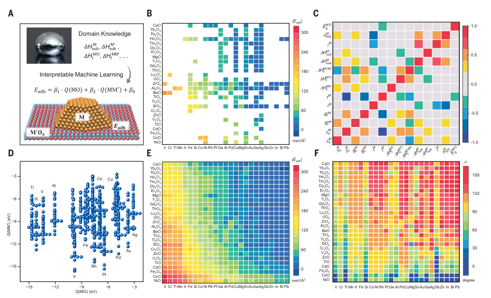
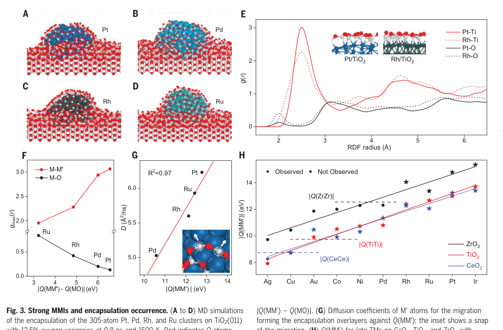

# Nature of metal-support interaction for metal catalysts on oxide supports

## Reading prompts / 阅读提示

- **English:** Read each source block with its Chinese counterpart; figures and tables remain attached to their original captions.
- **中文：** 请将每一原文块与其中文译文对应阅读；图和表保留原始图注并放在相关正文附近。

## Terminology ledger / 术语表

- **English:** Technical terms, symbols, formulae, units and citation markers retain the source notation.
- **中文：** 技术术语、符号、化学式、单位和引文标记均保留原文记法。

## Full bilingual reader / 全文中英文对照

## Article information / 文章信息

**Source:** p.1 S001

**Original:** CORRECTED 13 DECEMBER 2024; SEE LAST PAGE

**中文:** 2024 年 12 月 13 日更正；查看最后一页

**Source:** p.1 S002

**Original:** RESEARCH

**中文:** 研究

**Source:** p.1 S003

**Original:** CATALYSIS Nature of metal-support interaction for metal catalysts on oxide supports

**中文:** 催化 氧化物载体上金属催化剂的金属-载体相互作用的性质

**Source:** p.1 S004

**Original:** Tairan Wang1†‡, Jianyu Hu2†, Runhai Ouyang3†, Yutao Wang1, Yi Huang4, Sulei Hu2, Wei-Xue Li1,5*

**中文:** 王泰然1†‡、胡建宇2†、欧阳润海3†、王玉涛1、黄毅4、胡苏蕾2、李伟雪1,5*

**Source:** p.1 S005

**Original:** The metal-support interaction is one of the most important pillars in heterogeneous catalysis, but developing a fundamental theory has been challenging because of the intricate interfaces. Based on experimental data, interpretable machine learning, theoretical derivation, and first-principles simulations, we established a general theory of metal-oxide interactions grounded in metal-metal and metal-oxygen interactions. The theory applies to metal nanoparticles and atoms on oxide supports and oxide films on metal supports. We found that for late-transition metal catalysts, metal-metal interactions dominated the oxide support effects and suboxide encapsulation over metal nanoparticles. A principle of strong metal-metal interactions for encapsulation occurrence is formulated and substantiated by extensive experiments including 10 metals and 16 oxides. The valuable insights revealed on (strong) metal-support interaction advance the interfacial design of supported metal catalysts. O

**中文:** 金属-载体相互作用是多相催化中最重要的支柱之一，但由于其复杂的界面，发展基础理论一直具有挑战性。基于实验数据、可解释的机器学习、理论推导和第一原理模拟，我们建立了基于金属-金属和金属-氧相互作用的金属-氧化物相互作用的一般理论。该理论适用于氧化物载体上的金属纳米粒子和原子以及金属载体上的氧化膜。我们发现，对于后过渡金属催化剂，金属-金属相互作用主导了氧化物载体效应和金属纳米颗粒上的低氧化物封装。通过包括 10 种金属和 16 种氧化物在内的大量实验，制定并证实了发生封装的强金属-金属相互作用的原理。关于（强）金属-载体相互作用的宝贵见解推动了负载型金属催化剂的界面设计。氧

**Source:** p.1 S006

**Original:** supported metal nanoparticles (NPs) by suboxide layers at elevated temperatures (15), have received much attention recently and have been thought of as the origin of many prominent interfacial processes (16). However, fundamental questions remain about the nature of MSIs and SMSIs and their influence on interfacial processes in general and encapsulation in particular (17). To quantify MSIs, numerous descriptors have been proposed through experimental and symbolic regression approaches (18, 19) such as metal oxophilicity (20), metal surface energy (21), and electron density (22). Moreover, the presence of metal-metal bonding in metal-oxide interfaces has also been observed (15, 18, 23, 24). However, developing a comprehensive theory of MSIs for metal catalysts on oxide supports remains a major challenge in heterogeneous catalysis. Here, we used experimental data, interpretable machine learning (25, 26), theoretical derivation, and first-principles simulations to establish a general theory of MSIs grounded in metal-metal interactions (MMIs) and metal-oxygen interactions (MOIs). Specifically, advanced symbolic regression (27) was used on 178 experimentally determined interfacial adhesion energies between metal NPs and oxide supports from the literature, leading to the discovery of a predictive formula for MSIs. This formula is derivable under the nearest-neighbor approximation and is generalizable to other interfacial systems of oxidesupported metal atoms and metal-supported oxide films, as demonstrated by density functional theory (DFT) calculations. We found that for supported late TM catalysts, the differences in MMIs determine the support effects that distinguish the MSI strengths from different oxides, although the MOI becomes dominant to the MSI when considering other metals. Molecular dynamics (MD) simulations using global neural network potentials (28) revealed that strong MMI not only

**中文:** 在高温下由低氧化物层支撑的金属纳米颗粒 (NP) (15) 最近受到广泛关注，并被认为是许多重要界面过程的起源 (16)。然而，关于 MSI 和 SMSI 的性质及其对一般界面过程（特别是封装）的影响仍然存在基本问题 (17)。为了量化 MSI，通过实验和符号回归方法 (18, 19) 提出了许多描述符，例如金属亲氧性 (20)、金属表面能 (21) 和电子密度 (22)。此外，还观察到金属-氧化物界面中存在金属-金属键合(15,18,23,24)。然而，开发氧化物载体上金属催化剂的 MSI 综合理论仍然是多相催化中的主要挑战。在这里，我们使用实验数据、可解释的机器学习 (25, 26)、理论推导和第一原理模拟来建立基于金属-金属相互作用 (MMI) 和金属-氧相互作用 (MOI) 的 MSI 通用理论。具体来说，先进的符号回归 (27) 被用于文献中 178 个通过实验确定的金属纳米粒子和氧化物载体之间的界面粘附能，从而发现了 MSI 的预测公式。该公式可在最近邻近似下推导，并且可推广到氧化物支撑的金属原子和金属支撑的氧化物薄膜的其他界面系统，如密度泛函理论（DFT）计算所证明的。我们发现，对于负载型晚期 TM 催化剂，MMI 的差异决定了区分不同氧化物的 MSI 强度的负载效应，尽管在考虑其他金属时 MOI 对 MSI 起主导作用。使用全局神经网络势的分子动力学 (MD) 模拟 (28) 表明，强 MMI 不仅

**Source:** p.1 S007

**Original:** xide-supported transition metal (TM) catalysts are essential for petrochemical refining and industrial chemical manufacturing, as well as for environmental control systems such as exhaust catalysts (1). How metals interact with gaseous reactants and support underneath, i.e., metalreactant interactions (MRIs) and metal-support interactions (MSIs), are two cornerstones of supported metal catalysts (2, 3). Whereas MRI determines activity and selectivity (4), MSI helps to stabilize dispersed catalysts (5, 6) and affects interfacial processes such as charge transfer, chemical composition, perimeter sites, particle morphology, and suboxide encapsulation (7, 8). Modulation of MSIs is thus one of the few strategies for enhancing the catalyst performance (9). Despite the critical role of MSIs in many catalytic properties (10), including sintering resistance (11), MSIs can be difficult to characterize because they are sensitive to the composition of metals and supports (12, 13) and change substantially with corresponding size and morphology, preparations and reaction conditions, among other things (14). These complexities substantially limit the investigation of structure-function relations. For example, strong MSIs (SMSIs), which were originally used to describe the encapsulation of

**中文:** 氧化物负载的过渡金属 (TM) 催化剂对于石化精炼和工业化学品制造以及废气催化剂等环境控制系统至关重要 (1)。金属如何与气态反应物和下面的载体相互作用，即金属反应物相互作用 (MRI) 和金属-载体相互作用 (MSI)，是负载型金属催化剂的两个基石 (2, 3)。 MRI 确定活性和选择性 (4)，而 MSI 有助于稳定分散的催化剂 (5, 6) 并影响界面过程，例如电荷转移、化学成分、周边位点、颗粒形态和低氧化物封装 (7, 8)。因此，调节 MSI 是增强催化剂性能的少数策略之一 (9)。尽管 MSI 在许多催化性能 (1​​0) 中发挥着关键作用，包括抗烧结性 (11)，但 MSI 可能难以表征，因为它们对金属和载体的组成敏感 (12, 13)，并且会随着相应的尺寸和形态、制备和反应条件等而发生显着变化 (14)。这些复杂性极大地限制了结构-功能关系的研究。例如强MSI（SMSI），最初是用来描述对

**Source:** p.1 S008

**Original:** 1Key Laboratory of Precision and Intelligent Chemistry, School of Chemistry and Materials Science, iChEM, University of Science and Technology of China, Hefei, China. 2Hefei National Research Center for Physical Sciences at the Microscale, University of Science and Technology of China, Hefei, China. 3Materials Genome Institute, Shanghai University, Shanghai, China. 4School of Emerging Technology, University of Science and Technology of China, Hefei, Anhui, China. 5Hefei National Laboratory, University of Science and Technology of China, Hefei, Anhui, China. *Corresponding author. Email: wxli70@ustc.edu.cn †These authors contributed equally to this work. ‡Present address: Tairan Wang Clean Energy Research Platform, King Abdullah University of Science and Technology (KAUST), Thuwal, Kingdom of Saudi Arabia.

**中文:** 1中国科学技术大学化学与材料科学学院精密与智能化学重点实验室，中国合肥2中国科学技术大学合肥国家微尺度物质科学研究中心，中国合肥。 3上海大学材料基因组研究所，上海，中国。 4中国科学技术大学新兴技术学院，安徽合肥。 5中国科学技术大学合肥国家实验室，中国安徽合肥。 *通讯作者。电子邮件：wxli70@ustc.edu.cn †这些作者对这项工作做出了同等贡献。 ‡目前地址：沙特阿拉伯王国图瓦尔阿卜杜拉国王科技大学 (KAUST) Tairan Wang 清洁能源研究平台。

**Source:** p.1 S009

**Original:** promotes the formation of metal-metal bonds across the encapsulation interface, but also controls the encapsulation kinetics. Thus, we formulated a principle that strong MMIs, rather than strong oxophilic MSIs, determine whether encapsulation occurs, which is substantiated by extensive experiments including 10 late TMs and 16 oxides. The theory provides a comprehensive framework for understanding MSIs and SMSIs and various interfacial processes, which will advance the precise design of metal catalysts on supports.

**中文:** 促进跨封装界面金属-金属键的形成，同时也控制封装动力学。因此，我们制定了一个原则，即强 MMI，而不是强亲氧 MSI，决定是否发生封装，这一点通过包括 10 个晚期 TM 和 16 个氧化物在内的大量实验得到证实。该理论为理解MSI和SMSI以及各种界面过程提供了一个全面的框架，这将促进载体上金属催化剂的精确设计。

**Source:** p.1 S010

**Original:** Formula of MSIs

**中文:** MSI 的公式

**Source:** p.1 S011

**Original:** We used the sure independence screening and sparsifying operator (SISSO) (27) to determine the functional form of MSIs (Fig. 1A). Specifically, the adhesion energy Eadh between metal nanoparticles and oxide supports, a critical variable for quantifying MSIs, was compiled from reported experimental values that encompassed 178 metal-oxide interfaces across 25 metals and 27 oxides (Fig. 1B and table S1). To ensure data reliability, the collected data were obtained from the consistent sessile-drop method for liquid metal particles on oxides in wetting experiments, and the influence of the surface cleanness was reported and discussed previously (20). To find the physical MSI model, we leverage symbolic regression by considering all possible physical quantities relevant to the metal-oxide interface as primary features (50 in total and listed in table S2). Many of them were proposed as descriptors of MSIs (18–22). After removing redundant ones through backward elimination and cross-validation, 14 highly independent and important features were retained, and their correlations are presented as Pearson similarities (Fig. 1C). A comprehensive exploration of >30 billion mathematical expressions was conducted by integrating these distilled features using simple mathematic operators to ensure model interpretability without compromising accuracy. Through compressed sensing, an optimal two-dimensional model was identified. Further increasing the complexity would enhance training accuracy, but at the cost of interpretability and generalizability, as detailed in the supplementary materials. The developed model exhibited excellent performance on the test dataset with a root mean square error of 14 meV/Å2 (fig. S1), which is comparable to experimental uncertainty (ranging from 6 to 19 meV/Å2) (29) and outperforms neural network models (fig. S2) and previous descriptors (table S4). The obtained MSI model is composed of the MOI and MMI terms:

**中文:** 我们使用确定独立筛选和稀疏算子 (SISSO) (27) 来确定 MSI 的函数形式（图 1A）。具体来说，金属纳米颗粒和氧化物载体之间的粘附能Eadh是量化MSI的关键变量，它是根据报告的实验值编译的，这些实验值涵盖25种金属和27种氧化物的178个金属氧化物界面（图1B和表S1）。为了确保数据可靠性，收集的数据是通过润湿实验中液态金属颗粒在氧化物上的一致座滴法获得的，并且之前报告和讨论了表面清洁度的影响（20）。为了找到物理 MSI 模型，我们利用符号回归，将与金属氧化物界面相关的所有可能的物理量视为主要特征（总共 50 个，列在表 S2 中）。其中许多被提议作为 MSI 的描述符 (18-22)。通过向后消除和交叉验证去除冗余特征后，保留了14个高度独立且重要的特征，它们的相关性以皮尔逊相似度表示（图1C）。通过使用简单的数学运算符集成这些提取的特征，对超过 300 亿个数学表达式进行了全面探索，以确保模型的可解释性而不影响准确性。通过压缩感知，确定了最佳的二维模型。进一步增加复杂性将提高训练准确性，但代价是可解释性和概括性，如补充材料中详述。开发的模型在测试数据集上表现出优异的性能，均方根误差为 14 meV/Å2（图 S1），与实验不确定性（范围从 6 到 19 meV/Å2）相当（29），并且优于神经网络模型（图 S2）和之前的描述符（表 S4）。得到的MSI模型由MOI和MMI项组成：

**Source:** p.1 S012

**Original:** Downloaded from https://www.science.org on December 15, 2024

**中文:** 2024 年 12 月 15 日从 https://www.science.org 下载

**Source:** p.1 S013

**Original:** Eadh = b1 • Q(MO) + b2 • Q(MM′) + b0 (1)

**中文:** Eadh = b1 • Q(MO) + b2 • Q(MM′) + b0 (1)

**Source:** p.1 S014

**Original:** with

**中文:** 和

**Source:** p.1 S015

**Original:** Wang et al., Science 386, 915–920 (2024) 22 November 2024 1 of 6

**中文:** Wang 等人，Science 386, 915–920 (2024) 2024 年 11 月 22 日 1 of 6

**Source:** p.2 S016

**Original:** RESEARCH | RESEARCH ARTICLE

**中文:** 研究|研究文章

**Source:** p.2 S017

**Original:** A

**中文:** 一个

**Source:** p.2 S018

**Original:** C B

**中文:** CB

**Source:** p.2 S019

**Original:** V Cr Ti Mn Ir Fe Si Co Ni Rh Pt Ge Al PdCuMgSnAuGaAgSbZn In Bi Pb NiO CoO Fe3O4 CdO TiO V2O5 ZnO Cr2O3 SiO2 Ti2O3 TiO2 BeO Al2O3 ZrO2 UO2 Lu2O3 ThO2 Gd2O3 Y2O3 MgO Er2O3 Dy2O3 Tm2O3 Ho2O3 Tb2O3 Yb2O3 CaO

**中文:** V Cr Ti Mn Ir Fe Si Co Ni Rh Pt Ge Al PdCuMgSnAuGaAgSbZn In Bi Pb NiO CoO Fe3O4 CdO TiO V2O5 ZnO Cr2O3 SiO2 Ti2O3 TiO2 BeO Al2O3 ZrO2 UO2 Lu2O3 ThO2 Gd2O3 Y2O3 MgO Er2O3 Dy2O3 Tm2O3 Ho2O3 Tb2O3 Yb2O3 CaO

**Source:** p.2 S020

**Original:** Domain Knowledge

**中文:** 领域知识

**Source:** p.2 S021

**Original:** H M sub, H M' sub ,

**中文:** H M 子、H M' 子、

**Source:** p.2 S022

**Original:** H MO f , H MM' f , …

**中文:** H MO f , H MM' f , …

**Source:** p.2 S023

**Original:** Interpretable Machine Learning ng

**中文:** 可解释的机器学习

**Source:** p.2 S024

**Original:** M

**中文:** 中号

**Source:** p.2 S025

**Original:** M

**中文:** 中号

**Source:** p.2 S026

**Original:** M

**中文:** 中号

**Source:** p.2 S027

**Original:** D

**中文:** D

**Source:** p.2 S028

**Original:** E F

**中文:** EF

**Source:** p.2 S029

**Original:** V Cr Ti Mn Ir Fe Si Co Ni Rh Pt Ge Al PdCuMgSnAuGaAgSbZn In Bi Pb NiO CoO Fe3O4 CdO TiO V2O5 ZnO Cr2O3 SiO2 Ti2O3 TiO2 BeO Al2O3 ZrO2 UO2 Lu2O3 ThO2 Gd2O3 Y2O3 MgO Er2O3 Dy2O3 Tm2O3 Ho2O3 Tb2O3 Yb2O3 CaO

**中文:** V Cr Ti Mn Ir Fe Si Co Ni Rh Pt Ge Al PdCuMgSnAuGaAgSbZn In Bi Pb NiO CoO Fe3O4 CdO TiO V2O5 ZnO Cr2O3 SiO2 Ti2O3 TiO2 BeO Al2O3 ZrO2 UO2 Lu2O3 ThO2 Gd2O3 Y2O3 MgO Er2O3 Dy2O3 Tm2O3 Ho2O3 Tb2O3 Yb2O3 CaO

**Source:** p.2 S030

**Original:** −3

**中文:** −3

**Source:** p.2 S031

**Original:** Co

**中文:** 钴

**Source:** p.2 S032

**Original:** Cu

**中文:** 铜

**Source:** p.2 S033

**Original:** Al

**中文:** 铝

**Source:** p.2 S034

**Original:** Ti

**中文:** 钛

**Source:** p.2 S035

**Original:** V

**中文:** V

**Source:** p.2 S036

**Original:** −6

**中文:** −6

**Source:** p.2 S037

**Original:** Si

**中文:** 硅

**Source:** p.2 S038

**Original:** Q(MM') (eV)

**中文:** Q(MM') (eV)

**Source:** p.2 S039

**Original:** −9

**中文:** −9

**Source:** p.2 S040

**Original:** Ag

**中文:** 银

**Source:** p.2 S041

**Original:** −12

**中文:** −12

**Source:** p.2 S042

**Original:** Fe Au

**中文:** 铁金

**Source:** p.2 S043

**Original:** Pd

**中文:** 钯

**Source:** p.2 S044

**Original:** Rh

**中文:** 铑

**Source:** p.2 S045

**Original:** −15

**中文:** −15

**Source:** p.2 S046

**Original:** Pt

**中文:** 铂

**Source:** p.2 S047

**Original:** Ir

**中文:** 红外线

**Source:** p.2 S048

**Original:** −15 −12 −9 −6 −3

**中文:** −15 −12 −9 −6 −3

**Source:** p.2 S049

**Original:** Q(MO) (eV)

**中文:** Q(MO) (eV)

### Fig. 001

**Placed near:** p.2 S049
**Source:** p.2 C001

**Original caption:** Fig. 1. Formulation of the MSI model. (A) A derivable formula was identified through interpretable machine learning. (B) Collected experimental adhesion energies |Eadh| of metal-support systems from the literature (metals are shown on the x axis and supports on the y axis). (C) Pearson correlations between the selected 14 primary features. M denotes the element of supported metal and M′ refers to the metal in oxide. These features include Pauling electronegativity (cp), first ionization energy (IE), metallic radius of supported metal M (rM), Shannon ionic radius of metal M′ (rM′), formation enthalpy of most stable oxide

**中文图注:** 图 1. MSI 模型的制定。 (A) 通过可解释的机器学习确定了一个可推导的公式。 (B) 收集的实验粘附能 |Eadh|文献中的金属支撑系统（金属显示在 x 轴上，支撑显示在 y 轴上）。 (C) 所选 14 个主要特征之间的 Pearson 相关性。 M表示负载金属的元素，M'表示氧化物中的金属。这些特征包括鲍林电负性 (cp)、第一电离能 (IE)、负载金属的金属半径 M (rM)、金属的香农离子半径 M' (rM')、最稳定氧化物的形成焓

**Source:** p.2 S050

**Original:** when M tends to bond with M′ because of its high first ionization energy IEM and when M′ has weak bonding with oxygen or is in a low valence state with a low formation enthalpy of oxide support DHM′O f  . Q(MO) in Eq. 2 is the oxophilicity per mole of M, which reflects the oxygen affinity of the supported metal M, as previously introduced by Campbell and co-workers (20, 29), who discovered its linear correlation with adhesion energies. Q(MM′) is the formation enthalpy of the alloy per mole M and M′ from gaseous metal atoms, which reflects corresponding M′ affinity of M (see the supplementary materials). For example, the M′ affinity for Pd/TiO2 means the Ti affinity of Pd. Compared with DHMO f and DHMM f , Q(MO) and Q(MM′) incorporate characteristics of gas-phase metals in addition to bulk phase enthalpies, making them better at describing interfacial properties and MSIs, the relevance of which has been discussed in earlier works (10, 24). As shown in Fig. 1D, when M changes from early to late TMs on the

**中文:** 当M因其高第一电离能IEM而倾向于与M'键合时，以及当M'与氧键合较弱或处于氧化物载体DHM'O f 的低形成焓的低价态时。方程中的 Q(MO) 2 是每摩尔 M 的亲氧性，反映了负载金属 M 的氧亲和力，正如 Campbell 和同事 (20, 29) 先前介绍的那样，他们发现了它与粘附能的线性相关性。 Q(MM′)是气态金属原子每摩尔M和M′的合金形成焓，反映了M相应的M′亲和力（参见补充材料）。例如，Pd/TiO2的M'亲和力是指Pd的Ti亲和力。与 DHMO f 和 DHMM f 相比，Q(MO) 和 Q(MM′) 除了体相焓之外还结合了气相金属的特征，使它们能够更好地描述界面性质和 MSI，其相关性已在早期工作中讨论过 (10, 24)。如图 1D 所示，当 M 从早期 TM 变为晚期 TM 时

**Source:** p.2 S051

**Original:** Q MO ð Þ ¼ DHMO f  DHM sub;

**中文:** Q MO ð Þ ¼ DHMO f DHM sub;

**Source:** p.2 S052

**Original:** Q MM′ ð Þ ¼ DHMM′ f  DHM sub  DHM′ sub ð2Þ

**中文:** Q MM′ ð Þ ¼ DHMM′ f DHM sub DHM′ sub ð2Þ

**Source:** p.2 S053

**Original:** where M denotes the element of supported metal, M′ refers to the metal in oxide, DHMO f is the formation enthalpy of supported metal forming its most stable oxide, DHsub is the sublimation enthalpy, and DHMM′ f is the formation enthalpy of mixing M′ into M at infinite dilution and calculated based on Miedema’s model (30) (see the supplementary materials), where b0 = 16 meV/Å2, b1 ¼ c1  gM  cM′ p =cM p , and c1 = 9.85 × 10−2/eV. The ratio of Pauling electronegativity cM′ p =cM p shows the competitive bonding affinity of the two metal elements with oxygen, and systems with higher ratios are prone to having more interfacial M–O bonds. The surface energy of metal NPs, gM, is associated with van der Waals interfacial interactions, evident for weak MSIs (21), as depicted in fig. S3, where b2 ¼ c2  IEM=DHM′O f , c2 = 3.06 × 10−3/Å2. The magnitude of b2 is high

**中文:** 其中M表示负载金属的元素，M'指氧化物中的金属，DHMO f是负载金属形成其最稳定氧化物的生成热，DHsub是升华热，DHMM' f是M'无限稀释到M中混合的生成热，根据Miedema模型（30）计算（参见补充材料），其中b0 = 16 meV/Å2，b1 ¼ c1 gM cM′ p =cM p ，且 c1 = 9.85 × 10−2/eV。鲍林电负性之比 cM′ p =cM p 显示了两种金属元素与氧的竞争键合亲和力，比率较高的体系易于产生更多的界面 M-O 键。金属纳米粒子的表面能 gM 与范德华界面相互作用相关，这对于弱 MSI 很明显 (21)，如图 2 所示。 S3，其中 b2 1/4 c2 IEM=DHM′O f ，c2 = 3.06 × 10−3/Å2。 b2 的幅度很高

**Source:** p.2 S054

**Original:** |Eadh|

**中文:** |伊德|

**Source:** p.2 S055

**Original:** EM'O g

**中文:** EM'O g

**Source:** p.2 S056

**Original:** 1.0

**中文:** 1.0

**Source:** p.2 S057

**Original:** nM WS

**中文:** 毫瓦斯

**Source:** p.2 S058

**Original:** M

**中文:** 中号

**Source:** p.2 S059

**Original:** HM' sub

**中文:** HM'子

**Source:** p.2 S060

**Original:** 0.5

**中文:** 0.5

**Source:** p.2 S061

**Original:** HM sub

**中文:** HM子

**Source:** p.2 S062

**Original:** HM'(M) f

**中文:** HM'(M) f

**Source:** p.2 S063

**Original:** HM'O f

**中文:** HM'Of

**Source:** p.2 S064

**Original:** 0.0

**中文:** 0.0

**Source:** p.2 S065

**Original:** HMO f

**中文:** HMO f

**Source:** p.2 S066

**Original:** IEM IEM' rM rM'

**中文:** IEM IEM' rM rM'

**Source:** p.2 S067

**Original:** -0.5

**中文:** -0.5

**Source:** p.2 S068

**Original:** M' p

**中文:** 熔点

**Source:** p.2 S069

**Original:** M p

**中文:** 熔点

**Source:** p.2 S070

**Original:** meV/Å2

**中文:** 兆伏/Å2

**Source:** p.2 S071

**Original:** -1.0

**中文:** -1.0

**Source:** p.2 S072

**Original:** M

**中文:** 中号

**Source:** p.2 S073

**Original:** M p

**中文:** 熔点

**Source:** p.2 S074

**Original:** M' p IEM

**中文:** M'p IEM

**Source:** p.2 S075

**Original:** IEM'

**中文:** 入耳式耳机

**Source:** p.2 S076

**Original:** rM'

**中文:** rM'

**Source:** p.2 S077

**Original:** rM

**中文:** rM

**Source:** p.2 S078

**Original:** HMO f

**中文:** HMO f

**Source:** p.2 S079

**Original:** nM WS EM'O g

**中文:** nM WS EM'O g

**Source:** p.2 S080

**Original:** HM'O f

**中文:** HM'Of

**Source:** p.2 S081

**Original:** HM'(M) f

**中文:** HM'(M) f

**Source:** p.2 S082

**Original:** HM' sub

**中文:** HM'子

**Source:** p.2 S083

**Original:** HM sub

**中文:** HM子

**Source:** p.2 S084

**Original:** |Eadh|

**中文:** |伊德|

**Source:** p.2 S085

**Original:** NiO CoO Fe3O4 CdO TiO ZnO V2O5 Cr2O3 SiO2 Ti2O3 TiO2 BeO Al2O3 ZrO2 UO2 Lu2O3 ThO2 Gd2O3 Y2O3 MgO Er2O3 Dy2O3 Tm2O3 Ho2O3 Tb2O3 Yb2O3 CaO

**中文:** NiO CoO Fe3O4 CdO TiO ZnO V2O5 Cr2O3 SiO2 Ti2O3 TiO2 BeO Al2O3 ZrO2 UO2 Lu2O3 ThO2 Gd2O3 Y2O3 MgO Er2O3 Dy2O3 Tm2O3 Ho2O3 Tb2O3 Yb2O3 CaO

**Source:** p.2 S086

**Original:** Downloaded from https://www.science.org on December 15, 2024

**中文:** 2024 年 12 月 15 日从 https://www.science.org 下载

**Source:** p.2 S087

**Original:** meV/Å2

**中文:** 兆伏/Å2

**Source:** p.2 S088

**Original:** degree

**中文:** 程度

**Source:** p.2 S089

**Original:** V Cr Ti Mn Ir Fe Si Co Ni Rh Pt Ge Al PdCuMgSnAuGaAgSbZn In Bi Pb

**中文:** V Cr Ti Mn Ir Fe Si Co Ni Rh Pt Ge Al PdCuMgSnAuGaAgSbZn In Bi Pb

**Source:** p.2 S090

**Original:** of M (DHMO f ), formation enthalpy of oxide (DHM′O f ), formation enthalpy of mixing

**中文:** M (DHMO f )、氧化物生成焓 (DHM′O f )、混合生成焓

**Source:** p.2 S091

**Original:** at infinite dilution of unit M′ in M (DHMM′ f ), sublimation enthalpy (DHsub), surface energy of M (gM), electron density at the boundary of the Wigner-Seitz cell (nWS), and bandgap energy of oxide (EM′O g ). (D) The descriptors Q(MO) and Q(MM′),

**中文:** 单位 M′ 在 M 中的无限稀释 (DHMM′ f )、升华焓 (DHsub)、M 的表面能 (gM)、维格纳-塞茨池边界处的电子密度 (nWS) 和氧化物的带隙能 (EM′O g )。 (D) 描述符 Q(MO) 和 Q(MM′)，

**Source:** p.2 S092

**Original:** representing the oxophilicity and M′ affinity of M, respectively, for the considered systems. (E) Recovered image of (B) by filling out the white spots with |Eadh| predicted by Eq. 1. (F) Predicted contact angles a of all the 675 metal-oxide interfaces.

**中文:** 分别代表所考虑系统的 M 的亲氧性和 M' 亲和力。 (E) 通过用 |Eadh| 填充白点来恢复 (B) 的图像由方程预测1. (F) 所有 675 个金属氧化物界面的预测接触角 a。

**Source:** p.2 S093

**Original:** same oxide, the corresponding Q(MO) varies over a range of 12 eV, which is about twice the range of Q(MM′) for the same metal on different oxides. However, for late TMs, the corresponding |Q(MO)| becomes smaller, particularly for coinage metals, which are <5.1 eV. By contrast, |Q(MM′)| of late TMs becomes considerably strong up to 15.6 eV, indicating that MMIs may play a significant role in corresponding MSIs. Explicit description of MSIs allows us to “recover” all missing Eadh in Fig. 1B. As plotted in Fig. 1E, adhesion increase from the weakest of nearly zero at the upper right to the strongest of 309 meV/Å2 at the lower left. Systems with weak adhesion typically are less-reactive coinage metals and p-block metals supported on irreducible oxides. Conversely, interfaces exhibiting strong adhesion generally feature early TMs. For late TMs, the corresponding |Eadh| depend sensitively on supports, varying from a weak adhesion of 3 meV/Å2 to a strong adhesion of 241 meV/Å2, which indicates the importance of support effects.

**中文:** 对于相同的氧化物，相应的 Q(MO) 在 12 eV 的范围内变化，这大约是不同氧化物上相同金属的 Q(MM') 范围的两倍。然而，对于晚期 TM，相应的 |Q(MO)|变得更小，特别是对于 <5.1 eV 的造币金属。相比之下，|Q(MM′)|晚期 TM 的强度变得相当强，高达 15.6 eV，表明 MMI 可能在相应的 MSI 中发挥重要作用。 MSI 的显式描述使我们能够“恢复”图 1B 中所有丢失的 Eadh。如图 1E 所示，粘附力从右上方最弱的接近零增加到左下角最强的 309 meV/Å2。具有弱粘附力的系统通常是反应性较低的造币金属和负载在不可还原氧化物上的 p 区金属。相反，表现出强粘附力的界面通常具有早期 TM 的特征。对于晚期 TM，相应的 |Eadh|敏感地依赖于支撑物，从 3 meV/Å2 的弱粘附到 241 meV/Å2 的强粘附，这表明支撑效应的重要性。

**Source:** p.2 S094

**Original:** Wang et al., Science 386, 915–920 (2024) 22 November 2024 2 of 6

**中文:** Wang 等人，Science 386, 915–920 (2024) 2024 年 11 月 22 日 2 of 6

**Source:** p.3 S095

**Original:** RESEARCH | RESEARCH ARTICLE

**中文:** 研究|研究文章

**Source:** p.3 S096

**Original:** A

**中文:** 一个

**Source:** p.3 S097

**Original:** 150 Ag Pd Rh Co Fe

**中文:** 150银钯铑钴铁

**Source:** p.3 S098

**Original:** | 2·Q(MM')| (meV/Å2)

**中文:** | 2·Q(MM')| (meV/Å2)

**Source:** p.3 S099

**Original:** Pt/Fe3O4

**中文:** 铂/四氧化三铁

**Source:** p.3 S100

**Original:** Au/TiO

**中文:** 金/二氧化钛

**Source:** p.3 S101

**Original:** Au/Ti2O3 Au/TiO2

**中文:** Au/Ti2O3 Au/TiO2

**Source:** p.3 S102

**Original:** 0 30 60 90 120 150 180 210 240 270 300

**中文:** 0 30 60 90 120 150 180 210 240 270 300

**Source:** p.3 S103

**Original:** | 1·Q(MO)| (meV/Å2)

**中文:** | 1·Q(MO)| (meV/Å2)

**Source:** p.3 S104

**Original:** C D E

**中文:** 东德

**Source:** p.3 S105

**Original:** 0.0

**中文:** 0.0

**Source:** p.3 S106

**Original:** TiO2 (110) ZrO2 (110) SiO2 (110)

**中文:** TiO2 (110) ZrO2 (110) SiO2 (110)

**Source:** p.3 S107

**Original:** TiO2 (110) ZrO2 (110) SiO2 (110)

**中文:** TiO2 (110) ZrO2 (110) SiO2 (110)

**Source:** p.3 S108

**Original:** −0.5

**中文:** −0.5

**Source:** p.3 S109

**Original:** R2 = 0.84

**中文:** R2=0.84

**Source:** p.3 S110

**Original:** R2 = 0.92

**中文:** R2=0.92

**Source:** p.3 S111

**Original:** −2

**中文:** −2

**Source:** p.3 S112

**Original:** −1.0

**中文:** −1.0

**Source:** p.3 S113

**Original:** Eads (eV)

**中文:** 伊兹 (eV)

**Source:** p.3 S114

**Original:** Eads (eV)

**中文:** 伊兹 (eV)

**Source:** p.3 S115

**Original:** −1.5

**中文:** −1.5

**Source:** p.3 S116

**Original:** −4

**中文:** −4

**Source:** p.3 S117

**Original:** −2.0

**中文:** −2.0

**Source:** p.3 S118

**Original:** Metal site

**中文:** 金属场地

**Source:** p.3 S119

**Original:** −2.5

**中文:** −2.5

**Source:** p.3 S120

**Original:** −5 −4 −3 −2 −1 0 −6

**中文:** −5 −4 −3 −2 −1 0 −6

**Source:** p.3 S121

**Original:** −16 −14 −12 −10 −8

**中文:** −16 −14 −12 −10 −8

**Source:** p.3 S122

**Original:** a·Q(MO) + b·Q(MM') (eV)

**中文:** a·Q(MO) + b·Q(MM') (eV)

**Source:** p.3 S123

**Original:** Q(MM') (eV)

**中文:** Q(MM') (eV)

### Fig. 002

**Placed near:** p.3 S123
**Source:** p.3 C002

**Original caption:** Fig. 2. Nature of the MSIs and applications in different interfacial systems. (A) Distribution of metal-oxide systems within the two-dimensional space spanned by |b2 • Q(MM′)| and |b1 • Q(MO)| for all considered metal-oxide systems. Contour lines denote increments of |Eadh| calculated by the model at the step of 60 meV/Å2. Selected catalytic systems of interest are highlighted with distinct colors and annotations. (B) Correlation between adsorption energy Eads of metal atoms bonding only to oxygen atoms of rutile TiO2(110), ZrO2(110), and SiO2(110)

**中文图注:** 图 2. MSI 的性质及其在不同界面系统中的应用。 (A) 金属氧化物系统在 |b2 • Q(MM′)| 所跨越的二维空间内的分布和 |b1 • Q(MO)|适用于所有考虑的金属氧化物系统。等高线表示 |Eadh| 的增量由模型以 60 meV/Å2 的步长计算。选定的感兴趣的催化系统用不同的颜色和注释突出显示。 (B) 金红石TiO2(110)、ZrO2(110)、SiO2(110)仅与氧原子键合的金属原子吸附能Eads之间的相关性

**Source:** p.3 S124

**Original:** termined by nearest-neighbor bonding across the interface, the formula can be derived analytically, as detailed in the supplementary materials. The derived equation is Eadh = a1 • Q(MO) + a2 • Q(MM′) + a0, where a1 and a2 are quantities specifying the number of interfacial metal-oxygen and metal-metal bonds per area units, corresponding to b1 and b2 in Eq. 1, and a0 includes all other uncounted effects. The consistency between the data-driven and derived formulas justifies the physics underlined by MOIs and MMIs, and the data-driven one is versatile in describing realistic metaloxide interfaces. Integration of MOIs and MMIs enabled us to disentangle their contributions to the overall MSIs. As plotted in Fig. 2A, the former varies up to ~240 meV/Å2, twice as large as the range of the latter. In 66% of the 675 metaloxide combinations, the MOI term was greater than the MMI term. The differences between

**中文:** 由界面上的最近邻键合终止，可以通过分析推导出该公式，如补充材料中详述。推导出的方程为Eadh = a1·Q(MO) + a2·Q(MM′) + a0，其中a1和a2是指定单位面积内界面金属-氧和金属-金属键数量的量，对应于方程式中的b1和b2。 1，a0 包括所有其他未计数的效应。数据驱动公式和派生公式之间的一致性证明了 MOI 和 MMI 所强调的物理学的合理性，并且数据驱动公式在描述现实金属氧化物界面方面具有多种用途。 MOI 和 MMI 的整合使我们能够理清它们对整体 MSI 的贡献。如图 2A 所示，前者的变化范围高达约 240 meV/Å2，是后者范围的两倍。在 675 种金属氧化物组合中，有 66% 的 MOI 项大于 MMI 项。之间的差异

**Source:** p.3 S125

**Original:** The full recovery of Eadh makes it possible to predictthe contact anglea and thus the stability of all these oxide-supported metal NPs against thermal sintering. Specifically, when MSI is neither toostrongnortooweakand hasanoptimum a of ~90°, the maximum thermal stability could be approached (11). Based on the Young–Dupré equation of |Eadh| = gM(1 + cosa), corresponding a of 675 metal-oxide interfaces considered were calculated (Fig. 1F). For group VIII metals on various supports considered, a mainly ranged from 80° to 120°, i.e., near the optimal a. By contrast, coinage metals exhibited weaker MSIs, with most a exceeding 120°, and thus were prone to sintering, which could be mitigated by enhancing MSIs (31, 32).

**中文:** Eadh 的完全恢复使得可以预测接触角a，从而预测所有这些氧化物负载的金属纳米粒子对热烧结的稳定性。具体来说，当 MSI 既不太强也不太弱并且最佳 a 约为 90° 时，可以接近最大热稳定性 (11)。基于 |Eadh| 的 Young-Dupré 方程= gM(1 + cosa)，计算了所考虑的 675 个金属氧化物界面的相应 a（图 1F）。对于所考虑的各种载体上的第 VIII 族金属，a 主要在 80° 至 120° 范围内，即接近最佳 a。相比之下，造币金属表现出较弱的 MSI，大多数超过 120°，因此易于烧结，这可以通过增强 MSI 来缓解 (31, 32)。

**Source:** p.3 S126

**Original:** Nature of MSIs

**中文:** MSI 的性质

**Source:** p.3 S127

**Original:** The above results show that MSIs are determined by the short-range MOI and MMI terms. In fact, under the assumption that MSI is de-

**中文:** 上述结果表明，MSI 由短程 MOI 和 MMI 项决定。事实上，在 MSI 被取消的假设下

**Source:** p.3 S128

**Original:** B

**中文:** 乙

**Source:** p.3 S129

**Original:** Au Cu Pt Ir Ni Others

**中文:** 金铜铂铱镍其他

**Source:** p.3 S130

**Original:** Au Pd

**中文:** 金钯

**Source:** p.3 S131

**Original:** TiO2 (110) ZrO2 (110) SiO2 (110)

**中文:** TiO2 (110) ZrO2 (110) SiO2 (110)

**Source:** p.3 S132

**Original:** Pt

**中文:** 铂

**Source:** p.3 S133

**Original:** Rh

**中文:** 铑

**Source:** p.3 S134

**Original:** Fe

**中文:** 铁

**Source:** p.3 S135

**Original:** Ir Ag

**中文:** 银离子

**Source:** p.3 S136

**Original:** R2 = 0.86

**中文:** R2=0.86

**Source:** p.3 S137

**Original:** -2

**中文:** -2

**Source:** p.3 S138

**Original:** Eads (eV)

**中文:** 伊兹 (eV)

**Source:** p.3 S139

**Original:** Cu

**中文:** 铜

**Source:** p.3 S140

**Original:** Ni

**中文:** 镍

**Source:** p.3 S141

**Original:** Mn

**中文:** 锰

**Source:** p.3 S142

**Original:** -4

**中文:** -4

**Source:** p.3 S143

**Original:** V

**中文:** V

**Source:** p.3 S144

**Original:** -6

**中文:** -6

**Source:** p.3 S145

**Original:** Oxygen site

**中文:** 氧气站点

**Source:** p.3 S146

**Original:** -16 -14 -12 -10 -8 -6 -4 -2

**中文:** -16 -14 -12 -10 -8 -6 -4 -2

**Source:** p.3 S147

**Original:** Q(MO) (eV)

**中文:** Q(MO) (eV)

**Source:** p.3 S148

**Original:** -0.4

**中文:** -0.4

**Source:** p.3 S149

**Original:** Ag

**中文:** 银

**Source:** p.3 S150

**Original:** R2=0.92

**中文:** R2=0.92

**Source:** p.3 S151

**Original:** Au

**中文:** 金

**Source:** p.3 S152

**Original:** -0.8

**中文:** -0.8

**Source:** p.3 S153

**Original:** Eadh (eV/Fe)

**中文:** Eadh (eV/Fe)

**Source:** p.3 S154

**Original:** Downloaded from https://www.science.org on December 15, 2024

**中文:** 2024 年 12 月 15 日从 https://www.science.org 下载

**Source:** p.3 S155

**Original:** Cu

**中文:** 铜

**Source:** p.3 S156

**Original:** -1.2

**中文:** -1.2

**Source:** p.3 S157

**Original:** Pd

**中文:** 钯

**Source:** p.3 S158

**Original:** Ru

**中文:** 茹

**Source:** p.3 S159

**Original:** O Fe M

**中文:** 氧铁矿

**Source:** p.3 S160

**Original:** -1.6

**中文:** -1.6

**Source:** p.3 S161

**Original:** Ir Rh

**中文:** 铑铑

**Source:** p.3 S162

**Original:** Pt

**中文:** 铂

**Source:** p.3 S163

**Original:** Metal-oxygen site

**中文:** 金属-氧位点

**Source:** p.3 S164

**Original:** -2.0

**中文:** -2.0

**Source:** p.3 S165

**Original:** FeO film on metal

**中文:** 金属上的 FeO 薄膜

**Source:** p.3 S166

**Original:** -12 -10 -8 -6

**中文:** -12 -10 -8 -6

**Source:** p.3 S167

**Original:** Q(MM') (eV)

**中文:** Q(MM') (eV)

**Source:** p.3 S168

**Original:** surfaces against Q(MO), with schematic structures shown in insets. The equation for the fitted line is Eads = 0.47 • Q(MO) + 1.30 eV. (C) Eads of metal atoms bonding only to metal atoms of oxide surfaces against Q(MM′) with fitted Eads = 0.26 • Q(MM′) + 1.71 eV. (D) Eads of metal atoms bonding to both metal and oxygen atoms on oxide surfaces against Q(MO) and Q(MM′) with fitted Eads = 0.41 • Q(MO) + 0.03 • Q(MM′) + 1.00 eV. (E) Calculated Eadh (FeO–M) against Q(MM′) for the FeO(111)/M systems with fitted Eadh = 0.23 • Q(MM′) + 0.83 eV/Fe.

**中文:** Q(MO) 的表面，插图中显示了示意性结构。拟合线的方程为Eads = 0.47 • Q(MO) + 1.30 eV。 (C) 仅与氧化物表面的金属原子键合的金属原子的 Eads 相对于 Q(MM′)，拟合的 Eads = 0.26 • Q(MM′) + 1.71 eV。 (D) 与氧化物表面上的金属和氧原子键合的金属原子的 Eads 相对于 Q(MO) 和 Q(MM′)，拟合的 Eads = 0.41 • Q(MO) + 0.03 • Q(MM′) + 1.00 eV。 (E) 计算出 FeO(111)/M 系统的Eadh (FeO–M) 与Q(MM′) 的关系，拟合Eadh = 0.23 • Q(MM′) + 0.83 eV/Fe。

**Source:** p.3 S169

**Original:** the two terms could be large, as indicated in fig. S8. For instance, Ni/TiO2 and Fe/Al2O3 have large differences of 45 and 95 meV/Å2, and corresponding interfaces were primarily composed of metal-oxygen bonds (33, 34). Thus, MOIs dominate the overall strengths of MSIs, which differ greatly from one M to another, manifesting the composition effects of supported metals. However, the MMI term distinguishes the MSI of a metal catalyst on different metal oxides, manifesting the support effects. To show this, we examined Au NPs on various oxides. Although the MOI term for these systems was small and similar (~10 meV/Å2), the MMI term was considerable and varied greatly. Specifically, for Au NPs on TiO2, Ti2O3, and TiO sharing the same Q MM′ ð Þ j j, there was a gradual decrease in DHM′O f   and thus an increase in b2, which raises the adhesion energy from 13 to 30 to 49 meV/Å2. For one metal on oxides with

**中文:** 这两项可能很大，如图所示。 S8。例如，Ni/TiO2 和 Fe/Al2O3 的差异较大，分别为 45 和 95 meV/Å2，相应的界面主要由金属-氧键组成 (33, 34)。因此，MOI 主导了 MSI 的整体强度，每个 M 之间差异很大，体现了负载金属的成分效应。然而，MMI术语区分了金属催化剂在不同金属氧化物上的MSI，体现了负载效应。为了证明这一点，我们检查了各种氧化物上的金纳米粒子。尽管这些系统的 MOI 项很小且相似（~10 meV/Å2），但 MMI 项相当大且变化很大。具体来说，对于共享相同 Q MM′ ð Þ j j 的 TiO2、Ti2O3 和 TiO 上的 Au NP，DHM′O f 逐渐减少，因此 b2 增加，这将粘附能从 13 提高到 30 到 49 meV/Å2。对于氧化物上的一种金属

**Source:** p.3 S170

**Original:** Wang et al., Science 386, 915–920 (2024) 22 November 2024 3 of 6

**中文:** Wang 等人，Science 386, 915–920 (2024) 2024 年 11 月 22 日 3 of 6

**Source:** p.4 S171

**Original:** RESEARCH | RESEARCH ARTICLE

**中文:** 研究|研究文章

**Source:** p.4 S172

**Original:** A B

**中文:** 甲乙

**Source:** p.4 S173

**Original:** E

**中文:** 乙

**Source:** p.4 S174

**Original:** Pt

**中文:** 铂

**Source:** p.4 S175

**Original:** Pd

**中文:** 钯

**Source:** p.4 S176

**Original:** g(r)

**中文:** 克(r)

**Source:** p.4 S177

**Original:** C D

**中文:** 光盘

**Source:** p.4 S178

**Original:** Ru

**中文:** 茹

**Source:** p.4 S179

**Original:** Rh

**中文:** 铑

**Source:** p.4 S180

**Original:** F G H

**中文:** FGH

**Source:** p.4 S181

**Original:** M-M' M-O

**中文:** M-M' M-O

**Source:** p.4 S182

**Original:** R2=0.97

**中文:** R2=0.97

**Source:** p.4 S183

**Original:** 3.0

**中文:** 3.0

**Source:** p.4 S184

**Original:** Pt

**中文:** 铂

**Source:** p.4 S185

**Original:** 6.0

**中文:** 6.0

**Source:** p.4 S186

**Original:** Ru

**中文:** 茹

**Source:** p.4 S187

**Original:** 2.5

**中文:** 2.5

**Source:** p.4 S188

**Original:** |Q ) V e ( |)' M M (

**中文:** |Q ) V e ( |)' M M (

**Source:** p.4 S189

**Original:** D (Å2 ) s n /

**中文:** D (Å2 ) s n /

**Source:** p.4 S190

**Original:** Rh

**中文:** 铑

**Source:** p.4 S191

**Original:** g x a m (r)

**中文:** g x a m (r)

**Source:** p.4 S192

**Original:** 2.0

**中文:** 2.0

**Source:** p.4 S193

**Original:** 5.5

**中文:** 5.5

**Source:** p.4 S194

**Original:** Ru

**中文:** 茹

**Source:** p.4 S195

**Original:** Rh

**中文:** 铑

**Source:** p.4 S196

**Original:** Pd

**中文:** 钯

**Source:** p.4 S197

**Original:** 0.5

**中文:** 0.5

**Source:** p.4 S198

**Original:** Pd Pt

**中文:** 钯铂

**Source:** p.4 S199

**Original:** 5.0

**中文:** 5.0

**Source:** p.4 S200

**Original:** 3 4 5 6 0.0

**中文:** 3 4 5 6 0.0

**Source:** p.4 S201

**Original:** 10 11 12 13 14

**中文:** 10 11 12 13 14

**Source:** p.4 S202

**Original:** |Q(MM') | (eV)

**中文:** |Q(MM') | （电子伏特）

**Source:** p.4 S203

**Original:** |Q(MM') - Q(MO)| (eV)

**中文:** |Q(MM') - Q(MO)| （电子伏特）

### Fig. 003

**Placed near:** p.4 S203
**Source:** p.4 C003

**Original caption:** Fig. 3. Strong MMIs and encapsulation occurrence. (A to D) MD simulations of the encapsulation of the 305-atom Pt, Pd, Rh, and Ru clusters on TiO2(011) with 12.5% oxygen vacancies at 0.8 ns and 1500 K. Red indicates O atoms and gray Ti atoms; other colors indicate TM atoms. (E) RDF of M–M′and M–O bonds at the suboxide-encapsulated and oxide-supported metal interfaces for Pt/TiO2 and Rh/TiO2, with insets showing characteristic overlayer structures. (F) Intensity of the first peaks of M–M′ and M–O bonds in RDF against

**中文图注:** 图 3. 强 MMI 和封装发生。 (A 到 D) 在 0.8 ns 和 1500 K 下，305 个原子的 Pt、Pd、Rh 和 Ru 簇在 TiO2(011) 上封装的 MD 模拟，其中氧空位为 12.5%。红色表示 O 原子和灰色 Ti 原子；其他颜色表示TM原子。 (E) Pt/TiO2 和 Rh/TiO2 的低氧化物封装和氧化物支撑的金属界面处 M-M' 和 M-O 键的 RDF，插图显示特征覆盖层结构。 (F) RDF 中 M-M′ 和 M-O 键的第一个峰的强度

**Source:** p.4 S204

**Original:** different oxidant states, the lower the oxidant state, the stronger the MSI strength. For supported metal NPs, particularly coinage metals with weak oxophilic MSIs, this trend implies that exposing metal-rich surfaces or introducing more oxygen vacancies in supports can effectively strengthen MSIs (35, 36). For Pt on different oxides, although the MOI term increased up to 53 meV/Å2, the MMI term ranged from 30 to 120 meV/Å2. This comes in addition from substantial enhancement of |Q(MM′)| of Pt from 7.5 to 14.8 eV, showing the dominance of M′ affinity of late TM catalysts to MSI. Unlike particle adhesion, which necessitates features such as those in b1 and b2 to capture complex interfacial interactions, adsorptions of metal atoms on oxides could be described directly by Q(MO) and Q(MM′). We performed DFT calculations for adsorption energies Eads of late TM atoms on rutile TiO2(110), ZrO2(110), and SiO2(110) (see the supplementary materials). When M atoms are adsorbed at O–O bridge sites, bonding exclusively with surface O, Eads is a linear function of Q(MO) (Fig. 2B, R2 =

**中文:** 不同氧化态，氧化态越低，MSI强度越强。对于负载型金属纳米颗粒，特别是亲氧性 MSI 较弱的造币金属，这种趋势意味着暴露富金属表面或在载体中引入更多氧空位可以有效增强 MSI (35, 36)。对于不同氧化物上的 Pt，尽管 MOI 项增加至 53 meV/Å2，但 MMI 项范围为 30 至 120 meV/Å2。这还来自 |Q(MM′)| 的显着增强。 Pt 从 7.5 eV 到 14.8 eV，显示了后期 TM 催化剂对 MSI 的 M' 亲和力占主导地位。与颗粒粘附不同，颗粒粘附需要 b1 和 b2 中的特征来捕获复杂的界面相互作用，金属原子在氧化物上的吸附可以直接用 Q(MO) 和 Q(MM') 来描述。我们对金红石 TiO2(110)、ZrO2(110) 和 SiO2(110) 上晚期 TM 原子​​的吸附能 Eads 进行了 DFT 计算（参见补充材料）。当 M 原子吸附在 O-O 桥位处，仅与表面 O 结合时，Eads 是 Q(MO) 的线性函数（图 2B，R2 =

**Source:** p.4 S205

**Original:** 0.86). Similarly, for those at M′–M′ bridge sites, where only MMI exists, it is a linear function of Q(MM′) (Fig. 2C, R2 = 0.84). When atoms adsorb at O–M′ bridge sites, involving both MOI and MMI, Eads becomes a linear combination of Q(MO) and Q(MM′) (Fig. 2D, R2 = 0.92). The MSI theory can be further extended to metal-supported oxide films, which are often used as model systems for studying SMSIs and encapsulation (37). We studied the welldocumented FeO(111) bilayer film on closepacked late TMs (38) and calculated the Eadh between FeO and TMs (see the supplementary materials). The optimized structures based on realistic moiré superstructures by DFT (fig. S10) showed that the Fe layer directly bonds with TM substrates. This configuration suggests that interfacial adhesion is governed by the M–Fe bonding strengths, Q(MM′). The calculated Eadh should depend linearly on Q(MM′) (R2 = 0.92), as confirmed in Fig. 2E. In other words, the stronger the M′ affinity, the stronger the adhesion. Pt, Rh, Ir, Ru, and Pd exhibited strong adhesion, exceeding 1.24 eV/Fe atom

**中文:** 0.86）。类似地，对于 M′-M′ 桥位处的那些，仅存在 MMI，它是 Q(MM′) 的线性函数（图 2C，R2 = 0.84）。当原子吸附在 O-M' 桥位时，涉及 MOI 和 MMI，Eads 变成 Q(MO) 和 Q(MM') 的线性组合（图 2D，R2 = 0.92）。 MSI 理论可以进一步扩展到金属支撑的氧化物薄膜，这些薄膜通常用作研究 SMSIS 和封装的模型系统 (37)。我们研究了密堆积晚期 TM 上有据可查的 FeO(111) 双层薄膜 (38)，并计算了 FeO 和 TM 之间的 Eadh（参见补充材料）。基于真实莫尔超结构的 DFT 优化结构（图 S10）表明 Fe 层直接与 TM 基底结合。这种结构表明界面粘附力由 M-Fe 键合强度 Q(MM′) 控制。计算出的Eadh 应线性依赖于Q(MM′) (R2 = 0.92)，如图2E 所示。换句话说，M'亲和力越强，粘附力越强。 Pt、Rh、Ir、Ru、Pd 表现出很强的附着力，超过 1.24 eV/Fe 原子

**Source:** p.4 S206

**Original:** Pt-Ti Rh-Ti Pt-O Rh-O Rh/TiO2

**中文:** Pt-Ti Rh-Ti Pt-O Rh-O Rh/TiO2

**Source:** p.4 S207

**Original:** Pt/TiO2

**中文:** 铂/二氧化钛

**Source:** p.4 S208

**Original:** 2 3 4 5 6

**中文:** 2 3 4 5 6

**Source:** p.4 S209

**Original:** RDF radius (Å)

**中文:** RDF 半径 (Å)

**Source:** p.4 S210

**Original:** Observed Not Observed

**中文:** 观察到 未观察到

**Source:** p.4 S211

**Original:** |Q(ZrZr)|

**中文:** |Q(ZrZr)|

**Source:** p.4 S212

**Original:** Downloaded from https://www.science.org on December 15, 2024

**中文:** 2024 年 12 月 15 日从 https://www.science.org 下载

**Source:** p.4 S213

**Original:** ZrO2

**中文:** 氧化锆

**Source:** p.4 S214

**Original:** |Q(TiTi)|

**中文:** |Q(钛钛)|

**Source:** p.4 S215

**Original:** TiO2 CeO2

**中文:** 二氧化钛二氧化铈

**Source:** p.4 S216

**Original:** |Q(CeCe)|

**中文:** |Q(CeCe)|

**Source:** p.4 S217

**Original:** Ag Cu Au Co Ni Pd Rh Ru Pt Ir

**中文:** 银 铜 金 钴 镍 钯 铑 钌 铂 铱

**Source:** p.4 S218

**Original:** |Q(MM′) – Q(MO)|. (G) Diffusion coefficients of M′ atoms for the migration forming the encapsulation overlayers against Q(MM′); the inset shows a snap of the migration. (H) Q(MM′) for late TMs on CeO2, TiO2, and ZrO2 with corresponding M′ affinity of M′ in oxide, Q(M′M′) (horizontal dashed lines). Solid lines indicate guiding eyes; stars indicate systems with experimental encapsulation observations (data S5); and circles indicate systems that as yet have no observational evidence.

**中文:** |Q(MM′) – Q(MO)|。 (G) M'原子迁移形成封装覆盖层的扩散系数相对于 Q(MM')；插图显示了迁移的快照。 (H) Q(MM') 用于 CeO2、TiO2 和 ZrO2 上的晚期 TM，以及氧化物中 M' 的相应 M' 亲和力，Q(M'M')（水平虚线）。实线表示引导眼睛；星号表示具有实验封装观察结果的系统（数据S5）；圆圈表示尚未有观测证据的系统。

**Source:** p.4 S219

**Original:** (175 meV/Å2). In fact, encapsulation was found for those TM NPs supported on iron oxides, but not for other TM NPs (39), indicating the crucial role of strong M′ affinity of supported metal M in encapsulation, as further discussed below.

**中文:** (175 meV/Å2)。事实上，发现了负载在氧化铁上的 TM NP 的封装，但其他 TM NP 却没有发现封装 (39)，这表明负载金属 M 的强 M' 亲和力在封装中的关键作用，如下文进一步讨论。

**Source:** p.4 S220

**Original:** Principle of strong MMIs for encapsulation

**中文:** 强MMI封装原理

**Source:** p.4 S221

**Original:** The nature of classic SMSI and encapsulation can be explained with the above MSI theory. We used MD simulations to investigate classic SMSI systems of rutile TiO2(011)–supported 305-atom Pt, Pd, Rh, and Ru clusters (~3 nm in diameter) under elevated temperatures. The optimized a on pristine surfaces ranged from 106° to 122°, indicating that the corresponding MSIs were relatively weak. Cu and Ag were also considered for comparison. To model reduction conditions without including reductants explicitly, 12.5% oxygen vacancies were introduced (see the supplementary materials). For Pt, Pd, Rh, and Ru, with strong M′ affinity [|Q(MM′)| > 10.8 eV], migration of TiO2-x suboxide onto the metal NPs was observed during 0.8-ns simulations, and the encapsulation overlayer

**中文:** 经典SMSI和封装的本质可以用上面的MSI理论来解释。我们使用 MD 模拟研究了高温下金红石 TiO2(011) 支撑的 305 个原子 Pt、Pd、Rh 和 Ru 簇（直径约 3 nm）的经典 SMSI 系统。原始表面上的优化α范围为106°至122°，表明相应的MSI相对较弱。铜和银也被考虑进行比较。为了在不明确包含还原剂的情况下模拟还原条件，引入了 12.5% 的氧空位（参见补充材料）。对于 Pt、Pd、Rh 和 Ru，具有强 M′ 亲和力 [|Q(MM′)| > 10.8 eV]，在 0.8 ns 模拟过程中观察到 TiO2-x 低氧化物迁移到金属纳米颗粒上，并且封装覆盖层

**Source:** p.4 S222

**Original:** Wang et al., Science 386, 915–920 (2024) 22 November 2024 4 of 6

**中文:** Wang 等人，Science 386, 915–920 (2024) 2024 年 11 月 22 日 4 of 6

**Source:** p.5 S223

**Original:** RESEARCH | RESEARCH ARTICLE

**中文:** 研究|研究文章

**Source:** p.5 S224

**Original:** bond population across the encapsulation interfaces, but also the encapsulation kinetics. Given the crucial role of MMI in encapsulation, how strong must it be for this process to occur? For Pd and Ni NPs on TiO2, the corresponding |Q(MM′) of 10.8 and 10.7 eV were strong and encapsulations were indeed observed (8, 43). However, for ZrO2 support with an ~1.5 eV stronger |Q(MM′)| than that of TiO2 (table S6), no encapsulation was observed. Thus, strong M′ affinity alone is not sufficient. In fact, a stronger Zr affinity of Pd and Ni comes from the more active nature of Zr than Ti, as shown by its larger |Q(M′M′)| (12.54 versus 9.76 eV). Thus, for encapsulation to occur, relative strength may be more essential, i.e., requiring M′ affinity of supported M to be stronger than that of M′ in oxide support:

**中文:** 封装界面上的键合数量，还有封装动力学。鉴于 MMI 在封装中的关键作用，该过程的发生必须有多强？对于 TiO2 上的 Pd 和 Ni NP，相应的 |Q(MM′) 为 10.8 和 10.7 eV 很强，并且确实观察到了封装 (8, 43)。然而，对于 ZrO2 的支持，|Q(MM′)| 强约 1.5 eV与 TiO2（表 S6）相比，没有观察到封装。因此，仅靠强的 M' 亲和力是不够的。事实上，Pd 和 Ni 对 Zr 的更强亲和力来自于 Zr 比 Ti 更活跃的性质，如其较大的 |Q(M′M′)| 所示。 （12.54 与 9.76 eV）。因此，为了发生封装，相对强度可能更为重要，即要求负载的 M 的 M' 亲和力比氧化物负载中的 M' 的亲和力更强：

**Source:** p.5 S225

**Original:** formed (Fig. 3, A to D, and movies S1 to S4). Encapsulationwas observed forthose systemsin experiments (15, 16). By contrast, for Cu and Ag, with weak M′ affinity [|Q(MM′)| < 8.8 eV], such migration did not occur within the simulation time (fig. S12), consistent with the absence of experimental observation of encapsulation. For supported Pt and Pd NPs, the resulted encapsulation layer in the simulation time was a single Ti-suboxide overlayer, with corresponding Ti:O ratios of 1:1.38 and 1:1.29 (Fig. 3, A and B), consistent with the experiments (37, 40, 41). Compared with the radial distribution function (RDF) before annealing (fig. S14), the peak intensity of the M–M′ bonds increased substantially and became stronger than that of the M–O bonds (Fig. 3E). These characteristics could be used as the fingerprint of encapsulation occurrence. Furthermore, there were Ti atoms permeating into Pt NP to form Pt–Ti alloys (Fig. 3A), consistent with the Pt–Ti metal signals at the interface observed in experiments, where both the migration of suboxide and alloy formation were observed (37). For Rh NPs, the primary bonds between the TiO2-x overlayer and Rh NPs remained Rh–Ti bonds, with no permeation of Ti atoms observed (Fig. 3C). The average coordination number and bond length were 1.98 and 2.54 Å, respectively, which is in excellent agreement with the measured 1.9 and 2.53 Å (23). This shorter bond length, compared with the 2.68 Å observed in Rh-Ti intermetallic compounds (42), reflects consistently the cationic nature of encapsulated Ti atoms. The agreements with experiments allowed us to explore structure-function relations from MD simulations. Because the peak intensities of RDF for the M–M′ and M–O bonds reflect their population across the interfaces, we plotted corresponding results in Fig. 3F. The peak intensity of the M–M′ bonds increased with |Q(MM′) – Q(MO)|, whereas that of the M–O bonds decreased. In other words, the larger the M′ affinity than oxophilicity of supported M, the more populated the M–M′ bonds than the M–O bonds. The migration of suboxide overlayers on metal NP surfaces was found to be led by M′ atoms, the diffusion coefficients De of which can be used to quantify the encapsulation kinetics. As plotted in Fig. 3G, calculated De was found to be dependent linearly on M′ affinity. The stronger the M′ affinity, the faster the encapsulation kinetics. For Pt with a larger M′ affinity than that of Pd (13.0 versus 10.8 eV), the corresponding De was ~20% larger. Strong M′ affinity would promote the migration from the underlying oxide to supported metal NPs, but might be unfavorable for the diffusion of formed suboxide over metal NPs. These results indicate that the former process is the ratedetermine step. Therefore, the M′ affinity of supported M determines not only the M–M′

**中文:** 形成（图3，A至D，以及电影S1至S4）。在实验中观察到这些系统的封装(15, 16)。相比之下，对于 Cu 和 Ag，M' 亲和力较弱 [|Q(MM')| < 8.8 eV]，这种迁移在模拟时间内没有发生（图S12），这与没有封装实验观察到的结果一致。对于负载型 Pt 和 Pd 纳米颗粒，模拟时得到的封装层是单个 Ti-低氧化物覆盖层，相应的 Ti:O 比例为 1:1.38 和 1:1.29（图 3、A 和 B），与实验一致（37、40、41）。与退火前的径向分布函数（RDF）（图S14）相比，M-M'键的峰值强度大幅增加，并且比M-O键的峰值强度更强（图3E）。这些特征可以作为封装发生的指纹。此外，还有Ti原子渗透到Pt NP中形成Pt-Ti合金（图3A），与实验中观察到的界面处的Pt-Ti金属信号一致，其中观察到低氧化物的迁移和合金的形成（37）。对于Rh NPs，TiO2-x覆盖层和Rh NPs之间的主要键仍然是Rh-Ti键，没有观察到Ti原子的渗透（图3C）。平均配位数和键长分别为 1.98 和 2.54 Å，与测量的 1.9 和 2.53 Å 非常吻合 (23)。与 Rh-Ti 金属间化合物 (42) 中观察到的 2.68 Å 相比，这种较短的键长始终反映了封装的 Ti 原子的阳离子性质。与实验的一致使我们能够从分子动力学模拟中探索结构-功能关系。由于 M-M' 和 M-O 键的 RDF 峰值强度反映了它们在界面上的分布，因此我们在图 3F 中绘制了相应的结果。 M-M′键的峰值强度随着|Q(MM′) – Q(MO)|的增加而增加，而M-O键的峰值强度则降低。换句话说，M' 亲和力大于负载 M 的亲氧性，M-M' 键比 M-O 键分布更多。发现金属纳米粒子表面上的低氧化物覆盖层的迁移是由 M' 原子引导的，其扩散系数 De 可用于量化封装动力学。如图 3G 所示，计算得出的 De 与 M' 亲和力呈线性关系。 M'亲和力越强，封装动力学越快。对于具有比 Pd 更大的 M' 亲和力的 Pt（13.0 与 10.8 eV），相应的 De 大约大 20%。强的 M' 亲和力会促进从底层氧化物迁移到负载的金属纳米颗粒，但可能不利于形成的低氧化物在金属纳米颗粒上的扩散。这些结果表明前一过程是速率决定步骤。因此，所支持的 M 的 M′ 亲和力不仅决定了 M–M′

**Source:** p.5 S226

**Original:** |Q(MM′)| > |Q(M′M′)| (3)

**中文:** |Q(MM′)| > |Q(M′M′)| (3)

**Source:** p.5 S227

**Original:** Based on the definition of Q, the criterion proposed can be reformulated as DHMM′ f þ DHM′ sub  DHM sub   < 0. This implies that both the exothermic mixing M′ in M at infinite dilution and low sublimation enthalpy of M′ with respect to M would facilitate the encapsulation. As a reference, the corresponding DHMM′ f and DHM′ sub  DHM sub for porotype systems considered are plotted in fig. S16. To substantiate the criterion, we examined 10 late TMs on 16 distinct oxide supports with diverse compositions and chemical states, including nearly all experimentally reported encapsulation systems. All of these encapsulations satisfied the proposed criterion. The corresponding M′ affinity of late TMs on tetravalent oxides of ZrO2, TiO2, and CeO2 are plotted in Fig. 3H, along with the M′ affinity of M′ in oxides. For convenience, whether encapsulation was observed experimentally was also indicated. Among considered metals, Ir, Pt, Ru, and Rh exhibited a stronger M′ affinity than that of the oxides considered, resulting in encapsulation exclusively, although more severe conditions are required for ZrO2 than TiO2 and CeO2 (17). By contrast, Ag showed a lower M′ affinity than corresponding |Q(M′M′)|, lacking intrinsic driving force for encapsulation of these oxides. For Pd, Ni, Co, Au, and Cu, with medium M′ affinity, their relative strengths |Q(MM′)| with respect to |Q(M′M′)| became sensitive to the oxides. Pd, Ni, Co, and Au exhibited encapsulations on both CeO2 and TiO2, whereas this occurred for Cu on CeO2 (44). However, none of these five metals met the criterion for ZrO2, and no encapsulation was observed. Encapsulation for remaining supports, including Fe3O4, ZnO, Al2O3, SiO2, and MgO, are discussed in the supplementary materials. Note that SiO2 and Al2O3, with medium |Q(M′M′)| of 9.5 and 6.8 eV, respectively, which were once considered as nonencapsulation supports because

**中文:** 根据 Q 的定义，所提出的标准可以重新表述为 DHMM′ f + DHM′ sub DHM sub < 0。这意味着无限稀释时 M 中的放热混合 M′ 以及 M′ 相对于 M 的低升华焓都将有利于封装。作为参考，所考虑的孔隙型系统的相应 DHMM' f 和 DHM' sub DHM sub 绘制在图 2 中。 S16。为了证实这一标准，我们检查了 16 种具有不同成分和化学状态的不同氧化物载体上的 10 个晚期 TM，包括几乎所有实验报告的封装系统。所有这些封装都满足所提出的标准。图 3H 绘制了后期 TM 对 ZrO2、TiO2 和 CeO2 四价氧化物的相应 M' 亲和力，以及氧化物中 M' 的 M' 亲和力。为了方便起见，还指出了是否通过实验观察到封装。在所考虑的金属中，Ir、Pt、Ru 和 Rh 表现出比所考虑的氧化物更强的 M' 亲和力，从而导致完全封装，尽管 ZrO2 需要比 TiO2 和 CeO2 更严格的条件 (17)。相比之下，Ag 显示出比相应的 |Q(M'M')| 更低的 M' 亲和力，缺乏封装这些氧化物的内在驱动力。对于具有中等 M' 亲和力的 Pd、Ni、Co、Au 和 Cu，它们的相对强度 |Q(MM')|相对于|Q(M′M′)|对氧化物变得敏感。 Pd、Ni、Co 和 Au 在 CeO2 和 TiO2 上均表现出封装，而 Cu 则出现在 CeO2 上 (44)。然而，这五种金属均不符合 ZrO2 的标准，并且没有观察到包封。补充材料中讨论了剩余载体（包括 Fe3O4、ZnO、Al2O3、SiO2 和 MgO）的封装。注意 SiO2 和 Al2O3，介质 |Q(M′M′)|分别为 9.5 和 6.8 eV，它们曾经被认为是非封装支撑，因为

**Source:** p.5 S228

**Original:** of their nonreducibility and weak MSIs, were found to be capable of encapsulation under harsh conditions (45) and also satisfy the proposed criterion. Given the complexity of encapsulation processes and agreement with extensive experimental observations, the criterion of strong MMI in Eq. 3 for suboxide encapsulation of supported metal catalysts is substantiated. In the future, more encapsulation systems could be discovered, such as Ir on more oxides and late TMs on manganese oxide and chromium oxide, as predicted by the theory (data S4). Because the criterion is metal dependent only, it might apply to other metal compound supports. The developed MSI theory therefore offers a constructive guideline to engineer interfaces between metals and supports for the design of more efficient catalysts.

**中文:** 由于它们的不可还原性和弱 MSI，被发现能够在恶劣条件下进行封装 (45) 并且也满足所提出的标准。考虑到封装过程的复杂性以及与大量实验观察的一致性，方程中强 MMI 的标准为： 3 证实了负载型金属催化剂的低氧化物封装。未来，可以发现更多的封装系统，例如更多氧化物上的 Ir 以及氧化锰和氧化铬上的后期 TM，正如理论所预测的（数据 S4）。由于该标准仅依赖于金属，因此它可能适用于其他金属化合物载体。因此，所开发的 MSI 理论为设计金属之间的界面提供了建设性指导，并支持设计更高效的催化剂。

## REFERENCES AND NOTES / 参考文献

**Source:** p.5 S229

**Original:** REFERENCES AND NOTES

**中文:** 参考文献和注释

**Source:** p.5 S230

**Original:** 1. L. Liu, A. Corma, Chem. Rev. 118, 4981–5079 (2018). 2. B. Roldan Cuenya, Acc. Chem. Res. 46, 1682–1691 (2013). 3. C. Vogt, B. M. Weckhuysen, Nat. Rev. Chem. 6, 89–111 (2022). 4. A. J. Medford et al., J. Catal. 328, 36–42 (2015). 5. Y. Dai, P. Lu, Z. Cao, C. T. Campbell, Y. Xia, Chem. Soc. Rev. 47, 4314–4331 (2018). 6. B. C. Gates, A. Katz, J. Liu, Precis. Chem. 1, 3–13 (2023). 7. T. W. van Deelen, C. Hernández Mejía, K. P. de Jong, Nat. Catal. 2, 955–970 (2019). 8. M. Monai et al., Science 380, 644–651 (2023). 9. K. Zheng et al., Precis. Chem. 1, 530–537 (2023). 10. C. T. Campbell, Z. Mao, ACS Catal. 7, 8460–8466 (2017). 11. S. Hu, W.-X. Li, Science 374, 1360–1365 (2021). 12. H. Frey, A. Beck, X. Huang, J. A. van Bokhoven, M. G. Willinger, Science 376, 982–987 (2022). 13. V. Muravev et al., Science 380, 1174–1179 (2023). 14. C. T. Campbell, S. C. Parker, D. E. Starr, Science 298, 811–814 (2002). 15. S. Tauster, S. Fung, R. L. Garten, J. Am. Chem. Soc. 100, 170–175 (1978). 16. M. Xu et al., J. Am. Chem. Soc. 146, 2290–2307 (2024). 17. T. Pu, W. Zhang, M. Zhu, Angew. Chem. Int. Ed. 62, e202212278 (2023). 18. N. J. O’Connor, A. Jonayat, M. J. Janik, T. P. Senftle, Nat. Catal. 1, 531–539 (2018). 19. K. Tan, M. Dixit, J. Dean, G. Mpourmpakis, Ind. Eng. Chem. Res. 58, 20236–20246 (2019). 20. S. L. Hemmingson, C. T. Campbell, ACS Nano 11, 1196–1203 (2017). 21. F. Didier, J. Jupille, Surf. Sci. 314, 378–384 (1994). 22. J. Li, J. Mater. Sci. Lett. 11, 903–905 (1992). 23. S. Sakellson, M. McMillan, G. L. Haller, J. Phys. Chem. 90, 1733–1736 (1986). 24. C.-Y. Liu, T. P. Senftle, Curr. Opin. Chem. Eng. 37, 100832 (2022). 25. J. A. Esterhuizen, B. R. Goldsmith, S. Linic, Nat. Catal. 5, 175–184 (2022). 26. W. Shu et al., J. Am. Chem. Soc. 146, 8737–8745 (2024). 27. R. Ouyang, S. Curtarolo, E. Ahmetcik, M. Scheffler, L. M. Ghiringhelli, Phys. Rev. Mater. 2, 083802 (2018). 28. S. D. Huang, C. Shang, P. L. Kang, X. J. Zhang, Z. P. Liu, Wiley Interdiscip. Rev. Comput. Mol. Sci. 9, e1415 (2019). 29. C. T. Campbell, J. R. Sellers, Faraday Discuss. 162, 9–30 (2013). 30. A. Miedema, F. De Boer, R. Boom, Calphad 1, 341–359 (1977). 31. J. Zhang et al., J. Am. Chem. Soc. 144, 2255–2263 (2022). 32. W. Cai et al., RSC Adv. 13, 9010–9019 (2023). 33. M. Xu et al., J. Am. Chem. Soc. 140, 11241–11251 (2018). 34. Y. Wang et al., AIP Adv. 9, 125313 (2019). 35. Y. Wang et al., J. Catal. 354, 46–60 (2017). 36. A. Ruiz Puigdollers, P. Schlexer, S. Tosoni, G. Pacchioni, ACS Catal. 7, 6493–6513 (2017). 37. A. Beck et al., Nat. Commun. 11, 3220 (2020). 38. Q. Fu et al., Science 328, 1141–1144 (2010). 39. P. Wu et al., Nat. Commun. 11, 3042 (2020).

**中文:** 1. L. Liu，A. Corma，化学。修订版 118, 4981–5079 (2018)。 2.B.Roldan Cuenya，加速器。化学。资源。 46、1682-1691（2013）。 3. C. Vogt，B. M. Weckhuysen，Nat。化学牧师。 6, 89–111 (2022)。 4. A. J. Medford 等人，J. Catal。 328, 36–42 (2015)。 5.戴勇，陆鹏，曹志，C.T.坎贝尔，夏勇，化学。苏克。修订版 47, 4314–4331 (2018)。 6. B. C. Gates、A. Katz、J. Liu，概要。化学。 1, 3–13 (2023)。 7. T. W. van Deelen，C. Hernández Mejía，K. P. de Jong，Nat。加塔尔。 2、955–970（2019）。 8. M. Monai 等人，《科学》380, 644–651 (2023)。 9. K. Cheng 等人，概要。化学。 1, 530–537 (2023)。 10. C. T. Campbell，Z. Mao，ACS Catal。 7、8460–8466（2017）。 11.S.Hu，W.-X。李，科学 374, 1360–1365 (2021)。 12. H. Frey、A. Beck、X. Huang、J. A. van Bokhoven、M. G. Willinger，科学 376, 982–987 (2022)。 13. V. Muravev 等人，《科学》380, 1174–1179 (2023)。 14. C. T. Campbell、S. C. Parker、D. E. Starr，《科学》298, 811–814 (2002)。 15. S. Tauster、S. Fung、R. L. Garten、J. Am。化学。苏克。 100, 170–175 (1978)。 16. M. Xu 等人，J. Am。化学。苏克。 146, 2290–2307 (2024)。 17. T. Pu，W. Zhang，M. Zhu，Angew。化学。国际。埃德。 62、e202212278 (2023)。 18. N. J. O’Connor、A. Jonayat、M. J. Janik、T. P. Senftle、Nat。加塔尔。 1, 531–539 (2018)。 19. K. Tan、M. Dixit、J. Dean、G. Mpourmpakis，工业工程师。化学。资源。 58、20236–20246（2019）。 20. S. L. Hemmingson，C. T. Campbell，ACS Nano 11, 1196–1203 (2017)。 21. F. Didier，J. Jupille，《冲浪》。科学。 314, 378–384 (1994)。 22. J. Li，J. Mater。科学。莱特。 11, 903–905 (1992)。 23. S. Sakellson、M. McMillan、G. L. Haller、J. Phys。化学。 90, 1733–1736 (1986)。 24.C.-Y。刘，T.P.Senftle，Curr。意见。化学。工程师。 37, 100832 (2022)。 25. J. A. Esterhuizen、B. R. Goldsmith、S. Linic、Nat。加塔尔。 5, 175–184 (2022)。 26. W. Shu 等人，J. Am。化学。苏克。 146, 8737–8745 (2024)。 27. R. Ouyang、S. Curtarolo、E. Ahmetcik、M. Scheffler、L. M. Ghiringhelli，物理学家。马特牧师。 2、083802（2018）。 28. S.D. 黄、C. 尚、P. L. 康、X. J. 张、Z. P. 刘，Wiley 跨学科。修订版计算。摩尔。科学。 9、e1415（2019）。 29. C. T. Campbell，J. R. Sellers，法拉第讨论。 162，9-30（2013）。 30. A. Miedema、F. De Boer、R. Boom，Calphad 1, 341–359 (1977)。 31.J.Zhang 等人，J.Am。化学。苏克。 144, 2255–2263 (2022)。 32. W. Cai 等人，RSC Adv。 13, 9010–9019 (2023)。 33. M. Xu 等人，J. Am。化学。苏克。 140, 11241–11251 (2018)。 34. Y. Wang 等人，AIP Adv。 9、125313（2019）。 35. Y. Wang 等人，J. Catal。 354, 46–60 (2017)。 36. A. Ruiz Puigdollers、P. Schlexer、S. Tosoni、G. Pacchioni，ACS Catal。 7、6493-6513（2017）。 37. A. Beck 等人，Nat。交流。 11、3220（2020）。 38. Q. Fu 等人，科学 328, 1141–1144 (2010)。 39. P. Wu 等人，Nat。交流。 11, 3042 (2020)。

**Source:** p.5 S231

**Original:** Downloaded from https://www.science.org on December 15, 2024

**中文:** 2024 年 12 月 15 日从 https://www.science.org 下载

**Source:** p.5 S232

**Original:** Wang et al., Science 386, 915–920 (2024) 22 November 2024 5 of 6

**中文:** Wang 等人，Science 386, 915–920 (2024) 2024 年 11 月 22 日 5 of 6

**Source:** p.6 S233

**Original:** RESEARCH | RESEARCH ARTICLE

**中文:** 研究|研究文章

**Source:** p.6 S234

**Original:** 40. F. Pesty, H.-P. Steinrück, T. E. Madey, Surf. Sci. 339, 83–95 (1995). 41. S. Zhang et al., Nano Lett. 16, 4528–4534 (2016). 42. D. Koningsberger, J. Martens, R. Prins, D. Short, D. Sayers, J. Phys. Chem. 90, 3047–3050 (1986). 43. J. Sá, J. Bernardi, J. A. Anderson, Catal. Lett. 114, 91–95 (2007). 44. X. Wang et al., ACS Appl. Energy Mater. 1, 1408–1414 (2018). 45. F. Yang et al., Chem. Sci. 12, 12651–12660 (2021). 46. T. Wang et al., Zenodo (2024); https://doi.org/10.5281/ zenodo.13854584.

**中文:** 40.F.佩斯蒂，H.-P。 Steinrück，T. E. Madey，《冲浪》。科学。 339, 83–95 (1995)。 41. S.Zhang 等人，《Nano Lett》。 16, 4528–4534 (2016)。 42. D. Koningsberger、J. Martens、R. Prins、D. Short、D. Sayers、J. Phys。化学。 90, 3047–3050 (1986)。 43. J. Sá、J. Bernardi、J. A. Anderson，加泰罗尼亚。莱特。 114, 91–95 (2007)。 44. X. Wang 等人，ACS 应用。能源材料。 1, 1408–1414 (2018)。 45. F. Yang 等人，《化学》。科学。 12, 12651–12660 (2021)。 46. T. Wang 等人，Zenodo (2024)； https://doi.org/10.5281/zenodo.13854584。

**Source:** p.6 S235

**Original:** the Chinese Academy of Sciences (grant XDB0450102), the National Key Research and Development Program of China (grant 2021YFB3502000), the National Program for Support of Top-notch Young Professional Fundamental Research Funds for the Central Universities (grant 20720220009), and the Supercomputer Center of University of Science and Technology of China and the Hefei Advanced Computing Center. Author contributions: W.L. conceived and supervised the project. T.W. and R.O. performed machine learning. T.W. and Y.W. performed density functional theory calculations. J.H. and T.W. performed molecular dynamics simulations and encapsulation. W.L., T.W., R.O., J.H., S.H., and Y.H. analyzed and discussed the results. W.L., T.W., R.O., S.H., and J.H. wrote the paper. Competing interests: The authors declare that no competing interests. Data and materials availability: All data needed to evaluate the conclusions are present in the main text or the supplementary materials, including data S1 to S6 and movies S1 to S4, or have been deposited at Zenodo (46). License information:

**中文:** 中国科学院（XDB0450102）、国家重点研发计划（2021YFB3502000）、中央高校国家拔尖青年专业基础研究业务费资助计划（20720220009）、中国科学技术大学超级计算机中心、合肥先进计算中心等资助。作者贡献：W.L.构思并监督该项目。 T.W.和 R.O.进行了机器学习。 T.W.和 Y.W.进行密度泛函理论计算。 J.H.和 T.W.进行分子动力学模拟和封装。 W.L.、T.W.、R.O.、J.H.、S.H. 和 Y.H.对结果进行分析和讨论。 W.L.、T.W.、R.O.、S.H. 和 J.H.论文写道。竞争利益：作者声明不存在竞争利益。数据和材料可用性：评估结论所需的所有数据都存在于正文或补充材料中，包括数据S1至S6和电影S1至S4，或已存放在Zenodo（46）。许可证信息：

## ACKNOWLEDGMENTS / 致谢

**Source:** p.6 S236

**Original:** ACKNOWLEDGMENTS

**中文:** 致谢

**Source:** p.6 S237

**Original:** We thank C. T. Campbell for comments. Funding: This work was supported by the National Natural Science Foundation of China (grants 22221003, 22432004, 22173058, 22372153, and 91945302), the Innovation Program for Quantum Science and Technology (grant 2021ZD0303302), the Strategic Priority Research Program of

**中文:** 我们感谢 C. T. Campbell 的评论。基金资助: 这项工作得到了国家自然科学基金 (批准号 22221003、22432004、22173058、22372153 和 91945302)、量子科学与技术创新计划 (批准号 2021ZD0303302)、战略性先导研究计划的支持

**Source:** p.6 S238

**Original:** Copyright © 2024 the authors, some rights reserved; exclusive licensee American Association for the Advancement of Science. No claim to original US government works. https://www.science.org/ about/science-licenses-journal-article-reuse

**中文:** 版权所有 © 2024 作者，保留部分权利；独家被许可人美国科学促进会。没有声称拥有美国政府原创作品。 https://www.science.org/about/science-licenses-journal-article-reuse

**Source:** p.6 S239

**Original:** SUPPLEMENTARY MATERIALS

**中文:** 补充材料

**Source:** p.6 S240

**Original:** science.org/doi/10.1126/science.adp6034 Materials and Methods Supplementary Text Tables S1 to S7 Figs. S1 to S22 References (47–139) Data S1 to S6 Movies S1 to S4

**中文:** science.org/doi/10.1126/science.adp6034 材料和方法补充文本表 S1 至 S7 S1 至 S22 参考 (47–139) 数据 S1 至 S6 影片 S1 至 S4

**Source:** p.6 S241

**Original:** Submitted 30 July 2024; accepted 22 October 2024 10.1126/science.adp6034

**中文:** 2024 年 7 月 30 日提交； 2024 年 10 月 22 日接受 10.1126/science.adp6034

**Source:** p.6 S242

**Original:** Downloaded from https://www.science.org on December 15, 2024

**中文:** 2024 年 12 月 15 日从 https://www.science.org 下载

**Source:** p.6 S243

**Original:** Corrected 13 December 2024: In the Research Article “Nature of metal-support interaction for metal catalysts on oxide supports,” the values of the coefficients c1 and c2 reported in the paper (p. 916) are incorrect because of an error during our unit conversion process. The correct value for c1 is 9.85 × 10–2/eV and for c2 it is –3.06 × 10–3/Å2. We apologize for this error.

**中文:** 2024 年 12 月 13 日更正：在研究文章“氧化物载体上金属催化剂的金属-载体相互作用的性质”中，论文（第 916 页）中报告的系数 c1 和 c2 的值不正确，因为我们的单位转换过程中存在错误。 c1 的正确值为 9.85 × 10–2/eV，c2 的正确值为 –3.06 × 10–3/Å2。对于这个错误，我们深表歉意。

**Source:** p.6 S244

**Original:** Wang et al., Science 386, 915–920 (2024) 22 November 2024 6 of 6

**中文:** Wang 等人，Science 386, 915–920 (2024) 2024 年 11 月 22 日 6 of 6

## Translation notes / 翻译说明

- Full PDF-text reconstruction: 244 body blocks, 3 figure captions and 0 table captions across 6 pages.
- Every reader source block is copied directly from the selectable PDF text layer; no English summary is used as an original-text substitute.
- Translation is block-level and terminology-normalized. Two-column fragments remain separately anchored when the PDF text layer splits a source paragraph.
- Publisher figure/table assets were retained only when an original caption could be identified; unmatched visual assets are not silently presented as a complete figure set.
