# A Machine Learning Perspective on the Brønsted–Evans–Polanyi Relation in Water-Gas Shift Catalysis on MXenes

## Reading prompts / 阅读提示

- **English:** Read each source block with its Chinese counterpart; figures and tables remain attached to their original captions.
- **中文：** 请将每一原文块与其中文译文对应阅读；图和表保留原始图注并放在相关正文附近。

## Terminology ledger / 术语表

- **English:** Technical terms, symbols, formulae, units and citation markers retain the source notation.
- **中文：** 技术术语、符号、化学式、单位和引文标记均保留原文记法。

## Full bilingual reader / 全文中英文对照

## Article information / 文章信息

**Source:** p.1 S001

**Original:** Advanced Intelligent Discovery

**中文:** 先进的智能发现

**Source:** p.1 S002

**Original:** RESEARCH ARTICLE

**中文:** 研究文章

**Source:** p.1 S003

**Original:** Kais Iben Nassar1 | Tiago L. P. Galvão2 | José D. Gouveia3 | José R. B. Gomes1

**中文:** 凯斯·伊本·纳萨尔1 |蒂亚戈·L·P·加尔旺 (Tiago L. P. Galvão)2 |何塞·D·古维亚3 |何塞·R·B·戈麦斯1

**Source:** p.1 S004

**Original:** Correspondence: Tiago L. P. Galvão (tlpgalvao@ua.pt) | José R. B. Gomes (jrgomes@ua.pt)

**中文:** 通讯作者：Tiago L. P. Galvão (tlpgalvao@ua.pt) |何塞·R·B·戈麦斯 (jrgomes@ua.pt)

**Source:** p.1 S005

**Original:** Received: 10 March 2025 | Revised: 12 May 2025 | Accepted: 20 May 2025

**中文:** 收稿日期：2025 年 3 月 10 日 |修订日期：2025 年 5 月 12 日 |接受日期：2025 年 5 月 20 日

**Source:** p.1 S006

**Original:** Keywords: activation energy | catalyst | density functional theory | machine learning | MXene

**中文:** 关键词：活化能|催化剂|密度泛函理论|机器学习 | MXene

## 1 | Introduction / 引言

**Source:** p.1 S007

**Original:** 1 | Introduction

**中文:** 1 |介绍

**Source:** p.1 S008

**Original:** The need for sustainable and efficient energy solutions has driven interest in materials capable of catalyzing key chemical reactions. MXenes, a class of two-dimensional (2D) transition metal carbides and nitrides, have emerged as promising candidates due to their distinctive physicochemical properties [1–6]. Since their discovery in 2011, they have drawn attention for their high electrical conductivity, hydrophilicity, and tunable surface chemistry, enabling applications in energy storage, sensing, and catalysis [7–11]. MXenes are synthesized by selectively etching A-layers from MAX phases, which are layered ternary carbides

**中文:** 对可持续和高效能源解决方案的需求引发了人们对能够催化关键化学反应的材料的兴趣。 MXenes 是一类二维 (2D) 过渡金属碳化物和氮化物，由于其独特的物理化学性质而成为有前途的候选材料 [1-6]。自 2011 年被发现以来，它们因其高导电性、亲水性和可调节的表面化学性质而引起人们的关注，使其在能源存储、传感和催化方面的应用成为可能[7-11]。 MXenes 通过选择性蚀刻 MAX 相的 A 层来合成，MAX 相是层状三元碳化物

**Source:** p.1 S009

**Original:** or nitrides with the general formula Mn + 1AXn, where n is an integer (1–4), M is an early transition metal, A is typically an element from groups 13 or 14 of the Periodic Table, and X is carbon and/or nitrogen) [12–15]. The resulting 2D structure usually retains the metallic properties of the transition metal while exhibiting enhanced surface reactivity due to terminal groups such as -OH, -O, and -F [16–18]. This unique structure provides an extensive surface area and abundant active sites, which are crucial for catalytic reactions [19, 20]. Additionally, the tunable surface chemistry of MXenes allows for modification of their electronic properties, optimizing catalytic activity for specific reactions. This tunability is particularly important in reactions

**中文:** 或具有通式 Mn + 1AXn 的氮化物，其中 n 是整数 (1–4)，M 是早期过渡金属，A 通常是元素周期表第 13 或 14 族的元素，X 是碳和/或氮）[12–15]。所得的二维结构通常保留过渡金属的金属特性，同时由于-OH、-O和-F等端基而表现出增强的表面反应性[16-18]。这种独特的结构提供了广泛的表面积和丰富的活性位点，这对于催化反应至关重要[19, 20]。此外，MXene 的可调节表面化学性质可以改变其电子特性，优化特定反应的催化活性。这种可调性在反应中尤其重要

**Source:** p.1 S010

**Original:** A Machine Learning Perspective on the Brønsted–Evans– Polanyi Relation in Water-Gas Shift Catalysis on MXenes

**中文:** MXene 水煤气变换催化中 Brønsted-Evans-Polanyi 关系的机器学习视角

**Source:** p.1 S011

**Original:** 1Department of Chemistry, CICECO – Aveiro Institute of Materials, University of Aveiro, Aveiro, Portugal | 2Department of Materials and Ceramic Engineering, CICECO – Aveiro Institute of Materials, University of Aveiro, Aveiro, Portugal | 3Department of Physics, CICECO – Aveiro Institute of Materials, University of Aveiro, Aveiro, Portugal

**中文:** 1阿威罗大学化学系，CICECO – 阿威罗材料研究所，葡萄牙阿威罗 | 2阿威罗大学材料与陶瓷工程系，CICECO – 阿威罗材料研究所，葡萄牙阿威罗 | 3阿威罗大学物理系，CICECO – 阿威罗材料研究所，葡萄牙阿威罗

**Source:** p.1 S012

**Original:** Funding: Foundation for Science and Technology, Grant/Award Number: UIDB/50011/2020; UIDP/50011/2020; LA/P/0006/2020; 2022.02949.PTDC; 2023.13633.CPCA; 2022.08205.CEECIND; 2023.06511.CEECIND

**中文:** 资助：科学技术基金会，资助/奖励编号：UIDB/50011/2020； UIDP/50011/2020； LA/P/0006/2020； 2022.02949.PTDC； 2023.13633.CPCA; 2022.08205.CEECIND; 2023.06511.CEECIND

**Source:** p.1 S013

**Original:** ABSTRACT Machine learning (ML) has been employed to predict activation energies for key reactions in the water-gas shift process on pure MXene surfaces, namely, the dissociations of water (H2O) and hydroxyl (OH), and the formation reactions of hydrogen (H2) and carbon dioxide (CO2). The dataset includes 92 MXenes, including single-transition-metal (M2N or M2C) and dual-transition-metal (M’2M’’C2) compositions, with energies derived from density functional theory calculations from this work or the literature. Several ML models are evaluated, including Random Forest Regressor (RFR), Gradient Boosting Regressor, Artificial Neural Networks, Support Vector Machines, Decision Tree Regressor, and K-Nearest Neighbors Regressor, identifying RFR as the most accurate. Correlation plots comparing actual versus predicted activation energies further validate the robustness and accuracy of our models. Feature importance analysis reveals that two key factors, the reaction energy and the logarithmic partition coefficient (LogP) of the reactant, are crucial in predicting activation energies. While the former feature aligns well with the BronstedEvans-Polanyi principle relating to the kinetics and thermodynamics of a given reaction, the latter encompasses different physicochemical properties in only one parameter: polarity, hydrogen bonding, molecular size, molecular shape, and charge. This study underscores the power of ML in catalysis, offering a predictive framework to guide catalyst design.

**中文:** 摘要 机器学习 (ML) 已被用来预测纯 MXene 表面水煤气变换过程中关键反应的活化能，即水 (H2O) 和羟基 (OH) 的解离，以及氢气 (H2) 和二氧化碳 (CO2) 的形成反应。该数据集包括 92 种 MXene，包括单过渡金属（M2N 或 M2C）和双过渡金属（M'2M''C2）成分，其能量来自本工作或文献的密度泛函理论计算。我们评估了多种 ML 模型，包括随机森林回归器 (RFR)、梯度提升回归器、人工神经网络、支持向量机、决策树回归器和 K 最近邻回归器，确定 RFR 是最准确的。比较实际激活能与预测激活能的相关图进一步验证了我们模型的稳健性和准确性。特征重要性分析表明，反应能和反应物的对数分配系数（LogP）这两个关键因素对于预测活化能至关重要。虽然前一个特征与给定反应的动力学和热力学相关的布朗斯台德埃文斯-波拉尼原理很好地吻合，但后者仅在一个参数中包含不同的物理化学性质：极性、氢键、分子大小、分子形状和电荷。这项研究强调了机器学习在催化方面的力量，提供了指导催化剂设计的预测框架。

**Source:** p.1 S014

**Original:** This is an open access article under the terms of the Creative Commons Attribution License, which permits use, distribution and reproduction in any medium, provided the original work is properly cited.

**中文:** 这是根据知识共享署名许可条款的开放获取文章，允许在任何媒体中使用、分发和复制，前提是正确引用原始作品。

**Source:** p.1 S015

**Original:** Advanced Intelligent Discovery, 2026; 2:e202500045 1 of 17 https://doi.org/10.1002/aidi.202500045

**中文:** 高级智能发现，2026； 2:e202500045 1 / 17 https://doi.org/10.1002/aidi.202500045

**Source:** p.2 S016

**Original:** involving small molecules like H2, OH, H2O, and CO2, which are central to energy conversion and storage technologies, due to their unique reactivity and interaction with catalysts.

**中文:** 涉及 H2、OH、H2O 和 CO2 等小分子，由于其独特的反应性和与催化剂的相互作用，它们是能量转换和存储技术的核心。

**Source:** p.2 S017

**Original:** Hydrogen production and storage, water splitting, and CO2 reduction are pivotal processes in renewable energy systems [21–23]. Hydrogen, as a clean energy carrier, requires efficient catalysts for both its production (via water splitting) and storage [24, 25]. Similarly, converting CO2 into useful chemicals and fuels addresses both energy supply and environmental concerns. MXenes, with their high conductivity and active surface site density, offer a promising platform for these catalytic processes [26–30]. Understanding the interaction between MXenes and adsorbates at the atomic level is essential for optimizing catalytic performance. Activation energy, which determines the rate of chemical reactions, is a critical parameter in this context. The ability to predict an activation energy accurately can significantly enhance the design and development of MXene-based catalysts [31].

**中文:** 氢的生产和储存、水分解和二氧化碳减排是可再生能源系统的关键过程[21-23]。氢作为一种清洁能源载体，其生产（通过水分解）和储存都需要高效的催化剂[24, 25]。同样，将二氧化碳转化为有用的化学品和燃料可以解决能源供应和环境问题。 MXene 具有高电导率和活性表面位点密度，为这些催化过程提供了一个有前景的平台 [26-30]。在原子水平上了解 MXene 和吸附物之间的相互作用对于优化催化性能至关重要。决定化学反应速率的活化能是这方面的一个关键参数。准确预测活化能的能力可以显着增强 MXene 基催化剂的设计和开发 [31]。

**Source:** p.2 S018

**Original:** Recent advances in machine learning (ML) have revolutionized various fields, including materials science [32–34]. ML techniques can uncover complex patterns and relationships within large datasets, enabling highly accurate predictions of material properties and performance [35, 36]. In catalysis, ML models can predict activation energies, reaction rates, and identify key descriptors that influence catalytic activity [37–40]. For instance, Roy et al. [41] used machine learning to predict the work function of MXenes. They developed models using basic chemical properties as features, trained on 275 data points from the Computational 2D Materials Database. Their neural network model achieved a mean absolute error (MAE) of 0.12 eV on training data and 0.25 eV on testing data. Feature importance analysis revealed that the electronegativity of surface-terminating atoms strongly influences the work function. Reduced-order models with fewer features demonstrated effective transferability to new materials, predicting the work function of MXenes with novel surface terminations like Br, Cl, S, N, and NH. This approach facilitates the rapid identification of tailored MXenes with targeted electronic properties for specific applications. Similarly, Abraham et al. [42] combined high-throughput quantum mechanical screening with artificial intelligence to identify key descriptors for CO2 activation on MXenes. Their machine learning models screened 114 pure and defective MXenes, with the RFR model showing the best performance in predicting CO2 adsorption energy. The RFR model demonstrated a mean absolute error of 0.16 eV for training data and 0.42 eV for testing data. Feature importance analysis identified the d-band center, surface metal electronegativity, and the number of valence electrons of the metal atoms as crucial descriptors. This approach highlights the potential of machine learning to guide the design of novel MXene-based catalysts by predicting key indicators for CO2 activation.

**中文:** 机器学习（ML）的最新进展彻底改变了包括材料科学在内的各个领域[32-34]。机器学习技术可以揭示大型数据集中的复杂模式和关系，从而能够高度准确地预测材料属性和性能 [35, 36]。在催化过程中，机器学习模型可以预测活化能、反应速率，并识别影响催化活性的关键描述符[37-40]。例如，罗伊等人。 [41]使用机器学习来预测 MXene 的功函数。他们使用基本化学性质作为特征开发了模型，并根据计算二维材料数据库中的 275 个数据点进行了训练。他们的神经网络模型在训练数据上实现了 0.12 eV 的平均绝对误差 (MAE)，在测试数据上实现了 0.25 eV 的平均绝对误差 (MAE)。特征重要性分析表明，表面终止原子的电负性强烈影响功函数。具有较少特征的降阶模型证明了对新材料的有效可转移性，预测了具有 Br、Cl、S、N 和 NH 等新型表面终端的 MXene 的功函数。这种方法有助于快速识别具有针对特定应用的目标电子特性的定制 MXene。同样，亚伯拉罕等人。 [42]将高通量量子力学筛选与人工智能相结合，以确定 MXene 上 CO2 激活的关键描述符。他们的机器学习模型筛选了 114 种纯的和有缺陷的 MXene，其中 RFR 模型在预测 CO2 吸附能方面表现出最佳性能。 RFR 模型显示训练数据的平均绝对误差为 0.16 eV，测试数据的平均绝对误差为 0.42 eV。特征重要性分析将 d 带中心、表面金属电负性和金属原子的价电子数确定为关键描述符。这种方法凸显了机器学习通过预测 CO2 活化的关键指标来指导新型 MXene 催化剂设计的潜力。

**Source:** p.2 S019

**Original:** Several studies have explored the adsorption and dissociation of molecules like H2, H2O, and CO2 on MXene surfaces. For example, Wang et al. [43] investigated hydrogen adsorption and dissociation on a two-dimensional Ti2C monolayer. Although they found that hydrogen dissociates spontaneously on Ti2C, it is important to note that MXenes without surface functionalization are challenging to stabilize. Additionally, Tahini et al. [44] studied water adsorption on V2CO2, Ti2CO2, and Nb2CO2 and despite

**中文:** 多项研究探索了 H2、H2O 和 CO2 等分子在 MXene 表面上的吸附和解离。例如，王等人。 [43]研究了二维Ti2C单层上的氢吸附和解离。尽管他们发现氢在 Ti2C 上自发解离，但值得注意的是，没有表面功能化的 MXene 很难稳定。此外，芝麻酱等人。 [44] 研究了 V2CO2、Ti2CO2 和 Nb2CO2 上的水吸附，尽管

**Source:** p.2 S020

**Original:** 29439981, 2026, 2, Downloaded from https://advanced.onlinelibrary.wiley.com/doi/10.1002/aidi.202500045 by Readcube-Labtiva, Wiley Online Library on [22/05/2026]. See the Terms and Conditions (https://onlinelibrary.wiley.com/terms-and-conditions) on Wiley Online Library for rules of use; OA articles are governed by the applicable Creative Commons License

**中文:** 29439981, 2026, 2，由 Readcube-Labtiva、Wiley 在线图书馆于 [22/05/2026] 从 https://advanced.onlinelibrary.wiley.com/doi/10.1002/aidi.202500045 下载。有关使用规则，请参阅 Wiley 在线图书馆的条款和条件 (https://onlinelibrary.wiley.com/terms-and-conditions)；开放获取文章受适用的知识共享许可证管辖

**Source:** p.2 S021

**Original:** the respective adsorption energies were −0.23, −0.15 and −0.49 eV, the addition of the zero-point energy and entropic contributions of the order of 0.67 eV resulted in positive Gibbs energy values. However, the incorporation of single metal atoms anchored on these MXenes, to yield, for example, Fe@V2CO2, Mn@Ti2CO2, and Ir@Nb2CO2, increased the stability of adsorbed water, which contributed to its relatively easy dissociation. Jurado et al. [45] examined nitride MXene surfaces without terminations for CO2 capture using first-principles calculations. Ti-, Hf-, and Zr-based nitride MXenes showed the most exothermic adsorptions. Parey et al. [46] employed density functional theory (DFT) to investigate the potential of Zr2X (OH)2 (X = C, N, or B) MXenes for CO2 conversion to formic acid via a surface hydroxylation mechanism. This involves a two-step coupled proton–electron transfer, where CO2 is hydrogenated using hydrogen atoms from the OH-terminated MXene surface. Their results indicated that hydrogen abstraction from the surface is facile, effectively bypassing thermodynamic limitations.

**中文:** 各自的吸附能为-0.23、-0.15和-0.49 eV，加上零点能量和0.67 eV量级的熵贡献导致正吉布斯能量值。然而，结合锚定在这些 MXene 上的单金属原子，产生 Fe@V2CO2、Mn@Ti2CO2 和 Ir@Nb2CO2 等，增加了吸附水的稳定性，这有助于其相对容易解离。胡拉多等人。 [45] 使用第一原理计算检查了没有终止 CO2 捕获的氮化物 MXene 表面。 Ti、Hf 和 Zr 基氮化物 MXene 表现出最强的放热吸附。帕雷等人。 [46]采用密度泛函理论（DFT）研究Zr2X（OH）2（X = C、N或B）MXene通过表面羟基化机制将CO2转化为甲酸的潜力。这涉及两步耦合质子-电子转移，其中使用 OH 封端的 MXene 表面的氢原子对 CO2 进行氢化。他们的结果表明，从表面提取氢很容易，有效地绕过了热力学限制。

**Source:** p.2 S022

**Original:** To accelerate discovery beyond traditional DFT methods, several recent studies have employed machine learning to explore the catalytic potential of MXenes. For example, Yang et al. [47] combined ML with high-throughput DFT to investigate non-metal (namely, P, S, Se, Te) doped V2C-based MXenes with different surface terminations (O, S). Their findings showed that dopantinduced modifications in the pz orbital electron density significantly influence the Gibbs free energy of hydrogen adsorption (ΔGH*), enabling accurate hydrogen evolution reaction (HER) activity predictions across diverse compositions. They developed a universal ML-derived descriptor (R2 > 0.93) that identified P–V2CTe2 as a top-performing catalyst with better ΔGH* than Pt and high thermal stability [47]. Moses et al. [48] introduced a robust ML/DFT multistep framework to assess the HER activity of over 4,500 MM 0XT2-type MXenes. Using gradient boosting regression with recursive feature elimination, their model predicted ΔGH* with a low mean absolute error of 0.358 eV. Notably, Nb-, Mo-, and Cr-based MXenes with oxygen terminations emerged as highly active HER catalysts, surpassing commercial Pt-based systems. The work by Moses et al. [48] underscores the efficiency of ML in navigating the vast compositional design space of MXenes for hydrogen generation. In a separate ML enhanced screening, Xu et al. [49] examined 78 doped Janus multimetal TiVCO2 MXenes, employing a classification model trained on DFT-derived ΔGH* values. Their 7-feature ML model achieved a prediction accuracy of 93.6% and identified five high-performing S-doped catalysts, subsequently validated by DFT. Importantly, this study of Xu et al. [49] illustrates the value of combining ML classification with DFT for efficient catalyst discovery, especially in systems with limited training data.

**中文:** 为了加速超越传统 DFT 方法的发现，最近的几项研究采用机器学习来探索 MXene 的催化潜力。例如，杨等人。 [47]将ML与高通量DFT相结合，研究具有不同表面终端（O、S）的非金属（即P、S、Se、Te）掺杂的V2C基MXene。他们的研究结果表明，掺杂剂引起的 pz 轨道电子密度变化显着影响氢吸附的吉布斯自由能 (ΔGH*)，从而能够准确预测不同成分的析氢反应 (HER) 活性。他们开发了一种通用的 ML 衍生描述符（R2 > 0.93），将 P–V2CTe2 确定为性能最佳的催化剂，具有比 Pt 更好的 ΔGH* 和高热稳定性 [47]。摩西等人。 [48]引入了一个强大的 ML/DFT 多步骤框架来评估超过 4,500 MM 0XT2 型 MXene 的 HER 活性。他们的模型使用梯度增强回归和递归特征消除，以 0.358 eV 的低平均绝对误差预测 ΔGH*。值得注意的是，具有氧末端的 Nb、Mo 和 Cr 基 MXene 成为高活性 HER 催化剂，超越了商业 Pt 基系统。摩西等人的工作。 [48] 强调了机器学习在 MXene 的巨大组成设计空间中导航以产生氢气的效率。在单独的 ML 增强筛选中，Xu 等人。 [49] 使用根据 DFT 导出的 ΔGH* 值训练的分类模型检查了 78 种掺杂的 Janus 多金属 TiVCO2 MXene。他们的 7 个特征 ML 模型实现了 93.6% 的预测精度，并确定了五种高性能的硫掺杂催化剂，随后通过 DFT 进行了验证。重要的是，徐等人的这项研究。 [49] 说明了将 ML 分类与 DFT 相结合对于有效发现催化剂的价值，特别是在训练数据有限的系统中。

**Source:** p.2 S023

**Original:** In this work, machine learning algorithms such as Random Forest Regressor (RFR), Gradient Boosting Regressor (GBR), Artificial Neural Networks (ANN), Support Vector Machines (SVM), Decision Tree Regressor (DTR), and K-Nearest Neighbors Regressor (KNR) were effectively employed to model and predict the activation energies of dissociation and association reactions. These models handle high-dimensional data, capture nonlinear relationships, and provide insights into the underlying mechanisms governing material behavior. The primary objective of this work is to apply machine learning techniques to predict

**中文:** 在这项工作中，随机森林回归器（RFR）、梯度提升回归器（GBR）、人工神经网络（ANN）、支持向量机（SVM）、决策树回归器（DTR）和K最近邻回归器（KNR）等机器学习算法被有效地用于建模和预测解离和缔合反应的活化能。这些模型处理高维数据，捕获非线性关系，并提供对控制材料行为的潜在机制的见解。这项工作的主要目标是应用机器学习技术来预测

**Source:** p.2 S024

**Original:** 2 of 17 Advanced Intelligent Discovery, 2026

**中文:** 2 of 17 高级智能发现，2026

**Source:** p.3 S025

**Original:** the activation energies for H2O and OH dissociation reactions as well as H2 and CO2 association reactions on MXene surfaces. These reactions are fundamental to the water-gas shift (WGS) reaction (H2O + CO →H2 + CO2, Figure 1), a critical process in hydrogen production [51–54]. Understanding the activation energies of these fundamental reactions is crucial for improving catalytic processes and designing more efficient catalysts for the WGS reaction.

**中文:** MXene 表面上 H2O 和 OH 解离反应以及 H2 和 CO2 缔合反应的活化能。这些反应是水煤气变换 (WGS) 反应（H2O + CO →H2 + CO2，图 1）的基础，是氢气生产的关键过程 [51–54]。了解这些基本反应的活化能对于改进催化过程和设计更有效的 WGS 反应催化剂至关重要。

**Source:** p.3 S026

**Original:** Herewith, we utilized a dataset of 92 data points for various MXenes, derived from DFT calculations performed in this work and from the existing literature. This dataset includes critical properties such as lattice parameter, interlayer distances, Bader charges, and band gaps. Using Python packages like Matminer and RDKit, we calculated additional properties of MXenes and species relevant in the redox pathway of the WGS reaction, thereby enriching the dataset for a more robust analysis. We applied several ML to identify the most effective predictors of activation energy, focusing on evaluating their performance through crossvalidation (CV) and a final test. Additionally, we analyzed feature importance of uncovering the key properties that influence the activation of energy.

**中文:** 在此，我们利用了各种 MXene 的 92 个数据点的数据集，这些数据集源自本工作中执行的 DFT 计算和现有文献。该数据集包括晶格参数、层间距离、巴德电荷和带隙等关键属性。使用 Matminer 和 RDKit 等 Python 软件包，我们计算了与 WGS 反应氧化还原途径相关的 MXene 和物种的其他属性，从而丰富了数据集，以进行更稳健的分析。我们应用了多种机器学习来识别最有效的活化能预测因子，重点是通过交叉验证 (CV) 和最终测试来评估其性能。此外，我们分析了揭示影响能量激活的关键属性的特征重要性。

**Source:** p.3 S027

**Original:** 2 | Methodology

**中文:** 2 |方法论

**Source:** p.3 S028

**Original:** 2.1 | Dataset

**中文:** 2.1 | 2.1数据集

**Source:** p.3 S029

**Original:** The dataset used in this study consists of 92 data points representing various MXene properties, including their interactions with the molecules of interest: H2O, OH, H2, and CO2. These properties were obtained from two primary sources: DFT calculations for 10 (bimetallic) MXenes, and literature data [17, 55, 56] for the remaining (single metal) MXenes. At this point it is important to add that the data, either computed in this work or taken from literature, were calculated with the identical computational parameters (e.g. same exchange-correlation functional, cutoff).

**中文:** 本研究中使用的数据集由 92 个数据点组成，代表 MXene 的各种特性，包括它们与感兴趣的分子的相互作用：H2O、OH、H2 和 CO2。这些特性是从两个主要来源获得的：10 个（双金属）MXene 的 DFT 计算，以及其余（单金属）MXene 的文献数据 [17,55,56]。在这一点上，重要的是要补充一点，无论是在本工作中计算的数据还是从文献中获取的数据，都是使用相同的计算参数（例如相同的交换相关函数、截止值）计算的。

**Source:** p.3 S030

**Original:** 29439981, 2026, 2, Downloaded from https://advanced.onlinelibrary.wiley.com/doi/10.1002/aidi.202500045 by Readcube-Labtiva, Wiley Online Library on [22/05/2026]. See the Terms and Conditions (https://onlinelibrary.wiley.com/terms-and-conditions) on Wiley Online Library for rules of use; OA articles are governed by the applicable Creative Commons License

**中文:** 29439981, 2026, 2，由 Readcube-Labtiva、Wiley 在线图书馆于 [22/05/2026] 从 https://advanced.onlinelibrary.wiley.com/doi/10.1002/aidi.202500045 下载。有关使用规则，请参阅 Wiley 在线图书馆的条款和条件 (https://onlinelibrary.wiley.com/terms-and-conditions)；开放获取文章受适用的知识共享许可证管辖

**Source:** p.3 S031

**Original:** Therefore, potential concerns regarding data homogeneity are largely mitigated in this context.

**中文:** 因此，在这种情况下，对数据同质性的潜在担忧在很大程度上得到缓解。

**Source:** p.3 S032

**Original:** The complete dataset, which includes all relevant properties, interaction data, as well as the codes and machine learning models used in this study, is available online at (https://doi.org/10.17632/ 4zmkpw3wxx.2). The dataset includes 28 data points for H2O dissociation (H2O →HO + H), 18 data points for OH dissociation (OH →O + H), 28 data points for H2 association (2 H →H2), and 18 data points for CO2 formation (CO + O →CO2).

**中文:** 完整的数据集包括所有相关属性、交互数据以及本研究中使用的代码和机器学习模型，可在线获取 (https://doi.org/10.17632/4zmkpw3wxx.2)。该数据集包括 28 个 H2O 解离数据点 (H2O →HO + H)、18 个 OH 解离数据点 (OH →O + H)、28 个 H2 缔合数据点 (2 H →H2) 和 18 个 CO2 形成数据点 (CO + O →CO2)。

**Source:** p.3 S033

**Original:** As machine learning applications in MXene-based catalysis are still in their early stages, this study focuses on bare (nonfunctionalized) and defect-free MXene surfaces to isolate the intrinsic effects of core transition-metal chemistry. This approach enables a systematic and unbiased comparison across a wide range of MXene compositions by eliminating variability introduced by surface terminations and defects. While real-world MXenes are often terminated with functional groups such as – O, –OH, and –F, and may exhibit structural imperfections like atomic vacancies or substitutions [18, 57–60], excluding these factors provides a valuable baseline for uncovering fundamental activity trends. This controlled framework ensures data consistency, which is essential for training reliable machine learning models and identifying general structure–property relationships. Beyond the predictive power of our results, this approach lays the groundwork for future studies that incorporate surface terminations and defects to explore how these features modulate activation energies and influence catalytic performance under experimentally relevant conditions.

**中文:** 由于基于 MXene 的催化中的机器学习应用仍处于早期阶段，因此本研究重点关注裸露（非功能化）和无缺陷的 MXene 表面，以隔离核心过渡金属化学的内在影响。该方法消除了表面终止和缺陷带来的可变性，从而能够对各种 MXene 成分进行系统且公正的比较。虽然现实世界的 MXene 通常以 –O、–OH 和 –F 等官能团终止，并且可能表现出原子空位或取代等结构缺陷 [18, 57–60]，但排除这些因素为揭示基本活动趋势提供了有价值的基线。这种受控框架可确保数据一致性，这对于训练可靠的机器学习模型和识别一般结构-性质关系至关重要。除了我们结果的预测能力之外，这种方法还为未来的研究奠定了基础，这些研究结合了表面终止和缺陷，以探索这些特征如何在实验相关条件下调节活化能并影响催化性能。

**Source:** p.3 S034

**Original:** 2.2 | DFT Computational Details

**中文:** 2.2 | 2.2 DFT 计算细节

**Source:** p.3 S035

**Original:** For 10 MXenes with the formula M 02M 00C2, where M 0 is Cr, Mo, or Ti, and M 00 is Nb, Ta, Ti, or V, DFT calculations were conducted to obtain data such as activation energies, Bader charges, lattice parameters, and other critical descriptors related to

**中文:** 对于分子式为 M 02M 00C2 的 10 个 MXene，其中 M 0 为 Cr、Mo 或 Ti，M 00 为 Nb、Ta、Ti 或 V，进行 DFT 计算以获得诸如活化能、Bader 电荷、晶格参数和与相关的其他关键描述符等数据。

### Fig. 001

**Placed near:** p.3 S035
**Source:** p.3 C001

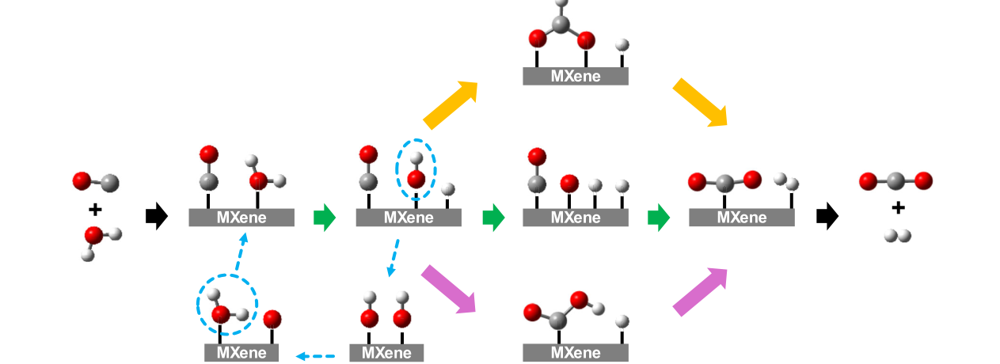

**Original caption:** FIGURE 1 | Formate (top), redox (middle), and carboxylate (bottom) routes for the water-gas shift reaction. Green arrows show the elementary steps considered in this work while black arrows show the (reverse) adsorptions considered in our previous machine learning study [50]. The elementary steps in the formate and carboxylate routes as well as the disproportionation reaction of hydroxyl moieties, highlighted with yellow, magenta, and blue arrows, respectively, were not considered in this work. Color code for spheres: White is H; grey is C; and red is O.

**中文图注:** 图 1 |水煤气变换反应的甲酸盐（上）、氧化还原（中）和羧酸盐（下）路线。绿色箭头显示了本工作中考虑的基本步骤，而黑色箭头显示了我们之前的机器学习研究中考虑的（反向）吸附[50]。本工作未考虑甲酸盐和羧酸盐路线中的基本步骤以及羟基部分的歧化反应（分别用黄色、洋红色和蓝色箭头突出显示）。球体颜色代码：白色为 H；灰色为C；红色是O。

**Source:** p.3 S036

**Original:** Advanced Intelligent Discovery, 2026 3 of 17

**中文:** 高级智能发现，2026 年第 3 期（共 17 期）

**Source:** p.4 S037

**Original:** MXenes. These parameters, which are essential for understanding the catalytic properties of MXenes, are listed in Table S1 in the Supporting Information. The calculations were performed using the Vienna Ab Initio Simulation Package (VASP) [61]. Specifically, the Perdew–Burke–Ernzerhof (PBE) exchange-correlation functional was employed, a widely used Generalized Gradient Approximation (GGA) functional that effectively represents the electronic structure and energetics of various materials, including MXenes [62]. To account for long-range van der Waals interactions, D3 dispersion corrections were included in the calculations [63]. This approach provides a robust treatment of adsorption phenomena suitable for both metallic and nonmetallic systems. The MXenes studied in this work, with the formulas M2C, M2N, and M’2M’’C2, were modeled with 16 atoms per layer to represent their surfaces, that is, using p (4 × 4) periodic supercell structures, as illustrated in Figure 2, and 3 × 3 × 1 kpoint grids within the Brillouin zone [64]. Isolated molecules were modeled in asymmetric boxes with dimensions 10 × 11 × 12 Å3, using a single k-point (the Γ-point). Convergence criteria for the self-consistent field (SCF) and ionic relaxation steps were set at 10−6 eV and 0.005 eV/Å, respectively, to ensure sufficient accuracy. The plane-wave energy cutoff was set to 550 eV, a standard value for these calculations. Projector augmented wave (PAW) pseudo-potentials were used for all elements in the system, and ionic relaxation was performed using the conjugate gradient algorithm [65].

**中文:** MXene。这些参数对于理解 MXene 的催化特性至关重要，列于支持信息的表 S1 中。使用维也纳从头算仿真包 (VASP) [61] 进行计算。具体来说，采用了 Perdew-Burke-Ernzerhof (PBE) 交换相关函数，这是一种广泛使用的广义梯度近似 (GGA) 函数，可以有效地表示包括 MXene 在内的各种材料的电子结构和能量学 [62]。为了考虑长程范德华相互作用，计算中包含了 D3 色散校正 [63]。这种方法提供了适用于金属和非金属系统的吸附现象的稳健处理。这项工作中研究的 MXene 的分子式为 M2C、M2N 和 M'2M''C2，每层用 16 个原子来表示其表面，即使用 p (4 × 4) 周期性超晶胞结构（如图 2 所示）和布里渊区内的 3 × 3 × 1 k 点网格 [64]。使用单个 k 点（Γ 点）在尺寸为 10 × 11 × 12 Å3 的不对称盒子中对孤立的分子进行建模。自洽场 (SCF) 和离子弛豫步骤的收敛标准分别设置为 10−6 eV 和 0.005 eV/Å，以确保足够的精度。平面波能量截止值设置为 550 eV，这是这些计算的标准值。投影增强波（PAW）赝势用于系统中的所有元素，并使用共轭梯度算法进行离子弛豫[65]。

**Source:** p.4 S038

**Original:** The activation energy (Ea) quantifies the energy required for a reaction, either it is for the dissociation of an adsorbed molecule into its respective fragments or the association of fragments to form a molecule. In this study, we focus on the dissociation reactions of water,

**中文:** 活化能 (Ea) 量化了反应所需的能量，无论是将吸附的分子解离成各自的片段，还是片段结合形成分子。在这项研究中，我们重点关注水的解离反应，

**Source:** p.4 S039

**Original:** (a) (b)

**中文:** (一) (二)

### Fig. 002

**Placed near:** p.4 S039
**Source:** p.4 C002

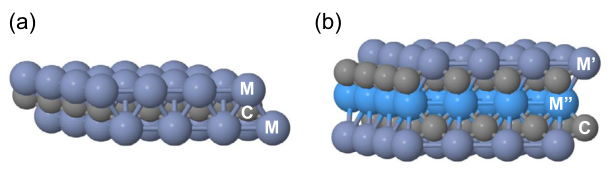

**Original caption:** FIGURE 2 | Supercell structures of MXenes: (a) M2C and (b) M’2M’’C2. The M2C structure is representative of both M2C and M2N, as their configurations are structurally similar. The layers in each structure are labeled as M (metal) and C/N (carbon or nitrogen).

**中文图注:** 图 2 | MXene 的超胞结构：(a) M2C 和 (b) M’2M’’C2。 M2C结构是M2C和M2N的代表，因为它们的配置在结构上相似。每个结构中的层都标记为 M（金属）和 C/N（碳或氮）。

**Source:** p.4 S040

**Original:** (a) (b) (c)

**中文:** (一) (二) (三)

**Source:** p.4 S041

**Original:** 29439981, 2026, 2, Downloaded from https://advanced.onlinelibrary.wiley.com/doi/10.1002/aidi.202500045 by Readcube-Labtiva, Wiley Online Library on [22/05/2026]. See the Terms and Conditions (https://onlinelibrary.wiley.com/terms-and-conditions) on Wiley Online Library for rules of use; OA articles are governed by the applicable Creative Commons License

**中文:** 29439981, 2026, 2，由 Readcube-Labtiva、Wiley 在线图书馆于 [22/05/2026] 从 https://advanced.onlinelibrary.wiley.com/doi/10.1002/aidi.202500045 下载。有关使用规则，请参阅 Wiley 在线图书馆的条款和条件 (https://onlinelibrary.wiley.com/terms-and-conditions)；开放获取文章受适用的知识共享许可证管辖

**Source:** p.4 S042

**Original:** H2O  →OH  + H (1)

**中文:** H2O→OH + H (1)

**Source:** p.4 S043

**Original:** where * denotes an adsorption site on the MXene surface, and hydroxyl,

**中文:** 其中*表示MXene表面的吸附位点，羟基，

**Source:** p.4 S044

**Original:** OH  →O  + H (2)

**中文:** OH →O + H (2)

**Source:** p.4 S045

**Original:** as well as the association reactions of hydrogen adatoms

**中文:** 以及氢吸附原子的缔合反应

**Source:** p.4 S046

**Original:** 2H  →H2 (3)

**中文:** 2H →H2 (3)

**Source:** p.4 S047

**Original:** and carbon monoxide with oxygen

**中文:** 和一氧化碳与氧气

**Source:** p.4 S048

**Original:** CO  + O  →CO2 (4)

**中文:** CO + O →CO2 (4)

**Source:** p.4 S049

**Original:** catalyzed by MXenes. These reactions are directly relevant for the redox route of the WGS reaction [54], Figure 1. In the future, we plan to obtain data for key intermediate species involved in the carboxylate and formate pathways, as well as potential competing reactions, to develop a more comprehensive model.

**中文:** 由 MXene 催化。这些反应与 WGS 反应的氧化还原路线直接相关[54]，图 1。将来，我们计划获取参与羧酸盐和甲酸盐途径的关键中间体物种以及潜在竞争反应的数据，以开发更全面的模型。

**Source:** p.4 S050

**Original:** For the dissociation reactions, the activation energy (Ea) is calculated as the difference between the total energy of the transition state, Etransition, and the total energy of the initial state (i.e., H2O or OH adsorbed on the MXene surface):

**中文:** 对于解离反应，活化能 (Ea) 计算为过渡态总能量 Etransition 与初始态总能量（即 MXene 表面吸附的 H2O 或 OH）之间的差：

**Source:** p.4 S051

**Original:** Ea dissociation ð Þ = Etransition −Einitial (5)

**中文:** Ea 解离 ð Þ = Etransition −Einitial (5)

**Source:** p.4 S052

**Original:** For association reactions, the activation energy is related to the activation and reaction energy of the corresponding dissociation reactions (i.e., reverse reactions) as:

**中文:** 对于缔合反应，活化能与相应解离反应（即逆反应）的活化能和反应能相关，如下所示：

**Source:** p.4 S053

**Original:** Ea association ð Þ = Ea dissociation ð Þ −Er dissociation ð Þ (6)

**中文:** Ea 结合 ð Þ = Ea 解离 ð Þ −Er 解离 ð Þ (6)

**Source:** p.4 S054

**Original:** where Ea(dissociation) is the activation energy for the corresponding dissociation reaction, and Er(dissociation) is the dissociation reaction energy. Low activation energy indicates that the MXene surface catalyzes the reactions, either bond breaking (dissociation) or bond formation (association), more effectively, hence the corresponding MXene surfaces are better catalysts.

**中文:** 其中 Ea(dissociation) 是相应解离反应的活化能，Er(dissociation) 是解离反应能。低活化能表明 MXene 表面更有效地催化断键（解离）或成键（缔合）反应，因此相应的 MXene 表面是更好的催化剂。

**Source:** p.4 S055

**Original:** Figure 3 highlights critical catalytic reaction pathway configurations, namely, (a) initial state →(b) transition state →(c) final state, using the water dissociation on an M’2M’’C2 MXene surface

**中文:** 图 3 突出显示了关键的催化反应路径配置，即 (a) 初始状态 →(b) 过渡状态 →(c) 最终状态，利用 M’2M’’C2 MXene 表面上的水离解

### Fig. 003

**Placed near:** p.4 S055
**Source:** p.4 C003

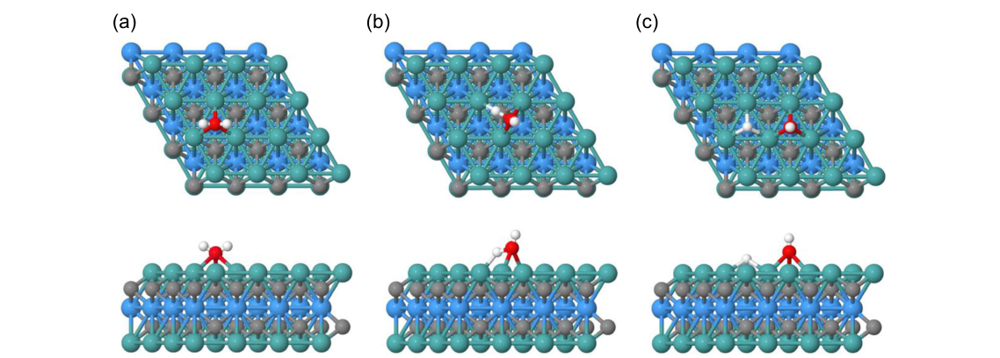

**Original caption:** FIGURE 3 | Top and side views of the (a) initial, (b) transition, and (c) final states of the water dissociation reaction on a M’2M’’C2 MXene surface.

**中文图注:** 图 3 | M’2M’’C2 MXene 表面水解离反应的 (a) 初始状态、(b) 转变状态和 (c) 最终状态的俯视图和侧视图。

**Source:** p.4 S056

**Original:** 4 of 17 Advanced Intelligent Discovery, 2026

**中文:** 4 / 17 高级智能发现，2026

**Source:** p.5 S057

**Original:** as an example. The structure in panel (a) shows the optimized structure of a water molecule interacting with the surface through physisorption or weak chemisorption. The adsorption energy of water is calculated from the total energy of the MXene with adsorbed water and the energies of the separated fragments, that is, the gas-phase H2O molecule and the MXene model surface. Panel (b) depicts the transition state, which represents the highest-energy point along the reaction coordinate, where an O–H bond is stretched. The energy difference between the structures in panels (b) and (a) corresponds to the activation energy of the water dissociation reaction, with more active surfaces having lower activation energies than less active surfaces. Panel (c) presents the final state, with dissociated H and OH fragments adsorbed at distinct sites. The energy difference between the structures in panels (c) and (a) corresponds to the energy of the reaction (negative/positive values are exothermic/endothermic reactions).

**中文:** 举个例子。图（a）中的结构显示了水分子通过物理吸附或弱化学吸附与表面相互作用的优化结构。水的吸附能是根据 MXene 吸附水的总能量和分离碎片（即气相 H2O 分子和 MXene 模型表面）的能量计算得出的。图 (b) 描绘了过渡态，它代表反应坐标上的最高能量点，其中 O-H 键被拉伸。图(b)和(a)中结构之间的能量差对应于水离解反应的活化能，活性较高的表面比较活性较低的表面具有较低的活化能。图 (c) 显示了最终状态，解离的 H 和 OH 片段吸附在不同的位点。面板（c）和（a）中的结构之间的能量差对应于反应的能量（负/正值是放热/吸热反应）。

**Source:** p.5 S058

**Original:** 2.3 | Feature Engineering

**中文:** 2.3 | 2.3特征工程

**Source:** p.5 S059

**Original:** To enhance the dataset and capture the complex interactions between MXenes and adsorbates, we obtained additional features utilizing three Python libraries: Matminer, Mendeleev and RDKit. Matminer was used to derive material features [66], whereas Mendeleev was used to obtain elemental properties related to the MXene atoms. On the other hand, RDKit [67], a cheminformatics library, was used to calculate molecular descriptors for the main adsorbate species of each reaction, including H2O, OH, H2, and CO2. These features span a variety of categories, each obtained using different methods. The chemical composition and molecular structure of the materials were analyzed to derive features such as electron affinity, ionization properties, band center, and thermal conductivity using Matminer. For the main adsorbate species of each reaction (H2O, OH, H2, and CO2), properties like molecular weight, partial charges, radical electrons, and valence electrons were obtained using RDKit. The characteristics of the transition metals in MXenes were determined using Mendeleev, including elemental properties such as atomic radius, atomic weight, melting point, electronegativity, and first ionization energy. Additionally, structural, electronic, and thermodynamic properties of MXenes were derived from DFT calculations, including bond lengths, layer distances, Bader charges, and formation energy. Surface and reactivity properties were also investigated

**中文:** 为了增强数据集并捕获 MXene 和吸附物之间的复杂相互作用，我们利用三个 Python 库获得了附加功能：Matminer、Mendeleev 和 RDKit。 Matminer 用于推导材料特征 [66]，而 Mendeleev 用于获取与 MXene 原子相关的元素属性。另一方面，化学信息学库 RDKit [67] 用于计算每个反应的主要吸附物种类的分子描述符，包括 H2O、OH、H2 和 CO2。这些特征跨越各种类别，每个类别都使用不同的方法获得。使用 Matminer 分析材料的化学成分和分子结构，得出电子亲和力、电离特性、能带中心和热导率等特征。对于每个反应的主要吸附物种类（H2O、OH、H2 和 CO2），使用 RDKit 获得了分子量、部分电荷、自由基电子和价电子等特性。使用门捷列夫确定了 MXene 中过渡金属的特性，包括原子半径、原子量、熔点、电负性和第一电离能等元素特性。此外，MXene 的结构、电子和热力学性质均来自 DFT 计算，包括键长、层距、Bader 电荷和形成能。还研究了表面和反应特性

### Fig. 004

**Placed near:** p.5 S059
**Source:** p.5 C004

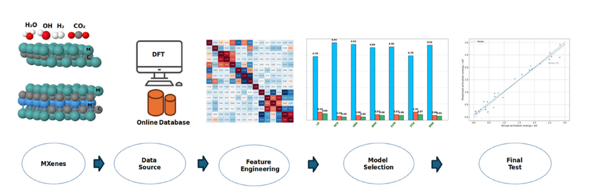

**Original caption:** FIGURE 4 | Workflow of machine learning in this study.

**中文图注:** 图 4 |本研究中机器学习的工作流程。

**Source:** p.5 S060

**Original:** 29439981, 2026, 2, Downloaded from https://advanced.onlinelibrary.wiley.com/doi/10.1002/aidi.202500045 by Readcube-Labtiva, Wiley Online Library on [22/05/2026]. See the Terms and Conditions (https://onlinelibrary.wiley.com/terms-and-conditions) on Wiley Online Library for rules of use; OA articles are governed by the applicable Creative Commons License

**中文:** 29439981, 2026, 2，由 Readcube-Labtiva、Wiley 在线图书馆于 [22/05/2026] 从 https://advanced.onlinelibrary.wiley.com/doi/10.1002/aidi.202500045 下载。有关使用规则，请参阅 Wiley 在线图书馆的条款和条件 (https://onlinelibrary.wiley.com/terms-and-conditions)；开放获取文章受适用的知识共享许可证管辖

**Source:** p.5 S061

**Original:** using DFT, such as the adsorption energy of the reactants (in the reactions described in Equations (3) and (4), the adsorption energies were evaluated as the sum of CO and O, or two H atoms, respectively), reaction energy and activation energy. This combination of methods ensures a comprehensive set of features that captures the essential properties relevant to the prediction of activation energies. In total, we generated 103 features, which are summarized together with their descriptions in Table S2 in the Supporting Information, to feed into our models. Integrating these calculated features into the models allows them to recognize complex patterns and relationships within the dataset, identifying which features are most important and influential in predicting the activation energy.

**中文:** 使用DFT，例如反应物的吸附能（在方程（3）和（4）描述的反应中，吸附能分别评估为CO和O或两个H原子的总和）、反应能和活化能。这种方法的组合确保了一套全面的特征，可以捕获与活化能预测相关的基本属性。我们总共生成了 103 个特征，这些特征及其描述汇总在支持信息的表 S2 中，以输入到我们的模型中。将这些计算出的特征集成到模型中，使他们能够识别数据集中的复杂模式和关系，识别哪些特征在预测激活能方面最重要和最有影响力。

**Source:** p.5 S062

**Original:** We employed recursive feature elimination (RFE) for feature selection, to identify the most relevant features for prediction, while eliminating redundant or less informative ones. By systematically removing the least important features, RFE refines the model to improve its performance and interpretability. Features with lower importance are discarded, and the model is retrained using the remaining ones. This iterative process continues until only the essential features are retained. In this work, RFE was combined with cross-validation and mean absolute error to rank and select the most important features. The final set of features, after multiple iterations, represents the most important ones for making accurate predictions, thus improving both the accuracy and interpretability of our model.

**中文:** 我们采用递归特征消除（RFE）进行特征选择，以识别与预测最相关的特征，同时消除冗余或信息量较少的特征。通过系统地删除最不重要的特征，RFE 改进了模型以提高其性能和可解释性。重要性较低的特征被丢弃，并使用剩余的特征重新训练模型。这个迭代过程一直持续到只保留基本特征为止。在这项工作中，RFE 与交叉验证和平均绝对误差相结合来排序和选择最重要的特征。经过多次迭代后，最终的一组特征代表了做出准确预测的最重要特征，从而提高了模型的准确性和可解释性。

**Source:** p.5 S063

**Original:** 2.4 | Machine Learning Models

**中文:** 2.4 | 2.4机器学习模型

**Source:** p.5 S064

**Original:** In Figure 4, we illustrate the workflow of the machine learning process employed in this study to predict the activation energies for the dissociation of H2O, OH, and for the association reactions of H2 and CO2 on MXene surfaces. The process begins with an analysis of MXene structures, followed by data collection from DFT calculations and literature reference works. The collected data is then processed through feature engineering to identify key descriptors, with correlations visualized using heatmaps. ML models are subsequently trained and evaluated to select the best-performing model and optimized hyperparameters according to cross-validation, which is then tested for accuracy and generalization using a final test set with holdout data used just for this purpose. This workflow underscores the integration of computational and machine learning techniques in MXenes

**中文:** 在图 4 中，我们说明了本研究中使用的机器学习过程的工作流程，用于预测 H2O、OH 解离以及 MXene 表面上 H2 和 CO2 缔合反应的活化能。该过程首先分析 MXene 结构，然后从 DFT 计算和文献参考作品中收集数据。然后通过特征工程处理收集到的数据，以识别关键描述符，并使用热图可视化相关性。随后对 ML 模型进行训练和评估，以根据交叉验证选择性能最佳的模型和优化的超参数，然后使用最终测试集和仅用于此目的的保留数据来测试准确性和泛化性。该工作流程强调了 MXene 中计算和机器学习技术的集成

**Source:** p.5 S065

**Original:** Advanced Intelligent Discovery, 2026 5 of 17

**中文:** 高级智能发现，2026 年第 5 期（共 17 期）

**Source:** p.6 S066

**Original:** research, with the model development described in detail in the next few subsections.

**中文:** 研究，模型开发将在接下来的几小节中详细描述。

**Source:** p.6 S067

**Original:** In this study, several ML models were employed, each with its distinct advantages. The RFR was used due to its capability to handle large, complex datasets and effectively capture nonlinear relationships [68]. ANNs were selected for their ability to model intricate patterns through a multilayer structure. ANNs are wellsuited for high-dimensional data, as they can detect complex relationships between variables by mimicking the way the human brain processes information [69]. To further enhance prediction performance, GBR was considered for its efficiency in employing boosting techniques. It works by combining weaker models into a stronger one and is renowned for its high accuracy and ability to handle noisy data [70]. SVMs were also applied due to their effectiveness in finding optimal hyperplanes for regression tasks. SVMs can handle both linear and nonlinear data, making them versatile for different types of problems [71]. DTR was included for its intuitive nature, providing clear interpretations by splitting the dataset into branches based on feature values. Though they can be prone to overfitting, decision trees are easy to visualize and understand [72]. Additionally, the k-nearest neighbors regressor was chosen for its simplicity and effectiveness, particularly for smaller datasets. This model predicts the output based on the nearest data points, making it a straightforward but powerful tool for regression tasks [73]. In addition to these models, multivariable linear regression (MLR) was also applied due to its simplicity and interpretability. MLR assumes a linear relationship between the predictors and the response variable, making it a valuable baseline model for comparing with more complex machine learning models [74].

**中文:** 本研究采用了多种机器学习模型，每种模型都有其独特的优势。使用 RFR 是因为它能够处理大型、复杂的数据集并有效捕获非线性关系[68]。人工神经网络因其通过多层结构对复杂模式进行建模的能力而被选中。人工神经网络非常适合高维数据，因为它们可以通过模仿人脑处理信息的方式来检测变量之间的复杂关系[69]。为了进一步提高预测性能，GBR 因其采用增强技术的效率而被考虑。它的工作原理是将较弱的模型组合成一个较强的模型，并以其高精度和处理噪声数据的能力而闻名[70]。支持向量机也因其在寻找回归任务的最佳超平面方面的有效性而被应用。 SVM 可以处理线性和非线性数据，使其适用于不同类型的问题 [71]。 DTR 因其直观性而被纳入其中，通过根据特征值将数据集分割为分支来提供清晰的解释。尽管决策树很容易过度拟合，但它们很容易可视化和理解[72]。此外，选择 k 最近邻回归器是因为它的简单性和有效性，特别是对于较小的数据集。该模型根据最近的数据点预测输出，使其成为回归任务的简单而强大的工具[73]。除了这些模型之外，还应用了多元线性回归（MLR），因为它简单且可解释。 MLR 假设预测变量和响应变量之间存在线性关系，这使其成为与更复杂的机器学习模型进行比较的有价值的基线模型[74]。

**Source:** p.6 S068

**Original:** By implementing these models using Python’s scikit-learn library [75, 76], the study aimed to compare and identify the most effective models, ultimately ensuring robust and reliable predictions of activation energies in the context of MXene-catalyzed reactions. To guarantee a thorough evaluation and accurate prediction of activation energies, we implemented a structured approach involving training, validation, and testing. The models were first trained and validated by means of cross-validation using 70% of the dataset (64 data points), which played a key role in optimizing the model and mitigating overfitting. The remaining 30% (28 data points) were kept aside as a test set to evaluate the performance of the model on previously unseen data.

**中文:** 通过使用 Python 的 scikit-learn 库 [75, 76] 实现这些模型，该研究旨在比较和识别最有效的模型，最终确保在 MXene 催化反应的背景下对活化能进行稳健且可靠的预测。为了保证对活化能进行彻底的评估和准确的预测，我们实施了一种涉及培训、验证和测试的结构化方法。首先使用 70% 的数据集（64 个数据点）通过交叉验证的方式对模型进行训练和验证，这对于优化模型和缓解过度拟合起到了关键作用。剩下的 30%（28 个数据点）被保留作为测试集，以评估模型在以前未见过的数据上的性能。

**Source:** p.6 S069

**Original:** 2.5 | Model Tuning and Evaluation

**中文:** 2.5 | 2.5模型调整和评估

**Source:** p.6 S070

**Original:** In this work, we followed a rigorous methodology for model training and evaluation to ensure the accuracy and reliability of activation energy predictions. Each model was thoroughly assessed using 5-fold cross-validation, where the dataset was divided into five subsets for iterative training and validation. We employed several models to better understand the relationship between input features and activation energies. To fine-tune our models, we applied hyperparameter optimization using RandomizedSearchCV, with all details provided in the Supporting Information. This technique involves randomly sampling hyperparameter combinations and evaluating their performance. For evaluating the regression models, we utilized key metrics including R-squared or coefficient of determination (R2), mean absolute error (MAE), and root-mean-squared error

**中文:** 在这项工作中，我们遵循严格的模型训练和评估方法，以确保活化能预测的准确性和可靠性。每个模型都使用 5 倍交叉验证进行彻底评估，其中数据集被分为五个子集以进行迭代训练和验证。我们采用了几种模型来更好地理解输入特征和激活能量之间的关系。为了微调我们的模型，我们使用 RandomizedSearchCV 应用超参数优化，支持信息中提供了所有详细信息。该技术涉及随机采样超参数组合并评估其性能。为了评估回归模型，我们使用了关键指标，包括 R 平方或决定系数 (R2)、平均绝对误差 (MAE) 和均方根误差

**Source:** p.6 S071

**Original:** 29439981, 2026, 2, Downloaded from https://advanced.onlinelibrary.wiley.com/doi/10.1002/aidi.202500045 by Readcube-Labtiva, Wiley Online Library on [22/05/2026]. See the Terms and Conditions (https://onlinelibrary.wiley.com/terms-and-conditions) on Wiley Online Library for rules of use; OA articles are governed by the applicable Creative Commons License

**中文:** 29439981, 2026, 2，由 Readcube-Labtiva、Wiley 在线图书馆于 [22/05/2026] 从 https://advanced.onlinelibrary.wiley.com/doi/10.1002/aidi.202500045 下载。有关使用规则，请参阅 Wiley 在线图书馆的条款和条件 (https://onlinelibrary.wiley.com/terms-and-conditions)；开放获取文章受适用的知识共享许可证管辖

**Source:** p.6 S072

**Original:** (RMSE). This comprehensive approach enabled us to refine our models for enhanced predictive accuracy and better generalization to new data.

**中文:** （均方根误差）。这种综合方法使我们能够改进模型，以提高预测准确性并更好地推广新数据。

**Source:** p.6 S073

**Original:** 2.6 | Final Test

**中文:** 2.6 | 2.6最终测试

**Source:** p.6 S074

**Original:** At this stage, the model was evaluated using a test set comprising 30% of the total dataset. This subset was withheld during the training and validation phases to ensure an unbiased evaluation. The performance of the final model was assessed on this unseen data, providing insights into its ability to generalize and accurately predict activation energies for reactions involving MXene materials. These results were critical for verifying the predictive accuracy and reliability of the model.

**中文:** 在此阶段，使用占总数据集 30% 的测试集来评估模型。该子集在训练和验证阶段被保留，以确保评估的公正性。最终模型的性能是根据这些看不见的数据进行评估的，从而深入了解其概括和准确预测涉及 MXene 材料的反应的活化能的能力。这些结果对于验证模型的预测准确性和可靠性至关重要。

## 3 | Results and Discussion / 结果

**Source:** p.6 S075

**Original:** 3 | Results and Discussion

**中文:** 3 |结果与讨论

**Source:** p.6 S076

**Original:** 3.1 | Distribution and Analysis of Activation Energies

**中文:** 3.1|活化能的分布与分析

**Source:** p.6 S077

**Original:** Before predicting and analyzing activation energies, it is crucial to understand their distribution and variation across the dataset, as this provides key insights about the potential of MXenes for application in catalysis. Figure 5 offers a detailed analysis of the density and frequency distributions of activation energies for the dissociation reactions of H2O and OH, as well as the association reactions leading to H2 and CO2 formation on MXene surfaces. Figure 5a presents the density distributions of activation energies for the H2O and OH dissociation reactions and for the association reactions originating H2 and CO2. The activation energies for H2O (blue) are primarily concentrated at low values, peaking around 0.44 eV, suggesting that H2O dissociation reactions generally require less energy compared to other adsorbates. For OH (green), the distribution is sharply peaked around 0.74 eV, indicating a narrow range of activation energies, meaning that OH related dissociation reactions exhibit relatively uniform energy requirements. In contrast, the activation energy distribution for H2 (red) is much broader, spanning over 3 eV, reflecting significant variability in the energy required for H2 association, likely due to differing surface interactions or multiple reaction pathways. Similarly, for CO2 (cyan), the activation energies are also rather widely spread, peaking around 2.3 eV with a long tail extending beyond 3 eV, indicating that CO2 dissociation on the MXene surface is relatively energy-intensive and exhibits considerable variability. The overlap between these distributions suggests that some activation energies for different adsorbates fall within similar ranges, which may imply competition for adsorption sites or shared reaction pathways.

**中文:** 在预测和分析活化能之前，了解它们在数据集中的分布和变化至关重要，因为这提供了有关 MXene 在催化应用潜力的关键见解。图 5 详细分析了 H2O 和 OH 解离反应的活化能密度和频率分布，以及导致 MXene 表面形成 H2 和 CO2 的缔合反应。图 5a 显示了 H2O 和 OH 解离反应以及产生 H2 和 CO2 的缔合反应的活化能密度分布。 H2O（蓝色）的活化能主要集中在较低值，峰值约为 0.44 eV，表明与其他吸附物相比，H2O 解离反应通常需要较少的能量。对于 OH（绿色），分布在 0.74 eV 附近出现尖锐峰值，表明活化能范围较窄，这意味着 OH 相关解离反应表现出相对均匀的能量需求。相比之下，H2（红色）的活化能分布要宽得多，跨度超过 3 eV，反映了 H2 缔合所需能量的显着变化，这可能是由于不同的表面相互作用或多种反应途径造成的。同样，对于 CO2（青色），活化能也分布相当广泛，峰值约为 2.3 eV，长尾延伸超过 3 eV，表明 MXene 表面上的 CO2 解离相对能量密集，并且表现出相当大的可变性。这些分布之间的重叠表明不同吸附物的一些活化能落在相似的范围内，这可能意味着吸附位点或共享反应途径的竞争。

**Source:** p.6 S078

**Original:** Figure 5b further supports these observations by displaying the frequency distribution of activation energies, offering a discrete count of occurrences. The activation energy values for H2O are densely packed below 0.5 eV while those for OH are clustered between 0.5 and 1 eV. In the case of the reaction towards H2, the activation energies show a broader distribution, with frequent occurrences around 0.5–1 and 2–3 eV, suggesting multiple reaction pathways or variations in MXene surface interactions.

**中文:** 图 5b 通过显示活化能的频率分布，提供离散的出现次数，进一步支持了这些观察结果。 H2O 的活化能值密集地低于 0.5 eV，而 OH 的活化能值则集中在 0.5 至 1 eV 之间。在针对 H2 的反应中，活化能显示出更广泛的分布，经常出现在 0.5-1 和 2-3 eV 左右，这表明 MXene 表面相互作用存在多种反应途径或变化。

**Source:** p.6 S079

**Original:** 6 of 17 Advanced Intelligent Discovery, 2026

**中文:** 6 of 17 高级智能发现，2026

**Source:** p.7 S080

**Original:** Similarly, for the CO oxidation reaction to CO2, the activation energies span the range 1.5–3 eV.

**中文:** 同样，对于 CO 氧化成 CO2 的反应，活化能的范围为 1.5-3 eV。

**Source:** p.7 S081

**Original:** Previously, it was found that MXenes with d2 configurations generally exhibit lower energy barriers towards H2O dissociation, followed by d3 and then by d4, with tungsten-based MXenes being the least effective of the metals analyzed [56]. These insights emphasize the importance of compositional refinement in designing MXenes tailored for specific catalytic reactions. While an activation energy of ∼0 eV would theoretically represent an ideal scenario for a spontaneous reaction, such cases are exceedingly rare in real systems [77]. In fact, activation barriers within a specific range are preferred for applications in practice, as they balance reactivity and selectivity, ensuring controlled and efficient catalysis [20].

**中文:** 此前，人们发现具有 d2 配置的 MXene 通常对 H2O 解离表现出较低的能垒，其次是 d3，然后是 d4，其中钨基 MXene 是分析的金属中效率最低的 [56]。这些见解强调了成分细化在设计针对特定催化反应定制的 MXene 时的重要性。虽然〜0 eV的活化能理论上代表了自发反应的理想情况，但这种情况在实际系统中极其罕见[77]。事实上，在实际应用中，特定范围内的活化势垒是优选的，因为它们平衡反应性和选择性，确保受控和有效的催化[20]。

**Source:** p.7 S082

**Original:** 3.2 | Exploring Feature Selection and Analysis

**中文:** 3.2 |探索特征选择和分析

**Source:** p.7 S083

**Original:** Feature selection plays a crucial role in enhancing model performance and interpretability by identifying the most impactful variables while reducing complexity and mitigating overfitting (Figure 6). Using Recursive Feature Elimination with Random Forests, two key features were identified from an initial pool of over 100 as the optimal set for predicting the activation energies of the reactions present in the dataset (dissociation reactions of H2O and OH, and association reactions leading to H2 and CO2). The first selected feature is reaction energy, which represents the energy change occurring during a reaction, from reactants to products. This feature is crucial as it directly correlates with the thermodynamic feasibility and stability of reaction intermediates, influencing activation energy requirements. The second feature is LogP of the reactant, the logarithm of the octanol/water partition coefficient, which indicates how a reagent distributes itself between hydrophobic (lipid-soluble) and hydrophilic (water-soluble) phases. While this property may be surprising, it contributes with a measure of the hydrophilic nature of the adsorbing molecule, hence affecting indirectly adsorption behavior.

**中文:** 特征选择通过识别最具影响力的变量，同时降低复杂性并减轻过度拟合，在增强模型性能和可解释性方面发挥着至关重要的作用（图 6）。使用随机森林的递归特征消除，从超过 100 个的初始池中确定了两个关键特征，作为预测数据集中存在的反应的活化能的最佳集（H2O 和 OH 的解离反应，以及导致 H2 和 CO2 的缔合反应）。第一个选定的特征是反应能，它表示反应过程中从反应物到产物发生的能量变化。这一特征至关重要，因为它与反应中间体的热力学可行性和稳定性直接相关，影响活化能要求。第二个特征是反应物的 LogP，即辛醇/水分配系数的对数，它表明试剂如何在疏水相（脂溶性）和亲水相（水溶性）之间分配。虽然这一特性可能令人惊讶，但它有助于衡量吸附分子的亲水性，从而间接影响吸附行为。

**Source:** p.7 S084

**Original:** The hydrophilic nature of a molecule can depend on the interplay between its polarity, hydrogen bonding, molecular size,

**中文:** 分子的亲水性取决于其极性、氢键、分子大小、

**Source:** p.7 S085

**Original:** 29439981, 2026, 2, Downloaded from https://advanced.onlinelibrary.wiley.com/doi/10.1002/aidi.202500045 by Readcube-Labtiva, Wiley Online Library on [22/05/2026]. See the Terms and Conditions (https://onlinelibrary.wiley.com/terms-and-conditions) on Wiley Online Library for rules of use; OA articles are governed by the applicable Creative Commons License

**中文:** 29439981, 2026, 2，由 Readcube-Labtiva、Wiley 在线图书馆于 [22/05/2026] 从 https://advanced.onlinelibrary.wiley.com/doi/10.1002/aidi.202500045 下载。有关使用规则，请参阅 Wiley 在线图书馆的条款和条件 (https://onlinelibrary.wiley.com/terms-and-conditions)；开放获取文章受适用的知识共享许可证管辖

**Source:** p.7 S086

**Original:** molecular shape, and charge. Therefore, the LogP is a single descriptor, which has the ability to take into account different physicochemical properties within the same parameter, being selected using RFE among other descriptors which could have been used to identify the main molecule in each reaction in this work, such as molecular weight, topological polar surface area (TPSA), fingerprint molecular similarity calculated according to so-called Morgan density, maximum absolute partial charge, number of radical electrons, and number of valence electrons. The RFE process, guided by mean absolute error as the evaluation metric, incorporated cross-validation to ensure the robustness of feature selection. By systematically eliminating irrelevant or redundant features, this approach improved the predictive accuracy and generalizability of the model.

**中文:** 分子形状和电荷。因此，LogP是一个单一描述符，能够在同一参数内考虑不同的物理化学性质，使用RFE在其他描述符中进行选择，这些描述符可用于识别本工作中每个反应中的主要分子，例如分子量、拓扑极性表面积（TPSA）、根据所谓的摩根密度计算的指纹分子相似性、最大绝对部分电荷、自由基电子数和价电子数。 RFE 过程以平均绝对误差为评估指标，并结合交叉验证来确保特征选择的稳健性。通过系统地消除不相关或冗余的特征，该方法提高了模型的预测准确性和概括性。

**Source:** p.7 S087

**Original:** Additional features were incorporated in Figure 6 to investigate a broader set of relationships within the dataset, which would provide a deeper understanding of the overall system. These additional features include the molecular weight of the main adsorbate species (H2O, OH, H2 and CO2) which affects their interactions with the MXenes; the maximum absolute partial charge of the main adsorbate species, which is related to their reactivity; and MXene-specific characteristics, such as the formation energy and adsorption energy of the reactants, which describe the stability and interaction strength between the MXenes and the reactants.

**中文:** 图 6 中纳入了其他功能，以研究数据集中更广泛的关系，这将提供对整个系统的更深入的了解。这些附加特征包括主要吸附物种类（H2O、OH、H2 和 CO2）的分子量，这会影响它们与 MXene 的相互作用；主要吸附物种类的最大绝对部分电荷，与其反应性有关； MXene特有的特征，例如反应物的形成能和吸附能，描述了MXene与反应物之间的稳定性和相互作用强度。

**Source:** p.7 S088

**Original:** The distance between atoms within the MXene structure was considered as well, as it can be related to the electronic distribution of the MXene surface. Including these extra features, alongside the primary ones, allows for a more subtle exploration of the complex interactions between the properties of MXenes and the adsorbates. This approach provides a more comprehensive understanding of the factors influencing activation energy predictions, ensuring that the model captures not only the most critical predictors but also a broader view of the structure of the dataset and the intricate interplay between the properties of the materials and their catalytic behaviors. To better understand the relationships between the features, including the selected key ones, we analyzed the correlation matrix, which is visualized as a heatmap in Figure 6. The correlation coefficients range from + 1

**中文:** MXene 结构内原子之间的距离也被考虑在内，因为它可能与 MXene 表面的电子分布有关。除了主要功能之外，还包括这些额外功能，可以更微妙地探索 MXene 特性和吸附物之间的复杂相互作用。这种方法可以更全面地了解影响活化能预测的因素，确保模型不仅捕获最关键的预测变量，还可以更广泛地了解数据集的结构以及材料特性及其催化行为之间复杂的相互作用。为了更好地理解特征之间的关系（包括选定的关键特征），我们分析了相关矩阵，该矩阵在图 6 中以热图形式可视化。相关系数的范围为 + 1

### Fig. 005

**Placed near:** p.7 S088
**Source:** p.7 C005

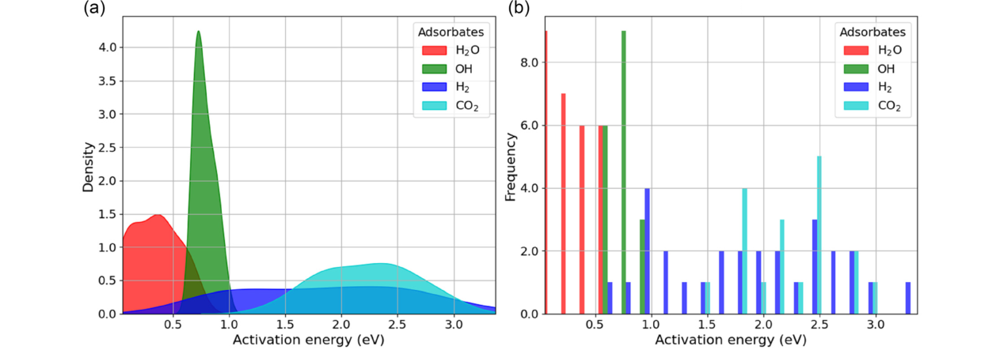

**Original caption:** FIGURE 5 | Density and frequency distributions of activation energies. (a) Kernel density estimate plot and (b) Histogram. Labels H2O, OH, H2 and CO2 stand for reactions described by Equations (1)–(4), respectively, that is, H2O and OH dissociations, and H2 and CO2 formations.

**中文图注:** 图 5 |活化能的密度和频率分布。 (a) 核密度估计图和 (b) 直方图。标签H2O、OH、H2和CO2分别代表方程(1)-(4)描述的反应，即H2O和OH解离，以及H2和CO2形成。

**Source:** p.7 S089

**Original:** Advanced Intelligent Discovery, 2026 7 of 17

**中文:** 高级智能发现，2026 年第 7 期（共 17 期）

**Source:** p.8 S090

**Original:** to −1, where + 1 (indicated by darker red) represents a perfect positive correlation, meaning that as one feature increases, the other also increases proportionally. Conversely, −1 (in darker blue) represents a perfect negative correlation, where an increase in one feature corresponds to a decrease in the other. Values near 0 (shown in white) suggest no significant linear relationship between the variables. This heatmap revealed important patterns that helped identify interdependencies and redundancies among features. Features with strong correlations may provide overlapping information, while those with weak correlations contribute more independently. This analysis supports the relevance of the selected features, ensuring they not only add value independently but also align with the underlying physical and chemical principles of the system.

**中文:** 到 -1，其中 + 1（由深红色表示）表示完美的正相关，这意味着随着一个特征的增加，另一个特征也会成比例地增加。相反，-1（深蓝色）代表完美的负相关，其中一个特征的增加对应于另一个特征的减少。接近 0 的值（以白色显示）表明变量之间不存在显着的线性关系。该热图揭示了有助于识别功能之间的相互依赖性和冗余的重要模式。具有强相关性的特征可能会提供重叠的信息，而具有弱相关性的特征则更独立地贡献。该分析支持所选功能的相关性，确保它们不仅独立地增加价值，而且符合系统的基本物理和化学原理。

**Source:** p.8 S091

**Original:** As observed in Figure 6, the reaction energy shows a strong positive correlation with activation energy, that is, more exothermic/ endothermic reactions tend to have lower/higher activation energies. This observation supports the Brønsted–Evans–Polanyi

**中文:** 如图 6 所示，反应能与活化能呈强正相关，即放热/吸热反应越多，活化能越低/越高。这一观察结果支持了 Brønsted-Evans-Polanyi

**Source:** p.8 S092

**Original:** 29439981, 2026, 2, Downloaded from https://advanced.onlinelibrary.wiley.com/doi/10.1002/aidi.202500045 by Readcube-Labtiva, Wiley Online Library on [22/05/2026]. See the Terms and Conditions (https://onlinelibrary.wiley.com/terms-and-conditions) on Wiley Online Library for rules of use; OA articles are governed by the applicable Creative Commons License

**中文:** 29439981, 2026, 2，由 Readcube-Labtiva、Wiley 在线图书馆于 [22/05/2026] 从 https://advanced.onlinelibrary.wiley.com/doi/10.1002/aidi.202500045 下载。有关使用规则，请参阅 Wiley 在线图书馆的条款和条件 (https://onlinelibrary.wiley.com/terms-and-conditions)；开放获取文章受适用的知识共享许可证管辖

**Source:** p.8 S093

**Original:** principle in heterogeneous catalysis, demonstrating that reaction energy and activation energy are closely linked in catalytic processes [78, 79]. Adsorption energy of the reactants has a strong negative correlation with activation energy, suggesting that stronger adsorption of reactants onto the catalyst surface tends to result in higher energy barriers [80].

**中文:** 多相催化原理，证明反应能和活化能在催化过程中密切相关[78, 79]。反应物的吸附能与活化能具有很强的负相关性，这表明反应物在催化剂表面上的吸附越强往往会导致更高的能垒[80]。

**Source:** p.8 S094

**Original:** The strong negative correlation between LogP and maximum partial charge in reactants suggests that more hydrophobic molecules tend to have lower partial charges, likely due to the absence of strongly polar functional groups. However, given the small size of the molecules studied, this trend may be constrained by the limited variability in their structures. Similarly, while molecular weight shows a negative correlation with LogP, this does not necessarily imply a straightforward relationship between size and hydrophobicity, as molecular polarity is influenced by both local functional groups and overall charge distribution.

**中文:** LogP 与反应物中最大部分电荷之间的强负相关性表明，疏水性较高的分子往往具有较低的部分电荷，这可能是由于不存在强极性官能团。然而，考虑到所研究的分子尺寸较小，这种趋势可能受到其结构有限变异性的限制。同样，虽然分子量与 LogP 呈负相关，但这并不一定意味着尺寸和疏水性之间存在直接关系，因为分子极性同时受到局部官能团和整体电荷分布的影响。

### Fig. 006

**Placed near:** p.8 S094
**Source:** p.8 C006

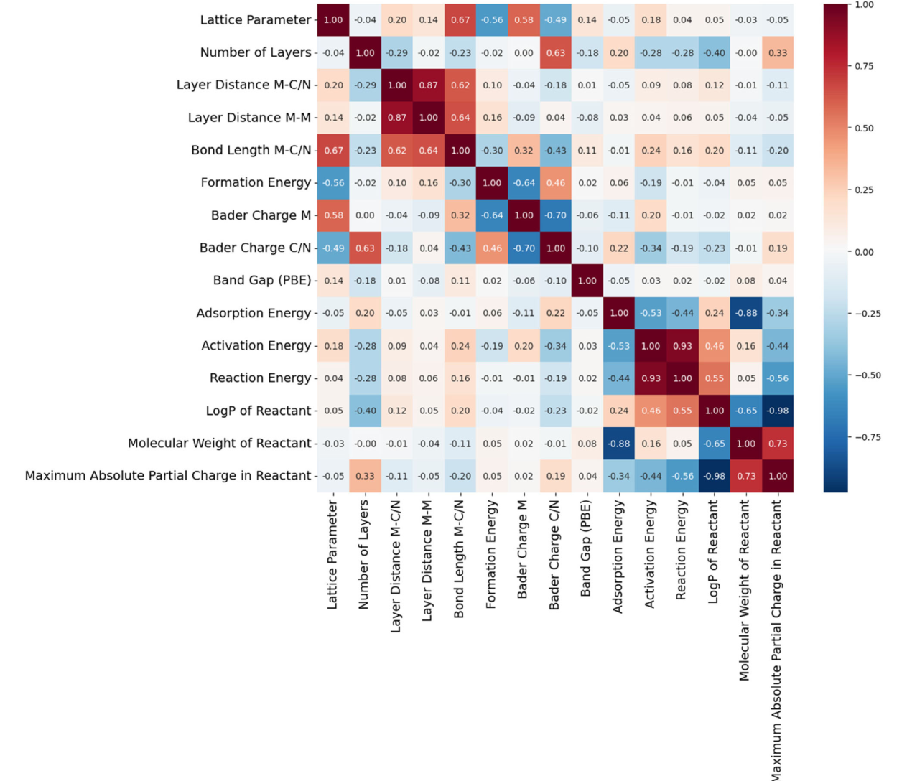

**Original caption:** FIGURE 6 | Correlation matrix heatmap showing the relationships between selected features and other features studied in this work, as well as the properties of MXenes.

**中文图注:** 图 6 |相关矩阵热图显示了所选特征与本工作中研究的其他特征之间的关系，以及 MXene 的属性。

**Source:** p.8 S095

**Original:** 8 of 17 Advanced Intelligent Discovery, 2026

**中文:** 8 of 17 高级智能发现，2026

**Source:** p.9 S096

**Original:** Please note that analyzing correlations, such as the one observed between molecular weight and adsorption energy, can be misleading if the broader context is overlooked or if only a limited set of species is considered. Adsorption mechanisms are highly complex and, therefore, such analyses must be conducted with care.

**中文:** 请注意，如果忽略更广泛的背景或仅考虑一组有限的物种，则分析相关性（例如在分子量和吸附能之间观察到的相关性）可能会产生误导。吸附机制非常复杂，因此必须小心进行此类分析。

**Source:** p.9 S097

**Original:** 3.3 | Predictive Modeling of Activation Energy

**中文:** 3.3 |活化能的预测模型

**Source:** p.9 S098

**Original:** We began our study by employing linear regression to predict activation energies. The initial results from cross-validation yielded an R2 value of 0.79, indicating a moderate level of predictive capability. Nevertheless, the performance of the linear regression model can be limited by its inability to capture complex, non-linear relationships between the features and activation energies. Therefore, other machine learning methods, such as random forest regressor, SVM, and neural networks, were also tested because they are better equipped to handle the complexities of the data and are particularly effective at capturing the non-linear interactions that linear models often miss.

**中文:** 我们通过使用线性回归来预测活化能开始我们的研究。交叉验证的初步结果得出的 R2 值为 0.79，表明预测能力处于中等水平。然而，线性回归模型的性能可能会受到其无法捕获特征和激活能之间复杂的非线性关系的限制。因此，还测试了其他机器学习方法，例如随机森林回归器、支持向量机和神经网络，因为它们能够更好地处理数据的复杂性，并且在捕获线性模型经常错过的非线性交互方面特别有效。

**Source:** p.9 S099

**Original:** The cross-validation results for each model studied in this work are summarized in Figure 7. The non-linear models, except for DTR, exhibit a higher level of predictive accuracy. Furthermore, we evaluated the different models using varied random states for the data split between data used for cross-validation and the final test set, and the results remained consistent.

**中文:** 图 7 总结了本工作中研究的每个模型的交叉验证结果。除 DTR 之外的非线性模型表现出更高水平的预测准确性。此外，我们使用不同的随机状态来评估用于交叉验证的数据和最终测试集之间的数据分割的不同模型，并且结果保持一致。

**Source:** p.9 S100

**Original:** We developed an RFR model and evaluated its performance using 5-fold cross-validation. The performance metrics, including R2, RMSE, and MAE, along with their standard deviations, are summarized in Table 1. The low standard deviations further confirm the stability of the performance of the model. Overall, the RFR model demonstrates strong predictive capabilities, effectively modeling activation energies and generalizing well to new data, making it a reliable choice.

**中文:** 我们开发了一个 RFR 模型并使用 5 倍交叉验证评估其性能。表 1 总结了包括 R2、RMSE 和 MAE 在内的性能指标及其标准差。较低的标准差进一步证实了模型性能的稳定性。总体而言，RFR 模型表现出强大的预测能力，可以有效地对活化能进行建模并很好地推广到新数据，使其成为可靠的选择。

**Source:** p.9 S101

**Original:** 29439981, 2026, 2, Downloaded from https://advanced.onlinelibrary.wiley.com/doi/10.1002/aidi.202500045 by Readcube-Labtiva, Wiley Online Library on [22/05/2026]. See the Terms and Conditions (https://onlinelibrary.wiley.com/terms-and-conditions) on Wiley Online Library for rules of use; OA articles are governed by the applicable Creative Commons License

**中文:** 29439981, 2026, 2，由 Readcube-Labtiva、Wiley 在线图书馆于 [22/05/2026] 从 https://advanced.onlinelibrary.wiley.com/doi/10.1002/aidi.202500045 下载。有关使用规则，请参阅 Wiley 在线图书馆的条款和条件 (https://onlinelibrary.wiley.com/terms-and-conditions)；开放获取文章受适用的知识共享许可证管辖

### Table 001

**Placed near:** p.9 S101
**Source:** p.9 T001

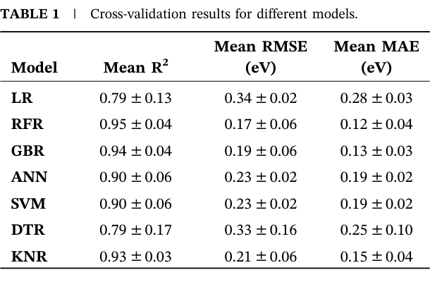

**Original caption:** TABLE 1 | Cross-validation results for different models.

**中文图注:** 表 1 |不同模型的交叉验证结果。

## TABLE 1 | Cross-validation results for different models. / 结果

**Source:** p.9 S102

**Original:** Model Mean R2 Mean RMSE (eV) Mean MAE (eV)

**中文:** 模型 平均值 R2 平均值 RMSE (eV) 平均值 MAE (eV)

**Source:** p.9 S103

**Original:** LR 0.79 ± 0.13 0.34 ± 0.02 0.28 ± 0.03

**中文:** LR 0.79±0.13 0.34±0.02 0.28±0.03

**Source:** p.9 S104

**Original:** RFR 0.95 ± 0.04 0.17 ± 0.06 0.12 ± 0.04

**中文:** 射频率 0.95±0.04 0.17±0.06 0.12±0.04

**Source:** p.9 S105

**Original:** GBR 0.94 ± 0.04 0.19 ± 0.06 0.13 ± 0.03

**中文:** 英国 0.94 ± 0.04 0.19 ± 0.06 0.13 ± 0.03

**Source:** p.9 S106

**Original:** ANN 0.90 ± 0.06 0.23 ± 0.02 0.19 ± 0.02

**中文:** 人工神经网络 0.90±0.06 0.23±0.02 0.19±0.02

**Source:** p.9 S107

**Original:** SVM 0.90 ± 0.06 0.23 ± 0.02 0.19 ± 0.02

**中文:** 支持向量机 0.90±0.06 0.23±0.02 0.19±0.02

**Source:** p.9 S108

**Original:** DTR 0.79 ± 0.17 0.33 ± 0.16 0.25 ± 0.10

**中文:** DTR 0.79±0.17 0.33±0.16 0.25±0.10

**Source:** p.9 S109

**Original:** KNR 0.93 ± 0.03 0.21 ± 0.06 0.15 ± 0.04

**中文:** KNR 0.93±0.03 0.21±0.06 0.15±0.04

**Source:** p.9 S110

**Original:** To optimize the model, we employed scikit-learn’s RandomizedSearchCV [81], a technique that identifies the best hyperparameters by randomly sampling from predefined values, rather than testing all possible combinations. This approach helps to efficiently explore the hyperparameter space while reducing computational cost. A more detailed description of how this method was applied in our work, along with the best parameters for the models, is provided in the Supporting Information. The optimization process led to improved performance, enhancing the accuracy and stability of the model in predicting activation energies. We evaluated model performance using key metrics: R2; MAE, which calculates the average magnitude of errors between predicted and actual values; and RMSE, which gives greater weight to larger errors by evaluating the square root of the average squared differences between predicted and actual values [82].

**中文:** 为了优化模型，我们采用了 scikit-learn 的 RandomizedSearchCV [81]，该技术通过从预定义值中随机采样来识别最佳超参数，而不是测试所有可能的组合。这种方法有助于有效地探索超参数空间，同时降低计算成本。支持信息中提供了如何在我们的工作中应用该方法的更详细描述，以及模型的最佳参数。优化过程提高了性能，提高了模型预测活化能的准确性和稳定性。我们使用关键指标评估模型性能：R2； MAE，计算预测值和实际值之间的平均误差大小； RMSE，它通过评估预测值和实际值之间的平均平方差的平方根来给较大的误差赋予更大的权重[82]。

**Source:** p.9 S111

**Original:** The optimized hyperparameters were: {‘n_estimators’: 100, ’min_ samples_split’: 2, ‘min_samples_leaf’: 2, ‘max_features’: ‘sqrt’, ‘max_depth’: 30, ‘bootstrap’: False}. Under these conditions, the model achieved a mean cross-validation R2 of 0.95 ± 0.04, mean

**中文:** 优化后的超参数为：{‘n_estimators’: 100, ’min_samples_split’: 2, ‘min_samples_leaf’: 2, ‘max_features’: ‘sqrt’, ‘max_depth’: 30, ‘bootstrap’: False}。在这些条件下，模型的平均交叉验证 R2 为 0.95 ± 0.04，

### Fig. 007

**Placed near:** p.9 S111
**Source:** p.9 C007

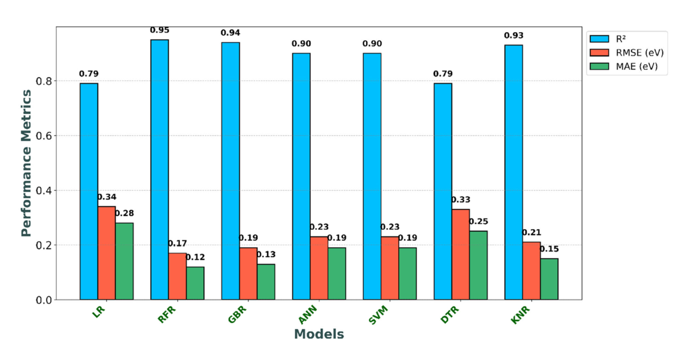

**Original caption:** FIGURE 7 | Variation in performance results (R2, RMSE, and MAE) from cross-validation for RFR, GBR, ANN, SVM, DTR, and KNR models, compared to the linear regression model.

**中文图注:** 图 7 |与线性回归模型相比，RFR、GBR、ANN、SVM、DTR 和 KNR 模型交叉验证的性能结果（R2、RMSE 和 MAE）存在差异。

**Source:** p.9 S112

**Original:** Advanced Intelligent Discovery, 2026 9 of 17

**中文:** 高级智能发现，2026 年第 9 期（共 17 期）

**Source:** p.10 S113

**Original:** RMSE of 0.17 ± 0.06 eV, and mean MAE of 0.12 ± 0.04 eV, respectively. These results demonstrate that the model performs well, exhibiting a high R2 and low RMSE and MAE, highlighting the RFR model accuracy and its strong ability to predict activation energies effectively. After optimization and CV, we tested the RFR model on an independent dataset, yielding excellent results.

**中文:** RMSE 为 0.17 ± 0.06 eV，平均 MAE 为 0.12 ± 0.04 eV。这些结果表明该模型表现良好，表现出高 R2 和低 RMSE 和 MAE，凸显了 RFR 模型的准确性及其有效预测活化能的强大能力。经过优化和 CV 后，我们在独立数据集上测试了 RFR 模型，取得了优异的结果。

**Source:** p.10 S114

**Original:** Figure 8 consists of two subplots for the final test: (a) a scatter plot comparing predicted vs. actual activation energy and (b) a histogram of residuals (Actual - Predicted values). In subplot (a), the data points closely align with the diagonal “Perfect Fit” line, indicating that the predictions of the model are highly accurate. The proximity of the points to the regression line further highlights a strong correlation between actual and predicted values, supported by a high coefficient of determination R2 = 0.97, RMSE = 0.17 eV and MAE = 0.14 eV, demonstrating excellent predictive capability. This suggests that the model effectively captures the key descriptors influencing activation energy and can reliably be used for prediction on MXene surfaces. Subplot (b) presents the residuals, visualized as a histogram, showing the differences between actual and predicted activation energies. Most residuals are centered around 0 eV, confirming the strong predictive performance of the model, with most values falling between −0.3 and 0.3 eV. This tight distribution indicates that prediction errors are minimal and evenly distributed. The low magnitude of these residuals reinforces the reliability of the model, making it a robust tool for activation energy prediction in catalysis applications.

**中文:** 图 8 包含最终测试的两个子图：(a) 比较预测激活能与实际激活能的散点图，以及 (b) 残差直方图（实际 - 预测值）。在子图 (a) 中，数据点与对角线“完美拟合”线紧密对齐，表明模型的预测非常准确。这些点与回归线的接近进一步凸显了实际值和预测值之间的强相关性，并得到高决定系数 R2 = 0.97、RMSE = 0.17 eV 和 MAE = 0.14 eV 的支持，展示了出色的预测能力。这表明该模型有效地捕获了影响活化能的关键描述符，并且可以可靠地用于 MXene 表面的预测。子图 (b) 显示残差，以直方图的形式可视化，显示实际激活能和预测激活能之间的差异。大多数残差都以 0 eV 为中心，证实了模型的强大预测性能，大多数值落在 -0.3 到 0.3 eV 之间。这种紧密的分布表明预测误差很小并且分布均匀。这些残差的低幅度增强了模型的可靠性，使其成为催化应用中活化能预测的强大工具。

**Source:** p.10 S115

**Original:** While the residuals in Figure 8b are largely concentrated within ±0.3 eV, with only one residual falling outside this range, namely the Ta2C surface for the CO + O →CO2 reaction, with a residual of 0.43. This is a small percentage of the test set (∼3.5%), with all the other examples following a normal error distribution. This dispersion suggests that the deviations may arise from complex or less-represented local environments within certain

**中文:** 而图8b中的残差主要集中在±0.3 eV内，只有一个残差落在该范围之外，即CO + O→CO2反应的Ta2C表面，残差为0.43。这是测试集的一小部分（∼3.5%），所有其他示例都遵循正态误差分布。这种分散表明偏差可能源于某些特定范围内复杂或代表性较少的局部环境。

**Source:** p.10 S116

**Original:** 29439981, 2026, 2, Downloaded from https://advanced.onlinelibrary.wiley.com/doi/10.1002/aidi.202500045 by Readcube-Labtiva, Wiley Online Library on [22/05/2026]. See the Terms and Conditions (https://onlinelibrary.wiley.com/terms-and-conditions) on Wiley Online Library for rules of use; OA articles are governed by the applicable Creative Commons License

**中文:** 29439981, 2026, 2，由 Readcube-Labtiva、Wiley 在线图书馆于 [22/05/2026] 从 https://advanced.onlinelibrary.wiley.com/doi/10.1002/aidi.202500045 下载。有关使用规则，请参阅 Wiley 在线图书馆的条款和条件 (https://onlinelibrary.wiley.com/terms-and-conditions)；开放获取文章受适用的知识共享许可证管辖

**Source:** p.10 S117

**Original:** MXene compositions. Although such instances exist, the very limited number and distribution do not indicate a systematic bias in the model. Importantly, their presence reinforces the value of expanding the dataset and incorporating more nuanced descriptors in future work, particularly to capture subtler electronic or structural variations that influence activation energy predictions.

**中文:** MXene 组合物。尽管存在此类实例，但数量和分布非常有限，并不表明模型存在系统偏差。重要的是，它们的存在增强了扩展数据集并在未来工作中纳入更细致的描述符的价值，特别是捕获影响活化能预测的更微妙的电子或结构变化。

**Source:** p.10 S118

**Original:** We also explored the use of the GBR model, which demonstrated good performance in predicting activation energies, according to the following cross-validation performance metrics: R2 = 0.94 ± 0.04, RMSE = 0.19 ± 0.06 eV, and MAE = 0.13 ± 0.03 eV. However, when comparing the performance of the GBR model with the RFR model, we found that the RFR model slightly outperformed GBR in terms of R2. As a result, the RFR model was chosen for further analysis, particularly to explore the feature importance in the remainder of this study.

**中文:** 我们还探索了 GBR 模型的使用，根据以下交叉验证性能指标，该模型在预测激活能方面表现出良好的性能：R2 = 0.94 ± 0.04、RMSE = 0.19 ± 0.06 eV 和 MAE = 0.13 ± 0.03 eV。然而，当比较GBR模型和RFR模型的性能时，我们发现RFR模型在R2方面略优于GBR。因此，选择 RFR 模型进行进一步分析，特别是探索本研究其余部分中特征的重要性。

**Source:** p.10 S119

**Original:** In addition, we evaluated other algorithms, including ANN, SVM, DTR, and KNR, to compare their performance. Based on the CV metrics summarized in Table 1, RFR consistently outperformed all other models. In contrast, besides LR, DTR showed the lowest mean R2, 0.79 ± 0.17, and the highest variability in performance. It also recorded the highest RMSE of 0.33 ± 0.16 eV and MAE of 0.25 ± 0.10 eV, making it the least reliable and accurate model. Overall, RFR emerged as the most reliable and accurate model for predicting activation energies. It effectively captured complex nonlinear interactions and generalized well across the dataset, as evidenced by both 5-fold crossvalidation and the test set. A recent study, which employed machine learning to predict the adsorption energies of various molecules (H2O, CO2, H2, CO, O2, OH, O, and H) on MXenes, also identified RFR as the most effective algorithm, further confirming its potential in this domain [50]. Notably, RFR outperforms alternative approaches such as gradient boosting, neural networks, and SVM. Its ensemble architecture and inherent robustness to overfitting make it particularly well-suited for

**中文:** 此外，我们还评估了其他算法，包括 ANN、SVM、DTR 和 KNR，以比较它们的性能。根据表 1 中总结的 CV 指标，RFR 始终优于所有其他模型。相比之下，除了 LR 之外，DTR 的平均 R2 最低，为 0.79 ± 0.17，并且性能变异性最高。它还记录了最高的 RMSE 0.33 ± 0.16 eV 和 MAE 0.25 ± 0.10 eV，使其成为最不可靠和准确的模型。总体而言，RFR 成为预测活化能最可靠、最准确的模型。它有效地捕获了复杂的非线性相互作用，并在整个数据集中得到了很好的推广，五折交叉验证和测试集都证明了这一点。最近的一项研究利用机器学习来预测各种分子（H2O、CO2、H2、CO、O2、OH、O 和 H）在 MXene 上的吸附能，也将 RFR 确定为最有效的算法，进一步证实了其在该领域的潜力 [50]。值得注意的是，RFR 的性能优于梯度增强、神经网络和 SVM 等替代方法。其集成架构和固有的过拟合鲁棒性使其特别适合

### Fig. 008

**Placed near:** p.10 S119
**Source:** p.10 C008

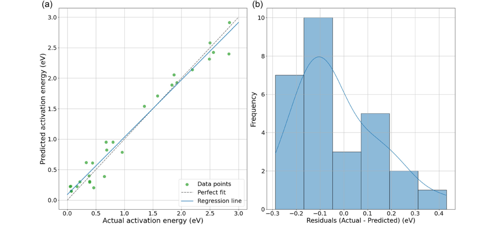

**Original caption:** FIGURE 8 | Final test RFR model accuracy and residual analysis for predicted activation energies, (a) scatter plot of actual versus predicted energies, (b) residual Histogram.

**中文图注:** 图 8 |最终测试 RFR 模型精度和预测激活能量的残差分析，(a) 实际能量与预测能量的散点图，(b) 残差直方图。

**Source:** p.10 S120

**Original:** 10 of 17 Advanced Intelligent Discovery, 2026

**中文:** 10 of 17 高级智能发现，2026

**Source:** p.11 S121

**Original:** heterogeneous datasets like the ones used in this study. While RFR offers strong predictive performance, its limited interpretability at the level of individual predictions can hinder the extraction of detailed mechanistic insights. To overcome this, SHapley Additive exPlanations (SHAP) [83, 84] analysis was performed for understanding how specific features influence individual predictions (next section).

**中文:** 像本研究中使用的异构数据集。虽然 RFR 提供了强大的预测性能，但其在个体预测层面的有限解释性可能会阻碍详细机制见解的提取。为了克服这个问题，进行了 SHapley Additive exPlanations (SHAP) [83, 84] 分析，以了解特定特征如何影响个体预测（下一节）。

**Source:** p.11 S122

**Original:** This study focuses on using ML to predict activation energies for various reactions involving water, hydroxyl, hydrogen, and carbon dioxide on MXene surfaces. MXenes, known for their versatile catalytic properties, are tailored to suit a range of chemical reactions, particularly those important in sustainable energy technologies. The study explores the relationship between surface catalytic properties, such as adsorption energies and charge transfer capabilities, and activation energies. Despite the limited dataset, the machine learning models showed promising predictive accuracy, with plans to expand the dataset and incorporate additional models for better performance. Future work will focus on increasing the dataset through computational simulations, including more reactions and surface species, and enhancing the interpretability and reliability of the models through methods like DFT simulations. These efforts aim to improve the predictive framework and support the development of scalable, generalized catalytic solutions.

**中文:** 本研究的重点是使用机器学习来预测 MXene 表面上涉及水、羟基、氢和二氧化碳的各种反应的活化能。 MXene 以其多功能催化特性而闻名，专为适应一系列化学反应而设计，特别是那些在可持续能源技术中重要的化学反应。该研究探讨了表面催化性能（例如吸附能和电荷转移能力）与活化能之间的关系。尽管数据集有限，但机器学习模型显示出有希望的预测准确性，并计划扩展数据集并合并其他模型以获得更好的性能。未来的工作将侧重于通过计算模拟增加数据集，包括更多的反应和表面物种，并通过 DFT 模拟等方法增强模型的可解释性和可靠性。这些努力旨在改进预测框架并支持可扩展的通用催化解决方案的开发。

**Source:** p.11 S123

**Original:** In the study of Hutton et al. [85] which focused on predicting activation energies for chemical reactions on metal surfaces, the authors employed RFR, SVR, and GBR to predict activation energies for reactions involving C, O, and H-containing molecules on transition metal surfaces. They reported the following performance metrics: RFR with a mean absolute error of 0.17 eV, GBR with an MAE of 0.15 eV, and SVR with an MAE of 0.17 eV. In comparison, our work takes a similar approach by using machine learning models to predict activation energies, but with a focus on MXenes. Our results, however, surpassed the performance metrics presented by Hutton et al., with an MAE of 0.12 eV. This supports that our model is well suited for predicting activation energies on MXene surfaces, likely due to the unique properties of MXenes and the customized approach we adopted to account for their surface characteristics. Both studies highlight the superiority of non-linear models, such as RFR, over traditional linear regression, which struggles to capture the complexity of interactions in catalytic systems. The parallels between our work and that of Hutton et al., emphasize the growing role of ML in accelerating the understanding of complex catalytic systems.

**中文:** 在赫顿等人的研究中。 [85]专注于预测金属表面化学反应的活化能，作者采用 RFR、SVR 和 GBR 来预测涉及过渡金属表面上含 C、O 和 H 分子的反应的活化能。他们报告了以下性能指标：RFR 的平均绝对误差为 0.17 eV，GBR 的 MAE 为 0.15 eV，SVR 的 MAE 为 0.17 eV。相比之下，我们的工作采用了类似的方法，使用机器学习模型来预测激活能，但重点关注 MXene。然而，我们的结果超过了 Hutton 等人提出的性能指标，MAE 为 0.12 eV。这表明我们的模型非常适合预测 MXene 表面的活化能，这可能是由于 MXene 的独特属性以及我们为考虑其表面特性而采用的定制方法。这两项研究都强调了非线性模型（例如 RFR）相对于传统线性回归的优越性，传统线性回归难以捕捉催化系统中相互作用的复杂性。我们的工作与 Hutton 等人的工作之间的相似之处强调了机器学习在加速理解复杂催化系统方面日益重要的作用。

**Source:** p.11 S124

**Original:** The findings from our work demonstrate that ML models, particularly ensemble methods like RFR and GBR, can effectively predict activation energies even when applied to a relatively small dataset (92 data points). While smaller datasets are often considered a limitation in machine learning, we recognize that with careful model selection and data handling, effective predictions can still be achieved. To mitigate overfitting and ensure the robustness of our models, we employed several strategies, including 5-fold cross-validation, regularization techniques, and hyperparameter optimization through RandomizedSearchCV. Studies reported in the past year support the validity of machine learning approaches, even when applied to small datasets in catalysis research. For example, Taniike et al. [86] developed an automatic feature engineering method that extracts relevant descriptors without prior

**中文:** 我们的工作结果表明，ML 模型，特别是 RFR 和 GBR 等集成方法，即使应用于相对较小的数据集（92 个数据点）也可以有效地预测激活能。虽然较小的数据集通常被认为是机器学习的限制，但我们认识到，通过仔细的模型选择和数据处理，仍然可以实现有效的预测。为了减轻过度拟合并确保模型的稳健性，我们采用了多种策略，包括 5 折交叉验证、正则化技术和通过 RandomizedSearchCV 进行超参数优化。去年报告的研究支持机器学习方法的有效性，即使应用于催化研究中的小数据集。例如，Taniike 等人。 [86]开发了一种自动特征工程方法，无需事先提取相关描述符

**Source:** p.11 S125

**Original:** 29439981, 2026, 2, Downloaded from https://advanced.onlinelibrary.wiley.com/doi/10.1002/aidi.202500045 by Readcube-Labtiva, Wiley Online Library on [22/05/2026]. See the Terms and Conditions (https://onlinelibrary.wiley.com/terms-and-conditions) on Wiley Online Library for rules of use; OA articles are governed by the applicable Creative Commons License

**中文:** 29439981, 2026, 2，由 Readcube-Labtiva、Wiley 在线图书馆于 [22/05/2026] 从 https://advanced.onlinelibrary.wiley.com/doi/10.1002/aidi.202500045 下载。有关使用规则，请参阅 Wiley 在线图书馆的条款和条件 (https://onlinelibrary.wiley.com/terms-and-conditions)；开放获取文章受适用的知识共享许可证管辖

**Source:** p.11 S126

**Original:** domain-specific knowledge and successfully applied it to three different catalytic systems with limited data. Their results show that accurate ML models can still be developed under such constraints. Abraham et al. [87] reviewed the application of ML in catalysis and emphasized that even small, domain-specific datasets can yield valuable insights when coupled with appropriate algorithm selection and consistent data handling principles. Similarly, Chen et al. [88] introduced a small-data-oriented workflow for catalytic propane activation and found that ensemble models such as Random Forest and CatBoost are particularly effective in small data scenarios. These three examples reinforce that with careful model selection and data curation, as implemented in our study, both reliability and interpretability can be effectively maintained.

**中文:** 特定领域的知识，并成功地将其应用于数据有限的三种不同的催化系统。他们的结果表明，在这种限制下仍然可以开发准确的机器学习模型。亚伯拉罕等人。 [87]回顾了机器学习在催化中的应用，并强调，当与适当的算法选择和一致的数据处理原则相结合时，即使是小型的、特定领域的数据集也可以产生有价值的见解。同样，陈等人。 [88]引入了一种面向小数据的催化丙烷活化工作流程，发现随机森林和 CatBoost 等集成模型在小数据场景中特别有效。这三个例子强调，通过仔细的模型选择和数据管理，正如我们研究中所实施的那样，可以有效地保持可靠性和可解释性。

**Source:** p.11 S127

**Original:** 3.4 | Feature Importance and SHAP Analyses

**中文:** 3.4 | 3.4特征重要性和 SHAP 分析

**Source:** p.11 S128

**Original:** Feature importance analysis is a crucial technique used to understand how individual features or variables influence the prediction outcome in a model. It helps pinpoint which factors have the greatest impact on the accuracy of the model, enabling a better understanding of the underlying data and its relationships [89, 90]. In our study, we employed feature permutation importance, a method that assesses the contribution of each feature by randomly shuffling its values and measuring the resulting change in the model’s performance. A notable drop in performance indicates that the feature is highly important, while a minimal change suggests the feature has lower relevance to the predictions of the model. This technique can be applied to any model type and offers insights into the most influential factors driving the model’s results. Figure 9 demonstrates this process using RFR, where the decrease in R2 helps quantify the predictive value of each feature.

**中文:** 特征重要性分析是一种关键技术，用于了解各个特征或变量如何影响模型中的预测结果。它有助于查明哪些因素对模型的准确性影响最大，从而更好地理解基础数据及其关系 [89, 90]。在我们的研究中，我们采用了特征排列重要性，这种方法通过随机调整每个特征的值并测量模型性能的变化来评估每个特征的贡献。性能显着下降表明该特征非常重要，而最小的变化表明该特征与模型预测的相关性较低。该技术可应用于任何模型类型，并提供对驱动模型结果最有影响力的因素的见解。图 9 使用 RFR 演示了此过程，其中 R2 的减少有助于量化每个特征的预测值。

**Source:** p.11 S129

**Original:** Reaction energy emerges as the most significant feature in the model, exhibiting the highest mean decrease in R2, indicating its dominant influence on the model’s predictive accuracy. The strong correlation between these two variables highlights the essential role that thermodynamic properties play in determining the energy barrier of a reaction, while activation energy specifically governs the kinetics by dictating the energy barrier that must be overcome for the reaction to proceed. Thus, as it had to be expected, omitting reaction energy from the model would lead to a marked reduction in its predictive capability, underscoring the critical importance of reaction energy in the accurate modeling of activation energy. Reaction energy encapsulates the thermodynamic changes that occur during the chemical transformation of reactants to products. It serves as a fundamental indicator of the catalytic efficiency of a system, reflecting the energy released or consumed in the reaction. The significance of reaction energy in this context suggests a substantial interplay between thermodynamics and activation energy, which is consistent with the Brønsted–Evans–Polanyi principle [91–93]. This principle posits that the activation energy of a reaction is typically related to its reaction energy, that is, more exergonic (thermodynamically favorable) reactions generally exhibit lower activation barriers. This relationship emphasizes that the thermodynamic favorability of a reaction directly influences its kinetic parameters, offering a deeper understanding of the underlying catalytic behavior.

**中文:** 反应能是模型中最重要的特征，R2 的平均下降幅度最大，表明其对模型预测准确性的主要影响。这两个变量之间的强相关性凸显了热力学性质在确定反应的能垒方面发挥的重要作用，而活化能通过规定反应进行必须克服的能垒来专门控制动力学。因此，正如所预料的那样，从模型中省略反应能将导致其预测能力显着降低，这强调了反应能在活化能精确建模中的至关重要性。反应能概括了反应物化学转化为产物过程中发生的热力学变化。它是系统催化效率的基本指标，反映反应中释放或消耗的能量。在这种情况下，反应能的重要性表明热力学和活化能之间存在实质性的相互作用，这与布朗斯台德-埃文斯-波兰尼原理一致[91-93]。该原理假定反应的活化能通常与其反应能相关，也就是说，放能（热力学有利）的反应通常表现出较低的活化势垒。这种关系强调了反应的热力学有利性直接影响其动力学参数，从而提供了对潜在催化行为的更深入的理解。

**Source:** p.11 S130

**Original:** Advanced Intelligent Discovery, 2026 11 of 17

**中文:** 高级智能发现，2026 年第 11 期（共 17 期）

### Fig. 009

**Placed near:** p.12 S130
**Source:** p.12 C009

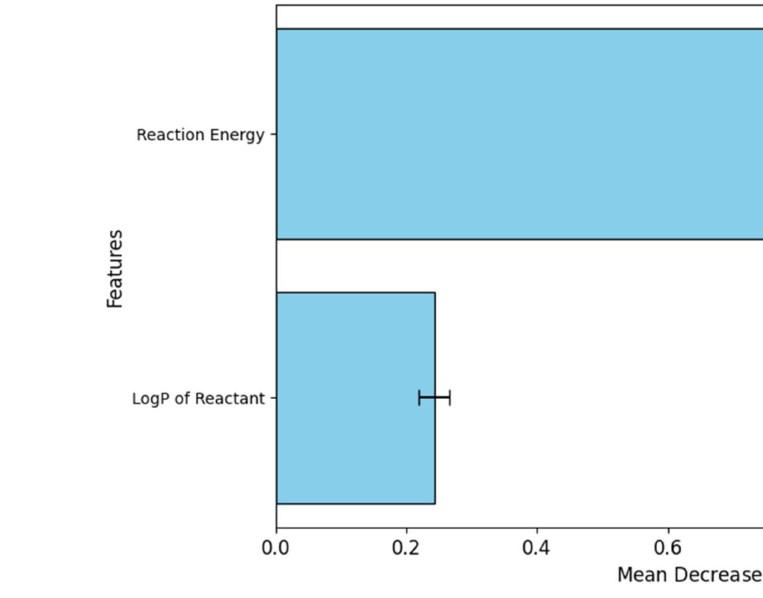

**Original caption:** FIGURE 9 | Permutation feature importance analysis using random forest regression.

**中文图注:** 图 9 |使用随机森林回归进行排列特征重要性分析。

**Source:** p.12 S131

**Original:** In addition to feature permutation importance, SHAP analysis was also performed to analyze feature importance and their impact on the output. According to the results presented in Figure 10, the reaction energy is the most important feature, which validates the previous feature permutation importance results. Moreover, according to the average SHAP values, changes in reaction energy move the predicted activation barrier about twice as much, on average, than changes in LogP. According to the SHAP values presented in the graphic below in Figure 10, for the reaction energy (top row), the lower reaction energies (blue) cluster on the left (negative SHAP), meaning that they tend to push the model’s predicted barrier down. Whereas, higher reaction energies (red) cluster on the right (positive SHAP), meaning that they tend to result in higher activation energies. For LogP of reactant (bottom row), lower LogP values (blue) tend to give negative SHAP, which means that, in the model, they slightly lower the predicted barrier. Whereas high LogP (red) tends to give positive SHAP (raising the predicted activation energy).

**中文:** 除了特征排列重要性之外，还进行了 SHAP 分析来分析特征重要性及其对输出的影响。根据图10所示的结果，反应能是最重要的特征，这验证了之前的特征排列重要性结果。此外，根据平均 SHAP 值，反应能量的变化对预测的活化势垒的移动量平均是 LogP 变化的两倍。根据图 10 下图中显示的 SHAP 值，对于反应能量（顶行），较低的反应能量（蓝色）聚集在左侧（负 SHAP），这意味着它们倾向于将模型的预测势垒推低。然而，较高的反应能（红色）聚集在右侧（正 SHAP），这意味着它们往往会产生较高的活化能。对于反应物的 LogP（底行），较低的 LogP 值（蓝色）往往会产生负 SHAP，这意味着在模型中，它们会稍微降低预测势垒。而高 LogP（红色）往往会产生正 SHAP（提高预测的激活能）。

**Source:** p.12 S132

**Original:** This is very useful for the first-principles calculation of activation energies, since reaction energies are significantly cheaper to calculate computationally. Knowing that a BEP-like relationship holds, reaction energies can then be used to assess (at least preliminarily) the catalytic potential of a MXene surface. While there are exceptions in specific cases [94], this general trend holds true, reinforcing the connection between thermodynamic properties and reaction kinetics. The identification of reaction energy as a key factor in activation energy prediction further establishes it as a crucial bridge between the thermodynamic and kinetic aspects of catalysis, providing valuable insights into the catalytic performance of the studied MXenes.

**中文:** 这对于活化能的第一原理计算非常有用，因为反应能的计算成本要低得多。知道类似 BEP 的关系成立后，就可以使用反应能量来评估（至少初步评估）MXene 表面的催化潜力。虽然在特定情况下也有例外[94]，但这一总体趋势是正确的，加强了热力学性质和反应动力学之间的联系。将反应能确定为活化能预测的关键因素，进一步将其确立为催化热力学和动力学方面之间的重要桥梁，为所研究的 MXene 的催化性能提供了宝贵的见解。

**Source:** p.12 S133

**Original:** Fajín et al. [95] identified the co-adsorption energy of OH and H, the products of water dissociation, as the most significant descriptor for a range of surfaces, including monometallic, bimetallic, and trimetallic surfaces, metallic nanotubes, and platinum

**中文:** 法金等人。 [95] 确定了 OH 和 H（水离解产物）的共吸附能，作为一系列表面的最重要的描述符，包括单金属、双金属和三金属表面、金属纳米管和铂

**Source:** p.12 S134

**Original:** 29439981, 2026, 2, Downloaded from https://advanced.onlinelibrary.wiley.com/doi/10.1002/aidi.202500045 by Readcube-Labtiva, Wiley Online Library on [22/05/2026]. See the Terms and Conditions (https://onlinelibrary.wiley.com/terms-and-conditions) on Wiley Online Library for rules of use; OA articles are governed by the applicable Creative Commons License

**中文:** 29439981, 2026, 2，由 Readcube-Labtiva、Wiley 在线图书馆于 [22/05/2026] 从 https://advanced.onlinelibrary.wiley.com/doi/10.1002/aidi.202500045 下载。有关使用规则，请参阅 Wiley 在线图书馆的条款和条件 (https://onlinelibrary.wiley.com/terms-and-conditions)；开放获取文章受适用的知识共享许可证管辖

**Source:** p.12 S135

**Original:** nanoparticles. However, this descriptor was found to strongly correlate with the reaction energy of the water dissociation into OH and H (Equation (1)), which was excluded in their study to prevent multicollinearity. Had the reaction energy been used instead of the co-adsorption energy of OH and H, it likely would have emerged as the most significant descriptor, as seen in our current work. Although more computationally demanding, the reaction energy offers a more comprehensive description, accounting for both the initial and final reaction states.

**中文:** 纳米颗粒。然而，我们发现这个描述符与水分解成 OH 和 H 的反应能密切相关（方程 (1)），在他们的研究中被排除以防止多重共线性。如果使用反应能而不是 OH 和 H 的共吸附能，它可能会成为最重要的描述符，正如我们当前的工作中所见。尽管计算要求更高，但反应能提供了更全面的描述，同时考虑了初始和最终反应状态。

**Source:** p.12 S136

**Original:** The LogP value of the main adsorbate species (H2O, OH, H2, and CO2), a measure of the hydrophobicity of the compound, emerges, quite unexpectedly, as the second most significant feature in the model for predicting activation energy, although its influence is secondary to that of reaction energy. This observation suggests that while the hydrophobicity of the reactant, as indicated by its LogP, does impact activation energy, it exerts a comparatively smaller effect than thermodynamic factors like reaction energy. Hydrophobic molecules typically exhibit distinct behaviors in catalytic reactions, particularly in their interactions with catalytic surfaces [96]. The moderate correlation between LogP and activation energy implies that hydrophobicity can influence how reactants interact with the catalyst, thereby affecting the energy barrier of the reaction. Specifically, more hydrophobic reactants may adhere differently to catalyst surfaces compared to more hydrophilic reactants. This difference in adsorption can alter the activation energy, either by stabilizing or destabilizing the transition state, depending on the nature of the interaction. This effect could vary depending on the specific catalytic surface and the environment in which the reaction takes place [97].

**中文:** 主要吸附物质（H2O、OH、H2 和 CO2）的 LogP 值（化合物疏水性的量度）出人意料地成为预测活化能模型中第二个最重要的特征，尽管其影响仅次于反应能。这一观察结果表明，虽然反应物的疏水性（如其 LogP 所示）确实影响活化能，但其影响比反应能等热力学因素相对较小。疏水分子通常在催化反应中表现出不同的行为，特别是在它们与催化表面的相互作用中[96]。 LogP 和活化能之间的适度相关性意味着疏水性可以影响反应物与催化剂的相互作用，从而影响反应的能垒。具体地，与更亲水的反应物相比，更疏水的反应物可以以不同的方式粘附到催化剂表面。这种吸附的差异可以通过稳定或不稳定过渡态来改变活化能，具体取决于相互作用的性质。这种效果可能会根据特定的催化表面和反应发生的环境而变化[97]。

**Source:** p.12 S137

**Original:** Our study primarily aims to predict the activation energies for reactions involving MXenes and the H2O, OH, CO2, and H2 species (Equations (1)–(4)) because of their importance in the redox route of the WGS reaction. We focused on thermodynamic and hydrophobicity-related factors. Future work incorporating

**中文:** 我们的研究主要目的是预测涉及 MXene 和 H2O、OH、CO2 和 H2 物质（方程式 (1)–(4)）的反应的活化能，因为它们在 WGS 反应的氧化还原路线中很重要。我们专注于热力学和疏水性相关因素。未来的工作纳入

**Source:** p.12 S138

**Original:** 12 of 17 Advanced Intelligent Discovery, 2026

**中文:** 12 of 17 高级智能发现，2026

**Source:** p.13 S139

**Original:** electronic structure features and solvent effects could further enhance the predictive accuracy of our model. Solvent effects modeled using an implicit solvent formalism were found to noticeably affect adsorption energies on metal surfaces and could be relevant, for example, in electrocatalytic reactions [98]. The observed relationship between feature importance and reaction kinetics suggests that a multi-variable approach, integrating thermodynamic, kinetic, and electronic descriptors, may provide a more comprehensive understanding of catalytic behavior. Expanding feature selection to include these aspects could yield deeper insights into the mechanistic foundations of activation energy variations, ultimately aiding in the rational design of high-performance catalysts. Beyond these factors, charge distribution on the MXene surface and the distance between active sites may influence activation energy predictions by affecting reactant adsorption and transition state stabilization [99].

**中文:** 电子结构特征和溶剂效应可以进一步提高我们模型的预测准确性。使用隐式溶剂形式建模的溶剂效应被发现显着影响金属表面的吸附能，并且可能与电催化反应等相关[98]。观察到的特征重要性和反应动力学之间的关系表明，整合热力学、动力学和电子描述符的多变量方法可以提供对催化行为的更全面的理解。扩大特征选择以包括这些方面可以更深入地了解活化能变化的机械基础，最终有助于高性能催化剂的合理设计。除了这些因素之外，MXene 表面的电荷分布和活性位点之间的距离可能会通过影响反应物吸附和过渡态稳定性来影响活化能预测[99]。

**Source:** p.13 S140

**Original:** Adsorption energy, a key descriptor in heterogeneous catalysis, could further strengthen predictive models by quantifying reactant–catalyst interaction strength. Additionally, incorporating reactant-specific properties, such as dipole moment, polarizability, and electron affinity, could offer deeper insights into how molecular characteristics shape catalytic performance. In this study, we used a single predictive model for all reactions. However, for future work, it may be useful to apply multitask learning or hierarchical modeling approaches. These methods could help better separate features that are specific to each reaction from those that are shared across all reactions. This would allow the model to better capture both general trends and unique

**中文:** 吸附能是多相催化中的关键描述符，可以通过量化反应物-催化剂相互作用强度来进一步增强预测模型。此外，结合反应物特定的特性，如偶极矩、极化率和电子亲和力，可以更深入地了解分子特征如何影响催化性能。在本研究中，我们对所有反应使用单一预测模型。然而，对于未来的工作，应用多任务学习或分层建模方法可能会很有用。这些方法可以帮助更好地将每个反应特有的特征与所有反应共享的特征分开。这将使模型能够更好地捕捉总体趋势和独特趋势

**Source:** p.13 S141

**Original:** 29439981, 2026, 2, Downloaded from https://advanced.onlinelibrary.wiley.com/doi/10.1002/aidi.202500045 by Readcube-Labtiva, Wiley Online Library on [22/05/2026]. See the Terms and Conditions (https://onlinelibrary.wiley.com/terms-and-conditions) on Wiley Online Library for rules of use; OA articles are governed by the applicable Creative Commons License

**中文:** 29439981, 2026, 2，由 Readcube-Labtiva、Wiley 在线图书馆于 [22/05/2026] 从 https://advanced.onlinelibrary.wiley.com/doi/10.1002/aidi.202500045 下载。有关使用规则，请参阅 Wiley 在线图书馆的条款和条件 (https://onlinelibrary.wiley.com/terms-and-conditions)；开放获取文章受适用的知识共享许可证管辖

**Source:** p.13 S142

**Original:** patterns, especially when working with a larger set of diverse reactions or more complex catalytic systems.

**中文:** 模式，尤其是在处理更多不同的反应或更复杂的催化系统时。

## 4 | Conclusions and Perspectives / 结论

**Source:** p.13 S143

**Original:** 4 | Conclusions and Perspectives

**中文:** 4 |结论和观点

**Source:** p.13 S144

**Original:** This study underscores the potential of machine learning methods, particularly ensemble techniques like GBR and RFR, in predicting the activation energies of reactions involving MXenes. Among these models, RFR demonstrated the best performance, achieving an impressive mean cross-validation R2 of 0.95, with a root mean square error of 0.17 eV and a mean absolute error of 0.12 eV. These results confirm the efficacy of RFR in accurately predicting activation energies, highlighting its importance as a predictive tool. Feature selection revealed that two key attributes, namely, the reaction energy and the logarithm of the partition coefficient of the reactant, are the most influential in determining the activation energy. Notably, reaction energy was identified as the most important feature in influencing the model’s predictions. This insight is crucial for understanding the key factors that drive activation energies of reactions occurring on MXene surfaces.

**中文:** 这项研究强调了机器学习方法，特别是 GBR 和 RFR 等集成技术在预测涉及 MXene 的反应活化能方面的潜力。在这些模型中，RFR 表现出了最佳的性能，达到令人印象深刻的平均交叉验证 R2 为 0.95，均方根误差为 0.17 eV，平均绝对误差为 0.12 eV。这些结果证实了 RFR 在准确预测活化能方面的功效，凸显了其作为预测工具的重要性。特征选择表明，两个关键属性，即反应能和反应物分配系数的对数，对确定活化能影响最大。值得注意的是，反应能被认为是影响模型预测的最重要特征。这一见解对于理解驱动 MXene 表面反应活化能的关键因素至关重要。

**Source:** p.13 S145

**Original:** Future research would benefit from incorporating additional data points from DFT calculations, expanding the dataset to cover a broader range of elementary reactions relevant to catalytic processes. This would deepen the understanding of MXene catalysis and improve the generalizability and robustness of machine learning models, leading to more accurate predictions

**中文:** 未来的研究将受益于纳入 DFT 计算中的额外数据点，扩展数据集以涵盖与催化过程相关的更广泛的基本反应。这将加深对 MXene 催化的理解，提高机器学习模型的通用性和鲁棒性，从而实现更准确的预测

### Fig. 010

**Placed near:** p.13 S145
**Source:** p.13 C010

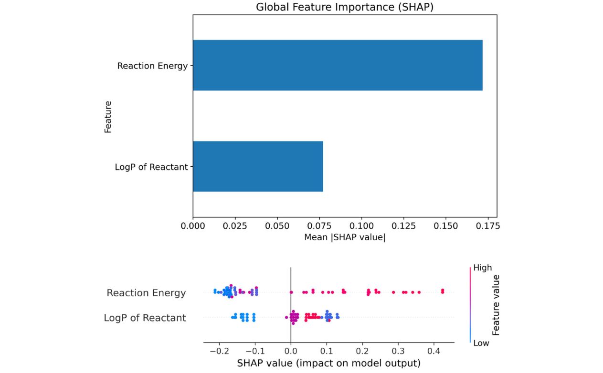

**Original caption:** FIGURE 10 | Average SHAP values (above) and SHAP values (below) for the selected descriptors in this work. For the SHAP values, each dot is one sample, plotted at its SHAP value (x-axis) and colored by the actual feature value (blue = lower than average, red = higher than average).

**中文图注:** 图 10 |本工作中所选描述符的平均 SHAP 值（上图）和 SHAP 值（下图）。对于 SHAP 值，每个点都是一个样本，在其 SHAP 值（x 轴）处绘制，并按实际特征值着色（蓝色 = 低于平均值，红色 = 高于平均值）。

**Source:** p.13 S146

**Original:** Advanced Intelligent Discovery, 2026 13 of 17

**中文:** 高级智能发现，2026 年 13 之 17

**Source:** p.14 S147

**Original:** across various chemical reactions. Integrating additional features, such as reactant-to-surface distances, could further refine these models by capturing subtle catalytic effects. In this context, particular attention should be given to hydrogen carrier molecules like methanol (CH3OH), formaldehyde (H2CO), formic acid (HCOOH), and ammonia (NH3), which are essential in energyrelated and industrial applications. A diverse selection of reactants will enhance the evaluation of MXenes as catalysts, providing a more comprehensive understanding of their catalytic performance.

**中文:** 跨越各种化学反应。集成其他特征，例如反应物到表面的距离，可以通过捕获微妙的催化效应来进一步完善这些模型。在这种情况下，应特别关注氢载体分子，如甲醇 (CH3OH)、甲醛 (H2CO)、甲酸 (HCOOH) 和氨 (NH3)，它们在能源相关和工业应用中至关重要。反应物的多样化选择将增强 MXene 作为催化剂的评估，从而更全面地了解其催化性能。

## Acknowledgments / 致谢

**Source:** p.14 S148

**Original:** Acknowledgments

**中文:** 致谢

**Source:** p.14 S149

**Original:** This work was developed within the scope of the projects CICECO-Aveiro Institute of Materials, with refs. UIDB/50011/2020, UIDP/50011/2020 and LA/P/0006/2020, ForTheShift, with ref. 2022.02949.PTDC, and advanced computing project with ref. 2023.13633.CPCA, financed by national funds through the FCT/MEC (PIDDAC). TLPG and JDG thank the Portuguese Foundation for Science and Technology (FCT) for the grants with Refs. 2022.08205.CEECIND and 2023.06511.CEECIND, in the scope of the Individual Call to Scientific Employment Stimulus – 5th and 6th Editions, respectively. This article is based upon the joint work from the COST Innovation Grant 18234, supported by COST (European Cooperation in Science and Technology).

**中文:** 这项工作是在 CICECO-阿威罗材料研究所项目范围内开发的，参考文献。 UIDB/50011/2020、UIDP/50011/2020 和 LA/P/0006/2020，ForTheShift，参考文献。 2022.02949.PTDC，以及带有参考号的高级计算项目。 2023.13633.CPCA，通过 FCT/MEC (PIDDAC) 由国家资金资助。 TLPG 和 JDG 感谢葡萄牙科学技术基金会 (FCT) 的资助和参考文献。 2022.08205.CEECIND 和 2023.06511.CEECIND，分别属于科学就业刺激个人呼吁 – 第五版和第六版的范围。本文基于 COST 创新补助金 18234 的联合工作，并得到 COST（欧洲科学技术合作）的支持。

**Source:** p.14 S150

**Original:** Conflicts of Interest

**中文:** 利益冲突

**Source:** p.14 S151

**Original:** There are no conflicts of interest to declare.

**中文:** 没有需要申报的利益冲突。

**Source:** p.14 S152

**Original:** Data Availability Statement

**中文:** 数据可用性声明

**Source:** p.14 S153

**Original:** The data set used in this work, including experimental data and all the calculated features, is available in Mendeley Data as an Excel spreadsheet file. The underlying machine learning code for this study is also available as a Python script in Mendeley Data. Both files can be accessed via this link: https://doi.org/10.17632/4zmkpw3wxx.2.

**中文:** 本工作中使用的数据集（包括实验数据和所有计算特征）可在 Mendeley Data 中以 Excel 电子表格文件形式获取。本研究的底层机器学习代码也可以作为 Mendeley Data 中的 Python 脚本提供。这两个文件都可以通过以下链接访问：https://doi.org/10.17632/4zmkpw3wxx.2。

## References / 参考文献

**Source:** p.14 S154

**Original:** References

**中文:** 参考

**Source:** p.14 S155

**Original:** 1. K. Khan, A. K. Tareen, M. Aslam, et al., “Recent Developments in Emerging Two-Dimensional Materials and Their Applications,” Journal of Materials Chemistry C 8, no. 2 (2020): 387–440, https://doi. org/10.1039/C9TC04187G.

**中文:** 1. K. Khan、A. K. Tareen、M. Aslam 等人，“新兴二维材料及其应用的最新进展”，《材料化学杂志》C 8，第 1 期。 2（2020）：387-440，https://doi。 org/10.1039/C9TC04187G。

**Source:** p.14 S156

**Original:** 2. J. D. Gouveia, H. Rocha, and J. R. B. Gomes, “MXene-Supported Transition Metal Single-Atom Catalysts for Nitrogen Dissociation,” Molecular Catalysis 547 (2023): 113373, https://doi.org/10.1016/j.mcat. 2023.113373.

**中文:** 2. J. D. Gouveia、H. Rocha 和 J. R. B. Gomes，“用于氮解离的 MXene 支持的过渡金属单原子催化剂”，分子催化 547 (2023)：113373，https://doi.org/10.1016/j.mcat。 2023.113373。

**Source:** p.14 S157

**Original:** 3. X. Li, C. Wang, Y. Cao, and G. Wang, “Functional MXene Materials: Progress of Their Applications,” Chemistry – An Asian Journal 13, no. 19 (2018): 2742–2757, https://doi.org/10.1002/asia.201800543.

**中文:** 3. X. Li、C. Wang、Y. Cao 和 G. Wang，“功能性 MXene 材料：其应用进展”，《化学 – 亚洲杂志》13，第 1 期。 19（2018）：2742–2757，https://doi.org/10.1002/asia.201800543。

**Source:** p.14 S158

**Original:** 4. R. V. Afonso, J. D. Gouveia, and J. R. B. Gomes, “Catalytic Reactions for H2 Production on Multimetallic Surfaces: A Review,” Journal of Physics: Energy 3, no. 3 (2021): 032016, https://doi.org/10.1088/2515-7655/ac0d9f.

**中文:** 4. R. V. Afonso、J. D. Gouveia 和 J. R. B. Gomes，“多金属表面制氢的催化反应：综述”，《物理杂志：能源》第 3 期，第 3 期。 3（2021）：032016，https://doi.org/10.1088/2515-7655/ac0d9f。

**Source:** p.14 S159

**Original:** 5. F. Liu, Z. Fan, “Defect Engineering of Two-Dimensional Materials for Advanced Energy Conversion and Storage,” Chemical Society Reviews 52, no. 5 (2023): 1723–1772, https://doi.org/10.1039/D2CS00931E.

**中文:** 5. F. Liu, Z. Fan，“用于先进能量转换和存储的二维材料的缺陷工程”，化学会评论 52，第 1 期。 5（2023）：1723–1772，https://doi.org/10.1039/D2CS00931E。

**Source:** p.14 S160

**Original:** 6. R. Kulkarni, L. P. Lingamdinne, J. R. Koduru, et al., “Recent Advanced Developments and Prospects of Surface Functionalized MXenes-Based Hybrid Composites toward Electrochemical Water Splitting Applications,” ACS Materials Letters 6, no. 7 (2024): 2660–2686, https://doi.org/10.1021/acsmaterialslett.4c00034.

**中文:** 6. R. Kulkarni、L. P. Lingamdinne、J. R. Koduru 等人，“基于表面功能化 MXenes 的杂化复合材料在电化学水分解应用方面的最新进展和前景”，ACS Materials Letters 6，第 1 期。 7（2024）：2660–2686，https://doi.org/10.1021/acsmaterialslett.4c00034。

**Source:** p.14 S161

**Original:** 7. T. Rasheed, “3D MXenes as Promising Alternatives for Potential Electrocatalysis Applications: Opportunities and Challenges,” Journal

**中文:** 7. T. Rasheed，“3D MXenes 作为潜在电催化应用的有希望的替代品：机遇与挑战”，期刊

**Source:** p.14 S162

**Original:** 29439981, 2026, 2, Downloaded from https://advanced.onlinelibrary.wiley.com/doi/10.1002/aidi.202500045 by Readcube-Labtiva, Wiley Online Library on [22/05/2026]. See the Terms and Conditions (https://onlinelibrary.wiley.com/terms-and-conditions) on Wiley Online Library for rules of use; OA articles are governed by the applicable Creative Commons License

**中文:** 29439981, 2026, 2，由 Readcube-Labtiva、Wiley 在线图书馆于 [22/05/2026] 从 https://advanced.onlinelibrary.wiley.com/doi/10.1002/aidi.202500045 下载。有关使用规则，请参阅 Wiley 在线图书馆的条款和条件 (https://onlinelibrary.wiley.com/terms-and-conditions)；开放获取文章受适用的知识共享许可证管辖

**Source:** p.14 S163

**Original:** of Materials Chemistry C 10, no. 26 (2022): 9669–9690, https://doi.org/ 10.1039/D2TC01542K.

**中文:** 材料化学 C 10，编号。 26（2022）：9669–9690，https://doi.org/10.1039/D2TC01542K。

**Source:** p.14 S164

**Original:** 8. Y. Wang, Y. Xu, M. Hu, H. Ling, and X. Zhu, “MXenes: Focus on Optical and Electronic Properties and Corresponding Applications,” Nanophotonics 9, no. 7 (2020): 1601–1620, https://doi.org/10.1515/ nanoph-2019-0556.

**中文:** 8. Y. Wang、Y. Xu、M. Hu、H. Ling 和 X. Zhu，“MXenes：聚焦光学和电子特性及相应应用”，Nanophotonics 9，第 1 期。 7（2020）：1601-1620，https://doi.org/10.1515/nanoph-2019-0556。

**Source:** p.14 S165

**Original:** 9. V. A. Tran, N. T. Tran, V. D. Doan, T. -Q. Nguyen, H. H. P. Thi, and G. N. L. Vo, “Application Prospects of MXenes Materials Modifications for Sensors,” Micromachines 14, no. 2 (2023): 247, https://doi.org/10.3390/ mi14020247.

**中文:** 9. V. A. Tran、N. T. Tran、V. D. Doan、T. -Q。 Nguyen、H. H. P. Thi 和 G. N. L. Vo，“MXenes 材料改性传感器的应用前景”，Micromachines 14，第 1 期。 2（2023）：247，https://doi.org/10.3390/mi14020247。

**Source:** p.14 S166

**Original:** 10. S. K. Kailasa, D. J. Joshi, J. R. Koduru, and N. I. Malek, “Review on MXenes-Based Nanomaterials for Sustainable Opportunities in Energy Storage, Sensing and Electrocatalytic Reactions,” Journal of Molecular Liquids 342 (2021): 117524, https://doi.org/10.1016/j.molliq. 2021.117524.

**中文:** 10. S.K. Kailasa、D. J. Joshi、J. R. Koduru 和 N. I. Malek，“Review on MXenes-Based Nanomaterials for Sustainable Opportunities in Energy Storage, Sensing and Electrochemistry Reactions”，《分子液体杂志》342 (2021)：117524，https://doi.org/10.1016/j.molliq。 2021.117524。

**Source:** p.14 S167

**Original:** 11. B. Ahmed, A. E. Ghazaly, and J. Rosen, “i-MXenes for Energy Storage and Catalysis,” Advanced Functional Materials 30, no. 47 (2020): 2000894, https://doi.org/10.1002/adfm.202000894.

**中文:** 11. B. Ahmed、A. E. Ghazaly 和 J. Rosen，“i-MXenes 用于能量存储和催化”，《先进功能材料》30，第 11 期。 47（2020）：2000894，https://doi.org/10.1002/adfm.202000894。

**Source:** p.14 S168

**Original:** 12. S. Abdolhosseinzadeh, M. Jafarpour, J. Heier, F. Nüesch, and C. Zhang, “Solution Processing of MXenes for Printing, Wet Coating, and 2D Film Formation,” in Transition Metal Carbides and Nitrides (MXenes) Handbook (Wiley, 2024), 272–293, https://doi.org/10.1002/ 9781119869528.ch13.

**中文:** 12. S. Abdolhosseinzadeh、M. Jafarpour、J. Heier、F. Nüesch 和 C. Zhang，“用于印刷、湿涂和 2D 成膜的 MXene 溶液处理”，《过渡金属碳化物和氮化物 (MXenes) 手册》（Wiley，2024 年），272-293， https://doi.org/10.1002/9781119869528.ch13。

**Source:** p.14 S169

**Original:** 13. B. Anasori, C. Shi, E. J. Moon, et al., “Control of Electronic Properties of 2D Carbides (MXenes) by Manipulating Their Transition Metal Layers,” Nanoscale Horizons 1, no. 3 (2016): 227–234, https://doi.org/ 10.1039/C5NH00125K.

**中文:** 13. B. Anasori、C. Shi、E. J. Moon 等人，“通过操纵过渡金属层来控制 2D 碳化物 (MXene) 的电子特性”，《纳米尺度地平线》1，第 1 期。 3（2016）：227-234，https://doi.org/10.1039/C5NH00125K。

**Source:** p.14 S170

**Original:** 14. N. Mayilswamy, A. Krishnan, M. Mundhada, H. Deodhar, G. Joshi, and B. Kandasubramanian, “Shock Wave-Assisted Exfoliation of 2DMaterial-Based Polymer Nanocomposites: A Breakthrough in Nanotechnology,” Industrial and Engineering Chemistry Research 62, no. 17 (2023): 6584–6598, https://doi.org/10.1021/acs.iecr.3c00837.

**中文:** 14. N. Mayilswamy、A. Krishnan、M. Mundhada、H. Deodhar、G. Joshi 和 B. Kandasubramanian，“二维材料聚合物纳米复合材料的冲击波辅助剥离：纳米技术的突破”，工业和工程化学研究 62，第 14 期。 17（2023）：6584–6598，https://doi.org/10.1021/acs.iecr.3c00837。

**Source:** p.14 S171

**Original:** 15. Y. Wu, X. Li, H. Zhao, et al., “Recent Advances in Transition Metal Carbides and Nitrides (MXenes): Characteristics, Environmental Remediation and Challenges,” Chemical Engineering Journal 418 (2021): 129296, https://doi.org/10.1016/j.cej.2021.129296.

**中文:** 15. Y. Wu、X. Li、H. Zhu 等人，“过渡金属碳化物和氮化物 (MXene) 的最新进展：特征、环境修复和挑战”，《化学工程杂志》418 (2021)：129296，https://doi.org/10.1016/j.cej.2021.129296。

**Source:** p.14 S172

**Original:** 16. J. D. Gouveia, Á. Morales-García, F. Vi˜nes, J. R. B. Gomes, and F. Illas, “Facile Heterogeneously Catalyzed Nitrogen Fixation by MXenes,” ACS Catalysis 10, no. 9 (2020): 5049–5056, https://doi.org/10.1021/acscatal. 0c00935.

**中文:** 16.J.D.古维亚，Á。 Morales-García、F. Vienes、J. R. B. Gomes 和 F. Illas，“MXene 的简易异质催化固氮”，ACS Catalysis 10，第 1 期。 9（2020）：5049–5056，https://doi.org/10.1021/acscatal。 0c00935。

**Source:** p.14 S173

**Original:** 17. R. Morales-Salvador, J. D. Gouveia, Á. Morales-García, F. Vi˜nes, J. R. B. Gomes, and F. Illas," Carbon Capture and Usage by MXenes," ACS Catalysis 11, no. 17 (2021): 11248–11255, https://doi.org/10.1021/ acscatal.1c02663.

**中文:** 17. R. Morales-Salvador，J. D. Gouveia，Á。 Morales-García、F. Vi nes、J. R. B. Gomes 和 F. Illas，“MXene 的碳捕获和使用”，ACS Catalysis 11，第 1 期。 17（2021）：11248–11255，https://doi.org/10.1021/acscatal.1c02663。

**Source:** p.14 S174

**Original:** 18. J. D. Gouveia, J. R. B. Gomes, “The Determining Role of T Species in the Catalytic Potential of MXenes: Water Adsorption and Dissociation on Mo2CT,” Catalysis Today 424 (2023): 113848, https://doi.org/10.1016/j. cattod.2022.07.016.

**中文:** 18. J. D. Gouveia，J. R. B. Gomes，“T 物种在 MXene 催化潜力中的决定性作用：Mo2CT 上的水吸附和解离”，《今日催化》424 (2023)：113848，https://doi.org/10.1016/j。猫。2022.07.016。

**Source:** p.14 S175

**Original:** 19. Q. Zhu, Y. Cui, Y. Zhang, et al., “Strategies for Engineering the MXenes toward Highly Active Catalysts,” Materials Today Nano 13 (2021): 100104, https://doi.org/10.1016/j.mtnano.2020.100104.

**中文:** 19. Q. Zhu、Y. Cui、Y. Zhang 等人，“将 MXene 设计成高活性催化剂的策略”，Materials Today Nano 13 (2021)：100104，https://doi.org/10.1016/j.mtnano.2020.100104。

**Source:** p.14 S176

**Original:** 20. Y. Zhao, J. Zhang, X. Guo, et al., “Engineering Strategies and Active Site Identification of MXene-Based Catalysts for Electrochemical Conversion Reactions,” Chemical Society Reviews 52, no. 9 (2023): 3215–3264, https://doi.org/10.1039/D2CS00698G.

**中文:** 20. Y.Zhao、J.Zhang、X.Guo 等，“用于电化学转化反应的 MXene 基催化剂的工程策略和活性位点识别”，化学会评论 52，第 1 期。 9 (2023): 3215–3264，https://doi.org/10.1039/D2CS00698G。

**Source:** p.14 S177

**Original:** 21. Á. Morales-García, F. Calle-Vallejo, and F. Illas, “MXenes: New Horizons in Catalysis,” ACS Catalysis 10, no. 22 (2020): 13487–13503, https://doi.org/10.1021/acscatal.0c03106.

**中文:** 21. A. Morales-García、F. Calle-Vallejo 和 F. Illas，“MXenes：催化新视野”，ACS 催化 10，第 1 期。 22（2020）：13487–13503，https://doi.org/10.1021/acscatal.0c03106。

**Source:** p.14 S178

**Original:** 22. P. J. Megía, A. J. Vizcaíno, J. A. Calles, and A. Carrero, “Hydrogen Production Technologies: From Fossil Fuels toward Renewable Sources. A Mini Review,” Energy Fuels 35, no. 20 (2021): 16403–16415, https://doi.org/10.1021/acs.energyfuels.1c02501.

**中文:** 22. P. J. Megía、A. J. Vizcaíno、J. A. Calles 和 A. Carrero，“制氢技术：从化石燃料到可再生能源。小型评论”，Energy Fuels 35，第 1 期。 20（2021）：16403–16415，https://doi.org/10.1021/acs.energyfuels.1c02501。

**Source:** p.14 S179

**Original:** 14 of 17 Advanced Intelligent Discovery, 2026

**中文:** 14 of 17 高级智能发现，2026

**Source:** p.15 S180

**Original:** 23. H. Ishaq, I. Dincer, and C. Crawford, “A Review on Hydrogen Production and Utilization: Challenges and Opportunities,” International Journal of Hydrogen Energy 47, no. 62 (2022): 26238–26264, https://doi.org/10.1016/j.ijhydene.2021.11.149.

**中文:** 23. H. Ishaq、I. Dincer 和 C. Crawford，“氢生产和利用综述：挑战与机遇”，《国际氢能杂志》47，第 1 期。 62（2022）：26238–26264，https://doi.org/10.1016/j.ijhydene.2021.11.149。

**Source:** p.15 S181

**Original:** 24. J. K. Stolarczyk, S. Bhattacharyya, L. Polavarapu, and J. Feldmann, “Challenges and Prospects in Solar Water Splitting and CO2 Reduction with Inorganic and Hybrid Nanostructures,” ACS Catalysis 8, no. 4 (2018): 3602–3635, https://doi.org/10.1021/acscatal.8b00791.

**中文:** 24. J. K. Stolarczyk、S. Bhattacharyya、L. Polavarapu 和 J. Feldmann，“无机和混合纳米结构太阳能水分解和 CO2 还原的挑战和前景”，ACS 催化 8，第 1 期。 4（2018）：3602–3635，https://doi.org/10.1021/acscatal.8b00791。

**Source:** p.15 S182

**Original:** 25. Z. Yu, Y. Duan, X. Feng, X. Yu, M. Gao, and S. Yu, “Clean and Affordable Hydrogen Fuel from Alkaline Water Splitting: Past, Recent Progress, and Future Prospects,” Advanced Materials 33, no. 31 (2021): 2007100, https://doi.org/10.1002/adma.202007100.

**中文:** 25. Z. Yu、Y. Duan、X. Feng、X. Yu、M. Gau 和 S. Yu，“碱性水分解产生的清洁且经济的氢燃料：过去、最近的进展和未来的前景”，《先进材料》33，第 25 期。 31（2021）：2007100，https://doi.org/10.1002/adma.202007100。

**Source:** p.15 S183

**Original:** 26. Z. Chen, W. Wei, and B.-J. Ni, “Cost-Effective Catalysts for Renewable Hydrogen Production via Electrochemical Water Splitting: Recent Advances,” Current Opinion in Green and Sustainable Chemistry 27 (2021): 100398, https://doi.org/10.1016/j.cogsc.2020.100398.

**中文:** 26. Z. Chen、W. Wei 和 B.-J。 Ni，“通过电化学水分解生产可再生氢气的经济有效的催化剂：最新进展”，《绿色和可持续化学最新观点》27 (2021)：100398，https://doi.org/10.1016/j.cogsc.2020.100398。

**Source:** p.15 S184

**Original:** 27. Z. Li, Y. Wu, "2D Early Transition Metal Carbides (MXenes) for Catalysis," Small 15, no. 29 (2019): 1804736, https://doi.org/10.1002/ smll.201804736.

**中文:** 27. Z. Li，Y. Wu，“用于催化的二维早期过渡金属碳化物（MXenes）”，Small 15，第 1 期。 29（2019）：1804736，https://doi.org/10.1002/smll.201804736。

**Source:** p.15 S185

**Original:** 28. T. Amrillah, A. R. Supandi, V. Puspasari, A. Hermawan, and Z. W. Seh, “MXene-Based Photocatalysts and Electrocatalysts for CO2 Conversion to Chemicals,” Transactions of Tianjin University 28, no. 4 (2022): 307–322, https://doi.org/10.1007/s12209-022-00328-9.

**中文:** 28. T. Amrillah、A. R. Supandi、V. Puspasari、A. Hermawan 和 Z. W. Seh，“基于 MXene 的光催化剂和电催化剂用于 CO2 转化为化学品”，《天津大学学报》28，第 11 期。 4（2022）：307-322，https://doi.org/10.1007/s12209-022-00328-9。

**Source:** p.15 S186

**Original:** 29. H. M. A. Sharif, M. Rashad, I. Hussain, A. Abbas, O. F. Aldosari, and C. Li, “Green Energy Harvesting from CO2 and NOx by MXene Materials: Detailed Historical and Future Prospective,” Applied Catalysis B: Environmental 344 (2024): 123585, https://doi.org/10.1016/j.apcatb. 2023.123585.

**中文:** 29. H. M. A. Sharif、M. Rashad、I. Hussain、A. Abbas、O. F. Aldosari 和 C. Li，“通过 MXene 材料从二氧化碳和氮氧化物中获取绿色能源：详细的历史和未来展望”，应用催化 B：环境 344 (2024)：123585， https://doi.org/10.1016/j.apcatb。 2023.123585。

**Source:** p.15 S187

**Original:** 30. M. A. U. Din, S. S. A. Shah, M. S. Javed, et al., “Synthesis of MXeneBased Single-Atom Catalysts for Energy Conversion Applications,” Chemical Engineering Journal 474 (2023): 145700, https://doi.org/10. 1016/j.cej.2023.145700.

**中文:** 30. M. A. U. Din、S. S. A. Shah、M. S. Javed 等人，“用于能量转换应用的基于 MXene 的单原子催化剂的合成”，《化学工程杂志》474 (2023)：145700，https://doi.org/10。 1016/j.cej.2023.145700。

**Source:** p.15 S188

**Original:** 31. W. Kong, J. Deng, and L. Li, “Recent Advances in Noble Metal MXene-Based Catalysts for Electrocatalysis,” Journal of Materials Chemistry A 10, no. 28 (2022): 14674–14691, https://doi.org/10.1039/ D2TA00613H.

**中文:** 31. W. Kong、J. Deng 和 L. Li，“基于贵金属 MXene 的电催化催化剂的最新进展”，《材料化学杂志》A 10，第 1 期。 28（2022）：14674–14691，https://doi.org/10.1039/D2TA00613H。

**Source:** p.15 S189

**Original:** 32. M. Bordonhos, T. L. P. Galvão, J. R. B. Gomes, et al., "Multiscale Computational Approaches toward the Understanding of Materials," Advanced Theory and Simulations 6, no. 10 (2023): 2200628, https:// doi.org/10.1002/adts.202200628.

**中文:** 32. M. Bordonhos、T. L. P. Galvão、J. R. B. Gomes 等人，“理解材料的多尺度计算方法”，《高级理论与模拟》6，第 1 期。 10（2023）：2200628，https://doi.org/10.1002/adts.202200628。

**Source:** p.15 S190

**Original:** 33. K. M. Jablonka, D. Ongari, S. M. Moosavi, and B. Smit, “Big-Data Science in Porous Materials: Materials Genomics and Machine Learning,” Chemical Reviews 120, no. 16 (2020): 8066–8129, https://doi. org/10.1021/acs.chemrev.0c00004.

**中文:** 33. K. M. Jablonka、D. Ongari、S. M. Moosavi 和 B. Smit，“多孔材料中的大数据科学：材料基因组学和机器学习”，《化学评论》120，第 1 期。 16（2020）：8066–8129，https://doi。 org/10.1021/acs.chemrev.0c00004。

**Source:** p.15 S191

**Original:** 34. R. Ramprasad, R. Batra, G. Pilania, A. Mannodi-Kanakkithodi, and C. Kim, “Machine Learning in Materials Informatics: Recent Applications and Prospects,” npj Computational Materials 3, no. 1 (2017): 54, https://doi.org/10.1038/s41524-017-0056-5.

**中文:** 34. R. Ramprasad、R. Batra、G. Pilania、A. Mannodi-Kanakkithodi 和 C. Kim，“材料信息学中的机器学习：最新应用和前景”，npj 计算材料 3，第 3 期。 1（2017）：54，https://doi.org/10.1038/s41524-017-0056-5。

**Source:** p.15 S192

**Original:** 35. J. Schmidt, M. R. G. Marques, S. Botti, and M. A. L. Marques, “Recent Advances and Applications of Machine Learning in Solid-State Materials Science,” npj Computational Materials 5, no. 1 (2019): 83, https://doi.org/ 10.1038/s41524-019-0221-0.

**中文:** 35. J. Schmidt、M. R. G. Marques、S. Botti 和 M. A. L. Marques，“机器学习在固态材料科学中的最新进展和应用”，npj 计算材料 5，第 1 期。 1（2019）：83，https://doi.org/10.1038/s41524-019-0221-0。

**Source:** p.15 S193

**Original:** 36. J. D. Gouveia, T. L. P. Galvão, K. I. Nassar, and J. R. B. Gomes, “FirstPrinciples and Machine-Learning Approaches for Interpreting and Predicting the Properties of MXenes,” npj 2D Materials and Applications 9, no. 1 (2025): 8, https://doi.org/10.1038/s41699-025-00529-5.

**中文:** 36. J. D. Gouveia、T. L. P. Galvão、K. I. Nassar 和 J. R. B. Gomes，“解释和预测 MXene 性能的第一原理和机器学习方法”，npj 2D 材料与应用 9，第 1 期。 1（2025）：8，https://doi.org/10.1038/s41699-025-00529-5。

**Source:** p.15 S194

**Original:** 37. Y. Guan, D. Chaffart, G. Liu, et al., “Machine Learning in Solid Heterogeneous Catalysis: Recent Developments, Challenges and Perspectives,” Chemical Engineering Science 248 (2022): 117224, https://doi.org/10.1016/j.ces.2021.117224.

**中文:** 37. Y.guan、D.Chaffart、G.Liu 等人，“固体异质催化中的机器学习：最新发展、挑战和前景”，《化学工程科学》248 (2022)：117224，https://doi.org/10.1016/j.ces.2021.117224。

**Source:** p.15 S195

**Original:** 38. T. Toyao, Z. Maeno, S. Takakusagi, T. Kamachi, I. Takigawa, and K. Shimizu, “Machine Learning for Catalysis Informatics: Recent

**中文:** 38. T. Toyao、Z. Maeno、S. Takakusagi、T. Kamachi、I. Takikawa 和 K. Shimizu，“催化信息学的机器学习：最近

**Source:** p.15 S196

**Original:** 29439981, 2026, 2, Downloaded from https://advanced.onlinelibrary.wiley.com/doi/10.1002/aidi.202500045 by Readcube-Labtiva, Wiley Online Library on [22/05/2026]. See the Terms and Conditions (https://onlinelibrary.wiley.com/terms-and-conditions) on Wiley Online Library for rules of use; OA articles are governed by the applicable Creative Commons License

**中文:** 29439981, 2026, 2，由 Readcube-Labtiva、Wiley 在线图书馆于 [22/05/2026] 从 https://advanced.onlinelibrary.wiley.com/doi/10.1002/aidi.202500045 下载。有关使用规则，请参阅 Wiley 在线图书馆的条款和条件 (https://onlinelibrary.wiley.com/terms-and-conditions)；开放获取文章受适用的知识共享许可证管辖

**Source:** p.15 S197

**Original:** Applications and Prospects,” ACS Catalysis 10, no. 3 (2020): 2260–2297, https://doi.org/10.1021/acscatal.9b04186.

**中文:** 应用和前景”，ACS Catalysis 10，第 3 期（2020 年）：2260–2297，https://doi.org/10.1021/acscatal.9b04186。

**Source:** p.15 S198

**Original:** 39. H. Liang, P. Liu, M. Xu, H. Li, and E. Asselin, “A Study of TwoDimensional Single Atom-Supported as Hydrogen Evolution Reaction Catalysts Using Density Functional Theory and Machine Learning,” International Journal of Quantum Chemistry 123, no. 6 (2023): e27055, https://doi.org/10.1002/qua.27055.

**中文:** 39. H. Liang、P. Liu、M. Xu、H. Li 和 E. Asselin，“利用密度泛函理论和机器学习对二维单原子支持的析氢反应催化剂的研究”，《国际量子化学杂志》123，第 123 期。 6（2023）：e27055，https://doi.org/10.1002/qua.27055。

**Source:** p.15 S199

**Original:** 40. H. He, Y. Wang, Y. Qi, Z. Xu, Y. Li, and Y. Wang, “From Prediction to Design: Recent Advances in Machine Learning for the Study of 2D Materials,” Nano Energy 118 (2023): 108965, https://doi.org/10.1016/j. nanoen.2023.108965.

**中文:** 40. H. He、Y. Wang、Y. Qi、Z. Xu、Y. Li 和 Y. Wang，“从预测到设计：二维材料研究机器学习的最新进展”，Nano Energy 118 (2023)：108965，https://doi.org/10.1016/j。纳米en.2023.108965。

**Source:** p.15 S200

**Original:** 41. P. Roy, L. Rekhi, S. W. Koh, H. Li, and T. S. Choksi, “Predicting the Work Function of 2D MXenes Using Machine-Learning Methods,” Journal of Physics: Energy 5, no. 3, 034005, https://doi.org/10.1088/ 2515-7655/acb2f8.

**中文:** 41. P. Roy、L. Rekhi、S. W. Koh、H. Li 和 T. S. Choksi，“使用机器学习方法预测 2D MXene 的功函数”，《物理学杂志：能源》第 5 期，第 5 期。 3、034005，https://doi.org/10.1088/2515-7655/acb2f8。

**Source:** p.15 S201

**Original:** 42. B. M. Abraham, O. Piqué, M. A. Khan, F. Vi˜nes, F. Illas, and J. K. Singh, “Machine Learning-Driven Discovery of Key Descriptors for CO2 Activation over Two-Dimensional Transition Metal Carbides and Nitrides,” ACS Applied Materials and Interfaces 15, no. 25 (2023): 30117–30126, https://doi.org/10.1021/acsami.3c02821.

**中文:** 42. B. M. Abraham、O. Piqué、M. A. Khan、F. Vienes、F. Illas 和 J. K. Singh，“机器学习驱动的二维过渡金属碳化物和氮化物 CO2 活化关键描述符的发现”，ACS 应用材料与界面 15，第 15 期。 25（2023）：30117–30126，https://doi.org/10.1021/acsami.3c02821。

**Source:** p.15 S202

**Original:** 43. S. Wang, Y. Du, W. Liao, and Z. Sun, “Hydrogen Adsorption, Dissociation and Diffusion on Two-Dimensional Ti2C Monolayer,” International Journal of Hydrogen Energy 42, no. 44 (2017): 27214– 27219, https://doi.org/10.1016/j.ijhydene.2017.09.111.

**中文:** 43. S. Wang、Y. Du、W. Liao 和 Z. Sun，“二维 Ti2C 单层上的氢吸附、解离和扩散”，《国际氢能杂志》42，第 1 期。 44（2017）：27214-27219，https://doi.org/10.1016/j.ijhydene.2017.09.111。

**Source:** p.15 S203

**Original:** 44. H. A. Tahini, X. Tan, and S. C. Smith, “Activating Inert MXenes for Hydrogen Evolution Reaction via Anchored Metal Centers,” Advanced Theory and Simulations 5, no. 1 (2022): 2100383,https://doi.org/10. 1002/adts.202100383.

**中文:** 44. H. A. Tahini、X. Tan 和 S. C. Smith，“通过锚定金属中心激活惰性 MXene 进行析氢反应”，《高级理论与模拟》5，第 1 期。 1（2022）：2100383，https://doi.org/10。 1002/adts.202100383。

**Source:** p.15 S204

**Original:** 45. A. Jurado, K. Ibarra, Á. Morales-García, F. Vi˜nes, and F. Illas, “Adsorption and Activation of CO2 on Nitride MXenes: Composition, Temperature, and Pressure Effects,” ChemPhysChem 22, no. 23 (2021): 2456–2463, https://doi.org/10.1002/cphc.202100600.

**中文:** 45. A. Jurado，K. Ibarra，Á。 Morales-García、F. Vienes 和 F. Illas，“氮化物 MXene 上 CO2 的吸附和活化：成分、温度和压力影响”，ChemPhysChem 22，第 1 期。 23（2021）：2456–2463，https://doi.org/10.1002/cphc.202100600。

**Source:** p.15 S205

**Original:** 46. V. Parey, B. M. Abraham, and J. K. Singh, “Surface Hydroxylation Mechanism of Zr2X(OH)2 (X = C, N, or B) MXenes: A Promising Catalyst for CO2 Conversion into Formic Acid,” Materials Chemistry and Physics 310 (2023): 128444, https://doi.org/10.1016/j.matchemphys. 2023.128444.

**中文:** 46. V. Parey、B. M. Abraham 和 J. K. Singh，“Zr2X(OH)2 (X = C、N 或 B) MXene 的表面羟基化机制：CO2 转化为甲酸的有前途的催化剂”，材料化学与物理 310 (2023)：128444， https://doi.org/10.1016/j.matchemphys。 2023.128444。

**Source:** p.15 S206

**Original:** 47. M. Yang, C. Wang, M. Song, L. Xie, P. Qian, and Y. Su, “Machine Learning Assisted Screening of Non-Metal Doped MXenes Catalysts for Hydrogen Evolution Reaction,” International Journal of Hydrogen Energy 113 (2025): 740–748, https://doi.org/10.1016/j.ijhydene.2025.02. 469.

**中文:** 47. M. Yang、C. Wang、M. Song、L. Xie、P. Qian 和 Y. Su，“Machine Learning Assisted Screening of Non-Metal Doped MXenes Catalysts for Hydrogen Evolution Reaction”，International Journal of Hydrogen Energy 113 (2025): 740–748， https://doi.org/10.1016/j.ijhydene.2025.02。 469.

**Source:** p.15 S207

**Original:** 48. B. M. Abraham, P. Sinha, P. Halder, and J. K. Singh, “Fusing a Machine Learning Strategy with Density Functional Theory to Hasten the Discovery of 2D MXene-Based Catalysts for Hydrogen Generation,” Journal of Materials Chemistry A 11, no. 15 (2023): 8091– 8100, https://doi.org/10.1039/D3TA00344B.

**中文:** 48. B. M. Abraham、P. Sinha、P. Halder 和 J. K. Singh，“将机器学习策略与密度泛函理论融合，加速基于 2D MXene 的氢生成催化剂的发现”，《材料化学杂志》A 11，第 11 期。 15（2023）：8091-8100，https://doi.org/10.1039/D3TA00344B。

**Source:** p.15 S208

**Original:** 49. H. Xu, W. Lv, S. Yang, S. Yang, Y. Liu, and F. Huo, “Enhancing HER Catalyst Screening of Modified MXenes through DFT and Machine Learning Integration,” AIChE Journal 71, no. 2 (2025): e18618, https:// doi.org/10.1002/aic.18618.

**中文:** 49. H. Xu、W. Lv、S. Yang、S. Yang、Y. Liu 和 F. Huo，“通过 DFT 和机器学习集成增强改性 MXene 的 HER 催化剂筛选”，AIChE Journal 71，第 71 期。 2 (2025)：e18618，https://doi.org/10.1002/aic.18618。

**Source:** p.15 S209

**Original:** 50. K. I. Nassar, T. L. P. Galvão, J. D. Gouveia, and J. R. B. Gomes, “Predicting Adsorption Energies on MXene Surfaces Using Machine Learning to Enhance Catalyst Design for the Water Gas Shift Reaction,” The Journal of Physical Chemistry C 129, no. 5 (2025): 2512–2524, https://doi.org/10.1021/acs.jpcc.4c08353.

**中文:** 50. K. I. Nassar、T. L. P. Galvão、J. D. Gouveia 和 J. R. B. Gomes，“利用机器学习预测 MXene 表面的吸附能以增强水煤气变换反应的催化剂设计”，《物理化学杂志》C 129，第 129 期。 5（2025）：2512-2524，https://doi.org/10.1021/acs.jpcc.4c08353。

**Source:** p.15 S210

**Original:** 51. G. K. Reddy, P. G. Smirniotis, Water Gas Shift Reaction: Research Developments and Applications (Elsevier, Amsterdam, 2015), https:// doi.org/10.1016/C2013-0-09821-0.

**中文:** 51. G. K. Reddy、P. G. Smirniotis，水煤气变换反应：研究进展和应用（爱思唯尔，阿姆斯特丹，2015 年），https://doi.org/10.1016/C2013-0-09821-0。

**Source:** p.15 S211

**Original:** 52. P. Ebrahimi, A. Kumar, and M. Khraisheh, “A Review of Recent Advances in Water-Gas Shift Catalysis for Hydrogen Production,” Emergent Materials 3, no. 6 (2020): 881–917, https://doi.org/10.1007/ s42247-020-00116-y.

**中文:** 52. P. Ebrahimi、A. Kumar 和 M. Khraisheh，“制氢水煤气变换催化最新进展综述”，Emergent Materials 3，第 1 期。 6（2020）：881-917，https://doi.org/10.1007/s42247-020-00116-y。

**Source:** p.15 S212

**Original:** Advanced Intelligent Discovery, 2026 15 of 17

**中文:** 高级智能发现，2026 年 15 之 17

**Source:** p.16 S213

**Original:** 53. Á. Morales-García, F. Vi˜nes, J. R. B. Gomes, and F. Illas, “Concepts, Models, and Methods in Computational Heterogeneous Catalysis Illustrated through CO2 Conversion,” WIREs Computational Molecular Science 11, no. 4 (2021): e1530, https://doi.org/10.1002/ wcms.1530.

**中文:** 53. A. Morales-García、F. Vienes、J. R. B. Gomes 和 F. Illas，“通过 CO2 转化说明计算多相催化的概念、模型和方法”，WIREs 计算分子科学 11，第 1 期。 4 (2021)：e1530，https://doi.org/10.1002/wcms.1530。

**Source:** p.16 S214

**Original:** 54. J. L. C. Fajín, J. R. B. Gomes, "Water Gas Shift Reaction Promoted by Bimetallic Catalysts: An Experimental and Theoretical Overview," in Encyclopedia of Interfacial Chemistry (Elsevier, 2018), 314–318, https://doi.org/10.1016/B978-0-12-409547-2.12801-X.

**中文:** 54. J. L. C. Fajín, J. R. B. Gomes，“双金属催化剂促进的水煤气变换反应：实验和理论概述”，界面化学百科全书（爱思唯尔，2018），314-318， https://doi.org/10.1016/B978-0-12-409547-2.12801-X。

**Source:** p.16 S215

**Original:** 55. M. López, Á. Morales-García, F. Vi˜nes, and F. Illas, “Thermodynamics and Kinetics of Molecular Hydrogen Adsorption and Dissociation on MXenes: Relevance to Heterogeneously Catalyzed Hydrogenation Reactions,” ACS Catalysis 11, no. 21 (2021): 12850–12857, https://doi. org/10.1021/acscatal.1c03150.

**中文:** 55.M.洛佩兹，Á。 Morales-García、F. Viïnes 和 F. Illas，“MXene 上分子氢吸附和解离的热力学和动力学：与异质催化氢化反应的相关性”，ACS Catathesis 11，第 1 期。 21（2021）：12850–12857，https://doi。 org/10.1021/acscatal.1c03150。

**Source:** p.16 S216

**Original:** 56. J. D. Gouveia, Á. Morales-García, F. Vi˜nes, F. Illas, and J. R. B. Gomes, “MXenes as Promising Catalysts for Water Dissociation,” Applied Catalysis B: Environmental 260 (2020): 118191, https://doi.org/10.1016/ j.apcatb.2019.118191.

**中文:** 56.J.D.古维亚，Á。 Morales-García、F. Vines、F. Illas 和 J. R. B. Gomes，“MXenes 作为水分解的有前途的催化剂”，应用催化 B：环境 260 (2020)：118191，https://doi.org/10.1016/j.apcatb.2019.118191。

**Source:** p.16 S217

**Original:** 57. A. Vahid Mohammadi, J. Rosen, and Y. Gogotsi, “The World of TwoDimensional Carbides and Nitrides (MXenes),” Science 372, no. 6547 (2021): eabf1581, https://doi.org/10.1126/science.abf1581.

**中文:** 57. A. Vahid Mohammadi、J. Rosen 和 Y. Gogotsi，“二维碳化物和氮化物 (MXenes) 的世界”，《科学》372，第 1 期。 6547（2021）：eabf1581，https://doi.org/10.1126/science.abf1581。

**Source:** p.16 S218

**Original:** 58. B. M. Abraham, V. Parey, and J. K. Singh, “A Strategic Review of MXenes as Emergent Building Blocks for Future Two-Dimensional Materials: Recent Progress and Perspectives,” Journal of Materials Chemistry C 10, no. 11 (2022): 4096–4123, https://doi.org/10.1039/ D1TC06029E.

**中文:** 58. B. M. Abraham、V. Parey 和 J. K. Singh，“MXene 作为未来二维材料新兴构建模块的战略回顾：最新进展和展望”，《材料化学杂志》C 10，第 10 期。 11 (2022): 4096–4123，https://doi.org/10.1039/D1TC06029E。

**Source:** p.16 S219

**Original:** 59. J. D. Gouveia, J. R. B. Gomes, “Structural and Energetic Properties of Vacancy Defects in MXene Surfaces,” Physical Review Materials 6 (2022): 024004, https://doi.org/10.1103/PhysRevMaterials.6.024004.

**中文:** 59. J. D. Gouveia、J. R. B. Gomes，“MXene 表面空位缺陷的结构和能量特性”，物理评论材料 6 (2022)：024004，https://doi.org/10.1103/PhysRevMaterials.6.024004。

**Source:** p.16 S220

**Original:** 60. J. D. Gouveia, J. R. B. Gomes, “Structural and Electronic Properties of the Titanium Carbide MXene with Variable Sublattice Oxygen Composition,” Surfaces and Interfaces 46 (2024): 103920, https://doi. org/10.1016/j.surfin.2024.103920.

**中文:** 60. J. D. Gouveia、J. R. B. Gomes，“具有可变亚晶格氧成分的碳化钛 MXene 的结构和电子特性”，表面与界面 46 (2024)：103920，https://doi。 org/10.1016/j.surfin.2024.103920。

**Source:** p.16 S221

**Original:** 61. G. Kresse, J. Furthmüller, “Efficient Iterative Schemes for Ab Initio Total-Energy Calculations Using a Plane-Wave Basis Set,” Physical Review B 54, no. 16 (1996): 11169–11186, https://doi.org/10.1103/ PhysRevB.54.11169.

**中文:** 61. G. Kresse、J. Furthmüller，“使用平面波基集进行从头算总能量计算的高效迭代方案”，物理评论 B 54，第 1 期。 16（1996）：11169-11186，https://doi.org/10.1103/PhysRevB.54.11169。

**Source:** p.16 S222

**Original:** 62. J. P. Perdew, K. Burke, and M. Ernzerhof, “Generalized Gradient Approximation Made Simple,” Physical Review Letters 77, no. 18 (1996): 3865–3868, https://doi.org/10.1103/PhysRevLett.77.3865.

**中文:** 62. J. P. Perdew、K. Burke 和 M. Ernzerhof，“广义梯度近似变得简单”，《物理评论快报》77 期，第 1 期。 18（1996）：3865-3868，https://doi.org/10.1103/PhysRevLett.77.3865。

**Source:** p.16 S223

**Original:** 63. S. Grimme, J. Antony, S. Ehrlich, and H. Krieg, “A Consistent and Accurate Ab Initio Parametrization of Density Functional Dispersion Correction (DFT-D) for the 94 elements H-Pu,” The Journal of Chemical Physics 132, no. 15 (2010): 154104, https://doi.org/10.1063/1. 3382344.

**中文:** 63. S. Grimme、J. Antony、S. Ehrlich 和 H. Krieg，“94 种元素 H-Pu 的密度泛函色散校正 (DFT-D) 的一致且准确的 Ab Initio 参数化”，《化学物理杂志》132，第 132 期。 15（2010）：154104，https://doi.org/10.1063/1。 3382344。

**Source:** p.16 S224

**Original:** 64. H. J. Monkhorst, J. D. Pack, “Special Points for Brillouin-Zone Integrations,” Physical Review B 13, no. 12 (1976): 5188–5192, https:// doi.org/10.1103/PhysRevB.13.5188.

**中文:** 64. H. J. Monkhorst，J. D. Pack，“布里渊区积分的特殊点”，物理评论 B 13，第 1 期。 12（1976）：5188-5192，https://doi.org/10.1103/PhysRevB.13.5188。

**Source:** p.16 S225

**Original:** 65. G. Kresse, D. Joubert, “From Ultrasoft Pseudopotentials to the Projector Augmented-Wave Method,” Physical Review B 59, no. 3 (1999): 1758–1775, https://doi.org/10.1103/PhysRevB.59.1758.

**中文:** 65. G. Kresse、D. Joubert，“从超软赝势到投影仪增强波方法”，物理评论 B 59，第 1 期。 3（1999）：1758-1775，https://doi.org/10.1103/PhysRevB.59.1758。

**Source:** p.16 S226

**Original:** 66. L. Ward, A. Dunn, A. Faghaninia, et al., “Matminer: An Open Source Toolkit for Materials Data Mining,” Computational Materials Science 152 (2018): 60–69, https://doi.org/10.1016/j.commatsci.2018.05.018.

**中文:** 66. L. Ward、A. Dunn、A. Faghaninia 等人，“Matminer：材料数据挖掘的开源工具包”，计算材料科学 152 (2018)：60–69，https://doi.org/10.1016/j.commatsci.2018.05.018。

**Source:** p.16 S227

**Original:** 67. A. P. Bento, A. Hersey, E. Félix, et al., “An Open Source Chemical Structure Curation Pipeline Using RDKit,” Journal of Cheminformatics 12, no. 1 (2020): 51, https://doi.org/10.1186/s13321-020-00456-1.

**中文:** 67. A. P. Bento、A. Hersey、E. Félix 等人，“使用 RDKit 的开源化学结构管理管道”，化学信息学杂志 12，第 1 期。 1（2020）：51，https://doi.org/10.1186/s13321-020-00456-1。

**Source:** p.16 S228

**Original:** 68. T. L. P. Galvão, G. Novell-Leruth, A. Kuznetsova, J. Tedim, and J. R. B. Gomes, “Elucidating Structure-Property Relationships in Aluminum Alloy Corrosion Inhibitors by Machine Learning,” The Journal of Physical Chemistry C 124, no. 10 (2020): 5624–5635, https://doi.org/10.1021/acs.jpcc.9b09538.

**中文:** 68. T. L. P. Galvão、G. Novell-Leruth、A. Kuznetsova、J. Tedim 和 J. R. B. Gomes，“通过机器学习阐明铝合金腐蚀抑制剂的结构-性能关系”，《物理化学杂志》C 124，第 124 期。 10（2020）：5624–5635，https://doi.org/10.1021/acs.jpcc.9b09538。

**Source:** p.16 S229

**Original:** 29439981, 2026, 2, Downloaded from https://advanced.onlinelibrary.wiley.com/doi/10.1002/aidi.202500045 by Readcube-Labtiva, Wiley Online Library on [22/05/2026]. See the Terms and Conditions (https://onlinelibrary.wiley.com/terms-and-conditions) on Wiley Online Library for rules of use; OA articles are governed by the applicable Creative Commons License

**中文:** 29439981, 2026, 2，由 Readcube-Labtiva、Wiley 在线图书馆于 [22/05/2026] 从 https://advanced.onlinelibrary.wiley.com/doi/10.1002/aidi.202500045 下载。有关使用规则，请参阅 Wiley 在线图书馆的条款和条件 (https://onlinelibrary.wiley.com/terms-and-conditions)；开放获取文章受适用的知识共享许可证管辖

**Source:** p.16 S230

**Original:** 69. Y.-S. Park, S. Lek, “Artificial Neural Networks,” in Developments in Environmental Modelling (Elsevier, 2016), 123–140, https://doi.org/10. 1016/B978-0-444-63623-2.00007-4.

**中文:** 69.Y.-S。 Park, S. Lek，“人工神经网络”，《环境建模的发展》（Elsevier，2016 年），123–140，https://doi.org/10。 1016/B978-0-444-63623-2.00007-4。

**Source:** p.16 S231

**Original:** 70. F. Wang, C. L. Ross, “Machine Learning Travel Mode Choices: Comparing the Performance of an Extreme Gradient Boosting Model with a Multinomial Logit Model,” Transportation Research Record: Journal of the Transportation Research Board 2672, no. 47 (2018): 35–45, https://doi.org/10.1177/0361198118773556.

**中文:** 70. F. Wang, C. L. Ross，“机器学习出行模式选择：比较极端梯度提升模型与多项 Logit 模型的性能”，交通研究记录：交通研究委员会杂志 2672，第 2672 号。 47（2018）：35-45，https://doi.org/10.1177/0361198118773556。

**Source:** p.16 S232

**Original:** 71. S. Chidambaram, K. G. Srinivasagan, “Performance Evaluation of Support Vector Machine Classification Approaches in Data Mining,” Cluster Computing 22, no. S1 (2019): 189–196, https://doi.org/10.1007/ s10586-018-2036-z.

**中文:** 71. S. Chidambaram、K. G. Srinivasagan，“数据挖掘中支持向量机分类方法的性能评估”，集群计算 22，第 1 期。 S1（2019）：189-196，https://doi.org/10.1007/s10586-018-2036-z。

**Source:** p.16 S233

**Original:** 72. S. Pathak, I. Mishra, and A. Swetapadma, “An Assessment of Decision Tree Based Classification and Regression Algorithms,” in 2018 3rd International Conference on Inventive Computation Technologies (ICICT) (2018), 92–95, https://doi.org/10.1109/ICICT43934. 2018.9034296.

**中文:** 72. S. Pathak、I. Mishra 和 A. Swetapadma，“基于决策树的分类和回归算法的评估”，2018 年第三届国际发明计算技术会议 (ICICT) (2018)，92-95，https://doi.org/10.1109/ICICT43934。 2018.9034296。

**Source:** p.16 S234

**Original:** 73. G. Chatzigeorgakidis, S. Karagiorgou, S. Athanasiou, and S. Skiadopoulos, “FML-kNN: Scalable Machine Learning on Big Data Using k-Nearest Neighbor Joins,” Journal of Big Data 5, no. 1 (2018): 4, https://doi.org/10.1186/s40537-018-0115-x.

**中文:** 73. G. Chatzigeorgakidis、S. Karagiorgou、S. Athanasiou 和 S. Skiadopoulos，“FML-kNN：使用 k 最近邻连接进行大数据可扩展机器学习”，大数据杂志 5，第 5 期。 1（2018）：4，https://doi.org/10.1186/s40537-018-0115-x。

**Source:** p.16 S235

**Original:** 74. V. L. Nguyen, H. D. Nguyen, Y. Cho, et al., “Comparison of Multivariate Linear Regression and a Machine Learning Algorithm Developed for Prediction of Precision Warfarin Dosing in a Korean Population,” Journal of Thrombosis and Haemostasis 19, no. 7 (2021): 1676–1686, https://doi.org/10.1111/jth.15318.

**中文:** 74. V. L. Nguyen、H. D. Nguyen、Y. Cho 等人，“多元线性回归与为预测韩国人口中华法林精确剂量而开发的机器学习算法的比较”，《血栓与止血杂志》19，第 19 期。 7（2021）：1676–1686，https://doi.org/10.1111/jth.15318。

**Source:** p.16 S236

**Original:** 75. J. Hao, T. K. Ho, “Machine Learning Made Easy: A Review of ScikitLearn Package in Python Programming Language,” Journal of Educational and Behavioral Statistics 44, no. 3 (2019): 348–361, https:// doi.org/10.3102/1076998619832248.

**中文:** 75. J.hao，T.K.Ho，“机器学习变得简单：Python 编程语言中的 ScikitLearn 包回顾”，教育与行为统计杂志 44，第 1 期。 3（2019）：348-361，https://doi.org/10.3102/1076998619832248。

**Source:** p.16 S237

**Original:** 76. Y. T. Manchev, M. J. Burn, and P. L. A. Popelier, “Ichor: A Python Library for Computational Chemistry Data Management and Machine Learning Force Field Development,” Journal of Computational Chemistry 45, no. 32 (2024): 2912–2928, https://doi.org/10.1002/jcc.27477.

**中文:** 76. Y. T. Manchev、M. J. Burn 和 P. L. A. Popelier，“Ichor：用于计算化学数据管理和机器学习力场开发的 Python 库”，《计算化学杂志》45，第 1 期。 32（2024）：2912-2928，https://doi.org/10.1002/jcc.27477。

**Source:** p.16 S238

**Original:** 77. B. Miao, T. Bashir, H. Zhang, et al., “Impact of Various 2D MXene Surface Terminating Groups in Energy Conversion,” Renewable and Sustainable Energy Reviews 199 (2024): 114506, https://doi.org/10.1016/ j.rser.2024.114506.

**中文:** 77. B. Miao、T. Bashir、H. Zhang 等人，“各种 2D MXene 表面终止基团对能源转换的影响”，可再生和可持续能源评论 199 (2024)：114506，https://doi.org/10.1016/j.rser.2024.114506。

**Source:** p.16 S239

**Original:** 78. T. Bligaard, J. K. Nørskov, S. Dahl, J. Matthiesen, C. H. Christensen, and J. Sehested, “The Brønsted-Evans–Polanyi Relation and the Volcano Curve in Heterogeneous Catalysis,” Journal of Catalysis 224, no. 1 (2004): 206–217, https://doi.org/10.1016/j.jcat.2004.02.034.

**中文:** 78. T. Bligaard、J. K. Nørskov、S. Dahl、J. Matthiesen、C. H. Christensen 和 J. Sehested，“多相催化中的 Brønsted-Evans-Polanyi 关系和火山曲线”，《催化杂志》224，第 78 期。 1（2004）：206-217，https://doi.org/10.1016/j.jcat.2004.02.034。

**Source:** p.16 S240

**Original:** 79. G. Gao, A. P. O’Mullane, and A. Du, “2D MXenes: A New Family of Promising Catalysts for the Hydrogen Evolution Reaction,” ACS Catalysis 7, no. 1 (2017): 494–500, https://doi.org/10.1021/acscatal.6b02754.

**中文:** 79. G. Gau、A. P. O’Mullane 和 A. Du，“2D MXenes：用于析氢反应的有前景的新催化剂系列”，ACS Catalysis 7，第 7 期。 1（2017）：494-500，https://doi.org/10.1021/acscatal.6b02754。

**Source:** p.16 S241

**Original:** 80. X. Yang, C. Zhang, W. Jin, et al., “Revealing the Correlation between Adsorption Energy and Activation Energy to Predict the Catalytic Activity of Metal Oxides for HMX Using DFT,” Defence Technology 31 (2024): 262–270, https://doi.org/10.1016/j.dt.2023.03.002.

**中文:** 80. X. Yang、C. Zhang、W. Jin 等人，“利用 DFT 揭示吸附能和活化能之间的相关性以预测金属氧化物对 HMX 的催化活性”，Defense Technology 31 (2024)：262–270，https://doi.org/10.1016/j.dt.2023.03.002。

**Source:** p.16 S242

**Original:** 81. T. D. Sarkar, M. S. Rahman, and S. K., “Analysis of Customer Churn for Telecom Company with SMOTE-ENN and Hyperparameter Tuning Randomized-SearchCV Technique in Advanced Machine Learning Technology,” in 2024 International Conference on Advancements in Power, Communication and Intelligent Systems (APCI) (2024), 1–6, https://doi.org/10.1109/APCI61480.2024.10617375.

**中文:** 81. T. D. Sarkar、M. S. Rahman 和 S. K.，“利用先进机器学习技术中的 SMOTE-ENN 和超参数调整随机搜索CV 技术分析电信公司的客户流失”，2024 年电力、通信和智能系统进展国际会议 (APCI) (2024)，1-6， https://doi.org/10.1109/APCI61480.2024.10617375。

**Source:** p.16 S243

**Original:** 82. Analytics Vidhya, "Know the Best Evaluation Metrics for Your Regression Model," 2021, accessed February 6, 2025, Retrieved from, https://www. analyticsvidhya.com/blog/2021/05/know-the-best-evaluation-metrics-foryour-regression-model/.

**中文:** 82. Analytics Vidhya，“了解回归模型的最佳评估指标”，2021 年，访问日期：2025 年 2 月 6 日，检索自：https://www. analyticsvidhya.com/blog/2021/05/know-the-best-evaluation-metrics-foryour-regression-model/。

**Source:** p.16 S244

**Original:** 83. J. Roh, H. Park, H. Kwon, et al., “Interpretable Machine Learning Framework for Catalyst Performance Prediction and Validation with Dry Reforming of Methane,” Applied Catalysis B: Environmental 343 (2024): 123454, https://doi.org/10.1016/j.apcatb.2023.123454.

**中文:** 83. J. Roh、H. Park、H. Kwon 等人，“甲烷干重整催化剂性能预测和验证的可解释机器学习框架”，应用催化 B：环境 343 (2024)：123454，https://doi.org/10.1016/j.apcatb.2023.123454。

**Source:** p.16 S245

**Original:** 16 of 17 Advanced Intelligent Discovery, 2026

**中文:** 16 of 17 高级智能发现，2026

**Source:** p.17 S246

**Original:** 84. M. V. Jyothirmai, R. Dantuluri, P. Sinha, B. M. Abraham, J. K. Singh, Machine-Learning-Driven High-Throughput Screening of TransitionMetal Atom Intercalated g-C3N4/MX2 (M = Mo, W; X = S, Se, Te) Heterostructures for the Hydrogen Evolution Reaction,” ACS Applied Materials & Interfaces 16, no. 10 (2024): 12437–12445, https://pubs.acs. org/doi/10.1021/acsami.3c17389

**中文:** 84. M. V. Jyothirmai、R. Dantuluri、P. Sinha、B. M. Abraham、J. K. Singh，用于析氢反应的过渡金属原子插层 g-C3N4/MX2（M = Mo、W；X = S、Se、Te）异质结构的机器学习驱动高通量筛选，”ACS Applied Materials & Interfaces 16， 10（2024）：12437-12445，https://pubs.acs/10.1021/acsami.3c17389。

**Source:** p.17 S247

**Original:** 85. D. J. Hutton, K. E. Cordes, C. Michel, and F. Göltl, “Machine LearningBased Prediction of Activation Energies for Chemical Reactions on Metal Surfaces,” Journal of Chemical Information and Modeling 63, no. 19 (2023): 6006–6013, https://doi.org/10.1021/acs.jcim.3c00740.

**中文:** 85. D. J. Hutton、K. E. Cordes、C. Michel 和 F. Göltl，“基于机器学习的金属表面化学反应活化能预测”，化学信息与建模杂志 63，第 63 期。 19（2023）：6006-6013，https://doi.org/10.1021/acs.jcim.3c00740。

**Source:** p.17 S248

**Original:** 86. T. Taniike, A. Fujiwara, S. Nakanowatari, F. García-Escobar, and K. Takahashi, “Automatic Feature Engineering for Catalyst Design Using Small Data without Prior Knowledge of Target Catalysis,” Communications Chemistry 7, no. 1 (2024): 11, https://doi.org/10.1038/ s42004-023-01086-y.

**中文:** 86. T. Taniike、A. Fujiwara、S. Nakanowatari、F. García-Escobar 和 K. Takahashi，“在没有目标催化先验知识的情况下使用小数据进行催化剂设计的自动特征工程”，Communications Chemistry 7，第 1 期。 1 (2024): 11，https://doi.org/10.1038/s42004-023-01086-y。

**Source:** p.17 S249

**Original:** 87. B. M. Abraham, M. V. Jyothirmai, P. Sinha, F. Vi˜nes, J. K. Singh, and F. Illas, “Catalysis in the Digital Age: Unlocking the Power of Data with Machine Learning,” Wiley Interdisciplinary Reviews: Computational Molecular Science 14, no. 5 (2024): e1730, https://doi.org/10.1002/ wcms.1730.

**中文:** 87. B. M. Abraham、M. V. Jyothirmai、P. Sinha、F. Vines、J. K. Singh 和 F. Illas，“数字时代的催化：通过机器学习解锁数据的力量”，Wiley 跨学科评论：计算分子科学 14，第 14 期。 5 (2024)：e1730，https://doi.org/10.1002/wcms.1730。

**Source:** p.17 S250

**Original:** 88. J. Chen, J. Li, Z. Liu, S. Sun, S. Zhou, and D. Wang, “Small-DatasetOrientated Data-Driven Screening for Catalytic Propane Activation,” Artificial Intelligence Chemistry 3, no. 1 (2025): 100083, https://doi.org/ 10.1016/j.aichem.2024.100083.

**中文:** 88. J. Chen、J. Li、Z. Liu、S. Sun、S. Zhou 和 D. Wang，“面向小数据集的数据驱动的催化丙烷活化筛选”，人工智能化学 3，第 1 期。 1（2025）：100083，https://doi.org/10.1016/j.aichem.2024.100083。

**Source:** p.17 S251

**Original:** 89. G. Konig, C. Molnar, B. Bischl, and M. Grosse-Wentrup, "Relative Feature Importance," in 2020 25th International Conference on Pattern Recognition (ICPR) (2021), 9318–9325, https://doi.org/10.1109/ ICPR48806.2021.9413090.

**中文:** 89. G. Konig、C. Molnar、B. Bischl 和 M. Grosse-Wentrup，“相对特征重要性”，2020 年第 25 届国际模式识别会议 (ICPR) (2021)，9318–9325，https://doi.org/10.1109/ICPR48806.2021.9413090。

**Source:** p.17 S252

**Original:** 90. A. M. Musolf, E. R. Holzinger, J. D. Malley, and J. E. Bailey-Wilson, “What Makes a Good Prediction? Feature Importance and Beginning to Open the Black Box of Machine Learning in Genetics,” Human Genetics 141, no. 9 (2022): 1515–1528, https://doi.org/10.1007/s00439-021-02402-z.

**中文:** 90. A. M. Musolf、E. R. Holzinger、J. D. Malley 和 J. E. Bailey-Wilson，“什么可以做出好的预测？特征重要性并开始打开遗传学机器学习的黑匣子”，《人类遗传学》141，第 1 期。 9（2022）：1515–1528，https://doi.org/10.1007/s00439-021-02402-z。

**Source:** p.17 S253

**Original:** 91. R. A. Van Santen, M. Neurock, and S. G. Shetty, “Reactivity Theory of Transition-Metal Surfaces: A Brønsted−Evans−Polanyi Linear Activation Energy−Free-Energy Analysis,” Chemical Reviews 110, no. 4 (2010): 2005–2048.

**中文:** 91. R. A. Van Santen、M. Neurock 和 S. G. Shetty，“过渡金属表面的反应性理论：Brønsted−Evans−Polanyi 线性活化能−自由能分析”，《化学评论》110，第 11 期。 4（2010）：2005-2048。

**Source:** p.17 S254

**Original:** 92. L. Grajciar, C. J. Heard, A. A. Bondarenko, et al., “Towards Operando Computational Modeling in Heterogeneous Catalysis,” Chemical Society Reviews 47, no. 22 (2018): 8307–8348, https://doi.org/10.1039/ C8CS00398J.

**中文:** 92. L. Grajciar、C. J. Heard、A. A. Bondarenko 等人，“走向异质催化中的操作计算模型”，化学会评论 47，第 1 期。 22（2018）：8307–8348，https://doi.org/10.1039/C8CS00398J。

**Source:** p.17 S255

**Original:** 93. Z.-B. Ding, M. Maestri, “Development and Assessment of a Criterion for the Application of Brønsted-Evans–Polanyi Relations for Dissociation Catalytic Reactions at Surfaces,” Industrial Engineering Chemistry Research 58, no. 23 (2019): 9864–9874, https://doi.org/10.1021/acs.iecr. 9b01628.

**中文:** 93.Z.-B。 Ding, M. Maestri，“表面解离催化反应应用 Brønsted-Evans-Polanyi 关系的标准的开发和评估”，工业工程化学研究 58，第 1 期。 23（2019）：9864–9874，https://doi.org/10.1021/acs.iecr。 9b01628。

**Source:** p.17 S256

**Original:** 94. J. R. B. Gomes, J. M. Bofill, and F. Illas, “Azomethane Decomposition Catalyzed by Pt(111): An Example of Anti-Brönsted−Evans−Polanyi Behavior,” The Journal of Physical Chemistry C 112, no. 4 (2008): 1072–1080, https://doi.org/10.1021/jp0766353.

**中文:** 94. J. R. B. Gomes、J. M. Bofill 和 F. Illas，“Pt(111) 催化的偶氮甲烷分解：反布朗斯台德-埃文斯-波兰尼行为的一个例子”，《物理化学杂志》C 112，第 112 期。 4（2008）：1072-1080，https://doi.org/10.1021/jp0766353。

**Source:** p.17 S257

**Original:** 95. J. L. C. Fajín, A. K. Halder, and M. N. D. S. Cordeiro, “Machine Learning-Guided Prediction of Activation Energies for Catalyst Design in the Water Gas Shift Reaction,” The Journal of Physical Chemistry C 129 (2025): 5353–5360, https://doi.org/10.1021/acs.jpcc.4c08108.

**中文:** 95. J. L. C. Fajín、A. K. Halder 和 M. N. D. S. Cordeiro，“水煤气变换反应中催化剂设计的机器学习引导预测活化能”，物理化学杂志 C 129 (2025)：5353–5360， https://doi.org/10.1021/acs.jpcc.4c08108。

**Source:** p.17 S258

**Original:** 96. S. Prasad, B. R. Brooks, “A Deep Learning Approach for the Blind logP Prediction in SAMPL6 Challenge,” Journal of Computer-Aided Molecular Design 34, no. 5 (2020): 535–542, https://doi.org/10.1007/s10822-02000292-3.

**中文:** 96. S. Prasad，B. R. Brooks，“SAMPL6 挑战中的盲 logP 预测的深度学习方法”，计算机辅助分子设计杂志 34，第 1 期。 5（2020）：535–542，https://doi.org/10.1007/s10822-02000292-3。

**Source:** p.17 S259

**Original:** 97. B. Zieniuk, A. Fabiszewska, and E. Białecka-Florja ´nczyk, “Screening of Solvents for Favoring Hydrolytic Activity of Candida antarctica Lipase B,” Bioprocess and Biosystems Engineering 43, no. 4 (2020): 605–613, https://doi.org/10.1007/s00449-019-02252-0.

**中文:** 97. B. Zieniuk、A. Fabiszewska 和 E. Białecka-Florja ´nczyk，“筛选有利于南极假丝酵母脂肪酶 B 水解活性的溶剂”，生物过程和生物系统工程 43，第 1 期。 4（2020）：605-613，https://doi.org/10.1007/s00449-019-02252-0。

**Source:** p.17 S260

**Original:** 98. J. R. B. Gomes, F. Vi˜nes, F. Illas, and J. L. C. Fajín, “Implicit Solvent Effects in the Determination of Brønsted-Evans–Polanyi Relationships

**中文:** 98. J. R. B. Gomes、F. Vines、F. Illas 和 J. L. C. Fajín，“确定 Brønsted-Evans-Polanyi 关系时的隐式溶剂效应”

**Source:** p.17 S261

**Original:** 29439981, 2026, 2, Downloaded from https://advanced.onlinelibrary.wiley.com/doi/10.1002/aidi.202500045 by Readcube-Labtiva, Wiley Online Library on [22/05/2026]. See the Terms and Conditions (https://onlinelibrary.wiley.com/terms-and-conditions) on Wiley Online Library for rules of use; OA articles are governed by the applicable Creative Commons License

**中文:** 29439981, 2026, 2，由 Readcube-Labtiva、Wiley 在线图书馆于 [22/05/2026] 从 https://advanced.onlinelibrary.wiley.com/doi/10.1002/aidi.202500045 下载。有关使用规则，请参阅 Wiley 在线图书馆的条款和条件 (https://onlinelibrary.wiley.com/terms-and-conditions)；开放获取文章受适用的知识共享许可证管辖

**Source:** p.17 S262

**Original:** for Heterogeneously Catalyzed Reactions,” Physical Chemistry Chemical Physics 21, no. 32 (2019): 17687–17695, https://doi.org/10. 1039/C9CP02817J.

**中文:** 异相催化反应”，物理化学化学物理 21，第 32 期（2019）：17687–17695，https://doi.org/10.1039/C9CP02817J。

**Source:** p.17 S263

**Original:** 99. J. Cheng, T. Li, Y. Wang, A. H. Ati, and Q. Sun, “The Relationship between Activated H2 Bond Length and Adsorption Distance on MXenes Identified with Graph Neural Network and Resonating Valence Bond Theory,” The Journal of Chemical Physics 159, no. 19 (2023): 191101, https://doi.org/10.1063/5.0169430.

**中文:** 99. J. Cheng、T. Li、Y. Wang、A. H. Ati 和 Q. Sun，“用图神经网络和共振价键理论识别 MXene 上活化的 H2 键长和吸附距离之间的关系”，化学物理杂志 159，第 159 期。 19（2023）：191101，https://doi.org/10.1063/5.0169430。

**Source:** p.17 S264

**Original:** Supporting Information

**中文:** 支持信息

**Source:** p.17 S265

**Original:** Additional supporting information can be found online in the Supporting Information section.

**中文:** 其他支持信息可以在支持信息部分在线找到。

**Source:** p.17 S266

**Original:** Advanced Intelligent Discovery, 2026 17 of 17

**中文:** 高级智能发现，2026 年 17 之 17

## Translation notes / 翻译说明

- Full PDF-text reconstruction: 266 body blocks, 10 figure captions and 1 table captions across 17 pages.
- Every reader source block is copied directly from the selectable PDF text layer; no English summary is used as an original-text substitute.
- Translation is block-level and terminology-normalized. Two-column fragments remain separately anchored when the PDF text layer splits a source paragraph.
- Publisher figure/table assets were retained only when an original caption could be identified; unmatched visual assets are not silently presented as a complete figure set.
