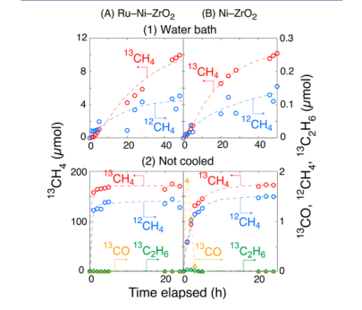
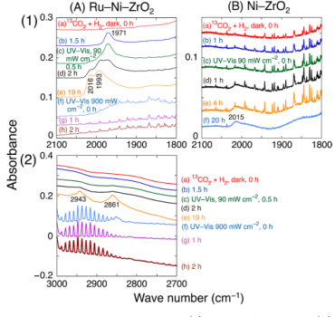
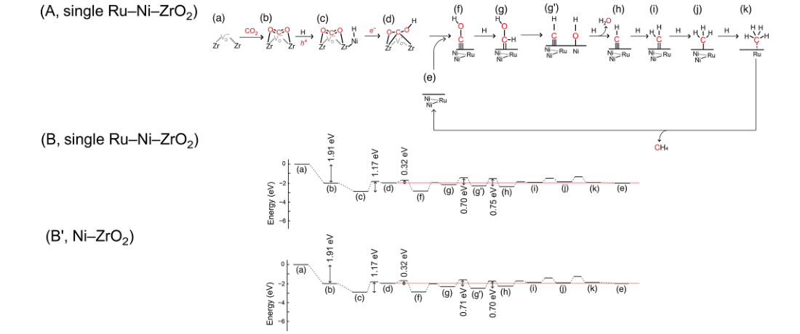
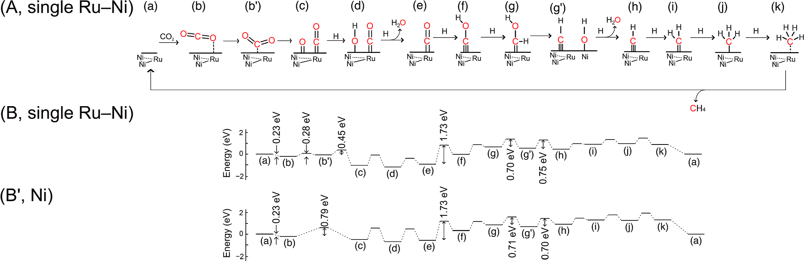
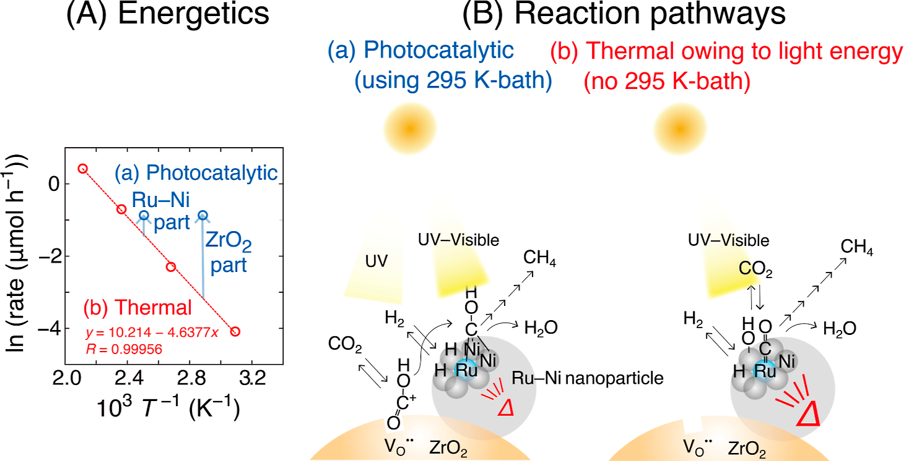

# Charge Separation and/or Hot Spots: Clarification of Efficient CO2 Reduction over Ru−Ni Nanoparticles Compared to Photocatalysis on Ru−Ni−ZrO2 Composites

## Reading prompts / 阅读提示

- **English:** Read each source block with its Chinese counterpart; figures and tables remain attached to their original captions.
- **中文：** 请将每一原文块与其中文译文对应阅读；图和表保留原始图注并放在相关正文附近。

## Terminology ledger / 术语表

- **English:** Technical terms, symbols, formulae, units and citation markers retain the source notation.
- **中文：** 技术术语、符号、化学式、单位和引文标记均保留原文记法。

## Full bilingual reader / 全文中英文对照

## Article information / 文章信息

**Source:** p.1 S001

**Original:** Article pubs.acs.org/JACS

**中文:** 文章 pubs.acs.org/JACS

**Source:** p.1 S002

**Original:** Charge Separation and/or Hot Spots: Clarification of Efficient CO2 Reduction over Ru−Ni Nanoparticles Compared to Photocatalysis on Ru−Ni−ZrO2 Composites

**中文:** 电荷分离和/或热点：与 Ru−Ni−ZrO2 复合材料上的光催化相比，Ru−Ni 纳米颗粒高效 CO2 还原的澄清

**Source:** p.1 S003

**Original:** Masahito Sasaki, Tomoki Oyumi, Keisuke Hara, Hongwei Zhang,* and Yasuo Izumi*

**中文:** Masahito Sasaki、Tomoki Oyumi、Keisuke Hara、张宏伟* 和 Yasuo Izumi*

**Source:** p.1 S004

**Original:** Cite This: J. Am. Chem. Soc. 2026, 148, 13570−13580 Read Online

**中文:** 引用此：J. Am。化学。苏克。 2026, 148, 13570−13580 在线阅读

## 1. INTRODUCTION / 引言

**Source:** p.1 S005

**Original:** 1. INTRODUCTION

**中文:** 1. 简介

**Source:** p.1 S006

**Original:** Photocatalytic reduction of CO2 has been extensively investigated as a promising approach to establishing a carbon−neutral cycle in a sustainable society.1,2 The most critical challenge for the photocatalytic reduction of CO2 is its low efficiency in converting CO2 into fuels3−5 and/or valuable chemicals.4,5 To overcome this problem, strategies to increase charge separation efficiency and dramatically enhance photocatalytic activitysuch as increasing the irradiation light intensity on semiconductor-based photocatalystsneed to be explored. Historically, Ru has presented a puzzling case in catalytic CO2 reduction. Under UV−visible light irradiation, CO2 was reduced to CH4 using Ru−TiO2,6,7 primarily owing to heat generated from light energy, while the contribution of charge separation leading to redox reactions at the catalyst surface was negligible, as evidenced by comparisons with catalytic reaction rates driven by external heating under dark conditions.7

**中文:** 光催化还原 CO2 作为在可持续社会中建立碳中性循环的一种有前景的方法已得到广泛研究。1,2 光催化还原 CO2 的最关键挑战是将 CO2 转化为燃料3−5 和/或有价值的化学品的效率较低。4,5 为了克服这个问题，需要探索提高电荷分离效率和显着增强光催化活性的策略，例如增加半导体光催化剂的照射光强度。从历史上看，钌在催化二氧化碳还原方面曾出现过令人费解的情况。在紫外可见光照射下，使用 Ru−TiO2,6,7 将 CO2 还原为 CH4，主要是由于光能产生的热量，而导致催化剂表面氧化还原反应的电荷分离的贡献可以忽略不计，这一点通过与黑暗条件下外部加热驱动的催化反应速率的比较得到证明。 7

**Source:** p.1 S007

**Original:** Recently, the effects of single Ru have been reported to lower the activation energy (Eact) of the rate-determining step in thermal CO2 hydrogenation, mostly during CO2 adsorption or CO hydrogenation.8,9 By contrast, in photocatalytic CO2 hydrogenation, single Ru embedded on Cu nanoparticles supported on Bi4Ti3O12 enhanced CO2 adsorption and its subsequent conversion into OCOH species.10 Recently, Ozin,

**中文:** 最近，据报道，单 Ru 可以降低热 CO2 氢化中速率决定步骤的活化能 (Eact)，主要是在 CO2 吸附或 CO 加氢过程中。8,9 相比之下，在光催化 CO2 加氢中，嵌入 Bi4Ti3O12 负载的 Cu 纳米颗粒上的单 Ru 增强了 CO2 吸附及其随后转化为 OCOH 物质。 10 最近，Ozin，

**Source:** p.1 S008

**Original:** Yao, and colleagues reported micro- and nanoscale thermometry to probe the temperature of the catalyst in photothermal reactors, highlighting the difficulty of distinguishing photothermal effects from surplus catalytic activity arising from lightinduced heating.11 One plausible pathway of photothermal excitation of reactant is the vibrational excitation of the reactant by light, which facilitates their transformation to products.11 In a related study, the dependence of CO2 hydrogenation rates on irradiated UV−visible light intensity was investigated using an Fe−ZrO2 catalyst, revealing a twostep reaction mechanism: an initial redox reaction driven by charge separation in ZrO2, followed by multiple hydrogenation steps on the Fe0 surface.5 As the irradiated light intensity increased from 110 to 472 mW cm−2, the contribution of charge separation in ZrO2 became negligible to the overall pathway from CO2 to CH4, which occurred primarily on the Fe0 surface owing to heat generated from light. Thus, the origin of catalysiswhether thermal, photothermal, and/or

**中文:** Yao 及其同事报道了微米和纳米级测温法来探测光热反应器中催化剂的温度，突显了区分光热效应与光诱导加热产生的过剩催化活性的困难。 11 反应物光热激发的一个可能途径是光对反应物的振动激发，这有助于其转化为产物。 11 在一项相关研究中，使用 Fe−ZrO2 研究了 CO2 加氢速率对照射的紫外可见光强度的依赖性催化剂，揭示了两步反应机理：由 ZrO2 中的电荷分离驱动的初始氧化还原反应，然后是 Fe0 表面上的多个氢化步骤。 5 随着照射光强度从 110 mW cm−2 增加到 472 mW cm−2，ZrO2 中的电荷分离对从 CO2 到 CH4 的整个路径的贡献可以忽略不计，由于光产生的热量，该过程主要发生在 Fe0 表面。因此，催化的起源无论是热催化、光热催化和/或

**Source:** p.1 S009

**Original:** Received: October 6, 2025 Revised: March 8, 2026 Accepted: March 12, 2026 Published: March 20, 2026

**中文:** 收稿日期：2025年10月6日 修订日期：2026年3月8日 接受日期：2026年3月12日 发布日期：2026年3月20日

**Source:** p.1 S010

**Original:** ACCESS Metrics & More Article Recommendations * sı Supporting Information

**中文:** 访问指标及更多文章推荐 * sı 支持信息

**Source:** p.1 S011

**Original:** ABSTRACT: The true reaction pathway and the catalytic role responsible for it remain uncertain in photocatalysis, where charge separation, hot spots, and energetic modulation of the ground and excited states are involved. Herein, a Ru atom was embedded in a ∼1.6 nm Ni nanoparticle dispersed on ZrO2. The 13CO2 photoreduction rate to 13CH4 showed a negligible change of ∼26 μmol h−1 gcat −1 upon adding Ru (1.0 wt %) to the Ni (10 wt %)-ZrO2 photocatalyst under a 295 K water bath for cooling irradiated by UV−visible light at 568 mW cm−2. By contrast, the rate using the Ru−Ni−ZrO2 catalyst exceeded that of Ni−ZrO2 by >2.7× (>7.9 mmol h−1 gcat −1) when the 295 K water bath for catalysts was not applied. Extended X-ray absorption fine structure analysis revealed that the hot spot Ni temperature increased from 295 to 399 ± 29 K under 654 mW cm−2 irradiation, even with the 295 K ethylene glycol bath for cooling, confirming that multiple hydrogenations occurred on Ni for COH species transferred from the O vacancy sites at the ZrO2 surface. In the absence of the 295 K water bath, CO2 was directly adsorbed on the RuNi2 site, and its dissociation into CO and O species proceeded with a low activation energy of 0.45 eV, enabling a photothermal pathway, as supported by DFT and FTIR analyses. These results highlight the importance of monitoring the hot spot temperature in photocatalysts to identify the active site combined with redox sites on the semiconductor, driven by charge separation under UV−visible light irradiation.

**中文:** 摘要：在光催化中，真正的反应途径和催化作用仍然不确定，其中涉及电荷分离、热点以及基态和激发态的能量调制。在此，Ru原子嵌入分散在ZrO2上的〜1.6 nm Ni纳米粒子中。在 568 mW cm−2 的紫外可见光照射下，在 295 K 水浴冷却下，将 Ru (1.0 wt %) 添加到 Ni (10 wt %)-ZrO2 光催化剂中后，13CO2 光还原为 13CH4 的速率显示出约 26 μmol h−1 gcat -1 的可忽略不计的变化。相比之下，当不使用295 K水浴催化剂时，使用Ru−Ni−ZrO2催化剂的速率超过Ni−ZrO2的速率>2.7×(>7.9 mmol h−1 gcat -1)。扩展X射线吸收精细结构分析表明，在654 mW cm−2照射下，即使使用295 K乙二醇浴冷却，热点Ni温度也从295增加到399 ± 29 K，这证实了Ni上发生了从ZrO2表面O空位位转移的COH物种的多次氢化。在没有 295 K 水浴的情况下，CO2 直接吸附在 RuNi2 位点上，并在 0.45 eV 的低活化能下解离成 CO 和 O 物质，从而实现了光热途径，这一点得到了 DFT 和 FTIR 分析的支持。这些结果凸显了监测光催化剂中热点温度的重要性，以识别半导体上由紫外可见光照射下的电荷分离驱动的活性位点与氧化还原位点的结合。

**Source:** p.2 S012

**Original:** Journal of the American Chemical Society pubs.acs.org/JACS Article

**中文:** 美国化学会杂志 pubs.acs.org/JACS 文章

**Source:** p.2 S013

**Original:** photocatalyticoften remains elusive, making the reaction mechanism unclear in semiconductor-based (photo)catalysts. Herein, reaction pathways from CO2 to CH4 were clarified using a Ru−Ni−ZrO2 catalyst under the irradiation of UV− visible light, whether photocatalytic or photothermal, by controlling the catalyst temperature with or without a 295 K bath, as well as varying the UV−visible light intensity between 90 and 900 mW cm−2. Under irradiation at 568 mW cm−2, the Ru atom embedded in the Ni nanoparticle remarkably accelerated 13CH4 formation from 13CO2, reaching one of the highest rates to date. This enhancement was attributed to CO2 adsorption on the Ru site and its subsequent dissociation into CO and O species, as confirmed by extended X-ray absorption fine structure (EXAFS), FTIR spectroscopy, and density functional theory (DFT) calculations. By contrast, the photocatalytic pathway proceeded via OCO + H to OCOH species at the O vacancy (VO ••) site on the semiconductor ZrO2 surface, driven by charge separation under UV light (Supporting Information, Section 3.1),3−5,12,13 followed by transfer of COH species and multiple hydrogenation steps over the hot spot Ni. This pathway from COH to CH4 was primarily driven by heat generated from the light energy at 568−654 mW cm−2 under a 295 K bath.

**中文:** 光催化通常仍然难以捉摸，使得半导体（光）催化剂中的反应机制不清楚。在此，通过在有或没有295 K浴的情况下控制催化剂温度，以及在90和900 mW cm-2之间改变UV-可见光强度，在UV-可见光照射下，无论是光催化还是光热，使用Ru-Ni-ZrO2催化剂阐明了从CO2到CH4的反应途径。在 568 mW cm−2 的照射下，嵌入 Ni 纳米颗粒中的 Ru 原子显着加速了 13CO2 的 13CH4 形成，达到迄今为止最高的速率之一。这种增强归因于 Ru 位点上的 CO2 吸附及其随后解离成 CO 和 O 物种，这一点已通过扩展 X 射线吸收精细结构 (EXAFS)、FTIR 光谱和密度泛函理论 (DFT) 计算证实。相比之下，光催化途径通过在半导体 ZrO2 表面的 O 空位 (VO••) 位点上的 OCO + H 生成 OCOH 物质，由紫外光下的电荷分离驱动（支持信息，第 3.1 节）3−5,12,13，然后是 COH 物质的转移和热点 Ni 上的多个氢化步骤。从 COH 到 CH4 的这条路径主要是由 295 K 水浴下 568−654 mW cm−2 的光能产生的热量驱动的。

## 2. EXPERIMENTAL METHODS / 方法

**Source:** p.2 S014

**Original:** 2. EXPERIMENTAL METHODS

**中文:** 2 实验方法

**Source:** p.2 S015

**Original:** 2.1. Catalyst Preparation To prepare the composite catalysts comprising Ni, Ru, and ZrO2, the concentration of Ni was fixed at 10 wt %, while the Ru loading was varied between 0.5 and 2.0 wt % in the final composites. In a typical procedure, ZrO2 (0.445 g; Type JRC-ZRO-3, Catalysis Society of Japan; predominantly monoclinic with a minor tetragonal phase; specific surface area = 94.4 m2 g−1) was dispersed in deionized water (200 mL; <0.055 μS cm−1). The suspension was ultrasonicated (360 W, 40 kHz) for 20 min and magnetically stirred at 1000 rotations per minute (rpm) for 1 h. Next, Ni(II) chloride hexahydrate (0.2025 g; Macklin Biochemical Technology, Shanghai, China) and Ru(III) chloride anhydrate (0.0051−0.0207 g; Macklin Biochemical Technology) were simultaneously added to the suspension and magnetically stirred at 1000 rpm for 1 h. Then, an aqueous NaBH4 solution (10 mL; 0.2803−0.3027 g; Sinopharm Chemical Reagent, Shanghai, China) was added dropwise to the suspension, and the mixture was stirred at 1000 rpm for 5 min. The obtained precipitate was filtered using a poly(tetrafluoroethylene)-based membrane filter (Omnipore, Type JVWP04700, Merck−Millipore, Darmstadt, Germany; pore size = 0.1 μm) and washed with deionized water (50 mL each, 5×). The obtained samples were denoted as Ru (x wt %)−Ni (10 wt %)−ZrO2, where x = 0.5−2.0. Following a similar procedure, Ni (10 wt %)− ZrO2 and Ru (1.0 wt %)−ZrO2 samples were prepared as reference catalysts using NiCl2·6H2O or RuCl3. 2.2. Catalytic Reduction Tests of CO2 under Light CO2 reduction tests using H2 were conducted using 20 mg of catalysts. The catalyst powder was placed in a U-shaped quartz reactor connected to a Pyrex glass circulation system (206.1 mL) and evacuated under a vacuum (10−6 Pa) for 1 h. Subsequently, the catalyst was exposed to H2 (purity >99.99%; 21.7 kPa), heated to 723 K at a ramp rate of 15 K min−1, and maintained at 723 K for 10 min, followed by evacuation and cooling to 295 K. The reduced catalyst is denoted, for example, as Ru−Ni−ZrO2-723R (Reduction). Then, catalytic tests for 13CO2 reduction were performed using the reduced catalysts, 13CO2 (2.3 kPa; 13C 99.0%, 17O 0.1%, purity >99.9%, Cambridge Isotope Laboratories, Inc., Tewksbury, MA), H2 (21.7 kPa), and UV−visible light irradiation from a 300 W Xe arc lamp (Model MAX-350, Asahi Spectrum, Japan). The wavelength dependence of light intensity and the corresponding absorbance by photocatalysts are depicted in Figures S1 and S4, respectively. 13CO2 was used to kinetically monitor the reaction pathway also in the FTIR

**中文:** 2.1.催化剂制备为了制备包含Ni、Ru和ZrO 2 的复合催化剂，最终复合材料中Ni的浓度固定在10wt％，而Ru负载量在0.5wt％和2.0wt％之间变化。在典型过程中，将 ZrO2（0.445 g；JRC-ZRO-3 型，日本催化学会；主要是单斜晶相，少量四方相；比表面积 = 94.4 m2 g−1）分散在去离子水（200 mL；<0.055 μS cm−1）中。将悬浮液超声处理（360 W，40 kHz）20分钟，并以1000转/分钟（rpm）磁力搅拌1小时。接下来，将氯化镍（II）六水合物（0.2025 g；麦克林生化技术，中国上海）和无水氯化钌（III）（0.0051−0.0207 g；麦克林生化技术）同时添加到悬浮液中，并以 1000 rpm 磁力搅拌 1 小时。然后，将NaBH4水溶液(10mL；0.2803-0.3027g；国药化学试剂，上海，中国)滴加到悬浮液中，并将混合物在1000rpm下搅拌5分钟。使用基于聚四氟乙烯的膜过滤器（Omnipore，JVWP04700型，Merck-Millipore，达姆施塔特，德国；孔径=0.1μm）过滤获得的沉淀物，并用去离子水（每次50mL，5×）洗涤。获得的样品表示为Ru (x wt%)−Ni (10 wt%)−ZrO2，其中x = 0.5−2.0。按照类似的程序，使用 NiCl2·6H2O 或 RuCl3 制备 Ni (10 wt%)−ZrO2 和 Ru (1.0 wt%)−ZrO2 样品作为参比催化剂。 2.2.轻质 CO2 催化还原试验 使用 H2 的 CO2 还原试验使用 20 mg 催化剂进行。将催化剂粉末放入与 Pyrex 玻璃循环系统 (206.1 mL) 连接的 U 形石英反应器中，并在真空 (10−6 Pa) 下抽空 1 小时。随后，将催化剂暴露于 H2（纯度 >99.99%；21.7 kPa）中，以 15 K min−1 的升温速率加热至 723 K，并在 723 K 下保持 10 分钟，然后抽真空并冷却至 295 K。还原的催化剂表示为例如 Ru−Ni−ZrO2-723R（还原）。然后，使用还原催化剂、13CO2（2.3 kPa；13C 99.0%、17O 0.1%、纯度 >99.9%，Cambridge Isotope Laboratories, Inc., Tewksbury, MA）、H2 (21.7 kPa) 和 300 W Xe 弧光灯（型号MAX-350，Asahi Spectrum，日本）。光强度的波长依赖性和光催化剂相应的吸光度分别如图 S1 和 S4 所示。 13CO2 也用于在 FTIR 中动态监测反应路径

**Source:** p.2 S016

**Original:** study (see Section 2.3). The distance between the quartz light guide exit of the UV−visible light source (Φ = 5.0 mm) and the catalyst was kept at 1 cm for all tests. Light intensity was measured by using a photosensor (Model PCM-01, Prede, Tokyo, Japan) and a counter (Model KADEC-UP, North One, Sapporo, Japan) and recorded for each test. Experiments were conducted both with cooling the reactor via a water bath (2.5 L, Chart S1) and without a water bath, while both were irradiated with UV−visible light. During 13CO2 photoreduction tests, a packed column of 13X-S molecular sieves (3 m length, 3 mm internal diameter; GL Sciences, Inc., Japan) was used for online gas chromatography−mass spectrometry analyses (Model JMS-Q1050GC, JEOL, Tokyo, Japan) with helium (0.40 MPa, purity >99.9999%) as the carrier gas. 13CO (mass-to-charge ratio (m/z) = 29 for 13CO+), 13CH4 (m/z = 17 for 13CH4 +), 12CH4 (m/z = 16 for 12CH4 +), and 13C2H6 (m/z = 30 for 13C2H4 +) were well separated and evaluated in each mass chromatogram. 13CH4 and 12CH4 were quantified based on their m/z of 17 and 16, respectively, considering the fragment ratio of CH3 +/ CH4 + (0.708:1).

**中文:** 研究（参见第 2.3 节）。所有测试中，紫外可见光源（Φ = 5.0 mm）的石英光导出口与催化剂之间的距离均保持在 1 cm。使用光电传感器（型号 PCM-01，Prede，东京，日本）和计数器（型号 KADEC-UP，North One，札幌，日本）测量光强度，并记录每次测试。实验分别通过水浴（2.5 L，图表 S1）冷却反应器和不使用水浴进行，同时均用紫外可见光照射。在 13CO2 光还原测试中，使用 13X-S 分子筛填充柱（长 3 m，内径 3 mm；GL Sciences, Inc.，日本）进行在线气相色谱-质谱分析（型号 JMS-Q1050GC，JEOL，日本东京），以氦气（0.40 MPa，纯度 >99.9999%）作为载气。 13CO（质荷比 (m/z) = 29，对于 13CO+）、13CH4（m/z = 17，对于 13CH4 +）、12CH4（m/z = 16，对于 12CH4 +）和 13C2H6（m/z = 30，对于 13C2H4 +）在每个质量色谱图中均得到良好分离和评估。 13CH4 和 12CH4 分别根据其 m/z 17 和 16 进行定量，并考虑 CH3 +/CH4 + 的片段比 (0.708:1)。

**Source:** p.2 S017

**Original:** 2.3. Characterizations

**中文:** 2.3.特性描述

**Source:** p.2 S018

**Original:** Ni and Ru K-edge XAFS spectra were measured in the transmission mode on beamline 9C at the Photon Factory and on beamline NW10A at the Photon Factory Advanced Ring, respectively, at the High Energy Accelerator Research Organization (Tsukuba, Japan). The Ru (1.0 wt %)−Ni (10 wt %)−ZrO2 sample powder (120 mg) was prepared in a Pyrex glass U-tube connected to a quartz XAFS cell (sample diameter Φ = 20 mm, thickness t = 1 mm). The sample in the U-tube was reduced under H2 at 723 K, then evacuated, and filled with CO2 (2.3 kPa) and H2 (21.7 kPa). The powder was subsequently transferred from the U-tube to the XAFS cell, which remained connected to the U-tube. The samples did not contact air throughout the experiments. The XAFS cell was equipped with polyethylene terephthalate (PET) film windows (Toyobo Film Solutions, Japan, G200X-38; t = 38 μm) to allow both UV−visible light and X-ray transmission. Then, the XAFS cell was immersed in an ethylene glycol (EG) bath at 295 K (Chart S2), which minimized bubble formation in the X-ray beam path during time-resolved monitoring at both the Ni and Ru K-edges. The sample was then irradiated with UV−visible light from a Xe arc lamp (Model MAX-350) at the beamline. X-rays were transmitted perpendicularly through the disk, whereas UV− visible light was incident at 45° relative to the X-ray direction. The distance between the light exit of the quartz fiber light guide and the sample was 5 cm. The light intensity at the sample position was 654 mW cm−2. The monitoring without an EG bath was difficult because the PET windows melted during monitoring. At beamline 9C, the storage ring energy was 2.5 GeV with a ring current of 450 mA. At beamline NW10A, the storage ring energy was 6.5 GeV with a ring current of 50 mA. A Si(1 1 1) double-crystal monochromator and a Si(3 1 1) double-crystal monochromator, along with Rh- and Pt-coated focusing bent cylindrical mirrors, were inserted into the X-ray beam paths at 9C and NW10A, respectively. At both beamlines, a piezo transducer was used to detune the X-ray intensity to two-thirds of the maximum to suppress high harmonics compared to primary X-rays. The Ni and Ru K-edge absorption energies were calibrated at 8331.65 and 22,119.3 eV, respectively, using spectra of Ni metal foil (5.0 μm thick) and Ru metal powder.14

**中文:** Ni 和 Ru K 边 XAFS 光谱分别在高能加速器研究组织（日本筑波）光子工厂的光束线 9C 和光子工厂高级环的光束线 NW10A 上以透射模式测量。 Ru (1.0 wt%)−Ni (10 wt%)−ZrO2 样品粉末 (120 mg) 在连接到石英 XAFS 池的 Pyrex 玻璃 U 形管中制备（样品直径 Φ = 20 mm，厚度 t = 1 mm）。 U 形管中的样品在 723 K 的氢气下还原，然后抽真空，并充满 CO2 (2.3 kPa) 和 H2 (21.7 kPa)。随后将粉末从 U 形管转移至 XAFS 单元，XAFS 单元仍与 U 形管连接。在整个实验过程中样品没有接触空气。 XAFS 池配备聚对苯二甲酸乙二醇酯 (PET) 薄膜窗口（Toyobo Film Solutions，日本，G200X-38；t = 38 μm），允许紫外可见光和 X 射线透射。然后，将 XAFS 池浸入 295 K 的乙二醇 (EG) 浴中（图 S2），这可最大限度地减少 Ni 和 Ru K 边缘的时间分辨监测期间 X 射线束路径中气泡的形成。然后用 Xe 弧灯（型号 MAX-350）在光束线上发出紫外可见光照射样品。 X 射线垂直穿过圆盘，而紫外可见光以相对于 X 射线方向 45° 的角度入射。石英光纤光导的光出口与样品之间的距离为5cm。样品位置的光强度为654 mW cm−2。没有 EG 浴的监测很困难，因为 PET 窗口在监测过程中熔化。在束线 9C 处，存储环能量为 2.5 GeV，环电流为 450 mA。在光束线 NW10A 处，存储环能量为 6.5 GeV，环电流为 50 mA。将一台 Si(1 1 1) 双晶单色仪和一台 Si(3 1 1) 双晶单色仪以及镀铑和镀铂的聚焦弯曲柱面镜分别插入到 9C 和 NW10A 处的 X 射线光路中。在两条光束线上，压电传感器用于将 X 射线强度失谐至最大值的三分之二，以抑制与初级 X 射线相比的高次谐波。使用 Ni 金属箔（5.0 μm 厚）和 Ru 金属粉末的光谱将 Ni 和 Ru K 边吸收能分别校准为 8331.65 和 22,119.3 eV。 14

**Source:** p.2 S019

**Original:** The obtained Ni and Ru K-edge XAFS data were analyzed using XDAP software, version 3.2.9.15 The empirical amplitude of oscillation was extracted from the EXAFS data for Ni and Ru metals as well as NiO and RuO2 powders. For Ni metal (lattice constant a = 0.35238 nm), the interatomic distance (R) for the Ni−Ni pair was set to 0.24917 nm with a coordination number (N) of 12.16 For NiO (a = 0.4176 nm), the R values for the Ni−O and Ni−Ni pairs were set to 0.2088 nm with an N value of 6 and to 0.2953 nm with an N value of 12, respectively.17 For Ru metal (lattice constants a = 0.27059 nm, c = 0.42815 nm), the R value for the Ru−Ru pair was set to 0.26780 nm with an N value of 12.16 We assumed that the many-body reduction factors were identical for both the sample and the reference.

**中文:** 使用 XDAP 软件版本 3.2.9.15 分析获得的 Ni 和 Ru K 边缘 XAFS 数据。从 Ni 和 Ru 金属以及 NiO 和 RuO2 粉末的 EXAFS 数据中提取经验振荡幅度。对于 Ni 金属（晶格常数 a = 0.35238 nm），Ni−Ni 对的原子间距离 (R) 设置为 0.24917 nm，配位数 (N) 为 12.16 对于 NiO（a = 0.4176 nm），Ni−O 和 Ni−Ni 对的 R 值设置为 0.2088 nm（N 值为 6）和 0.2953 nm，N 值为 12。 17 对于 Ru 金属（晶格常数 a = 0.27059 nm，c = 0.42815 nm），Ru−Ru 对的 R 值设置为 0.26780 nm，N 值为 12.16。我们假设样品和参考的多体折减因子相同。

**Source:** p.3 S020

**Original:** Journal of the American Chemical Society pubs.acs.org/JACS Article

**中文:** 美国化学会杂志 pubs.acs.org/JACS 文章

**Source:** p.3 S021

**Original:** The temperatures of local Ni and Ru sites were monitored using the Debye−Waller factor obtained from curve-fitting analysis in XDAP and the correlated Debye model.18,19 EXAFS analysis indicated that Ru atoms substituted for Ni atoms at the Ni metal surface, which was further supported by structural optimization using DFT calculations (see Section 3.4., photocatalytic CO2 reduction pathway). The correlation between site temperature and the Debye−Waller factor was calculated for both Ni and Ru sites (Figure S2A,B, respectively) based on the Debye temperature for Ni (bulk 450 K;20

**中文:** 使用从 XDAP 中的曲线拟合分析获得的 Debye−Waller 因子和相关的 Debye 模型来监测局部 Ni 和 Ru 位点的温度。18,19 EXAFS 分析表明 Ru 原子取代了 Ni 金属表面的 Ni 原子，使用 DFT 计算的结构优化进一步支持了这一点（参见第 3.4 节，光催化 CO2 还原途径）。根据 Ni 的德拜温度（体积 450 K；20

**Source:** p.3 S022

**Original:** surface perpendicular translational motion ⊥: 208 K; surface parallel translational motion ∥: 348 K21) using FEFF version 8.40.22

**中文:** 表面垂直平移运动⊥：208 K；表面平行平移运动 ∥: 348 K21) 使用 FEFF 版本 8.40.22

**Source:** p.3 S023

**Original:** Calculations for Ru were performed using the Debye temperature for Ni because the Ru atom was embedded in the Ni crystal (see Section 3.2., Ni and Ru Site Structure and Temperature Analyses via XAFS; Table S1). In situ FTIR spectroscopy measurements were performed at 295 K over a range of 4000−650 cm−1 using a Model FT/IR-4200 instrument (JASCO, Tokyo, Japan). Ru (1.0 wt %)−Ni (10 wt %)−ZrO2 and Ni (10 wt %)−ZrO2 catalyst disks (71 mg each, Φ = 2 cm) were heated under H2 at 723 K in a quartz cell and then transferred to a quartz FTIR cell inside a glovebox (UN-6509LCIY, Unico, Japan). The sample disks were irradiated with UV−visible light from a Xe arc lamp (Model MAX-350) through a quartz fiber light guide. The distance between the fiber light exit and the sample disk was 5 cm, and the light intensity was controlled between 90 and 900 mW cm−2. The energy resolution of the spectrometer was set to 1 cm−1, and data were accumulated over 512 scans (∼2 s per scan).

**中文:** Ru 的计算使用 Ni 的德拜温度进行，因为 Ru 原子嵌入 Ni 晶体中（参见第 3.2 节，通过 XAFS 进行的 Ni 和 Ru 位点结构和温度分析；表 S1）。使用 FT/IR-4200 型仪器（日本东京 JASCO）在 295 K、4000−650 cm−1 范围内进行原位 FTIR 光谱测量。 Ru (1.0 wt %)−Ni (10 wt %)−ZrO2 和 Ni (10 wt %)−ZrO2 催化剂盘（各 71 mg，Φ = 2 cm）在石英池中于 723 K 的氢气下加热，然后转移至手套箱内的石英 FTIR 池（UN-6509LCIY，Unico，日本）。样品盘通过石英光纤光导用 Xe 弧光灯（型号 MAX-350）发出的紫外可见光进行照射。光纤出光口与样品盘之间的距离为5 cm，光强控制在90~900 mW cm−2之间。光谱仪的能量分辨率设置为 1 cm−1，并且通过 512 次扫描（每次扫描约 2 秒）积累数据。

**Source:** p.3 S024

**Original:** 2.4. DFT Calculations

**中文:** 2.4. DFT 计算

**Source:** p.3 S025

**Original:** Spin-polarized periodic DFT calculations were conducted using the Vienna Ab initio Simulation Package version 6.4.223 on a WJ9J-W231 Server comprising an Intel Xeon w9-3495X processor (1.9 GHz, 56 cores; Tsukumo, Japan) and a VT64 Server XS2-2TI comprising four units of Intel Xeon Platinum 9242 processors (2.3 GHz, 48 cores; Visual Technology, Tokyo, Japan). Additional computations were performed using the supercomputer facilities at the Institute for Solid State Physics, University of Tokyo, Japan. The projector-augmented wave method was employed at the DFT-D3 level to account for van der Waals interactions. The generalized gradient approximation (GGA) with the revised Perdew−Burke−Ernzerhof (RPBE) exchange−correlation functional was employed by setting a planewave energy cutoff of 500 eV. Each optimized structure was obtained at the D3 level employing the GGA−RPBE functional and adding a Hubbard U parameter (4.0 eV) for Zr.24,25

**中文:** 使用 Vienna Ab initio 仿真包版本 6.4.223 在包含 Intel Xeon w9-3495X 处理器（1.9 GHz，56 核；日本 Tsukumo）的 WJ9J-W231 服务器和包含 4 个 Intel Xeon Platinum 9242 处理器（2.3 GHz，48 核；Visual Technology，东京，日本）。使用日本东京大学固体物理研究所的超级计算机设施进行了额外的计算。在 DFT-D3 级别采用投影增强波方法来解释范德华相互作用。通过将平面波能量截止设置为 500 eV，采用广义梯度近似 (GGA) 和修正的 Perdew−Burke−Ernzerhof (RPBE) 交换相关函数。每个优化结构都是在 D3 水平上使用 GGA−RPBE 泛函并为 Zr.24,25 添加 Hubbard U 参数 (4.0 eV) 获得的

**Source:** p.3 S026

**Original:** The convergence criterion was set to 10−4 eV for the self-consistent field cycle, and optimizations were considered converged when the forces on all atoms were smaller than 0.1 eV Å−1 (Å = 0.1 nm), which was small enough based on convergence tests (Table S3). All of the atoms were fully relaxed during structural optimization. The Brillouin zone was sampled with a 3 × 3 × 1 wavenumber vector k-point grid. Transition states were pursued using the climbing-image nudged elastic band (CI-NEB) method.26

**中文:** 对于自洽场循环，收敛标准设置为 10−4 eV，当所有原子上的力小于 0.1 eV Å−1 (Å = 0.1 nm) 时，优化被认为是收敛的，根据收敛测试，该值足够小（表 S3）。在结构优化过程中所有原子都完全松弛。使用 3 × 3 × 1 波数矢量 k 点网格对布里渊区进行采样。使用攀爬图像微移弹性带 (CI-NEB) 方法来追踪过渡态。26

**Source:** p.3 S027

**Original:** The (1 1 1) surface of face-centered cubic (fcc) Ni, modeled with (2 × 2 × 2) element unit cells, was chosen as the slab model, with a vacuum spacing of 1.0 nm between slabs.27 Separately, a hemispherical Ni19 cluster exposing the (1 1 1) face, based on the fcc structure, and a Ni metal cluster in which one Ni atom was replaced by a Ru atom (RuNi18) were combined with a monoclinic ZrO2(1 1 1) surface.27

**中文:** 采用 (2 × 2 × 2) 元素晶胞建模的面心立方 (fcc) Ni 的 (1 1 1) 表面被选为平板模型，平板之间的真空间距为 1.0 nm。 27 另外，基于 fcc 结构，暴露出 (1 1 1) 面的半球形 Ni19 簇，以及其中一个 Ni 原子被 Ru 原子 (RuNi18) 取代的 Ni 金属簇与单斜ZrO2(1 1 1)表面.27

**Source:** p.3 S028

**Original:** The adsorption energy (Eads) of the adsorbate was calculated based on eq 1

**中文:** 吸附质的吸附能 (Eads) 根据式 1 计算

**Source:** p.3 S029

**Original:** = E E E E ads mol/slab mol slab (1)

**中文:** = E E E E ads mol/slab mol 板 (1)

**Source:** p.3 S030

**Original:** where Emol/slab, Emol, and Eslab are the total energies of the adsorbate on the slab model, the isolated molecule in the gas phase, and the bare surface, respectively.

**中文:** 其中 Emol/slab、Emol 和 Eslab 分别是板模型上吸附物、气相中的孤立分子和裸表面的总能量。

## 3. RESULTS AND DISCUSSION / 结果

**Source:** p.3 S031

**Original:** 3. RESULTS AND DISCUSSION

**中文:** 3 结果与讨论

**Source:** p.3 S032

**Original:** 3.1. CO2 Reduction Tests Irradiated under UV−Visible Light Preliminary CO2 photoreduction tests were performed under CO2 (10 kPa), H2 (50 kPa), and UV−visible light irradiation (620 mW cm−2 at the photocatalyst) using Ru (0 wt %−2.0 wt %)−Ni (10 wt %)−ZrO2 photocatalysts (Table S2). The CH4 formation rate reached a maximum when the Ru content was 1.0 wt % (entry c). Therefore, the Ru (1.0 wt %)−Ni (10 wt %)−ZrO2 photocatalyst was chosen for subsequent photocatalytic tests and characterization. Furthermore, the CH4 formation rates were proportional to the square of the irradiated UV−visible light intensity using the catalysts, consistent with our previous study results.3

**中文:** 3.1.紫外-可见光照射下的 CO2 还原测试 使用 Ru (0 wt %-2.0 wt %)-Ni (10 wt %)-ZrO2 光催化剂，在 CO2 (10 kPa)、H2 (50 kPa) 和紫外-可见光照射（光催化剂处 620 mW cm-2）下进行初步 CO2 光还原测试（表 S2）。当 Ru 含量为 1.0 wt% 时，CH4 形成速率达到最大值（条目 c）。因此，选择Ru (1.0 wt %)−Ni (10 wt %)−ZrO2光催化剂进行后续光催化测试和表征。此外，CH4 的形成速率与使用催化剂照射的紫外可见光强度的平方成正比，这与我们之前的研究结果一致。 3

**Source:** p.3 S033

**Original:** 13CO2 photoreduction tests were performed using isotopically labeled 13CO2 (2.3 kPa) and H2 (21.7 kPa) with the Ru (1.0 wt %)−Ni (10 wt %)−ZrO2 photocatalyst under the irradiation of UV−visible light (568 mW cm−2 at the photocatalyst). The photoreactor was maintained in a water bath at 295 K (Figure 1 and Chart S1) to suppress thermal

**中文:** 使用同位素标记的 13CO2 (2.3 kPa) 和 H2 (21.7 kPa) 以及 Ru (1.0 wt %)−Ni (10 wt %)−ZrO2 光催化剂在紫外可见光（光催化剂处 568 mW cm−2）照射下进行 13CO2 光还原测试。光反应器保持在 295 K 的水浴中（图 1 和图 S1）以抑制热

### Fig. 001

**Placed near:** p.3 S033
**Source:** p.3 C001

**Original caption:** Figure 1. Time course of 13CO, 13CH4, 12CH4, and 13C2H6 formation under 13CO2 (2.3 kPa) and H2 (21.7 kPa) using Ru (1.0 wt %)−Ni (10 wt %)−ZrO2 (A) and Ni (10 wt %)−ZrO2 (B) catalysts. Reactions were performed under UV−visible light irradiation at 568 mW cm−2 at the catalyst position with the photoreactor maintained in a 295 K bath (1) and 568 mW cm−2 at the catalyst position without the bath (2).

**中文图注:** 图 1. 使用 Ru (1.0 wt %)−Ni (10 wt %)−ZrO2 (A) 和 Ni (10 wt %)−ZrO2 (B) 催化剂在 13CO2 (2.3 kPa) 和 H2 (21.7 kPa) 下形成 13CO、13CH4、12CH4 和 13C2H6 的时间过程。反应在催化剂位置处以 568 mW cm−2 的紫外可见光照射下进行，光反应器保持在 295 K 浴中 (1)，在没有浴的催化剂位置处以 568 mW cm−2 照射 (2)。

**Source:** p.3 S034

**Original:** reactions arising from light-to-heat conversion, and the results were compared with those obtained using Ni (10 wt %)−ZrO2 photocatalyst (Figure 1). For both photocatalysts, the major product was 13CH4, and the 13CH4 formation rate using Ru− Ni−ZrO2 (21 μmol h−1 gcat −1) was equivalent or slightly inferior to that observed with Ni−ZrO2 (26 μmol h−1 gcat −1). The molar fraction of 12CH4 in total CH4 formation

**中文:** 光热转化反应，并将结果与​​使用 Ni (10 wt%)−ZrO2 光催化剂获得的结果进行比较（图 1）。对于两种光催化剂，主要产物是 13CH4，并且使用 Ru− Ni−ZrO2 (21 μmol h−1 gcat -1) 的 13CH4 形成速率与使用 Ni−ZrO2 (26 μmol h−1 gcat -1) 观察到的相同或稍差。总 CH4 形成中 12CH4 的摩尔分数

**Source:** p.3 S035

**Original:** 12 4 12 4 13 4 was also very similar for both catalysts (5.0 mol

**中文:** 12 4 12 4 13 4 两种催化剂也非常相似（5.0 mol

**Source:** p.3 S036

**Original:** + ( ) CH

**中文:** + ( ) CH

**Source:** p.3 S037

**Original:** CH CH

**中文:** CHCH

**Source:** p.3 S038

**Original:** %−5.2 mol %), corresponding to the ratio of 12CO2 adsorbed from air at VO •• sites on the ZrO2 surface relative to the introduced 13CO2 gas (isotopic purity 99.0%) used as the reactant.3−5,12,13,27 These results indicate that the 1.0 wt % Ru

**中文:** %−5.2 mol %)，对应于 ZrO2 表面 VO•• 位点从空气中吸附的 12CO2 相对于用作反应物的引入 13CO2 气体（同位素纯度 99.0%）的比率。3−5,12,13,27 这些结果表明，1.0 wt % Ru

**Source:** p.4 S039

**Original:** Journal of the American Chemical Society pubs.acs.org/JACS Article

**中文:** 美国化学会杂志 pubs.acs.org/JACS 文章

### Fig. 002

**Placed near:** p.4 S039
**Source:** p.4 C002

**Original caption:** Figure 2. XAFS results at the Ni (A) and Ru K-edges (B) for Ru (1.0 wt %)−Ni (10 wt %)−ZrO2-723R under the 295 K ethylene glycol bath using CO2 (2.3 kPa), H2 (21.7 kPa), and the UV−visible light irradiation (654 mW cm−2). (1) Normalized X-ray absorption near-edge structure (XANES) spectra compared with the corresponding metal references; (2, 3) Fourier transform of k3-weighted EXAFS under UV−visible light illumination (2) and after turning the light off (3); (4) Time course of the Debye−Waller factor σ for the Ni−Ni (A) and Ru−Ni (B) interatomic pairs, with the corresponding site temperatures evaluated using the correlated Debye model.

**中文图注:** 图 2. 在 295 K 乙二醇浴中，使用 CO2 (2.3 kPa)、H2 (21.7 kPa) 和 UV−可见光照射 (654 mW cm−2)，Ru (1.0 wt %)−Ni (10 wt %)−ZrO2-723R 在 Ni (A) 和 Ru K 边缘 (B) 处的 XAFS 结果。 (1) 归一化X射线吸收近边结构(XANES)谱与相应金属参考物的比较； (2, 3) k3 加权 EXAFS 在紫外可见光照射下 (2) 和关灯后 (3) 的傅里叶变换； (4) Ni−Ni (A) 和 Ru−Ni (B) 原子间对的 Debye−Waller 因子 σ 的时间过程，以及使用相关 Debye 模型评估的相应位点温度。

**Source:** p.4 S040

**Original:** in the photocatalyst had no effects on either the 13CH4 formation rate or the 12CH4 fraction under 13CO2 photoreduction in the 295 K water bath. The photocatalytic test results under the 295 K bath (Figure 1B(1)) were compared with photocatalytic tests performed under similar UV−visible light intensity (568 mW cm−2) in the absence of the 295 K bath (panels A(2) and B(2)). Under both reaction conditions, 13CH4 was the major product for both Ru (1.0 wt %)−Ni (10 wt %)−ZrO2 and Ni (10 wt %)− ZrO2 photocatalysts. However, 1.0 wt % Ru acted as an effective promoter under the no-bath condition, in clear contrast to the photocatalytic results under the 295 K bath. In the absence of the 295 K bath, 2.3 kPa of 13CO2 was completely converted within 1 h of UV−visible light irradiation, corresponding to a 13CH4 formation rate of >7.9 mmol h−1 gcat −1 for Ru (1.0 wt %)−Ni (10 wt %)−ZrO2 (Figure 1A(2)), which is >2.7× higher than the rate of 2.9 mmol h−1 gcat −1 observed with Ni (10 wt %)−ZrO2 (panel B(2)). These results suggest that the CO2 reduction pathway differs depending on whether the reaction is conducted under the 295 K bath or without the bath, both under UV−visible light irradiation. The catalytic test result with an empty bath (Figure S3) was essentially the same as that in Figure 1A(2). The molar fraction of 12CH4 in total CH4 formation

**中文:** 在 295 K 水浴中 13CO2 光还原下，光催化剂中的 13CH4 形成速率或 12CH4 分数没有影响。将 295 K 浴下的光催化测试结果（图 1B(1)）与没有 295 K 浴的情况下在相似的紫外可见光强度 (568 mW cm−2) 下进行的光催化测试进行比较（图 A(2) 和 B(2)）。在两种反应条件下，13CH4 都是 Ru (1.0 wt %)−Ni (10 wt %)−ZrO2 和 Ni (10 wt %)− ZrO2 光催化剂的主要产物。然而，1.0 wt% Ru 在无浴条件下充当有效的促进剂，与 295 K 浴下的光催化结果形成鲜明对比。在没有 295 K 浴的情况下，2.3 kPa 的 13CO2 在紫外可见光照射 1 小时内完全转化，对应于 Ru (1.0 wt %)−Ni (10 wt %)−ZrO2 的 13CH4 形成速率 >7.9 mmol h−1 gcat −1 (图 1A(2))，比 2.9 mmol 的速率高 >2.7 倍h−1 gcat -1 用 Ni (10 wt%)−ZrO2 观察到（图 B(2)）。这些结果表明，CO2 还原途径根据反应是在 295 K 浴下进行还是在没有浴下进行（均在紫外可见光照射下进行）而有所不同。空浴催化测试结果（图S3）与图1A（2）基本相同。总 CH4 形成中 12CH4 的摩尔分数

**Source:** p.4 S041

**Original:** 12 4 12 4 13 4 was essentially constant at 0.8 mol %−1.0 mol

**中文:** 12 4 12 4 13 4 基本恒定在0.8 mol %−1.0 mol

**Source:** p.4 S042

**Original:** + ( ) CH

**中文:** + ( ) CH

**Source:** p.4 S043

**Original:** CH CH

**中文:** CHCH

**Source:** p.4 S044

**Original:** %, independent of the catalyst used without the bath, significantly smaller than the total amount (1.3 mol %) of the 12CO2 impurity in the 13CO2 reagent and 12CO2 adsorbed on VO •• sites from air (Supporting Information, Section 3.2), demonstrating that 12CO2 on VO •• sites at ZrO2 surface was not included in the reaction pathway to CH4, in clear contrast to these values of 5.0%−5.2% observed during tests conducted under the 295 K bath in which the contribution of 12CO2 on VO •• sites at ZrO2 surface was suggested. The 13CH4 formation rates using the Ru (1.0 wt %)−Ni (10 wt %)−ZrO2 catalyst differed by >380× between the presence

**中文:** %，与不使用浴的催化剂无关，显着小于 13CO2 试剂中的 12CO2 杂质和空气中吸附在 VO•• 位点上的 12CO2 的总量（1.3 mol%）（支持信息，第 3.2 节），表明 ZrO2 表面 VO•• 位点上的 12CO2 不包括在生成 CH4 的反应途径中，与这些值形成鲜明对比在 295 K 浴下进行的测试中观察到 5.0%−5.2%，其中表明 ZrO2 表面 VO•• 位点上 12CO2 的贡献。使用 Ru (1.0 wt %)−Ni (10 wt %)−ZrO2 催化剂的 13CH4 形成速率在存在之间相差 >380 倍

**Source:** p.4 S045

**Original:** and absence of the 295 K bath (Figure 1(2)). UV light of energy greater than the bandgap (5.0 eV) of ZrO2 was clearly irradiated under the kinetic reaction conditions as well as a minor interband impurity level contribution, e.g., VO •• sites, for UV absorption (Section 3.1), strongly suggesting the photocatalytic steps in the presence of a 295 K bath.3−5,12,13,27 The reason for the dramatic difference above is elucidated below in terms of distinct reaction pathways.

**中文:** 且没有 295 K 浴（图 1(2)）。在动力学反应条件下，明显照射了能量大于 ZrO2 带隙 (5.0 eV) 的紫外光，并且对紫外吸收有较小的带间杂质水平贡献，例如 VO•• 位（第 3.1 节），强烈表明在 295 K 浴存在下的光催化步骤。3−5,12,13,27 上述显着差异的原因在下面根据不同反应进行了阐明途径。

**Source:** p.4 S046

**Original:** 3.2. Ni and Ru Site Structure and Temperature Analyses via XAFS

**中文:** 3.2.通过 XAFS 进行 Ni 和 Ru 位点结构和温度分析

**Source:** p.4 S047

**Original:** The Ni and Ru sites in Ru (1.0 wt %)−Ni (10 wt %)−ZrO2723R were analyzed using XAFS spectroscopy. X-ray absorption near-edge structure (XANES) spectra at both Ni and Ru K-edges for the Ru−Ni−ZrO2-723R catalyst before photocatalytic testing resembled those of the corresponding metals (Figure 2A(1),B(1)). However, the postedge oscillations became weaker compared to bulk metals, reflecting the lower probability of multiple scattering of photoelectrons in the Ru−Ni nanoparticles. Next, Ni K-edge EXAFS for Ru (1.0 wt %)−Ni (10 wt %)− ZrO2-723R under the 295 K bath was monitored in the presence of CO2, H2, and UV−visible light irradiation (654 mW cm−2). In the Fourier transform, the peak intensity at 0.21 nm (phase shift uncorrected) quickly decreased when the UV−visible light was turned on (Figure 2) and remained essentially constant during 90 min of light irradiation. By contrast, as soon as the UV−visible light was turned off, the peak rapidly increased, returning almost to its preirradiation intensity (Figure 2A(3)). These changes in peak intensity during UV−visible light-on and light-off periods were attributable to the corresponding increase and decrease in the Debye−Waller factor (σ) because the associated N and R values remained essentially unchanged (Figure S9). The σsample 2 value was calculated as the summation of σcorrelated Debye 2 (for standard metal crystal, Figure S2), σXDAP 2 (from curve-fit analysis of experimental data), and

**中文:** 使用 XAFS 光谱分析 Ru (1.0 wt%)−Ni (10 wt%)−ZrO2723R 中的 Ni 和 Ru 位点。光催化测试前，Ru−Ni−ZrO2-723R 催化剂在 Ni 和 Ru K 边的 X 射线吸收近边结构 (XANES) 光谱与相应金属的相似（图 2A(1)、B(1)）。然而，与块体金属相比，postge 振荡变得更弱，反映出 Ru−Ni 纳米粒子中光电子多次散射的可能性较低。接下来，在 CO2、H2 和 UV-可见光照射 (654 mW cm-2) 存在下，监测 295 K 浴下 Ru (1.0 wt%)−Ni (10 wt%)− ZrO2-723R 的 Ni K 边缘 EXAFS。在傅里叶变换中，当紫外可见光打开时，0.21 nm（未校正相移）处的峰值强度迅速下降（图 2），并且在 90 分钟的光照射期间保持基本恒定。相比之下，一旦关闭紫外可见光，峰值就会迅速增加，几乎恢复到其预照射强度（图2A（3））。紫外-可见光开启和关闭期间峰值强度的这些变化可归因于德拜-沃勒因子 (σ) 的相应增加和减少，因为相关的 N 和 R 值基本保持不变（图 S9）。 σsample 2 值计算为 σcorrelated Debye 2（对于标准金属晶体，图 S2）、σXDAP 2（来自实验数据的曲线拟合分析）和

**Source:** p.5 S048

**Original:** Journal of the American Chemical Society pubs.acs.org/JACS Article

**中文:** 美国化学会杂志 pubs.acs.org/JACS 文章

**Source:** p.5 S049

**Original:** σstructural disorder 2 (representing plausible contribution from metal nanoparticles in the photocatalysts)

**中文:** σ结构无序2（代表光催化剂中金属纳米颗粒的合理贡献）

**Source:** p.5 S050

**Original:** = + + sample 2 correlatedDebye 2 XDAP 2 structuraldisorder 2 (2)

**中文:** = + + 样本 2 相关德拜 2 XDAP 2 结构紊乱 2 (2)

**Source:** p.5 S051

**Original:** The values of σcorrelated Debye 2, σXDAP 2, and σstructural disorder 2 were determined to be 4.91 × 10−5, −1.03 × 10−5, and 2.10 × 10−5 nm2, respectively, resulting in a σsample value of 0.00773 nm for the Ni sites (Figure 2A(4)) before UV−visible light irradiation. This calculation assumes 67% dispersion of spherical nanoparticles, corresponding to a mean particle size of 1.6 nm based on the given N value28 and surface exposure of the hemisphere on ZrO2 in the Ru (1.0 wt %)−Ni (10 wt %)− ZrO2-723R photocatalyst. By contrast, for the Ru sites, the values of σcorrelated Debye 2, σXDAP 2, and σstructural disorder 2 were determined to be 3.97 × 10−5, 4.22 × 10−5, and 5.63 × 10−7 nm2, respectively, providing a σsample value of 0.00908 nm (Figure 2B(4)) before UV−visible light irradiation, assuming complete surface dispersion of Ru atoms on the Ni nanoparticle. Based on the correlation between Ni site temperature and the Debye−Waller factor for bulk and surface sites (horizontal and vertical translational motions; Figure S2(A)) in the Ni lattice, the σ value for Ni, which corresponded to 296 K before light irradiation, increased to 399 ± 29 K under UV−visible light for 90 min (Figure 2A(4)). It gradually decreased to the temperature in the beamline hutch after the light was turned off. As inner electron excitation (10−17−10−18 s)29 is faster than charge separation in semiconductors under light (∼fs),30

**中文:** σ相关德拜2、σXDAP 2和σ结构无序2的值分别确定为4.91×10−5、−1.03×10−5和2.10×10−5 nm2，导致在紫外可见光照射之前Ni位点的σ样本值为0.00773 nm（图2A（4））。该计算假设球形纳米粒子的分散度为 67%，对应于基于给定 N 值28的平均粒径为 1.6 nm，以及 Ru (1.0 wt %)−Ni (10 wt %)− ZrO2-723R 光催化剂中 ZrO2 上半球的表面暴露。相比之下，对于Ru位点，σ相关的Debye 2、σXDAP 2和σ结构无序2的值分别确定为3.97×10−5、4.22×10−5和5.63×10−7 nm2，在紫外可见光照射之前提供0.00908 nm的σ样本值（图2B（4）），假设完全Ni 纳米颗粒上 Ru 原子的表面分散。根据 Ni 晶格中 Ni 位点温度与体位点和表面位点（水平和垂直平移运动；图 S2（A））的 Debye−Waller 因子之间的相关性，Ni 的 σ 值（相当于光照射前的 296 K）在紫外可见光照射下 90 分钟增加到 399 ± 29 K（图 2A（4））。关灯后逐渐降低至光束线室内的温度。由于内部电子激发 (10−17−10−18 s)29 比光下半导体中的电荷分离 (∼fs) 更快，30

**Source:** p.5 S052

**Original:** only temperature change would affect the Debye−Waller factor by the light irradiation. The PET window used for EXAFS cell cuts the UV light of λ < 320 nm, but the effects seem insignificant because Ru−Ni or Ni nanoparticles absorb the whole range of the spectrum in the UV and visible light regions (Supporting Information, Section 3.1). Similarly, the correlation between Ru site temperature and Debye−Waller factor for bulk and surface sites (horizontal and vertical motions; Figure S2(B)) in the Ni lattice was calculated based on a single Ru atom substitution at the surface of the Ni lattice using Debye temperature values for Ni (Table S1d).20,21

**中文:** 只有温度变化才会通过光照射影响德拜-沃勒因子。 EXAFS 电池使用的 PET 窗口可阻挡 λ < 320 nm 的紫外光，但效果似乎微不足道，因为 Ru−Ni 或 Ni 纳米粒子吸收了紫外光和可见光区域的整个光谱范围（支持信息，第 3.1 节）。类似地，Ni 晶格中 Ru 位点温度与体相和表面位点（水平和垂直运动；图 S2(B)）的 Debye−Waller 因子之间的相关性是基于 Ni 晶格表面的单个 Ru 原子取代，使用 Ni 的德拜温度值计算的（表 S1d）。20,21

**Source:** p.5 S053

**Original:** By contrast, at the Ru K-edge, the σ value corresponding to 296 K before light irradiation changed negligibly, reaching 302 ± 12 K under UV−visible light irradiation for 300 min (Figure 2B(4)). After the light was turned off, the temperature remained constant at 304 ± 8 K. As the single Ru atom is embedded at the Ni nanoparticle surface (Scheme S2a) and is coordinated exclusively to the surrounding Ni atoms, the surface Debye temperature for Ni (vertical motion, 208 K) was used. This trend was well reproduced under similar conditions (Figure S10), and even if the corresponding Debye temperature for Ru (295 K; Table S1e) was used in the correlated Debye model, the Ru site temperature still showed a negligible change. Based on Ru K-edge XANES (Figure 2B(1)) and the mean Ru−Ni interatomic distance of 0.240 nm (Figure S9B) for Ru (1.0 wt %)−Ni (10 wt %)−ZrO2-723R, shorter than the Ru− Ru interatomic distance of 0.26780 nm for Ru metal and even the Ni−Ni interatomic distance of 0.24917 nm,16 the possibilities of oxidized Ru and pure Ru nanoclusters are neglected. The Ru−Ni coordination number of 4.1 (Figure S9B) suggested an abnormally confined Ru atom in the surface layer of the Ni nanocrystal. Experimentally, σ values for confined Ru sites were greater by 0.0027−0.0035 nm

**中文:** 相比之下，在Ru K边缘，光照射前对应于296 K的σ值变化可以忽略不计，在紫外可见光照射300分钟下达到302±12 K（图2B（4））。关灯后，温度保持恒定在 304 ± 8 K。由于单个 Ru 原子嵌入 Ni 纳米颗粒表面（方案 S2a），并且仅与周围的 Ni 原子配位，因此使用 Ni 的表面德拜温度（垂直运动，208 K）。这种趋势在类似条件下得到了很好的再现（图S10），即使在相关德拜模型中使用Ru相应的德拜温度（295 K；表S1e），Ru位点温度仍然显示出可忽略不计的变化。基于Ru K-edge XANES（图2B（1））和Ru（1.0 wt %）−Ni（10 wt %）−ZrO2-723R的平均Ru−Ni原子间距离为0.240 nm（图S9B），比Ru金属的Ru− Ru原子间距离0.26780 nm短，甚至比Ni−Ni原子间距离0.24917短nm,16 氧化 Ru 和纯 Ru 纳米团簇的可能性被忽略。 Ru−Ni 配位数为 4.1（图 S9B）表明 Ni 纳米晶体的表面层存在异常受限的 Ru 原子。实验上，受限 Ru 位点的 σ 值大了 0.0027−0.0035 nm

**Source:** p.5 S054

**Original:** compared to normal Ru metal10,31 and theoretically, Debye temperature decreased for subnm metal nanoparticle,32,33 in accord with greater σ value for confined Ru in this study (Figure 2A4,B4). Therefore, the correlated Debye model would not precisely monitor further increase of σ value under UV−visible light irradiation for such an abnormally confined and/or undercoordinated site (see Section S5). In contrast, Zr K-edge EXAFS monitoring for the Ni−ZrO2 sample showed a minor temperature increase to 323 ± 6 K @ 142 mW cm−2 (Figure S11) or increase to 347 K @670 mW cm−2 for ZrO2 sample by IR camera (Figure S12A). Similar monitoring of local nanoparticle metal site temperatures has been reported at Fe, Co, Ni, and Ag K-edge3−5,12

**中文:** 与普通 Ru 金属相比 10,31 和理论上，亚纳米金属纳米颗粒 32,33 的德拜温度降低，与本研究中受限 Ru 的更大 σ 值一致（图 2A4、B4）。因此，对于这种异常受限和/或欠协调的位点，相关德拜模型无法精确监测紫外可见光照射下 σ 值的进一步增加（参见第 S5 节）。相比之下，Ni−ZrO2 样品的 Zr K 边缘 EXAFS 监测显示，红外相机在 142 mW cm−2 时温度略有上升至 323 ± 6 K（图 S11），或者 ZrO2 样品的温度上升至 347 K @670 mW cm−2（图 S12A）。 Fe、Co、Ni 和 Ag K-edge3−5,12 也有类似的局部纳米粒子金属位点温度监测报告

**Source:** p.5 S055

**Original:** and Au L3-edge,13 demonstrating site warming up to 317−459 K (Table S1) in the absence of the 295 K bath. Herein, however, the monitoring was performed with the catalyst sample in a quartz cell under a 295 K bath (Chart S2). In both sample setups, the metal sites absorbed UV and/or visible light, converting the light energy to heat, forming hot spots, as discussed for surface-enhanced Raman spectroscopy using probe molecules on Au−Ag/Ag2S,34 Au/TiO2-poly(N-isopropylacrylamide),35 the small gaps between Au and W18O49 on TiO2

**中文:** 和 Au L3-edge，13 表明在没有 295 K 浴的情况下，位点升温至 317−459 K（表 S1）。然而，本文中的监测是在 295 K 浴下的石英池中对催化剂样品进行的（图 S2）。在两个样品设置中，金属位点吸收紫外线和/或可见光，将光能转化为热能，形成热点，正如使用 Au−Ag/Ag2S、34 Au/TiO2-聚（N-异丙基丙烯酰胺）35 上的探针分子进行表面增强拉曼光谱所讨论的那样，35 TiO2 上的 Au 和 W18O49 之间的小间隙

**Source:** p.5 S056

**Original:** 36 and between Au nanoparticles,37 plasmon difference between Au nanoparticles and nanorods,38 and theoretical analyses of photothermal heating of Au nanoparticle.39

**中文:** 36金纳米颗粒之间以及金纳米颗粒之间的差异，37金纳米颗粒与纳米棒之间的等离激元差异，38以及金纳米颗粒光热加热的理论分析39

**Source:** p.5 S057

**Original:** The irradiated light intensity corresponded to 0.65 J s−1 for a 1 cm2 sample. Therefore, the temperature increase was <12 K s−1 and <11 K s−1 for the Ru−Ni−ZrO2 and Ni−ZrO2 samples, respectively, based on the heat capacity of ZrO2 (0.455 J g−1 K−1), Ni (0.444 J g−1 K−1), and Ru (0.238 J g−1 K−1)3,16 in the absence of an EG bath, and >0.18 K min−1 based on the heat capacity of EG (2.394 J g−1 K−1)16 when an EG bath was used. The observed temperature increase of Ni was >15 K min−1 (Figure 2A(4)). Thus, the system quickly reached a heat dissipation equilibrium at the Ni hot spot, where the light-induced heating was balanced by ZrO2 (Figures S4−S6), the EXAFS quartz cell, and EG. Under the EG bath, the irradiated light intensity increased to 654 mW cm−2, compared to 90 mW cm−2 without the bath; however, the resulting Ni temperature remained similar, 391−399 K (Table S1c,d). The temperature achieved was determined by the light intensity and the presence or absence of the 295 K EG bath and was independent of the heat capacities of the nanoparticle metals (Table S1).16

**中文:** 对于 1 cm2 样品，照射光强度相当于 0.65 J s−1。因此，基于 ZrO2 (0.455 J g−1 K−1)、Ni (0.444 J g−1 K−1) 和 Ru (0.238 J g−1 K−1)3,16 在没有 EG 浴的情况下的热容，Ru−Ni−ZrO2 和 Ni−ZrO2 样品的温度升高分别 <12 K s−1 和 <11 K s−1 >0.18 K min−1，基于使用 EG 浴时 EG 的热容量 (2.394 J g−1 K−1)16。观察到的 Ni 温度升高>15 K min−1（图 2A（4））。因此，系统很快在 Ni 热点处达到散热平衡，其中光致加热由 ZrO2（图 S4−S6）、EXAFS 石英池和 EG 平衡。在 EG 浴下，照射光强度增加至 654 mW cm−2，而没有浴时照射光强度为 90 mW cm−2；然而，所得的 Ni 温度仍然相似，为 391−399 K（表 S1c，d）。达到的温度由光强度和是否存在 295 K EG 浴决定，并且与纳米颗粒金属的热容量无关（表 S1）16

**Source:** p.5 S058

**Original:** The conditions of the Ru−Ni−ZrO2 sample during EXAFS σ monitoring closely resemble the photocatalytic test conditions using 13CO2, H2, and UV−visible light irradiation at 568 mW cm−2 under the 295 K bath (Figure 1)), suggesting that the Ni and Ru temperature monitored via the EXAFS σ factor (Figure 2A(4),B(4)) reflect the reactivity of multiple hydrogenation steps converting COH species, transferred from VO •• sites on the ZrO2 surface, into CH4 based on kinetic results4,5 and DFT calculations27 (see Section 3.4; Section 3.1). When UV−visible light was not irradiated at 295 K, the 13CH4 formation rate was as low as 53 nmol h−1 gcat −1 using Ni (10 wt %)−ZrO2,3 which is approximately 3 orders of magnitude lower than the rates of 21−26 μmol h−1 gcat −1 using Ni (10 wt %)−ZrO2 and Ru (1.0 wt %)−Ni (10 wt %)− ZrO2 under 568 mW cm−2 light with a 295 K bath (Figure 1(1)), suggesting the contribution of charge separation in ZrO2 and/or photothermal effects of local metal sites under light irradiation.

**中文:** EXAFS σ 监测过程中 Ru−Ni−ZrO2 样品的条件与在 295 K 浴下 568 mW cm−2 下使用 13CO2、H2 和紫外可见光照射的光催化测试条件非常相似（图 1）），表明通过 EXAFS σ 因子监测的 Ni 和 Ru 温度（图 2A（4），B（4））反映了从 VO 转移的多个氢化步骤转换 COH 物质的反应性•• 根据动力学结果4,5 和DFT 计算27，ZrO2 表面上的位点转化为CH4（参见第3.4 节；第3.1 节）。当未在295 K照射紫外可见光时，使用Ni (10 wt %)−ZrO2,3时13CH4的形成速率低至53 nmol h−1 gcat -1，比使用Ni (10 wt %)−ZrO2和Ru (1.0 wt %)−Ni的21−26 μmol h−1 gcat -1 的速率低约3个数量级(10 wt %)− ZrO2 在 568 mW cm−2 光下使用 295 K 浴（图 1(1)），表明 ZrO2 中电荷分离和/或光照射下局部金属位点的光热效应的贡献。

**Source:** p.6 S059

**Original:** Journal of the American Chemical Society pubs.acs.org/JACS Article

**中文:** 美国化学会杂志 pubs.acs.org/JACS 文章

**Source:** p.6 S060

**Original:** The warming of the Ni site to 399 ± 29 K for Ru (1.0 wt %)−Ni (10 wt %)−ZrO2 (Figure 2A(4)) is consistent with the proposed reaction pathway: CO2 adsorption on VO •• sites at the ZrO2 surface, followed by the transfer of COH species to Ni or another metal nanoparticle surface, which is heated by light to 317−459 K, enabling multiple hydrogenation reactions (Table S1).3−5,12,13,27

**中文:** Ru (1.0 wt %)−Ni (10 wt %)−ZrO2 的 Ni 位点升温至 399 ± 29 K（图 2A(4)）与所提出的反应途径一致：CO2 吸附在 ZrO2 表面的 VO•• 位点上，然后将 COH 物质转移到 Ni 或其他金属纳米颗粒表面，通过光加热至 317−459 K，从而实现多个氢化反应（表S1).3−5,12,13,27

**Source:** p.6 S061

**Original:** 3.3. Intermediate Monitoring via FTIR The adsorbed species and reaction intermediates were monitored under 13CO2, H2, and UV−visible light irradiation. Using the Ni−ZrO2 sample, negligible peaks appeared under 13CO2 and H2 at 295 K in the CO stretching region (Figure 3B1(a),(b)). Upon irradiation with UV−visible light (90 mW

**中文:** 3.3.通过 FTIR 进行中间体监测 吸附物质和反应中间体在 13CO2、H2 和紫外可见光照射下进行监测。使用 Ni−ZrO2 样品，在 13CO2 和 H2 下，在 295 K 的 CO 拉伸区域出现可忽略不计的峰（图 3B1(a)、(b)）。用紫外可见光（90 mW

### Fig. 003

**Placed near:** p.6 S061
**Source:** p.6 C003

**Original caption:** Figure 3. Time-course FTIR spectra: (1) CO stretching region: (A) Ru (1.0 wt %)−Ni (10 wt %)−ZrO2-723R under 13CO2 (2.3 kPa) and H2 (21.7 kPa) at 0 h (a), 1.5 h (b) under dark, and 0.5 h (c), 2 h (d), and 19 h (e) under UV−visible irradiation (90 mW cm−2), and 0 h (f), 1 h (g), and 2 h (h) under UV−visible irradiation (900 mW cm−2). (B) Ni (10 wt %)−ZrO2-723R (B) under 13CO2 (2.3 kPa) and H2 (21.7 kPa) at 0 h (a), 1 h (b) under dark, and 0 h (c), 1 h (d), 4 h (e), and 20 h (f) under UV−visible irradiation (90 mW cm−2). (2) CHx stretching region: Ru (1.0 wt %)−Ni (10 wt %)−ZrO2-723R. Intermittent noise basically owing to photocatalytically formed H2O40

**中文图注:** 图 3. 时程 FTIR 光谱：(1) CO 拉伸区域：(A) Ru (1.0 wt %)−Ni (10 wt %)−ZrO2-723R，在 13CO2 (2.3 kPa) 和 H2 (21.7 kPa) 下，0 h (a)、1.5 h (b)、0.5 h (c)、2 h (d) 和 19 h （e）在紫外-可见光照射（90 mW cm-2）下，以及在紫外-可见光照射（900 mW cm-2）下0小时（f）、1小时（g）和2小时（h）。 (B) Ni (10 wt %)−ZrO2-723R (B) 在 13CO2 (2.3 kPa) 和 H2 (21.7 kPa) 下，在黑暗下 0 小时 (a)、1 小时 (b)，以及在紫外可见光照射 (90 mW cm−2) 下 0 小时 (c)、1 小时 (d)、4 小时 (e) 和 20 小时 (f)。 (2)CHx伸缩区域：Ru(1.0wt％)-Ni(10wt％)-ZrO2-723R。间歇性噪音主要是由于光催化形成的 H2O40

**Source:** p.6 S062

**Original:** appeared in spectra A(f)−(h) and B(a)−(e).

**中文:** 出现在光谱A(f)−(h)和B(a)−(e)中。

**Source:** p.6 S063

**Original:** cm−2) for 1 h, a weak, broad peak appeared at 2015 cm−1 (d), which was assigned to the 13CO stretching vibration (ν- (13CO)) adsorbed on Ni atoms.3 However, the peak did not grow well, even after 20 h of light irradiation (f). Intermittent noise grew in Figure 3B(a)−(e) was basically owing to photocatalytically, exothermically formed H2O via eq S2, in accord with the intermittent noise also at 4000−3500 cm−1.40

**中文:** cm−2) 1 小时，在 2015 cm−1 (d) 处出现了一个弱而宽的峰，这归因于吸附在 Ni 原子上的 13CO 伸缩振动 (ν- (13CO))。3 然而，即使在光照射 20 小时 (f) 后，该峰也没有很好地生长。图 3B(a)−(e) 中的间歇性噪声增长基本上是由于通过 eq S2 光催化放热形成的 H2O，与 4000−3500 cm−1.40 处的间歇性噪声一致

**Source:** p.6 S064

**Original:** The noise level varied due to the dew point at room temperature (Figure 3A,B). By contrast, using the Ru−Ni−ZrO2 photocatalyst, a broad peak appeared at 1971 cm−1 under 13CO2 and H2 even before UV−visible light irradiation (Figure 3A1(b)). Based on the following correlation

**中文:** 噪音水平因室温下的露点而变化（图 3A、B）。相比之下，使用 Ru−Ni−ZrO2 光催化剂，即使在紫外可见光照射之前，在 13CO2 和 H2 下，在 1971 cm−1 处也出现了宽峰（图 3A1(b)）。基于以下相关性

**Source:** p.6 S065

**Original:** = c k 1 2 (3)

**中文:** = c k 1 2 (3)

**Source:** p.6 S066

**Original:** and

**中文:** 和

**Source:** p.6 S067

**Original:** 1 13 1 16

**中文:** 1 13 1 16

**Source:** p.6 S068

**Original:** = +

**中文:** = +

**Source:** p.6 S069

**Original:** + = 0.97778 13

**中文:** + = 0.97778 13

**Source:** p.6 S070

**Original:** CO

**中文:** 一氧化碳

**Source:** p.6 S071

**Original:** 1 12 1 16

**中文:** 1 12 1 16

**Source:** p.6 S072

**Original:** CO (4)

**中文:** 一氧化碳 (4)

**Source:** p.6 S073

**Original:** where ν̃ is the wavenumber, c is the speed of light, k is the force constant, and μ is the reduced mass of bonding atoms, the peak at 1971 cm−1 corresponds to the ν(12CO) peak on Ni atoms originating from 12CO2 adsorbed on VO •• sites at the ZrO2 surface (1585 and 1342 cm−1; see Section 4, Figure S7A), compared to the ν(13CO) peak at 2015 cm−1. The ν(12CO) peak intensity increased by 40% under UV−visible light irradiation (90 mW cm−2) for 0.5 h (c). A new peak appeared at 1993 cm−1 as a shoulder after 2 h of light irradiation with a weak ν(13CO) peak on Ni at 2016 cm−1 (d). After 19 h of light irradiation, the peaks at 2016 and 1993 cm−1 became the major features (e). The peak at 1993 cm−1 can be assigned to ν(13CO) of 13CO adsorbed on Ru atoms. When the UV−visible light intensity irradiating the Ru−Ni− ZrO2 photocatalyst increased from 90 to 900 mW cm−2 (Figure 3A1(f)−(h)), both ν(13CO) peaks on Ni (2016 cm−1) and Ru (1993 cm−1) disappeared, likely owing to desorption and/or conversion to CH4. The transformation of surface species was also followed in the C−H stretching region using Ru−Ni−ZrO2 (Figure 3A(2)). Under 13CO2 and H2, a pair of peaks slowly grew at 2943 and 2861 cm−1 over 2−19 h of UV−visible light irradiation (spectra d and e), corresponding to the antisymmetric ν(CHas) and symmetric ν(CHs) stretching vibrations of 13CH3 species.3

**中文:** 其中ν̃ 是波数，c 是光速，k 是力常数，μ 是键合原子的折合质量，1971 cm−1 处的峰值对应于源自 ZrO2 表面 VO•• 位点吸附的 12CO2 的 Ni 原子上的 ν(12CO) 峰（1585 和 1342 cm−1；参见第 4 节，图 S7A），与ν(13CO) 峰值位于 2015 cm−1。在紫外可见光照射 (90 mW cm−2) 0.5 小时 (c) 下，ν(12CO) 峰值强度增加了 40%。光照射 2 小时后，在 1993 cm−1 处出现一个新峰，作为肩部，在 2016 cm−1 (d) 处 Ni 上出现弱 ν(13CO) 峰。经过 19 小时的光照射后，2016 和 1993 cm−1 处的峰成为主要特征 (e)。 1993 cm−1 处的峰可归因于吸附在 Ru 原子上的 13CO 的 ν(13CO)。当照射 Ru−Ni− ZrO2 光催化剂的紫外可见光强度从 90 mW cm−2 增加到 900 mW cm−2 时（图 3A1(f)−(h)），Ni (2016 cm−1) 和 Ru (1993 cm−1) 上的 ν(13CO) 峰消失，可能是由于解吸和/或转化为 CH4。使用 Ru−Ni−ZrO2 在 C−H 拉伸区域中也进行了表面物种的转化（图 3A（2））。在 13CO2 和 H2 下，在 2−19 小时的紫外可见光照射（光谱 d 和 e）下，一对峰在 2943 和 2861 cm−1 处缓慢增长，对应于 13CH3 物种的反对称 ν(CHas) 和对称 ν(CHs) 伸缩振动。 3

**Source:** p.6 S074

**Original:** By contrast, when the irradiation light intensity increased from 90 to 900 mW cm−2, the pair of peaks corresponding to ν(CHas) and ν(CHs) quickly disappeared, and the P branch (ΔJ = −1) of ν3 triplet stretching vibration of gaseous CH4 catalytically formed appeared (spectra f−h). Together with the behavior of the ν(CO) peaks (Figure 3A(1)), this indicates that the 13CO and 13CH3 species on Ni and/or Ru either desorbed as CO and/or photoconverted to CH4 owing to the effect of Ru. The light intensity of 90 mW cm−2 was insufficient to fully activate the redox reactions over ZrO2 via charge separation.5

**中文:** 相比之下，当照射光强度从90 mW cm−2增加到900 mW cm−2时，对应于ν(CHas)和ν(CHs)的一对峰很快消失，催化形成的气态CH4的ν3三重态伸缩振动的P分支(ΔJ = -1)出现(光谱f−h)。结合 ν(CO) 峰的行为（图 3A(1)），这表明 Ni 和/或 Ru 上的 13CO 和 13CH3 物质要么以 CO 形式解吸，要么因 Ru 的作用而光转化为 CH4。 90 mW cm−2 的光强度不足以通过电荷分离完全激活 ZrO2 上的氧化还原反应。5

**Source:** p.6 S075

**Original:** However, the specific role of Ru atoms on Ni nanoparticles was suggested: they facilitated the splitting of 12CO2 transferred from the ZrO2 surface to 12CO and the splitting of 13CO2 from the gas phase to 13CO on either Ni or Ru (Figure 3A1(a)−(e)). These reaction steps are likely responsible for the promoted 13CH4 formation observed with Ru−Ni−ZrO2 compared to Ni−ZrO2 (Figure 1A(2),B(2)). Under the high irradiation intensity of 900 mW cm−2, the adsorption equilibrium of 13CO2, its dissociation to 13CO, and subsequent multiple hydrogenation on the Ru−Ni surface occurred rapidly enough to allow observation of the intermediate species leading to CH4, consistent with the catalytic test results at 568 mW cm−2 without the 295 K bath (Figure 1A(2),B(2)). 3.4. Photocatalytic CO2 Reduction Pathway The pathway of photocatalytic CO2 reduction over metallic Ni0−ZrO2 photocatalyst has been reported via CO2 adsorption and one-electron reduction at the VO •• sites on the ZrO2 surface, followed by multiple hydrogenation steps of transferred COH and/or CO species over the Ni0 surface, driven by heat generated from light energy absorbed by the Ni0

**中文:** 然而，Ru原子在Ni纳米颗粒上的特定作用被提出：它们促进了12CO2从ZrO2表面转移到12CO的分裂，以及13CO2从气相分裂到Ni或Ru上的13CO（图3A1（a）−（e））。与 Ni−ZrO2 相比，这些反应步骤可能是 Ru−Ni−ZrO2 促进 13CH4 形成的原因（图 1A(2)、B(2)）。在 900 mW cm−2 的高辐照强度下，13CO2 的吸附平衡、解离为 13CO 以及随后在 Ru−Ni 表面上的多次氢化发生得足够快，足以观察到生成 CH4 的中间物质，与没有 295 K 浴的 568 mW cm−2 下的催化测试结果一致（图 1A（2），B（2））。 3.4.光催化 CO2 还原途径 据报道，金属 Ni0−ZrO2 光催化剂上的光催化 CO2 还原途径是通过 CO2 吸附和 ZrO2 表面 VO•• 位点的单电子还原，然后在 Ni0 表面上转移的 COH 和/或 CO 物质进行多个氢化步骤，由 Ni0 吸收的光能产生的热量驱动。

**Source:** p.7 S076

**Original:** Journal of the American Chemical Society pubs.acs.org/JACS Article

**中文:** 美国化学会杂志 pubs.acs.org/JACS 文章

### Scheme 001

**Placed near:** p.7 S076
**Source:** p.7 C004

**Original caption:** Scheme 1. Proposed Photocatalytic Reaction Pathway and Corresponding Free Energy Calculations for CO2 Photoreduction to Proceed Over (A,B) Single Ru−Ni−ZrO2 and (B′) Ni−ZrO2 Photocatalystsa

**中文图注:** 方案 1. 在 (A,B) 单 Ru−Ni−ZrO2 和 (B′) Ni−ZrO2 光催化剂a上进行 CO2 光还原的拟议光催化反应路径和相应的自由能计算

**Source:** p.7 S077

**Original:** aFor the Ni−ZrO2 photocatalyst, the surface metallic sites are Ni3 and Ni sites, rather than the Ni2Ru and Ru sites illustrated in panel A.

**中文:** a对于 Ni−ZrO2 光催化剂，表面金属位点是 Ni3 和 Ni 位点，而不是图 A 中所示的 Ni2Ru 和 Ru 位点。

**Source:** p.7 S078

**Original:** nanoparticles,27 as evidenced in this study (Figure 2(4)). The presence of VO •• sites was confirmed based on the 13CO2 exchange reaction with 12CO2 adsorbed at VO •• sites (Section 3.2) supported by DFT calculations with the CI-NEB method27 (Scheme 1A(b),B′(b)). The CO2 adsorbed at VO •• sites was suggested to hydrogenate to OCOH species, which was rate-determining with Eact = 1.17 eV (Schemes 1B′(c),(d)). The following dissociation step was facilitated at the VO •• sites neighboring to Ni−Ru or Ni nanoparticle with Eact = 0.32 eV to COH species that was transferred to Ni−Ru or Ni surface leaving O atom at the VO •• site, in comparison to VO •• sites of ZrO2 distant from Ni−Ru or Ni nanoparticle with Eact = 1.18−1.30 eV to COH or CO species.27

**中文:** 纳米颗粒，27 正如本研究所证明的那样（图 2(4)）。 VO•• 位点的存在基于 13CO2 与 VO•• 位点吸附的 12CO2 交换反应（第 3.2 节）得到确认，并得到 CI-NEB 方法 27 的 DFT 计算支持（方案 1A(b),B'(b)）。吸附在 VO•• 位点上的 CO2 会氢化成 OCOH 物质，这是由 Eact = 1.17 eV 决定速率的（方案 1B'(c),(d)）。与远离 Ni−Ru 或 Ni 纳米颗粒的 ZrO2 的 VO•• 位点（Eact = 1.18−1.30 eV 到 COH 或 CO 物质）相比，以下解离步骤在与 Ni−Ru 或 Ni 纳米颗粒相邻的 VO•• 位点处促进，COH 物质被转移到 Ni−Ru 或 Ni 表面，在 VO•• 位点留下 O 原子。 27

**Source:** p.7 S079

**Original:** The following steps require lower Eact values than the ratedetermining step on ZrO2 from Schemes 1B′(c),(d). Among several possible COH hydrogenation pathways, the route from hydroxymethin (Schemes 1A(g),B′(g)) to methin (g′), followed by hydrogenative dehydration (h), was found to be the most favorable compared with other routes illustrated in Scheme S1 (Section 6.3). Next, the CO2 photoreduction route using the Ru (1.0 wt %)−Ni (10 wt %)−ZrO2-723R photocatalyst was considered. A hemispherical RuNi18 cluster exposing the Ni (1 1 1) surface was combined with the monoclinic ZrO2 (1 1 1) surface (Scheme S2). The N value for surface Ni sites with a mean size of 1.6 nm (Figure S9A) is 8.0, while the observed N value for Ru−Ni was ∼4.1 (Figure S9). When a Ru adatom was structure-stabilized on the Ni (1 1 1) surface, the R value for Ru−Ni initially appeared unrealistically short (0.23 nm), demonstrating that a Ru atom replaced a Ni atom on the Ni (1 1 1) surface. The discrepancy in the N value for the Ru−Ni pair likely reflects that a minor portion of the impregnated Ru was oxidized, as suggested by the small positive shift of the Ru K-edge compared to metallic Ru (Figure 2B(1)). In fact, a Ni atom was substituted by a Ru atom at the Ni (1 1 1) surface, and the structure of the system was stabilized. The mean R for

**中文:** 以下步骤需要比方案 1B'(c)、(d) 中 ZrO2 的速率确定步骤更低的 Eact 值。在几种可能的COH氢化途径中，与方案S1（第6.3节）中所示的其他路线相比，发现从羟次甲基（方案1A（g），B'（g））到次甲基（g'），然后氢化脱水（h）的路线是最有利的。接下来，考虑使用Ru（1.0wt％）-Ni（10wt％）-ZrO2-723R光催化剂的CO2光还原路线。暴露Ni（1 1 1）表面的半球形RuNi18簇与单斜ZrO2（1 1 1）表面结合（方案S2）。平均尺寸为 1.6 nm 的表面 Ni 位点的 N 值为 8.0（图 S9A），而观察到的 Ru−Ni 的 N 值为 ∼4.1（图 S9）。当 Ru 吸附原子在 Ni (1 1 1) 表面上结构稳定时，Ru−Ni 的 R 值最初显得不切实际的短 (0.23 nm)，这表明 Ru 原子取代了 Ni (1 1 1) 表面上的 Ni 原子。 Ru−Ni 对的 N 值差异可能反映了浸渍 Ru 的一小部分被氧化，正如 Ru K 边缘与金属 Ru 相比的小正向偏移所表明的那样（图 2B(1)）。事实上，Ni（1 1 1）表面的Ni原子被Ru原子取代，系统的结构变得稳定。平均 R 为

**Source:** p.7 S080

**Original:** Ru−Ni (0.250 nm) after structure stabilization (Scheme S2(a)) was similar to that of Ru−Ni (0.240 nm) based on EXAFS curve-fit analysis (Figure S9A) and the Ni−Ni distance (0.24917 nm) in a metallic Ni crystal.16 This surface site substitution model is in accord with previously reported Ru site models in the literature.8−10

**中文:** 根据 EXAFS 曲线拟合分析（图 S9A）和金属 Ni 晶体中的 Ni−Ni 距离（0.24917 nm），结构稳定后的 Ru−Ni (0.250 nm)（方案 S2(a)）与 Ru−Ni (0.240 nm) 相似。16 该表面位点替代模型与文献中先前报道的 Ru 位点模型一致。8−10

**Source:** p.7 S081

**Original:** The reduction pathway and energy diagram were compared between the RuNi18 cluster exposing the (1 1 1) face and the Ni19 cluster exposing the (1 1 1) face, both combined with the ZrO2 (1 1 1) surface. The pathways from CO2 to CH4 over the binary sites of ZrO2 and the nanocluster of Ni and/or Ru atoms were very similar for both Ru−Ni−ZrO2 and Ni−ZrO2 (Schemes 1B,B′). The most favorable route shared a common Eact of 1.17 eV for the hydrogenation of adsorbed CO2 at the VO •• site (species c and d), followed by the second highest energy step, the hydrogenative hydration of methin from g′ to h, with an Eact of 0.75 eV over the single Ru−Ni sites, resembling 0.70 eV for the same step over Ni sites. Thus, Ru exhibited no promotion effect in the photocatalytic route from CO2 to CH4, consistent with the negligible effect of Ru (19% decrease, Figure 1B(1)) observed in the photocatalytic reduction tests under a 295 K water bath. Across the entire pathway from CO2 to CH4, the hydrogenation of CO2 adsorbed on VO •• sites at the ZrO2 surface to form OCOH species (Schemes 1A,B, and B′(c),(d)) required the highest Eact of 1.17 eV. The observed molar fraction of 12CH4 formation

**中文:** 比较了暴露（1 1 1）面的RuNi18团簇和暴露（1 1 1）面的Ni19团簇之间的还原路径和能量图，两者均与ZrO2（1 1 1）表面结合。对于 Ru−Ni−ZrO2 和 Ni−ZrO2 而言，ZrO2 的二元位点以及 Ni 和/或 Ru 原子纳米团簇上从 CO2 到 CH4 的路径非常相似（方案 1B、B'）。最有利的路线在 VO•• 位点（物种 c 和 d）上吸附的 CO2 氢化的共同 Eact 为 1.17 eV，随后是第二高能量步骤，即次甲基从 g' 到 h 的氢化水合，在单个 Ru−Ni 位点上的 Eact 为 0.75 eV，与 Ni 位点上相同步骤的 Eact 为 0.70 eV。因此，Ru在从CO2到CH4的光催化路线中没有表现出促进作用，这与在295 K水浴下的光催化还原测试中观察到的Ru的可忽略不计的作用（减少19%，图1B（1））一致。在从 CO2 到 CH4 的整个路径中，吸附在 ZrO2 表面 VO•• 位点上的 CO2 氢化形成 OCOH 物质（方案 1A、B 和 B'(c)、(d)）需要最高 1.17 eV 的 Eact。观察到的 12CH4 形成的摩尔分数

**Source:** p.7 S082

**Original:** 12 4 12 4 13 4 of 5.0 mol %−5.2 mol % (Figure 1B(1)),

**中文:** 12 4 12 4 13 4 5.0 mol %−5.2 mol % (图 1B(1)),

**Source:** p.7 S083

**Original:** + ( ) CH

**中文:** + ( ) CH

**Source:** p.7 S084

**Original:** CH CH

**中文:** CHCH

**Source:** p.7 S085

**Original:** apparently greater than the 1 mol % 12CO2 impurity in the 13CO2 reagent, for both Ni−ZrO2 and Ru−Ni−ZrO2 photocatalysts, indicates the contribution of the ZrO2 surface to photocatalysis via CO2 adsorption and the subsequent reduction step via charge separation in ZrO2 (Scheme 1).

**中文:** 对于 Ni−ZrO2 和 Ru−Ni−ZrO2 光催化剂，明显大于 13CO2 试剂中 1 mol% 12CO2 杂质，表明 ZrO2 表面通过 CO2 吸附和随后通过 ZrO2 中的电荷分离进行还原步骤对光催化的贡献（方案 1）。

**Source:** p.8 S086

**Original:** Journal of the American Chemical Society pubs.acs.org/JACS Article

**中文:** 美国化学会杂志 pubs.acs.org/JACS 文章

### Scheme 002

**Placed near:** p.8 S086
**Source:** p.8 C005

**Original caption:** Scheme 2. (A) Proposed Thermal Reaction Pathway and Corresponding Free Energy Calculations for CO2 Reduction Using ( B) Single Ru-Ni-ZrO2 and (B') Ni-ZrO2 Photocatalysta

**中文图注:** 方案 2. (A) 使用 (B) 单 Ru-Ni-ZrO2 和 (B') Ni-ZrO2 光催化剂减少 CO2 的热反应路径和相应的自由能计算

**Source:** p.8 S087

**Original:** aFor the Ni−ZrO2 photocatalyst, the surface metallic sites are the Ni3 and Ni sites, rather than the Ni2Ru and Ru sites illustrated in panel A.

**中文:** a对于 Ni−ZrO2 光催化剂，表面金属位点是 Ni3 和 Ni 位点，而不是图 A 中所示的 Ni2Ru 和 Ru 位点。

### Scheme 003

**Placed near:** p.8 S087
**Source:** p.8 C006

**Original caption:** Scheme 3. Mechanistic Comparison of Photocatalytic (A) and Thermal CO2 Reduction to CH4 Converted From Light Energy (B)a

**中文图注:** 图式 3. 光催化 (A) 和热 CO2 还原光能转化为 CH4 的机理比较 (B)a

**Source:** p.8 S088

**Original:** aArrhenius plot for the reaction of CO2 and H2 using Ru (1.0 wt %) Ni (10 wt %) ZrO2 at 323−473 K heated by heater is compared to the 13CH4 formation rate in the photocatalytic reduction using 13CO2, H2, and Ru (1.0 wt %) Ni (10 wt %) ZrO2 irradiated by UV visible light (568 mW cm−2) under a 295 K bath (Figure 1(1) and Chart S1). In the latter test, the Ni site temperature increased to 399 K (Figure 2B(4)), while the ZrO2 site remained at 323 K

**中文:** a 将加热器加热至 323−473 K 时使用 Ru (1.0 wt %) Ni (10 wt %) ZrO2 进行 CO2 和 H2 反应的阿伦尼乌斯图与使用 13CO2、H2 和 Ru (1.0 wt %) Ni (10 wt %) ZrO2 经 UV 可见光 (568 mW) 照射的光催化还原中 13CH4 的形成速率进行比较cm−2）在 295 K 浴下（图 1(1) 和图 S1）。在后一个测试中，Ni位点温度升至399 K（图2B（4）），而ZrO2位点保持在323 K

**Source:** p.8 S089

**Original:** 3.5. Thermal CO2 Reduction Pathway and the Effects of Ru

**中文:** 3.5.热 CO2 还原途径和 Ru 的影响

**Source:** p.8 S090

**Original:** Finally, the pathway of thermal CO2 reduction was evaluated, which is controlled exclusively by heat generated from light energy and is unaffected by charge separation in the semiconductor, owing to light irradiation. Under these catalytic conditions, the effects of single Ru atom substitution were evaluated based on DFT calculations with the CI-NEB method. In thermal catalysis, the major role of ZrO2 is to disperse Ni and/or Ru nanoparticles on the ZrO2 surface, and the effect of its amphoteric nature and strong metal−support interaction is very limited. Thus, all steps along the pathway from CO2 to CH4 were assumed to occur on the Ni (1 1 1) surface, with one Ni atom substituted by a Ru atom (Schemes 2A and S3a). The catalytic effect of a single Ru atom embedded in the metallic Ni surface was clearly identified in the adsorption stage of CO2 (Schemes 2B,B′). CO2 adsorbed on the Ru atom via an O atom (μ1−OCO; Scheme 2A(b)) with an Eads of

**中文:** 最后，评估了热二氧化碳还原的途径，该途径完全由光能产生的热量控制，并且由于光照射而不受半导体中电荷分离的影响。在这些催化条件下，基于 CI-NEB 方法的 DFT 计算评估了单 Ru 原子取代的效果。在热催化中，ZrO2的主要作用是将Ni和/或Ru纳米粒子分散在ZrO2表面，其两性性质和强金属-载体相互作用的作用非常有限。因此，假设从 CO2 到 CH4 路径上的所有步骤都发生在 Ni (1 1 1) 表面，其中一个 Ni 原子被 Ru 原子取代（方案 2A 和 S3a）。在 CO2 的吸附阶段，嵌入金属 Ni 表面的单个 Ru 原子的催化作用得到了清晰的体现（方案 2B、B'）。 CO2 通过 O 原子吸附在 Ru 原子上（μ1−OCO；方案 2A(b)），Eads 为

**Source:** p.8 S091

**Original:** −0.23 eV (Scheme 2B(b)) and was subsequently transformed to a 3-fold bridging adsorption via the C atom at the RuNi2 site (μ3-CO2; Scheme 2A(b′)) with an Eads value of −0.07 eV (Scheme 2B(b′)). By contrast, CO2 adsorbed on a Ni atom via the O atom with an Eads of −0.23 eV (Scheme 2B′(b)) did not convert to the μ-CO2 state in the absence of a Ru atom. Similar promotional effects of CO2 adsorption have been reported for single Ru atoms alloyed with Ni or Cu to enhance CO2 reduction.8−10

**中文:** -0.23 eV（方案 2B(b)），随后通过 RuNi2 位点的 C 原子转化为 3 倍桥吸附（μ3-CO2；方案 2A(b')），Eads 值为 -0.07 eV（方案 2B(b')）。相比之下，在没有 Ru 原子的情况下，通过 O 原子吸附在 Ni 原子上的 Eads 为 -0.23 eV（方案 2B'(b)）的 CO2 不会转化为 μ-CO2 态。据报道，单个 Ru 原子与 Ni 或 Cu 合金化具有类似的 CO2 吸附促进作用，可增强 CO2 还原。8−10

**Source:** p.8 S092

**Original:** The Eact value for μ3-CO2 dissociation into CO and O species was 0.45 eV on the Ni2Ru site (Schemes 2A,B(b′),(c)) while the Eact value for μ1-OCO to directly dissociating into CO and O species was significantly higher at 0.79 eV on the Ni3 site (Scheme 2B′(b),(c)) mostly because the CO moiety of the μ1-OCO species could not effectively approach the Ni surface. In the following steps from dissociated CO species to CH4, the reaction pathways were essentially identical on the single

**中文:** μ3-CO2 在 Ni2Ru 位点上解离成 CO 和 O 物质的 Eact 值为 0.45 eV（方案 2A,B(b'),(c)），而 μ1-OCO 在 Ni3 位点上直接解离成 CO 和 O 物质的 Eact 值显着较高，为 0.79 eV（方案 2B'(b),(c)），主要是因为μ1-OCO物种不能有效地接近Ni表面。在以下从解离的 CO 物质到 CH4 的步骤中，反应途径在单一反应器上基本相同

**Source:** p.9 S093

**Original:** Journal of the American Chemical Society pubs.acs.org/JACS Article

**中文:** 美国化学会杂志 pubs.acs.org/JACS 文章

**Source:** p.9 S094

**Original:** Ru−Ni surface (Scheme 2B) and the Ni surface (Scheme 2B′), with the highest common Eact of 1.73 eV for the conversion of CO species to COH species at the Ni2Ru (Scheme 2A,B(e), (f)) and Ni3 sites (Scheme 2B′(e),(f)). In summary, as the UV−visible light intensity increases, thermal effects on Ru−Ni dominate over redox reactions driven by charge separation in ZrO2 induced by light. In the photothermal pathway, CO2 is stabilized on sites associated with the Ru atom, facilitating its dissociation into CO, in clear contrast to pure Ni surfaces, where CO2 stabilization is minimal. This kinetic difference clearly accounts for the >2.7× promotion of the CO2 conversion rate into CH4 by adding a Ru atom under UV−visible light irradiation at 568 mW cm−2 in the absence of a 295 K bath (Figure 1A(2)). The molar

**中文:** Ru−Ni 表面（方案 2B）和 Ni 表面（方案 2B'），在 Ni2Ru（方案 2A，B（e），（f））和 Ni3 位点（方案 2B'（e），（f））处将 CO 物质转化为 COH 物质的最高共同 Eact 为 1.73 eV。总之，随着紫外-可见光强度的增加，Ru-Ni 上的热效应主导了由光引起的 ZrO2 中电荷分离驱动的氧化还原反应。在光热途径中，CO2 在与 Ru 原子相关的位点上稳定，促进其解离成 CO，这与纯 Ni 表面形成鲜明对比，在纯 Ni 表面，CO2 的稳定性最低。这种动力学差异清楚地解释了在没有 295 K 浴的情况下，在 568 mW cm−2 的紫外可见光照射下添加 Ru 原子，CO2 转化为 CH4 的转化率提高了 >2.7 倍（图 1A(2)）。臼齿

**Source:** p.9 S095

**Original:** 12 4 12 4 13 4) of 0.8 mol %−1.0

**中文:** 12 4 12 4 13 4) 0.8摩尔%−1.0

**Source:** p.9 S096

**Original:** CH

**中文:** CH

**Source:** p.9 S097

**Original:** fraction of 12CH4 formation (

**中文:** 12CH4 形成的分数 (

**Source:** p.9 S098

**Original:** CH CH

**中文:** CHCH

**Source:** p.9 S099

**Original:** +

**中文:** +

**Source:** p.9 S100

**Original:** mol %, nearly matching the molar ratio of 12CO2 (1.0 mol %) in 13CO2 reagent, indicating that the ZrO2 surface plays a negligible role in catalysis under these conditions and that 12CO2 adsorbed at surface sites does not reach equilibrium with 13CO2 during the reaction pathway, as depicted in Scheme 3B. The critical difference between photocatalytic CO2 reduction and thermal CO2 reduction driven solely by light-induced heating is summarized in Scheme 3. The thermal reaction follows simple Arrhenius kinetics with an Eact value of 38.6 kJ mol−1 (Scheme 3A(b)), along the reaction pathway over the Ru−Ni surface (Scheme 2A). By contrast, for the photocatalytic reaction, the local temperature at the Ni site needs to be monitored using site-specific techniques,3−5,12,13,32−37

**中文:** mol %，几乎与 13CO2 试剂中 12CO2 的摩尔比（1.0 mol%）匹配，表明 ZrO2 表面在这些条件下的催化作用可以忽略不计，并且在反应途径中，表面位点吸附的 12CO2 并未与 13CO2 达到平衡，如方案 3B 所示。方案 3 总结了光催化 CO2 还原和仅由光诱导加热驱动的热 CO2 还原之间的关键区别。热反应遵循简单的阿伦尼乌斯动力学，Eact 值为 38.6 kJ mol−1（方案 3A(b)），沿着 Ru−Ni 表面上的反应路径（方案 2A）。相比之下，对于光催化反应，需要使用位点特定技术来监测 Ni 位点的局部温度，3−5,12,13,32−37

**Source:** p.9 S101

**Original:** which was measured at 399 K (@654 mW cm−2, Figure 2A(4)). This accounts for a 1.72-fold promotion of CH4 formation compared to the rate predicted by simple Arrhenius kinetics (Scheme 3A, arrow on the left). Meanwhile, the ZrO2 sites reached 323 K @142 mW cm−2 (Figure S11) or 347 K @ 670 mW cm−2 (Figure S12A), corresponding to a 9.8-fold enhancement compared to the Arrhenius plot under the light irradiation of 670 mW cm−2 (Scheme 3A, arrow on the right). These results clearly demonstrate a combinational pathway in which initial CO2 photoreduction occurs via charge separation in ZrO2 as supported by the 12CH4 ratio of 5.0 mol %−5.2 mol % (Figure 1(1)) and the substitution of 12CO2-derived 12CO by 13CO2-derived 13CO leading to CH4 (Figure 3), followed by multiple hydrogenation steps on the Ni surface (Scheme 1A). As also discussed in cathodic CO2 reduction pathways, further reduction of CO/COH intermediates to hydrocarbons often requires a metal surface,41 presumably serving as a hot spot, similar to the Ni sites in this study.

**中文:** 这是在 399 K 下测量的（@654 mW cm−2，图 2A(4)）。与简单阿伦尼乌斯动力学预测的速率相比，这说明 CH4 形成促进了 1.72 倍（方案 3A，左侧箭头）。同时，ZrO2位点达到323 K @142 mW cm−2（图S11）或347 K @670 mW cm−2（图S12A），与670 mW cm−2光照射下的阿伦尼乌斯图（方案3A，右侧箭头）相比，增强了9.8倍。这些结果清楚地证明了一种组合途径，其中通过 ZrO2 中的电荷分离发生初始 CO2 光还原，由 5.0 mol %−5.2 mol % 的 12CH4 比例支持（图 1(1)），并用 13CO2 衍生的 13CO 取代 12CO2 衍生的 12CO，生成 CH4（图 3），然后在 Ni 表面上进行多个氢化步骤（方案 1A）。正如阴极 CO2 还原途径中所讨论的那样，CO/COH 中间体进一步还原为碳氢化合物通常需要金属表面，41 可能充当热点，类似于本研究中的 Ni 位点。

**Source:** p.9 S102

**Original:** 4. CONCLUSIONS The origin of the catalytic reaction for CO2 reduction under UV−visible light irradiation was thoroughly investigated using Ru−Ni−ZrO2 and Ni−ZrO2 catalysts, based on kinetic tests conducted with or without a 295 K water bath, Ni and Ru Kedge EXAFS, FTIR, and DFT calculations with the CI-NEB method. Under UV−visible light irradiation at an intensity of 568 mW cm−2 in the absence of a 295 K bath, the CH4 formation rate using the Ru−Ni−ZrO2 catalyst was >2.7× higher than that using the Ni−ZrO2 catalyst. This enhancement occurred because the reaction proceeded exclusively on the Ru−Ni or Ni surface owing to heat generated from light absorption. The dissociation of CO2 into CO was the key promoted by the Ru atom, with Eact = 0.45 eV, compared to

**中文:** 4. 结论 基于使用或不使用 295 K 水浴进行的动力学测试、Ni 和 Ru Kedge EXAFS、FTIR 和 CI-NEB 方法的 DFT 计算，使用 Ru−Ni−ZrO2 和 Ni−ZrO2 催化剂彻底研究了紫外可见光照射下 CO2 还原催化反应的起源。在没有 295 K 浴的情况下，在强度为 568 mW cm−2 的紫外可见光照射下，使用 Ru−Ni−ZrO2 催化剂的 CH4 形成速率比使用 Ni−ZrO2 催化剂高 2.7 倍。这种增强的发生是因为由于光吸收产生的热量，反应仅在 Ru−Ni 或 Ni 表面上进行。 Ru 原子促进 CO2 解离成 CO 的关键，Eact = 0.45 eV，相比之下

**Source:** p.9 S103

**Original:** 0.79 eV on a pure Ni nanoparticle surface. By contrast, under UV−visible light irradiation at an intensity of 568 mW cm−2 with the quartz reactor maintained at 295 K, the Ni site behaved as a hot spot, as probed by the Debye−Waller factor, reaching 399 ± 29 K under CO2, H2, and UV−visible light irradiation. This hot spot did not mean simple photothermal catalysis in the absence of the 295 K bath; the CH4 formation rate on Ni at 399 K, in thermal equilibrium with ZrO2, the reactor, and H2O/EG under the 295 K bath, was 1.72 times higher than the rate predicted by a simple photothermal reaction at 399 K. This demonstrates the combined effect of local heating and the reduction of CO2 to COH at the VO •• site as supported by DFT calculations via charge separation in ZrO2 induced by UV and/or visible light irradiation. ■ASSOCIATED CONTENT * sı Supporting Information The Supporting Information is available free of charge at https://pubs.acs.org/doi/10.1021/jacs.5c17533. Novelty claim, irradiated light wavelength distribution and intensity, experimental setups, UV−visible, XRD, HR-TEM, FTIR, correlated Debye model information and EXAFS data, photocatalytic CO2 reduction rate dependence on Ru content, 13CO2 photoexchange, and detailed pathway of CO2 reduction and the threedimensional illustration based on DFT calculations (DOCX) ■AUTHOR INFORMATION Corresponding Authors

**中文:** 纯 Ni 纳米粒子表面为 0.79 eV。相比之下，在强度为 568 mW cm−2 的紫外可见光照射下，石英反应器保持在 295 K，Ni 位点表现为热点，根据 Debye-Waller 因子探测，在 CO2、H2 和紫外可见光照射下达到 399 ± 29 K。这个热点并不意味着在没有 295 K 浴的情况下的简单光热催化；在 399 K 下，与 ZrO2、反应器和 H2O/EG 在 295 K 水浴下达到热平衡时，Ni 上的 CH4 形成速率比 399 K 下简单光热反应预测的速率高 1.72 倍。这证明了局部加热和在 VO 位点将 CO2 还原为 COH 的综合效应，这一点得到了通过 UV 和/或可见光照射引起的 ZrO2 中电荷分离的 DFT 计算的支持。 ■相关内容 * 支持信息 支持信息可在 https://pubs.acs.org/doi/10.1021/jacs.5c17533 免费获取。新颖性声明、照射光波长分布和强度、实验装置、紫外可见光、XRD、HR-TEM、FTIR、相关德拜模型信息和 EXAFS 数据、光催化 CO2 还原率与 Ru 含量的关系、13CO2 光交换、CO2 还原的详细途径和基于 DFT 计算的三维图解 (DOCX) ■作者信息 通讯作者

**Source:** p.9 S104

**Original:** Hongwei Zhang −Key Laboratory of Development and Application of Rural Renewable Energy, Biogas Institute of Ministry of Agriculture and Rural Affairs, Chengdu 610041, People’s Republic of China; orcid.org/0000-0002-67738769; Email: zhw9590@163.com Yasuo Izumi −Department of Chemistry, Graduate School of Science, Chiba University, Inage-ku, Chiba 263-8522, Japan;

**中文:** 张宏伟——农业农村部沼气研究所农村可再生能源开发与应用重点实验室，成都 610041； orcid.org/0000-0002-67738769；电子邮件：zhw9590@163.com Yasuo Izumi - 千叶大学理学研究生院化学系，Inage-ku，Chiba 263-8522，日本；

**Source:** p.9 S105

**Original:** orcid.org/0000-0001-8366-1864; Email: yizumi@ faculty.chiba-u.jp

**中文:** orcid.org/0000-0001-8366-1864；电子邮件：yizumi@faculty.chiba-u.jp

**Source:** p.9 S106

**Original:** Authors

**中文:** 作者

**Source:** p.9 S107

**Original:** Masahito Sasaki −Department of Chemistry, Graduate School of Science, Chiba University, Inage-ku, Chiba 263-8522, Japan Tomoki Oyumi −Department of Chemistry, Graduate School of Science, Chiba University, Inage-ku, Chiba 263-8522, Japan Keisuke Hara −Department of Chemistry, Graduate School of Science, Chiba University, Inage-ku, Chiba 263-8522, Japan Complete contact information is available at: https://pubs.acs.org/10.1021/jacs.5c17533

**中文:** Masahito Sasaki − 千叶大学研究生院化学系， Inage-ku, Chiba 263-8522, Japan Tomoki Oyumi − 千叶大学研究生院化学系， Inage-ku, Chiba 263-8522, Japan Keisuke Hara − 千叶大学研究生院化学系， Inage-ku, Chiba 263-8522，日本 完整的联系信息请访问：https://pubs.acs.org/10.1021/jacs.5c17533

**Source:** p.9 S108

**Original:** Notes The authors declare no competing financial interest. ■ACKNOWLEDGMENTS The authors are grateful for the financial support from the Grant-in-Aid for Scientific Research B (24K01522, 20H02834, Y.I.) from the Japan Society for the Promotion of Science. Xray absorption experiments were performed with the approval of the Photon Factory Proposal Review Committee

**中文:** 注释 作者声明不存在竞争性经济利益。 ■致谢 作者感谢日本学术振兴会科学研究补助金 B (24K01522, 20H02834, Y.I.) 的财政支持。 X射线吸收实验是在光子工厂提案审查委员会批准下进行的

**Source:** p.10 S109

**Original:** Journal of the American Chemical Society pubs.acs.org/JACS Article

**中文:** 美国化学会杂志 pubs.acs.org/JACS 文章

**Source:** p.10 S110

**Original:** (2022G527, 2021G546, 2020G676, and 2019G141). A part of the computation was performed using the facilities of the Institute for Solid State Physics, University of Tokyo (2025Bb-0019 and 2024-Bb-0004). The authors would like to thank Ikki Abe and Dr. Xiaolei Guo for experimental support and Enago (www.enago.jp) for the language review. ■REFERENCES

**中文:** （2022G527、2021G546、2020G676 和 2019G141）。部分计算是使用东京大学固体物理研究所的设施（2025Bb-0019 和 2024-Bb-0004）进行的。作者要感谢 Ikki Abe 和晓蕾郭博士的实验支持以及 Enago (www.enago.jp) 的语言审查。 ■参考文献

**Source:** p.10 S111

**Original:** (1) Izumi, Y. Recent Advances in the Photocatalytic Conversion of Carbon Dioxide to Fuels with Water and/or Hydrogen Using Solar Energy and Beyond. Coord. Chem. Rev. 2013, 257, 171−186. (2) Izumi, Y. ACS Books ″Advances in CO2 Capture, Sequestration, and Conversion″, Jin, F.; He, L.-N.; Hu, Y. H., Eds., ACS Symposium Series; ACS Publications, 2015; Vol. 1194, Chapter 1, pp 1−46. (3) Zhang, H.; Itoi, T.; Konishi, T.; Izumi, Y. Efficient and Selective Interplay Revealed: CO2 Reduction to CO over ZrO2 by Light with Further Reduction to Methane over Ni0 by Heat Converted from Light. Angew. Chem., Int. Ed. 2021, 60, 9045−9054. (4) Loumissi, T.; Ishii, R.; Hara, K.; Oyumi, T.; Abe, I.; Li, C.; Zhang, H.; Hirayama, R.; Niki, K.; Itoi, T.; Izumi, Y. Exchange of CO2 with CO as Reactant Switches Selectivity in Photoreduction on Co− ZrO2 from C1−3 Paraffins to Small Olefins. Angew. Chem., Int. Ed. 2024, 63, No. e202412090. (5) Oyumi, T.; Abe, I.; Sasaki, M.; Izumi, Y. Light Intensity-Directed Selective CO2 Photoreduction Using Iron(0)−Zirconium Dioxide Photocatalyst. Chem. Commun. 2025, 61, 8671−8674. (6) Thampi, K. R.; Kiwi, J.; Grätzel, M. Methanation and PhotoMethanation of Carbon Dioxide at Room Temperature and Atmospheric Pressure. Nature 1987, 327, 506−508. (7) Melsheimer, J.; Guo, W.; Ziegler, D.; Wesemann, M.; Schlögl, R. Methanation of Carbon Dioxide over Ru/Titania at Room Temperature: Explorations for a Photoassisted Catalytic Reaction. Catal. Lett. 1991, 11, 157−168. (8) Zhang, T.; Zheng, P.; Gao, J.; Han, Z.; Gu, F.; Xu, W.; Li, L.; Zhu, T.; Zhong, Z.; Xu, G.; et al. Single-Atom Ru Alloyed with Ni Nanoparticles Boosts CO2 Methanation. Small 2024, 20, 2308193. (9) Zhang, T.; Zheng, P.; Gu, F.; Xu, W.; Chen, W.; Zhu, T.; Han, Y.-F.; Xu, G.; Zhong, Z.; Su, F. The Dual-Active-Site Tandem Catalyst Containing Ru Single Atoms and Ni Nanoparticles Boosts CO2 Methanation. Appl. Catal., B 2023, 323, 122190. (10) Liu, L.; Hu, J.; Sheng, Y.; Akhoundzadeh, H.; Tu, W.; Siow, W. J. S.; Ong, J. H.; Huang, H.; Xu, R. Ru Single Atom Dispersed Cu Nanoparticle with Dual Sites Enables Outstanding Photocatalytic CO2 Reduction. ACS Nano 2024, 18, 26271−26280. (11) Liu, C.; Tang, S.; Song, R.; Xu, Y.-F.; Ozin, G. A.; Yao, X. Micro/Nanoscale Thermometry in Photothermal Catalysis. Joule 2025, 9 (8), 102052. (12) Zhang, H.; Itoi, T.; Konishi, T.; Izumi, Y. Dual Photocatalytic Roles of Light: Charge Separation at the Band Gap and Heat via Localized Surface Plasmon Resonance To Convert CO2 into CO over Silver−Zirconium Oxide. J. Am. Chem. Soc. 2019, 141, 6292−6301. (13) Zhang, H.; Itoi, R.; Niki, K.; Konishi, T.; Izumi, Y. Dual Origins of Photocatalysis: Light-Induced Band-Gap Excitation of Zirconium Oxide and Ambient Heat Activation of Gold to Enable 13CO2 Photoreduction/Conversion. Catal. Today 2020, 356, 544−556. (14) Bearden, J. A. X-Ray Wavelengths. Rev. Mod. Phys. 1967, 39, 78−124. (15) Vaarkamp, M.; Linders, H.; Koningsberger, D. XDAP Version 3.2.9; XAFS Services International: Woudenberg, The Netherlands, 2022. (16) Haynes, W. M., Ed.; CRC Handbook of Chemistry and Physics, 96th ed.; CRC Press: Boca Raton, 2015; p 4−124, 12−216, 15−17 (Cp); 4−150, 12−17 (lattice constant). (17) Groppo, E.; Prestipino, C.; Lamberti, C.; Carbpmo, R.; Boscherini, F.; Luches, P.; Valeri, S.; D’Addato, S. O K-edge X-Ray Absorption Study of Ultrathin NiO Epilayers Deposited In Situ on Ag (0 0 1). Phys. Rev. B 2004, 70, 1654081−1654086.

**中文:** (1) Izumi, Y。利用太阳能及其他能源将二氧化碳光催化转化为水和/或氢气燃料的最新进展。坐标。化学。修订版 2013, 257, 171−186。 (2) Izumi, Y. ACS 书籍“二氧化碳捕获、封存和转化的进展”，Jin, F.；他，L.-N.； Hu, Y. H.，编辑，ACS 研讨会系列；美国化学学会出版物，2015 年；卷。 1194，第一章，第 1−46 页。 (3) 张红；伊藤，T.；小西，T.； Izumi, Y. 揭示了高效和选择性的相互作用：光在 ZrO2 上将 CO2 还原为 CO，并通过光转化的热量在 Ni0 上进一步还原为甲烷。安吉乌。化学，国际。埃德。 2021, 60, 9045−9054。 (4) 卢米西，T.；石井，R.；原，K.；奥尤米，T.；阿部，I。李，C。张，H。平山，R.；尼基，K.；伊藤，T.； Izumi, Y. CO2 与 CO 的交换作为反应物可切换 Co− ZrO2 光还原从 C1−3 石蜡到小烯烃的选择性。安吉乌。化学，国际。埃德。 2024, 63, 第 e202412090 号。 (5)大由美，T.；阿部，I。佐佐木，M.； Izumi, Y. 使用铁 (0)−二氧化锆光催化剂进行光强度定向选择性 CO2 光还原。化学。交流。 2025, 61, 8671−8674。 (6) 坦皮，K.R.；猕猴桃，J.； Grätzel, M. 室温和大气压下二氧化碳的甲烷化和光甲烷化。 《自然》1987 年，327，506−508。 (7)梅尔斯海默，J.；郭，W.；齐格勒，D.；韦斯曼，M.； Schlögl, R. 室温下钌/二氧化钛上二氧化碳的甲烷化：光辅助催化反应的探索。加塔尔。莱特。 1991, 11, 157−168。 (8) 张涛；郑，P。高，J。汉，Z。顾，F。徐，W。李，L。朱，T。钟，Z.；徐，G。等人。单原子钌与镍纳米颗粒合金可促进二氧化碳甲烷化。小 2024, 20, 2308193。 (9) 张 T.;郑，P。顾，F。徐，W。陈，W。朱，T。韩，Y.-F.；徐，G。钟，Z.； Su, F. 含有 Ru 单原子和 Ni 纳米粒子的双活性位串联催化剂可促进 CO2 甲烷化。应用。 Catal.，B 2023, 323, 122190。 (10) 刘 L.；胡，J。盛，Y。阿克洪扎德，H.；涂，W。 Siow，W.J.S.；翁，J.H.；黄，H。 Xu, R. Ru 单原子分散的双位点铜纳米颗粒可实现出色的光催化二氧化碳减排。 ACS 纳米 2024, 18, 26271−26280。 (11)刘C.；唐，S。宋，R。徐，Y.-F.；奥津，G.A.； Yao, X. 光热催化中的微/纳米级测温。焦耳 2025, 9 (8), 102052。 (12) 张 H.;伊藤，T.；小西，T.； Izumi, Y. 光的双重光催化作用：带隙处的电荷分离和通过局域表面等离子共振加热将 CO2 在银-氧化锆上转化为 CO。 J. Am.化学。苏克。 2019, 141, 6292−6301。 (13)张红；伊藤，R.；尼基，K.；小西，T.； Izumi, Y. 光催化的双重起源：氧化锆的光诱导带隙激发和金的环境热激活以实现 13CO2 光还原/转化。加塔尔。今天 2020 年，356，544−556。 (14) Bearden, J. A. X 射线波长。修订版 Mod。物理。 1967, 39, 78−124。 (15)瓦坎普，M.；林德斯，H.； Koningsberger，D.XDAP 版本 3.2.9； XAFS 国际服务公司：荷兰沃登贝格，2022 年。(16) Haynes, W. 硕士，编辑； CRC 化学和物理手册，第 96 版； CRC 出版社：博卡拉顿，2015 年； p 4−124, 12−216, 15−17 (Cp); 4−150, 12−17（晶格常数）。 (17) 格罗波，E.；普雷斯蒂皮诺，C.；兰伯蒂，C.；卡布莫，R.；博斯凯里尼，F.；卢克斯，P.；瓦莱里，S.； D’Addato，S. O K 边缘原位沉积在 Ag 上的超薄 NiO 外延层的 X 射线吸收研究 (0 0 1)。物理。修订版 B 2004, 70, 1654081−1654086。

**Source:** p.10 S112

**Original:** (18) Beni, G.; Platzman, P. M. Temperature and Polarization Dependence of Extended X-Ray Absorption Fine-Structure Spectra. Phys. Rev. B: 1976, 14, 1514−1518. (19) Sevillano, E.; Meuth, H.; Rehr, J. J. Extended X-Ray Absorption Fine Structure Debye−Waller Factors. I. Monoatomic Crystals. Phys. Rev. B 1979, 20, 4908−4911. (20) Gray, D. E., Ed.; American Institute of Physics Handbook, 3rd ed.;.McGraw-Hill: New York, 1972; pp 4−116. (21) Springer Handbook of Condensed Matter and Materials Data; Martienssen, W., Warlimont, H., Eds.; Springer: Heidelberg, 2005; p 1014. (22) Ankudinov, L.; Ravel, B.; Rehr, J. J.; Conradson, S. D. RealSpace Multiple-Scattering Calculation and Interpretation of X-RayAbsorption Near-Edge Structure. Phys. Rev. B Condens. Matter Mater. Phys. 1998, 58, 7565−7576. (23) Kresse, G.; Furthmüller, J. Efficient Iterative Schemes for ab initio Total-Energy Calculations Using a Plane-Wave Basis Set. Phys. Rev. B 1996, 54, 11169−11186. (24) Hubbard, J. Electron Correlations in Narrow Energy Bands. Proc. Royal Soc. A 1963, 276 (1365), 238−257. (25) Anisimov, V. I.; Zaanen, J.; Andersen, O. K. Band Theory and Mott Insulators: Hubbard U Instead of Stoner I. Phys. Rev. B 1991, 44 (3), 943−954. (26) Henkelman, G.; Jonsson, H. Improved Tangent Estimate in the Nudged Elastic Band Method for Finding Minimum Energy Paths and Saddle Points. J. Chem. Phys. 2000, 113, 9978−9985. (27) Hara, K.; Nozaki, M.; Hirayama, T.; Ishii, R.; Niki, K.; Izumi, Y. Adsorbed CO2-Mediated CO2 Photoconversion Cycle into Solar Fuel at the O Vacancy Site of Zirconium Oxide. J. Phys. Chem. C 2023, 127, 1776−1788. (28) Kip, B. J.; Duivenvoorden, F. B. M.; Koningsberger, D. C.; Prins, R. Determination of Metal Particle Size of Highly Dispersed Rh, Ir, and Pt Catalysts by Hydrogen Chemisorption and EXAFS. J. Catal. 1987, 105, 26−38. (29) Stohr, J. NEXAFS Spectroscopy; Springer: New York, 1992; p 13. (30) Hoffmann, M. R.; Martin, S. T.; Choi, W.; Bahnemann, D. W. Environmental Applications of Semiconductor Photocatalysis. Chem. Rev. 1995, 95, 69−96. (31) Liu, W.; Feng, H.; Yang, Y.; Niu, Y.; Wang, L.; Yin, P.; Hong, S.; Zhang, B.; Zhang, X.; Wei, M. Highly-Efficient RuNi Single Atom Alloy Catalysts Toward Chemoselective Hydrogenation of Nitroarenes. Nat. Commun. 2022, 13, 3188. (32) Timoshenko, J.; Ahmadi, M.; Roldan Cuenya, B. Is There a Negative Thermal Expansion in Supported Metal Nanoparticles? An In Situ X-ray Absorption Study Coupled with Neural Network Analysis. J. Phys. Chem. C 2019, 123 (33), 20594−20604. (33) Vasina, T.; Bernard, J.; Benoit, M.; Calvo, F. Debye temperature of iron nanoparticles: Finite-size effects in the scaling regime. Phys. Rev. B 2022, 105, 245406. (34) Wang, Q.-Y.; Chen, Y.-Y.; Ye, R.-K.; Liu, Q.; Chen, H.-Y.; Yang, H.; Li, M.-Y.; Hu, J.-Q.; Fang, P.-P. Instantly Detecting Catalysts’ Hot Spots Temperature In Situ during Photocatalysis by Operando Raman Spectroscopy. Anal. Chem. 2021, 93 (46), 15517−15524. (35) Negrin−Montecelo, Y.; Comesaña−Hermo, M.; Kong, X.-T.; Rodorígues−González, B.; Wang, Z.; Pérez−Lorenzo, M.; Govorov, A. O.; Correa−Duarte, M. A. Traveling Hot Spots in Plasmonic Photocatalysis. Manipulating Interparticle Spacing for Real-Time Control of Electron Injection. ChemCatChem 2018, 10 (7), 1561− 1565. (36) Jiang, X.; Huang, J.; Bi, Z.; Ni, W.; Gurzadyan, G.; Zhu, Y.; Zhang, Z. Plasmonic Active “Hot Spots”-Confined Photoctalytic CO2 Reduction with High Selectivity for CH4 Production. Adv. Mater. 2022, 34 (14), 2109330. (37) Wy, Y.; Jung, H.; Hong, J. W.; Han, S. W. Exploiting Plasmonic Hot Spots in Au-Based Nanostructures for Sensing and Photocatalysis. Acc. Chem. Res. 2022, 55 (6), 831−842. (38) Sousa−Castillo, A.; Comesaña−Hermo, M.; Rodriguez− González, B.; Pérez−Lorenzo, M.; Wang, Z.; Kong, X.-T.; Govorov,

**中文:** (18)贝尼，G.； Platzman, P. M. 扩展 X 射线吸收精细结构光谱的温度和偏振依赖性。物理。修订版 B：1976, 14, 1514−1518。 (19)塞维利亚诺，E.；穆斯，H.； Rehr, J. J. 扩展 X 射线吸收精细结构德拜-沃勒因子。 I. 单原子晶体。物理。修订版 B 1979, 20, 4908−4911。 (20) 格雷，D.E.，编辑；美国物理研究所手册，第 3 版；McGraw-Hill：纽约，1972 年；第 4−116 页。 (21)施普林格凝聚态物质和材料数据手册； Martienssen，W.，Warlimont，H.，编辑；施普林格：海德堡，2005；第 1014 页。 (22) Ankudinov, L.；拉威尔，B.；雷尔，J.J.； Conradson, S.D. RealSpace 多重散射计算和 X 射线吸收近边缘结构的解释。物理。 Rev. B Condens。事事事事。物理。 1998, 58, 7565−7576。 (23)克雷斯，G.； Furthmüller, J. 使用平面波基集从头计算总能量的高效迭代方案。物理。修订版 B 1996, 54, 11169−11186。 (24) Hubbard, J. 窄能带中的电子相关性。过程。皇家社会学会。 1963 年，276 (1365)，238−257。 (25) 阿尼西莫夫，V.I.；扎宁，J.； Andersen, O.K. 能带理论和莫特绝缘体：Hubbard U 而不是 Stoner I. Phys。修订版 B 1991, 44 (3), 943−954。 (26) 亨克尔曼，G.； Jonsson, H. 改进微动弹性带方法中的切线估计以寻找最小能量路径和鞍点。 J.化学。物理。 2000, 113, 9978−9985。 (27)原K.；野崎，M.；平山，T.；石井，R.；尼基，K.； Izumi, Y. 在氧化锆的 O 空位位点将 CO2 介导的 CO2 光转换循环吸附到太阳能燃料中。 J. Phys。化学。 C 2023, 127, 1776−1788。 (28)基普，B.J.； Duivenvoorden，F. B. M.；科宁斯贝格，D.C.； Prins, R. 通过氢化学吸附和 EXAFS 测定高度分散的 Rh、Ir 和 Pt 催化剂的金属粒径。 J·卡特勒。 1987, 105, 26−38。 (29) Stohr, J.NEXAFS 光谱学；施普林格：纽约，1992；第 13 页。 (30) 霍夫曼，M. R.；马丁，S.T.；崔，W.； Bahnemann，D.W. 半导体光催化的环境应用。化学。修订版 1995, 95, 69−96。 (31)刘W.；冯，H.；杨，Y。牛，Y。王L.；尹，P。洪，S。张，B。张X； Wei, M. 用于硝基芳烃化学选择性加氢的高效 RuNi 单原子合金催化剂。纳特。交流。 2022, 13, 3188。 (32) 蒂莫申科，J.；艾哈迈迪，M.； Roldan Cuenya, B. 负载型金属纳米粒子是否存在负热膨胀？原位 X 射线吸收研究与神经网络分析相结合。 J. Phys。化学。 C 2019, 123 (33), 20594−20604。 (33)瓦西娜，T.；伯纳德，J.；伯努瓦，M.； Calvo, F. 铁纳米粒子的德拜温度：结垢状态中的有限尺寸效应。物理。 Rev. B 2022, 105, 245406。 (34) Wang, Q.-Y.;陈，Y.-Y.；叶，R.-K。刘，Q。陈，H.-Y.；杨，H。李，M.-Y.；胡，J.-Q.；方，P.-P。通过 Operando 拉曼光谱即时检测光催化过程中催化剂的热点温度。肛门。化学。 2021, 93 (46), 15517−15524。 (35) 内格林-蒙特塞洛，Y.；科萨尼亚-赫尔莫，M.； Kong，X.-T.；罗德里格斯·冈萨雷斯，B.；王，Z。佩雷斯-洛伦佐，M.；戈沃罗夫，A.O.； Correa−Duarte，文学硕士。等离子光催化热点研究。 操纵粒子间距以实时控制电子注入。 ChemCatChem 2018, 10 (7), 1561−1565. (36) 蒋X.;黄，J。毕，Z。倪，W。古尔扎迪安，G.；朱，Y。张，Z. 等离激元活性“热点”——高选择性限制光催化 CO2 还原生产 CH4。副词。马特。 2022, 34 (14), 2109330。 (37) Wy, Y.；荣格，H.；洪，J.W.； Han, S. W. 利用金基纳米结构中的等离子体热点进行传感和光催化。附件。化学。资源。 2022, 55 (6), 831−842。 (38) 苏萨-卡斯蒂略，A.；科萨尼亚-赫尔莫，M.；罗德里格斯-冈萨雷斯，B.；佩雷斯-洛伦佐，M.；王，Z。 Kong，X.-T.；戈沃罗夫,

**Source:** p.11 S113

**Original:** Journal of the American Chemical Society pubs.acs.org/JACS Article

**中文:** 美国化学会杂志 pubs.acs.org/JACS 文章

**Source:** p.11 S114

**Original:** A. O.; Correa−Duarte, M. A. Boosting Hot Electron-Driven Photocatalysis through Anisotropic Plasmonic Nanoparticles with Hot Spots in Au−TiO2 Nanoarchitectures. J. Phys. Chem. C 2016, 120 (21), 11690−11699. (39) Mascaretti, L.; Naldoni, A. Hot Electron and Thermal Effects in Plasmonic Photocatalysis. J. Appl. Phys. 2020, 128 (4), 041101. (40) Shimadzu Co. https://www.shimadzu.com/an/servicesupport/technical-support/ftir/faq/noise.html (checked on February 8, 2026). (41) Nitopi, S.; Bertheussen, E.; Scott, S. B.; Liu, X.; Engstfeld, A. K.; Horch, S.; Seger, B.; Stephens, I. E. L.; Chan, K.; Hahn, C.; Nørskov, J. K.; Jaramillo, T.; Chorkendorff, I. Progress and Perspectives of Electrochemical CO2 Reduction on Copper in Aqueous Electrolyte. Chem. Rev. 2019, 119 (12), 7610−7672.

**中文:** A.O.； Correa−Duarte，文学硕士。通过 Au−TiO2 纳米结构中热点的各向异性等离子体纳米颗粒促进热电子驱动光催化。 J. Phys。化学。 C 2016, 120 (21), 11690−11699。 (39)马斯卡莱蒂，L.； Naldoni, A. 等离激元光催化中的热电子和热效应。 J.应用程序。物理。 2020, 128 (4), 041101. (40) 岛津制作所 https://www.shimadzu.com/an/servicesupport/technical-support/ftir/faq/noise.html（2026 年 2 月 8 日查看）。 (41)尼托皮，S.；贝尔特伊森，E.；斯科特，S.B.；刘X。恩格斯特费尔德，A.K.；霍希，S.；塞格，B.；斯蒂芬斯，I. E. L.；陈，K.；哈恩，C.；诺斯科夫，J.K.；哈拉米洛，T.； Chorkendorff，I。水电解质中铜电化学 CO2 还原的进展和前景。化学。 2019 年修订版，119 (12)，7610−7672。

## Translation notes / 翻译说明

- Full PDF-text reconstruction: 114 body blocks, 6 figure captions and 0 table captions across 11 pages.
- Every reader source block is copied directly from the selectable PDF text layer; no English summary is used as an original-text substitute.
- Translation is block-level and terminology-normalized. Two-column fragments remain separately anchored when the PDF text layer splits a source paragraph.
- Publisher figure/table assets were retained only when an original caption could be identified; unmatched visual assets are not silently presented as a complete figure set.
