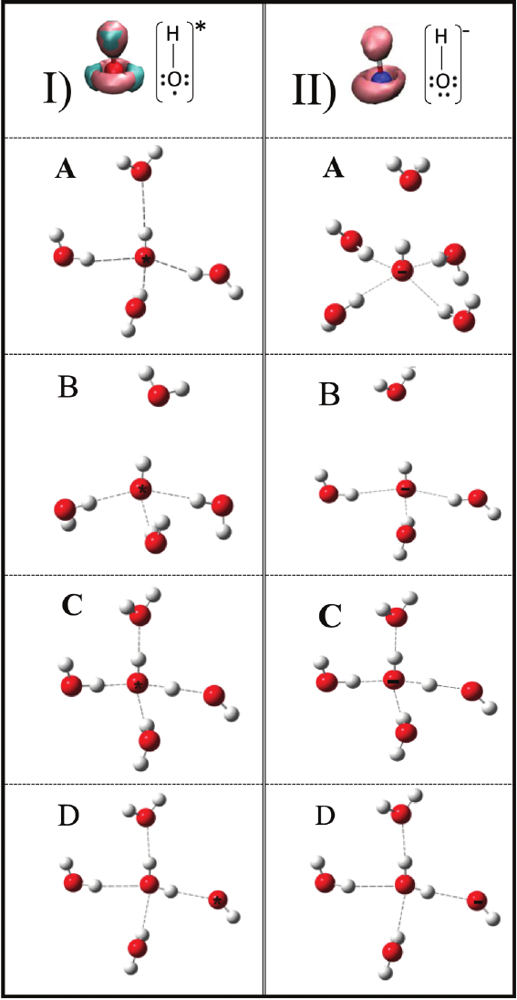
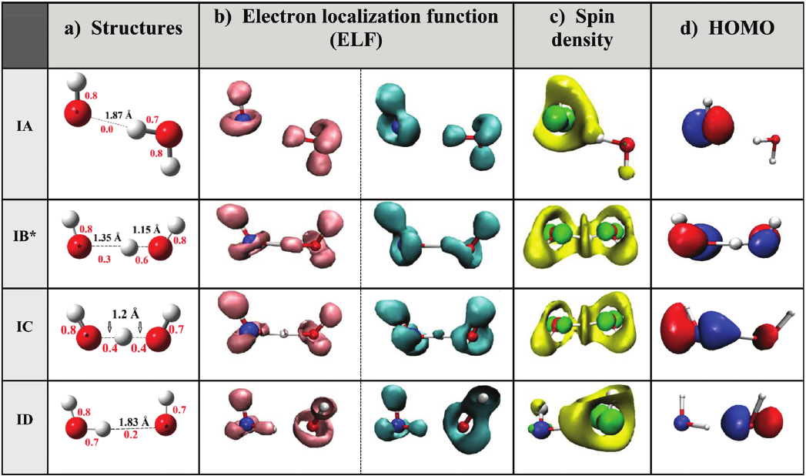
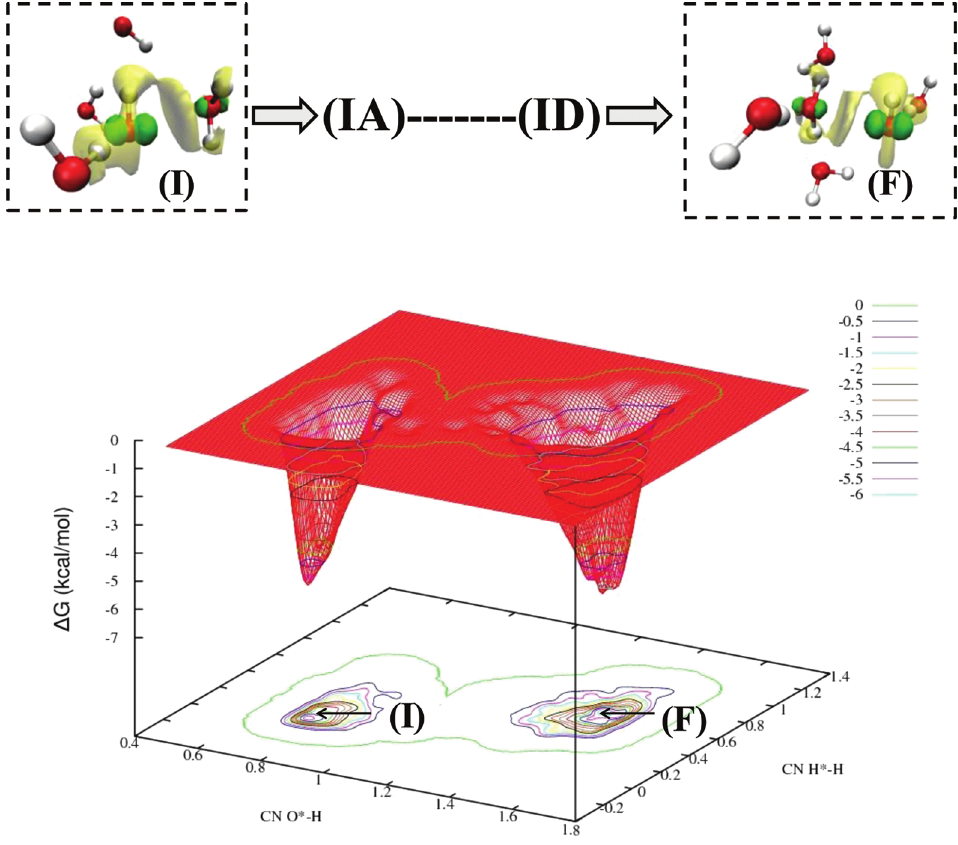

# Mobility Mechanism of Hydroxyl Radicals in Aqueous Solution via Hydrogen Transfer

## Reading prompts / 阅读提示

- **English:** Read each source block with its Chinese counterpart; figures and tables remain attached to their original captions.
- **中文：** 请将每一原文块与其中文译文对应阅读；图和表保留原始图注并放在相关正文附近。

## Terminology ledger / 术语表

- **English:** Technical terms, symbols, formulae, units and citation markers retain the source notation.
- **中文：** 技术术语、符号、化学式、单位和引文标记均保留原文记法。

## Full bilingual reader / 全文中英文对照

## Article information / 文章信息

**Source:** p.1 S001

**Original:** Edelsys Codorniu-Hernández and Peter G. Kusalik*

**中文:** Edelsys Codorniu-Hernández 和 Peter G. Kusalik*

**Source:** p.1 S002

**Original:** * S Supporting Information

**中文:** * S 支持信息

**Source:** p.1 S003

**Original:** In addition to a molecular mechanism, OH* can be expected to be able to diffuse in water via hydrogen (H) exchange, analogous to the proton-exchange reaction in the case of the hydroxide anion (OH−).12,13 A detailed investigation has led to a clear understanding of the nature and transport mechanism of OH−in aqueous solution.14,15 In the case of OH*, it is believed that this species unselectively ‘snatches’ an electron from any molecule due to the unpaired electron in its electronic

**中文:** 除了分子机制之外，OH* 预计能够通过氢 (H) 交换在水中扩散，类似于氢氧根阴离子 (OH−) 情况下的质子交换反应。12,13 详细的研究使人们对水溶液中 OH− 的性质和传输机制有了清晰的了解。14,15 就 OH* 而言，人们相信，由于不成对，该物质会无选择性地从任何分子中“抢夺”电子。其电子中的电子

**Source:** p.1 S004

**Original:** Article

**中文:** 文章

**Source:** p.1 S005

**Original:** pubs.acs.org/JACS

**中文:** pubs.acs.org/JACS

**Source:** p.1 S006

**Original:** structure. Therefore, a H-hopping chain reaction may be anticipated in aqueous solution; however, such a process has not been previously demonstrated by experimental or computational studies owing to the immense challenges that OH* reactivity and lifetime have posed. Motivated by the apparent lack of data for OH*, the inherent difficulties faced in its experimental detection, and the inconsistency in the rather limited number of molecular dynamic studies12,13,16,17 on the chemistry of this important chemical species in liquid water, we have performed extensive Car−Parrinello molecular dynamics simulations with a large 63·H2O−OH* system. In a very recent article18 we have shown that previous theoretical results12,13,16

**中文:** 结构。因此，在水溶液中可能会发生氢跳链反应；然而，由于 OH* 反应性和寿命带来的巨大挑战，这一过程此前尚未通过实验或计算研究得到证实。由于 OH* 数据明显缺乏、其实验检测中面临的固有困难以及关于液态水中这一重要化学物质的化学性质的分子动力学研究数量相当有限12,13,16,17 的不一致，我们对大型 63·H2O−OH* 系统进行了广泛的 Car−Parrinello 分子动力学模拟。在最近的一篇文章18中，我们表明了先前的理论结果12,13,16

**Source:** p.1 S007

**Original:** with smaller systems were contaminated by system size effects, being biased by the presence of a three-electron two-centered hemibond structure between the oxygen atoms of a water molecule and the radical. This hemibond is an apparent artifact of the self-interaction error,19 which is known to effect GGA DFT functionals, and has been demonstrated to decrease significantly as the system size (number of water molecules) is increased in this particular system.18,20 Here we provide insights into the local hydration structure and mobility of OH* in aqueous solution, demonstrating that the H-transfer between a OH* and a water molecule can be a very rapid reaction and revealing key aspects of this process.

**中文:** 较小的系统受到系统尺寸效应的污染，由于水分子的氧原子和自由基之间存在三电子二中心半键结构而产生偏差。这种半键是自相互作用误差的明显伪影，19 已知会影响 GGA DFT 泛函，并且已被证明随着该特定系统中系统尺寸（水分子数量）的增加而显着减小。 18,20 在这里，我们深入了解了 OH* 在水溶液中的局部水合结构和迁移率，证明 OH* 和水分子之间的 H 转移可以是非常快速的反应，并揭示了该过程的关键方面。

**Source:** p.1 S008

**Original:** Received: September 20, 2011 Published: November 22, 2011

**中文:** 收稿日期: 2011-09-20 发布日期: 2011-11-22

**Source:** p.1 S009

**Original:** Mobility Mechanism of Hydroxyl Radicals in Aqueous Solution via Hydrogen Transfer

**中文:** 羟基自由基在水溶液中氢转移的迁移机制

**Source:** p.1 S010

**Original:** Department of Chemistry, University of Calgary, 2500 University Drive NW, Calgary T2N1N4, Alberta, Canada

**中文:** 卡尔加里大学化学系，2500 University Drive NW，卡尔加里 T2N1N4，艾伯塔省，加拿大

**Source:** p.1 S011

**Original:** ABSTRACT: The hydroxyl radical (OH*) is a highly reactive oxygen species that plays a salient role in aqueous solution. The influence of water molecules upon the mobility and reactivity of the OH* constitutes a crucial knowledge gap in our current understanding of many critical reactions that impact a broad range of scientific fields. Specifically, the relevant molecular mechanisms associated with OH* mobility and the possibility of diffusion in water via a H-transfer reaction remain open questions. Here we report insights into the local hydration and electronic structure of the OH* in aqueous solution from Car−Parrinello molecular dynamics and explore the mechanism of H-transfer between OH* and a water molecule. The relatively small free energy barrier observed (∼4 kcal/mol) supports a conjecture that the H-transfer can be a very rapid process in water, in accord with very recent experimental results, and that this reaction can contribute significantly to OH* mobility in aqueous solution. Our findings reveal a novel H-transfer mechanism of hydrated OH*, resembling that of hydrated OH−and presenting hybrid characteristics of hydrogen-atom and electron−proton transfer processes, where local structural fluctuations play a pivotal role. ■INTRODUCTION The hydroxyl radical (OH*) is a highly reactive species that is ubiquitous in our environment. It plays crucial roles in diverse fields ranging from water remediation and environmental cleanup, radiation processing and nuclear reactors, to medical diagnosis and therapy.1 OH* is a critical chemical species in the lower atmosphere,2,3 it is an essential compound to the body’s natural defense mechanisms,4 and is believed to be responsible for damage to DNA, lipids, and proteins. Yet, its reactivity is apparently strongly influenced by water molecules.5,6 The possible existence of a H2O−OH* complex has been speculated to affect strongly the diffusion and oxidative capacity of the radical. Particularly, the [H2O--HO*] interaction in which OH* acts as a H-bond donor has been found as a minimum in the potential energy surface of OH*−H2O dimers in the gas phase.7−11 However, direct experimental measurements of transient neutral species is very challenging, and indeed the data available for OH* are limited.1 The temperature dependence of the OH* diffusion coefficient, for example, has only been estimated by assuming Stokes law behavior or by assuming the temperature dependence is the same as for water self-diffusion.1

**中文:** 摘要：羟基自由基（OH*）是一种高活性氧物质，在水溶液中发挥着重要作用。水分子对 OH* 的迁移率和反应性的影响构成了我们目前对影响广泛科学领域的许多关键反应的理解中的一个关键知识空白。具体而言，与 OH* 迁移率相关的分子机制以及通过氢转移反应在水中扩散的可能性仍然是一个悬而未决的问题。在这里，我们报告了 Car−Parrinello 分子动力学对水溶液中 OH* 局部水合和电子结构的见解，并探索了 OH* 和水分子之间的 H 转移机制。观察到的相对较小的自由能垒 (∼4 kcal/mol) 支持这样的猜想：根据最近的实验结果，H 转移在水中可能是一个非常快速的过程，并且该反应可以显着促进 OH* 在水溶液中的迁移率。我们的研究结果揭示了水合 OH* 的一种新颖的氢转移机制，类似于水合 OH− 的氢转移机制，并呈现出氢原子和电子质子转移过程的混合特征，其中局部结构涨落起着关键作用。 ■简介 羟基自由基(OH*) 是一种高活性物质，在我们的环境中普遍存在。它在水修复和环境净化、辐射处理和核反应堆、医学诊断和治疗等多个领域发挥着至关重要的作用。1 OH* 是低层大气中的一种重要化学物质，2,3 它是人体自然防御机制的重要化合物，4 并且被认为会造成 DNA、脂质和蛋白质的损伤。然而，其反应性显然受到水分子的强烈影响。5,6 据推测，H2O−OH* 复合物的可能存在会强烈影响自由基的扩散和氧化能力。特别是，已发现 OH* 作为氢键供体的 [H2O--HO*] 相互作用在气相 OH*−H2O 二聚体的势能面中达到最小值。7−11 然而，对瞬态中性物质的直接实验测量非常具有挑战性，并且实际上 OH* 可用的数据有限。1 例如，OH* 扩散系数的温度依赖性只能通过假设斯托克斯定律行为或假设温度依赖性为与水自扩散相同。1

**Source:** p.2 S012

**Original:** Journal of the American Chemical Society Article

**中文:** 美国化学会杂志文章

## ■METHODS / 方法

**Source:** p.2 S013

**Original:** ■METHODS

**中文:** ■方法

**Source:** p.2 S014

**Original:** The standard Car−Parrinello21 DFT-based ab initio molecular dynamics method was used with the CPMD22 code to study 63·H2O−OH* systems within a 12.56 Å cubic simulation box. Periodic boundary conditions were applied, and the simulation temperature was set to 310 K. The local spin density (LSDA) functional theory was used to account for the unpaired electron on the OH*. The following two different density functionals were utilized and compared: the gradient-corrected exchange-correlation energy functionals of Becke−Lee−Yang−Parr23,24(BLYP) and the HCTH/120.25

**中文:** 基于标准 Car−Parrinello21 DFT 的从头算分子动力学方法与 CPMD22 代码一起使用，在 12.56 Å 立方模拟箱内研究 63·H2O−OH* 系统。应用周期性边界条件，并将模拟温度设置为 310 K。使用局域自旋密度 (LSDA) 泛函理论来解释 OH* 上的不成对电子。使用并比较了以下两种不同的密度泛函：Becke−Lee−Yang−Parr23,24(BLYP) 的梯度校正交换相关能量泛函和 HCTH/120.25

**Source:** p.2 S015

**Original:** BLYP was included since it was previously applied in the study of systems of 31 H2O molecules and a hydroxyl radical.12,13,16 The HCTH/12025 functional was also employed because it has been reported to better reproduce the properties of liquid water.26,27 This particular functional is a highly parametrized GGA functional which was fit to a large set of empirical molecular properties. For our simulations, we have primarily applied the HCTH/120 functional and the Troullier−Martins norm conserving pseudopotential,28 where the valence electronic wave function is described with a plane wave basis with an energy cutoff of 90 Ry which provides a reasonable basis set convergence for this particular system. In addition, we compare the results obtained from the HCTH/120 functional with those obtained with the BLYP functional with the Goedecker29 norm-conserving pseudopotential and a valence electronic wave function described with a plane wave basis with a 75 Ry energy cutoff since this scheme was previously applied in the study of systems with 31 H2O molecules and a hydroxyl radical.12,13,16 We use this scheme with the BLYP functional for both small (31·H2O−OH*) and large (63·H2O−OH*) systems for consistency. Tests with the BLYP functional in combination with either pseudopotentials gave the same results. In general, the parameters used for the dynamics followed those used in previous CPMD simulations for aqueous OH* systems16 where a fictitious mass of 600 au was utilized in the present study, whereas previous calculations employed 600 au and 800 au.16 Taking into account the importance of a reasonable selection of the fictitious electronic mass in a Car−Parrinello molecular dynamic simulation, the Supporting Information explores the possible impacts of the selected parameters. The fictitious electron kinetic energy and the dynamics of atoms were controlled by a chain of three Nose−Hoover thermostats30 operating at characteristic frequencies of 6000 cm−1 and 2000 cm−1, respectively. During the 7 ps equilibration and the subsequent 50 ps of simulation, the total energy was monitored as well as the kinetic energy of the fictitious electronic degrees of freedom. The average fictitious kinetic energy was maintained at levels of 0.06 Ha and remained stable during the whole simulation. The time step was set to 0.1 fs. Constrained MD and Metadynamics. The free energy of the hydrogen transfer reaction between the hydroxyl radical and a water molecule was determined using both constrained molecular dynamics31 and metadynamics32 simulations. This is a challenging unitary reaction (OH* + H2O →H2O + OH*) to study in liquid water, due to the relatively small barrier for the transfer process and the possible involvement of other neighboring water molecules. In terms of the constrained MD simulations, the difference between the distances O*−H and O−H was, after considerable testing, selected as a constraint (R). Here, a sequential approach was applied, starting the constrained MD simulations from a configuration that is close to the initial state of the reaction, and from there subsequently starting each new constraint run from the end point of the previous simulation. For each 0.1 Å increment, the average constraint force was measured over a 3 ps trajectory. From such simulations the free energy profile was obtained from a straightforward thermodynamic integration over the coordinate R. Lagrangian metadynamics proved useful for the characterization of the free energy barrier for a 31·H2O−OH* system with the HCTH/120 functional. For this smaller system the H-transfer reaction is not observed to proceed spontaneously, therefore allowing for reasonable performance of the metadynamics approach. Details of this approach have been extensively published.32,33 The chosen set of collective variables included CNO*−H, representing the coordination number of all hydrogen atoms around the radical oxygen (O*) within

**中文:** BLYP 被纳入其中，因为它之前曾应用于 31 个 H2O 分子和羟基自由基的系统研究。12,13,16 还使用了 HCTH/12025 泛函，因为据报道它可以更好地重现液态水的性质。26,27 这种特殊泛函是高度参数化的 GGA 泛函，适合大量经验分子特性。在我们的模拟中，我们主要应用了 HCTH/120 泛函和 Troullier-Martins 范数守恒赝势，28，其中价电子波函数用能量截止为 90 Ry 的平面波基来描述，这为该特定系统提供了合理的基组收敛。此外，我们将 HCTH/120 泛函获得的结果与使用 Goedecker29 范数守恒赝势的 BLYP 泛函获得的结果进行比较，并使用能量截止为 75 Ry 的平面波基描述的价电子波函数，因为该方案之前已应用于具有 31 个 H2O 分子和羟基自由基的系统的研究。 12,13,16 我们将此方案与 BLYP 泛函一起用于小(31·H2O−OH*) 和大型 (63·H2O−OH*) 系统的一致性。将 BLYP 泛函与任一赝势结合进行的测试得出了相同的结果。一般来说，用于动力学的参数遵循之前水性 OH* 系统 CPMD 模拟中使用的参数16，其中本研究中使用了 600 au 的虚拟质量，而之前的计算使用了 600 au 和 800 au。 16 考虑到在 Car−Parrinello 分子动力学模拟中合理选择虚拟电子质量的重要性，支持信息探讨了所选参数的可能影响。虚拟电子动能和原子动力学由三个 Nose-Hoover 恒温器30 组成的链控制，这些恒温器分别在 6000 cm−1 和 2000 cm−1 的特征频率下运行。在 7 ps 平衡和随后的 50 ps 模拟期间，监测总能量以及虚拟电子自由度的动能。平均虚拟动能保持在0.06 Ha的水平，并在整个模拟过程中保持稳定。时间步长设置为 0.1 fs。约束 MD 和元动力学。使用约束分子动力学 31 和元动力学 32 模拟确定羟基自由基和水分子之间氢转移反应的自由能。这是在液态水中研究的一个具有挑战性的单一反应（OH* + H2O →H2O + OH*），因为转移过程的障碍相对较小，并且可能涉及其他邻近的水分子。就约束 MD 模拟而言，经过大量测试后，选择距离 O*−H 和 O−H 之间的差作为约束 (R)。 这里，应用了顺序方法，从接近反应初始状态的配置开始受约束的MD模拟，并随后从先前模拟的终点开始每个新的约束运行。对于每 0.1 Å 增量，在 3 ps 轨迹上测量平均约束力。从这样的模拟中，自由能曲线是通过坐标 R 上的简单热力学积分获得的。拉格朗日元动力学被证明对于表征具有 HCTH/120 泛函的 31·H2O−OH* 系统的自由能垒是有用的。对于这个较小的系统，没有观察到氢转移反应自发进行，因此允许元动力学方法的合理性能。这种方法的细节已被广泛发表。32,33 所选的集体变量集包括 CNO*−H，代表内部自由基氧 (O*) 周围所有氢原子的配位数

**Source:** p.2 S016

**Original:** dx.doi.org/10.1021/ja208874t | J. Am. Chem.Soc. 2012, 134, 532−538 533

**中文:** dx.doi.org/10.1021/ja208874t | J. Am.化学学会。 2012, 134, 532−538 533

**Source:** p.2 S017

**Original:** a radius of 1.2 Å, and the CNH*−H, representing the coordination number of all hydrogen atoms around the radical hydrogen (H*) within a radius of 1.7 Å. After extensive testing these were the only parameters found to be successful in achieving a reasonable description of the H-transfer reaction within metadynamics. ■RESULTS AND DISCUSSION

**中文:** 半径为1.2 Å，CNH*−H表示半径1.7 Å内氢自由基（H*）周围所有氢原子的配位数。经过广泛的测试后，发现这些参数是唯一能够成功实现元动力学中 H 转移反应合理描述的参数。结果与讨论

**Source:** p.2 S018

**Original:** “Inactive” State of OH* in Aqueous Solution. Significant contributions to the knowledge of the local solvation structure of the OH* in aqueous solution can be provided through the simulation of a large 63·H2O−OH* system. From our results, OH* is found to exist in an “inactive” state, OH*(H2O)4 (Figure 1, IA), in which OH* has three H-bonddonating neighbors and one H-bond-accepting neighbor (radial distribution functions (RDF) and coordination numbers (CN) for this structure are provided in the Supporting Information). This local solvation structure has been reported by Adriaanse et al. after an empirical self-interaction correction (additive correction to the Kohn−Sham total energy) was included in the DFTMD method to suppress the formation of the hemibond, as an apparent artifact of the SIE in DFT.34

**中文:** 水溶液中 OH* 的“非活性”状态。通过模拟大型 63·H2O−OH* 系统，可以为了解水溶液中 OH* 的局部溶剂化结构做出重大贡献。根据我们的结果，发现 OH* 以“非活性”状态存在，即 OH*(H2O)4（图 1，IA），其中 OH* 具有三个提供氢键的邻居和一个接受氢键的邻居（支持信息中提供了该结构的径向分布函数 (RDF) 和配位数 (CN)）。 Adriaanse 等人报道了这种局部溶剂化结构。 DFTMD 方法中包含了经验自相互作用校正（对 Kohn−Sham 总能量的加性校正）以抑制半键的形成，这是 DFT 中 SIE 的明显伪影。34

**Source:** p.2 S019

**Original:** Tuckerman et al.,14,15 reported an OH−(H2O)4 structure for the OH−“inactive” state where in this case a four-fold planar coordination around the oxygen atom is observed (Figure 1, IIA). The differences between the “inactive” states of both species can be explained by utilizing the electron localization functions (ELF) for isolated OH* and OH−shown at the top of Figure 1. ELF provides a useful method for the analysis of electron localization in a chemically intuitive way and indicates spatial regions where electron pairs are most likely to be found.35 We can deduce from these figures that OH−has the three lone pair electrons in a delocalized ring structure around the oxygen atom14,15 supporting the hypercoordination of this species in its “inactive” state (Figure 1, IIA), while for OH* a similarly delocalized continuous ring is shown for the ELF for beta spin−orbitals (ELF-β). In addition, a p-like function for the OH* unpaired electron appears in the ELF of alpha spin− orbitals (ELF-α). This then explains the observation that one of the three accepting hydrogen bonds of OH* is stronger than the other two, which corresponds to the interaction with the OH* unpaired electron. In fact, from the electronic features of the “inactive state”(see Figure 2c, IA) it can be seen that at this point the OH* shares positive spin density with the hydrogen of the closest water molecule, indicative of a stronger interaction with this H-bond-donating neighbor. As can be seen in Figure 2d, IA, the highest occupied molecular orbital (HOMO) is located on the OH* in the “inactive state”, while the ELF-α and ELF-β have representative features of an isolated OH* and a water molecule at this point. In the case of OH−, a proton-transfer reaction was found to be a fast event in aqueous solution, strongly influenced by structural fluctuations. Within our simulations, spontaneous Htransfers were observed on a roughly 30 ps time scale (three events in a total of 100 ps). In its “inactive” state (Figure 1, IA) the radical seems to be already favorably “pre-coordinated” (with respect to its H-bond-donating neighbors) to accept a hydrogen atom from a neighboring water molecule. If this (cf. Figure 1, IA) were the appropriate solvation structure for the H-transfer reactions, then H-transfers in water could proceed essentially uncontrolled, and consequently, a very high mobility of OH* in aqueous solution would be observed. H-Transfer Mechanism of Hydrated OH*. There are apparent structural and electronic constraints in the “inactive”

**中文:** Tuckerman 等人,14,15 报告了 OH−“非活性”状态的 OH−(H2O)4 结构，在这种情况下，观察到围绕氧原子的四重平面配位（图 1，IIA）。两种物质的“非活性”状态之间的差异可以通过利用图 1 顶部所示的孤立 OH* 和 OH− 的电子局域函数 (ELF) 来解释。ELF 提供了一种以化学直观的方式分析电子局域化的有用方法，并指示最有可能发现电子对的空间区域。 35 我们可以从这些图中推断出 OH− 在氧原子周围的离域环结构中具有三个孤对电子 14,15 支持该物种处于“非活动”状态的超协调（图 1，IIA），而对于 OH*，β 自旋轨道 (ELF-β) 的 ELF 中显示出类似的离域连续环。此外，OH* 不成对电子的 p 型函数出现在 α 自旋轨道的 ELF（ELF-α）中。这就解释了 OH* 的三个接受氢键之一比其他两个更强的观察结果，这对应于与 OH* 不成对电子的相互作用。事实上，从“非活性状态”的电子特征（见图2c，IA）可以看出，此时OH*与最近的水分子的氢共享正自旋密度，表明与这个提供氢键的邻居有更强的相互作用。从图2d，IA中可以看出，最高占据分子轨道（HOMO）位于“非活性状态”的OH*上，而ELF-α和ELF-β此时具有孤立的OH*和水分子的代表性特征。就 OH− 而言，质子转移反应在水溶液中是一个快速事件，受到结构波动的强烈影响。在我们的模拟中，在大约 30 ps 的时间尺度上观察到自发 Htransfer（三个事件总共 100 ps）。在其“不活跃”状态（图1，IA），自由基似乎已经有利地“预配位”（相对于其提供氢键的邻居）以接受来自邻近水分子的氢原子。如果这（参见图1，IA）是H-转移反应的适当溶剂化结构，那么水中的H-转移可能基本上不受控制地进行，因此，将观察到水溶液中OH*的非常高的迁移率。水合 OH* 的 H 转移机制。 “不活动”中存在明显的结构和电子限制

**Source:** p.3 S020

**Original:** Journal of the American Chemical Society Article

**中文:** 美国化学会杂志文章

### Fig. 001

**Placed near:** p.3 S020
**Source:** p.3 C001

**Original caption:** Figure 1. Schematic representation of the first solvation shell of the OH* (column I) and the OH−(column II)14,15for different steps during the hydrogen or proton transfer reaction, respectively, from a nearest neighbor water molecule. (A) Molecular configuration prior to the reaction, corresponding to the “inactive state”; (B) the “active” state; (C) the transition state (TS); and (D) post-transfer.). In these configurations, dotted lines between oxygen and hydrogen atoms indicate rOO < 3 Å. ELF isosurfaces (0.85) for isolated OH* and OH−

**中文图注:** 图 1. 氢或质子转移反应过程中不同步骤的 OH*（第一列）和 OH−（第二列）14,15 的第一个溶剂化壳的示意图，分别来自最近的相邻水分子。 (A) 反应前的分子构型，对应于“非活性状态”； (B)“活动”状态； (C)过渡状态(TS)； (D) 转移后。）。在这些构型中，氧原子和氢原子之间的虚线表示 rOO < 3 Å。孤立 OH* 和 OH− 的 ELF 等值面 (0.85)

**Source:** p.3 S021

**Original:** are shown. For OH*, ELF-β and ELF-α are represented as magenta and cyan isosurfaces, respectively.

**中文:** 显示。对于 OH*，ELF-β 和 ELF-α 分别表示为洋红色和青色等值面。

**Source:** p.3 S022

**Original:** state that inhibit the H-transfer reaction. The transformation from the “inactive” OH*(H2O)4 (Figure 1, IA) to an “active” OH*(H2O)3 arrangement, (Figure 1, IB), occurs through a weakening of the [H2O--HO*] hydrogen bond during local structural fluctuations; the [H2O--HO*] interaction has been already recognized as the most stable for the OH*2O dimer in the gas phase.7−11 Here we define the “active state” as the configuration from which the reaction is observed to proceed. Hence, the “active state” state shown in Figure 1, IB is necessarily visited before the H-atom can be transferred. This is potentially the rate-limiting step for the H-transfer reaction. This finding is consistent with the frequency observed for the

**中文:** 抑制 H 转移反应的状态。从“非活性”OH*(H2O)4（图1，IA）到“活性”OH*(H2O)3排列（图1，IB）的转变是通过局部结构波动期间[H2O--HO*]氢键的减弱而发生的； [H2O--HO*] 相互作用已被认为是 OH*2O 二聚体在气相中最稳定的相互作用。7−11 这里我们将“活性状态”定义为观察到反应进行的构型。因此，在 H 原子可以转移之前，必须访问图 1、IB 中所示的“活性状态”状态。这可能是氢转移反应的限速步骤。这一发现与观察到的频率一致

**Source:** p.3 S023

**Original:** dx.doi.org/10.1021/ja208874t | J. Am. Chem.Soc. 2012, 134, 532−538 534

**中文:** dx.doi.org/10.1021/ja208874t | J. Am.化学学会。 2012, 134, 532−538 534

**Source:** p.3 S024

**Original:** H-transfer events during our simulations, as the OH* needs to experience the appropriate structural fluctuations to escape from the “inactive”state. As further evidenced below, in its “pre-transition” state the OH* takes on some aspects of OH−character. In this state OH* also has a three-fold coordination, as in Figure 1, IB, but the hydrogen atom has started to be transferred, although is still not fully shared by the two oxygens (named IB* in Figure 2). Specifically, a charge polarization of the (H3O2)* complex is observed in this state with the development of a partial negative charge on the hydroxyl moiety. A similar charge polarization was observed by Mitroka et al.5 when studying the influence of water molecules in the reactivity of the OH* with organic compounds (i.e., hydrogen atom abstraction). This movement of electron density to the OH* moiety is visualized in Figure 2, IB*, which shows the structural and electronic features for the “pre-transition” state. From this figure an early electron movement is evident compared to the position of the hydrogen atom (or proton) (c.f. evolution of the HOMO and the spin density from IA to IB). The chemical potential difference between the α and β states at each identified stage (IA: 3.2, IB*: 0.0, IC: 1.15 and ID: 2.99 (kcal/mol)) is also indicative of this fact. Although this reaction should be defined as a hydrogen-atom transfer (HAT) reaction, because both the electron and the proton come from the same bond,36 the electronic features presented in Figure 2 are suggestive of a hybrid mechanism36 apparently involving aspects of HAT and electron−proton transfer (EPT). As has been previously stated,36 the definitions of HAT and EPT become blurred in some cases due to the extent of electronic coupling and delocalization involved. In the proton exchange mechanism suggested for the hydrated OH−, a first-solvation-shell H-bond breaking event also occurs, which transforms the OH−(H2O)4 structure (Figure 1, IIA) into an approximately tetrahedral OH−(H2O)3 structure (Figure 1, IIB).14,15 Interestingly then the mobility of OH* in aqueous solution has aspects resembling that of hydrated OH−, that is the “active” states of both species, OH*(H2O)3 (Figure 1, IB) and OH−(H2O)3 (Figure 1, IIB)14 appear rather similar. This could be important to the understanding of chemical reactions in water in which OH−and OH* are both involved, particularly electron-driven processes.1,37 At the transition state, the hydrogen atom (or proton) is now fully shared by the two OH moieties, corresponding to the formation of a (H3O2)* entity; at this point the environment around each OH moiety becomes similar (the coordination number is 4.0 around both). The [H2O--HO*] distance shortens dramatically at this point (Figure 1, IC), to facilitate the appropriate pre-solvation of the new formed water molecule. In the case of OH−, a weak Hbond between the OH−hydrogen and a H-bond-accepting water is also formed in the transition state (Figure1, IIC). After the H-transfer, the new OH* is formed in its “inactive” OH*(H2O)4 state (Figure 1, ID), where a similar situation is observed for the OH−(Figure 1, IID). The consequence of this process is that the radical center has migrated to a new site in the H-bond network. In the post-transfer state (Figures 1, ID and 2, ID) the new OH* carries the major portion of the spin density, similar to the initial state (Figure 2, IA), with only a small amount of positive spin density appearing near the hydrogen of the closest water molecule. In a general analysis of the ELF functions for the reaction (Figure 2, column b), we note that before the H-transfer (Figure 2, IA) the ELF-α has representative features of an isolated OH* and water molecule,

**中文:** 我们模拟期间的氢转移事件，因为 OH* 需要经历适当的结构波动才能摆脱“非活性”状态。如下文进一步证明，在“转变前”状态，OH* 呈现 OH- 特性的某些方面。在这种状态下，OH*也具有三重配位，如图1中的IB所示，但氢原子已经开始转移，尽管仍然没有完全被两个氧原子共享（在图2中称为IB*）。具体而言，在这种状态下观察到 (H3O2)* 络合物的电荷极化，羟基部分上出现部分负电荷。 Mitroka 等人 5 在研究水分子对 OH* 与有机化合物的反应性（即夺取氢原子）的影响时观察到了类似的电荷极化。这种电子密度向 OH* 部分的移动如图 2, IB* 所示，它显示了“过渡前”状态的结构和电子特征。从该图中可以看出，与氢原子（或质子）的位置相比，早期电子运动是明显的（参见 HOMO 的演化以及从 IA 到 IB 的自旋密度）。每个确定阶段的 α 和 β 态之间的化学势差（IA：3.2，IB*：0.0，IC：1.15 和 ID：2.99（kcal/mol））也表明了这一事实。尽管该反应应定义为氢原子转移 (HAT) 反应，因为电子和质子都来自同一键，36 图 2 中显示的电子特征暗示了混合机制 36 显然涉及 HAT 和电子质子转移 (EPT) 的各个方面。如前所述，36 HAT 和 EPT 的定义在某些情况下由于涉及电子耦合和离域的程度而变得模糊。在水合 OH− 提出的质子交换机制中，也会发生第一溶剂化壳层氢键断裂事件，将 OH−(H2O)4 结构（图 1，IIA）转变为近似四面体的 OH−(H2O)3 结构（图 1，IIB）。 14,15 有趣的是，OH* 在水溶液中的迁移率与水合 OH− 的迁移率具有相似之处，即两种物质的“活性”状态，OH*(H2O)3（图1，IB）和OH−(H2O)3（图1，IIB）14 看起来相当相似。这对于理解水中涉及 OH− 和 OH* 的化学反应（尤其是电子驱动的过程）非常重要。1,37 在过渡态，氢原子（或质子）现在完全由两个 OH 部分共享，对应于 (H3O2)* 实体的形成；此时，每个 OH 部分周围的环境变得相似（两者周围的配位数均为 4.0）。此时 [H2O--HO*] 距离显着缩短（图 1，IC），以促进新形成的水分子的适当预溶剂化。在 OH− 的情况下，OH− 氢和接受氢键的水之间也会在过渡态中形成弱氢键（图 1，IIC）。 H 转移后，新的 OH* 以其“非活性”OH*(H2O)4 状态形成（图 1，ID），其中观察到 OH−（图 1，IID）类似的情况。 这个过程的结果是自由基中心迁移到氢键网络中的新位置。在转移后状态（图1，ID和2，ID）中，新的OH*携带自旋密度的主要部分，类似于初始状态（图2，IA），只有少量正自旋密度出现在最接近的水分子的氢附近。在对反应 ELF 函数的一般分析中（图 2，b 列），我们注意到在 H 转移之前（图 2，IA），ELF-α 具有孤立的 OH* 和水分子的代表性特征，

**Source:** p.4 S025

**Original:** Journal of the American Chemical Society Article

**中文:** 美国化学会杂志文章

### Fig. 002

**Placed near:** p.4 S025
**Source:** p.4 C002

**Original caption:** Figure 2. Molecular configurations and electronic features for different states during the spontaneous H-transfer reaction (the OH* and the water molecule involved in the reaction are represented). Row legends: (IA) initial state, (IB*) pre-transition state, (IC) transition state (H3O2)* complex, (ID) post-transfer state. A dark-blue sphere represents the oxygen atom of the initial radical. The whole reaction (conversion from IA to ID) occurs in approximately 0.7 ps. Column (a) shows molecular configurations in which the black numbers are atomic distances and red numbers are the bond orders; column (b) presents the ELF-β as magenta isosurfaces (0.85) and the ELF-α as cyan isosurfaces (0.85). Column (c) shows the evolution of the spin density, where the yellow isosurfaces correspond to +0.0004 and green isosurfaces correspond to −0.03. In column (d), the evolution of the HOMO is presented where red and blue isosurfaces have values of −0.03 and +0.04, respectively. For (IA) and (ID) the HOMO is localized on the OH* and is perpendicular to the H-bond with the nearest neighboring water molecule. For (IB*) both HOMO and HOMO−1 orbitals are shown due to the existence of α and β degenerated states centered on the water and OH* oxygens, while at the transition state (IC), the HOMO is shared across the (H3O2)* complex.

**中文图注:** 图 2. 自发氢转移反应过程中不同状态的分子构型和电子特征（表示参与反应的 OH* 和水分子）。行图例：(IA) 初始状态，(IB*) 过渡前状态，(IC) 过渡状态 (H3O2)* 复合物，(ID) 转移后状态。深蓝色球体代表初始自由基的氧原子。整个反应（从 IA 到 ID 的转换）发生在大约 0.7 ps 内。 (a) 列显示分子构型，其中黑色数字是原子距离，红色数字是键级； (b) 列将 ELF-β 呈现为洋红色等值面 (0.85)，将 ELF-α 呈现为青色等值面 (0.85)。 (c) 列显示自旋密度的演变，其中黄色等值面对应于 +0.0004，绿色等值面对应于 -0.03。在 (d) 列中，显示了 HOMO 的演变，其中红色和蓝色等值面的值分别为 -0.03 和 +0.04。对于 (IA) 和 (ID)，HOMO 位于 OH* 上，并垂直于与最近的相邻水分子的氢键。对于 (IB*)，由于存在以水和 OH* 氧为中心的 α 和 β 简并态，因此显示了 HOMO 和 HOMO−1 轨道，而在过渡态 (IC) 下，HOMO 在 (H3O2)* 络合物中共享。

### Fig. 003

**Placed near:** p.4 S025
**Source:** p.4 C003

**Original caption:** Figure 3. Free energy profiles from constrained molecular dynamics (MD) simulations for the H-transfer reaction between OH* and a neighboring water molecule. The BLYP (blue line) and the HCTH/120 (magenta line) density functionals for the displacement coordinate R (see schematic illustration) were applied. The average rH*O distance (see schematic illustration) for every constrained MD step is represented by the second axis (right) and the red line.

**中文图注:** 图 3. OH* 与相邻水分子之间 H 转移反应的约束分子动力学 (MD) 模拟的自由能分布。应用了位移坐标 R 的 BLYP（蓝线）和 HCTH/120（洋红色线）密度泛函（参见示意图）。每个约束 MD 步骤的平均 rH*O 距离（参见示意图）由第二轴（右）和红线表示。

**Source:** p.4 S026

**Original:** which become somewhat modified in the pre-transition state (Figure 2, IB*). In the transition state (Figure 2, IC) a symmetric electronic structure, consistent with sharing of electrons, is apparent, with similar character on both oxygen centers. At the completion of the transfer (Figure 2, ID), features typical of the new isolated OH* and water molecule are once again seen. Taking into account the above observations, the diffusion mechanism of OH* in aqueous solution via H-transfer reactions can be summarized as: (1) formation of an “active state” transient OH*(H2O)3 structure by the weakening of the [H2O--HO*] hydrogen bond through

**中文:** 其在过渡前状态中有所改变（图2，IB*）。在过渡态（图 2，IC）中，明显存在与共享电子一致的对称电子结构，两个氧中心具有相似的特征。转移完成后（图 2，ID），再次看到新分离的 OH* 和水分子的典型特征。考虑到上述观察，OH*在水溶液中通过氢转移反应的扩散机制可概括为：（1）通过削弱[H2O--HO*]氢键，形成“活性态”瞬时OH*(H2O)3结构。

**Source:** p.4 S027

**Original:** dx.doi.org/10.1021/ja208874t | J. Am. Chem.Soc. 2012, 134, 532−538 535

**中文:** dx.doi.org/10.1021/ja208874t | J. Am.化学学会。 2012, 134, 532−538 535

**Source:** p.4 S028

**Original:** local structural fluctuations, (2) formation of a (H3O2)* complex with an early electron transfer while the H-atom is still not equally shared between the two oxygens in the “pretransition” state (EPT), (3) formation of a [H2O--HO*] hydrogen bond in the transition state to facilitate the appropriate “pre-solvation” of the newly formed water molecule, and (4) completion of the HAT/EPT reaction resulting in a new OH* in the “active state” state and a new water molecule. Free Energy Barrier for the H-Transfer Reaction. Having established the mechanism, we examine the free energy

**中文:** 局部结构波动，(2) 形成 (H3O2)* 络合物，并进行早期电子转移，而在“预过渡”状态 (EPT) 的两个氧之间仍未平等地共享 H 原子，(3) 在过渡状态中形成 [H2O--HO*] 氢键，以促进新形成的水分子的适当“预溶剂化”，以及 (4) 完成 HAT/EPT 反应，从而在“活性状态”状态下产生新的 OH*和一个新的水分子。 H 转移反应的自由能垒。建立机制后，我们检查自由能

**Source:** p.5 S029

**Original:** Journal of the American Chemical Society Article

**中文:** 美国化学会杂志文章

### Fig. 004

**Placed near:** p.5 S029
**Source:** p.5 C004

**Original caption:** Figure 4. Free energy landscape from a metadynamics simulation for the H-transfer reaction between OH* and a neighboring water molecule for a 31·H2O−OH* system. The HCTH/120 density functional was applied, the coordination numbers (CN) O*−H (within 1.2 Å) and H*H (within 1.7 Å) are employed as collective variables. Within the initial state of the reaction (labeled I) OH* can be seen sharing positive and negative spin density with the hemibonded water in this small 31·H2O−OH* system. Applying metadynamics the system evolves to the “inactive” states (IA) shown in Figure 1 and follows the same mechanism from IA to ID (see Figure 1). After the transfer, the new water again forms a hemibond with the newly formed OH* (F).

**中文图注:** 图 4. 31·H2O−OH* 系统中 OH* 与邻近水分子之间 H 转移反应的元动力学模拟的自由能图景。应用HCTH/120密度泛函，配位数(CN) O*−H（1.2 Å内）和H*H（1.7 Å内）用作集体变量。在反应的初始状态（标记为 I）内，可以看到 OH* 与这个小型 31·H2O−OH* 系统中的半键水共享正自旋密度和负自旋密度。应用元动力学，系统演变成图 1 所示的“非活动”状态 (IA)，并遵循从 IA 到 ID 的相同机制（见图 1）。转移后，新的水再次与新形成的 OH* (F) 形成半键。

**Source:** p.5 S030

**Original:** barrier for this reaction which we conjecture can be a very fast event. From our simulations, a time scale of 30 ps can be considered a rough estimation of the lifetime of the OH* in aqueous solution. Constrained molecular dynamics (MD) simulations31 were used to estimate the free energy barrier for the reaction (Figure 3). The value obtained of about 4 kcal/ mol is in good agreement with experimentally derived values7

**中文:** 我们推测这种反应的障碍可能是一个非常快的事件。根据我们的模拟，30 ps 的时间尺度可以被认为是水溶液中 OH* 寿命的粗略估计。约束分子动力学 (MD) 模拟31 用于估计反应的自由能垒（图 3）。获得的值约为 4 kcal/mol，与实验得出的值非常吻合7

**Source:** p.5 S031

**Original:** and high level ab initio calculations in the gas phase.8 In addition, the average rH*O distance was determined from gH*O(r) for each step of the constrained MD to confirm the crucial influence of this H-bond-accepting neighbor of the OH* during the transfer. As can be observed in Figure 3 (red line), the average rH*O distances reveal that the interaction with this H-bond-accepting water neighbor weakens significantly just prior to the formation of the transition state, starting at the “active” state for this species and taking a maximum value in the “pre-transition” state (Figure 3, IB, red line). In the transition state (Figure 3, IC, red line) this distance shortens to provide the appropriate coordination in the first solvation shell of the newly formed water molecule. No other significant structural change was observed during the reaction (see Supporting Information). Metadynamics32 was also explored as a means to estimate the free energy barrier for this reaction (see details in Methods section). This is a powerful tool that can be used for both

**中文:** 8 此外，对于约束 MD 的每一步，从 gH*O(r) 确定平均 rH*O 距离，以确认 OH* 的氢键接受邻居在转移过程中的关键影响。如图 3（红线）所示，平均 rH*O 距离表明，在过渡态形成之前，与该氢键接受水邻居的相互作用显着减弱，从该物种的“活性”状态开始，并在“过渡前”状态中取最大值（图 3，IB，红线）。在过渡态（图 3，IC，红线），该距离缩短，以便在新形成的水分子的第一个溶剂化壳层中提供适当的配位。反应过程中没有观察到其他显着的结构变化（参见支持信息）。 Metadynamics32 也被探索作为估计该反应的自由能垒的方法（参见方法部分的详细信息）。这是一个功能强大的工具，可用于

**Source:** p.5 S032

**Original:** dx.doi.org/10.1021/ja208874t | J. Am. Chem.Soc. 2012, 134, 532−538 536

**中文:** dx.doi.org/10.1021/ja208874t | J. Am.化学学会。 2012, 134, 532−538 536

**Source:** p.5 S033

**Original:** reconstructing the free energy and for accelerating rare events at the classical or quantum level.32 Its application to a 63·H2O− OH* system proved problematic probably due to the fact that the H-transfer reaction is not a rare event for this larger system (due to the small barrier of this unitary reaction). As we have shown very recently,18 there is a system size effect in the Car− Parrinello simulations of the OH* in aqueous solution in which, for small 31·H2O−OH* systems, the OH* oxygen interacts strongly with the oxygen of a neighboring water molecule to achieve a separation of ∼2.4 Å. The unpaired OH* electron is tied down in this three-electron two-centered hemibonded structure, as shown in the spin density of the structure denoted by (I) in Figure 4. Consequently, the Htransfer reaction becomes a rare event in this small 31·H2O− OH* system. The application of metadynamics did force the system to overcome the hemibonded arrangement before following the same H-transfer mechanism explained above. As illustrated in Figure 4 the initial state (I) corresponds to a local OH* structure (two H-bond-donating neighbors, a H-bondaccepting neighbor and a fourth water molecule forming a hemibond) that was found to be stable for at least 160 ps.18

**中文:** 重建自由能并加速经典或量子水平上的罕见事件。32它在 63·H2O− OH* 系统中的应用被证明是有问题的，可能是因为氢转移反应对于这个更大的系统来说并不是罕见的事件（由于这个单一反应的势垒很小）。正如我们最近所表明的，18 在水溶液中 OH* 的 Car−Parrinello 模拟中存在系统尺寸效应，其中，对于小型 31·H2O−OH* 系统，OH* 氧与相邻水分子的氧发生强烈相互作用，以实现约 2.4 Å 的分离。不成对的 OH* 电子被束缚在这个三电子二中心半键合结构中，如图 4 中 (I) 所示结构的自旋密度所示。因此，H 转移反应在这个小型 31·H2O− OH* 系统中变得罕见。元动力学的应用确实迫使系统在遵循上述相同的 H 传递机制之前克服半键排列。如图 4 所示，初始状态 (I) 对应于局部 OH* 结构（两个提供氢键的邻居、一个接受氢键的邻居和形成半键的第四个水分子），该结构被发现在至少 160 ps 内保持稳定。18

**Source:** p.5 S034

**Original:** The inclusion of repulsive potentials within metadynamics forces the local solvation structure of OH* to evolve to the “inactive” state (IA) previously presented in Figure 1, IA. The process then follows the same mechanism (see Figure 1) in

**中文:** 在元动力学中包含排斥势会迫使 OH* 的局部溶剂化结构演变成先前在图 1 IA 中所示的“非活性”状态 (IA)。然后，该过程遵循相同的机制（见图 1）

**Source:** p.6 S035

**Original:** Journal of the American Chemical Society Article

**中文:** 美国化学会杂志文章

**Source:** p.6 S036

**Original:** which the “active” state (IB), pre-transition state, transition state (IC), and again “inactive” state (ID) are visited, ending with a H-transfer reaction. As expected for this small system, after the formation of the new radical, the newly formed water quickly rotates to form a new hemibonded structure (structure denoted by (F) in Figure 4). Interestingly, this artificial dynamics yields a free energy barrier that is only somewhat (1− 2 kcal/mol) higher than the constrained MD result for the reaction profile given in Figure 4, which is consistent with the observation that the hemibonded dimer in the gas phase is around 1.8 kcal/mol more stable (with BLYP) than the hydrogen bonded configuration (see the Supporting Information of ref 34). This alternate means confirms that the barrier for this reaction has an upper bound of 6 kcal/mol and is indeed small. A rough estimate for the total activation energy for the proton exchange reaction for OH−is 3 kcal/mol,14 and indicates that OH* should be less mobile than OH−in aqueous solution. This is confirmed by the fact that the self-diffusion coefficient of OH* in water has been estimated as 2.8 × 10−5 cm2/s37 (slightly higher than that of water molecules, 2.5 × 10−5 cm2/s) which is significantly slower than the diffusion coefficient of OH−in aqueous solution (5 × 10−5 cm2/s).16 A rough estimate from the present work of the self-diffusion coefficient of OH* in aqueous solution is similar to that of a water molecule (see Supporting Information). Interestingly, this value of the diffusion coefficient is comparable to previous estimates from experiment.38 The H-transfer reaction can therefore represent an alternative means of diffusion of the radical under appropriate conditions and could contribute significantly to the mobility of OH* in solution. ■CONCLUDING REMARKS Overall, the H-transfer reaction appears to exhibit a hybrid mechanism involving aspects of both HAT and EPT, with a slight polarization of the pre-transition (H3O2)* complex. Our simulation results strongly support a very recent spectroscopic observation37 made during the irradiation of OH−in aqueous solution, in which a novel geminate recombination channel of the electron and OH* was claimed to arise from ultrafast Htransfers from neighboring water molecules. While the direct detection of the explicit transfer would be very challenging, in part because of its very short subpicosecond time scale, experimental confirmation can now be undertaken with the use of the microscopic details provided by this work. Our results evidence that H-transfer may represent an alternative mechanism for OH* diffusion in water; this would suggest that OH* mobility via H-transfer reactions can be rather sensitive to the local environment and its fluctuations. Given the great importance of this highly reactive species to a broad spectrum of scientific and industrial fields, detailed studies focused on exploring these mechanisms further is clearly warranted. For example, theoretical investigations probing the possible impact of quantum effects would seem desirable, although would be significantly more challenging than the extensive computations of this work. ■ASSOCIATED CONTENT * S Supporting Information Radial distribution functions and coordination numbers; possible effects of the electronic fictitious mass and system size on the local structure; estimation of the self-diffusion coefficient of OH* in aqueous solution; details of metadynamics simulations; full list of authors of reference 1. This

**中文:** 其中访问“活性”状态（IB）、预过渡状态、过渡状态（IC）和“非活性”状态（ID），并以氢转移反应结束。正如这个小系统所预期的那样，在新自由基形成后，新形成的水迅速旋转形成新的半键结构（图4中（F）表示的结构）。有趣的是，这种人工动力学产生的自由能垒仅比图 4 中给出的反应曲线的约束 MD 结果高 (1−2 kcal/mol)，这与气相中的半键合二聚体比氢键构型稳定约 1.8 kcal/mol（使用 BLYP）的观察结果一致（参见参考文献 34 的支持信息）。这种替代方法证实了该反应的势垒上限为 6 kcal/mol，而且确实很小。粗略估计 OH− 质子交换反应的总活化能为 3 kcal/mol,14，表明 OH* 在水溶液中的移动性应低于 OH−。 OH* 在水中的自扩散系数估计为 2.8 × 10−5 cm2/s37（略高于水分子的 2.5 × 10−5 cm2/s）这一事实证实了这一点，该系数明显慢于 OH− 在水溶液中的扩散系数（5 × 10−5 cm2/s）。 16 根据目前工作对 OH* 在水中的自扩散系数的粗略估计水溶液类似于水分子（参见支持信息）。有趣的是，这个扩散系数值与之前的实验估计值相当。38 因此，H 转移反应可以代表在适当条件下自由基扩散的另一种方式，并且可以对溶液中 OH* 的迁移率做出重大贡献。 ■结束语 总体而言，H 转移反应似乎表现出涉及 HAT 和 EPT 方面的混合机制，并且预转变 (H3O2)* 复合物具有轻微的极化。我们的模拟结果有力地支持了最近在水溶液中照射 OH− 时进行的光谱观察37，其中电子和 OH* 的新型孪生复合通道据称是由邻近水分子的超快 H 转移产生的。虽然直接检测显式转移非常具有挑战性，部分原因是其亚皮秒时间尺度非常短，但现在可以利用这项工作提供的微观细节进行实验确认。我们的结果证明 H 转移可能代表 OH* 在水中扩散的另一种机制；这表明通过氢转移反应的 OH* 迁移率对当地环境及其波动相当敏感。鉴于这种高活性物质对广泛的科学和工业领域的重要性，显然有必要进行进一步探索这些机制的详细研究。例如，探索量子效应可能影响的理论研究似乎是可取的，尽管比这项工作的广泛计算更具挑战性。 ■相关内容 * S 支持信息 径向分布功能和协调编号；电子虚拟质量和系统尺寸对局部结构可能产生的影响；水溶液中OH*自扩散系数的估算；元动力学模拟的细节；参考文献 1 的完整作者列表。

**Source:** p.6 S037

**Original:** dx.doi.org/10.1021/ja208874t | J. Am. Chem.Soc. 2012, 134, 532−538 537

**中文:** dx.doi.org/10.1021/ja208874t | J. Am.化学学会。 2012, 134, 532−538 537

**Source:** p.6 S038

**Original:** material is available free of charge via the Internet at http:// pubs.acs.org. ■AUTHOR INFORMATION Corresponding Author pkusalik@ucalgary.ca ■ACKNOWLEDGMENTS We are grateful for the financial support of the Natural Sciences and Engineering Research Council of Canada and the Canadian Foundation for Innovation. We also acknowledge computational resources made available via WestGrid (www.westgrid. ca) and the University of Calgary. E.C.-H acknowledges Prof. Dr. Alberto Rolo-Naranjo for his help with the processing codes and Dr. Daniel Boese for useful discussions. ■REFERENCES

**中文:** 材料可通过互联网免费获取：http://pubs.acs.org。 ■作者信息 通讯作者 pkusalik@ucalgary.ca ■致谢 我们感谢加拿大自然科学与工程研究委员会和加拿大创新基金会的财政支持。我们还感谢通过 WestGrid (www.westgrid.ca) 和卡尔加里大学提供的计算资源。 E.C.-H 感谢 Alberto Rolo-Naranjo 教授博士在处理代码方面提供的帮助，以及 Daniel Boese 博士进行的有益讨论。 ■参考文献

**Source:** p.6 S039

**Original:** (1) Garrett, B. C.; et al. Chem. Rev. 2005, 105, 355−390. (2) Isaksen, I. S. A.; Dalsøren, S. B. Science 2011, 331, 38−39. (3) Allodi, M. -A.; Dunn, M.-E.; Livada, J.; Kirschner, K. -N; Shields, G.-C. J. Phys. Chem. A 2006, 110, 13283−13289. (4) Manda, G.; Nechifor, M. -T.; Neagu, T.-M. Curr. Chem. Biol. 2009, 3, 342−366. (5) Mitroka, S.; Zimmeck, S.; Troya, D.; Tanko, J.-M. J. Am. Chem. Soc. 2010, 132, 2907−2913. (6) Vohringer-Martinez, E.; Hansmann, B.; Hernandez-Soto, H.; Francisco, J. S.; Troe, J.; Abel, B. Science 2007, 315, 497−501. (7) Dubey, M. K.; Mohrschladt, R.; Donahue, N. M.; Anderson, J. G. J. Phys. Chem. A 1997, 101, 1494−1500. (8) Uchimaru, T.; Chandra, A-K; Tsuzuki, S.; Sugie, M.; Sekiya, A. J. Comput. Chem. 2003, 24, 1538−1548. (9) Soloveichik, P.; O’Donnell, B.-A; Lester, M.-I. J. Phys. Chem. A 2010, 114, 1529−1538. (10) Du, S.; Francisco, J.-S.; Schenter, G.-K.; Iordanov, T.-D.; Garrett, B.-C.; Dupuis, M.; Li, J. J. Chem. Phys. 2006, 124, 224318−15. (11) Galano, A.; Narciso-López, M.; Fransisco-Marquez, M. J. Phys. Chem. A 2010, 114, 5796−5809. (12) Vassilev, P.; Louwerse, M.-J.; Baerends, E.-J. Chem. Phys. Lett. 2004, 398, 212−216. (13) Vassilev, P.; Louwerse, M.-J.; Baerends, E.-J. J. Phys. Chem. B 2005, 109, 23605−23610. (14) Tuckerman, M. E.; Marx, D.; Parrinello, M. Nature 2002, 417, 925−929. (15) Tuckerman, M. E.; Chandra, A.; Marx, D. Acc. Chem. Res. 2006, 39, 151−158. (16) Khalack, J.-M.; Lyubartsev, A.-P. J. Phys. Chem. A 2005, 102, 378−386. (17) VandeVondele, J.; Sprik, M. Phys. Chem. Chem. Phys. 2005, 7, 1363−1367. (18) Codorniu-Hernández, E.; Kusalik, P. G. J. Chem. Theory Comput. 2011, 7, 3725−3732. (19) Lundberg, M.; Siegbahn, P. E. M. J. Chem. Phys. 2005, 122, 224103. (20) Hamad, S.; Lago, S.; Mejıas, J. A. J. Phys. Chem. A 2002, 106, 9104−9113. (21) Car, R.; Parrinello, M. Phys. Rev. Lett. 1985, 55, 2471−2474. (22) CPMD; IBM Corp.: Armonk, NY, 2006; MPI für Festkörperforschung: Stuttgart, Germany, 2001. (23) Becke, A. Phys. Rev. A 1998, 38, 3098−3100. (24) Lee, C.; Yang, W.; Parr, R. Phys Rev. B 1998, 37, 785−789. (25) Boese, A. D.; Doltsinis, N. L.; Handy, N. C.; Sprik, M. J. Chem. Phys. 2000, 112, 1670−1678. (26) Boese, A. D.; Martin, J. M. J. Chem. Phys. 2004, 121, 3405− 3416. (27) VandeVondele, J.; Mohamed, F.; Krack, M.; Hutter, J.; Sprik, M.; Parrinello, M. J. Chem. Phys. 2005, 122, 14515. (28) Troullier, N.; Martins, J. L. Phys. Rev. B 1991, 43, 1993−2006.

**中文:** (1) 不列颠哥伦比亚省加勒特；等人。化学。修订版 2005, 105, 355−390。 (2) 伊萨克森，I.S.A.； Dalsøren，科学学士，2011 年，331，38−39。 (3) 阿洛迪，文学硕士；邓恩，M.-E.；利瓦达，J.；克什纳，K.-N；希尔兹，G.-C。 J. Phys。化学。 A 2006, 110, 13283−13289。 (4) 曼达，G.； Nechifor，M.-T.；内古，T.-M。电流。化学。生物。 2009, 3, 342−366。 (5) 米特罗卡，S.；齐梅克，S.；特罗亚，D.；坦科，J.-M。 J. Am.化学。苏克。 2010, 132, 2907−2913。 (6) 沃林格-马丁内斯，E.；汉斯曼，B.；埃尔南德斯-索托，H.；弗朗西斯科，J.S.；特洛伊，J.；阿贝尔，学士。科学 2007, 315, 497−501。 (7) 杜贝，M.K.；莫尔施拉特，R.；新墨西哥州多纳休；安德森，J.G.J. 物理学。化学。 A 1997, 101, 1494−1500。 (8)内丸T.；钱德拉，AK；都筑，S.；苏吉，M.； Sekiya，A.J. 计算机。化学。 2003, 24, 1538−1548。 (9) 索洛维奇克，P.；奥唐纳，B.-A；莱斯特，M.-I。 J. Phys。化学。 A 2010, 114, 1529−1538。 （10）杜S.；弗朗西斯科，J.-S.；申特，G.-K.；约丹诺夫，T.-D.；加勒特，B.-C.；杜普伊斯，M.；李，J.J.化学。物理。 2006, 124, 224318−15。 (11)加拉诺，A.；纳西索·洛佩斯，M.；弗朗西斯科·马尔克斯，M. J. Phys。化学。 A 2010, 114, 5796−5809。 (12)瓦西列夫，P.； Louwerse，M.-J.；贝尔伦兹，E.-J。化学。物理。莱特。 2004, 398, 212−216。 (13) 瓦西列夫，P.； Louwerse，M.-J.；贝尔伦兹，E.-J。 J. Phys。化学。 B 2005, 109, 23605−23610。 (14) 塔克曼，医学硕士；马克思，D.； Parrinello, M. Nature 2002, 417, 925−929。 (15) 塔克曼，医学硕士；钱德拉，A.；马克思，D. Acc。化学。资源。 2006, 39, 151−158。 (16)卡拉克，J.-M.；柳巴采夫，A.-P。 J. Phys。化学。 A 2005, 102, 378−386。 (17)范德冯德尔，J.；斯普里克，物理学硕士。化学。化学。物理。 2005, 7, 1363−1367。 (18)科多纽-埃尔南德斯，E.； Kusalik，P.G.J.化学。理论计算。 2011, 7, 3725−3732。 (19)伦德伯格，M.； Siegbahn，P.E.M.J.化学。物理。 2005, 122, 224103。(20) 哈马德，S.；拉戈，S.；梅希亚斯，J.A.J. Phys。化学。 A 2002, 106, 9104−9113。 (21) 卡，R.；帕里内洛，物理学硕士。莱特牧师。 1985, 55, 2471−2474。 （22）CPMD； IBM 公司：纽约阿蒙克，2006 年； MPI für Festkörperforschung：德国斯图加特，2001 年。 (23) Becke, A. Phys。修订版 A 1998, 38, 3098−3100。 (24)李，C.；杨，W。 Parr, R. Phys Rev. B 1998, 37, 785−789。 (25) 博斯，AD；多尔西尼斯，N.L.；北卡罗来纳州汉迪； Sprik，M.J.化学。物理。 2000, 112, 1670−1678。 (26) 博斯，AD；马丁，J.M.J.化学。物理。 2004, 121, 3405−3416。 (27) VandeVondele, J.；穆罕默德，F.；克拉克，M.；哈特，J.；斯普里克，M.；帕里内洛 (Parrinello)，M. J. 化学。物理。 2005, 122, 14515。 (28) Troullier, N.；马丁斯，J. L. Phys。修订版 B 1991, 43, 1993−2006。

**Source:** p.7 S040

**Original:** Journal of the American Chemical Society Article

**中文:** 美国化学会杂志文章

**Source:** p.7 S041

**Original:** (29) Goedecker, S.; Teter, M.; Hutter. J. Phys. Rev. B 1996, 54, 1703−1710. (30) Martyna, G. J.; Klein, M. L.; Tuckerman, M. J. Chem. Phys. 1992, 97, 2635. (31) Sprik, M.; Ciccotti, G. J. Chem. Phys. 1998, 109, 7737−7745. (32) Laio, A.; Parrinello, M. Proc. Natl. Acad. Sci. U.S.A. 2002, 20, 12562−12566. (33) Ensig, B.; Laio, A.; Parrinello, M.; Klein, M. L. J. Phys. Chem. B. 2005, 109, 6676−6687. (34) Adriaanse, C.; Sulpizi, M.; VandeVondele, J.; Sprik, M. J. Am. Chem. Soc. 2009, 131, 6046−6047. (35) Becke, A. D.; Edgecombe, K. E. J. Chem. Phys. 1990, 9, 5397− 5403. (36) Hang, M.; Meyer, T. Chem. Rev. 2007, 107, 5004−5064. (37) Iglev, H.; Fisher, M. K.; Gliserin, A.; Laubereau, A. J. Am. Chem. Soc. 2011, 133, 790−795. (38) Schwarz, H. A. J. Phys. Chem. 1969, 73, 1928−1937.

**中文:** (29)戈德克尔，S.；泰特，M.；哈特。 J. Phys。修订版 B 1996, 54, 1703−1710。 (30) 马丁娜，G.J.；克莱因，M.L.；塔克曼，M. J. 化学。物理。 1992, 97, 2635。 (31) Sprik, M.； Ciccotti，G.J.化学。物理。 1998, 109, 7737−7745。 (32)莱奥，A.；帕里内洛，M. Proc。国家。阿卡德。科学。美国 2002 年，20，12562−12566。 (33) 恩西格，B.；莱奥，A.；帕里内罗，M.；克莱因，M. L. J. Phys。化学。 B.2005, 109, 6676−6687。 (34)阿德里安斯，C.；苏尔皮兹，M.；范德冯德尔，J.； Sprik，M.J.Am。化学。苏克。 2009, 131, 6046−6047。 （35）贝克，A.D.； Edgecombe，K.E.J.化学。物理。 1990, 9, 5397−5403。 (36) Hang, M.；迈耶，T.化学。修订版 2007, 107, 5004−5064。 (37) 伊格列夫，H.；费舍尔，M.K.；格莱瑟林，A.；劳伯罗，A.J.Am。化学。苏克。 2011, 133, 790−795。 (38) 施瓦茨，H.A.J. Phys。化学。 1969、73、1928−1937。

**Source:** p.7 S042

**Original:** dx.doi.org/10.1021/ja208874t | J. Am. Chem.Soc. 2012, 134, 532−538 538

**中文:** dx.doi.org/10.1021/ja208874t | J. Am.化学学会。 2012, 134, 532−538 538

## Translation notes / 翻译说明

- Full PDF-text reconstruction: 42 body blocks, 4 figure captions and 0 table captions across 7 pages.
- Every reader source block is copied directly from the selectable PDF text layer; no English summary is used as an original-text substitute.
- Translation is block-level and terminology-normalized. Two-column fragments remain separately anchored when the PDF text layer splits a source paragraph.
- Publisher figure/table assets were retained only when an original caption could be identified; unmatched visual assets are not silently presented as a complete figure set.
