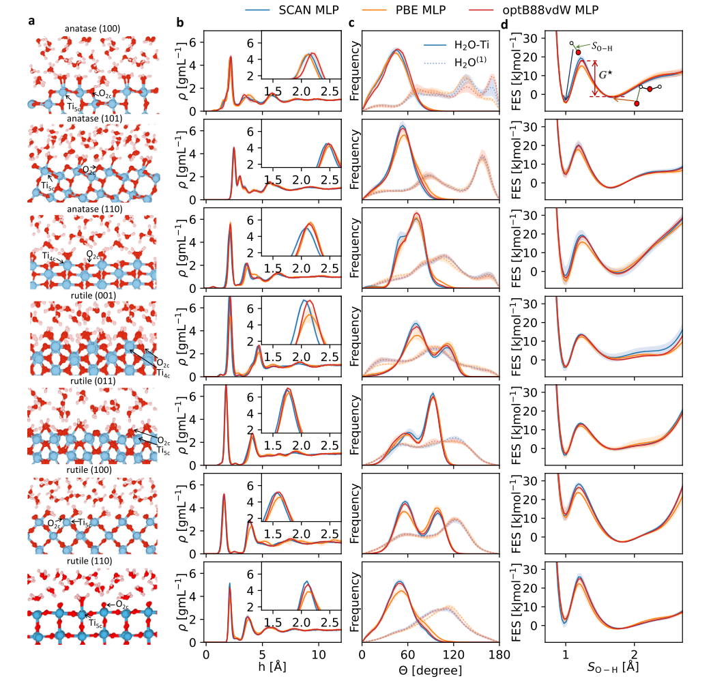
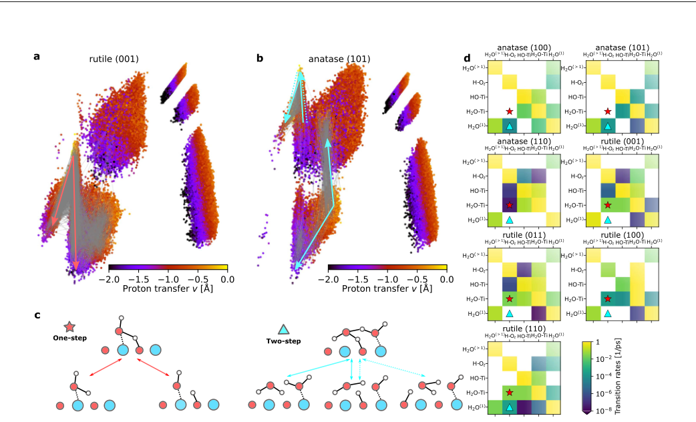

# Mechanistic insight on water dissociation on pristine low-index TiO2 surfaces from machine learning molecular dynamics simulations

**中文题目 / Chinese title:** 机器学习分子动力学揭示原始低指数 TiO2 表面水解离机制

**Zotero key:** XNHKI9Y6  
**Attachment key:** RWIZXGT6  
**Journal / 期刊:** Nature Communications  
**Date / 日期:** 2023-10-02  
**DOI:** 10.1038/s41467-023-41865-8  
**Collection / 集合:** MD  
**Task date / 任务日期:** 2026-07-29  

## Why this paper / 为什么选这篇

**English:** This eligible six-mark legacy Zotero item is a direct MLMD study of water dissociation on seven pristine low-index TiO2 facets. It couples functional sensitivity, free-energy sampling and an automated local-environment analysis, making it particularly useful for deciding what an interfacial proton-transfer mechanism claim must demonstrate.

**中文：** 这是一篇符合全部排除条件的六标记旧 Zotero 回填文献，直接用 MLMD 研究七种原始低指数 TiO2 晶面上的水解离。文章将泛函敏感性、自由能采样与自动局域环境分析相连，特别适合用于判断界面质子转移机制结论需要哪些证据。

## Terminology ledger / 术语表

| English | 中文 | Note / 说明 |
|---|---|---|
| machine learning potential (MLP) | 机器学习势（MLP） | A fitted interatomic potential used to extend atomistic simulation time and system-size coverage. |
| water dissociation free energy | 水解离自由能 | Free-energy difference between molecular and dissociated interfacial-water states. |
| collective variable (CV) | 集体变量（CV） | Low-dimensional coordinate used to bias and analyse rare events. |
| metadynamics | 元动力学 | Enhanced-sampling method that deposits a history-dependent bias in CV space. |
| Δ-learning | Δ 学习 | Learning the correction between a baseline potential-energy surface and a higher-level target. |
| kernel principal component analysis (kPCA) | 核主成分分析（kPCA） | Nonlinear projection used here to map local hydrogen environments. |
| rutile / anatase | 金红石 / 锐钛矿 | The two TiO2 polymorphs compared across low-index facets. |
| undercoordinated oxygen O2c | 低配位二配位氧 O2c | Surface oxygen site that can accept a proton and form a hydroxyl. |

## Reading guide / 阅读提示

**English:** Read Fig. 1 with the free-energy comparisons first, then use Figs. 2–3 to separate a geometrical proton-transfer coordinate from an inferred mechanism. For your TiO2–water work, keep the distinction between water dissociation, proton relocation and any electronic/spin-transfer claim explicit.

**中文：** 建议先结合图 1 阅读各晶面自由能差异，再用图 2–3 区分“几何上的质子转移坐标”和“由此推断的机制”。对 TiO2–水研究，请始终明确区分水解离、质子重新定位，以及任何电子/自旋转移的主张。

## Page / Section Index / 页面与章节索引

- pp. 1–2: Abstract, context, model construction and free-energy protocol / 摘要、背景、模型构建与自由能方案
- pp. 3–6: Interfacial structure, hydrogen environments and proton-transfer pathways / 界面结构、氢环境与质子转移路径
- p. 7: MLP/MD methods, reporting and availability / MLP/MD 方法、报告与可用性
- pp. 8–9: References, acknowledgements and publication information / 参考文献、致谢与出版信息

## Bilingual Reader / 逐段中英文对照

**Source:** p.1 S001

**Original:** Water adsorption and dissociation processes on pristine low-index TiO2 interfaces are important but poorly understood outside the well-studied anatase (101) and rutile (110). To understand these, we construct three sets of machine learning potentials that are simultaneously applicable to various TiO2 surfaces, based on three density-functional-theory approximations. Here we show the water dissociation free energies on seven pristine TiO2 surfaces, and predict that anatase (100), anatase (110), rutile (001), and rutile (011) favor water dissociation, anatase (101) and rutile (100) have mostly molecular adsorption, while the simulations of rutile (110) sensitively depend on the slab thickness and molecular adsorption is preferred with thick slabs. Moreover, using an automated algorithm, we reveal that these surfaces follow different types of atomistic mechanisms for proton transfer and water dissociation: onestep, two-step, or both. These mechanisms can be rationalized based on the arrangements of water molecules on the different surfaces. Our finding thus demonstrates that the different pristine TiO2 surfaces react with water in distinct ways, and cannot be represented using just the low-energy anatase (101) and rutile (110) surfaces.

**中文:** 原始低折射率 TiO2 界面上的水吸附和解离过程很重要，但除了经过充分研究的锐钛矿 (101) 和金红石 (110) 之外，人们对其知之甚少。为了理解这些，我们基于三种密度泛函理论近似构建了三组机器学习势，它们同时适用于各种 TiO2 表面。在这里，我们显示了七个原始 TiO2 表面上的水离解自由能，并预测锐钛矿 (100)、锐钛矿 (110)、金红石 (001) 和金红石 (011) 有利于水离解，锐钛矿 (101) 和金红石 (100) 主要具有分子吸附，而金红石 (110) 的模拟敏感地取决于板厚，分子吸附是首选与厚板。此外，使用自动化算法，我们揭示了这些表面遵循不同类型的质子转移和水解离原子机制：一步、两步或两者兼而有之。这些机制可以根据水分子在不同表面上的排列来合理化。因此，我们的发现表明，不同的原始 TiO2 表面以不同的方式与水发生反应，并且不能仅使用低能锐钛矿 (101) 和金红石 (110) 表面来表示。

**Source:** p.1 S002

**Original:** Titanium dioxide (TiO2) interfaces with water have paramount technological importance in photocatalysis, catalyst support and medical applications1–3, and also serve as a prototype system in surface science4. However, even for defect-free stoichiometric interfaces, water dissociation is far from being well-understood, let alone surfaces with defects5,6, polaronic effect7, or reconstructions8. Past studies exclusively focus on anatase (101) and rutile (110), as they have the lowest surface energy for each phase and are thus most abundant in nature2. There remain many controversies. For rutile (110),

**中文:** 二氧化钛 (TiO2) 与水的界面在光催化、催化剂支持和医疗应用1-3 中具有至关重要的技术重要性，并且还可作为表面科学中的原型系统4。然而，即使对于无缺陷的化学计量界面，水离解也远未得到充分理解，更不用说具有缺陷5,6、极化效应7或重建8的表面了。过去的研究主要集中在锐钛矿 (101) 和金红石 (110)，因为它们每相的表面能最低，因此在自然界中含量最丰富2。仍然存在许多争议。对于金红石 (110)，

**Source:** p.1 S003

**Original:** scanning tunneling microscopy (STM) studies indicated that water dissociation happens at defect sites9, while x-ray photoelectron spectroscopy10 found water dissociation on the hydrated stoichiometric surface at various coverages and temperatures. Experiments using both supersonic molecular beam and STM revealed a dynamic equilibrium of water dissociation at low temperature and water coverage11, although oxygen vacancy is inevitable on the sample surface. From the theory side, static density functional theory (DFT) calculations12,13, molecular dynamics (MD) simulations based on DFT12

**中文:** 扫描隧道显微镜 (STM) 研究表明，水解离发生在缺陷位点 9，而 X 射线光电子能谱 10 发现水合化学计量表面在不同覆盖范围和温度下发生水解离。使用超音速分子束和 STM 的实验揭示了低温下水离解和水覆盖的动态平衡11，尽管样品表面不可避免地存在氧空位。从理论方面，静态密度泛函理论（DFT）计算12,13，基于DFT的分子动力学（MD）模拟12

**Source:** p.1 S004

**Original:** Accepted: 18 September 2023

**中文:** 接受日期：2023 年 9 月 18 日

**Source:** p.2 S005

**Original:** or machine learning potentials (MLPs)14,15 have debated severely about the exact fraction of water dissociation on rutile (110) surface, and the results are sensitive to the underlying functionals and simulation setups. For instance, very recently, MD using PBE-D3 MLP predicted a fraction of only 2%14, while SCAN MLP obtained 22%15. For anatase (101), previous STM experiment suggested that water adsorbs molecularly on almost defect-free surface16 or reduced surface with subsurface defects17 in ultrahigh vacuum, but synchrotron radiation photoelectron spectroscopy18 observed a water monolayer on the stoichiometric surface involves both molecular and dissociative adsorption, and X-ray diffraction experiments19 also showed water dissociation on reduced surfaces with both ultrathin and bulk water. In simulations, BLYP MD20

**中文:** 或机器学习潜力 (MLP)14,15 对于金红石 (110) 表面上水解离的确切分数存在激烈争论，并且结果对基础函数和模拟设置敏感。例如，最近，使用 PBE-D3 MLP 的 MD 预测结果仅为 2%14，而 SCAN MLP 的预测结果为 22%15。对于锐钛矿（101），之前的STM实验表明，在超高真空下，水在几乎无缺陷的表面16或具有次表面缺陷的还原表面17上进行分子吸附，但同步辐射光电子能谱18观察到化学计量表面上的水单分子层涉及分子吸附和解离吸附，并且X射线衍射实验19也显示了超薄水和本体水在还原表面上的水解离。在模拟中，BLYP MD20

**Source:** p.2 S006

**Original:** and DFT MD21 with optB86b-vdW functional both predicted that bulk water adsorbs molecularly on (101) surface, while static DFT calculations with PBE functional showed the coexistence of dissociated and molecular water at monolayer coverage22. Recently, Andrade et al.23

**中文:** 和具有 optB86b-vdW 功能的 DFT MD21 都预测大量水在 (101) 表面上分子吸附，而具有 PBE 功能的静态 DFT 计算表明单层覆盖下解离水和分子水共存22。最近，Andrade 等人23

**Source:** p.2 S007

**Original:** used a combination of MLPs with SCAN functional and enhanced sampling MD, and predicted a water dissociation fraction of 5.6%. Li et al.24 reported a slightly higher fraction of 7.8% using DFT MD with PBE functional. For other high-energy surfaces, studies are relatively rare and even less is clear regarding water dissociation2, although these surfaces are crucial to investigate as they may have higher catalytic activity than the stable surfaces25. As with the stable surfaces, different functionals provide different pictures for surface energy and water absorption, for example, for the rutile (100) surface26–28. In addition, surfaces with high reactivity such as anatase (110) and rutile (001) decrease rapidly during the crystal growth process2, and surfaces including anatase (001)29, and rutile (011)30 can have spontaneous reconstructions in vacuum, both of which greatly hinder the preparation of the pristine surfaces. On the other hand, a reconstructed surface can be lifted to the unreconstructed state at aqueous environments, for example for rutile (011)31, establishing the importance of studying the high-energy pristine surfaces. Understanding water interactions with pristine TiO2 interfaces is difficult: In experiments, preparing pristine surfaces32, preventing contamination in dipping experiments33, and step-by-step characterizing water adsorption34 on pristine surfaces in aqueous environments are all challenging. High-energy surfaces are even more difficult to investigate experimentally due to the high surface activity and low stability3. In simulations, empirical forcefields lack qualitative accuracy and do not allow water dissociation35. DFT calculations are restricted in system size, time scale, and the approximation of the exchangecorrelation functional. Machine learning potentials36,37 allow converged MD simulations with ab initio accuracy, but previous MLPs work only for either anatase (101)23 or rutile (110)14,15,38. Thus a complete description for the interactions between water and various low-index TiO2 is still missing, along with a mechanistic understanding of water dissociation. Herein, we constructed MLPs that can simultaneously describe bulk anatase, rutile, bulk water, and bulk water-TiO2 and vacuum-TiO2 interfaces for anatase (001), (100), (101), (110) and rutile (001), (100), (011), (110) surfaces. We considered three different DFT functionals, and exploited committee models39 to provide error estimates of the MLPs. We then computed the free energies of water dissociation at various interfaces, providing a quantitative estimate of how much water dissociation occurs. Finally, we developed a machine-learningbased algorithm to identify the dissociation mechanism and proton transfer pathways automatically, and rationalized the different mechanisms based on the atomic structures of the interfaces.

**中文:** 使用具有 SCAN 功能的 MLP 和增强采样 MD 的组合，并预测水解离分数为 5.6%。 Li 等人24 报告称，使用带有 PBE 函数的 DFT MD 时，比例略高，为 7.8%。对于其他高能表面，关于水离解的研究相对较少，甚至更不清楚2，尽管这些表面对于研究至关重要，因为它们可能比稳定表面具有更高的催化活性25。与稳定表面一样，不同的泛函提供了不同的表面能和吸水率图像，例如金红石 (100) 表面26-28。此外，锐钛矿（110）和金红石（001）等高反应性表面在晶体生长过程中迅速减少，锐钛矿（001）29和金红石（011）30等表面可以在真空中自发重建，这都极大地阻碍了原始表面的制备。另一方面，重建的表面可以在水环境中提升到未重建的状态，例如金红石（011）31，这确立了研究高能原始表面的重要性。了解水与原始 TiO2 界面的相互作用是很困难的：在实验中，准备原始表面32、防止浸渍实验中的污染33以及逐步表征水环境中原始表面上的水吸附34都是具有挑战性的。由于高表面活性和低稳定性，高能表面更难以通过实验研究。在模拟中，经验力场缺乏定性准确性，并且不允许水解离35。 DFT 计算受到系统规模、时间尺度和交换相关函数近似的限制。机器学习潜力 36,37 允许从头开始精确地进行聚合 MD 模拟，但以前的 MLP 仅适用于锐钛矿 (101)23 或金红石 (110)14,15,38。因此，仍然缺乏对水和各种低折射率 TiO2 之间相互作用的完整描述，以及对水离解的机械理解。在此，我们构建了 MLP，可以同时描述锐钛矿 (001)、(100)、(101)、(110) 和金红石 (001)、(100)、(011)、(110) 表面的体锐钛矿、金红石、体水、体水-TiO2 和真空-TiO2 界面。我们考虑了三种不同的 DFT 泛函，并利用委员会模型 39 来提供 MLP 的误差估计。然后，我们计算了不同界面处水离解的自由能，提供了水离解发生程度的定量估计。最后，我们开发了一种基于机器学习的算法来自动识别解离机制和质子转移路径，并根据界面的原子结构合理化不同的机制。

**Source:** p.2 S008

**Original:** Results Water adsorption and dissociation We systematically investigate the influence of the underlying DFT functionals on water interactions with the TiO2 surfaces. We first fitted

**中文:** 结果 水的吸附和解离 我们系统地研究了基础 DFT 泛函对水与 TiO2 表面相互作用的影响。我们首先安装了

**Source:** p.2 S009

**Original:** a committee model38 made of four fits of the MLP trained on the optB88-vdW DFT functional. We then fitted a set of Δ-learning committee MLPs based on the difference between the SCAN and the optB88-vdW potential energy surfaces, and another set based on the difference between the PBE and the optB88-vdW potential energy surfaces for the bulk TiO2-water interface systems. One can then use these Δ-learning potentials on top of the optB88-vdW baseline to obtain the atomic interactions at the PBE or SCAN level of theory. In MD simulations, we employed the three sets of committee MLPs based on the SCAN, PBE, and optB88-vdW functionals. To reversibly sample water dissociation, we employed welltempered metadynamics40 simulations with adaptive bias41. The collective variable (CV) is the minimal distance SO-H of a surface oxygen to any hydrogen in the system, which is the same as ref. 23. During a metadynamics run, a time-dependent bias potential V(SO-H(t)) is added to the Hamiltonian of the system H, i.e. Hbiased = H + VðSO HðtÞÞ. This bias distorts the equilibrium probability distribution, and the unbiased ensemble averages for an observable O can be obtained with a reweighting procedure42:

**中文:** 委员会模型38由在 optB88-vdW DFT 泛函上训练的 MLP 的四种拟合组成。然后，我们根据 SCAN 和 optB88-vdW 势能表面之间的差异安装了一组 Δ-学习委员会 MLP，并根据散装 TiO2-水界面系统的 PBE 和 optB88-vdW 势能表面之间的差异安装了另一组 MLP。然后，人们可以在 optB88-vdW 基线之上使用这些 Δ-学习势来获得 PBE 或 SCAN 理论水平的原子相互作用。在 MD 模拟中，我们采用了基于 SCAN、PBE 和 optB88-vdW 泛函的三组委员会 MLP。为了可逆地采样水离解，我们采用了具有自适应偏差的良好元动力学 40 模拟。集体变量（CV）是表面氧到系统中任何氢的最小距离 SO-H，与参考文献相同。 23. 在元动力学运行期间，时间相关的偏置势 V(SO-H(t)) 被添加到系统 H 的哈密顿量中，即 Hbiased = H + VðSO HðtÞÞ。这种偏差扭曲了平衡概率分布，并且可观察 O 的无偏系综平均值可以通过重新加权过程获得：

**Source:** p.2 S010

**Original:** <O> = <OeβVðtÞ>biased <eβVðtÞ>biased , ð1Þ

**中文:** <O> = <OeβVðtÞ> 偏置 <eβVðtÞ> 偏置 , ð1Þ

**Source:** p.2 S011

**Original:** where < > indicates the ensemble average sampled using the corresponding Hamiltonian. The free energy surfaces (FES) with respect to the CV can thus be calculated from the unbiased histogram of S. In the metadynamics simulations, each system contains 128 water molecules and about 200 TiO2 atoms. The bulk water in the center of the simulation box has a density 1 gmL−1. In simulations using the optB88-vdW or the SCAN MLPs, the temperature was kept at 330 K, which is 30 K higher than room temperature in order to roughly account for the nuclear quantum effects in room-temperature water as used in ref. 23. For the PBE MLPs, the simulation temperature was elevated to 370 K to avoid water freezing, as PBE water has a high melting point of about 417 K43. We performed simulations on pristine anatase (001), (100), (101), (110) surfaces and rutile (001), (011), (100), (110) surfaces. The metadynamics simulations for the anatase (001) surface show a lot of hysteresis so the computed FES lacks convergence, probably due to that the CV neglects certain degrees of freedom relevant to water dissociation on this surface, so we removed it from further analysis. For rutile (110), previous calculations predicted that water interaction with the slab has an odd-even oscillation behavior with respect to the number of O-Ti-O trilayers12,14,15. As detailed in the Supplementary Information, we observed the same oscillation in the MLP MD simulations, and thus used 10 trilayers in the productions runs to ensure the convergence with respect to the slab thickness. For the anatase (100), (101), (110) surfaces and rutile (001), (011), (100), no evident dependence of water dissociation on slab thickness was observed in our simulations using different number of layers (Supplementary Information). Snapshots of atomic configurations for the seven TiO2-water interfaces from the optB88-vdW MLP metadynamics simulations are shown in Fig. 1a. On anatase (110) and rutile (001), two water molecules are adsorbed simultaneously by each surface undercoordinated fourfold (Ti4c) site. For the other five surfaces, one water molecule is adsorbed on each five-fold (Ti5c) site. The O atoms in these adsorbed water molecules occupy the missing oxygen sites of TiO2 while the H atoms point away from the surface. We thus classify adsorbed water molecules (H2O-Ti) when the Ti-O distance is within 2.65 Å. We also define the first-layer water (H2O(1)) as non-adsorbed water molecules close to the surface, here classified based on within 3.5 Åof the undercoordinated two-fold O2c sites. Surface O2c atoms can accept protons to form the bridging hydroxyl groups (H-Ot), and terminal hydroxyl groups on surface Ti atoms can emerge (HO-Ti). For liquid

**中文:** 其中 < > 表示使用相应哈密顿量采样的集合平均值。因此，可以根据 S 的无偏直方图计算相对于 CV 的自由能面 (FES)。在元动力学模拟中，每个系统包含 128 个水分子和约 200 个 TiO2 原子。模拟箱中心的大量水的密度为 1 gmL−1。在使用 optB88-vdW 或 SCAN MLP 进行的模拟中，温度保持在 330 K，比室温高 30 K，以便粗略地解释参考文献中使用的室温水中的核量子效应。 23. 对于 PBE MLP，模拟温度升高至 370 K 以避免水结冰，因为 PBE 水的熔点很高，约为 417 K43。我们对原始锐钛矿 (001)、(100)、(101)、(110) 表面和金红石 (001)、(011)、(100)、(110) 表面进行了模拟。锐钛矿 (001) 表面的元动力学模拟显示出很大的滞后现象，因此计算出的 FES 缺乏收敛性，可能是由于 CV 忽略了与该表面上的水解离相关的某些自由度，因此我们将其从进一步分析中删除。对于金红石 (110)，先前的计算预测水与板的相互作用相对于 O-Ti-O 三层的数量具有奇偶振荡行为12,14,15。正如补充信息中详述的，我们在 MLP MD 模拟中观察到相同的振荡，因此在生产运行中使用 10 个三层以确保板坯厚度的收敛。对于锐钛矿 (100)、(101)、(110) 表面和金红石 (001)、(011)、(100)，在我们使用不同层数的模拟中没有观察到水离解对板厚度的明显依赖性（补充信息）。 optB88-vdW MLP 元动力学模拟中七个 TiO2-水界面的原子构型快照如图 1a 所示。在锐钛矿 (110) 和金红石 (001) 上，两个水分子同时被每个表面欠配位四重 (Ti4c) 位点吸附。对于其他五个表面，每个五重（Ti5c）位点上吸附一个水分子。这些吸附的水分子中的 O 原子占据了 TiO2 缺失的氧位点，而 H 原子则远离表面。因此，当 Ti-O 距离在 2.65 Å 以内时，我们对吸附水分子 (H2O-Ti) 进行分类。我们还将第一层水 (H2O(1)) 定义为靠近表面的非吸附水分子，此处根据欠配位的两倍 O2c 位点 3.5 Å 范围内进行分类。表面O2c原子可以接受质子形成桥接羟基(H-Ot)，并且可以出现表面Ti原子上的末端羟基(HO-Ti)。液体用

**Source:** p.3 S012

**Original:** water farther from the surface, no isolated OH or H3O groups are observed. Water adsorption on these surfaces is characterized by the density profiles ρ, as shown in Fig. 1b. Comparing the density profiles computed using the MLPs based on the three DFT functionals, the differences are relatively small between SCAN MLPs and optB88-vdW MLPs, while PBE MLPs consistently predict weaker water adsorption suggested by the lower height of the first peak. Each density profile exhibits a prominent first peak near the surface, and lower subsequent

**中文:** 远离表面的水，没有观察到孤立的 OH 或 H3O 基团。这些表面上的水吸附通过密度分布 ρ 来表征，如图 1b 所示。比较使用基于三个 DFT 泛函的 MLP 计算的密度分布，SCAN MLP 和 optB88-vdW MLP 之间的差异相对较小，而 PBE MLP 一致预测第一个峰的高度较低表明水吸附较弱。每个密度分布在表面附近呈现出突出的第一个峰值，并且随后的较低峰值

### Fig. 1. Adsorption, interfacial structure and free-energy landscapes

**Placed near:** p.3 S012
**Source:** p.3 C001

**Original caption:** Fig. 1 | Adsorption and dissociation of water on pristine low-index TiO2 surfaces. a Snapshots of atomic positions for anatase (100), (101), (110) and rutile (001), (011), (100), (110) surfaces in water. Surface undercoordinated four-fold Ti4c, undercoordinated five-fold Ti5c, undercoordinated two-fold O2c (also known as oxygen bridge site), and coordinated three-fold O3c sites are indicated. b The water density profiles ρ as a function of the vertical height h from the outmost Ti layer on surfaces. c The orientation distributions of water molecules near the surface, for the water adsorbed on surface Ti (solid curves) and first-layer water (dashed curves). θ is the angles between the water dipole vector and the surface norm. d The free energy surface (FES) as a function of the minimal distance SO-H (marked as green solid lines) of a surface O2c atom to any hydrogen in the system. The two valleys on the FES correspond to molecular and dissociated water states as schematically indicated. In (b–d), results are from three committee machine learning potentials (MLPs) based on SCAN, PBE and optB88-vdW density functionals. Each committee MLP has 4 individual MLPs, and the thick lines show the average estimate from the four, while the shaded areas show their standard deviations.

**中文图注:** 图1|水在原始低折射率 TiO2 表面上的吸附和离解。 a 水中锐钛矿 (100)、(101)、(110) 和金红石 (001)、(011)、(100)、(110) 表面的原子位置快照。显示了表面欠配位四重 Ti4c、欠配位五重 Ti5c、欠配位两倍 O2c（也称为氧桥位点）和配位三重 O3c 位点。 b 水密度分布 ρ 与表面最外层 Ti 层垂直高度 h 的函数关系。 c 表面Ti吸附的水（实线）和第一层水（虚线）的水分子在表面附近的取向分布。 θ 是水偶极子矢量与表面范数之间的角度。 d 自由能表面 (FES) 作为表面 O2c 原子与系统中任何氢的最小距离 SO-H（标记为绿色实线）的函数。 FES 上的两个谷对应于分子和解离水状态，如图所示。在 (b–d) 中，结果来自基于 SCAN、PBE 和 optB88-vdW 密度泛函的三个委员会机器学习潜力 (MLP)。每个委员会 MLP 有 4 个单独的 MLP，粗线显示四个的平均估计，而阴影区域显示它们的标准差。

**Reading note / 阅读提示:** Adsorption, interfacial structure and free-energy landscapes

**Source:** p.3 S013

**Original:** peaks. This suggests a highly structured arrangement in the water close to the surfaces, with decaying order going into the bulk. Such interface-induced structuring can affect the water up to about 10 Å away from the surface. The first water density peak is more pronounced on the four rutile surfaces than for the three anatase surfaces. For anatase (100), (110), and rutile (001), the tiny bumps in the density profiles close to the surfaces are due to hydroxyls formed on O2c sites. The atomic configurations in Fig. 1a help to rationalize water structuring near the interfaces. For most surfaces, the first and the

**中文:** 峰。这表明靠近水面的水中存在高度结构化的排列，而整体中的秩序是衰变的。这种界面诱导的结构可以影响距离表面约 10 Å 的水。第一个水密度峰值在四个金红石表面上比在三个锐钛矿表面上更明显。对于锐钛矿 (100)、(110) 和金红石 (001)，靠近表面的密度分布中的微小凸起是由于 O2c 位点上形成的羟基造成的。图 1a 中的原子构型有助于合理化界面附近的水结构。对于大多数表面，第一个和第二个

**Source:** p.4 S014

**Original:** second peaks in the density profiles (Fig. 1b) correspond to the adsorbed water (H2O-Ti) and first-layer water (H2O(1)), respectively. However, for the anatase (100), both the H2O-Ti and H2O(1) contribute to the first peak, due to the relatively large gaps between the surface Ti5c sites, which provides adequate spaces for H2O(1) to be closely attracted to O2c sites. The same reason explains the proximity between the first two density peaks in anatase (101). For rutile (001), the second density peak is particularly far from the surface (~5 Å). This is because two water molecules with different orientations can be simultaneously adsorbed onto the same surface Ti4c atom (as shown in Fig. 1a). These water molecules form a close and dense H2O-Ti layer and hinder the surface attraction for the H2O(1) layer. We further characterize the structure of interfacial water via their orientations, defined as the dipole directions - the angles (θ) between the dipole vector (oxygen pointing to the mid-point of two hydrogens) and the surface norm. Figure 1c shows the orientation distribution for H2O-Ti and H2O(1) separately: The solid curves are for H2O-Ti, and dashed curves are for H2O(1). For H2O-Ti, as hydrogen atoms point away from the nearest Ti atoms, the distributions of θ are dominated by acute angles. θ for rutile (001), (011) and (100) have double peaks, as the dipole vectors of H2O-Ti can point along both sides of the surface. This double-peak feature was also reported in a MD study using an empirical forcefield from Kavathekar et al.44, suggesting that it is probably insensitive on the underlying potential surfaces assumed. For H2O(1), the dipole vectors usually point downwards, inducing an obtuse-angle-dominated distribution for the θ. As we will later show, such downwards orientations may be relevant for proton transfers. The equilibrium ratio between surface hydroxyl and molecular water at an O2c site can be determined as f = expð βΔGÞ, where ΔG is their free energy difference. This is revealed by the free energy surface as a function of the CV (shown in Fig. 1d). SO-H ≈1 Åmeans a surface oxygen has formed a hydroxyl group with a hydrogen atom from water, and SO-H ≈1.75 Åmeans the closest water remains molecular. All three sets of MLPs based on the different functionals give quite consistent results for the FES of water dissociation on seven surfaces, while different surfaces have distinct FES for water dissociation and adsorption. Comparing ΔG for anatase TiO2 facets at SO-H = 1 Åand 1.75 Å, we conclude that on (100) and (110) dissociative adsorption is preferred, while on (101) molecular adsorption is more common. Our conclusion for anatase (101) is consistent with previous calculations23,24. For rutile, on (001) and (011) dissociation is favorable, and on (100) molecular adsorption is highly preferred. For rutile (110), with the thick slab of 10 trilayers, the ΔG between dissociated water and molecular water is 5.2 ± 0.6 kJmol−1 (with molecular state being more stable) at the optb88-vdw MLP level, 2.6 ± 1.2 kJmol−1 at the SCAN MLP level, and 5.1 ± 0.6 kJmol−1 at the PBE MLP level. Our results thus agree with previous simulations that rutile (110) favors molecular adsorption12,14,15, and are also consistent with STM11 and x-ray photoelectron spectroscopy10 experiments which suggest that the energy difference between the molecular and the dissociated state is small. Figure 1d also shows the free energy activation barrier (G⋆) for molecular water to dissociate. For example, for anatase (101) (see Table S3 for the G⋆of other surfaces), the G⋆is 23 ± 2 kJmol−1, in good agreement with the value from G(SO-H(t)) in ref. 23. This G⋆is about 10 times the thermal energy at room temperature. AIMD simulations are restricted to the picosecond timescale, which is probably inadequate to overcome the large G⋆and obtain reliable statistics regarding water dissociation. In contrast, Our metadynamics simulations can freely diffuse across the barrier and reliably estimate the FES.

**中文:** 密度分布中的第二个峰（图1b）分别对应于吸附水（H2O-Ti）和第一层水（H2O(1)）。然而，对于锐钛矿 (100)，H2O-Ti 和 H2O(1) 都对第一个峰有贡献，因为表面 Ti5c 位点之间的间隙相对较大，这为 H2O(1) 紧密吸引到 O2c 位点提供了足够的空间。同样的原因也解释了锐钛矿 (101) 中前两个密度峰之间的接近性。对于金红石 (001)，第二个密度峰距离表面特别远 (~5 Å)。这是因为两个不同取向的水分子可以同时吸附到同一表面Ti4c原子上（如图1a所示）。这些水分子形成紧密且致密的 H2O-Ti 层并阻碍 H2O(1) 层的表面吸引力。我们通过其方向进一步表征界面水的结构，定义为偶极方向 - 偶极矢量（指向两个氢的中点的氧）与表面范数之间的角度（θ）。图1c分别显示了H2O-Ti和H2O(1)的取向分布：实线为H2O-Ti，虚线为H2O(1)。对于 H2O-Ti，当氢原子远离最近的 Ti 原子时，θ 的分布以锐角为主。金红石 (001)、(011) 和 (100) 的 θ 具有双峰，因为 H2O-Ti 的偶极矢量可以指向表面的两侧。这种双峰特征在使用 Kavathekar 等人的经验力场的 MD 研究中也有报道44，这表明它可能对假设的潜在表面不敏感。对于 H2O(1)，偶极子矢量通常指向下方，从而导致 θ 呈钝角主导分布。正如我们稍后将展示的，这种向下的方向可能与质子转移有关。 O2c 位点表面羟基和分子水之间的平衡比可以确定为 f = expð βΔGÞ，其中 ΔG 是它们的自由能差。自由能面与 CV 的函数关系揭示了这一点（如图 1d 所示）。 SO-H ≈1 Å 表示表面氧与水中的氢原子形成羟基，SO-H ≈1.75 Å 表示最接近的水分子。所有三组基于不同泛函的 MLP 在七个表面上的水离解 FES 给出了非常一致的结果，而不同表面的水离解和吸附 FES 不同。比较锐钛矿型 TiO2 晶面在 SO-H = 1 Å 和 1.75 Å 时的 ΔG，我们得出结论，在 (100) 和 (110) 上解离吸附是首选，而在 (101) 上分子吸附更常见。我们对锐钛矿 (101) 的结论与之前的计算一致23,24。对于金红石，(001)和(011)上的解离是有利的，并且(100)上的分子吸附是高度优选的。对于金红石（110），具有10个三层厚板，解离水和分子水之间的ΔG在optb88-vdw MLP水平上为5.2±0.6 kJmol−1（分子状态更稳定），在SCAN MLP水平上为2.6±1.2 kJmol−1，在PBE MLP水平上为5.1±0.6 kJmol−1。因此，我们的结果与之前的模拟一致，即金红石 (110) 有利于分子吸附 12,14,15，并且也与 STM11 和 X 射线光电子能谱 10 实验一致，这些实验表明分子和解离态之间的能量差异很小。图 1d 还显示了分子水解离的自由能激活势垒 (G⋆)。例如，对于锐钛矿 (101)（其他表面的 G⋆ 参见表 S3），G⋆为 23 ± 2 kJmol−1，与参考文献中 G(SO-H(t)) 的值非常一致。 23. 这个G⋆大约是室温下热能的10倍。 AIMD 模拟仅限于皮秒时间尺度，这可能不足以克服大 G⋆ 并获得有关水离解的可靠统计数据。相比之下，我们的元动力学模拟可以自由地扩散穿过障碍并可靠地估计 FES。

**Source:** p.4 S015

**Original:** Pathway for proton transfer and water dissociation The atomic pathway of proton transfer is important for understanding water dissociation on TiO2, but the analysis is nontrivial and generally needs a case-by-case consideration exploiting physical and chemical insights. For anatase (101), Andrade et al.23 provided a detailed proton

**中文:** 质子转移和水解离的途径 质子转移的原子途径对于理解 TiO2 上的水解离很重要，但分析并不简单，通常需要利用物理和化学见解进行具体情况的考虑。对于锐钛矿 (101)，Andrade 等人23 提供了详细的质子

**Source:** p.4 S016

**Original:** transfer mechanism, using hand-crafted CVs inspired by earlier computer simulations of proton diffusion in aqueous solutions45. For other surfaces, however, the proton transfer pathway is largely unknown, and it is unclear whether a fixed set of CVs is sufficient to capture all the possible mechanisms. To investigate water dissociation mechanism in a general and automated way, we develop a machine-learning-based method. We take the last part of the trajectories from the optB88-vdW MLP metadynamics simulations with slow bias depositions, each contains 10,000 snapshots with a time step of 0.1 ps. The analysis focuses on the different atomic environments of hydrogen atoms in the system. Specifically, for a H atom in a certain frame of the metadynamics trajectory, we first compute a list of features χ, including the H to its closest Ti distance (H-Ti), H to its closest neighboring H (H-H) and the second closest H distance, H to its closest O in TiO2 (H-Ot) and its closest O in water, the surface normal of the displacement between H and its closest O, three proton transfer coordinates determined by the positions of the hydrogen, a donor oxygen atom O and an acceptor O0

**中文:** 转移机制，使用手工制作的 CV，其灵感来自早期对水溶液中质子扩散的计算机模拟45。然而，对于其他表面，质子转移途径很大程度上是未知的，并且不清楚一组固定的 CV 是否足以捕获所有可能的机制。为了以通用和自动化的方式研究水解离机制，我们开发了一种基于机器学习的方法。我们从具有慢偏置沉积的 optB88-vdW MLP 元动力学模拟中获取轨迹的最后一部分，每个轨迹包含 10,000 个时间步长为 0.1 ps 的快照。分析重点关注系统中氢原子的不同原子环境。具体来说，对于元动力学轨迹中某个框架中的H原子，我们首先计算一系列特征χ，包括H到其最近Ti距离（H-Ti）、H到其最近邻H（H-H）和第二最近H距离、H到TiO2中最接近O（H-Ot）和水中最接近O、H与其最近O之间位移的表面法线、由氢、供体氧原子O和受体的位置确定的三个质子转移坐标氧0

**Source:** p.4 S017

**Original:** (i.e. v = dðOHÞ dðO0HÞ, μ = dðOHÞ + dðO0HÞ, rOO = dðOO0Þ)46. We then use sparsified kernel Principal Component Analysis (kPCA) based on these features χ: we build support vectors by selecting a small set of H environments using farthest point sampling, build the kPCA map using cosine kernel, and finally project the χ of all the H environments onto the saved support vectors. The kPCA maps visualize the similarity between different hydrogen atomic environments, and the axes of the maps capture the most important variance within the data points47. Such procedures allow us to compare the H environments of different systems with various TiO2 surfaces on the same footing. The whole procedure is streamlined by the ASAP package48. In Fig. 2 we show the kPCA plots of the hydrogen atomic environments in water-rutile (110) system, and the plots for other facets can be found in the Supplementary Information. Each dot on the plot indicates the environment of each hydrogen atom. The kPCA plots can be rationalized using different color coding based on the various features. Four selected panels are shown in the Fig. 2, and the rest of the kPCA plots are provided in the Supplementary Information. The whole set of H environments forms well-separated clusters, and each cluster corresponds to a H in a specific state (see Fig. 2a): e.g. H adsorbed on the surface O (H-Ot), OH adsorbed on Ti (HO-Ti), adsorbed H2O (H2OTi), first-layer H2O (H2O(1)), and H2O farther from the surface (H2O(>1)). These different states are illustrated in Fig. 2e, and the classification scheme is described in the Supplementary Information. Whether a hydrogen atom is in a hydroxyl rather than a water molecule is suggested by a large value of the H-H distance greater than about 1.8 Å (Fig. 2b). The hydrogen-bonded complexes appear at the indicated places on the edge of the clusters. Within each cluster, the variability mainly comes from the orientation of the water molecule. For example, the H atoms in H2O-Ti can point towards or away from surface oxygen atoms (see Fig. 1a), causing the gradients in the H to Ot distance (see Fig. 2d). H2O(1) can have hydrogen up or down (see Fig. 1a), which explains the variance (see Fig. 2c) in the H-Ti distances within the corresponding cluster. From the kPCA coordinates and the weighted frequency count, one can build FES for these generalized coordinates using Eqn. (1), as shown in Fig. 2e, which demonstrates the relative probability of the H in different states. Note that, for the free energy difference between surface OH and H2O, this FES is different from the one in Fig. 1d as the former also considers the configurational entropy coming from the number of possible sites. We then consider the time dependence of the H environments, in order to reveal hydrogen transition pathways during the MD simulations. In Fig. 3a–b, two representative systems, rutile (001) and anatase (101), are used to show two different transition pathways between different states (illustrated in Fig. 2e). If a hydrogen atom transits between different states, a gray line is drawn between the initial and

**中文:** （即 v = dðOHÞ dðO0HÞ，μ = dðOHÞ + dðO0HÞ，rOO = dðOO0Þ）46。然后，我们基于这些特征 χ 使用稀疏核主成分分析 (kPCA)：我们通过使用最远点采样选择一小组 H 环境来构建支持向量，使用余弦核构建 kPCA 图，最后将所有 H 环境的 χ 投影到保存的支持向量上。 kPCA 图可视化了不同氢原子环境之间的相似性，并且图的轴捕获了数据点内最重要的差异47。这样的程序使我们能够在同一基础上比较不同系统与不同 TiO2 表面的 H 环境。 ASAP 软件包简化了整个过程48。在图2中，我们显示了水-金红石（110）系统中氢原子环境的kPCA图，其他方面的图可以在补充信息中找到。图中的每个点表示每个氢原子的环境。 kPCA 图可以根据不同的特征使用不同的颜色编码来合理化。图 2 显示了四个选定的面板，补充信息中提供了其余的 kPCA 图。整套H环境形成了分离良好的簇，每个簇对应于特定状态下的H（见图2a）：表面吸附的H O (H-Ot)、Ti 吸附的OH (HO-Ti)、吸附的H2O (H2OTi)、第一层H2O (H2O(1)) 和远离表面的H2O (H2O(>1))。这些不同的状态如图2e所示，分类方案在补充信息中描述。大于约 1.8 Å 的 H-H 距离值表明氢原子是否位于羟基而不是水分子中（图 2b）。氢键复合物出现在簇边缘的指定位置。在每个簇内，变异性主要来自水分子的方向。例如，H2O-Ti 中的 H 原子可以指向或远离表面氧原子（见图 1a），从而导致 H 到 Ot 距离的梯度（见图 2d）。 H2O(1) 的氢原子可以向上或向下（参见图 1a），这解释了相应簇内 H-Ti 距离的变化（参见图 2c）。根据 kPCA 坐标和加权频率计数，可以使用方程 1 为这些广义坐标构建 FES。 (1)，如图2e所示，它展示了H在不同状态下的相对概率。请注意，对于表面 OH 和 H2O 之间的自由能差异，该 FES 与图 1d 中的不同，因为前者还考虑了来自可能位点数量的构型熵。然后，我们考虑 H 环境的时间依赖性，以揭示 MD 模拟期间的氢转变路径。在图3a-b中，两个代表性系统金红石（001）和锐钛矿（101）用于显示不同状态之间的两种不同转变路径（如图2e所示）。如果氢原子在不同状态之间跃迁，则在初始状态和初始状态之间会画一条灰线。

**Source:** p.6 S018

**Original:** the final environments. For clarity, we only plot the transition lines for hydrogens near the surface, i.e. in H-Ot, HO-Ti, H2O-Ti, or H2O(1) states, because farther water molecules (H2O(>1)) do not participate in the water dissociation reactions. The two surfaces reveal two distinct modes for water dissociation and proton transfer. Rutile (001) has an one-step water dissociation process illustrated by the solid red arrows Fig. 3c: a water molecule adsorbed in surface Ti directly splits into a surface OH on Ti and a H on O2c. The transition state is a H2O-Ti that is hydrogenbonded to a surface O2c. For anatase (101), the gray transition lines are consistent with a two-step proton transfer process, marked using thick cyan arrows. This two-step process is schematically illustrated using the solid cyan arrows in Fig. 3c: a water molecule adsorbed in surface Ti (H2O-Ti) donates a H to a first-layer water molecule (H2O(1)), and the latter transfers another H to a surface O2c site to form a surface hydroxyl. The transition state has an intermediate water molecule that forms hydrogen bonds to both O2c and H2O-Ti. The analogous mechanism also serves for proton transport between different O2c sites, indicated using the dashed blue arrows in Fig. 3c. In the Supplementary Information, we supply an algorithm that can further distinguish between the recombination/dissociation events and pure proton transport that does not change the amount of surface hydroxyl coverage. Andrade et al.23 reported the same two-step mechanism for anatase (101) in MLP MD simulations. For both the one-step and twostep mechanisms, the transitions of hydrogen happen via proton transfer, as revealed by the proton transfer coordinate v used as the color scale in Fig. 3a–b. The critical difference between the two mechanisms is the participation of H2O(1). Another distinction is that, after an one-step dissociation event the H-Ot and HO-Ti are next to each other, while after a two-step dissociation the separation can be larger. To quantify proton transition rates, we assume quasi-equilibrium in the dynamics49 of the metadynamics simulations with slow bias depositions. The unbiased transition probability from one state xa to another state xb after time Δt is

**中文:** 最终环境。为了清楚起见，我们仅绘制表面附近氢的转变线，即 H-Ot、HO-Ti、H2O-Ti 或 H2O(1) 态，因为更远的水分子 (H2O(>1)) 不参与水离解反应。这两个表面揭示了水离解和质子转移的两种不同模式。金红石（001）具有一步水离解过程，如图3c中红色实线箭头所示：吸附在表面Ti上的水分子直接分裂成Ti上的表面OH和O2c上的H。过渡态是与表面 O2c 形成氢键的 H2O-Ti。对于锐钛矿 (101)，灰色过渡线与两步质子转移过程一致，使用粗青色箭头标记。这个两步过程用图3c中的实心青色箭头示意性地说明：表面Ti吸附的水分子（H2O-Ti）向第一层水分子（H2O（1））提供一个H，后者将另一个H转移到表面O2c位点以形成表面羟基。过渡态有一个中间水分子，与 O2c 和 H2O-Ti 形成氢键。类似的机制也适用于不同 O2c 位点之间的质子传输，如图 3c 中的蓝色虚线箭头所示。在补充信息中，我们提供了一种算法，可以进一步区分重组/解离事件和纯质子传输，而不会改变表面羟基覆盖量。 Andrade 等人23 报道了 MLP MD 模拟中锐钛矿 (101) 的相同两步机制。对于一步和两步机制，氢的跃迁都是通过质子转移发生的，如图 3a-b 中用作色标的质子转移坐标 v 所示。两种机制之间的关键区别在于 H2O(1) 的参与。另一个区别是，在一步解离事件之后，H-Ot 和 HO-Ti 彼此相邻，而在两步解离事件之后，分离可能会更大。为了量化质子跃迁速率，我们假设具有缓慢偏压沉积的元动力学模拟的动力学49处于准平衡。时间 Δt 后从一种状态 xa 到另一种状态 xb 的无偏转移概率为

**Source:** p.6 S019

**Original:** Kðxb, Δtjxa,0Þ = <δðxðt + ΔtÞ xbÞδðxðtÞ xaÞeβVðt + ΔtÞ> <δðxðtÞ xaÞeβVðtÞ> , ð2Þ

**中文:** Kðxb, Δtjxa,0Þ = <δðxðt + ΔtÞ xbÞδðxðtÞ xaÞeβVðt + ΔtÞ> <δðxðtÞ xaÞeβVðtÞ> , ð2Þ

**Source:** p.6 S020

**Original:** where the Dirac delta functions δ(x(t) −xa) and δ(x(t + Δt) −xb) select the segment of trajectories that are starts from xa in time t and ends at xb in time t + Δt, respectively. Here the Δt = 0.1 ps is the time between two subsequent MD snapshots. Figure 3d shows the transition matrices between different states of hydrogen atoms for the seven TiO2 surfaces. The color scale of the matrix element in row xa and column xb indicates the probability of a hydrogen atom that is in state xa at t going to state xb at t + Δt. Most hydrogen atoms remain in their original state within the Δt = 0.1 ps, so the diagonal element of the transition matrix is typically close to one. The off-diagonal matrix elements correspond to hydrogen transits, from which one can infer the underlying mechanisms. To show this clearly, the red stars and cyan triangles in Fig. 3d indicate the signature matrix elements for the one-step and two-step transition mechanisms, respectively. These markers indicate whether the H atoms in H-Ot are proton-transferred from H2O-Ti or H2O(1). As we discuss below, for all the TiO2 surfaces, different proton transfer and water dissociation mechanisms are related to the atomic arrangement: The one-step mechanism requires a close distance between surface O2c and the protons in water absorbed by surface Ti (H2O-Ti), and the two-step mechanism needs the proximity of firstlayer water (H2O(1)) to the surface. Anatase (100) and (101) have only two-step transition process. The lack of the one-step process on these two anatase surfaces may be due to that the hydrogen atoms in H2O-Ti point upwards (Fig. 1a), so θ in Fig. 1c adopt mostly acute angles and the distances between these H atoms and O2c are relatively large. Meanwhile, the H2O(1) (Fig. 1a) are close to the surface with many H atoms pointing downwards,

**中文:** 其中狄拉克 δ 函数 δ(x(t) −xa) 和 δ(x(t + Δt) −xb) 分别选择在时间 t 时从 xa 开始并在时间 t + Δt 时于 xb 结束的轨迹段。这里 Δt = 0.1 ps 是两个后续 MD 快照之间的时间。图 3d 显示了七个 TiO2 表面的不同氢原子状态之间的跃迁矩阵。 xa 行和 xb 列中的矩阵元素的色标表示在 t 时处于状态 xa 的氢原子在 t + Δt 时处于状态 xb 的概率。大多数氢原子在 Δt = 0.1 ps 内保持其原始状态，因此过渡矩阵的对角元素通常接近于 1。非对角矩阵元素对应于氢跃迁，从中可以推断出潜在的机制。为了清楚地表明这一点，图3d中的红色星形和青色三角形分别表示一步和两步转换机制的特征矩阵元素。这些标记表明 H-Ot 中的 H 原子是从 H2O-Ti 还是 H2O(1) 进行质子转移。正如我们下面讨论的，对于所有 TiO2 表面，不同的质子转移和水解离机制与原子排列有关：一步机制需要表面 O2c 与表面 Ti 吸收的水中质子 (H2O-Ti) 之间的距离较近，而两步机制需要第一层水 (H2O(1)) 接近表面。锐钛矿（100）和（101）只有两步转变过程。这两个锐钛矿表面缺乏一步过程可能是由于H2O-Ti中的氢原子指向上方（图1a），因此图1c中的θ大多采用锐角，并且这些H原子与O2c之间的距离较大。同时，H2O(1)（图1a）靠近表面，许多H原子指向下方，

**Source:** p.6 S021

**Original:** facilitating the two-step proton transition mechanism. Anatase (110) is observed to have infrequent one-step process, as this surface is already densely covered by dissociated water in the metadynamics simulations, as also revealed from the FES in Fig. 1d. Rutile (001), (011) and (100) surfaces exhibit relatively high rates, and the mechanisms are exclusively one-step. On these three facets, surface Ti atoms have strong adsorption of water, and many H atoms in H2O-Ti point sideways as suggested by the double-peak feature of θ in Fig. 1c, which facilitates the H-bond formation and proton transfer with O2c sites. Meanwhile, H2O(1) are relatively far from the surface, making clear gaps between the first and the second peaks in the density profiles (Fig. 1b) as previously discussed. The dense H2O-Ti layer and the far H2O(1) layer make the one-step process favorable and the two-step process unlikely. Rutile (110) has a coexistence of one-step and twostep processes, which may be explained by the intermediate Ti adsorption strength and H2O(1) distances. The coexistence of both mechanisms was also observed in a recent MLP MD study on rutile (110) by Wen et al.15. Overall, rutile (001), (011) and (100) exhibits faster proton transit rates. The rate is strongly related to the free energy barrier from molecular water to surface hydroxyl as shown in Fig. 1d. Rutile (001) and (011) surfaces both own a relatively low G⋆of about 13 kJmol−1, which implies that water dissociation may happen faster. Rutile (011) has a unique corrugated surface structure with humps consisting of proton-accepting O2c sites (see Fig. 1a), which may help promoting water dissociation. In summary, we constructed the first MLP that can simultaneously describe the interfaces between water and various anatase and rutile TiO2 facets, pushing the limit of the capability of machine learning potentials for complex chemical systems. Water dissociation fraction, free energy barrier and proton transfer on surfaces are key features for investigating the reactivity of TiO2-water interfaces in chemical or photochemical settings, which is relevant for numerous practical applications1,2. Based on enhanced sampling MD simulations using the MLPs trained on three different DFT functionals, we resolved the long-standing debate about the state of water atdifferent pristine TiO2 surfaces: dissociative or molecular. In contrast to previous studies which almost exclusively focus on the anatase (101) and rutile (110) surfaces, we comprehensively elucidate water adsorption and dissociation processes on seven low-index surfaces in aqueous environments for the first time. We show that different pristine TiO2 surfaces react with water in distinct ways, and cannot be represented using just the low-energy anatase (101) and rutile (110) surfaces. Surfaces such as anatase (100), (110) and rutile (001), (011) may be more reactive in photochemical water splitting than the stable surfaces as they favor more water dissociations. Our results thus imply that, in order to better understand the photocatalysis, catalysis and biomedical applications of TiO2 (nano)particles, the high-energy surfaces need to be taken into account. We further used a general and automated way to visualize and understand water dissociation and proton transfer mechanisms, based on the chemical features of protons. We rationalized the mechanisms based on the water arrangements on different surfaces. This not only allows a microscopic understanding of water interaction with these pristine interfaces, but also paves the way towards more complex surfaces with defects, polarons and reconstructions. The workflow can also be applied to other complex aqueous systems. For example, most solid surfaces under ambient conditions are covered by a thin film of water50. Other technologically relevant systems include: corrosion of steels, electrolysis of water on metal plates, confinement of water in two-dimensional materials51.

**中文:** 促进两步质子跃迁机制。锐钛矿 (110) 被观察到具有罕见的一步过程，因为在元动力学模拟中该表面已经被离解水密集覆盖，如图 1d 中的 FES 所示。金红石（001）、（011）和（100）表面表现出相对较高的速率，并且该机制完全是一步式的。在这三个方面，表面Ti原子对水有很强的吸附作用，如图1c中θ的双峰特征所示，H2O-Ti中的许多H原子指向侧面，这有利于H键的形成和与O2c位点的质子转移。同时，H2O(1) 距离表面相对较远，因此密度分布中的第一个和第二个峰之间存在明显的间隙（图 1b），如前所述。致密的H2O-Ti层和较远的H2O(1)层使得一步法有利，而两步法不太可能。金红石(110)具有一步法和两步法并存的特点，这可以通过中间的Ti吸附强度和H2O(1)距离来解释。 Wen 等人最近对金红石 (110) 进行的 MLP MD 研究也观察到了两种机制的共存15。总体而言，金红石（001）、（011）和（100）表现出更快的质子传输速率。该速率与从分子水到表面羟基的自由能垒密切相关，如图1d所示。金红石 (001) 和 (011) 表面都具有相对较低的 G⋆，约为 13 kJmol−1，这意味着水解离可能发生得更快。金红石（011）具有独特的波纹状表面结构，具有由接受质子的O2c位点组成的驼峰（见图1a），这可能有助于促进水的解离。总之，我们构建了第一个 MLP，可以同时描述水与各种锐钛矿和金红石 TiO2 晶面之间的界面，突破了复杂化学系统机器学习潜力的能力极限。水离解分数、自由能垒和表面质子转移是研究化学或光化学环境中 TiO2-水界面反应性的关键特征，这与许多实际应用1,2 相关。基于使用在三种不同的 DFT 泛函上训练的 MLP 进行增强采样 MD 模拟，我们解决了关于不同原始 TiO2 表面的水状态的长期争论：离解或分子。与之前几乎只关注锐钛矿（101）和金红石（110）表面的研究相比，我们首次全面阐明了水环境中七个低折射率表面的水吸附和解离过程。我们表明，不同的原始 TiO2 表面以不同的方式与水发生反应，并且不能仅使用低能锐钛矿 (101) 和金红石 (110) 表面来表示。锐钛矿 (100)、(110) 和金红石 (001)、(011) 等表面在光化学水分解中可能比稳定表面更具反应性，因为它们有利于更多的水解离。因此，我们的结果表明，为了更好地了解 TiO2（纳米）颗粒的光催化、催化和生物医学应用，需要考虑高能表面。基于质子的化学特征，我们进一步使用通用和自动化的方法来可视化和理解水解离和质子转移机制。我们根据不同表面的水分布合理化了机制。这不仅可以从微观上了解水与这些原始界面的相互作用，而且还为具有缺陷、极化子和重建的更复杂的表面铺平了道路。该工作流程还可以应用于其他复杂的水系统。例如，环境条件下的大多数固体表面都覆盖有一层薄膜50。其他技术相关系统包括：钢的腐蚀、金属板上的水电解、二维材料中的水限制51。

**Source:** p.6 S022

**Original:** Methods DFT calculations We used the CP2K package52 for both DFT MD and single-point DFT calculations. The typical system size contains 64 water molecules and

**中文:** 方法 DFT 计算 我们使用 CP2K 包52 进行 DFT MD 和单点 DFT 计算。典型的系统尺寸包含 64 个水分子和

**Source:** p.7 S023

**Original:** about 200 TiO2 atoms. For the optB88-vdW functional, we used a planewave energy cutoff of 350 Rydberg. We also tested a higher cutoff of 600 Rydberg: the difference in relative total energy is 0.25 meV/atom and the difference in force components is 20 meVÅ−1

**中文:** 约200个TiO2原子。对于 optB88-vdW 泛函，我们使用 350 Rydberg 的平面波能量截止。我们还测试了更高的截止值 600 Rydberg：相对总能量的差异为 0.25 meV/atom，力分量的差异为 20 meVÅ−1

**Source:** p.7 S024

**Original:** for configurations with about 300–400 atoms. Such differences are much smaller than the typical MLP training errors. For the single-point calculations using the SCAN functionals, we used a planewave cutoff of 1200 Rydberg, and for the PBE functional we used 600 Rydberg. The CP2K input files are provided in the SI repository.

**中文:** 对于大约 300-400 个原子的构型。这种差异比典型的 MLP 训练误差小得多。对于使用 SCAN 泛函的单点计算，我们使用 1200 Rydberg 的平面波截止，对于 PBE 泛函，我们使用 600 Rydberg。 SI 存储库中提供了 CP2K 输入文件。

**Source:** p.7 S025

**Original:** MLP We generated flexible and dissociable MLPs based on optB88-vdW for the TiO2/water system. The total number of configurations for the training set is 18930. We include pure water, and various flat and defective interfaces for anatase/rutile in vacuum and in bulk water. To effectively include configurations along transition paths of water dissociation and proton transfer, we performed 4 iterative rounds in constructing the MLPs: configurations were selected from the metadynamics simulation trajectories generated by a previous generation of the MLP, and then recomputed using optB88-vdW DFT and added to be training set. The training errors for energy and atomic force components are 1.5 meV/atom and 133 meVÅ−1, respectively. The testing errors for energy and atomic force components are 1.6 meV/atom and 130 meVÅ−1, respectively. This set of MLPs work for: (i) Bulk water and water/vapor interface; (ii) Pristine anatase (101), (001), (110), (100) and rutile (011), (110), (001), (100) surfaces, in vacuum and in bulk water; (iii) These eight surfaces with some simple stoichiometric surface defects, in vacuum and in bulk water. The surface defects are restricted to the type by removing a multiple of TiO2 formula units, so no polaronic effects that stem from oxygen vacancies are considered. Although the present study focuses on pristine surfaces, the benchmarks for the MLPs on defected surfaces in bulk water are included in the Supplementary Information to demonstrate the generality of the MLPs and to facilitate the usage of the potentials. The MLPs are not applicable for gas water molecules or gas molecules adsorpted on surfaces. We employed the Behler-Parrinello artificial neural network36, and using the N2P2 code53. The committee model39 with four individual MLPs was used to improve accuracy and provide uncertainty estimations. We also constructed Δ-learning potentials54 for fitting to the SCAN and the PBE functionals. We used 3090 configurations for the Δlearning to get the SCAN MLP, although the learning curves suggest that even 20% of these are sufficient. the training and testing errors for energies are 0.24 and 0.28 meV/atom, and training and testing errors are 50 meVÅ−1 and 49 meVÅ−1 for the atomic force components, respectively. For the Δ-learning PBE MLP, we used 3226 configurations. The training and testing errors for energies are 0.38 and 0.40 meV/ atom, respectively. The training and testing errors for atomic force components are 60 and 70 meVÅ−1, respectively. The SCAN and the PBE Δ-learning MLPs are applicable to bulk water and the eight surfaces that are either pristine or with simple stoichiometric surface defects in water.

**中文:** MLP 我们基于 optB88-vdW 为 TiO2/水系统生成了灵活且可分离的 MLP。训练集的配置总数为 18930。我们包括纯水以及真空和散装水中锐钛矿/金红石的各种平坦和有缺陷的界面。为了有效地包含沿着水解离和质子转移的过渡路径的构型，我们在构建 MLP 时进行了 4 轮迭代：从上一代 MLP 生成的元动力学模拟轨迹中选择构型，然后使用 optB88-vdW DFT 重新计算并添加到训练集。能量和原子力分量的训练误差分别为 1.5 meV/atom 和 133 meVÅ−1。能量和原子力分量的测试误差分别为1.6 meV/atom和130 meVÅ−1。这套 MLP 适用于： (i) 散装水和水/蒸汽界面； (ii) 在真空和散装水中的原始锐钛矿 (101)、(001)、(110)、(100) 和金红石 (011)、(110)、(001)、(100) 表面； (iii) 在真空和散装水中，这八个表面具有一些简单的化学计量表面缺陷。通过去除多个 TiO2 分子式单元，表面缺陷被限制在类型上，因此不考虑由氧空位引起的极化效应。尽管本研究侧重于原始表面，但补充信息中包含了散装水中缺陷表面的 MLP 基准，以证明 MLP 的通用性并促进潜力的使用。 MLP 不适用于气体水分子或吸附在表面上的气体分子。我们采用了 Behler-Parrinello 人工神经网络36，并使用 N2P2 代码53。具有四个单独 MLP 的委员会模型39 用于提高准确性并提供不确定性估计。我们还构建了 Δ-学习势 54 来拟合 SCAN 和 PBE 泛函。我们使用 3090 个配置进行 Δlearning 以获得 SCAN MLP，尽管学习曲线表明即使其中 20% 就足够了。能量的训练和测试误差分别为 0.24 和 0.28 meV/atom，原子力分量的训练和测试误差分别为 50 meVÅ−1 和 49 meVÅ−1。对于 Δ-learning PBE MLP，我们使用了 3226 个配置。能量的训练和测试误差分别为 0.38 和 0.40 meV/原子。原子力分量的训练和测试误差分别为 60 和 70 meVÅ−1。 SCAN 和 PBE Δ-learning MLP 适用于散装水以及水中原始或具有简单化学计量表面缺陷的八个表面。

**Source:** p.7 S026

**Original:** Benchmark of the MLP The accuracy of our MLPs was validated by the following benchmarks as detailed in the Supplementary Information: The predicted lattice constants of bulk anatase/rutile TiO2 using the optB88-vdW MLPs agree well with the previous DFT calculations and experiments. The relaxed surface energies of eight pristine surfaces (anatase (001), (100), (101) and (110); rutile (001), (011), (100) and (110)) are in good agreement with our optB88-vdW DFT calculations as well as previous DFT results. Comparing the optB88-vdW DFT MD and optB88-vdW MLP MD simulations for the interfaces between water and various TiO2 facets with and without surface defects, we get a good

**中文:** MLP 的基准 我们的 MLP 的准确性通过补充信息中详细说明的以下基准进行了验证：使用 optB88-vdW MLP 预测的块体锐钛矿/金红石 TiO2 的晶格常数与之前的 DFT 计算和实验非常吻合。八个原始表面（锐钛矿（001）、（100）、（101）和（110）；金红石（001）、（011）、（100）和（110））的弛豫表面能与我们的 optB88-vdW DFT 计算以及之前的 DFT 结果非常一致。比较 optB88-vdW DFT MD 和 optB88-vdW MLP MD 对水和有或没有表面缺陷的各种 TiO2 面之间界面的模拟，我们得到了很好的结果

**Source:** p.7 S027

**Original:** agreement for the density profiles of the oxygen and hydrogen atoms, the oxygen-oxygen radial distribution functions of water molecules, and the orientation distribution of water on the surfaces. The water density profile based on our optB88-vdW MLP agrees well with Schran et al.39 for rutile (110) using the same simulation setup, and our SCAN MLP water density profile agrees well with Andrade et al.23 for anatase (101) with the SCAN functional. Moreover, for all the seven interfaces reported in Fig. 1, MLP and DFT energies and atomic forces at the optB88-vdW level agree well for configurations generated from the MLP metadynamics simulations.

**中文:** 氧和氢原子的密度分布、水分子的氧-氧径向分布函数以及水在表面上的取向分布一致。基于我们的 optB88-vdW MLP 的水密度分布与使用相同模拟设置的金红石 (110) 的 Schran 等人 39 非常一致，并且我们的 SCAN MLP 水密度分布与使用 SCAN 函数的锐钛矿 (101) 的 Andrade 等人 23 非常一致。此外，对于图 1 中报告的所有七个界面，optB88-vdW 级别的 MLP 和 DFT 能量和原子力与 MLP 元动力学模拟生成的配置非常一致。

**Source:** p.7 S028

**Original:** MLP MD simulation details All MD simulations were performed in LAMMPS55 with a MLP implementation56. The timestep is 1 fs throughout. The metadynamics calculations of free energy surfaces of water dissociation were performed using LAMMPS55 patched with the PLUMED code57. The PLUMED input file with the specification of the CV is provided in the SI repository. NVT simulations were used with Nosé-Hoover thermostat, with the fixed volume of the simulation box set such that the water density at the center kept at 1 gmL−1. The cross-section of the simulation box is commensurate with the experimental lattice parameter of TiO2. For using the PBE MLPs and SCAN MLPs, we used the hybrid pairstyle in LAMMPS in order to apply the original optB88-vdW MLP simultaneously with the Δlearning potentials. We performed one independent metadynamics run for each MLP (3 DFT functional times 4 committee MLP models) and for each surface (8 surfaces). Each independent metadynamics run lasts 5 ns.

**中文:** MLP MD 仿真详细信息 所有 MD 仿真均在 LAMMPS55 中通过 MLP 实现 56 进行。整个时间步长为 1 fs。使用用 PLUMED code57 修补的 LAMMPS55 进行水离解自由能表面的元动力学计算。 SI 存储库中提供了带有 CV 规范的 PLUMED 输入文件。 NVT模拟采用Nosé-Hoover恒温器，设定模拟箱的固定体积，使中心的水密度保持在1 gmL−1。模拟箱的横截面与TiO2 的实验晶格参数相匹配。为了使用 PBE MLP 和 SCAN MLP，我们在 LAMMPS 中使用了混合配对方式，以便同时应用原始 optB88-vdW MLP 和 Δlearning 势。我们对每个 MLP（3 个 DFT 函数乘以 4 个委员会 MLP 模型）和每个表面（8 个表面）进行了一次独立的元动力学运行。每个独立的元动力学运行持续 5 ns。

**Source:** p.7 S029

**Original:** Reporting summary Further information on research design is available in the Nature Portfolio Reporting Summary linked to this article.

**中文:** 报告摘要 有关研究设计的更多信息，请参阅本文链接的《自然投资组合报告摘要》。

**Source:** p.7 S030

**Original:** Data availability The machine learning potentials, training sets, sample DFT and metadynamics input files, PYTHON data analysis scripts and other necessary source data files generated for this study are available in the SI repository (https://github.com/BingqingCheng/TiO2-water)58.

**中文:** 数据可用性 本研究生成的机器学习潜力、训练集、示例 DFT 和元动力学输入文件、PYTHON 数据分析脚本和其他必要的源数据文件可在 SI 存储库 (https://github.com/BingqingCheng/TiO2-water)58 中获取。

**Source:** p.7 S031

**Original:** Code availability The MD simulations were performed using the LAMMPS code55 with a MLP implementation56. The ASAP package is publicly available at https://github.com/BingqingCheng/ASAP59.

**中文:** 代码可用性 MD 模拟是使用 LAMMPS 代码 55 和 MLP 实现 56 进行的。 ASAP 包可在 https://github.com/BingqingCheng/ASAP59 上公开获取。

**Source:** p.9 S032

**Original:** Acknowledgements F.S., J.H., and B.C. thank the Swiss National Supercomputing Centre (CSCS) for the generous allocation of CPU hours via production project s1108 at the Piz Daint supercomputer. B.C. acknowledges resources provided by the Cambridge Tier-2 system operated by the University of Cambridge Research Computing Service funded by EPSRC Tier-2capital grant EP/P020259/1. J.C. acknowledges the Beijing Natural Science Foundation for support under grant No. JQ22001. F.S., and J.H. thank the Swiss Platform for Advanced Scientific Computing (PASC) via the 20212024 “Ab Initio Molecular Dynamics at the Exa-Scale” project. This project has received funding from the European Union’s Horizon 2020 research and innovation programme under the Marie Skłodowska-Curie grant agreement No 101034413.

**中文:** 致谢 F.S.、J.H. 和 B.C.感谢瑞士国家超级计算中心 (CSCS) 通过 Piz Daint 超级计算机的生产项目 s1108 慷慨分配 CPU 时间。公元前感谢由 EPSRC Tier-2 资本拨款 EP/P020259/1 资助的剑桥大学研究计算服务运营的剑桥 Tier-2 系统提供的资源。 J.C. 感谢北京自然科学基金会的资助，资助号为 JQ22001。 F.S.和 J.H.感谢瑞士高级科学计算平台 (PASC) 通过 20212024“Exa 级从头开始分子动力学”项目。该项目已获得欧盟 Horizo​​n 2020 研究和创新计划的资助，该计划根据 Marie Skłodowska-Curie 赠款协议编号 101034413。

**Source:** p.9 S033

**Original:** Author contributions J.H., and B.C. conceived the idea; B.C. designed the research; Z.Z., F.W., K.L., F.S., and B.C. performed the research; Z.Z., F.W., K.L., F.S., J.H., J.C. and B.C. wrote the paper.

**中文:** 作者贡献 J.H. 和 B.C.构思了这个想法；公元前设计研究； Z.Z.、F.W.、K.L.、F.S. 和 B.C.进行研究； Z.Z.、F.W.、K.L.、F.S.、J.H.、J.C. 和 B.C.论文写道。

**Source:** p.9 S034

**Original:** Competing interests The authors declare no competing interests.

**中文:** 竞争利益 作者声明不存在竞争利益。

**Source:** p.9 S035

**Original:** Additional information Supplementary information The online version contains supplementary material available at https://doi.org/10.1038/s41467-023-41865-8.

**中文:** 其他信息 补充信息 在线版本包含补充材料，网址为 https://doi.org/10.1038/s41467-023-41865-8。

**Source:** p.9 S036

**Original:** Correspondence and requests for materials should be addressed to Bingqing Cheng.

**中文:** 信件和材料请求应发送给程冰清。

**Source:** p.9 S037

**Original:** Peer review information Nature Communications thanks Annabella Selloni and the anonymous reviewers for their contribution to the peer review of this work. A peer review file is available.

**中文:** 同行评审信息 Nature Communications 感谢 Annabella Selloni 和匿名审稿人对这项工作的同行评审所做的贡献。同行评审文件可用。

**Source:** p.9 S038

**Original:** Reprints and permissions information is available at http://www.nature.com/reprints

**中文:** 重印和许可信息可在 http://www.nature.com/reprints 上找到

**Source:** p.9 S039

**Original:** Publisher’s note Springer Nature remains neutral with regard to jurisdictional claims in published maps and institutional affiliations.

**中文:** 出版商说明施普林格·自然对于已出版地图和机构隶属关系中的管辖权主张保持中立。

**Source:** p.9 S040

**Original:** Open Access This article is licensed under a Creative Commons Attribution 4.0 International License, which permits use, sharing, adaptation, distribution and reproduction in any medium or format, as long as you give appropriate credit to the original author(s) and the source, provide a link to the Creative Commons license, and indicate if changes were made. The images or other third party material in this article are included in the article’s Creative Commons license, unless indicated otherwise in a credit line to the material. If material is not included in the article’s Creative Commons license and your intended use is not permitted by statutory regulation or exceeds the permitted use, you will need to obtain permission directly from the copyright holder. To view a copy of this license, visit http://creativecommons.org/ licenses/by/4.0/.

**中文:** 开放获取 本文根据知识共享署名 4.0 国际许可证获得许可，该许可证允许以任何媒介或格式使用、共享、改编、分发和复制，只要您对原作者和来源给予适当的认可，提供知识共享许可证的链接，并注明是否进行了更改。本文中的图像或其他第三方材料包含在文章的知识共享许可中，除非材料的出处另有说明。如果文章的知识共享许可中未包含材料，并且您的预期用途不受法律法规允许或超出了允许的用途，则您需要直接获得版权所有者的许可。要查看此许可证的副本，请访问 http://creativecommons.org/licenses/by/4.0/。

**Source:** p.9 S041

**Original:** © The Author(s) 2023

**中文:** © 作者 2023

### Fig. 3. One-step and two-step proton-transfer mechanisms

**Placed near:** p.9 S041
**Source:** p.5 C003

**Original caption:** Fig. 3 | Proton transfer mechanism in water dissociation on pristine low-index TiO2 surfaces. a–b kernel Principal Component Analysis (kPCA) plots for hydrogen environments in water-rutile (001) (a) and water-anatase (101) (b), colored according to the proton transfer coordinates v. A high v indicates that a proton is in the middle of being transferred. The one-step and the two-step mechanisms are indicated using the red and the cyan arrows, respectively. c A schematic of one-step water dissociation (red solid arrows), two-step water dissociation (cyan solid arrows) and proton transfer (cyan dashed arrows) mechanisms. d H transition probability between different states, computed from 10,000 metadynamics snapshots that are 0.1 ps apart. The red stars indicate the matrix elements that are signature of the one-step transition mechanisms, H from H2O-Ti becomes Ot; The cyan triangles indicate the signature element for the twostep process, H from H2O becomes H2O(1). Only elements in the lower triangle of the matrix are marked.

**中文图注:** 图3|原始低折射率 TiO2 表面水离解中的质子转移机制。 a-b 水-金红石 (001) (a) 和水-锐钛矿 (101) (b) 中氢环境的核主成分分析 (kPCA) 图，根据质子转移坐标 v 着色。高 v 表示质子正处于转移过程中。一步和两步机制分别用红色和青色箭头表示。 c 一步水解离（红色实线箭头）、两步水解离（青色实线箭头）和质子转移（青色虚线箭头）机制的示意图。 d H 不同状态之间的转移概率，根据 10,000 个相距 0.1 ps 的元动力学快照计算得出。红星表示作为一步转换机制特征的矩阵元素，H 从 H2O-Ti 变为 Ot；青色三角形表示两步过程的特征元素，H 从 H2O 变为 H2O(1)。仅标记矩阵下三角中的元素。

**Reading note / 阅读提示:** One-step and two-step proton-transfer mechanisms

## Bibliographic record / 参考文献记录

The source reference list is retained as bibliographic information and is not translated item by item. / 原文参考文献列表作为书目信息保留，不逐条翻译。

- References 1. Schneider, J. et al. Understanding tio2 photocatalysis: mechanisms and materials. Chem. Rev. 114, 9919 (2014). 2. Bourikas, K., Kordulis, C. & Lycourghiotis, A. Titanium dioxide (anatase and rutile): surface chemistry, liquid–solid interface chemistry, and scientific synthesis of supported catalysts. Chem. Rev. 114, 9754 (2014). 3. Guo, Q., Ma, Z., Zhou, C., Ren, Z. & Yang, X. Single molecule photocatalysis on tio2 surfaces: focus review. Chem. Rev. 119, 11020 (2019). 4. Diebold, U. The surface science of titanium dioxide. Surf. Sci. Rep. 48, 53 (2003). 5. Bikondoa, O. et al. Direct visualization of defect-mediated dissociation of water on tio2 (110). Nat. Mater. 5, 189 (2006). 6. Hussain, H. et al. Structure of a model tio2 photocatalytic interface. Nat. Mater. 16, 461 (2017). 7. Rousseau, R., Glezakou, V.-A. & Selloni, A. Theoretical insights into the surface physics and chemistry of redox-active oxides. Nat. Rev. Mater. 5, 460 (2020). 8. Reticcioli, M. et al. Polaron-driven surface reconstructions. Phys. Rev. X 7, 031053 (2017).
- 9. Kristoffersen, H. et al. Role of steps in the dissociative adsorption of water on rutile tio 2 (110). Phys. Rev. Lett. 110, 146101 (2013). 10. Kamal, C. et al. Core-level binding energy reveals hydrogen bonding configurations of water adsorbed on tio 2 (110) surface. Phys. Rev. Lett. 126, 016102 (2021). 11. Wang, Z.-T. et al. Probing equilibrium of molecular and deprotonated water on tio2 (110). Proc. Natl Acad. Sci. 114, 1801 (2017). 12. Liu, L.-M., Zhang, C., Thornton, G. & Michaelides, A. Structure and dynamics of liquid water on rutile tio 2 (110). Phys. Rev. B 82, 161415 (2010). 13. Kowalski, P. M., Meyer, B. & Marx, D. Composition, structure, and stability of the rutile tio 2 (110) surface: Oxygen depletion, hydroxylation, hydrogen migration, and water adsorption. Phys. Rev. B 79, 115410 (2009). 14. Zhuang, Y.-B., Bi, R.-H. & Cheng, J. Resolving the odd–even oscillation of water dissociation at rutile tio2 (110)–water interface by machine learning accelerated molecular dynamics. J. Chem. Phys. 157, 164701 (2022). 15. Wen, B., Calegari Andrade, M. F., Liu, L.-M. & Selloni, A. Water dissociation at the water–rutile tio2 (110) interface from ab initio-based deep neural network simulations. Proc. Natl Acad. Sci. 120, e2212250120 (2023). 16. He, Y., Tilocca, A., Dulub, O., Selloni, A. & Diebold, U. Local ordering and electronic signatures of submonolayer water on anatase tio2 (101). Nat. Mater. 8, 585 (2009). 17. Aschauer, U. et al. Influence of subsurface defects on the surface reactivity of tio2: water on anatase (101). J. Phys. Chem. C. 114, 1278 (2010). 18. Walle, L. E. et al. Mixed dissociative and molecular water adsorption on anatase tio2 (101). J. Phys. Chem. C. 115, 9545 (2011). 19. Nadeem, I. M. et al. Water dissociates at the aqueous interface with reduced anatase tio2 (101). J. Phys. Chem. Lett. 9, 3131 (2018). 20. Sumita, M., Hu, C. & Tateyama, Y. Interface water on tio2 anatase (101) and (001) surfaces: first-principles study with tio2 slabs dipped in bulk water. J. Phys. Chem. C. 114, 18529 (2010). 21. Liu, K., Guo, J., Fu, W. & Chen, J. Deep vacancy induced low-density fluxional interfacial water. Phys. Rev. Res. 3, L042014 (2021). 22. Patrick, C. E. & Giustino, F. Structure of a water monolayer on the anatase tio 2 (101) surface. Phys. Rev. Appl. 2, 014001 (2014). 23. Andrade, M. F. C., Ko, H.-Y., Zhang, L., Car, R. & Selloni, A. Free energy of proton transfer at the water–tio 2 interface from ab initio deep potential molecular dynamics. Chem. Sci. 11, 2335 (2020). 24. Li, J.-Q., Sun, Y. & Cheng, J. Theoretical investigation on water adsorption conformations at aqueous anatase TiO 2/water interfaces, J. Mater. Chem. A 11, 943–952 (2023). 25. Roy, N., Sohn, Y. & Pradhan, D. Synergy of low-energy {101} and high-energy {001} tio2 crystal facets for enhanced photocatalysis. ACS Nano 7, 2532 (2013). 26. Barnard, A., Zapol, P. & Curtiss, L. Modeling the morphology and phase stability of tio2 nanocrystals in water. J. Chem. Theory Comput. 1, 107 (2005). 27. Agosta, L., Brandt, E. G. & Lyubartsev, A. P. Diffusion and reaction pathways of water near fully hydrated tio2 surfaces from ab initio molecular dynamics. J. Chem. Phys. 147, 024704 (2017). 28. Labat, F., Baranek, P. & Adamo, C. Structural and electronic properties of selected rutile and anatase tio2 surfaces: an ab initio investigation. J. Chem. Theory Comput. 4, 341 (2008). 29. Beinik, I. et al. Water dissociation and hydroxyl ordering on anatase tio 2 (001)-(1 × 4). Phys. Rev. Lett. 121, 206003 (2018). 30. Aschauer, U. & Selloni, A. Structure of the rutile tio 2 (011) surface in an aqueous environment. Phys. Rev. Lett. 106, 166102 (2011). 31. Balajka, J. et al. Surface structure of tio2 rutile (011) exposed to liquid water. J. Phys. Chem. C. 121, 26424 (2017). 32. Setvín, M. et al. Surface preparation of tio2 anatase (101): Pitfalls and how to avoid them. Surf. Sci. 626, 61 (2014).
- 33. Diebold, U. Perspective: a controversial benchmark system for water-oxide interfaces: H2o/tio2 (110). J. Chem. Phys. 147, 040901 (2017). 34. Hosseinpour, S. et al. Chemisorbed and physisorbed water at the tio2/water interface. J. Phys. Chem. Lett. 8, 2195 (2017). 35. Molinero, V. & Moore, E. B. Water modeled as an intermediate element between carbon and silicon. J. Phys. Chem. B 113, 4008 (2009). 36. Behler, J. & Parrinello, M. Generalized neural-network representation of high-dimensional potential-energy surfaces. Phys. Rev. Lett. 98, 146401 (2007). 37. Bartók, A. P., Payne, M. C., Kondor, R. & Csányi, G. Gaussian approximation potentials: the accuracy of quantum mechanics, without the electrons. Phys. Rev. Lett. 104, 136403 (2010). 38. Schran, C. et al. Machine learning potentials for complex aqueous systems made simple. Proc. Natl Acad. Sci. 118, e2110077118 (2021). 39. Schran, C., Brezina, K. & Marsalek, O. Committee neural network potentials control generalization errors and enable active learning. J. Chem. Phys. 153, 104105 (2020). 40. Barducci, A., Bussi, G. & Parrinello, M. Well-tempered metadynamics: a smoothly converging and tunable free-energy method. Phys. Rev. Lett. 100, 20603 (2008). 41. Branduardi, D., Bussi, G. & Parrinello, M. Metadynamics with adaptive gaussians. J. Chem. Theory Comput. 8, 2247 (2012). 42. Torrie, G. M. & Valleau, J. P. Nonphysical sampling distributions in monte carlo free-energy estimation: Umbrella sampling. J. Computational Phys. 23, 187 (1977). 43. Yoo, S., Zeng, X. C. & Xantheas, S. S. On the phase diagram of water with density functional theory potentials: the melting temperature of ice i h with the perdew–burke–ernzerhof and becke–lee–yang–parr functionals. J. Chem. Phys. 130, 221102 (2009). 44. Kavathekar, R. S., Dev, P., English, N. J. & MacElroy, J. Molecular dynamics study of water in contact with the TiO2 rutile110, 100, 101, 001 and anatase-101, 001 surface. Mol. Phys. 109, 1649 (2011). 45. Hassanali, A., Giberti, F., Cuny, J., Kühne, T. D. & Parrinello, M. Proton transfer through the water gossamer. Proc. Natl Acad. Sci. 110, 13723 (2013). 46. Gasparotto, P. & Ceriotti, M. Recognizing molecular patterns by machine learning: an agnostic structural definition of the hydrogen bond. J. Chem. Phys. 141, 174110 (2014). 47. Schölkopf, B., Smola, A. & Müller, K.-R. Nonlinear component analysis as a kernel eigenvalue problem. Neural Comput. 10, 1299 (1998). 48. Cheng, B. et al. Mapping materials and molecules. Acc. Chem. Res. 53, 1981 (2020). 49. Tiwary, P. & Parrinello, M. From metadynamics to dynamics. Phys. Rev. Lett. 111, 230602 (2013). 50. Verdaguer, A., Sacha, G., Bluhm, H. & Salmeron, M. Molecular structure of water at interfaces: wetting at the nanometer scale. Chem. Rev. 106, 1478 (2006). 51. Kapil, V. et al. The first-principles phase diagram of monolayer nanoconfined water. Nature 609, 512 (2022). 52. Lippert, G., Hutter, J. & Parrinello, M. The Gaussian and augmentedplane-wave density functional method for ab initio molecular dynamics simulations. Theor. Chem. Acc. 103, 124 (1999). 53. Singraber, A., Morawietz, T., Behler, J. & Dellago, C. Parallel multistream training of high-dimensional neural network potentials. J. Chem. Theory Comput. 15, 3075 (2019). 54. Ramakrishnan, R., Dral, P. O., Rupp, M. & Von Lilienfeld, O. A. Big data meets quantum chemistry approximations: the δ-machine learning approach. J. Chem. theory Comput. 11, 2087 (2015). 55. Plimpton, S. Fast parallel algorithms for short-range molecular dynamics. J. Comput. Phys. 117, 1 (1995).
- 56. Singraber, A., Behler, J. & Dellago, C. Library-based LAMMPS implementation of high-dimensional neural network potentials. J. Chem. Theory Comput. 15, 1827 (2019). 57. Tribello, G. A., Bonomi, M., Branduardi, D., Camilloni, C. & Bussi, G. Plumed 2: new feathers for an old bird. Comput. Phys. Commun. 185, 604 (2014). 58. Zeng, Z. et al. Source data for Mechanistic insight on water dissociation on pristine low-index TiO2 surfaces from machine learning molecular dynamics simulations, Zenodo, https://zenodo.org/ record/8301965 (2023). 59. Cheng, B., Griffiths, R.-R., Tamas, S., Zhu, B. & Faber, F., ASAPlib, Zenodo, https://zenodo.org/record/8301782 (2023).
