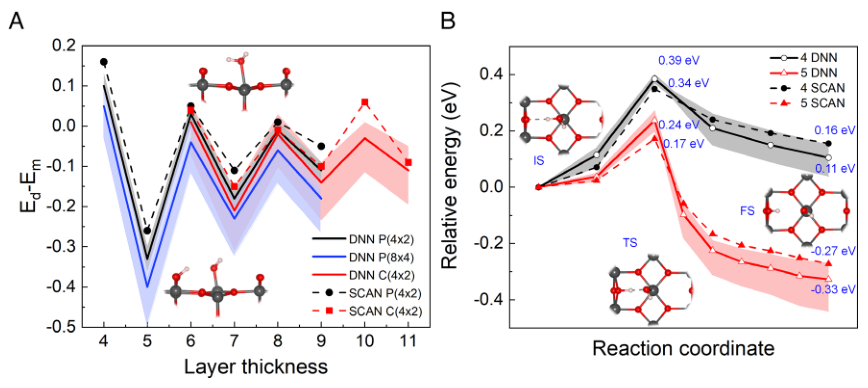
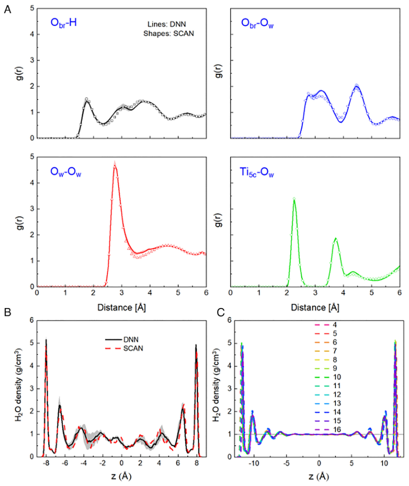
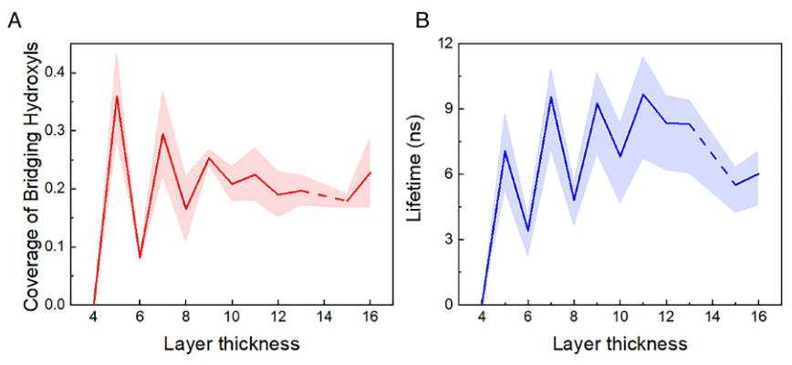
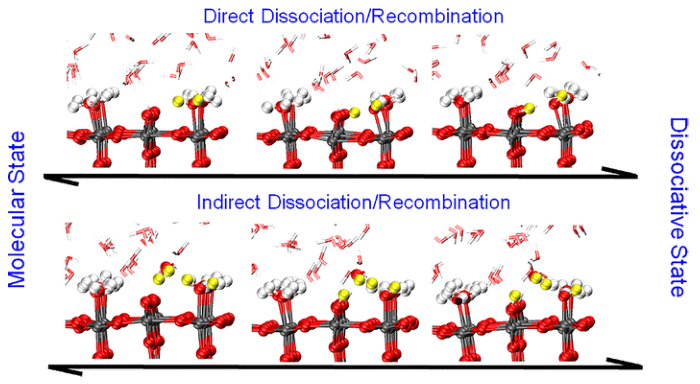

# Water dissociation at the water-rutile TiO2(110) interface from ab initio-based deep neural network simulations

## Metadata / 元数据

- **Zotero key:** `4LURCMCW`
- **Attachment key:** `44H2RE32`
- **Journal / 期刊：** Proceedings of the National Academy of Sciences
- **Date / 发表日期：** 2023-01-10
- **DOI:** 10.1073/pnas.2212250120
- **Collections / 集合：** 02课题/TiO2-OH-sol
- **Source PDF / 原始 PDF：** [paper.pdf](paper.pdf)

## Why this paper / 为什么选这篇

**English:** This eligible six-blue-diamond legacy backfill is a particularly direct bridge from machine-learning potentials to an oxide-water mechanism: it trains and validates Deep Potential models against SCAN data, then samples nanosecond trajectories across 4-16 trilayer rutile slabs to estimate a thickness-converged interfacial dissociation fraction. It is useful for separating validation evidence, finite-slab effects, equilibrium fractions, and hydroxyl lifetimes.

**中文：** 这篇符合条件的六蓝钻旧标记回填文献，把机器学习势函数直接落到氧化物-水界面机理：作者用 SCAN 数据训练并验证 Deep Potential，随后在 4-16 个三原子层厚度的金红石板层上采样纳秒轨迹，估计厚度收敛后的界面水解离分数。它特别适合训练如何区分模型验证、有限板层效应、平衡解离分数和羟基寿命。

## Terminology / 术语表

| English | 中文 | Note / 说明 |
|---|---|---|
| rutile TiO2(110) (R-110) | 金红石 TiO2(110)（R-110） | 本文研究的代表性金属氧化物-水界面。 |
| dissociation fraction | 解离分数 | 平衡时以解离态吸附的水所占比例；本文外推结果为 22 ± 6%。 |
| Deep Potential (DP) | 深度势（DP） | 以局域原子环境表示势能面的深度神经网络势函数。 |
| deep potential molecular dynamics (DPMD) | 深度势分子动力学（DPMD） | 用 DP 势执行长时间尺度的分子动力学。 |
| SCAN | SCAN 泛函 | Strongly Constrained and Appropriately Normed 半局域密度泛函，是本文训练标签的电子结构基准。 |
| O-Ti-O trilayer | O-Ti-O 三原子层 | 金红石 (110) 板层厚度的结构计量单位。 |
| Ti5c / Obr | 五配位 Ti / 桥氧（Ti5c / Obr） | 分子水吸附及形成末端/桥连羟基的关键表面位点。 |
| point of zero charge | 零电荷点 | 表面无净电荷的条件；本文据此讨论长程相互作用的重要性。 |

## Reading guide / 阅读提示

**English:** Read in three passes: (1) use Figs. 1-2 to ask whether the DP has earned the right to extend SCAN-AIMD sampling; (2) read Fig. 3 as a finite-thickness extrapolation, not as a result from one slab; (3) use Fig. 4 to identify proton-transfer topology. A 22% dissociation fraction is an equilibrium population, not a claim that every interfacial water molecule is dissociated, and it does not by itself establish any photocatalytic PCET pathway.

**中文：** 建议分三遍读：(1) 结合图 1-2 判断 DP 是否经得起验证、可以把 SCAN-AIMD 采样延长；(2) 把图 3 视为有限板层厚度外推，而不是单个板层的结论；(3) 用图 4 识别质子转移拓扑。22% 的解离分数是平衡布居，并不表示每个界面水都解离，更不能单独证明任一光催化 PCET 路径。

## Related Reading / 延伸阅读

**English:** One direct prerequisite is recommended: Calegari Andrade, Ko, Zhang, Car & Selloni, *Free energy of proton transfer at the water-TiO2 interface from ab initio deep potential molecular dynamics* (Chemical Science, 2020; DOI: 10.1039/c9sc05116c). **Why this one:** it is the anatase TiO2(101) comparison explicitly used here, so it makes the rutile-versus-anatase contrast and the same DPMD evidence chain interpretable.

**中文：** 推荐一篇直接前置文献：Calegari Andrade、Ko、Zhang、Car 与 Selloni，*Free energy of proton transfer at the water-TiO2 interface from ab initio deep potential molecular dynamics*（Chemical Science，2020；DOI: 10.1039/c9sc05116c）。**为什么推荐：** 本文明确以该锐钛矿 TiO2(101) 工作作比较；它能帮助理解金红石/锐钛矿差异以及同一 DPMD 证据链。

## Page / Section Index

- Page 1: S001, S002, S003, S004, S005, S006, S007
- Page 2: S008, S009, S010, S011, C001
- Page 3: S012, S013, C002
- Page 4: S014, S015, S016, S017, C003
- Page 5: C004, S018, S019, S020, S021, S022
- Page 6: S023, S024, S025, S026, S027
- Page 7: reference list only

## Bilingual Reader / 逐段中英文对照

References are retained in paper.pdf as bibliographic information and are not translated entry by entry.
参考文献保留在 paper.pdf 中作为书目信息，未逐条翻译。

### Page 1

#### Significance
**中文标题：** 意义

**Source / 来源：** p.1 S002

**Original:** The character—molecular vs. dissociated—of adsorbed water on TiO2 surfaces plays a critical role in many applications, e.g., photocatalysis and surface functionalization, and has been studied for decades. However, there is still limited information on water dissociation at the TiO2–liquid water interface, the system most relevant to applications. Ab initio simulations have provided valuable insights, but their time scales are insufficient to characterize the amount of dissociation at aqueous interfaces. We here overcome this limitation using deep neural network potentials that accurately reproduce the ab initio results for water interacting with the prototypical TiO2(110) surface. The average dissociation fraction, 22 ± 6%, predicted by these simulations is a key information for understanding TiO2’s photocatalytic activity.

**中文:** TiO2 表面吸附水的特性（分子与解离）在许多应用中发挥着关键作用，例如光催化和表面功能化，并且已经研究了数十年。然而，有关 TiO2-液态水界面（与应用最相关的系统）水解离的信息仍然有限。从头算模拟提供了有价值的见解，但其时间尺度不足以表征水界面的解离量。我们在这里使用深度神经网络势克服了这一限制，该势能准确地再现水与原型 TiO2(110) 表面相互作用的从头算结果。这些模拟预测的平均解离分数为 22 ± 6%，是了解 TiO2 光催化活性的关键信息。

**Source / 来源：** p.1 S003

**Original:** Author contributions: A.S. and B.W. designed research; B.W. and M.F.C.A. performed research; B.W., M.F.C.A., L.-M.L., and A.S. analyzed data; and B.W. and A.S. wrote the paper.

**中文:** 作者贡献：A.S.和 B.W.设计研究； B.W.和 M.F.C.A.进行研究； B.W.、M.F.C.A.、L.-M.L. 和 A.S.分析数据；和 B.W.和 A.S.论文写道。

**Source / 来源：** p.1 S004

**Original:** Competing interest statement: The authors have research support to disclose.

**中文:** 竞争利益声明：作者有需要披露的研究支持。

**Source / 来源：** p.1 S005

**Original:** 1To whom correspondence may be addressed. Email: aselloni@princeton.edu.

**中文:** 1 信件可以寄给谁。电子邮件：aselloni@princeton.edu。

**Source / 来源：** p.1 S006

**Original:** The interaction of water with TiO2 surfaces is of crucial importance in various scientific fields and applications, from photocatalysis for hydrogen production and the photooxidation of organic pollutants to self-cleaning surfaces and bio-medical devices. In particular, the equilibrium fraction of water dissociation at the TiO2–water interface has a critical role in the surface chemistry of TiO2, but is difficult to determine both experimentally and computationally. Among TiO2 surfaces, rutile TiO2(110) is of special interest as the most abundant surface of TiO2’s stable rutile phase. While surface-science studies have provided detailed information on the interaction of rutile TiO2(110) with gas-phase water, much less is known about the TiO2(110)–water interface, which is more relevant to many applications. In this work, we characterize the structure of the aqueous TiO2(110) interface using nanosecond timescale molecular dynamics simulations with ab initio-based deep neural network potentials that accurately describe water/TiO2(110) interactions over a wide range of water coverages. Simulations on TiO2(110) slab models of increasing thickness provide insight into the dynamic equilibrium between molecular and dissociated adsorbed water at the interface and allow us to obtain a reliable estimate of the equilibrium fraction of water dissociation. We find a dissociation fraction of 22 ± 6% with an associated average hydroxyl lifetime of 7.6 ± 1.8 ns. These quantities are both much larger than corresponding estimates for the aqueous anatase TiO2(101) interface, consistent with the higher water photooxidation activity that is observed for rutile relative to anatase.

**中文:** 水与二氧化钛表面的相互作用在各种科学领域和应用中都至关重要，从光催化制氢和有机污染物的光氧化到自清洁表面和生物医学设备。特别是，TiO2-水界面处水离解的平衡分数在 TiO2 的表面化学中起着至关重要的作用，但很难通过实验和计算来确定。在 TiO2 表面中，金红石 TiO2(110) 作为 TiO2 稳定金红石相最丰富的表面而受到特别关注。虽然表面科学研究提供了有关金红石 TiO2(110) 与气相水相互作用的详细信息，但对与许多应用更相关的 TiO2(110)-水界面知之甚少。在这项工作中，我们使用纳秒级分子动力学模拟和基于从头算的深度神经网络势来表征水性 TiO2(110) 界面的结构，该势能准确描述广泛水覆盖范围内的水/TiO2(110) 相互作用。对厚度增加的 TiO2(110) 板模型进行模拟可以深入了解界面处分子和解离吸附水之间的动态平衡，并使我们能够获得水离解平衡分数的可靠估计。我们发现解离分数为 22 ± 6%，相关的平均羟基寿命为 7.6 ± 1.8 ns。这些量均远大于水相锐钛矿型 TiO2(101) 界面的相应估计值，这与观察到金红石相对于锐钛矿型更高的水光氧化活性一致。

**Source / 来源：** p.1 S007

**Original:** Water is ubiquitous in the environment and its interaction with metal oxide surfaces has a key role in processes that range from wetting, dissolution, and corrosion to photocatalytic reactions (1, 2). The relative stability of molecularly vs. dissociatively adsorbed species can be of critical importance in these processes and has been intensely debated even for the simplest, low-index surfaces. One oxide surface of major fundamental and practical interest is rutile TiO2(110) (R-110 in the following), that is widely considered the prototypical metal oxide surface (3–9). Extensive investigations of gas-phase water adsorption on R-110 have established that oxygen vacancies—the most common defects on this surface—dissociate water and become hydroxylated (10–13), while molecularly adsorbed water is only ~0.035 eV more stable than dissociated water at regular surface sites (14). Moreover, a ~20% fraction of dissociated water has been reported for one adsorbed monolayer on R-110 at T = 210 K (15). However, information is scarce for the interface between R-110 and liquid water, which is the system more relevant to photocatalysis and other practical applications. Experiments based on synchrotron X-ray diffraction revealed water layering with partial dissociation of the adsorbed water on the R-110 surface (16–18). In other experiments, various ordered structures with (2 × 1) periodicity at the interface were reported, either on R-110 in water (19) or after exposure to liquid water (20), but such structures were found to be induced by adsorbed organic contaminants rather than interfacial water in subsequent studies (21). On the theoretical side, density functional theory (DFT)-based ab initio molecular dynamics (AIMD) simulations reported that water remains intact at the interface with defect-free R-110 (22), but this prediction could not explain the results of X-ray experiments (18). While AIMD has provided invaluable information on the interaction of water with metal oxide surfaces (9, 23, 24), the length and time scales accessible by ab initio simulations are often insufficient to characterize the properties of aqueous oxide interfaces (25–28). For example, the duration of AIMD simulations was found to be too short to allow a reliable prediction of the equilibrium fraction of water dissociation at the aqueous anatase TiO2 (101) (A-101) interface (25). To overcome these limitations, computationally efficient interatomic potentials with the accuracy of ab initio electronic structure methods

**中文:** 水在环境中无处不在，它与金属氧化物表面的相互作用在从润湿、溶解、腐蚀到光催化反应等过程中发挥着关键作用 (1, 2)。分子与解离吸附物质的相对稳定性在这些过程中至关重要，即使对于最简单的低折射率表面，也一直存在激烈争论。一种具有主要基础和实际意义的氧化物表面是金红石 TiO2(110)（以下简称 R-110），它被广泛认为是原型金属氧化物表面 (3-9)。对 R-110 上气相水吸附的广泛研究表明，氧空位（该表面上最常见的缺陷）会离解水并变得羟基化 (10-13)，而分子吸附水仅比常规表面位点的离解水稳定约 0.035 eV (14)。此外，据报道，在 T = 210 K 时，R-110 上的一个吸附单层有约 20% 的解离水 (15)。然而，R-110 和液态水之间的界面信息很少，而该系统与光催化和其他实际应用更相关。基于同步加速器 X 射线衍射的实验揭示了 R-110 表面吸附水部分解离的水分层 (16-18)。在其他实验中，报道了界面处具有 (2 × 1) 周期性的各种有序结构，无论是在水中的 R-110 上 (19) 还是在暴露于液态水后 (20)，但在后续研究中发现这种结构是由吸附的有机污染物而不是界面水诱导的 (21)。在理论方面，基于密度泛函理论 (DFT) 的从头分子动力学 (AIMD) 模拟表明，水在与无缺陷 R-110 的界面上保持完整 (22)，但这一预测无法解释 X 射线实验的结果 (18)。虽然 AIMD 提供了有关水与金属氧化物表面相互作用的宝贵信息 (9,23,24)，但从头算模拟可获得的长度和时间尺度通常不足以表征水性氧化物界面的特性 (25–28)。例如，发现 AIMD 模拟的持续时间太短，无法可靠预测水性锐钛矿 TiO2 (101) (A-101) 界面处水离解的平衡分数 (25)。为了克服这些限制，需要计算高效的原子间势以及从头算电子结构方法的准确性

### Page 2

**Source / 来源：** p.2 S008

**Original:** are needed. As shown by several recent studies, this goal can be achieved using ab initio-based deep neural networks (DNNs) to represent the potential energy surface of the system of interest (29–34). Still, constructing a general DNN potential for heterogeneous systems can be challenging (35), and in fact relatively few applications to aqueous metal oxide interfaces have so far been reported (27, 35–37). In this work, we have developed and applied ab initio-based DNNs to elucidate the structure and average degree of water dissociation at the aqueous R-110 interface. Specifically, we used the “Deep Potential” (DP) scheme by Zhang et al. (30, 31) to construct a DNN potential that accurately reproduces the DFT results for both isolated gas-phase water molecules and liquid water interacting with defect-free R-110. For this surface, an additional difficulty is the significant dependence of the DFT predictions on the R-110 slab thickness (22, 38). To address this issue and be able to extrapolate the results to large slab thickness, the DP was trained on slab models of different numbers of layers and later used to run nanosecond timescale simulations of the aqueous interfaces of several different, 4 to 16 O-Ti-O trilayers thick, R-110 slabs. From these simulations, we estimated an equilibrium water dissociation fraction of 22 ± 6% and, correspondingly, a free energy difference between dissociatively and molecularly adsorbed water at the R-110/water interface of 0.040 ± 0.007 eV. Comparison of these estimates for R-110 to analogous results for aqueous A-101 (37) shows differences in the behavior of interfacial water that can significantly affect the functional properties of these two systems.

**中文:** 需要。正如最近的几项研究所示，可以使用基于从头开始的深度神经网络（DNN）来表示感兴趣系统的势能面来实现这一目标（29-34）。尽管如此，为异质系统构建通用的 DNN 潜力可能具有挑战性 (35)，而且事实上迄今为止报道的水性金属氧化物界面的应用相对较少 (27, 35–37)。在这项工作中，我们开发并应用了从头开始的 DNN，以阐明 R-110 水界面的结构和水离解的平均程度。具体来说，我们使用了Zhang等人的“深势”（DP）方案。 (30, 31) 构建了一个 DNN 势，可以准确地再现孤立的气相水分子和液态水与无缺陷 R-110 相互作用的 DFT 结果。对于该表面，另一个困难是 DFT 预测对 R-110 板厚度的显着依赖性 (22, 38)。为了解决这个问题并能够将结果外推到大板厚度，DP 在不同层数的板模型上进行了训练，随后用于对几种不同的 4 至 16 O-Ti-O 三层厚度的 R-110 板的水界面进行纳秒级模拟。根据这些模拟，我们估计平衡水解离分数为 22 ± 6%，相应地，R-110/水界面处解离水和分子吸附水之间的自由能差为 0.040 ± 0.007 eV。将 R-110 的这些估计值与水性 A-101 的类似结果进行比较 (37)，显示界面水行为的差异，可以显着影响这两个系统的功能特性。

#### DP Training and Validation
**中文标题：** DP 培训和验证

**Source / 来源：** p.2 S010

**Original:** We trained our DNN potential using potential energies and forces from periodic DFT calculations and AIMD simulations of six different systems: i) bulk rutile TiO2; ii) bulk liquid water; iii) adsorbed H2O on 4-layer R-110 p(4 × 2) and iv) 4-layer R-110 p(6 × 3) slabs; and v) the aqueous interfaces of 4-layer R-110 p(4 × 2) and vi) 6-layer R-110 c(4 × 2) slabs (SI Appendix, Fig. S1). All training data were generated using the Strongly Constrained and Appropriately Normed (SCAN) functional (39), which was shown to provide a good description of both TiO2 (25) and bulk

**中文:** 我们使用来自六种不同系统的定期 DFT 计算和 AIMD 模拟的势能和力来训练 DNN 势：i) 块状金红石 TiO2； ii) 散装液态水； iii) 4 层 R-110 p(4 × 2) 和 iv) 4 层 R-110 p(6 × 3) 板上吸附 H2O； v) 4 层 R-110 p(4 × 2) 和 vi) 6 层 R-110 c(4 × 2) 板的水界面（SI 附录，图 S1）。所有训练数据均使用强约束和适当规范 (SCAN) 函数 (39) 生成，该函数可以很好地描述 TiO2 (25) 和散装材料

**Source / 来源：** p.2 S011

**Original:** liquid water (40) in previous studies. Details on the setup used for the DFT calculations are given in the method part and a summary of our SCAN results is given in SI Appendix, section S1. AIMD simulation temperatures in the range 330 to 900 K were used in order to explore a wide range of structures, including configurations with one or few interfacial water molecules either dissociated or near the transition state. As done in previous studies of aqueous interfaces (27, 35–37), we use DPs that only consider the local environment of each atom explicitly within a finite range. While long-range contributions can in principle be incorporated in DNN potentials (41–44), they are not expected to be significant in this study since no net electric charge is present at the surface in our simulations (a condition known as point of zero charge). More importantly, numerous validation tests show that the present DPs reproduce the DFTSCAN results with only small errors (see below and SI Appendix). Inclusion of long-range interactions should thus have little effect on the accuracy of the current model, which is mostly determined by the overall accuracy of the SCAN functional (39). We assessed the quality of our DP through extensive comparison of its predicted properties for different systems to corresponding DFT-SCAN results; see, e.g., SI Appendix, Table S5 for the lattice constants of rutile and SI Appendix, Fig. S6 for the radial distribution functions (RDFs) of bulk liquid water. One particularly important test was the adsorption of gas-phase H2O on the R-110 surface. It is known from previous DFT studies that the computed surface properties of R-110, including the adsorption energy of water, exhibit slowly converging even-odd oscillations with respect to the number of layers in the slab used for the calculations (22, 38). Fig. 1A compares DP and SCAN calculations of the adsorption energy difference (Ed−Em) between dissociated (Ed) and molecular (Em) water on slabs of different thicknesses. It appears that the oscillatory behavior of (Ed−Em) predicted by SCAN [which is similar to that given by other functionals (22)] is reproduced quite well by our DP, despite the fact that only even-layered TiO2 slabs were used for its training. While this result suggests that the even-odd oscillations of (Ed−Em) are largely determined by the atomic structure of the R-110 slabs, it is remarkable that the DP is capable to capture such relationship and predict the behavior of the adsorption energies for both evenand

**中文:** 先前研究中的液态水（40）。用于 DFT 计算的设置的详细信息在方法部分中给出，并且我们的 SCAN 结果的摘要在 SI 附录 S1 部分中给出。使用 330 至 900 K 范围内的 AIMD 模拟温度来探索各种结构，包括具有一个或几个离解或接近过渡态的界面水分子的配置。正如之前对水界面的研究 (27, 35–37) 所做的那样，我们使用的 DP 只明确考虑有限范围内每个原子的局部环境。虽然长程贡献原则上可以纳入 DNN 电势 (41-44)，但预计它们在本研究中不会很重要，因为在我们的模拟中表面不存在净电荷（称为零电荷点的条件）。更重要的是，大量验证测试表明，当前的 DP 再现了 DFTSCAN 结果，只有很小的错误（见下文和 SI 附录）。因此，包含远程交互对当前模型的准确性影响不大，当前模型的准确性主要由 SCAN 函数的整体准确性决定 (39)。我们通过将不同系统的预测特性与相应的 DFT-SCAN 结果进行广泛比较来评估 DP 的质量；例如，参见 SI 附录表 S5 了解金红石的晶格常数，参见 SI 附录图 S6 了解散装液态水的径向分布函数 (RDF)。一项特别重要的测试是 R-110 表面气相 H2O 的吸附。从之前的 DFT 研究中得知，计算出的 R-110 表面特性（包括水的吸附能）相对于用于计算的板层数表现出缓慢收敛的奇偶振荡 (22, 38)。图 1A 比较了不同厚度板上解离水 (Ed) 和分子水 (Em) 之间的吸附能差 (Ed−Em) 的 DP 和 SCAN 计算。看来，SCAN 预测的 (Ed−Em) 振荡行为 [与其他泛函 (22) 给出的相似] 可以由我们的 DP 很好地再现，尽管事实上仅使用偶数层 TiO2 板进行训练。虽然这一结果表明 (Ed−Em) 的偶数-奇数振荡很大程度上由 R-110 板的原子结构决定，但值得注意的是 DP 能够捕获这种关系并预测偶数和奇数的吸附能行为

### Fig. 1: 水吸附能与解离路径

**Placed near / 放置位置：** p.2 S011
**Source / 图注来源：** p.2 C001

**Original caption:** Fig. 1. Comparison between DP and DFT-SCAN results for water adsorption and dissociation on R-110: (A) adsorption energy difference (Ed − Em) between dissociated and molecular water vs. number of TiO2 layers; (B) minimum energy pathways for water dissociation on 4-layer (black) and 5-layer (red) p(4 × 2) slabs. Relevant structures are shown in the Insets, side views in (A) and top views in (B). Molecular water is adsorbed at the surface five-coordinated Ti (Ti5c) site, while dissociated water gives rise to a terminal hydroxyl at Ti5c and a bridging hydroxyl at the bridging oxygen site (Obr). Dark, red, and white spheres in the model stand for Ti, O, and H, respectively. In all plots, the DP results (full lines) correspond to the average of four independent DNN potentials while the shaded areas give their SD.

**中文图注：** 图 1. R-110 上水吸附和离解的 DP 和 DFT-SCAN 结果比较： (A) 离解水和分子水之间的吸附能差 (Ed – Em) 与 TiO2 层数的关系； (B) 4 层（黑色）和 5 层（红色）p(4 × 2) 板上水解离的最小能量路径。相关结构如插图、(A) 中的侧视图和(B) 中的俯视图所示。分子水被吸附在表面五配位 Ti (Ti5c) 位点上，而解离的水在 Ti5c 处产生末端羟基，并在桥氧位点 (Obr) 处产生桥接羟基。模型中的深色、红色和白色球体分别代表 Ti、O 和 H。在所有图中，DP 结果（实线）对应于四个独立 DNN 电位的平均值，而阴影区域给出其 SD。

**Reading note / 阅读提示：** 比较 DP 与 SCAN 对层数奇偶振荡及水解离路径的再现。

**Source / 来源：** p.2 C001

**Original caption:** Fig. 1. Comparison between DP and DFT-SCAN results for water adsorption and dissociation on R-110: (A) adsorption energy difference (Ed − Em) between dissociated and molecular water vs. number of TiO2 layers; (B) minimum energy pathways for water dissociation on 4-layer (black) and 5-layer (red) p(4 × 2) slabs. Relevant structures are shown in the Insets, side views in (A) and top views in (B). Molecular water is adsorbed at the surface five-coordinated Ti (Ti5c) site, while dissociated water gives rise to a terminal hydroxyl at Ti5c and a bridging hydroxyl at the bridging oxygen site (Obr). Dark, red, and white spheres in the model stand for Ti, O, and H, respectively. In all plots, the DP results (full lines) correspond to the average of four independent DNN potentials while the shaded areas give their SD.

**中文图注:** 图 1. R-110 上水吸附和离解的 DP 和 DFT-SCAN 结果比较： (A) 离解水和分子水之间的吸附能差 (Ed – Em) 与 TiO2 层数的关系； (B) 4 层（黑色）和 5 层（红色）p(4 × 2) 板上水解离的最小能量路径。相关结构如插图、(A) 中的侧视图和(B) 中的俯视图所示。分子水被吸附在表面五配位 Ti (Ti5c) 位点上，而解离的水在 Ti5c 处产生末端羟基，并在桥氧位点 (Obr) 处产生桥接羟基。模型中的深色、红色和白色球体分别代表 Ti、O 和 H。在所有图中，DP 结果（实线）对应于四个独立 DNN 电位的平均值，而阴影区域给出其 SD。

### Page 3

**Source / 来源：** p.3 S012

**Original:** odd-layered structures of increasing thickness. On a similar note, Fig. 1B compares SCAN and DP energies of selected structures along the minimum energy paths (45) to dissociate an adsorbed water molecule on R-110 slabs of 4 and 5 layers. The agreement is again quite good, even though no specific training of the DP on dissociation pathways was performed. Specifically, SCAN predicts dissociation barriers of 0.34 and 0.17 eV on the 4and 5-layer slabs, while the corresponding DP values are 0.39 ± 0.01 and 0.24 ± 0.03 eV, respectively. Next, we evaluated the DP’s ability to describe the aqueous R-110 interface by comparing the interfacial RDFs (Fig. 2A) and water density profiles (Fig. 2B) obtained from SCAN-AIMD

**中文:** 厚度增加的奇数层结构。同样，图 1B 比较了沿最小能量路径 (45) 的所选结构的 SCAN 和 DP 能量，以解离 4 层和 5 层 R-110 板上吸附的水分子。尽管没有对 DP 进行解离途径的具体培训，但该协议还是相当不错的。具体来说，SCAN 预测 4 层和 5 层平板上的解离势垒分别为 0.34 和 0.17 eV，而相应的 DP 值分别为 0.39 ± 0.01 和 0.24 ± 0.03 eV。接下来，我们通过比较从 SCAN-AIMD 获得的界面 RDF（图 2A）和水密度分布（图 2B）来评估 DP 描述水性 R-110 界面的能力

**Source / 来源：** p.3 S013

**Original:** and deep potential molecular dynamics (DPMD) simulations of a 4-layer R-110 p(4 × 2) slab in contact with 15 Å water. DPMD reproduces well both the water density distribution function and the RDFs at the R-110/water interface predicted by AIMD. Minor discrepancies between DPMD and AIMD are observed at surface-water distances of about 3 Å, which are however less relevant to the description of water dissociation on R-110. Further validation tests on both gas-phase water adsorption and the aqueous interface are reported in the SI Appendix. Most notably, SI Appendix, Fig. S8 shows that the DFT result for the work to move a H+ from a surface bridging oxygen atom to a nearby

**中文:** 以及 4 层 R-110 p(4 × 2) 板与 15 Å 水接触的深势分子动力学 (DPMD) 模拟。 DPMD 很好地再现了 AIMD 预测的水密度分布函数和 R-110/水界面处的 RDF。在大约 3 Å 的地表水距离处观察到 DPMD 和 AIMD 之间的微小差异，但这与 R-110 上水解离的描述不太相关。 SI 附录中报告了气相水吸附和水界面的进一步验证测试。最值得注意的是，SI 附录图 S8 显示了将 H+ 从表面桥接氧原子移动到附近的工作的 DFT 结果。

**Source / 来源：** p.3 C002

**Original caption:** Fig. 2. Comparison between AIMD and DPMD results for (A) surface-water RDFs (surface bridging oxygen-water hydrogen, Obr-H; Obr-water oxygen, Obr-Ow; OwOw; Ti5c-Ow), and (B) water density distribution of a 4-layer R-110 p(4 × 2) slab in contact with a 15 Å thick water layer. Both AIMD and DPMD simulations lasted 35 ps following 5 ps equilibration, with all water molecules initially undissociated. Shaded areas indicate the SD obtained from four independent DPMD simulations. (C) Water density distribution as a function of the number of O-Ti-O trilayers in the R-110 slab, from 20 ns DPMD trajectories following 5 ns equilibration.

**中文图注:** 图 2. AIMD 和 DPMD 结果之间的比较：(A) 地表水 RDF（表面桥接氧-水氢，Obr-H；Obr-水氧，Obr-Ow；OwOw；Ti5c-Ow），以及 (B) 与 15 Å 厚水层接触的 4 层 R-110 p(4 × 2) 板的水密度分布。 AIMD 和 DPMD 模拟在 5 ps 平衡后持续了 35 ps，所有水分子最初均未解离。阴影区域表示从四个独立的 DPMD 模拟中获得的 SD。 (C) 水密度分布作为 R-110 板中 O-Ti-O 三层数量的函数，来自 5 ns 平衡后的 20 ns DPMD 轨迹。

### Page 4

**Source / 来源：** p.4 S014

**Original:** terminal hydroxyl adsorbed on an adjacent Ti5c atom at the aqueous interface is well reproduced by our DPs. Finally, we compared DPand SCAN-predicted atomic forces for all the configurations of the six different systems used to train the DP (SI Appendix, Fig. S9). The rmsd of the DP forces from the corresponding SCAN values vary from 70.4 meV/Å for bulk water (10,207 configurations) to 138.7 meV/Å for the c(4 × 2)/ water interface (3,576 configurations). These values are quite satisfactory considering the large number of explored configurations. They are in fact in the same range of the rmsd reported by other studies employing DNN potentials (35, 46) trained on much fewer systems than the DP developed in this work.

**中文:** 我们的 DP 很好地再现了水界面上相邻 Ti5c 原子上吸附的末端羟基。最后，我们比较了用于训练 DP 的六种不同系统的所有配置的 DP 和 SCAN 预测的原子力（SI 附录，图 S9）。相应 SCAN 值的 DP 力的均方根差从散装水（10,207 个配置）的 70.4 meV/Å 到 c(4 × 2)/水界面（3,576 个配置）的 138.7 meV/Å 不等。考虑到大量探索的配置，这些值是相当令人满意的。事实上，它们与其他使用 DNN 电位 (35, 46) 的研究报告的 rmsd 处于相同的范围，但训练的系统比本工作中开发的 DP 少得多。

#### Results and Discussion
**中文标题：** 结果与讨论

**Source / 来源：** p.4 S016

**Original:** We characterized the properties of the aqueous R-110 interface via DPMD simulations of 12 different slab models of increasing thickness, from 4 to 16 O-Ti-O trilayers, in contact with a 25 Å thick water layer between exposed surfaces. For each system, the equilibrium structure was determined from a DPMD trajectory of 25 ns duration, with the first 5 ns of simulation excluded from the statistical analysis. As shown in Fig. 2C, the water density distributions are very similar for the different slabs and overlap almost completely one with another. Similar to the structure found at the aqueous A-101 interface (37), water forms a layered structure on R-110, with the first two peaks resulting from water adsorbed at Ti5c sites and H-bonded to the surface bridging oxygens, respectively. These peaks are followed by additional increasingly weaker oscillations, with the central region corresponding to bulk-like water. From the computed water diffusion coefficients (SI Appendix, Table S8), it appears that adsorbed water in the first layer is several times slower than bulk water, in agreement with experiment (18), while the second layer’s diffusion is typically only slightly slower than in the bulk liquid and is increased by water dissociation. The nature of interfacial water was further characterized by monitoring the spontaneous water dissociation and recombination events at each surface Ti5c site during the DPMD trajectories. Such events were observed rather frequently during our 25 ns simulations (SI Appendix, Figs. S10–S21), and in general a larger fraction of dissociated water was found on odd-layered TiO2 slabs than on even-layered ones, consistent with the water

**中文:** 我们通过 DPMD 模拟 12 种厚度不断增加的不同板模型（从 4 到 16 个 O-Ti-O 三层）与暴露表面之间 25 Å 厚的水层接触，表征了水性 R-110 界面的特性。对于每个系统，平衡结构是根据 25 ns 持续时间的 DPMD 轨迹确定的，模拟的前 5 ns 被排除在统计分析之外。如图 2C 所示，不同板的水密度分布非常相似，并且彼此之间几乎完全重叠。与在水性 A-101 界面 (37) 上发现的结构类似，水在 R-110 上形成层状结构，前两个峰分别由 Ti5c 位点吸附的水和与表面桥接氧键合的氢产生。这些峰值之后是额外的越来越弱的振荡，中心区域对应于块状水。从计算的水扩散系数（SI附录，表S8）来看，第一层中吸附的水比本体水慢几倍，与实验（18）一致，而第二层的扩散通常仅比本体液体中稍慢，并且通过水离解而增加。通过监测 DPMD 轨迹期间每个表面 Ti5c 位点的自发水解离和重组事件，进一步表征了界面水的性质。在我们的 25 ns 模拟过程中，此类事件相当频繁地观察到（SI 附录，图 S10-S21），并且通常在奇数层 TiO2 平板上发现的解离水比例高于偶数层 TiO2 平板，这与水一致

**Source / 来源：** p.4 S017

**Original:** adsorption energy differences in Fig. 1A. As a result, the average dissociation fractions on slabs of different thicknesses exhibit even-odd oscillations of decreasing amplitude with increasing slab thickness (Fig. 3A). To estimate the equilibrium dissociation fraction at the aqueous R-110 interface (fR-110), we averaged the results for the thicker slabs of 7 to 16 layers, which gave fR-110 = 0.22 ± 0.06. This fraction can be associated to a free energy difference ΔAd = −kBT ln (0.22 ± 0.06) = (0.040 ± 0.007) eV between dissociatively and molecularly adsorbed water at the interface, a value close to the free energy difference of 0.035 ± 0.003 eV obtained from supersonic molecular beam experiments (14) carried out at low water coverage (~0.05 mL) and temperature (~80 K). As the latter conditions are very different from those used in our simulations, the similarity of the two free energy estimates may be related to the character of the hydrogen bonds of adsorbed water at low coverage (SI Appendix, Fig. S1) and at the interface (Fig. 2 and SI Appendix, Fig. S5). In particular, the significant difference between the diffusion coefficients of first and second interfacial water layers (SI Appendix, Table S8) suggests that the hydrogen bonds between them are rather weak, as indeed found also for adsorbed water at low coverage. The value of ΔAd that we estimate for R-110/water is smaller than that recently predicted for the A-101/water interface, 0.08 ± 0.01 eV (37), consistent with the adsorption energy differences between dissociated and molecular gas-phase water at the R-110 and A-101/ vacuum interfaces (12). It is known that free energy difference ΔAd between water adsorbed in dissociated and molecular forms is related to the difference in acidities of the Ti5c (pKa1) and Obr (pKa2) sites according to ΔAd = 2.30 kBT (pKa1 −pKa2 ) (47). While our simulations do not provide direct access to pKa1 and pKa2 separately, we can gain useful information by considering the point of net zero proton charge (PZC), an important quantity related to the surface acidities by PZC = 1∕2 (pKa1 + pKa2 ) (47). Following an early suggestion of slightly higher PZC of anatase than of rutile (48), a more recent extensive analysis of experimental PZC data concluded that the PZCs of rutile and anatase do not show any substantial difference, both being of the order 6 ± 1 (49). Combining this experimental result with the estimates of ΔAd from this work and ref. 37, we then predict “optimal” pKa1 and pKa2 values of 6.35 and 5.65 for R-110, and 6.70 and 5.30 for A-101. These values are very different from available computational estimates based on short AIMD trajectories (47, 50).

**中文:** 图1A中的吸附能差异。结果，不同厚度的平板上的平均解离分数表现出随着平板厚度的增加而减小振幅的偶奇振荡（图3A）。为了估计水性 R-110 界面 (fR-110) 的平衡解离分数，我们对 7 至 16 层较厚板的结果进行了平均，得出 fR-110 = 0.22 ± 0.06。该分数可以与界面处解离水和分子吸附水之间的自由能差 ΔAd = -kBT ln (0.22 ± 0.06) = (0.040 ± 0.007) eV 相关，该值接近从在低水覆盖率 (~0.05 mL) 和温度下进行的超音速分子束实验 (14) 获得的 0.035 ± 0.003 eV 自由能差（~80 K）。由于后面的条件与我们模拟中使用的条件非常不同，两个自由能估计的相似性可能与低覆盖度（SI附录，图S1）和界面处（图2和SI附录，图S5）处吸附水的氢键特征有关。特别是，第一和第二界面水层的扩散系数之间的显着差异（SI附录，表S8）表明它们之间的氢键相当弱，对于低覆盖度的吸附水来说确实如此。我们估计的 R-110/水的 ΔAd 值小于最近预测的 A-101/水界面的 ΔAd 值，0.08 ± 0.01 eV (37)，与 R-110 和 A-101/真空界面处离解水和分子气相水之间的吸附能差异一致 (12)。已知以解离形式和分子形式吸附的水之间的自由能差 ΔAd 与 Ti5c (pKa1) 和 Obr (pKa2) 位点的酸度差异有关，根据 ΔAd = 2.30 kBT (pKa1 -pKa2 ) (47)。虽然我们的模拟不能分别直接访问 pKa1 和 pKa2，但我们可以通过考虑净零质子电荷 (PZC) 点来获得有用的信息，这是一个与表面酸度相关的重要量，PZC = 1∕2 (pKa1 + pKa2 ) (47)。早期提出锐钛矿的 PZC 略高于金红石 (48)，最近对实验 PZC 数据的广泛分析得出结论，金红石和锐钛矿的 PZC 没有表现出任何实质性差异，两者的数量级均为 6 ± 1 (49)。将此实验结果与本工作和参考文献中的 ΔAd 估计值相结合。如图 37 所示，我们随后预测 R-110 的“最佳”pKa1 和 pKa2 值为 6.35 和 5.65，A-101 的“最佳”pKa1 和 pKa2 值为 6.70 和 5.30。这些值与基于短 AIMD 轨迹的可用计算估计有很大不同 (47, 50)。

### Fig. 2: 界面结构与水密度验证

**Placed near / 放置位置：** p.4 S017
**Source / 图注来源：** p.3 C002

**Original caption:** Fig. 2. Comparison between AIMD and DPMD results for (A) surface-water RDFs (surface bridging oxygen-water hydrogen, Obr-H; Obr-water oxygen, Obr-Ow; OwOw; Ti5c-Ow), and (B) water density distribution of a 4-layer R-110 p(4 × 2) slab in contact with a 15 Å thick water layer. Both AIMD and DPMD simulations lasted 35 ps following 5 ps equilibration, with all water molecules initially undissociated. Shaded areas indicate the SD obtained from four independent DPMD simulations. (C) Water density distribution as a function of the number of O-Ti-O trilayers in the R-110 slab, from 20 ns DPMD trajectories following 5 ns equilibration.

**中文图注：** 图 2. AIMD 和 DPMD 结果之间的比较：(A) 地表水 RDF（表面桥接氧-水氢，Obr-H；Obr-水氧，Obr-Ow；OwOw；Ti5c-Ow），以及 (B) 与 15 Å 厚水层接触的 4 层 R-110 p(4 × 2) 板的水密度分布。 AIMD 和 DPMD 模拟在 5 ps 平衡后持续了 35 ps，所有水分子最初均未解离。阴影区域表示从四个独立的 DPMD 模拟中获得的 SD。 (C) 水密度分布作为 R-110 板中 O-Ti-O 三层数量的函数，来自 5 ns 平衡后的 20 ns DPMD 轨迹。

**Reading note / 阅读提示：** 先确认 DPMD 再现 AIMD 的 RDF 和密度剖面，才可相信后续纳秒尺度统计。

### Fig. 3: 层数收敛、解离分数与羟基寿命

**Placed near / 放置位置：** p.4 S017
**Source / 图注来源：** p.4 C003

**Original caption:** Fig. 3. Results of DPMD simulations of the aqueous interfaces of R-110 slabs with different numbers of O-Ti-O trilayers. (A) Surface coverage of bridging hydroxyls groups resulting from water dissociation; (B): lifetime of hydroxyl groups as a function of the number of O-Ti-O tri-layers. Shaded areas indicate the SD and the 95% confidence band in panels (A) and (B), respectively. All results are obtained from 20 ns DPMD trajectories after 5 ns equilibration.

**中文图注：** 图3.具有不同数量的O-Ti-O三层的R-110板的水界面的DPMD模拟结果。 (A) 由水离解产生的桥接羟基的表面覆盖率； (B)：羟基寿命与 O-Ti-O 三层数量的函数关系。阴影区域分别表示面板 (A) 和 (B) 中的 SD 和 95% 置信带。所有结果都是从 5 ns 平衡后的 20 ns DPMD 轨迹获得的。

**Reading note / 阅读提示：** 关注厚度外推、22 ± 6% 解离分数，以及 7.6 ± 1.8 ns 羟基寿命。

**Source / 来源：** p.4 C003

**Original caption:** Fig. 3. Results of DPMD simulations of the aqueous interfaces of R-110 slabs with different numbers of O-Ti-O trilayers. (A) Surface coverage of bridging hydroxyls groups resulting from water dissociation; (B): lifetime of hydroxyl groups as a function of the number of O-Ti-O tri-layers. Shaded areas indicate the SD and the 95% confidence band in panels (A) and (B), respectively. All results are obtained from 20 ns DPMD trajectories after 5 ns equilibration.

**中文图注:** 图3.具有不同数量的O-Ti-O三层的R-110板的水界面的DPMD模拟结果。 (A) 由水离解产生的桥接羟基的表面覆盖率； (B)：羟基寿命与 O-Ti-O 三层数量的函数关系。阴影区域分别表示面板 (A) 和 (B) 中的 SD 和 95% 置信带。所有结果都是从 5 ns 平衡后的 20 ns DPMD 轨迹获得的。

### Page 5

**Source / 来源：** p.5 C004

**Original caption:** Fig. 4. Direct and indirect mechanisms of water dissociation and recombination at the aqueous R-110 interface. For better visualization, participating protons are shown in yellow, the water molecules in the first adsorbed layer are shown using balls and sticks, other water molecules are shown using sticks only. Molecular and dissociated water are on the left and right, respectively, while the middle panel is the transition state.

**中文图注:** 图 4. R-110 水界面处水解离和重组的直接和间接机制。为了更好的可视化，参与的质子以黄色显示，第一吸附层中的水分子使用球和棒显示，其他水分子仅使用棒显示。分子水和解离水分别位于左侧和右侧，而中间面板是过渡态。

**Source / 来源：** p.5 S018

**Original:** From the time evolutions in SI Appendix, Figs. S10–S21 and the resulting hydroxyl survival probabilities P(t) (SI Appendix, Fig. S22), we also calculated the lifetimes 휏= ∫∞ 0 P(t)tdt∕∫∞ 0 P(t)dt. These are shown as a function of the R-110 slab thickness in Fig. 3B, from which we estimate an average hydroxyl lifetime of 7.6 ± 1.8 ns for the thicker (7 to 16 layers) slabs. Despite the substantial error bars, both this hydroxyl lifetime and the equilibrium water dissociation fraction fR-110 for R-110 are much larger than the corresponding estimates for aqueous A-101 obtained in recent DPMD simulations, < τ> ~ 0.6 ns and fA-101 ~ 0.06 (37). This difference can play a significant role in photocatalysis, one of the most important applications of TiO2, where the transfer of photogenerated holes in TiO2 to adsorbed water species is known to be much easier when water is dissociated (51–53). Due to the larger water dissociation fraction and longer hydroxyl lifetime, many more hole transfer processes can occur on R-110 in comparison with A-101. In particular, this can contribute to the higher water photooxidation activity of rutile with respect to anatase observed in experiment (53, 54). Extensive studies of gas-phase water adsorption on R-110 have revealed that water dissociation occurs via direct proton transfer from the adsorbed water molecule at a Ti5c site to an adjacent surface Obr at a distance of about 3 Å (10, 13, 14, 55–57) (Fig. 1B). An analogous direct dissociation/recombination mechanism is also observed at the aqueous R-110 interface, together with an additional indirect pathway, where a second layer water molecule donating a H-bond to an Obr transfers its proton to the latter and in turn receives a proton from an adsorbed water molecule at the Ti5c adjacent to the Obr (Fig. 4). This indirect mechanism—not available when R-110 is exposed to low water coverage—is similar to that occurring at the aqueous A-101 interface (37) where the larger distance (~4 Å) between neighboring Ti5c and Obr sites makes the direct proton transfer unfavorable. Interestingly, we also observed that a water molecule undergoing direct or indirect dissociation may recombine not by the same but by the other pathway, due to the fast proton diffusion at the aqueous interface. In summary, using ab initio-based nanosecond timescale simulations we have obtained a comprehensive picture of aqueous R-110, a model photocatalytic interface (5, 13, 20), including a reliable estimate of the free energy difference between dissociatively and molecularly adsorbed water at the interface that compares well with available experimental results (14, 15)(18). In comparison with analogous results for the aqueous anatase (101)

**中文:** 从SI附录中的时间演变来看，图。 S10–S21 和由此产生的羟基存活概率 P(t)（SI 附录，图 S22），我们还计算了寿命 휏= ∫∞ 0 P(t)tdt∕∫∞ 0 P(t)dt。这些在图 3B 中显示为 R-110 板厚度的函数，从中我们估计较厚（7 至 16 层）板的平均羟基寿命为 7.6 ± 1.8 ns。尽管误差线很大，但 R-110 的羟基寿命和平衡水解离分数 fR-110 都远大于最近 DPMD 模拟中获得的水性 A-101 的相应估计值，<τ> ~ 0.6 ns 和 fA-101 ~ 0.06 (37)。这种差异可以在光催化中发挥重要作用，光催化是 TiO2 最重要的应用之一，众所周知，当水解离时，TiO2 中的光生空穴转移到吸附的水物种上要容易得多 (51–53)。与 A-101 相比，由于更大的水离解分数和更长的羟基寿命，R-110 上可以发生更多的空穴转移过程。特别是，这有助于实验中观察到的金红石相对于锐钛矿具有更高的水光氧化活性 (53, 54)。对 R-110 上气相水吸附的广泛研究表明，水解离是通过直接质子从 Ti5c 位点吸附的水分子转移到距离约 3 Å (10, 13, 14, 55-57) 的相邻表面 Obr 发生的（图 1B）。在水性 R-110 界面上也观察到类似的直接解离/重组机制，以及额外的间接途径，其中向 Obr 提供氢键的第二层水分子将其质子转移到后者，然后从与 Obr 相邻的 Ti5c 处吸附的水分子接收质子（图 4）。这种间接机制（当 R-110 暴露于低水覆盖率时不可用）类似于在水性 A-101 界面 (37) 处发生的机制，其中相邻 Ti5c 和 Obr 位点之间的较大距离 (~4 Å) 使得直接质子转移不利。有趣的是，我们还观察到，由于水界面处质子的快速扩散，经历直接或间接解离的水分子可能不是通过相同的途径而是通过其他途径重新组合。总之，使用基于从头开始的纳秒时间尺度模拟，我们获得了水性 R-110（光催化界面模型）的全面图像 (5, 13, 20)，包括对界面处解离水和分子吸附水之间自由能差异的可靠估计，该估计与现有的实验结果 (14, 15)(18) 很好地比较。与水性锐钛矿的类似结果相比 (101)

### Fig. 4: 直接与间接水解离/复合机制

**Placed near / 放置位置：** p.5 S018
**Source / 图注来源：** p.5 C004

**Original caption:** Fig. 4. Direct and indirect mechanisms of water dissociation and recombination at the aqueous R-110 interface. For better visualization, participating protons are shown in yellow, the water molecules in the first adsorbed layer are shown using balls and sticks, other water molecules are shown using sticks only. Molecular and dissociated water are on the left and right, respectively, while the middle panel is the transition state.

**中文图注：** 图 4. R-110 水界面处水解离和重组的直接和间接机制。为了更好的可视化，参与的质子以黄色显示，第一吸附层中的水分子使用球和棒显示，其他水分子仅使用棒显示。分子水和解离水分别位于左侧和右侧，而中间面板是过渡态。

**Reading note / 阅读提示：** 区分单步直接质子转移和由中间水分子参与的间接机制。

**Source / 来源：** p.5 S019

**Original:** interface (37), we found a considerably larger fraction and longer lifetime of hydroxyls on rutile (110), consistent with various known differences between the structures and chemistries of these two surfaces (9) and in particular with the higher efficiency of the rutile phase for water photooxidation (52–54). This highlights the strong link between surface structure, behavior of interfacial water, and photocatalytic activity. The present results also confirm that ab initio-based DNN potential simulations are a valuable tool for advancing the fundamental understanding of aqueous metal oxide interfaces, which is an essential step to better control the reactivity of photocatalytic and electrochemical interfaces.

**中文:** 在界面 (37) 上，我们发现金红石 (110) 上的羟基比例相当大且寿命更长，这与这两个表面 (9) 的结构和化学性质之间的各种已知差异一致，特别是金红石相对水光氧化的效率更高 (52-54)。这凸显了表面结构、界面水行为和光催化活性之间的密切联系。目前的结果还证实，从头开始的 DNN 电势模拟是推进对水性金属氧化物界面的基本理解的宝贵工具，这是更好地控制光催化和电化学界面反应性的重要步骤。

#### Materials and Methods
**中文标题：** 材料和方法

**Source / 来源：** p.5 S021

**Original:** DFT Calculations and Ab Initio MD Simulations. Static DFT calculations and AIMD simulations were conducted using the SCAN (39) functional, as implemented in the CP2K package (58). Goedecker–Teter–Hutter (59) norm-conserving pseudopotentials were used together with a hybrid Gaussian-plane wave basis set; for plane waves, a cutoff energy of 1,200 Ry was found necessary for convergence. The Gaussian basis sets were optimized for molecular system with double-ζ valence and one set of polarization function (DZVP) basis. The R-110 surface was modeled using slabs with either p(4 × 2) surface supercell and 4-to-9 O-Ti-O tri-layers or c(4 × 2) surface supercell (60, 61) and 6-to-11 tri-layers (SI Appendix, Fig. S1). Consecutive slabs were separated by a region of at least 15 Å along the z direction. Only the Γ point was used for k-sampling. Structural optimizations were carried out until the residual forces on all atoms were less than ~0.02 eV/Å. The barrier of water dissociation was determined by climbing image nudged elastic band (45) calculations. The R-110 surface in contact with liquid water was investigated via BornOppenheimer Molecular Dynamics simulations. The aqueous interfaces were modeled using R-110 p(4 × 2) and c(4 × 2) slabs in contact with a water layer ~15 Å thick, corresponding to 77 and 47 H2O molecules, respectively, with the water density set at the experimental value of 1 g/cm3. The SCAN-based simulations started from structures pre-equilibrated at the PBE level (62). To sample the canonical ensemble (NVT), a Nose–Hoover thermostat (63, 64) was applied. A temperature of 330 K was used to account for the ice melting temperature of ~310 K predicted by SCAN (65). Hydrogen atoms were replaced by deuterium, and a timestep of 0.5 fs was used for all cases. All trajectories were run for 20 to 40 ps to ensure the interface structures are reasonably equilibrated.

**中文:** DFT 计算和 Ab Initio MD 模拟。静态 DFT 计算和 AIMD 模拟是使用 SCAN (39) 函数进行的，如 CP2K 包 (58) 中实现的那样。 Goedecker-Teter-Hutter (59) 范数守恒赝势与混合高斯平面波基组一起使用；对于平面波，我们发现收敛所需的截止能量为 1,200 Ry。高斯基组针对具有双 z 价和一组极化函数 (DZVP) 基的分子系统进行了优化。 R-110 表面使用 p(4 × 2) 表面超晶胞和 4-9 O-Ti-O 三层板或 c(4 × 2) 表面超晶胞 (60, 61) 和 6-11 三层板进行建模（SI 附录，图 S1）。连续的板沿 z 方向间隔至少 15 Å 的区域。仅 Γ 点用于 k 采样。进行结构优化，直到所有原子上的残余力小于~0.02 eV/Å。水离解的势垒通过攀爬图像微移弹性带（45）计算来确定。通过 BornOppenheimer 分子动力学模拟研究了与液态水接触的 R-110 表面。使用与约 15 Å 厚的水层接触的 R-110 p(4 × 2) 和 c(4 × 2) 板对水界面进行建模，分别对应于 77 和 47 个 H2O 分子，水密度设置为实验值 1 g/cm3。基于 SCAN 的模拟从 PBE 级别预平衡的结构开始 (62)。为了对规范系综 (NVT) 进行采样，使用了 Nose–Hoover 恒温器 (63, 64)。使用 330 K 的温度来解释 SCAN (65) 预测的约 310 K 的冰融化温度。氢原子被氘取代，所有情况均使用 0.5 fs 的时间步长。所有轨迹均运行 20 至 40 ps，以确保界面结构合理平衡。

**Source / 来源：** p.5 S022

**Original:** DP Training and Validation. The DNN potentials were trained using the DeepMD kit (66) package, following the active learning procedure of Zhang et al. (31). The training was initiated using 100 evenly separated snapshots from the

**中文:** DP 培训和验证。 DNN 电位使用 DeepMD 套件 (66) 包进行训练，遵循Zhang 等人的主动学习程序。 (31)。训练是使用 100 个均匀分离的快照开始的

### Page 6

**Source / 来源：** p.6 S023

**Original:** AIMD trajectories of six different systems along with their DFT energies and forces; the six systems included: pure bulk water (11.85 × 12.99 × 14.9591 Å3), bulk rutile (3 × 3 × 4 supercell), isolated water molecule adsorbed on p(4 × 2) and p(6 × 3) slabs, p(4 × 2) R-110/ water interface, and c(4 × 2) R-110/water interface. After training, four independent DNN potentials were generated and employed to run molecular dynamics trajectories using the Lammps software (67). For all systems, simulation temperatures in the range 330 to 900 K were used in order to explore wide sets of configurations. Based on the rmsd of the four DPMD trajectories, structures showing the largest deviations were selected for additional DFT calculations of energies and forces, which were then added to the training set. This procedure was repeated until the average deviation of the forces during the exploration became smaller than 0.05 eV/Å at 330 K. The final training set included: 10,207 configurations for bulk water; 2,789 configurations for bulk rutile; 5,558 and 4,346 configurations for isolated adsorbed water on R-110 p(4 × 2) and p(6 × 3), respectively; and 11,950 and 3,576 configurations for the water interface with 4-layer p(4 × 2) and 6-layer c(4 × 2) slabs, respectively. The four generated DNN potentials were then used for short timescale (~ 40 ps) validation studies, as described in the main text (Figs. 1 and 2). After confirming that these potentials reproduced the DFT results and were all equivalent within small error bars, one of the four DPs was selected and successively employed for all the long timescale (~ 25 ns) simulations of R-110/water interfaces.

**中文:** 六个不同系统的 AIMD 轨迹及其 DFT 能量和力；这六个系统包括：纯散装水（11.85 × 12.99 × 14.9591 Å3）、散装金红石（3 × 3 × 4 超级电池）、吸附在 p(4 × 2) 和 p(6 × 3) 平板上的分离水分子、p(4 × 2) R-110/水界面和 c(4 × 2) R-110/水界面。训练后，生成了四个独立的 DNN 势，并使用 Lammps 软件运行分子动力学轨迹 (67)。对于所有系统，都使用 330 至 900 K 范围内的模拟温度来探索广泛的配置。根据四个 DPMD 轨迹的均方根差，选择显示最大偏差的结构用于能量和力的附加 DFT 计算，然后将其添加到训练集中。重复该过程，直到在 330 K 时探测过程中力的平均偏差小于 0.05 eV/Å。最终的训练集包括： 10,207 个散装水配置；散装金红石有 2,789 种配置； R-110 p(4 × 2) 和 p(6 × 3) 上分离的吸附水分别有 5,558 和 4,346 个构型； 4 层 p(4 × 2) 和 6 层 c(4 × 2) 板的水界面分别有 11,950 和 3,576 个配置。然后，将四个生成的 DNN 电位用于短时间尺度（~ 40 ps）验证研究，如正文中所述（图 1 和图 2）。在确认这些势能再现 DFT 结果并且在小误差条内全部等效后，选择了四个 DP 之一并连续用于 R-110/水界面的所有长时间尺度（约 25 ns）模拟。

**Source / 来源：** p.6 S024

**Original:** DPMD Simulations. We considered 12 independent systems, each composed by a R-110 slab in contact with a 25 Å thick water layer at the experimental density. Each slab had a different number of O-Ti-O trilayers in the range of 4 to 16, and in all cases, we used a p(4 × 2) surface supercell exposing 8 Ti5c and 8 Obr sites. Liquid water simulations were performed with a periodically repeated cell containing 77 water molecules at the experimental density. All simulations were performed in the NVT ensemble using Lammps (67). Temperature was controlled by a Nose–Hoover thermostat at 330 K (330, 400, 500, 600, 700, 800, and 900 in the exploration step). The classical equations of motion were numerically integrated using Verlet's algorithm with a time step of 0.5 fs and the hydrogen mass set to 2, which allows a larger time step without affecting the equilibrium statistical properties of the investigated systems.

**中文:** DPMD 模拟。我们考虑了 12 个独立系统，每个系统均由与实验密度下 25 Å 厚的水层接触的 R-110 板组成。每个板都有不同数量的 O-Ti-O 三层，范围为 4 到 16，并且在所有情况下，我们都使用暴露 8 个 Ti5c 和 8 个 Obr 位点的 p(4 × 2) 表面超晶胞。使用包含 77 个水分子（处于实验密度）的周期性重复单元进行液态水模拟。所有模拟均使用 Lammps (67) 在 NVT 系综中进行。温度由 Nose-Hoover 恒温器控制在 330 K（探索步骤中为 330、400、500、600、700、800 和 900）。使用 Verlet 算法对经典运动方程进行数值积分，时间步长为 0.5 fs，氢质量设置为 2，这允许更大的时间步长而不影响所研究系统的平衡统计特性。

**Source / 来源：** p.6 S025

**Original:** Data, Materials, and Software Availability. This repository contains the training data and input files needed to train a DNN interatomic potential for TiO2 rutile (110)/ water interface. The DNN model was constructed using the DP method, as implemented in the DeepMD-kit code. Energy and forces in the data were computed with the SCAN functional implemented in the CP2K package. For more information of the methodology used to build the DNN training data, please see the reference cited at the end of this document. Within this repository you will find:raw_data: The raw data used to train the DP model; train: The DeepMD-kit input files; graphs: The frozen DNN graphs that can be used to run DP molecular dynamics. Data have been deposited in https://github.com/CSIprinceton/ Rutile-TiO-110-water (open).

**中文:** 数据、材料和软件的可用性。该存储库包含训练 TiO2 金红石 (110)/水界面的 DNN 原子间势所需的训练数据和输入文件。 DNN 模型是使用 DP 方法构建的，在 DeepMD-kit 代码中实现。数据中的能量和力是通过 CP2K 包中实现的 SCAN 功能计算的。有关用于构建 DNN 训练数据的方法的更多信息，请参阅本文档末尾引用的参考文献。在此存储库中，您将找到：raw_data：用于训练 DP 模型的原始数据； train：DeepMD-kit 输入文件；图：可用于运行 DP 分子动力学的冻结 DNN 图。数据已存放在 https://github.com/CSIprinceton/Rutile-TiO-110-water（开放）中。

**Source / 来源：** p.6 S026

**Original:** ACKNOWLEDGMENTS. This work was supported by DoE BES, CSGB Division under Award DE-SC0007347. We also acknowledge support from the Computational Chemical Center: Chemistry in Solution and at Interfaces, funded by DoE under Award DE-SC0019394. We used resources of the National Energy Research Scientific Computing Center (DoE No. DE-AC02-05cH11231) and the TIGRESS high-performance computer center at Princeton University. We acknowledge insightful discussions with Dr. Linfeng Zhang on the DP method.

**中文:** 致谢。这项工作得到了 DoE BES、CSGB 部门的支持，并获得 DE-SC0007347 奖。我们还感谢计算化学中心的支持：溶液和界面中的化学，由美国能源部根据 DE-SC0019394 奖资助。我们使用了国家能源研究科学计算中心（DoE 编号 DE-AC02-05cH11231）和普林斯顿大学 TIGRESS 高性能计算机中心的资源。我们感谢与张林峰博士关于 DP 方法的富有洞察力的讨论。

**Source / 来源：** p.6 S027

**Original:** Very recently, J. Cheng and coworkers reported DPMD simulations of the rutile TiO2(110)/water interface, also showing even-odd oscillations of water dissociation analogous to those found in our work; see: Y.B. Zhuang, R.H. Bi, and J. Cheng, J. Chem. Phys. 157, 164701 (2022). However, their study predicts an equilibrium fraction of water dissociation of only 2%, which is lower than that found in our work and disagrees with several experimental evidence. This difference is possibly related to their use of a DP trained on DFT data obtained with the PBE-D3functional, which is known to provide a description of liquid water less satisfactory than that given by the SCAN functional used in this work.

**中文:** 最近，J. Cheng 及其同事报告了金红石 TiO2(110)/水界面的 DPMD 模拟，也显示了与我们工作中发现的类似的水解离的奇偶振荡；参见：Y.B. Zhuang，R.H. Bi，J. Cheng，J. Chem。物理。 157, 164701 (2022)。然而，他们的研究预测水离解的平衡分数仅为 2%，这低于我们工作中发现的结果，并且与一些实验证据不一致。这种差异可能与他们使用基于 PBE-D3 函数获得的 DFT 数据训练的 DP 有关，众所周知，PBE-D3 函数提供的液态水描述不如本工作中使用的 SCAN 函数给出的描述令人满意。
