# Enhanced Sampling in the Age of Machine Learning: Algorithms and Applications
## Metadata / 元数据
- **Journal / 期刊：** Chemical Reviews
- **Date / 日期：** 2026-01-14
- **DOI：** 10.1021/acs.chemrev.5c00700
- **Zotero key：** IPH6XJAZ
- **Source / 来源：** Zotero 附件中的开放 arXiv 预印本（arXiv:2509.04291），非出版社排版终版。
## Why this paper / 为什么选这篇
**English:** This six-marker legacy-priority review gives a current, end-to-end map from rare-event molecular dynamics to ML collective variables, biasing, reinforcement learning and generative models. It is a strong methods complement to the recent TiO2-water interface readers.

**中文：** 这篇具有六个旧蓝菱形优先标记的综述，系统串联罕见事件分子动力学、机器学习集体变量、偏置策略、强化学习与生成模型；它为近期 TiO2-水界面精读补足了可复用的方法学框架。
## Terminology / 术语表
| English | 中文 | Note / 说明 |
|---|---|---|
| enhanced sampling | 增强采样 | 用于跨越罕见事件自由能垒的一类分子模拟策略。 |
| collective variable (CV) | 集体变量（CV） | 将高维原子构型投影为可用于偏置或表征的低维变量。 |
| free energy surface (FES) | 自由能面（FES） | 沿选定 CV 表示的热力学自由能地形。 |
| machine-learned collective variable (MLCV) | 机器学习集体变量（MLCV） | 由机器学习模型从构型或描述符学习得到的 CV。 |
| metadynamics | 元动力学 | 通过累积历史相关偏置促进稀有跃迁的增强采样方法。 |
| committor | 承诺子（committor） | 从给定构型先到达产物态的概率，常作为理想反应坐标的判据。 |
| time-lagged independent component analysis (TICA) | 时间滞后独立成分分析（TICA） | 提取体系慢弛豫模态的降维方法。 |
| normalizing flow | 归一化流 | 通过可逆映射表示复杂概率分布的生成模型。 |
| potential energy surface (PES) | 势能面（PES） | 原子坐标决定体系势能的高维函数。 |

## Reading guide / 阅读提示
**English:** Read Sections 1-2 to separate the rare-event problem from potential-model accuracy. Then use Sections 3-6 as a method map: learned CVs, ML-assisted biasing, reinforcement learning and generative sampling. For catalysis, compare the reaction-coordinate/committor discussion with the solid-liquid water-oxidation example in Fig. 17.

**中文：** 先读第 1-2 节，区分“罕见事件采样瓶颈”和“势能模型精度”两个问题；随后将第 3-6 节作为方法地图：学习型 CV、ML 辅助偏置、强化学习和生成采样。做催化研究时，可把反应坐标/承诺子的讨论与图 17 的固液界面水氧化案例对照。
## Page / Section Index
- [p.1](#page-1)
- [p.2](#page-2)
- [p.3](#page-3)
- [p.4](#page-4)
- [p.5](#page-5)
- [p.6](#page-6)
- [p.7](#page-7)
- [p.8](#page-8)
- [p.9](#page-9)
- [p.10](#page-10)
- [p.11](#page-11)
- [p.12](#page-12)
- [p.13](#page-13)
- [p.14](#page-14)
- [p.15](#page-15)
- [p.16](#page-16)
- [p.17](#page-17)
- [p.18](#page-18)
- [p.19](#page-19)
- [p.20](#page-20)
- [p.21](#page-21)
- [p.22](#page-22)
- [p.23](#page-23)
- [p.24](#page-24)
- [p.25](#page-25)
- [p.26](#page-26)
- [p.27](#page-27)
- [p.28](#page-28)
- [p.29](#page-29)
- [p.30](#page-30)
- [p.31](#page-31)
- [p.32](#page-32)
- [p.33](#page-33)
- [p.34](#page-34)
- [p.35](#page-35)
- [p.36](#page-36)

## Related Reading / 延伸阅读
**English:** No strongly recommended related paper today. This review itself is the appropriate entry point; adding a generic enhanced-sampling list would dilute the reading route.

**中文：** 今天没有必须额外推荐的单篇文献。这篇综述本身就是合适的切入点；泛列相似的增强采样论文反而会削弱阅读路线。

# Bilingual Reader / 逐段中英文对照

## Page 1

**Source:** p.1 S001

**Original:** Molecular dynamics simulations hold great promise for providing insight into the microscopic behavior of complex molecular systems. However, their effectiveness is often constrained by long timescales associated with rare events. Enhanced sampling methods have been developed to address these challenges, and recent years have seen a growing integration with machine learning techniques. This review provides a comprehensive overview of how they are reshaping the field, with a particular focus on the data-driven construction of collective variables. Furthermore, these techniques have also improved biasing schemes and unlocked novel strategies via reinforcement learning and generative approaches. In addition to methodological advances, we highlight applications spanning different areas such as biomolecular processes, ligand binding, catalytic reactions, and phase transitions. We conclude by outlining future directions aimed at enabling more automated strategies for rare-event sampling.

**中文:** 分子动力学模拟在深入了解复杂分子系统的微观行为方面具有广阔的前景。然而，它们的有效性往往受到与罕见事件相关的长时间尺度的限制。人们开发了增强采样方法来应对这些挑战，并且近年来与机器学习技术的集成日益增多。这篇评论全面概述了他们如何重塑该领域，特别关注数据驱动的集体变量构建。此外，这些技术还改进了偏差方案，并通过强化学习和生成方法解锁了新策略。除了方法论的进步之外，我们还重点介绍了跨越不同领域的应用，例如生物分子过程、配体结合、催化反应和相变。最后，我们概述了未来的方向，旨在为罕见事件采样启用更自动化的策略。

**Source:** p.1 S002

**Original:** Contents

**中文:** 内容

**Source:** p.1 S003

**Original:** 1. Introduction 2

**中文:** 1.简介2

**Source:** p.1 S004

**Original:** 2. Fundamentals of ML-based enhanced sampling 2 1. Atomistic simulations 3 2. Enhanced sampling 4 3. Glossary of machine learning 6

**中文:** 2. 基于机器学习的增强采样基础知识 2 1. 原子模拟 3 2. 增强采样 4 3. 机器学习术语表 6

**Source:** p.1 S005

**Original:** 3. Data-driven learning of collective variables 7 1. What are good collective variables? 8 2. Ingredients of machine learning CVs 8 3. Structure-based approaches 9 1. Metastable states classification 10 2. Dimensionality reduction 11 3. Path-like collective variables 13 4. Multitask learning 14 4. Physics-based approaches: slow modes 15 1. Forecasting the dynamics 15 2. Dynamical operator learning 16 3. Spatial techniques 18 5. Physics-based approaches: leveraging the committor function 18 6. Software 21

**中文:** 3. 集体变量的数据驱动学习 7 1. 什么是好的集体变量？ 8 2. 机器学习 CV 的组成部分 8 3. 基于结构的方法 9 1. 亚稳态分类 10 2. 降维 11 3. 类路径集体变量 13 4. 多任务学习 14 4. 基于物理的方法：慢模式 15 1. 预测动态 15 2. 动态算子学习 16 3. 空间技术 18 5. 基于物理的方法：利用提交者功能 18 6. 软件 21

**Source:** p.1 S006

**Original:** 4. Applications of machine-learned CVs 22 1. Biological conformational changes 22 2. Ligand binding 23 3. Structural phase transformations 25 4. Chemical and catalytic reactions 26

**中文:** 4. 机器学习 CV 的应用 22 1. 生物构象变化 22 2. 配体结合 23 3. 结构相变 25 4. 化学和催化反应 26

**Source:** p.1 S007

**Original:** 5. Machine learning bias potentials 28 1. Representing and biasing high-dimensional free energy surfaces 28

**中文:** 5. 机器学习偏置势 28 1. 表示和偏置高维自由能表面 28

**Source:** p.1 S008

**Original:** a)Contributed equally to this work b)Electronic mail: tingjunhou@zju.edu.cn c)Electronic mail: luigi.bonati@iit.it

**中文:** a) 对本工作做出同等贡献 b) 电子邮箱：tingjunhou@zju.edu.cn c) 电子邮箱：luigi.bonati@iit.it

**Source:** p.1 S009

**Original:** 2. Enhancing biasing schemes with NNs 29 3. Transition path-guided bias 31

**中文:** 2. 使用神经网络增强偏置方案 29 3. 过渡路径引导偏置 31

**Source:** p.1 S010

**Original:** 6. Generative models assist sampling 31 1. Deep generative models 32 2. Boltzmann generators 33 3. Learned free energy perturbation 35 4. Integrations with replica exchange 36

**中文:** 6. 生成模型辅助采样 31 1. 深度生成模型 32 2. 玻尔兹曼生成器 33 3. 习得的自由能扰动 35 4. 与副本交换的集成 36

**Source:** p.1 S011

**Original:** 7. Conclusions 36

**中文:** 7. 结论 36

**Source:** p.1 S012

**Original:** 8. Bibliography 38

**中文:** 8.参考书目38

## Page 2

**Source:** p.2 S013

**Original:** 1 Introduction

**中文:** 1 简介

**Source:** p.2 S014

**Original:** Molecular dynamics (MD) simulations have become an indispensable tool for understanding physical, chemical, and biological processes at the molecular scale1. Their value is that they can be thought of as a computational microscope, allowing us to zoom in on the molecular motions that underpin these processes. By integrating Newton’s equations of motion, MD generates trajectories that reveal the dynamic evolution of atomic configurations, providing a detailed and time-resolved view of complex systems and enabling direct calculation of thermodynamic and kinetic properties. Over the past decades, advances in algorithms and computational power have extended the reach of this computational microscope. Yet, significant challenges remain. Two of the most pressing challenges in atomistic simulations are (i) constructing accurate yet efficient models for describing atomic interactions and (ii) overcoming the so-called rare events problem. The accuracy of a simulation is fundamentally determined by the quality of the underlying potential energy surface (PES). Ab initio methods, such as Car–Parrinello2

**中文:** 分子动力学 (MD) 模拟已成为在分子尺度上理解物理、化学和生物过程不可或缺的工具1。它们的价值在于，它们可以被视为计算显微镜，使我们能够放大支持这些过程的分子运动。通过整合牛顿运动方程，MD 生成的轨迹可以揭示原子构型的动态演化，提供复杂系统的详细且时间分辨的视图，并能够直接计算热力学和动力学性质。在过去的几十年里，算法和计算能力的进步扩大了这种计算显微镜的应用范围。然而，重大挑战仍然存在。原子模拟中最紧迫的两个挑战是（i）构建准确而有效的模型来描述原子相互作用，以及（ii）克服所谓的罕见事件问题。模拟的准确性从根本上取决于潜在势能面 (PES) 的质量。从头算方法，例如 Car–Parrinello2

**Source:** p.2 S015

**Original:** and Born–Oppenheimer MD3, employ highly accurate descriptions of the PES derived from quantum mechanics but are computationally expensive, restricting simulations to small systems and short timescales. At the other end of the spectrum, (semi)empirical force fields4 enable simulations of larger systems but often lack the fidelity required to capture complex chemical processes and reactive events. Bridging this gap, machine-learning potentials5 have emerged over the past decade as a transformative solution, offering near-ab initio accuracy at a fraction of the cost and accelerating first-principles simulations by several orders of magnitude. The second major challenge lies in the timescales accessible by MD. In principle, atomistic simulations hold the potential to reveal how a protein folds into its native state, how a drug binds to its target, or how a material undergoes a phase transition. However, these processes often unfold on timescales, from milliseconds to seconds or even hours, that far exceed the reach of conventional MD, even with powerful supercomputers6 (see Fig. 1). This limitation arises from the intrinsic serial nature of molecular dynamics and the necessity of using an integration timestep smaller than the fastest molecular motions, typically on the femtoseconds scale1. As a result, many processes of chemical and biological relevance remain inaccessible without additional methodological advances. To overcome this barrier, diverse enhanced sampling methods have been developed7. These approaches accelerate the exploration of the configurational space by various means, such as by biasing the dynamics along selected collective variables (CVs)8 or increasing the likelihood of rare events9, thereby enabling efficient sampling of transitions that would otherwise remain elusive. Nevertheless, the high dimensionality of the configurational space and the large number of degrees of freedom involved make this task still quite challenging. This complexity naturally calls

**中文:** 和 Born–Oppenheimer MD3，采用源自量子力学的 PES 的高精度描述，但计算成本昂贵，限制了对小型系统和短时间尺度的模拟。另一方面，（半）经验力场4可以模拟更大的系统，但通常缺乏捕获复杂化学过程和反应事件所需的保真度。为了弥合这一差距，机器学习潜力5在过去十年中作为一种变革性解决方案出现，以极低的成本提供了近乎从头算的精度，并将第一原理模拟速度提高了几个数量级。第二个主要挑战在于 MD 的时间表。原则上，原子模拟有可能揭示蛋白质如何折叠成其天然状态、药物如何与其靶标结合或材料如何经历相变。然而，这些过程通常在时间尺度上展开，从毫秒到秒甚至小时，这远远超出了传统 MD 的范围，即使使用强大的超级计算机6（见图 1）。这种限制源于分子动力学的内在串行性质以及使用小于最快分子运动（通常在飞秒尺度）的积分时间步长的必要性。因此，如果没有额外的方法论进步，许多化学和生物相关过程仍然无法实现。为了克服这一障碍，人们开发了多种增强采样方法7。这些方法通过各种方式加速对构型空间的探索，例如通过沿着选定的集体变量（CV）8偏置动态或增加罕见事件9的可能性，从而实现对原本难以捉摸的转变的有效采样。然而，构型空间的高维性和涉及的大量自由度使得这项任务仍然相当具有挑战性。这种复杂性自然要求

### Fig. 002. MD 模拟中的时间尺度。 MD 模拟捕捉广泛时间尺度内的原子运动。化学反应、蛋白

**Placed near:** p.2 S015

**Source:** p.3 C002

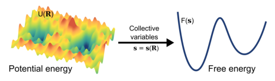

**Original caption:** FIG. 1: Timescales in MD simulations. MD simulations capture atomic motions across a broad range of timescales. Rare events such as chemical reactions, large-scale conformational changes in proteins, and phase transitions occur on timescales from microseconds (μs) to days, far beyond the reach of standard MD. To efficiently access these rare events, enhanced sampling techniques are indispensable. The bottom panel illustrates the approximate timescales accessible by different classes of potential energy models.

**中文图注:** 如图。 1：MD 模拟中的时间尺度。 MD 模拟捕捉广泛时间尺度内的原子运动。化学反应、蛋白质大规模构象变化和相变等罕见事件发生的时间尺度从微秒 (μs) 到天，远远超出了标准 MD 的范围。为了有效地获取这些罕见事件，增强的采样技术是必不可少的。底部面板说明了不同类别的势能模型可访问的大致时间尺度。

**Reading note / 阅读提示：** Inspect this visual together with the immediately preceding source block; it is placed at the first substantive discussion available in the extracted text.

**Source:** p.2 S016

**Original:** 2 FUNDAMENTALS OF ML-BASED ENHANCED SAMPLING

**中文:** 2 基于 ML 的增强采样的基础知识

**Source:** p.2 S017

**Original:** for data-driven approaches that can integrate physical intuition with powerful statistical tools to efficiently explore and understand the relevant regions of phase space. In recent years, machine learning (ML) has emerged as a transformative technology for many fields, and atomistic simulations are no exception, see for instance the review by Noe et al.10 and the Chemical Reviews special issue "Machine Learning at the Atomic Scale"11. ML has significantly impacted several aspects of atomistic modeling. These tools are indeed particularly useful for learning structural representations12 and uncovering meaningful patterns from a large amount of data13. Beyond constructing accurate PESs5,14, ML has enabled large-scale computational discovery15 and exploration of chemical compound space16. The field of enhanced sampling has likewise been profoundly influenced by ML17–20, from the datadriven identification of CVs to the development of novel biasing schemes and advanced post-processing tools. On one hand, this review aims to provide a comprehensive methodological overview of the integration of ML and enhanced sampling techniques. On the other hand, we also seek to offer a perspective to readers more interested in applying this computational microscope to their own problems of interest. To this end, we will present applications across diverse areas, highlighting the requirements and challenges involved in deploying such models in practice. Relevant areas include the study of biological conformational changes, such as protein folding and the thermodynamics and kinetics of ligand binding. Other important fields of application are chemical and catalytic reactions, as well as structural phase transformations. In all these domains, the integration of ML and enhanced sampling has provided crucial insights into atomistic mechanisms, effectively focusing the lens of our computational microscope on rare events. The period covered by this review is approximately from 2018 to 2025. The structure of the manuscript is as follows: Sec. 2 provides a brief overview of the fundamentals of enhanced sampling and a glossary of ML. Sec. 3 focuses on the construction of machine learning collective variables, while Sec. 4 illustrates relevant applications to different areas of molecular simulations. In Sec. 5, we discuss how ML methodologies have been integrated to improve the construction of biasing schemes. Sec. 6 highlights the emerging role of generative models in improving sampling efficiency. Finally, we offer our perspectives on current challenges and future research directions in the field of enhanced sampling and its integration with ML.

**中文:** 数据驱动的方法可以将物理直觉与强大的统计工具相结合，以有效地探索和理解相空间的相关区域。近年来，机器学习 (ML) 已成为许多领域的变革性技术，原子模拟也不例外，例如参见 Noe 等人的评论10 和化学评论特刊“原子尺度的机器学习”11。机器学习对原子建模的多个方面产生了重大影响。这些工具确实对于学习结构表示12 和从大量数据中揭示有意义的模式13 特别有用。除了构建精确的 PES5,14 之外，机器学习还实现了大规模计算发现 15 和化合物空间探索 16。增强采样领域同样受到 ML17-20 的深刻影响，从数据驱动的 CV 识别到新颖的偏置方案和先进的后处理工具的开发。一方面，本次综述旨在对机器学习和增强采样技术的集成提供全面的方法学概述。另一方面，我们也试图为那些更有兴趣将这种计算显微镜应用到他们自己感兴趣的问题的读者提供一个视角。为此，我们将展示跨不同领域的应用程序，强调在实践中部署此类模型所涉及的要求和挑战。相关领域包括生物构象变化的研究，例如蛋白质折叠以及配体结合的热力学和动力学。其他重要的应用领域是化学和催化反应以及结构相变。在所有这些领域中，机器学习和增强采样的集成为原子机制提供了重要的见解，有效地将我们的计算显微镜的镜头聚焦在罕见事件上。本次审查涵盖的时期约为2018年至2025年。手稿的结构如下：图 2 简要概述了增强采样的基础知识和 ML 术语表。秒。第 3 节重点关注机器学习集体变量的构建，而第 3 节则侧重于机器学习集体变量的构建。图4说明了分子模拟不同领域的相关应用。在秒。在图 5 中，我们讨论了如何集成 ML 方法来改进偏置方案的构建。秒。图 6 强调了生成模型在提高采样效率方面的新兴作用。最后，我们对增强采样及其与机器学习的集成领域当前的挑战和未来的研究方向提出了我们的看法。

**Source:** p.2 S018

**Original:** 2 Fundamentals of ML-based enhanced sampling

**中文:** 2 基于机器学习的增强采样的基础知识

**Source:** p.2 S019

**Original:** In this section, we present some fundamental elements of the fields of enhanced sampling simulations and ML. Such information is reported in a very concise way, more intended to refresh some key concepts that will be recurrent throughout the review rather

**中文:** 在本节中，我们将介绍增强采样模拟和机器学习领域的一些基本要素。这些信息以非常简洁的方式报告，更多的是为了刷新一些关键概念，这些概念将在整个审查过程中反复出现，而不是

## Page 3

**Source:** p.3 S020

**Original:** than formally discussing them at length, as more detailed information is already provided in some recent reviews. In particular, for a comprehensive review of enhanced sampling in atomistic simulations, we refer the reader to Refs. 7,8,21, whereas for an overview of ML methods and their application to science, we refer to Refs. 10,22–25.

**中文:** 而不是正式详细讨论它们，因为最近的一些评论中已经提供了更详细的信息。特别是，为了全面回顾原子模拟中的增强采样，我们建议读者参考参考文献。 7,8,21，而对于 ML 方法及其在科学中的应用的概述，我们参考 Refs。 10,22–25。

**Source:** p.3 S021

**Original:** 2.1 Atomistic simulations

**中文:** 2.1 原子模拟

**Source:** p.3 S022

**Original:** Atomistic simulations, such as MD, allow to study physical, chemical, and biological systems at the atomic scale, offering microscopic insight into their behavior and enabling the computation of physical and chemical properties1. Central to these simulations is the PES U(R), which governs the interactions between atoms as a function of the atomic coordinates R. This quantity can be described using a variety of models, ranging from quantum-mechanical ab initio methods and empirical force fields to ML potentials or coarse-grained models. Given a model for the PES, the equilibrium properties of a system in the canonical ensemble (constant number of particles N, volume V, and temperature T) are described within the framework of statistical mechanics by the Boltzmann distribution:

**中文:** 原子模拟（例如MD）允许在原子尺度上研究物理、化学和生物系统，提供对其行为的微观洞察，并能够计算物理和化学特性1。这些模拟的核心是 PES U(R)，它控制原子之间的相互作用作为原子坐标 R 的函数。这个量可以使用各种模型来描述，从量子力学从头算方法和经验力场到 ML 势或粗粒度模型。给定 PES 模型，正则系综中系统的平衡特性（粒子数量 N、体积 V 和温度 T 恒定）在统计力学框架内通过玻尔兹曼分布进行描述：

**Source:** p.3 S023

**Original:** p(R) = 1

**中文:** p(R) = 1

**Source:** p.3 S024

**Original:** Z e−βU(R) (1)

**中文:** Z e−βU(R) (1)

**Source:** p.3 S025

**Original:** where β = 1/(kBT) is the inverse temperature, kB is the Boltzmann constant, and the partition function Z = R dR e−βU(R) ensures normalization. Sampling this distribution is central to atomistic simulations, as it enables the computation of equilibrium properties

**中文:** 其中 β = 1/(kBT) 是温度的倒数，kB 是玻尔兹曼常数，配分函数 Z = R dR e−βU(R) 确保归一化。对该分布进行采样是原子模拟的核心，因为它可以计算平衡属性

**Source:** p.3 S026

**Original:** as ensemble averages:

**中文:** 作为整体平均值：

**Source:** p.3 S027

**Original:** ⟨O(R)⟩= Z dR O(R)p(R) (2)

**中文:** ⟨O(R)⟩= Z dR O(R)p(R) (2)

**Source:** p.3 S028

**Original:** This can be accomplished through computational approaches such as Monte Carlo or MD simulations. In this review, we mostly focus on the latter, which not only enable sampling from equilibrium distributions but also provide access to time-dependent dynamical information by integrating Newton’s equations of motion.

**中文:** 这可以通过蒙特卡罗或 MD 模拟等计算方法来完成。在这篇评论中，我们主要关注后者，它不仅能够从平衡分布中采样，而且还可以通过积分牛顿运动方程来提供与时间相关的动态信息。

**Source:** p.3 S029

**Original:** However, sampling the Boltzmann distribution for complex systems is highly challenging. For a system of N atoms, the configuration space has 3N −1 degrees of freedom, making a direct exploration of p(R) intractable. To mitigate this complexity, it is common to reduce the dimensionality of the problem by introducing a set of CVs, s = s(R), which are functions of the atomic coordinates. These CVs are often designed to capture the slow and thermodynamically relevant modes of the system, conceptually similar to reaction coordinates in chemistry or order parameters in statistical physics. The equilibrium distribution along the

**中文:** 然而，对复杂系统的玻尔兹曼分布进行采样非常具有挑战性。对于 N 原子系统，构型空间具有 3N -1 个自由度，使得直接探索 p(R) 变得困难。为了减轻这种复杂性，通常通过引入一组 CV s = s(R)（原子坐标的函数）来降低问题的维数。这些 CV 通常旨在捕获系统的慢速和热力学相关模式，概念上类似于化学中的反应坐标或统计物理学中的有序参数。沿平衡分布

## Page 4

**Source:** p.4 S030

**Original:** CVs is obtained by marginalizing the full distribution:

**中文:** CV 是通过边缘化完整分布获得的：

**Source:** p.4 S031

**Original:** p(s) = Z dR δ[s −s(R)]p(R) = ⟨δ[s −s(R)]⟩ (3)

**中文:** p(s) = Z dR δ[s −s(R)]p(R) = ⟨δ[s −s(R)]⟩ (3)

**Source:** p.4 S032

**Original:** which in turn defines the free energy surface (FES):

**中文:** 这又定义了自由能面 (FES)：

**Source:** p.4 S033

**Original:** F(s) = −1

**中文:** F(s) = −1

**Source:** p.4 S034

**Original:** β log p(s) (4)

**中文:** β log p(s) (4)

**Source:** p.4 S035

**Original:** The FES provides a low-dimensional - and typically smoother - thermodynamic landscape of the system, which also accounts for entropic contributions, with metastable states corresponding to local minima and reaction pathways to transitions between them (Fig. 2). The other element of complexity stems from the fact that transitions between metastable states typically involve crossing large free energy barriers and are rarely observed in standard MD simulations, leading to inefficient sampling. This issue is particularly pronounced in systems where the relevant transitions are rare events, occurring on timescales many orders of magnitude longer than those accessible by conventional simulations. A prototypical example is the folding of a protein from an extended to a native conformation, which, despite being thermodynamically favorable, often occurs over milliseconds or longer timescales, far beyond those typically accessible with standard MD.

**中文:** FES 提供了系统的低维且通常更平滑的热力学景观，这也解释了熵的贡献，亚稳态对应于局部最小值以及它们之间转变的反应路径（图 2）。复杂性的另一个因素源于这样一个事实：亚稳态之间的转变通常涉及跨越大的自由能垒，并且在标准 MD 模拟中很少观察到，从而导致采样效率低下。这个问题在相关转变是罕见事件的系统中尤其明显，发生的时间尺度比传统模拟可达到的时间尺度长许多数量级。一个典型的例子是蛋白质从延伸构象折叠到天然构象，尽管这种折叠在热力学上是有利的，但通常发生在几毫秒或更长的时间尺度上，远远超出了标准MD通常可达到的时间尺度。

### Fig. 001. 沿着一些 CV 投影，从高维且可能崎岖的 PES 到低维且平滑的 FES 的转换

**Placed near:** p.4 S035

**Source:** p.3 C001

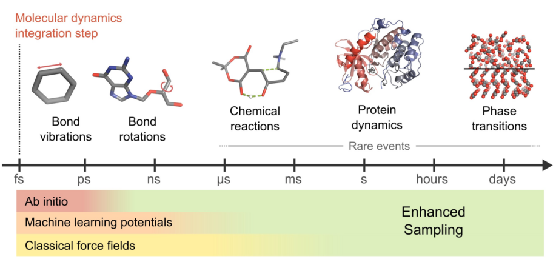

**Original caption:** FIG. 2: The transformation from the high-dimensional and possibly rugged PES to the low-dimensional and smooth FES projected along some CVs.

**中文图注:** 如图。图 2：沿着一些 CV 投影，从高维且可能崎岖的 PES 到低维且平滑的 FES 的转换。

**Reading note / 阅读提示：** Inspect this visual together with the immediately preceding source block; it is placed at the first substantive discussion available in the extracted text.

**Source:** p.4 S036

**Original:** 2.2 Enhanced sampling

**中文:** 2.2 增强抽样

**Source:** p.4 S037

**Original:** To address the challenge of rare events, several enhanced sampling methods have been developed. These techniques aim to accelerate the exploration of configuration space, enabling efficient sampling of rare transitions. Below, we limit ourselves to outlining the three main families, examples of which are depicted in Fig. 3, and their characteristics to better understand how ML techniques have been integrated with them. For a high-level overview of the different approaches, see, for instance, the review by Pietrucci26, while for a more detailed discussion, see the review by Henin et al.7. CV-based enhanced sampling. In the first family of methods, a bias potential V (s) is introduced to modify the effective PES experienced by the system in the space of a few selected CVs. The goal of this bias is to facilitate the exploration of rarely visited regions, which are typically separated by high free energy barriers, while preserving the ability to reconstruct the unbiased thermodynamics through reweighting. For an introduction, see, for instance, the review by Valsson et al.8. One of the earliest strategies to enhance the sampling along a CV is umbrella sampling27. In this method, the system is simulated under a set of fixed external (harmonic) bias potentials centered at different CV values. These simulations, referred to as windows or umbrellas, collectively span the relevant region of the CV space. The data from different windows are then combined using the weighted histogram analysis method (WHAM)28,29 or umbrella

**中文:** 为了应对罕见事件的挑战，已经开发了几种增强采样方法。这些技术旨在加速对配置空间的探索，从而实现对罕见转变的有效采样。下面，我们仅概述三个主要系列（图 3 中所示的示例）及其特征，以更好地理解 ML 技术如何与它们集成。有关不同方法的高级概述，请参阅 Pietrucci26 的评论，而有关更详细的讨论，请参阅 Henin 等人的评论7。基于 CV 的增强采样。在第一类方法中，引入偏置电势 V(s) 来修改系统在几个选定的 CV 空间中经历的有效 PES。这种偏差的目标是促进对很少访问的区域的探索，这些区域通常被高自由能势垒隔开，同时保留通过重新加权重建无偏差热力学的能力。有关介绍，请参阅 Valsson 等人的评论 8。沿 CV 增强采样的最早策略之一是伞式采样27。在此方法中，系统在一组以不同 CV 值为中心的固定外部（谐波）偏置电位下进行仿真。这些模拟被称为窗户或伞，共同跨越 CV 空间的相关区域。然后使用加权直方图分析方法 (WHAM)28,29 或伞式组合来自不同窗口的数据

### Fig. 003. (A) 基于 CV 的增强采样方法的示意图，以元动力学为例。最初，系统被限制在局

**Placed near:** p.4 S037

**Source:** p.5 C003

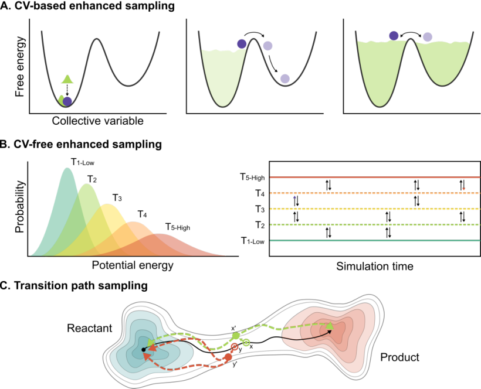

**Original caption:** FIG. 3: (A) Schematic representation of CV-based enhanced sampling methods, exemplified by metadynamics. Initially, the system is confined in a local free energy minimum. As the bias accumulates, it reduces energy barriers and promotes transitions between metastable states. Eventually, the FES is flattened, allowing uniform exploration. (B) An example of CV-free enhanced sampling with REMD. Multiple simulations are run in parallel with different parameters (e.g., temperatures) and exchanges between them are attempted according to the Metropolis criterion. (C) Schematic representation of TPS, exemplified by the shooting method. Starting from an initial reactive trajectory (solid black line), a configuration is randomly selected and slightly perturbed to create new initial conditions (e.g., x′, green, or y′, red). Two MD simulations are launched forward and backward in time. Trajectories connecting distinct stable states (dashed green line) are accepted, while those returning to the same basin (dashed red line) are discarded.

**中文图注:** 如图。图 3：(A) 基于 CV 的增强采样方法的示意图，以元动力学为例。最初，系统被限制在局部自由能最小值内。随着偏置的积累，它会减少能量势垒并促进亚稳态之间的转变。最终，FES 被扁平化，允许统一的探索。 (B) 使用 REMD 进行无 CV 增强采样的示例。使用不同的参数（例如温度）并行运行多个模拟，并根据 Metropolis 标准尝试它们之间的交换。 (C) TPS 示意图，以射击方法为例。从初始反应轨迹（黑色​​实线）开始，随机选择一个配置并稍微扰动以创建新的初始条件（例如，x'，绿色，或 y'，红色）。两个 MD 模拟在时间上向前和向后启动。连接不同稳定状态的轨迹（绿色虚线）被接受，而返回同一盆地的轨迹（红色虚线）被丢弃。

**Reading note / 阅读提示：** Inspect this visual together with the immediately preceding source block; it is placed at the first substantive discussion available in the extracted text.

**Source:** p.4 S038

**Original:** 2 FUNDAMENTALS OF ML-BASED ENHANCED SAMPLING

**中文:** 2 基于 ML 的增强采样的基础知识

**Source:** p.4 S039

**Original:** integration30 to reconstruct the global FES. While effective, standard umbrella sampling requires a priori selection of bias centers and force constants, often involving trial-and-error. To address this limitation, adaptive umbrella sampling31 updates the bias iteratively based on the sampled distribution. Related approaches, such as self-healing umbrella sampling32

**中文:** 整合30以重建全球FES。标准伞式抽样虽然有效，但需要事先选择偏差中心和力常数，通常涉及反复试验。为了解决这个限制，自适应伞采样31根据采样的分布迭代更新偏差。相关方法，例如自愈伞采样32

**Source:** p.4 S040

**Original:** and local elevation33 also dynamically modify the bias to improve exploration of poorly sampled regions. Ideally, if the exact FES F(s) was known, one could apply a bias potential equal to its negative, V (s) = −F(s), which would flatten the free energy profile and lead to uniform sampling in the CV space. While this is not feasible in practice, many enhanced sampling methods are based on approximating or iteratively constructing such a bias during the course of the simulation. The most prominent among these is metadynamics34, schematically depicted in Fig. 3A, in which repulsive Gaussians are periodically deposited in the CV space, progressively filling and flattening the free energy landscape. Variants such as welltempered metadynamics35 introduce a tempering factor to ensure convergence. The free energy profile can then be reconstructed from the asymptotic profile of the bias, or via time-dependent reweighting schemes36. Another class of approaches directly estimates the gradient of the free energy surface from simulations. Adaptive biasing force (ABF)37 computes the average force acting along a CV and uses it to counteract the underlying free energy gradient. This approach avoids constructing the free energy explicitly, though multidimensional generalizations require numerical integration of the sampled gradient field38. Finally, other methods focus on the target distribution ptg(s) to be sampled, and then construct a bias potential that drives the system toward this distribution. Examples are the variationally enhanced sampling (VES)39 and the recent on-the-fly probability enhanced sampling (OPES)40. In the latter, the bias is defined as V (s) = 1

**中文:** 局部高程33还可以动态修改偏差，以改善对采样不良区域的探索。理想情况下，如果确切的 FES F(s) 已知，则可以施加等于其负值的偏置电势 V(s) = −F(s)，这将使自由能分布变平并导致 CV 空间中的均匀采样。虽然这在实践中不可行，但许多增强采样方法都是基于在模拟过程中近似或迭代构建这样的偏差。其中最突出的是元动力学34，如图 3A 所示，其中排斥高斯周期性地沉积在 CV 空间中，逐渐填充和展平自由能景观。诸如welltempered Metadynamics35之类的变体引入了一个调节因子以确保收敛。然后可以根据偏差的渐进分布或通过时间相关的重新加权方案重建自由能分布36。另一类方法直接通过模拟估计自由能表面的梯度。自适应偏置力 (ABF)37 计算沿 CV 作用的平均力，并用它来抵消潜在的自由能梯度。尽管多维概括需要采样梯度场的数值积分，但这种方法避免了明确地构造自由能。最后，其他方法关注要采样的目标分布 ptg(s)，然后构建驱动系统趋向该分布的偏置势。例如变分增强采样 (VES)39 和最近的动态概率增强采样 (OPES)40。在后者中，偏差定义为 V(s) = 1

**Source:** p.4 S041

**Original:** β log (p(s)/ptg(s)) , where p(s) is the equilibrium distribution estimated during the simulation via an on-the-fly reweighting of the trajectory data. The flexibility in choosing ptg(s) makes this approach highly versatile: with suitable choices, it can recover the same sampling distribution as well-tempered metadynamics, adaptive umbrella sampling, or generalized ensembles such as multithermal or multibaric ensembles41. Moreover, the reweighting procedure is greatly facilitated by the rapid convergence of the bias toward a quasi-static regime. For a practical overview on the different OPES variants, we refer the reader to the review by Trizio et al.42. CV-free enhanced sampling. Instead of focusing on the identification of appropriate variables, other methods aim to enhance the exploration of configuration space more generally, often by altering the thermodynamic ensemble or employing multiple replicas. A prominent class of such methods is based on generalized ensembles, where the system is allowed to sample from a more general probability distribution, such as the one obtained by combining multiple overlapping probability distributions. These are typically constructed to

**中文:** β log (p(s)/ptg(s)) ，其中 p(s) 是在模拟期间通过轨迹数据的动态重新加权估计的平衡分布。选择 ptg 的灵活性使得该方法具有高度通用性：通过适当的选择，它可以恢复与调和元动力学、自适应伞采样或广义系综（例如多热或多压系综）相同的采样分布41。此外，偏向准静态状态的快速收敛极大地促进了重新加权过程。有关不同 OPES 变体的实用概述，我们建议读者参阅 Trizio 等人的评论42。无 CV 增强采样。其他方法不是专注于识别适当的变量，而是旨在更普遍地增强对配置空间的探索，通常是通过改变热力学系综或采用多个副本。此类方法的一类突出的方法是基于广义集合，其中允许系统从更一般的概率分布中采样，例如通过组合多个重叠概率分布获得的概率分布。这些通常被构造为

## Page 5

**Source:** p.5 S042

**Original:** bridge an easily sampled distribution (such as one at high temperature), with the target distribution of interest (low temperature). Enhanced sampling is then achieved by allowing coordinated exchanges between replicas simulated under different conditions, which promotes transitions across energy barriers that would otherwise be rarely crossed in standard simulations. Examples of these methods include parallel tempering or replica exchange (REX)43–45, as well as solute tempering approaches46,47, where only part of the system (e.g., the solute) is tempered, allowing more focused acceleration of relevant degrees of freedom. Another class of CV-free methods enhances sampling by adding a boost potential that effectively smooths the PES. Notable examples include accelerated molecular dynamics (aMD)48 and Gaussian accelerated molecular dynamics (GaMD)49. In GaMD, a boost potential with a near-Gaussian distribution is applied whenever the system’s potential energy falls below a predefined threshold. At the end of the simulation, a cumulant expansion is used to reconstruct unbiased thermodynamic averages, a procedure referred to as “Gaussian approximation”.

**中文:** 将易于采样的分布（例如高温分布）与感兴趣的目标分布（低温）联系起来。然后，通过允许在不同条件下模拟的副本之间进行协调交换来实现增强采样，这促进了跨越能量壁垒的转变，否则在标准模拟中很少会跨越这些能量壁垒。这些方法的例子包括平行回火或复制交换（REX）43-45，以及溶质回火方法46,47，其中仅系统的一部分（例如溶质）被回火，从而允许更集中地加速相关自由度。另一类无 CV 方法通过添加有效平滑 PES 的提升电位来增强采样。著名的例子包括加速分子动力学 (aMD)48 和高斯加速分子动力学 (GaMD)49。在 GaMD 中，只要系统的势能低于预定义的阈值，就会应用接近高斯分布的升压势。在模拟结束时，使用累积量展开来重建无偏热力学平均值，该过程称为“高斯近似”。

**Source:** p.5 S043

**Original:** Path sampling. A third category of methods enhances the exploration of rare events by performing a Monte Carlo simulation in path space rather than configuration space, such as transition path sampling (TPS)50. For more details, see also the recent perspective by Bolhouis and Swenson51. At variance with previous methods, which modify the PES to accelerate the sampling of rare events, TPS focuses on generating an ensemble of unbiased reactive trajectories, which is known as the transition path ensemble. In fact, this can provide insight into the unbiased mechanisms underlying rare events. To achieve this goal, one is required to define Monte Carlo moves to create a new pathway from a previous one. A typical TPS move, called shooting, perturbs a configuration along a reactive trajectory and integrates the dynamics forward and backward in time to generate a new path50. The new path is then accepted or rejected based on whether it connects distinct metastable states. Further extensions also allow for computing kinetic rates52,53 as well as to reconstruct the free energy profiles54.

**中文:** 路径采样。第三类方法通过在路径空间而不是配置空间中执行蒙特卡罗模拟来增强对罕见事件的探索，例如转移路径采样（TPS）50。有关更多详细信息，另请参阅 Bolhouis 和 Swenson51 最近的观点。与之前修改 PES 以加速罕见事件采样的方法不同，TPS 专注于生成无偏反应轨迹的集合，称为过渡路径集合。事实上，这可以深入了解罕见事件背后的公正机制。为了实现这一目标，需要定义蒙特卡罗移动，以从以前的路径创建一条新路径。典型的 TPS 移动（称为射击）会沿着反应轨迹扰动配置，并及时整合前后动态以生成新的路径 50。然后根据新路径是否连接不同的亚稳态来接受或拒绝。进一步的扩展还允许计算动力学速率 52,53 以及重建自由能分布 54。

**Source:** p.5 S044

**Original:** Enhanced sampling software. Here we highlight

**中文:** 增强的采样软件。这里我们重点强调

## Page 6

**Source:** p.6 S045

**Original:** the main software packages for performing enhanced sampling simulations, with growing support for integration with ML libraries such as PyTorch and TensorFlow.

**中文:** 用于执行增强采样模拟的主要软件包，越来越多地支持与 PyTorch 和 TensorFlow 等 ML 库的集成。

**Source:** p.6 S046

**Original:** PLUMED55,56 is a widely used open-source plugin for enhanced sampling and free energy calculations that can be interfaced with most classical and ab initio MD engines, including AMBER, GROMACS, LAMMPS, NAMD, OpenMM, CP2K, Quantum Espresso. It supports a broad range of methods, including metadynamics, VES, and OPES, and provides an extensive library of CVs. In addition to enhanced sampling, PLUMED offers standalone tools for post-processing and trajectory analysis. It is a community-driven project that promotes reproducibility through PLUMED-NEST57, a repository for input files, and supports learning via the user-contributed PLUMED Tutorials58. Conveniently, it also provides a native interface for PyTorch-based MLCVs through the additional pytorch module59,60.

**中文:** PLUMED55,56 是一种广泛使用的开源插件，用于增强采样和自由能计算，可以与大多数经典和从头开始的 MD 引擎连接，包括 AMBER、GROMACS、LAMMPS、NAMD、OpenMM、CP2K、Quantum Espresso。它支持多种方法，包括元动力学、VES 和 OPES，并提供广泛的 CV 库。除了增强采样之外，PLUMED 还提供用于后处理和轨迹分析的独立工具。这是一个社区驱动的项目，通过输入文件存储库 PLUMED-NEST57 提高可重复性，并通过用户贡献的 PLUMED 教程 58 支持学习。方便的是，它还通过附加的 pytorch 模块 59,60 为基于 PyTorch 的 MLCV 提供本机接口。

**Source:** p.6 S047

**Original:** Colvars61 is directly integrated into several widely used classical MD engines, including NAMD, LAMMPS, and GROMACS. It allows users to define a wide range of CVs and apply enhanced sampling methods such as adaptive biasing force, metadynamics, and umbrella sampling.

**中文:** Colvars61 直接集成到多种广泛使用的经典 MD 引擎中，包括 NAMD、LAMMPS 和 GROMACS。它允许用户定义广泛的 CV 并应用增强的采样方法，例如自适应偏置力、元动力学和伞采样。

**Source:** p.6 S048

**Original:** SSAGES62 is a modular and extensible framework for enhanced sampling simulations. It interfaces with classical MD engines like LAMMPS, GROMACS, and OpenMD and supports both CV-based methods and path-based techniques such as the string method and forward flux sampling. Finally, to perform transition path sampling simulations, Python libraries such as OpenPathSampling63,64

**中文:** SSAGES62 是一个用于增强采样模拟的模块化且可扩展的框架。它与 LAMMPS、GROMACS 和 OpenMD 等经典 MD 引擎接口，并支持基于 CV 的方法和基于路径的技术，例如字符串方法和前向通量采样。最后，为了执行过渡路径采样模拟，需要使用 OpenPathSampling63,64 等 Python 库

**Source:** p.6 S049

**Original:** and PyRETIS65–67 provide tools to construct and analyze ensembles of reactive trajectories.

**中文:** PyRETIS65-67 提供了构建和分析反应轨迹集合的工具。

**Source:** p.6 S050

**Original:** 2.3 Glossary of machine learning

**中文:** 2.3 机器学习术语

**Source:** p.6 S051

**Original:** ML is a broad field encompassing computational and statistical techniques designed to automatically extract patterns and learn from data, which has become ubiquitous in recent years. In this section, we provide a brief and essential overview, contextualized to the field of atomistic simulations, of some of the key concepts that will be recurrent in the rest of the review: learning approaches, data types, architectures, and loss functions. For Readers seeking a more comprehensive introduction to ML, we refer them to specialized literature, for example, the recent book by Bishop and Bishop22 or the introduction by Mehta et al.68. Types of data. At the core of any ML approach lies the data, which can be used for training (i.e., optimizing the model on available information) or for inference (i.e., making predictions with a trained model on new inputs). Broadly speaking, datasets can be categorized based on the amount and type of information provided, which in turn determines the appropriate learning strategy (see below). In the most general case, the dataset consists of a collection of raw samples, such as images, atomic configurations, or scalar properties, without additional annotations (unlabeled

**中文:** 机器学习是一个广泛的领域，涵盖计算和统计技术，旨在自动提取模式并从数据中学习，近年来已变得无处不在。在本节中，我们根据原子模拟领域的背景，提供了一个简短而重要的概述，其中包括一些将在其余评论中反复出现的关键概念：学习方法、数据类型、架构和损失函数。对于寻求更全面的 ML 介绍的读者，我们建议他们参考专业文献，例如 Bishop 和 Bishop22 最近出版的书籍或 Mehta 等人的介绍68。数据类型。任何机器学习方法的核心都是数据，数据可用于训练（即根据可用信息优化模型）或推理（即使用经过训练的模型根据新输入进行预测）。一般来说，数据集可以根据提供的信息的数量和类型进行分类，这反过来又决定了适当的学习策略（见下文）。在最一般的情况下，数据集由原始样本的集合组成，例如图像、原子配置或标量属性，没有额外的注释（未标记的

**Source:** p.6 S052

**Original:** 2 FUNDAMENTALS OF ML-BASED ENHANCED SAMPLING

**中文:** 2 基于 ML 的增强采样的基础知识

**Source:** p.6 S053

**Original:** datasets). In contrast, labeled datasets associate each sample with one or more labels that encode target properties the model is expected to learn. For example, in a set of animal pictures, each one could be labeled with the corresponding species, or, in the case of an atomic system, a given configuration can be labeled with the corresponding energy value. A relevant subclass of labeled data is that of time series or sequences, where each sample is accompanied by a timestamp or ordering index. This temporal structure enables the learning of sequential or dynamic relationships. Examples include sequences of atomic configurations collected during a simulation or word tokens in a sentence. Learning approaches. ML models can be trained using different learning paradigms, each suited to specific types of data and tasks. These paradigms also dictate the form of the loss function used during optimization. In supervised learning, the model learns from labeled data by minimizing a loss that quantifies the mismatch between predictions and known labels. This setting is typical for tasks such as classification (e.g., image recognition) or regression (e.g., predicting the energy of molecular structures). In unsupervised learning, the model is trained without labeled inputs and instead seeks to discover hidden structures in the data, such as clusters, manifolds, or latent variables. Typical algorithms include clustering and dimensionality reduction; see the reviews by Glielmo et al.13

**中文:** 数据集）。相反，标记数据集将每个样本与一个或多个标签相关联，这些标签对模型预期学习的目标属性进行编码。例如，在一组动物图片中，每张图片都可以用相应的物种来标记，或者，在原子系统的情况下，给定的配置可以用相应的能量值来标记。标记数据的相关子类是时间序列或序列，其中每个样本都附有时间戳或排序索引。这种时间结构使得能够学习顺序或动态关系。示例包括在模拟过程中收集的原子配置序列或句子中的单词标记。学习方法。机器学习模型可以使用不同的学习范式进行训练，每种范式都适合特定类型的数据和任务。这些范例还规定了优化过程中使用的损失函数的形式。在监督学习中，模型通过最小化量化预测与已知标签之间不匹配的损失来从标记数据中学习。此设置通常适用于分类（例如图像识别）或回归（例如预测分子结构的能量）等任务。在无监督学习中，模型在没有标记输入的情况下进行训练，而是寻求发现数据中的隐藏结构，例如聚类、流形或潜在变量。典型的算法包括聚类和降维；参见 Glielmo 等人的评论 13

**Source:** p.6 S054

**Original:** and by Ceriotti69. A third paradigm is reinforcement learning, where learning is driven by interactions between an agent (the model) and an environment (data or simulation). The agent makes decisions and receives feedback in the form of rewards or penalties. The model is optimized to maximize the cumulative reward, allowing it to improve its behavior over time through trial and error. Loss functions. Training a ML model requires formalizing its learning objective as a loss function, which quantifies how far the model’s predictions deviate from the desired outcomes. The optimization then proceeds by adjusting model parameters to minimize this loss, for instance, using gradient-based methods such as stochastic gradient descent in the case of neural networks. In addition, multiple loss functions aiming at different learning objectives can also be combined and minimized simultaneously to enforce different properties into a single model. In the following, we describe some of the commonly used loss functions in ML as well as in the physical sciences. In regression tasks, the mean squared error (MSE) is frequently used. Given a set of N predicted values xi and target values x′ i, the MSE is defined as:

**中文:** 和塞里奥蒂69。第三种范式是强化学习，其中学习是由代理（模型）和环境（数据或模拟）之间的交互驱动的。代理做出决策并以奖励或惩罚的形式接收反馈。该模型经过优化，可以最大限度地提高累积奖励，从而使其能够随着时间的推移通过反复试验来改进其行为。损失函数。训练 ML 模型需要将其学习目标形式化为损失函数，该函数量化模型的预测与期望结果的偏差程度。然后，通过调整模型参数以最小化这种损失来进行优化，例如，使用基于梯度的方法，例如神经网络中的随机梯度下降。此外，针对不同学习目标的多个损失函数也可以组合并同时最小化，以将不同的属性强制到单个模型中。下面，我们将描述机器学习和物理科学中的一些常用损失函数。在回归任务中，经常使用均方误差（MSE）。给定一组 N 个预测值 xi 和目标值 x′ i，MSE 定义为：

**Source:** p.6 S055

**Original:** N X

**中文:** 尼克斯

**Source:** p.6 S056

**Original:** LMSE = 1

**中文:** 最小均方误差 = 1

**Source:** p.6 S057

**Original:** i=1 |xi −x′ i|2 (5)

**中文:** i=1 |xi −x′ i|2 (5)

**Source:** p.6 S058

**Original:** When comparing predicted and reference probability distributions, the Kullback-Leibler (KL) divergence is commonly used. Given two distributions P(x) and Q(x), the KL divergence is defined as

**中文:** 在比较预测概率分布和参考概率分布时，通常使用 Kullback-Leibler (KL) 散度。给定两个分布 P(x) 和 Q(x)，KL 散度定义为

**Source:** p.6 S059

**Original:** x P(x) log P(x)

**中文:** x P(x) 对数 P(x)

**Source:** p.6 S060

**Original:** DKL(P||Q) = X

**中文:** DKL(P||Q) = X

**Source:** p.6 S061

**Original:** Q(x) (6)

**中文:** Q(x) (6)

## Page 7

**Source:** p.7 S062

**Original:** It quantifies how much information is lost when using Q to approximate P, and it is widely used in variational inference and generative modeling. Another important principle is that of maximum likelihood estimation (MLE), which aims to find model parameters θ that maximize the likelihood of observing the training data under a model distribution Qθ(x), defined as

**中文:** 它量化了使用 Q 近似 P 时丢失了多少信息，广泛应用于变分推理和生成建模中。另一个重要原理是最大似然估计（MLE），其目的是找到模型参数 θ，使在模型分布 Qθ(x) 下观察训练数据的可能性最大化，定义为

**Source:** p.7 S063

**Original:** N Y

**中文:** 纽约

**Source:** p.7 S064

**Original:** p(x|θ) =

**中文:** p(x|θ) =

**Source:** p.7 S065

**Original:** i=1 Qθ(xi) (7)

**中文:** i=1 Qθ(xi) (7)

**Source:** p.7 S066

**Original:** In practice, more commonly the log-likelihood is minimized, since it is numerically more stable:

**中文:** 在实践中，更常见的是对数似然被最小化，因为它在数值上更稳定：

**Source:** p.7 S067

**Original:** N X

**中文:** 尼克斯

**Source:** p.7 S068

**Original:** −log p(x|θ) = −

**中文:** −log p(x|θ) = −

**Source:** p.7 S069

**Original:** i=1 log Qθ(xi) (8)

**中文:** i=1 log Qθ(xi) (8)

**Source:** p.7 S070

**Original:** Architectures. The architecture of a ML model defines the structure of the function fθ, parameterized by trainable weights θ, used to map inputs to outputs. The required complexity of the architecture is not solely determined by the difficulty of the task, but also, crucially, by the quality and expressiveness of the input features. If the input representation already encodes relevant symmetries, invariances, or physically meaningful correlations, even relatively simple models may suffice. Conversely, when using raw or generic features, the architecture must compensate by being more expressive, often at the cost of interpretability, computational efficiency, or data efficiency. In the following, we briefly discuss some important families. Kernel-based models compute similarities between inputs using a kernel function K(xi, xj), which implicitly maps data to a high-dimensional feature space:

**中文:** 架构。 ML 模型的架构定义了函数 fθ 的结构，由可训练权重 θ 参数化，用于将输入映射到输出。架构所需的复杂性不仅取决于任务的难度，更重要的是取决于输入特征的质量和表达能力。如果输入表示已经编码了相关的对称性、不变性或物理上有意义的相关性，那么即使相对简单的模型也可能足够了。相反，当使用原始或通用特征时，架构必须通过更具表现力来进行补偿，这通常会以可解释性、计算效率或数据效率为代价。下面，我们简要讨论一些重要的家庭。基于核的模型使用核函数 K(xi, xj) 计算输入之间的相似性，该函数隐式地将数据映射到高维特征空间：

**Source:** p.7 S071

**Original:** K(xi, xj) = ⟨φ(xi), φ(xj)⟩ (9)

**中文:** K(xi, xj) = ⟨φ(xi), φ(xj)⟩ (9)

**Source:** p.7 S072

**Original:** where φ is an implicit (and typically infinitedimensional) feature map. These methods are typically data-efficient and offer strong theoretical guarantees. Feed-forward neural networks (FNNs) represent functions as compositions of simpler transformations fi, typically involving linear layers, characterized by weights W and biases b and nonlinear activation functions σ:

**中文:** 其中 φ 是隐式（通常是无限维）特征图。这些方法通常数据效率高，并提供强有力的理论保证。前馈神经网络 (FNN) 将函数表示为更简单变换 fi 的组合，通常涉及线性层，其特征为权重 W 和偏差 b 以及非线性激活函数 σ：

**Source:** p.7 S073

**Original:** fθ(x) = fL ◦fL−1 ◦· · · ◦f1(x), fi(x) = σ(Wix + bi) (10)

**中文:** fθ(x) = fL ◦fL−1 ◦· · · ◦f1(x), fi(x) = σ(Wix + bi) (10)

**Source:** p.7 S074

**Original:** Their compositional nature enables them to learn complex hierarchical representations from data, and they are widely used in regression, classification, and representation learning tasks. Graph neural networks (GNNs) are tailored for structured data, such as molecular graphs, where atoms and bonds are naturally represented as nodes and edges. These models iteratively update node features by exchanging messages with neighboring nodes:

**中文:** 它们的组合性质使它们能够从数据中学习复杂的层次表示，并且它们广泛用于回归、分类和表示学习任务。图神经网络 (GNN) 是为结构化数据量身定制的，例如分子图，其中原子和键自然地表示为节点和边。这些模型通过与相邻节点交换消息来迭代更新节点特征：

**Source:** p.7 S075

**Original:** j∈N(i) M  h(t) i , h(t) j , eij  

**中文:** j∈N(i) M h(t) i , h(t) j , eij 

**Source:** p.7 S076

**Original:** h(t+1) i = U

**中文:** h(t+1) i = U

**Source:** p.7 S077

**Original:** h(t) i , X

**中文:** -h(t) i , X

**Source:** p.7 S078

**Original:**  (11)

**中文:**  (11)

**Source:** p.7 S079

**Original:** where h(t) i is the feature vector of node i at iteration t, eij encodes edge attributes, and M, U are learnable functions. This formulation allows GNNs to incorporate both the connectivity and geometry of atomic systems. More advanced and specialized architectures, such as those used in generative models, will be discussed in detail in the following sections.

**中文:** 其中 h(t) i 是节点 i 在迭代 t 时的特征向量，eij 编码边缘属性，M、U 是可学习函数。这个公式允许 GNN 结合原子系统的连接性和几何结构。更先进和专业的架构，例如生成模型中使用的架构，将在以下部分详细讨论。

**Source:** p.7 S080

**Original:** 3 Data-driven learning of collective variables

**中文:** 3 集体变量的数据驱动学习

**Source:** p.7 S081

**Original:** Key to the success of many enhanced sampling methods is the identification of suitable CVs. Traditionally, CVs have been constructed based on physical intuition by choosing quantities that are experimentally measurable or directly related to the nature of the process. Examples include torsional angles for conformational changes in molecules and proteins, distances associated with bond formation or breakage for chemical reactions, coordination numbers to describe solvent interaction, or angular order parameters to describe short-range order variation in a phase transition. However, these simple CVs can typically account only for a few specific degrees of freedom each, thus making it very likely to overlook important modes of the system. As a consequence, for a thorough description of complex processes, such as the conformational changes in large biological systems, one may need to use many such CVs to completely describe the relevant modes of the system that are related to the transitions between its long-lived metastable states. However, as the computational cost of many enhanced sampling techniques scales highly unfavorably with the number of CVs, this approach is bound to fail as the complexity of the studied process increases. Over the past decade, it has been widely proposed to improve the CV design process with the help of ML, that is, to learn the CVs directly from a given dataset, optimizing a model with learnable parameters following a suitable learning objective. These approaches have already proven effective on a variety of challenging systems, as we will see in Sec. 4. Many ways of expressing the CVs have been explored, ranging from linear combinations of primitive descriptors to using more complex approaches based on geometric GNNs, which operate directly on the atomic coordinates. Similarly, many different criteria for optimizing CV models have been proposed, from those derived from ML (e.g., supervised or unsupervised techniques) to physics-informed approaches based on learning dynamic operators or committor probabilities. The following section aims to provide an organic overview of such methods, trying to group them based on the spirit of their working principles. To this aim, we first discuss what good CVs are (Sec. 3 1), presenting this topic from different theoretical and practical points of view. Then, we provide an overview of the key ingredients of MLCV models (Sec. 3 2). Finally, we illustrate relevant methods proposed so far, grouped into two broad categories. First, we discuss approaches that exploit ML-derived techniques to obtain CV surrogates based on geometrical (i.e., struc-

**中文:** 许多增强抽样方法成功的关键是识别合适的 CV。传统上，CV 是基于物理直觉，通过选择可通过实验测量或与过程性质直接相关的量来构建的。例子包括分子和蛋白质构象变化的扭转角、与化学反应的键形成或断裂相关的距离、描述溶剂相互作用的配位数或描述相变中短程有序变化的角序参数。然而，这些简单的 CV 通常只能解释几个特定的​​自由度，因此很可能会忽略系统的重要模式。因此，为了全面描述复杂的过程，例如大型生物系统中的构象变化，人们可能需要使用许多这样的CV来完整地描述系统的相关模式，这些模式与其长寿命亚稳态之间的转变有关。然而，由于许多增强采样技术的计算成本与 CV 的数量密切相关，随着研究过程复杂性的增加，这种方法注定会失败。在过去的十年中，人们广泛提出在机器学习的帮助下改进 CV 设计过程，即直接从给定的数据集中学习 CV，根据合适的学习目标使用可学习参数优化模型。这些方法已经被证明在各种具有挑战性的系统上是有效的，正如我们将在第二节中看到的。 4. 人们已经探索了许多表达 CV 的方法，从原始描述符的线性组合到使用基于直接在原子坐标上运行的几何 GNN 的更复杂的方法。同样，人们提出了许多不同的优化 CV 模型的标准，从 ML 派生的标准（例如监督或无监督技术）到基于学习动态算子或提交者概率的物理信息方法。以下部分旨在对这些方法进行有机概述，并尝试根据其工作原则的精神对它们进行分组。为此，我们首先讨论什么是好的简历（第 3 节 1），从不同的理论和实践角度提出这个主题。然后，我们概述了 MLCV 模型的关键要素（第 3 节 2）。最后，我们说明了迄今为止提出的相关方法，分为两大类。首先，我们讨论利用 ML 派生技术来获取基于几何（即结构）的 CV 替代项的方法。

## Page 8

**Source:** p.8 S082

**Original:** tural) information, using techniques such as classification or dimensionality reduction (Sec. 3 3). Next, we will present methods in which ML is used as a tool to encode well-defined physical principles into CV models, such as parametrization of dynamic operators (Sec. 3 4) and committor functions (Sec. 3 5).

**中文:** tural）信息，使用分类或降维等技术（第 3 节 3）。接下来，我们将介绍使用 ML 作为工具将明确定义的物理原理编码到 CV 模型中的方法，例如动态算子的参数化（第 3 4 节）和提交者函数（第 3 5 节）。

**Source:** p.8 S083

**Original:** 3.1 What are good collective variables?

**中文:** 3.1 什么是好的集体变量？

**Source:** p.8 S084

**Original:** As introduced earlier, the concept of CVs is closely related to order parameters in physics and reaction coordinates in chemistry. CVs are mathematical functions of atomic coordinates, expressed as s = s(R), designed to provide a compact and meaningful representation of a reactive process. These variables play a crucial role both in data analysis and in enhanced sampling simulations. CVs should respect the intrinsic symmetries of the system, meaning they must be invariant under global rotations and translations, and sometimes also permutation of identical atoms. In the context of enhanced sampling, they must satisfy an additional requirement: they should be continuous and differentiable to ensure the smooth propagation of biasing forces. Indeed, for a one-dimensional CV s, the effective potential is expressed as:

**中文:** 如前所述，CV 的概念与物理学中的有序参数和化学中的反应坐标密切相关。 CV 是原子坐标的数学函数，表示为 s = s(R)，旨在提供反应过程的紧凑且有意义的表示。这些变量在数据分析和增强采样模拟中都发挥着至关重要的作用。 CV 应尊重系统的内在对称性，这意味着它们在全局旋转和平移下必须保持不变，有时在相同原子的排列下也必须保持不变。在增强采样的背景下，它们必须满足额外的要求：它们应该是连续且可微的，以确保偏置力的平滑传播。事实上，对于一维 CV ，有效势可表示为：

**Source:** p.8 S085

**Original:** Ubiased(R) = U(R) + V (s(R)) (12)

**中文:** Ubiased(R) = U(R) + V (s(R)) (12)

**Source:** p.8 S086

**Original:** and hence the force acting on atom i will be:

**中文:** 因此作用在原子 i 上的力将是：

**Source:** p.8 S087

**Original:** f (i) biased = −∇iU(R) −∂V

**中文:** f (i) 有偏 = −∇iU(R) −∂V

**Source:** p.8 S088

**Original:** ∂s ∇is. (13)

**中文:** ∂s ∇是。 (13)

**Source:** p.8 S089

**Original:** A key characteristic of a good CV is its ability to achieve dimensionality reduction. Since molecular systems with N atoms exist in a high-dimensional phase space of 3N dimensions, CVs should provide a lowdimensional representation, ideally in one or two dimensions, while still capturing the essential information about the process of interest. Without such a reduction, most analyses would become impractical or difficult to interpret, and CV-based enhanced sampling techniques would be infeasible. However, not every low-dimensional representation qualifies as a good CV. The representation must indeed encode the relevant physical or chemical information that characterizes the reactive process. One fundamental requirement is that a CV should be able to distinguish between different metastable and transition states, ensuring that configurations from distinct basins are mapped to separate regions of CV space and that transition pathways are clearly represented. This property is indeed crucial both for analysis and for applying enhanced sampling methods effectively. The latter scenario, to be effective, also requires the ability of CVs to capture the slowest modes of the system’s dynamics. These modes correspond to rare transitions between long-lived metastable states, which typically involve overcoming significant free energy barriers that hinder sampling. Identifying and representing these slowest modes is essential for constructing effective CVs, as they dictate the fundamental kinetics of the system.

**中文:** 良好 CV 的一个关键特征是其实现降维的能力。由于具有 N 原子的分子系统存在于 3N 维的高维相空间中，因此 CV 应该提供低维表示，最好是一维或二维，同时仍然捕获有关感兴趣过程的基本信息。如果没有这样的减少，大多数分析将变得不切实际或难以解释，并且基于 CV 的增强采样技术将不可行。然而，并非所有低维表示都符合良好的 CV 条件。该表示确实必须编码表征反应过程的相关物理或化学信息。一个基本要求是 CV 应能够区分不同的亚稳态和过渡态，确保将不同盆地的配置映射到 CV 空间的不同区域，并清楚地表示过渡路径。这一特性对于分析和有效应用增强采样方法确实至关重要。后一种情况要有效，还需要 CV 能够捕获系统动态的最慢模式。这些模式对应于长寿命亚稳态之间的罕见转变，这通常涉及克服阻碍采样的重要自由能障碍。识别和表示这些最慢的模式对于构建有效的 CV 至关重要，因为它们决定了系统的基本动力学。

**Source:** p.8 S090

**Original:** 3 DATA-DRIVEN LEARNING OF COLLECTIVE VARIABLES

**中文:** 3 数据驱动的集体变量学习

**Source:** p.8 S091

**Original:** From a theoretical standpoint, different approaches have been developed to rigorously define the slowest modes and establish criteria for selecting CVs. One widely used perspective is based on the committor function, which describes the probability that a given configuration will evolve toward a particular metastable state. A good CV should exhibit a strong correlation with this function, as the committor effectively encodes the progress of a transition (see also Sec. 3 5). Another perspective comes from spectral analysis, where CVs are chosen to approximate the eigenvectors of dynamical operators that govern system evolution. In particular, the first non-trivial eigenvectors of the transfer operator correspond to the slowest dynamical modes, making them valuable candidates for CV construction (see also Sec. 3 4). It is worth noting that these definitions have somewhat different scopes of applicability (such as a two-state scenario in the case of the committor or many states for the dynamical operators) and also requirements (such as the presence of a spectral gap for learning the dominant eigenfunctions, or data from the transition state region for the committor function).

**中文:** 从理论角度来看，人们已经开发出不同的方法来严格定义最慢的模式并建立选择 CV 的标准。一种广泛使用的观点是基于提交者函数，它描述了给定配置向特定亚稳态演化的概率。一份好的简历应该表现出与此功能的强相关性，因为提交者有效地编码了转换的进度（另请参见第 3 节 5）。另一种观点来自谱分析，其中选择 CV 来近似控制系统演化的动态算子的特征向量。特别是，传递算子的第一个非平凡特征向量对应于最慢的动态模式，使它们成为 CV 构造的有价值的候选者（另见第 3-4 节）。值得注意的是，这些定义的适用范围有所不同（例如提交者的两种状态场景或动态算子的许多状态）和要求（例如用于学习主要特征函数的谱间隙的存在，或来自提交者函数的过渡状态区域的数据）。

**Source:** p.8 S092

**Original:** 3.2 Ingredients of machine learning CVs

**中文:** 3.2 机器学习简历的组成部分

**Source:** p.8 S093

**Original:** Here, we briefly describe the three main ingredients that define a data-driven approach: the representation of the system (input features), the choice of model architecture, and the construction of the dataset, which are schematically depicted in Fig. 4. Input representation. The first ingredient is the choice of how to represent the system, that is, what constitutes the input of our ML model. A natural choice would be to use raw atomic coordinates; however, they do not inherently respect the relevant physical symmetries, such as rotational and translational invariance. Hence, some additional pre-processing step is required, such as aligning the system’s coordinate to a template structure. This option can be exploited when there are rigid motifs in the system and/or one is interested in conformational changes, while care should be taken in the case of reactive events. Alternatively, the invariance under the rototranslational symmetry can be implicitly learned with a data-augmentation scheme, in which the training dataset is augmented by randomly rotating and translating the input coordinate structures while keeping the same target. Finally, geometric GNNs provide a more elegant (and expensive) solution by representing atoms as graph nodes, naturally encoding relational information while maintaining symmetry invariance or equivariance. An alternative way to encode the physical symmetries is to construct descriptors to represent the system (featurization). Simple physical quantities, such as interatomic distances and torsional angles, have indeed long been used to promote sampling of reactions and conformational changes. They could also be more complex descriptions of the local environments, such as the Steinhardt parameters to measure the orientational order in crystals or symmetry functions70 and the smooth overlap of atomic

**中文:** 在这里，我们简要描述了定义数据驱动方法的三个主要成分：系统的表示（输入特征）、模型架构的选择和数据集的构建，如图 4 所示。输入表示。第一个要素是选择如何表示系统，即什么构成了我们的 ML 模型的输入。一个自然的选择是使用原始原子坐标；然而，它们本质上并不尊重相关的物理对称性，例如旋转和平移不变性。因此，需要一些额外的预处理步骤，例如将系统的坐标与模板结构对齐。当系统中存在刚性基序和/或对构象变化感兴趣时，可以利用这一选项，而在反应事件的情况下应小心。或者，可以通过数据增强方案隐式学习旋转平移对称性下的不变性，其中通过随机旋转和平移输入坐标结构同时保持相同的目标来增强训练数据集。最后，几何 GNN 通过将原子表示为图节点，自然地编码关系信息，同时保持对称不变性或等变性，从而提供了更优雅（且昂贵）的解决方案。编码物理对称性的另一种方法是构造描述符来表示系统（特征化）。简单的物理量，例如原子间距离和扭转角，确实很早就被用来促进反应和构象变化的采样。它们也可能是对局部环境的更复杂的描述，例如用于测量晶体或对称函数70中的取向顺序的斯坦哈特参数以及原子的平滑重叠

### Fig. 004. 机器学习简历的典型工作流程。 (A) 从 MD 模拟收集的数据开始，MLCV 被

**Placed near:** p.8 S093

**Source:** p.9 C004

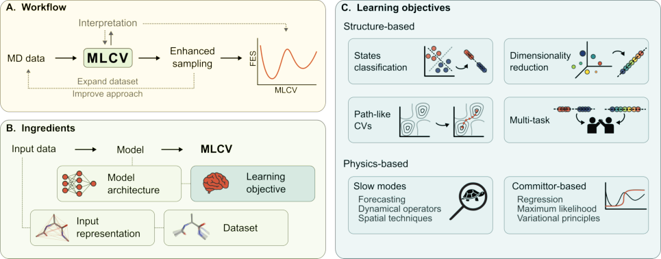

**Original caption:** FIG. 4: Typical workflow of machine learned CVs. (A) Starting from data collected with MD simulations, the MLCV is trained and used to drive enhanced sampling simulations, for example, to compute free energy estimates. The procedure can often be improved in an iterative way by expanding the training set with the newly collected configurations and eventually exploiting such data to enforce a more refined learning criterion. In addition, an analysis of the CV model can both help improve the design process and the interpretation of the results. (B) Ingredients of MLCVs. The input data from MD simulations is encoded through a representation of the system (e.g., physical descriptors or atomic coordinates) and stored in a dataset. The functional form of the CV model is determined by its architecture (e.g., a neural network), and its optimization is driven by the learning criterion that characterizes the adopted CV method. The MLCV value for a given input is returned as the output of the CV model. (C) Types of CVs learning objectives. Structure-based methods exploit structural and topological features, with criteria such as classification of states, dimensionality reduction, approximation of path-CVs, or combination of such approaches in a multi-task framework. Physics-based methods aim at encoding specific physical properties into the CV model, for instance by targeting slow modes or by leveraging properties of the committor function.

**中文图注:** 如图。图 4：机器学习简历的典型工作流程。 (A) 从 MD 模拟收集的数据开始，MLCV 被训练并用于驱动增强的采样模拟，例如计算自由能估计。通常可以通过使用新收集的配置扩展训练集并最终利用这些数据来实施更精细的学习标准来以迭代方式改进该过程。此外，CV 模型的分析有助于改进设计过程和结果的解释。 (B) MLCV 的成分。 MD 模拟的输入数据通过系统的表示（例如物理描述符或原子坐标）进行编码并存储在数据集中。 CV 模型的功能形式由其架构（例如神经网络）决定，其优化由表征所采用的 CV 方法的学习标准驱动。给定输入的 MLCV 值作为 CV 模型的输出返回。 (C) 简历学习目标的类型。基于结构的方法利用结构和拓扑特征，以及状态分类、降维、路径CV近似或多任务框架中这些方法的组合等标准。基于物理的方法旨在将特定的物理属性编码到 CV 模型中，例如通过针对慢速模式或利用提交者函数的属性。

**Reading note / 阅读提示：** Inspect this visual together with the immediately preceding source block; it is placed at the first substantive discussion available in the extracted text.

## Page 9

**Source:** p.9 S094

**Original:** positions (SOAP)71 descriptors, which are commonly employed in ML potentials. These offer richer representations of local environments but come at a higher computational cost. Other domain-specific features, such as structure factor peaks for crystallization72

**中文:** 位置 (SOAP)71 描述符，通常用于 ML 潜力。这些提供了更丰富的本地环境表示，但计算成本更高。其他特定领域的特征，例如结晶的结构因子峰72

**Source:** p.9 S095

**Original:** or graph-based descriptors for chemical reactions and phase transitions73–76, have also been successfully applied. Model architectures. Different architectures have been used to construct CVs starting from their representation, each offering distinct trade-offs between expressiveness and computational cost. Early approaches relied on linear models, optimizing linear combinations of predefined descriptors. These were later extended using kernel methods and, more prominently, FNNs, which provide greater flexibility in learning nonlinear transformations. More recently, geometric GNNs have been exploited, offering richer representations of molecular systems by treating atomic environments as graph structures, although with a higher computational cost. Datasets. It is important to note that the choice of dataset typically depends not only on the chosen representation and model architecture, but also on the learning objective, as different MLCV methods require different types of data. For example, unsupervised learning approaches for dimensionality reduction can use raw MD trajectories without labels, making them broadly applicable. In contrast, supervised learning methods rely on labeled data, such as configurations classified by the metastable states or transition states. Physics-informed approaches that aim

**中文:** 或基于图形的化学反应和相变描述符 73-76 也已成功应用。模型架构。不同的架构被用来从其表示开始构建 CV，每种架构都在表达性和计算成本之间提供了不同的权衡。早期的方法依赖于线性模型，优化预定义描述符的线性组合。这些后来使用核方法进行了扩展，更重要的是使用 FNN，它在学习非线性变换方面提供了更大的灵活性。最近，几何 GNN 被利用，通过将原子环境视为图结构来提供更丰富的分子系统表示，尽管计算成本更高。数据集。值得注意的是，数据集的选择通常不仅取决于所选择的表示和模型架构，还取决于学习目标，因为不同的 MLCV 方法需要不同类型的数据。例如，用于降维的无监督学习方法可以使用没有标签的原始 MD 轨迹，从而使其广泛适用。相反，监督学习方法依赖于标记数据，例如按亚稳态或过渡态分类的配置。基于物理学的方法旨在

**Source:** p.9 S096

**Original:** to extract the slow modes of the system often require ergodic simulations or biased simulations in a stationary limit. Ensuring that the dataset adequately represents relevant system configurations and, possibly, transitions is essential for training reliable CVs.

**中文:** 为了提取系统的慢模式，通常需要遍历模拟或固定极限下的偏置模拟。确保数据集充分代表相关的系统配置以及可能的转换对于训练可靠的 CV 至关重要。

**Source:** p.9 S097

**Original:** 3.3 Structure-based approaches

**中文:** 3.3 基于结构的方法

**Source:** p.9 S098

**Original:** In the first broad category, we discuss structure (or geometry)-based methods for CV optimization, which assume that relevant transitions can be captured by analyzing geometric or topological features. These methods include classification-based CVs, which rely on supervised learning to distinguish between metastable states, dimensionality reduction techniques, which extract low-dimensional representations without prior labeling, and path-like CVs, which approximate transition pathways to describe molecular processes. At the end of this section, we also discuss the possibility of combining different criteria into a multi-task framework. Table 1 provides an overview of the methods discussed in the following sections, together with a concise summary of their reported applications, with the aim of highlighting the areas in which they have been applied.

**中文:** 在第一大类中，我们讨论基于结构（或几何）的 CV 优化方法，该方法假设可以通过分析几何或拓扑特征来捕获相关转变。这些方法包括基于分类的 CV（依靠监督学习来区分亚稳态）、降维技术（无需事先标记即可提取低维表示）以及类路径 CV（近似过渡路径来描述分子过程）。在本节的最后，我们还讨论了将不同标准组合成多任务框架的可能性。表 1 概述了以下各节中讨论的方法，并对其报告的应用进行了简明总结，旨在突出显示它们的应用领域。

### Table 001. 基于结构的机器学习集体变量及其应用的概述。

**Placed near:** p.9 S098

**Source:** p.15 C008

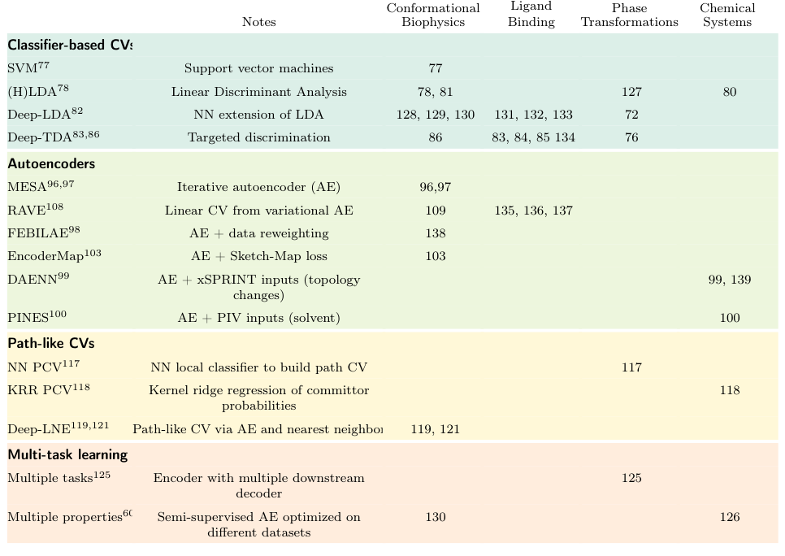

**Original caption:** TABLE 1: Overview of structure-based machine learning collective variables and their applications.

**中文图注:** 表 1：基于结构的机器学习集体变量及其应用的概述。

**Reading note / 阅读提示：** Inspect this visual together with the immediately preceding source block; it is placed at the first substantive discussion available in the extracted text.

## Page 10

**Source:** p.10 S099

**Original:** 3.3.1 Metastable states classification

**中文:** 3.3.1 亚稳态分类

**Source:** p.10 S100

**Original:** Since one of the basic requirements of CVs is to be able to distinguish metastable states, several methods have been proposed to construct CVs from classifiers optimized to discriminate between different states. This applies to the situation in which (some) metastable states of a system are known, such as the reactants and products of a chemical reaction, or the folded and unfolded states of proteins, or the bound and unbound states of a host-guest system. For instance, information on the native states of proteins or the bound state could come from experimental data such as x-ray crystallography, while other states, such as the unfolded or unbound ones, can be rather easily obtained through MD simulations at higher temperatures. Once we have a set of states, we can create a dataset of configurations with labels indicating which state they belong to, for example, by running a series of short MD trajectories for each metastable state. Sultan and Pande77 have explored the use of various classifier outputs, such as the distance to the decision hyperplane of a support vector machine, logistic regression probability estimates, and classifier outputs from deep or shallow neural networks, to build CVs and accelerate molecular simulations, demonstrating the feasibility of this approach. Because the main goal is to obtain a variable whose values are able to discriminate between different states, many methods for constructing CVs have been based on linear discriminant analysis (LDA). This is a supervised learning algorithm that separates the different classes by maximizing the inter-class variance Sb while minimizing the intra-class variance Sw, by solving the generalized eigenvalue problem:

**中文:** 由于 CV 的基本要求之一是能够区分亚稳态，因此已经提出了几种方法来从优化的分类器构建 CV，以区分不同的状态。这适用于系统的（某些）亚稳态已知的情况，例如化学反应的反应物和产物，或蛋白质的折叠和未折叠状态，或主客体系统的结合和未结合状态。例如，有关蛋白质天然状态或结合状态的信息可以来自 X 射线晶体学等实验数据，而其他状态（例如未折叠或未结合状态）可以通过较高温度下的 MD 模拟轻松获得。一旦我们有了一组状态，我们就可以创建一个配置数据集，其中的标签指示它们属于哪个状态，例如，通过为每个亚稳态运行一系列短 MD 轨迹。 Sultan 和 Pande77 探索了使用各种分类器输出（例如到支持向量机决策超平面的距离、逻辑回归概率估计以及来自深层或浅层神经网络的分类器输出）来构建 CV 并加速分子模拟，证明了这种方法的可行性。由于主要目标是获得一个其值能够区分不同状态的变量，因此许多构建 CV 的方法都基于线性判别分析 (LDA)。这是一种监督学习算法，通过求解广义特征值问题，通过最大化类间方差 Sb 同时最小化类内方差 Sw 来分离不同的类：

**Source:** p.10 S101

**Original:** Sbw = λSww (14)

**中文:** Sbw = λSww (14)

**Source:** p.10 S102

**Original:** Here, the eigenvectors w define the directions in the feature space x (e.g., interatomic distances, dihedrals) that best separate the predefined states, and the eigenvalues λ = wT Sbw

**中文:** 这里，特征向量 w 定义特征空间 x 中最好分离预定义状态的方向（例如，原子间距离、二面角），特征值 λ = wT Sbw

**Source:** p.10 S103

**Original:** wT Sww measure the degree of separation. This can be seen as a similar operation to principal component analysis (PCA), but where the principal discriminant components are the linear projections that distinguish the states the most. Note that the number of nonzero eigenvalues (and thus usable CVs) is NS −1, where NS is the number of metastable states. Mendels et al. proposed Harmonic-LDA (HLDA)78, a variant that computes covariance matrices using a harmonic mean, in order to address the problem that the LDA method assigns high variance weights to CVs, resulting in suboptimal sampling for the more stable states characterized by smaller fluctuations. They showed that this approach can be successfully used in numerous cases from biology79 to chemistry80. Recently, Sasmal et al. used standard LDA to learn CVs directly from atomic positions81. To this end, they treated a molecular configuration as a member of an equivalence class in size-and-shape space, containing all molecular configurations that can be optimally translated and rotated to align with a reference distribution. Furthermore, they reformulated the LDA

**中文:** wT Sww 测量分离程度。这可以看作是与主成分分析 (PCA) 类似的操作，但其中主判别成分是最能区分状态的线性投影。请注意，非零特征值（以及可用的 CV）的数量为 NS -1，其中 NS 是亚稳态的数量。孟德尔斯等人。提出了 Harmonic-LDA (HLDA)78，这是一种使用调和平均值计算协方差矩阵的变体，以解决 LDA 方法为 CV 分配高方差权重，导致以较小波动为特征的更稳定状态的次优采样的问题。他们表明，这种方法可以成功地应用于从生物学 79 到化学 80 的许多案例。最近，萨斯马尔等人。使用标准 LDA 直接从原子位置学习 CV81。为此，他们将分子构型视为尺寸和形状空间中等价类的成员，其中包含可以最佳平移和旋转以与参考分布对齐的所有分子构型。此外，他们重新制定了 LDA

**Source:** p.10 S104

**Original:** 3 DATA-DRIVEN LEARNING OF COLLECTIVE VARIABLES

**中文:** 3 数据驱动的集体变量学习

**Source:** p.10 S105

**Original:** eigenvalue problem in terms of generalized singular value decomposition (SVD) to extend the applicability of the method in this setting. This way, they were able to study the folding and the right-left helix transition in small proteins. However, the main limitation of LDA/HLDA is the linearity of the projection, and thus the need to identify a (small) set of descriptors where the states are already linearly separable. To address this, Bonati et al. proposed to use a nonlinear extension called Deep-LDA82. In this method, the original inputs x are first transformed via a neural network into a latent space of hidden features hθ = fθ(x) (see Fig. 5). Then, the CVs are obtained by performing LDA in the transformed space hθ. The network’s parameters are optimized to maximize the LDA discrimination score, or in other words, its generalized eigenvalues. In the case of two states, this corresponds to using as loss function LDeep−LDA = −λ. This process corresponds to transforming the feature space to maximize the ability to discriminate between states. After training, Deep-LDA CVs can be used to drive enhanced sampling simulations between metastable states and reconstruct the free energy profile. Generalizing this to more than two states requires, as in the case of LDA, NS−1 CVs. To ease this requirement, Trizio and Parrinello proposed the deep targeted discriminant analysis (Deep-TDA) method, where the discrimination criterion is obtained by a distribution regression procedure.83 In this case, the neural network outputs are used directly as CVs, which are optimized by imposing a target distribution on the projected training data. This distribution is defined as a linear combination of NS multivariate Gaussian distributions with diagonal covariances, one associated with each state. Each Gaussian is defined by Nρ = NS −1 CV positions and covariances, so the loss function is as follows:

**中文:** 广义奇异值分解 (SVD) 方面的特征值问题，以扩展该方法在此设置中的适用性。通过这种方式，他们能够研究小蛋白质的折叠和左右螺旋转变。然而，LDA/HLDA 的主要限制是投影的线性度，因此需要识别状态已经线性可分的一组（小）描述符。为了解决这个问题，博纳蒂等人。建议使用称为 Deep-LDA82 的非线性扩展。在该方法中，原始输入 x 首先通过神经网络转换为隐藏特征 hθ = fθ(x) 的潜在空间（见图 5）。然后，通过在变换后的空间hθ中执行LDA来获得CV。网络参数经过优化以最大化 LDA 判别得分，或者换句话说，最大化其广义特征值。在两种状态的情况下，这对应于使用损失函数 LDeep−LDA = −λ。该过程对应于变换特征空间以最大化区分状态的能力。训练后，Deep-LDA CV 可用于驱动亚稳态之间的增强采样模拟并重建自由能剖面。将其推广到两个以上的状态需要 NS−1 CV，就像 LDA 的情况一样。为了缓解这一要求，Trizio 和 Parrinello 提出了深度目标判别分析 (Deep-TDA) 方法，其中判别标准是通过分布回归过程获得的。 83 在这种情况下，神经网络输出直接用作 CV，通过在投影训练数据上施加目标分布来优化 CV。该分布被定义为具有对角协方差的 NS 多元高斯分布的线性组合，与每个状态相关联。每个高斯由 Nρ = NS −1 CV 位置和协方差定义，因此损失函数如下：

### Fig. 005. Deep-LDA 示意图，这是一个基于分类器的监督式 CV 示例。一组物理描述符

**Placed near:** p.10 S105

**Source:** p.11 C005

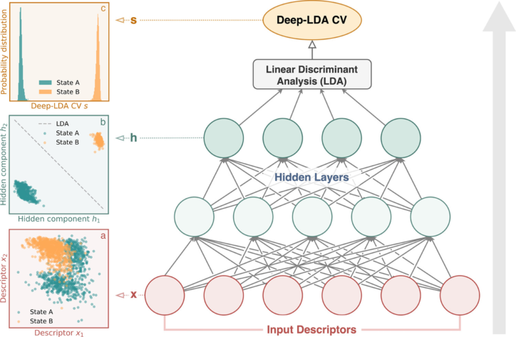

**Original caption:** FIG. 5: Schematic of Deep-LDA, an example of a supervised, classifier-based CV. A set of physical descriptors serves as input to a feedforward neural network, which performs a nonlinear transformation to a feature space where the separation between metastable states is maximized. In the final layer, Fisher’s discriminant analysis is applied to identify directions that best discriminate between the predefined classes, yielding the CVs. The network is optimized to enhance this discriminative power by maximizing the LDA separation score. The panels illustrate this process: (a) distribution of input descriptors for two metastable states, showing partial overlap; (b) transformed variables in the neural network’s feature space with the LDA boundary, where the states become linearly separable; and (c) probability distribution of the resulting CV, demonstrating clear discrimination between states. Image reproduced from Ref. 82. Copyright 2020 American Chemical Society.

**中文图注:** 如图。图 5：Deep-LDA 示意图，这是一个基于分类器的监督式 CV 示例。一组物理描述符用作前馈神经网络的输入，该网络对特征空间执行非线性变换，其中亚稳态之间的分离最大化。在最后一层，应用 Fisher 判别分析来识别最能区分预定义类别的方向，从而生成 CV。网络经过优化，通过最大化 LDA 分离分数来增强这种判别能力。面板说明了这个过程：（a）两个亚稳态的输入描述符的分布，显示出部分重叠； (b) 具有LDA边界的神经网络特征空间中的变换变量，其中状态变为线性可分； (c) 所得 CV 的概率分布，表明各州之间有明显的区别。图片转载自参考文献。 82. 版权所有 2020 美国化学会。

**Reading note / 阅读提示：** Inspect this visual together with the immediately preceding source block; it is placed at the first substantive discussion available in the extracted text.

**Source:** p.10 S106

**Original:** Nρ X

**中文:** NρX

**Source:** p.10 S107

**Original:** NS X

**中文:** NSX

**Source:** p.10 S108

**Original:**  αLμ k,ρ + βLσ k,ρ  (15)

**中文:** αLμ k,ρ + βLσ k,ρ (15)

**Source:** p.10 S109

**Original:** LDeep−TDA =

**中文:** LDeep−TDA =

**Source:** p.10 S110

**Original:** where ρ are the components of the CV space. While the results are similar to Deep-LDA for a two-state scenario, Deep-TDA can reduce the dimensionality of the CV space (i.e., Nρ < NS −1) in the case where one has additional information, such as having a set of ordered states (e.g. intermediate steps) or mutually exclusive reactants and products, circumstances in which a one-dimensional variable is sufficient84,85. Augmenting classifier-based CVs. Since these methods are trained exclusively to distinguish metastable states, their performance can be suboptimal in the transition state region, resulting in a limited sampling. For this reason, it has been proposed to improve them by adding data belonging to the transition region, which can be accomplished in different ways. For instance, Ray et al. proposed incorporating data from the transitions path ensemble obtained from reactive trajectories86 as an additional state in Deep-TDA CVs. Specifically, they performed OPESflooding87 simulations based on the Deep-TDA CVs to obtain several reactive trajectories, and the configurations located outside of the metastable basins are

**中文:** 其中 ρ 是 CV 空间的分量。虽然结果与二态场景的 Deep-LDA 类似，但在具有附加信息的情况下，例如具有一组有序状态（例如中间步骤）或互斥的反应物和产物，一维变量就足够的情况，Deep-TDA 可以降低 CV 空间的维数（即 Nρ < NS -1）84,85。增强基于分类器的 CV。由于这些方法专门经过训练来区分亚稳态，因此它们在过渡态区域的性能可能不是最佳的，从而导致采样有限。为此，有人提出通过添加属于过渡区域的数据来改进它们，这可以通过不同的方式来完成。例如，雷等人。建议将从反应轨迹 86 获得的转换路径集合中的数据合并为 Deep-TDA CV 中的附加状态。具体来说，他们基于 Deep-TDA CV 进行了 OPESflooding87 模拟，以获得多个反应轨迹，位于亚稳盆地外部的配置为

## Page 11

**Source:** p.11 S111

**Original:** collected and assigned to a new state, characterized by a broader distribution. As an alternative, Yang et al. proposed a simulation-free data augmentation strategy for CV learning in protein folding environments88. They used geodesic interpolation on Riemannian conformational manifolds of proteins, as proposed by Diepeveen et al.89, which faithfully models protein folding transitions. Although these are not true realizations of transition states, augmenting the training data with these interpolations can improve the quality of the CVs and thus sampling. Furthermore, since the interpolation parameter t ∈[0, 1] represents the progress of the transition, they also proposed to train CVs by performing regression on this parameter. Finally, multi-task approaches can be used to enhance classifier-based CVs by augmenting them with more data outside the metastable states (see Sec. 3 3 4).

**中文:** 收集并分配给一个新的国家，其特点是分布范围更广。作为替代方案，杨等人。提出了一种用于蛋白质折叠环境中 CV 学习的无模拟数据增强策略88。正如 Diepeveen 等人提出的那样，他们在蛋白质的黎曼构象流形上使用了测地线插值法。89，它忠实地模拟了蛋白质折叠转变。尽管这些并不是过渡状态的真正实现，但通过这些插值来增强训练数据可以提高 CV 的质量，从而提高采样的质量。此外，由于插值参数 t ∈[0, 1] 代表过渡的进度，因此他们还提出通过对该参数进行回归来训练 CV。最后，多任务方法可以通过使用亚稳态之外的更多数据来增强基于分类器的 CV（参见第 3 3 4 节）。

**Source:** p.11 S112

**Original:** continuous and differentiable functions of atomic positions (or descriptor functions of them). For additional information on unsupervised approaches, we also refer to the recent review from Glielmo et al.13. The most famous example from this family is principal component analysis (PCA)90–94. The purpose of this method is to reduce the number of variables describing a given dataset while retaining most of the original information. To this aim, PCA diagonalizes the covariance matrix of a set of features and projects the data onto its leading eigenvectors (called principal components). These represent the linear combinations of the input features that encode as much of the variance as possible. For this reason, PCA is often used as a dimensionality reduction algorithm to preprocess the dataset before feeding it to other algorithms. It has also been used by Spiwok et al. to directly learn a set of CVs to understand the system and enhance the sampling via biased simulations95. Of course, this approach is suitable when the transition we are interested in is associated with a large structural change in the system, and is thus related to principal components. Also, the projection operated by PCA acts on a linear subspace of the original space, which may not be adequate when the relationship between the relevant degrees of freedom is nonlinear. Among the non-linear unsupervised methods used for CV discovery, many of them rely on autoencoders (AE). An AE is an artificial neural network consisting of two parts: the first part (encoder) E maps the high-dimensional input space to a low-dimensional la-

**中文:** 原子位置的连续函数和可微函数（或它们的描述符函数）。有关无监督方法的更多信息，我们还参考了 Glielmo 等人最近的评论13。该系列中最著名的例子是主成分分析 (PCA)90-94。该方法的目的是减少描述给定数据集的变量数量，同时保留大部分原始信息。为此，PCA 对一组特征的协方差矩阵进行对角化，并将数据投影到其主要特征向量（称为主成分）上。这些表示输入特征的线性组合，编码尽可能多的方差。因此，PCA 通常用作降维算法，在将数据集输入其他算法之前对数据集进行预处理。 Spiwok 等人也使用过它。直接学习一组 CV 以了解系统并通过有偏差的模拟增强采样95。当然，当我们感兴趣的转变与系统中的大结构变化相关联并因此与主成分相关时，这种方法是合适的。此外，PCA 操作的投影作用于原始空间的线性子空间，当相关自由度之间的关系是非线性时，这可能不够充分。在用于 CV 发现的非线性无监督方法中，许多方法依赖于自动编码器 (AE)。 AE是一个人工神经网络，由两部分组成：第一部分（编码器）E将高维输入空间映射到低维la-

**Source:** p.11 S113

**Original:** 3.3.2 Dimensionality reduction

**中文:** 3.3.2 降维

**Source:** p.11 S114

**Original:** While classification-based CVs require a labeled dataset, another large family of CV optimization methods is based on unsupervised learning strategies. In this case, the goal of ML approaches is to extract meaningful information from simulations without providing explicit targets, but rather by exploiting their ability to identify meaningful low-dimensional representations. Note that not all unsupervised techniques can be applied to CV discovery, as, if the purpose is to find variables to perform enhanced sampling, we need

**中文:** 虽然基于分类的 CV 需要标记数据集，但另一大类 CV 优化方法是基于无监督学习策略。在这种情况下，机器学习方法的目标是在不提供明确目标的情况下从模拟中提取有意义的信息，而是利用其识别有意义的低维表示的能力。请注意，并非所有无监督技术都可以应用于 CV 发现，因为如果目的是找到变量来执行增强采样，我们需要

## Page 12

**Source:** p.12 S115

**Original:** tent space, often referred to as the bottleneck of the model (see Fig. 6). The second part (decoder) D simultaneously learns to reconstruct the input data by mapping the latent space back to the high-dimensional space of the inputs. The parameters of the encoder and decoder are optimized to minimize the discrepancy between the reconstructed output and the original input features xi, typically by using MSE as a loss function:

**中文:** 帐篷空间，通常称为模型的瓶颈（见图 6）。第二部分（解码器）D 同时学习通过将潜在空间映射回输入的高维空间来重建输入数据。编码器和解码器的参数经过优化，以最大限度地减少重建输出和原始输入特征 xi 之间的差异，通常使用 MSE 作为损失函数：

### Fig. 006. (A) 许多无监督的 CV 发现方法都基于自动编码器，自动编码器直接从未标记的模

**Placed near:** p.12 S115

**Source:** p.12 C006

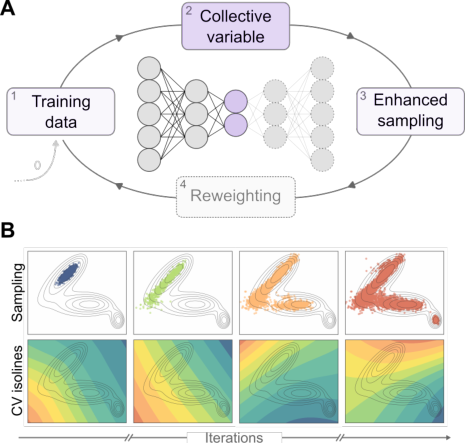

**Original caption:** FIG. 6: (A) Many unsupervised approaches to CV discovery are based on autoencoders, which learn lowdimensional representations directly from unlabeled simulation data. These methods are typically used in an exploratory fashion, interleaving rounds of CV learning with free energy biasing. In each iteration, the learned CVs are used to bias the system and promote the exploration of new configurations, which are then added to the training set for the next round. In some variants, statistical reweighting of the sampled configurations is applied before proceeding to the next iteration. (B) Example of progress of an iterative approach used for exploration on a simple 2D potential surface. As the number of iterations increases, a larger portion of the phase space is sampled (explored points in the 2D space, upper row) and better CVs are learned (CV isolines, lower row).

**中文图注:** 如图。图 6：(A) 许多无监督的 CV 发现方法都基于自动编码器，自动编码器直接从未标记的模拟数据中学习低维表示。这些方法通常以探索性方式使用，将多轮 CV 学习与自由能偏置交织在一起。在每次迭代中，学习到的 CV 用于偏置系统并促进对新配置的探索，然后将其添加到下一轮的训练集中。在一些变体中，在进行下一次迭代之前应用采样配置的统计重新加权。 (B) 用于探索简单二维势表面的迭代方法的进展示例。随着迭代次数的增加，对相空间的更大部分进行采样（二维空间中的探索点，上行）并学习更好的 CV（CV 等值线，下行）。

**Reading note / 阅读提示：** Inspect this visual together with the immediately preceding source block; it is placed at the first substantive discussion available in the extracted text.

**Source:** p.12 S116

**Original:** N X

**中文:** 尼克斯

**Source:** p.12 S117

**Original:** i=1 |xi −D ◦E (xi)|2 (16)

**中文:** i=1 |xi −D ◦E (xi)|2 (16)

**Source:** p.12 S118

**Original:** LAE =

**中文:** 洛杉矶=

**Source:** p.12 S119

**Original:** Through this process, the model learns to recover the original data from the low-dimensional representation of the bottleneck, with the latent space often capturing key features of the data, thus providing a sort of non-linear generalization of PCA. In the context of enhanced sampling, the latent space is typically used as the CV for analysis and biasing, while the decoder is only used during training. The earliest adoption of AEs for enhanced sampling is the molecular enhanced sampling with autoencoders (MESA) method proposed by Ferguson and coworkers96,97, which uses AEs to learn nonlinear lowdimensional CVs describing the important configurational motions of biomolecules from atomic coordinates, as demonstrated on small test proteins. In addition, MESA also uses a data augmentation approach to resolve internal structural reconfigurations and exclude trivial changes in rotational orientation and alternates between CV learning and free energy biasing (umbrella sampling) along these CVs. Similarly, Belkacemi et al. developed an iterative algorithm for CV learning with AEs, named free energy biasing and iterative learning with autoencoders (FEBILAE)98. Contrary to MESA, when learning from biased samples, FEBILAE reweights the configurations sampled from a biased distribution ̃μ by a factor w(x) = μ(x)

**中文:** 通过这个过程，模型学习从瓶颈的低维表示中恢复原始数据，潜在空间通常捕获数据的关键特征，从而提供一种 PCA 的非线性泛化。在增强采样的背景下，潜在空间通常用作分析和偏置的 CV，而解码器仅在训练期间使用。最早采用 AE 进行增强采样的是 Ferguson 和同事提出的分子增强采样自动编码器 (MESA) 方法96,97，该方法使用 AE 学习非线性低维 CV，从原子坐标描述生物分子的重要构型运动，如小型测试蛋白质上所证明的那样。此外，MESA 还使用数据增强方法来解决内部结构重新配置问题，并排除旋转方向的微小变化以及沿这些 CV 的 CV 学习和自由能偏置（伞采样）之间的交替。同样，贝尔卡塞米等人。开发了一种使用 AE 进行 CV 学习的迭代算法，称为自由能偏置和自动编码器迭代学习 (FEBILAE)98。与 MESA 相反，当从有偏差的样本中学习时，FEBILAE 通过因子 w(x) = μ(x) 重新加权从有偏差分布 ̃μ 采样的配置

**Source:** p.12 S120

**Original:** ̃μ(x) to target the unbiased one μ, corresponding to the Boltzmann distribution. Moreover, FEBILAE relies on adaptive techniques to sample configurations and compute the free energy by reweighting them. Beyond the differences, the iterative aspect that alternates between optimization and biasing is a recurring feature of these and many other AE-based methods. This enables these methods to be used in an exploratory way, without knowing beforehand which the relevant metastable states are. Different types of systems and processes can be addressed by combining AEs with suitable sets of descriptors. In the context of chemical reactions, Ketkaew et al. developed a non-instructor-led deep autoencoder neural network (DAENN) to discover CVs from unbiased MD of the reactants’ state of chemical reactions99. To this end, the Authors introduced an unsupervised training descriptor (xSPRINT) which extends the original SPRINT74 variables by including information on distant atoms not directly involved in the reaction. The authors then used AEs to reduce the dimensionality of these descriptors into a small set of CVs, employing, in addition to the reconstruction loss, also a penalty function based on root mean

**中文:** ̃μ(x) 以无偏 μ 为目标，对应于玻尔兹曼分布。此外，FEBILAE 依靠自适应技术对配置进行采样并通过重新加权来计算自由能。除了这些差异之外，优化和偏置之间交替的迭代方面是这些方法和许多其他基于 AE 的方法的一个反复出现的特征。这使得这些方法能够以探索性的方式使用，而无需事先知道相关的亚稳态是什么。通过将 AE 与合适的描述符集相结合，可以解决不同类型的系统和流程。在化学反应的背景下，Ketkaew 等人。开发了一种非教师引导的深度自动编码器神经网络 (DAENN)，用于从反应物化学反应状态的无偏 MD 中发现 CV99。为此，作者引入了无监督训练描述符 (xSPRINT)，它通过包含不直接参与反应的遥远原子的信息来扩展原始 SPRINT74 变量。然后，作者使用 AE 将这些描述符的维数减少为一小组 CV，除了重建损失之外，还使用基于根均值的惩罚函数

**Source:** p.12 S121

**Original:** 3 DATA-DRIVEN LEARNING OF COLLECTIVE VARIABLES

**中文:** 3 数据驱动的集体变量学习

**Source:** p.12 S122

**Original:** squared deviation (RMSD) of atomic positions to promote exploration of the free energy landscape. To facilitate the sampling of systems involving indistinguishable particles, which are commonly encountered in self-assembly and solvation systems, Ferguson and coworkers proposed an approach called permutationally invariant networks for enhanced sampling (PINES)100. PINES combines permutation-invariant vector (PIV) descriptors101,102 with AEs to learn nonlinear CVs that are invariant not only to translational and rotational symmetry but also to the permutational one. The methods integrate PIV characterization with MESA96,97, iteratively training the CVs and performing enhanced sampling to achieve converged thermodynamic averages. One general aspect of AEs is that they only implicitly optimize the latent space as an intermediate step in the reconstruction of the inputs, without imposing any particular structure on the CV space. To improve this aspect, different strategies can be applied to enforce specific properties. Lemke and Peter introduced a dimensionality reduction algorithm called EncoderMap103, which combines an AE with the cost function of sketch-map104. Sketch-map is a multidimensional scaling-like algorithm that aims to reproduce in a low-dimensional space the distances between

**中文:** 原子位置的平方偏差（RMSD），以促进对自由能景观的探索。为了促进对自组装和溶剂化系统中常见的难以区分的粒子系统进行采样，Ferguson 和同事提出了一种称为增强采样的排列不变网络 (PINES)100 的方法。 PINES 将排列不变向量 (PIV) 描述符 101,102 与 AE 相结合，以学习非线性 CV，这些 CV 不仅对平移对称性和旋转对称性不变，而且对排列对称性不变。该方法将 PIV 表征与 MESA96,97 集成，迭代训练 CV 并执行增强采样以实现收敛的热力学平均值。 AE 的一个普遍方面是，它们仅隐式优化潜在空间作为重建输入的中间步骤，而不在 CV 空间上强加任何特定结构。为了改进这方面，可以应用不同的策略来强制执行特定的属性。 Lemke 和 Peter 引入了一种称为 EncoderMap103 的降维算法，它将 AE 与 sketch-map104 的成本函数结合起来。 Sketch-map 是一种类似多维缩放的算法，旨在在低维空间中重现物体之间的距离

## Page 13

**Source:** p.13 S123

**Original:** points in a high-dimensional space, thus enforcing a metric on the latent space. In a similar spirit, regularization techniques105 and multi-task approaches60

**中文:** 高维空间中的点，从而对潜在空间实施度量。本着类似的精神，正则化技术105和多任务方法60

**Source:** p.13 S124

**Original:** (see Sec. 3 3 4)) can be used to enforce desired properties in the CV space of the AEs. Besides standard AEs, other methods rely on the so-called variational autoencoders (VAEs)106, which are a particular class of AEs based on Bayesian theory. In VAEs, the data in the latent space is enforced to follow a prior distribution, commonly chosen to be a multivariate Gaussian distribution. First, the encoder learns to output the Gaussian distribution’s mean and variance, and the decoder’s sample is drawn from this distribution. Second, the encoder/decoder parameters are optimized to maximize the evidence lower bound (ELBO)107, consisting of two terms: the reconstruction loss measuring how well the VAE can reconstruct the input data and the KL divergence between the approximate posterior and the prior distributions. Among the applications of VAEs to the CV discovery problem, Ribeiro et al. proposed reweighted autoencoded variational bayes for enhanced sampling (RAVE)108. RAVE is based on the idea that the probability distribution of the latent space can be taken as the most relevant feature learned from the VAE as opposed to the latent variable itself. Then, a physical proxy variable is obtained from a linear combination of a set of descriptors, optimized to have the same probability distribution as the latent space. Later, Vani et al. also proposed to integrate the RAVE algorithm with AlphaFold to sample Boltzmann ensembles starting from protein sequences109, showing applications to challenging proteins such as G-protein coupled receptors (GPCRs). From a different perspective, Schober et al. employed VAEs to frame the construction of CVs as a Bayesian inference problem110. In this framework, CVs are considered as low-dimensional hidden generators111 of all-atom trajectories. The identification of CVs is thus formulated as a Bayesian inference task, where the posterior distribution of the latent CVs is inferred given fine-scale atomic training data. The Bayesian latent variable model for CV discovery also incorporates uncertainty quantification to provide confidence in the discovered CVs, which is particularly useful when the training data is sparse or noisy. Following a different strategy, Sipka et al. used a variational autoencoder to construct CV by compressing a pre-trained representation obtained from an ML potential112. Specifically, they extracted an intermediate representation of a graph network based on SchNet113 architecture, which intrinsically respects rotational, translational, and permutational invariance. Moreover, this approach is an example of transfer learning, in which the representation learned to construct the potential is also used to learn another task (the CV) with little effort.

**中文:** （参见第 3 3 4 节））可用于在 AE 的 CV 空间中强制执行所需的属性。除了标准 AE 之外，其他方法还依赖于所谓的变分自动编码器 (VAE)106，它们是基于贝叶斯理论的一类特定的 AE。在 VAE 中，潜在空间中的数据被强制遵循先验分布，通常选择多元高斯分布。首先，编码器学习输出高斯分布的均值和方差，然后从该分布中提取解码器的样本。其次，优化编码器/解码器参数以最大化证据下限 (ELBO)107，该参数由两项组成：衡量 VAE 重建输入数据效果的重建损失以及近似后验分布和先验分布之间的 KL 散度。 Ribeiro 等人将 VAE 应用于 CV 发现问题。提出了用于增强采样的重新加权自动编码变分贝叶斯（RAVE）108。 RAVE 基于这样的想法：潜在空间的概率分布可以被视为从 VAE 中学到的最相关的特征，而不是潜在变量本身。然后，从一组描述符的线性组合中获得物理代理变量，并对其进行优化以具有与潜在空间相同的概率分布。后来，瓦尼等人。还建议将 RAVE 算法与 AlphaFold 集成，从蛋白质序列开始对玻尔兹曼集成进行采样109，展示了在 G 蛋白偶联受体 (GPCR) 等具有挑战性的蛋白质中的应用。从不同的角度来看，Schober 等人。使用 VAE 将 CV 的构建构建为贝叶斯推理问题 110。在此框架中，CV 被视为全原子轨迹的低维隐藏生成器111。因此，CV 的识别被表述为贝叶斯推理任务，其中在给定精细尺度原子训练数据的情况下推断出潜在 CV 的后验分布。用于 CV 发现的贝叶斯潜变量模型还结合了不确定性量化，以提供对发现的 CV 的置信度，这在训练数据稀疏或有噪声时特别有用。 Sipka 等人采用了不同的策略。使用变分自动编码器通过压缩从 ML 势获得的预训练表示来构建 CV112。具体来说，他们提取了基于 SchNet113 架构的图网络的中间表示，该架构本质上尊重旋转、平移和排列不变性。此外，这种方法是迁移学习的一个例子，其中学习到的构建潜力的表示也可以毫不费力地用于学习另一项任务（CV）。

**Source:** p.13 S125

**Original:** 3.3.3 Path-like collective variables

**中文:** 3.3.3 类路径集体变量

**Source:** p.13 S126

**Original:** In this section, we describe another approach to CV construction, which is based on approximating a given path in the (atomic or collective) space. This idea has

**中文:** 在本节中，我们将描述另一种 CV 构造方法，该方法基于近似（原子或集体）空间中的给定路径。这个想法有

**Source:** p.13 S127

**Original:** indeed inspired numerous ML approaches. We start by recalling the original formulation of the so-called CV pathways from A to B. This method requires a reference pathway, given by a sequence of D intermediate molecular structures S0(R) = (S1(R), S2(R), . . . , SD(R)). These configurations can be represented by either their atomic positions or a set of CVs. From these configurations, we can define the progress along the reference path using the following expression:

**中文:** 确实启发了许多机器学习方法。我们首先回顾一下从 A 到 B 的所谓 CV 途径的原始表述。该方法需要一个参考途径，由一系列 D 中间分子结构 S0(R) = (S1(R), S2(R), ..., SD(R)) 给出。这些配置可以用它们的原子位置或一组 CV 来表示。根据这些配置，我们可以使用以下表达式定义沿参考路径的进度：

**Source:** p.13 S128

**Original:** R 1 0 dt t e−λ∥S(R)−S0(t)∥2

**中文:** R 1 0 dt t e−λ∥S(R)−S0(t)∥2

**Source:** p.13 S129

**Original:** s(R) = lim λ→∞

**中文:** s(R) = lim λ → ∞

**Source:** p.13 S130

**Original:** R 1 0 dt e−λ∥S(R)−S0(t)∥2 (17)

**中文:** R 1 0 dt e−λ∥S(R)−S0(t)∥2 (17)

**Source:** p.13 S131

**Original:** where the parameter λ ensures localization around the closest point in the path, as it can be interpreted as the inverse of a Gaussian variance, and t ∈[0, 1] parametrizes the position along the reference path S0(t). Formally, the s variable induces a foliation in the S space and, near the reference path S0(t), the foliating surfaces become flat and orthogonal to S0(t). The distance from the reference path S0(t) is defined as:

**中文:** 其中参数 λ 确保路径中最近点周围的定位，因为它可以解释为高斯方差的倒数，并且 t ∈[0, 1] 参数化沿参考路径 S0(t) 的位置。形式上，s 变量在 S 空间中引起叶状分布，并且在参考路径 S0(t) 附近，叶状表面变得平坦且与 S0(t) 正交。距参考路径S0(t)的距离定义为：

**Source:** p.13 S132

**Original:** λ log Z 1

**中文:** λ log Z 1

**Source:** p.13 S133

**Original:**  −1

**中文:** −1

**Source:** p.13 S134

**Original:** 0 dt e−λ∥S(R)−S0(t)∥2 (18)

**中文:** 0 dt e−λ∥S(R)−S0(t)∥2 (18)

**Source:** p.13 S135

**Original:** z(R) = lim λ→∞

**中文:** z(R) = lim λ → ∞

**Source:** p.13 S136

**Original:** Moreover, the FES F(s, z) as a function of the path CVs can reveal other qualitatively distinct pathways that may be separated from the reference path by significant energy barriers. Other formulations of path CVs have been proposed, such as in pathmetadynamics (PMD)114,115, where the objective is to reconstruct (and optimize) the average transition path connecting two states in the space spanned by the CVs. One of the problems with conventional path CVs is related to the definition of an optimal similarity measure to describe the process of interest in a highdimensional space116, which is well suited for ML approaches. For example, Rogal et al. proposed a path CV based on neural networks117 designed to enhance sampling of solid-solid phase transformations in molecular simulations. Instead of relying on manually selected reaction coordinates, they employed a neural network classifier to identify local structural environments, which are then used to define a global reaction path in a low-dimensional feature space. The path CV is constructed by first classifying atomic environments using the neural network, which assigns a structural label to each local atomic configuration, and then using such classification as global structural descriptors, allowing the definition of a one-dimensional continuous reaction path that captures the transition between phases. France-Lanord et al.118 recognized a formal connection between path CVs and kernel methods, interpreting the variable which describes the progress along a reference path as a similarity measure between a configuration S(R) and a set of reference frames S0(t), typically via a Gaussian kernel. They proposed a data-driven generalization of path CVs using kernel ridge regression (KRR), enabling the model to accommodate a larger set of reference configurations

**中文:** 此外，作为路径 CV 的函数的 FES F(s, z) 可以揭示其他质量上不同的路径，这些路径可能通过显着的能量障碍与参考路径分开。路径 CV 的其他公式已经被提出，例如在路径元动力学 (PMD)114,115 中，其目标是重建（和优化）连接 CV 所跨越的空间中的两个状态的平均转移路径。传统路径 CV 的问题之一与描述高维空间中感兴趣的过程的最佳相似性度量的定义有关，这非常适合 ML 方法。例如，罗加尔等人。提出了一种基于神经网络的路径 CV117，旨在增强分子模拟中固-固相变的采样。他们没有依赖手动选择的反应坐标，而是采用神经网络分类器来识别局部结构环境，然后用于定义低维特征空间中的全局反应路径。路径 CV 的构建方法是，首先使用神经网络对原子环境进行分类，为每个局部原子配置分配结构标签，然后使用此类分类作为全局结构描述符，从而定义捕获相之间过渡的一维连续反应路径。 France-Lanord 等人118 认识到路径 CV 和核方法之间的正式联系，将描述沿着参考路径的进度的变量解释为配置 S(R) 和一组参考系 S0(t) 之间的相似性度量，通常通过高斯核。他们提出了使用核岭回归 (KRR) 的数据驱动的路径 CV 泛化，使模型能够容纳更大的参考配置集

## Page 14

**Source:** p.14 S137

**Original:** and to use higher-dimensional, structured inputs such as SOAP descriptors. In their approach, the KRR model is trained to predict committor probabilities directly from structural descriptors, effectively learning a smooth and differentiable approximation of the progress variable s(R). To construct the training set, committor estimates for selected configurations are obtained from a combination of biased simulations and TPS, ensuring accurate coverage across the transition region (see Sec. 3 5). Frohlking et al. proposed a method called deeplocally non-linear embedding (DeepLNE)119, that aims at constructing a directional CV which can describe the progress of the transition through a nonlinear combination of feature vectors inspired by the locally linear embedding method120. Such an architecture is a generalized AE that performs a continuous k-nearest neighbors (k-NN) step on each data point before reducing the dimensionality through the encoder to the bottleneck representing the 1D CV (s), whereas the decoder is used to compute the perpendicular distance (z) CV. One of the main advantages of DeepLNE is its ability to automatically select the metric used for neighbor searches and learn the path from state A to state B without the need for hand-picking landmark selection in advance. However, the nearest neighbor step in DeepLNE resulted in a substantial computational cost that the authors later addressed with the revised DeepLNE++121 strategy, which uses knowledge distillation to construct a more computationally efficient CV by labeling the training data to guide directionality and employing an ANN student model to represent the DeepLNE variables s and z.

**中文:** 并使用更高维的结构化输入，例如 SOAP 描述符。在他们的方法中，KRR 模型经过训练，可以直接根据结构描述符预测提交者概率，从而有效地学习进度变量 s(R) 的平滑且可微的近似值。为了构建训练集，从有偏差的模拟和 TPS 的组合中获得对选定配置的提交者估计，确保整个过渡区域的准确覆盖（参见第 3 节 5）。弗罗尔金等人。提出了一种称为深度局部非线性嵌入（DeepLNE）的方法119，其目的是构建一个定向CV，它可以通过受局部线性嵌入方法启发的特征向量的非线性组合来描述过渡的进度120。这种架构是一种广义的 AE，它在通过编码器将维度降低到表示 1D CV (s) 的瓶颈之前，对每个数据点执行连续的 k-近邻 (k-NN) 步骤，而解码器用于计算垂直距离 (z) CV。 DeepLNE 的主要优点之一是它能够自动选择用于邻居搜索的度量并学习从状态 A 到状态 B 的路径，而无需提前手动选择地标。然而，DeepLNE 中的最近邻步骤导致了大量的计算成本，作者后来通过修订后的 DeepLNE++121 策略解决了这一问题，该策略使用知识蒸馏来构建计算效率更高的 CV，方法是标记训练数据以指导方向性并采用 ANN 学生模型来表示 DeepLNE 变量 s 和 z。

**Source:** p.14 S138

**Original:** 3.3.4 Multitask learning

**中文:** 3.3.4 多任务学习

**Source:** p.14 S139

**Original:** While many methods are optimized with a single objective, it is often desirable for the CVs to obey multiple requirements. This can be accomplished within a multi-task framework122–124. This is an umbrella term to describe methods in which a single model is optimized using multiple learning objectives, and is generally achieved by including multiple terms in the loss function (e.g., via a sum of them). This can be useful also to regularize the learning105 and to exploit complementary information across different datasets60. One way this can be implemented is to learn a single CV that is then able to perform multiple downstream tasks. Kozinsky and collaborators125 framed CV learning as a dimensionality reduction that must be able to both separate basins and predict potential energy. In their scheme, the multitask CV consists of a common encoder that performs dimensionality reduction together with multiple decoders that perform separate downstream tasks (potential energy predictor and basin classifier). Bonati et al. proposed a more general multi-task learning framework, which enables the optimization of a single model via a combination of loss functions evaluated on different dataset types60. Indeed, often one is faced with many datasets for the same system that are different in nature, for example, because they

**中文:** 虽然许多方法都是针对单一目标进行优化的，但通常希望 CV 遵守多个要求。这可以在多任务框架内完成122-124。这是一个总括术语，用于描述使用多个学习目标优化单个模型的方法，并且通常通过在损失函数中包含多个项（例如，通过它们的总和）来实现。这对于规范学习 105 和利用不同数据集上的补充信息 60 也很有用。实现这一点的一种方法是学习单个 CV，然后该 CV 能够执行多个下游任务。 Kozinsky 和合作者125 将 CV 学习定义为一种降维方法，必须能够分离盆地并预测势能。在他们的方案中，多任务 CV 由一个执行降维的通用编码器和多个执行单独下游任务（势能预测器和盆地分类器）的解码器组成。博纳蒂等人。提出了一个更通用的多任务学习框架，该框架可以通过在不同数据集类型上评估的损失函数的组合来优化单个模型60。事实上，人们经常面临同一系统的许多数据集，这些数据集本质上是不同的，例如，因为它们

**Source:** p.14 S140

**Original:** 3 DATA-DRIVEN LEARNING OF COLLECTIVE VARIABLES

**中文:** 3 数据驱动的集体变量学习

**Source:** p.14 S141

**Original:** are sampled using different approaches. These may include, for instance, a subset of labeled configurations coming from unbiased simulations in the different metastable states and unlabeled configurations obtained in biased simulations. To effectively integrate information from these different datasets, a multitask learning structure can be adopted. In particular, Bonati et al.60 proposed a semi-supervised multitask CV that uses an autoencoder-like architecture combined with the Deep-TDA objective (see Fig. 7). The loss function for the multitask CV is given by a linear combination of the reconstruction loss (calculated on the unlabeled dataset D1 = {xi}) and the Deep-TDA loss (calculated on the labeled dataset D2 = {(xi, yi)}) acting on the CVs s

**中文:** 使用不同的方法进行采样。例如，这些可能包括来自不同亚稳态下的无偏模拟的标记配置的子集以及在有偏模拟中获得的未标记配置。为了有效地整合来自这些不同数据集的信息，可以采用多任务学习结构。特别是，Bonati 等人 60 提出了一种半监督多任务 CV，它使用类似自动编码器的架构与 Deep-TDA 目标相结合（见图 7）。多任务 CV 的损失函数由作用于 CV s 的重建损失（在未标记数据集 D1 = {xi} 上计算）和 Deep-TDA 损失（在标记数据集 D2 = {(xi, yi)} 上计算）的线性组合给出

### Fig. 007. 在不同数据集上优化的多任务 CV。这种方法将多个目标组合到一个 CV 模型中。在

**Placed near:** p.14 S141

**Source:** p.14 C007

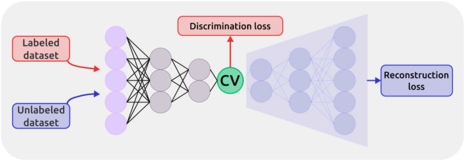

**Original caption:** FIG. 7: Multi-task CV optimized on different datasets. This approach combines multiple objectives into a single CV model. In the semi-supervised setup, an autoencoder is used to process data from an unlabeled dataset (blue path) with an unsupervised loss (e.g., reconstruction MSE) computed from the decoder’s output, while labeled data (red path) contribute to a supervised loss applied directly in the CV space (e.g., TDA loss). Image reproduced from Ref. 60. Copyright 2023 AIP Publishing LLC.

**中文图注:** 如图。 7：在不同数据集上优化的多任务 CV。这种方法将多个目标组合到一个 CV 模型中。在半监督设置中，自动编码器用于处理来自未标记数据集（蓝色路径）的数据，并根据解码器的输出计算出无监督损失（例如，重建 MSE），而标记数据（红色路径）则有助于直接应用于 CV 空间的监督损失（例如，TDA 损失）。图片转载自参考文献。 60. 版权所有 2023 AIP Publishing LLC。

**Reading note / 阅读提示：** Inspect this visual together with the immediately preceding source block; it is placed at the first substantive discussion available in the extracted text.

**Source:** p.14 S142

**Original:** Lmultitask = LAE|D1 + αLDeep−TDA|D2 (19)

**中文:** L 多任务 = LAE|D1 + αLDeep−TDA|D2 (19)

**Source:** p.14 S143

**Original:** where α is a hyperparameter that scales the relative weight of the two losses. This means that the resulting CV is optimized to reconstruct the data as in a standard autoencoder, but also to discriminate between states. This approach can be used, for example, to combine equilibrium data with data from biased simulations, but it is not limited to that.

**中文:** 其中 α 是一个超参数，用于缩放两个损失的相对权重。这意味着生成的 CV 经过优化，可以像标准自动编码器一样重建数据，而且还可以区分状态。例如，该方法可用于将平衡数据与来自有偏差模拟的数据相结合，但不限于此。

**Source:** p.14 S144

**Original:** Indeed, such a multitask approach was later employed by Zhang et al.126 to learn CVs from TPS simulations. Specifically, a semi-supervised autoencoder was trained on TPS trajectories using a reconstruction loss, whereas the classification loss was enforced using a labeled dataset collected with unbiased MD in the initial and end states. Furthermore, this CV was also used to bias the shooting point selection towards the region of high reactivity (i.e., close to the transition region), identified by fitting the density of shooting points in the low-dimensional space identified by the multitask CV. The algorithm then proceeds iteratively by refining both the CV and the shooting range, yielding both the transition path ensemble and the free energy profiles obtained via biased simulations using the optimized CV, showing the strength of the multitask approach in deriving high-quality CVs by combining multiple simple objectives.

**中文:** 事实上，Zhang 等人后来采用了这种多任务方法。126 从 TPS 模拟中学习 CV。具体来说，半监督自动编码器使用重建损失在 TPS 轨迹上进行训练，而分类损失是使用在初始状态和最终状态下通过无偏 MD 收集的标记数据集来强制执行的。此外，该 CV 还用于将射击点选择偏向高反应性区域（即靠近过渡区域），这是通过拟合多任务 CV 识别的低维空间中的射击点密度来识别的。然后，该算法通过细化 CV 和射击范围进行迭代，产生过渡路径系综和通过使用优化的 CV 进行偏置模拟获得的自由能剖面，显示了多任务方法在通过组合多个简单目标来导出高质量 CV 方面的优势。

## Page 15

**Source:** p.15 S145

**Original:** Classifier-based CVs

**中文:** 基于分类器的 CV

**Source:** p.15 S146

**Original:** SVM77 Support vector machines 77

**中文:** SVM77 支持向量机 77

**Source:** p.15 S147

**Original:** Autoencoders

**中文:** 自动编码器

**Source:** p.15 S148

**Original:** MESA96,97 Iterative autoencoder (AE) 96,97

**中文:** MESA96,97 迭代自动编码器 (AE) 96,97

**Source:** p.15 S149

**Original:** FEBILAE98 AE + data reweighting 138

**中文:** FEBILAE98 AE + 数据重新加权 138

**Source:** p.15 S150

**Original:** EncoderMap103 AE + Sketch-Map loss 103

**中文:** EncoderMap103 AE + 草图损失 103

**Source:** p.15 S151

**Original:** DAENN99 AE + xSPRINT inputs (topology changes)

**中文:** DAENN99 AE + xSPRINT 输入（拓扑更改）

**Source:** p.15 S152

**Original:** Path-like CVs

**中文:** 路径式简历

**Source:** p.15 S153

**Original:** KRR PCV118 Kernel ridge regression of committor probabilities

**中文:** KRR PCV118 提交者概率的核岭回归

**Source:** p.15 S154

**Original:** Deep-LNE119,121 Path-like CV via AE and nearest neighbor 119, 121

**中文:** Deep-LNE119,121 通过 AE 和最近邻的类路径 CV 119, 121

**Source:** p.15 S155

**Original:** Multi-task learning

**中文:** 多任务学习

**Source:** p.15 S156

**Original:** Multiple tasks125 Encoder with multiple downstream decoder

**中文:** 多任务125编码器与多个下游解码器

**Source:** p.15 S157

**Original:** Multiple properties60 Semi-supervised AE optimized on different datasets

**中文:** 多个属性60 在不同数据集上优化的半监督 AE

**Source:** p.15 S158

**Original:** 3.4 Physics-based approaches: slow modes

**中文:** 3.4 基于物理的方法：慢模式

**Source:** p.15 S159

**Original:** In this section, we examine physics-based approaches that seek to identify CVs by focusing on the slow modes that govern rare transitions. These include unsupervised techniques that predict future configurations, dynamical operator learning, which designs CVs as eigenfunctions of the relevant operators, and techniques based on the transition matrix, such as diffusion maps and spectral methods.

**中文:** 在本节中，我们将研究基于物理的方法，这些方法旨在通过关注控制罕见转变的慢模式来识别 CV。其中包括预测未来配置的无监督技术、动态算子学习（将 CV 设计为相关算子的本征函数）以及基于转移矩阵的技术（例如扩散图和谱方法）。

**Source:** p.15 S160

**Original:** 3.4.1 Forecasting the dynamics

**中文:** 3.4.1 预测动态

**Source:** p.15 S161

**Original:** Unsupervised methods can be extended to search for a representation capable not only of compressing the data without losing information, but also of describing the temporal evolution of the data. One example of such an approach is the time-lagged autoencoders (TAEs) proposed by Wehmeyer and Noè, which optimize the parameters of the encoder and decoder to predict a configuration observed after a given lagtime τ (see Fig. 8A)140. In particular, the encoder of TAEs compresses the information from configurations at time t into the latent space, which represents the CV space as well, and the decoder reconstructs from the bottleneck time-lagged configurations at t + τ. Hernandez et al. proposed the variational dynamics encoder (VDE) method, employing variational autoencoders instead, optimized with a time-lagged

**中文:** 无监督方法可以扩展为搜索一种表示，该表示不仅能够压缩数据而不丢失信息，而且能够描述数据的时间演化。这种方法的一个例子是 Wehmeyer 和 Noè 提出的时滞自动编码器 (TAE)，它优化编码器和解码器的参数，以预测给定滞后时间 τ 后观察到的配置（见图 8A）140。特别是，TAE 的编码器将来自时间 t 的配置的信息压缩到潜在空间（也代表 CV 空间），并且解码器从 t + τ 处的瓶颈时滞配置进行重建。埃尔南德斯等人。提出了变分动态编码器（VDE）方法，采用变分自动编码器代替，并用时滞优化

### Fig. 008. 基于自动编码器的动态预测框架。 (A) 时滞自动编码器 (TAE) 学习预测未来

**Placed near:** p.15 S161

**Source:** p.16 C009

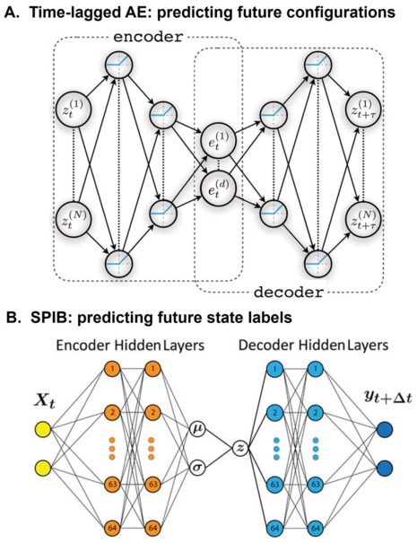

**Original caption:** FIG. 8: Autoencoder-based frameworks for forecasting dynamics. (A) Time-lagged autoencoders (TAEs) learn a latent representation that predicts configurations at a future time t + τ. Image reproduced from Ref. 140. Copyright 2018 AIP Publishing LLC. (B) State Predictive Information Bottleneck (SPIB) encodes configurations to predict future state labels, enabling automatic identification of metastable states. Image reproduced from Ref. 144. Copyright 2021 AIP Publishing LLC.

**中文图注:** 如图。 8：基于自动编码器的动态预测框架。 (A) 时滞自动编码器 (TAE) 学习预测未来时间 t + τ 的配置的潜在表示。图片转载自参考文献。 140. 版权所有 2018 AIP Publishing LLC。 (B) 状态预测信息瓶颈 (SPIB) 对配置进行编码以预测未来的状态标签，从而实现亚稳态的自动识别。图片转载自参考文献。 144. 版权所有 2021 AIP Publishing LLC。

**Reading note / 阅读提示：** Inspect this visual together with the immediately preceding source block; it is placed at the first substantive discussion available in the extracted text.

**Source:** p.15 S162

**Original:** 99, 139

**中文:** 99, 139

**Source:** p.15 S163

**Original:** 130 126

**中文:** 130 126

**Source:** p.15 S164

**Original:** reconstruction and trained to maximize the autocorrelation of the latent space to resemble the properties of the transfer operator.141 Sultan et al.142 applied the VDE framework to encode information about the slow modes of the systems into CVs for enhanced sampling. As a general tendency, however, it has been shown that both TAEs and VDEs tend to learn a mixture of slow and maximum variance modes143.

**中文:** 重建并进行训练以最大化潜在空间的自相关性，以类似于传递算子的属性。141 Sultan 等人142 应用 VDE 框架将有关系统慢模式的信息编码到 CV 中以增强采样。然而，作为一般趋势，事实证明 TAE 和 VDE 都倾向于学习慢速和最大方差模式的混合143。

**Source:** p.15 S165

**Original:** Similar to TAE and VDE, a time lag can also be introduced in the RAVE approach.108 Tiwary et al. used a past-future information bottleneck (PIB) optimization scheme and modified the objective function of RAVE to L = I(χ, x∆t) −γI(x, χ)145. The mutual information I(χ, x∆t) quantifies how much an observation at one instant of time t can tell us about an observation at another instant of time t + ∆t, while I(x, χ) represents the mutual information between input and latent representation χ at time t. Wang et al. discuss the role of predictive time delay in RAVE and further introduce a correction for the objective function to take into account the effect of the biasing potential on the dynamical propagator of the system146. Later, Wang et al. introduced state predictive information bottleneck (SPIB)144, which constructs a compressed representation able to predict the future state label. Once a time delay ∆t is selected, SPIB can automatically index the high-dimensional state space into metastable states through an iterative retraining algorithm. Additionally, SPIB tries to carry the maximum information of the state-transition density,

**中文:** 与 TAE 和 VDE 类似，RAVE 方法中也可以引入时间滞后。108 Tiwary 等人。使用过去未来信息瓶颈（PIB）优化方案，并将 RAVE 的目标函数修改为 L = I(χ, xΔt) −γI(x, χ)145。互信息 I(χ, xΔt) 量化了在时间 t 的某一时刻的观察可以告诉我们在时间 t + Δt 的另一时刻的观察的多少，而 I(x, χ) 表示时间 t 时输入和潜在表示 χ 之间的互信息。王等人。讨论 RAVE 中预测时间延迟的作用，并进一步引入对目标函数的校正，以考虑偏置电势对系统动态传播器的影响146。后来，王等人。引入了状态预测信息瓶颈（SPIB）144，它构造了能够预测未来状态标签的压缩表示。一旦选择了时间延迟 Δt，SPIB 就可以通过迭代再训练算法自动将高维状态空间索引为亚稳态。此外，SPIB试图承载状态转移密度的最大信息，

**Source:** p.15 S166

**Original:** Notes Conformational Biophysics Ligand Binding Phase Transformations Chemical Systems

**中文:** 笔记 构象生物物理学 配体结合 相变 化学系统

**Source:** p.15 S167

**Original:** (H)LDA78 Linear Discriminant Analysis 78, 81 127 80

**中文:** (H)LDA78 线性判别分析 78, 81 127 80

**Source:** p.15 S168

**Original:** Deep-LDA82 NN extension of LDA 128, 129, 130 131, 132, 133 72

**中文:** LDA 的 Deep-LDA82 NN 扩展 128, 129, 130 131, 132, 133 72

**Source:** p.15 S169

**Original:** Deep-TDA83,86 Targeted discrimination 86 83, 84, 85 134 76

**中文:** Deep-TDA83,86 有针对性的歧视 86 83, 84, 85 134 76

**Source:** p.15 S170

**Original:** RAVE108 Linear CV from variational AE 109 135, 136, 137

**中文:** RAVE108 变分 AE 的线性 CV 109 135, 136, 137

**Source:** p.15 S171

**Original:** PINES100 AE + PIV inputs (solvent) 100

**中文:** PINES100 AE + PIV 输入（溶剂） 100

**Source:** p.15 S172

**Original:** NN PCV117 NN local classifier to build path CV 117

**中文:** NN PCV117 用于构建路径 CV 117 的 NN 局部分类器

## Page 16

**Source:** p.16 S173

**Original:** which, in principle, can be equivalent to the traditional committor function if there is a timescale separation between the state-to-state transitions and the fluctuations within metastable states.

**中文:** 原则上，如果状态间转换和亚稳态内的波动之间存在时间尺度分离，则可以等效于传统的提交者函数。

**Source:** p.16 S174

**Original:** 3.4.2 Dynamical operator learning

**中文:** 3.4.2 动态算子学习

**Source:** p.16 S175

**Original:** Another broad class of approaches for identifying slow CVs in molecular simulations is based on the idea of learning the dynamical operator that governs the time evolution of the system, such as the Koopman or transfer operator147. Learning these operators offers a description of the system’s dynamical modes, which can be obtained from their spectral decomposition, namely, their eigenfunctions ψi and eigenvalues λi. Of particular interest are the eigenfunctions associated with the largest eigenvalues, which describe the slowest evolving components of the dynamics and often are associated with the rare transitions between metastable states. These eigenfunctions thus offer a natural, low-dimensional representation of the system’s long-time behavior and arguably serve as ideal candidates for CVs in enhanced sampling methods148. While these operators can’t be determined analyt-

**中文:** 在分子模拟中识别慢速 CV 的另一类广泛方法是基于学习控制系统时间演化的动态算子的思想，例如库普曼或传递算子147。学习这些算子提供了对系统动态模式的描述，可以从它们的谱分解中获得，即它们的本征函数 ψi 和本征值 λi。特别令人感兴趣的是与最大特征值相关的特征函数，它描述了动力学中演化最慢的组成部分，并且通常与亚稳态之间的罕见转变相关。因此，这些特征函数提供了系统长期行为的自然、低维表示，并且可以说是增强采样方法中 CV 的理想候选者148。虽然这些运算符无法通过分析确定

**Source:** p.16 S176

**Original:** 3 DATA-DRIVEN LEARNING OF COLLECTIVE VARIABLES

**中文:** 3 数据驱动的集体变量学习

**Source:** p.16 S177

**Original:** ically, they can be approximated from time series data. This has led to the development of a family of approaches known as dynamical operator learning, which also spans different communities, in which one seeks to recover the dominant spectral components of the underlying operator directly from trajectories. Most of these methods rely on variational principles to construct optimal finite-dimensional approximations of the operator’s eigenfunctions within a chosen function space, such as in (extended) dynamic mode decomposition149,150 and the variational approach for conformation dynamics (VAC)151–153. Here we focus on the latter, which has been developed in the context of atomistic simulations and can be seen as a specific instance of Koopman operator learning under the assumptions of equilibrium and time-reversible dynamics154. VAC relies on a variational principle that allows the eigenfunctions to be approximated using a set of trial functions ̃ψi. The idea is to find functions that maximize their time-autocorrelation:

**中文:** 一般来说，它们可以根据时间序列数据进行近似。这导致了一系列被称为动态算子学习的方法的发展，这些方法也跨越了不同的社区，其中人们试图直接从轨迹中恢复底层算子的主要频谱分量。这些方法大多数依赖变分原理在选定的函数空间内构造算子本征函数的最佳有限维近似，例如（扩展）动态模式分解149,150和构象动力学的变分方法（VAC）151-153。这里我们重点关注后者，它是在原子模拟的背景下开发的，可以看作是在平衡和时间可逆动力学假设下库普曼算子学习的一个具体实例154。 VAC 依赖于变分原理，该原理允许使用一组试验函数 ̃ψi 来近似特征函数。这个想法是找到最大化时间自相关的函数：

**Source:** p.16 S178

**Original:** D ̃ψi(Rt) ̃ψi(Rt+τ) E

**中文:** D ̃ψi(Rt) ̃ψi(Rt+τ) E

**Source:** p.16 S179

**Original:** ̃λi =

**中文:** ̃λi =

**Source:** p.16 S180

**Original:** D ̃ψ2 i (Rt) E (20)

**中文:** D ̃ψ2 i (Rt) E (20)

**Source:** p.16 S181

**Original:** The optimal trial functions approximate the true eigenfunctions of the transfer operator, and the corresponding values ̃λi ≥λi reflect how slowly these modes decay over time. This variational formulation connects directly to quantities accessible from trajectory data, enabling the extraction of slow CVs from molecular simulations in a statistically grounded way. In practice, the trial functions can be expressed as linear or nonlinear combinations of features, with parameters optimized to maximize the autocorrelation score. A widely used implementation of the VAC principle is time-lagged independent component analysis (TICA)152,155–157. Originally introduced as a signal processing technique to extract slowly decorrelating components from multivariate time series155, TICA has been shown to be equivalent to VAC when the trial functions are restricted to linear combinations of input features152:

**中文:** 最佳试验函数近似于传递算子的真实本征函数，并且相应的值 ̃λi ≥λi 反映了这些模式随时间衰减的速度。这种变分公式直接与可从轨迹数据获取的量相关联，从而能够以统计基础的方式从分子模拟中提取慢速 CV。在实践中，试验函数可以表示为特征的线性或非线性组合，并优化参数以最大化自相关得分。 VAC 原理的一种广泛使用的实现是时滞独立成分分析 (TICA)152,155–157。 TICA 最初是作为一种信号处理技术引入的，用于从多元时间序列中提取缓慢去相关分量155，当试验函数仅限于输入特征的线性组合152 时，TICA 已被证明与 VAC 等效：

**Source:** p.16 S182

**Original:** ̃ψi(Rt) = w⊤ i xt (21)

**中文:** ̃ψi(Rt) = w⊤ i xt (21)

**Source:** p.16 S183

**Original:** where xt is the features vector (e.g., distances, angles) at time t, and wi are the coefficients. These are obtained by solving the generalized eigenvalue problem:

**中文:** 其中 xt 是时间 t 的特征向量（例如距离、角度），wi 是系数。这些是通过求解广义特征值问题获得的：

**Source:** p.16 S184

**Original:** Cτ wi = ̃λi C0 wi (22)

**中文:** Cτ wi = ̃λi C0 wi (22)

**Source:** p.16 S185

**Original:** where C0 = ⟨xtd⊤ t ⟩is the covariance matrix and Cτ = ⟨dtd⊤ t+τ⟩is the time-lagged covariance matrix. In this way, TICA identifies orthogonal directions in feature space that maximize autocorrelation at a chosen lag time, thereby capturing the slowest dynamical processes in the data. Unlike methods such as PCA and LDA, which focus on maximizing structural variance, TICA is explicitly designed to extract slow modes and is particularly useful for identifying reaction coordinates and kinetic bottlenecks in complex molecular systems. It has been applied to analyze molecular trajectories158–160 and to derive CVs for enhanced sampling160. McCarty and Parrinello further

**中文:** 其中 C0 = ⟨xtd⊤ t ⟩ 是协方差矩阵，Cτ = ⟨dtd⊤ t+τ⟩ 是时滞协方差矩阵。通过这种方式，TICA 可以识别特征空间中的正交方向，从而在选定的滞后时间最大化自相关，从而捕获数据中最慢的动态过程。与 PCA 和 LDA 等侧重于最大化结构方差的方法不同，TICA 专门设计用于提取慢模式，对于识别复杂分子系统中的反应坐标和动力学瓶颈特别有用。它已被应用于分析分子轨迹158-160 并导出用于增强采样的CV160。麦卡蒂和帕里内罗进一步

## Page 17

**Source:** p.17 S186

**Original:** expanded this idea by learning effective CVs from biased metadynamics trajectories using TICA in combination with reweighting techniques158.

**中文:** 通过使用 TICA 结合重新加权技术从有偏差的元动力学轨迹中学习有效的 CV，扩展了这一想法158。

**Source:** p.17 S187

**Original:** obtained by solving the TICA eigenproblem on the transformed descriptors dθ. To address the challenge of obtaining relevant data, the authors proposed to start from CVs free methods to generate initial biased trajectories, such as multicanonical sampling. Alternatively, an initial simulation may be carried out using CVs optimized via structural criteria, and Deep-TICA can then be applied to refine the CVs. In both cases, the time is rescaled according to the instantaneous acceleration induced by the bias potential V , i.e., ∆t′ = eβV (xtk ) ∆t, and the time-correlation functions are computed in this accelerated space using unevenly spaced intervals proposed in Ref. 159. While being an approximation of the unbiased dynamical modes, this method identifies the sampling bottlenecks of the initial biased simulation and, by using them as CVs, can enhance sampling by orders of magnitude. Another nonlinear variant builds on the Variational Approach to Markov Processes (VAMP), which generalizes the VAC principle to non-equilibrium settings. In particular, VAMPnets162 uses a two-lobed unsupervised neural network that maps pairs of molecular configurations (separated by a lag time τ) into a low-dimensional latent space. These outputs are then used to estimate time-lagged covariance matrices and optimize the VAMP score, which quantifies the quality of the learned dynamical model. However, because VAMPnets typically express their output in terms of soft assignments to metastable states, they are not directly suited for defining CVs in enhanced sampling. To address this, Chen et al. introduced a variant called state-free reversible VAMPnets (SRVs)163, which directly approximates the eigenfunctions ̃ψi of the transfer operator using a siamese neural network architecture, similar in spirit to Deep-TICA (although SRVs were introduced earlier, but only for unbiased simulations). Building on this methodology, Shmilovich et al. proposed the Girsanov reweighting enhanced sampling technique (GREST)164, which extends SRVs to biased simulations. GREST uses the Girsanov formalism165,166 to reweight biased trajectories, accounting for both thermodynamic and integratorspecific path corrections, and enables unbiased estimation of dynamical observables from biased simulations. Furthermore, the TICA principle has been integrated into the t-distributed stochastic neighbor embedding (t-SNE) method, leading to the development of time-lagged t-SNE161, a variant that emphasizes slowly evolving molecular modes over fast fluctuations. To address the requirement of out-of-sample embedding and differentiability required by enhanced sampling techniques, this approach was extended into a parametric time-lagged t-SNE, where a neural network was trained to map Cartesian coordinates to a low-dimensional latent space while preserving timelagged similarities. The resulting coordinates were then used as CVs in metadynamics simulations167. To summarize, all these methods aim to approximate the leading eigenfunctions of a dynamical operator. A central challenge common to all approaches is the need for sufficiently informative data. Since the operators being learned reflect the system’s long-time

**中文:** 通过求解变换后的描述符 dθ 上的 TICA 特征问题获得。为了解决获取相关数据的挑战，作者建议从无 CV 的方法开始，生成初始有偏差的轨迹，例如多规范采样。或者，可以使用通过结构标准优化的 CV 进行初始模拟，然后可以应用 Deep-TICA 来细化 CV。在这两种情况下，时间都会根据偏置电势 V 引起的瞬时加速度进行重新调整，即 Δt′ = eβV (xtk ) Δt，并且使用参考文献 1 中提出的不均匀间隔在这个加速空间中计算时间相关函数。 159. 虽然是无偏动态模式的近似，但该方法识别了初始有偏模拟的采样瓶颈，并通过将它们用作 CV，可以将采样增强几个数量级。另一种非线性变体建立在马尔可夫过程变分法 (VAMP) 的基础上，它将 VAC 原理推广到非平衡设置。特别是，VAMPnets162 使用双叶无监督神经网络，将分子构型对（由滞后时间 τ 分隔）映射到低维潜在空间。然后，这些输出用于估计时滞协方差矩阵并优化 VAMP 分数，从而量化学习动态模型的质量。然而，由于 VAMPnet 通常以亚稳态的软分配来表达其输出，因此它们并不直接适合在增强采样中定义 CV。为了解决这个问题，陈等人。引入了一种称为无状态可逆 VAMPnets (SRVs)163 的变体，它使用暹罗神经网络架构直接近似传输算子的特征函数 ̃ψi，其精神与 Deep-TICA 类似（虽然 SRVs 较早引入，但仅用于无偏模拟）。基于这种方法，Shmilovich 等人。提出了 Girsanov 重新加权增强采样技术 (GREST)164，该技术将 SRV 扩展到有偏差的模拟。 GREST 使用 Girsanov 形式165,166 重新加权有偏差的轨迹，同时考虑热力学和积分器特定的路径修正，并能够从有偏差的模拟中对动态可观测值进行无偏差估计。此外，TICA 原理已集成到 t 分布随机邻域嵌入 (t-SNE) 方法中，从而开发了时滞 t-SNE161，这是一种强调缓慢演化的分子模式而不是快速波动的变体。为了满足增强采样技术所需的样本外嵌入和可微分性的要求，这种方法被扩展到参数化时间滞后 t-SNE，其中神经网络经过训练将笛卡尔坐标映射到低维潜在空间，同时保留时间滞后的相似性。然后将所得坐标用作元动力学模拟中的 CV167。总而言之，所有这些方法都旨在逼近动力学算子的主要特征函数。所有方法共同的一个核心挑战是需要足够信息丰富的数据。由于所学习的算子反映了系统的长期

**Source:** p.17 S188

**Original:** Several nonlinear extensions to TICA have been proposed to increase its representational power and better capture complex dynamical modes, including kernel methods157 and neural networks59,161. Here, we focus in particular on those relevant to enhanced sampling simulations. Bonati et al. introduced DeepTICA59 which uses neural networks trial functions in the VAC framework by applying TICA to the output of a learned nonlinear transformation (see Fig. 9). The original inputs dt (e.g., atomic coordinates or structural features) are transformed by a neural network into hidden features hθ = fθ(dt), where θ denotes the trainable parameters. TICA is then applied in the space of the learned features hθ, and the NN is optimized to produce features that best approximate the leading slow modes, or in other words, that have the longest autocorrelation. This is achieved by minimizing the negative sum of the top n eigenvalues :

**中文:** 人们提出了 TICA 的几种非线性扩展，以提高其表征能力并更好地捕获复杂的动态模式，包括核方法 157 和神经网络 59,161。在这里，我们特别关注与增强采样模拟相关的内容。博纳蒂等人。 DeepTICA59 引入了 DeepTICA59，它通过将 TICA 应用于学习的非线性变换的输出来使用 VAC 框架中的神经网络试验函数（见图 9）。原始输入 dt（例如原子坐标或结构特征）由神经网络转换为隐藏特征 hθ = fθ(dt)，其中 θ 表示可训练参数。然后将 TICA 应用到学习到的特征 hθ 的空间中，并对神经网络进行优化，以生成最接近领先慢模式的特征，或者换句话说，具有最长自相关的特征。这是通过最小化前 n 个特征值的负和来实现的：

### Fig. 009. Deep-TICA 用于学习慢速 CV。该方法使用转移算子框架来学习捕获系统慢速

**Placed near:** p.17 S188

**Source:** p.17 C010

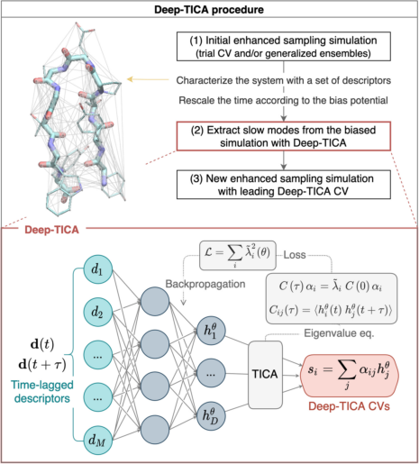

**Original caption:** FIG. 9: Deep-TICA for learning slow CVs. This method uses the transfer operator framework to learn CVs that capture the system’s slow modes and remove dynamical bottlenecks in simulations. (Top) The protocol used: an initial enhanced sampling simulation is performed using a trial CV or generalized ensemble; time is rescaled to account for the bias potential; slow modes are extracted and used as CVs to drive a new enhanced sampling simulation. (Bottom) Neural network architecture: pairs of time-lagged descriptors are mapped into a latent space, where TICA is applied to compute eigenvalues and eigenfunctions. The NN transformation is then optimized to maximize the TICA score (eigenvalues). Image reproduced from Ref. 59. Copyright 2021 National Academy of Science.

**中文图注:** 如图。 9：Deep-TICA 用于学习慢速 CV。该方法使用转移算子框架来学习捕获系统慢速模式并消除模拟中的动态瓶颈的 CV。 （上）使用的协议：使用试验 CV 或广义集成执行初始增强采样模拟；时间被重新调整以考虑偏置电位；提取慢模式并用作 CV 来驱动新的增强采样模拟。 （下）神经网络架构：时滞描述符对被映射到潜在空间，其中 TICA 用于计算特征值和特征函数。然后优化 NN 变换以最大化 TICA 分数（特征值）。图片转载自参考文献。 59. 版权所有 2021 美国国家科学院。

**Reading note / 阅读提示：** Inspect this visual together with the immediately preceding source block; it is placed at the first substantive discussion available in the extracted text.

**Source:** p.17 S189

**Original:** n X

**中文:** nX

**Source:** p.17 S190

**Original:** i=1 ̃λ2 i (23)

**中文:** i=1 ̃λ2 i (23)

**Source:** p.17 S191

**Original:** LDeep-TICA(θ) = −

**中文:** LDeep-TICA(θ) = −

## Page 18

**Source:** p.18 S192

**Original:** dynamics, the quality of the approximation crucially depends on whether the relevant transitions are sampled in the input trajectories. This often requires the use of enhanced sampling techniques to generate such data. However, biased simulations introduce distortions in the sampled dynamics, which must be corrected if one wishes to recover unbiased dynamical information, as exemplified by the GREST approach. For a comparison between different reweighting strategies for time-lagged data, see also Ref. 168. An alternative approach has recently been pursued by considering the limit of vanishing lag time, which leads to the definition of the infinitesimal generator rather than the transfer operator. When assuming that the probability density evolves toward equilibrium according to an overdamped Langevin equation, the infinitesimal generator admits an analytical expression given by the backward Kolmogorov equation169. This analytic form enables the computation of slow modes directly from Boltzmannweighted averages170–174, thereby facilitating the use of data obtained from biased simulations170,173,174. Notably, Devergne et al.173,174 demonstrated that, even using biased simulations, it is possible to recover the time evolution of the occupation numbers of metastable states in molecular systems. Moreover, the infinitesimal generator has been used in conjunction with generative models to extract kinetic properties175

**中文:** 在动力学中，近似的质量关键取决于是否在输入轨迹中对相关转换进行了采样。这通常需要使用增强采样技术来生成此类数据。然而，有偏差的模拟会在采样的动态中引入失真，如果希望恢复无偏差的动态信息，就必须对其进行纠正，如 GREST 方法所示。有关时滞数据的不同重新加权策略之间的比较，另请参阅参考文献。 168. 最近采取了一种替代方法，考虑消失滞后时间的限制，这导致定义无穷小生成器而不是传递算子。当假设概率密度根据过阻尼 Langevin 方程趋向平衡时，无穷小生成器允许由后向 Kolmogorov 方程 169 给出的解析表达式。这种分析形式可以直接根据玻尔兹曼加权平均值170-174计算慢模，从而促进使用从有偏差的模拟中获得的数据170,173,174。值得注意的是，Devergne 等人173,174 证明，即使使用有偏差的模拟，也可以恢复分子系统中亚稳态占据数的时间演化。此外，无穷小发生器已与生成模型结合使用来提取动力学特性175

**Source:** p.18 S193

**Original:** (Sec. 6).

**中文:** （第 6 节）。

**Source:** p.18 S194

**Original:** 3.4.3 Spatial techniques

**中文:** 3.4.3 空间技术

**Source:** p.18 S195

**Original:** While the methods discussed in the previous section aim to learn the spectral properties of dynamical operators directly from time-series data, another family of approaches focuses instead on deriving CVs by constructing or approximating a transition matrix between the states. A common feature of these methods is that they infer dynamical information by analyzing how configurations are likely to evolve probabilistically between states. In a recent review, Gokdemir and Rydzewski176 refer to this class as spatial techniques, since they exploit only equilibrium or thermodynamic information to build the transition matrix as opposed to time-lagged data.

**中文:** 虽然上一节中讨论的方法旨在直接从时间序列数据中学习动态算子的谱属性，但另一类方法侧重于通过构造或近似状态之间的转移矩阵来导出 CV。这些方法的一个共同特征是，它们通过分析配置如何在状态之间概率演化来推断动态信息。在最近的一篇评论中，Gokdemir 和 Rydzewski176 将此类称为空间技术，因为它们仅利用平衡或热力学信息来构建转换矩阵，而不是滞后数据。

**Source:** p.18 S196

**Original:** Diffusion maps177 estimate slow CVs by constructing a Markovian representation of data and diagonalizing the transition matrix. The construction of the matrix starts with computing pairwise similarities between data points using a Gaussian kernel Gε(xk, xl) = exp  −∥xk−xl∥2

**中文:** 扩散图 177 通过构建数据的马尔可夫表示并对转换矩阵进行对角化来估计慢速 CV。矩阵的构造首先使用高斯核计算数据点之间的成对相似度 Gε(xk, xl) = exp −∥xk−xl∥2

**Source:** p.18 S197

**Original:** ε2  , where the bandwidth ε controls the locality of interactions. To correct for non-uniform sampling, an anisotropic kernel is often employed: K(xk, xl) = Gε(xk, xl)/(ρα(xk)ρα(xl)), where ρ(xk) = P

**中文:** ε2 ，其中带宽 ε 控制交互的局部性。为了纠正非均匀采样，通常采用各向异性核：K(xk, xl) = Gε(xk, xl)/(ρα(xk)ρα(xl))，其中 ρ(xk) = P

**Source:** p.18 S198

**Original:** l Gε(xk, xl) is the density estimate and α is a parameter adjusting the degree of density correction. Normalizing this kernel yields the Markov transition matrix:

**中文:** l Gε(xk,xl)是密度估计，α是调整密度校正程度的参数。标准化该内核会产生马尔可夫转移矩阵：

**Source:** p.18 S199

**Original:** M(xk, xl) = K(xk, xl) P

**中文:** M(xk, xl) = K(xk, xl) P

**Source:** p.18 S200

**Original:** i K(xk, xi) (24)

**中文:** iK(xk, xi) (24)

**Source:** p.18 S201

**Original:** 3 DATA-DRIVEN LEARNING OF COLLECTIVE VARIABLES

**中文:** 3 数据驱动的集体变量学习

**Source:** p.18 S202

**Original:** which defines a discrete diffusion process over the dataset. The essential step in diffusion maps is the eigenvalue decomposition of this transition matrix: Mvk = λkvk, where the eigenvalues λk provide a measure of the timescales of diffusion, and thus the leading eigenfunctions define the diffusion coordinates, which project data into a reduced space preserving slow dynamics: Ψk(x) = λt kvk(x), where t is a diffusion time parameter controlling the scale of the transformation. For this reason, the diffusion coordinates could serve as effective CVs.178–180

**中文:** 它定义了数据集上的离散扩散过程。扩散图中的基本步骤是此转移矩阵的特征值分解：Mvk = λkvk，其中特征值 λk 提供扩散时间尺度的度量，因此主要特征函数定义扩散坐标，它将数据投影到保留慢速动态的缩减空间中：Ψk(x) = λt kvk(x)，其中 t 是控制变换规模的扩散时间参数。因此，扩散坐标可以作为有效的 CV。178–180

**Source:** p.18 S203

**Original:** Different generalizations have been proposed to adjust the transition probabilities and extract unbiased slow CVs in the case in which the dataset comes from enhanced sampling simulations. Evans et al. used a Mahalanobis kernel to account for position-dependent diffusion coefficients181 and corrected the probability distribution based on the applied bias potential182, p(x) ∝pbias(x)eβVbias(x). Other techniques, such as stochastic kinetic embedding (StKE) 183 and multiscale reweighted stochastic embedding (MRSE)184, incorporate the effect of the bias potential as importance weights to construct an unbiased Markov transition matrix. A crucial aspect that distinguishes stochastic embedding methods from diffusion maps is that they are optimized by minimizing the KL divergence between the transition probabilities in feature space pij and those in latent space qij. In this way, it is possible to learn CVs that preserve the dynamical structure of the system. Another family of methods, which includes spectral gap optimization of order parameters (SGOOP)185, seeks to optimize CVs by maximizing the spectral gap of a transition matrix. The spectral gap indeed quantifies the separation between slow and fast dynamics, with a large value indicating a good choice of CVs, ensuring that metastable states are well separated. In SGOOP, a linear combination was optimized using a maximum path entropy estimate of the spectral gap. Similarly, Spectral Map186 used a neural network mapping and optimized the spectral gap of the transition matrix in the reduced nonlinear space. Maximizing timescale separation in the spectral map induces dynamics with Markovian characteristics in the reduced space176, and this framework can also be extended to learn TSEs187.

**中文:** 在数据集来自增强采样模拟的情况下，已经提出了不同的概括来调整转移概率并提取无偏的慢速 CV。埃文斯等人。使用 Mahalanobis 核来解释位置相关的扩散系数181，并根据所施加的偏置势 182 p(x) ∝pbias(x)eβVbias(x) 校正概率分布。其他技术，例如随机动力学嵌入 (StKE) 183 和多尺度重加权随机嵌入 (MRSE) 184，将偏置势的影响作为重要性权重来构建无偏马尔可夫转移矩阵。区分随机嵌入方法与扩散图的一个关键方面是，它们是通过最小化特征空间 pij 中的转移概率与潜在空间 qij 中的转移概率之间的 KL 散度来优化的。通过这种方式，可以学习保留系统动态结构的 CV。另一类方法，包括阶次参数的谱间隙优化 (SGOOP)185，旨在通过最大化转移矩阵的谱间隙来优化 CV。谱间隙确实量化了慢动态和快动态之间的分离，值较大表明 CV 选择良好，确保亚稳态得到良好分离。在 SGOOP 中，使用光谱间隙的最大路径熵估计来优化线性组合。类似地，Spectral Map186 使用神经网络映射并优化了简化非线性空间中过渡矩阵的谱间隙。最大化频谱图中的时间尺度分离会在缩小的空间中产生具有马尔可夫特征的动态176，并且该框架也可以扩展以学习 TSE187。

**Source:** p.18 S204

**Original:** 3.5 Physics-based approaches: leveraging the committor function

**中文:** 3.5 基于物理的方法：利用提交者功能

**Source:** p.18 S205

**Original:** In this section, we examine another class of physicsbased approaches that use the committor function to learn CVs that characterize rare transitions in complex systems. The committor is a central quantity in the theory of rare events and underpins many enhanced sampling techniques. As a result, a number of methods have been developed that either machinelearn the committor or derive CVs based on its properties. We start by recalling its definition and some relevant properties. Given two metastable states, A and B, the committor function pB(R) denotes the proba-

**中文:** 在本节中，我们将研究另一类基于物理的方法，这些方法使用提交者函数来学习表征复杂系统中罕见转变的 CV。提交者是罕见事件理论中的核心数量，并支撑着许多增强采样技术。因此，人们开发了许多方法，可以对提交者进行机器学习，或者根据其属性导出 CV。我们首先回顾它的定义和一些相关属性。给定两个亚稳态 A 和 B，提交者函数 pB(R) 表示概率

## Page 19

**Source:** p.19 S206

**Original:** Forecasting

**中文:** 预测

**Source:** p.19 S207

**Original:** Slow modes

**中文:** 慢速模式

**Source:** p.19 S208

**Original:** Spatial techniques

**中文:** 空间技术

**Source:** p.19 S209

**Original:** bility that a trajectory initiated from configuration R will reach state B before A9,202. As a consequence, it satisfies pB(R) = 0 in basin A, pB(R) = 1 in basin B, and smoothly interpolates between these values along transition paths. In addition, sampled configurations for which pB(R) ≃0.5 are usually associated with the TSE, as they are equally likely to proceed to either basin. For these reasons, the committor is considered by many an ideal reaction coordinate for the description of rare events203–206. In practice, committor values for a given configuration ̃R can be estimated by initiating a large number of unbiased trajectories from ̃R and counting the fraction that reaches B before A. This empirical committor distribution can also be used to assess the quality of a CV, based on the idea that a good CV should strongly correlate with pB(R), i.e., configurations with the same CV value should lie on the same isocommittor surface. This principle can be used to guide the construction or optimization of CVs207. Methods for learning the committor can be broadly divided into three classes: (1) regression approaches that fit an explicit model to empirical committor values, (2) maximum likelihood approaches used with transition path data, and (3) variational principles. In the following, we will refer to as q(R) as the parametrizations of the committor. Regression. If a dataset of "experimental" committor values (Ri →pB(Ri)) is available, one can directly optimize the function q(R) approximate the committor function by minimizing the residual squared |q(Ri)−pB(Ri)|2. In a pioneering study, Ma and Dinner203 trained a neural network on structural features (e.g., distances and angles) to predict committor values directly from molecular configurations. As shown by France-Lanord et al., this approach can also be seen as learning a data-driven path CV118. A systematic comparison of ML models to learn the committor was

**中文:** 从配置 R 发起的轨迹将在 A9,202 之前到达状态 B 的能力。因此，它在流域 A 中满足 pB(R) = 0，在流域 B 中满足 pB(R) = 1，并且沿着过渡路径在这些值之间平滑插值。此外，pB(R) ≃0.5 的采样配置通常与 TSE 相关，因为它们同样有可能进入任一盆地。由于这些原因，许多人认为提交者是描述罕见事件的理想反应坐标203-206。在实践中，给定配置 ̃R 的提交者值可以通过从 ̃R 启动大量无偏轨迹并计算在 A 之前到达 B 的分数来估计。这种经验提交者分布也可以用于评估 CV 的质量，基于良好的 CV 应该与 pB(R) 强烈相关的思想，即具有相同 CV 值的配置应该位于相同的 isocommittor 表面上。该原则可用于指导 CVs207 的构建或优化。用于学习提交者的方法可以大致分为三类：（1）将显式模型拟合到经验提交者值的回归方法，（2）与转换路径数据一起使用的最大似然方法，以及（3）变分原理。在下文中，我们将 q(R) 称为提交者的参数化。回归。如果“实验”提交者值 (Ri →pB(Ri)) 的数据集可用，则可以通过最小化残差平方 |q(Ri)−pB(Ri)|2 来直接优化近似提交者函数的函数 q(R)。在一项开创性的研究中，Ma 和 Dining203 根据结构特征（例如距离和角度）训练了一个神经网络，以直接根据分子构型预测提交者值。正如 France-Lanord 等人所示，这种方法也可以看作是学习数据驱动的路径 CV118。用于学习提交者的 ML 模型的系统比较是

**Source:** p.19 S210

**Original:** carried out by Naleem et al.208; however, this type of supervised learning approaches requires large numbers of committor trajectories, which are computationally expensive to generate209. Maximum likelihood. An alternative strategy to reduce the cost of learning the committor is based on Maximum Likelihood Estimation204,209,210. The core idea behind MLE is to determine the model parameters that best describe the observed data by maximizing the likelihood function. In the approach proposed by Peters and Trout204, the committor is modeled as a sigmoid function of a single reaction coordinate s(R), which is expressed as a linear combination of physical descriptors. This yields a committor model of the form:

**中文:** 由 Naleem 等人进行208；然而，这种类型的监督学习方法需要大量的提交者轨迹，生成这些轨迹的计算成本很高209。最大可能性。降低学习提交者成本的另一种策略是基于最大似然估计204,209,210。 MLE背后的核心思想是通过最大化似然函数来确定最能描述观测数据的模型参数。在 Peters 和 Trout204 提出的方法中，提交者被建模为单个反应坐标 s(R) 的 sigmoid 函数，其表示为物理描述符的线性组合。这会产生以下形式的提交者模型：

**Source:** p.19 S211

**Original:** q(R) = q(s(R)) = 1 1 + e−s(R) (25)

**中文:** q(R) = q(s(R)) = 1 1 + e−s(R) (25)

**Source:** p.19 S212

**Original:** The data are obtained from TPS, where each shooting point is labeled according to whether the resulting trajectory reaches state B or A. This outcome can be interpreted as an instantaneous evaluation of the committor function. Given trajectories shot from configurations {Ri}, the likelihood of observing their outcome is written as:

**中文:** 数据是从TPS获得的，其中每个射击点根据所得轨迹是否达到状态B或A来标记。这个结果可以解释为对提交者函数的瞬时评估。给定从配置 {Ri} 拍摄的轨迹，观察到其结果的可能性可写为：

**Source:** p.19 S213

**Original:** L = Y

**中文:** L=Y

**Source:** p.19 S214

**Original:** i∈B q(s(Ri)) Y

**中文:** i∈B q(s(Ri)) Y

**Source:** p.19 S215

**Original:** i∈A [1 −q(s(Ri))] (26)

**中文:** i∈A [1 −q(s(Ri))] (26)

**Source:** p.19 S216

**Original:** where B and A denote the subsets of shooting points that terminate in states B and A, respectively. The parameters of the reaction coordinate s(R), such as the coefficients in the linear combination, are then optimized to maximize the likelihood in Eq. 26. Several extensions and modifications of the MLE framework have since been developed. These include the use of nonlinear string-based coordinates211, alternative path sampling techniques such as forward flux

**中文:** 其中B和A分别表示终止于状态B和A的射击点的子集。然后优化反应坐标 s(R) 的参数，例如线性组合中的系数，以最大化方程 (1) 中的似然度。 26. 此后，对 MLE 框架进行了一些扩展和修改。其中包括使用基于非线性字符串的坐标211、替代路径采样技术，例如前向通量

**Source:** p.19 S217

**Original:** Notes Conformational Biophysics Ligand Binding Phase Transformations

**中文:** 笔记构象生物物理学配体结合相变

**Source:** p.19 S218

**Original:** TAE140 Time-lagged AE 140

**中文:** TAE140 延时 AE 140

**Source:** p.19 S219

**Original:** VDE141 Time-lagged VAE + autocorrelation 142

**中文:** VDE141 时滞 VAE + 自相关 142

**Source:** p.19 S220

**Original:** (S)PIB144,145 Information bottleneck AE 144,188,189 188 190–193

**中文:** (S)PIB144,145 信息瓶颈 AE 144,188,189 188 190–193

**Source:** p.19 S221

**Original:** TICA Linear VAC 160 127

**中文:** 天加线性 VAC 160 127

**Source:** p.19 S222

**Original:** Deep-TICA59 NN extension of TICA 59 132,194 59

**中文:** TICA 的深-TICA59 NN 扩展 59 132,194 59

**Source:** p.19 S223

**Original:** SRV163& GREST164 State-free VAMPnets 164,195

**中文:** SRV163& GREST164 无状态 VAMPnet 164,195

**Source:** p.19 S224

**Original:** Time-lagged t-SNE161 t-SNE + TICA 167

**中文:** 时滞 t-SNE161 t-SNE + TICA 167

**Source:** p.19 S225

**Original:** Diffusion maps177 Non-linear kinetic diffusion embedding 178–180

**中文:** 扩散图 177 非线性动力学扩散嵌入 178–180

**Source:** p.19 S226

**Original:** StKE183 & MRSE184 Stochastic embedding 183

**中文:** StKE183 和 MRSE184 随机嵌入 183

**Source:** p.19 S227

**Original:** SGOOP185 Linear spectral gap optimization 196 197,198 199,200

**中文:** SGOOP185 线性光谱间隙优化 196 197,198 199,200

**Source:** p.19 S228

**Original:** Spectral Map186 NN spectral gap optimization 187,201

**中文:** 光谱图186 NN 光谱间隙优化 187,201

### Table 002. 基于物理的机器学习集体变量及其应用的概述。

**Placed near:** p.19 S228

**Source:** p.19 C011

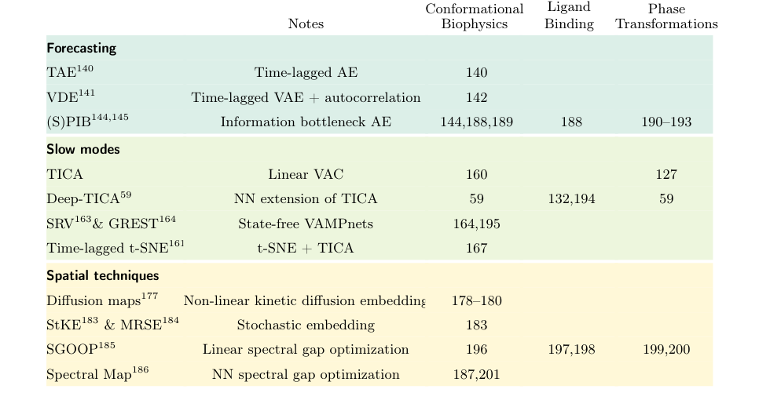

**Original caption:** TABLE 2: Overview of physics-based machine learning collective variables and their applications.

**中文图注:** 表 2：基于物理的机器学习集体变量及其应用的概述。

**Reading note / 阅读提示：** Inspect this visual together with the immediately preceding source block; it is placed at the first substantive discussion available in the extracted text.

## Page 20

**Source:** p.20 S229

**Original:** sampling210, and strategies to reduce the number of committor evaluations212. More recently, neural networks have been adopted to represent the reaction coordinate in a more flexible and expressive way. Frassek et al.213 introduced an extended autoencoder architecture in which the latent bottleneck representation is passed to a separate predictor module trained to estimate committor values. Jung et al.214 developed the artificial intelligence for molecular mechanism discovery (AIMMD) framework, which iteratively combines neural-network-based committor learning via MLE with adaptive selection of shooting points in TPS (see Fig. 10A). Additionally, symbolic regression is used post hoc to extract interpretable physical expressions for the learned coordinate. This approach was later extended by Lazzeri et al.54, who introduced reweighting schemes that allow for the recovery of free energy estimates from the TPS data. Variational approaches for learning the committor function have also been proposed that bypass the need to estimate committor values explicitly. Krivov and coworkers exploited a variational principle based on minimizing the total squared displacement over equilibrium trajectories that start in A and end in B.215,216 Specifically, they showed that the committor minimizes the functional

**中文:** 抽样210，以及减少承诺者评估数量的策略212。最近，神经网络被采用来以更灵活和更具表现力的方式表示反应坐标。 Frassek 等人213 引入了一种扩展的自动编码器架构，其中潜在瓶颈表示被传递到一个单独的预测器模块，该模块经过训练来估计提交者值。 Jung等人214开发了用于分子机制发现（AIMMD）框架的人工智能，该框架将通过MLE进行的基于神经网络的提交者学习与TPS中的射击点的自适应选择迭代地结合起来（见图10A）。此外，事后使用符号回归来提取学习坐标的可解释物理表达式。 Lazzeri 等人后来扩展了这种方法54，他们引入了重新加权方案，可以从 TPS 数据中恢复自由能估计。还提出了学习提交者函数的变分方法，绕过了显式估计提交者值的需要。 Krivov 和他的同事利用了一种变分原理，该原理基于最小化从 A 开始到 B.215,216 结束的平衡轨迹上的总平方位移。具体来说，他们表明提交者最小化了函数

### Fig. 010. 学习提交者函数和增强过渡状态采样的两种方法。 (A) AIMMD 方法迭代地将 

**Placed near:** p.20 S229

**Source:** p.21 C012

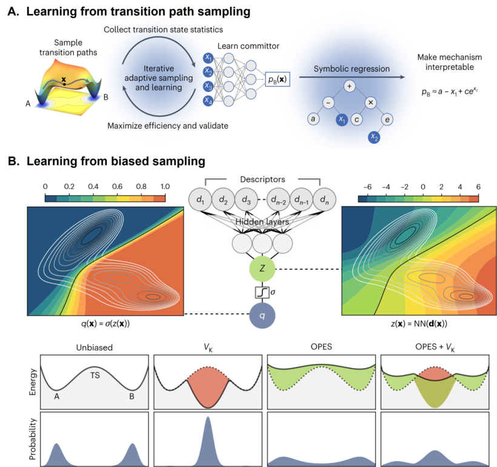

**Original caption:** FIG. 10: Two approaches for learning the committor function and enhancing sampling of the transition state. (A) The AIMMD method iteratively combines TPS with a neural network estimate of the committor pB(x), which is then used to promote shooting from the transition state. At convergence, symbolic regression distills an interpretable expression for the mechanism. Image adapted from Ref. 214. Copyright 2023 Springer Nature under [CC BY 4.0 DEED]. (B) (top) A variational approach where a neural network maps descriptors d(x) into a smooth latent space z, related to the committor, and adds a bias VK to keep the system near the transition state, improving committor estimates. (bottom) The panels illustrate how the bias VK can also be integrated with standard CV-based biases such as OPES to obtain a combined effect. Image adapted from Ref. 217. Copyright 2025 Springer Nature.

**中文图注:** 如图。图 10：学习提交者函数和增强过渡状态采样的两种方法。 (A) AIMMD 方法迭代地将 TPS 与提交者 pB(x) 的神经网络估计相结合，然后用于促进从过渡状态的射击。在收敛时，符号回归提炼出该机制的可解释表达式。图片改编自参考文献。 214. 版权所有 2023 Springer Nature [CC BY 4.0 DEED]。 (B)（上）一种变分方法，其中神经网络将描述符 d(x) 映射到与提交者相关的平滑潜在空间 z，并添加偏差 VK 以保持系统接近过渡状态，从而改进提交者估计。 （下）面板说明了偏置 VK 如何与标准的基于 CV 的偏置（例如 OPES）集成以获得组合效果。图片改编自参考文献。 217. 版权所有 2025 施普林格自然。

**Reading note / 阅读提示：** Inspect this visual together with the immediately preceding source block; it is placed at the first substantive discussion available in the extracted text.

**Source:** p.20 S230

**Original:** k [q(k∆t0 + ∆t0) −q(k∆t0)]2 , (27)

**中文:** k [q(kΔt0 + Δt0) −q(kΔt0)]2 , (27)

**Source:** p.20 S231

**Original:** ∆q2 = X

**中文:** Δq2 = X

**Source:** p.20 S232

**Original:** where q(t) is constrained to satisfy q = 0 in state A and q = 1 in state B. Roux and coworkers formulated a variational principle based on the dynamical evolution of the system as governed by the propagator Pτ. Under appropriate assumptions218,219, the committor function can be obtained by minimizing the steady-state unidirectional reactive flux:

**中文:** 其中 q(t) 被限制为在状态 A 下满足 q = 0，在状态 B 下满足 q = 1。Roux 和同事根据传播器 Pτ 控制的系统动态演化制定了变分原理。在适当的假设下218,219，可以通过最小化稳态单向无功通量来获得提交函数：

**Source:** p.20 S233

**Original:** JAB = 1

**中文:** 联合攻击 = 1

**Source:** p.20 S234

**Original:** D [q(τ) −q(0)]2E = 1

**中文:** D [q(τ) −q(0)]2E = 1

**Source:** p.20 S235

**Original:** τ Cqq(τ) (28)

**中文:** τ Cqq(τ) (28)

**Source:** p.20 S236

**Original:** where Cqq(τ) = ⟨q(0)2⟩−⟨q(0) q(τ)⟩is a time correlation function. Interestingly, this approach is somewhat akin to the one exploited in time-informed methods such as TICA59,155 and VAMPnets162. The variational flux principle has been applied using the string method by He et al.220 and siamese neural networks by Chen et al.221 and also by Megias et al.222. In the latter, the variational approach was used to learn committor-consistent strings in a reduced CV space to be used as a path CV. Another line of work derives a variational formulation from the Kolmogorov backward equation, which governs the committor function under overdamped Langevin dynamics. The corresponding function to be minimized is

**中文:** 其中 Cqq(τ) = ⟨q(0)2⟩−⟨q(0) q(τ)⟩ 是时间相关函数。有趣的是，这种方法有点类似于 TICA59,155 和 VAMPnets162 等时间通知方法中使用的方法。 He 等人220 使用弦方法应用了变分通量原理，Chen 等人221 以及Megias 等人222 使用连体神经网络。在后者中，变分方法用于在缩小的 CV 空间中学习提交者一致的字符串，以用作路径 CV。另一项工作是从柯尔莫哥洛夫后向方程导出变分公式，该公式控制过阻尼朗之万动力学下的提交者函数。对应的要最小化的函数是

**Source:** p.20 S237

**Original:** K[q] = 1

**中文:** K[q] = 1

**Source:** p.20 S238

**Original:** Z |∇q(R)|2e−βU(R) dR = |∇q(R)|2

**中文:** Z |∇q(R)|2e−βU(R) dR = |∇q(R)|2

**Source:** p.20 S239

**Original:** U (29) where Z is the partition function and ⟨·⟩U denotes an average over the Boltzmann distribution. The boundary conditions q = 0 in A and q = 1 in B are imposed. As pointed out by Khoo et al.223, this formulation faces two main challenges: the gradients

**中文:** U (29) 其中 Z 是配分函数，⟨·⟩U 表示玻尔兹曼分布的平均值。在 A 中施加边界条件 q = 0，在 B 中施加边界条件 q = 1。正如 Khoo 等人223 所指出的，这个公式面临两个主要挑战：

**Source:** p.20 S240

**Original:** 3 DATA-DRIVEN LEARNING OF COLLECTIVE VARIABLES

**中文:** 3 数据驱动的集体变量学习

**Source:** p.20 S241

**Original:** ∇q are sharply localized in the transition region, and accurate Boltzmann-weighted sampling is required. To alleviate these issues, Li et al.224 combined hightemperature simulations or metadynamics with simple CVs. Rotskoff et al.225 employed replica exchange and umbrella sampling to enrich sampling of the TSE. To further address the sampling difficulty, Parrinello and coworkers226 proposed a self-consistent biasing scheme (Fig. 10B) that enhances sampling of the transition state region by introducing the following bias functional of the committor:

**中文:** ∇q 明显位于过渡区域，需要精确的玻尔兹曼加权采样。为了缓解这些问题，Li 等人224 将高温模拟或元动力学与简单的 CV 相结合。 Rotskoff 等人225 采用副本交换和伞式抽样来丰富 TSE 的抽样。为了进一步解决采样困难，Parrinello 和同事226提出了一种自洽偏置方案（图 10B），通过引入以下提交者偏置函数来增强过渡态区域的采样：

**Source:** p.20 S242

**Original:** VK(R) = −λ

**中文:** VK(R) = −λ

**Source:** p.20 S243

**Original:** β log  |∇q(R)|2 + ε  (30)

**中文:** β log |∇q(R)|2 + ε (30)

**Source:** p.20 S244

**Original:** where λ ∼1 controls the bias strength and ε > 0 is a regularization term. This bias guides the system toward regions where the gradient norm is large, enabling efficient sampling of the TSE, thus providing the data needed to optimize the committor via the variational formulation. We conclude this section with two general considerations. First, learning the committor function is particularly challenging due to the difficulty of obtaining informative data. In rare event scenarios, the committor is nearly constant (i.e., close to 0 or 1) for the vast majority of configurations, and only exhibits nontrivial behavior in the narrow transition region. As a consequence, data that provide meaningful information about the committor are inherently rare and difficult to sample. For this reason, it is crucial to employ iterative schemes that progressively enhance the sampling of the TSE. Although originating from different methodological frameworks, both AIMMD214 and the variational approach proposed by Kang et al.226 follow a similar strategy: they leverage a learned approximation of the committor to guide the next generation of informative data. The former employs a neural network estimate of the committor to iteratively refine shooting point selection in TPS, while the latter defines a bias potential based on the committor’s gradient, effectively turning the transition state region into a free energy minimum and promoting its exploration (Fig. 10). Second, while the committor is widely regarded as an ideal reaction coordinate from a theoretical standpoint205,219,227, its direct use as a CV in biased enhanced sampling schemes poses significant challenges. As mentioned just above, within metastable basins, the committor is approximately constant (i.e., close to 0 or 1), leading to vanishing gradients and, consequently, ineffective biasing forces. In contrast, within the transition region, the committor changes rapidly over a narrow range, which can result in large and unstable gradient values. These features limit the stability and effectiveness of using the committor directly as a biasing variable. To mitigate these issues, one can transform the committor using a smoothing function, for example, logit(q) = log (q/(1 −q)), or even adapt the biasing protocol itself. For instance, Rotskoff et al.225 designed an umbrella sampling scheme in which the window widths are tailored to the shape of the committor. Another strategy, proposed by Trizio et al.217, circumvents the use of the committor itself as

**中文:** 其中 λ ∼1 控制偏置强度，ε > 0 是正则化项。这种偏差引导系统走向梯度范数较大的区域，从而实现 TSE 的有效采样，从而通过变分公式提供优化提交者所需的数据。我们以两个一般性考虑来结束本节。首先，由于获取信息数据的困难，学习提交者功能特别具有挑战性。在罕见的事件场景中，对于绝大多数配置，提交者几乎是恒定的（即接近 0 或 1），并且仅在狭窄的过渡区域中表现出不平凡的行为。因此，提供有关提交者的有意义信息的数据本质上很少且难以采样。因此，采用逐步增强 TSE 采样的迭代方案至关重要。尽管源自不同的方法论框架，但 AIMMD214 和 Kang 等人提出的变分方法 226 都遵循类似的策略：它们利用学习到的提交者近似值来指导下一代信息数据。前者利用提交者的神经网络估计来迭代细化TPS中的射击点选择，而后者则根据提交者的梯度定义偏置势，有效地将过渡态区域转变为自由能最小值并促进其探索（图10）。其次，虽然从理论角度来看，提交者被广泛认为是理想的反应坐标205,219,227，但它在有偏增强采样方案中直接用作 CV 提出了重大挑战。如上所述，在亚稳态盆地内，提交者近似恒定（即接近 0 或 1），导致梯度消失，从而导致无效的偏置力。相反，在过渡区域内，提交者在狭窄的范围内快速变化，这可能导致梯度值大且不稳定。这些特征限制了直接使用提交者作为偏置变量的稳定性和有效性。为了缓解这些问题，可以使用平滑函数来转换提交者，例如 logit(q) = log (q/(1 −q))，甚至可以调整偏置协议本身。例如，Rotskoff 等人225 设计了一种伞式采样方案，其中窗口宽度根据提交者的形状进行定制。 Trizio 等人提出的另一种策略217 规避了使用提交者本身作为

## Page 21

**Source:** p.21 S245

**Original:** a CV. Instead, they insert a sigmoid activation function at the final layer of the neural network and define the CV as the pre-activation output (analogous to the reaction coordinate in maximum likelihood approaches). This choice yields a smoothly varying variable that avoids saturation in the metastable basins while encoding the same information as the committor. The resulting CV can then be effectively biased, enabling stable and efficient enhanced sampling (see Fig. 10B).

**中文:** 简历。相反，他们在神经网络的最后一层插入 sigmoid 激活函数，并将 CV 定义为预激活输出（类似于最大似然方法中的反应坐标）。这种选择产生一个平滑变化的变量，避免亚稳盆地饱和，同时编码与提交者相同的信息。然后可以有效地对所得 CV 进行偏置，从而实现稳定且高效的增强采样（见图 10B）。

**Source:** p.21 S246

**Original:** 3.6 Software

**中文:** 3.6 软件

**Source:** p.21 S247

**Original:** The development of MLCVs can significantly expand the capabilities of enhanced sampling methods. However, implementing these techniques in practice requires careful handling of data preprocessing, model training, and integration with MD engines. To

**中文:** MLCV 的发展可以显着扩展增强采样方法的能力。然而，在实践中实现这些技术需要仔细处理数据预处理、模型训练以及与 MD 引擎的集成。到

**Source:** p.21 S248

**Original:** streamline these workflows and make MLCVs more accessible, several software packages have been created. In this section, we review prominent tools that support the construction, training, and deployment of MLCVs in molecular simulations.

**中文:** 为了简化这些工作流程并使 MLCV 更易于访问，我们创建了多个软件包。在本节中，我们回顾了支持分子模拟中 MLCV 的构建、训练和部署的重要工具。

**Source:** p.21 S249

**Original:** mlcolvar is a Python package developed by Bonati et al.60 to construct and deploy MLCVs via the PLUMED56 plugin for free energy calculations. It provides a unified interface for defining, training, and exporting a wide range of CV models. Different architectures (such as FNN, AEs, GNNs) and objective functions are available, including a multitask framework to combine multiple objectives. A typical workflow involves extracting trajectory data using PLUMED, training the CV with mlcolvar, compiling the model with Torchscript, and loading it inside PLUMED using the pytorch module (Fig. 11). The package also supports post-processing and interpretability tools. Comprehensive documentation,

**中文:** mlcolvar 是 Bonati 等人开发的一个 Python 包。60 用于通过 PLUMED56 插件构建和部署 MLCV 以进行自由能计算。它提供了一个统一的界面，用于定义、训练和导出各种 CV 模型。可以使用不同的架构（例如 FNN、AE、GNN）和目标函数，包括组合多个目标的多任务框架。典型的工作流程包括使用 PLUMED 提取轨迹数据、使用 mlcolvar 训练 CV、使用 Torchscript 编译模型，以及使用 pytorch 模块将其加载到 PLUMED 中（图 11）。该软件包还支持后处理和可解释性工具。全面的文档，

### Fig. 011. 在 mlcolvar 中构建数据驱动的 CV 的工作流程的示意图。 CV 从即用

**Placed near:** p.21 S249

**Source:** p.22 C013

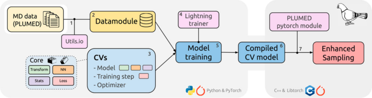

**Original caption:** FIG. 11: Schematic summary of the workflow for the construction of data-driven CVs in mlcolvar. A CV is selected from ready-to-use ones (mlcolvar.cvs) or built from the implemented building blocks (mlcolvar.core). After training, the model is compiled with the TorchScript language to be deployed to PLUMED for using it as a CV to enhance sampling. Image reproduced from Ref. 60. Copyright 2023 AIP Publishing LLS.

**中文图注:** 如图。图 11：在 mlcolvar 中构建数据驱动的 CV 的工作流程的示意图。 CV 从即用型 (mlcolvar.cvs) 中选择，或者从已实现的构建块 (mlcolvar.core) 构建。训练后，模型使用 TorchScript 语言编译，部署到 PLUMED 中，作为 CV 来增强采样。图片转载自参考文献。 60. 版权所有 2023 AIP Publishing LLS。

**Reading note / 阅读提示：** Inspect this visual together with the immediately preceding source block; it is placed at the first substantive discussion available in the extracted text.

## Page 22

**Source:** p.22 S250

**Original:** together with tutorials and examples, is available at https://mlcolvar.readthedocs.io/en/stable/.

**中文:** 以及教程和示例，请访问 https://mlcolvar.readthedocs.io/en/stable/。

**Source:** p.22 S251

**Original:** MLCV228, developed by Chipot and collaborators, integrates neural network models within the Colvars library61. It is written in C++, and it provides an interface for defining and evaluating neural networks using native Colvars inputs. To use MLCV, users need to extract the weights, biases, and activation functions of each layer from a TensorFlow neural network model into a text file using a Python script. The MLCV module is available in the latest release of Colvars229. Source code and examples can be found at https: //github.com/Colvars/colvars/tree/master.

**中文:** MLCV228 由 Chipot 及其合作者开发，将神经网络模型集成到 Colvars 库中61。它是用 C++ 编写的，提供了一个使用本机 Colvars 输入定义和评估神经网络的接口。要使用 MLCV，用户需要使用 Python 脚本将 TensorFlow 神经网络模型中每一层的权重、偏差和激活函数提取到文本文件中。最新版本的 Colvars229 中提供了 MLCV 模块。源代码和示例可以在 https://github.com/Colvars/colvars/tree/master 找到。

**Source:** p.22 S252

**Original:** DeepCV230, developed by Ketkaew and Luber, implements the DAENN algorithm99. It is built on TensorFlow and the software is implemented in both Python and C++ for efficient integration and extensibility. Documentation and tutorials are available at https://lubergroup.pages.uzh.ch/deepcv/.

**中文:** DeepCV230 由 Ketkaew 和 Luber 开发，实现了 DAENN 算法99。它基于 TensorFlow 构建，软件使用 Python 和 C++ 实现，以实现高效集成和可扩展性。文档和教程可在 https://lubergroup.pages.uzh.ch/deepcv/ 获取。

**Source:** p.22 S253

**Original:** 4 Applications of machine-learned CVs

**中文:** 4 机器学习简历的应用

**Source:** p.22 S254

**Original:** As discussed in the previous section, a wide range of ML approaches have been put forward to construct CVs, opening the door to an expanding range of applications in molecular simulations. To highlight their impact, we dedicate this section to showcasing the types of problems they can address and outlining the practical considerations involved. MLCVs have been particularly successful in tackling rare events that are beyond the reach of conventional MD, such as conformational transitions in biomolecules (e.g., protein folding), host–guest binding and unbinding, structural phase transformations, and complex chemical reactions. For each of these domains, we first review representative studies that illustrate how MLCVs have been applied to diverse systems and challenges. We then distill common methodological strategies, identify recurring limitations, and discuss open questions, aiming to provide a comprehensive perspective on the current capabilities and future directions of MLCVs in molecular simulations.

**中文:** 正如上一节所讨论的，人们提出了多种机器学习方法来构建 CV，这为扩大分子模拟的应用范围打开了大门。为了强调它们的影响，我们在本节中专门展示它们可以解决的问题类型并概述所涉及的实际考虑因素。 MLCV 在解决传统 MD 无法解决的罕见事件方面特别成功，例如生物分子中的构象转变（例如蛋白质折叠）、主客体结合和解除结合、结构相变和复杂的化学反应。对于每个领域，我们首先回顾了代表性研究，这些研究说明了 MLCV 如何应用于不同的系统和挑战。然后，我们提炼常见的方法策略，确定反复出现的局限性，并讨论悬而未决的问题，旨在为 MLCV 在分子模拟中的当前能力和未来方向提供全面的视角。

**Source:** p.22 S255

**Original:** 4 APPLICATIONS OF MACHINE-LEARNED CVS

**中文:** 4 机器学习 CVS 的应用

**Source:** p.22 S256

**Original:** 4.1 Biological conformational changes

**中文:** 4.1 生物构象变化

**Source:** p.22 S257

**Original:** Among the first and most prominent applications of MLCVs has been the study of conformational dynamics in biomolecular systems. These problems naturally involve rare transitions between metastable states and exhibit complex, high-dimensional free energy landscapes—ideal candidates for enhanced sampling aided by ML-driven dimensionality reduction. In this subsection, we focus on selected case studies where MLCVs have provided mechanistic insights and accelerated sampling in biologically relevant systems. These include protein folding, large-scale transitions in membrane transporters, the assembly of protein–protein complexes, and the impact of mutations on protein dynamics. Together, these examples showcase the versatility of ML approaches in resolving biologically meaningful motions and guiding simulation-based hypotheses. Protein folding is a fundamental biological process by which an amino acid chain adopts its secondary and tertiary structure to achieve its functional threedimensional structure. Many methods to construct MLCVs have been tested on simulating the folding pathways of small proteins such as chignolin and villin.59,79,86,231. Also, larger proteins have been studied with similar approaches. For example, Belkacemi et al. simulated the dynamics of the N-terminal domain of the heat-shock protein 90 (Hsp90) using an autoencoder-based CVs (FEBILAE) trained on clustered dihedral data, capturing transitions between known experimental conformers138. Membrane transporters are proteins that mediate the movement of ions and molecules across cell membranes, often through large conformational changes. To study the transition between the inward-open and outward-open states of the sodium potassium–chloride cotransporter NKCC1, classifier-based CVs (DeepLDA) have been combined with OPES sampling to reveal a rocking-bundle mechanism and highlight the membrane permeability to water.129

**中文:** MLCV 的第一个也是最突出的应用之一是生物分子系统中构象动力学的研究。这些问题自然涉及亚稳态之间罕见的转变，并表现出复杂的高维自由能景观——是机器学习驱动的降维辅助增强采样的理想候选者。在本小节中，我们重点关注选定的案例研究，其中 MLCV 在生物相关系统中提供了机制见解并加速采样。这些包括蛋白质折叠、膜转运蛋白的大规模转变、蛋白质-蛋白质复合物的组装以及突变对蛋白质动力学的影响。这些示例共同展示了机器学习方法在解决具有生物学意义的运动和指导基于模拟的假设方面的多功能性。蛋白质折叠是氨基酸链采用其二级和三级结构以实现其功能性三维结构的基本生物过程。许多构建 MLCV 的方法已经在模拟小蛋白质（例如 chignolin 和 villin）的折叠途径上进行了测试。59,79,86,231。此外，还用类似的方法研究了较大的蛋白质。例如，贝尔卡塞米等人。使用基于聚类二面体数据训练的基于自动编码器的 CV (FEBILAE) 模拟热休克蛋白 90 (Hsp90) N 端结构域的动态，捕获已知实验构象异构体之间的转变138。膜转运蛋白是介导离子和分子跨细胞膜运动的蛋白质，通常通过大的构象变化。为了研究钠钾-氯化物协同转运蛋白 NKCC1 的向内开放和向外开放状态之间的转变，基于分类器的 CV (DeepLDA) 与 OPES 采样相结合，以揭示摇摆束机制并突出膜对水的渗透性。 129

**Source:** p.22 S258

**Original:** DNA translocation in polymerases is a fundamental process for the genetic transcription process. After the addition of a new nucleotide, the forming DNA strand has to move along the enzyme to prepare for the next addition. Such a process has been studied by Visigalli et al.130 for the Polη enzyme, highlighting the combined action of residues at the protein-

**中文:** 聚合酶中的 DNA 易位是遗传转录过程的基本过程。添加新的核苷酸后，形成的 DNA 链必须沿着酶移动，为下一次添加做好准备。 Visigalli 等人 130 对 Polη 酶研究了这样的过程，强调了蛋白质残基的联合作用。

## Page 23

**Source:** p.23 S259

**Original:** DNA interface, acting like screen wipers to favour an asynchronous translocation of the DNA strand. In their study, they first run OPES232 simulations using a Deep-LDA CV82 starting from the known crystallographic structures, identifying two possible reaction pathways with stable intermediates. Then, they integrated this information into a 2D semi-supervised MultiTask CV60 to estimate the relative energetic cost of the two paths as shown in Fig. 12. This showcase how MLCVs can be effectively employed to combine the data coming from experiments (the initial states) with the simulations (intermediate states and path-

**中文:** DNA 接口，就像屏幕擦拭器一样，有利于 DNA 链的异步易位。在他们的研究中，他们首先使用 Deep-LDA CV82 从已知的晶体结构开始运行 OPES232 模拟，确定具有稳定中间体的两种可能的反应途径。然后，他们将这些信息集成到 2D 半监督多任务 CV60 中，以估计两条路径的相对能量成本，如图 12 所示。这展示了如何有效地利用 MLCV 将来自实验（初始状态）的数据与模拟（中间状态和路径）结合起来。

### Fig. 012. Polη 酶中的 DNA 易位。 (A) 模板链（蓝色）和引物链（红色）与酶（卡

**Placed near:** p.23 S259

**Source:** p.23 C014

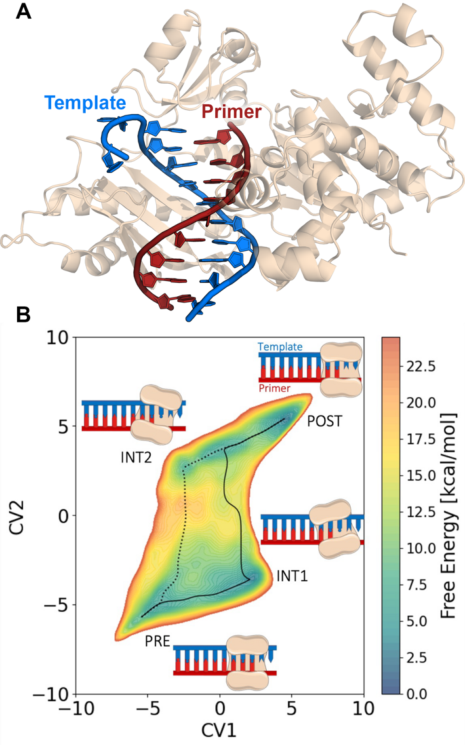

**Original caption:** FIG. 12: DNA translocation in the Polη enzyme. (A) The template strand (blue) and primer strand (red) are shown together with the enzyme (cartoon). (B) Free energy surface computed using a 2D semi-supervised multitask CV that integrates experimentally determined initial (PRE) and final (POST) states with intermediates and pathways identified from Deep-LDA-based OPES simulations. The simulations revealed two distinct translocation routes: pathway 1 (dashed line), where the primer translocates first followed by the template strand (via INT1), and pathway 2 (dotted line), where the template moves first (via INT2). This 2D representation captures the asynchronous DNA translocation mechanisms and highlights their relative free energy costs. Image A courtesy of Alessia Visigalli; image B reproduced from Ref. 130. Copyright 2025 American Chemical Society under [CC BY 4.0 DEED].

**中文图注:** 如图。图 12：Polη 酶中的 DNA 易位。 (A) 模板链（蓝色）和引物链（红色）与酶（卡通）一起显示。 (B) 使用 2D 半监督多任务 CV 计算自由能表面，该 CV 将实验确定的初始 (PRE) 和最终 (POST) 状态与从基于 Deep-LDA 的 OPES 模拟中确定的中间体和路径相结合。模拟揭示了两种不同的易位路线：途径 1（虚线），其中引物首先移位，然后是模板链（通过 INT1）；途径 2（虚线），其中模板首先移动（通过 INT2）。这种 2D 表示捕获了异步 DNA 易位机制并突出了它们的相对自由能源成本。图片由 Alessia Visigalli 提供；图片 B 复制自参考文献。 130. 版权所有 2025 美国化学会，根据 [CC BY 4.0 DEED]。

**Reading note / 阅读提示：** Inspect this visual together with the immediately preceding source block; it is placed at the first substantive discussion available in the extracted text.

**Source:** p.23 S260

**Original:** ways) into a single model. Protein–protein interactions are central to many cellular processes, and their assembly or activation often involves complex and rare structural transitions. Majumder and Staub studied the dimerization of GpA and WALP23 transmembrane proteins, comparing the performance of classifier-based (Deep-LDA) and time-informed CVs (SPIB) using well-tempered metadynamics189. Mutations in protein sequences can affect stability, dynamics, or function, and understanding these effects is crucial in both basic biology and biomedical research. To compare the stability of three mutants of the T4 lysozyme, Smith et al. combined data-driven descriptor selection (AMINO) and autoencoder-based MLCVs (RAVE) with metadynamics, also recovering precious insights into conformational preferences from an analysis of the learned reaction coordinates233. While these applications span a wide range of systems, they share common methodological steps and challenges. One key step is the initial generation of structural data for model training. This often begins with experimental structures, such as those obtained from X-ray diffraction or cryo-electronmicroscopy, but sequence-to-structure models (e.g., from AlphaFold2) are increasingly used to initialize simulation ensembles234. In addition, clustering of such initial conformations has also been used to define diverse starting points for short unbiased simulations, which are then used to train the CV models. Another central challenge lies in the selection of appropriate input features or descriptors. While CV models can, in principle, operate on large sets of interatomic distances, angles, or contact functions, this high-dimensional space is often redundant and unsuitable for biasing without further filtering. Various strategies have been proposed to address this. For instance, sparse linear models such as LASSO can be used to identify a minimal set of geometric features that best discriminate between states235. The AMINO method proposed by Ravindra et al., on the other hand, first clusters a large pool of candidate descriptors using a mutual information-based distance metric and then selects representative features from each cluster236. Following a different strategy, it is also possible to first train a CV model on a full descriptor set, then perform a sensitivity analysis to identify a subset of the most relevant features, and finally use them to retrain a more compact version of the model59.

**中文:** 方式）到一个单一的模型。蛋白质-蛋白质相互作用是许多细胞过程的核心，它们的组装或激活通常涉及复杂且罕见的结构转变。 Majumder 和 Staub 研究了 GpA 和 WALP23 跨膜蛋白的二聚化，使用经过调和的元动力学比较了基于分类器 (Deep-LDA) 和时间通知 CV (SPIB) 的性能189。蛋白质序列的突变会影响稳定性、动力学或功能，了解这些影响对于基础生物学和生物医学研究都至关重要。为了比较 T4 溶菌酶的三种突变体的稳定性，Smith 等人。将数据驱动的描述符选择 (AMINO) 和基于自动编码器的 MLCV (RAVE) 与元动力学相结合，还从对学习的反应坐标的分析中恢复对构象偏好的宝贵见解233。虽然这些应用程序涵盖广泛的系统，但它们具有共同的方法步骤和挑战。一个关键步骤是初始生成用于模型训练的结构数据。这通常从实验结构开始，例如从 X 射线衍射或冷冻电子显微镜获得的结构，但序列到结构模型（例如，来自 AlphaFold2）越来越多地用于初始化模拟整体234。此外，这种初始构象的聚类也被用来定义短期无偏模拟的不同起点，然后用于训练 CV 模型。另一个主要挑战在于选择适当的输入特征或描述符。虽然 CV 模型原则上可以对大量原子间距离、角度或接触函数进行操作，但这种高维空间通常是多余的，并且不适合在没有进一步过滤的情况下进行偏置。已经提出了各种策略来解决这个问题。例如，LASSO 等稀疏线性模型可用于识别最能区分状态的最小几何特征集235。另一方面，Ravindra 等人提出的 AMINO 方法首先使用基于互信息的距离度量对大量候选描述符进行聚类，然后从每个聚类中选择代表性特征236。采用不同的策略，也可以首先在完整的描述符集上训练 CV 模型，然后执行敏感性分析以识别最相关特征的子集，最后使用它们重新训练模型的更紧凑版本59。

**Source:** p.23 S261

**Original:** 4.2 Ligand binding

**中文:** 4.2 配体结合

**Source:** p.23 S262

**Original:** Besides conformational transitions, MLCVs have become powerful tools for studying ligand binding processes across a broad spectrum of biological and chemical systems, spanning simplified host–guest models, pharmacologically relevant protein targets, and complex environments like RNA folds and lipid membranes. A much-studied prototypical host-guest system is the set of calixarene host and small ligand guest molecules

**中文:** 除了构象转变之外，MLCV 已成为研究广泛生物和化学系统中配体结合过程的强大工具，涵盖简化的主客体模型、药理学相关的蛋白质靶标以及 RNA 折叠和脂质膜等复杂环境。一个经过大量研究的原型主客体系统是杯芳烃主体和小配体客体分子的集合

## Page 24

**Source:** p.24 S263

**Original:** proposed in the SAMPL5 challenge, which served as benchmarks for testing several sampling strategies and CV design. For example, Rizzi et al.131 used a classifier-based (Deep-LDA) CV to systematically investigate the role of water in the (un)binding process for several combinations of molecules. Later, classifier-based CVs were augmented by including information from the transition paths86 in the TPIDeep-TDA method, and insights about the transition pathways were obtained by studying the committor function217. Siddiqui et al.133 compared dif-

**中文:** 在 SAMPL5 挑战赛中提出，它作为测试多种采样策略和 CV 设计的基准。例如，Rizzi 等人131 使用基于分类器的 (Deep-LDA) CV 系统地研究了水在几种分子组合的（解除）结合过程中的作用。后来，通过在 TPIDeep-TDA 方法中包含来自转换路径 86 的信息来增强基于分类器的 CV，并通过研究提交者函数 217 获得有关转换路径的见解。 Siddiqui 等人133 比较了不同

**Source:** p.24 S264

**Original:** 4 APPLICATIONS OF MACHINE-LEARNED CVS

**中文:** 4 机器学习 CVS 的应用

**Source:** p.24 S265

**Original:** ferent methodologies on a pharmacologically relevant drug/target complex, comprising a DNA secondary structure (G-quadruplex) and a metallodrug acting as its stabilizer. Both autoencoders and DeepLDA were found to be effective, yielding consistent results for binding modes and free energies. In protein–ligand systems, ML-guided techniques have enabled detailed exploration of unbinding pathways and the computation of kinetic quantities such as residence times. Ribeiro and Tiwary237 applied autoencoders (RAVE) to study the dissociation of benzene from T4 lysozyme, capturing transitions between metastable intermediates and achieving substantial acceleration of rare dissociation events. In a related study on the trypsin–benzamidine complex, a classifier (Deep-LDA) was used to generate the first CV, which was later improved using time-informed methods (Deep-TICA) to model slow solvent-driven motions and improve sampling. In particular, Ansari et al.132 proposed a strategy to identify the longlived hydration spots, which were used as input descriptors for the MLCVs. These simulations revealed how specific water molecules mediate hydrogen-bond networks that gate ligand unbinding and modulate the energy barrier132. Classifier-based CVs have also been used to investigate substrate binding in human pancreatic α-amylase. In this case, Deep-TDA was employed to train two orthogonal CVs: one to account for conformational degrees of freedom, based on nucleophile–substrate reactive contacts, and the other to capture solvation of substrates and catalytic residues84. A path CV was then defined as a function of these two CVs connecting reactive and nonreactive states, revealing three distinct binding modes. The same framework was later extended also to substrates of different sizes but exhibiting similar binding poses85. More complex examples involve ligand binding to G-protein coupled receptors (GPCRs), which is associated with longer dissociation timescales. In a study on the μ-opioid receptor, a combination of feature selection (AMINO), autoencoder CVs (RAVE), and infrequent metadynamics was used to extract unbinding kinetics and identify structural determinants of transition states, providing mechanistic insight into drug residence times137. Significant challenges are also associated with the study of RNA–ligand interactions, due to RNA’s intrinsic flexibility and structural diversity. In this regard, Wang et al.136 combined autoencoder-based CVs (RAVE) simulations with experimental data to study riboswitch-ligand binding, identifying distinct dissociation pathways for cognate and synthetic ligands and predicting long-range mutational effects. While these cases involve well-defined ligand–receptor systems, similar strategies have also been applied to membrane permeation processes. Mehdi et al.188 used the SPIB framework to investigate the permeation of benzoic acid through phospholipid bilayers. Starting from short unbiased simulations and iteratively refining the CV on biased data, they efficiently sampled permeation events between metastable states and uncovered how molecular

**中文:** 药理学相关药物/靶标复合物的不同方法，包括 DNA 二级结构（G-四联体）和充当其稳定剂的金属药物。自动编码器和 DeepLDA 都被发现是有效的，对于结合模式和自由能产生一致的结果。在蛋白质-配体系统中，机器学习引导的技术可以详细探索解离途径并计算停留时间等动力学量。 Ribeiro 和 Tiwary237 应用自动编码器 (RAVE) 研究苯从 T4 溶菌酶的解离，捕获亚稳态中间体之间的转变并实现罕见解离事件的大幅加速。在胰蛋白酶-苯甲脒复合物的相关研究中，使用分类器 (Deep-LDA) 生成第一个 CV，随后使用时间通知方法 (Deep-TICA) 对其进行改进，以模拟溶剂驱动的慢速运动并改进采样。特别是，Ansari 等人132 提出了一种识别长寿水合点的策略，该策略被用作 MLCV 的输入描述符。这些模拟揭示了特定的水分子如何介导氢键网络，从而控制配体解绑并调节能量势垒132。基于分类器的 CV 也已用于研究人胰腺 α-淀粉酶中的底物结合。在本例中，Deep-TDA 用于训练两个正交 CV：一个用于基于亲核试剂-底物反应接触来解释构象自由度，另一个用于捕获底物和催化残基的溶剂化84。然后将路径 CV 定义为连接反应性和非反应性状态的这两个 CV 的函数，揭示了三种不同的结合模式。相同的框架后来也扩展到不同尺寸的基底，但表现出相似的结合姿势85。更复杂的例子涉及配体与 G 蛋白偶联受体 (GPCR) 的结合，这与较长的解离时间尺度相关。在一项关于 μ-阿片受体的研究中，结合使用特征选择 (AMINO)、自动编码器 CV (RAVE) 和罕见的元动力学来提取未结合动力学并识别过渡态的结构决定因素，从而提供对药物停留时间的机制见解137。由于 RNA 固有的灵活性和结构多样性，RNA-配体相互作用的研究也面临着重大挑战。在这方面，Wang 等人 136 将基于自动编码器的 CV (RAVE) 模拟与实验数据相结合，研究核糖开关-配体结合，识别同源和合成配体的不同解离途径，并预测远程突变效应。虽然这些案例涉及明确的配体-受体系统，但类似的策略也已应用于膜渗透过程。 Mehdi 等人188 使用 SPIB 框架研究苯甲酸通过磷脂双层的渗透。从简短的无偏模拟开始，并根据有偏数据迭代地改进 CV，他们有效地采样了亚稳态之间的渗透事件，并揭示了分子如何

## Page 25

**Source:** p.25 S266

**Original:** orientation and lipid headgroup interactions shape the free energy barriers for membrane crossing (see Fig. 14). Similarly, Muscat et al.194 applied DeepTICA, initialized from a multithermal simulation, in coarse-grained models of neuron-like membranes to study the insertion of aminosterols, reconstructing the free energy landscape and identifying key metastable intermediates along the insertion pathway.

**中文:** 方向和脂质头基相互作用塑造了跨膜的自由能屏障（见图14）。同样，Muscat 等人 194 在神经元样膜的粗粒度模型中应用了从多热模拟初始化的 DeepTICA，以研究氨基甾醇的插入，重建自由能景观并识别插入途径中的关键亚稳态中间体。

### Fig. 014. (A) 苯甲酸分子渗透对称磷脂双层的示意图，突出显示了膜表面吸附、重新定向和跨脂

**Placed near:** p.25 S266

**Source:** p.25 C016

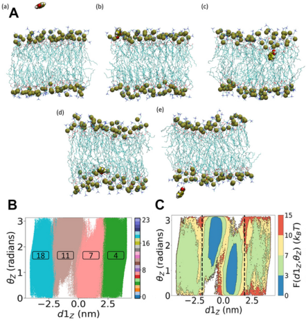

**Original caption:** FIG. 14: (A) Schematic representation of a benzoic acid molecule permeating a symmetric phospholipid bilayer, highlighting the key stages of adsorption at the membrane surface, reorientation, and translocation across the lipid core. (B) Metastable state assignments provided by the SPIB algorithm in the space of the membrane–solute distance and orientation angle, and (C) FES projected onto the same reaction coordinate space. This provides the thermodynamic barriers for membrane entry, traversal, and exit, as well as enables mechanistic insights into the role of molecular orientation and interactions with lipid headgroups. Adapted from Ref. 188. Copyright 2022 American Chemical Society.

**中文图注:** 如图。图 14：(A) 苯甲酸分子渗透对称磷脂双层的示意图，突出显示了膜表面吸附、重新定向和跨脂质核心易位的关键阶段。 (B) SPIB 算法在膜-溶质距离和方向角空间中提供的亚稳态分配，以及 (C) FES 投影到相同的反应坐标空间。这为膜的进入、穿过和退出提供了热力学屏障，并能够从机制上洞察分子取向和与脂质头基相互作用的作用。改编自参考文献。 188. 版权所有 2022 美国化学会。

**Reading note / 阅读提示：** Inspect this visual together with the immediately preceding source block; it is placed at the first substantive discussion available in the extracted text.

**Source:** p.25 S267

**Original:** Despite their diversity, these systems share common modeling challenges. One of the most important ones is accounting for the role of water in mediating binding thermodynamics and kinetics. Water molecules can indeed bridge critical hydrogen bonds, occupy binding pockets or leave them empty, and even modulate energy barriers during association and dissociation (Fig. 13). MLCVs offer a way to build watersensitive CVs able to represent hydration shells and dynamic water networks by using permutationally invariant descriptors such as PIV74,100 or the solvation number of relevant sites for the binding process131, e.g., close to the binding pocket or on the ligand. Additionally, semi-automated strategies for the identification of such hydration spots, which in complex cases may be far from trivial, have also been proposed132. Overall, these findings highlight the need to treat water as an active component of the binding process, and not merely as a passive background. These applications demonstrate how ML-enhanced simulations

**中文:** 尽管它们多种多样，但这些系统都面临着共同的建模挑战。最重要的问题之一是解释水在介导结合热力学和动力学中的作用。水分子确实可以桥接关键的氢键，占据结合袋或将其留空，甚至在缔合和解离过程中调节能垒（图13）。 MLCV 提供了一种构建水敏感 CV 的方法，该 CV 能够通过使用排列不变描述符（例如 PIV74,100 或结合过程相关位点的溶剂化数 131，例如靠近结合袋或在配体上）来表示水合壳和动态水网络。此外，还提出了识别此类水合点的半自动化策略，这在复杂的情况下可能绝非微不足道132。总体而言，这些发现强调需要将水视为结合过程的主动成分，而不仅仅是被动背景。这些应用程序演示了 ML 增强模拟如何

### Fig. 013. 胰蛋白酶-苯脒系统中的解结合途径。 (A) 具有配体苯甲脒和漏斗限制的胰蛋白酶结

**Placed near:** p.25 S267

**Source:** p.24 C015

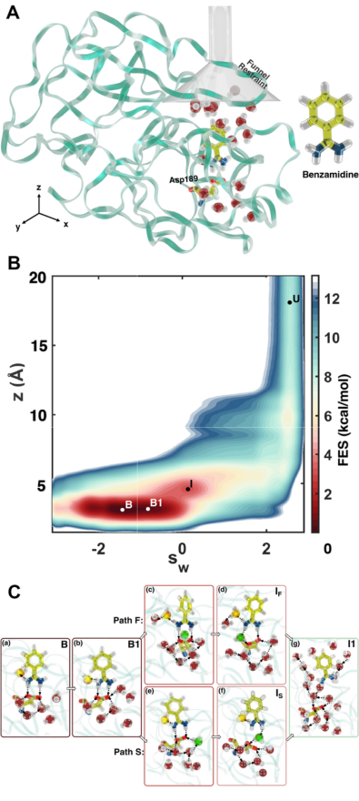

**Original caption:** FIG. 13: Unbinding pathways in the Trypsin–Benzamidine system. (A) A cartoon representation of Trypsin structure with the ligand Benzamidine and the Funnel restraint. (B) Free energy surface (FES) as a function of sw, a waterrelated variable learned via Deep-LDA, and z, the ligand–pocket distance, highlighting bound (B/B1), intermediate (I), and unbound (U) states. (C) Two distinct ligand unbinding mechanisms identified using Deep-TICA: one faster and one slower, each characterized by specific rearrangements of water molecules in the binding pocket. Image adapted from Ref. 132. Copyright 2022 Springer Nature under [CC BY 4.0 DEED].

**中文图注:** 如图。图 13：胰蛋白酶-苯脒系统中的解结合途径。 (A) 具有配体苯甲脒和漏斗限制的胰蛋白酶结构的卡通表示。 (B) 自由能表面 (FES) 作为 sw（通过 Deep-LDA 学习的与水相关的变量）和 z（配体袋距离）的函数，突出显示结合态 (B/B1)、中间态 (I) 和未结合态 (U)。 (C) 使用 Deep-TICA 识别出两种不同的配体解结合机制：一种更快，一种更慢，每种机制都以结合口袋中水分子的特定重排为特征。图片改编自参考文献。 132. 版权所有 2022 Springer Nature，根据 [CC BY 4.0 DEED]。

**Reading note / 阅读提示：** Inspect this visual together with the immediately preceding source block; it is placed at the first substantive discussion available in the extracted text.

**Source:** p.25 S268

**Original:** enable not just the estimation of free energies and rate constants, but also the mechanistic interpretation of molecular recognition events, provided that CVs are constructed to capture all relevant degrees of freedom.

**中文:** 假设 CV 被构建为捕获所有相关的自由度，则不仅可以估计自由能和速率常数，还可以对分子识别事件进行机械解释。

**Source:** p.25 S269

**Original:** 4.3 Structural phase transformations

**中文:** 4.3 结构相变

**Source:** p.25 S270

**Original:** Phase transformations, including crystallization, melting, and solid–solid and liquid-liquid transitions, are rare events that span even longer timescales and involve the crossing of substantial free energy barriers. These processes typically begin with the formation of transient nanoscale regions of the new phase, such as nuclei or precursors, which then grow into extended domains. Capturing such transformations with atomistic simulations is inherently difficult, as it requires CVs capable of describing complex, system-specific structural rearrangements. Unlike biomolecular transitions, which often combine many simple descriptors such as distances and dihedral angles, phase transformations frequently involve more complex geometric, symmetry-based, or thermodynamic descriptors that are able to capture the changes in the ordering of the system with the additional complication of explicitly treating permutational invariance; see, for example, the recent review on crystallization by Neha et al.238. In the study of homogeneous crystallization, Zhang et al.127 used X-ray diffraction (XRD) peak intensities as input features for HLDA and TICA to distinguish liquid from crystalline phases in elemental Na and Al. These descriptors enabled the resolution of metastable states and accelerated sampling of the nucleation process. Building on this idea, Karmakar et al.72 employed peaks from the full three-dimensional Debye structure factor to train Deep-LDA CVs82, successfully driving crystallization in NaCl and CO2. As in other domains, such CVs can serve as a starting point and be further refined, particularly in the transition region, using time-informed methods such as Deep-TICA59. In the field of nucleation, Tiwary and collaborators applied the SPIB framework144 to molecular and ionic systems. For aqueous urea and glycine190, they constructed and compared CVs from a diverse set of descriptors, including coordination numbers, Steinhardt bond-order parameters240, intermolecular angles, orientational entropy, water structure241, and pair entropy242. The resulting CVs revealed that orientational descriptors, rather than cluster size alone, were critical in capturing the slow modes of nucleation, highlighting the limitations of classical nucleation theory. In subsequent work191, SPIB was used to explore NaCl nucleation from melt and aqueous solution, showing that, while local ion density could distinguish phases, it was insufficient to drive transitions, whereas energy and local structure emerged as more effective drivers instead. Their recent study193 found that removing solvent water from Cl−ions on the solid precursor surface is more important than ion buildup, and that the electric field both promotes nucleation by removing water and hinders it by separating ion pairs. A similar approach was then applied to colloidal sys-

**中文:** 相变，包括结晶、熔化、固-固和液-液转变，是罕见的事件，它们跨越更长的时间尺度，并涉及跨越大量的自由能垒。这些过程通常从新相的瞬态纳米级区域（例如核或前体）的形成开始，然后它们生长成扩展的域。通过原子模拟捕获这种转变本质上是困难的，因为它需要 CV 能够描述复杂的、特定于系统的结构重排。与生物分子转变不同，生物分子转变通常结合许多简单的描述符，如距离和二面角，相变经常涉及更复杂的几何、基于对称或热力学的描述符，这些描述符能够捕获系统排序的变化，并显式处理排列不变性的额外复杂性；例如，参见 Neha 等人最近对结晶的评论238。在均匀结晶的研究中，Zhang 等人 127 使用 X 射线衍射 (XRD) 峰强度作为 HLDA 和 TICA 的输入特征，以区分元素 Na 和 Al 中的液体和晶相。这些描述符能够解决亚稳态并加速成核过程的采样。基于这一想法，Karmakar 等人72 利用全三维德拜结构因子的峰值来训练 Deep-LDA CVs82，成功驱动了 NaCl 和 CO2 中的结晶。与其他领域一样，此类 CV 可以作为起点并使用 Deep-TICA59 等时间通知方法进一步细化，特别是在过渡区域。在成核领域，Tiwary 和合作者将 SPIB 框架144应用于分子和离子系统。对于水性尿素和甘氨酸190，他们构建并比较了来自不同描述符集的CV，包括配位数、斯坦哈特键序参数240、分子间角度、取向熵、水结构241和对熵242。由此产生的 CV 显示，取向描述符（而不仅仅是簇大小）对于捕获缓慢成核模式至关重要，这凸显了经典成核理论的局限性。在随后的工作191中，SPIB被用来探索熔体和水溶液中的氯化钠成核，结果表明，虽然局部离子密度可以区分相，但不足以驱动转变，而能量和局部结构反而成为更有效的驱动因素。他们最近的研究193发现，从固体前驱体表面的Cl−离子中去除溶剂水比离子积累更重要，并且电场既通过去除水来促进成核，又通过分离离子对来阻碍成核。然后将类似的方法应用于胶体系统

## Page 26

**Source:** p.26 S271

**Original:** tems192, where a one-dimensional SPIB-derived CV, based on both local and global structural information, was trained to capture transitions among vapor, liquid, and solid states (See Fig. 15). Other relevant transformations include solid–solid phase transitions. To model the A15-to-bcc transition in molybdenum, Rogal et al.117 developed a neural network path CV that combines a local classifier of atomic environments (based on Behler–Parrinello symmetry functions) with a global path CV constructed from the fractions of atoms in different phases. This CV enabled the study of interface migration and the characterization of the transformation pathway. Similarly, Telari et al.239 explored structural transitions in gold nanoclusters using an autoencoderbased approach. Configurations generated via replica exchange simulations were represented using the radial distribution function (RDF) as a global structural descriptor. The autoencoder, trained with a denoising-like objective, learned a latent representation capable of reconstructing the RDF associated with the inherent structures on the potential energy surface, obtained through energy minimization. This data-driven framework classified the structural diversity into three dominant families (face-centered cubic, decahedral, and icosahedral) and highlighted the role of defects in facilitating structural transformations (see Fig. 16). By using these CVs with umbrella sampling and Markov state models, the authors reconstructed the free energy landscape, computed transi-

**中文:** tems192，其中基于局部和全局结构信息的一维 SPIB 衍生的 CV 被训练来捕获蒸气、液体和固态之间的转变（见图 15）。其他相关的转变包括固-固相变。为了模拟钼中 A15 到 bcc 的转变，Rogal 等人117 开发了一种神经网络路径 CV，它将原子环境的局部分类器（基于 Behler-Parrinello 对称函数）与由不同相的原子分数构建的全局路径 CV 结合起来。该简历使得界面迁移的研究和转化途径的表征成为可能。同样，Telari 等人239 使用基于自动编码器的方法探索了金纳米团簇的结构转变。通过副本交换模拟生成的配置使用径向分布函数（RDF）作为全局结构描述符来表示。使用类似去噪的目标进行训练的自动编码器学习了一种潜在表示，能够重建与通过能量最小化获得的势能表面上的固有结构相关的 RDF。这个数据驱动的框架将结构多样性分为三个主要家族（面心立方、十面体和二十面体），并强调了缺陷在促进结构转变中的作用（见图 16）。通过使用这些具有伞形采样和马尔可夫状态模型的 CV，作者重建了自由能景观，计算了瞬态

### Fig. 015. 使用 MLCV 增强采样研究过饱和胶体悬浮液中的晶体成核。 (A) 作为 SPI

**Placed near:** p.26 S271

**Source:** p.26 C017

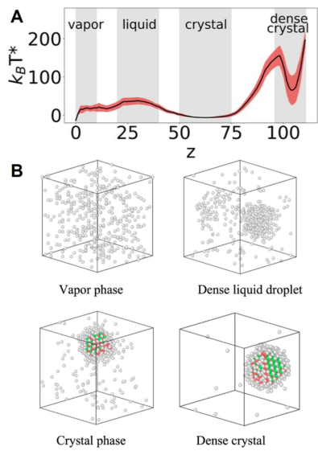

**Original caption:** FIG. 15: Crystal nucleation in supersaturated colloid suspensions investigated using enhanced sampling with MLCVs. (A) One-dimensional free energy profile as a function of the SPIB CV. (B) Representative structures of the four phases during the nucleation process. Image adapted from Ref. 192. Copyright 2024 American Chemical Society.

**中文图注:** 如图。图 15：使用 MLCV 增强采样研究过饱和胶体悬浮液中的晶体成核。 (A) 作为 SPIB CV 函数的一维自由能分布。 (B) 成核过程中四个相的代表性结构。图片改编自参考文献。 192. 版权所有 2024 美国化学会。

**Reading note / 阅读提示：** Inspect this visual together with the immediately preceding source block; it is placed at the first substantive discussion available in the extracted text.

### Fig. 016. Au147 在 396 K 时的固-固相变。(A) 从伞式采样获得的自由能图。左

**Placed near:** p.26 S271

**Source:** p.27 C018

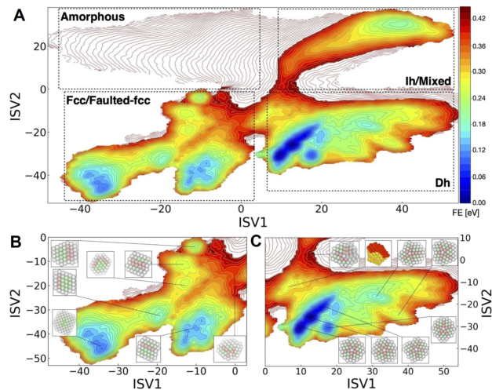

**Original caption:** FIG. 16: Solid-solid phase transition of Au147 at 396 K. (A) Free energy landscape obtained from umbrella sampling. The bottom left region corresponds to face-centered cubic (fcc) and faulted-fcc structures, the top right to icosahedral (Ih) and mixed structures, and the bottom right to decahedral (Dh) structures. Amorphous structures, associated with very high free energies at this temperature, are located in the top left corner. (B) Enlarged view of the free energy landscape in panel A, focusing on the fcc and faulted-fcc region and illustrating representative local minima and the bottleneck connecting this region to the Dh basin. (C) Enlarged view of the Dh region from panel A, highlighting local minima and the transition path connecting Dh to Ih and mixed structures. Atoms are colored according to their local coordination: green for fcc, pink for hcp, and white for undefined environments. Image reproduced from Ref. 239. Copyright 2025 IOP Publishing Ltd under [CC BY 4.0 DEED].

**中文图注:** 如图。图 16：Au147 在 396 K 时的固-固相变。(A) 从伞式采样获得的自由能图。左下区域对应于面心立方 (fcc) 和断层面心立方结构，右上区域对应于二十面体 (Ih) 和混合结构，右下区域对应于十面体 (Dh) 结构。非晶结构位于左上角，在此温度下具有非常高的自由能。 (B) 图 A 中自由能景观的放大视图，重点关注面心立方和断层面心立方区域，并说明了代表性的局部最小值和连接该区域与 Dh 盆地的瓶颈。 (C) A 面板中 Dh 区域的放大视图，突出显示局部最小值以及连接 Dh 到 Ih 和混合结构的过渡路径。原子根据其局部配位进行着色：绿色代表 fcc，粉色代表 hcp，白色代表未定义的环境。图片转载自参考文献。 239. 版权所有 2025 IOP Publishing Ltd，根据 [CC BY 4.0 DEED]。

**Reading note / 阅读提示：** Inspect this visual together with the immediately preceding source block; it is placed at the first substantive discussion available in the extracted text.

**Source:** p.26 S272

**Original:** 4 APPLICATIONS OF MACHINE-LEARNED CVS

**中文:** 4 机器学习 CVS 的应用

**Source:** p.26 S273

**Original:** tion rates, and characterized the pathways connecting the different conformations. The phase diagram of many liquids also includes liquid-liquid phase transitions, which present similar challenges but in a much more mobile environment. For example, the λ-transition in liquid sulfur involves the equilibrium between a molecular phase, characterized by low viscosity and composed of eightmember crown-shaped rings, and a polymeric phase with high viscosity and composed of long linear polymeric chains. To characterize the structures and mechanisms across such a transition, Yang et al.76 employed a Deep-TDA83 CV in combination with OPES, using as input descriptors for the changes in the system topology the distribution of the eigenvalues of the adjacency matrix of the system. Overall, these studies presented several challenges, but chief among them is the selection of physically meaningful descriptors able to capture the right structural properties. Effective CVs must indeed simultaneously capture local order and collective structural changes, and remain valid throughout the transition and guarantee permutational invariance. ML offers a powerful framework to handle large, heterogeneous descriptor sets and to construct low-dimensional CVs that preserve essential mechanistic features. Furthermore, since phase transitions often proceed through multiple intermediates, generalizable CVs must be robust across the entire reaction coordinate landscape.

**中文:** 化率，并表征了连接不同构象的路径。许多液体的相图还包括液-液相变，这提出了类似的挑战，但在更加移动的环境中。例如，液态硫中的λ转变涉及由八元冠形环组成的低粘度分子相与由长线性聚合物链组成的高粘度聚合物相之间的平衡。为了表征这种转变的结构和机制，Yang 等人 76 将 Deep-TDA83 CV 与 OPES 结合使用，使用系统邻接矩阵特征值的分布作为系统拓扑变化的输入描述符。总的来说，这些研究提出了一些挑战，但其中最主要的是选择能够捕获正确结构特性的具有物理意义的描述符。有效的简历确实必须同时捕捉局部秩序和集体结构变化，并在整个转变过程中保持有效并保证排列不变性。 ML 提供了一个强大的框架来处理大型异构描述符集并构建保留基本机械特征的低维 CV。此外，由于相变通常通过多个中间体进行，因此可推广的 CV 必须在整个反应坐标环境中保持稳健。

**Source:** p.26 S274

**Original:** 4.4 Chemical and catalytic reactions

**中文:** 4.4 化学和催化反应

**Source:** p.26 S275

**Original:** Traditional enhanced sampling studies of chemical reactivity often relied on biasing a few physically intuitive CVs, such as distances or angles associated with bond formation or cleavage. However, this strategy is only effective for relatively simple reactions and in cases where the surrounding environment plays a minimal role. In many realistic scenarios, especially those involving complex molecular systems, heterogeneous interfaces, or enzymatic active sites, the reaction mechanism can involve multiple steps, hidden intermediates, and collective contributions from the environment. In such cases, predefining the relevant CVs becomes exceedingly difficult. To overcome these challenges, MLCVs have been applied to chemically reactive systems, offering a data-driven route to uncover complex reaction coordinates. In particular, a first objective is reaction discovery, which leverages enhanced sampling to find the possible products and pathways. One strategy in this regard was proposed by Raucci et al. by incorporating a first exploratory stage based on an agnostic CV from graph theory with a second stage in which, once new states were discovered, free energy calculations based on MLCVs and/or refinement of the identified structures are carried out.75 This approach was first applied to simple chemical reactions, training a classifier-based CV (Deep-LDA) using atomic contacts as descriptors and using it to converge free energy profiles. Additionally, the obtained profiles, initially computed at the semi-empirical level, were

**中文:** 传统的化学反应性增强采样研究通常依赖于一些物理直观的 C​​V 的偏差，例如与键形成或断裂相关的距离或角度。然而，这种策略仅对相对简单的反应以及周围环境发挥最小作用的情况有效。在许多现实场景中，尤其是涉及复杂分子系统、异质界面或酶活性位点的场景中，反应机制可能涉及多个步骤、隐藏的中间体和环境的集体贡献。在这种情况下，预定义相关的简历变得极其困难。为了克服这些挑战，MLCV 已应用于化学反应系统，提供数据驱动的途径来揭示复杂的反应坐标。特别是，第一个目标是反应发现，它利用增强采样来寻找可能的产物和途径。 Raucci 等人提出了这方面的一项策略。通过将基于图论中的不可知 CV 的第一探索阶段与第二阶段相结合，在第二阶段中，一旦发现新状态，就会进行基于 MLCV 的自由能计算和/或对已识别结构的细化。 75 这种方法首先应用于简单的化学反应，使用原子接触作为描述符来训练基于分类器的 CV（深度 LDA），并用它来收敛自由能分布。此外，获得的轮廓最初是在半经验水平上计算的，

## Page 27

**Source:** p.27 S276

**Original:** also corrected to a more refined level of theory via free energy perturbation. The same approach was applied by Das et al. to the identification of reactive conformations of substrate-enzyme complex in the sugardegrading enzyme α-amylase84 (see also Sec.4 2). A similar strategy was also used by Raucci et al. to study the donor–acceptor Stenhouse adduct (DASA) molecular photoswitchers, which are able to undergo substantial conformational changes upon light irradiation and present a complex reaction network of multiple stable states.243 In this case, after the discovery stage, static structural optimization was carried out.244 More information about part of the same reaction network was later obtained by Kang et al.226

**中文:** 还通过自由能扰动修正到更精细的理论水平。 Das 等人也采用了相同的方法。糖降解酶 α-淀粉酶84 中底物-酶复合物反应构象的鉴定（另见第 4 节 2）。 Raucci 等人也使用了类似的策略。研究供体-受体 Stenhouse 加合物 (DASA) 分子光开关，该开关在光照射下能够发生显着的构象变化，并呈现出多个稳定状态的复杂反应网络。 243 在这种情况下，在发现阶段之后，进行了静态结构优化。 244 Kang 等人后来获得了有关同一反应网络部分的更多信息。 226

**Source:** p.27 S277

**Original:** by learning the corresponding committor function and using it to characterize in detail the transition state ensemble.

**中文:** 通过学习相应的提交者函数并使用它来详细描述过渡状态集合。

**Source:** p.27 S278

**Original:** Another crucial area of application is heterogeneous catalysis, which targets the reduction of energy barriers in industrially and environmentally relevant reactions. The oxygen evolution reaction at the WO3/water interface (Fig. 17) was investigated by Luber and coworkers139, who used autoencoders (DAENN) to combine bond distances with xSPRINT descriptors99 and drive metadynamics simulations, uncovering competing pathways such as H2O2 formation. Besides biasing, MLCVs can also be used to rationalize the behavior of reactions in complex environments. For example, Bonati et al.245 trained a supervised CV to capture the charge transfer during nitrogen dissociation

**中文:** 另一个重要的应用领域是多相催化，其目标是减少工业和环境相关反应中的能量壁垒。 Luber 和同事研究了 WO3/水界面处的析氧反应（图 17），他们使用自动编码器 (DAENN) 将键距与 xSPRINT 描述符结合起来99 并驱动元动力学模拟，揭示了 H2O2 形成等竞争途径。除了偏置之外，MLCV 还可以用于合理化复杂环境中的反应行为。例如，Bonati 等人245 训练了一个受监督的 CV 来捕获氮解离过程中的电荷转移

### Fig. 017. 固液界面催化水氧化。 (A) WO3/水界面的原子模型。 (B) 沿析氧反应 (

**Placed near:** p.27 S278

**Source:** p.28 C019

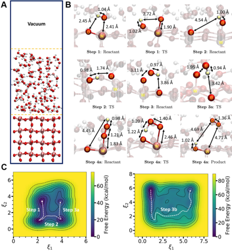

**Original caption:** FIG. 17: Catalytic water oxidation at a solid–liquid interface. (A) Atomistic model of the WO3/water interface. (B) Representative snapshots of key intermediates and transition states along the oxygen evolution reaction (OER) pathway. (C) Free energy surfaces computed the autoencoder-based CV (DAENN), capturing both the OER (left) and the alternative H2O2 formation pathway (right). Images reproduced Ref. 139. Copyright 2024 Elsevier.

**中文图注:** 如图。图 17：固液界面催化水氧化。 (A) WO3/水界面的原子模型。 (B) 沿析氧反应 (OER) 途径的关键中间体和过渡态的代表性快照。 (C) 自由能表面计算基于自动编码器的 CV (DAENN)，捕获 OER（左）和替代 H2O2 形成途径（右）。图片转载参考号。 139. 版权所有 2024 爱思唯尔。

**Reading note / 阅读提示：** Inspect this visual together with the immediately preceding source block; it is placed at the first substantive discussion available in the extracted text.

**Source:** p.27 S279

**Original:** on iron, the first step in industrial ammonia synthesis. This CV was then used to reconstruct the free energy landscape, providing insights into the catalytic role of the surface not via structural but rather electronic descriptors.

**中文:** 铁，工业氨合成的第一步。然后，该CV被用来重建自由能景观，不通过结构描述符而是通过电子描述符来深入了解表面的催化作用。

**Source:** p.27 S280

**Original:** Catalytic reactions are also fundamental in biophysics, where enzymes efficiently accelerate biochemical reactions, thus motivating great interest in understanding their complex workings. For example, a number of diseases are caused by enzymatic dysfunction, and enzymes are also being investigated to degrade pollutants. Recently, Das et al.246 applied the committor-based enhanced sampling strategy217,226 to the study of the glycolysis of sugars in the human pancreatic α-amylase (Fig. 18), which is important in glucose production and a drug target for type-II diabetes. This approach provided insights into the mechanisms and revealed the pivotal role of water molecules in competing pathways in the catalytic process.

**中文:** 催化反应也是生物物理学的基础，其中酶有效地加速生化反应，从而激发了人们对理解其复杂工作原理的浓厚兴趣。例如，许多疾病是由酶功能障碍引起的，酶也被研究用于降解污染物。最近，Das 等人246 应用基于提交者的增强采样策略217,226 来研究人胰腺α-淀粉酶中糖的糖酵解（图18），这对于葡萄糖的产生很重要，也是II 型糖尿病的药物靶点。这种方法提供了对机制的见解，并揭示了水分子在催化过程中竞争途径中的关键作用。

### Fig. 018. 底物结合的α淀粉酶的酶催化。连接反应物和产物状态的自由能表面的示意图（在快照中突

**Placed near:** p.27 S280

**Source:** p.28 C020

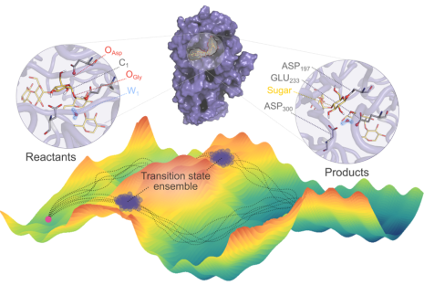

**Original caption:** FIG. 18: Enzymatic catalysis of substrate-bound αamylase. Schematic representation of the free energy surface connecting reactant and product states (highlighted in snapshots along with key catalytic residues in the active site). The dynamic catalytic landscape, with multiple reaction pathways, is revealed through a machine-learned committor function, enabling a probabilistic characterization of transition states. Image reproduced from Ref. 246. Copyright 2025 American Chemical Society.

**中文图注:** 如图。图18：底物结合的α淀粉酶的酶催化。连接反应物和产物状态的自由能表面的示意图（在快照中突出显示以及活性位点中的关键催化残基）。通过机器学习的提交函数揭示具有多种反应途径的动态催化景观，从而实现过渡态的概率表征。图片转载自参考文献。 246. 版权所有 2025 美国化学会。

**Reading note / 阅读提示：** Inspect this visual together with the immediately preceding source block; it is placed at the first substantive discussion available in the extracted text.

**Source:** p.27 S281

**Original:** To conclude this section, we have seen that MLCVs have been developed and applied to address a wide variety of objectives. These range from enhancing sampling of complex landscapes and facilitating the exploration of rare events, to gaining mechanistic insights and reducing the dimensionality of high-dimensional systems. This breadth not only reflects the flexibility of MLCVs in tackling diverse challenges but also underscores that there is no single “one-size-fits-all” solution. Instead, the choice of method must be care-

**中文:** 作为本节的总结，我们已经看到 MLCV 已被开发并应用于解决各种目标。这些范围从增强复杂景观的采样和促进对罕见事件的探索，到获得机械见解和降低高维系统的维度。这种广度不仅反映了 MLCV 在应对各种挑战方面的灵活性，而且还强调了不存在单一的“一刀切”解决方案。相反，方法的选择必须谨慎——

## Page 28

**Source:** p.28 S282

**Original:** fully aligned with the specific goals of the study and the available data. For instance, autoencoder-based models are well suited for unsupervised exploration of high-dimensional landscapes, classifier-based CVs can be effective when metastable states are already known,

**中文:** 与研究的具体目标和现有数据完全一致。例如，基于自动编码器的模型非常适合对高维景观的无监督探索，当亚稳态已知时，基于分类器的 CV 可以有效，

**Source:** p.28 S283

**Original:** 5 MACHINE LEARNING BIAS POTENTIALS

**中文:** 5 机器学习的潜在偏差

**Source:** p.28 S284

**Original:** and time-lagged or committor approaches typically offer deeper mechanistic insight, albeit at the cost of higher requirements in terms of quantity and quality of data.

**中文:** 时滞或提交者方法通常提供更深入的机械洞察力，尽管代价是对数据数量和质量提出更高的要求。

**Source:** p.28 S285

**Original:** 5 Machine learning bias potentials

**中文:** 5 机器学习潜在偏差

**Source:** p.28 S286

**Original:** In the previous sections, we examined approaches that employ ML to identify suitable low-dimensional representations (CVs) and to integrate them within traditional enhanced sampling methods. A complementary line of development seeks to address the inherent limitations of conventional biasing schemes themselves. Techniques such as metadynamics and umbrella sampling typically rely on bias potentials applied along a small set of carefully chosen CVs. Recent advances, by contrast, explore how ML can directly inform the design and optimization of biasing strategies, potentially bypassing these dimensionality constraints and opening new avenues for sampling complex systems. On one hand, ML models can help overcome the limitations of low-dimensional representations by enabling the use of a larger number of CVs simultaneously, without reducing the system to just one or two dominant modes. On the other hand, they make it possible to optimize bias potentials with objectives that go beyond traditional free energy reconstruction. For instance, emerging approaches aim to generate physically meaningful, unbiased transition pathways, thereby addressing one of the longstanding shortcomings of biased sampling techniques. In the following, we present these approaches grouped into three broad categories:

**中文:** 在前面的部分中，我们研究了使用 ML 来识别合适的低维表示 (CV) 并将其集成到传统增强采样方法中的方法。互补的开发路线旨在解决传统偏置方案本身的固有局限性。元动力学和伞式采样等技术通常依赖于沿一小组精心选择的 CV 施加的偏置电位。相比之下，最近的进展探索了机器学习如何直接为偏置策略的设计和优化提供信息，从而有可能绕过这些维度限制并为复杂系统的采样开辟新途径。一方面，机器学习模型可以同时使用大量的 CV，从而帮助克服低维表示的局限性，而无需将系统简化为仅一种或两种主要模式。另一方面，它们使得优化偏置势成为可能，其目标超出了传统的自由能重建。例如，新兴方法旨在生成具有物理意义的、无偏差的过渡路径，从而解决有偏差采样技术长期存在的缺点之一。下面，我们将这些方法分为三大类：

**Source:** p.28 S287

**Original:** 1. Representing and biasing high-dimensional FESs (Section 5 1): ML models are used to represent high-dimensional free energy surfaces, which can be then used to bias the sampling.

**中文:** 1. 表示和偏置高维 FES（第 5 节 1）：ML 模型用于表示高维自由能表面，然后可用于偏置采样。

**Source:** p.28 S288

**Original:** 2. Bias potentials optimization (Section 5 2): Neural networks are used to represent and optimize bias potentials within existing adaptive sampling schemes (e.g. VES, ABF, GAMD).

**中文:** 2. 偏置电位优化（第 5 2 节）：神经网络用于表示和优化现有自适应采样方案（例如 VES、ABF、GAMD）中的偏置电位。

**Source:** p.28 S289

**Original:** 3. Transition path-guided bias (Section 5 3): These approaches aim to construct external potentials such that they can produce unbiased transition paths, often through a reinforcement learning approach.

**中文:** 3. 过渡路径引导偏差（第 5 3 节）：这些方法旨在构建外部潜力，以便通常通过强化学习方法产生无偏差的过渡路径。

**Source:** p.28 S290

**Original:** 5.1 Representing and biasing high-dimensional free energy surfaces

**中文:** 5.1 高维自由能面的表示和偏置

**Source:** p.28 S291

**Original:** A key ingredient in many enhanced sampling schemes is the accurate representation of the FES as a function of selected CVs. However, constructing such representations in high-dimensional spaces remains a significant challenge, due to the curse of dimensionality and the limited amount of data typically available from molecular simulations. To address this, a variety of ML techniques, including kernel methods and neural networks, have been applied to model equilibrium

**中文:** 许多增强采样方案的关键要素是将 FES 准确表示为所选 CV 的函数。然而，由于维度灾难和分子模拟通常可获得的数据量有限，在高维空间中构建此类表示仍然是一个重大挑战。为了解决这个问题，各种机器学习技术，包括核方法和神经网络，已被应用于平衡模型

## Page 29

**Source:** p.29 S292

**Original:** probability distributions and their associated FESs. While differing in formalism, both approaches aim to capture complex, high-dimensional landscapes in a data-efficient manner, and their respective strengths have been systematically compared by Cendagorta et al.247. For instance, Csányi and collaborators proposed a Gaussian process regression (GPR) of the FES from simulation data. In their first work248, GPR was used to model the FES obtained from umbrella sampling, using histogram-based estimates of equilibrium probabilities as training labels. By incorporating prior assumptions of smoothness and consistently accounting for sampling noise, the method achieved significantly improved accuracy over conventional estimators in two or more dimensions. Moreover, the Bayesian formulation of Gaussian processes naturally provides uncertainty estimates, enabling the quantification of confidence in the predicted free energies. In a follow-up study249, the Authors proposed a modular approach that explicitly separates biasing, free energy gradients measurement, and free energy reconstruction to improve computational efficiency. In particular, they used metadynamics to guide sampling, instantaneous collective forces (akin to those used in adaptive biasing force methods) to estimate free energy gradients, and GPR to reconstruct the FES. This strategy led to a substantial reduction in computational cost, demonstrating that decoupling sampling from learning can be especially powerful in high-dimensional settings. In parallel, neural networks have been widely adopted due to their flexibility and favorable scaling with the number of data points and CVs. Tuckerman and collaborators250 trained neural networks to represent the FES based on either free energy values or their derivatives, depending on the enhanced sampling method used. This approach facilitated both the computation of free energy differences and the evaluation of ensemble averages from the learned model. Sidky and Whitmer251 extended this framework using Bayesian regularization to adaptively refine the FES and reduce overfitting. In addition to direct regression of free energies, some methods rely on probability density estimation. Galvelis et al.252 proposed NN2B, a hybrid approach in which a nearest neighbor density estimator (NNDE)253 is first applied to a biased trajectory to estimate local probability densities. This smoothed information is then converted to free energy labels and used to train a neural network, which iteratively updates the bias potential. Together, these techniques demonstrate how ML methods can provide accurate and scalable representations of free energy surfaces, a key ingredient for developing effective biasing strategies in high-dimensional landscapes. Following a different strategy, Zhang et al. introduced a reinforcement learning framework called reinforced dynamics (RiD)255256. In RiD, a neural network is trained to represent the FES, and an uncertainty indicator E(s) is used to evaluate the reliability of the model’s predictions across the CV space. The uncertainty is estimated using a query-by-committee approach, in which an ensemble of N neural networks

**中文:** 概率分布及其相关的 FES。虽然形式上有所不同，但这两种方法都旨在以数据有效的方式捕捉复杂、高维的景观，并且 Cendagorta 等人已系统地比较了它们各自的优势247。例如，Csányi 和合作者根据模拟数据提出了 FES 的高斯过程回归 (GPR)。在他们的第一项工作248中，GPR被用来对从伞式抽样中获得的FES进行建模，使用基于直方图的平衡概率估计作为训练标签。通过结合先前的平滑度假设并一致地考虑采样噪声，该方法在二维或更多维度上实现了比传统估计器显着提高的精度。此外，高斯过程的贝叶斯公式自然地提供了不确定性估计，从而能够量化预测自由能的置信度。在后续研究中249，作者提出了一种模块化方法，将偏置、自由能梯度测量和自由能重建明确分开，以提高计算效率。特别是，他们使用元动力学来指导采样，使用瞬时集体力（类似于自适应偏置力方法中使用的力）来估计自由能梯度，并使用探地雷达来重建 FES。这种策略导致计算成本大幅降低，表明将采样与学习解耦在高维环境中尤其强大。与此同时，神经网络由于其灵活性以及数据点和 CV 数量的有利扩展而被广泛采用。 Tuckerman 和合作者250 训练神经网络来表示基于自由能值或其导数的 FES，具体取决于所使用的增强采样方法。这种方法有利于自由能差的计算和学习模型的整体平均值的评估。 Sidky 和 ​​Whitmer251 使用贝叶斯正则化扩展了该框架，以自适应地细化 FES 并减少过度拟合。除了自由能的直接回归之外，一些方法还依赖于概率密度估计。 Galvelis 等人252 提出了 NN2B，这是一种混合方法，其中最近邻密度估计器 (NNDE)253 首先应用于有偏差的轨迹以估计局部概率密度。然后，该平滑信息被转换为自由能标签，并用于训练神经网络，该神经网络迭代地更新偏置势。这些技术共同展示了机器学习方法如何提供自由能表面的准确且可扩展的表示，这是在高维景观中开发有效偏置策略的关键要素。张等人采用了不同的策略。引入了称为强化动力学（RiD）255256 的强化学习框架。在 RiD 中，训练神经网络来表示 FES，并使用不确定性指标 E(s) 来评估模型在 CV 空间中的预测的可靠性。使用委员会查询的方法来估计不确定性，其中 N 个神经网络的集合

**Source:** p.29 S293

**Original:** predicts the mean force. The indicator E(s) is then defined as the standard deviation across the ensemble:

**中文:** 预测平均力。然后指标 E(s) 被定义为整个集合的标准差：

**Source:** p.29 S294

**Original:** E2(s) = ⟨||fn(s) − ̄f(s)||2⟩ (31)

**中文:** E2(s) = ⟨||fn(s) − ̄f(s)||2⟩ (31)

**Source:** p.29 S295

**Original:** where fn(s) is the force predicted by a single model n, and ̄f(s) is the average over the ensemble of models. A switching function σ(E) is applied to modulate the force based on the model confidence, biasing the system only in regions where the uncertainty is low. In particular, the force fi(R) acting on atom i is obtained as:

**中文:** 其中 fn(s) 是单个模型 n 预测的力，̄f(s) 是模型集合的平均值。应用切换函数 σ(E) 来根据模型置信度调节力，仅在不确定性较低的区域对系统进行偏置。特别地，作用在原子 i 上的力 fi(R) 可由下式获得：

**Source:** p.29 S296

**Original:** fi(R) = −∇riU(R) + σ(E(s(R))) ⟨∇RiF(s(R))⟩ (32) where U(R) is the physical potential, and F(s) is the learned FES. While RiD proved effective for systems involving up to 20 CVs, its performance degraded in higherdimensional settings. To address this, Wang et al.254

**中文:** fi(R) = −∇riU(R) + σ(E(s(R))) ⟨∇RiF(s(R))⟩ (32) 其中 U(R) 是物理势，F(s) 是学习到的 FES。虽然 RiD 被证明对于涉及最多 20 个 CV 的系统有效，但其性能在高维设置中会下降。为了解决这个问题，Wang 等人254

**Source:** p.29 S297

**Original:** developed an adaptive extension of RiD (see Fig. 19). In this scheme, points with high uncertainty are flagged during simulation and clustered to ensure diverse sampling. Representative configurations are selected from each cluster, labeled via restrained MD to obtain mean forces, and used to retrain the neural network ensemble (see also Fig. 19). Furthermore, the uncertainty threshold is dynamically adjusted based on the number of clusters, balancing exploration and labeling efficiency. Thanks to this adaptive strategy, RiD has been successfully applied to exploratory studies involving up to 100 CVs, showcasing its potential for navigating complex free energy landscapes in highdimensional systems.

**中文:** 开发了 RiD 的自适应扩展（见图 19）。在该方案中，在模拟过程中对具有高不确定性的点进行标记并进行聚类，以确保采样的多样性。从每个簇中选择代表性配置，通过受限 MD 进行标记以获得平均力，并用于重新训练神经网络集成（另请参见图 19）。此外，根据聚类数量动态调整不确定性阈值，平衡探索和标记效率。得益于这种自适应策略，RiD 已成功应用于涉及多达 100 个 CV 的探索性研究，展示了其在高维系统中驾驭复杂自由能景观的潜力。

### Fig. 019. 自适应RiD的工作流程。 (a) 在探索步骤中，使用有偏差的 MD 模拟，并建议

**Placed near:** p.29 S297

**Source:** p.30 C021

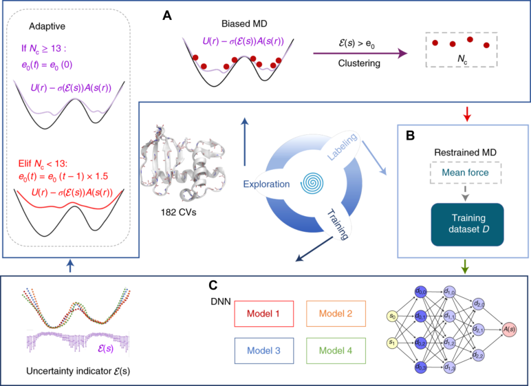

**Original caption:** FIG. 19: The workflow of adaptive RiD. (a) In the exploration step, biased MD simulations are used, and the visited CV values with the uncertainty indicators E(s) larger than a certain level ε0 are proposed for labeling. The proposed CVs are then clustered into Nc clusters, and one set of CV values is randomly selected from each cluster for labeling. An adaptive strategy is applied at each iteration by adjusting the uncertainty levels based on the number of clusters Nc. In this case, if Nc is less than 13, the level ε0 is multiplied by 1.5, and ε1 = ε0 + 1. Otherwise, the same levels as the initial values are used (panel outlined by a gray dashed line). (B) The mean forces evaluated by the restrained MD simulation are used as labels to train the DNN models. (C) Four DNN models are trained using different random initial parameters, and the uncertainty indicator E(s) is defined as the standard deviation of the force predictions from this ensemble of DNN models. Image reproduced from Ref. 254. Copyright 2021 Springer Nature.

**中文图注:** 如图。图19：自适应RiD的工作流程。 (a) 在探索步骤中，使用有偏差的 MD 模拟，并建议对不确定性指标 E(s) 大于某个水平 ε0 的访问 CV 值进行标记。然后将所提出的 CV 聚类为 Nc 簇，并从每个簇中随机选择一组 CV 值进行标记。通过根据集群数量 Nc 调整不确定性水平，在每次迭代中应用自适应策略。在这种情况下，如果 Nc 小于 13，则将级别 ε0 乘以 1.5，并且 ε1 = ε0 + 1。否则，使用与初始值相同的级别（灰色虚线框出的面板）。 (B) 通过约束 MD 模拟评估的平均力用作训练 DNN 模型的标签。 (C) 使用不同的随机初始参数训练四个 DNN 模型，不确定性指标 E(s) 定义为该 DNN 模型集合的力预测的标准偏差。图片转载自参考文献。 254. 版权所有 2021 施普林格自然。

**Reading note / 阅读提示：** Inspect this visual together with the immediately preceding source block; it is placed at the first substantive discussion available in the extracted text.

**Source:** p.29 S298

**Original:** 5.2 Enhancing biasing schemes with NNs

**中文:** 5.2 用神经网络增强偏置方案

**Source:** p.29 S299

**Original:** In this section, we examine methods in which ML algorithms, and particularly neural networks, are employed to enhance the representation of the bias potential within established enhanced sampling frameworks. The expressive power and smoothness of neural networks make them well-suited for modeling complex bias potentials, especially in systems involving multiple CVs or rapidly varying free energy landscapes. One example is the variationally enhanced sampling (VES) method39, in which the bias potential is optimized by minimizing a convex functional Ω[V ], designed to drive the system toward a prescribed target distribution ptg(s). This functional is closely related to the KL divergence between the biased distribution pV and the target distribution ptg:

**中文:** 在本节中，我们将研究采用机器学习算法（特别是神经网络）来增强已建立的增强采样框架内的偏差潜力的表示的方法。神经网络的表达能力和平滑性使其非常适合对复杂的偏置电位进行建模，特别是在涉及多个 CV 或快速变化的自由能景观的系统中。一个例子是变分增强采样 (VES) 方法39，其中通过最小化凸函数 Ω[V ] 来优化偏置电势，旨在驱动系统朝着规定的目标分布 ptg(s) 方向发展。该函数与偏置分布 pV 和目标分布 ptg 之间的 KL 散度密切相关：

**Source:** p.29 S300

**Original:** βΩ[V ] = DKL(p∥pV ) −DKL(p∥ptg) (33)

**中文:** βΩ[V ] = DKL(p∥pV ) −DKL(p∥ptg) (33)

**Source:** p.29 S301

**Original:** where p denotes the equilibrium distribution and β is the inverse temperature. In its original formulation, the VES bias potential V (s) was expressed as a linear expansion over a set of basis functions, with the expansion coefficients serving as variational parameters. To improve flexibility and scalability, Bonati et al.257

**中文:** 其中 p 表示平衡分布，β 是温度的倒数。在其原始公式中，VES 偏置势 V (s) 表示为一组基函数的线性展开，其中展开系数用作变分参数。为了提高灵活性和可扩展性，Bonati 等人257

## Page 30

**Source:** p.30 S302

**Original:** proposed Deep-VES, representing V (s) using a neural network. In this formulation, the functional Ω[V ] is treated as a scalar loss function, and its optimization with respect to the neural network parameters θ is performed using the gradients estimated directly from the simulation data:

**中文:** 提出了 Deep-VES，使用神经网络表示 V(s)。在此公式中，函数 Ω[V ] 被视为标量损失函数，并且使用直接从模拟数据估计的梯度来执行其针对神经网络参数 θ 的优化：

**Source:** p.30 S303

**Original:** ∂θ = − ∂V

**中文:** ∂θ = − ∂V

**Source:** p.30 S304

**Original:** PV + ∂V

**中文:** PV + ∂V

**Source:** p.30 S305

**Original:** ptg (34)

**中文:** 点 (34)

**Source:** p.30 S306

**Original:** where the first average is computed over the biased ensemble (via simulation) and the second over the target distribution (numerically). This approach leverages the representational capacity of neural networks to construct bias potentials via a principled variational framework. A similar approach, still inspired by the variational formulation of VES, is the targeted adversarial learning optimized sampling (TALOS) method proposed by Zhang et al.258. TALOS aims to guide sampling toward a predefined target distribution using a generative adversarial learning scheme. The key idea is to train two neural networks simultaneously: a generator, which defines the bias potential and modifies the sampling distribution, and a discriminator, which learns to distinguish between samples drawn from the biased simulation and those from the desired target distribution. A distinctive feature of TALOS is the separation be-

**中文:** 其中第一个平均值是在有偏差的集合上计算的（通过模拟），第二个平均值是在目标分布上计算的（数字）。这种方法利用神经网络的表征能力，通过原则性的变分框架构建偏差电位。张等人提出的一种类似方法，仍然受到 VES 变分公式的启发，提出了有针对性的对抗性学习优化采样 (TALOS) 方法258。 TALOS 旨在使用生成对抗性学习方案引导采样达到预定义的目标分布。关键思想是同时训练两个神经网络：一个生成器，用于定义偏差电位并修改采样分布；以及一个判别器，用于学习区分从有偏差的模拟中提取的样本和来自所需目标分布的样本。 TALOS 的一个显着特点是分离

**Source:** p.30 S307

**Original:** 5 MACHINE LEARNING BIAS POTENTIALS

**中文:** 5 机器学习的潜在偏差

**Source:** p.30 S308

**Original:** tween the spaces where the target and the bias are defined. The target distribution p(q) is specified in a descriptor space q(R), composed of physical or structural features such as distances or angles. In contrast, the bias potential Vθ(R) is defined and acts in the full atomic coordinate space R, not in the reduced descriptor space. This allows TALOS to operate without requiring a traditional low-dimensional CV. During training, the two networks play an adversarial game: the discriminator improves its ability to tell apart sampled and target configurations, while the generator updates the bias to make the sampled distribution more closely resemble the target. The process converges when the two distributions match, yielding an optimized bias potential that reproduces the desired sampling behavior.

**中文:** 定义目标和偏差的空间之间。目标分布 p(q) 在描述符空间 q(R) 中指定，由物理或结构特征（例如距离或角度）组成。相反，偏置势 Vθ(R) 被定义并在完整原子坐标空间 R 中起作用，而不是在简化描述符空间中起作用。这使得 TALOS 无需传统的低维 CV 即可运行。在训练过程中，两个网络玩对抗游戏：鉴别器提高区分采样配置和目标配置的能力，而生成器更新偏差以使采样分布更接近目标。当两个分布匹配时，该过程收敛，产生优化的偏置电位，重现所需的采样行为。

**Source:** p.30 S309

**Original:** Another enhanced sampling method that has benefited from neural network-based representations of the bias potential is adaptive biasing force (ABF). ABF aims to reconstruct the free energy landscape from its derivatives, computed as generalized mean forces, and use it to determine a biasing force. In traditional ABF, the mean force estimates are stored on a discrete grid, which leads to inaccuracies in poorly sampled regions and prevents generalization to unexplored areas. Moreover, the choice of grid resolution introduces a trade-off between accuracy and conver-

**中文:** 另一种受益于基于神经网络的偏置电位表示的增强采样方法是自适应偏置力 (ABF)。 ABF 旨在根据其导数重建自由能景观，计算为广义平均力，并用它来确定偏置力。在传统的 ABF 中，平均力估计存储在离散网格上，这会导致采样不良的区域不准确，并妨碍推广到未探索的区域。此外，网格分辨率的选择引入了精度和转换之间的权衡。

## Page 31

**Source:** p.31 S310

**Original:** gence speed. To overcome these limitations, Guo et al. proposed the force-biasing using neural networks (FUNN) method259, which replaces the discrete force representation with a continuous neural network model. This approach improves ABF by (i) providing smooth force estimates even in sparsely sampled regions, (ii) enabling force predictions in unexplored areas to avoid edge effects, and (iii) accelerating convergence by offering more accurate mean force estimates. Building on this idea, Sevgen et al. introduced the combined force frequency (CFF) method260, which combines forcebased and frequency-based estimators to improve free energy reconstruction (Fig. 20). CFF employs a selfintegrating neural network to directly learn the free energy landscape from its derivatives, improving both robustness and accuracy over traditional approaches. More recently, Rico et al.261 advanced this framework by incorporating Sinusoidal Representation Networks262 into the CFF methodology. A final example is of enhanced sampling methods boosted with ML is GaMD, which enhances sampling by applying harmonic boost potentials designed to yield a near-Gaussian energy distribution. However, GaMD’s performance can be limited by the need for frequent updates and fine-tuning of the potential. To address this, Do and Miao proposed deep boosted molecular dynamics (DBMD)263, which leverages probabilistic Bayesian deep learning models to construct optimized boost potentials. DBMD first collects energy statistics from short unbiased MD runs to collect energy statistics, followed by the construction of a Gaussian-shaped boost potential that minimizes anharmonicity.

**中文:** 温和的速度。为了克服这些限制，Guo 等人。提出了使用神经网络（FUNN）方法进行力偏置259，该方法用连续神经网络模型代替离散力表示。该方法通过 (i) 即使在稀疏采样区域也能提供平滑的力估计，(ii) 在未探索的区域中实现力预测以避免边缘效应，以及 (iii) 通过提供更准确的平均力估计来加速收敛，从而改进了 ABF。基于这个想法，Sevgen 等人。引入了组合力频率（CFF）方法260，该方法结合了基于力和基于频率的估计器来改进自由能重建（图20）。 CFF 采用自积分神经网络直接从其导数中学习自由能景观，从而比传统方法提高了鲁棒性和准确性。最近，Rico 等人261 通过将正弦表示网络 262 纳入 CFF 方法中，推进了该框架。最后一个例子是通过 ML 增强的增强采样方法 GaMD，它通过应用旨在产生接近高斯能量分布的谐波增强电势来增强采样。然而，GaMD 的性能可能会因需要频繁更新和潜力微调而受到限制。为了解决这个问题，Do 和 Miao 提出了深度增强分子动力学 (DBMD)263，它利用概率贝叶斯深度学习模型来构建优化的增强势。 DBMD 首先从短的无偏 MD 运行中收集能量统计数据，然后构建高斯形提升势，以最大限度地减少不和谐性。

### Fig. 020. CFF 方法的示意图。在 CV 空间中收集的频率和力数据用于训练两个神经网络：一

**Placed near:** p.31 S310

**Source:** p.31 C022

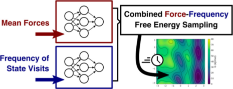

**Original caption:** FIG. 20: Schematic of the CFF method. Frequency and force data collected in CV space are used to train two neural networks: one learning the free energy from histogram frequencies and the other from its gradient estimates. Together, they provide a "combined force-frequency" free energy estimate. Image reproduced from Ref. 260. Copyright 2023 American Chemical Society.

**中文图注:** 如图。图 20：CFF 方法的示意图。在 CV 空间中收集的频率和力数据用于训练两个神经网络：一个从直方图频率学习自由能，另一个从梯度估计学习自由能。它们一起提供“组合力-频率”自由能估计。图片转载自参考文献。 260. 版权所有 2023 美国化学会。

**Reading note / 阅读提示：** Inspect this visual together with the immediately preceding source block; it is placed at the first substantive discussion available in the extracted text.

**Source:** p.31 S311

**Original:** 5.3 Transition path-guided bias

**中文:** 5.3 转变路径引导偏差

**Source:** p.31 S312

**Original:** One of the limitations of enhanced sampling methods based on external bias potentials is that they typically alter the distribution of transition paths. As a result, approaches such as TPS, which do not perturb the system’s Hamiltonian, are often employed for investigating transition mechanisms. However, TPS is computationally demanding due to the rarity of spontaneous transitions.

**中文:** 基于外部偏置电位的增强采样方法的局限性之一是它们通常会改变转换路径的分布。因此，TPS 等不会干扰系统哈密顿量的方法通常用于研究转换机制。然而，由于自发转变的罕见性，TPS 的计算要求很高。

**Source:** p.31 S313

**Original:** Recently, a new class of methods has been proposed that aims to preserve the statistical properties of the unbiased transition path ensemble while introducing a bias to enhance rare event sampling. In addition, these techniques do not rely on predefined CVs, as, instead, they introduce bias potentials that depend on both atomic positions R and velocities v, modifying the dynamics to generate trajectories drawn from a biased distribution. The central objective is then to learn a bias potential such that the resulting transition path distribution closely approximates the unbiased one. To achieve this, several strategies have been developed using tools from reinforcement learning, stochastic optimal control, and variational inference. In the context of reinforcement learning, the problem of sampling transition pathways is re-framed as a control task, where a neural network bias potential is trained to make rare transitions frequent by applying an optimized additional force that reshapes the dynamics while preserving correct transition statistics. Das et al.264 and Hua et al.265 both introduced methods in which the bias is optimized by minimizing the KL divergence between the biased and unbiased transition path distributions. The bias is parameterized as a neural network and trained via reinforcement learning techniques, using low-variance gradient estimators or adaptive data-driven updates to enhance convergence and sampling efficiency, as shown for a few toy model systems. Holdijk et al.266 introduced path integral path sampling (PIPS), which formulates the TPS problem as a stochastic optimal control problem related to the Schrödinger bridge formulation. PIPS learns a control force uθ that modifies system dynamics to efficiently generate low-energy transition paths between metastable states. This method has been validated on systems ranging from alanine dipeptide to larger biomolecules like polyproline and chignolin. Finally, we note related approaches based on generative modeling and variational formulations. Although these methods do not use explicit biasing forces, they share the goal of enhancing sampling transition paths via learned probabilistic models. Ahn et al.267 used generative flow networks for transition pathways. Raja et al.268 proposed a zero-shot TPS approach, interpreting candidate transition paths as trajectories sampled from stochastic dynamics governed by a score function learned by a pre-trained generative model. Under such dynamics, identifying high-quality transition paths becomes equivalent to minimizing the Onsager-Machlup269 functional. Du et al.270 proposed a simulation-free variational method based on Doob’s Lagrangian that directly parametrizes path distributions under boundary constraints.

**中文:** 最近，提出了一类新的方法，旨在保留无偏转移路径集合的统计特性，同时引入偏差以增强罕见事件采样。此外，这些技术不依赖于预定义的 CV，因为它们引入了依赖于原子位置 R 和速度 v 的偏置势，修改动力学以生成从偏置分布中绘制的轨迹。然后，中心目标是学习偏差潜力，使得所得的转移路径分布非常接近无偏差的分布。为了实现这一目标，人们使用强化学习、随机最优控制和变分推理等工具开发了多种策略。在强化学习的背景下，对转换路径进行采样的问题被重新定义为一项控制任务，其中神经网络偏差电位经过训练，通过应用优化的附加力来重塑动态，同时保留正确的转换统计数据，从而使罕见的转换变得频繁。 Das 等人264 和Hua 等人265 都引入了通过最小化有偏和无偏转移路径分布之间的KL 散度来优化偏差的方法。偏差被参数化为神经网络，并通过强化学习技术进行训练，使用低方差梯度估计器或自适应数据驱动更新来增强收敛和采样效率，如一些玩具模型系统所示。 Holdijk 等人266 引入了路径积分路径采样（PIPS），它将 TPS 问题表述为与薛定谔电桥公式相关的随机最优控制问题。 PIPS 学习控制力 uθ 来修改系统动力学，以有效地生成亚稳态之间的低能量转换路径。该方法已在从丙氨酸二肽到较大生物分子（如聚脯氨酸和 chignolin）的系统上得到验证。最后，我们注意到基于生成建模和变分公式的相关方法。尽管这些方法不使用显式偏置力，但它们的共同目标是通过学习的概率模型增强采样转换路径。 Ahn 等人267 使用生成流网络作为过渡路径。 Raja 等人268 提出了一种零样本 TPS 方法，将候选转换路径解释为从随机动态中采样的轨迹，该随机动态由预先训练的生成模型学习的得分函数控制。在这种动态下，识别高质量的转移路径就相当于最小化 Onsager-Machlup269 泛函。 Du 等人270 提出了一种基于 Doob 拉格朗日的免模拟变分方法，可直接参数化边界约束下的路径分布。

**Source:** p.31 S314

**Original:** 6 Generative models assist sampling

**中文:** 6 生成模型辅助采样

**Source:** p.31 S315

**Original:** Generative models have rapidly emerged as powerful tools across a broad range of scientific domains. These models learn to produce samples from complex, high-dimensional distributions and can be used to gen-

**中文:** 生成模型已迅速成为广泛科学领域的强大工具。这些模型学习从复杂的高维分布中生成样本，并可用于生成

## Page 32

**Source:** p.32 S316

**Original:** erate novel data consistent with a given statistical or physical model. Perhaps the most widely recognized success in this area is AlphaFold234,271, which has revolutionized structural biology by predicting the threedimensional structures of proteins from their amino acid sequences—an achievement acknowledged by the 2024 Nobel Prize in Chemistry. In this section, we focus on the application of generative models to the sampling problem in molecular simulations. Rather than using ML as a universal interpolator or for property prediction, the goal here is to accelerate conventional sampling procedures—or bypass them entirely. Examples of the latter include the Variational Autoregressive Network272 and the Boltzmann Generator273, which aim to optimize models that can be used to generate configurations distributed according to the equilibrium Boltzmann distribution. In addition, generative models have also been employed to improve the efficiency of established simulation techniques such as free energy perturbation methods and REMD. In the following, we limit our focus to these types of approaches, which are closer in spirit to the enhanced sampling approaches discussed in the other sections of this Review. In particular, we leave out methods that integrate generative models with Monte Carlo algorithms. For a broader overview of generative modeling in molecular sciences, we refer the reader to recent reviews274,275. This chapter is organized as follows. Sec. 6 1 provides a brief introduction to the generative models underpinning the methods discussed later. Sec. 6 2 reviews the Boltzmann Generator approach, Sec. 6 3 explores applications of generative models to free energy perturbation, and Sec. 6 4 covers their integration with REMD.

**中文:** 评估与给定统计或物理模型一致的新数据。也许该领域最广泛认可的成功是 AlphaFold234,271，它通过根据氨基酸序列预测蛋白质的三维结构，彻底改变了结构生物学，这一成就获得了 2024 年诺贝尔化学奖的认可。在本节中，我们重点关注生成模型在分子模拟中采样问题的应用。这里的目标不是使用机器学习作为通用插值器或用于属性预测，而是加速传统的采样过程，或者完全绕过它们。后者的例子包括变分自回归网络272和玻尔兹曼生成器273，其目的是优化可用于生成根据平衡玻尔兹曼分布分布的配置的模型。此外，生成模型也被用来提高现有模拟技术的效率，例如自由能扰动方法和 REMD。在下文中，我们将重点限制在这些类型的方法上，这些方法在精神上更接近本综述其他部分中讨论的增强采样方法。特别是，我们遗漏了将生成模型与蒙特卡罗算法相结合的方法。为了更广泛地概述分子科学中的生成模型，我们建议读者参阅最近的评论274,275。本章的结构如下。秒。 6 1 简要介绍了支撑稍后讨论的方法的生成模型。秒。 6 2 回顾玻尔兹曼生成器方法，第 2 节。 6 3 探讨了生成模型在自由能扰动中的应用，以及第 6 节。 6 4 涵盖了它们与 REMD 的集成。

**Source:** p.32 S317

**Original:** 6.1 Deep generative models

**中文:** 6.1 深度生成模型

**Source:** p.32 S318

**Original:** The general aim of generative models is to produce samples from complex target distributions by transforming samples drawn from simpler distributions. In the following, we briefly introduce the two broad categories of such models that have shown the most relevant applications to the field of enhanced sampling, namely, normalizing flows and diffusion models, whose workings are schematically depicted in Fig. 21. Normalizing flows (NFs) are a class of deep generative models that enable exact and tractable density estimation while allowing efficient sampling. They achieve this by learning an invertible transformation mapping between arbitrary distributions, usually from a simple one (e.g., a Gaussian) into a complex target distribution of interest. This dual capability makes them especially attractive for applications in molecular simulations, where one seeks both to evaluate thermodynamic observables and generate physically meaningful configurations. More formally, a flow-based model aim to generate samples x from a target distribution p(x) by transforming samples z drawn from another (simpler or cheaper) distribution q(z).22 To achieve this, the flow defines a learnable invertible transformation f : z →x

**中文:** 生成模型的总体目标是通过转换从更简单的分布中提取的样本，从复杂的目标分布中生成样本。下面，我们简要介绍此类模型的两大类，它们显示了与增强采样领域最相关的应用，即归一化流和扩散模型，其工作原理如图 21 所示。归一化流（NF）是一类深度生成模型，可以实现精确且易于处理的密度估计，同时允许高效采样。他们通过学习任意分布之间的可逆变换映射来实现这一目标，通常从简单的分布（例如高斯分布）到感兴趣的复杂目标分布。这种双重功能使它们对于分子模拟中的应用特别有吸引力，在分子模拟中，人们既寻求评估热力学可观测值，又生成具有物理意义的配置。更正式地说，基于流的模型旨在通过变换从另一个（更简单或更便宜的）分布 q(z) 抽取的样本 z，从目标分布 p(x) 生成样本 x。22 为了实现这一点，流定义了可学习的可逆变换 f : z →x

### Fig. 021. 两个深度生成模型系列。 (A) 基于流的模型学习简单先验分布和复杂数据分布之间的

**Placed near:** p.32 S318

**Source:** p.33 C023

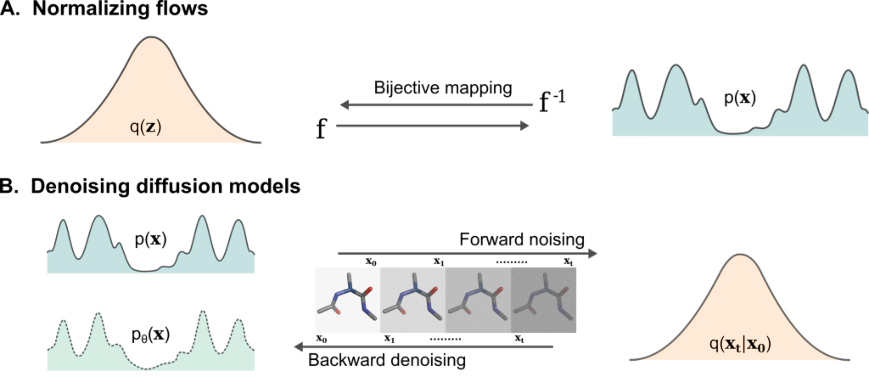

**Original caption:** FIG. 21: Two families of deep generative models. (A) Flow-based models learn a bijective mapping between a simple prior distribution and a complex data distribution, parameterized by a neural network. (B) Diffusion models learn a pair of complementary stochastic processes: a forward diffusion process that gradually transforms a data sample x0 ∼p(x) into a noise sample xt ∼q(xt | x0) by adding Gaussian noise, and a learned reverse process that denoises xt to recover samples from a distribution pθ(x) that approximates the original data distribution.

**中文图注:** 如图。 21：两个深度生成模型系列。 (A) 基于流的模型学习简单先验分布和复杂数据分布之间的双射映射，由神经网络参数化。 (B) 扩散模型学习一对互补的随机过程：一个前向扩散过程，通过添加高斯噪声逐渐将数据样本 x0 ∼p(x) 转换为噪声样本 xt ∼q(xt | x0)，以及一个学习的反向过程，对 xt 进行去噪，以从近似原始数据分布的分布 pθ(x) 中恢复样本。

**Reading note / 阅读提示：** Inspect this visual together with the immediately preceding source block; it is placed at the first substantive discussion available in the extracted text.

**Source:** p.32 S319

**Original:** 6 GENERATIVE MODELS ASSIST SAMPLING

**中文:** 6 生成模型辅助采样

**Source:** p.32 S320

**Original:** from this space to the target one, and the corresponding inverse f −1 : x →z. The generated samples will be distributed according to the transformed distribution px(x) = f(q(z)), which is then optimized to match the target p(x), for instance by minimizing the KL divergence. The advantage of choosing an invertible transformation is that we can write the relation between the two distributions as a change of variables:

**中文:** 从这个空间到目标空间，以及相应的逆 f -1 : x →z。生成的样本将根据变换后的分布 px(x) = f(q(z)) 进行分布，然后进行优化以匹配目标 p(x)，例如通过最小化 KL 散度。选择可逆变换的优点是我们可以将两个分布之间的关系写成变量的变化：

**Source:** p.32 S321

**Original:** px(x) = q(z) |det(Jf(z))|−1 (35)

**中文:** px(x) = q(z) |det(Jf(z))|−1 (35)

**Source:** p.32 S322

**Original:** where Jf(z) is the Jacobian matrix of f, and |det(Jf(z))|−1 = det(Jf −1(x)) . Hence, in order to be of practical usage, NF architectures need to be designed so that the determinant of the Jacobian is easy to compute. A common design involves composing multiple invertible coupling layers, where the input z is split into two subsets z1 and z2. The first subset is left unchanged and used to condition the transformation of the second:

**中文:** 其中 Jf(z) 是 f 的雅可比矩阵，且 |det(Jf(z))|−1 = det(Jf −1(x)) 。因此，为了实用，需要设计 NF 架构，以便雅可比行列式易于计算。常见的设计涉及组成多个可逆耦合层，其中输入 z 分为两个子集 z1 和 z2。第一个子集保持不变并用于调节第二个子集的转换：

**Source:** p.32 S323

**Original:** y1 = z1 (36) y2 = h(z2, gθ(z1)) (37)

**中文:** y1 = z1 (36) y2 = h(z2, gθ(z1)) (37)

**Source:** p.32 S324

**Original:** Here, h is an easily invertible coupling function, and g is a generally non-invertible conditioning function (typically a neural network) that depends on parameters θ. This structure leads to lower-triangular Jacobians, simplifying determinant calculations. Stacking multiple layers and alternating the roles of z1 and z2 enhances model expressivity. Among the broad family of NFs, it is worth mentioning the conditional normalizing flows, designed to model conditional target distributions. A conditional NF f(z|c) learns a transformation from the prior q(z) to a conditional target p(x|c), where c is a set of conditioning variables.276 In this case, the change-ofvariables rule becomes:

**中文:** 这里，h 是一个容易可逆的耦合函数，g 是一个通常不可逆的条件函数（通常是神经网络），取决于参数 θ。这种结构导致了下三角雅可比行列式，简化了行列式计算。堆叠多个层并交替 z1 和 z2 的角色可以增强模型的表达能力。在广泛的 NF 系列中，值得一提的是条件归一化流，旨在对条件目标分布进行建模。条件 NF f(z|c) 学习从先验 q(z) 到条件目标 p(x|c) 的转换，其中 c 是一组条件变量。276 在这种情况下，变量变化规则变为：

**Source:** p.32 S325

**Original:** px(x|c) = q(z) |det(Jf(z)|c)|−1

**中文:** px(x|c) = q(z) |det(Jf(z)|c)|−1

**Source:** p.32 S326

**Original:** analogous to Eq. 35 but explicitly dependent on c. Denoising diffusion models (DDMs) are a class of stochastic generative models that construct complex distributions through a gradual, learnable denoising process. In contrast to the deterministic nature of normalizing flows, DDMs are inherently probabilistic, which grants them greater expressivity and flexibility at the expense of exact likelihood evaluation.22

**中文:** 类似于等式。 35 但明确依赖于 c。去噪扩散模型 (DDM) 是一类随机生成模型，它通过渐进的、可学习的去噪过程构建复杂的分布。与归一化流的确定性性质相反，DDM 本质上是概率性的，这赋予它们更大的表达性和灵活性，但代价是精确的可能性评估。 22

**Source:** p.32 S327

**Original:** The core idea behind DDMs is to define a pair of complementary stochastic processes: a forward process that gradually transforms data into noise, and a backward process that learns to reverse this transformation and recover samples from the original distribution. The forward process, or noising diffusion, starts from an input x0 and produces a sequence of increasingly noisy versions x1, x2, . . . , xT by adding noise in a controlled fashion. In the commonly used case of a Gaussian noise, this step takes the form:

**中文:** DDM 背后的核心思想是定义一对互补的随机过程：一个逐渐将数据转换为噪声的前向过程，以及一个学习反转这种转换并从原始分布中恢复样本的后向过程。前向过程或噪声扩散从输入 x0 开始，并产生一系列噪声逐渐增大的版本 x1、x2...。 。 。 , xT 通过以受控方式添加噪声。在常用的高斯噪声情况下，此步骤采用以下形式：

**Source:** p.32 S328

**Original:** xt = p

**中文:** xt = p

**Source:** p.32 S329

**Original:** 1 −βt xt−1 + p

**中文:** 1 −βt xt−1 + p

**Source:** p.32 S330

**Original:** βt εt (38)

**中文:** βt εt (38)

**Source:** p.32 S331

**Original:** where εt ∼N(0, I) and βt < 1 controls the noise variance at each timestep. This process transforms any

**中文:** 其中 εt ∼N(0, I) 和 βt < 1 控制每个时间步的噪声方差。这个过程改变了任何

## Page 33

**Source:** p.33 S332

**Original:** structured input into pure Gaussian noise as t →T. This forward diffusion can equivalently be described using a transition kernel:

**中文:** 结构化输入为纯高斯噪声，如 t→T。这种前向扩散可以等效地使用转换内核来描述：

**Source:** p.33 S333

**Original:** q(xt|xt−1) = N(xt; p

**中文:** q(xt|xt−1) = N(xt; p

**Source:** p.33 S334

**Original:** 1 −βt xt−1, βtI) (39)

**中文:** 1 −βt xt−1, βtI) (39)

**Source:** p.33 S335

**Original:** The more complicated component is the denoising or reverse process, which aims to reconstruct meaningful samples from noise. This is learned by parameterizing reverse transition kernels q′ θ(xt−1|xt), typically using neural networks. A standard approach models the reverse step with another Gaussian distribution:

**中文:** 更复杂的部分是去噪或逆过程，其目的是从噪声中重建有意义的样本。这是通过参数化反向转移核 q′ θ(xt−1|xt) 来学习的，通常使用神经网络。标准方法用另一个高斯分布对反向步骤进行建模：

**Source:** p.33 S336

**Original:** q′ θ(xt−1|xt) = N(xt−1; μθ(xt, t), σθ(xt, t)) (40)

**中文:** q′ θ(xt−1|xt) = N(xt−1; μθ(xt, t), σθ(xt, t)) (40)

**Source:** p.33 S337

**Original:** where both the mean and variance are predicted by a neural network. To optimize the parameters, one can follow the maximum likelihood principle by training a reverse Markov chain that best explains the data. Since the exact likelihood is intractable, training typically maximizes the ELBO, whose KL terms can be computed efficiently under Gaussian assumptions for the transition kernels. Alternatively, score matching can be used, where the model learns the score function s(x) = ∇x log p(x) instead of directly modeling transition kernels. In summary, normalizing flows and diffusion models both transform simple base distributions into complex target ones, but they differ in key aspects. Flows are deterministic and enable exact likelihood evaluation with fast sampling, though their expressivity can be limited by the need for invertibility and tractable Jacobians. Diffusion models, being stochastic, are more flexible and typically perform better in highdimensional settings, but they require iterative sampling and do not provide closed-form likelihoods. For a more in-depth comparison and analysis, see the review by John et al.277.

**中文:** 其中均值和方差均由神经网络预测。为了优化参数，可以通过训练最能解释数据的逆马尔可夫链来遵循最大似然原理。由于确切的似然性很难处理，因此训练通常会最大化 ELBO，其 KL 项可以在转移核的高斯假设下有效计算。或者，可以使用分数匹配，其中模型学习分数函数 s(x) = ∇x log p(x)，而不是直接对转换核建模。总之，归一化流和扩散模型都将简单的基础分布转化为复杂的目标分布，但它们在关键方面有所不同。流是确定性的，并且可以通过快速采样进行精确的似然评估，尽管它们的表达能力可能会受到可逆性和易处理的雅可比行列式的需求的限制。扩散模型是随机的，更灵活，通常在高维设置中表现更好，但它们需要迭代采样并且不提供封闭形式的可能性。如需更深入的比较和分析，请参阅 John 等人的评论277。

**Source:** p.33 S338

**Original:** 6.2 Boltzmann generators

**中文:** 6.2 玻尔兹曼发生器

**Source:** p.33 S339

**Original:** Boltzmann Generators (BGs), introduced by Noé et al.273, represent one of the most well-known applications of generative models to (enhanced) sampling. In essence, they are designed to directly sample the equilibrium Boltzmann distribution, bypassing the need for long simulations like MD or Monte Carlo. As described in Fig. 22, the key idea is to learn an invertible transformation between a simple latent space z with an easy-to-sample prior distribution q(z) = pz(z) (e.g., a standard Gaussian) and the configuration space x of the physical system, distributed according to the hard-to-sample Boltzmann distribution:

**中文:** Noé 等人提出的玻尔兹曼生成器 (BG) 273 代表了生成模型在（增强）采样中最著名的应用之一。本质上，它们旨在直接对平衡玻尔兹曼分布进行采样，从而绕过 MD 或蒙特卡罗等长时间模拟的需要。如图 22 所示，关键思想是学习具有易于采样先验分布 q(z) = pz(z)（例如标准高斯）的简单潜在空间 z 与根据难以采样玻尔兹曼分布分布的物理系统的配置空间 x 之间的可逆变换：

### Fig. 022. 玻尔兹曼生成器经过优化，可最大限度地减少生成的分布与目标玻尔兹曼分布之间的差异。

**Placed near:** p.33 S339

**Source:** p.34 C024

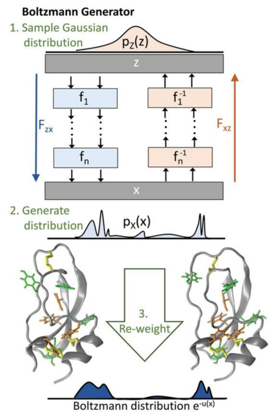

**Original caption:** FIG. 22: Boltzmann generators are optimized to minimize the discrepancy between their generated distribution and the target Boltzmann distribution. Sampling proceeds by drawing latent variables z from a simple prior (e.g., a Gaussian) and transforming them into molecular configurations x. This transformation is implemented as a deep neural network Fzx, constructed by stacking invertible layers f1, . . . , fn, with an inverse mapping Fxz for efficient bidirectional sampling. To compute thermodynamic quantities, the generated samples are then reweighted to obtain the Boltzmann distribution. Image reproduced from Ref. 273. Copyright 2019 American Association for the Advancement of Science.

**中文图注:** 如图。 22：玻尔兹曼生成器经过优化，可最大限度地减少生成的分布与目标玻尔兹曼分布之间的差异。采样是通过从简单的先验（例如高斯）中提取潜在变量 z 并将其转换为分子构型 x 来进行的。该变换被实现为深度神经网络 Fzx，由堆叠可逆层 f1,…构成。 。 。 ，fn，具有逆映射 Fxz，用于高效双向采样。为了计算热力学量，然后对生成的样本重新加权以获得玻尔兹曼分布。图片转载自参考文献。 273. 版权所有 2019 美国科学促进会。

**Reading note / 阅读提示：** Inspect this visual together with the immediately preceding source block; it is placed at the first substantive discussion available in the extracted text.

**Source:** p.33 S340

**Original:** p(x) = 1

**中文:** p(x) = 1

**Source:** p.33 S341

**Original:** Z e−u(x)

**中文:** Z e−u(​​x)

**Source:** p.33 S342

**Original:** where u is the reduced energy (divided by kBT) and Z the partition function. This transformation is implemented as a normalizing flow, consisting of a forward map f = Fzx and its inverse f −1 = Fxz. The map is optimized such that the distribution of the generated samples px(x) approximates the true one p(x). Once trained, the transformation can be used to generate equilibrium samples by drawing latent variables z ∼q(z) and mapping them to physical configurations via x = Fzx(z). In particular, expectation values of physical observables O(x) can be computed as a weighted average over generated samples:

**中文:** 其中 u 是约化能量（除以 kBT），Z 是配分函数。该变换被实现为归一化流，由前向映射 f = Fzx 及其逆映射 f −1 = Fxz 组成。该图经过优化，使得生成的样本 px(x) 的分布接近真实样本 p(x)。经过训练后，该变换可用于通过绘制潜在变量 z ∼q(z) 并通过 x = Fzx(z) 将它们映射到物理配置来生成平衡样本。特别是，物理可观测值 O(x) 的期望值可以计算为生成样本的加权平均值：

**Source:** p.33 S343

**Original:** ⟨O(x)⟩= P

**中文:** ⟨O(x)⟩= P

**Source:** p.33 S344

**Original:** i w(xi)O(xi) P

**中文:** i w(xi)O(xi) P

**Source:** p.33 S345

**Original:** i w(xi)

**中文:** 我w(xi)

**Source:** p.33 S346

**Original:** where the weights account for the discrepancy between the generated distribution px(x) and the true Boltzmann one: w(x) ∝e−u(x)

**中文:** 其中权重说明了生成的分布 px(x) 与真实玻尔兹曼分布之间的差异： w(x) ∝e−u(x)

**Source:** p.33 S347

**Original:** px(x) . The standard training procedure combines two main learning objectives, corresponding to the directions of the invertible transformation. The primary

**中文:** 像素（x）。标准训练程序结合了两个主要学习目标，对应于可逆变换的方向。初级

## Page 34

**Source:** p.34 S348

**Original:** component is training by energy, which encourages the generation of Boltzmann-distributed samples in the transformed space. Unlike conventional ML models trained on fixed datasets, here the parameters are optimized using configurations generated by the model itself. Specifically, latent variables z ∼pz are sampled from the prior and mapped to configurations via x = Fzx(z). The generative map is then optimized by minimizing the KL divergence between the generated distribution and the target Boltzmann one:

**中文:** 组件是通过能量进行训练，这鼓励在变换的空间中生成玻尔兹曼分布的样本。与在固定数据集上训练的传统机器学习模型不同，这里使用模型本身生成的配置来优化参数。具体来说，潜在变量 z∼pz 从先验中采样并通过 x = Fzx(z) 映射到配置。然后通过最小化生成的分布与目标玻尔兹曼分布之间的 KL 散度来优化生成图：

**Source:** p.34 S349

**Original:** LKL = ⟨u(Fzx(z)) −log det Jzx(z)⟩ (41)

**中文:** LKL = ⟨u(Fzx(z)) −log det Jzx(z)⟩ (41)

**Source:** p.34 S350

**Original:** where Jzx is the Jacobian of the generative transformation. While effective, this energy-based training alone can lead to mode collapse, in which the model learns only the most probable thermodynamic state, failing to

**中文:** 其中 Jzx 是生成变换的雅可比行列式。虽然有效，但这种基于能量的训练本身可能会导致模式崩溃，其中模型仅学习最可能的热力学状态，而无法

**Source:** p.34 S351

**Original:** 6 GENERATIVE MODELS ASSIST SAMPLING

**中文:** 6 生成模型辅助采样

**Source:** p.34 S352

**Original:** capture the full diversity of the distribution. To avoid this, a complementary objective is introduced: training by example. In this approach, reference configurations ̃x (e.g., representative structures from different metastable states) are encoded into the latent space via ̃z = Fxz( ̃x), and their likelihood under the prior is maximized:

**中文:** 捕获分布的全部多样性。为了避免这种情况，引入了一个补充目标：通过实例进行培训。在这种方法中，参考配置 ̃x （例如，来自不同亚稳态的代表性结构）通过 ̃z = Fxz( ̃x) 编码到潜在空间中，并且它们在先验下的可能性被最大化：

**Source:** p.34 S353

**Original:** LML = 1

**中文:** LML = 1

**Source:** p.34 S354

**Original:** 2∥Fxz(x)∥2 −log det Jxz(x) (42)

**中文:** 2∥Fxz(x)∥2 −log det Jxz(x) (42)

**Source:** p.34 S355

**Original:** where Jxz is the Jacobian of the encoding transformation. It is important to note that the two training modes described above do not rely on the identification of reaction coordinates or CVs. However, if such coordinates are known, they can be incorporated into the training via auxiliary loss functions that encourage exploration outside of the metastable basins, for instance, by explicitly targeting transition-state configurations. This enhances the generation of lowprobability states and enables the computation of continuous free energy profiles and realistic transition pathways. Despite their conceptual appeal, the application of BGs to complex systems remained so far limited by several challenges. A primary difficulty stems from the intrinsic complexity of the Boltzmann distribution itself, which makes learning an accurate generative map highly demanding, even for relatively simple systems. For example, modeling systems with explicit solvent is particularly problematic due to the dramatic increase in dimensionality. Likewise, long-range interactions, which are common in biological and charged systems, pose further difficulties for accurately capturing the distribution. Another critical limitation arises from the invertibility constraint imposed by the normalizing flow architecture, which restricts the model’s expressivity unless a large number of transformation layers are employed. This, in turn, increases the computational cost associated with training. To address these issues, several technical improvements have been proposed. These include stochastic normalizing flows278, equivariant flows279, and smooth flows280, all designed to enhance flexibility and scalability. Notably, the introduction of equivariant flow matching281 has improved sampling efficiency and enabled the first transferable BGs282. Beyond architectural improvements, some efforts have aimed to extend the physical applicability of BGs to a wider range of thermodynamic transformations. For example, temperature-steerable flows, introduced by Dibak et al.283, generalize the BG framework to sample across a family of thermodynamic states parameterized by temperature. Moqvist et al. introduced a thermodynamic interpolation method175 to generate sampling statistics in a range of temperatures either by learning direct mapping between thermodynamic states in the configurational space, or by passing through a latent space. In a similar direction, Van Leeuwen et al. proposed a prototypical BG for the isothermal-isobaric ensemble, which can be used to predict fluctuations of the particle positions but also of the box itself.284 Finally, Schebek et al.285 presented a BG-based method

**中文:** 其中 Jxz 是编码变换的雅可比行列式。需要注意的是，上述两种训练模式并不依赖于反应坐标或 CV 的识别。然而，如果这些坐标已知，则可以通过辅助损失函数将它们纳入训练中，这些辅助损失函数鼓励亚稳盆地之外的探索，例如通过明确针对过渡态配置。这增强了低概率状态的生成，并能够计算连续的自由能分布和现实的跃迁路径。尽管它们在概念上很有吸引力，但 BG 在复杂系统中的应用迄今为止仍然受到一些挑战的限制。主要困难源于玻尔兹曼分布本身的内在复杂性，这使得学习准确的生成图要求很高，即使对于相对简单的系统也是如此。例如，由于维度的急剧增加，使用显式溶剂的建模系统特别成问题。同样，在生物和带电系统中常见的长程相互作用，为准确捕获分布带来了进一步的困难。另一个关键限制来自归一化流架构所施加的可逆性约束，除非采用大量转换层，否则它会限制模型的表达能力。这反过来又增加了与训练相关的计算成本。为了解决这些问题，已经提出了一些技术改进。其中包括随机归一化流278、等变流279 和平滑流280，所有这些都旨在增强灵活性和可扩展性。值得注意的是，等变流匹配的引入281提高了采样效率，并实现了第一个可转移的BG282。除了架构改进之外，一些努力还旨在将 BG 的物理适用性扩展到更广泛的热力学转换。例如，Dibak 等人283 提出的温度可控流将 BG 框架推广到一系列由温度参数化的热力学状态中进行采样。莫奎斯特等人。引入了热力学插值方法175，通过学习构型空间中热力学状态之间的直接映射或通过潜在空间来生成一定温度范围内的采样统计数据。 Van Leeuwen 等人也朝着类似的方向发展。提出了等温等压系综的原型 BG，它可用于预测粒子位置的波动，也可用于预测盒子本身的波动。 284 最后，Schebek 等人 285 提出了一种基于 BG 的方法

## Page 35

**Source:** p.35 S356

**Original:** that combines conditioning on temperature and pressure with elements of free energy perturbation (see Sec. 6 3) to compute phase diagrams across a continuous range of thermodynamic conditions.

**中文:** 它将温度和压力调节与自由能扰动元素相结合（参见第 6 节 3），以计算连续范围的热力学条件下的相图。

**Source:** p.35 S357

**Original:** 6.3 Learned free energy perturbation

**中文:** 6.3 习得的自由能扰动

**Source:** p.35 S358

**Original:** Generative models have also been applied to extend the capabilities of free energy perturbation (FEP) methods. The classical FEP method, introduced by Zwanzig,286 aims to estimate the free energy difference ∆fAB between two thermodynamic states A (reference) and B (target), characterized by reduced potentials uA(x) and uB(x), using the identity: e−∆uAB

**中文:** 生成模型也被用来扩展自由能微扰（FEP）方法的能力。 Zwanzig 引入的经典 FEP 方法，286 旨在估计两个热力学状态 A（参考）和 B（目标）之间的自由能差 ΔfAB，其特征为约化电势 uA(x) 和 uB(x)，使用恒等式：e−ΔuAB

**Source:** p.35 S359

**Original:** A = e−β∆fAB (43)

**中文:** A = e−βΔfAB (43)

**Source:** p.35 S360

**Original:** where ∆uAB = uB(x) −uA(x). Two key factors govern the accuracy of FEP: sufficient sampling of the reference distribution A, and sufficient overlap between the probability distributions of states A and B in configuration space.287–290 The former often requires enhanced sampling techniques, while the latter is typically addressed using a multi-stage mapping. That is, one defines a set of intermediate states, decomposing the transformation into smaller steps and bridging the gap between poorly overlapping endpoints. An alternative approach, particularly suited for generative models, is targeted free energy perturbation (TFEP), proposed by Jarzynski.291 TFEP introduces an invertible transformation M that maps configurations from state A to a modified distribution A′

**中文:** 其中 ΔuAB = uB(x) −uA(x)。控制 FEP 准确性的两个关键因素：参考分布 A 的充分采样，以及配置空间中状态 A 和 B 的概率分布之间的充分重叠。287-290 前者通常需要增强采样技术，而后者通常使用多级映射来解决。也就是说，定义一组中间状态，将转换分解为更小的步骤，并弥合重叠程度较差的端点之间的差距。另一种特别适合生成模型的方法是目标自由能扰动 (TFEP)，由 Jarzynski 提出。291 TFEP 引入了可逆变换 M，将配置从状态 A 映射到修改后的分布 A'

**Source:** p.35 S361

**Original:** with increased overlap with state B. Being this transformation invertible, its effect on the free energy is captured through the map work:

**中文:** 与状态 B 的重叠增加。由于这种变换是可逆的，因此它对自由能的影响可以通过映射工作捕获：

**Source:** p.35 S362

**Original:** w[M](x) = uB(M(x))−log | det JM(x)|−uA(x) (44)

**中文:** w[M](x) = uB(M(x))−log | w[M](x) = uB(M(x))−log | det JM(x)|−uA(x) (44)

**Source:** p.35 S363

**Original:** which leads to the modified identity:

**中文:** 这导致身份修改：

**Source:** p.35 S364

**Original:** β∆fAB = −log D e−w[M](x)E

**中文:** βΔfAB = −log D e−w[M](x)E

**Source:** p.35 S365

**Original:** A (45)

**中文:** 甲 (45)

**Source:** p.35 S366

**Original:** This approach improves convergence by enhancing overlap, but hinges on the ability to design a suitable transformation M, which is a nontrivial task. To address this, Wirnsberger et al.293 proposed learned free energy perturbation (LFEP), where the transformation M is represented by a normalizing flow, trained to minimize the expected map work:

**中文:** 这种方法通过增强重叠来提高收敛性，但取决于设计合适的变换 M 的能力，这是一项艰巨的任务。为了解决这个问题，Wirnsberger 等人293 提出了学习自由能扰动 (LFEP)，其中变换 M 由归一化流表示，经过训练以最小化预期的映射工作：

**Source:** p.35 S367

**Original:** LLFEP = ⟨w⟩A (46)

**中文:** LLFEP = ⟨w⟩A (46)

**Source:** p.35 S368

**Original:** This avoids the need to know ∆fAB, as it only contributes a constant to the KL divergence used for training. The model is designed to be permutation equivariant and consistent with periodic boundary conditions, making it applicable to atomistic systems. Besides this unidirectional training, the authors also introduced a bidirectional scheme called learned bennett acceptance ratio (LBAR). This method optimizes both the forward map M : A →A′ and its inverse M −1 : B →B′, leading to the combined loss:

**中文:** 这避免了知道 ΔfAB 的需要，因为它只为用于训练的 KL 散度贡献一个常数。该模型被设计为排列等变且与周期性边界条件一致，使其适用于原子系统。除了这种单向训练之外，作者还引入了一种称为学习贝内特接受率（LBAR）的双向方案。该方法优化了正向映射 M : A →A′ 及其逆映射 M −1 : B →B′，导致组合损失：

**Source:** p.35 S369

**Original:** LLBAR = ⟨wM⟩A + ⟨wM −1⟩B (47)

**中文:** LLBAR = ⟨wM⟩A + ⟨wM −1⟩B (47)

**Source:** p.35 S370

**Original:** where wM −1 is analogous to Eq. 44, computed on samples from state B. LFEP was later applied by Rizzi et al.292 to reference potential methods, where FEP is used to reweight configurations generated with a cheaper Hamiltonian to a more accurate one (Fig. 23). In this setting, bidirectional training is often infeasible due to the high cost of generating samples according to the target potential. They introduced several improvements to the unidirectional training, such as using an independent test dataset to evaluate ∆fAB, to eliminate the bias that arises when evaluating on the same dataset used for training. Furthermore, they extended the method to allow the computation of the free profile as a function of a general CV f(s), for which a sufficient condition is that the transformation M : A →A′ satisfies the condition s(M(x)) = s(x) which prevents the map from moving probability density along s, thus transforming only degrees of freedom orthogonal to s. This makes it possible to employ CV-based enhanced sampling methods to gather the training points, extending the coverage of the reference phase space. This work was further improved with a multimap TFEP formulation294, which addresses two key inefficiencies: (i) the cost of the energy calculations at the expensive target potential, which are needed to compute the loss but are then discarded to avoid the systematic error, and (ii) the risk of overfitting, difficult to monitor due to the cost of the loss function. Their solution combined one-epoch training (so that each sample used is only once) with a multi-map ensemble approach, which computes the free energy difference from a collection of Nm independent maps {M m}Nm m=1:

**中文:** 其中 wM −1 类似于等式： 44，根据状态 B 的样本计算。后来，Rizzi 等人将 LFEP 应用到参考潜在方法。292，其中 FEP 用于将使用更便宜的哈密顿量生成的配置重新加权为更准确的配置（图 23）。在这种情况下，由于根据目标电位生成样本的成本很高，双向训练通常是不可行的。他们对单向训练进行了一些改进，例如使用独立的测试数据集来评估 ΔfAB，以消除在评估用于训练的同一数据集时出现的偏差。此外，他们扩展了该方法，允许将自由轮廓计算为一般 CV f(s) 的函数，其充分条件是变换 M : A →A′ 满足条件 s(M(x)) = s(x)，这防止映射沿 s 移动概率密度，从而仅变换与 s 正交的自由度。这使得可以采用基于 CV 的增强采样方法来收集训练点，从而扩展参考相空间的覆盖范围。这项工作通过多图 TFEP 公式得到了进一步改进，它解决了两个关键的低效率问题：（i）昂贵的目标势能的能量计算成本，计算损失需要这些成本，但随后被丢弃以避免系统误差，以及（ii）过度拟合的风险，由于损失函数的成本而难以监控。他们的解决方案将单周期训练（以便每个样本仅使用一次）与多图集成方法相结合，该方法根据 Nm 个独立图 {M m}Nm m=1 的集合计算自由能差：

### Fig. 023. 扩展 TFEP 框架的示意图。目标是从更便宜的参考势开始计算量子力学水平上的自由

**Placed near:** p.35 S370

**Source:** p.35 C025

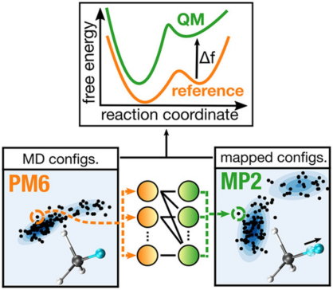

**Original caption:** FIG. 23: Schematic of the extended TFEP framework. The goal is to compute free energy differences and profiles at the quantum mechanical level starting from a cheaper reference potential. This is achieved by training a normalizing flow to map between the reference and target distributions, enhancing overlap and enabling efficient reweighting. Image reproduced from Ref. 292. Copyright 2021 American Chemical Society under [CC BY 4.0 DEED].

**中文图注:** 如图。图 23：扩展 TFEP 框架的示意图。目标是从更便宜的参考势开始计算量子力学水平上的自由能差异和分布。这是通过训练标准化流程来在参考分布和目标分布之间进行映射、增强重叠并实现有效的重新加权来实现的。图片转载自参考文献。 292. 版权所有 2021 美国化学会，根据 [CC BY 4.0 DEED]。

**Reading note / 阅读提示：** Inspect this visual together with the immediately preceding source block; it is placed at the first substantive discussion available in the extracted text.

**Source:** p.35 S371

**Original:** Nm X

**中文:** 纳米X

**Source:** p.35 S372

**Original:** ∆fAB = −log 1 Nm

**中文:** ΔfAB = −log 1 Nm

**Source:** p.35 S373

**Original:** D e−w[M m](x)E

**中文:** D e−w[M m](x)E

**Source:** p.35 S374

**Original:** A (48)

**中文:** 一个 (48)

**Source:** p.35 S375

**Original:** m=1

**中文:** 米=1

## Page 36

**Source:** p.36 S376

**Original:** The main advantage of this reformulation is to allow using the full dataset for both training and evaluating ∆fAB, rather than discarding the data generated during the training. The power of the approach was demonstrated by computing the free energy correction between a reference force field and a semiempirical potential across the HiPen dataset of drug-like molecules.

**中文:** 这种重新制定的主要优点是允许使用完整的数据集来训练和评估 ΔfAB，而不是丢弃训练期间生成的数据。通过计算类药分子 HiPen 数据集中的参考力场和半经验势之间的自由能校正，证明了该方法的强大功能。

**Source:** p.36 S377

**Original:** 6.4 Integrations with replica exchange

**中文:** 6.4 与副本交换集成

**Source:** p.36 S378

**Original:** Replica exchange (REX), also known as parallel tempering, is a widely used enhanced sampling technique designed to improve sampling across complex energy landscapes by simulating multiple replicas of the system in parallel at different thermodynamic conditions.296,297 The replicas, typically arranged along a ladder of temperatures or other control parameters, are periodically allowed to exchange configurations, with an acceptance probability that depend on the difference in reduced energy between the two distributions ∆uij(x) = ui(x) −uj(x):

**中文:** 副本交换 (REX)，也称为并行回火，是一种广泛使用的增强采样技术，旨在通过在不同的热力学条件下并行模拟系统的多个副本来改进复杂能源景观的采样。 296,297 通常沿着温度或其他控制参数的阶梯排列的副本被允许定期交换配置，其接受概率取决于两个分布之间减少能量的差异 Δuij(x) = ui(x) −uj(x)：

**Source:** p.36 S379

**Original:** αREX = min  1, pj(xi)

**中文:** αREX = 最小值 1, pj(xi)

**Source:** p.36 S380

**Original:** pi(xi) · pi(xj)

**中文:** pi(xi) · pi(xj)

**Source:** p.36 S381

**Original:** pj(xj)

**中文:** pj(xj)

**Source:** p.36 S382

**Original:** = min n 1, e∆uij(xi)−∆uij(xj)o (49)

**中文:** = min n 1, eΔuij(xi)−Δuij(xj)o (49)

**Source:** p.36 S383

**Original:** The overall goal is to connect a hard-to-sample target distribution (such as a low-temperature Boltzmann distribution) with an easy-to-sample one (such as a high-temperature distribution) by enabling information flow across replicas. A well-known limitation of REX is that energy is an extensive quantity, so a large number of intermediate replicas is often required to ensure sufficient overlap between neighboring distributions. To bypass this limitation, Invernizzi et al. introduced the learned replica exchange (LREX) method,295

**中文:** 总体目标是通过跨副本的信息流，将难以采样的目标分布（例如低温玻尔兹曼分布）与易于采样的目标分布（例如高温分布）连接起来。 REX 的一个众所周知的限制是能量是一个广泛的数量，因此通常需要大量的中间副本来确保相邻分布之间有足够的重叠。为了绕过这个限制，Invernizzi 等人。引入了学习副本交换（LREX）方法，295

**Source:** p.36 S384

**Original:** which uses a normalizing flow to learn a transformation between the prior and target distributions. This transformation is optimized to ensure sufficient overlap so that direct exchanges can be attempted between

**中文:** 它使用归一化流来学习先验分布和目标分布之间的转换。这种转换经过优化，可确保足够的重叠，以便可以尝试在

**Source:** p.36 S385

**Original:** 7 CONCLUSIONS

**中文:** 7 结论

**Source:** p.36 S386

**Original:** only two replicas, eliminating the need for a full ladder and drastically reducing computational cost. In practice, a short MD simulation is first run to sample configurations from the prior distribution q(x). These are used to train a normalizing flow f using an energybased loss, similar to that used in BGs. Training convergence can be monitored using the Kish effective sample size298, which also provides an estimate of the expected exchange acceptance rate. After training, the system is simulated at both prior and target conditions, and exchanges between the two are proposed with an acceptance probability:

**中文:** 只需两个副本，无需完整的梯子并大大降低了计算成本。在实践中，首先运行简短的 MD 模拟来从先验分布 q(x) 中采样配置。这些用于使用基于能量的损失来训练归一化流 f，类似于 BG 中使用的损失。可以使用 Kish 有效样本大小298 来监控训练收敛性，该样本还提供了预期交换接受率的估计。训练后，系统在先验条件和目标条件下进行模拟，并提出两者之间的交换以及接受概率：

**Source:** p.36 S387

**Original:** αLREX = min  1, p(x′ q) q′(x′q) · q′(xp)

**中文:** αLREX = min 1, p(x′ q) q′(x′q) · q′(xp)

**Source:** p.36 S388

**Original:**  (50)

**中文:** (50)

**Source:** p.36 S389

**Original:** p(xp)

**中文:** p(xp)

**Source:** p.36 S390

**Original:** where xp and xq are the current configurations of the target and prior replicas, respectively. Importantly, the learned transformation does not need to be exact—only sufficient to induce overlap—since the correct target statistics can be recovered by reweighting with the importance weights:

**中文:** 其中 xp 和 xq 分别是目标副本和先前副本的当前配置。重要的是，学习到的转换不需要精确，只需足以引起重叠即可，因为可以通过使用重要性权重重新加权来恢复正确的目标统计数据：

**Source:** p.36 S391

**Original:** wf(x) = euq(x)−up(f(x)) + log | det Jf(x)| (51)

**中文:** wf(x) = euq(x)−up(f(x)) + log |检测 Jf(x)| (51)

**Source:** p.36 S392

**Original:** A different point of view was adopted by Wang et al. in combining REX with generative models, as they proposed to use them as a postprocessing tool to improve the sampling of the low-temperature replica.299

**中文:** Wang等人提出了不同的观点。将 REX 与生成模型相结合，因为他们建议将它们用作后处理工具来改进低温副本的采样。299

**Source:** p.36 S393

**Original:** They noted that configurations sampled across replicas can be viewed as drawn from a joint distribution p(x, T ), rather than from independent temperaturespecific ensembles. Here, T denotes the instantaneous kinetic temperature, whose ensemble average equals the heat bath temperature T. Based on this insight, they trained a denoising diffusion probabilistic model to learn p(x, T ), using REX-generated data. The trained model was then used to generate new samples at low temperatures, improving sampling of rare configurations, and even to extrapolate to temperatures not included in the original REX ladder. This approach was successfully applied to small peptides and RNA strands, demonstrating how generative models can augment traditional replica exchange schemes.

**中文:** 他们指出，跨副本采样的配置可以被视为从联合分布 p(x, T ) 中提取，而不是从独立的温度特定集合中提取。这里，T 表示瞬时动力学温度，其集合平均值等于热浴温度 T。基于这一见解，他们使用 REX 生成的数据训练了一个去噪扩散概率模型来学习 p(x, T )。然后使用经过训练的模型在低温下生成新样本，改进稀有配置的采样，甚至推断原始 REX 阶梯中未包含的温度。这种方法已成功应用于小肽和 RNA 链，展示了生成模型如何增强传统的复制品交换方案。

**Source:** p.36 S394

**Original:** 7 Conclusions

**中文:** 7 结论

**Source:** p.36 S395

**Original:** Enhanced sampling methods have evolved over the past five decades into indispensable tools for exploring rare events and complex free energy landscapes in molecular simulations. In recent years, ML has transformed this field, enabling innovative solutions to challenges posed by the high dimensionality of molecular systems and the inherent sampling problem. In this review, we have surveyed the interplay between ML and enhanced sampling, highlighting both their synergies and their limitations. Among the areas of integration, the most substantial and widespread advances have occurred in the construction of CVs. The challenge of identifying lowdimensional yet expressive representations of molecular systems aligns naturally with the strengths of ML.

**中文:** 在过去的五年中，增强采样方法已发展成为探索分子模拟中罕见事件和复杂自由能景观不可或缺的工具。近年来，机器学习改变了这一领域，为应对分子系统高维性和固有采样问题带来的挑战提供了创新的解决方案。在这篇综述中，我们调查了机器学习和增强采样之间的相互作用，强调了它们的协同作用和局限性。在集成领域中，最实质性和最广泛的进步发生在 CV 的构建中。识别分子系统的低维但富有表现力的表示的挑战自然与机器学习的优势相一致。

### Fig. 024. 学习副本交换（LREX）方案。在 LREX 中，训练规范化流程以将先前副本的配置

**Placed near:** p.36 S395

**Source:** p.36 C026

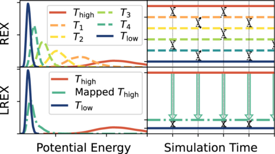

**Original caption:** FIG. 24: Scheme of the learned replica exchange (LREX). In LREX, a normalizing flow is trained to map the configurations of the prior replica to those of the target replica, allowing direct exchanges between the two without the need to simulate intermediate replicas. Image reproduced from Ref. 295. Copyright 2022 American Chemical Society.

**中文图注:** 如图。图 24：学习副本交换（LREX）方案。在 LREX 中，训练规范化流程以将先前副本的配置映射到目标副本的配置，从而允许两者之间直接交换，而无需模拟中间副本。图片转载自参考文献。 295. 版权所有 2022 美国化学会。

**Reading note / 阅读提示：** Inspect this visual together with the immediately preceding source block; it is placed at the first substantive discussion available in the extracted text.

