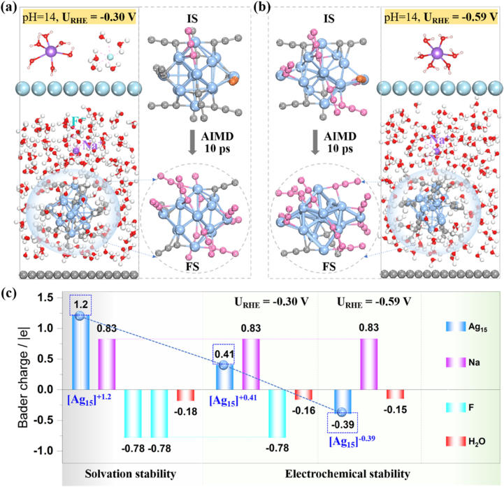
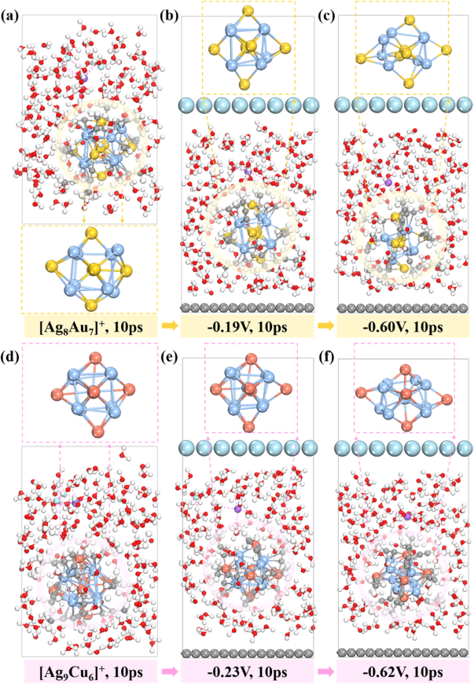
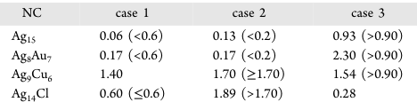
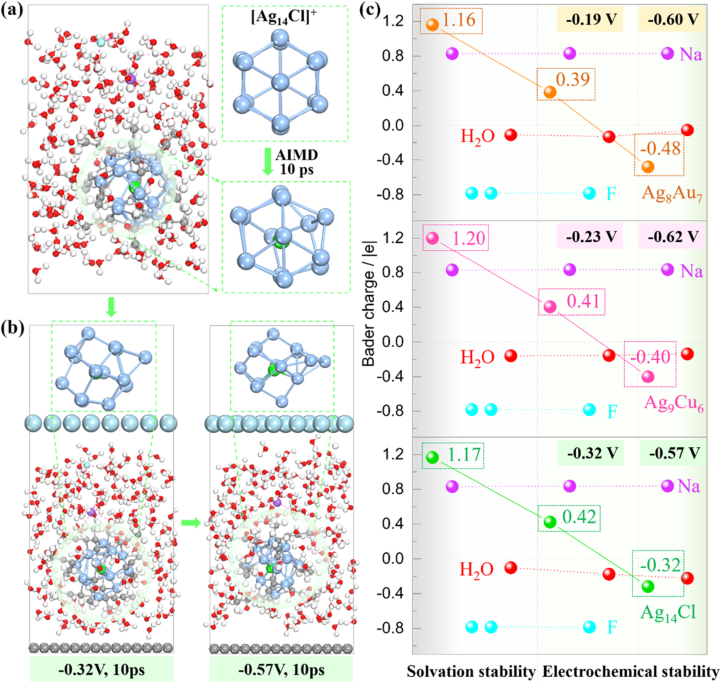
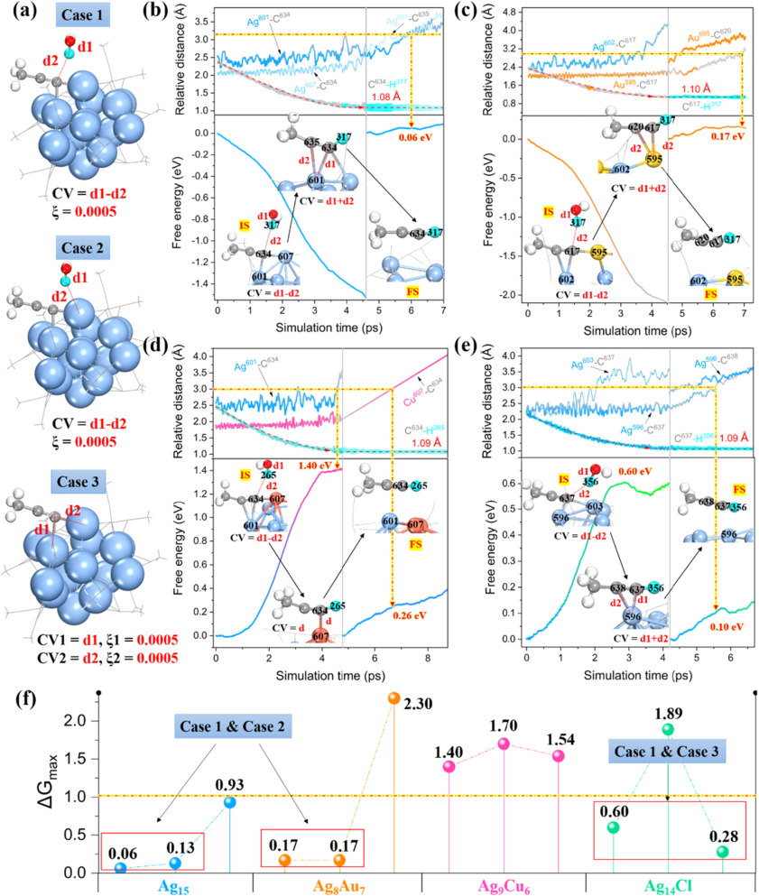
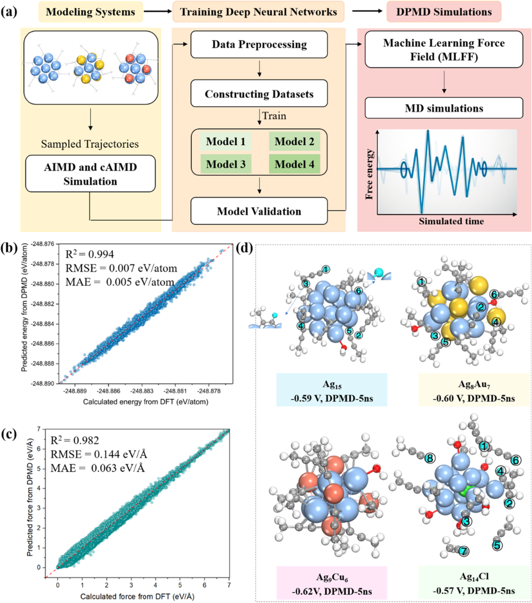
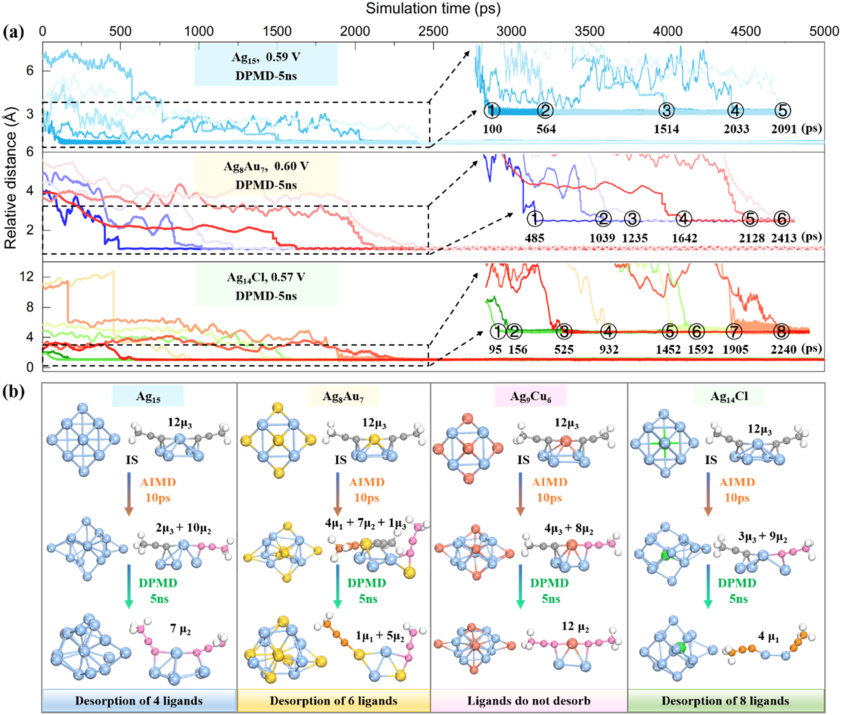

# Capturing Dynamic Core Reconstruction and Ligand Desorption of Atomically Precise Ag Nanoclusters with Machine Learning Force Field
## Metadata / 元数据
- **Journal / 期刊：** Journal of the American Chemical Society
- **Date / 日期：** 2025-12-17
- **DOI：** 10.1021/jacs.5c15207
- **Zotero key：** XHLNFBGE
- **Collection / 集合：** 03AI4S/DPMD
- **Source / 来源：** Zotero 中的出版社 PDF 附件（可选取文本层）。
## Why this paper / 为什么选这篇
**English:** This six-marker legacy-priority JACS study combines constant-potential AIMD, constrained AIMD and long-timescale DPMD to resolve how an electrocatalytic Ag nanocluster reconstructs and loses ligands in alkaline CO2 reduction conditions. It offers a concrete MLFF validation-and-mechanism workflow while rotating away from the recent TiO2-water and broad ML-review readers.

**中文：** 这篇具有六个旧蓝菱形优先标记的 JACS 研究，将恒电位 AIMD、约束 AIMD 与长时间尺度 DPMD 串联起来，解析碱性 CO2 还原条件下 Ag 纳米团簇的核心重构与配体脱附。它给出了可复用的 MLFF 验证—机理证据链，同时将近期的 TiO2-水界面与泛 ML 综述阅读切换到真实的电催化团簇体系。
## Terminology / 术语表
| English | 中文 | Note / 说明 |
|---|---|---|
| atomically precise nanocluster (NC) | 原子精确纳米团簇（NC） | 具有确定原子数和配体组成的超小金属团簇。 |
| machine learning force field (MLFF) | 机器学习力场（MLFF） | 由电子结构数据训练、用于预测能量和力的势函数。 |
| deep potential molecular dynamics (DPMD) | 深度势分子动力学（DPMD） | 使用 Deep Potential 型机器学习势进行的分子动力学模拟。 |
| ab initio molecular dynamics (AIMD) | 第一性原理分子动力学（AIMD） | 在分子动力学中在线计算电子结构与原子受力的方法。 |
| constrained AIMD (cAIMD) | 约束第一性原理分子动力学（cAIMD） | 对选定反应坐标施加约束以采样反应过程的 AIMD。 |
| ligand desorption | 配体脱附 | 配体从金属团簇表面脱离的过程。 |
| core reconstruction | 核心重构 | 金属团簇核心原子在反应条件下发生的结构重排。 |
| CO2 reduction reaction (CO2RR) | CO2 还原反应（CO2RR） | 电催化或光催化条件下将二氧化碳还原为产物的反应。 |
| Bader charge analysis | Bader 电荷分析 | 按电子密度零通量面划分原子电荷的方法。 |
| free-energy barrier | 自由能垒 | 反应沿给定坐标从初态到过渡区域所需跨越的自由能差。 |

## Reading guide / 阅读提示
**English:** First separate the short AIMD observations (Sections before Fig. 5) from the long-time DPMD evidence (Figs. 5-6). Then follow the causal chain: electrode potential changes Ag-C stability; proton-transfer pathways set the kinetic accessibility of ligand loss; MLFF extends the observation window to nanoseconds. Treat MLFF energy/force errors and the extrapolation test as the evidence boundary for the mechanism.

**中文：** 建议先区分图 5 之前的短时间 AIMD 观察与图 5-6 的长时间 DPMD 证据；随后沿因果链阅读：电极电位改变 Ag-C 键稳定性，质子转移路径决定配体损失的动力学可达性，而 MLFF 将可观察窗口延伸至纳秒。请把 MLFF 的能量/力误差和外推测试视为该机理结论的证据边界。
## Page / Section Index
- [p.1](#page-1)
- [p.2](#page-2)
- [p.3](#page-3)
- [p.4](#page-4)
- [p.5](#page-5)
- [p.6](#page-6)
- [p.7](#page-7)
- [p.8](#page-8)
- [p.9](#page-9)
- [p.10](#page-10)

## Related Reading / 延伸阅读
**English:** No strongly recommended related paper today. The article is self-contained for the specific AIMD-cAIMD-DPMD workflow; adding a generic MLFF or nanocluster list would not improve the reading route.

**中文：** 今天没有必须额外推荐的相关文献。本文针对 AIMD-cAIMD-DPMD 证据链本身已足够自洽；泛列 MLFF 或纳米团簇论文不会改善这条阅读路线。

# Bilingual Reader / 逐段中英文对照

## Page 1

**Source:** p.1 S001

**Original:** Downloaded via EAST CHINA UNIV SCIENCE & TECHLGY on June 30, 2026 at 08:43:07 (UTC).

**中文:** 通过华东理工大学于 2026 年 6 月 30 日 08:43:07（UTC）下载。

**Source:** p.1 S002

**Original:** See https://pubs.acs.org/sharingguidelines for options on how to legitimately share published articles.

**中文:** 有关如何合法共享已发表文章的选项，请参阅 https://pubs.acs.org/sharingguidelines。

**Source:** p.1 S003

**Original:** Ultrasmall atomically precise metal nanoclusters (NCs) stabilized by organic ligands exhibit significantly different electrical and optical properties from bulk metals and nanocrystals, and have broad application prospects in fields such as nanocatalysis, biosensing, and molecular recognition.1

**中文:** 由有机配体稳定的超小原子级精确金属纳米团簇（NC）表现出与块体金属和纳米晶体显着不同的电学和光学性质，在纳米催化、生物传感和分子识别等领域具有广阔的应用前景。 1

**Source:** p.1 S004

**Original:** For example, numerous cutting-edge experimental studies have shown that atomically precise Ag NCs, as an emerging class of electrocatalytic materials, have demonstrated excellent catalytic activity and high selectivity in key electrochemical conversion processes such as the hydrogen evolution reaction (HER), oxygen reduction reaction (ORR), carbon dioxide reduction reaction (CO2RR), and nitrate reduction reaction (NO3 −RR).2−18 Recently, intensive research efforts have turned to elucidating the dynamic nature of NCs under reaction conditions to establish the structure−reactivity relationships.1,19 Under realistic electrocatalytic conditions, factors such as applied electric potential or the electrolyte environment can induce dynamic reconstruction of catalytic surfaces, leading to significant deviations in structural and catalytic behavior compared to the pristine surfaces.20−24 It is worth noting that ligand-protected NCs often undergo motion of the ligand shell and dynamic structural changes of the metal

**中文:** 例如，大量前沿实验研究表明，原子级精确的Ag NCs作为一类新兴的电催化材料，在析氢反应（HER）、氧还原反应（ORR）、二氧化碳还原反应（CO2RR）和硝酸盐还原反应（NO3 −RR）等关键电化学转化过程中表现出优异的催化活性和高选择性。2−18最近，深入的研究工作转向阐明反应条件下NCs的动态性质，以建立结构-反应性关系。1,19 在现实的电催化条件下，外加电势或电解质环境等因素可能会引起催化表面的动态重建，导致结构和催化行为与原始表面相比出现显着偏差。20−24 值得注意的是，配体保护的 NC 经常经历配体壳的运动和金属的动态结构变化

**Source:** p.1 S005

**Original:** © 2025 American Chemical Society

**中文:** © 2025 美国化学会

**Source:** p.1 S006

**Original:** core under reaction conditions.25−27 All of these impact catalytic activity. Therefore, understanding the structure and dynamics of NC catalysts is needed for improving the performance. Advanced techniques have recently been used to characterize the atomic-scale structures of NCs. For instance, aberration-corrected scanning transmission electron microscopy can provide dynamic structural information regarding the size, position, and chemical composition of metal NCs.28,29 In situ spectroscopy technology can offer information on the coordination environment of the NC catalysts during the reaction process.30,31 Ma et al. employed a single nanoparticle collision electrochemical method to c o n d u c t r e a l - t i m e m o n i t o r i n g o f Au25(PPh3)10(SC2H4Ph)5Cl2 2+ NC in the ORR process.32

**中文:** 反应条件下的核心。25−27 所有这些都会影响催化活性。因此，为了提高性能，需要了解NC催化剂的结构和动力学。最近，先进技术已被用来表征NC的原子级结构。例如，像差校正扫描透射电子显微镜可以提供有关金属NC的尺寸、位置和化学成分的动态结构信息。28,29原位光谱技术可以提供有关NC催化剂在反应过程中的配位环境的信息。30,31 Ma等人。采用单纳米颗粒碰撞电化学方法对 ORR 过程中的 Au25(PPh3)10(SC2H4Ph)5Cl2 2+ NC 进行实时监测。 32

**Source:** p.1 S007

**Original:** They demonstrated that a fully ligand-protected Au25 2+ NC was activated by ligand removal at the beginning of the ORR

**中文:** 他们证明，完全配体保护的 Au25 2+ NC 通过在 ORR 开始时去除配体而被激活

**Source:** p.1 S008

**Original:** Received: September 1, 2025 Revised: November 12, 2025 Accepted: November 25, 2025 Published: December 4, 2025

**中文:** 收稿日期: 2025年9月1日 修订日期: 2025年11月12日 接受日期: 2025年11月25日 发布日期: 2025年12月4日

**Source:** p.1 S009

**Original:** ACCESS Metrics & More Article Recommendations * sı Supporting Information

**中文:** 访问指标及更多文章推荐 * sı 支持信息

**Source:** p.1 S010

**Original:** ABSTRACT: Atomically precise silver nanoclusters (NCs) protected by alkynyl ligands represent an emerging class of electrocatalysts demonstrating high activity and selectivity in reactions, such as CO2 electroreduction. However, their dynamic structural evolution mechanisms under electrochemical operating conditions remain elusive. Conventional experimental characterization faces a grand challenge to resolve atomic-scale dynamic processes, while ab initio molecular dynamics (AIMD) simulations are solely confined to picosecond time scales, insufficient for capturing the dynamics of evolution over longer times. Combining multiscale constant potential simulations and a deep potential molecular dynamics (DPMD) scheme, here we developed a high-accuracy machine learning force field within the deep-learning framework to elucidate the electrochemical structural evolution in all-alkynyl-protected Ag15 NC and its doped systems (Ag8Au7, Ag9Cu6, and Ag14Cl NCs). We found that the metal cores of all NCs undergo a transition from octahedral to disordered, accompanied by partial or complete cleavage of surface alkynyl ligands. The dopants critically modulate the stability by regulating desorption pathways, with Ag9Cu6 NC exhibiting exceptional resistance to dissociation due to robust Cu−C bonding. Our nanosecond-level DPMD simulations based on trained machine learning force fields further confirmed that doping dramatically affects the number of desorbed alkyne ligands (4 for Ag15, 6 for Ag8Au7, and 8 for Ag14Cl) and the degree of core ordering, and a long-term simulation of >2000 ps was crucial for capturing the dynamic electrochemical interface. This study established the first quantitative correlation between electrochemical interface dynamics and doping effects, providing a theoretical paradigm for designing highly stable atomically precise catalysts. ■INTRODUCTION

**中文:** 摘要：受炔基配体保护的原子精确银纳米团簇 (NC) 代表了一类新兴的电催化剂，在 CO2 电还原等反应中表现出高活性和选择性。然而，它们在电化学操作条件下的动态结构演化机制仍然难以捉摸。传统的实验表征面临着解决原子尺度动态过程的巨大挑战，而从头算分子动力学（AIMD）模拟仅局限于皮秒时间尺度，不足以捕获更长时间内的演化动态。结合多尺度恒电位模拟和深电位分子动力学（DPMD）方案，我们在深度学习框架内开发了高精度机器学习力场，以阐明全炔基保护的Ag15 NC及其掺杂体系（Ag8Au7、Ag9Cu6和Ag14Cl NC）的电化学结构演化。我们发现所有NC的金属核都会经历从八面体到无序的转变，并伴随着表面炔基配体的部分或完全裂解。掺杂剂通过调节解吸途径来关键地调节稳定性，Ag9Cu6 NC 由于强大的 Cu−C 键合而表现出出色的抗解离能力。我们基于训练有素的机器学习力场的纳秒级 DPMD 模拟进一步证实，掺杂会显着影响解吸炔配体的数量（Ag15 为 4 个，Ag8Au7 为 6 个，Ag14Cl 为 8 个）和核心有序度，并且 >2000 ps 的长期模拟对于捕获动态电化学界面至关重要。这项研究首次建立了电化学界面动力学与掺杂效应之间的定量关联，为设计高度稳定的原子精确催化剂提供了理论范式。 ■简介

## Page 2

**Source:** p.2 S011

**Original:** and may deactivate due to the occasional return of desorbed ligands, giving rise to reversible “ON−OFF” switches. Although the above experimental methods can capture the catalytic dynamic information, it is still hard to get an atomically detailed picture of the complex structural evolution. Alternatively, ab initio molecular dynamics (AIMD), which combines electronic structure calculations and configuration sampling, is a powerful tool for elucidating the underlying mechanisms of dynamic catalysis. However, AIMD is computationally expensive and can only simulate hundreds of atoms over several picoseconds (ps).33−36 Classical molecular dynamics (MD) based on force fields can be used for largescale simulations, but it lacks reliability for simulating reactions involving changes in chemical bonds. Thus, one main challenge is to develop an efficient approach that allows for the computation of catalytic processes at much greater sizes and time scales while maintaining the ab initio accuracy. The recently developed Deep Potential Molecular Dynamics (DPMD), based on deep neural networks, can combine the computational accuracy of AIMD with the simulation scale and speed of classical MD, making it feasible to achieve reliable molecular simulations for large-scale systems.24,37−39

**中文:** 并且可能由于解吸的配体偶尔返回而失活，从而产生可逆的“ON-OFF”开关。尽管上述实验方法可以捕获催化动态信息，但仍然很难获得复杂结构演化的原子详细图像。另外，从头算分子动力学（AIMD）结合了电子结构计算和构型采样，是阐明动态催化基本机制的强大工具。然而，AIMD 计算成本昂贵，只能在几皮秒 (ps) 内模拟数百个原子。33−36 基于力场的经典分子动力学 (MD) 可用于大规模模拟，但在模拟涉及化学键变化的反应时缺乏可靠性。因此，一个主要挑战是开发一种有效的方法，允许以更大的尺寸和时间尺度计算催化过程，同时保持从头计算的准确性。最近发展的基于深度神经网络的深度势分子动力学（DPMD）可以将AIMD的计算精度与经典MD的模拟规模和速度结合起来，使得对大规模系统实现可靠的分子模拟成为可能。24,37−39

**Source:** p.2 S012

**Original:** Compared with the widely studied Au NCs, Ag NCs possess cost advantages and also exhibit high electrocatalytic activity. However, due to their relatively higher metallic reactivity and intrinsic susceptibility to oxidation, they may degrade under long-term electrochemical operating conditions. The stability is crucial for promoting subsequent reactions, and an ideal electrocatalyst should possess high activity, high selectivity, and good stability. Therefore, our primary task is to clarify the dynamic evolution mechanism of silver NCs during the electrocatalytic process. Here, we selected the homoleptic alkynyl-protected [Ag15(CC-tBu)12]+ NC14 (abbreviated as Ag15) as the model catalyst. To overcome the limitations of conventional static models and short time-scale simulations, we developed a high-accuracy machine learning force field (MLFF) within the deep-learning framework. The iteratively trained force field parameters using structures obtained via AIMD simulations enable nanosecond-scale DPMD calculations. By systematically investigating pristine Ag15 NC and doped variants of this NC (Ag8Au7, Ag9Cu6, and Ag14Cl), we unveiled the following phenomenon: (1) the potential-driven metal-core distortion and ligand restructuring pathways; (2) the dopant-dependent modulation mechanisms governing the ligand dissociation kinetics; and (3) the correlation between long-time scale evolution of ligand detachment dynamics and structural integrity. This work establishes a theoretical framework for evaluating dynamic stability and rationally engineering Ag NC catalysts to achieve high activity and stability. ■RESULTS AND DISCUSSION

**中文:** 与广泛研究的Au NCs相比，Ag NCs具有成本优势，并且还表现出较高的电催化活性。然而，由于它们相对较高的金属反应性和固有的氧化敏感性，它们在长期电化学操作条件下可能会降解。稳定性对于促进后续反应至关重要，理想的电催化剂应具有高活性、高选择性和良好的稳定性。因此，我们的首要任务是阐明银NCs在电催化过程中的动态演化机制。在这里，我们选择均配炔基保护的[Ag15(C C-tBu)12]+ NC14（缩写为Ag15）作为模型催化剂。为了克服传统静态模型和短时间模拟的局限性，我们在深度学习框架内开发了高精度机器学习力场（MLFF）。使用通过 AIMD 模拟获得的结构进行迭代训练的力场参数可实现纳秒级 DPMD 计算。通过系统地研究原始 Ag15 NC 和该 NC 的掺杂变体（Ag8Au7、Ag9Cu6 和 Ag14Cl），我们揭示了以下现象：（1）电势驱动的金属核变形和配体重组途径； (2) 控制配体解离动力学的掺杂剂依赖性调节机制； (3)配体脱离动力学的长期尺度演化与结构完整性之间的相关性。这项工作建立了评估动态稳定性和合理设计Ag NC催化剂以实现高活性和稳定性的理论框架。结果与讨论

**Source:** p.2 S013

**Original:** Unconstrained AIMD Simulations. It has been experimentally observed that the Ag15 NC is an excellent electrocatalyst for CO2RR, exhibiting high Faraday efficiency to generate CO products.14 Based on the resolved singlecrystal diffraction structure, we first constructed an explicit solvent model and performed unrestricted AIMD simulations to investigate the structural tolerance of the Ag15 NC in an alkaline electrolyte (first without any applied potential). As shown in Figure S1, the Ag15 NC was placed in a 22 Å × 22 Å × 30 Å cubic unit cell, surrounded by 250 water molecules. In the water layer, one explicit Na atom and two F atoms are

**中文:** 无约束 AIMD 模拟。实验观察到，Ag15 NC 是一种优异的 CO2RR 电催化剂，在生成 CO 产物方面表现出高法拉第效率。 14 基于解析的单晶衍射结构，我们首先构建了显式溶剂模型并进行无限制的 AIMD 模拟，以研究 Ag15 NC 在碱性电解质中的结构耐受性（首先不施加任何电势）。如图 S1 所示，Ag15 NC 放置在 22 Å × 22 Å × 30 Å 立方晶胞中，周围有 250 个水分子。在水层中，有一个显性的Na原子和两个F原子

**Source:** p.2 S014

**Original:** placed to form an ionic solvation system, so as to simulate the alkaline media (pH 14) and balance the +1 charge of the cluster. Given the high computing cost of the AIMD simulations, all experimental −CC-tBu ligands are simplified with −CC−CH3. The initial structural relaxation indicated that the regular octahedral metal core of the Ag15 cluster only undergoes slight changes, while one of the 12 alkynyl ligands that were previously coordinated to the Ag metal in a tricoordination (μ3) manner changed to a dimeric coordination (μ2). To differentiate the coordination modes of the ligands, we marked the C atoms in the μ3, μ2, and μ1 modes as gray, pink, and orange colors, respectively (Figure S2). After performing 10 ps AIMD simulations at 298 K, the Ag15 framework further increased its deformation, but it could still maintain the overall octahedral configuration. Meanwhile, 4 out of the 12 alkynyl ligands spontaneously broke one Ag−C bond and transformed from μ3 coordination into the μ2 configuration. Thus, when the Ag15 NC is exposed to an alkaline electrolyte environment, the architecture of its metal core can remain stable, whereas the local coordination modes of some surface ligands may fluctuate due to the interfacial traction exerted by the solvation effect. Of note, the Ag15 cluster also exhibited similar structural flexibility in a pure water environment (Figure S3). Some silver atoms in the metal core underwent slight displacements, and some of the surface M−C bonds broke, resulting in a decrease in the overall symmetry of the cluster. These results indicate the dynamic structural changes of the cluster in the aqueous environment. Beyond the solvation effect, the electrical potential plays a more critical role in electrochemical kinetics. However, assessing the system potential is challenging because the zero-dimensional clusters inherently lack a theoretically ideal flat electrode. The experimental protocols typically involve mixing such cluster catalysts with carbon powder to form an ink, which is subsequently loaded onto a glassy carbon electrode. Therefore, to ensure that the simulation strategy mimics the experiment, constant-potential explicit-solvation molecular dynamics simulations were performed using a solidelectrolyte-Ne double electrode model. The explicit solvent is used to simulate the dynamic interactions between solvent molecules and the cluster, and the constant potential is employed to mimic the solid−liquid interfacial microenvironment, enabling the investigation of the electrochemical reactions. As shown in Figure S4, an Ag15 NC molecule was placed within a cubic periodic cell (25 Å × 25 Å × 45 Å). A monolayer of graphene with fixed C atoms was then constructed ∼5 Å below the cluster, where only noncovalent interactions (Figure S5) exist between the two to collectively represent the simulated electrode. The space above the electrode surface was filled with 250 water molecules at a density of 1 g cm−3. The alkali metal Na+ cation was initially positioned ∼5 Å away from the catalyst surface, while the anion F−was placed far away on the other side of the solvent to form an ionization pair with the cation, in order to keep the applied potential close to the CO2RR potential. An additional Ne atomic layer of fixed Ne atoms and a 12 Å vacuum layer were added over the interface model, serving as a counter electrode to prevent penetration of the water layer below the electrode during simulation and to monitor the electrochemical potential of the entire system, as proposed by Surendralal et al.40,41 A dipole correction was applied along the direction perpendicular to the interface within the vacuum layer. The applied potential (U vs SHE) can be calculated

**中文:** 放置形成离子溶剂化体系，从而模拟碱性介质（pH 14）并平衡簇的+1电荷。考虑到 AIMD 模拟的计算成本较高，所有实验性的 −C C-tBu 配体均用 −CC C−CH3 进行简化。最初的结构松弛表明Ag15簇的规则八面体金属核心仅发生了轻微的变化，而之前以三配位（μ3）方式与Ag金属配位的12个炔基配体之一变为二聚配位（μ2）。为了区分配体的配位模式，我们将μ3、μ2和μ1模式中的C原子分别标记为灰色、粉色和橙色（图S2）。在 298 K 下进行 10 ps AIMD 模拟后，Ag15 框架进一步增加了变形，但仍能保持整体八面体构型。与此同时，12个炔基配体中的4个自发断裂了一个Ag−C键，并从μ3配位转变为μ2构型。因此，当Ag15 NC暴露在碱性电解质环境中时，其金属核的结构可以保持稳定，而一些表面配体的局部配位模式可能会由于溶剂化效应产生的界面牵引力而发生波动。值得注意的是，Ag15 簇在纯水环境中也表现出类似的结构灵活性（图 S3）。金属核中的一些银原子发生了轻微的位移，一些表面的MC键断裂，导致团簇的整体对称性降低。这些结果表明团簇在水环境中的动态结构变化。除了溶剂化效应之外，电势在电化学动力学中起着更关键的作用。然而，评估系统潜力具有挑战性，因为零维簇本质上缺乏理论上理想的平面电极。实验方案通常涉及将此类簇催化剂与碳粉混合以形成墨水，随后将其加载到玻碳电极上。因此，为了确保模拟策略模拟实验，使用固体电解质-氖双电极模型进行恒电位显式溶剂化分子动力学模拟。显式溶剂用于模拟溶剂分子与团簇之间的动态相互作用，并采用恒定电势来模拟固液界面微环境，从而能够研究电化学反应。如图 S4 所示，Ag15 NC 分子被放置在立方周期晶胞 (25 Å × 25 Å × 45 Å) 内。然后在团簇下方约 5 Å 处构建具有固定 C 原子的单层石墨烯，其中两者之间仅存在非共价相互作用（图 S5），共同代表模拟电极。电极表面上方的空间充满了250个水分子，密度为1 g cm−3。碱金属 Na+ 阳离子最初放置在距离催化剂表面约 5 Å 的位置，而阴离子 F− 则放置在远离溶剂另一侧的位置，与阳离子形成电离对，以保持施加的电势接近 CO2RR 电势。在界面模型上添加了一个由固定 Ne 原子组成的附加 Ne 原子层和 12 Å 真空层，作为对电极，以防止在模拟过程中渗透电极下方的水层，并监测整个系统的电化学势，如 Surendralal 等人提出的40,41 偶极子沿垂直于真空层内界面的方向进行校正。可以计算所施加的电势（U vs SHE）

## Page 3

**Source:** p.3 S015

**Original:** based on the formula U = ΦInterface −4.44 V, where ΦInterface = ΦGraphene + 4πμk/A. Here, Φ denotes the work function of the interface or the graphene side, μ is the system’s dipole moment, A is the surface area, and k is the Coulomb constant. As shown in Figure 1a,1b, we carried out unrestricted AIMD simulations at 298 K under two constant potentials (−0.30 V and −0.59 V). Clearly, as the potential becomes more negative, the deformation of the metal core becomes greater, and nearly 10 of the surface alkynyl ligands have partial Ag−C bonds breaking and transforming into the stable μ2 coordination forms (highlighted by the pink C atoms). Hence, the electrical potential will further exacerbate the distortion of the metal core and modulate the Ag−C interface microenvironment. It is worth noting that in the aqueous solution, both Na+ and F−

**中文:** 基于公式 U = ΦInterface −4.44 V，其中 ΦInterface = ΦGraphene + 4πμk/A。这里，Φ表示界面或石墨烯侧面的功函数，μ是系统的偶极矩，A是表面积，k是库仑常数。如图 1a、1b 所示，我们在 298 K 和两个恒定电势（-0.30 V 和 -0.59 V）下进行了无限制 AIMD 模拟。显然，随着电位变得更负，金属核的变形变得更大，近10个表面炔基配体的部分Ag−C键断裂并转变为稳定的μ2配位形式（由粉红色的C原子突出显示）。因此，电势将进一步加剧金属核的变形并调节Ag−C界面微环境。值得注意的是，在水溶液中，Na+和F−

**Source:** p.3 S016

**Original:** ions form stable solvation shells, which are coordinated with six water molecules. The Bader charge analysis reveals that each Na and F ion carries approximately 0.8 positive or negative charges, indicating the effective solvation (Figure 1c). Moreover, considering the solvation stability, the Ag15 NC surface carries approximately +1.2 |e| in the alkaline solution, consistent with the experimentally determined +1 oxidation state. However, under the electrochemical reduction conditions, the Ag15 NC surface gradually acquires a partial negative charge as the applied potential becomes increasingly negative (from +0.41 |e| at −0.30 V to −0.39 |e| at −0.59 V, Figure 1c). These results imply that the dynamic restructuring

**中文:** 离子形成稳定的溶剂化壳，与六个水分子配位。 Bader 电荷分析表明，每个 Na 和 F 离子带有大约 0.8 个正电荷或负电荷，表明有效溶剂化（图 1c）。此外，考虑到溶剂化稳定性，Ag15 NC表面携带约+1.2 |e|在碱性溶液中，与实验测定的+1氧化态一致。然而，在电化学还原条件下，随着施加的电位变得越来越负，Ag15 NC表面逐渐获得部分负电荷（从-0.30 V时的+0.41 |e|到-0.59 V时的-0.39 |e|，图1c）。这些结果意味着动态重组

**Source:** p.3 S017

**Original:** of the Ag15 catalyst, such as the gradually exposed Ag metal core due to the partial Ag−C bond cleavage and the accumulated negative electrons on the surface, favors the catalytic process of CO2RR, although the cluster stability becomes a concern. Recent experimental studies have successfully synthesized Ag15 doped NCs, such as metal-doped [Ag8Au7 (C C-tBu)12]+ (Ag8Au7) and [Ag9Cu6(CC-tBu)12]+ (Ag9Cu6), and the nonmetal-doped [Ag14Cl(CCtBu)12]+ (Ag14Cl).9,12

**中文:** Ag15催化剂的一些优点，例如由于部分Ag−C键断裂而逐渐暴露的Ag金属核和表面积累的负电子，有利于CO2RR的催化过程，尽管团簇稳定性成为一个问题。最近的实验研究成功合成了Ag15掺杂的NCs，如金属掺杂的[Ag8Au7 (C C-tBu)12]+ (Ag8Au7)和[Ag9Cu6(C C-tBu)12]+ (Ag9Cu6)，以及非金属掺杂的[Ag14Cl(C CtBu)12]+ (Ag14Cl)9,12

**Source:** p.3 S018

**Original:** The single-crystal X-ray diffractometer analyses revealed that the synthesized Ag9Cu6 NC adopted a core−shell−shell configuration of Ag1@Ag8@Cu6, similar to that of Ag8Au7 NC, as both of them can be classified as body-centered cubic based M15 + series with an M1 kernel@Ag8 cube@M6 octahedron architecture. The Ag14Cl NC was composed of a central Cl atom surrounded by an Ag8 cube and an Ag6 octahedral cage (Figure S6). The frameworks of these four clusters were all protected with 12 alkynyl ligands, forming six tBuCC-M-CCtBu motifs. Despite their structural similarity, these doped clusters exhibit differing catalytic activity for the CO2RR. This naturally raises a critical question: does such intrinsic doping effectively enhance the structural stability of the clusters under electrochemical operating conditions or further modulate their reactivity compared to the pristine Ag15 NC? To clarify this, we further investigated the influence of Au, Cu, and Cl atom doping on the dynamic electrochemical

**中文:** 单晶X射线衍射仪分析表明，合成的Ag9Cu6 NC采用Ag1@Ag8@Cu6的核-壳-壳构型，与Ag8Au7 NC相似，两者都可以归类为体心立方基M15+系列，具有M1核@Ag8立方体@M6八面体结构。 Ag14Cl NC 由中心 Cl 原子组成，周围环绕着 Ag8 立方体和 Ag6 八面体笼（图 S6）。这四个簇的框架均受到 12 个炔基配体的保护，形成 6 个 tBuC C-M-C CtBu 基序。尽管结构相似，这些掺杂簇对 CO2RR 表现出不同的催化活性。这自然提出了一个关键问题：与原始 Ag15 NC 相比，这种本征掺杂是否能有效增强电化学操作条件下团簇的结构稳定性或进一步调节其反应性？为了澄清这一点，我们进一步研究了 Au、Cu 和 Cl 原子掺杂对动态电化学的影响

### Fig. 001. Ag、蓝色；钠，紫色； F、青色； C、灰色/粉色/橙色； Ne，浅蓝色； O，红色；和H，白色。

**Placed near:** p.3 S018

**Source:** p.3 C001

**Original caption:** Figure 1. AIMD snapshots of the Ag15 NC at electrode potential of (a) URHE= −0.30 V and (b) URHE= −0.59 V in an alkaline system. (c) Bader charge results of key components (Na+, F−, and the Ag15 cluster). Color code: Ag, blue; Na, purple; F, cyan; C, gray/pink/orange; Ne, light blue; O, red; and H, white.

**中文图注:** 图 1. 在碱性体系中，Ag15 NC 在电极电势为 (a) URHE= -0.30 V 和 (b) URHE= -0.59 V 时的 AIMD 快照。 (c) 关键成分（Na+、F− 和 Ag15 簇）的 Bader 电荷结果。颜色代码：Ag、蓝色；钠，紫色； F、青色； C、灰色/粉色/橙色； Ne，浅蓝色； O，红色；和H，白色。

**Reading note / 阅读提示：** Inspect this visual with the preceding source block; it is placed at the first substantive extracted mention.

## Page 4

**Source:** p.4 S019

**Original:** stability of the Ag15 NC. Gold and copper were selected as representative metal dopants to evaluate the electronic effects and geometric perturbations. Chlorine, a typical nonmetal dopant, is expected to induce significant charge redistribution due to its strong electronegativity. By comparing these three representative doped systems, we aim to elucidate the distinct contributions of the dopant character to the structural integrity and dynamic stability of the Ag15 NC during electrochemical cycling, thereby providing a theoretical basis for understanding the structure−stability relationships governing the doping effects. After 10 ps AIMD simulations, we found that the core structures of these doped clusters exhibit significant distortion (Figures 2 and 3). Notably, as the applied potential shifts negatively, the distortion of the initially regular octahedral structure intensifies (Figure S7 vs Figures 2 and 3), accompanied by significantly increased Ag−C bond dissociation in the surface-coordinated alkynyl ligands. These ligands progressively transform into μ2 (highlighted by pink) or μ1 (highlighted by orange) coordination modes (Figure S7). Among these studied clusters, the Ag14Cl core exhibits the

**中文:** Ag15 NC 的稳定性。选择金和铜作为代表性金属掺杂剂来评估电子效应和几何扰动。氯是一种典型的非金属掺杂剂，由于其强电负性，预计会引起显着的电荷重新分布。通过比较这三种代表性的掺杂体系，我们的目的是阐明掺杂剂特性对电化学循环过程中Ag15 NC的结构完整性和动态稳定性的独特贡献，从而为理解控制掺杂效应的结构-稳定性关系提供理论基础。经过 10 ps AIMD 模拟后，我们发现这些掺杂团簇的核心结构表现出明显的变形（图 2 和图 3）。值得注意的是，随着施加的电位负向变化，最初规则八面体结构的扭曲加剧（图S7与图2和图3），伴随着表面配位炔基配体中Ag−C键解离的显着增加。这些配体逐渐转变为μ2（以粉色突出显示）或μ1（以橙色突出显示）配位模式（图S7）。在这些研究的簇中，Ag14Cl 核心表现出

**Source:** p.4 S020

**Original:** most pronounced deformation, suggesting the lowest dynamic structural stability under simulated electrochemical conditions (Figure 3a,3b). Similarly, Bader charge analysis further confirms the effective solvation of Na+ cations and F−anions within the solvent environment (Figure 3c). In the absence of an applied potential, the cluster system maintains an average charge state of approximately +1 |e|. As the potential shifts negatively, the negative charge progressively accumulates on the cluster surface. This potential-dependent charge evolution clearly demonstrates the efficacy of the employed double electrode explicit solvation model in modulating the electrochemical potential of the cluster system. Constrained AIMD Simulations. The above unconstrained AIMD simulations reveal significant core distortion and partial Ag−C bond cleavage in surface alkynyl ligands across all four cluster systems. However, complete ligand desorption was not observed within the short simulation time frame. Lee and their co-workers have experimentally confirmed that alkynyl ligands can fully dissociate on relevant electrochemical time scales.9,42 To probe the possibility of complete

**中文:** 最明显的变形，表明在模拟电化学条件下动态结构稳定性最低（图3a，3b）。同样，Bader 电荷分析进一步证实了溶剂环境中 Na+ 阳离子和 F−阴离子的有效溶剂化（图 3c）。在没有施加电势的情况下，集群系统保持大约+1|e|的平均电荷状态。随着电势向负方向移动，负电荷逐渐积聚在团簇表面。这种与电势相关的电荷演化清楚地证明了所采用的双电极显式溶剂化模型在调节簇系统电化学电势方面的功效。约束 AIMD 模拟。上述无约束 AIMD 模拟揭示了所有四个簇系统中表面炔基配体的显着核心变形和部分 Ag−C 键断裂。然而，在较短的模拟时间内没有观察到完全的配体解吸。 Lee 和他们的同事通过实验证实了炔基配体可以在相关的电化学时间尺度上完全解离。9,42 探索完全解离的可能性

### Fig. 002. Ag、蓝色； Au，金；铜，橙色；钠，紫色； F、青色； C、灰色； Ne，浅蓝色； O，红色；和H，白色。

**Placed near:** p.4 S020

**Source:** p.4 C002

**Original caption:** Figure 2. AIMD snapshots of the (a−c) Ag8Au7 NC and (d−f) Ag9Cu6 NC at 298 K in an alkaline system without applied potential and under two different negative potentials. Color code: Ag, blue; Au, gold; Cu, orange; Na, purple; F, cyan; C, gray; Ne, light blue; O, red; and H, white.

**中文图注:** 图 2. (a−c) Ag8Au7 NC 和 (d−f) Ag9Cu6 NC 在 298 K 条件下在碱性系统中未施加电位且在两种不同负电位下的 AIMD 快照。颜色代码：Ag、蓝色； Au，金；铜，橙色；钠，紫色； F、青色； C、灰色； Ne，浅蓝色； O，红色；和H，白色。

**Reading note / 阅读提示：** Inspect this visual with the preceding source block; it is placed at the first substantive extracted mention.

## Page 5

**Source:** p.5 S021

**Original:** H2O to form HCCCH3, ultimately achieving its detachment from the metal surface. The dynamic sampling results of the four clusters for case 1 (Figure 4b−e) revealed that the H in H2O gradually separates with the elongation of the H···O bond and is eventually migrated to the terminal alkyne C atom. However, the limited 4 ps simulation time at 298 K proved insufficient to induce complete ligand desorption. Consequently, we further quantified the dissociation energy of the M−C coordination bonds. The final free-energy profiles reveal that the alkynyl ligands on the Ag15, Ag7Au8, and Ag14Cl surfaces undergo highly facile desorption at low energy barriers (≤0.6 eV, see the summary of case 1 in Table 1). In contrast, the desorption process is significantly suppressed on the Ag9Cu6 surface due to its strong Cu−C bonding strength, exhibiting a substantially higher ligand desorption barrier of 1.4 eV. Moreover, the kinetic sampling results for case 2 (Figures S8a,c and S9a,c) reveal that the H dissociated from water molecules spontaneously migrates to the terminal carbon atom of a neighboring alkynyl ligand after adsorbing onto a metal site. Dynamic free-energy analysis further demonstrates that only alkynyl ligands on the Ag15 and Ag8Au7 surfaces achieve lowbarrier desorption (<0.2 eV, see the summary of case 2 in Table 1). Nevertheless, the desorption barriers for ligands in the other two cluster systems significantly increase (≥1.7 eV), likely originating from the doping-induced local reinforcement effects: (1) the dynamically enhanced M−C (M = Cu/Ag)

**中文:** H2O形成HC CCH3，最终实现其从金属表面的脱离。案例1的四个团簇的动态采样结果（图4b−e）表明，H2O中的H随着H·O键的伸长而逐渐分离，并最终迁移到末端炔烃C原子上。然而，事实证明，298 K 下有限的 4 ps 模拟时间不足以诱导配体完全解吸。因此，我们进一步量化了 M−C 配位键的解离能。最终的自由能曲线表明，Ag15、Ag7Au8 和 Ag14Cl 表面上的炔基配体在低能垒（≤0.6 eV，参见表 1 中案例 1 的总结）下非常容易解吸。相比之下，由于其强大的 Cu−C 键合强度，Ag9Cu6 表面的解吸过程被显着抑制，表现出更高的配体解吸势垒（1.4 eV）。此外，案例2的动力学采样结果（图S8a，c和S9a，c）表明，从水分子解离的H在吸附到金属位点后自发迁移到邻近炔基配体的末端碳原子。动态自由能分析进一步表明，只有Ag15和Ag8Au7表面上的炔基配体实现了低势垒解吸（<0.2 eV，参见表1中案例2的总结）。然而，其他两个簇系统中配体的解吸势垒显着增加（≥1.7 eV），可能源于掺杂引起的局部强化效应：（1）动态增强的 M−C（M = Cu/Ag）

### Table 001. 表 1. 三种不同情况下四种类型 NC 的炔基解吸动能垒 (eV) 总结

**Placed near:** p.5 S021

**Source:** p.6 C005

**Original caption:** Table 1. Summary of the Kinetic Energy Barriers (eV) of Alkynyl Desorption for Four Types of NCs in Three Different Cases

**中文图注:** 表 1. 三种不同情况下四种类型 NC 的炔基解吸动能垒 (eV) 总结

**Reading note / 阅读提示：** Inspect this visual with the preceding source block; it is placed at the first substantive extracted mention.

**Source:** p.5 S022

**Original:** alkynyl desorption and quantify its kinetic barrier, we then performed constrained ab initio molecular dynamics (cAIMD) simulations at a potential of approximately −0.6 V based on the equilibrium configuration obtained from the aforementioned AIMD simulations. The ligand desorption would proceed via three primary protonation-mediated pathways, as illustrated in Figure 4a. For case 1, the H from a solvent water molecule directly attacks the terminal carbon atom of the alkynyl ligand, ultimately forming propyne (HCCCH3) and enabling its complete desorption from the metal surface. The collective variable (CV) is defined by CV = d1 −d2 = lrO −rHl −lrH −rCl, where rC refers to the coordinate of the terminal carbon atom, rO refers to the coordinate of the O atom on H2O, and rH refers to the coordinate of the H atom on H2O. For case 2, a proton from a neighboring water molecule initially attacks a metal atom, which subsequently transfers to the terminal carbon atom of the alkynyl ligand, leading to the HCCCH3 formation and its complete desorption. The CV is defined by CV = d1 −d2 = lrO −rHl −lrH −rMl, where rM refers to the coordinate of the metal atom, while rH and rO, respectively, represent the coordinates of the H and O atoms in the adjacent water molecule. For case 3, initially, one M−C bond is constrained to cleave (CV = d1). Should incomplete ligand detachment occur, an additional M−C bond is then restricted to rupture (CV = d2). The resulting detached alkynyl fragment subsequently abstracts a H from a solvent

**中文:** 炔基解吸并量化其动力学势垒，然后我们基于从上述 AIMD 模拟获得的平衡构型，在约 -0.6 V 的电势下进行了约束从头算分子动力学 (cAIMD) 模拟。配体解吸将通过三个主要的质子化介导途径进行，如图 4a 所示。对于情况 1，溶剂水分子中的 H 直接攻击炔基配体的末端碳原子，最终形成丙炔 (HC CCH3) 并使其从金属表面完全解吸。集体变量（CV）定义为 CV = d1 -d2 = lrO -rHl -lrH -rCl，其中 rC 指末端碳原子的坐标，rO 指 H2O 上 O 原子的坐标，rH 指 H2O 上 H 原子的坐标。对于情况 2，来自邻近水分子的质子首先攻击金属原子，随后金属原子转移到炔基配体的末端碳原子，导致 HC CCH3 形成并完全解吸。 CV的定义为 CV = d1 -d2 = lrO -rHl -lrH -rMl，其中rM指金属原子的坐标，而rH和rO分别表示相邻水分子中H和O原子的坐标。对于情况 3，最初，一个 M−C 键被限制裂解 (CV = d1)。如果发生不完全的配体脱离，则额外的 M−C 键将被限制为断裂（CV = d2）。所得分离的炔基片段随后从溶剂中提取出 H

### Fig. 003. Ag、蓝色； Cl，绿色；钠，紫色； F、青色； C、灰色； Ne，浅蓝色； O，红色；和H，白色。

**Placed near:** p.5 S022

**Source:** p.5 C003

**Original caption:** Figure 3. AIMD snapshots of the Ag14Cl NC at 298 K in an alkaline system without an applied potential (a) and under two different negative potentials (b). (c) Bader charge analyses of the key components for Ag8Au7, Ag9Cu6, and Ag14Cl. Color code: Ag, blue; Cl, green; Na, purple; F, cyan; C, gray; Ne, light-blue; O, red; and H, white.

**中文图注:** 图 3. Ag14Cl NC 在 298 K 条件下在没有施加电位 (a) 和两种不同负电位 (b) 的碱性系统中的 AIMD 快照。 (c) Ag8Au7、Ag9Cu6 和 Ag14Cl 关键成分的 Bader 电荷分析。颜色代码：Ag、蓝色； Cl，绿色；钠，紫色； F、青色； C、灰色； Ne，浅蓝色； O，红色；和H，白色。

**Reading note / 阅读提示：** Inspect this visual with the preceding source block; it is placed at the first substantive extracted mention.

## Page 6

**Source:** p.6 S023

**Original:** NC case 1 case 2 case 3

**中文:** NC 案例 1 案例 2 案例 3

**Source:** p.6 S024

**Original:** Ag15 0.06 (<0.6) 0.13 (<0.2) 0.93 (>0.90) Ag8Au7 0.17 (<0.6) 0.17 (<0.2) 2.30 (>0.90) Ag9Cu6 1.40 1.70 (≥1.70) 1.54 (>0.90) Ag14Cl 0.60 (≤0.6) 1.89 (>1.70) 0.28

**中文:** Ag15 0.06 (<0.6) 0.13 (<0.2) 0.93 (>0.90) Ag8Au7 0.17 (<0.6) 0.17 (<0.2) 2.30 (>0.90) Ag9Cu6 1.40 1.70 (≥1.70) 1.54 (>0.90) Ag14Cl 0.60 (≤0.6) 1.89 (>1.70) 0.28

**Source:** p.6 S025

**Original:** bonding suppresses H transfer to the metal and (2) the restructured hydrogen-bonding networks impede dissociation

**中文:** 键合抑制氢向金属的转移，并且 (2) 重组的氢键网络阻碍解离

**Source:** p.6 S026

**Original:** of the reactive H2O molecule. Evidently, ligands on these two NC surfaces cannot undergo dynamic desorption via the designated metal-mediated hydrogen transfer pathway. Assuming the preferential cleavage of the M−C bonds over H transfer from water to the terminal alkyne carbon (pathway for case 3), the dynamic free-energy profiles in Figures S8b,d and S9b,d demonstrate effective desorption solely for alkynyl ligands on the Ag14Cl surface with a small barrier of 0.28 eV, whereas the other three systems exhibit substantially higher energy barriers (>0.9 eV, see the summary of case 3 in Table 1). For comparison, the energy barriers obtained from all of the integrated cAIMD simulations (Figure 4f) reveal distinct

**中文:** 反应性 H2O 分子。显然，这两个 NC 表面上的配体不能通过指定的金属介导的氢转移途径进行动态解吸。假设相对于从水到末端炔碳的 H 转移，MC 键优先裂解（案例 3 的路径），图 S8b、d 和 S9b、d 中的动态自由能曲线表明，仅 Ag14Cl 表面上的炔基配体具有 0.28 eV 小势垒的有效解吸，而其他三个系统表现出明显更高的能垒（>0.9 eV，请参见表中案例 3 的总结） 1).为了进行比较，从所有集成 cAIMD 模拟中获得的能垒（图 4f）揭示了不同的

### Fig. 004. Ag、蓝色； Au，金；铜，橙色； Cl，绿色； C、灰色； O，红色；和H，白色。

**Placed near:** p.6 S026

**Source:** p.6 C004

**Original caption:** Figure 4. (a) Schematic of three possible kinetic reaction pathways for alkynyl ligand desorption. Free-energy profiles for ligand desorption via case 1 on (b) Ag15, (c) Ag8Au7, (d) Ag9Cu6, and (e) Ag14Cl during the cAIMD simulation at URHE ≈−0.6 V. The local structural details concerning the initial and final states are denoted as IS and FS, respectively. (f) Comparative summary of all kinetic energy barriers in different nanocluster systems. Color code: Ag, blue; Au, gold; Cu, orange; Cl, green; C, gray; O, red; and H, white.

**中文图注:** 图 4. (a) 炔基配体解吸的三种可能的动力学反应途径的示意图。在 URHE ≈−0.6 V 的 cAIMD 模拟过程中，通过案例 1 在 (b) Ag15、(c) Ag8Au7、(d) Ag9Cu6 和 (e) Ag14Cl 上配体解吸的自由能曲线。有关初始和最终状态的局部结构细节分别表示为 IS 和 FS。 （f）不同纳米团簇系统中所有动能势垒的比较总结。颜色代码：Ag、蓝色； Au，金；铜，橙色； Cl，绿色； C、灰色； O，红色；和H，白色。

**Reading note / 阅读提示：** Inspect this visual with the preceding source block; it is placed at the first substantive extracted mention.

## Page 7

**Source:** p.7 S027

**Original:** preferences for ligand desorption: the alkynyl ligands on Ag15 and Ag8Au7 surfaces preferentially undergo desorption via case 1 and 2 pathways; those on Ag14Cl NC favor case 1 and 3 pathways; while the Ag9Cu6 NC exhibits no significant ligand desorption. These findings collectively demonstrate that dopants can effectively modulate the structural dynamics

**中文:** 配体解吸偏好：Ag15 和 Ag8Au7 表面上的炔基配体优先通过情况 1 和 2 途径进行解吸； Ag14Cl NC 上的那些倾向于情况 1 和 3 途径；而 Ag9Cu6 NC 没有表现出明显的配体解吸。这些发现共同证明掺杂剂可以有效地调节结构动力学

**Source:** p.7 S028

**Original:** behavior of silver-based clusters under electrochemical conditions. DPMD Simulations. So far, our computational modeling of the dynamic behavior for the four silver-based NCs has revealed a consistent transition from the initial octahedral configuration toward disordered frameworks under electro-

**中文:** 银基团簇在电化学条件下的行为。 DPMD 模拟。到目前为止，我们对四种银基NC的动态行为的计算模型揭示了从初始八面体构型到电驱动下无序框架的一致转变。

### Fig. 005. eV）和力（单位：eV Å−1）的误差。 (d) Ag15、Ag8Au7、Ag9Cu6 和 Ag14Cl NC

**Placed near:** p.7 S028

**Source:** p.7 C006

**Original caption:** Figure 5. (a) Schematic illustration of the workflow of DPMD simulations. The comparison between the atomic energies (b) and forces (c) of Ag15 NC predicted by the generated MLFF model and calculated from DFT. The insets represent the errors toward atomic energies (unit: eV) and forces (unit: eV Å−1) for validation data. (d) The balanced DPMD snapshots at 5000 ps of the Ag15, Ag8Au7, Ag9Cu6, and Ag14Cl NCs at URHE ≈ −0.6 V. Color code: Ag, blue; Au, gold; Cu, orange; Cl, green; C, gray; O, red; and H, white.

**中文图注:** 图 5.(a) DPMD 模拟工作流程示意图。由生成的 MLFF 模型预测并通过 DFT 计算的 Ag15 NC 的原子能 (b) 和力 (c) 之间的比较。插图表示验证数据的原子能（单位：eV）和力（单位：eV Å−1）的误差。 (d) Ag15、Ag8Au7、Ag9Cu6 和 Ag14Cl NC 在 URHE ≈ -0.6 V 下 5000 ps 时的平衡 DPMD 快照。颜色代码：Ag，蓝色； Au，金；铜，橙色； Cl，绿色； C、灰色； O，红色；和H，白色。

**Reading note / 阅读提示：** Inspect this visual with the preceding source block; it is placed at the first substantive extracted mention.

## Page 8

**Source:** p.8 S029

**Original:** chemical reduction conditions. However, due to the computationally prohibitive cost of high-precision AIMD simulations, the collective stripping of alkynyl ligands at the metal−ligand interface was not observed within the limited simulation time frame. Even with enhanced local reaction sampling via cAIMD methods, only single-ligand desorption events can be captured. To overcome the short time-scale bottleneck and achieve longrange structure evolution in a realistic electrochemical environment, we developed a machine learning force field (MLFF) based on the deep neural network frameworks. This approach maintains near-DFT accuracy while extending simulations to the nanosecond regime, permitting systematic investigation of the cluster structural evolution in critical dynamic processes.

**中文:** 化学还原条件。然而，由于高精度 AIMD 模拟的计算成本过高，在有限的模拟时间内没有观察到金属-配体界面上炔基配体的集体剥离。即使通过 cAIMD 方法增强局部反应采样，也只能捕获单配体解吸事件。为了克服短时间尺度瓶颈并在现实电化学环境中实现长程结构演化，我们开发了基于深度神经网络框架的机器学习力场（MLFF）。这种方法保持了接近 DFT 的精度，同时将模拟扩展到纳秒范围，从而允许对关键动态过程中的簇结构演化进行系统研究。

**Source:** p.8 S030

**Original:** Figure 5a illustrates the workflow for conducting deep potential molecular dynamics (DPMD) simulations. Our workflow consists of three main steps: initialization, training, and MD simulation. Creating an accurate MLFF requires collecting data from DFT calculations to cover as many configurations in the phase space as possible. The initial data are based on the approximately 30,000 AIMD configurations that already exist for each cluster system, along with their energies and forces as labels. For structures where MLFF predictions were not accurate enough, we relabeled these structures using self-consistent DFT calculations and reintegrated them into the data set. In the training step, for each

**中文:** 图 5a 说明了进行深势分子动力学 (DPMD) 模拟的工作流程。我们的工作流程包括三个主要步骤：初始化、训练和 MD 模拟。创建准确的 MLFF 需要从 DFT 计算中收集数据，以覆盖相空间中尽可能多的配置。初始数据基于每个集群系统已有的大约 30,000 个 AIMD 配置，以及它们的能量和力作为标签。对于 MLFF 预测不够准确的结构，我们使用自洽 DFT 计算重新标记这些结构，并将它们重新整合到数据集中。在训练步骤中，对于每个

**Source:** p.8 S031

**Original:** investigated system, four distinct MLFF models were independently trained. Rigorous convergence verification and error analysis systematically validated the reliability of each model. The root-mean-squared-error (RMSE) and meanabsolute-error (MAE) of predicted energies by MLFF are <0.01 eV per atom, and the RMSE and MAE of predicted atomic forces are about <0.15 eV Å−1 for all systems (Figures 5b,c and S10). These results indicate that the constructed MLFF achieves ab initio-level accuracy in fitting both forces and energies, enabling direct simulation of dynamic behavior. Furthermore, to specifically evaluate its reliability in the crucial catalytic region, we separately calculated the force errors for the nanocluster and water atoms. As shown in Figure S11, the MLFF demonstrates exceptional accuracy for both the nanocluster and the water solvent, confirming its reliability in the AIMD simulations of the cluster−solvent interface. Moreover, to evaluate the generalization capability of the MLFF in long-time scale simulations, we performed a post-hoc validation analysis. Two independent data sets were extracted from the 5 ns DPMD trajectory of the Ag15 system: (i) Data set A (Global Sampling), comprising 500 frames randomly selected from the equilibrated trajectory; and (ii) Data set B (Critical Sampling), containing 300 transient frames involving the breaking/forming of Metal-CCCH3 or HO-H bonds. As shown in Figure S12, our MLFF maintained high predictive accuracy with only a slight increase in the RMSE and MAE

**中文:** 研究系统中，四个不同的 MLFF 模型被独立训练。严格的收敛验证和误差分析系统地验证了每个模型的可靠性。 MLFF 预测能量的均方根误差 (RMSE) 和平均绝对误差 (MAE) 每个原子 <0.01 eV，所有系统预测原子力的 RMSE 和 MAE 约为 <0.15 eV Å−1（图 5b、c 和 S10）。这些结果表明，构建的 MLFF 在拟合力和能量方面实现了从头开始的精度，从而能够直接模拟动态行为。此外，为了具体评估其在关键催化区域的可靠性，我们分别计算了纳米团簇和水原子的力误差。如图 S11 所示，MLFF 对纳米团簇和水溶剂都表现出卓越的准确性，证实了其在团簇-溶剂界面的 AIMD 模拟中的可靠性。此外，为了评估 MLFF 在长时间规模模拟中的泛化能力，我们进行了事后验证分析。从Ag15系统的5 ns DPMD轨迹中提取两个独立的数据集：（i）数据集A（全局采样），包括从平衡轨迹中随机选择的500帧； (ii) 数据集 B（关键采样），包含 300 个涉及金属-CCCH3 或 HO-H 键断裂/形成的瞬态帧。如图 S12 所示，我们的 MLFF 保持了较高的预测精度，RMSE 和 MAE 仅略有增加

### Fig. 006. Ag、蓝色； Au，金；铜，橙色； Cl，绿色； C、灰色/粉色/橙色；和H，白色。

**Placed near:** p.8 S031

**Source:** p.8 C007

**Original caption:** Figure 6. (a) Dynamic changes of H moving from the water layer to the terminal C atom over time during the DPMD simulation, along with the detailed enlargement of local structures. (b) Comparison of local atomic details between the initial configuration and the dynamic equilibrium structure. Color code: Ag, blue; Au, gold; Cu, orange; Cl, green; C, gray/pink/orange; and H, white.

**中文图注:** 图 6. (a) DPMD 模拟过程中 H 从水层移动到末端 C 原子随时间的动态变化，以及局部结构的详细放大。 (b) 初始构型和动态平衡结构之间局部原子细节的比较。颜色代码：Ag、蓝色； Au，金；铜，橙色； Cl，绿色； C、灰色/粉色/橙色；和H，白色。

**Reading note / 阅读提示：** Inspect this visual with the preceding source block; it is placed at the first substantive extracted mention.

## Page 9

**Source:** p.9 S032

**Original:** forces, well below the commonly accepted threshold for reliable qualitative AIMD conclusions (∼0.3 eV/Å). This indicates that the model has successfully captured the fundamental physics of bond reactions and retains excellent extrapolation capability. Leveraging this high-accuracy MLFF, we then extended the dynamic evolution of the four silver-based NCs to the nanosecond regime, revealing for the first time their longtime scale structural reorganization and ligand dissociation kinetics. At an applied potential of approximately −0.6 V, we sampled approximately 5 million configurations from the DPMD trajectories for each system, equivalent to 5000 ps of simulation time. In the DPMD simulations, we observed that all of the cluster systems undergo a disordered structural evolution of the metal core. Particularly, multiple ligand desorption occurred on the surface of all NCs except for Ag9Cu6 (Figure 5d). Specifically, six H atoms are found to migrate from the aqueous layer to the surface of the Ag15 system. Among them, four H atoms are stably bonded to the terminal C atom of the alkyne groups, driving complete dissociation of the corresponding ligands. One H (labeled as No. 3) bonds to a terminal C atom but remains anchored to the Ag surface in a nonlinear configuration due to the enhanced ligand restraint from the exposed metal sites. Another H atom (labeled as No. 6) adsorbs in a bridging position between two Ag atoms, which is a plausible consequence of the increased reactive space following ligand removal. In the Ag8Au7 system, all of the six migratory H atoms are stably bonded to the terminal carbon of the alkynyl groups, driving the complete desorption of six alkynyl ligands. Moreover, in the Ag14Cl system, up to 8 alkynyl ligands are completely desorbed at the metal−ligand interface. However, no ligand desorption was observed in the Ag9Cu6 system, which is consistent with the prior kinetic barrier predictions. Interestingly, these clusters share a common feature: all systems exhibit the exposure of metal sites due to ligand dissociation/bond breaking, which in turn triggers the adsorption of water molecules that might imply the risk of surface oxidation for the NCs. Among the four investigated NCs, the Ag14Cl system shows the highest water adsorption on its surface (correlating with its maximal ligand desorption), suggesting its weakest structural stability. Furthermore, we systematically analyzed the fate of the OH species following all water dissociation events. As shown in Figure S13, three primary states were observed: (1) existence as a solvated hydroxide ion (OH−) within the aqueous layer; (2) formation of a transient proton-shared dimer (H2O·OH−) with a water molecule; and (3) stable presence as an adsorption species (*OH) on the surface of the Ag14Cl NC. It is noteworthy that the adsorbed *OH species may cause local oxidation of the cluster surface. These results strongly demonstrate that the OH species generated from water dissociation follow diverse reaction pathways. Their final state is highly dependent on the local atomic environment and the electrochemical potential, indicating the complex kinetic behavior of the water dissociation process at the interface. To facilitate the tracking of the dissociation kinetics, we further analyzed in detail the dynamics of H moving from the water layer to the terminal C atom during the simulation. Figure 6a indicates that Ag14Cl NC achieves fast proton bonding at the earliest time (95 ps), followed by Ag15 (100 ps) and Ag8Au7 (485 ps). And only after a DPMD simulation duration of at least 2000 ps can the maximum number of

**中文:** 力，远低于可靠定性 AIMD 结论的普遍接受的阈值（∼0.3 eV/Å）。这表明该模型成功地捕捉了键合反应的基本物理原理，并保留了出色的外推能力。利用这种高精度 MLFF，我们将四种银基 NC 的动态演化扩展到纳秒级，首次揭示了它们的长期规模结构重组和配体解离动力学。在施加约 -0.6 V 的电势时，我们从每个系统的 DPMD 轨迹中采样了约 500 万个配置，相当于 5000 ps 的模拟时间。在 DPMD 模拟中，我们观察到所有团簇系统都经历了金属核心的无序结构演化。特别是，除了 Ag9Cu6 之外，所有 NC 的表面都发生了多重配体解吸（图 5d）。具体来说，发现六个 H 原子从水层迁移到 Ag15 系统的表面。其中，四个H原子稳定地键合到炔基的末端C原子上，驱动相应配体的完全解离。一个 H（标记为 3 号）与末端 C 原子键合，但由于增强的配体对暴露金属位点的限制，仍以非线性构型锚定在 Ag 表面。另一个 H 原子（标记为 6 号）吸附在两个 Ag 原子之间的桥接位置，这是配体去除后反应空间增加的合理结果。在Ag8Au7体系中，所有六个迁移的H原子都稳定地键合到炔基的末端碳上，驱动六个炔基配体的完全解吸。此外，在 Ag14Cl 体系中，多达 8 个炔基配体在金属-配体界面处完全解吸。然而，在 Ag9Cu6 系统中没有观察到配体解吸，这与之前的动力学势垒预测一致。有趣的是，这些簇有一个共同的特征：所有系统都由于配体解离/键断裂而暴露出金属位点，这反过来又触发了水分子的吸附，这可能意味着NCs存在表面氧化的风险。在四个研究的 NC 中，Ag14Cl 系统在其表面显示出最高的水吸附性（与其最大配体解吸相关），表明其结构稳定性最弱。此外，我们系统地分析了所有水解离事件后 OH 物种的命运。如图S13所示，观察到三种主要状态：（1）水层中以溶剂化氢氧根离子（OH−）的形式存在； (2)与水分子形成瞬时质子共享二聚体(H2O·OH−)； (3) 作为吸附物质 (*OH) 稳定存在于 Ag14Cl NC 表面。值得注意的是，吸附的 *OH 物质可能会导致簇表面的局部氧化。这些结果有力地证明了水解离产生的 OH 物质遵循不同的反应途径。它们的最终状态高度依赖于局部原子环境和电化学势，表明界面处水解离过程的复杂动力学行为。为了便于跟踪解离动力学，我们进一步详细分析了模拟过程中H从水层移动到末端C原子的动力学。图6a表明Ag14Cl NC最早实现快速质子键合（95 ps），其次是Ag15（100 ps）和Ag8Au7（485 ps）。并且仅在 DPMD 模拟持续时间之后至少 2000 ps 可以最大数量

**Source:** p.9 S033

**Original:** surface ligands be removed. After that, no further ligand desorption can be monitored within the extended 5000 ps DPMD simulations, confirming the maximum loss of 4, 6, and 8 ligands for Ag15, Ag8Au7, and Ag14Cl NCs, respectively, at this potential. By comparing all of the kinetic results (Figure 6b), we observe that during the simulation process, the core of the NCs will definitely evolve toward amorphization, with atomic disordering intensifying over time; while at the interface, the partial/full Ag−C bond cleavage in surface ligands is inevitable. Particularly, the residual ligands adopt bidentate coordination on Ag15 and Ag9Cu6 NCs versus monodentate coordination on Ag14Cl NC. The above analysis quantitatively elucidates the long-time scale structure evolution mechanisms of Ag NCs in the electrochemical environments: (1) the core disordering and ligand desorption are ubiquitous; (2) the ligand dissociation kinetics are dopant-regulated, with the desorption capacity and the saturation time being clusterspecific; and (iii) ≥2000 ps simulations are necessary to capture the realistic electrochemical dynamic stability. To clarify the physical origin of the influence of doping on ligand dissociation, we conducted a systematic electronic structure analysis. As shown in Table S1, as the ligands gradually break, the Bader charge of the metal cluster becomes more negative, and the d-band center systematically shifts upward. These trends are particularly significant in clusters with more ligand desorption. This phenomenon indicates that ligand dissociation induces the reflow of electrons from the ligands to the metal framework, and the upward shift of the dband center indicates an enhancement of the interaction between the metal and the adsorbate, rendering the cluster surface with higher reactivity. These electronic structure changes have a crucial effect on the catalytic behavior of CO2 reduction. The ligand dissociation directly exposes the metal sites, providing a necessary site for the CO2 adsorption. More importantly, the upward shift of the d-band center and the surface charge enrichment can jointly enhance the CO2 activation. The upward shift of the d-band center strengthens the coupling between metal d orbitals and the π* antibonding orbital (LUMO) of CO2, thereby weakening the CO bond. At the same time, the electron-rich surface is more likely to inject an electron into the LUMO orbital of CO2, stabilizing the adsorbed state and reducing the reaction barrier. Based on this, we speculate that the CO2 reduction activity follows the order Ag14Cl > Ag8Au7 > Ag15 > Ag9Cu6. Among them, the Ag14Cl cluster with higher ligand dissociation not only has more exposed active sites but also has higher intrinsic site activity. However, a higher reactivity could be accompanied by a decrease in electrochemical stability, which is particularly significant in the Ag14Cl system. ■CONCLUSIONS This study elucidates the dynamic structural evolution mechanisms of alkynyl-protected atomically precise Ag NCs under electrochemical reduction conditions through multiscale molecular simulations. We revealed that all NCs would undergo metal-core distortion and surface ligand reorganization, with the applied potential driving the transition of partial alkynyl ligands from μ3 to μ2/μ1 coordination modes, accompanied by the solvation-induced charge redistribution. The dopants significantly modulate the kinetics by regulating the metal−ligand bond strength: the metal Cu doping enhances the Ag9Cu6 cluster stability, while the nonmetallic Cl doping can induce accelerated degradation in Ag14Cl; the

**中文:** 表面配体被去除。此后，在扩展的 5000 ps DPMD 模拟中无法监测到进一步的配体解吸，确认在此电位下 Ag15、Ag8Au7 和 Ag14Cl NC 分别有 4、6 和 8 个配体的最大损失。通过比较所有的动力学结果（图6b），我们观察到在模拟过程中，NCs的核心肯定会向非晶化方向演化，原子无序度随着时间的推移而加剧；而在界面处，表面配体中的部分/全部Ag−C键断裂是不可避免的。特别是，残余配体在 Ag15 和 Ag9Cu6 NC 上采用双齿配位，而在 Ag14Cl NC 上采用单齿配位。上述分析定量地阐明了Ag NCs在电化学环境中的长期尺度结构演化机制：（1）核心无序和配体解吸普遍存在； (2) 配体解离动力学受掺杂剂调节，解吸能力和饱和时间具有簇特异性； (iii) ≥2000 ps 的模拟对于捕获真实的电化学动态稳定性是必要的。为了阐明掺杂对配体解离影响的物理根源，我们进行了系统的电子结构分析。如表S1所示，随着配体逐渐断裂，金属簇的Bader电荷变得更负，并且d带中心系统地向上移动。这些趋势在具有更多配体解吸的簇中尤其显着。这种现象表明配体解离引起电子从配体回流到金属骨架，并且d带中心的向上移动表明金属和吸附物之间的相互作用增强，使得团簇表面具有更高的反应活性。这些电子结构的变化对CO2还原的催化行为具有至关重要的影响。配体解离直接暴露金属位点，为CO2吸附提供必要的位点。更重要的是，d带中心的上移和表面电荷的富集可以共同增强CO2的活化。 d带中心的上移加强了金属d轨道与CO2的π*反键轨道(LUMO)之间的耦合，从而削弱了C-O键。同时，富电子的表面更有可能将电子注入CO2的LUMO轨道，稳定吸附态，降低反应势垒。据此，我们推测CO2还原活性的顺序为Ag14Cl > Ag8Au7 > Ag15 > Ag9Cu6。其中，配体解离度较高的Ag14Cl簇不仅具有更多的暴露活性位点，而且具有较高的内在位点活性。然而，较高的反应活性可能伴随着电化学稳定性的下降，这在 Ag14Cl 体系中尤其重要。 ■结论本研究通过多尺度分子模拟阐明了在电化学还原条件下炔基保护的原子精确Ag NC 的动态结构演化机制。我们发现，所有的NC都会经历金属核变形和表面配体重组，施加的电位驱动部分炔基配体从μ3配位模式转变为μ2/μ1配位模式，并伴随着溶剂化诱导的电荷重新分布。掺杂剂通过调节金属-配体键强度来显着调节动力学：金属 Cu 掺杂增强了 Ag9Cu6 团簇的稳定性，而非金属 Cl 掺杂可以诱导Ag14Cl 中加速降解；这

## Page 10

**Source:** p.10 S034

**Original:** Au doping facilitates facile and moderate ligand desorption. Crucially, the 5000 ps DPMD simulations finally revealed that the partial or complete dissociation of Ag−C bonds in alkynyl ligands for subsequent detachment is an inevitable outcome of the long-term structure evolution. There is a saturation threshold for ligand desorption, requiring at least 2000 ps to approach the steady state. The metal sites exposed during this dynamic process, although beneficial for the electrocatalytic activity, may simultaneously trigger water adsorption and pose surface oxidation risks, which is particularly pronounced in the Ag14Cl NC with the possibility of maximal ligand desorption. Overall, by overcoming the AIMD time scale limitations, this work achieves nanosecond-scale dynamic resolution with nearDFT accuracy, providing atomic-level mechanisms for rationally designing high-stability silver-based NC catalysts. ■EXPERIMENTAL SECTION

**中文:** Au 掺杂有助于轻松且适度的配体解吸。至关重要的是，5000 ps DPMD 模拟最终表明，炔基配体中 Ag−C 键的部分或完全解离以及随后的分离是长期结构演化的必然结果。配体解吸存在饱和阈值，需要至少 2000 ps 才能接近稳态。在此动态过程中暴露的金属位点虽然有利于电催化活性，但可能同时引发水吸附并造成表面氧化风险，这在 Ag14Cl NC 中尤其明显，具有最大配体解吸的可能性。总体而言，通过克服 AIMD 时间尺度限制，这项工作实现了纳秒级动态分辨率和接近 DFT 的精度，为合理设计高稳定性银基 NC 催化剂提供了原子级机制。 ■实验部分

**Source:** p.10 S035

**Original:** AIMD Simulations. All ab initio molecular dynamics simulations based on first-principles theory were performed by employing the QUICKSTEP program of the CP2K package.43 The spin-polarized electronic structure calculations are described by Perdew−Burke− Ernzerhof (PBE) functional and mixed double-ζ Gaussian and planewave (GPW) basis sets with a plane-wave basis set and an energy cutoff of 350 Ry.44 The core electrons of Ag, Au, Cu, Ne, C, Na, Cl, F, O, and H atoms are modeled by Goedecker−Teter−Hutter (GTH)- type pseudopotentials.45 Long-range van der Waals interactions are treated using the DFT-D3 dispersion correction.46 Simulations were carried out within the NVT canonical ensemble using a Nosé-Hoover thermostat (298 K) and a 1 fs integration step.47,48 Only the γcentered k-mesh was adopted in the AIMD simulations. Considering the fluctuation of the work function, at least one snapshot was extracted from the AIMD trajectory every 500 frames to finally determine the corresponding average potential. The detailed calculation of electrode potential in the unconstrained AIMD method has been documented in the Results and Discussion section. To calculate the kinetic barriers of alkynyl ligand desorption, the constrained AIMD simulations with a thermodynamic integration (TI) approach49,50 were applied as implemented in CP2K to obtain the free-energy profile. These values were derived by constraining the reaction coordinate variable (CV, ζ; defined in Figure 4a) during cAIMD runs, employing a CV displacement rate (dζ) of 0.0005 Å for each constrained AIMD step. Moreover, we employ the average value of the potentials at the initial state (UIS) and final state (UFS) as the potential (Ur) of the cAIMD protocol with enhanced sampling (i.e., Ur = (UIS + UFS)/2).51,52 Then, the free energy for constant potential was corrected according to the method proposed by Nørskov et al. (ΔE + Δq*ΔU)/2; ΔU = UIS −UFS; Δq is the variation of surface charge during reaction).53,54

**中文:** AIMD 模拟。所有基于第一性原理理论的从头算分子动力学模拟均采用 CP2K 软件包的 QUICKSTEP 程序进行。43 自旋极化电子结构计算由 Perdew−Burke−Ernzerhof (PBE) 泛函和混合双 z 高斯和平面波 (GPW) 基组描述，具有平面波基组和 350 Ry 的能量截止。44 Ag 的核心电子， Au、Cu、Ne、C、Na、Cl、F、O 和 H 原子通过 Goedecker−Teter−Hutter (GTH) 型赝势进行建模。45 使用 DFT-D3 色散校正处理长程范德华相互作用。46 使用 Nosé-Hoover 恒温器 (298 K) 和 1 fs 积分步骤在 NVT 规范系综内进行模拟。47,48 仅AIMD 模拟采用 γ 中心 k 网格。考虑到功函数的波动，每500帧至少从AIMD轨迹中提取一个快照，最终确定相应的平均势。无约束 AIMD 方法中电极电势的详细计算已记录在结果和讨论部分中。为了计算炔基配体解吸的动力学势垒，采用热力学积分 (TI) 方法 49,50 进行约束 AIMD 模拟，如 CP2K 中所实施的那样，以获得自由能曲线。这些值是通过在 cAIMD 运行期间约束反应坐标变量（CV，z；在图 4a 中定义）得出的，每个受约束的 AIMD 步骤采用 0.0005 Å 的 CV 位移率 (dz)。此外，我们采用初始状态（UIS）和最终状态（UFS）电势的平均值作为增强采样cAIMD协议的电势（Ur）（即Ur =（UIS + UFS）/2）。51,52然后，根据Nørskov等人提出的方法对恒定电势的自由能进行校正。 (ΔE+Δq*ΔU)/2； ΔU=UIS-UFS； Δq是反应过程中表面电荷的变化).53,54

**Source:** p.10 S036

**Original:** Model Training and DPMD Simulations. DeePMD-kit software55 was used to fit the neural network for atomic interactions within a deep-learning framework. The embedding network featured three hidden layers (25, 50, and 100 nodes), while the fitting network employed three 240-node layers. A 6.0 Å cutoff radius was implemented. The learning rate was initialized at 0.001 and decayed exponentially every 5000 steps, reaching 3.51 × 10−8 after 4,000,000 training cycles, with start and limit scaling factors of energy and force set at 0.02, 1, 1000, and 1, respectively. Four MLFF models are trained here with the same network architecture but a different random initial seed. All DPMD simulations based on MLFF were performed utilizing the LAMMPS code within the NVT ensemble, without any fixed atoms.56 A 1 fs time step was employed for all runs. Comprehensive computational model details are available in the Supporting Information.

**中文:** 模型训练和 DPMD 模拟。 DeePMD-kit 软件55 用于在深度学习框架内拟合神经网络以实现原子交互。嵌入网络具有三个隐藏层（25、50 和 100 个节点），而拟合网络则采用三个 240 节点层。采用 6.0 Å 截止半径。学习率初始化为 0.001，每 5000 步呈指数衰减，经过 4,000,000 个训练周期后达到 3.51 × 10−8，能量和力的起始和极限缩放因子分别设置为 0.02、1、1000 和 1。这里使用相同的网络架构但不同的随机初始种子来训练四个 MLFF 模型。所有基于 MLFF 的 DPMD 模拟均利用 NVT 系综内的 LAMMPS 代码进行，没有任何固定原子。56 所有运行均采用 1 fs 时间步长。支持信息中提供了全面的计算模型详细信息。

**Source:** p.10 S037

**Original:** ■ASSOCIATED CONTENT * sı Supporting Information The Supporting Information is available free of charge at https://pubs.acs.org/doi/10.1021/jacs.5c15207.

**中文:** ■相关内容 * 支持信息 支持信息可在 https://pubs.acs.org/doi/10.1021/jacs.5c15207 免费获取。

**Source:** p.10 S038

**Original:** Theoretical model; evolution of the coordination modes; free-energy profiles for ligand desorption pathways; and comparison between MLFF model and DFT (PDF) ■AUTHOR INFORMATION

**中文:** 理论模型；协调模式的演变；配体解吸途径的自由能曲线； MLFF 模型与 DFT 的比较 (PDF) ■作者信息

**Source:** p.10 S039

**Original:** Corresponding Author

**中文:** 通讯作者

**Source:** p.10 S040

**Original:** Qing Tang −School of Chemistry and Chemical Engineering, Chongqing Key Laboratory of Chemical Theory and Mechanism, Chongqing University, Chongqing 401331, China; orcid.org/0000-0003-0805-7506; Email: qingtang@cqu.edu.cn

**中文:** 唐庆——重庆大学化学化工学院，重庆市化学理论与机理重点实验室，重庆 401331； orcid.org/0000-0003-0805-7506；邮箱：qingtang@cqu.edu.cn

**Source:** p.10 S041

**Original:** Author

**中文:** 作者

**Source:** p.10 S042

**Original:** Fang Sun −Chongqing Key Laboratory of Green Catalysis Materials and Technology, College of Chemistry, Chongqing Normal University, Chongqing 401331, China

**中文:** 孙芳-重庆师范大学化学学院, 重庆市绿色催化材料与技术重点实验室, 重庆 401331

**Source:** p.10 S043

**Original:** Complete contact information is available at: https://pubs.acs.org/10.1021/jacs.5c15207

**中文:** 完整的联系信息请访问：https://pubs.acs.org/10.1021/jacs.5c15207

**Source:** p.10 S044

**Original:** Notes The authors declare no competing financial interest. ■ACKNOWLEDGMENTS This work was supported by the National Natural Science Foundation of China (Nos. 22503011 and 22473017) and the Chongqing Science and Technology Commission (CSTB2025NSCQ-GPX0998 and CSTB2024NSCQMSX0250). ■REFERENCES

**中文:** 注释 作者声明不存在竞争性经济利益。 ■致谢这项工作得到了国家自然科学基金（Nos. 22503011和22473017）和重庆市科学技术委员会（CSTB2025NSCQ-GPX0998和CSTB2024NSCQMSX0250）的支持。 ■参考文献

**Source:** p.10 S045

**Original:** (1) Jin, R.; Li, G.; Sharma, S.; Li, Y.; Du, X. Toward Active-Site Tailoring in Heterogeneous Catalysis by Atomically Precise Metal Nanoclusters with Crystallographic Structures. Chem. Rev. 2021, 121, 567−648. (2) Shen, H.; Zhu, Q.; Xu, J.; Ni, K.; Wei, X.; Du, Y.; Gao, S.; Kang, X.; Zhu, M. Stepwise construction of Ag29 nanocluster-based hydrogen evolution electrocatalysts. Nanoscale 2023, 15, 14941− 14948. (3) Tang, Y.; Sun, F.; Ma, X.; Qin, L.; Ma, G.; Tang, Q.; Tang, Z. Alkynyl and halogen co-protected (AuAg)44 nanoclusters: a comparative study on their optical absorbance, structure, and hydrogen evolution performance. Dalton Trans. 2022, 51, 7845− 7850. (4) Jo, Y.; Choi, M.; Kim, M.; Yoo, J. S.; Choi, W.; Lee, D. Promotion of alkaline hydrogen production via Ni-doping of atomically precise Ag nanoclusters. Bull. Korean Chem. Soc. 2021, 42, 1672−1677. (5) Mu, C.; Wang, B.; Yao, Q.; He, Q.; Xie, J. Compositiondependent catalytic performance of AuxAg25‐x alloy nanoclusters for oxygen reduction reaction. Nano Res. 2024, 17, 9490−9497. (6) Shi, C.-G.; Jia, J.-H.; Jia, Y.; Li, G.; Tong, M.-L. Bulky ThiolateProtected Silver Nanocluster Ag213(Adm-S)44Cl33 with Excellent Electrocatalytic Performance toward Oxygen Reduction. CCS Chem. 2023, 5, 1154−1162. (7) Zou, X. J.; He, S. P.; Kang, X.; Chen, S.; Yu, H. Z.; Jin, S.; Astruc, D.; Zhu, M. Z. New atomically precise M1Ag21 (M = Au/Ag) nanoclusters as excellent oxygen reduction reaction catalysts. Chem. Sci. 2021, 12, 3660−3667.

**中文:** (1)金R.；李，G。夏尔马，S.；李，Y。 Du, X. 通过具有晶体结构的原子级精确金属纳米团簇实现多相催化中的活性位点剪裁。化学。修订版 2021, 121, 567−648。 (2) 沉 H.；朱Q。徐，J。尼，K。魏，X。杜，Y。高，S。康，X。 Zhu, M. 基于 Ag29 纳米团簇的析氢电催化剂的逐步构建。纳米尺度 2023, 15, 14941− 14948。 (3) Tang, Y.;孙F.；最大限度。;秦L.；马，G。唐，Q。 Tang, Z. 炔基和卤素共保护 (AuAg)44 纳米团簇：对其光学吸光度、结构和析氢性能的比较研究。道尔顿跨。 2022, 51, 7845−7850。 (4) 乔，Y.；崔，M。金，M。尤，J.S.；崔，W.； Lee, D. 通过原子级精确的银纳米团簇的镍掺杂促进碱性氢的生产。公牛。韩国化学.苏克。 2021, 42, 1672−1677。 (5)穆C.；王，B.；姚，Q。他，Q。 Xie, J. AuxAg25-x 合金纳米团簇对氧还原反应的成分依赖性催化性能。纳米研究。 2024, 17, 9490−9497。 (6)石C.-G.；贾，J.-H.；贾，Y。李，G。童，M.-L。大体积硫醇盐保护的银纳米簇 Ag213(Adm-S)44Cl33 具有优异的氧还原电催化性能。 CCS 化学。 2023, 5, 1154−1162。 (7) 邹XJ；他，S.P.；康，X。陈，S。于 H.Z.；金，S。阿斯特鲁克，D.； Zhu, M. Z. 新型原子级精确的 M1Ag21 (M = Au/Ag) 纳米团簇作为优异的氧还原反应催化剂。化学。科学。 2021, 12, 3660−3667。

