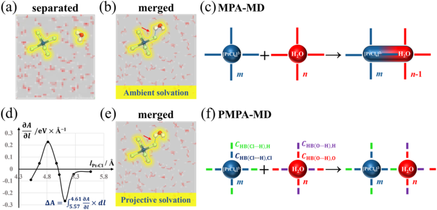
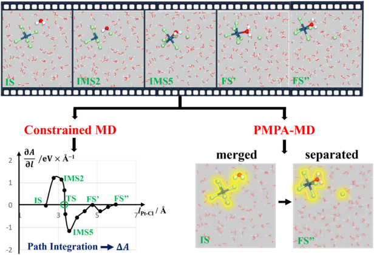
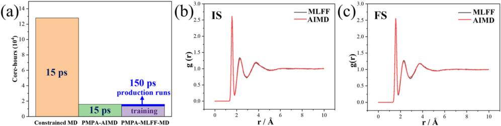
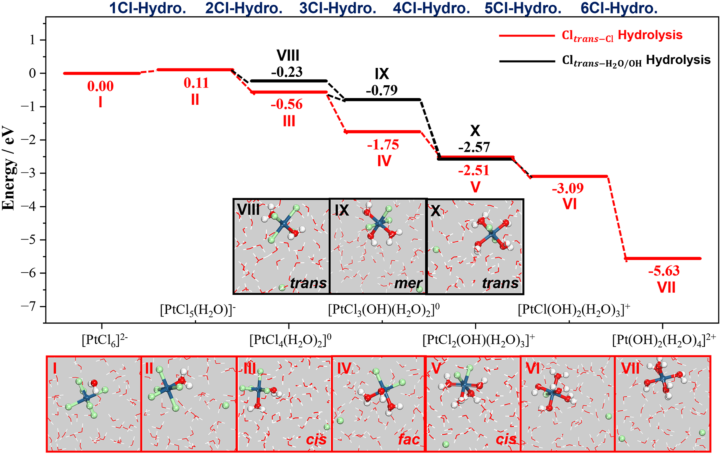
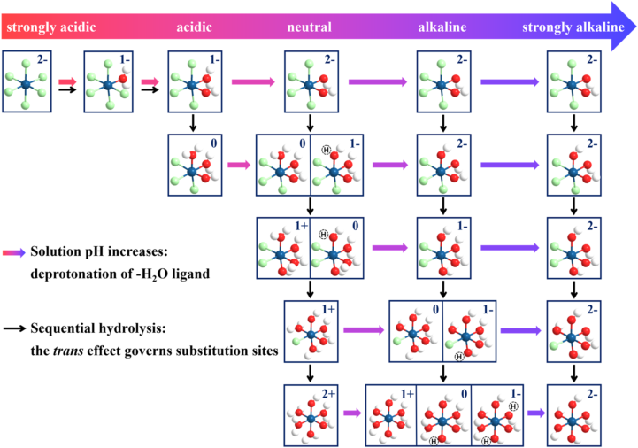
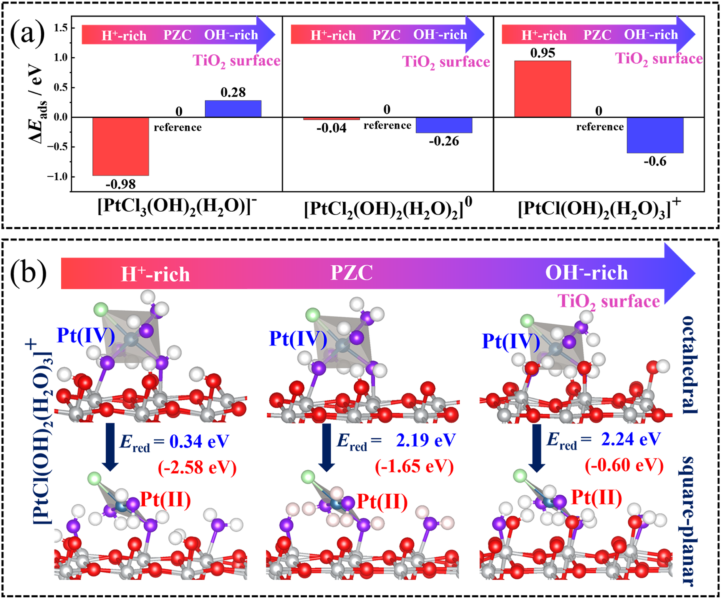

# Unveiling the projection nature of solvation interactions yields a robust PMPA-MD method for efficient modeling of liquid-phase reactions: A case study on H2PtCl6 hydrolysis

## Metadata / 元数据

- **Journal / 期刊：** *The Journal of Chemical Physics*
- **Date / 日期：** 2026-04-01
- **DOI：** 10.1063/5.0324948
- **Zotero key：** HX5FVZ88
- **Collection / 集合：** 01课题组
- **Source / 来源：** Zotero 中的出版商 PDF 附件（可选取文本层）。

## Why this paper / 为什么选这篇

**English:** This six-marker legacy-priority paper addresses a hard and recurring liquid-phase MD problem: how to assign solvation interactions when solvation shells merge. It connects constrained-MD free-energy sampling, a physically motivated partitioning scheme, MLFF acceleration, and a TiO2-relevant Pt precursor hydrolysis/deposition case. After the recent Ag-nanocluster MLFF mechanism reader, it rotates to a transferable solution-phase methodology paper.

**中文：** 这篇具有六个旧蓝色菱形优先标记的论文处理了液相分子动力学中一个反复出现的难题：当溶剂化壳层合并时，如何合理归属溶剂化相互作用。它把约束 MD 自由能采样、具物理依据的相互作用划分、MLFF 加速，以及与 TiO2 相关的 Pt 前驱体水解/沉积案例连接起来。在近期 Ag 纳米团簇 MLFF 机理阅读之后，它将主题轮换到可迁移的溶液相方法学。

## Terminology / 术语表

| English | 中文 | Note / 说明 |
|---|---|---|
| projective molecular partitioning analysis molecular dynamics (PMPA-MD) | 投影式分子划分分析分子动力学（PMPA-MD） | 将共享溶剂化壳层中的相互作用以投影系数分配给各物种。 |
| ambient molecular partitioning analysis molecular dynamics (MPA-MD) | 环境式分子划分分析分子动力学（MPA-MD） | 以环境溶剂化壳层处理溶质-溶剂相互作用的分子划分方法。 |
| solvation shell | 溶剂化壳层 | 围绕溶质、在结构或能量上可识别的一组溶剂分子。 |
| constrained molecular dynamics (constrained MD) | 约束分子动力学（约束 MD） | 在反应坐标上施加约束以采样自由能梯度的分子动力学方法。 |
| machine learning force field (MLFF) | 机器学习力场（MLFF） | 从电子结构数据学习能量和力、用于延长分子动力学时间尺度的势能模型。 |
| free-energy gradient | 自由能梯度 | 自由能沿选定反应坐标的导数，用于重建自由能剖面。 |
| hydrolysis | 水解 | 本文中特指氯铂酸物种中 Cl 配体逐步被水或羟基取代的过程。 |
| point of zero charge (PZC) | 零电荷点（PZC） | 表面净电荷为零时对应的酸碱条件。 |
| adsorption energy | 吸附能 | 吸附体系相对于分离表面和吸附物的能量变化。 |

## Reading guide / 阅读提示

**English:** Read the paper as an evidence chain. First identify the bookkeeping problem created by merged solvation shells (Fig. 1 and Eqs. 3-10); next examine whether PMPA changes the constrained-MD free-energy gradient rather than only relabeling terms (Fig. 2); then separate the MLFF cost/structural validation in Fig. 3 from the chemical conclusions in Figs. 4-6. For the TiO2 link, distinguish hydrolysis speciation from the later adsorption/reduction calculation.

**中文：** 建议把本文读成一条证据链：先辨认合并溶剂化壳层带来的能量归属问题（图 1 与式 3–10）；再检验 PMPA 是否改变了约束 MD 的自由能梯度，而非仅重新命名能量项（图 2）；随后将图 3 的 MLFF 成本/结构验证与图 4–6 的化学结论分开评估。对于 TiO2 关联，请区分前半部分的水解物种分布与后半部分的吸附/还原计算。

## Page / Section Index

- [p.1](#page-1)
- [p.2](#page-2)
- [p.3](#page-3)
- [p.4](#page-4)
- [p.5](#page-5)
- [p.6](#page-6)
- [p.7](#page-7)
- [p.8](#page-8)
- [p.9](#page-9)
- [p.10](#page-10)
- [p.11](#page-11)

## Related Reading / 延伸阅读

**English:** No strongly recommended related paper today. The prerequisite MPA-MD papers are referenced inside this article, but recommending one without reconstructing its exact methodological role would be less useful than following this paper’s self-contained derivation.

**中文：** 今天没有必须额外推荐的相关论文。本文已引用其前置 MPA-MD 工作；在未逐一重建这些论文的确切方法学位置前，强行推荐不如沿着本文自洽的推导阅读。

# Bilingual Reader / 逐段中英文对照

## Page 1

**Source:** p.1 S001

**Original:** Special Collection: Annabella Selloni Festschrift

**中文:** 特别收藏：安娜贝拉·塞洛尼节日文集

**Source:** p.1 S002

**Original:** https://doi.org/10.1063/5.0324948

**中文:** https://doi.org/10.1063/5.0324948

**Source:** p.1 S003

**Original:** View Online 

**中文:** 在线查看

**Source:** p.1 S004

**Original:** Export Citation

**中文:** 出口引证

**Source:** p.1 S005

**Original:** 28 April 2026 08:15:01

**中文:** 2026 年 4 月 28 日 08:15:01

## Page 2

**Source:** p.2 S006

**Original:** Unveiling the projection nature of solvation interactions yields a robust PMPA-MD method for efficient modeling of liquid-phase reactions: A case study on H2PtCl6 hydrolysis

**中文:** 揭示溶剂化相互作用的投影性质产生了一种稳健的 PMPA-MD 方法，可用于高效建模液相反应：H2PtCl6 水解的案例研究

**Source:** p.2 S007

**Original:** Cite as: J. Chem. Phys. 164, 134104 (2026); doi: 10.1063/5.0324948 Submitted: 28 January 2026 • Accepted: 17 March 2026 • Published Online: 1 April 2026

**中文:** 引用为：J. Chem。物理。 164, 134104 (2026); doi：10.1063/5.0324948 提交：2026 年 1 月 28 日 • 接受：2026 年 3 月 17 日 • 在线发布：2026 年 4 月 1 日

**Source:** p.2 S008

**Original:** AFFILIATIONS

**中文:** 隶属关系

**Source:** p.2 S009

**Original:** ABSTRACT

**中文:** 抽象的

**Source:** p.2 S010

**Original:** I. INTRODUCTION

**中文:** 一、简介

**Source:** p.2 S011

**Original:** Liquid-phase reactions are fundamentally important across diverse domains, including photo-/electro-catalysis, catalyst synthesis, and biochemical processes. One prominent example is the synthesis of supported Pt catalysts, such as Pt/CeO2

**中文:** 液相反应在光/电催化、催化剂合成和生化过程等不同领域中具有重要意义。一个突出的例子是负载型 Pt 催化剂的合成，例如 Pt/CeO2

**Source:** p.2 S012

**Original:** 1,2 and Pt/TiO2,3,4 by diluting chloroplatinic acid (H2PtCl6) into aqueous solution. Obviously, the hydrolysis of H2PtCl6 into [PtCl6-x(OH)y(H2O)x-y]−2+x−y

**中文:** 1,2 和 Pt/TiO2,3,4 将氯铂酸 (H2PtCl6) 稀释成水溶液。显然，H2PtCl6 水解成 [PtCl6-x(OH)y(H2O)x-y]−2+x−y

**Source:** p.2 S013

**Original:** species5,6 largely determines the morphology and properties of the deposited Pt catalysts.7 The process was typically controlled by altering experimental conditions, such as pH, reactant concentrations,

**中文:** 物种 5,6 在很大程度上决定了沉积 Pt 催化剂的形态和性质。 7 该过程通常通过改变实验条件来控制，例如 pH 值、反应物浓度、

**Source:** p.2 S014

**Original:** 28 April 2026 08:15:01

**中文:** 2026 年 4 月 28 日 08:15:01

**Source:** p.2 S015

**Original:** and temperature, leading to noticeable impacts on the catalytic efficiency and stability of as-synthesized Pt/support catalysts. For example, Toukabri et al.8 realized the controllable deposition of Pt single atoms or nanoparticles on TiO2 by adjusting the solution pH. Lv et al.9 determined a strong correlation between the photodegradation activity of Pt/TiO2 and the concentration of H2PtCl6 precursor for synthesizing the catalyst. Therefore, achieving mechanistic understandings of H2PtCl6 hydrolysis is highly desired, as these insights facilitate precise engineering of supported Pt catalysts with optimized structural and catalytic characteristics.

**中文:** 和温度，对合成的 Pt/载体催化剂的催化效率和稳定性产生显着影响。例如，Toukabri等人8通过调节溶液pH值，实现了Pt单原子或纳米粒子在TiO2上的可控沉积。 Lv 等人9 确定了Pt/TiO2 的光降解活性与合成催化剂的H2PtCl6 前驱体的浓度之间存在很强的相关性。因此，非常需要对 H2PtCl6 水解的机理有所了解，因为这些见解有助于对具有优化结构和催化特性的负载型 Pt 催化剂进行精确工程设计。

**Source:** p.2 S016

**Original:** Fei Li,1 Haosheng Niu,1 Meiying Wang,1 Xuezhi Duan,2 and Dong Wang1,a)

**中文:** 李飞,1 牛浩生,1 王美英,1 段学智,2 和王栋1,a)

**Source:** p.2 S017

**Original:** 1 State Key Laboratory of Green Chemical Engineering and Industrial Catalysis, Centre for Computational Chemistry and Research Institute of Industrial Catalysis, School of Chemistry and Molecular Engineering, East China University of Science and Technology, 130 Meilong Road, Shanghai 200237, People’s Republic of China

**中文:** 1 华东理工大学化学与分子工程学院，绿色化工与工业催化国家重点实验室，计算化学中心、工业催化研究所，上海市梅陇路130号 200237

**Source:** p.2 S018

**Original:** 2State Key Laboratory of Chemical Engineering, East China University of Science and Technology, Shanghai 200237, China

**中文:** 2华东理工大学化学工程国家重点实验室 上海 200237

**Source:** p.2 S019

**Original:** Note: This paper is part of the JCP Special Topic, Annabella Selloni Festschrift. a)Author to whom correspondence should be addressed: wangd@ecust.edu.cn

**中文:** 注：本文是 JCP 专题 Annabella Selloni Festschrift 的一部分。 a) 通讯作者：wangd@ecust.edu.cn

**Source:** p.2 S020

**Original:** While practically essential yet technically challenging, the lack of understanding of the nature of solvation interactions hinders the development of accurate and universal simulation methods for liquid-phase reactions. Here, we introduce an innovative concept of projecting intermolecular solvation interactions onto each atom/species, analogous to the way of quantifying covalent bonding interactions, and thereby developing a powerful tool of the Projective Multi-Point Averaging Molecular Dynamics (PMPA-MD), realizing consistent treatment of diverse solvation scenarios covering both liquid/solid interfaces and homogeneous solution reactions. Taking the multistep H2PtCl6 hydrolysis as an example, PMPA-MD demonstrates good accuracy with slight energy deviations <0.1 eV and reduces computational costs by approximately one order of magnitude, as compared with the benchmark constrained MD simulations. We show that the process is typically exothermic (except for the first hydrolysis step) and proceeds with surmountable reaction barriers following a Brønsted–Evans–Polanyi relationship. The substitution site is governed by the trans effect, while the substituent group (–OH or –H2O) exhibits piecewise pH dependence. Furthermore, elucidating the dynamic hydrolysis mechanism enables exploring the subsequent process of hydrolysate adsorption and reductive nucleation on the support surface, thereby shedding light on the morphology control of deposited Pt catalysts during experimental synthesis. This work advances both the concept and methodology for liquid-phase studies.

**中文:** 虽然实际上很重要，但在技术上具有挑战性，但缺乏对溶剂化相互作用本质的理解阻碍了液相反应准确和通用模拟方法的发展。在这里，我们引入了将分子间溶剂化相互作用投影到每个原子/物种上的创新概念，类似于量化共价键相互作用的方式，从而开发了投影多点平均分子动力学（PMPA-MD）的强大工具，实现了涵盖液/固界面和均相溶液反应的多种溶剂化场景的一致处理。以多步 H2PtCl6 水解为例，与基准约束 MD 模拟相比，PMPA-MD 表现出良好的精度，能量偏差<0.1 eV，并且计算成本降低了大约一个数量级。我们表明，该过程通常是放热的（除了第一个水解步骤），并且按照 Brønsted-Evans-Polanyi 关系进行可克服的反应障碍。取代位点受反式效应控制，而取代基（–OH 或 –H2O）表现出分段 pH 依赖性。此外，阐明动态水解机制可以探索水解产物吸附和载体表面还原成核的后续过程，从而为实验合成过程中沉积 Pt 催化剂的形貌控制提供线索。这项工作推进了液相研究的概念和方法。

## Page 3

**Source:** p.3 S021

**Original:** It is known that a fundamental distinction between liquidand gas-phase reactions arises from the solvation effect,10 a category of non-covalent interactions that significantly affects both mechanistic pathways and reaction kinetics. For instance, Proutiere and Schoenebeck11 discovered the crucial impacts of solvent polarity on the regioselectivity (i.e., C–Cl activation or C-OTf cleavage) in the Suzuki coupling reaction, while Cram et al.12 observed dramatic solvent-dependent reaction rate variations spanning nine orders of magnitude for the racemization of dimethyl sulfoxide. Technically, the early stage of computational chemistry addressed the solvation effect via implicit models that approximate solvents as continuous dielectric media.13,14 However, two fundamental limitations have restricted its broader applications: (i) inability to accurately model solvent-mediated processes (e.g., proton transfer), and (ii) inadequate description of site-specific solvation effects. In contrast, the development of explicit solvation methods, such as constrained MD15–17 and umbrella sampling,18 tackled these limitations by explicitly accounting for solvent molecules. For example, Zhao et al.19 investigated the first step of proton-coupled electron transfer in CO2 reduction on single-nickel atom catalysts and revealed how electric potential directly controls CO2 conversion steps. Similarly, Qian et al.20 conducted constrained MD simulations and pinpointed the formation of high-valent ∗NO3 2−intermediate as the primary cause of the high overpotential in nitrate electroreduction. Nevertheless, the requirement for whole-process thermodynamic integration (via dense sampling) along the reaction coordinate using explicit solvation ab initio MD (AIMD) simulations, while theoretically rigorous, imposes prohibitive computational costs that restrict its practical use.21,22

**中文:** 众所周知，液相和气相反应之间的根本区别源于溶剂化效应，10这是一类非共价相互作用，可显着影响机械途径和反应动力学。例如，Proutiere 和 Schoenebeck11 发现了 Suzuki 偶联反应中溶剂极性对区域选择性（即 C-Cl 活化或 C-OTf 裂解）的关键影响，而 Cram 等人 12 观察到二甲亚砜外消旋反应中溶剂依赖性反应速率的剧烈变化，跨越九个数量级。从技术上讲，计算化学的早期阶段通过将溶剂近似为连续介电介质的隐式模型来解决溶剂化效应。 13,14 然而，两个基本限制限制了其更广泛的应用：(i) 无法准确模拟溶剂介导的过程（例如质子转移），以及 (ii) 对特定位点溶剂化效应的描述不充分。相比之下，显式溶剂化方法的发展，例如约束 MD15-17 和伞式采样，18 通过显式考虑溶剂分子来解决这些局限性。例如，Zhao等人19研究了单镍原子催化剂上CO2还原中质子耦合电子转移的第一步，并揭示了电势如何直接控制CO2转化步骤。类似地，Qian 等人20 进行了约束MD 模拟，并指出高价*NO3 2− 中间体的形成是硝酸盐电还原中高过电势的主要原因。然而，使用显式溶剂化从头开始 MD (AIMD) 模拟沿反应坐标进行全过程热力学积分（通过密集采样）的要求虽然理论上严格，但计算成本过高，限制了其实际使用。 21,22

**Source:** p.3 S022

**Original:** Alternatively, we previously proposed a Multi-Point Averaging Molecular Dynamics (MPA-MD) method that incorporates solvation interactions while avoiding biased energy contributions from fluctuant solvent configurations for each intermediate state, realizing the state-to-state energetics calculations (instead of wholeprocess thermodynamic integration) on liquid/solid interface reactions. The method enables precise determination of the point of zero charge (PZC) of TiO2 and radical-driven photocatalytic oxygen evolution mechanism at water/TiO2 interfaces.23,24 Furthermore, it was successfully extended to the bubble/water/TiO2 triple-phase interface, revealing how the local hydrogen bond network controls the photocatalytic kinetics of H2O2 formation.25,26 Note that, while surface-bound species at the liquid/solid interface typically share merged solvation shells with the solid catalyst, homogeneous catalysis involves frequent ligand exchange and, thus, features characteristic transitions between merged and separated solvation states. Obviously, the accurate treatment of solvation interactions in these distinct scenarios is critical for liquid-phase computational methods, although developing a robust and consistently applicable framework for diverse liquid-phase reactions remains a central challenge in computational chemistry. In this work, we unveiled the projection nature of solvation interactions and thereby developed an accurate and efficient PMPAMD method for simulating liquid-phase reactions. The reliability of the method was validated through systematic investigations of H2PtCl6 hydrolysis as a model system. The manuscript is structured as follows: First, the concepts of the ambient solvation approach via MPA-MD method and the projective solvation approach via PMPA-MD method are presented, where the two approaches show

**中文:** 另外，我们之前提出了一种多点平均分子动力学（MPA-MD）方法，该方法结合了溶剂化相互作用，同时避免了每个中间态的波动溶剂构型的能量贡献偏差，实现了液/固界面反应的状态到状态能量学计算（而不是整个过程的热力学积分）。该方法能够精确测定 TiO2 的零电荷点 (PZC) 以及水/TiO2 界面上自由基驱动的光催化析氧机制。23,24 此外，它还成功扩展到气泡/水/TiO2 三相界面，揭示了局部氢键网络如何控制 H2O2 形成的光催化动力学。25,26 请注意，虽然液/固界面处的表面结合物质通常与固体催化剂共享合并的溶剂化壳，但均相催化涉及频繁的配体交换，因此具有合并和分离溶剂化状态之间的特征转变。显然，在这些不同场景中准确处理溶剂化相互作用对于液相计算方法至关重要，尽管为不同的液相反应开发一个强大且一致适用的框架仍然是计算化学的核心挑战。在这项工作中，我们揭示了溶剂化相互作用的投影性质，从而开发了一种准确有效的 PMPAMD 方法来模拟液相反应。通过以 H2PtCl6 水解为模型系统的系统研究，验证了该方法的可靠性。该手稿的结构如下：首先，提出了通过 MPA-MD 方法的环境溶剂化方法和通过 PMPA-MD 方法的投影溶剂化方法的概念，其中这两种方法显示

**Source:** p.3 S023

**Original:** distinct differences in handling processes involving transitions between merged and separated solvation shells. Second, the efficiency and reliability of PMPA-MD were validated by comparing the determined reaction energies and barriers of three representative steps of H2PtCl6 hydrolysis with those from the benchmark constrained MD simulations. Third, the full reaction mechanism of H2PtCl6 hydrolysis, involving competitive events of substitution stereoselectivity (trans or cis) and substituent groups (–H2O or –OH), was clarified at the atomic level. Finally, the pH-dependent speciation of Pt complexes and its impacts on the morphology control of Pt deposition (particles vs single atoms) on TiO2 surfaces were discussed.

**中文:** 涉及合并和分离溶剂化壳之间转变的处理过程存在明显差异。其次，通过将 H2PtCl6 水解的三个代表性步骤的确定的反应能和势垒与基准约束 MD 模拟的反应能和势垒进行比较，验证了 PMPA-MD 的效率和可靠性。第三，H2PtCl6水解的完整反应机制，包括取代立体选择性（反式或顺式）和取代基（–H2O或–OH）的竞争事件，在原子水平上得到了阐明。最后，讨论了 Pt 配合物的 pH 依赖性形态及其对 TiO2 表面 Pt 沉积形态控制（颗粒与单原子）的影响。

**Source:** p.3 S024

**Original:** II. COMPUTATIONAL DETAILS

**中文:** 二.计算细节

**Source:** p.3 S025

**Original:** A. DFT calculations

**中文:** A.DFT计算

**Source:** p.3 S026

**Original:** All the calculations were carried out using the Vienna ab initio simulation package (VASP),27,28 and the electronic exchange and correlation were described within the generalized gradient approximation (GGA) using the Perdew–Burke–Ernzerhof (PBE) functional.29 The core-valence electron interactions were presented by the projector-augmented wave (PAW) method,30,31 in which the H 1s, O 2s2p, Cl 3s3p, Ti 3d4s, and Pt 5d6s electrons were explicitly treated as the valence electrons. The valence electronic states were expanded in plane wave basis sets with an energy cutoff of 400 eV for liquid systems and 450 eV for TiO2 models. The occupancy of the one-electron states was calculated using the Gaussian smearing with SIGMA = 0.05 eV. Structure optimizations were conducted using the quasi-Newton Broyden minimization scheme until the atomic forces on each ion were less than 0.05 eV/Å. The transition states (TSs) were searched using a constrained optimization scheme32 and verified by satisfying two criteria: (i) all forces on atoms vanish, and (ii) the total energy is a maximum along the reaction coordination but a minimum with respect to the remaining degrees of freedom. Pt complexes adsorbed on the anatase TiO2(101) surface were simulated using gas/solid models with a large vacuum thickness of ∼22 Å between periodic slabs. The anatase TiO2(101) surface was constructed as a four-TiO2-layer p(2 × 3) slab cell (11.0 × 11.4 × 35 Å3), and a corresponding 1 × 1 × 1 K-point mesh was used throughout the calculations. TiO2 surface structures, under acidic/alkaline conditions, were represented by introducing H/OH groups on the surface and OH/H counterparts on the opposite slabs, which accordingly present H+/OH−ions (H →H+ + e−; OH + e−→OH−) on the reacting surface in a charge-neutral system. In addition, to model the photoreduction process of Pt(IV) to Pt(II) species, extra electrons were introduced by altering the quantity of H over OH (e.g., adding H or removing OH groups on the opposite slabs). Valence states of Pt complexes were verified by Bader charge analysis. The adsorption energy (Eads) of Pt complexes was calculated according to the following equation:

**中文:** 所有计算均使用维也纳从头算模拟软件包 (VASP) 进行，27,28 并使用 Perdew-Burke-Ernzerhof (PBE) 泛函在广义梯度近似 (GGA) 内描述电子交换和相关性。 29 核价电子相互作用由投影增强波 (PAW) 方法呈现，30,31 其中 H 1s、O 2s2p、Cl 3s3p、Ti 3d4s 和 Pt 5d6s 电子被明确视为价电子。价电子态在平面波基组中扩展，液体系统的能量截止为 400 eV，TiO2 模型的能量截止为 450 eV。使用 SIGMA = 0.05 eV 的高斯涂抹计算单电子态的占据率。使用准牛顿布罗伊登最小化方案进行结构优化，直到每个离子上的原子力小于 0.05 eV/Å。使用约束优化方案32搜索过渡态（TS），并通过满足两个标准进行验证：（i）原子上的所有力消失，（ii）总能量沿反应配位为最大值，但相对于剩余自由度为最小值。使用气/固模型模拟吸附在锐钛矿 TiO2(101) 表面上的 Pt 配合物，周期板之间的真空厚度约为 22 Å。锐钛矿型 TiO2(101) 表面被构建为四层 TiO2 p(2 × 3) 平板电池 (11.0 × 11.4 × 35 Å3)，并在整个计算过程中使用相应的 1 × 1 × 1 K 点网格。在酸性/碱性条件下，TiO2 表面结构通过在表面引入 H/OH 基团和在相对的平板上引入 OH/H 对应物来表示，从而在电荷中性系统的反应表面上相应地呈现 H+/OH− 离子（H →H+ + e−; OH + e−→OH−）。此外，为了模拟 Pt(IV) 到 Pt(II) 物质的光还原过程，通过改变 H 相对 OH 的数量（例如，添加 H 或去除相对板上的 OH 基团）引入额外的电子。 Pt 配合物的价态通过 Bader 电荷分析进行验证。 Pt配合物的吸附能（Eads）按下式计算：

**Source:** p.3 S027

**Original:** 28 April 2026 08:15:01

**中文:** 2026 年 4 月 28 日 08:15:01

**Source:** p.3 S028

**Original:** Eads = EPt/TiO2 −EPt −ETiO2, (1)

**中文:** Eads = EPt/TiO2 −EPt −ETiO2, (1)

**Source:** p.3 S029

**Original:** where EPt/TiO2 and ETiO2 represent the total energy of the TiO2 slab with and without Pt complexes, respectively, and EPt represents the Pt complex energy in the gas phase.

**中文:** 其中EPt/TiO2和ETiO2分别表示含和不含Pt络合物的TiO2板的总能量，EPt表示气相中Pt络合物的能量。

## Page 4

**Source:** p.4 S030

**Original:** The reduction energy (Ered) of a Pt(IV) complex to the Pt(II) was calculated as follows:

**中文:** Pt(IV) 配合物与 Pt(II) 的还原能 (Ered) 计算如下：

**Source:** p.4 S031

**Original:** Ered = EPt(II)/TiO2 −EPt(IV)/TiO2, (2)

**中文:** Ered = EPt(II)/TiO2 −EPt(IV)/TiO2, (2)

**Source:** p.4 S032

**Original:** where EPt(IV)/TiO2 and EPt(II)TiO2 represent the total energy of a six-fold coordination Pt(IV) and a four-fold coordination Pt(II) complex plus two detached ligands adsorbed on the TiO2 surface, respectively.

**中文:** 其中EPt(IV)/TiO2和EPt(II)TiO2分别代表六重配位Pt(IV)和四重配位Pt(II)络合物加上吸附在TiO2表面上的两个分离配体的总能量。

**Source:** p.4 S033

**Original:** B. AIMD simulations

**中文:** B. AIMD 模拟

**Source:** p.4 S034

**Original:** AIMD simulations were performed in a periodic cell (13.5 × 15.6 × 14.7 Å3) containing 100 H2O and 1 H2PtCl6 molecules with water density of 1.00 g/cm3, and a corresponding 1 × 1 × 1 K-point mesh was used during calculations. The simulation temperature was set at 300 K with a stepwise movement of 0.5 fs in a canonical constant-volume, constant-temperature (NVT) ensemble employing Nosé–Hoover thermostats.33 Each simulation was continued for an additional 5 ps after the energy fluctuations converged, resulting in a total duration of 10–20 ps. The instant dissociation of H2PtCl6 into an [PtCl6]2−ion and two H+ ions (in the form of H5O2 + cations;34 Fig. S1) was observed after 0.5 ps simulations. Note that subsequent hydrolysis steps involve –Cl ligand substitution by –H2O or –OH groups with concurrent Cl−

**中文:** AIMD 模拟在包含 100 个 H2O 和 1 个 H2PtCl6 分子、水密度为 1.00 g/cm3 的周期单元 (13.5 × 15.6 × 14.7 Å3) 中进行，计算时使用相应的 1 × 1 × 1 K 点网格。模拟温度设置为 300 K，在采用 Nosé–Hoover 恒温器的规范定容、恒温 (NVT) 系综中以 0.5 fs 的步进速度移动。 33 在能量波动收敛后，每个模拟继续额外持续 5 ps，导致总持续时间为 10-20 ps。 0.5 ps 模拟后观察到 H2PtCl6 瞬间解离为一个 [PtCl6]2− 离子和两个 H+ 离子（以 H5O2 + 阳离子的形式；34 图 S1）。请注意，随后的水解步骤涉及 –Cl 配体被 –H2O 或 –OH 基团取代，并同时存在 Cl−

**Source:** p.4 S035

**Original:** release, and thus, we effectively removed one HCl molecule (a pair of H+ and Cl−ions) while introducing one H2O molecule to the solution for every later hydrolysis step. This approach avoids the complicated interactions arising from excessive Cl−ions in solution, while remaining physically realistic since released ions become readily dispersed in the bulk solvent. While determining the total energies of the hydrolysis states, the distinct –OH/H2O coordination forms were fully considered according to their occurrence ratios during MD simulations.

**中文:** 因此，我们有效地去除了一个 HCl 分子（一对 H+ 和 Cl− 离子），同时在后续的每个水解步骤中向溶液中引入一个 H2O 分子。这种方法避免了溶液中过量 Cl- 离子引起的复杂相互作用，同时保持物理真实性，因为释放的离子很容易分散在本体溶剂中。在确定水解态的总能量时，根据MD模拟中不同的-OH/H2O配位形式的出现比例，充分考虑了它们的出现比例。

**Source:** p.4 S036

**Original:** C. Constrained MD

**中文:** C. 约束 MD

**Source:** p.4 S037

**Original:** For the hydrolysis of the Pt–Cl bond, the initial bond length was about 2.30–2.35 Å. The Pt–Cl bond distance was increased incrementally by 0.4 Å for configurations away from the TS, and by 0.05–0.2 Å for configurations near the TS region. We sampled >12 configurations along the reaction coordinate for each hydrolysis step and conducted constrained AIMD simulations for all configurations at a constant temperature (T = 300 K) until the interatomic force (the Helmholtz free-energy gradients ∂A

**中文:** 对于 Pt-Cl 键的水解，初始键长约为 2.30-2.35 Å。对于远离 TS 的构型，Pt-Cl 键距逐渐增加 0.4 Å，对于靠近 TS 区域的构型，增加 0.05-0.2 Å。我们沿着每个水解步骤的反应坐标采样了 >12 个构型，并在恒温 (T = 300 K) 下对所有构型进行了约束 AIMD 模拟，直到原子间作用力（亥姆霍兹自由能梯度 ∂A

**Source:** p.4 S038

**Original:** ∂l ) between the two constrained atoms converged. Note that two distinct types of TS structures (see Fig. S2 for an example) were identified: (i) a finalstate-like (FS-like) TS, characterized by quasi-cleavage of the Pt⋅⋅⋅Cl bond accompanied by pre-formation of a Pt⋅⋅⋅OH2 bond, and (ii) an initial-state-like (IS-like) TS, involving concerted quasi-cleavage of the Pt⋅⋅⋅Cl bond and quasi-formation of a Pt⋅⋅⋅OH2 bond. The potential of mean force was computed by averaging the free-energy gradients of the two scenarios, and the total free-energy change ΔA was then determined by integrating the ∂A

**中文:** ∂l ) 两个受约束原子之间收敛。请注意，确定了两种不同类型的 TS 结构（参见图 S2 的示例）：（i）类终态（类 FS）TS，其特征是 Pt⋅⋅⋅Cl 键的准断裂，并伴随着 Pt⋅⋅⋅OH2 键的预形成，以及（ii）类初始态（IS 样）TS，涉及 Pt⋅⋅⋅Cl 键的协调准断裂和准形成Pt⋅⋅⋅OH2 键。通过平均两种情况的自由能梯度来计算平均力的势，然后通过积分 ∂A 确定总自由能变化 ΔA

**Source:** p.4 S039

**Original:** ∂l along the reaction coordinate l,

**中文:** ∂l 沿反应坐标 l，

**Source:** p.4 S040

**Original:** ΔA =

**中文:** ΔA =

**Source:** p.4 S041

**Original:** ∂l ∗dl. (3)

**中文:** ∂l*dl。 (3)

**Source:** p.4 S042

**Original:** D. Machine learning force field (MLFF)

**中文:** D. 机器学习力场（MLFF）

**Source:** p.4 S043

**Original:** The MLFF accelerated MD (MLFF-MD) simulations were conducted using the on-the-fly machine learning method implanted in the VASP software version 6 or later,35 employing the NVT ensemble and Nosé–Hoover thermostat at 300 K. The train and refit modes were used for obtaining an effective MLFF, while the run mode was used for performing MLFF-MD. The MLFF accuracy36 was confirmed via the root mean square error (RMSE) on both the training set and an independent validation set, as well as the deviations of the H–H pair correlation function among ∼3 ps period simulations using AIMD and MLFF-MD. To construct the validation set, 500 configurations were uniformly extracted from an additional AIMD trajectory to ensure those configurations were not used in the training process. After validation, the MLFF-MD approach enables dramatic extension of simulation timescales at very low computational cost, facilitating exhaustive sampling of liquid-phase reaction pathways over long durations.

**中文:** MLFF 加速 MD (MLFF-MD) 模拟是使用植入 VASP 软件版本 6 或更高版本中的即时机器学习方法进行的，35 采用 NVT 系综和 300 K 的 Nosé–Hoover 恒温器。训练和改装模式用于获得有效的 MLFF，而运行模式用于执行 MLFF-MD。 MLFF 精度36 通过训练集和独立验证集上的均方根误差 (RMSE) 以及使用 AIMD 和 MLFF-MD 的 ∼3 ps 周期模拟中 H-H 对相关函数的偏差来确认。为了构建验证集，从额外的 AIMD 轨迹中统一提取了 500 个配置，以确保这些配置不会在训练过程中使用。经过验证后，MLFF-MD 方法能够以非常低的计算成本显着延长模拟时间尺度，从而有助于在长时间内对液相反应路径进行详尽的采样。

**Source:** p.4 S044

**Original:** III. RESULTS AND DISCUSSION

**中文:** 三．结果与讨论

**Source:** p.4 S045

**Original:** A. Development of the PMPA-MD approach

**中文:** A. PMPA-MD 方法的发展

**Source:** p.4 S046

**Original:** Similar to our previous MPA-MD method,23–26 the total energy of liquid-phase systems (Etot) can be divided into three components: target solute species (Esolute), solvent shell (Esolvent), and the solvation interactions between the two (Eint). Owing to the biased energy contributions from fluctuating solvent configurations, the liquidphase reaction energy should be based on the solute’s energy within the solvation environment (Esol−included). This quantity comprises the intrinsic energy of the solute (Esolute) and the solvation energy (Esol) acting upon it, while explicitly excluding the energy of the solvent part. Two distinct approaches, conceptualizing solvation interactions as either ambient or projective in nature, were proposed to quantify the key term of Esol:

**中文:** 与我们之前的 MPA-MD 方法类似，23-26 液相系统的总能量 (Etot) 可分为三个组成部分：目标溶质种类 (Esolute)、溶剂壳 (Esolvent) 以及两者之间的溶剂化相互作用 (Eint)。由于溶剂构型波动产生的能量贡献存在偏差，液相反应能量应基于溶剂化环境中溶质的能量（包括 Esol）。该量包括溶质的固有能量 (Esolute) 和作用于其上的溶剂化能 (Esol)，同时明确排除溶剂部分的能量。提出了两种不同的方法，将溶剂化相互作用概念化为环境相互作用或投影性质，以量化 Esol 的关键术语：

**Source:** p.4 S047

**Original:** 28 April 2026 08:15:01

**中文:** 2026 年 4 月 28 日 08:15:01

**Source:** p.4 S048

**Original:** 1. Ambient solvation approach (MPA-MD method) that counts in the whole solvation interactions induced by the solvent shell to the solute (Eambient sol = Eint). 2. Projective solvation approach (PMPA-MD method) that projects intermolecular solvation interactions Eint onto each atom/species, analogous to the Lewis theory of bonding, in quantifying covalent bonding interactions.

**中文:** 1. 环境溶剂化方法（MPA-MD 方法），计算溶剂壳与溶质引起的整个溶剂化相互作用（环境 sol = Eint）。 2. 投影溶剂化方法（PMPA-MD 方法），将分子间溶剂化相互作用 Eint 投影到每个原子/物种上，类似于路易斯键合理论，量化共价键合相互作用。

**Source:** p.4 S049

**Original:** Taking the migration of a H2O molecule from distant solution to the first solvation shell of a PtCl6 2−ion as an example, the process involves the merging of two individual solvation shells (of the H2O and PtCl6 2−, respectively) into a unified one around the H2O⋅⋅⋅PtCl6 2−pair. As illustrated in Fig. 1, while MPA-MD and PMPA-MD divide similar solvation shell boundary for the separated state [Fig. 1(a)], MPA-MD treats the merged H2O⋅⋅⋅PtCl6 2−pair as a whole [Fig. 1(b)], whereas PMPA-MD projects Eint on each species [Fig. 1(e)] as follows:

**中文:** 以 H2O 分子从远处溶液迁移到 PtCl6 2− 离子的第一个溶剂化壳层为例，该过程涉及将两个单独的溶剂化壳层（分别为 H2O 和 PtCl6 2− ）合并为围绕 H2O⋅⋅⋅PtCl6 2− 对的统一溶剂化壳层。如图1所示，而MPA-MD和PMPA-MD为分离状态划分了相似的溶剂化壳边界[图1]。 1(a)]，MPA-MD 将合并的 H2O⋅⋅⋅PtCl6 2−pair 视为一个整体 [图 1(a)]。 1(b)]，而 PMPA-MD 在每个物种上投影 Eint [图 1(b)]。 1(e)]如下：

### Fig. 001. 如图

**Placed near:** p.4 S049

**Source:** p.5 C001

**Original caption:** FIG. 1. (a), (b), and (e) Structural snapshots, (c) and (f) schematic reaction diagram, and (d) free-energy gradient profile (via constrained MD simulations) of H2O migration from distant solution to a PtCl62−ion. While the separated solvation shells in (a) are clearly presented by bright yellow margins, the merged solvation states between PtCl62− and adjacent H2O can be described through the (b) ambient or (e) projective solvation approaches using the (c) MPA-MD or (f) PMPA-MD methods. The quantities of hydrogen bonds are indicated as m and n, and the solvation contributions to each species in (f) are presented with projection coefficients as CHB(Cl⋅⋅⋅H), Cl, CHB(Cl⋅⋅⋅H), H, CHB(O⋅⋅⋅H), O, and CHB(O⋅⋅⋅H), H, respectively. Green, red, white, and cyan balls represent Cl, O, H, and Pt atoms, respectively. This color scheme is used throughout the paper.

**中文图注:** 如图。 1. (a)、(b) 和 (e) 结构快照，(c) 和 (f) 示意性反应图，以及 (d) H2O 从远处溶液迁移到 PtCl62−离子的自由能梯度曲线（通过约束 MD 模拟）。虽然 (a) 中分离的溶剂化壳由亮黄色边缘清晰呈现，但 PtCl62− 和相邻 H2O 之间的合并溶剂化状态可以通过使用 (c) MPA-MD 或 (f) PMPA-MD 方法的 (b) 环境或 (e) 投影溶剂化方法来描述。氢键的数量表示为 m 和 n，(f) 中每个物质的溶剂化贡献用投影系数表示为 CHB(Cl⋅⋅⋅H)、Cl、CHB(Cl⋅⋅⋅H)、H、CHB(O⋅⋅⋅H)、O 和 CHB(O⋅⋅⋅H)、H。绿色、红色、白色和青色球分别代表 Cl、O、H 和 Pt 原子。整篇论文都使用这种配色方案。

**Reading note / 阅读提示：** Inspect this visual with the preceding source block; it is placed at its first substantive extracted mention. / 请结合前一原文段落阅读此图；它已放在首次实质讨论处。

**Source:** p.4 S050

**Original:** EAmbient sol−included(H2O ⋅⋅⋅PtCl6 2−)

**中文:** EAmbient sol−included(H2O ⋅⋅⋅PtCl6 2−)

**Source:** p.4 S051

**Original:** = EH2O⋅⋅⋅PtCl6 2−+ Eambient sol (H2O ⋅⋅⋅PtCl6 2−), (4)

**中文:** = EH2O⋅⋅⋅PtCl6 2−+ 环境溶胶 (H2O ⋅⋅⋅PtCl6 2−), (4)

## Page 5

**Source:** p.5 S052

**Original:** EProjective sol−included(H2O ⋅⋅⋅PtCl6 2−)

**中文:** E 投影 sol−included(H2O ⋅⋅⋅PtCl6 2−)

**Source:** p.5 S053

**Original:** = EProjective sol−included(H2O) + EProjective sol−included(PtCl6 2−)

**中文:** = EProjective sol−included(H2O) + EProjective sol−included(PtCl6 2−)

**Source:** p.5 S054

**Original:** = EH2O + Eprojective sol (H2O) + EPtCl6 2−+ Eprojective sol (PtCl6 2−). (5)

**中文:** = EH2O + 投影溶胶 (H2O) + EPtCl6 2−+ 投影溶胶 (PtCl6 2−)。 (5)

**Source:** p.5 S055

**Original:** These indicate that the ambient solvation model treats the hydrogen bond of the H2O⋅⋅⋅PtCl6 2−as an internal interaction and counts only external interactions imposed by the water shell as the ambient solvation energy. In contrast, the projective solvation does not differentiate region-dependent (internal vs external) hydrogen bonds and treats all such interactions as projection on relevant atoms according to the respective coefficient. Specifically, the two solute species H2O and PtCl6 2−provide mutual solvation effects on each other, and the solvent shell offers projected solvation energies to each solute. We assume that the solvation shell induces m and n hydrogen bonds to the PtCl6 2−and H2O, denoted as HB(Cl⋅⋅⋅H) and HB(O⋅⋅⋅H), respectively. According to the ambient solvation approach [Fig. 1(c)] using the MPA-MD method, the reaction energy ΔEAmbient of the process can be deduced as follows:

**中文:** 这些表明环境溶剂化模型将 H2O⋅⋅⋅PtCl6 2− 的氢键视为内部相互作用，并且仅将水壳施加的外部相互作用计为环境溶剂化能。相反，投影溶剂化不区分区域依赖性（内部与外部）氢键，并根据各自的系数将所有此类相互作用视为相关原子上的投影。具体来说，两种溶质物质 H2O 和 PtCl6 2− 相互提供相互溶剂化作用，并且溶剂壳为每种溶质提供预计的溶剂化能。我们假设溶剂化壳层诱导与 PtCl6 2− 和 H2O 形成 m 和 n 个氢键，分别表示为 HB(Cl⋅⋅⋅H) 和 HB(O⋅⋅⋅H)。根据环境溶剂化方法[图。 1(c)]利用MPA-MD方法，可推导出该过程的反应能ΔEAmbient如下：

**Source:** p.5 S056

**Original:** ΔEAmbient = EFS sol−included −EIS sol−included = [EPtCl6 + EH2O + m × EHB(Cl⋅⋅⋅H) + (n −1) × EHB(O⋅⋅⋅H)]

**中文:** ΔEAmbient = EFS sol−included −EIS sol−included = [EPtCl6 + EH2O + m × EHB(Cl⋅⋅⋅H) + (n −1) × EHB(O⋅⋅⋅H)]

**Source:** p.5 S057

**Original:** −[EPtCl6 + m × EHB(Cl⋅⋅⋅H) + EH2O + n × EHB(O⋅⋅⋅H)]

**中文:** −[EPtCl6 + m × EHB(Cl⋅⋅⋅H) + EH2O + n × EHB(O⋅⋅⋅H)]

**Source:** p.5 S058

**Original:** = −EHB(O⋅⋅⋅H). (6)

**中文:** = −EHB(O⋅⋅⋅H)。 (6)

**Source:** p.5 S059

**Original:** Otherwise, by determining approximately the projection coefficient (Ci) as the respective proportion in the sum of van der Waals radius37 between two interacting atoms, giving rise to the CHB(O⋅⋅⋅H) value of 0.54/0.46 for O/H in HB(O⋅⋅⋅H) and CHB(Cl⋅⋅⋅H) of 0.60/0.40 for Cl/H in HB(Cl⋅⋅⋅H), ΔEProjective can be deduced according to the projective solvation approach [Fig. 1(f)] using the PMPA-MD method as follows:

**中文:** 否则，通过将投影系数 (Ci) 近似确定为两个相互作用原子之间范德华半径 37 总和中的相应比例，得出 HB(O⋅⋅⋅H) 中 O/H 的 CHB(O⋅⋅⋅H) 值为 0.54/0.46，HB(Cl⋅⋅⋅H) 中 Cl/H 的 CHB(Cl⋅⋅⋅H) 值为 0.60/0.40，ΔEProjective 可以为根据投影溶剂化方法推导[图1] 1(f)]使用PMPA-MD方法如下：

**Source:** p.5 S060

**Original:** EIS sol−included = EPtCl6 sol−included + EH2O sol−included

**中文:** EIS 溶胶 = EPtCl6 溶胶 + EH2O 溶胶

**Source:** p.5 S061

**Original:** 28 April 2026 08:15:01

**中文:** 2026 年 4 月 28 日 08:15:01

**Source:** p.5 S062

**Original:** = (EPtCl6 + m ∑ 1 CHB(Cl⋅⋅⋅H), ClEHB(Cl⋅⋅⋅H))

**中文:** = (EPtCl6 + m Σ 1 CHB(Cl⋅⋅⋅H), ClEHB(Cl⋅⋅⋅H))

**Source:** p.5 S063

**Original:** + (EH2O + n ∑ 1 CHB(O⋅⋅⋅H)EHB(O⋅⋅⋅H))

**中文:** + (EH2O + n Σ 1 CHB(O⋅⋅⋅H)EHB(O⋅⋅⋅H))

**Source:** p.5 S064

**Original:** = (EPtCl6 + m × 0.6EHB(Cl⋅⋅⋅H))

**中文:** = (EPtCl6 + m × 0.6EHB(Cl⋅⋅⋅H))

**Source:** p.5 S065

**Original:** + (EH2O + n ∑ 1 CHB(O⋅⋅⋅H)EHB(O⋅⋅⋅H))

**中文:** + (EH2O + n Σ 1 CHB(O⋅⋅⋅H)EHB(O⋅⋅⋅H))

**Source:** p.5 S066

**Original:** = EPtCl6 + EH2O + m × 0.6EHB(Cl⋅⋅⋅H)

**中文:** = EPtCl6 + EH2O + m × 0.6EHB(Cl⋅⋅⋅H)

**Source:** p.5 S067

**Original:** + n ∑ 1 CHB(O⋅⋅⋅H)EHB(O⋅⋅⋅H), (7)

**中文:** + n Σ 1 CHB(O⋅⋅⋅H)EHB(O⋅⋅⋅H), (7)

**Source:** p.5 S068

**Original:** EFS sol−included = EPtCl6 sol−included + EH2O sol−included

**中文:** EFS 溶胶 = EPtCl6 溶胶 + EH2O 溶胶

**Source:** p.5 S069

**Original:** = (EPtCl6 + m × 0.6EHB(Cl⋅⋅⋅H)) + [EH2O + 0.4EHB(Cl⋅⋅⋅H)

**中文:** = (EPtCl6 + m × 0.6EHB(Cl⋅⋅⋅H)) + [EH2O + 0.4EHB(Cl⋅⋅⋅H)

**Source:** p.5 S070

**Original:** + ( n ∑ 1 CHB(O⋅⋅⋅H)EHB(O⋅⋅⋅H) −0.46EHB(O⋅⋅⋅H))]

**中文:** + ( n Σ 1 CHB(O⋅⋅⋅H)EHB(O⋅⋅⋅H) −0.46EHB(O⋅⋅⋅H))]

**Source:** p.5 S071

**Original:** = EPtCl6 + EH2O + (m × 0.6 + 0.4)EHB(Cl⋅⋅⋅H)

**中文:** = EPtCl6 + EH2O + (m × 0.6 + 0.4)EHB(Cl⋅⋅⋅H)

**Source:** p.5 S072

**Original:** + ( n ∑ 1 CHB(O⋅⋅⋅H)EHB(O⋅⋅⋅H) −0.46EHB(O⋅⋅⋅H)), (8)

**中文:** + ( n Σ 1 CHB(O⋅⋅⋅H)EHB(O⋅⋅⋅H) −0.46EHB(O⋅⋅⋅H)), (8)

**Source:** p.5 S073

**Original:** ΔEProjective = EFS sol−included −EIS sol−included = 0.4EHB(Cl⋅⋅⋅H) −0.46EHB(O⋅⋅⋅H), (9)

**中文:** ΔEProjective = EFS sol−included −EIS sol−included = 0.4EHB(Cl⋅⋅⋅H) −0.46EHB(O⋅⋅⋅H), (9)

**Source:** p.5 S074

**Original:** in which EHB(O⋅⋅⋅H) and EHB(Cl⋅⋅⋅H) represent the interaction energy of one H2O⋅⋅⋅H2O and one H2O⋅⋅⋅PtCl6 2−hydrogen bond, respectively.

**中文:** 其中EHB(O⋅⋅⋅H)和EHB(Cl⋅⋅⋅H)分别表示1个H2O⋅⋅⋅H2O和1个H2O⋅⋅⋅PtCl6 2−氢键的相互作用能。

## Page 6

**Source:** p.6 S075

**Original:** TABLE I. Calculated energy changes (ΔEAmbient, ΔEProjective, ΔA, and zero-point energy and entropy ΔZPE-TΔS) of H2O migration from distant solution to the first solvation shell of a PtCl62−via the MPA-MD, PMPA-MD (both standard and simplified procedures), and the benchmark constrained MD methods.

**中文:** 表 I. 通过 MPA-MD、PMPA-MD（标准程序和简化程序）以及基准约束 MD 方法计算的 H2O 从远处溶液迁移到 PtCl62 第一个溶剂化壳的能量变化（ΔEAmbient、ΔEProjective、ΔA 和零点能量和熵 ΔZPE-TΔS）。

**Source:** p.6 S076

**Original:** Furthermore, by computing the ambient solvation energies of H2O (Eambient sol = Etot −Esolute −Esolvent = Eint) and statistically analyzing hydrogen bond numbers m in AIMD trajectories, EHB(O⋅⋅⋅H) can be readily determined as Eambient sol (H2O)/m, being around −0.40 eV. Similarly, EHB(Cl⋅⋅⋅H) was determined to be slightly weaker than EHB(O⋅⋅⋅H), being around −0.31 eV. Table I presents the reaction energies determined via the MPA-MD, PMPA-MD, and the benchmark constrained MD method (ΔEAmbient, ΔEProjective, and ΔA). Noticeably, the determined MPA-MD and PMPA-MD results consist well with the derived equations [Eqs. (6) and (9)] by substituting EHB(O⋅⋅⋅H) and EHB(Cl⋅⋅⋅H) values (0.43 vs 0.40 eV; 0.07/0.08 vs 0.06 eV), manifesting the physical validation and reliability of the two methods. Moreover, one can see minor deviations of 0.06/0.07 eV in PMPA-MD, whereas a considerable discrepancy of 0.42 eV for MPA-MD, relative to the constrained MD results. Given the negligible contribution from entropy and zero-pointenergy corrections (ΔZPE-TΔS in Table I),23–26 such contrast credits the projection nature of solvation interactions and the reliability of PMPA-MD method for handling processes involving transitions between merged and separated solvation states, e.g., a typical ligand exchange scenario in homogeneous catalysis.38,39

**中文:** 此外，通过计算H2O的环境溶剂化能（Eambient sol = Etot −Esolute −Esolvent = Eint）并对AIMD轨迹中的氢键数m进行统计分析，EHB(O⋅⋅⋅H)可以很容易地确定为Eambient sol (H2O)/m，约为-0.40 eV。类似地，EHB(Cl⋅⋅⋅H) 被确定为略弱于 EHB(O⋅⋅⋅H)，约为 −0.31 eV。表 I 列出了通过 MPA-MD、PMPA-MD 和基准约束 MD 方法（ΔEAmbient、ΔEProjective 和 ΔA）确定的反应能。值得注意的是，确定的 MPA-MD 和 PMPA-MD 结果与推导方程 [Eqs.1] 非常吻合。 （6）和（9）]通过替换EHB（O⋅⋅⋅H）和EHB（Cl⋅⋅⋅H）值（0.43 vs 0.40 eV；0.07/0.08 vs 0.06 eV），体现了两种方法的物理验证和可靠性。此外，相对于受限 MD 结果，我们可以看到 PMPA-MD 中存在 0.06/0.07 eV 的微小偏差，而 MPA-MD 中存在 0.42 eV 的相当大差异。鉴于熵和零点能量校正的贡献可以忽略不计（表 I 中的 ΔZPE-TΔS），23-26 这种对比归功于溶剂化相互作用的投影性质以及 PMPA-MD 方法处理涉及合并和分离溶剂化状态之间转换的过程的可靠性，例如均相催化中的典型配体交换场景。 38,39

**Source:** p.6 S077

**Original:** However, as one may notice, the technical complexity of PMPA-MD would rise significantly for handling mix-ligand species, e.g., intermediate hydrolysates [PtCl6−x(OH)y(H2O)x−y]−2+x−y, since for each type i of related hydrogen bonds around j relevant solutes, the Ei HB, Ci, and quantity Ni need to be subtly determined as follows:

**中文:** 然而，正如人们可能注意到的，PMPA-MD 的技术复杂性在处理混合配体物种时会显着增加，例如，中间水解产物 [PtCl6−x(OH)y(H2O)x−y]−2+x−y，因为对于 j 个相关溶质周围的每种 i 类型的相关氢键，Ei HB、Ci 和 Ni 的数量需要巧妙地确定如下：

**Source:** p.6 S078

**Original:** j ∑ 1 ( i ∑ 1 NiCiEi HB). (10)

**中文:** j Σ 1 ( i Σ 1 NiCiEi HB)。 (10)

**Source:** p.6 S079

**Original:** Eprojective sol =

**中文:** 射影溶胶 =

**Source:** p.6 S080

**Original:** Encouragingly, as inspired by the Lewis theory of bonding,40,41

**中文:** 令人鼓舞的是，受到刘易斯键合理论的启发，40,41

**Source:** p.6 S081

**Original:** where each atom attains a stable octet configuration by receiving shared electrons via forming covalent bonds, we proposed to

**中文:** 其中每个原子通过形成共价键接收共享电子来获得稳定的八位组构型，我们建议

**Source:** p.6 S082

**Original:** ΔEProjective (PMPA-MD)

**中文:** ΔE 投影 (PMPA-MD)

**Source:** p.6 S083

**Original:** project the whole solvation interaction onto each interacting atom (i.e., Ci is approximate to 1). Such technical operation simplifies the PMPA-MD procedure remarkably as follows:

**中文:** 将整个溶剂化相互作用投影到每个相互作用的原子上（即 Ci 近似于 1）。这种技术操作显着简化了 PMPA-MD 程序，如下所示：

**Source:** p.6 S084

**Original:** j ∑ 1 (Etot −Esolute −Esolvent), (11)

**中文:** j Σ 1 (Etot - Esolute - Esolvent), (11)

**Source:** p.6 S085

**Original:** j ∑ 1 ( i ∑ 1 NiEi HB) =

**中文:** j Σ 1 ( i Σ 1 NiEi HB) =

**Source:** p.6 S086

**Original:** Eprojective sol−simp. =

**中文:** 射影 sol−simp。 =

**Source:** p.6 S087

**Original:** and yields results identical to MPA-MD for states with separated solvation shells but distinctively different for those of merged states [Figs. 1(b) and 1(e) and Eqs. (4) and (5)]. Table I demonstrated that simplified PMPA-MD achieves good accuracy with comparable ΔEProjective of 0.08 eV relative to that of 0.01 eV via the constrained MD for H2O migration. Hence, we employed the simplified PMPA-MD approach for the subsequent calculations on H2PtCl6 hydrolysis, and its reliability is consistently demonstrated in Table II.

**中文:** 对于具有分离溶剂化壳的状态，产生与 MPA-MD 相同的结果，但对于合并状态的结果明显不同 [图 12]。 1(b) 和 1(e) 以及等式。 （4）和（5）]。表 I 表明，简化的 PMPA-MD 具有良好的精度，相对于通过 H2O 迁移的约束 MD 得到的 0.01 eV，ΔEProjective 为 0.08 eV。因此，我们采用简化的 PMPA-MD 方法进行 H2PtCl6 水解的后续计算，其可靠性在表 II 中得到一致证明。

**Source:** p.6 S088

**Original:** 28 April 2026 08:15:01

**中文:** 2026 年 4 月 28 日 08:15:01

**Source:** p.6 S089

**Original:** B. Reliability validation

**中文:** B. 可靠性验证

**Source:** p.6 S090

**Original:** As the whole H2PtCl6 hydrolysis process involves the dechlorination of both the Cl-rich and H2O/OH-rich Pt complexes, we considered the first, second, and fourth dechlorination steps of H2PtCl6 hydrolysis, denoted as 1Cl-Hydro., cis-2Cl-Hydro. (cisrepresents the stereoisomer of hydrolysates), and cis-4Cl-Hydro., respectively, to further verify the reliability of the projective solvation approach, via extensive AIMD-based simulations using the MPA-MD, PMPAMD, and constrained MD methods. Taking the 1Cl-Hydro. as an example (Fig. 2), the hydrolysis of a Pt–Cl bond involves the gradual elongation of the Pt–Cl bond under the accommodation of adjacent water molecules and subsequently associates with the formation of a Pt–OH2 (or Pt–OH) bond. By employing the Pt–Cl distance (l) as the reaction coordinate, the constrained MD simulation determined the whole ∂A

**中文:** 由于整个H2PtCl6水解过程涉及富含Cl和富含H2O/OH的Pt配合物的脱氯，因此我们考虑了H2PtCl6水解的第一、第二和第四脱氯步骤，表示为1Cl-Hydro.、cis-2Cl-Hydro。 （cis 代表水解产物的立体异构体）和 cis-4Cl-Hydro.，通过使用 MPA-MD、PMPAMD 和约束 MD 方法进行广泛的基于 AIMD 的模拟，进一步验证投影溶剂化方法的可靠性。服用 1Cl-Hydro。例如（图2），Pt-Cl键的水解涉及在相邻水分子的调节下Pt-Cl键逐渐伸长，随后与Pt-OH2（或Pt-OH）键的形成相关。通过使用 Pt-Cl 距离 (l) 作为反应坐标，约束 MD 模拟确定了整个 ∂A

### Fig. 002. 如图

**Placed near:** p.6 S090

**Source:** p.7 C002

**Original caption:** FIG. 2. Dynamic structural changes (top panel) and free-energy gradient profile (via constrained MD simulations; bottom left) of the 1Cl-Hydro. step in H2PtCl6 hydrolysis. The two types of structures (initial-state-like and final-state-like) of the TS are provided in Fig. S2. The transition from a merged solvation shell in IS to a separated one in FS′′ (bottom right) via the PMPA-MD calculations was depicted with bright yellow margins.

**中文图注:** 如图。 2. 1Cl-Hydro 的动态结构变化（上图）和自由能梯度分布（通过约束 MD 模拟；左下）。 H2PtCl6 水解步骤。图 S2 提供了 TS 的两种类型的结构（类初始状态和类最终状态）。通过 PMPA-MD 计算，从 IS 中的合并溶剂化壳到 FS'' 中的分离溶剂化壳（右下）的转变用亮黄色边缘表示。

**Reading note / 阅读提示：** Inspect this visual with the preceding source block; it is placed at its first substantive extracted mention. / 请结合前一原文段落阅读此图；它已放在首次实质讨论处。

**Source:** p.6 S091

**Original:** ∂l –l curve, which shows four intersections ( ∂A

**中文:** ∂l –l 曲线，显示四个交点 ( ∂A

**Source:** p.6 S092

**Original:** ∂l = 0) corresponding to the IS, TS, and two FSs featuring with (FS′) or without (FS′′) shared hydrogen bonds between

**中文:** ∂l = 0) 对应于 IS、TS 和两个具有 (FS′) 或不具有 (FS′′) 之间共享氢键的 FS

**Source:** p.6 S093

**Original:** Energy change (eV) ΔEAmbient (MPA-MD) Standard Simplified ΔZPE-TΔS ΔA

**中文:** 能量变化 (eV) ΔEAmbient (MPA-MD) 标准简化 ΔZPE-TΔS ΔA

**Source:** p.6 S094

**Original:** H2O migration 0.43 0.07 0.08 −0.03 0.01

**中文:** H2O 迁移 0.43 0.07 0.08 −0.03 0.01

**Source:** p.6 S095

**Original:** TABLE II. Calculated energy changes (ΔEAmbient, ΔEProjective, ΔA, and ΔZPE-TΔS) of three hydrolysis steps of 1Cl-Hydro., cis-2Cl-Hydro. and cis-4Cl-Hydro. via the MPA-MD, PMPA-MD, and benchmark constrained MD methods.

**中文:** 表二。计算 1Cl-Hydro.、cis-2Cl-Hydro. 三个水解步骤的能量变化（ΔEAmbient、ΔEProjective、ΔA 和 ΔZPE-TΔS）。和顺-4Cl-氢。通过 MPA-MD、PMPA-MD 和基准约束 MD 方法。

**Source:** p.6 S096

**Original:** Energy change (eV) ΔEAmbient (MPA-MD) ΔEProjective (PMPA-MD) ΔZPE-TΔS ΔA

**中文:** 能量变化 (eV) ΔEAmbient (MPA-MD) ΔEProjective (PMPA-MD) ΔZPE-TΔS ΔA

**Source:** p.6 S097

**Original:** 1Cl-Hydro. −0.22 0.11 −0.01 0.01 cis-2Cl-Hydro. −1.16 −0.67 −0.03 −0.63 cis-2Cl-Hydro.-TS ⋅⋅⋅ 0.77 ⋅⋅⋅ 0.70 cis-4Cl-Hydro. −1.17 −0.76 0.02 −0.71

**中文:** 1Cl-氢。 −0.22 0.11 −0.01 0.01 顺式-2Cl-氢。 −1.16 −0.67 −0.03 −0.63 cis-2Cl-Hydro.-TS ⋅⋅⋅ 0.77 ⋅⋅⋅ 0.70 cis-4Cl-Hydro.-TS −1.17 −0.76 0.02 −0.71

## Page 7

**Source:** p.7 S098

**Original:** the hydrolysate and the detached Cl−ion, respectively. The free-energy change ΔA of the process (IS →FS′′) can be readily obtained by integrating ∂A

**中文:** 分别为水解产物和分离的 Cl- 离子。通过积分 ∂A 可以很容易地获得过程的自由能变化 ΔA (IS →FS′′)

**Source:** p.7 S099

**Original:** ∂l along the l coordinate using the constrained MD, or by incorporating the ΔZPE-TΔS corrections on the ΔEProjective and ΔEAmbient using the PMPA-MD and MPA-MD methods, respectively.

**中文:** 使用约束 MD 沿 l 坐标计算 ∂l，或者分别使用 PMPA-MD 和 MPA-MD 方法将 ΔZPE-TΔS 校正合并到 ΔEProjective 和 ΔEAmbient 上。

**Source:** p.7 S100

**Original:** Table II shows the determined reaction energies via the three methods. PMPA-MD achieves consistently remarkable agreement with the benchmark constrained MD results (see calculation information in Fig. S3), showing a small energy difference within 0.1 eV for complicated liquid-phase reactions. Moreover, PMPA-MD also allows for the computation of the reaction barrier accurately. For example, PMPA-MD determined a hydrolysis barrier (Ehydro a ) of 0.77 eV in the cis-2Cl-Hydro. step, agreeing well with the result of 0.70 eV via constrained MD [Fig. S3(b)]. By contrast, MPA-MD exhibits insufficient accuracy in handling H2PtCl6 hydrolysis

**中文:** 表II显示了通过三种方法测定的反应能。 PMPA-MD 与基准约束 MD 结果始终保持显着的一致性（参见图 S3 中的计算信息），显示复杂液相反应的能量差在 0.1 eV 以内。此外，PMPA-MD 还可以准确计算反应势垒。例如，PMPA-MD 确定 cis-2Cl-Hydro 中的水解势垒 (EHydro a) 为 0.77 eV。步骤，与通过约束 MD 得到的 0.70 eV 的结果非常吻合 [图 2]。 S3(b)]。相比之下，MPA-MD 在处理 H2PtCl6 水解方面表现出不够准确

**Source:** p.7 S101

**Original:** reactions with noticeable energy deviation of 0.3–0.5 eV (approximately the interaction energy of a hydrogen bond42,43) between ΔEAmbient and ΔEProjective. Intriguingly, we noticed a positive deviation in ΔEAmbient for the process involving the transition from separated to merged solvation shells (Fig. 1 and Table I), whereas negative ones for the process with the opposite transition of solvation states (Fig. 2 and Table II). This indicates the underestimation of solvation interactions for merged solvation states by the MPA-MD method, and demonstrates the intrinsic solvation projection nature of hydrogen bond interactions, achieving a unified understanding of the nature of both covalent and hydrogen bonds. Nevertheless, it should be noted that, for situations where IS and FS remain consistently either merged or separated solvation shells, MPA-MD can provide comparable results with the benchmark constrained MD. This is particularly suitable for most liquid/solid interface reactions, e.g., the O/O coupling or proton

**中文:** ΔEAmbient 和 ΔEProjective 之间的反应能量偏差明显为 0.3–0.5 eV（大约是氢键的相互作用能 42,43）。有趣的是，我们注意到，对于涉及从分离到合并溶剂化壳层转变的过程，ΔEAmbient 存在正偏差（图 1 和表 I），而对于溶剂化态相反转变的过程，ΔEAmbient 存在负偏差（图 2 和表 II）。这表明MPA-MD方法低估了合并溶剂化态的溶剂化相互作用，并证明了氢键相互作用的固有溶剂化投影性质，实现了对共价键和氢键性质的统一理解。然而，应该指出的是，对于 IS 和 FS 始终保持合并或分离溶剂化壳的情况，MPA-MD 可以提供与基准约束 MD 相当的结果。这特别适合大多数液/固界面反应，例如 O/O 耦合或质子反应

**Source:** p.7 S102

**Original:** 28 April 2026 08:15:01

**中文:** 2026 年 4 月 28 日 08:15:01

## Page 8

**Source:** p.8 S103

**Original:** transfer at the water/TiO2 interface [Figs. S4(a) and S4(b)], as demonstrated in our previous works.23,24 Even for the ligand exchange reaction in homogeneous catalysis, MPA-MD also presents reliable accuracy for the formation of a semi-detached ligand (no transition of merged/separated solvation shells). Taking the 1Cl-Hydro. step as an example, the formation of a semidetached Cl−[sharing hydrogen bonds with the Pt complex; IS →FS′ in Fig. S4(c)], was calculated to be endothermic 0.17 eV by the MPA-MD method, showing excellent accuracy relative to the results of constrained MD with slight energy deviations of ∼0.03 eV (Table S1). In addition, Fig. 3(a) shows the computational cost for determining the reaction energy of one elementary step in H2PtCl6 hydrolysis (15 ps for each AIMD simulation) using the constrained MD and PMPA-MD (or MPA-MD) methods. One can see a dramatic decrease in computational cost for PMPA-MD, being ∼1/8 of that of the constrained MD method, at comparable calculation accuracy (Tables I and II). Moreover, while the constrained MD requires accurate Helmholtz free-energy gradients ∂A

**中文:** 水/TiO2 界面处的转移[图12] S4(a) 和 S4(b)]，正如我们之前的工作所证明的。23,24 即使对于均相催化中的配体交换反应，MPA-MD 也为半分离配体的形成提供了可靠的准确性（没有合并/分离的溶剂化壳的转变）。服用 1Cl-Hydro。以步骤为例，形成与Pt络合物共享氢键的半分离的Cl−[；图S4(c)]中的IS→FS′，通过MPA-MD方法计算为吸热0.17 eV，相对于约束MD的结果显示出优异的精度，能量偏差较小～0.03 eV（表S1）。此外，图 3(a) 显示了使用约束 MD 和 PMPA-MD（或 MPA-MD）方法确定 H2PtCl6 水解中一个基本步骤的反应能（每次 AIMD 模拟 15 ps）的计算成本。可以看到，在计算精度相当的情况下，PMPA-MD 的计算成本显着降低，约为约束 MD 方法的 1/8（表一和表二）。此外，虽然约束 MD 需要精确的亥姆霍兹自由能梯度 ∂A

### Fig. 003. 如图

**Placed near:** p.8 S103

**Source:** p.7 C003

**Original caption:** FIG. 3. (a) Statistical computational costs (in core-hours) for calculating one hydrolysis step via the constrained MD and PMPA-MD methods employing AIMD (15 ps for each sample) or MLFF-MD (150 ps for each sample) based simulations. Deviations in H–H pair correlation function (PCF) determined via MLFF-MD and AIMD simulations over a 3 ps trajectory for (b) IS and (c) FS of the cis-4Cl-Hydro. process.

**中文图注:** 如图。 3. (a) 通过基于模拟的 AIMD（每个样品 15 ps）或 MLFF-MD（每个样品 150 ps）的约束 MD 和 PMPA-MD 方法计算一个水解步骤的统计计算成本（以核心小时为单位）。通过 MLFF-MD 和 AIMD 模拟在 cis-4Cl-Hydro 的 (b) IS 和 (c) FS 的 3 ps 轨迹上确定 H-H 对相关函数 (PCF) 的偏差。过程。

**Reading note / 阅读提示：** Inspect this visual with the preceding source block; it is placed at its first substantive extracted mention. / 请结合前一原文段落阅读此图；它已放在首次实质讨论处。

**Source:** p.8 S104

**Original:** ∂l and, therefore, explicit AIMD trajectories, PMPA-MD collects structural samples from MD simulations and determines Esol−included via DFT calculations, thus allowing to get accelerated by performing machine learning forcefield35,36-based MD simulations (PMPA-MLFF-MD). Taking the cis-4Cl-Hydro. step as an example, although the on-the-fly training took ∼13500 core-hours [∼90% of total consumption; Fig. 3(a)] to attain reliable MLFFs for IS and FS [as ensured by Figs. 3(b) and 3(c), Table S2 and Fig. S5], subsequent MLFF-MD simulations can be easily extended to a large time scale at very cheap cost (a 150 ps MLFF-MD consumes ∼10% resources as those for a 15 ps AIMD simulation; Fig. S6), yet credible accuracy (ΔEProjective of −0.83 vs −0.76 eV via the PMPA-MLFF-MD and PMPA-AIMD, respectively). Overall, these results demonstrate PMPA-MD to be a very powerful tool that realizes consistent treatment for diverse

**中文:** ∂l 以及因此明确的 AIMD 轨迹，PMPA-MD 从 MD 模拟中收集结构样本，并通过 DFT 计算确定包含的 Esol，从而允许通过执行基于机器学习力场 35,36 的 MD 模拟 (PMPA-MLFF-MD) 来加速。采取cis-4Cl-Hydro。以步骤为例，尽管即时训练花费了~13500个核心小时[~总消耗的90%；图 3(a)] 为 IS 和 FS 获得可靠的 MLFF [如图 3(a)] 所保证。如图 3（b）和 3（c），表 S2 和图 S5]，后续的 MLFF-MD 模拟可以以非常便宜的成本轻松扩展到大时间尺度（150 ps MLFF-MD 消耗 15 ps AIMD 模拟的约 10% 资源；图 S6），但具有可靠的精度（通过 PMPA-MLFF-MD 的 ΔEProjective 分别为 -0.83 与 -0.76 eV 和分别为 PMPA-AIMD）。总的来说，这些结果表明 PMPA-MD 是一个非常强大的工具，可以实现对不同患者的一致治疗。

**Source:** p.8 S105

**Original:** liquid-phase scenarios (e.g., liquid/solid interfaces, homogeneous solution reactions) with good accuracy and low cost, as well as being compatible with the prevalent MLFF technique for conducting large-scale (in time or space) liquid-phase simulations.

**中文:** 液相场景（例如液/固界面、均相溶液反应）具有良好的精度和低成本，并且与用于进行大规模（时间或空间）液相模拟的流行的 MLFF 技术兼容。

**Source:** p.8 S106

**Original:** C. Mechanistic properties of H2PtCl6 hydrolysis

**中文:** C. H2PtCl6 水解的机理性质

**Source:** p.8 S107

**Original:** Figure 4 depicts the structural evolution and energy profile of the entire H2PtCl6 hydrolysis process via the PMPA-AIMD method (for details, see Figs. S3 and S6). Thermodynamically, it was observed that the first hydrolysis step is slightly endothermic by 0.11 eV, whereas the last step is strongly exothermic by −2.54 eV, signifying the structural resistance in decomposing the fully chlorinated or hydrolyzed Pt complex (i.e., the hydration of [PtCl6]2−

**中文:** 图4描绘了通过PMPA-AIMD方法整个H2PtCl6水解过程的结构演变和能量分布（详细信息参见图S3和S6）。从热力学角度来看，我们观察到第一个水解步骤轻微吸热0.11 eV，而最后一步则强烈放热-2.54 eV，这表明分解完全氯化或水解的Pt络合物时存在结构阻力（即[PtCl6]2−的水合）。

### Fig. 004. 如图

**Placed near:** p.8 S107

**Source:** p.8 C004

**Original caption:** FIG. 4. Calculated energy profile and structural evolution of the H2PtCl6 hydrolysis via the PMPA-AIMD method. The stereoselective preference of detaching a Cl−in a trans configuration to other –Cl ligands (Cltrans−Cl hydrolysis; red curve) over that of –H2O/OH groups (Cltrans−H2O/OH hydrolysis; black curve) is observed. The geometric isomers of the intermediates are labeled as cis, trans, fac (facial), and mer (meridional).

**中文图注:** 如图。 4. 通过 PMPA-AIMD 方法计算 H2PtCl6 水解的能量分布和结构演化。观察到将反式构型的 Cl− 与其他 –Cl 配体分离（Cltrans−Cl 水解；红色曲线）相对于 –H2O/OH 基团（Cltrans−H2O/OH 水解；黑色曲线）的立体选择性偏好。中间体的几何异构体被标记为顺式、反式、fac（面式）和mer（子午式）。

**Reading note / 阅读提示：** Inspect this visual with the preceding source block; it is placed at its first substantive extracted mention. / 请结合前一原文段落阅读此图；它已放在首次实质讨论处。

**Source:** p.8 S108

**Original:** or chlorination of [Pt(OH)x(H2O)6−x]4−x). Similar behaviors have also been discovered in the hydrolysis of [AuCl4]−species.44 All the intermediate hydrolysis steps involving mixed –Cl/–H2O(OH) coordination Pt complex are found to be moderately exothermic by −0.3 to −1.8 eV. Moreover, we determined the hydrolysis barrier (Ehydro a ) of three representative steps (1Cl-Hydro., cis-2Cl-Hydro., and cis-4Cl-Hydro.) to be around 0.5–0.9 eV (Fig. S3), which correlates linearly (R2 = 0.86) with the reaction energy (Fig. S8), validating the effectiveness of Brønsted–Evans–Polanyi (BEP) relationship45–47

**中文:** 或[Pt(OH)x(H2O)6−x]4−x)的氯化。在 [AuCl4]−物质的水解中也发现了类似的行为。44 发现所有涉及混合 –Cl/–H2O(OH) 配位 Pt 络合物的中间水解步骤都会适度放热 -0.3 至 -1.8 eV。此外，我们确定了三个代表性步骤（1Cl-Hydro.、cis-2Cl-Hydro.和cis-4Cl-Hydro.）的水解势垒（EHydro.）约为0.5-0.9 eV（图S3），其与反应能量线性相关（R2 = 0.86）（图S8），验证了Brønsted-Evans-Polanyi（BEP）的有效性关系45–47

**Source:** p.8 S109

**Original:** in liquid-phase reactions. Obviously, the unfavorable energetics of the first hydrolysis step (the largest barrier of 0.86 eV and endothermic reaction energy) dictate the rate-determining step, potentially retarding the entire process. However, it should be noted that these calculations were performed using a limited model with high solution acidity (containing 1 H2PtCl6 and 100 H2O with estimated pH < 0). Hence, one may expect that H2PtCl6 hydrolysis is prone to occur under typical experimental conditions using dilute H2PtCl6 solutions (pH = 3–4) or K2PtCl6 precursors (pH ∼7).48–50 The calculation results are consistent with the reports of Kramer and Koch51

**中文:** 在液相反应中。显然，第一个水解步骤的不利能量学（最大势垒 0.86 eV 和吸热反应能）决定了速率决定步骤，可能会延迟整个过程。然而，应该指出的是，这些计算是使用高溶液酸度的有限模型（包含 1 H2PtCl6 和 100 H2O，估计 pH < 0）进行的。因此，人们可以预期，在使用稀 H2PtCl6 溶液 (pH = 3–4) 或 K2PtCl6 前体 (pH ∼7) 的典型实验条件下，很容易发生 H2PtCl6 水解。48–50 计算结果与 Kramer 和 Koch 的报告一致51

**Source:** p.8 S110

**Original:** 28 April 2026 08:15:01

**中文:** 2026 年 4 月 28 日 08:15:01

## Page 9

**Source:** p.9 S111

**Original:** and Vasilchenko et al.,52 which demonstrated that H2PtCl6 hydrolysis is severely inhibited under strongly acidic conditions (pH < 2) and conversely facilitated as the pH increases. Geometrically, two major structural issues need to be particularly highlighted. The first one is the stereoselective preference of the detaching Cl−, taking the 2Cl-Hydro. step as an example, as there are two types of –Cl ligands holding a trans configuration to either an existing –H2O (insert VIII; denoted as Cltrans−H2O) or other –Cl (insert III; denoted as Cltrans−Cl). We performed the crystal orbital Hamilton population (COHP)53 analysis on the Pt–Cl bond strength of the two types of –Cl ligands and found that Cltrans−Cl exhibits weaker coordination interaction than the Cltrans−H2O/OH (Fig. S9), signifying the ease of dechlorination of Cltrans−Cl ligands. Consistently, the determined energy profile (Fig. 4) also showed that the Cltrans−Cl pathway (red curve) is more favored in thermodynamics than the Cltrans−H2O/OH type (black curve). Moreover, the stereoselective preference of Cltrans−Cl can be rationally explained by the trans effect in metal complex theory,54 which states that a ligand with stronger coordination to the metal center (e.g., –Cl > –H2O/OH)55 will weaken the opposite coordination and thereby facilitate the substitution of the ligand trans to it. Such trans effect has also been observed in the hydrolysis of other halide-coordinated Pt complexes via the 195Pt NMR technique.52,56

**中文:** Vasilchenko 等人，52 证明 H2PtCl6 水解在强酸性条件下（pH < 2）会受到严重抑制，而随着 pH 值的增加反而会促进水解。从几何角度来看，有两个主要的结构性问题需要特别强调。第一个是分离 Cl− 的立体选择性偏好，以 2Cl-Hydro 为例。以步骤为例，因为有两种类型的 –Cl 配体与现有的 –H2O（插入 VIII；表示为 Cltrans−H2O）或其他 –Cl（插入 III；表示为 Cltrans−Cl）保持反式构型。我们对两种类型的-Cl配体的Pt-Cl键强度进行了晶体轨道汉密尔顿布居（COHP）53分析，发现Cltrans-Cl表现出比Cltrans-H2O/OH更弱的配位相互作用（图S9），这表明Cltrans-Cl配体更容易脱氯。一致地，确定的能量分布（图 4）也表明 Cltrans−Cl 途径（红色曲线）在热力学中比 Cltrans−H2O/OH 类型（黑色曲线）更受青睐。此外，Cltrans−Cl 的立体选择性偏好可以通过金属络合物理论中的反式效应来合理解释，54 该理论指出，与金属中心配位较强的配体（例如 –Cl > –H2O/OH）55 会削弱相反的配位，从而促进反式配体对其的取代。通过 195Pt NMR 技术，在其他卤化物配位 Pt 配合物的水解中也观察到了这种反式效应。 52,56

**Source:** p.9 S112

**Original:** The second issue is the existence form of the coordinating water, i.e., molecular –H2O or dissociated –OH. Figure 4 shows the most frequent existence forms of each hydrolyzed intermediate (other candidate structures in Table S3) determined via AIMD simulations, which generally prefer to carry –OH ligands after detaching ≥2Cl−ions, consistent with experimental 195Pt NMR characterizations.6,57 Note that the deprotonation of –H2O ligands depends on the solution acidity. For example, the hydrolysates of

**中文:** 第二个问题是配位水的存在形式，即分子-H2O或解离的-OH。图 4 显示了通过 AIMD 模拟确定的每种水解中间体（表 S3 中的其他候选结构）最常见的存在形式，它们通常在分离 ≥2Cl− 离子后更倾向于携带 –OH 配体，与实验 195Pt NMR 表征一致。6,57 请注意，–H2O 配体的去质子化取决于溶液的酸度。例如，水解产物

**Source:** p.9 S113

**Original:** the initial three hydrolysis steps largely preserve molecular –H2O ligands and exist in the form of [PtCl5(H2O)]−, [PtCl4(H2O)2]0, and [PtCl3(OH) (H2O)2]0, under strong acidic solution (H5O2 +

**中文:** 最初的三个水解步骤很大程度上保留了分子-H2O配体，并在强酸性溶液（H5O2 +

**Source:** p.9 S114

**Original:** present in the solution with estimated pH ≤0.27; inserts II, III, and IV in Fig. 4). However, these complexes are prone to deprotonate into [PtCl5(OH)]2−, [PtCl4(OH)2]2−, and [PtCl3(OH)2(H2O)]−

**中文:** 存在于估计pH值≤0.27的溶液中；插入图 4 中的 II、III 和 IV）。然而，这些配合物很容易去质子化成 [PtCl5(OH)]2−、[PtCl4(OH)2]2− 和 [PtCl3(OH)2(H2O)]−

**Source:** p.9 S115

**Original:** as pH rises to neutral, as demonstrated either by removing HCl out of the model (ISs of 2Cl-Hydro., 3Cl-Hydro., and 4Cl-Hydro. steps in Table S3) or replacing H+ with Na+ using the same AIMD approach [Figs. S10(a)–S10(c)]. Intriguingly, the number of –OH ligands in Pt complexes, including those with primarily aqueous coordination, is limited to a maximum of 2 under acidic or neutral conditions but can exceed 2 in alkaline environments. These are, for instance, the determined structures of [PtCl3(OH)2(H2O)]−, [PtCl2(OH)2(H2O)2]0, [PtCl(OH)2(H2O)3]+, and [Pt(OH)2(H2O)4]2+ in non-alkaline solutions [Fig. S10(c); ISs and FSs of 5Cl-Hydro. and 6Cl-Hydro. in Table S3], whereas [PtCl3(OH)3]2−when introducing OH−to the model with an estimated pH of 10 via AIMD simulations (Fig. S11). These AIMD results agree with experimental observations that [Pt(OH)6]2−

**中文:** 随着 pH 值升至中性，如通过从模型中去除 HCl（表 S3 中的 2Cl-Hydro.、3Cl-Hydro. 和 4Cl-Hydro. 步骤的 IS）或使用相同的 AIMD 方法用 Na+ 替换 H+ 所证明的那样S10(a)–S10(c)]。有趣的是，Pt 配合物中的 -OH 配体数量（包括主要具有水配位的配体）在酸性或中性条件下最多限制为 2 个，但在碱性环境中可能超过 2 个。例如，在非碱性溶液中确定的[PtCl3(OH)2(H2O)]−、[PtCl2(OH)2(H2O)2]0、[PtCl(OH)2(H2O)3]+和[Pt(OH)2(H2O)4]2+的结构[图1]。 S10(c)； 5Cl-Hydro 的 IS 和 FS。和6Cl-氢。表S3]，而[PtCl3(OH)3]2−当通过AIMD模拟将OH−引入模型时估计pH值为10（图S11）。这些 AIMD 结果与 [Pt(OH)6]2− 的实验观察一致

**Source:** p.9 S116

**Original:** occurs exclusively under alkaline conditions.6,52

**中文:** 仅在碱性条件下发生。6,52

**Source:** p.9 S117

**Original:** The determined hydrolysis intermediates and pH-dependent trends enabled us to deduce a broad speciation diagram of H2PtCl6 hydrolysis under experimental conditions, as collected in Fig. 5. In general, under acidic conditions, H2PtCl6 hydrolysis remains rather suppressed,6,51 yielding predominantly anionic species such as [PtCl5(H2O)]−and [PtCl4(OH) (H2O)]−. As solution pH increases to a neutral level, the degree of hydrolysis gradually intensifies and produces mainly cationic Pt complexes such as [PtCl2(OH) (H2O)3]+ and [PtCl(OH)2(H2O)3]+. Under alkaline conditions, progressive deprotonation of –H2O ligands turns the hydrolysate

**中文:** 确定的水解中间体和 pH 依赖性趋势使我们能够推断出实验条件下 H2PtCl6 水解的广泛形态图，如图 5 所示。一般来说，在酸性条件下，H2PtCl6 水解仍然受到相当程度的抑制，6,51 主要产生阴离子物质，例如 [PtCl5(H2O)]− 和 [PtCl4(OH) (H2O)]−。随着溶液pH值升高至中性水平，水解程度逐渐加剧，主要产生阳离子Pt络合物，如[PtCl2(OH)(H2O)3]+和[PtCl(OH)2(H2O)3]+。在碱性条件下，–H2O 配体的逐步去质子化将水解产物转变为

### Fig. 005. 如图

**Placed near:** p.9 S117

**Source:** p.9 C005

**Original caption:** FIG. 5. Deduced speciation diagram of Pt complexes along with the degree of H2PtCl6 hydrolysis (indicated by black arrows) and deprotonation events (colored arrows) as induced by varying solution pH (strongly acidic, acidic, neutral, alkaline, and strongly alkaline solutions). The charge states of Pt complexes are labeled in the top-right corner, and the detached proton is indicated by dashed circles.

**中文图注:** 如图。 5. 推导出 Pt 配合物的形态图，以及由不同溶液 pH 值（强酸性、酸性、中性、碱性和强碱性溶液）诱导的 H2PtCl6 水解程度（由黑色箭头表示）和去质子化事件（彩色箭头）。 Pt 配合物的电荷状态标记在右上角，分离的质子用虚线圆圈表示。

**Reading note / 阅读提示：** Inspect this visual with the preceding source block; it is placed at its first substantive extracted mention. / 请结合前一原文段落阅读此图；它已放在首次实质讨论处。

**Source:** p.9 S118

**Original:** 28 April 2026 08:15:01

**中文:** 2026 年 4 月 28 日 08:15:01

## Page 10

**Source:** p.10 S119

**Original:** back into anionic species and ultimately even produces [Pt(OH)6]2−

**中文:** 回到阴离子物种，最终甚至产生 [Pt(OH)6]2−

**Source:** p.10 S120

**Original:** under strong alkaline conditions, consistent with experimental observations.52

**中文:** 在强碱性条件下，与实验观察结果一致52

**Source:** p.10 S121

**Original:** D. Insights into pH-modulated Pt deposition

**中文:** D. 对 pH 调节 Pt 沉积的见解

**Source:** p.10 S122

**Original:** Having identified pH-dependent speciation of Pt complexes in solutions, we are stimulated to shed light on a more complicated matter of controlling deposited Pt morphology (particles vs single atoms) in experimental synthesis.6,8 First, we investigated the adsorption properties of representative Pt complexes on a model surface of anatase TiO2(101), given that the as-formed Pt/TiO2 composites are widely used in photocatalysis. The following features were observed: (i) Pt complexes preferentially anchor at surface Ti5c sites through the bidentate over monodentate configuration [Fig. S12(a)]; (ii) the –OH ligand exhibits stronger adsorption strength than the –Cl ligand [Figs. S12(b) and S12(c)]; (iii) anionic and cationic complexes, such as [PtCl3(OH)2(H2O)]−and [PtCl(OH)2(H2O)3]+ in Figs. 6(a) and S13(a)–S13(c), are inclined to adsorb on protonated (H+-rich and positively charged) and hydroxylated (OH−-rich and negatively charged) surfaces, respectively, owing to the electrostatic interactions,58 whereas charge-neutral species (e.g., [PtCl2(OH)2(H2O)2]0) shows no adsorption preference. Accordingly, one may imagine that the quantity of surfaceadsorbed Pt complexes rises as the solution pH gradually increases, because of the greater degree of hydrolysis (thus more –OH ligands) and/or matched charge states between Pt complexes and TiO2

**中文:** 确定了溶液中 Pt 配合物的 pH 依赖性形态后，我们有机会揭示在实验合成中控制沉积 Pt 形态（颗粒与单原子）的更复杂问题。6,8 首先，考虑到所形成的 Pt/TiO2 复合材料广泛用于光催化，我们研究了锐钛矿 TiO2(101) 模型表面上代表性 Pt 配合物的吸附特性。观察到以下特征：（i）Pt 配合物优先通过双齿而非单齿构型锚定在表面 Ti5c 位点上[图 1]。 S12(a)]； (ii)-OH配体比-Cl配体表现出更强的吸附强度[图1和2]。 S12(b)和S12(c)]； (iii)阴离子和阳离子络合物，例如图1和2中的[PtCl3(OH)2(H2O)]-和[PtCl(OH)2(H2O)3]+。由于静电相互作用，6(a) 和 S13(a)–S13(c) 倾向于分别吸附在质子化（富含 H+ 且带正电）和羟基化（富含 OH− 且带负电）表面，58 而电荷中性物质（例如 [PtCl2(OH)2(H2O)2]0）则没有表现出吸附偏好。因此，人们可以想象，随着溶液 pH 值的逐渐增加，表面吸附的 Pt 配合物的数量也会增加，因为水解程度更大（因此有更多的 -OH 配体）和/或 Pt 配合物与 TiO2 之间的电荷状态匹配。

**Source:** p.10 S123

**Original:** surface (Fig. 5). However, it should be noted that, owing to the competitive occupation of surface Ti5c sites against OH−ions, the adsorption of Pt complexes on TiO2 surface would be prohibitively suppressed under strongly alkaline conditions with condensed OH−

**中文:** 表面（图5）。然而，应该指出的是，由于表面 Ti5c 位点与 OH− 离子的竞争性占据，在强碱性条件下，TiO2 表面上的 Pt 配合物的吸附会受到凝聚 OH− 的抑制。

**Source:** p.10 S124

**Original:** ions. Subsequently, since the formation of deposited Pt particles requires the reduction of Pt(IV) complexes into Pt(0), we investigated the primary reduction of Pt(IV) into Pt(II) species under diverse surface conditions [Figs. 6(b) and S11(d)]. Structure optimization and Bader charge analyses confirmed that Pt(IV) complex typically forms an octahedral coordination center, whereas Pt(II) favors a square-planar geometry and, thus, loses two ligands. Such structural characteristics are consistent with the coordination chemistry knowledge and experimental determinations of the coordination structures of M(IV) and M(II) complexes (e.g., M = Pt and Pd)59,60 Intriguingly, when one of the bidentate anchoring ligands (–Cl or –OH) is in a trans configuration to a –H2O ligand, itself and the opposing –H2O are more likely to break away concurrently (denoted as trans-OH/H2O or trans-Cl/H2O; Fig. S14). Moreover, it was found that Pt(IV) reduction exhibits significant sensitivity to surface environments. Taking the [PtCl(OH)2(H2O)3]+ hydrolysate featuring trans-OH/H2O as an example, the reduction energy (Ered) was determined to be endothermic by 0.34, 2.19, and 2.24 eV on the H+-rich, charge-neutral (PZC), and OH−-rich TiO2 surfaces, respectively [Fig. 6(b)]. Even under photocatalytic conditions with excess electrons, Pt(IV) reduction on OH−-rich TiO2 surface remains to be the least exothermic process (Ered = −0.60 eV; red

**中文:** 离子。随后，由于沉积 Pt 颗粒的形成需要将 Pt(IV) 配合物还原为 Pt(0)，因此我们研究了在不同表面条件下 Pt(IV) 初步还原为 Pt(II) 物质 [图 1-2]。 6(b)和S11(d)]。结构优化和 Bader 电荷分析证实，Pt(IV) 配合物通常形成八面体配位中心，而 Pt(II) 则倾向于方形平面几何形状，因此失去两个配体。这种结构特征与配位化学知识和 M(IV) 和 M(II) 配合物配位结构的实验测定一致（例如，M = Pt 和 Pd）59,60 有趣的是，当双齿锚定配体之一（–Cl 或 –OH）与 –H2O 配体呈反式构型时，其本身和相对的 –H2O 更有可能同时脱离（表示为反式-OH/H2O 或反式-Cl/H2O；图S14)。此外，还发现 Pt(IV) 还原对表面环境表现出显着的敏感性。以具有反式OH/H2O的[PtCl(OH)2(H2O)3]+水解产物为例，在富含H+、电荷中性(PZC)和富含OH−的TiO2表面上，还原能(Ered)分别为0.34、2.19和2.24 eV。 6(b)]。即使在电子过量的光催化条件下，富含 OH− 的 TiO2 表面上的 Pt(IV) 还原仍然是放热最少的过程（Ered = -0.60 eV；红色

### Fig. 006. 如图

**Placed near:** p.10 S124

**Source:** p.10 C006

**Original caption:** FIG. 6. Calculated (a) relative adsorption energy (ΔEads) of the anionic [PtCl3(OH)2(H2O)]−, charge-neutral [PtCl2(OH)2(H2O)2]0, and cationic [PtCl(OH)2(H2O)3]+, and (b) structures and the Pt(IV) → Pt(II) reduction energy (Ered) of a representative [PtCl(OH)2(H2O)3]+ hydrolysate, on H+-rich, charge-neutral (PZC) and OH−-rich anatase TiO2(101) surfaces. Ered values in blue and red represent the situations of thermocatalytic and photocatalytic (with excess electrons) reduction, respectively. O atoms originated from Pt complexes are presented in purple.

**中文图注:** 如图。 6. 计算 (a) 阴离子 [PtCl3(OH)2(H2O)]−、电中性 [PtCl2(OH)2(H2O)2]0 和阳离子 [PtCl(OH)2(H2O)3]+ 的相对吸附能 (ΔEads)，以及 (b) 代表性结构的结构和 Pt(IV) → Pt(II) 还原能 (Ered) [PtCl(OH)2(H2O)3]+ 水解产物，位于富含 H+、电荷中性 (PZC) 和富含 OH− 的锐钛矿型 TiO2(101) 表面。蓝色和红色的Ered值分别代表热催化和光催化（具有过量电子）还原的情况。源自 Pt 配合物的 O 原子呈紫色。

**Reading note / 阅读提示：** Inspect this visual with the preceding source block; it is placed at its first substantive extracted mention. / 请结合前一原文段落阅读此图；它已放在首次实质讨论处。

**Source:** p.10 S125

**Original:** 28 April 2026 08:15:01

**中文:** 2026 年 4 月 28 日 08:15:01

## Page 11

**Source:** p.11 S126

**Original:** values in brackets). This is because OH−-rich surface promotes the dissociation of –H2O ligand (forming –OH ligand via deprotonation) and stabilizes the octahedral Pt(IV) complexes, whereas H+-rich surface hinders the dissociation (preserves trans-OH/H2O or trans-Cl/H2O configuration) and, thus, facilitates the detachment of –H2O ligand and formation of square-planar Pt(II) species. Finally, as the adsorption and subsequent reduction of Pt(IV) complexes on the TiO2 surface have been demonstrated to be controllable by altering pH conditions, we are able to clarify some prevalent but puzzling experimental observations on Pt deposition.8 Under strongly acidic conditions (pH ∼0), [PtCl6]2−hydrolysis is significantly hampered by endothermic energetics (I →II in Fig. 4), resulting in unfavorable adsorption and reduction of [PtCl6]2−on the TiO2 surface (Fig. S12), and thus, no obvious deposition of Pt particles/clusters was detected. Under moderate acidic conditions (pH ∼4), incipient [PtCl6]2hydrolysis produces anionic Pt(IV) hydrolysates with trans-Cl/H2O or trans-OH/H2O ligands (Fig. 5), which, along with their enhanced adsorption [Fig. 6(a)] and reduction [Figs. 6(b) and S14] on the H+-rich TiO2 surface, rationally accounts for the formation of agglomerated Pt particles. As pH approaches the PZC of anatase TiO2 (6.2–8.4),8,61,62

**中文:** 括号内的值）。这是因为富含 OH− 的表面促进 –H2O 配体的解离（通过去质子化形成 –OH 配体）并稳定八面体 Pt(IV) 配合物，而富含 H+ 的表面则阻碍解离（保留反式-OH/H2O 或反式-Cl/H2O 构型），从而促进 –H2O 配体的分离和方形平面 Pt(II) 物质的形成。最后，由于 Pt(IV) 络合物在 TiO2 表面上的吸附和随后的还原已被证明可以通过改变 pH 条件来控制，因此我们能够澄清一些关于 Pt 沉积的普遍但令人费解的实验观察结果。 8 在强酸性条件下 (pH ∼0)，[PtCl6]2−水解受到吸热能量的显着阻碍（图 4 中的 I →II），导致不利的吸附和还原[PtCl6]2− 在 TiO2 表面上（图 S12），因此，没有检测到明显的 Pt 颗粒/簇沉积。在中等酸性条件下（pH ~ 4），初始[PtCl6]2水解产生带有反式Cl/H2O或反式OH/H2O配体的阴离子Pt(IV)水解产物（图5），其与增强的吸附一起[图5]。 6（a）]和减少[图。图6(b)和S14]在富含H+的TiO2表面上合理地解释了团聚Pt颗粒的形成。当 pH 值接近锐钛矿型 TiO2 的 PZC (6.2–8.4),8,61,62

**Source:** p.11 S127

**Original:** the adsorption promotion via electrostatic interactions [H+-rich or OH−-rich surfaces; Fig. 6(a)] disappears, although an enhanced degree of [PtCl6]2−hydrolysis, thus leading to uniformly distributed Pt precursors and eventually Pt single atoms rather than agglomerated particles on the surface. Under strongly alkaline conditions (pH ∼12), deposition of Pt on TiO2 is significantly limited, owing to (i) the competition against condensed OH−ions for adsorption sites and (ii) suppressed Pt(IV) reduction on OH−-rich surface [Fig. 6(b)]. Overall, by developing the robust PMPA-MD method and clarifying the speciation mechanism of [PtCl6]2−, this study provides a novel perspective on the projection nature of solvation interactions and a clear rationale for the complicated experimental observation of pH-dependent morphology control of Pt depositions (see Fig. 3 in Ref. 8).

**中文:** 通过静电相互作用促进吸附[富含H+或富含OH−的表面；图6（a）]消失了，尽管[PtCl6]2−水解程度增强，从而导致均匀分布的Pt前体，并最终导致Pt单原子而不是表面上的团聚颗粒。在强碱性条件下（pH ~ 12），Pt 在 TiO2 上的沉积受到显着限制，因为（i）与凝聚的 OH− 离子竞争吸附位点，以及（ii）抑制了富含 OH− 表面上的 Pt(IV) 还原[图 2]。 6(b)]。总体而言，通过开发稳健的 PMPA-MD 方法并阐明 [PtCl6]2− 的形态机制，本研究为溶剂化相互作用的投影性质提供了新颖的视角，并为 Pt 沉积的 pH 依赖性形态控制的复杂实验观察提供了清晰的原理（参见参考文献 8 中的图 3）。

**Source:** p.11 S128

**Original:** IV. CONCLUSION

**中文:** 四．结论

**Source:** p.11 S129

**Original:** This work unveiled the projection nature of solvation interactions and developed a robust and efficient PMPA-MD method for liquid-phase reaction simulations, based on which it clarified the reaction mechanism as well as pH-dependent speciation of H2PtCl6 hydrolysis. Major results are summarized as follows:

**中文:** 这项工作揭示了溶剂化相互作用的投影性质，并开发了一种稳健且高效的用于液相反应模拟的 PMPA-MD 方法，并在此基础上阐明了 H2PtCl6 水解的反应机理以及 pH 依赖性形态。主要结果总结如下：

**Source:** p.11 S130

**Original:** I. By projecting intermolecular solvation interactions onto each atom/species, the projective solvation approach presents a consistent and reliable calculation of diverse solution scenarios involving transitions between merged and separated solvation shells. II. The PMPA-MD method successfully elucidated the entire H2PtCl6 hydrolysis mechanism with high accuracy (energy deviations within 0.1 eV) at a computational cost nearly an order of magnitude lower than that of constrained MD simulations. III. H2PtCl6 hydrolysis is generally an exothermic process with surmountable barriers obeying the BEP relationship, where the dechlorination stereoselectivity is governed by the trans effect and substituent ligand (–H2O/–OH) being pH-dependent.

**中文:** I. 通过将分子间溶剂化相互作用投影到每个原子/物种上，投影溶剂化方法对涉及合并和分离溶剂化壳之间的转变的不同解决方案场景提供了一致且可靠的计算。二. PMPA-MD 方法成功地阐明了整个 H2PtCl6 水解机理，具有高精度（能量偏差在 0.1 eV 以内），计算成本比约束 MD 模拟低近一个数量级。三． H2PtCl6 水解通常是一个放热过程，可克服的障碍遵循 BEP 关系，其中脱氯立体选择性由反式效应和取决于 pH 值的取代基配体 (–H2O/–OH) 控制。

**Source:** p.11 S131

**Original:** IV. The speciation of Pt(IV) hydrolysates determines their bidentate adsorption configuration and subsequent reduction into square-planar Pt(II) complexes on TiO2 surface, thereby rationalizing, together with the adaptive surface structures (H+-rich, charge-neutral, OH−-rich), the pH-dependent Pt deposition morphology (particles vs single atoms) observed in experiments.

**中文:** 四． Pt(IV) 水解产物的形态决定了其双齿吸附构型，并随后在 TiO2 表面还原成方形平面 Pt(II) 配合物，从而与适应性表面结构（富含 H+、电荷中性、富含 OH−）一起合理化实验中观察到的 pH 依赖性 Pt 沉积形态（颗粒与单原子）。

**Source:** p.11 S132

**Original:** SUPPLEMENTARY MATERIAL

**中文:** 补充材料

**Source:** p.11 S133

**Original:** The supplementary material for this paper is available online. AIMD trajectories, free-energy gradient profiles and representative structures of H2PtCl6 hydrolysis; linear BEP relationship of H2PtCl6 hydrolysis; COHP analyses on the coordination bond strength; adsorption structures of diverse Pt complexes on TiO2 surfaces.

**中文:** 本文的补充材料可在线获取。 H2PtCl6 水解的 AIMD 轨迹、自由能梯度曲线和代表性结构； H2PtCl6 水解的线性 BEP 关系； COHP配位键强度分析； TiO2 表面上不同 Pt 配合物的吸附结构。

**Source:** p.11 S134

**Original:** ACKNOWLEDGMENTS

**中文:** 致谢

**Source:** p.11 S135

**Original:** The work was financially supported by the National Natural Science Foundation of China (Grant No. 22273021), the Shanghai Rising-Star Program (Grant No. 22QA1402900), and the China Postdoctoral Science Foundation (Grant No. 2023MD744224).

**中文:** 该工作得到了国家自然科学基金（批准号：22273021）、上海市新星计划（批准号：22QA1402900）和中国博士后科学基金（批准号：2023MD744224）的资助。

**Source:** p.11 S136

**Original:** AUTHOR DECLARATIONS

**中文:** 作者声明

**Source:** p.11 S137

**Original:** Conflict of Interest

**中文:** 利益冲突

**Source:** p.11 S138

**Original:** 28 April 2026 08:15:01

**中文:** 2026 年 4 月 28 日 08:15:01

**Source:** p.11 S139

**Original:** The authors have no conflicts to disclose.

**中文:** 作者没有需要披露的冲突。

**Source:** p.11 S140

**Original:** Author Contributions

**中文:** 作者贡献

**Source:** p.11 S141

**Original:** Fei Li: Data curation (equal); Formal analysis (equal); Funding acquisition (equal); Investigation (equal); Visualization (equal); Writing – original draft (equal). Haosheng Niu: Formal analysis (equal); Software (equal). Meiying Wang: Formal analysis (equal). Xuezhi Duan: Formal analysis (equal). Dong Wang: Conceptualization (equal); Formal analysis (equal); Funding acquisition (equal); Project administration (equal); Resources (equal); Supervision (equal); Validation (equal); Writing – review & editing (equal).

**中文:** 李飞：数据管理（平等）；形式分析（平等）；资金获取（同等）；调查（同等）；可视化（同等）；写作——原稿（同等）。牛浩生：形式分析（等式）；软件（同等）。王美英：形式分析（平等）。段学智：形式分析（平等）。王栋：概念化（平等）；形式分析（平等）；资金获取（同等）；项目管理（同等）；资源（平等）；监督（平等）；验证（相等）；写作——审阅和编辑（同等）。

**Source:** p.11 S142

**Original:** DATA AVAILABILITY

**中文:** 数据可用性

**Source:** p.11 S143

**Original:** The data that support the findings of this study are available from the corresponding author upon reasonable request.

**中文:** 支持本研究结果的数据可根据合理要求从通讯作者处获得。

