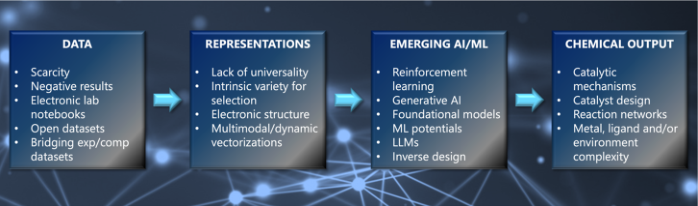

# Boosting Computational Catalysis and Chemical Reactivity with Artificial Intelligence

**中文题目 / Chinese title:** 以人工智能推动计算催化与化学反应性研究

**Zotero key:** BJXHSL2A  
**Attachment key:** TZEKZ4CT  
**Journal / 期刊:** Journal of the American Chemical Society  
**Date / 日期:** 2026-03-11  
**DOI:** 10.1021/jacs.5c17786  
**Collection / 集合:** 03AI4S/综述  
**Task date / 任务日期:** 2026-08-05  

## Why this paper / 为什么选这篇

**English:** This unprocessed six-marker legacy Zotero backfill is a current JACS Perspective that connects MLIPs, foundation models, molecular representations, mechanistic inference, and dataset design. It is especially valuable for turning broad AI enthusiasm into a concrete validation checklist for computational catalysis.

**中文：** 这篇尚未处理的六标记旧 Zotero 回填文献是近期 JACS 观点文章，贯通 MLIP、基础模型、分子表征、机理推断与数据集设计。它特别适合把对 AI 的宽泛期待转化为计算催化可执行的验证清单。

## Terminology ledger / 术语表

| English | 中文 | Note / 说明 |
|---|---|---|
| machine learning interatomic potential (MLIP) | 机器学习原子间势（MLIP） | 用于预测能量和力的机器学习势函数；其适用域与不确定性必须单独验证。 |
| foundation model | 基础模型 | 在大规模、多任务数据上预训练并可迁移或微调的模型；并不天然保证化学外推可靠性。 |
| molecular representation | 分子表征 | 把分子结构、电子结构或实验信息编码成模型输入的方式。 |
| active learning | 主动学习 | 由模型不确定性或信息价值引导下一批计算/实验数据采样的闭环策略。 |
| generative AI | 生成式人工智能 | 生成候选分子、结构、反应或文本的模型类别；需由物理和实验约束筛选。 |
| mechanism discovery | 反应机理发现 | 识别中间体、路径、能垒与控制步骤，并以可检验的证据链加以支持的过程。 |
| negative reaction outcome | 阴性反应结果 | 未得到目标产物或活性的实验/计算结果，对消除正例偏差很重要。 |
| out-of-distribution (OOD) | 分布外（OOD） | 超出训练数据覆盖范围的构型、化学空间或任务；预测通常需要额外审查。 |

## Reading guide / 阅读提示

**English:** First use Fig. 1 as a map, then read the MLIP section with one question in mind: what validation evidence would establish a usable domain for your system? In the mechanism and dataset sections, distinguish fast proposal generation from a defensible reaction-pathway claim, and keep negative results and out-of-distribution checks in the evidence chain.

**中文：** 先把图 1 当作路线图，再阅读 MLIP 部分，并始终追问：对你的体系，哪些验证证据才能界定可用适用域？在机理与数据集部分，要区分“快速提出候选”与“可辩护的反应路径结论”，并把阴性结果和分布外检查纳入证据链。

## Related Reading / 延伸阅读

**English:** No strongly recommended related paper today.

**中文：** 今日不强行推荐相关必读文献；本文已提供从 MLIP 到数据集和机理推断的自洽入口，避免仅因题目相近而泛泛列举。

## Page / Section Index / 页面与章节索引

- pp. 1–2: Abstract, motivation, and emerging AI/ML methodologies / 摘要、研究动机与新兴 AI/ML 方法
- pp. 3–4: Generative AI and molecular representations / 生成式 AI 与分子表征
- pp. 5–7: Model–mechanism gap, chemical datasets, and conclusions / 模型—机理鸿沟、化学数据集与结论
- pp. 7–8: Author information, competing interests, and acknowledgments / 作者信息、利益冲突与致谢
- pp. 8–13: Bibliographic record / 书目信息

## Bilingual Reader / 逐段中英文对照

**Source:** p.1 S001

**Original:** ABSTRACT: Artificial intelligence (AI) and machine learning (ML) are rapidly reshaping the landscape of computational chemistry, offering new opportunities for accelerating catalyst discovery and deepening our understanding of chemical reactivity. This perspective highlights emerging methodologies ranging from machine learning potentials and reinforcement learning to generative AI and large language models that are poised to transform computational catalysis. We discuss challenges in developing robust molecular representations for transition-metal complexes, bridging mechanistic understanding with AI-driven predictions, and constructing reliable data sets that capture both successful and failed reactivity outcomes. By drawing on the authors’ practical experience across computational, experimental, and AI-driven domains, we emphasize the importance of integrating chemical intuition and methodological expertise with data-driven approaches while remaining open to serendipitous discoveries enabled by automation and self-driving laboratories. Ultimately, the future of computational catalysis lies in balancing human intuition with algorithmic power, leveraging AI not as a replacement but as an accelerator of chemical insight, mechanistic understanding, and catalyst design.

**中文:** 摘要：人工智能（AI）和机器学习（ML）正在迅速重塑计算化学的格局，为加速催化剂发现和加深我们对化学反应性的理解提供了新的机会。这一观点强调了新兴方法论，从机器学习潜力和强化学习到生成人工智能和大型语言模型，这些方法有望改变计算催化。我们讨论了开发过渡金属配合物的可靠分子表征、将机理理解与人工智能驱动的预测联系起来以及构建捕获成功和失败反应结果的可靠数据集等方面的挑战。通过借鉴作者在计算、实验和人工智能驱动领域的实践经验，我们强调将化学直觉和方法专业知识与数据驱动方法相结合的重要性，同时对自动化和自动驾驶实验室带来的偶然发现保持开放的态度。最终，计算催化的未来在于平衡人类直觉与算法能力，利用人工智能不是替代品，而是化学洞察、机械理解和催化剂设计的加速器。

**Source:** p.1 S002

**Original:** 1. INTRODUCTION

**中文:** 1. 简介

**Source:** p.1 S003

**Original:** Within less than a decade, machine learning (ML) and artificial intelligence (AI) have become pervasive in chemistry. A new branch of chemistry, often referred to as digital chemistry,1 has emerged at the intersection of experiment and computation. This field is dedicated to data science applications across chemistry in the broadest sense, extending well beyond the scope of traditional chemoinformatics. While pioneering work in this field is decades old,2−4 efforts during the 2010s facilitated by significant algorithmic and hardware advances, have prepared the ground for a data revolution in chemistry that we see now unfolding.5−13 What is different compared to previous (r)evolutions is the rapid pace of development.14 This high innovation pressure appears to leave us hardly any time to step aside and evaluate the accomplishments. What have been the most important developments? How are they consolidated, up to the point where they need to be transformed into teaching material to educate the next generation of computational chemists with a focus on data science? What are the next steps to expect? What are the holy grails in the field? Thus, in this article we attempt to provide a perspective on the field and its context. While AI-driven research on organic molecules and organic synthesis has entered in a more mature stage,7,15,16 largely propelled by pharmaceutical applications17−22 the fields of transition metal chemistry and heavy element chemistry remain comparatively underexplored.23−26 Technologies developed for molecules composed primarily of firstand second-

**中文:** 在不到十年的时间里，机器学习 (ML) 和人工智能 (AI) 已在化学领域变得普遍。化学的一个新分支，通常被称为数字化学1，在实验和计算的交叉点出现。该领域致力于最广泛意义上的跨化学的数据科学应用，远远超出了传统化学信息学的范围。虽然这一领域的开创性工作已有数十年历史，2−4 2010 年代在算法和硬件方面的重大进步推动下所做的努力，为我们现在所看到的化学数据革命奠定了基础。5−13 与之前的（r）革命不同的是发展速度很快。14 这种高创新压力似乎让我们几乎没有时间停下来评估所取得的成就。最重要的进展是什么？如何将它们整合到需要转化为教材以教育下一代以数据科学为重点的计算化学家的程度？接下来的步骤是什么？该领域的圣杯是什么？因此，在本文中，我们试图提供对该领域及其背景的看法。虽然人工智能驱动的有机分子和有机合成研究已进入更成熟的阶段，7,15,16很大程度上是由制药应用推动的17−22，但过渡金属化学和重元素化学领域的探索相对较少。23−26 主要由第一和第二组成的分子开发的技术

**Source:** p.1 S004

**Original:** row elements can play a pivotal role in advancing AI workflows for applications in homogeneous catalysis,27,28 spintronics,29

**中文:** 行元素可以在推进均相催化应用的人工智能工作流程方面发挥关键作用，27,28 自旋电子学，29

**Source:** p.1 S005

**Original:** heavy element separations and capture.30 However, important challenges remain for transitioning such technologies to molecular complexes. Those have to do with emerging AI/ ML methodologies such as generative AI and large language models (LLMs), molecular representations of metal−ligand structures, chemical insights into the AI workflows, and generation of reliable and diverse data sets. In this perspective, we explore these emerging opportunities and challenges and discuss recent developments in AI/ML techniques and how they might transform molecular modeling, with a particular focus on molecular transition metal systems. We will have an emphasis on opportunities driven by actual practical experience of the authors, which is (in general) not documented in data sets and literature and therefore not accessible to AI-powered assistants. Hence, by contrast to a traditional review article covering recent literature on a specific topic, which is a perfect target for AI-powered robots (as long as they have access to all literature and without hallucinating

**中文:** 30 然而，将此类技术转变为分子复合物仍然存在重大挑战。这些与新兴的人工智能/机器学习方法有关，例如生成人工智能和大语言模型（LLM）、金属配体结构的分子表示、对人工智能工作流程的化学见解以及可靠且多样化的数据集的生成。从这个角度来看，我们探索这些新出现的机遇和挑战，并讨论人工智能/机器学习技术的最新发展以及它们如何改变分子建模，特别关注分子过渡金属系统。我们将重点关注由作者的实际实践经验驱动的机会，这些机会（通常）没有记录在数据集和文献中，因此人工智能助理无法获得这些机会。因此，与涵盖特定主题的最新文献的传统评论文章相比，这是人工智能驱动的机器人的完美目标（只要它们能够访问所有文献并且不会产生幻觉）

**Source:** p.1 S006

**Original:** 9143

**中文:** 9143

**Source:** p.2 S007

**Original:** about scientific facts), we understand this work as being part of an increasingly important push toward perspective and opinion pieces as they draw upon human intelligence and wisdom, not reachable by machines any time soon. Accordingly, we rely on a diverse background that ranges from traditional computational chemistry applications in catalysis and chemical reactivity to the development of chemical LLMs. While molecular catalysis is the primary focus of this perspective, we also highlight recent and particularly compelling examples of AI applications in heterogeneous catalysis whenever they provide meaningful extensions to our discussion. Figure 1 summarizes the topics that are discussed in the next sections.

**中文:** 关于科学事实），我们认为这项工作是推动观点和观点文章日益重要的一部分，因为它们利用了人类的智慧和智慧，而机器短期内无法实现这些观点和观点。因此，我们依赖于多元化的背景，从催化和化学反应中的传统计算化学应用到化学法学硕士的开发。虽然分子催化是这一观点的主要焦点，但只要它们为我们的讨论提供了有意义的扩展，我们也会重点介绍人工智能在多相催化中应用的最新且特别引人注目的例子。图 1 总结了下一节中讨论的主题。

### Fig. 1. 从数据到化学输出的观点文章工作流

**Placed near:** p.2 S007
**Source:** p.2 C001

**Original caption:** Figure 1. Schematic workflow of the four main topics explored in this perspective article.

**中文图注:** 图 1. 本文探讨的四个主要主题的示意性工作流程。

**Reading note / 阅读提示:** Follow the four linked layers: data quality, chemically meaningful representations, emerging AI/ML methods, and experimentally or computationally testable chemical outputs. / 沿四个相连层级阅读：数据质量、具化学意义的表征、新兴 AI/ML 方法，以及可由实验或计算检验的化学输出。

**Source:** p.2 S008

**Original:** 2. EMERGING AI/ML METHODOLOGIES

**中文:** 2. 新兴的人工智能/机器学习方法

**Source:** p.2 S009

**Original:** New methodologies such as transfer learning,31−34 reinforcement learning,35−38 self-supervised learning,39 generative AI,40,41 and foundation models42−47 are beginning to influence computational chemistry workflows. While there is still uncertainty about where these trends will lead, active learning, in particular, may soon replace the (manual or automated) generation of training sets one of the most labor-intensive aspects of machine learning model development. For specific domains though, such as the ML-based computation of potential energy surfaces, there are already software suites which assist in this task, including PES-learn,48 Asparagus,49

**中文:** 迁移学习、31−34 强化学习、35−38 自监督学习、39 生成式人工智能、40,41 和基础模型42−47 等新方法正开始影响计算化学工作流程。虽然这些趋势将走向何方仍存在不确定性，但主动学习可能很快就会取代（手动或自动）训练集生成，这是机器学习模型开发中劳动最密集的方面之一。但对于特定领域，例如基于机器学习的势能面计算，已经有软件套件可以协助完成这项任务，包括 PES-learn、48 Asparagus、49

**Source:** p.2 S010

**Original:** ArcaNN,50 or DP-Gen51 to name a few. In this section, we discuss two emerging areas that are increasingly shaping computational chemistry workflows: machine learning interatomic potentials (MLIPs) and generative AI methods. 2.1. Machine Learning Interatomic Potentials vs Established Computational Methods

**中文:** ArcaNN、50 或 DP-Gen51 等。在本节中，我们讨论日益影响计算化学工作流程的两个新兴领域：机器学习原子间势（MLIP）和生成人工智能方法。 2.1.机器学习原子间势与已建立的计算方法

**Source:** p.2 S011

**Original:** An increasingly prominent theme in molecular simulations is the emergence and growing influence of MLIPs and their prospect to replace traditional quantum chemical methods such as density functional theory (DFT).52−57 For many routine tasks such as conformer generation, reaction mechanism analysis, and energy profiling of drug-like molecules, MLIPs are beginning to match, and in some cases surpass DFT performance. Their advantage can be measured either in terms of accuracy, when trained on data from postHartree−Fock reference data (e.g., coupled-cluster), or in terms of speed, which can approach that of classical simulations. The rapid scaling of data sets and improvements in learning architectures suggest that many simulations currently handled with first-principles methods could soon be delegated to machine-learned models. In this view, DFT may increasingly serve as a data generation engine for training and validating machine learning models. This trend becomes even more evident with the emergence of general-purpose foundation models, such as MACE58 and UMA (the latter is

**中文:** 分子模拟中一个日益突出的主题是 MLIP 的出现和日益增长的影响力，以及它们取代密度泛函理论 (DFT) 等传统量子化学方法的前景。52−57 对于许多常规任务，如构象异构体生成、反应机理分析和类药物分子的能量分析，MLIP 开始匹配甚至在某些情况下超越 DFT 性能。它们的优势可以通过精度来衡量，当使用来自 postHartree−Fock 参考数据（例如，耦合集群）的数据进行训练时，或者可以通过速度来衡量，这可以接近经典模拟的速度。数据集的快速扩展和学习架构的改进表明，目前使用第一原理方法处理的许多模拟很快就会被委托给机器学习模型。从这个角度来看，DFT 可能会越来越多地充当训练和验证机器学习模型的数据生成引擎。随着通用基础模型的出现，例如 MACE58 和 UMA（后者是

**Source:** p.2 S012

**Original:** trained on the OMOL2025 data set59). Unlike task-specific MLIPs, these models aim to capture broadly transferable representations of chemical interactions, enabling rapid adaptation to diverse molecular systems and tasks. Their promise lies in reducing the need for system-specific retraining while offering accuracy and scalability that approach, or in some cases exceed, traditional quantum methods. This optimism can be balanced with an awareness of current limitations, which highlight opportunities for growth. Despite training on large data sets, MLIPs can exhibit “uncharted regions”60 in their energy landscapes, corresponding to portions of configuration space where the model produces unreliable or unphysical results.61−64 These issues are particularly pronounced in systems that fall outside the training distribution or that require fine control of electronic structure details. For instance, a computational campaign considered complete may need to be extended by months once it becomes clear that parts of the relevant potential energy surface are poorly represented. This points to a key limitation: while machine learning models always return a result, assessing the reliability of that result, particularly in underexplored regions of chemical space, remains a significant challenge. Recent progress in uncertainty estimation has the potential to elevate active learning for the exploration of complex potential energy surfaces, including transition metal complexes, with significant implications for catalyst design.65−67

**中文:** 在 OMOL2025 数据集上进行训练59)。与特定任务的 MLIP 不同，这些模型旨在捕获化学相互作用的广泛可转移的表示，从而能够快速适应不同的分子系统和任务。他们的承诺在于减少对特定系统再训练的需求，同时提供接近或在某些情况下超过传统量子方法的准确性和可扩展性。这种乐观情绪可以与对当前局限性的认识相平衡，这凸显了增长的机会。尽管在大型数据集上进行了训练，MLIP 仍可以在其能量景观中展示“未知区域”60，对应于模型产生不可靠或非物理结果的配置空间部分。 61−64 这些问题在训练分布之外或需要对电子结构细节进行精细控制的系统中尤其明显。例如，一旦发现相关势能面的部分内容表现不佳，则认为已完成的计算活动可能需要延长数月。这指出了一个关键的限制：虽然机器学习模型总是返回结果，但评估该结果的可靠性，特别是在化学空间中尚未充分探索的区域，仍然是一个重大挑战。不确定性估计方面的最新进展有可能提高探索复杂势能表面（包括过渡金属配合物）的主动学习能力，对催化剂设计具有重大影响。 65−67

**Source:** p.2 S013

**Original:** We may draw a useful comparison to the early adoption of DFT itself. When DFT methods were first introduced, there was skepticism about their limitations and applicability to complex systems.68 Similar doubts are now being raised about MLIPs. While there will always be challenging cases such as multireference problems,69,70 or photochemistry,71,72 many everyday chemical simulations may eventually be handled by MLIPs with minimal loss in accuracy and significant gains in efficiency. Before reaching this level of maturity, computational chemists will have access to a rapidly growing array of semiempirical methods, including those based on tight-binding (TB) approximations to Kohn−Sham DFT.73,74 Much of the eventual success of DFT can be traced to the systematic identification of functional-specific failure modes, which provided confidence in their domain of applicability. Whether MLIPs will undergo a comparable process remains to be seen. Although DFT has played a prominent role for various reasons, theoretical investigations of catalytic mechanisms, particularly in the case of transition metal catalysts, currently employ a range of higher-level electronic structure methods, either single-reference (e.g., coupled-cluster-based methods) or multireference. For systems with complicated electronic structures, multinuclear catalysts, complexes with noninnocent ligands, magnetic exchange interactions, reaction intermediates during bond formation and breaking possibly involving spin-

**中文:** 我们可以与 DFT 本身的早期采用进行有用的比较。当 DFT 方法首次引入时，人们对其局限性和对复杂系统的适用性表示怀疑。68 现在也对 MLIP 提出了类似的怀疑。虽然总会存在诸如多参考问题、69,70 或光化学问题等具有挑战性的情况，71,72 许多日常化学模拟最终可以由 MLIP 处理，精度损失最小，效率显着提高。在达到这一成熟度之前，计算化学家将能够使用一系列快速增长的半经验方法，包括基于 Kohn−Sham DFT 的紧束缚 (TB) 近似的方法。73,74 DFT 的最终成功很大程度上可以追溯到对特定功能失效模式的系统识别，这为其适用性领域提供了信心。多层投资项目是否会经历类似的过程还有待观察。尽管 DFT 由于各种原因发挥了突出作用，但催化机制的理论研究，特别是在过渡金属催化剂的情况下，目前采用了一系列更高层次的电子结构方法，无论是单参考（例如，基于耦合簇的方法）还是多参考。对于具有复杂电子结构、多核催化剂、非无害配体的配合物、磁交换相互作用、键形成和断裂过程中可能涉及自旋的反应中间体的系统

**Source:** p.3 S014

**Original:** state crossings, these methods may be necessary to reach a certain level of accuracy but they may also be desirable in themselves because they facilitate a level of insight that is not readily accessible by other means (e.g., analyzing the nature of multireference states). Here, a balanced view of the role of ML might be as a facilitator/accelerator of such approaches rather than as an alternative to them. Similarly, for heterogeneous catalysis, post-DFT electronic-structure methods for periodic systems (such as GW,75 periodic RPA,76 embedding approaches,77 and local-correlation methods,78,79) fulfill a comparable role by enhancing both the accuracy and interpretability of surface reaction mechanisms. Protocols where ML is used in conjunction with classic quantum chemistry methods (e.g., in a Δ-ML fashion or through transfer learning),31,80 such as DFT or correlated methods, have shown promise to improve accuracy for challenging problems. Some examples include data-driven quantum chemical methodologies that utilize low-level quantum chemical data for the prediction of higher-level wave functions (e.g., from MP2 →CCSD(T)81−84 or CASSCF →CASPT285), which can be in principle extended to DLPNO−CCSD(T) for larger systems, extrapolation of NEVPT2 dynamic correlation corrections to estimate higher level corrections, such as NEVPT2 →NEVPT4, or on the automated active space selection.86,87 These protocols can also be used in turn to train more computationally efficient models. Δ-ML and transfer learning combined with cluster-based parametrization strategies88 and/or molecular tailoring89

**中文:** 状态交叉时，这些方法可能是达到一定程度的准确性所必需的，但它们本身也可能是可取的，因为它们促进了通过其他方式（例如，分析多参考状态的性质）无法轻易获得的洞察力。在这里，对机器学习作用的平衡看法可能是作为此类方法的促进者/加速器，而不是作为它们的替代品。同样，对于多相催化，周期系统的后 DFT 电子结构方法（例如 GW、75 周期 RPA、76 嵌入方法、77 和局部相关方法、78,79）通过提高表面反应机制的准确性和可解释性来发挥类似的作用。 ML 与经典量子化学方法（例如，以 Δ-ML 方式或通过迁移学习）31,80（例如 DFT 或相关方法）结合使用的协议已显示出有望提高挑战性问题的准确性。一些例子包括数据驱动的量子化学方法，利用低级量子化学数据来预测更高级别的波函数（例如，从 MP2 → CCSD(T)81−84 或 CASSCF → CASPT285），原则上可以扩展到较大系统的 DLPNO−CCSD(T)，外推 NEVPT2 动态相关校正来估计更高级别的校正，例如 NEVPT2 → NEVPT4，或在自动活动空间上Selection.86,87 这些协议也可以依次用于训练计算效率更高的模型。 Δ-ML 和迁移学习与基于集群的参数化策略88 和/或分子定制89 相结合

**Source:** p.3 S015

**Original:** provide a roadmap to address problems in homogeneous and even heterogeneous catalysis. Training of such models is typically limited to data sets of representative systems with few atoms, on which a large percentage of electron correlation is possible to be recovered, but it is questionable whether the results obtained using such data sets can be extrapolated to realistic systems. In contrast, parameters such as orbital entropy, spin populations, and related quantities can instead be used to represent the complexes in the training set. These parameters capture features that can be shared between both small and large systems, such as the local electronic structure around the metal center(s). In this way, the model can learn connections between correlation energies and these parameters, rather than relying directly on molecular geometries. For computational chemists working with metalloenzymes, a central consideration is how ML can be incorporated into existing workflows of multilevel calculations (e.g., QM/MM) and facilitate improved embedding strategies for treatment of environmental effects and solvation spheres. We do not envisage−in the short term−a complete dismantling of established multicomponent workflows but anticipate ML approaches to provide unique solutions to sensitive or demanding steps. For example, a common bottleneck in QM/MM/MD calculations of metalloenzymes is the generation of appropriate force-field parameters for metallocofactors, which may even have to be changing from step to step when different catalytic intermediates are studied. Here ML/MLIPs could potentially be used to automate this step for metalloenzyme active sites, thus drastically accelerating the overall workflow of otherwise conventional multiscale simulations.90−101

**中文:** 提供解决均相甚至异相催化问题的路线图。此类模型的训练通常仅限于具有很少原子的代表性系统的数据集，在这些数据集上可以恢复很大比例的电子相关性，但使用此类数据集获得的结果是否可以外推到现实系统是值得怀疑的。相反，轨道熵、自旋总体和相关量等参数可以用来表示训练集中的复合体。这些参数捕获可以在小型和大型系统之间共享的特征，例如金属中心周围的局部电子结构。通过这种方式，模型可以学习相关能量和这些参数之间的联系，而不是直接依赖于分子几何形状。对于使用金属酶的计算化学家来说，一个核心考虑因素是如何将机器学习纳入现有的多级计算工作流程（例如 QM/MM），并促进改进用于处理环境影响和溶剂化领域的嵌入策略。我们不会在短期内设想完全拆除已建立的多组件工作流程，但预计机器学习方法将为敏感或要求较高的步骤提供独特的解决方案。例如，金属酶的 QM/MM/MD 计算中的一个常见瓶颈是为金属辅因子生成适当的力场参数，当研究不同的催化中间体时，甚至可能必须逐步改变。这里，ML/MLIP 有可能用于自动化金属酶活性位点的这一步骤，从而大大加快传统多尺度模拟的整体工作流程。 90−101

**Source:** p.3 S016

**Original:** 2.2. Generative AI Speculation about the future may also touch on more transformative ideas. One may imagine a future in which foundation models trained on massive experimental and computational data sets could bypass traditional simulationbased studies of molecular systems.12,102 In such a vision, we could imagine moving directly from a research question to an experimental observable, without explicitly modeling the molecular system. Though still aspirational, the emergence of self-driving laboratories,103,104 real-time experimental data streams, and closed-loop AI systems point in this direction. AI-driven laboratories will also require synergy between experimental and digital chemists to elevate the strengths of machine learning and develop models easily accessible to nonexperts. Web services or easy-to-use applications will allow chemists to use such models without prior programming experience. Diffusion and flow-matching models are powerful new generative tools in chemistry that directly operate on 3D molecular geometries, providing a natural interface with traditional quantum chemistry modeling.105 Unlike autoregressive models, they do not generate structures sequentially but instead evolve entire geometries in continuous space, which improves validity and facilitates modeling of interactions relevant to reactivity. While much of their early success has been in drug discovery,106,107 flow-matching models have been applied to generate transition-states,108,109 in inverse design of organocatalysts110 and enzymes,111 with recent extensions demonstrating their applicability to heterogeneous catalysis.44

**中文:** 2.2.生成式人工智能对未来的推测也可能涉及更具变革性的想法。人们可以想象未来，在大量实验和计算数据集上训练的基础模型可以绕过传统的基于模拟的分子系统研究。12,102 在这样的愿景中，我们可以想象直接从研究问题转向实验可观察结果，而不需要明确地对分子系统进行建模。尽管仍然令人向往，但自动驾驶实验室、103,104 实时实验数据流和闭环人工智能系统的出现都指向了这个方向。人工智能驱动的实验室还需要实验化学家和数字化学家之间的协同作用，以提升机器学习的优势并开发非专家可以轻松访问的模型。 Web 服务或易于使用的应用程序将允许化学家在没有编程经验的情况下使用此类模型。扩散和流动匹配模型是化学领域强大的新型生成工具，可直接对 3D 分子几何结构进行操作，提供与传统量子化学建模的自然接口。 105 与自回归模型不同，它们不会顺序生成结构，而是在连续空间中演化整个几何结构，从而提高有效性并促进与反应性相关的相互作用的建模。虽然他们早期的成功主要集中在药物发现方面，106,107 流动匹配模型已应用于生成过渡态，108,109 应用于有机催化剂110 和酶的逆向设计，111 最近的扩展证明了它们对多相催化的适用性。 44

**Source:** p.3 S017

**Original:** These capabilities suggest that generative models based on diffusion or flow matching may open new avenues for interpretable catalyst design and mechanistic discovery. As MLIPs continue to redefine how we model potential energy surfaces with quantum-level accuracy, a parallel frontier is emerging at a very different level of abstraction: foundation models. In contemporary computational chemistry, the term “foundation model” has come to encompass two complementary developments. The first includes broadly transferable MLIPs discussed in the previous section which serve as universal energy and force predictors across chemical and materials spaces. The second refers to large language models (LLMs) trained on extensive chemical, molecular, or materials corpora.112−121 Although both groups of models share underlying principles such as large-scale training, generalization, and cross-domain transferability, they differ fundamentally in their objectives, data modalities, and modes of interaction with chemical problems. While LLMs themselves still perform poorly in generating valid molecules or reactions from scratch, they are rapidly improving at interpreting, contextualizing, and reasoning about chemical information.122

**中文:** 这些功能表明，基于扩散或流动匹配的生成模型可能为可解释的催化剂设计和机理发现开辟新途径。随着 MLIP 继续重新定义我们如何以量子级精度模拟势能表面，平行前沿正在一个非常不同的抽象级别上出现：基础模型。在当代计算化学中，“基础模型”一词已经包含了两个互补的发展。第一个包括上一节中讨论的广泛可转移的 MLIP，它们充当化学和材料空间中的通用能量和力预测器。第二个是指在广泛的化学、分子或材料语料库上训练的大型语言模型 (LLM)。 112−121 尽管两组模型共享大规模训练、泛化和跨领域可转移性等基本原则，但它们在目标、数据模式以及与化学问题的交互模式方面存在根本差异。虽然法学硕士本身在从头开始生成有效分子或反应方面仍然表现不佳，但他们在化学信息的解释、情境化和推理方面正在迅速提高。 122

**Source:** p.3 S018

**Original:** These models are increasingly used by students and researchers for coding support, structure interpretation, and scientific ideation. LLMs have the potential to bridge traditional computational tools (such as DFT) with the broader research workflow, enabling more natural and agentic interactions with complex data pipelines.123 LLMs with specialized tools have shown promise for coding, processing of chemical information, and controlling lab automation.112,115

**中文:** 这些模型越来越多地被学生和研究人员用于编码支持、结构解释和科学构思。法学硕士有潜力将传统计算工具（例如 DFT）与更广泛的研究工作流程联系起来，从而实现与复杂数据管道的更自然和更代理的交互。123 拥有专用工具的法学硕士在编码、化学信息处理和控制实验室自动化方面显示出了前景。112,115

**Source:** p.3 S019

**Original:** However, are foundation models a panacea? A cautionary analogy might be offered by the story of the Universal Force Field (UFF),124 which was once promoted as a general solution for all chemistry but ultimately fell short due to its lack of precision and transferability. The same risk applies to

**中文:** 然而，基础模型是万能的吗？通用力场（UFF）的故事可能提供了一个警示性的类比，124它曾经被宣传为所有化学的通用解决方案，但最终由于缺乏精度和可转移性而未能实现。同样的风险也适用于

**Source:** p.4 S020

**Original:** universal machine learning models: while the allure of generality is strong, chemistry continues to demand rigor, specificity, and domain expertise. Even as ML tools become more powerful, careful model validation and deep chemical intuition remain essential. But we should keep in mind that foundation models offer, in effect, an implicit universal projection of diverse electronic structures into a compact analytic representation, enabled through careful retraining and fine-tuning. In many ways, they can be viewed as a natural continuation of the vision behind UFF: the pursuit of a broadly applicable analytic model of fundamental physical interactions. What is different today is the nature of the representations themselves. Modern ML representations are implicit rather than explicit, which gives them a surprising capacity for extrapolation and allows them to be rapidly retrained into highly accurate, problem-specific models. In this sense, foundation models extend and refine the goal that UFF originally sought to achieve. Equally important is the conceptual formulation of the scientific questions we ask. In heterogeneous catalysis, while developing an accurate potential energy surface remains essential, a central difficulty often also lies in selecting an appropriate system and representation to model from the outset. AI/ML tools can help accelerate discovery, but they do not replace the need for human insight in defining the scope and relevance of a problem. However, recent advances on multiagent architectures and literature search agents have shown promise in generating new, original knowledge and formulating self-improving research hypotheses for automating scientific discoveries.125,126

**中文:** 通用机器学习模型：虽然通用性的吸引力很强，但化学仍然需要严谨性、特异性和领域专业知识。即使机器学习工具变得更加强大，仔细的模型验证和深入的化学直觉仍然至关重要。但我们应该记住，基础模型实际上提供了将不同电子结构隐式通用投影为紧凑的分析表示，这是通过仔细的再训练和微调实现的。在许多方面，它们可以被视为 UFF 背后愿景的自然延续：追求广泛适用的基本物理相互作用的分析模型。今天的不同之处在于表现本身的性质。现代机器学习表示是隐式的而不是显式的，这赋予它们令人惊讶的外推能力，并允许它们快速重新训练成高度准确的、针对特定问题的模型。从这个意义上说，基础模型扩展并完善了 UFF 最初寻求实现的目标。同样重要的是我们提出的科学问题的概念表述。在多相催化中，虽然开发准确的势能面仍然至关重要，但主要的困难往往还在于从一开始就选择合适的系统和表示形式来建模。人工智能/机器学习工具可以帮助加速发现，但它们并不能取代人类在定义问题范围和相关性方面的洞察力。然而，多智能体架构和文献搜索智能体的最新进展在生成新的原创知识和制定自我改进的研究假设以实现科学发现自动化方面显示出了希望。 125,126

**Source:** p.4 S021

**Original:** Clearly, a sense of both opportunity and caution must be exerted. AI and ML techniques are rapidly expanding the frontier of what is possible in computational chemistry, especially in areas like transition metal chemistry that have traditionally resisted automation. But the road ahead requires thoughtful integration of these tools with existing methodologies, careful attention to their limitations, and a commitment to preserving scientific rigor even in the face of accelerating automation.127 If pursued responsibly, these emerging technologies could dramatically enhance our ability to model, predict, and ultimately design the chemical systems of the future.

**中文:** 显然，我们必须既要保持机遇，又要保持谨慎。人工智能和机器学习技术正在迅速扩展计算化学的前沿，特别是在传统上抵制自动化的过渡金属化学等领域。但未来的道路需要将这些工具与现有方法进行深思熟虑的整合，仔细关注它们的局限性，并致力于在自动化加速的情况下保持科学严谨性。127如果负责任地追求，这些新兴技术可以极大地提高我们建模、预测和最终设计未来化学系统的能力。

**Source:** p.4 S022

**Original:** 3. MOLECULAR REPRESENTATIONS A complex and evolving challenge is how chemical systems are represented in a form suitable for computational modeling.128,129 Whether designing new machine learning models, interpreting experimental data, or predicting physical properties, the way we encode chemical information into molecular representations plays a central role in determining what questions can be asked and what answers can be trusted. Choosing the “right” molecular representation remains an open problem, one deeply tied to the nature of the task at hand. In contrast to fields like computer vision or natural language processing, where inputs are relatively standardized (images, text), chemistry offers a puzzling range of possible representations: text-based formats like SMILES, graph-based molecular topologies,130 three-dimensional geometries, electron densities, and quantum mechanical wave functions, among others. One may use text-based representations to take advantage of LLMs as general-purpose feature extractors. With relatively few training examples, these models can adapt representations on the fly to new tasks or reactions.131

**中文:** 3. 分子表示 一个复杂且不断发展的挑战是如何以适合计算建模的形式表示化学系统。128,129 无论是设计新的机器学习模型、解释实验数据还是预测物理性质，我们将化学信息编码为分子表示的方式在确定可以提出哪些问题以及可以信任哪些答案方面发挥着核心作用。选择“正确的”分子表示仍然是一个悬而未决的问题，这个问题与当前任务的性质密切相关。与计算机视觉或自然语言处理等输入相对标准化（图像、文本）的领域相比，化学提供了一系列令人困惑的可能表示形式：基于文本的格式（如 SMILES）、基于图形的分子拓扑、130 三维几何形状、电子密度和量子力学波函数等。人们可以使用基于文本的表示来利用 LLM 作为通用特征提取器。通过相对较少的训练示例，这些模型可以动态调整表示以适应新任务或反应。 131

**Source:** p.4 S023

**Original:** However, this flexibility comes at a cost, as these representations are often highly abstract, and their interpretability is limited. The trade-offs between accuracy and interpretability, generality and specificity, are important to understand. One may advocate for dynamic or task-specific representations, learned in tandem with the data set as it is collected. However, such adaptive methods may obscure the underlying chemistry and make it more difficult to rationalize model behavior. Just as in human scientific communities, diversity of perspectives, described as the romantic, the pragmatic, and the artistic, can be a strength, allowing the field to pursue multiple lines of inquiry without prematurely standardizing on a single “best” approach. The abundance of representations in chemistry is both a challenge and an opportunity. Unlike many areas of machine learning where data are prevectorized, chemistry permits and requires investigation into how the form of representation affects model outcomes, which makes machine learning in chemistry a particularly rich domain: it opens the door to investigating more complex problems than are typically addressed by off-the-shelf ML benchmarks. Yet despite the promise of learned or abstract representations, hand-crafted, expert-defined features still play an important role.132 Especially in data-scarce regimes or for chemically challenging systems, such as transition metal complexes,25,26,133−139 or heterogeneous catalysts, domain knowledge remains crucial for designing meaningful inputs. As the field matures and access to experimental and computational data grows, we may see a convergence where learned representations become more powerful, efficient, and easy to use, while still respecting the chemical constraints and principles that underlie molecular behavior. One should be cautious against the temptation to search for a single unifying representation. The needs of spectroscopy differ from those of reaction prediction; electron density offers different information than molecular graphs or SMILES strings. The representation should not just describe the data but it should also reflect the specific modeling goal. A good representation is one that enables extrapolation, generalization, and problem-specific reasoning. And depending on the task (predicting spin crossover,140 ,141 reactivity,142 or spectral lines143) different aspects of a molecule’s physical or electronic structure may become relevant. From a computational chemistry standpoint, structure-based representations remain the default starting point. But even here, nuances arise. For instance, many descriptors assume a single, static conformation, whereas chemical reality often involves ensembles of rotamers, conformers, tautomeric forms or resonance structures.144−146 Thus, representations may need to move beyond idealized geometries to encode chemical states, incorporating information such as charge, spin multiplicity, solvation, or even temperature and concentration. Particularly in open-shell systems or complex electronic environments, these additional layers of description are critical for meaningful predictions. In this context, electron density emerges as a particularly intriguing modality.147−151 Although it contains all the information needed to reconstruct molecular structure and properties, it is computationally expensive to calculate accurately and difficult to work with directly. In this sense, much of modern representation theory in chemistry can be seen as constructing reduced models that compress the full

**中文:** 然而，这种灵活性是有代价的，因为这些表示通常是高度抽象的，并且它们的可解释性是有限的。理解准确性和可解释性、通用性和特殊性之间的权衡非常重要。人们可能提倡动态或特定于任务的表示，在收集数据集时与数据集一起学习。然而，这种自适应方法可能会掩盖潜在的化学原理，并使模型行为的合理化变得更加困难。就像在人类科学界一样，被描述为浪漫、务实和艺术的观点多样性可以成为一种优势，允许该领域追求多种探究方向，而不会过早地标准化单一的“最佳”方法。化学中丰富的表征既是挑战也是机遇。与数据预先向量化的许多机器学习领域不同，化学允许并需要调查表示形式如何影响模型结果，这使得化学中的机器学习成为一个特别丰富的领域：它为研究比现成的 ML 基准通常解决的更复杂的问题打开了大门。然而，尽管有学习或抽象表示的希望，手工制作、专家定义的特征仍然发挥着重要作用。 132 特别是在数据稀缺的情况下或对于具有化学挑战性的系统，例如过渡金属络合物，25,26,133−139 或异质催化剂，领域知识对于设计有意义的输入仍然至关重要。随着该领域的成熟以及实验和计算数据的增加，我们可能会看到一种融合，学习到的表示变得更加强大、高效和易于使用，同时仍然尊重分子行为背后的化学约束和原理。人们应该警惕寻找单一统一表示的诱惑。光谱学的需求与反应预测的需求不同；电子密度提供与分子图或 SMILES 字符串不同的信息。表示不仅应该描述数据，还应该反映特定的建模目标。良好的表示能够进行外推、概括和针对特定问题的推理。根据任务（预测自旋交叉、140、141 反应性、142 或谱线 143），分子物理或电子结构的不同方面可能会变得相关。从计算化学的角度来看，基于结构的表示仍然是默认的起点。但即使在这里，也会出现细微差别。例如，许多描述符假设单一的静态构象，而化学现实通常涉及旋转异构体、构象异构体、互变异构形式或共振结构的集合。144−146因此，表示可能需要超越理想化的几何形状来编码化学状态，纳入电荷、自旋多重性、溶剂化甚至温度和浓度等信息。特别是在开壳系统或复杂的电子环境中，这些附加的描述层对于有意义的预测至关重要。在这种情况下，电子密度成为一种特别有趣的模态。147−151 尽管它包含重建分子结构和性质所需的所有信息，但准确计算的计算成本很高，而且难以直接使用。从这个意义上说，化学中的许多现代表示理论可以被视为构建压缩完整模型的简化模型。

**Source:** p.5 S024

**Original:** electronic description into something tractable and application-ready, such as, for example, the smooth overlap of atomic positions (SOAP) representation,147 which can be understood as a simplified easy-to-evaluate model of molecular electron densities.150

**中文:** 将电子描述转化为易于处理且易于应用的东西，例如原子位置的平滑重叠 (SOAP) 表示，147 可以将其理解为简化的易于评估的分子电子密度模型。 150

**Source:** p.5 S025

**Original:** Looking ahead, the importance of multimodal representations is to be highlighted. In real chemical workflows, a molecule is rarely defined by a single modality. Structural data may be complemented by spectra, thermodynamic observables, or reaction yields. As such, the ability to combine different forms of information text, graphs, images, numerical spectra into a unified model offers a promising path forward. Multimodal machine learning frameworks, which can integrate and reason over diverse input types, may be key to unlocking more powerful and generalizable models. This approach also reflects experimental practice more accurately: a chemist rarely sees just a molecule but rather a chromatogram, an NMR spectrum, a color change in solution. Ultimately, representation is not just about how data are encoded. It is also about how information is preserved, transformed, and used to answer meaningful scientific questions. While machine learning today leans heavily on large data sets to learn patterns, traditional quantum chemistry began from minimal assumptions and sought predictive power from first principles. Future methods will likely benefit from bridging these paradigms: integrating the rigor of physics-based models with the flexibility and scalability of data-driven approaches.152,153 This fusion could yield representations that are not only accurate and efficient, but also transparent and chemically meaningful, enabling both prediction and understanding in complex molecular systems.

**中文:** 展望未来，多模式表示的重要性值得强调。在实际的化学工作流程中，分子很少由单一模态定义。结构数据可以通过光谱、热力学观测值或反应产率来补充。因此，将不同形式的信息文本、图形、图像、数值谱组合成统一模型的能力提供了一条有前途的前进道路。多模态机器学习框架可以对不同的输入类型进行集成和推理，可能是解锁更强大和更通用的模型的关键。这种方法还更准确地反映了实验实践：化学家很少只看到分子，而是看到色谱图、核磁共振谱、溶液中的颜色变化。最终，表示不仅仅是数据的编码方式。它还涉及如何保存、转换和使用信息来回答有意义的科学问题。虽然今天的机器学习严重依赖大数据集来学习模式，但传统的量子化学从最小的假设开始，并从第一原理中寻求预测能力。未来的方法可能会受益于桥接这些范式：将基于物理的模型的严谨性与数据驱动方法的灵活性和可扩展性相结合。152,153这种融合不仅可以产生准确和高效的表示，而且可以产生透明且具有化学意义的表示，从而能够在复杂的分子系统中进行预测和理解。

**Source:** p.5 S026

**Original:** 4. BRIDGING THE MODEL-MECHANISM GAP

**中文:** 4. 弥合模型与机制之间的差距

**Source:** p.5 S027

**Original:** Returning to catalysis, the central theme of this perspective, we next consider one of its most enduring challenges: the elucidation of catalytic reaction mechanisms. From a computational perspective, mechanism discovery often demands years of effort, requiring not only the identification of the most probable pathway but also exploration of multiple competing steps.154 This naturally raises the question: how can we leverage machine learning, in particular physics-informed or knowledge-embedded approaches, to accelerate and enrich mechanistic studies?155,156

**中文:** 回到催化这一观点的中心主题，我们接下来考虑其最持久的挑战之一：催化反应机制的阐明。从计算的角度来看，机制发现通常需要多年的努力，不仅需要识别最可能的路径，还需要探索多个竞争步骤。154这自然提出了一个问题：我们如何利用机器学习，特别是基于物理或知识嵌入的方法，来加速和丰富机制研究？155,156

**Source:** p.5 S028

**Original:** Experimental practice in mechanistic investigations of homogeneous or enzymatic transition metal catalysts typically rests on correlating spectroscopic observables with structural parameters of isolatable intermediates. Beyond simple structural characterization, these spectroscopic observables exclusively report on electronic structure, which is crucial to rationalize differences in efficiencies or mechanistic pathways between different catalysts. Although a lot of emphasis has been placed on an energy-based view of computational investigations (potential energy surfaces, transition states), a more immediate and still invaluable goal would be the use of ML for proposing correlations between (experimental) spectroscopy such as EPR, XAS, and Mössbauer, and molecular/ electronic structure. This can be a “final answer” in itself, but could also be seen as supplanting a major part of the work of computational chemists, the part involving hypothesizing/ conceptualizing molecular models that would be subsequently evaluated for their spectroscopic properties via quantum chemical methods.

**中文:** 均相或酶促过渡金属催化剂的机理研究的实验实践通常依赖于将光谱观测值与可分离中间体的结构参数相关联。除了简单的结构表征之外，这些光谱观测值专门报告电子结构，这对于合理化不同催化剂之间的效率或机械途径的差异至关重要。尽管人们非常重视计算研究的基于能量的观点（势能面、过渡态），但更直接且仍然有价值的目标是使用机器学习来提出（实验）光谱（例如 EPR、XAS 和穆斯堡尔）与分子/电子结构之间的相关性。这本身可以是“最终答案”，但也可以被视为取代计算化学家工作的主要部分，该部分涉及假设/概念化分子模型，随后通过量子化学方法评估其光谱特性。

**Source:** p.5 S029

**Original:** While AI continues to advance, we must not overlook the enduring importance of domain knowledge.121,157,158 Traditional organometallic catalysis, for instance, benefits from decades of mechanistic insights. Reaction mechanisms are typically described as a succession of established reaction steps, including oxidative addition, ligand dissociation, and transmetalation. Therefore, a way to approach the problem computationally is to determine the order of these steps and the catalyst structure, yielding the lowest energy pathway. Knowledge of these steps often allows domain experts to navigate complex systems more efficiently than those approaching the problem purely from theory or computation and serves as a valuable first filter, particularly when mapping out initial steps or identifying plausible intermediates. Techniques such as ML-assisted transition state searches159

**中文:** 在人工智能不断进步的同时，我们绝不能忽视领域知识的持久重要性。121,157,158 例如，传统的有机金属催化受益于数十年的机械见解。反应机制通常被描述为一系列已建立的反应步骤，包括氧化加成、配体解离和金属转移。因此，通过计算解决该问题的一种方法是确定这些步骤的顺序和催化剂结构，从而产生最低的能量路径。了解这些步骤通常可以让领域专家比纯粹从理论或计算解决问题的专家更有效地驾驭复杂系统，并且可以作为有价值的第一过滤器，特别是在规划初始步骤或识别合理的中间过程时。机器学习辅助过渡状态搜索等技术159

**Source:** p.5 S030

**Original:** and microkinetic modeling can then refine this initial scaffold, particularly when augmented by experimental kinetic data.160

**中文:** 然后微动力学模型可以完善这个初始支架，特别是在通过实验动力学数据增强时。 160

**Source:** p.5 S031

**Original:** For researchers less adept at mechanistic intuition, advances in reaction network modeling, such as those pioneered by groups working on automatic reaction exploration, can be transformative.161 Over time, these tools could evolve into powerful discovery frameworks, uncovering off-cycle pathways, decomposition channels, or unforeseen bifurcations in systems that resist traditional mechanistic analysis. A productive path forward may lie less in further constraining models with additional physical or chemical principles and more in broadening access to high-quality, diverse data sets derived from both computation and experiment.162,163 For example, if one had infinite kinetic data sets,164,165 or well-characterized molecular simulations accounting for solvation and entropy,166 a data-driven approach could be sufficiently expressive without humanimposed biases. However, this raises a provocative counterpoint: does encoding so much prior knowledge into our models limit the discovery potential of AI? Relying too heavily on textbook mechanisms, intuition, or handcrafted features risks reinforcing existing biases, driving models toward familiar solutions and potentially away from more innovative or unexpected ones. If large models are trained only on known chemistry, can they truly generalize or extrapolate? The role of dynamics and entropy in computational studies of transition metal complexes is an underexplored but critical dimension. Traditional approaches (both computational and human-driven) often emphasize energy landscapes and static structures. Yet, bifurcating transition states, entropic barriers, and nonstatistical dynamics likely play a much larger role than typically appreciated.167 Capturing such behavior may require novel descriptors or models that treat mechanistic pathways as ensembles rather than linear sequences. With increasing model complexity, interpretability reemerges as a central consideration in ensuring scientific validity.168,169 Could a future model such as, for example, an LLM trained on domain-specific data, strike a balance between interpretability and prediction? Natural language interfaces to such models could actually improve transparency, allowing users to query mechanisms or compare alternatives in humanunderstandable terms. However, the application of LLMs or similar models in catalysis faces two important challenges. First, the data scarcity in this field prevents the development or fine-tuning of LLMs, while lower complexity statistical models such as decision tree ensembles or Gaussian processes are used more frequently.170 Second, the lack of clarity around the exact

**中文:** 对于不太擅长机械直觉的研究人员来说，反应网络建模的进步，例如由致力于自动反应探索的小组开创的那些进步，可以是变革性的。 161随着时间的推移，这些工具可能会演变成强大的发现框架，揭示非周期路径、分解通道或系统中抵制传统机械分析的不可预见的分叉。一条富有成效的前进之路可能不在于使用额外的物理或化学原理进一步约束模型，而更多在于扩大对从计算和实验中获得的高质量、多样化数据集的访问。 162,163 例如，如果一个人有无限的动力学数据集，164,165 或解释溶剂化和熵的良好表征的分子模拟，166 数据驱动的方法可以在没有人为偏见的情况下充分表达。然而，这提出了一个具有争议性的反驳：将如此多的先验知识编码到我们的模型中是否会限制人工智能的发现潜力？过度依赖教科书机制、直觉或手工特征可能会加剧现有的偏见，推动模型走向熟悉的解决方案，并可能远离更具创新性或意想不到的解决方案。如果大型模型仅根据已知的化学进行训练，它们能否真正进行概括或推断？动力学和熵在过渡金属配合物计算研究中的作用是一个尚未充分探索但至关重要的维度。传统方法（计算方法和人类驱动方法）通常强调能源景观和静态结构。然而，分叉过渡态、熵势垒和非统计动力学可能发挥比通常理解的更大的作用。167捕获这种行为可能需要新的描述符或模型，将机械路径视为整体而不是线性序列。随着模型复杂性的增加，可解释性重新成为确保科学有效性的核心考虑因素。168,169 未来的模型（例如，在特定领域数据上训练的法学硕士）能否在可解释性和预测之间取得平衡？此类模型的自然语言接口实际上可以提高透明度，允许用户以人类可理解的方式查询机制或比较替代方案。然而，法学硕士或类似模型在催化中的应用面临着两个重要的挑战。首先，该领域的数据稀缺阻碍了法学硕士的开发或微调，而复杂性较低的统计模型（例如决策树集成或高斯过程）则被更频繁地使用。 170 其次，缺乏明确的确切模型

**Source:** p.6 S032

**Original:** structure of the catalyst specifically, how it can be characterized with limited information, typically restricted to reaction conditions, synthesis parameters, and averaged elemental descriptors from nominal loadings makes it difficult to develop the kind of precise representation needed for concise embedding in an LLM. This is in contrast to fully defined molecular structures, which can be easily tokenized via SMILES.171

**中文:** 特别是催化剂的结构，如何用有限的信息来表征它，通常仅限于反应条件、合成参数和标称负载的平均元素描述符，这使得开发法学硕士中简洁嵌入所需的精确表示变得困难。这与完全定义的分子结构形成鲜明对比，后者可以通过 SMILES 轻松标记。171

**Source:** p.6 S033

**Original:** Ultimately, while AI will undoubtedly transform how we explore catalytic mechanisms, experimental validation will remain the final arbiter. Efforts in automation and self-driving laboratories,103,104 are a path toward fully integrated platforms for hypothesis generation, validation, and iterative improvement. Yet even here, some studies caution that smart sampling strategies (e.g., active learning) may be less impactful than how we represent the underlying chemical space. We are best advised to remain thoughtful about the balance between automation and human input. While automation may accelerate exploration, the intuition honed through years of experimentation and theory still plays a pivotal role, especially in under-characterized or ill-defined systems, such as many homogeneous or heterogeneous catalysts. Moving forward, the field may benefit from embracing both extremes: large, expressive models trained on extensive data, and targeted, domain-informed approaches where prior knowledge provides critical context. Machine learning models could also be trained to capture chemists’ intuition in a similar way as has been attempted in the drug discovery space.172,173

**中文:** 最终，虽然人工智能无疑将改变我们探索催化机制的方式，但实验验证仍将是最终的仲裁者。自动化和自动驾驶实验室的努力，103,104 是通往假设生成、验证和迭代改进的完全集成平台的道路。然而，即使在这里，一些研究也警告说，智能采样策略（例如主动学习）的影响可能不如我们代表潜在化学空间的方式。我们最好对自动化和人工输入之间的平衡保持深思熟虑。虽然自动化可能会加速探索，但通过多年的实验和理论磨练出来的直觉仍然发挥着关键作用，特别是在特征不足或定义不明确的系统中，例如许多均相或异相催化剂。展望未来，该领域可能会受益于拥抱两个极端：在大量数据上训练的大型、富有表现力的模型，以及先验知识提供关键背景的有针对性的、领域知情的方法。还可以训练机器学习模型来捕捉化学家的直觉，就像在药物发现领域所尝试的那样。 172,173

**Source:** p.6 S034

**Original:** In terms of catalyst optimization, emphasis is usually placed on the first coordination sphere of a transition metal ion. Bioinorganic catalysis however also encompasses metalloenzymes, and in this case the transferability of the developed approaches is not obvious. It is likely that quite distinct ML tools would have to be combined into multicomponent workflows, borrowing from more “locally focused” domains as well from domains focusing on directed enzyme evolution, recognizing that “textbook”-guided considerations of ligand optimization in standard coordination chemistry can quickly become even irrelevant when the “ligand” is a functionally important protein matrix. These approaches could be integrated in a bottom-up protocol for enzyme discovery acceleration, for example (re)designing enzyme function.174,175

**中文:** 在催化剂优化方面，通常重点关注过渡金属离子的第一配位层。然而，生物无机催化也包括金属酶，在这种情况下，所开发方法的可转移性并不明显。很可能必须将完全不同的机器学习工具组合成多组件工作流程，借鉴更多“局部聚焦”领域以及关注定向酶进化的领域，认识到当“配体”是功能重要的蛋白质基质时，标准配位化学中以“教科书”为指导的配体优化考虑因素可能很快变得无关紧要。这些方法可以集成到自下而上的协议中，以加速酶发现，例如（重新）设计酶功能。174,175

**Source:** p.6 S035

**Original:** Distinct goals will have to be combined in order to construct a multidimensional surface correlating structural and electronic parameters of the active site with catalytic activity and with amino acid sequence, and ultimately to locate combinations that maximize overall function. Besides conventional conceptions of reactivity, repurposing natural or designing artificial metalloenzymes would need to consider multiple other factors, such as robustness, sensitivity of different parts of the system to specific conditions, optimization of substrate delivery pathways and proton channels, or even allostery for controlling selectivity and function, or for signaling between catalytic components (feedback). Finally, in the realm of catalyst design, we anticipate significant breakthroughs in the coming years driven by inverse design strategies and generative models.110,176,177 The effectiveness of training generative models depends critically on the benchmark tasks they are designed for. While initial molecular design tasks focused on simplistic objectives such as molecular rediscovery and proxies such as quantitative estimates of drug likeness,178 benchmarks more tailored toward realistic targets have been developed.179 Other

**中文:** 必须将不同的目标组合起来，以构建将活性位点的结构和电子参数与催化活性和氨基酸序列相关联的多维表面，并最终找到最大化整体功能的组合。除了传统的反应性概念之外，重新利用天然或设计的人造金属酶还需要考虑多种其他因素，例如鲁棒性、系统不同部分对特定条件的敏感性、底物传递途径和质子通道的优化，甚至用于控制选择性和功能的变构，或催化组分之间的信号传导（反馈）。最后，在催化剂设计领域，我们预计在逆向设计策略和生成模型的推动下，未来几年将取得重大突破。110,176,177 训练生成模型的有效性主要取决于它们设计的基准任务。虽然最初的分子设计任务侧重于简单的目标，例如分子重新发现和代理，例如药物相似性的定量估计，178 个更适合实际目标的基准已经开发出来。 179 其他

**Source:** p.6 S036

**Original:** important aspects are the focus on sample-efficiency,41 and beating relevant baseline models such as genetic algorithms.

**中文:** 重要的方面是关注样本效率41以及击败相关基线模型（例如遗传算法）。

**Source:** p.6 S037

**Original:** 5. CHEMICAL DATASETS Another difficulty in applying machine learning in catalysis research lies in data collection for the development of supervised learning models with predictive power. There is scarcity of computationally refined databases of transition metal complexes that machine learning can capitalize on,59,180−182 although there are ligand data sets that can be used for combinatorial expansions and genetic algorithms.183−185 Another known limitation is the lack of negative reaction outcomes that are not published by chemists, even though they are highly valuable to train machine learning models to avoid a positive reaction bias.186,187 A focus must therefore be put on encouraging and incentivizing chemists to also publish negative reaction outcomes, a culture shift which requires a long community effort.188 This can be facilitated with electronic lab notebooks, in which all data are stored in a systematic and concise format.189 Recent studies have shown that the explicit generation of negative reaction data can help the models to better distinguish between reactive and unreactive substrates.190 Such models can then be used to identify further negative reactions that can be executed with high-throughput experimentation equipment to augment current unbalanced data sets. As awareness of this topic grows within the field, we are confident that the community will continue to move in the right direction. Data from automation platforms will also likely contain a larger percentage of failed reactions. Another important aspect is how to format reaction data once they are recorded since the role of chemical species in reactions is often unclear. We envision that the usage of electronic lab notebooks and open reaction databases191 will provide more interoperable and reusable reaction data, facilitating machine learning efforts. Such database-oriented format might also be combined with user-friendly spreadsheet formats at the time of input.192 The development of more sophisticated models and data infrastructure enables the community to move beyond standard data sets, such as the United States Patent and Trademark Office (USPTO), which is dominated by industrially relevant reactions such as the Buchwald−Hartwig or Suzuki coupling. Making efficient use of these sparser data is therefore highly important, e.g. through transfer learning or the previously alluded to chemistry-informed models.193 Finally, the validation of reaction standardization platforms will critically depend on the involvement of experimental chemists. As the primary data providers, it is essential to maintain a careful balance by offering them a flexible recording format that does not constrain their workflow while ensuring the data remains useable for machine learning applications. A critical challenge in modern chemical research lies in reconciling experimental and computational data sets, particularly in terms of their reliability, resolution, and mutual alignment, despite several “best practice” rules that have been recommended in the literature.194−196 For example, while data sets of computed activation energies197−200 have helped fuel model development, the end goal is to predict experimental values. For many reaction types, agreement between computation and experiment remains challenging due to many factors. Machine learning models that bridge the computed activation and experimental activation energies through delta or transfer learning is a promising strategy.31,201

**中文:** 5.化学数据集将机器学习应用于催化研究的另一个困难在于数据收集，以开发具有预测能力的监督学习模型。尽管存在可用于组合扩展和遗传算法的配体数据集，但机器学习可以利用的经过计算精炼的过渡金属配合物数据库却很缺乏，59,180−182。183−185 另一个已知的限制是缺乏化学家未发表的负面反应结果，尽管它们对于训练机器学习模型以避免正面反应偏差非常有价值。186,187 因此，必须将重点放在鼓励和激励上化学家还发布阴性反应结果，这是一种需要社区长期努力的文化转变。 188 这可以通过电子实验室笔记本来促进，其中所有数据都以系统且简洁的格式存储。 189 最近的研究表明，阴性反应数据的显式生成可以帮助模型更好地区分反应性和非反应性底物。 190 然后，此类模型可用于识别进一步的阴性反应，这些反应可以使用高通量实验设备执行，以增强当前不平衡的数据集。随着该领域对该主题的认识不断增强，我们相信社区将继续朝着正确的方向前进。来自自动化平台的数据也可能包含更大比例的失败反应。另一个重要方面是记录后如何格式化反应数据，因为化学物质在反应中的作用通常不清楚。我们预计，电子实验室笔记本和开放反应数据库191的使用将提供更多可互操作和可重用的反应数据，促进机器学习工作。这种面向数据库的格式也可以在输入时与用户友好的电子表格格式相结合。 192更复杂的模型和数据基础设施的开发使社区能够超越标准数据集，例如美国专利商标局（USPTO），该数据集由工业相关反应（例如 Buchwald-Hartwig 或 Suzuki 耦合）主导。因此，有效利用这些稀疏数据非常重要，例如通过转移学习或之前提到的化学信息模型。193最后，反应标准化平台的验证将主要取决于实验化学家的参与。作为主要数据提供者，必须保持谨慎的平衡，为他们提供灵活的记录格式，不限制他们的工作流程，同时确保数据仍然可用于机器学习应用程序。现代化学研究的一个关键挑战在于协调实验和计算数据集，特别是在它们的可靠性、分辨率和相互对齐方面，尽管文献中推荐了一些“最佳实践”规则。 194−196 例如，虽然计算活化能的数据集197−200有助于推动模型开发，但最终目标是预测实验值。对于许多反应类型，由于许多因素，计算和实验之间的一致性仍然具有挑战性。通过 delta 或迁移学习连接计算激活能和实验激活能的机器学习模型是一种很有前景的策略。31,201

**Source:** p.7 S038

**Original:** Using MLIPs and free energy simulations166 can also enable the generation of higher quality data sets from computations.

**中文:** 使用 MLIP 和自由能模拟 166 还可以通过计算生成更高质量的数据集。

**Source:** p.7 S039

**Original:** 6. CONCLUSIONS

**中文:** 6. 结论

**Source:** p.7 S040

**Original:** A well-known old quote attributed to Eugene Wigner (but probably apocryphal) notes that “It is nice to know that the computer understands the problem, but I would like to understand the problem, too”.202 It is hard to believe that at Wigner’s time, a computer that delivered some numerical result could be considered to have understood this result. Certainly the quote was referring to the fact that numerical data alone, no matter how accurate and reliable, do not allow us to grasp a scientific problem. However, we have now approached a qualitatively new reality in computational science in general, where machine learning models do recognize patterns invisible to the human eye and maybe even incomprehensible by humans. Now, based on their “insights”, computers may actually take decision to perform new calculations or even experiments autonomously, and therefore, we have now really come to the situation where we can truly say “it is nice that the computer understands a problem, but how and to what degree can we understand it, too?” In this perspective, we focused on how we can bridge such “insights” from chemical knowledge and intuition with the role of modern AI/ML in accelerating molecular discovery, particularly in catalysis. Machine learning has begun transforming how researchers navigate chemical space and identify candidates for new catalysts, yet significant challenges remain. Model performance often hinges on data quality, and while generative models, graph neural networks, and LLMs show promise, careful representation of chemical knowledge remains critical. Domain expertise may be leveraged to guide model training, but one must not restrict the ability of letting models discover novel patterns without human bias, pointing to tradeoffs between interpretability, physical intuition, and empirical discovery, that will need to be balanced depending on the application and availability of data. In bridging the gap between mechanistic understanding and AI-driven modeling, which is a foundational concern in catalysis, the rich body of mechanistic knowledge found in textbooks and chemical intuition could still serve as valuable inputs when designing machine learning workflows. The rather new promise of automated reaction network exploration with coupled microkinetic modeling, requires us to ponder the trade-offs between incorporating prior knowledge versus enabling models to learn from data alone. As the field moves toward self-driving laboratories and closed-loop discovery, a future can be envisioned where models can generate hypotheses, guide experiments, and build new knowledge autonomously. Yet, without interpretability, domain specificity, and experimental validation, scientific understanding may be compromised. The balance between automation and human insight remains a defining question for the future of AI in chemistry and catalysis. It is therefore essential to emphasize the role of scientific expertise, ensuring that AI remains a powerful tool to augment, rather than replace, human reasoning contrary to the perception that it offers a “panacea” or an “effortless cure”.

**中文:** 尤金·维格纳 (Eugene Wigner) 曾引用过一句著名的旧话（但可能是杜撰的），指出“很高兴知道计算机能够理解这个问题，但我也想理解这个问题”。202很难相信，在维格纳的时代，一台提供了一些数值结果的计算机可以被认为已经理解了这个结果。当然，这句话指的是这样一个事实：仅凭数字数据，无论多么准确和可靠，都无法让我们掌握科学问题。然而，我们现在已经接近了计算科学中一个质的新现实，其中机器学习模型确实可以识别人眼看不见的模式，甚至人类可能无法理解的模式。现在，基于它们的“洞察力”，计算机实际上可以决定自主地执行新的计算甚至实验，因此，我们现在真正达到了这样的境地：我们可以真正地说“计算机理解一个问题很好，但我们如何以及在何种程度上也能理解它？”从这个角度来看，我们重点关注如何将化学知识和直觉的“见解”与现代人工智能/机器学习在加速分子发现（特别是在催化领域）中的作用联系起来。机器学习已经开始改变研究人员探索化学空间和识别新催化剂候选者的方式，但仍然存在重大挑战。模型性能通常取决于数据质量，虽然生成模型、图神经网络和法学硕士显示出前景，但仔细表示化学知识仍然至关重要。可以利用领域专业知识来指导模型训练，但不能限制模型在没有人类偏见的情况下发现新模式的能力，指出可解释性、物理直觉和经验发现之间的权衡，这需要根据数据的应用和可用性进行平衡。在弥合机械理解和人工智能驱动建模之间的差距（这是催化中的一个基本问题）时，教科书和化学直觉中丰富的机械知识仍然可以在设计机器学习工作流程时作为有价值的输入。自动化反应网络探索与耦合微动力学建模的相当新的承诺，要求我们思考结合先验知识与使模型仅从数据中学习之间的权衡。随着该领域向自动驾驶实验室和闭环发现发展，可以预见未来模型可以生成假设、指导实验并自主构建新知识。然而，如果没有可解释性、领域特异性和实验验证，科学理解可能会受到损害。自动化和人类洞察力之间的平衡仍然是化学和催化领域人工智能未来的一个决定性问题。因此，有必要强调科学专业知识的作用，确保人工智能仍然是增强而不是取代人类推理的强大工具，这与人工智能提供“万能药”或“轻松治愈”的看法相反。

**Source:** p.7 S041

**Original:** ■AUTHOR INFORMATION

**中文:** ■作者信息

**Source:** p.7 S042

**Original:** Corresponding Authors

**中文:** 通讯作者

**Source:** p.7 S043

**Original:** Konstantinos D. Vogiatzis −Department of Chemistry, University of Tennessee, Knoxville, Tennessee 37996, United States; orcid.org/0000-0002-7439-3850; Email: kvogiatz@utk.edu Markus Reiher −Department of Chemistry and Applied Biosciences, ETH Zurich, Zurich 8093, Switzerland;

**中文:** Konstantinos D. Vogiatzis -田纳西大学化学系，诺克斯维尔，田纳西州 37996，美国； orcid.org/0000-0002-7439-3850；电子邮件：kvogiatz@utk.edu Markus Reiher - 苏黎世联邦理工学院化学与应用生物科学系，苏黎世 8093，瑞士；

**Source:** p.7 S044

**Original:** orcid.org/0000-0002-9508-1565; Email: mreiher@ ethz.ch

**中文:** orcid.org/0000-0002-9508-1565；电子邮件：mreiher@ethz.ch

**Source:** p.7 S045

**Original:** Authors

**中文:** 作者

**Source:** p.7 S046

**Original:** Clémence Corminboeuf −Institute of Chemical Sciences and Engineering, École Polytechnique Fédérale de Lausanne (EPFL), Lausanne 1015, Switzerland; orcid.org/00000001-7993-2879 Ainara Nova −Center for Materials Science and Nanotechnology (SMN), Department of Chemistry, University of Oslo, Oslo 0315, Norway; Hylleraas Centre for Quantum Molecular Sciences, Department of Chemistry, University of Oslo, Oslo N-0315, Norway Kjell Jorner −Institute of Chemical and Bioengineering, Department of Chemistry and Applied Biosciences, ETH Zurich, Zurich 8093, Switzerland; orcid.org/0000-00024191-6790 Johannes Kästner −Institute for Theoretical Chemistry, University of Stuttgart, Stuttgart 70569, Germany;

**中文:** Clémence Corminboeuf - 化学科学与工程研究所，洛桑联邦理工学院 (EPFL)，洛桑 1015，瑞士； orcid.org/00000001-7993-2879 Ainara Nova - 材料科学和纳米技术中心 (SMN)，化学系，奥斯陆大学，奥斯陆 0315，挪威； Hylleraas 量子分子科学中心，奥斯陆大学化学系，奥斯陆 N-0315，挪威 Kjell Jorner - 化学与生物工程研究所，苏黎世联邦理工学院化学与应用生物科学系，苏黎世 8093，瑞士； orcid.org/0000-00024191-6790 Johannes Kästner - 理论化学研究所，斯图加特大学，斯图加特 70569，德国；

**Source:** p.7 S047

**Original:** orcid.org/0000-0001-6178-7669 Markus Meuwly −Department of Chemistry, University of Basel, Basel 4056, Switzerland; orcid.org/0000-00017930-8806 Philippe Schwaller −Laboratory of Artificial Chemical Intelligence (LIAC), Institute of Chemical Sciences and Engineering, École Polytechnique Fédérale de Lausanne (EPFL), Lausanne 1015, Switzerland; orcid.org/00000003-3046-6576 Victor Böttcher −Department of Chemistry and Applied Biosciences, ETH Zurich, Zurich 8093, Switzerland Maria Drosou −Max-Planck-Institut für Kohlenforschung, Mülheim an der Ruhr 45470, Germany; Department of Chemistry, Quantum Chemistry, TU Darmstadt, Darmstadt 64287, Germany; orcid.org/0000-0002-4550-710X Edvin Fako −Laboratory of Artificial Chemical Intelligence (LIAC), Institute of Chemical Sciences and Engineering, École Polytechnique Fédérale de Lausanne (EPFL), Lausanne 1015, Switzerland Hannes Hoppe −Department of Chemistry and Applied Biosciences, ETH Zurich, Zurich 8093, Switzerland;

**中文:** orcid.org/0000-0001-6178-7669 Markus Meuwly - 巴塞尔大学化学系，巴塞尔 4056，瑞士； orcid.org/0000-00017930-8806 Philippe Schwaller - 洛桑联邦理工学院 (EPFL) 化学科学与工程研究所人工化学智能实验室 (LIAC)，洛桑 1015，瑞士； orcid.org/00000003-3046-6576 Victor Böttcher – 苏黎世联邦理工学院化学与应用生物科学系，Zurich 8093，瑞士 Maria Drosou – Max-Planck-Institut für Kohlenforschung，Mülheim an der Ruhr 45470，德国；达姆施塔特工业大学化学系，量子化学，达姆施塔特 64287，德国； orcid.org/0000-0002-4550-710X Edvin Fako - 洛桑联邦理工学院 (EPFL) 化学科学与工程研究所人工化学智能 (LIAC) 实验室，洛桑 1015，瑞士 Hannes Hoppe - 化学与应用生物科学系，苏黎世联邦理工学院，苏黎世 8093，瑞士；

**Source:** p.7 S048

**Original:** orcid.org/0000-0001-9232-7227 Zarko Ivkovic −Department of Chemistry and Applied Biosciences, ETH Zurich, Zurich 8093, Switzerland Nestor Iwanojko −Department of Chemistry and Applied Biosciences, ETH Zurich, Zurich 8093, Switzerland Dimitrios A. Pantazis −Max-Planck-Institut für Kohlenforschung, Mülheim an der Ruhr 45470, Germany;

**中文:** orcid.org/0000-0001-9232-7227 Zarko Ivkovic – 苏黎世联邦理工学院化学与应用生物科学系，苏黎世 8093，瑞士 Nestor Iwanojko – 苏黎世联邦理工学院化学与应用生物科学系，苏黎世 8093，瑞士 Dimitrios A. Pantazis – 马克斯普朗克研究所Kohlenforschung，鲁尔河畔米尔海姆 45470，德国；

**Source:** p.7 S049

**Original:** orcid.org/0000-0002-2146-9065 Stefan P. Schmid −Institute of Chemical and Bioengineering, Department of Chemistry and Applied Biosciences, ETH Zurich, Zurich 8093, Switzerland Kalman Szenes −Department of Chemistry and Applied Biosciences, ETH Zurich, Zurich 8093, Switzerland

**中文:** orcid.org/0000-0002-2146-9065 Stefan P. Schmid - 化学与生物工程研究所，化学与应用生物科学系，苏黎世联邦理工学院，苏黎世 8093，瑞士 Kalman Szenes - 化学与应用生物科学系，苏黎世联邦理工学院，苏黎世 8093，瑞士

**Source:** p.8 S050

**Original:** Auguste Tetenoire −Laboratory of Computational Chemistry and Biochemistry, École Polytechnique Fédérale de Lausanne (EPFL), Lausanne 1015, Switzerland; orcid.org/00000001-7538-7543

**中文:** Auguste Tetenoire - 计算化学和生物化学实验室，洛桑联邦理工学院 (EPFL)，洛桑 1015，瑞士； orcid.org/00000001-7538-7543

**Source:** p.8 S051

**Original:** Complete contact information is available at: https://pubs.acs.org/10.1021/jacs.5c17786

**中文:** 完整的联系信息请访问：https://pubs.acs.org/10.1021/jacs.5c17786

**Source:** p.8 S052

**Original:** Notes The authors declare no competing financial interest. ■ACKNOWLEDGMENTS K.D.V. acknowledges the Collegium Helveticum International Fellowship Program, which partially supports his Sabbatical visit at ETH Zürich, Switzerland, and the National Science Foundation under grant no. 2143354 (CAREER: CASClimate). A.N. acknowledges financial support from the Research Council of Norway through the Centre of Excellence (no. 262695). M.M. gratefully acknowledges financial support from the Swiss National Science Foundation through grants 200020_219779, 200021_215088, and the University of Basel. D.A.P. acknowledges support by the Max Planck Society. M.D. acknowledges support from the Alexander von Humboldt Stiftung (Humboldt Research Fellowship) and from the Fonds der Chemischen Industrie (Liebig Fellowship). This work was also created as part of NCCR Catalysis (grant number 180544), a National Centre of Competence in Research funded by the Swiss National Science Foundation. The authors would also like to thank Prof. Christophe Copéret for fruitful discussions. ■REFERENCES

**中文:** 注释 作者声明不存在竞争性经济利益。 ■致谢 K.D.V.感谢瑞士学院国际奖学金计划，该计划部分支持他在瑞士苏黎世联邦理工学院的休假访问，并获得国家科学基金会的资助，资助号为： 2143354（职业：CASClimate）。一个。感谢挪威研究委员会通过卓越中心提供的财政支持（编号 262695）。毫米。衷心感谢瑞士国家科学基金会通过赠款 200020_219779、200021_215088 和巴塞尔大学提供的财政支持。 D.A.P.感谢马克斯·普朗克学会的支持。医学博士感谢亚历山大·冯·洪堡基金会（洪堡研究奖学金）和化学工业基金会（李比希奖学金）的支持。这项工作也是 NCCR Catalysis（授权号 180544）的一部分，该中心是由瑞士国家科学基金会资助的国家研究能力中心。作者还要感谢 Christophe Copéret 教授富有成效的讨论。 ■参考文献

## Bibliographic record / 参考文献记录

The source reference list is retained as bibliographic information and is not translated item by item. / 原文参考文献列表作为书目信息保留，不逐条翻译。

- (1) Bräse, S. Digital chemistry: Navigating the confluence of computation and experimentation−definition, status quo, and future perspective. Digital Discovery 2024, 3 (10), 1923−1932. (2) Varnek, A.; Baskin, I. Machine learning methods for property prediction in chemoinformatics: Quo Vadis? J. Chem. Inf. Model. 2012, 52 (6), 1413−1437. (3) Muratov, E. N.; Bajorath, J.; Sheridan, R. P.; et al. QSAR without borders. Chem. Soc. Rev. 2020, 49 (11), 3525−3564. (4) Rodríguez-Pérez, R.; Miljković, F.; Bajorath, J. Machine learning in chemoinformatics and medicinal chemistry. Annu. Rev. Biomed. Data Sci. 2022, 5 (1), 43−65. (5) Noé, F.; Tkatchenko, A.; Müller, K.-R.; Clementi, C. Machine learning for molecular simulation. Annu. Rev. Phys. Chem. 2020, 71 (1), 361−390. (6) Deringer, V. L.; Bartók, A. P.; Bernstein, N.; Wilkins, D. M.; Ceriotti, M.; Csányi, G. Gaussian process regression for materials and molecules. Chem. Rev. 2021, 121 (16), 10073−10141. (7) von Lilienfeld, O. A.; Müller, K.-R.; Tkatchenko, A. Exploring chemical compound space with quantum-based machine learning. Nat. Rev. Chem. 2020, 4 (7), 347−358. (8) Huang, B.; von Lilienfeld, O. A. Ab initio machine learning in chemical compound space. Chem. Rev. 2021, 121 (16), 10001− 10036. (9) Meuwly, M. Machine learning for chemical reactions. Chem. Rev. 2021, 121 (16), 10218−10239. (10) Keith, J. A.; Vassilev-Galindo, V.; Cheng, B.; et al. Combining machine learning and computational chemistry for predictive insights into chemical systems. Chem. Rev. 2021, 121 (16), 9816−9872. (11) Dou, B.; Zhu, Z.; Merkurjev, E.; et al. Machine learning methods for small data challenges in molecular science. Chem. Rev. 2023, 123 (13), 8736−8780. (12) Anstine, D. M.; Isayev, O. Generative models as an emerging paradigm in the chemical sciences. J. Am. Chem. Soc. 2023, 145 (16), 8736−8750.
- (13) Palos, E.; Dasgupta, S.; Lambros, E.; Paesani, F. Data-driven many-body potentials from density functional theory for aqueous phase chemistry. Chem. Phys. Rev. 2023, 4 (1), 2688−4070. (14) Aspuru-Guzik, A.; Lindh, R.; Reiher, M. The matter simulation (r)evolution. ACS Cent. Sci. 2018, 4 (2), 144−152. (15) Elton, D. C.; Boukouvalas, Z.; Fuge, M. D.; Chung, P. W. Deep learning for molecular design a review of the state of the art. Mol. Sys. Des. Eng. 2019, 4 (4), 828−849. (16) von Lilienfeld, O. A.; Burke, K. Retrospective on a decade of machine learning for chemical discovery. Nat. Commun. 2020, 11 (1), 4895. (17) Zhao, L.; Ciallella, H. L.; Aleksunes, L. M.; Zhu, H. Advancing computer-aided drug discovery (CADD) by big data and data-driven machine learning modeling. Drug Discovery Today 2020, 25 (9), 1624−1638. (18) Stokes, J. M.; Yang, K.; Swanson, K.; Jin, W.; Cubillos-Ruiz, A.; Donghia, N. M.; MacNair, C. R.; French, S.; Carfrae, L. A.; BloomAckermann, Z.; et al. A deep learning approach to antibiotic discovery. Cell 2020, 180 (4), 688−702e13. (19) Jeon, J.; Kang, S.; Kim, H. U. Predicting biochemical and physiological effects of natural products from molecular structures using machine learning. Nat. Prod. Rep. 2021, 38 (11), 1954−1966. (20) Tiihonen, A.; Cox-Vazquez, S. J.; Liang, Q.; Ragab, M.; Ren, Z.; Hartono, N. T. P.; Liu, Z.; Sun, S.; Zhou, C.; Incandela, N. C.; et al. Predicting antimicrobial activity of conjugated oligoelectrolyte molecules via machine learning. J. Am. Chem. Soc. 2021, 143 (45), 18917−18931. (21) Zeng, X.; Wang, F.; Luo, Y.; Kang, S. g.; Tang, J.; Lightstone, F. C.; Fang, E. F.; Cornell, W.; Nussinov, R.; Cheng, F. Deep generative molecular design reshapes drug discovery. Cell Rep. Med. 2022, 3 (12), 100794. (22) Offensperger, F.; Tin, G.; Duran-Frigola, M.; et al. Large-scale chemoproteomics expedites ligand discovery and predicts ligand behavior in cells. Science 2024, 384 (6694), No. eadk5864. (23) Nandy, A.; Duan, C.; Taylor, M. G.; Liu, F.; Steeves, A. H.; Kulik, H. J. Computational discovery of transition-metal complexes: From high-throughput screening to machine learning. Chem. Rev. 2021, 121 (16), 9927−10000. (24) Kulik, H. J. Making machine learning a useful tool in the accelerated discovery of transition metal complexes. Wiley Interdiscip. Rev.:Comput. Mol. Sci. 2020, 10 (1), No. e1439. (25) Jones, G. M.; Smith, B. A.; Kirkland, J. K.; Vogiatzis, K. D. Data-driven ligand field exploration of Fe(IV)−oxo sites for C−H activation. Inorg. Chem. Front. 2023, 10 (4), 1062−1075. (26) Chernyshov, I. Y.; Pidko, E. A. Mace: Automated assessment of stereochemistry of transition metal complexes and its applications in computational catalysis. J. Chem. Theory Comput. 2024, 20 (5), 2313− 2320. (27) Watson, M. P.; Weix, D. J. The once and future catalysts: How the challenges of first-row transition-metal catalysis grew to become strengths. Acc. Chem. Res. 2024, 57 (17), 2451−2452. (28) Morán-González, L.; Burnage, A. L.; Nova, A.; Balcells, D. AI approaches to homogeneous catalysis with transition metal complexes. ACS Catal. 2025, 15 (11), 9089−9105. (29) Chilton, N. F. Molecular magnetism. Annu. Rev. Mater. Res. 2022, 52 (1), 79−101. (30) Hovey, J. L.; Dittrich, T. M.; Allen, M. J. Coordination chemistry of surface-associated ligands for solid−liquid adsorption of rare-earth elements. J. Rare Earths 2023, 41 (1), 1−18. (31) Käser, S.; Boittier, E. D.; Upadhyay, M.; Meuwly, M. Transfer learning to CCSD(T): Accurate anharmonic frequencies from machine learning models. J. Chem. Theory Comput. 2021, 17 (6), 3687−3699. (32) Käser, S.; Meuwly, M. Transfer learned potential energy surfaces: Accurate anharmonic vibrational dynamics and dissociation energies for the formic acid monomer and dimer. Phys. Chem. Chem. Phys. 2022, 24 (9), 5269−5281. (33) King-Smith, E. Transfer learning for a foundational chemistry model. Chem. Sci. 2024, 15 (14), 5143−5151.
- (34) Noto, N.; Kunisada, R.; Rohlfs, T.; et al. Transfer learning across different photocatalytic organic reactions. Nat. Commun. 2025, 16 (1), 3388. (35) Lan, T.; An, Q. Discovering catalytic reaction networks using deep reinforcement learning from first-principles. J. Am. Chem. Soc. 2021, 143 (40), 16804−16812. (36) Margraf, J. T.; Jung, H.; Scheurer, C.; Reuter, K. Exploring catalytic reaction networks with machine learning. Nat. Catal. 2023, 6 (2), 112−121. (37) Hoque, A.; Surve, M.; Kalyanakrishnan, S.; Sunoj, R. B. Reinforcement learning for improving chemical reaction performance. J. Am. Chem. Soc. 2024, 146, 28250−28267. (38) Lan, T.; Wang, H.; An, Q. Enabling high throughput deep reinforcement learning with first principles to investigate catalytic reaction mechanisms. Nat. Commun. 2024, 15 (1), 6281. (39) Xie, J.; Wang, Y.; Rao, J.; Zheng, S.; Yang, Y. Self-supervised contrastive molecular representation learning with a chemical synthesis knowledge graph. J. Chem. Inf. Model. 2024, 64 (6), 1945−1954. (40) Loeffler, H. H.; He, J.; Tibo, A.; et al. Reinvent 4: Modern AI− driven generative molecule design. J. Cheminf. 2024, 16 (1), 20. (41) Guo, J.; Schwaller, P. Saturn: Sample-efficient generative molecular design using memory manipulation. arXiv 2024, arXiv:2405.17066. (42) Born, J.; Manica, M. Regression transformer enables concurrent sequence regression and generation for molecular language modelling. Nat. Mach. Intell. 2023, 5 (4), 432−444. (43) Su, Y.; Wang, X.; Ye, Y.; Xie, Y.; Xu, Y.; Jiang, Y.; Wang, C. Automation and machine learning augmented by large language models in a catalysis study. Chem. Sci. 2024, 15 (31), 12200−12233. (44) Mok, D. H.; Back, S. Generative pretrained transformer for heterogeneous catalysts. J. Am. Chem. Soc. 2024, 146 (49), 33712− 33722. (45) Morandi, S.; Loveday, O.; Renningholtz, T.; Pablo-García, S.; Vargas-Hernández, R. A.; Seemakurthi, R. R.; Sanz Berman, P.; García-Muelas, R.; Aspuru-Guzik, A.; López, N. A foundational model for reaction networks on metal surfaces. ChemRxiv 2024, 2024-bfv3d. (46) Choi, J.; Nam, G.; Choi, J.; Jung, Y. A perspective on foundation models in chemistry. JACS Au 2025, 5 (4), 1499−1518. (47) Feng, M.; Zhao, C.; Day, G. M.; Evangelopoulos, X.; Cooper, A. I. A universal foundation model for transfer learning in molecular crystals. Chem. Sci. 2025, 16, 12844−12859. (48) Abbott, A. S.; Turney, J. M.; Zhang, B.; Smith, D. G. A.; Altarawy, D.; Schaefer, H. F. PES-Learn: An open-source software package for the automated generation of machine learning models of molecular potential energy surfaces. J. Chem. Theory Comput. 2019, 15 (8), 4386−4398. (49) Töpfer, K.; Vázquez-Salazar, L. I.; Meuwly, M. Asparagus: A toolkit for autonomous, user-guided construction of machine-learned potential energy surfaces. Comput. Phys. Commun. 2025, 308, 109446. (50) David, R.; de la Puente, M.; Gomez, A.; Anton, O.; Stirnemann, G.; Laage, D. ArcaNN: Automated enhanced sampling generation of training sets for chemically reactive machine learning interatomic potentials. Digital Discovery 2025, 4 (1), 54−72. (51) Zhang, Y.; Wang, H.; Chen, W.; Zeng, J.; Zhang, L.; Wang, H.; E, W. DP-GEN: A concurrent learning platform for the generation of reliable deep learning based potential energy models. Comput. Phys. Commun. 2020, 253, 107206. (52) Gkeka, P.; Stoltz, G.; Barati Farimani, A.; et al. Machine learning force fields and coarse-grained variables in molecular dynamics: Application to materials and biological systems. J. Chem. Theory Comput. 2020, 16 (8), 4757−4775. (53) Gokcan, H.; Isayev, O. Learning molecular potentials with neural networks. Wiley Interdiscip. Rev.:Comput. Mol. Sci. 2022, 12 (2), No. e1564. (54) Friederich, P.; Häse, F.; Proppe, J.; Aspuru-Guzik, A. Machinelearned potentials for next-generation matter simulations. Nat. Mater. 2021, 20 (6), 750−761.
- (55) Pinheiro, M.; Ge, F.; Ferré, N.; Dral, P. O.; Barbatti, M. Choosing the right molecular machine learning potential. Chem. Sci. 2021, 12 (43), 14396−14413. (56) Huang, B.; von Rudorff, G. F.; von Lilienfeld, O. A. The central role of density functional theory in the AI age. Science 2023, 381 (6654), 170−175. (57) Kulichenko, M.; Nebgen, B.; Lubbers, N.; Smith, J. S.; Barros, K.; Allen, A. E. A.; Habib, A.; Shinkle, E.; Fedik, N.; Li, Y. W.; et al. Data generation for machine learning interatomic potentials and beyond. Chem. Rev. 2024, 124 (24), 13681−13714. (58) Kovács, D. P.; Moore, J. H.; Browning, N. J.; et al. MACE-OFF: Short-range transferable machine learning force fields for organic molecules. J. Am. Chem. Soc. 2025, 147 (21), 17598−17611. (59) Levine, D. S.; Shuaibi, M.; Spotte-Smith, E. W. C.; et al. The open molecules 2025 (OMol25) dataset, evaluations, and models. arXiv 2025, arXiv:2505.08762. (60) Li, J.; Qu, C.; Bowman, J. M. Diffusion Monte Carlo with fictitious masses finds holes in potential energy surfaces. Mol. Phys. 2021, 119 (17−18), No. e1976426. (61) Jiang, B.; Li, J.; Guo, H. High-fidelity potential energy surfaces for gas-phase and gas−surface scattering processes from machine learning. J. Phys. Chem. Lett. 2020, 11 (13), 5120−5131. (62) Westermayr, J.; Marquetand, P. Machine learning and excitedstate molecular dynamics. Mach. Learn.: Sci. Technol. 2020, 1 (4), 043001. (63) Manzhos, S.; Carrington, T. Neural network potential energy surfaces for small molecules and reactions. Chem. Rev. 2020, 121 (16), 10187−10217. (64) Li, J.; Lopez, S. A. A look inside the black box of machine learning photodynamics simulations. Acc. Chem. Res. 2022, 55 (14), 1972−1984. (65) Kulichenko, M.; Barros, K.; Lubbers, N.; et al. Uncertaintydriven dynamics for active learning of interatomic potentials. Nat. Comput. Sci. 2023, 3 (3), 230−239. (66) Mace, S.; Xu, Y.; Nguyen, B. N. Automated transition metal catalysts discovery and optimization with AI and machine learning. ChemCatChem 2024, 16 (10), No. e202301475. (67) Vazquez-Salazar, L. I.; Käser, S.; Meuwly, M. Outlier-detection for reactive machine learned potential energy surfaces. npj Comput. Mater. 2025, 11 (1), 33. (68) Cohen, A. J.; Mori-Sánchez, P.; Yang, W. Challenges for density functional theory. Chem. Rev. 2012, 112 (1), 289−320. (69) Jones, G. M.; Pathirage, P. S.; Vogiatzis, K. D. Data-driven acceleration of coupled-cluster and perturbation theory methods. In Quantum Chemistry in the Age of Machine Learning; Elsevier, 2023; pp 509−529. (70) Upadhyay, M.; Töpfer, K.; Meuwly, M. Molecular simulation for atmospheric reactions: Non-equilibrium dynamics, roaming, and glycolaldehyde formation following photoinduced decomposition of syn-acetaldehyde oxide. J. Phys. Chem. Lett. 2024, 15, 90−96. (71) Westermayr, J.; Marquetand, P. Machine learning for electronically excited states of molecules. Chem. Rev. 2021, 121 (16), 9873−9926. (72) Li, J.; Lopez, S. A. Machine learning accelerated photodynamics simulations. Chem. Phys. Rev. 2023, 4 (3), 2688−4070. (73) Froitzheim, T.; Müller, M.; Hansen, A.; Grimme, S. g-xTB: A general-purpose extended tight-binding electronic structure method for the elements H to Lr (Z = 1−103). ChemRxiv 2025, 2025-bjxvt. (74) Mermigki, M. A.; Drosou, M.; Pantazis, D. A. On the nature of high-spin forms in the S2 state of the oxygen-evolving complex. Chem. Sci. 2025, 16 (9), 4023−4047. (75) Reining, L. The GW approximation: Content, successes and limitations. Wiley Interdiscip. Rev.:Comput. Mol. Sci. 2018, 8 (3), No. e1344. (76) Ren, X.; Rinke, P.; Joas, C.; Scheffler, M. Random-phase approximation and its applications in computational chemistry and materials science. J. Mater. Sci. 2012, 47 (21), 7447−7471.
- (77) Wesolowski, T. A.; Shedge, S.; Zhou, X. Frozen-density embedding strategy for multilevel simulations of electronic structure. Chem. Rev. 2015, 115 (12), 5891−5928. (78) Wouters, S.; Jiménez-Hoyos, C. A.; Sun, Q.; Chan, G. K.-L. A practical guide to density matrix embedding theory in quantum chemistry. J. Chem. Theory Comput. 2016, 12 (6), 2706−2719. (79) Hermes, M. R.; Gagliardi, L. Multiconfigurational selfconsistent field theory with density matrix embedding: The localized active space self-consistent field method. J. Chem. Theory Comput. 2019, 15 (2), 972−986. (80) Ramakrishnan, R.; Dral, P. O.; Rupp, M.; von Lilienfeld, O. A. Big data meets quantum chemistry approximations: The Δ-machine learning approach. J. Chem. Theory Comput. 2015, 11 (5), 2087− 2096. (81) Townsend, J.; Vogiatzis, K. D. Data-driven acceleration of the coupled-cluster singles and doubles iterative solver. J. Phys. Chem. Lett. 2019, 10 (14), 4129−4135. (82) Townsend, J.; Vogiatzis, K. D. Transferable MP2-based machine learning for accurate coupled-cluster energies. J. Chem. Theory Comput. 2020, 16 (12), 7453−7461. (83) Pathirage, P. D. V. S.; Phillips, J. T.; Vogiatzis, K. D. Exploration of the two-electron excitation space with data-driven coupled cluster. J. Phys. Chem. A 2024, 128 (10), 1938−1947. (84) Pathirage, P. D. V. S.; Quebedeaux, B.; Akram, S.; Vogiatzis, K. D. Transferability across different molecular systems and levels of theory with the data-driven coupled-cluster scheme. J. Phys. Chem. A 2025, 129 (13), 2988−2997. (85) Jones, G. M.; Vogiatzis, K. D. Capturing electron correlation with machine learning through a data-driven CASPT2 framework. J. Chem. Theory Comput. 2025, 21 (21), 10879−10892. (86) Jeong, W.; Stoneburner, S. J.; King, D.; et al. Automation of active space selection for multireference methods via machine learning on chemical bond dissociation. J. Chem. Theory Comput. 2020, 16 (4), 2389−2399. (87) Golub, P.; Antalik, A.; Veis, L.; Brabec, J. Machine learningassisted selection of active spaces for strongly correlated transition metal systems. J. Chem. Theory Comput. 2021, 17 (10), 6053−6072. (88) Töpfer, K.; Boittier, E.; Devereux, M.; Pasti, A.; Hamm, P.; Meuwly, M. Force fields for deep eutectic mixtures: Application to structure, thermodynamics and 2D-infrared spectroscopy. J. Phys. Chem. B 2024, 128 (44), 10937−10949. (89) Sahu, N.; Gadre, S. R. Molecular tailoring approach: A route forab initiotreatment of large clusters. Acc. Chem. Res. 2014, 47 (9), 2739−2747. (90) Hudson, P. S.; Woodcock, H. L.; Boresch, S. Use of Nonequilibrium Work Methods to Compute Free Energy Differences Between Molecular Mechanical and Quantum Mechanical Representations of Molecular Systems. J. Phys. Chem. Lett. 2015, 6, 4850− 4856. (91) Rufa, D. A.; Bruce Macdonald, H. E.; Fass, J.; Wieder, M.; Grinaway, P. B.; Roitberg, A. E.; Isayev, O.; Chodera, J. D. Towards chemical accuracy for alchemical free energy calculations with hybrid physics-based machine learning/molecular mechanics potentials. bioRxiv 2020, 2020.07.29.227959. (92) Böselt, L.; Thürlemann, M.; Riniker, S. Machine learning in QM/MM molecular dynamics simulations of condensed-phase systems. J. Chem. Theory Comput. 2021, 17, 2641−2658. (93) Pan, X.; Yang, J.; Van, R.; et al. Machine-learning-assisted free energy simulation of solution-phase and enzyme reactions. J. Chem. Theory Comput. 2021, 17, 5745−5758. (94) Gastegger, M.; Schütt, K. T.; Müller, K. R. Machine learning of solvent effects on molecular spectra and reactions. Chem. Sci. 2021, 12, 11473−11483. (95) Giese, T. J.; Zeng, J.; Lerew, L.; et al. Software infrastructure for next-generation QM/MM-ΔMLP force fields. J. Phys. Chem. B 2024, 128 (26), 6257−6271. (96) Tao, Y.; Giese, T. J.; Ekesan, Ş.; et al. Amber free energy tools: Interoperable software for free energy simulations using generalized
- quantum mechanical/molecular mechanical and machine learning potentials. J. Chem. Phys. 2024, 160 (22), 224104. (97) Tkaczyk, S.; Karwounopoulos, J.; Schöller, A.; et al. Reweighting from Molecular Mechanics Force Fields to the ANI-2x Neural Network Potential. J. Chem. Theory Comput. 2024, 20, 2719− 2728. (98) Pregeljc, D.; Hügli, R. J. R.; Riniker, S. Efficient multistate freeenergy calculations with qm/mm accuracy using replica-exchange enveloping distribution sampling. J. Phys. Chem. B 2025, 129 (24), 5948−5960. (99) Gradisteanu, V.; Chan, E. W.; Hedges, L.; Malagarriga, M.; David, R.; de la Puente, M.; Laage, D.; Tuñón, I.; van der Kamp, M. W.; Zinovjev, K. Simulating enzyme catalysis with electrostatically embedded machine learning potentials. ChemRxiv 2025, 2025-nw9lt. (100) Bensberg, M.; Eckhoff, M.; Thomasen, F. E.; et al. Machine learning-enhanced calculation of quantum-classical binding free energies. J. Chem. Theory Comput. 2025, 21 (16), 8182−8198. (101) Bensberg, M.; Eckhoff, M.; Husistein, R. T.; et al. Hierarchical quantum embedding by machine learning for large molecular assemblies. J. Chem. Theory Comput. 2025, 21 (15), 7662−7674. (102) Lu, J.; Song, Z.; Zhao, Q.; Du, Y.; Cao, Y.; Jia, H.; Duan, C. Generative design of functional metal complexes utilizing the internal knowledge and reasoning capability of large language models. J. Am. Chem. Soc. 2025, 147 (36), 32377−32388. (103) Tom, G.; Schmid, S. P.; Baird, S. G.; et al. Self-driving laboratories for chemistry and materials science. Chem. Rev. 2024, 124 (16), 9633−9732. (104) Rafel, F. D. S.; Rob, M., II; Ben, M.; et al. Shaping the Future of Self-Driving Autonomous Laboratories Workshop; Oak Ridge National Laboratory (ORNL): Oak Ridge, TN (United States), 2024, Oak Ridge Leadership Computing Facility (OLCF), Technical Report. https://www.osti.gov/biblio/2481197. (105) Wang, L.; Song, C.; Liu, Z.; et al. Diffusion models for molecules: A survey of methods and tasks. arXiv 2025, arXiv.2502.09511. (106) Schneuing, A.; Harris, C.; Du, Y.; et al. Structure-based drug design with equivariant diffusion models. Nat. Comput. Sci. 2024, 4 (12), 899−909. (107) Cremer, J.; Irwin, R.; Tibo, A.; Janet, J. P.; Olsson, S.; Clevert, D.-A. FLOWR: Flow matching for structure-aware de novo, interactionand fragment-based ligand generation. arXiv 2025, arXiv:2504.10564. (108) Duan, C.; Du, Y.; Jia, H.; Kulik, H. J. Accurate transition state generation with an object-aware equivariant elementary reaction diffusion model. Nat. Comput. Sci. 2023, 3 (12), 1045−1055. (109) Tuo, P.; Chen, J.; Li, J. Accurate generation of chemical reaction transition states by conditional flow matching. arXiv 2025, arXiv:2507.10530. (110) Cornet, F.; Benediktsson, B.; Hastrup, B.; Schmidt, M. N.; Bhowmik, A. OM-Diff: Inverse-design of organometallic catalysts with guided equivariant denoising diffusion. Digital Discovery 2024, 3 (9), 1793−1811. (111) Ahern, W.; Yim, J.; Tischer, D.; Salike, S.; Woodbury, S. M.; Kim, D.; Kalvet, I.; Kipnis, Y.; Coventry, B.; Altae-Tran, H. R.; et al. Atom-level enzyme active site scaffolding using RFdiffusion2. Nat. Methods 2025, 23, 96−105. (112) Boiko, D. A.; MacKnight, R.; Kline, B.; Gomes, G. Autonomous chemical research with large language models. Nature 2023, 624 (7992), 570−578. (113) Suvarna, M.; Vaucher, A. C.; Mitchell, S.; Laino, T.; PérezRamírez, J. Language models and protocol standardization guidelines for accelerating synthesis planning in heterogeneous catalysis. Nat. Commun. 2023, 14 (1), 7964. (114) Jablonka, K. M.; Ai, Q.; Al-Feghali, A.; et al. 14 examples of how llms can transform materials science and chemistry: A reflection on a large language model hackathon. Digital Discovery 2023, 2 (5), 1233−1250.
- (115) Bran, A. M.; Cox, S.; Schilter, O.; Baldassari, C.; White, A. D.; Schwaller, P. Augmenting large language models with chemistry tools. Nat. Mach. Intell. 2024, 6 (5), 525−535. (116) Bhattacharya, D.; Cassady, H. J.; Hickner, M. A.; Reinhart, W. F. Large language models as molecular design engines. J. Chem. Inf. Model. 2024, 64 (18), 7086−7096. (117) Kim, S.; Jung, Y.; Schrier, J. Large language models for inorganic synthesis predictions. J. Am. Chem. Soc. 2024, 146 (29), 19654−19659. (118) Ramos, M. C.; Collison, C. J.; White, A. D. A review of large language models and autonomous agents in chemistry. Chem. Sci. 2025, 16 (6), 2514−2572. (119) Van Herck, J.; Gil, M. V.; Jablonka, K. M.; et al. Assessment of fine-tuned large language models for real-world chemistry and material science applications. Chem. Sci. 2025, 16 (2), 670−684. (120) Schilling-Wilhelmi, M.; Ríos-García, M.; Shabih, S.; et al. From text to insight: Large language models for chemical data extraction. Chem. Soc. Rev. 2025, 54 (3), 1125−1150. (121) Vogiatzis, K. D. Design of CO2-philic molecular units with large language models. Chem. Commun. 2025, 61, 10166−10169. (122) Narayanan, S. M.; Braza, J. D.; Griffiths, R.-R.; et al. Training a scientific reasoning model for chemistry. arXiv 2025, arXiv:2506.17238. (123) Balcells, D. Co-intelligent design of catalysis research with large language models: Hype or reality? ACS Catal. 2025, 15 (18), 16412−16420. (124) Rappe, A. K.; Casewit, C. J.; Colwell, K. S.; Goddard, W. A.; Skiff, W. M. UFF, a full periodic table force field for molecular mechanics and molecular dynamics simulations. J. Am. Chem. Soc. 1992, 114 (25), 10024−10035. (125) Gottweis, J.; Weng, W.-H.; Daryin, A.; et al. Towards an AI co-scientist. arXiv 2025, arXiv.2502.18864. (126) Ghareeb, A. E.; Chang, B.; Mitchener, L.; et al. Robin: A multi-agent system for automating scientific discovery. arXiv 2025, arXiv.2505.13400. (127) Leeman, J.; Liu, Y.; Stiles, J.; Lee, S. B.; Bhatt, P.; Schoop, L. M.; Palgrave, R. G. Challenges in high-throughput inorganic materials prediction and autonomous synthesis. PRX Energy 2024, 3, 011002. (128) Jones, G. M.; Story, B.; Maroulas, V.; Vogiatzis, K. D. Molecular Representations for Machine Learning. ACS In Focus Series 2023, 7e7006. (129) Wigh, D. S.; Goodman, J. M.; Lapkin, A. A. A review of molecular representation in the age of machine learning. Wiley Interdiscip. Rev.:Comput. Mol. Sci. 2022, 12, No. e1603. (130) Reiser, P.; Neubert, M.; Eberhard, A.; et al. Graph neural networks for materials science and chemistry. Commun. Mater. 2022, 3 (1), 2662−4443. (131) Ranković, B.; Griffiths, R.-R.; Schwaller, P. GOLLuM: Gaussian process optimized LLMs −reframing LLM finetuning through bayesian optimization. arXiv 2025, arXiv.2504.06265. (132) Gallegos, L. C.; Luchini, G.; St John, P. C.; Kim, S.; Paton, R. S. Importance of engineered and learned molecular representations in predicting organic reactivity, selectivity, and chemical properties. Acc. Chem. Res. 2021, 54 (4), 827−836. (133) Sinha, V.; Laan, J. J.; Pidko, E. A. Accurate and rapid prediction of pKa of transition metal complexes: Semiempirical quantum chemistry with a data-augmented approach. Phys. Chem. Chem. Phys. 2021, 23 (4), 2557−2567. (134) Arunachalam, N.; Gugler, S.; Taylor, M. G.; et al. Ligand additivity relationships enable efficient exploration of transition metal chemical space. J. Chem. Phys. 2022, 157 (18), 184112. (135) Jin, H.; Merz, K. M. Modeling zinc complexes using neural networks. J. Chem. Inf. Model. 2024, 64 (8), 3140−3148. (136) Laub, J. A.; Vogiatzis, K. D. Ligand design for 227Ac extraction by active learning and molecular topology. Digital Discovery 2025, 4 (4), 1100−1112. (137) Nettem, C.; Mondal, A.; Rajaraman, G. Leveraging quantum chemistry and machine learning for the design of low-valent transition
- metal catalysts in nitrogen to ammonia conversion. J. Am. Chem. Soc. 2025, 147 (20), 16948−16963. (138) Morán-González, L.; Betten, J. E.; Kneiding, H.; Balcells, D. AABBA graph kernel: Atom-atom, bond-bond, and bond-atom autocorrelations for machine learning. J. Chem. Inf. Model. 2024, 64 (23), 8756−8769. (139) Kneiding, H.; Lukin, R.; Lang, L.; et al. Deep learning metal complex properties with natural quantum graphs. Digital Discovery 2023, 2 (3), 618−633. (140) Vennelakanti, V.; Kilic, I. B.; Terrones, G. G.; Duan, C.; Kulik, H. J. Machine learning prediction of the experimental transition temperature of Fe(II) spin-crossover complexes. J. Phys. Chem. A 2024, 128 (1), 204−216. (141) de Mendonça, J. P. A.; Mariano, L. A.; Devijver, E.; Jakse, N.; Poloni, R. Artificial neural network-based density functional approach for adiabatic energy differences in transition metal complexes. J. Chem. Theory Comput. 2023, 19 (21), 7555−7566. (142) Schmid, S. P.; Rajaonson, E. M.; Ser, C. T.; et al. One set to rule them all: How to obtain general chemical conditions via bayesian optimization over curried functions. arXiv 2025, arXiv.2502.18966. (143) Zhang, W.; Berthebaud, D.; Halet, J.-F.; Mori, T. Electronic configurations of 3d transition-metal compounds using local structure and neural networks. J. Phys. Chem. A 2022, 126 (40), 7373−7381. (144) Fourches, D.; Ash, J. 4D-quantitative structure−activity relationship modeling: Making a comeback. Expert Opin. Drug Discovery 2019, 14 (12), 1227−1235. (145) Zankov, D.; Madzhidov, T.; Varnek, A.; Polishchuk, P. Chemical complexity challenge: Is multi-instance machine learning a solution? Wiley Interdiscip. Rev.:Comput. Mol. Sci. 2024, 14 (1), No. e1698. (146) Zalte, A. S.; Pang, H.-W.; Doner, A. C.; Green, W. H. RIGR: Resonance-invariant graph representation for molecular property prediction. J. Chem. Inf. Model. 2025, 65 (20), 10832−10843. (147) Bartók, A. P.; Kondor, R.; Csányi, G. On representing chemical environments. Phys. Rev. B:Condens. Matter Mater. Phys. 2013, 87 (18), 184115. (148) Willatt, M. J.; Musil, F.; Ceriotti, M. Atom-density representations for machine learning. J. Chem. Phys. 2019, 150 (15), 154110. (149) Fabrizio, A.; Grisafi, A.; Meyer, B.; Ceriotti, M.; Corminboeuf, C. Electron density learning of non-covalent systems. Chem. Sci. 2019, 10 (41), 9424−9432. (150) Gugler, S.; Reiher, M. Quantum chemical roots of machinelearning molecular similarity descriptors. J. Chem. Theory Comput. 2022, 18 (11), 6670−6689. (151) Shao, X.; Paetow, L.; Tuckerman, M. E.; Pavanello, M. Machine learning electronic structure methods based on the oneelectron reduced density matrix. Nat. Commun. 2023, 14 (1), 6281. (152) Musil, F.; Grisafi, A.; Bartók, A. P.; Ortner, C.; Csányi, G.; Ceriotti, M. Physics-inspired structural representations for molecules and materials. Chem. Rev. 2021, 121 (16), 9759−9815. (153) Jorner, K. Putting chemical knowledge to work in machine learning for reactivity. Chimia 2023, 77 (1/2), 22. (154) Mai, H.; Le, T. C.; Chen, D.; Winkler, D. A.; Caruso, R. A. Machine learning for electrocatalyst and photocatalyst design and discovery. Chem. Rev. 2022, 122 (16), 13478−13515. (155) Vogiatzis, K. D.; Polynski, M. V.; Kirkland, J. K.; et al. Computational approach to molecular catalysis by 3d transition metals: Challenges and opportunities. Chem. Rev. 2019, 119 (4), 2453−2523. (156) Abraham, B. M.; Jyothirmai, M. V.; Sinha, P.; Viñes, F.; Singh, J. K.; Illas, F. Catalysis in the digital age: Unlocking the power of data with machine learning. Wiley Interdiscip. Rev.:Comput. Mol. Sci. 2024, 14 (5), No. e1730. (157) Wellawatte, G. P.; Seshadri, A.; White, A. D. Model agnostic generation of counterfactual explanations for molecules. Chem. Sci. 2022, 13 (13), 3697−3705. (158) Wellawatte, G. P.; Schwaller, P. Human interpretable structure-property relationships in chemistry using explainable
- machine learning and large language models. Commun. Chem. 2025, 8 (1), 11. (159) Dewyer, A. L.; Argüelles, A. J.; Zimmerman, P. M. Methods for exploring reaction space in molecular systems. Wiley Interdiscip. Rev.:Comput. Mol. Sci. 2018, 8 (2), No. e1354. (160) Liu, J.; Rama, R. J.; Cordero-Lanzac, T.; Safy, M. E. A.; Franke, R.; Nova, A. Outer-sphere co release mechanism in the methanol-to-syngas reaction catalyzed by a Ru-PNP pincer complex. ACS Catal. 2025, 15 (6), 5113−5122. (161) Steiner, M.; Reiher, M. Autonomous reaction network exploration in homogeneous and heterogeneous catalysis. Top. Catal. 2022, 65 (1−4), 6−39. (162) Queen, O.; McCarver, G. A.; Thatigotla, S.; et al. Polymer graph neural networks for multitask property learning. npj Comput. Mater. 2023, 9 (1), 90. (163) Horn, K. P.; Vazquez-Salazar, L. I.; Koch, C. P.; Meuwly, M. Improving potential energy surfaces using measured feshbach resonance states. Sci. Adv. 2024, 10 (9), No. eadi6462. (164) Hoonakker, F.; Lachiche, N.; Varnek, A.; Wagner, A. A representation to apply usual data mining techniques to chemical reactions illustration on the rate constant of SN2 reactions in water. Int. J. Artif. Intell. Tools 2011, 20 (02), 253−270. (165) Glavatskikh, M.; Madzhidov, T.; Horvath, D.; et al. Predictive models for kinetic parameters of cycloaddition reactions. Mol. Inf. 2019, 38 (1−2), 1800077. (166) Zhang, H.; Juraskova, V.; Duarte, F. Modelling chemical processes in explicit solvents with machine learning potentials. Nat. Commun. 2024, 15 (1), 6114. (167) Lee, S.; Goodman, J. M. Rapid route-finding for bifurcating organic reactions. J. Am. Chem. Soc. 2020, 142 (20), 9210−9219. (168) Oviedo, F.; Ferres, J. L.; Buonassisi, T.; Butler, K. T. Interpretable and explainable machine learning for materials science and chemistry. Acc. Mater. Res. 2022, 3 (6), 597−607. (169) Esterhuizen, J. A.; Goldsmith, B. R.; Linic, S. Interpretable machine learning for knowledge generation in heterogeneous catalysis. Nat. Catal. 2022, 5 (3), 175−184. (170) Suzuki, K.; Toyao, T.; Maeno, Z.; Takakusagi, S.; Shimizu, K.- i.; Takigawa, I. Statistical analysis and discovery of heterogeneous catalysts based on machine learning from diverse published data. ChemCatChem 2019, 11 (18), 4537−4547. (171) Schwaller, P.; Laino, T.; Gaudin, T.; et al. Molecular transformer: A model for uncertainty-calibrated chemical reaction prediction. ACS Cent. Sci. 2019, 5 (9), 1572−1583. (172) He, J.; You, H.; Sandström, E.; et al. Molecular optimization by capturing chemist’s intuition using deep neural networks. J. Cheminf. 2021, 13 (1), 26. (173) Choung, O.-H.; Vianello, R.; Segler, M.; Stiefl, N.; JiménezLuna, J. Extracting medicinal chemistry intuition via preference machine learning. Nat. Commun. 2023, 14 (1), 6651. (174) Yang, J.; Li, F.-Z.; Arnold, F. H. Opportunities and challenges for machine learning-assisted enzyme engineering. ACS Cent. Sci. 2024, 10 (2), 226−241. (175) Merlicek, L. P.; Neumann, J.; Lear, A.; et al. AI.zymes: A modular platform for evolutionary enzyme design. Angew. Chem., Int. Ed. 2025, 64 (27), No. e202507031. (176) Merz, K. M.; De Fabritiis, G.; Wei, G.-W. Generative models for molecular design. J. Chem. Inf. Model. 2020, 60 (12), 5635−5636. (177) Strandgaard, M.; Linjordet, T.; Kneiding, H.; et al. A deep generative model for the inverse design of transition metal ligands and complexes. JACS Au 2025, 5 (5), 2294−2308. (178) Gómez-Bombarelli, R.; Wei, J. N.; Duvenaud, D.; et al. Automatic chemical design using a data-driven continuous representation of molecules. ACS Cent. Sci. 2018, 4 (2), 268−276. (179) Nigam, A.; Pollice, R.; Tom, G.; et al. Tartarus: A benchmarking platform for realistic and practical inverse molecular design. arXiv 2023, arXiv:2209.12487. (180) Balcells, D.; Skjelstad, B. B. tmQM dataset quantum geometries and properties of 86k transition metal complexes. J. Chem. Inf. Model. 2020, 60 (12), 6135−6146.
- (181) Janet, J. P.; Duan, C.; Nandy, A.; Liu, F.; Kulik, H. J. Navigating transition-metal chemical space: Artificial intelligence for first-principles design. Acc. Chem. Res. 2021, 54 (3), 532−545. (182) Garrison, A. G.; Heras-Domingo, J.; Kitchin, J. R.; dos Passos Gomes, G.; Ulissi, Z. W.; Blau, S. M. Applying large graph neural networks to predict transition metal complex energies using the tmQM_wB97MV data set. J. Chem. Inf. Model. 2023, 63 (24), 7642− 7654. (183) Gensch, T.; dos Passos Gomes, G.; Friederich, P.; et al. A comprehensive discovery platform for organophosphorus ligands for catalysis. J. Am. Chem. Soc. 2022, 144 (3), 1205−1217. (184) Chen, S.-S.; Meyer, Z.; Jensen, B.; Kraus, A.; Lambert, A.; Ess, D. H. Realigands: A ligand library cultivated from experiment and intended for molecular computational catalyst design. J. Chem. Inf. Model. 2023, 63 (23), 7412−7422. (185) Kneiding, H.; Nova, A.; Balcells, D. Directional multiobjective optimization of metal complexes at the billion-system scale. Nat. Comput. Sci. 2024, 4 (4), 263−273. (186) Strieth-Kalthoff, F.; Sandfort, F.; Kühnemund, M.; Schäfer, F. R.; Kuchen, H.; Glorius, F. Machine learning for chemical reactivity: The importance of failed experiments. Angew. Chem., Int. Ed. 2022, 61 (29), No. e202204647. (187) Beker, W.; Roszak, R.; Wołos, A.; et al. Machine learning may sometimes simply capture literature popularity trends: A case study of heterocyclic Suzuki−Miyaura coupling. J. Am. Chem. Soc. 2022, 144 (11), 4819−4827. (188) Brazil, R. Illuminating ‘the ugly side of science’: Fresh incentives for reporting negative results. Nature 2024, 1476−4687. (189) Higgins, S. G.; Nogiwa-Valdez, A. A.; Stevens, M. M. Considerations for implementing electronic laboratory notebooks in an academic research environment. Nat. Protoc. 2022, 17 (2), 179− 189. (190) Sigmund, L. M.; Seifert, T.; Halder, R.; et al. Predicting reaction feasibility and selectivity of aromatic C−H thianthrenation with a QM−ML hybrid approach. Angew. Chem., Int. Ed. 2025, 64 (44), 1521−3773. (191) Kearnes, S. M.; Maser, M. R.; Wleklinski, M.; Kast, A.; Doyle, A. G.; Dreher, S. D.; Hawkins, J. M.; Jensen, K. F.; Coley, C. W. The open reaction database. J. Am. Chem. Soc. 2021, 143 (45), 18820− 18826. (192) Nippa, D. F.; Müller, A. T.; Atz, K.; et al. Simple user-friendly reaction format. Mol. Inf. 2025, 44 (1), No. e202400361. (193) Taylor, C. J.; Felton, K. C.; Wigh, D.; et al. Accelerated chemical reaction optimization using multi-task learning. ACS Cent. Sci. 2023, 9 (5), 957−968. (194) Artrith, N.; Butler, K. T.; Coudert, F.-X.; et al. Best practices in machine learning for chemistry. Nat. Chem. 2021, 13, 505−508. (195) Maxson, T.; Soyemi, A.; Chen, B. W. J.; Szilvási, T. Enhancing the Quality and Reliability of Machine Learning Interatomic Potentials through Better Reporting Practices. J. Phys. Chem. C 2024, 128 (16), 6524−6537. (196) Butler, K. T.; Choudhary, K.; Csányi, G.; Ganose, A. M.; Kalinin, S. V.; Morgan, D. Setting standards for data driven materials science. npj Comput. Mater. 2024, 10 (231), 1−3. (197) Doney, A. C.; Rooks, B. J.; Lu, T.; Wheeler, S. E. Design of organocatalysts for asymmetric propargylations through computational screening. ACS Catal. 2016, 6 (11), 7948−7955. (198) Grambow, C. A.; Pattanaik, L.; Green, W. H. Reactants, products, and transition states of elementary chemical reactions based on quantum chemistry. Sci. Data 2020, 7 (1), 137. (199) von Rudorff, G. F.; Heinen, S. N.; Bragato, M.; von Lilienfeld, O. A. Thousands of reactants and transition states for competing E2 and SN2 reactions. Mach. Learn.: Sci. Technol. 2020, 1 (4), 045026. (200) Stuyver, T.; Jorner, K.; Coley, C. W. Reaction profiles for quantum chemistry-computed [3 + 2] cycloaddition reactions. Sci. Data 2023, 10 (1), 66. (201) Jorner, K.; Brinck, T.; Norrby, P.-O.; Buttar, D. Machine learning meets mechanistic modelling for accurate prediction of experimental activation energies. Chem. Sci. 2021, 12 (3), 1163−1175.
- (202) Nieminen, R. M. From number crunching to virtual reality: Mathematics, physics and computation. In Mathematics Unlimited 2001 and Beyond; Springer Berlin Heidelberg, 2001; pp 937−959.
