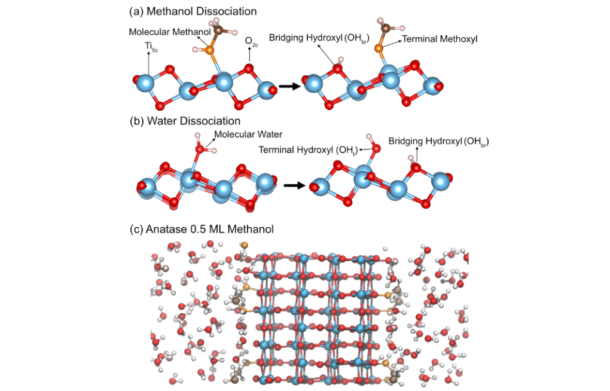
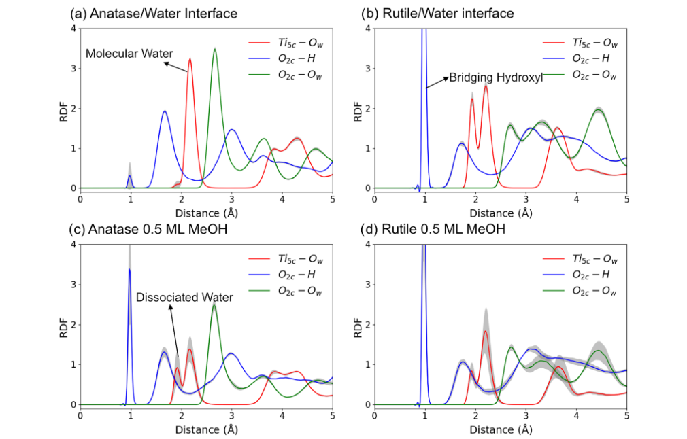
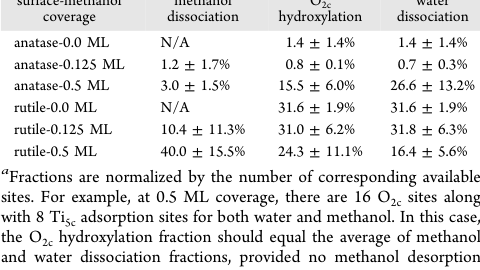
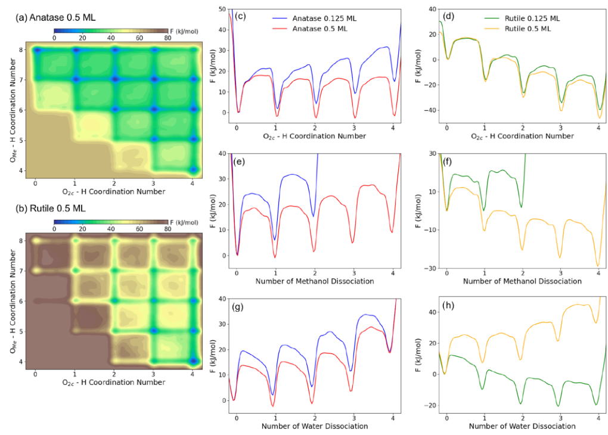
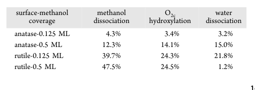
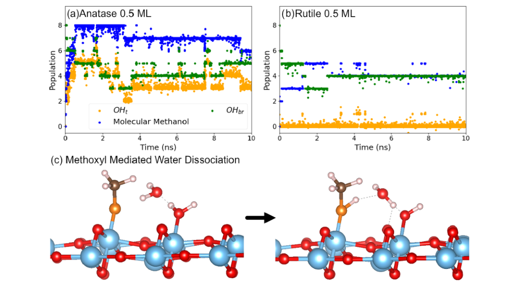
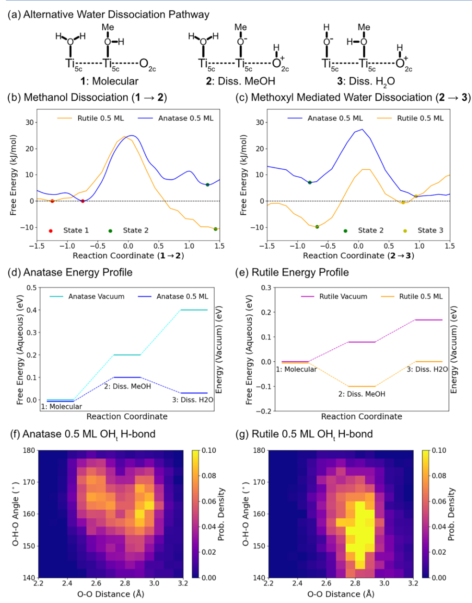

# Methanol at Water–TiO2 Interfaces: Free Energies of Water and Methanol Dissociation

## Metadata / 元数据

- **Journal / 期刊：** *ACS Catalysis*
- **Published / 发表：** 2026-01-16
- **DOI：** 10.1021/acscatal.5c07506
- **Zotero key：** 986TFCN4
- **Collection / 集合：** 02课题/MD
- **Source / 来源：** Zotero 本地可选取文本 PDF（11 页）。

## Why this paper / 为什么选这篇

**English:** This paper connects your TiO2(110)-water and MLFF interests through a concrete, testable mechanism: aqueous methanol changes not only coverage but the free-energy ordering and hydrogen source of dissociation pathways. It compares rutile and anatase with DPMD and metadynamics, so it is a useful template for separating a rare-event observation from a quantified free-energy claim. It also rotates the recent sequence away from AI-overview reading toward an interfacial TiO2 reaction study.

**中文：** 本文把 TiO2(110)-水界面与 MLFF 两条研究主线落实到一个可检验机制：水相甲醇不仅改变吸附覆盖度，也改变解离路径的自由能排序和氢来源。作者以 DPMD 和元动力学比较金红石与锐钛矿，因此它是区分“观察到稀有事件”和“以自由能定量证明机制”的实用范例。它也使近期阅读从 AI 综述轮换回界面 TiO2 反应研究。

## Terminology / 术语表

| English | 中文 | Note / 说明 |
|---|---|---|
| deep neural network potential (DP) | 深度神经网络势（DP） | 以第一性原理数据训练、用于分子动力学的机器学习原子间势。 |
| DP-based molecular dynamics (DPMD) | 基于 DP 的分子动力学（DPMD） | 采用本文深度势进行的长时间尺度界面模拟。 |
| metadynamics | 元动力学 | 通过历史依赖偏置采样稀有事件并重建自由能面的增强采样方法。 |
| free energy surface (FES) | 自由能面（FES） | 以反应坐标为变量描述热力学稳定性和势垒的表面。 |
| terminal hydroxyl (OHt) | 端位羟基（OHt） | 与一个表面 Ti 位点配位的羟基。 |
| bridging hydroxyl (OHbr) | 桥位羟基（OHbr） | 跨越相邻表面 Ti 位点的羟基。 |
| terminal methoxyl | 端位甲氧基 | 甲醇去质子化后吸附在表面 Ti 位点的物种。 |
| five-coordinated Ti (Ti5c) | 五配位 Ti（Ti5c） | TiO2 表面未饱和、可作为吸附位点的 Ti 原子。 |
| two-coordinated oxygen (O2c) | 二配位氧（O2c） | TiO2 表面可接受或转移质子的氧位点。 |
| hole scavenger | 空穴清除剂 | 可消耗光生空穴、降低复合并改变界面反应物来源的物种。 |

## Reading guide / 阅读提示

**English:** Follow the causal chain rather than treating methanol as a generic sacrificial reagent: establish the bare interfaces and RDF signatures (Fig. 2), compare the dissociation fractions (Tables 1-2), then test whether the metadynamics free-energy surfaces and the methoxyl-mediated route (Figs. 3-5) support the phase-dependent conclusion. Keep surface phase, coverage, collective variables, and the distinction between population and free energy explicit.

**中文：** 请沿着因果链阅读，而不要把甲醇笼统当作牺牲剂：先用图 2 建立裸界面和 RDF 特征，再比较表 1-2 的解离分数，最后检验元动力学自由能面以及甲氧基介导路径（图 3-5）是否支持相依赖结论。比较时要明确区分晶相、覆盖度、集体变量，以及“物种占比”和“自由能”的差别。

## Page / Section Index

- [p.1](#page-1)
- [p.2](#page-2)
- [p.3](#page-3)
- [p.4](#page-4)
- [p.5](#page-5)
- [p.6](#page-6)
- [p.7](#page-7)
- [p.8](#page-8)
- [p.9](#page-9)

## Related Reading / 延伸阅读

### Water dissociation at the water-rutile TiO2(110) interface from ab initio-based deep neural network simulations

**中文题名/说明：** 基于第一性原理深度神经网络模拟的水-金红石 TiO2(110) 界面水解离。

**Why this one / 为什么推荐：** This is the direct neat-water rutile baseline for judging what is genuinely introduced by methanol in the present study; it uses an ab initio-based neural-network potential for the same interfacial chemistry. / 它提供本文“甲醇引入何种变化”所需的纯水金红石基线，并以第一性原理神经网络势处理同类界面化学。

# Bilingual Reader / 逐段中英文对照

## Page 1

**Source:** p.1 S001

**Original:** ABSTRACT: Methanol adsorption on TiO2 surfaces has long been studied due to its role in enhancing photocatalytic hydrogen evolution, yet how it modulates surface chemistry under aqueous conditions remains little understood. Using molecular dynamics with an ab initio-based deep neural network potential, we find that methanol adsorption induces markedly different effects on the aqueous surfaces of anatase and rutile, the two common phases of TiO2. In anatase, methanol adsorption significantly enhances water dissociation, which is otherwise rare at the neat water interface. This enhancement arises from an alternative dissociation pathway mediated by surface-bound methoxyl groups. In contrast, methanol adsorption tends to suppress water dissociation on rutile, replacing it with thermodynamically favored methanol dissociation. Overall, methanol adsorption in an aqueous environment alters not only the availability of key reactive intermediates involved in hydrogen evolution but also the hydrogen source, which turns out to be primarily methanol on rutile, whereas both water and methanol are consumed on anatase. These results provide mechanistic insights into the coupled roles of organic adsorbates and water at photocatalytic interfaces, with implications on how methanol enhances the activity of H2 evolution. KEYWORDS: TiO2−Water Interface, Methanol Adsorption, Machine Learning Interatomic Potentials, Hole Scavengers, Photocatalytic Water Splitting ■INTRODUCTION

**中文:** 摘要：由于甲醇在增强光催化析氢方面的作用，长期以来人们一直在研究 TiO2 表面上的甲醇吸附，但它如何在水性条件下调节表面化学仍知之甚少。利用分子动力学和基于从头开始的深度神经网络势，我们发现甲醇吸附对锐钛矿和金红石（TiO2 的两种常见相）的水表面产生显着不同的影响。在锐钛矿中，甲醇吸附显着增强了水的解离，这在纯水界面上是罕见的。这种增强是由表面结合的甲氧基介导的替代解离途径引起的。相反，甲醇吸附往往会抑制金红石上的水解离，而代之以热力学上有利的甲醇解离。总体而言，水环境中的甲醇吸附不仅改变了参与析氢的关键反应中间体的可用性，而且改变了氢源，其主要是金红石上的甲醇，而锐钛矿上的水和甲醇都被消耗。这些结果为有机吸附物和水在光催化界面上的耦合作用提供了机制见解，并对甲醇如何增强析氢活性产生了影响。关键词：TiO2−水界面、甲醇吸附、机器学习原子间势、空穴清除剂、光催化水分解

**Source:** p.1 S002

**Original:** Photocatalytic water splitting continues to attract a great deal of attention as a promising route toward sustainable energy production.1−6 Among various photoactive semiconductors, titanium dioxide (TiO2) is considered a prototypical photocatalytic material due to its abundance, low toxicity, and environmental compatibility.7−11 Despite all these benefits, TiO2 suffers from an inherent low efficiency in the overall photocatalytic water splitting process. To address this limitation, hole scavengers, also known as sacrificial agents, are commonly employed to enhance hydrogen production.12−15 In particular, methanol serves as an ideal candidate for such applications, as it can potentially be produced from renewable or waste-derived carbon sources, e.g., from biomass or toxic residues, and at the same time provides an easy oxidation route to CO2 due to the absence of C−C bonds.16−19 Consequently, considerable effort has been devoted to understanding how methanol promotes hydrogen evolution, both experimentally and theoretically.20−28

**中文:** 光催化水分解作为实现可持续能源生产的一条有前途的途径，继续引起人们的广泛关注。1−6 在各种光活性​​半导体中，二氧化钛 (TiO2) 因其丰富、低毒性和环境兼容性而被认为是一种典型的光催化材料。7−11 尽管有所有这些优点，但 TiO2 在整个光催化水分解过程中仍然存在固有的低效率问题。为了解决这一限制，通常采用空穴清除剂（也称为牺牲剂）来提高氢气产量。12−15 特别是，甲醇是此类应用的理想候选者，因为它可以由可再生或废物衍生的碳源（例如生物质或有毒残留物）生产，同时由于不存在 C−C 键，因此提供了一条容易氧化为 CO2 的途径。 16−19 因此，人们投入了大量精力来了解甲醇如何促进氢气进化，无论是实验上还是理论上。20−28

**Source:** p.1 S003

**Original:** A key step in the promoting effect of methanol is its dissociation, as molecular methanol shows negligible photocatalytic activity prior to dissociation.29−31 Whether methanol spontaneously dissociates on TiO2 has been a topic of extensive debate, especially for the most common rutile

**中文:** 甲醇促进作用的一个关键步骤是其解离，因为分子甲醇在解离前表现出可忽略不计的光催化活性。29−31 甲醇是否在 TiO2 上自发解离一直是广泛争论的话题，特别是对于最常见的金红石

**Source:** p.1 S004

**Original:** (110) and anatase (101) surfaces.31−35 Questions also remain regarding the precise mechanism by which methanol enhances photocatalytic hydrogen production. It is widely agreed that water oxidation, a known bottleneck in water splitting,36 is replaced by methanol oxidation, which scavenges photogenerated holes more effectively and thus inhibits electron− hole recombination.12−14,37−41 The remaining electrons are then used to drive hydrogen production by reducing the protons of bridging hydroxyls.42,43 Although it is known that hydrogen can be generated through the consumption of either methanol or water, depending on the concentration of methanol and the TiO2 phase, understanding the underlying factors that govern this preference remains a challenge.14,44,45

**中文:** (110) 和锐钛矿 (101) 表面。31−35 关于甲醇增强光催化制氢的精确机制也仍然存在疑问。人们普遍认为，水氧化是水分解中的一个已知瓶颈，36 被甲醇氧化所取代，甲醇氧化可以更有效地清除光生空穴，从而抑制电子空穴复合。12−14,37−41 然后，剩余的电子通过减少桥接羟基的质子来驱动氢气产生。42,43 尽管众所周知，氢气可以通过消耗甲醇或水来产生，具体取决于甲醇和 TiO2 相的浓度，了解支配这种偏好的根本因素仍然是一个挑战。14,44,45

**Source:** p.1 S005

**Original:** In this work, we seek to shed light on the nature of methanol adsorption on TiO2 and its impact on the chemistry of aqueous TiO2 interfaces using ab initio-based simulations.46,47

**中文:** 在这项工作中，我们试图利用从头算的模拟来阐明甲醇在 TiO2 上吸附的性质及其对水性 TiO2 界面化学的影响。 46,47

**Source:** p.1 S006

**Original:** Previous computational studies of the adsorption and photo-

**中文:** 先前对吸附和光的计算研究

## Page 2

**Source:** p.2 S007

**Original:** chemistry of methanol on TiO2 were performed under vacuum conditions, which do not fully capture the aqueous environments relevant to photocatalysis.25,26,31,33 To remedy this, we investigated the interfacial dynamics under aqueous conditions with preadsorbed methanol molecules on the TiO2 surface. Although ab initio molecular dynamics (AIMD) is in principle well-suited for modeling such systems, its applicability is restricted by high computational cost. Here we construct instead an ab initio-based deep neural network interatomic potential (DP),48 which effectively extends the accessible time scale of molecular dynamics simulations by orders of magnitude without sacrificing accuracy.49−51 This allows direct observation of rare but critical events, such as water and methanol dissociation, which often occur on much longer time scales than those accessible by AIMD.52

**中文:** 甲醇在 TiO2 上的化学反应是在真空条件下进行的，这不能完全捕获与光催化相关的水环境。25,26,31,33 为了解决这个问题，我们研究了 TiO2 表面上预吸附的甲醇分子在水条件下的界面动力学。尽管从头算分子动力学（AIMD）原则上非常适合对此类系统进行建模，但其适用性受到高计算成本的限制。在这里，我们构建了一个从头开始的深度神经网络原子间势（DP），48，它有效地将分子动力学模拟的可访问时间尺度延长了几个数量级，而不牺牲准确性。49−51这允许直接观察罕见但关键的事件，例如水和甲醇解离，这些事件通常发生在比 AIMD 可访问的时间尺度更长的时间尺度上。52

**Source:** p.2 S008

**Original:** Our DP-based molecular dynamics (DPMD) simulations reveal important differences in the adsorption modes and reaction (dissociation) pathways of methanol at the aqueous rutile and anatase interfaces. While rutile favors dissociative adsorption of methanol along with suppressed water dissociation, anatase favors molecular methanol adsorption accompanied by enhanced water dissociation. Such contrasting behaviors are governed by distinct hydrogen-bonding environments of the adsorbates, arising from intrinsic structural differences between the anatase and rutile phases. Ultimately, this modulates the free-energy landscape of complex reaction pathways and shifts the populations of key photoactive

**中文:** 我们基于 DP 的分子动力学 (DPMD) 模拟揭示了甲醇在水性金红石和锐钛矿界面处的吸附模式和反应（解离）途径的重要差异。金红石有利于甲醇的解离吸附并抑制水解离，而锐钛矿则有利于分子甲醇吸附并增强水解离。这种对比行为是由锐钛矿相和金红石相之间的内在结构差异引起的吸附物的不同氢键环境控制的。最终，这调节了复杂反应途径的自由能景观，并改变了关键光活性的数量

**Source:** p.2 S009

**Original:** intermediate species. These results provide mechanistic insights into the evolution of hydrogen on the surfaces of TiO2 under complex aqueous conditions involving water and organic adsorbates. ■RESULTS AND DISCUSSION

**中文:** 中间物种。这些结果为在涉及水和有机吸附物的复杂含水条件下 TiO2 表面氢的演化提供了机理见解。结果与讨论

**Source:** p.2 S010

**Original:** Equilibrium DPMD Simulations. The forces and energies used to train the DP were generated using the SCAN functional, which is known to be accurate for both water and TiO2.53−55 Details of our computational approach, including training and validation of the DPs and DFT calculations, are presented in the Methods section (see below) and the Supporting Information (SI). The interfacial TiO2 systems considered in our study comprise anatase (101) and rutile (110) surfaces terminated with low (0.125 ML) or high (0.5 ML) coverages of adsorbed methanol, as well as bare surfaces, all interfaced with a 30 Å water slab. Both anatase (101) and rutile (110) surfaces are terminated with five-coordinated Ti atoms (Ti5c) and two-coordinated O atoms(O2c), as illustrated in Figure 1. The water and methanol molecules adsorb at the Ti5c sites and can dissociate by transferring a proton to a neighboring O2c site, resulting in terminal methoxyl or hydroxyl groups (OHt) together with bridging hydroxyls (O2cH or OHbr). Figure 1c shows a representative DPMD snapshot of the aqueous anatase (101) surface modified with 0.5 ML of methanol.

**中文:** 平衡 DPMD 模拟。用于训练 DP 的力和能量是使用 SCAN 函数生成的，已知该函数对于水和 TiO2.53−55 都是准确的。我们的计算方法的详细信息，包括 DP 和 DFT 计算的训练和验证，在方法部分（见下文）和支持信息 (SI) 中介绍。我们研究中考虑的界面 TiO2 系统包括锐钛矿 (101) 和金红石 (110) 表面，其末端有低 (0.125 ML) 或高 (0.5 ML) 吸附甲醇覆盖率，以及裸露表面，所有表面均与 30 Å 水板连接。锐钛矿 (101) 和金红石 (110) 表面均以五配位 Ti 原子 (Ti5c) 和二配位 O 原子 (O2c) 封端，如图 1 所示。水和甲醇分子吸附在 Ti5c 位点上，并可以通过将质子转移到邻近的 O2c 位点来解离，从而形成末端甲氧基或羟基 (OHt) 以及桥接羟基 (O2cH 或哦br）。图 1c 显示了用 0.5 毫升甲醇修饰的水性锐钛矿 (101) 表面的代表性 DPMD 快照。

### Fig. 1. 图 1. 甲醇 (a) 和水 (b) 在水性锐钛矿 (101) 界面处的典型分子和解离吸附构型的球棒模型

**Placed near:** p.2 S010

**Source:** p.2 C001

**Original caption:** Figure 1. Ball and stick models of typical molecular and dissociated adsorption configurations of methanol (a) and water (b) at the aqueous anatase (101) interface. Undercoordinated surface Ti5c and O2c sites are marked with arrows. Water and methanol adsorb on the Ti5c sites, with protons transferred to the O2c sites upon dissociation. Key species include terminal methoxyls, terminal hydroxyls (OHt), and bridging hydroxyls (OHbr or O2cH) arising from either water or methanol dissociation. (c) Representative snapshot from DPMD simulations of the aqueous anatase (101) surface covered with 0.5 ML methanol.

**中文图注:** 图 1. 甲醇 (a) 和水 (b) 在水性锐钛矿 (101) 界面处的典型分子和解离吸附构型的球棒模型。欠配位表面 Ti5c 和 O2c 位点用箭头标记。水和甲醇吸附在 Ti5c 位点上，解离后质子转移到 O2c 位点。关键物质包括末端甲氧基、末端羟基 (OHt) 和由水或甲醇解离产生的桥接羟基（OHbr 或 O2cH）。 (c) DPMD 模拟中覆盖有 0.5 ML 甲醇的水性锐钛矿 (101) 表面的代表性快照。

**Reading note / 阅读提示：** Interpret this visual together with the nearby text and its stated simulation conditions; it is placed at the first substantive extracted mention. / 请结合邻近正文和明确的模拟条件解读此图表；它已放在首次实质讨论处。

## Page 3

**Source:** p.3 S011

**Original:** The equilibrium structures of the interfacial systems were determined by averaging the results of three independent DPMD trajectories of 10 ns duration each. Figure 2a−d show the radial distribution functions (RDFs) of Ti5c−water oxygen (Ow), O2c−H, and O2c−Ow pairs for the aqueous interfaces of bare and methanol-covered (0.5 ML) anatase (101) and rutile (110), with shaded regions indicating the standard deviation among the three DPs. As observed in previous studies, the bare anatase−water interface seldom exhibits water dissociation, and most water molecules remain in the molecular form (peak at ∼2.1 Å in the red curve in Figure 2a).49 In contrast, the rutile−water interface is significantly more reactive, showing a pronounced dissociated water (OHt) peak at 1.9 Å and a hydroxylated O2c (OHbr) peak at 1.0 Å.50 This behavior is quantified by the fraction of water dissociation, calculated as the number of OHt relative to the number of available surface Ti5c sites for water adsorption, averaged over three equilibrium DPMD trajectories. As shown in Table 1, rutile clearly exhibits a much higher water dissociation fraction (31.6%) compared to anatase (1.4%), both values showing reasonable agreement with previous work. Having established the baseline behavior of water dissociation at bare TiO2−water interfaces, we next focus on the structural changes induced by adsorbed methanol. For anatase, the RDFs show a pronounced increase in both the OHbr and the OHt peaks (Figure 2c), which are barely visible in the absence of methanol. This indicates a significant enhancement

**中文:** 界面系统的平衡结构是通过对三个独立的 DPMD 轨迹（每个轨迹持续时间为 10 ns）的结果进行平均来确定的。图2a-d显示了裸露和甲醇覆盖（0.5 ML）锐钛矿（101）和金红石（110）水界面的Ti5c-水氧（Ow）、O2c-H和O2c-Ow对的径向分布函数（RDF），阴影区域表示三个DP之间的标准偏差。正如之前研究中观察到的，裸露的锐钛矿-水界面很少表现出水解离，大多数水分子仍以分子形式存在（图 2a 中红色曲线中~2.1 Å 处的峰值）。49 相反，金红石-水界面的反应性明显更高，在 1.9 Å 处显示出明显的解离水 (OHt) 峰，在 1.0 Å 处显示羟基化 O2c (OHbr) 峰。50行为通过水离解分数来量化，计算为 OHt 数量相对于水吸附的可用表面 Ti5c 位点数量，在三个平衡 DPMD 轨迹上取平均值。如表 1 所示，与锐钛矿 (1.4%) 相比，金红石明显表现出更高的水离解分数 (31.6%)，这两个值都与之前的工作相当一致。在建立了裸露的 TiO2-水界面处水离解的基线行为之后，我们接下来关注由吸附的甲醇引起的结构变化。对于锐钛矿，RDF 显示 OHbr 和 OHt 峰均显着增加（图 2c），在没有甲醇的情况下几乎看不见。这表明显着增强

**Source:** p.3 S012

**Original:** surface-methanol coverage methanol dissociation O2c hydroxylation water dissociation

**中文:** 表面甲醇覆盖 甲醇解离 O2c 羟基化 水解离

**Source:** p.3 S013

**Original:** anatase-0.0 ML N/A 1.4 ± 1.4% 1.4 ± 1.4% anatase-0.125 ML 1.2 ± 1.7% 0.8 ± 0.1% 0.7 ± 0.3% anatase-0.5 ML 3.0 ± 1.5% 15.5 ± 6.0% 26.6 ± 13.2% rutile-0.0 ML N/A 31.6 ± 1.9% 31.6 ± 1.9% rutile-0.125 ML 10.4 ± 11.3% 31.0 ± 6.2% 31.8 ± 6.3% rutile-0.5 ML 40.0 ± 15.5% 24.3 ± 11.1% 16.4 ± 5.6% aFractions are normalized by the number of corresponding available sites. For example, at 0.5 ML coverage, there are 16 O2c sites along with 8 Ti5c adsorption sites for both water and methanol. In this case, the O2c hydroxylation fraction should equal the average of methanol and water dissociation fractions, provided no methanol desorption occurs.

**中文:** 锐钛矿-0.0 ML N/A 1.4 ± 1.4% 1.4 ± 1.4% 锐钛矿-0.125 ML 1.2 ± 1.7% 0.8 ± 0.1% 0.7 ± 0.3% 锐钛矿-0.5 ML 3.0 ± 1.5% 15.5 ± 6.0% 26.6 ± 13.2%金红石-0.0 ML N/A 31.6 ± 1.9% 31.6 ± 1.9% 金红石-0.125 ML 10.4 ± 11.3% 31.0 ± 6.2% 31.8 ± 6.3% 金红石-0.5 ML 40.0 ± 15.5% 24.3 ± 11.1% 16.4 ± 5.6% aFractions 通过相应可用站点的数量进行标准化。例如，在 0.5 ML 覆盖范围内，有 16 个 O2c 位点以及 8 个 Ti5c 水和甲醇吸附位点。在这种情况下，如果没有发生甲醇解吸，O2c 羟基化分数应等于甲醇和水解离分数的平均值。

**Source:** p.3 S014

**Original:** in water dissociation. As shown in Table 1, high methanol coverage induces an increase in water dissociation and O2c hydroxylation fractions, while the methanol dissociation fraction remains relatively small. These results suggest that water likely serves as one of the main sources of OHbr and that the adsorption of methanol promotes the dissociation of water, nearly approaching the level seen in rutile. This enhancement is expected to facilitate hydrogen evolution, as OHbr serves as a key intermediate in the process.

**中文:** 在水离解中。如表 1 所示，高甲醇覆盖率导致水离解和 O2c 羟基化分数增加，而甲醇离解分数仍然相对较小。这些结果表明，水可能是 OHbr 的主要来源之一，并且甲醇的吸附促进了水的离解，几乎接近金红石中的水平。这种增强预计将促进氢的析出，因为 OHbr 是该过程中的关键中间体。

### Fig. 2. 图 2. Ti5c−Ow、O2c−H 和 O2c−Ow 对在裸锐钛矿−水 (a) 和金红石−水 (b) 界面以及甲醇 (0.5 ML) 覆盖的锐钛矿−水 (c)

**Placed near:** p.3 S014

**Source:** p.3 C002

**Original caption:** Figure 2. Radial distribution functions (RDFs) of Ti5c−Ow, O2c−H, and O2c−Ow pairs at the bare anatase−water (a) and rutile−water (b) interfaces and at the methanol (0.5 ML) covered anatase−water (c) and rutile−water (d) interfaces. The shaded regions indicate standard deviations across the three trained DPs. The peak at 1.9 Å in the red curves corresponds to dissociated water (OHt), while the peak at 2.1 Å represents adsorbed molecular water. In the blue curves, the peak at 1 Å corresponds to hydroxylated O2c sites (OHbr), formed via either water or methanol dissociation. From the RDF profiles, anatase shows an increase in water dissociation at high coverage, whereas rutile exhibits a noticeable decrease while largely retaining the OHbr peak.

**中文图注:** 图 2. Ti5c−Ow、O2c−H 和 O2c−Ow 对在裸锐钛矿−水 (a) 和金红石−水 (b) 界面以及甲醇 (0.5 ML) 覆盖的锐钛矿−水 (c) 和金红石−水 (d) 界面处的径向分布函数 (RDF)。阴影区域表示三个经过训练的 DP 的标准差。红色曲线中 1.9 Å 处的峰对应于解离水 (OHt)，而 2.1 Å 处的峰代表吸附分子水。在蓝色曲线中，1 Å 处的峰对应于通过水或甲醇解离形成的羟基化 O2c 位点 (OHbr)。从 RDF 曲线来看，锐钛矿在高覆盖度下显示出水离解增加，而金红石则显示出明显的减少，同时很大程度上保留了 OHbr 峰。

**Reading note / 阅读提示：** Interpret this visual together with the nearby text and its stated simulation conditions; it is placed at the first substantive extracted mention. / 请结合邻近正文和明确的模拟条件解读此图表；它已放在首次实质讨论处。

### Table 1. 表 1. 根据三个独立平衡 DPMD 轨迹计算的甲醇和水解离和 O2c 羟基化的平均分数 a

**Placed near:** p.3 S014

**Source:** p.3 C003

**Original caption:** Table 1. Average Fractions of Methanol and Water Dissociation and O2c Hydroxylation Calculated from Three Independent Equilibrium DPMD Trajectoriesa

**中文图注:** 表 1. 根据三个独立平衡 DPMD 轨迹计算的甲醇和水解离和 O2c 羟基化的平均分数 a

**Reading note / 阅读提示：** Interpret this visual together with the nearby text and its stated simulation conditions; it is placed at the first substantive extracted mention. / 请结合邻近正文和明确的模拟条件解读此图表；它已放在首次实质讨论处。

## Page 4

**Source:** p.4 S015

**Original:** The 0.5 ML methanol-covered rutile−water interface, on the other hand, shows quite different behavior (Figure 2d). While the OHbr peak looks largely unchanged, the relative intensity of the molecular and dissociated water peaks changes in a way that indicates diminished water dissociation. As shown in Table 1, the water dissociation fraction in fact decreases substantially, while the change in the O2c hydroxylation fraction is rather modest. The dissociation fraction of methanol is substantially higher than that of water at 0.5 ML coverage, indicating a shift in the source of O2c hydroxylation from water to methanol. This suggests that, contrary to anatase, methanol is likely to be the dominant source of hydrogen production on rutile. For the rutile surface, we also observed desorption of approximately 50% of the initially adsorbed methanol during our 10 ns simulations, leading to the formation of watersolvated species (Figures S7−S8 in SI). Consequently, the reported high-coverage rutile system actually represents a system with intermediate methanol coverage. To confirm these results, we also calculated the free energy profiles of methanol adsorption/desorption on/from anatase and rutile, which are presented in the SI.56 As expected, the free energy of methanol

**中文:** 另一方面，0.5 ML 甲醇覆盖的金红石-水界面显示出完全不同的行为（图 2d）。虽然 OHbr 峰看起来基本没有变化，但分子和离解水峰的相对强度发生变化，表明水离解减弱。如表 1 所示，水解离分数实际上大幅下降，而 O2c 羟基化分数的变化相当适度。在 0.5 ML 覆盖范围内，甲醇的解离分数明显高于水的解离分数，表明 O2c 羟基化的来源从水转移到甲醇。这表明，与锐钛矿相反，甲醇可能是金红石制氢的主要来源。对于金红石表面，我们还在 10 ns 模拟期间观察到约 50% 的初始吸附甲醇解吸，导致水溶剂化物质的形成（SI 中的图 S7−S8）。因此，所报道的高覆盖率金红石系统实际上代表了具有中等甲醇覆盖率的系统。为了证实这些结果，我们还计算了锐钛矿和金红石上/从锐钛矿和金红石上吸附/解吸甲醇的自由能曲线，这些曲线在 SI.56 中呈现。 正如预期的那样，甲醇的自由能

**Source:** p.4 S016

**Original:** desorption is significantly smaller for rutile, accompanied by lower energy barriers, which explains the prominent desorption events observed in the DPMD simulations. Free Energies of Water and Methanol Dissociation. To substantiate the trends shown in Table 1, we further investigated the free energy surface of water and methanol dissociation at the anatase and rutile interfaces using metadynamics with three collective variables (CVs): O2c−H, methoxyl oxygen (OMe)−H, and Ow−H coordination numbers (see SI for details). These CVs represent the populations of OHbr, dissociated methanol, and dissociated water, allowing us to track all dissociation reactions throughout the metadynamics. Two-dimensional projections of the free energy surfaces along the O2c−H and OMe−H coordination number axes are shown in Figure 3a,b for the 0.5 ML methanol coverage systems. The blue regions in the plot represent energetically favorable coordination states, with darker hues indicating lower free energy. Although the Ow−H coordination number is not explicitly shown, its contribution can be inferred by tracking the difference between hydroxylated O2c sites and dissociated methanol counts. Briefly, points along the diagonal

**中文:** 金红石的解吸明显较小，并且能垒较低，这解释了 DPMD 模拟中观察到的显着解吸事件。水和甲醇解离的自由能。为了证实表1所示的趋势，我们使用具有三个集体变量（CV）的元动力学进一步研究了锐钛矿和金红石界面处的水和甲醇解离的自由能表面：O2c−H、甲氧基氧（OMe）−H和Ow−H配位数（详细信息参见SI）。这些 CV 代表 OHbr、解离甲醇和解离水的群体，使我们能够跟踪整个元动力学过程中的所有解离反应。 0.5 ML 甲醇覆盖系统的自由能表面沿 O2c−H 和 OMe−H 配位数轴的二维投影如图 3a、b 所示。图中的蓝色区域代表能量上有利的配位状态，较深的色调表示较低的自由能。尽管 Ow−H 配位数没有明确显示，但可以通过跟踪羟基化 O2c 位点和解离甲醇计数之间的差异来推断其贡献。简而言之，沿对角线的点

### Fig. 3. 图 3. 高覆盖率锐钛矿 (a) 和金红石 (b) 系统元动力学模拟的自由能表面 (FES) 的二维投影，投影到甲氧基氧 (OMe)−H 和 O2c−H 配位数

**Placed near:** p.4 S016

**Source:** p.4 C004

**Original caption:** Figure 3. Two-dimensional projections of the free energy surfaces (FES) from the metadynamics simulations of the high-coverage anatase (a) and rutile (b) systems, projected onto the methoxyl oxygen (OMe)−H and O2c−H coordination number CVs. The colors represent free energy values, with darker blue indicating lower energy. Anatase primarily populates off-diagonal states, suggesting prominent water dissociation. Rutile, on the other hand, predominantly populates diagonal states, where O2c hydroxylation is driven purely by methanol dissociation. From the same metadynamics calculations, one-dimensional free energy projections for O2c hydroxylation (c, d), methanol dissociation (e, f), and water dissociation (g, h) are presented. On anatase, 0.5 ML methanol coverage lowers the free energy of all three processes, suggesting an overall enhancement in its reaction dynamics. On rutile, methanol dissociation becomes more favorable, while water dissociation is suppressed. The O2c hydroxylation profile, however, remains largely unaffected by methanol coverage.

**中文图注:** 图 3. 高覆盖率锐钛矿 (a) 和金红石 (b) 系统元动力学模拟的自由能表面 (FES) 的二维投影，投影到甲氧基氧 (OMe)−H 和 O2c−H 配位数 CV 上。颜色代表自由能值，深蓝色表示能量较低。锐钛矿主要占据非对角态，表明水解离明显。另一方面，金红石主要占据对角态，其中 O2c 羟基化纯粹由甲醇解离驱动。根据相同的元动力学计算，提出了 O2c 羟基化 (c, d)、甲醇解离 (e, f) 和水解离 (g, h) 的一维自由能投影。对于锐钛矿，0.5 ML 甲醇覆盖降低了所有三个过程的自由能，表明其反应动力学整体增强。在金红石上，甲醇解离变得更加有利，而水解离受到抑制。然而，O2c 羟基化曲线在很大程度上不受甲醇覆盖的影响。

**Reading note / 阅读提示：** Interpret this visual together with the nearby text and its stated simulation conditions; it is placed at the first substantive extracted mention. / 请结合邻近正文和明确的模拟条件解读此图表；它已放在首次实质讨论处。

## Page 5

**Source:** p.5 S017

**Original:** correspond to configurations in which the OHbr groups originate entirely from the dissociation of methanol, while off-diagonal regions reflect a greater contribution from water dissociation. Both anatase and rutile exhibit prominent O2c hydroxylation at high methanol coverage, but with distinct trends. Rutile predominantly populates a diagonal state with four dissociated methanol, suggesting that O2c hydroxylation is primarily driven by methanol dissociation. In contrast, anatase favors off-diagonal regions, indicating a greater contribution from water dissociation. It is also instructive to project the free energy surfaces onto one-dimensional profiles for each CV and compare the results for low and high methanol coverages. Figure 3c,d show the free energy as a function of sequential O2c hydroxylation, in which the coordination number corresponds to the number of formed OHbr species. At low methanol coverage, the system should reproduce the behavior seen at the bare water interface, as 0.125 ML does not induce meaningful changes in dissociation fractions. Under this condition, we see that O2c hydroxylation is disfavored in anatase but strongly favored in rutile, consistent with the results in Table 1. At 0.5 ML coverage, the free energy curve for anatase shifts downward, indicating enhanced O2c hydroxylation. In contrast, rutile shows minimal change between low and high methanol coverage, supporting the observation that O2c hydroxylation in rutile is largely independent of methanol coverage. Figure 3e,3f show the free energy as a function of the dissociated methanol count. In both anatase and rutile, methanol dissociation is more favorable at high coverage. This effect is significantly more pronounced in rutile, as evidenced by the substantial decrease in its free energy profile. In Figure 3g,3h, a very different trend emerges for the dissociation of water: while high methanol coverage enhances the dissociation of water in anatase, this is strongly suppressed in rutile. From these free energy profiles, we can obtain an additional independent estimate of the fractions introduced in Table 1. This is given by

**中文:** 对应于其中 OHbr 基团完全源自甲醇解离的构型，而非对角线区域反映了水解离的更大贡献。锐钛矿和金红石在高甲醇覆盖度下都表现出显着的 O2c 羟基化，但趋势不同。金红石主要由四个解离的甲醇填充对角态，这表明 O2c 羟基化主要由甲醇解离驱动。相反，锐钛矿偏向于非对角线区域，表明水离解的贡献更大。将自由能表面投影到每个 CV 的一维轮廓上并比较低和高甲醇覆盖率的结果也很有启发性。图3c、d显示了自由能与连续O2c羟基化的函数关系，其中配位数对应于形成的OHbr物质的数量。在低甲醇覆盖率下，系统应该重现在裸水界面处看到的行为，因为 0.125 ML 不会引起解离分数的有意义的变化。在此条件下，我们发现 O2c 羟基化在锐钛矿中不受欢迎，但在金红石中强烈受欢迎，与表 1 中的结果一致。在 0.5 ML 覆盖度下，锐钛矿的自由能曲线向下移动，表明 O2c 羟基化增强。相比之下，金红石在低和高甲醇覆盖度之间显示出最小的变化，支持金红石中的 O2c 羟基化很大程度上独立于甲醇覆盖度的观察结果。图 3e、3f 显示了自由能与解离甲醇计数的函数关系。在锐钛矿和金红石中，甲醇解离在高覆盖率下更有利。这种效应在金红石中更为明显，其自由能曲线的大幅下降就证明了这一点。在图 3g,3h 中，水的离解出现了一种非常不同的趋势：虽然高甲醇覆盖率增强了锐钛矿中水的离解，但在金红石中却受到强烈抑制。从这些自由能分布中，我们可以获得表 1 中引入的分数的额外独立估计。这由下式给出

**Source:** p.5 S018

**Original:** A average fraction exp( )

**中文:** 平均分数 exp( )

**Source:** p.5 S019

**Original:** f A

**中文:** fA

**Source:** p.5 S020

**Original:** i i i

**中文:** 我我我

**Source:** p.5 S021

**Original:** j j =

**中文:** j j =

**Source:** p.5 S022

**Original:** exp( )

**中文:** 指数（）

**Source:** p.5 S023

**Original:** (1)

**中文:** (1)

**Source:** p.5 S024

**Original:** where the summation is taken over all states i, ranging from 0 to 4, which represent the observed numbers of O2cH, methanol dissociations and water dissociations, with f i and Ai representing the fraction and free energy of state i. Due to the upper bounds imposed on the coordination number CVs, the resulting fractions may be underestimated. However, as shown in Table 2, these values generally agree well with those derived from the equilibrium simulations and provide a more robust estimate that is less susceptible to sampling limitations. Our metadynamics simulations confirm the trend that 0.5 ML methanol coverage enhances methanol dissociation, O2c

**中文:** 其中对所有状态 i 求和，范围从 0 到 4，代表观察到的 O2cH、甲醇解离和水解离的数量，其中 f i 和 Ai 代表状态 i 的分数和自由能。由于配位数 CV 存在上限，所得分数可能会被低估。然而，如表 2 所示，这些值通常与平衡模拟得出的值非常吻合，并且提供了更稳健的估计，不易受到抽样限制的影响。我们的元动力学模拟证实了 0.5 ML 甲醇覆盖增强甲醇解离、O2c 的趋势

**Source:** p.5 S025

**Original:** surface-methanol coverage methanol dissociation O2c hydroxylation water dissociation

**中文:** 表面甲醇覆盖 甲醇解离 O2c 羟基化 水解离

**Source:** p.5 S026

**Original:** anatase-0.125 ML 4.3% 3.4% 3.2% anatase-0.5 ML 12.3% 14.1% 15.0% rutile-0.125 ML 39.7% 24.3% 21.8% rutile-0.5 ML 47.5% 24.5% 1.2%

**中文:** 锐钛矿-0.125 ML 4.3% 3.4% 3.2% 锐钛矿-0.5 ML 12.3% 14.1% 15.0% 金红石-0.125 ML 39.7% 24.3% 21.8% 金红石-0.5 ML 47.5% 24.5% 1.2%

**Source:** p.5 S027

**Original:** hydroxylation, and water dissociation in anatase. For rutile, they confirm that water dissociation is strongly suppressed at 0.5 ML, indicating a change from water to methanol as the dominant source of O2c hydroxylation. It should be noted that this effect is even more pronounced in metadynamics simulations, where methanol desorption is prohibited, resulting in a water dissociation fraction of less than 2%. Because these results provide a clear trend in interfacial dissociation dynamics for both anatase and rutile, and show good agreement with the DPMD simulations, they serve as the basis for all discussions throughout this paper. Understanding the Difference between Anatase and Rutile. To gain insight into the different behaviors of anatase and rutile in response to methanol adsorption, we performed equilibrium DPMD simulations starting from configurations in which all methanol molecules were initially dissociated while all water remained in the molecular state. We then monitored the populations of OHt, OHbr, and molecular methanol along the trajectory, as shown in Figure 4a,b. In anatase, all terminal methoxyls were converted to molecular methanol within 1 ns, accompanied by a marked increase in the number of OHt, indicating a rapid dissociation of adsorbed water. The conversion of methoxyl groups to methanol occurred by proton transfer either from OHbr sites or from adjacent water molecules. Based on the dynamics in Figure 4a, both pathways appear equally favorable, suggesting that methanol adsorption creates a new channel for water dissociation, ultimately increasing its fraction. This behavior was also confirmed by AIMD simulations, which demonstrated the same water dissociation channel mediated by methoxyl groups on a similar time scale (see details in the SI). A quite different behavior is observed for rutile, which exhibits a conversion of ∼50% methoxyl groups to methanol on a time scale of approximately 2 ns (Figure 4b). This transformation occurs exclusively through recombination with OHbr, while the alternative water dissociation pathway appears to be strongly disfavored. Considering that methanol desorption was not observed in the particular DPMD trajectory shown in Figure 4b, the absence of OHt species suggests that a true 0.5 ML methanol coverage environment suppresses water dissociation. This also implies that the relatively high water dissociation fraction reported in Table 1 is likely a consequence of the desorption of methanol. In other words, OHbr formation at high coverage of methanol is driven mainly by dissociation of methanol rather than dissociation of water. The above results indicate that in anatase, methanol adsorption introduces a new water dissociation pathway mediated by methoxyl groups, as illustrated in Figure 5a. Here, 1 is the initial state, where both water and methanol are adsorbed in molecular form at adjacent Ti5c sites, 2 is the intermediate state where methanol is dissociated to form a terminal methoxyl and OHbr, and 3 is the final state where the methoxyl has captured a proton from the adjacent water molecule resulting in OHt, OHbr, and molecular methanol. While water dissociation in the absence of methanol adsorption proceeds directly from 1 to 3, our simulations suggest that the same process may instead be mediated by 2, i.e., 1 →2 →3. Similar mechanisms have been proposed in past experimental studies, commonly referred to as the indirect oxidation pathway, in which redox reactions occur across adsorbates rather than directly from TiO2.14,44 To quantify the free energies associated with methanol dissociation (1 →2)

**中文:** 锐钛矿中的羟基化和水解离。对于金红石，他们证实水解离在 0.5 ML 时受到强烈抑制，表明从水变为甲醇作为 O2c 羟基化的主要来源。应该指出的是，这种效应在元动力学模拟中更为明显，其中甲醇解吸被​​禁止，导致水解离分数低于 2%。由于这些结果提供了锐钛矿和金红石界面解离动力学的明显趋势，并且与 DPMD 模拟表现出良好的一致性，因此它们成为本文所有讨论的基础。了解锐钛矿和金红石之间的区别。为了深入了解锐钛矿和金红石对甲醇吸附的不同行为，我们从所有甲醇分子最初解离而所有水保持分子状态的配置开始进行平衡 DPMD 模拟。然后，我们沿着轨迹监测 OHt、OHbr 和分子甲醇的数量，如图 4a、b 所示。在锐钛矿中，所有末端甲氧基在 1 ns 内转化为分子甲醇，同时 OHt 数量显着增加，表明吸附水快速解离。甲氧基向甲醇的转化是通过来自 OHbr 位点或相邻水分子的质子转移而发生的。根据图 4a 中的动力学，两种途径似乎同样有利，这表明甲醇吸附为水解离创造了新的通道，最终增加了其分数。 AIMD 模拟也证实了这种行为，该模拟证明了在相似的时间尺度上由甲氧基介导的相同的水解离通道（参见 SI 中的详细信息）。金红石观察到了一种完全不同的行为，它在大约 2 ns 的时间尺度内表现出 ~50% 的甲氧基转化为甲醇（图 4b）。这种转变仅通过与 OHbr 重组而发生，而替代的水解离途径似乎是强烈不受欢迎的。考虑到在图 4b 所示的特定 DPMD 轨迹中未观察到甲醇解吸，OHt 物质的缺失表明真正的 0.5 ML 甲醇覆盖环境会抑制水解离。这也意味着表 1 中报告的相对较高的水解离分数可能是甲醇解吸的结果。换句话说，在甲醇的高覆盖度下，OHbr 的形成主要是由甲醇的解离而不是水的解离驱动的。上述结果表明，在锐钛矿中，甲醇吸附引入了由甲氧基介导的新的水解离途径，如图5a所示。这里，1是初始状态，其中水和甲醇都以分子形式吸附在相邻的Ti5c位点上，2是中间状态，其中甲醇解离形成末端甲氧基和OHbr，3是最终状态，其中甲氧基从相邻的水分子中捕获质子，产生OHt、OHbr和分子甲醇。虽然在没有甲醇吸附的情况下水解离直接从 1 进行到 3，但我们的模拟表明相同的过程可能由 2 介导，即 1 →2 →3。过去的实验研究中已经提出了类似的机制，通常称为间接氧化途径，其中氧化还原反应发生在吸附物上，而不是直接在 TiO2 上发生。14,44 量化与甲醇解离相关的自由能 (1 →2)

### Table 2. 表 2. 根据 Metadynamics 自由能计算的甲醇和水解离和 O2c 羟基化的平均分数

**Placed near:** p.5 S027

**Source:** p.5 C005

**Original caption:** Table 2. Average Fractions of Methanol and Water Dissociation and O2c Hydroxylation Calculated from Metadynamics Free Energy

**中文图注:** 表 2. 根据 Metadynamics 自由能计算的甲醇和水解离和 O2c 羟基化的平均分数

**Reading note / 阅读提示：** Interpret this visual together with the nearby text and its stated simulation conditions; it is placed at the first substantive extracted mention. / 请结合邻近正文和明确的模拟条件解读此图表；它已放在首次实质讨论处。

## Page 6

**Source:** p.6 S028

**Original:** and methoxyl-mediated water dissociation (2 →3) under aqueous conditions, we performed umbrella sampling and metadynamics simulations with methodological details provided in the SI. The free energy profiles of the two individual reactions are shown in Figure 5b,c, in which the reactions proceed from negative to positive reaction coordinate values. We note that these profiles represent a single dissociation reaction and would likely shift in the presence of multiple coadsorbed dissociated species as indicated in Figure 3. For methanol dissociation (1 →2), it appears that the process is thermodynamically disfavored in anatase, with a positive change in free energy of approximately 7 kJ mol−1, while dissociated methanol is more stable by approximately 10 kJ mol−1 in rutile. On the other hand, methoxyl-mediated water dissociation (2 →3) shows the opposite trend: the reaction is favored in anatase but not in rutile. These results are summarized in Figure 5d,e, which show the relative free energies of states 1, 2 and 3 at the aqueous anatase and rutile interfaces, and for comparison, under vacuum conditions with a single water and methanol coadsorbed on one surface. Clearly, both water and methanol dissociation processes are energetically uphill in vacuum since the formation of chargeseparated species is unfavorable in the absence of solvent stabilization. Although all dissociated states are stabilized in an aqueous environment, state 3 exhibits much greater solvent stabilization in anatase, whereas the effect is rather modest in rutile. To clarify the origin of this difference, we analyzed the hydrogen-bonding (H-bonding) environment of the charged

**中文:** 和甲氧基介导的水解离 (2 →3) 在水性条件下，我们使用 SI 中提供的方法细节进行了伞式采样和元动力学模拟。两个单独反应的自由能曲线如图 5b、c 所示，其中反应从负反应坐标值变为正反应坐标值。我们注意到，这些曲线代表单个解离反应，并且在存在多个共吸附解离物质的情况下可能会发生变化，如图 3 所示。对于甲醇解离 (1 →2)，该过程在锐钛矿中似乎在热力学上不利，自由能发生约 7 kJ mol−1 的正变化，而在金红石中解离的甲醇更稳定，约 10 kJ mol−1。另一方面，甲氧基介导的水解离（2→3）显示出相反的趋势：该反应在锐钛矿中有利，但在金红石中则不然。这些结果总结在图 5d、e 中，其中显示了水性锐钛矿和金红石界面处的状态 1、2 和 3 的相对自由能，并且为了进行比较，在真空条件下，单一水和甲醇共吸附在一个表面上。显然，水和甲醇的解离过程在真空中都非常剧烈，因为在没有溶剂稳定的情况下不利于电荷分离物质的形成。尽管所有解离态在水性环境中都稳定，但状态 3 在锐钛矿中表现出更高的溶剂稳定性，而在金红石中效果相当有限。为了阐明这种差异的根源，我们分析了带电体的氢键（H-bonding）环境。

**Source:** p.6 S029

**Original:** adsorbate in state 3, namely OHt. An H-bond is defined as having donor (D)-acceptor (A) distances shorter than 3.5 Å and D-H-A angles larger than 120°. To sample configurations, we performed 3 ns of equilibrium DPMD with the system restrained at the free energy minimum of state 3, and collected H-bonding statistics for OHt species. Subsequently, these data were binned into histograms shown in Figure 5f,5g. Here, shorter O−H distances and larger O−H···O angles indicate stronger H-bonds. From the histograms, it appears that anatase provides a significantly more favorable H-bonding environment for OHt, consequently lowering the free energy of state 3. In fact, anatase exhibits longer Ti5c−Ti5c distances,57 allowing solvent molecules to approach charged adsorbates such as OHt more closely and form stronger H-bonds. In rutile where Ti5c− Ti5c distances are shorter,57 solvent molecules experience greater steric hindrance from the CH3 groups of adsorbed methanol, which limits their ability to form favorable H-bonds with adsorbates and simultaneously causes significant disruptions of the H-bond network near the surface. These solvation effects, coupled with the energetics of charge separation associated with dissociation, form the basis of the free energy profile shown in Figure 5. Overall, the free energy profiles in Figures 5d,5e provide valuable information on the reasons why the two phases of TiO2 exhibit markedly different behaviors under methanol adsorption. In anatase, the methoxyl groups are thermodynamically unstable. As a result, once formed, they rapidly return to the molecular state by abstracting a proton from either OHbr or adsorbed water. This introduces an additional channel for water dissociation, which ultimately increases its

**中文:** 吸附物处于状态 3，即 OHt。 H键定义为供体(D)-受体(A)距离小于3.5 Å且D-H-A角大于120°。为了对配置进行采样，我们执行了 3 ns 的平衡 DPMD，系统限制在状态 3 的自由能最小值，并收集 OHt 物质的氢键统计数据。随后，这些数据被合并成直方图，如图 5f、5g 所示。这里，较短的 O−H 距离和较大的 O−H…O 角度表明氢键较强。从直方图中可以看出，锐钛矿为 OHt 提供了明显更有利的氢键环境，从而降低了态 3 的自由能。事实上，锐钛矿表现出更长的 Ti5c−Ti5c 距离，57 允许溶剂分子更接近带电吸附物（如 OHt）并形成更强的氢键。在 Ti5c−Ti5c 距离较短的金红石中，57 溶剂分子受到吸附甲醇 CH3 基团的更大空间位阻，这限制了它们与吸附物形成有利氢键的能力，同时导致表面附近氢键网络的显着破坏。这些溶剂化效应，加上与解离相关的电荷分离能量，构成了图 5 所示自由能曲线的基础。总体而言，图 5d、5e 中的自由能曲线提供了有价值的信息，说明了 TiO2 的两相在甲醇吸附下表现出明显不同行为的原因。在锐钛矿中，甲氧基在热力学上不稳定。因此，一旦形成，它们就会通过从 OHbr 或吸附水中夺取质子而迅速返回分子状态。这引入了一个额外的水离解通道，最终增加了它的

### Fig. 4. 图 4. DPMD 模拟中锐钛矿 (a) 和金红石 (b) 表面上的 OHt（橙色）、OHbr（绿色）和分子甲醇（蓝色）群体的时间演化，该模拟以包含吸附在表面上

**Placed near:** p.6 S029

**Source:** p.6 C006

**Original caption:** Figure 4. Time evolution of the populations of OHt (orange), OHbr (green), and molecular methanol (blue) on anatase (a) and rutile (b) surfaces from DPMD simulations initiated with a configuration including eight dissociated methanol adsorbed on the surface; blue dots start from zero, while green dots start from eight. Populations are computed using the smooth and continuous coordination number formalism introduced in the SI. Noninteger populations indicate ongoing dissociation or recombination processes. On anatase, rapid methoxyl protonation is observed, accompanied by either water dissociation or O2c dehydroxylation. Rutile shows negligible water dissociation and a coexistence of both dissociated and molecular methanol. The representative snapshots in panel (c) illustrate water dissociation through proton transfer to an adjacent methoxyl, mediated by a second layer water molecule.

**中文图注:** 图 4. DPMD 模拟中锐钛矿 (a) 和金红石 (b) 表面上的 OHt（橙色）、OHbr（绿色）和分子甲醇（蓝色）群体的时间演化，该模拟以包含吸附在表面上的八个解离甲醇的配置开始；蓝点从零开始，而绿点从八开始。使用 SI 中引入的平滑且连续的配位数形式来计算总体。非整数群体表示正在进行的解离或重组过程。在锐钛矿上，观察到快速的甲氧基质子化，伴随着水解离或 O2c 脱羟基。金红石显示出可忽略不计的水离解以及离解甲醇和分子甲醇的共存。 (c) 图中的代表性快照说明了通过第二层水分子介导的质子转移到相邻甲氧基的水解离。

**Reading note / 阅读提示：** Interpret this visual together with the nearby text and its stated simulation conditions; it is placed at the first substantive extracted mention. / 请结合邻近正文和明确的模拟条件解读此图表；它已放在首次实质讨论处。

### Fig. 5. 图 5.(a) 本工作提出的替代水解离途径的初始 (1)、中间 (2) 和最终 (3) 状态

**Placed near:** p.6 S029

**Source:** p.7 C007

**Original caption:** Figure 5. (a) Initial (1), intermediate (2) and final (3) states of the alternative water dissociation pathway proposed in this work. The reaction consists of two steps: initial methanol dissociation (1 →2) and methoxyl induced water dissociation (2 →3). (b, c) Free energy profiles of 1 →2 (left) and 2 →3 (right) for the anatase (blue) and rutile (orange) interfaces along the corresponding reaction coordinates; while the first reaction step is favored in rutile, the second is favored in anatase. Red, green, and yellow dots represent states 1, 2, and 3, respectively, with the zero of free energy set at state 1. (d, e) Relative (free) energies of 1, 2, and 3 at the vacuum (aqueous) anatase (left) and rutile (right) interfaces. (f, g)

**中文图注:** 图 5.(a) 本工作提出的替代水解离途径的初始 (1)、中间 (2) 和最终 (3) 状态。该反应由两个步骤组成：初始甲醇解离（1→2）和甲氧基诱导的水解离（2→3）。 (b, c) 锐钛矿（蓝色）和金红石（橙色）界面沿相应反应坐标的 1 →2（左）和 2 →3（右）自由能分布；金红石倾向于第一个反应步骤，锐钛矿倾向于第二个反应步骤。红点、绿点和黄点分别代表状态 1、2 和 3，自由能为零设置在状态 1。 (d, e) 真空（水相）锐钛矿（左）和金红石（右）界面处 1、2 和 3 的相对（自由）能量。 （f、g）

**Reading note / 阅读提示：** Interpret this visual together with the nearby text and its stated simulation conditions; it is placed at the first substantive extracted mention. / 请结合邻近正文和明确的模拟条件解读此图表；它已放在首次实质讨论处。

## Page 7

## Page 8

**Source:** p.8 S030

**Original:** occurrence. In contrast, methanol dissociation is strongly favored in rutile, even more so than water dissociation, thereby suppressing the latter. Even when water dissociation occurs in rutile (1 →3), methanol can readily donate its proton to OHt, generating methoxyl and molecular water (3 →2). We also note that the changes in the dissociation free energy landscape suggest changes in the effective pKa values of surface species. In anatase, the more pronounced hydroxylation of O2c sites in the presence of adsorbed methanol (0.5 ML) suggests an increase of the basicity of these sites, which is also consistent with the increase in water dissociation. In rutile, instead, O2c hydroxylation appears to remain similar to that in pure water while water dissociation decreases and is essentially replaced by methanol dissociation. This suggests that methanol has a slightly lower pKa than adsorbed water on rutile and the basicity of O2c sites remains unchanged regardless of methanol adsorption. However, precise values of the pKa would require further investigation. ■CONCLUSIONS

**中文:** 发生。相反，金红石中强烈有利于甲醇解离，甚至比水解离更有利，从而抑制了后者。即使金红石中发生水解离（1→3），甲醇也可以很容易地将其质子提供给OHt，生成甲氧基和分子水（3→2）。我们还注意到，解离自由能景观的变化表明表面物种的有效 pKa 值的变化。在锐钛矿中，在吸附甲醇 (0.5 ML) 的情况下，O2c 位点的羟基化更加明显，表明这些位点的碱度增加，这也与水解离的增加一致。相反，在金红石中，O2c 羟基化似乎与纯水中的类似，而水离解减少并基本上被甲醇离解取代。这表明甲醇的 pKa 略低于金红石上吸附的水，并且无论甲醇吸附如何，O2c 位点的碱度保持不变。然而，pKa 的精确值需要进一步研究。 ■结论

**Source:** p.8 S031

**Original:** This work demonstrates the intricate surface chemistry and reaction dynamics induced by adsorbed methanol at TiO2− water interfaces. Specifically, our simulations reveal a clear trend in the mode of methanol adsorption at aqueous TiO2 interfaces: anatase predominantly favors molecular adsorption, while rutile yields a mixture of molecular and dissociative adsorption, a trend consistent with recent experimental studies. Importantly, our results also show that surface-bound methoxyl groups on anatase introduce an alternative pathway for water dissociation, substantially increasing the populations of OHbr and OHt, suggesting an improvement in photocatalytic hydrogen production. In contrast, rutile exhibits suppressed water dissociation and prominent dissociation of methanol at high coverage, suggesting a photocatalytic enhancement via methoxyl groups acting as more effective hole scavengers. Therefore, methanol is expected to be consumed primarily during the production of hydrogen in rutile, leading predominantly to methanol-derived oxidation products (formaldehyde and methyl formate), while anatase should generate fewer methanol-derived products and a larger amount of OH radicals, since both water and methanol are likely to be consumed during the evolution of H2. Overall, these results indicate that the methanol induced enhancement in H2 production occurs through different underlying mechanisms in anatase and rutile. Although further experimental verification is warranted, our predictions appear to agree with available experimental observations, lending support to the mechanistic insights presented in this work. ■METHODS

**中文:** 这项工作展示了由 TiO2-水界面吸附的甲醇引起的复杂的表面化学和反应动力学。具体来说，我们的模拟揭示了水相 TiO2 界面上甲醇吸附模式的明显趋势：锐钛矿主要有​​利于分子吸附，而金红石产生分子吸附和解离吸附的混合，这一趋势与最近的实验研究一致。重要的是，我们的结果还表明，锐钛矿上表面结合的甲氧基引入了水解离的替代途径，显着增加了 OHbr 和 OHt 的数量，表明光催化产氢有所改善。相比之下，金红石在高覆盖度下表现出抑制的水离解和显着的甲醇离解，这表明通过甲氧基作为更有效的空穴清除剂来增强光催化作用。因此，预计甲醇主要在金红石制氢过程中被消耗，主要产生甲醇衍生的氧化产物（甲醛和甲酸甲酯），而锐钛矿应该产生较少的甲醇衍生产物和大量的OH自由基，因为水和甲醇在氢气的放出过程中都可能被消耗。总的来说，这些结果表明，锐钛矿和金红石中甲醇诱导的氢气产生增强是通过不同的潜在机制发生的。尽管需要进一步的实验验证，但我们的预测似乎与现有的实验观察结果一致，为这项工作中提出的机制见解提供了支持。 ■方法

**Source:** p.8 S032

**Original:** Our deep learning interatomic potential (DP) was constructed using the DeepMD-kit package.58 In this scheme, the total potential energy (E) of each configuration is expressed as the sum of the atomic energies Ei (E = ∑i Ei), which are determined by feeding a descriptor constructed from local coordinate information within a cutoff radius rc (here 6 Å) into

**中文:** 我们的深度学习原子间势能 (DP) 是使用 DeepMD-kit 包构建的。 58 在该方案中，每种配置的总势能 (E) 表示为原子能 Ei 之和 (E = Σi Ei)，这是通过将根据截止半径 rc（此处为 6 Å）内的局部坐标信息构造的描述符输入到

**Source:** p.8 S033

**Original:** the deep neural network. A more detailed description of the DeepMD scheme is provided in ref 58. Given the large system of interest, the training set was generated on-the-fly using an iterative active learning scheme.59 At each iteration, three independent DPs with different initializations were used to explore the configurational space, and configurations with high deviations in forces among the three DPs were selected to be included in the training set for the successive iteration. The active learning procedure was considered to have converged when the mean force deviation fell below 0.05 eV Å-1 over a 100 ps-long DPMD run. The labeling step was carried out with the Quantum Espresso package using the SCAN functional, which provides a good description of both water and TiO2.53−55,60 The initial training set was adapted from two previous studies and included configurations of bulk anatase and rutile TiO2, bulk liquid water, and anatase(101)−water and rutile(110)−water interfaces, totaling approximately 23,000 structures.49−51 To expand this set, we constructed additional systems comprising low (0.125 monolayer (ML)) and high (0.5 ML) coverage of adsorbed methanol on TiO2−water interfaces, as well as solvated methanol systems. To efficiently sample rare events such as methanol dissociation and desorption in the training set, enhanced sampling was employed to generate relevant configurations. The final data set contained roughly 30,000 configurations, with further details on the active learning workflow provided in the Supporting Information (SI). With the converged DPs, we performed DPMD simulations using the LAMMPS code interfaced with the DeepMD-kit.61

**中文:** 深度神经网络。参考文献 58 中提供了 DeepMD 方案的更详细描述。考虑到感兴趣的大型系统，训练集是使用迭代主动学习方案即时生成的。 59 在每次迭代中，使用具有不同初始化的三个独立 DP 来探索配置空间，并选择三个 DP 之间力偏差较大的配置包含在连续迭代的训练集中。当平均力偏差在 100 ps 长的 DPMD 运行中低于 0.05 eV Å-1 时，主动学习过程被认为已经收敛。标记步骤是通过使用 SCAN 函数的 Quantum Espresso 包进行的，它提供了对水和 TiO2 的良好描述。53−55,60 初始训练集改编自之前的两项研究，包括散装锐钛矿和金红石 TiO2、散装液态水以及锐钛矿 (101)−水和金红石 (110)−水界面的配置，总共约 23,000 个结构。49−51 扩展此设置中，我们构建了其他系统，包括 TiO2-水界面上吸附甲醇的低覆盖率（0.125 单层 (ML)）和高覆盖率（0.5 ML）以及溶剂化甲醇系统。为了有效地对训练集中的甲醇解离和解吸等罕见事件进行采样，采用增强采样来生成相关配置。最终数据集包含大约 30,000 个配置，支持信息 (SI) 中提供了有关主动学习工作流程的更多详细信息。通过融合 DP，我们使用与 DeepMD-kit 接口的 LAMMPS 代码执行 DPMD 模拟。61

**Source:** p.8 S034

**Original:** The anatase TiO2(101) surface was modeled using a slab of 4 layers with a (1 × 4) surface unit cell, while for rutile TiO2(110), we used a slab of 8 layers with a (2 × 4) surface unit cell. In both cases, each unit cell on both surfaces of the slab exposed eight 5-fold coordinated Ti atoms (Ti5c) and eight two-coordinated O atoms (O2c). Each TiO2 slab was interfaced with a 30 Å thick slab of water at the experimental density. All simulations were carried out in the canonical ensemble at 300 K using the Nosé-Hoover chain thermostat.62

**中文:** 锐钛矿 TiO2(101) 表面使用具有 (1 × 4) 表面晶胞的 4 层板进行建模，而对于金红石 TiO2(110)，我们使用具有 (2 × 4) 表面晶胞的 8 层板。在这两种情况下，板坯两个表面上的每个晶胞都暴露了八个五重配位的钛原子（Ti5c）和八个二配位的O原子（O2c）。每个 TiO2 板都与实验密度的 30 Å 厚的水板连接。所有模拟均使用 Nosé-Hoover 链恒温器在 300 K 的规范系综中进行。 62

**Source:** p.8 S035

**Original:** A time step of 0.5 fs was used, with H2O replaced by D2O to prevent integration errors without affecting statistical properties. Equilibrium DPMD was run with all three DPs for at least 10 ns. All reported equilibrium properties are averaged over trajectories simulated by three DPs. Enhanced sampling calculations were performed using the PLUMED package.63

**中文:** 使用 0.5 fs 的时间步长，用 D2O 代替 H2O，以防止积分错误而不影响统计特性。使用所有三个 DP 运行平衡 DPMD 至少 10 ns。所有报告的平衡特性都是由三个 DP 模拟的轨迹的平均值。使用 PLUMED 软件包进行了增强的采样计算。63

**Source:** p.8 S036

**Original:** All enhanced sampling simulations were performed using only one of the three generated DPs. To validate our models, we sampled configurations from 10 ns equilibrium DPMD trajectories and compared the resulting energy and force errors with those of the training set. For low coverage, the training set errors were ERMSE = 1.07 meV atom−1 and FRMSE = 207 meV Å−1; for high coverage, the values were ERMSE = 1.27 meV atom−1 and FRMSE = 205 meV Å−1 (Figure S2 in SI). These errors are comparable to those reported in previous studies of TiO2 systems from our group.49−51 The validation set errors were even smaller, suggesting that our trained DPs are capable of generalizing to unseen yet relevant configurations. We further evaluated our

**中文:** 所有增强采样模拟均仅使用三个生成的 DP 之一进行。为了验证我们的模型，我们从 10 ns 平衡 DPMD 轨迹中采样配置，并将所得的能量和力误差与训练集的能量和力误差进行比较。对于低覆盖率，训练集误差为 ERMSE = 1.07 meVatom−1 和 FRMSE = 207meV Å−1；对于高覆盖率，该值为 ERMSE = 1.27 meV 原子−1 和 FRMSE = 205 meV Å−1（SI 中的图 S2）。这些错误与我们小组之前对 TiO2 系统的研究中报告的错误相当。49−51 验证集错误甚至更小，这表明我们训练有素的 DP 能够泛化到看不见的但相关的配置。我们进一步评估了我们的

**Source:** p.8 S037

**Original:** Distribution of O−O distances and O−H···O angles characterizing the H-bonding environment experienced by the OHt species at the aqueous anatase (left) and rutile (right) interfaces. Anatase provides a more favorable H-bonding environment for OHt, characterized by shorter O−O distances and larger O−H···O angles.

**中文:** O−O 距离和 O−H…O 角的分布表征了 OHt 物质在水性锐钛矿（左）和金红石（右）界面处经历的 H 键环境。锐钛矿为 OHt 提供了更有利的氢键环境，其特点是更短的 O−O 距离和更大的 OH…O 角。

## Page 9

**Source:** p.9 S038

**Original:** DPs by calculating the adsorption and dissociation energies of methanol at vacuum interfaces, which also showed good agreement with ab initio SCAN predictions. Lastly, we calculated the potential of mean force (PMF) for proton transfer from methanol to an adjacent O2c site, finding excellent agreement between our DPs and the SCAN functional. Together, these findings confirm that the trained DPs accurately reproduce the energies and forces predicted by DFT (SCAN). Additional validation results, including detailed analysis, are presented in the SI. ■ASSOCIATED CONTENT Data Availability Statement The following repository contains the three DPs used in this work, along with the training set, validation set, and input files required to train a DP potential. In addition, input files for the Quantum ESPRESSO, LAMMPS, and PLUMED program suites are included for reference. All data are available at: https://github.com/sanghyunjonathan/Methanol-AdsorbedTiO2-Interface * sı Supporting Information The Supporting Information is available free of charge at https://pubs.acs.org/doi/10.1021/acscatal.5c07506. Parameters used in the simulation, additional details on the simulation methodology, and supporting data analysis (PDF) ■AUTHOR INFORMATION Corresponding Author

**中文:** 通过计算甲醇在真空界面处的吸附能和解离能来得到DPs，这也与从头算SCAN的预测吻合良好。最后，我们计算了质子从甲醇转移到相邻 O2c 位点的平均力 (PMF) 潜力，发现我们的 DP 和 SCAN 泛函之间非常一致。总之，这些发现证实了经过训练的 DP 准确地再现了 DFT (SCAN) 预测的能量和力。 SI 中提供了其他验证结果，包括详细分析。 ■相关内容数据可用性声明以下存储库包含本工作中使用的三个DP，以及训练DP 潜力所需的训练集、验证集和输入文件。此外，还包括 Quantum ESPRESSO、LAMMPS 和 PLUMED 程序套件的输入文件以供参考。所有数据均可在以下网址获取：https://github.com/sanghyunjonathan/Methanol-AdsorbedTiO2-Interface * sı 支持信息 支持信息可在 https://pubs.acs.org/doi/10.1021/acscatal.5c07506 免费获取。模拟中使用的参数、模拟方法的其他详细信息以及支持数据分析 (PDF) ■作者信息 通讯作者

**Source:** p.9 S039

**Original:** Annabella Selloni −Department of Chemistry, Princeton University, Princeton, New Jersey 08544, United States;

**中文:** Annabella Selloni - 普林斯顿大学化学系，普林斯顿，新泽西州 08544，美国；

**Source:** p.9 S040

**Original:** orcid.org/0000-0001-5896-3158; Email: aselloni@ princeton.edu

**中文:** orcid.org/0000-0001-5896-3158；电子邮件：aselloni@princeton.edu

**Source:** p.9 S041

**Original:** Authors

**中文:** 作者

**Source:** p.9 S042

**Original:** Sanghyun J. Park −Department of Chemistry, Princeton University, Princeton, New Jersey 08544, United States Abhinav S. Raman −Department of Chemical Engineering, Indian Institute of Technology Madras, Chennai 600036, India; orcid.org/0000-0001-8472-0926

**中文:** Sanghyun J. Park – 普林斯顿大学化学系，普林斯顿，新泽西州 08544，美国 Abhinav S. Raman – 印度马德拉斯理工学院化学工程系，Chennai 600036，印度； orcid.org/0000-0001-8472-0926

**Source:** p.9 S043

**Original:** Complete contact information is available at: https://pubs.acs.org/10.1021/acscatal.5c07506

**中文:** 完整的联系信息请访问：https://pubs.acs.org/10.1021/acscatal.5c07506

