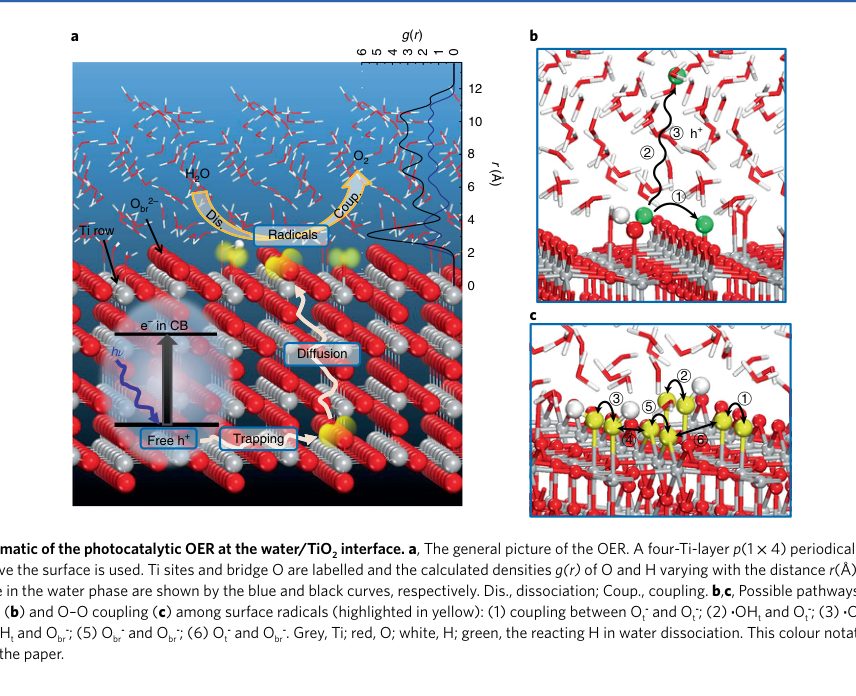
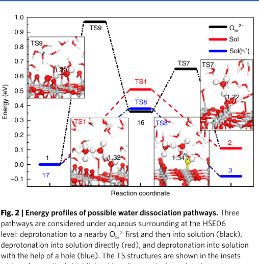
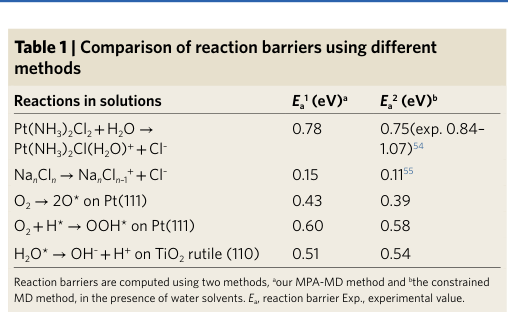
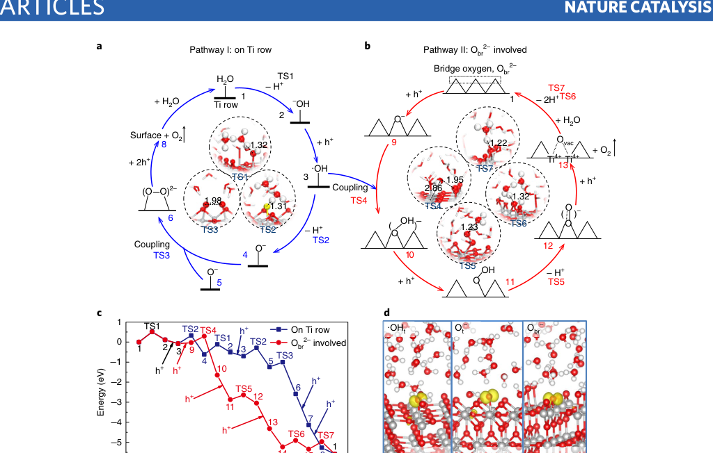
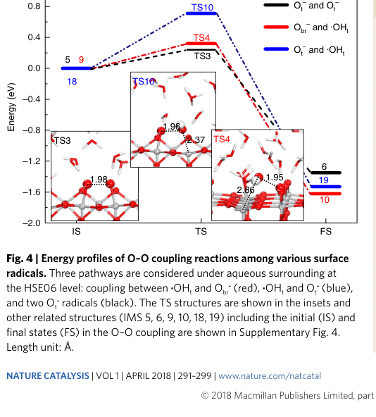
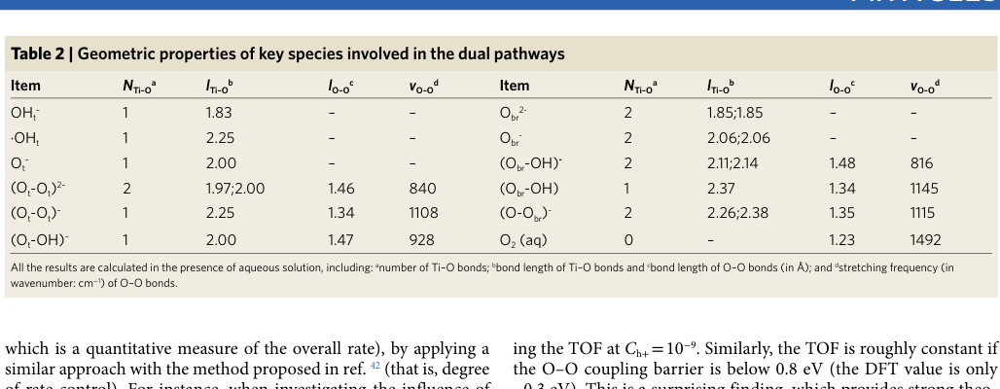
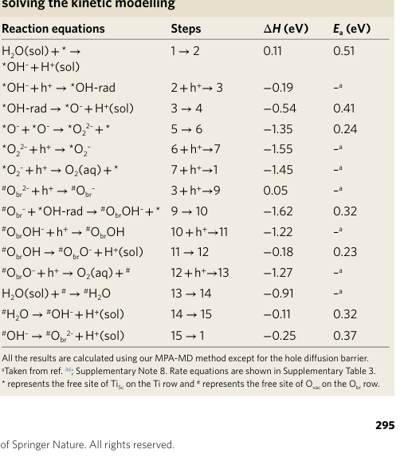
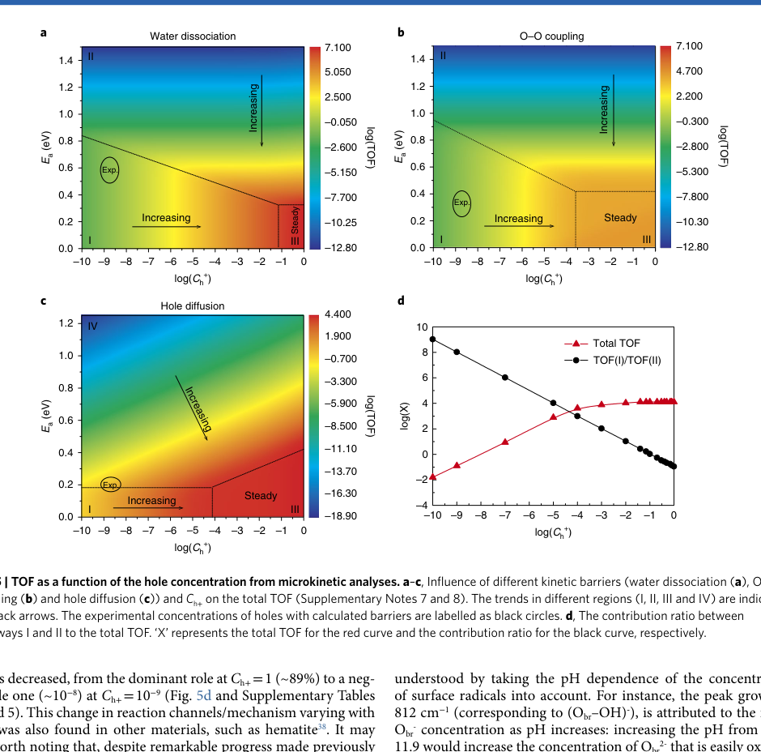

# Identifying the key obstacle in photocatalytic oxygen evolution on rutile TiO2

## Metadata / ???

- **Journal / ???** *Nature Catalysis*
- **Published / ???** 2018-04-16
- **DOI?** 10.1038/s41929-018-0055-z
- **Zotero key?** 6SQKD7I9
- **Collection / ???** 01???
- **Source / ???** Zotero ??????? PDF?9 ???

## Why this paper / ??????

**English:** This legacy six-marker backfill directly addresses a practical interpretive trap in photocatalytic OER: a low elementary-step barrier does not by itself imply a fast overall reaction. By combining explicit water/TiO2(110) solvation, radical chemistry, hybrid-functional checks and microkinetics, the paper separates intrinsic surface chemistry from the supply of surface-reaching photoholes. It is especially useful after the recent TiO2-water free-energy reader because it asks the complementary kinetic question: which physical bottleneck controls the observable rate under experimental carrier concentrations?

**???** ???????????????? OER ??????????????????????????????????????????/TiO2(110) ????????????????????????????????????????????????????? TiO2-??????????????????????????????????????????????????

## Terminology / ???

| English | ?? | Note / ?? |
|---|---|---|
| oxygen evolution reaction (OER) | ?????OER? | ???????????????????? |
| surface-reaching photohole concentration (Ch+) | ????????????Ch+? | ???????????????????????? |
| multi-point averaging molecular dynamics (MPA-MD) | ??????????MPA-MD? | ??? MD ?????????????????????????? |
| terminal hydroxyl (OHt?) | ?????OHt?? | ??????????? Ti ???? Ti ?????? |
| bridging oxygen (Obr2?) | ????Obr2?? | ???? Ti ?????????????? OER ???????? |
| hole trapping | ???? | ?????????? O ?????????????? |
| O?O coupling | O?O ?? | ?????????? O?O ??????? |
| degree of rate control (DRC) | ??????DRC? | ?????????????????????????? |
| turnover frequency (TOF) | ?????TOF? | ?????????????? |
| constrained molecular dynamics | ??????? | ???????????????????????????? |
| HSE06 | HSE06 ???? | ??????/???????????????????????? |

## Reading guide / ????

**English:** Read in a causal sequence: (1) distinguish proton transfer from radical-centre/spin transfer in the proposed water-dissociation and O?O-coupling steps; (2) compare the energetics with the microkinetic TOF maps rather than inferring rate solely from the largest barrier; (3) track how Ch+ changes pathway weighting; and (4) audit the boundary between the DFT+U/MPA-MD sampling and HSE06 validation. Figure 5 is the key synthesis: it says carrier delivery, not merely a surface reaction coordinate, limits OER at the stated experimental conditions.

**???** ????????? ????? O?O ??????????/H ????????/??????????? ??????????? TOF ???????????????????? ?? Ch+ ????????????? ?? DFT+U/MPA-MD ????? HSE06 ??????????? 5 ?????????????????????? OER ???????/????????????????

## Page / Section Index

- [p.1](#page-1)
- [p.2](#page-2)
- [p.3](#page-3)
- [p.4](#page-4)
- [p.5](#page-5)
- [p.6](#page-6)
- [p.7](#page-7)
- [p.9](#page-9)

## Related Reading / ????

### Water dissociation at the water-rutile TiO2(110) interface from ab initio-based deep neural network simulations

**????/???** ?????????????????-??? TiO2(110) ??????

**Why this one / ??????** It provides a modern neural-network-potential baseline for the same rutile-water interface and lets you contrast this paper?s carrier-limited OER conclusion with an explicitly sampled water-dissociation landscape. / ???????-??????????????????????????????? OER ???????????????????

# Bilingual Reader / ???????

## Page 1

**Source:** p.1 S001

**Original:** Articles

**??:** 文章

**Source:** p.1 S002

**Original:** As the bottleneck in photocatalytic water splitting, the oxygen evolution reaction (OER) has drawn huge attention, but its efficiency still falls short of expectations. A widely accepted speculation is that the catalysts’ activity is insufficient (high reaction barriers need to be overcome). Here, we develop a first-principles method to investigate the photocatalytic OER at the water/ TiO2(110) interface. A full mechanism uncovering the importance of radicals is determined. Kinetic analysis further enables to quantitatively estimate each possible obstacle in the process. We demonstrate unambiguously that the rate-determining factor of the OER varies with the concentration of surface-reaching photoholes (Ch+). Under experimental conditions, the intrinsic catalytic activity of TiO2(110) does not represent the main obstacle, but all steps involving the photoholes are slow due to their low concentrations. This suggests that the key to enhance the OER efficiency is to increase Ch+ before Ch+ reaches the estimated threshold (Ch+ =​ ~10−4).

**??:** 作为光催化水分解的瓶颈，析氧反应（OER）受到了极大的关注，但其效率仍低于预期。一种广泛接受的猜测是催化剂的活性不足（需要克服高反应障碍）。在这里，我们开发了一种第一原理方法来研究水/ TiO2(110) 界面的光催化 OER。确定了揭示自由基重要性的完整机制。动力学分析进一步能够定量估计过程中每个可能的障碍。我们明确证明 OER 的速率决定因素随着到达表面的光空穴 (Ch+) 的浓度而变化。在实验条件下，TiO2(110)的固有催化活性并不是主要障碍，但由于其浓度低，涉及光空穴的所有步骤都很慢。这表明提高 OER 效率的关键是在 Ch+ 达到估计阈值之前增加 Ch+ (Ch+ =​ ~10−4)。

**Source:** p.1 S003

**Original:** s an environmentally friendly approach to generate renewable energy directly from the Sun, potentially contributing to sustainable energy development, photocatalytic water splitting (H2O → hv 1⁄2O2 +​ H2) has drawn huge attention in chemistry1,2. Overall, this process consists of the hydrogen evolution reaction (H+ +​ e- →​ 1⁄2H2) and the OER involving photoholes h+ (2H2O +​ 4h+ →​ O2 +​ 4H+) (Fig. 1a), where the OER is known to be the bottleneck, hindering the overall process3. Therefore, huge efforts have been made to increase the efficiency of the OER on a variety of catalysts, especially on TiO2, which is perhaps one of the most important materials in photocatalysis due to its natural abundance, low cost, non-toxicity and superior photostability2,3. Among the different extensively studied topics, the reaction mechanism of the OER has been the main focus both experimentally and theoretically. It is anticipated that further insight into the mechanism can provide guidance to rationally improve the catalytic efficiency. However, previous studies have fallen short on their promises due to the complicated nature of the OER and the limitations of the approaches used. Based on the experimental work, mainly two mechanisms were suggested. It has long been speculated that O2 is produced from H2O2 by coupling two surface ·OH radicals4. But later spectroscopy results excluded the generation of H2O2 in the OER5,6. Subsequently, a nucleophilic attack mechanism was proposed, suggesting that the O–O bond is formed by involvement of lattice O (refs 5,7,8). Theoretically, few studies were reported on the overall OER at the liquid/solid interface due to the difficulties in simulating surface radicals (trapped holes on surface) and the aqueous environment. Most works were limited on the initial water dissociation step9,10 with few exploratory studies focused on the thermodynamics of the process11–13. It is clear that due to the limitations in both experimental and theoretical approaches, the mechanism of the OER remains elusive. In addition to the mechanism, extensive investigations have also been carried out on a variety of other issues, such as the photocatalyst preparation1,2, the band structure modification (for example, ion doping14–16), increasing the efficiency of photoinduced charge

**??:** 光催化水分解 (H2O → hv 1⁄2O2 + H2) 是一种直接从太阳产生可再生能源的环保方法，可能有助于可持续能源发展，已引起化学领域的巨大关注1,2。总体而言，该过程由析氢反应 (H+ +​ e- →​ 1⁄2H2) 和涉及光孔 h+ 的 OER (2H2O +​ 4h+ →​ O2 +​ 4H+) 组成（图 1a），其中 OER 被认为是阻碍整个过程的瓶颈。因此，人们付出了巨大的努力来提高各种催化剂的 OER 效率，特别是 TiO2，由于其天然丰富、低成本、无毒和优异的光稳定性，TiO2 可能是光催化中最重要的材料之一2,3。在广泛研究的不同主题中，OER 的反应机理一直是实验和理论上的主要焦点。预计进一步深入了解该机制可以为合理提高催化效率提供指导。然而，由于开放教育资源的复杂性和所用方法的局限性，之前的研究未能兑现其承诺。根据实验工作，主要提出了两种机制。长期以来，人们推测 O2 是由 H2O2 通过偶联两个表面·OH 自由基产生的。但后来的光谱结果排除了 OER5,6 中 H2O2 的生成。随后，提出了亲核攻击机制，表明O-O键是通过晶格O的参与形成的（参考文献5,7,8）。理论上，由于模拟表面自由基（表面捕获的空穴）和水环境的困难，关于液/固界面整体 OER 的研究报道很少。大多数工作仅限于最初的水解离步骤9,10，很少有探索性研究侧重于该过程的热力学11-13。显然，由于实验和理论方法的局限性，开放教育资源的机制仍然难以捉摸。除了机理之外，人们还对其他各种问题进行了广泛的研究，例如光催化剂的制备1,2、能带结构修饰（例如离子掺杂14-16）、提高光生电荷的效率

**Source:** p.1 S004

**Original:** separation (for example, phase junction17–19) and lowering the reaction barriers (for example, the water dissociation barrier20,21). It is clear that there is still a lack of understanding on the main obstacle in the OER and therefore it is not surprising that the overall efficiency of the OER is still unsatisfactory. Obviously, several fundamental questions need to be answered to achieve a breakthrough. First, what is the favoured reaction mechanism of the photocatalytic OER? Second, which factor determines the overall efficiency? Third, how can we further improve the efficiency? In this work, we chose the most stable rutile TiO2(110) surface as the model photocatalyst (Fig. 1a), considering that the rutile phase is generally good for water oxidation22,23 compared with the anatase phase24,25. A systematic computational investigation into the photocatalytic OER mechanism at the water/TiO2(110) interface was carried out, using extensive first-principles molecular dynamics (MD) simulations. A comprehensive picture of the whole chemical process, consisting of H2O dissociation, the formation of active radical species and the O–O coupling reaction, is obtained. Based on the completed reaction mechanism and detailed microkinetic analyses, we demonstrate that under experimental conditions the intrinsic catalytic activity of TiO2 is not the rate-determining factor that limits the overall efficiency of the OER. It is shown clearly that the low concentration of surface-reaching holes is the main obstacle in the system.

**??:** 分离（例如，相连接17-19）并降低反应势垒（例如，水解离势垒20,21）。显然，人们对开放教育资源的主要障碍仍然缺乏了解，因此开放教育资源的整体效率仍然不理想也就不足为奇了。显然，要实现突破，需要回答几个基本问​​题。首先，光催化OER的优选反应机理是什么？第二，哪个因素决定了整体效率？第三，如何进一步提高效率？在这项工作中，我们选择最稳定的金红石TiO2(110)表面作为模型光催化剂（图1a），考虑到与锐钛矿相相比，金红石相通常有利于水氧化22,2324,25。利用广泛的第一原理分子动力学 (MD) 模拟，对水/TiO2(110) 界面的光催化 OER 机理进行了系统的计算研究。获得了整个化学过程的全面图景，包括 H2O 解离、活性自由基物种的形成和 O-O 偶联反应。基于完整的反应机理和详细的微动力学分析，我们证明在实验条件下，TiO2 的固有催化活性并不是限制 OER 整体效率的速率决定因素。清楚地表明，到达表面的孔的低浓度是系统中的主要障碍。

**Source:** p.1 S005

**Original:** Results Development of the multi-point averaging molecular dynamics (MPA-MD) approach. Theoretically, it is extremely difficult to calculate the OER since one has to overcome two main issues. The first is to correctly locate the photoinduced surface radicals, which is a prerequisite to test a variety of pathways in the OER. As pointed out in ref. 26, the error of the commonly used PBE functional for calculating radicals can be as large as 0.6 eV, but the problem can be solved by using hybrid functional calculations, such as HSE0626. However, the HSE06 functional is too time consuming for the OER system, particularly in the presence of the liquid phase. In our

**??:** 结果 多点平均分子动力学 (MPA-MD) 方法的开发。从理论上讲，计算开放教育资源是极其困难的，因为必须克服两个主要问题。首先是正确定位光诱导表面自由基，这是测试 OER 中各种途径的先决条件。正如参考文献中指出的。如图26所示，常用的用于计算根式的PBE泛函的误差可高达0.6eV，但可以通过使用混合泛函计算来解决该问题，例如HSE0626。然而，HSE06 泛函对于 OER 系统来说太耗时，特别是在存在液相的情况下。在我们的

## Page 2

**Source:** p.2 S006

**Original:** Articles Nature Catalysis

**??:** 文章自然催化

**Source:** p.2 S007

**Original:** 0 1 2 3 4 5 6

**??:** 0 1 2 3 4 5 6

**Source:** p.2 S008

**Original:** H2O O2

**??:** 水氧

**Source:** p.2 S009

**Original:** Coup.

**??:** 政变。

**Source:** p.2 S010

**Original:** Obr 2–

**??:** 奥布尔 2–

**Source:** p.2 S011

**Original:** Dis.

**??:** 迪斯。

**Source:** p.2 S012

**Original:** Ti row

**??:** 钛排

**Source:** p.2 S013

**Original:** Radicals

**??:** 激进派

**Source:** p.2 S014

**Original:** e– in CB

**??:** e-CB 中的

**Source:** p.2 S015

**Original:** Diffusion

**??:** 扩散

**Source:** p.2 S016

**Original:** Trapping

**??:** 诱捕

**Source:** p.2 S017

**Original:** Free h+

**??:** 免费h+

**Source:** p.2 S018

**Original:** previous work27,28, we showed that DFT+​U can yield similar structures as the HSE06 functional with reasonable energies (Supplementary Fig. 1 and Supplementary Note 1). In this work, we first used the DFT+​U method to run MD simulations as well as the structure optimization of each MD snapshot, and then all the selected samples from each MD simulation were further optimized/ checked by the HSE06 functional. On using this technique, almost insurmountable hybrid functional calculations in this project could be carried out within a reasonable timescale; without this approach, it is perhaps impossible to test a variety of OER pathways as we did in the current work. The second issue is to reliably calculate the reactions occurring at the liquid/solid interface. The explicit involvement of the water environment is known to be important to the reaction energetics29,30, which is also a prerequisite to investigate the proton transfer process commonly occurring at the liquid/solid interface. But there is no robust method for such systems using density functional theory (DFT) approaches. To calculate the OER reactions with good accuracy at the water/TiO2 interface (Fig. 1a), we developed a general method, the so-called MPA-MD approach. First, we performed the normal MD calculations (~9 ps; see Methods) of each intermediate state (IMS; including transition states) on TiO2(110) with the aqueous network above the surface. Second, in the MD simulation of each IMS, we selected a structure every 0.2 ps from the stabilized MD simulations (small fluctuation in energy after long simulations) and further optimized it to obtain the total energy of each structure (Etot) at the HSE06 level. For each IMS, around 15 samples from the late part of each overall MD simulation (~3 ps) were obtained. Considering that different solution configurations of the water network affect Etot, we deducted the contribution of the water solution in Etot but still considered the solvation effect for each sample as follows: (i) calculate the total energy of the water solution (Ewater) with exactly the same structure as in the optimized samples at the HSE06 level; (ii) deduct Ewater from Etot to obtain the solvation-included

**??:** 在之前的工作27,28中，我们表明DFT+​U可以产生与具有合理能量的HSE06泛函类似的结构（补充图1和补充说明1）。在这项工作中，我们首先使用 DFT+​U 方法来运行 MD 模拟以及每个 MD 快照的结构优化，然后通过 HSE06 函数进一步优化/检查每个 MD 模拟中选择的所有样本。使用该技术，可以在合理的时间范围内完成该项目中几乎难以克服的混合函数计算；如果没有这种方法，也许就不可能像我们在当前工作中所做的那样测试各种开放教育资源途径。第二个问题是可靠地计算液/固界面处发生的反应。众所周知，水环境的明确参与对于反应能量学很重要29,30，这也是研究通常发生在液/固界面的质子转移过程的先决条件。但对于使用密度泛函理论（DFT）方法的此类系统，没有可靠的方法。为了高精度地计算水/TiO2 界面上的 OER 反应（图 1a），我们开发了一种通用方法，即所谓的 MPA-MD 方法。首先，我们对 TiO2(110) 上的每个中间态（IMS；包括过渡态）进行正常的 MD 计算（~9 ps；参见方法），水性网络位于表面上方。其次，在每个IMS的MD模拟中，我们从稳定的MD模拟（长时间模拟后能量波动较小）中每0.2 ps选择一个结构，并对其进行进一步优化，以获得HSE06级别的每个结构的总能量（Etot）。对于每个 IMS，从每个整体 MD 模拟的后期（~3 ps）获得了大约 15 个样本。考虑到水网络的不同溶液配置对Etot的影响，我们扣除了水溶液对Etot的贡献，但仍然考虑了每个样品的溶剂化效应，如下所示：（i）计算与HSE06级别的优化样品结构完全相同的水溶液（Ewater）的总能量； (ii) 从 Etot 中扣除 Ewater 以获得溶剂化包含

**Source:** p.2 S019

**Original:** g(r)

**??:** 克(r)

**Source:** p.2 S020

**Original:** r (Å)

**??:** r (埃)

**Source:** p.2 S021

**Original:** 3 5

**??:** 3 5

**Source:** p.2 S022

**Original:** 6 4

**??:** 6 4

**Source:** p.2 S023

**Original:** energy. Finally, we averaged the obtained solvation-included energies of all the samples in each IMS (more details on the MPA-MD method are provided in Supplementary Note 2). This method allows us to calculate all the elementary steps in the presence of the liquid phase with good accuracy. Thorough tests on the reaction energetics including barriers were carried out to verify the reliability of our approach in dealing with aqueous systems. Five kinds of aqueous reaction were compared between our approach and the state-of-the-art constrained MD methods (Table 1 and see Methods); it would, however, be too time consuming to use the constrained MD approach for the water/TiO2(110) systems. As shown in Table 1, in all the cases, our MPA-MD method gives very similar results to those from the constrained MD method. In particular, the comparable results of water dissociation (0.51 versus 0.54 eV) as well as the good accuracy in estimating the point of zero charge (PZC; Supplementary Note 4) of the rutile(110) surface (5.83 versus experimental 5.5–4.8; ref. 31) further demonstrate the feasibility of our method in investigating the OER mechanism at the aqueous/ TiO2(110) interface. We should point out that without our approach it is impossible to investigate the OER mechanism in such detail as we did using first-principles calculations.

**??:** 活力。最后，我们对每个 IMS 中所有样品获得的包含溶剂化的能量进行平均（补充说明 2 中提供了有关 MPA-MD 方法的更多详细信息）。这种方法使我们能够在液相存在的情况下以良好的精度计算所有基本步骤。对反应能量学（包括势垒）进行了彻底的测试，以验证我们处理水系统的方法的可靠性。我们的方法与最先进的约束 MD 方法之间比较了五种水相反应（表 1 并参见方法）；然而，对于水/TiO2(110) 系统使用约束MD 方法会太耗时。如表 1 所示，在所有情况下，我们的 MPA-MD 方法给出的结果与约束 MD 方法的结果非常相似。特别是，水离解的可比较结果（0.51与0.54 eV）以及估计金红石（110）表面零电荷点（PZC；补充说明4）的良好准确性（5.83与实验5.5-4.8；参考文献31）进一步证明了我们的方法在研究水/TiO2（110）界面处OER机制的可行性。我们应该指出，如果没有我们的方法，就不可能像我们使用第一原理计算那样详细地研究开放教育资源机制。

**Source:** p.2 S024

**Original:** The OER mechanism. The whole mechanism of the OER can be broadly divided into two parts: the first is the water dissociation and the formation of surface species, and the second is the oxygen– oxygen bond formation, yielding O2 (that is, O–O coupling among surface species).

**??:** 开放教育资源机制。 OER的整个机制大致可分为两部分：第一部分是水解离和表面物种的形成，第二部分是氧-氧键的形成，产生O2（即表面物种之间的O-O偶联）。

**Source:** p.2 S025

**Original:** Water dissociation. We first calculated the dissociation of H2O adsorbed on the surface (H2Oad) with and without the participation of photoholes h+. Three possible pathways were examined as shown in Figs. 1b and 2: (i) H2Oad donates a H to a nearby bridge oxygen Obr 2- (black curve in Fig. 2), forming a terminal hydroxyl OHt - and an ObrH-, which is the widely suggested mechanism10,32; (ii) H2Oad

**??:** 水离解。我们首先计算了在有或没有光孔 h+ 参与的情况下吸附在表面的 H2O (H2Oad) 的离解。如图所示，检查了三种可能的途径。 1b 和 2：(i) H2Oad 将 H 贡献给附近的桥氧 Obr 2-（图 2 中的黑色曲线），形成末端羟基 OHt - 和 ObrH-，这是广泛建议的机制10,32； (ii) H2Oad

### Fig. 1. 图1|水/TiO2 界面光催化 OER 示意图。 a，开放教育资源的概况。使用表面上方有 26 H2O 的四层 Ti p(1 ×​ 4) 周期板。 Ti 位点和桥 O 被标记，计算

**Placed near:** p.2 S025

**Source:** p.2 C001

**Original caption:** Fig. 1 | Schematic of the photocatalytic OER at the water/TiO2 interface. a, The general picture of the OER. A four-Ti-layer p(1 ×​ 4) periodical slab with 26 H2O above the surface is used. Ti sites and bridge O are labelled and the calculated densities g(r) of O and H varying with the distance r(Å) above the TiO2 surface in the water phase are shown by the blue and black curves, respectively. Dis., dissociation; Coup., coupling. b,c, Possible pathways of water dissociation (b) and O–O coupling (c) among surface radicals (highlighted in yellow): (1) coupling between Ot - and Ot -; (2) ·OHt and Ot -; (3) ·OHt and ·OHt; (4) ·OHt and Obr -; (5) Obr - and Obr -; (6) Ot - and Obr -. Grey, Ti; red, O; white, H; green, the reacting H in water dissociation. This colour notation is used throughout the paper.

**????:** 图1|水/TiO2 界面光催化 OER 示意图。 a，开放教育资源的概况。使用表面上方有 26 H2O 的四层 Ti p(1 ×​ 4) 周期板。 Ti 位点和桥 O 被标记，计算出的 O 和 H 的密度 g(r) 随水相中 TiO2 表面上方距离 r(Å) 的变化分别由蓝色和黑色曲线显示。 Dis.，解离；联轴器，耦合。 b,c, 表面自由基之间水解离 (b) 和 O-O 耦合 (c) 的可能途径（以黄色突出显示）： (1) Ot - 和 Ot - 之间的耦合； (2) ·OHt 和 Ot -； (3)·OHt 和·OHt； (4) ·OHt 和 Obr -； (5) Obr-和Obr-； (6)Ot-和Obr-。灰色，钛；红色，O；白色，H；绿色，反应中的 H 在水中解离。整篇论文都使用这种颜色符号。

**Reading note / ?????** Read the visual with the nearby source block and the stated simulation conditions; it is placed at the first substantive mention. / ???????????????????????????????

## Page 3

**Source:** p.3 S026

**Original:** Articles Nature Catalysis

**??:** 文章自然催化

**Source:** p.3 S027

**Original:** Reactions in solutions Ea 1 (eV)a Ea 2 (eV)b

**??:** 溶液中的反应 Ea 1 (eV)a Ea 2 (eV)b

**Source:** p.3 S028

**Original:** Pt(NH3)2Cl2 +​ H2O →​ Pt(NH3)2Cl(H2O)+ +​ Cl– 0.78 0.75(exp. 0.84– 1.07)54

**??:** Pt(NH3)2Cl2 + H2O → Pt(NH3)2Cl(H2O)+ + Cl– 0.78 0.75(实验值 0.84– 1.07)54

**Source:** p.3 S029

**Original:** NanCln →​ NanCln–1 + +​ Cl– 0.15 0.1155

**??:** NanCln →​ NanCln–1 + +​ Cl– 0.15 0.1155

**Source:** p.3 S030

**Original:** O2 →​ 2O* on Pt(111) 0.43 0.39

**??:** O2 →​ 2O* 在 Pt(111) 上 0.43 0.39

**Source:** p.3 S031

**Original:** O2 +​ H* →​ OOH* on Pt(111) 0.60 0.58

**??:** O2 + H* → OOH* 在 Pt(111) 上 0.60 0.58

**Source:** p.3 S032

**Original:** H2O* →​ OH– +​ H+ on TiO2 rutile (110) 0.51 0.54

**??:** H2O* →​ OH– +​ TiO2 金红石上的 H+ (110) 0.51 0.54

**Source:** p.3 S033

**Original:** Reaction barriers are computed using two methods, aour MPA-MD method and bthe constrained MD method, in the presence of water solvents. Ea, reaction barrier Exp., experimental value.

**??:** 在水溶剂存在下，使用两种方法计算反应势垒，即 MPA-MD 方法和约束 MD 方法。 Ea，反应势垒 Exp.，实验值。

**Source:** p.3 S034

**Original:** releases a proton directly into solution (red curve), yielding an OHt - and a proton in water H+(sol); and (iii) H2Oad deprotonates (loses a proton) in the presence of h+ (blue curve), producing an ·OHt radical and a H+(sol). It was found that in the presence of liquid water (Fig. 2 and Supplementary Table 1), pathway (i) is in fact not favoured, being endothermic by 0.36 eV with a high barrier of 0.97 eV (TS9 in Fig. 2). Instead, pathway (ii) is more favoured; H2Oad can deprotonate directly into solution through a Grotthuss-type proton transfer33 with a barrier of 0.51 eV and an enthalpy change (Δ​H) of 0.11 eV at neutral pH. At the transition state (TS), the detaching H+ is bounded by water molecules, forming a Zundel-like (H5O2 +) structure (TS1 in Fig. 2). Then, after a series of catch-and-abandon-like proton transfer across the Grotthuss chain, it forms a stable H5O2 + species in the bulk water and leaves an OHt - on the surface. Interestingly, in pathway (iii), the participation of h+ can further lower the deprotonation barrier to 0.39 eV, and the reaction also becomes exothermic (Δ​H =​ −​0.08 eV, pH =​ 7). At the TS, the h+ is found to be shared by the OH group and a nearby O3c (TS8 in Fig. 2 and Supplementary Fig. 5), which could facilitate the water deprotonation by weakening the ·OH–H+ bond and stabilizing the OH adsorption structure27. Although pathway (iii) appears to be the most favoured one, the concentration of surface-reaching holes (Ch+; in monolayer, ML; ignoring the surface recombination) is so low in TiO2 (Ch+ ≈​ 10−9 ML)34 that the kinetics of this concerted-like water dissociation involving h+ (H2O +​ h+ →​ ·OHt +​ H+(sol)) is in fact less favoured (Supplementary Note 3). Our kinetic modelling shows that it is about three orders of magnitude slower than the direct deprotonation (that is, pathway (ii)) followed by a hole transfer process, being consistent with the results on anatase TiO2 (ref. 9).

**??:** 将质子直接释放到溶液中（红色曲线），在水中产生 OHt - 和质子 H+(sol)； (iii) H2Oad 在 h+ 存在下去质子化（失去质子）（蓝色曲线），产生·OHt 自由基和 H+(sol)。结果发现，在液态水存在的情况下（图2和补充表1），路径（i）实际上并不受欢迎，吸热0.36 eV，势垒高为0.97 eV（图2中的TS9）。相反，途径(ii)更受青睐； H2Oad 可以通过 Grotthuss 型质子转移直接去质子进入溶液33，在中性 pH 条件下势垒为 0.51 eV，焓变 (Δ​H) 为 0.11 eV。在过渡态 (TS)，分离的 H+ 与水分子结合，形成 Zundel 状 (H5O2 +) 结构（图 2 中的 TS1）。然后，在经过 Grotthuss 链上一系列类似捕获和放弃的质子转移后，它在大量水中形成稳定的 H5O2 + 物质，并在表面留下 OHt - 。有趣的是，在途径(iii)中，h+的参与可以进一步将去质子化势垒降低至0.39 eV，并且反应也变为放热反应（Δ​H =​ −​0.08 eV，pH =​ 7）。在TS处，发现h+由OH基团和附近的O3c共享（图2中的TS8和补充图5），这可以通过削弱·OH–H+键并稳定OH吸附结构来促进水去质子化27。尽管途径 (iii) 似乎是最受欢迎的途径，但 TiO2 中到达表面的空穴（Ch+；在单层中，ML；忽略表面重组）的浓度非常低（Ch+ ≈​ 10−9 ML）34，因此涉及 h+ (H2O +​ h+ →​ ·OHt +​ H+(sol)) 的这种协同水解离动力学实际上不太受青睐（补充说明3）。我们的动力学模型表明，它比直接去质子化（即途径 (ii)）慢三个数量级，然后是空穴转移过程，与锐钛矿 TiO2 的结果一致（参考文献 9）。

**Source:** p.3 S035

**Original:** Surface radicals. After identifying the favoured pathway of water dissociation yielding OHt -, we investigated the formation of surface radicals (see Methods), for example ·OHt and Obr - (Fig. 3d), which are the key species in the photocatalytic OER. It was found that the hole trapping at OHt - (OHt - +​ h+ →​ ·OHt) is 0.24 eV more favourable than that observed for Obr 2- (Obr 2- +​ h+ →​ Obr -). Additionally, compared to the situation in the gas phase27, it is worth noting that the absolute values of the hole-trapping capacity of surface hole traps (for example OHt - and Obr 2-) are remarkably reduced by ~0.6 eV in the presence of liquid water. This indicates that those surface hole traps are stabilized by the surrounding water so much that they are much less prone to trap h+. Furthermore, it is interesting to note that once the ·OHt radical is formed, it can readily transform into the Ot - radical on the surface via detaching a H+ into the solution13,35 with a barrier as low as 0.41 eV at neutral pH (TS2 in Fig. 3a and Supplementary Fig. 5). The existence of the Ot - radical is made evident in our calculated spin charge density (Fig. 3d), and the ease of the Ot - formation from the ·OHt radical is in accordance with the experimental results36.

**??:** 表面自由基。在确定了水解离产生 OHt - 的有利途径后，我们研究了表面自由基的形成（参见方法），例如 ·OHt 和 Obr - （图 3d），它们是光催化 OER 中的关键物种。结果发现，OHt - (OHt - + h+ → ·OHt) 处的空穴捕获比 Obr 2- (Obr 2- + h+ → Obr -) 处观察到的空穴捕获要好 0.24 eV。此外，与气相情况相比27，值得注意的是，在液态水存在下，表面空穴陷阱（例如OHt​​ - 和Obr 2- ）的空穴捕获能力的绝对值显着降低了约0.6 eV。这表明这些表面空穴陷阱被周围的水所稳定，因此它们不太容易捕获 h+。此外，有趣的是，一旦形成·OHt自由基，它可以通过将H+分离到溶液中，在中性pH值下以低至0.41 eV的势垒13,35轻松转化为表面上的Ot - 自由基（图3a中的TS2和补充图5）。 Ot - 自由基的存在在我们计算的自旋电荷密度中显而易见（图3d），并且·OHt自由基形成Ot - 的容易程度与实验结果一致36。

**Source:** p.3 S036

**Original:** 1.0

**??:** 1.0

**Source:** p.3 S037

**Original:** Obr 2–

**??:** 奥布尔 2–

**Source:** p.3 S038

**Original:** TS9

**??:** TS9

**Source:** p.3 S039

**Original:** 0.9

**??:** 0.9

**Source:** p.3 S040

**Original:** Sol

**??:** 索尔

**Source:** p.3 S041

**Original:** TS9

**??:** TS9

**Source:** p.3 S042

**Original:** 0.8

**??:** 0.8

**Source:** p.3 S043

**Original:** Sol(h+)

**??:** 溶胶(h+)

**Source:** p.3 S044

**Original:** 0.7

**??:** 0.7

**Source:** p.3 S045

**Original:** TS7

**??:** TS7

**Source:** p.3 S046

**Original:** TS7

**??:** TS7

**Source:** p.3 S047

**Original:** 1.35

**??:** 1.35

**Source:** p.3 S048

**Original:** 0.6

**??:** 0.6

**Source:** p.3 S049

**Original:** TS1

**??:** TS1

**Source:** p.3 S050

**Original:** Energy (eV)

**??:** 能量（eV）

**Source:** p.3 S051

**Original:** 0.5

**??:** 0.5

**Source:** p.3 S052

**Original:** 1.22

**??:** 1.22

**Source:** p.3 S053

**Original:** TS8

**??:** TS8

**Source:** p.3 S054

**Original:** 0.4

**??:** 0.4

**Source:** p.3 S055

**Original:** 0.3

**??:** 0.3

**Source:** p.3 S056

**Original:** TS1 TS8

**??:** TS1 TS8

**Source:** p.3 S057

**Original:** 0.2

**??:** 0.2

**Source:** p.3 S058

**Original:** 0.1

**??:** 0.1

**Source:** p.3 S059

**Original:** 1.32 1.34

**??:** 1.32 1.34

**Source:** p.3 S060

**Original:** 0.0

**??:** 0.0

**Source:** p.3 S061

**Original:** –0.1

**??:** –0.1

**Source:** p.3 S062

**Original:** Reaction coordinate

**??:** 反应坐标

**Source:** p.3 S063

**Original:** O–O coupling. Regarding the second part of the mechanism, that is, the coupling of the surface species, all the possible couplings were considered in the current work. We found that all the non-radical species (OHt - or Obr 2-) are inert for coupling with each other, even including one non-radical coupling with one radical, due to the saturation of valence electrons. For example, the coupling barriers (Ea coup) of Ot -/Obr 2- (short for coupling between Ot - and Obr 2-), ·OHt/ Obr 2and Ot -/OHt - are all higher than 1.5 eV with large endothermic reaction energies of 2.55, 1.74 and 1.35 eV, respectively. Thus, the only promising O–O couplings reside in the pairing among surface radicals (·OHt, Ot - and Obr -), corresponding to a total of six possibilities: (i) Ot -/Ot -; (ii) ·OHt/Ot -; (iii) ·OHt/·OHt; (iv) ·OHt/Obr -; (v) Obr -/ Obr - and (vi) Ot -/Obr -, as shown in Fig. 1c. Our DFT calculations show that the Obr -/Obr - pathway is not likely, owing to the infeasible thermodynamics in producing two neighbouring Obr - radicals. Also, neither is the Ot -/Obr - pathway due to the relatively long distance at the TS between Ot - and Obr - with a large Ea coup of ~1.0 eV. For the ·OHt/·OHt pathway previously proposed4, our calculations show that the Ea coup is 0.66 eV, which is higher than the deprotonation barrier of the ·OHt radical (0.41 eV). In other words, ·OHt is more inclined to deprotonate into the Ot - radical rather than to couple with another adjacent ·OHt radical. The remaining three possible pathways are compared in Fig. 4 and Supplementary Table 2. One can see that the ·OHt/Ot - pathway is not easy because of a high Ea coup of 0.71 eV (TS10 in Fig. 4), while the remaining two pathways (Ot -/Ot - and OHt/Obr -) are both favoured with the barriers of ~0.3 eV (TS3, TS4 in Fig. 4). The necessity of radicals (Supplementary Fig. 5) in the O–O bond formation in our work strongly shows the indispensable role of radicals in the photocatalytic OER. In addition, it is generally more difficult for the O–O coupling to occur at the liquid/solid interface, compared with the case without liquid water where all the barriers are below 0.15 eV (Supplementary Table 2), demonstrating the constraint effect of the H-bond network on the coupling reactions.

**??:** O-O 耦合。关于该机制的第二部分，即表面物质的耦合，当前的工作考虑了所有可能的耦合。我们发现，由于价电子的饱和，所有非自由基物质（OHt - 或 Obr 2-）对于彼此耦合都是惰性的，甚至包括一种非自由基与一种自由基的耦合。例如，Ot -/Obr 2-（Ot - 和 Obr 2- 之间耦合的简称）、·OHt/ Obr 2 和 Ot -/OHt - 的耦合势垒（Ea coup）均高于 1.5 eV，吸热反应能分别为 2.55、1.74 和 1.35 eV。因此，唯一有希望的 O-O 耦合存在于表面自由基之间的配对（·OHt、Ot - 和 Obr -），总共对应于六种可能性：（i）Ot -/Ot -； (ii) ·OHt/Ot -； (iii)·OHt/·OHt； (iv) ·OHt/Obr -； (v)Obr-/Obr-和(vi)Ot-/Obr-，如图1c所示。我们的 DFT 计算表明，Obr -/Obr - 路径不太可能，因为产生两个相邻的 Obr - 自由基的热力学不可行。此外，Ot -/Obr - 路径也不是，因为 Ot - 和 Obr - 之间的 TS 距离相对较长，且 Ea 突变约为 1.0 eV。对于之前提出的·OHt/·OHt途径4，我们的计算表明Ea coup为0.66 eV，高于·OHt自由基的去质子化势垒（0.41 eV）。换句话说，·OHt 更倾向于去质子化成 Ot - 自由基，而不是与另一个相邻的·OHt 自由基偶联。其余三种可能的途径在图4和补充表2中进行了比较。可以看出，由于0.71 eV的高Ea耦合（图4中的TS10），·OHt/Ot - 途径并不容易，而其余两种途径（Ot -/Ot - 和OHt/Obr -）都受到~0.3 eV势垒的青睐（图4中的TS3、TS4）。在我们的工作中，自由基在O-O键形成中的必要性（补充图5）强烈地表明了自由基在光催化OER中不可或缺的作用。此外，与没有液态水、所有势垒均低于0.15 eV的情况相比，O-O耦合通常更难在液/固界面发生（补充表2），这证明了氢键网络对耦合反应的约束作用。

**Source:** p.3 S064

**Original:** The general picture of the OER. By combining all the elementary steps that have been calculated, an OER mechanism with dual pathways can be obtained as shown in Fig. 3: one of the dual pathways occurs on Ti-row sites (the blue curve, named as pathway I) and the other

**??:** OER 的总体情况。通过结合所有已计算的基本步骤，可以获得双途径的OER机制，如图3所示：双途径之一发生在Ti行位点（蓝色曲线，称为途径I），另一个发生在Ti排位点上。

### Fig. 2. 图2|可能的水解离途径的能量分布。在 HSE06 能级的水环境下考虑了三种途径：首先去质子化到附近的 Obr 2 然后进入溶液（黑色），直接去质子化进入溶液（红色），以及借助孔去质

**Placed near:** p.3 S064

**Source:** p.3 C003

**Original caption:** Fig. 2 | Energy profiles of possible water dissociation pathways. Three pathways are considered under aqueous surrounding at the HSE06 level: deprotonation to a nearby Obr 2first and then into solution (black), deprotonation into solution directly (red), and deprotonation into solution with the help of a hole (blue). The TS structures are shown in the insets with surface radicals highlighted in yellow, and other related structures (IMS 1, 2, 3, 16, 17) are shown in Supplementary Fig. 4. Length unit: Å.

**????:** 图2|可能的水解离途径的能量分布。在 HSE06 能级的水环境下考虑了三种途径：首先去质子化到附近的 Obr 2 然后进入溶液（黑色），直接去质子化进入溶液（红色），以及借助孔去质子化进入溶液（蓝色）。 TS结构显示在插图中，表面自由基以黄色突出显示，其他相关结构（IMS 1、2、3、16、17）显示在补充图4中。长度单位：Å。

**Reading note / ?????** Read the visual with the nearby source block and the stated simulation conditions; it is placed at the first substantive mention. / ???????????????????????????????

### Table 1. 表 1 |不同方法的反应势垒比较

**Placed near:** p.3 S064

**Source:** p.3 C002

**Original caption:** Table 1 | Comparison of reaction barriers using different methods

**????:** 表 1 |不同方法的反应势垒比较

**Reading note / ?????** Read the visual with the nearby source block and the stated simulation conditions; it is placed at the first substantive mention. / ???????????????????????????????

## Page 4

**Source:** p.4 S065

**Original:** Articles Nature Catalysis

**??:** 文章自然催化

**Source:** p.4 S066

**Original:** Pathway I: on Ti row a b

**??:** 途径 I：Ti 行 a b

**Source:** p.4 S067

**Original:** TS1

**??:** TS1

**Source:** p.4 S068

**Original:** H2O

**??:** 水

**Source:** p.4 S069

**Original:** – H+

**??:** – H+

**Source:** p.4 S070

**Original:** + H2O

**??:** + 水

**Source:** p.4 S071

**Original:** –OH

**??:** -哦

**Source:** p.4 S072

**Original:** Ti row

**??:** 钛排

**Source:** p.4 S073

**Original:** Surface + O2

**??:** 表面+氧气

**Source:** p.4 S074

**Original:** + h+

**??:** + 小时+

**Source:** p.4 S075

**Original:** 1.32

**??:** 1.32

**Source:** p.4 S076

**Original:** + 2h+

**??:** + 2小时+

**Source:** p.4 S077

**Original:** .OH

**??:** 。哦

**Source:** p.4 S078

**Original:** 3 Coupling

**??:** 3 联轴器

**Source:** p.4 S079

**Original:** TS1

**??:** TS1

**Source:** p.4 S080

**Original:** (O O)2–

**??:** (OO)2–

**Source:** p.4 S081

**Original:** 1.98 1.31

**??:** 1.98 1.31

**Source:** p.4 S082

**Original:** – H+

**??:** – H+

**Source:** p.4 S083

**Original:** TS2 TS3

**??:** TS2 TS3

**Source:** p.4 S084

**Original:** TS2

**??:** TS2

**Source:** p.4 S085

**Original:** Coupling

**??:** 耦合

**Source:** p.4 S086

**Original:** TS3

**??:** TS3

**Source:** p.4 S087

**Original:** c d

**??:** 光盘

**Source:** p.4 S088

**Original:** TS2 TS1

**??:** TS2 TS1

**Source:** p.4 S089

**Original:** On Ti row Obr 2– involved 1

**??:** 在 Ti 行 Obr 2 – 涉及 1

**Source:** p.4 S090

**Original:** TS4

**??:** TS4

**Source:** p.4 S091

**Original:** TS2 3 2 TS1

**??:** TS2 3 2 TS1

**Source:** p.4 S092

**Original:** 3 2

**??:** 3 2

**Source:** p.4 S093

**Original:** TS3 5

**??:** TS3 5

**Source:** p.4 S094

**Original:** h+ h+

**??:** 小时+ 小时+

**Source:** p.4 S095

**Original:** Energy (eV)

**??:** 能量（eV）

**Source:** p.4 S096

**Original:** 12 TS5

**??:** 12 TS5

**Source:** p.4 S097

**Original:** TS6

**??:** TS6

**Source:** p.4 S098

**Original:** 1 TS7

**??:** 1 TS7

**Source:** p.4 S099

**Original:** Reaction coordinate

**??:** 反应坐标

**Source:** p.4 S100

**Original:** involves bridged oxygen (red curve; pathway II). Pathway I (Fig. 3a) starts from the deprotonation of an adsorbed water to generate an OHt -, followed by the trapping of a h+ to form an ·OHt on the surface. Then, the ·OHt deprotonates readily, yielding a Ot - radical. After coupling with another Ot - nearby, two successive h+ can oxidize the as-formed (Ot–Ot)2into an O2. On the other hand, in pathway II (Fig. 3b), the ·OHt radical may couple with an Obr - directly instead of deprotonation, and thus the lattice oxygen is involved in the OER. Then, after a sequence of h+ trapping and deprotonation, the O2 molecule is generated and readily released, leaving an ionized oxygen vacancy (Ovac 2+) on the surface. The generated Ovac 2+ can be easily filled by the adsorption of H2O with two sequential deprotonation steps, recovering the surface. The following points should be noted: (i) pathway II involves lattice oxygen and thus it may cause surface roughening, which will be discussed later; (ii) the requirement of two adjacent radicals for O–O coupling and the successive oxidation of O2 2into O2 in the OER mechanism indicate that the surface needs to accumulate some holes to effectively drive the multi-hole process, consistent with experimental results from rate law analysis37,38. In general, the sequential oxidation of O2 nspecies by h+ (O2 2- →​ O2 - →​ O2; Supplementary Fig. 6) is clearly accompanied by the step-by-step decrease in the bond length of O–O (lO-O; 1.48 →​ 1.35 →​ 1.23 Å) as well as the progressively stretched lTi-O (ref. 39), as shown in Table 2, thus indicating the gradual detachment of an oxygen from the surface.

**??:** 涉及桥接氧（红色曲线；途径 II）。途径 I（图 3a）从吸附水的去质子化生成 OHt - 开始，然后捕获 h+ 在表面形成·OHt。然后，·OHt 容易去质子化，产生 Ot - 自由基。与附近的另一个 Ot - 偶联后，两个连续的 h+ 可以将形成的 (Ot–Ot)2 氧化成 O2。另一方面，在途径II中（图3b），·OHt自由基可以直接与Obr - 偶联而不是去质子化，因此晶格氧参与OER。然后，经过一系列 h+ 捕获和去质子化，O2 分子生成并容​​易释放，在表面留下电离氧空位 (Ovac 2+)。生成的 Ovac 2+ 可以通过两个连续的去质子化步骤通过吸附 H2O 轻松填充，从而恢复表面。应注意以下几点：（i）途径II涉及晶格氧，因此可能导致表面粗糙化，这将在后面讨论； (ii) OER 机理中两个相邻自由基进行 O-O 耦合以及 O2 2 连续氧化成 O2 的要求表明表面需要积累一些空穴才能有效驱动多孔过程，这与速率定律分析的实验结果一致37,38。一般来说，h+（O2 2- → O2 - → O2；补充图6）对O2 nspecies的连续氧化明显伴随着O-O键长的逐步减小（lO-O；1.48 → 1.35 → 1.23 Å）以及逐渐拉伸的lTi-O（参考文献39），如表2所示，从而表明氧气从表面逐渐脱离。

**Source:** p.4 S101

**Original:** Kinetic analysis. Figure 3c shows the energy profiles of these two pathways and it may seem that both pathways should be kinetically

**??:** 动力学分析。图 3c 显示了这两条路径的能量分布，似乎这两条路径在动力学上都应该是

**Source:** p.4 S102

**Original:** Pathway II: Obr 2– involved

**??:** 途径 II：Obr 2 – 参与

**Source:** p.4 S103

**Original:** Bridge oxygen, Obr 2–

**??:** 桥氧，Obr 2–

**Source:** p.4 S104

**Original:** TS7 TS6 – 2H+

**??:** TS7 TS6 – 2H+

**Source:** p.4 S105

**Original:** + h+

**??:** + 小时+

**Source:** p.4 S106

**Original:** + H2O

**??:** + 水

**Source:** p.4 S107

**Original:** Ovac

**??:** 奥瓦克

**Source:** p.4 S108

**Original:** 1.22

**??:** 1.22

**Source:** p.4 S109

**Original:** + O2 Ti4+ Ti4+

**??:** + O2 Ti4+ Ti4+

**Source:** p.4 S110

**Original:** TS7

**??:** TS7

**Source:** p.4 S111

**Original:** + h+

**??:** + 小时+

**Source:** p.4 S112

**Original:** 1.95 2.86

**??:** 1.95 2.86

**Source:** p.4 S113

**Original:** 1.32

**??:** 1.32

**Source:** p.4 S114

**Original:** TS4

**??:** TS4

**Source:** p.4 S115

**Original:** TS4

**??:** TS4

**Source:** p.4 S116

**Original:** O ( )–

**??:** O ( )–

**Source:** p.4 S117

**Original:** OH ( )–

**??:** 哦 （ ）-

**Source:** p.4 S118

**Original:** TS6

**??:** TS6

**Source:** p.4 S119

**Original:** 1.23

**??:** 1.23

**Source:** p.4 S120

**Original:** TS5

**??:** TS5

**Source:** p.4 S121

**Original:** O OH

**??:** 羟基

**Source:** p.4 S122

**Original:** – H+ + h+

**??:** – H+ + h+

**Source:** p.4 S123

**Original:** 11 TS5

**??:** 11 TS5

**Source:** p.4 S124

**Original:** .OHt Ot – Obr –

**??:** .OHt Ot – Obr –

**Source:** p.4 S125

**Original:** 0.59 ∣e∣ 0.62 ∣e∣ 0.61 ∣e∣

**??:** 0.59 ∣e∣ 0.62 ∣e∣ 0.61 ∣e∣

**Source:** p.4 S126

**Original:** fast because of the low barriers (the highest barrier is 0.51 eV) and large energy releases (Supplementary Notes 5 and 6). This is in contrast with the general consensus that the performance of TiO2 is still very low for the photocatalytic OER. How can we understand this? What is the main obstacle that limits the overall efficiency of the OER on TiO2? Having obtained the complete pathways and the energetics of the elementary steps in the OER, we were able to carry out the kinetic analysis utilizing microkinetics to address these issues quantitatively40. We first estimated the reaction kinetics under the experimental concentration of surface-reaching holes (Ch+ =​ ~10−9 ML) by utilizing a steady-state microkinetic model within the framework of transition-state theory. All the considered reactions and energies are shown in Table 3, where * represents the free site of Ti5c on the Ti row and # represents the free site of Ovac on the Obr row, corresponding to the elementary steps in Fig. 3c. The total coverage of all intermediate species adsorbed on each kind of surface site (Ti5c on the Ti row or Ovac on the Obr row) are treated as unity, respectively. The kinetic equations are solved under the condition of χH O 2 =​ 1 (mole fraction), χO2 =​ 10−7, pH =​ 7 and T =​ 300 K. Differing from the oxygen reduction reaction (χO2(aq) =​ 2.34 ×​ 10−5 corresponding to 1 atm O2(g) in equilibrium with O2(aq))41, a relatively smaller χO2 value is used because of the extremely unsaturated situation of O2 in water caused by the slow reaction kinetics of the OER (Supplementary Note 7). More importantly, we further investigated the influences of different kinetic barriers (that is, water dissociation, O–O coupling and hole diffusion) and/or Ch+ on the total turnover frequency (TOF,

**??:** 由于势垒低（最高势垒为0.51 eV）和能量释放大（补充说明5和6），速度很快。这与人们普遍认为 TiO2 的光催化 OER 性能仍然很低形成鲜明对比。我们如何理解这一点呢？限制 TiO2 OER 整体效率的主要障碍是什么？在获得了 OER 中基本步骤的完整路径和能量学后，我们能够利用微动力学进行动力学分析来定量解决这些问题40。我们首先利用过渡态理论框架内的稳态微动力学模型估计了到达表面的空穴实验浓度 (Ch+ =​ ~10−9 ML) 下的反应动力学。所有考虑的反应和能量均显示在表3中，其中*代表Ti行上Ti5c的自由位点，#代表Obr行上Ovac的自由位点，对应于图3c中的基本步骤。吸附在每种表面位点上的所有中间物种的总覆盖度（Ti 行上的 Ti5c 或 Obr 行上的 Ovac）分别视为整体。动力学方程在 χH O 2 =​ 1 （摩尔分数）、χO2 =​ 10−7、pH =​ 7 和 T =​ 300 K 条件下求解。与氧还原反应（χO2(aq) =​ 2.34 ×​ 10−5 对应于与 O2(aq) 平衡的 1 atm O2(g)）41 不同，使用相对较小的 χO2 值这是因为OER反应动力学缓慢导致水中O2极度不饱和的情况（补充说明7）。更重要的是，我们进一步研究了不同的动力学势垒（即水解离、O-O耦合和空穴扩散）和/或Ch+对总周转频率（TOF、

### Fig. 3. 图3|光催化 OER 的拟议机制（双途径）和能量分布。 a，Ti 行上出现的双路径之一（路径 I）。 b，涉及桥氧的另一条途径（途径II）。插图显示了 TS 结构，所有结构的详细信

**Placed near:** p.4 S126

**Source:** p.4 C004

**Original caption:** Fig. 3 | Proposed mechanism (dual pathways) and energy profiles for the photocatalytic OER. a, One of the dual pathways (pathway I) occurring on the Ti row. b, The other pathway (pathway II) involving bridge oxygen. Insets show the TS structures, and all of the detailed information of the structures is shown in Supplementary Figs. 4 and 5. c, The energy profiles of pathways I and II, in which states 1, 2, ...​15 correspond to the states in a and b. The elementary steps involving holes are labelled by h+. d, The existence of three key surface radicals in the process. They are illustrated by the spindensity plots (dumbbell-shaped O 2p orbital; isovalue of 0.005) and the Bader charge difference (~0.6 |e| means that those oxygens after trapping h+ are positively charged with +​0.6 |e| with respect to the lattice O in bulk TiO2).

**????:** 图3|光催化 OER 的拟议机制（双途径）和能量分布。 a，Ti 行上出现的双路径之一（路径 I）。 b，涉及桥氧的另一条途径（途径II）。插图显示了 TS 结构，所有结构的详细信息都显示在补充图中。 4 和 5。c，路径 I 和 II 的能量分布，其中状态 1, 2, ...​15 对应于 a 和 b 中的状态。涉及空穴的基本步骤用 h+ 标记。 d，过程中存在三个关键表面自由基。它们通过自旋密度图（哑铃形 O 2p 轨道；等值为 0.005）和 Bader 电荷差（~0.6 |e| 表示捕获 h+ 后的氧相对于块状 TiO2 中的晶格 O 带正电荷 +​0.6 |e| ）来说明。

**Reading note / ?????** Read the visual with the nearby source block and the stated simulation conditions; it is placed at the first substantive mention. / ???????????????????????????????

## Page 5

**Source:** p.5 S127

**Original:** Articles Nature Catalysis

**??:** 文章自然催化

**Source:** p.5 S128

**Original:** which is a quantitative measure of the overall rate), by applying a similar approach with the method proposed in ref. 42 (that is, degree of rate control). For instance, when investigating the influence of the water dissociation barrier and/or Ch+ on the total TOF (Fig. 5a), we keep the barriers of O–O coupling and hole diffusion constant, meanwhile mapping the TOF value (solve the kinetic equations at every single point) in the vertical range of (0, 1.5) for the dissociation barrier at intervals of 0.01 and in the horizontal range of (−​10, 0) for the log10Ch+ at intervals of 0.1, corresponding to a mesh density of 150 ×​ 100 in the figure. Our kinetic analysis results of investigating the influence of different kinetic barriers and Ch+ on the TOF value are shown in Fig. 5. They show that there are different regions in which the TOF is affected by (i) only Ch+ (region I); (ii) only the barrier (region II); (iii) neither Ch+ nor the barrier (region III); and (iv) both Ch+ and the barrier (region IV). Several striking features are revealed. First, at the experimental concentration of surface-reaching holes (Ch+ =​ ~10−9 ML)34, the total TOF would be dramatically hindered, being five orders of magnitude lower compared with the case when photoholes are always available (Ch+ =​ 1 ML) as shown in Fig. 5d. This explains the origin of low activity observed experimentally. Second, there is a considerable margin where all the reaction barriers on TiO2 can be increased without reducing the TOF considerably. For example, the water dissociation barrier can increase from 0.51 eV (the DFT value on TiO2) to ~0.8 eV without affect-

**??:** 这是对总体速率的定量测量），通过应用与参考文献中提出的方法类似的方法。 42（即码率控制程度）。例如，当研究水解离势垒和/或Ch+对总TOF的影响时（图5a），我们保持O-O耦合和空穴扩散势垒恒定，同时将解离势垒的TOF值（求解每个点的动力学方程）绘制在垂直范围（0, 1.5）内，间隔为0.01，水平范围为log10Ch+，间隔为（−​10, 0）。为0.1，对应图中网格密度为150×​100。我们研究不同动力学势垒和 Ch+ 对 TOF 值影响的动力学分析结果如图 5 所示。它们表明存在不同的区域，其中 TOF 受 (i) 仅 Ch+（区域 I）影响； (ii) 仅屏障（区域 II）； (iii)既不是Ch+也不是势垒（区域III）； (iv) Ch+ 和势垒（IV 区）。一些显着的特征被揭示出来。首先，在达到表面的空穴的实验浓度 (Ch+ =​ ~10−9 ML)34 下，总 TOF 将受到显着阻碍，与光空穴始终可用的情况 (Ch+ =​ 1 ML) 相比，总 TOF 降低了五个数量级，如图 5d 所示。这解释了实验观察到的低活性的根源。其次，在不显着降低 TOF 的情况下，TiO2 上的所有反应势垒都可以增加相当大的余量。例如，水离解势垒可以从 0.51 eV（TiO2 上的 DFT 值）增加到约 0.8 eV，而不会影响 -

**Source:** p.5 S129

**Original:** Ot – and Ot –

**??:** Ot – 和 Ot –

**Source:** p.5 S130

**Original:** 0.8

**??:** 0.8

**Source:** p.5 S131

**Original:** TS10

**??:** TS10

**Source:** p.5 S132

**Original:** Obr – and .OHt

**??:** Obr – 和 .OHt

**Source:** p.5 S133

**Original:** 0.4

**??:** 0.4

**Source:** p.5 S134

**Original:** TS4

**??:** TS4

**Source:** p.5 S135

**Original:** Ot – and .OHt

**??:** Ot – 和 .OHt

**Source:** p.5 S136

**Original:** 5 TS3

**??:** 5 TS3

**Source:** p.5 S137

**Original:** 0.0

**??:** 0.0

**Source:** p.5 S138

**Original:** TS10

**??:** TS10

**Source:** p.5 S139

**Original:** Energy (eV)

**??:** 能量（eV）

**Source:** p.5 S140

**Original:** –0.4

**??:** –0.4

**Source:** p.5 S141

**Original:** 1.96 2.37

**??:** 1.96 2.37

**Source:** p.5 S142

**Original:** –0.8

**??:** –0.8

**Source:** p.5 S143

**Original:** TS4

**??:** TS4

**Source:** p.5 S144

**Original:** TS3

**??:** TS3

**Source:** p.5 S145

**Original:** –1.2

**??:** –1.2

**Source:** p.5 S146

**Original:** 1.95 2.86

**??:** 1.95 2.86

**Source:** p.5 S147

**Original:** 19 1.98

**??:** 19 1.98

**Source:** p.5 S148

**Original:** –1.6

**??:** –1.6

**Source:** p.5 S149

**Original:** –2.0

**??:** –2.0

**Source:** p.5 S150

**Original:** FS TS IS

**??:** FS TS 是

**Source:** p.5 S151

**Original:** ing the TOF at Ch+ =​ 10−9. Similarly, the TOF is roughly constant if the O–O coupling barrier is below 0.8 eV (the DFT value is only ~0.3 eV). This is a surprising finding, which provides strong theoretical evidence to show that under experimental conditions the inherent catalytic activity of TiO2 is adequate (that is, the barriers are low enough) and the main obstacle that limits the overall efficiency of the OER is in fact the low concentration of surfacereaching holes. Third, lowering the barrier of water dissociation can increase the TOF once Ch+ is higher than ~10−4, shown in Fig. 5a. In other words, to further increase the TOF one must increase the catalytic activity of TiO2 (lower the barriers), if Ch+ is higher than ~10−4. This suggestes that Ch+ =​ ~10−4 is a critical threshold to signify whether the catalytic activity or the concentration of holes needs to be improved. Our kinetic results also reveal that both the hole diffusion barrier (Supplementary Note 8) and Ch+ can influence the TOF in region IV (Fig. 5c), and the diffusion barrier threshold between region I and IV is ~0.19 eV. Considering that the diffusion barrier in rutile TiO2 is already so low43, it would be difficult to decrease it further. The most effective way to enhance the photocatalytic efficiency is to increase the concentration of photoholes. Another finding of the kinetic analysis is that the two pathways possess different characteristics of hole-concentration dependence: the pathway involving lattice oxygen (pathway II) tends to reduce its contribution to the total TOF as

**??:** 在 Ch+ = 10−9 处计算 TOF。同样，如果 O-O 耦合势垒低于 0.8 eV（DFT 值仅为约 0.3 eV），则 TOF 大致恒定。这是一个令人惊讶的发现，它提供了强有力的理论证据，表明在实验条件下，TiO2固有的催化活性是足够的（即势垒足够低），限制OER整体效率的主要障碍实际上是低浓度的表面到达孔。第三，一旦 Ch+ 高于~10−4，降低水解离势垒可以增加 TOF，如图 5a 所示。换句话说，如果 Ch+ 高于~10−4，为了进一步提高 TOF，必须提高 TiO2 的催化活性（降低势垒）。这表明 Ch+ =​ ~10−4 是表示催化活性或空穴浓度是否需要提高的关键阈值。我们的动力学结果还表明，空穴扩散势垒（补充说明8）和Ch+都会影响IV区的TOF（图5c），并且I区和IV区之间的扩散势垒阈值约为0.19 eV。考虑到金红石 TiO2 中的扩散势垒已经很低43，因此很难进一步降低它。提高光催化效率最有效的方法是增加光空穴的浓度。动力学分析的另一个发现是，这两条路径具有不同的空穴浓度依赖性特征：涉及晶格氧的路径（路径 II）倾向于减少其对总 TOF 的贡献，如下所示：

**Source:** p.5 S152

**Original:** Reaction equations Steps Δ​H (eV) Ea (eV)

**??:** 反应方程 步骤 Δ​H (eV) Ea (eV)

**Source:** p.5 S153

**Original:** H2O(sol) +​ * →​ *OH– +​ H+(sol) 1 →​ 2 0.11 0.51

**??:** H2O(溶胶) +​ * →​ *OH– +​ H+(溶胶) 1 →​ 2 0.11 0.51

**Source:** p.5 S154

**Original:** *OH– +​ h+ →​ *OH-rad 2 +​ h+→​ 3 −​0.19 –a

**??:** *OH– + h+ →​ *OH-rad 2 +​ h+→​ 3 −​0.19 –a

**Source:** p.5 S155

**Original:** *OH-rad →​ *O– +​ H+(sol) 3 →​ 4 −​0.54 0.41

**??:** *OH-rad →​ *O– +​ H+(sol) 3 →​ 4 −​0.54 0.41

**Source:** p.5 S156

**Original:** *O– +​ *O– →​ *O2 2– +​ * 5 →​ 6 −​1.35 0.24

**??:** *O– +​ *O– →​ *O2 2– +​ * 5 →​ 6 −​1.35 0.24

**Source:** p.5 S157

**Original:** *O2 2– +​ h+ →​ *O2 – 6 +​ h+→​7 −​1.55 –a

**??:** *O2 2– +​ h+ →​ *O2 – 6 +​ h+→​7 −​1.55 –a

**Source:** p.5 S158

**Original:** *O2 – +​ h+ →​ O2(aq) +​ * 7 +​ h+→​1 −​1.45 –a

**??:** *O2 – +​ h+ →​ O2(aq) +​ * 7 +​ h+→​1 −​1.45 –a

**Source:** p.5 S159

**Original:** #Obr 2– +​ h+ →​ #Obr – 3 +​ h+→​9 0.05 –a

**??:** #Obr 2– +​ h+ →​ #Obr – 3 +​ h+→​9 0.05 –a

**Source:** p.5 S160

**Original:** #Obr – +​ *OH-rad →​ #ObrOH– +​ * 9 →​ 10 −​1.62 0.32

**??:** #Obr – +​ *OH-rad →​ #ObrOH– +​ * 9 →​ 10 −​1.62 0.32

**Source:** p.5 S161

**Original:** #ObrOH– +​ h+ →​ #ObrOH 10 +​ h+→​11 −​1.22 –a

**??:** #ObrOH– +​ h+ →​ #ObrOH 10 +​ h+→​11 −​1.22 –a

**Source:** p.5 S162

**Original:** #ObrOH →​ #ObrO– +​ H+(sol) 11 →​ 12 −​0.18 0.23

**??:** #ObrOH → #ObrO– + H+(sol) 11 →​ 12 −​0.18 0.23

**Source:** p.5 S163

**Original:** #ObrO– +​ h+ →​ O2(aq) +​ # 12 +​ h+→​13 −​1.27 –a

**??:** #ObrO– +​ h+ →​ O2(aq) +​ # 12 +​ h+→​13 −​1.27 –a

**Source:** p.5 S164

**Original:** H2O(sol) +​ # →​ #H2O 13 →​ 14 −​0.91 –a

**??:** H2O(sol) +​ # →​ #H2O 13 →​ 14 −​0.91 –a

**Source:** p.5 S165

**Original:** #H2O →​ #OH– +​ H+(sol) 14 →​ 15 −​0.11 0.32

**??:** #H2O → #OH– + H+(sol) 14 →​ 15 −​0.11 0.32

**Source:** p.5 S166

**Original:** #OH– →​ #Obr 2- +​ H+(sol) 15 →​ 1 −​0.25 0.37

**??:** #OH– →​ #Obr 2- +​ H+(sol) 15 →​ 1 −​0.25 0.37

**Source:** p.5 S167

**Original:** All the results are calculated using our MPA-MD method except for the hole diffusion barrier.

**??:** 除空穴扩散势垒外，所有结果均使用我们的 MPA-MD 方法计算。

**Source:** p.5 S168

**Original:** aTaken from ref. 46; Supplementary Note 8. Rate equations are shown in Supplementary Table 3. * represents the free site of Ti5c on the Ti row and # represents the free site of Ovac on the Obr row.

**??:** a取自参考文献。 46；补充说明8。速率方程如补充表3所示。*代表Ti行上Ti5c的游离位点，#代表Obr行上Ovac的游离位点。

**Source:** p.5 S169

**Original:** Item NTi–O a lTi–O b lO–O c vO–O d Item NTi–O a lTi–O b lO–O c vO–O d

**??:** 项目 NTi–O a lTi–O b lO–O c vo–O d 项目 NTi–O a lTi–O b lO–O c vO–O d

**Source:** p.5 S170

**Original:** OHt – 1 1.83 – – Obr 22 1.85;1.85 – –

**??:** OHt – 1 1.83 – – 22 1.85;1.85 – –

**Source:** p.5 S171

**Original:** ·OHt 1 2.25 – – Obr - 2 2.06;2.06 – –

**??:** ·OHt 1 2.25 – – 上- 2 2.06;2.06 – –

**Source:** p.5 S172

**Original:** Ot – 1 2.00 – – (Obr-OH)- 2 2.11;2.14 1.48 816

**??:** Ot – 1 2.00 – – (Obr-OH)- 2 2.11;2.14 1.48 816

**Source:** p.5 S173

**Original:** (Ot-Ot)2– 2 1.97;2.00 1.46 840 (Obr-OH) 1 2.37 1.34 1145

**??:** (Ot-Ot)2– 2 1.97;2.00 1.46 840 (Obr-OH) 1 2.37 1.34 1145

**Source:** p.5 S174

**Original:** (Ot-Ot)– 1 2.25 1.34 1108 (O-Obr)- 2 2.26;2.38 1.35 1115

**??:** (Ot-Ot)– 1 2.25 1.34 1108 (O-Obr)- 2 2.26;2.38 1.35 1115

**Source:** p.5 S175

**Original:** (Ot-OH)– 1 2.00 1.47 928 O2 (aq) 0 – 1.23 1492

**??:** (Ot-OH)– 1 2.00 1.47 928 O2（水溶液） 0 – 1.23 1492

**Source:** p.5 S176

**Original:** All the results are calculated in the presence of aqueous solution, including: anumber of Ti–O bonds; bbond length of Ti–O bonds and cbond length of O–O bonds (in Å); and dstretching frequency (in wavenumber: cm−1) of O–O bonds.

**??:** 所有结果都是在水溶液存在下计算的，包括：Ti-O键的数量； Ti-O 键的 b 键长和 O-O 键的 c 键长（以 Å 为单位）； O-O 键的 d 拉伸频率（波数：cm−1）。

### Fig. 4. 图4|各种表面自由基之间O-O偶联反应的能量分布。在 HSE06 水平的水环境下考虑了三种途径：·OHt 和 Obr -（红色）、·OHt 和 Ot -（蓝色）以及两个 Ot - 

**Placed near:** p.5 S176

**Source:** p.5 C006

**Original caption:** Fig. 4 | Energy profiles of O–O coupling reactions among various surface radicals. Three pathways are considered under aqueous surrounding at the HSE06 level: coupling between ·OHt and Obr - (red), ·OHt and Ot - (blue), and two Ot - radicals (black). The TS structures are shown in the insets and other related structures (IMS 5, 6, 9, 10, 18, 19) including the initial (IS) and final states (FS) in the O–O coupling are shown in Supplementary Fig. 4. Length unit: Å.

**????:** 图4|各种表面自由基之间O-O偶联反应的能量分布。在 HSE06 水平的水环境下考虑了三种途径：·OHt 和 Obr -（红色）、·OHt 和 Ot -（蓝色）以及两个 Ot - 自由基（黑色）之间的偶联。 TS结构如插图所示，其他相关结构（IMS 5、6、9、10、18、19），包括O-O耦合中的初始状态（IS）和最终状态（FS），如补充图4所示。长度单位：Å。

**Reading note / ?????** Read the visual with the nearby source block and the stated simulation conditions; it is placed at the first substantive mention. / ???????????????????????????????

### Table 2. 表 2 |参与双途径的关键物种的几何特性

**Placed near:** p.5 S176

**Source:** p.5 C005

**Original caption:** Table 2 | Geometric properties of key species involved in the dual pathways

**????:** 表 2 |参与双途径的关键物种的几何特性

**Reading note / ?????** Read the visual with the nearby source block and the stated simulation conditions; it is placed at the first substantive mention. / ???????????????????????????????

### Table 3. 表 3 |求解动力学模型的每个基本步骤的反应能量学

**Placed near:** p.5 S176

**Source:** p.5 C007

**Original caption:** Table 3 | Reaction energetics of each elementary step for solving the kinetic modelling

**????:** 表 3 |求解动力学模型的每个基本步骤的反应能量学

**Reading note / ?????** Read the visual with the nearby source block and the stated simulation conditions; it is placed at the first substantive mention. / ???????????????????????????????

## Page 6

**Source:** p.6 S177

**Original:** Articles Nature Catalysis

**??:** 文章自然催化

**Source:** p.6 S178

**Original:** Water dissociation O–O coupling

**??:** 水解离 O-O 偶联

**Source:** p.6 S179

**Original:** a b

**??:** 乙

**Source:** p.6 S180

**Original:** 7.100

**??:** 7.100

**Source:** p.6 S181

**Original:** 1.4

**??:** 1.4

**Source:** p.6 S182

**Original:** 5.050

**??:** 5.050

**Source:** p.6 S183

**Original:** 1.2

**??:** 1.2

**Source:** p.6 S184

**Original:** Increasing

**??:** 增加

**Source:** p.6 S185

**Original:** 2.500

**??:** 2.500

**Source:** p.6 S186

**Original:** 1.0

**??:** 1.0

**Source:** p.6 S187

**Original:** –0.050

**??:** –0.050

**Source:** p.6 S188

**Original:** Ea (eV)

**??:** 埃 (eV)

**Source:** p.6 S189

**Original:** 0.8

**??:** 0.8

**Source:** p.6 S190

**Original:** –2.600

**??:** –2.600

**Source:** p.6 S191

**Original:** 0.6

**??:** 0.6

**Source:** p.6 S192

**Original:** Exp.

**??:** 过期。

**Source:** p.6 S193

**Original:** –5.150

**??:** –5.150

**Source:** p.6 S194

**Original:** 0.4

**??:** 0.4

**Source:** p.6 S195

**Original:** –7.700

**??:** –7.700

**Source:** p.6 S196

**Original:** Steady

**??:** 稳定的

**Source:** p.6 S197

**Original:** Increasing

**??:** 增加

**Source:** p.6 S198

**Original:** 0.2

**??:** 0.2

**Source:** p.6 S199

**Original:** –10.25

**??:** –10.25

**Source:** p.6 S200

**Original:** I III

**??:** ⅠⅢ

**Source:** p.6 S201

**Original:** –12.80

**??:** –12.80

**Source:** p.6 S202

**Original:** –10 –9 –8 –7 –6 –5 –4 –3 –2 –1 0 0.0

**??:** –10 –9 –8 –7 –6 –5 –4 –3 –2 –1 0 0.0

**Source:** p.6 S203

**Original:** log(Ch +)

**??:** 对数(Ch+)

**Source:** p.6 S204

**Original:** c d

**??:** 光盘

**Source:** p.6 S205

**Original:** Hole diffusion

**??:** 空穴扩散

**Source:** p.6 S206

**Original:** 4.400

**??:** 4.400

**Source:** p.6 S207

**Original:** 1.2

**??:** 1.2

**Source:** p.6 S208

**Original:** 1.900

**??:** 1.900

**Source:** p.6 S209

**Original:** 1.0

**??:** 1.0

**Source:** p.6 S210

**Original:** –0.700

**??:** –0.700

**Source:** p.6 S211

**Original:** –3.300

**??:** –3.300

**Source:** p.6 S212

**Original:** 0.8

**??:** 0.8

**Source:** p.6 S213

**Original:** Increasing

**??:** 增加

**Source:** p.6 S214

**Original:** –5.900

**??:** –5.900

**Source:** p.6 S215

**Original:** Ea (eV)

**??:** 埃 (eV)

**Source:** p.6 S216

**Original:** 0.6

**??:** 0.6

**Source:** p.6 S217

**Original:** –8.500

**??:** –8.500

**Source:** p.6 S218

**Original:** –11.10

**??:** –11.10

**Source:** p.6 S219

**Original:** 0.4

**??:** 0.4

**Source:** p.6 S220

**Original:** –13.70

**??:** –13.70

**Source:** p.6 S221

**Original:** 0.2

**??:** 0.2

**Source:** p.6 S222

**Original:** Exp.

**??:** 过期。

**Source:** p.6 S223

**Original:** –16.30

**??:** –16.30

**Source:** p.6 S224

**Original:** Increasing Steady

**??:** 稳定增加

**Source:** p.6 S225

**Original:** I III

**??:** ⅠⅢ

**Source:** p.6 S226

**Original:** –18.90

**??:** –18.90

**Source:** p.6 S227

**Original:** 0.0

**??:** 0.0

**Source:** p.6 S228

**Original:** –10 –9 –8 –7 –6 –5 –4 –3 –2 –1 0

**??:** –10 –9 –8 –7 –6 –5 –4 –3 –2 –1 0

**Source:** p.6 S229

**Original:** Ch+ is decreased, from the dominant role at Ch+ =​ 1 (~89%) to a negligible one (~10−8) at Ch+ =​ 10−9 (Fig. 5d and Supplementary Tables 4 and 5). This change in reaction channels/mechanism varying with Ch+ was also found in other materials, such as hematite38. It may be worth noting that, despite remarkable progress made previously pointing out that the photoactivity is significantly affected by the hole concentration37,38,44, the analysis above describes quantitatively, by virtue of microkinetic analysis, the effects of each of the kinetic components on the overall efficiency and it may be extremely difficult to obtain these quantities using other approaches.

**??:** Ch+ 减少，从 Ch+ =​ 1 (~89%) 时的主导作用降至 Ch+ =​ 10−9 时的可忽略不计的作用 (~10−8)（图 5d 和补充表 4 和 5）。在其他材料中也发现了这种随 Ch+ 变化的反应通道/机制的变化，例如赤铁矿38。值得注意的是，尽管先前取得了显着进展，指出光活性受空穴浓度的显着影响37,38,44，但上述分析通过微动力学分析定量描述了每个动力学成分对整体效率的影响，并且使用其他方法可能极其难以获得这些量。

**Source:** p.6 S230

**Original:** Insights into the diverse experimental observations. Having performed the kinetic analysis, we are now at the position to rationalize some classical but puzzling experimental observations. First, it was detected that on rutile TiO2 there are three characteristic multiple internal reflection infrared radiation (MIR-IR) signals5: 838 cm−1, 812 cm−1 and 928 cm−1. More interestingly, a change of peak intensity under different pH was observed: when switching from acid (pH 2.4) to alkaline (pH 11.9) solutions, the peak of 812 cm−1 increases while the peak of 928 cm−1 decreases. However, what surface species are responsible for these signals and why the two peak intensities shift are still elusive. The current work can shed some light on these issues: our simulated stretching frequencies of key O–O species (see Methods) are listed in Table 2, which shows that the three frequencies of 840 cm−1, 816 cm−1 and 928 cm−1 agree well with the experimental signals, identifying the corresponding species (that is, (Ot–Ot)2-, (Obr–OH)- and (Ot–OH)-, respectively) for these signals. Besides, the peak intensity changes can be

**??:** 对各种实验观察的见解。进行了动力学分析后，我们现在可以合理化一些经典但令人费解的实验观察结果。首先，检测到金红石 TiO2 上存在三种特征多重内反射红外辐射 (MIR-IR) 信号 5：838 cm−1、812 cm−1 和 928 cm−1。更有趣的是，观察到不同pH值下峰强度的变化：当从酸性（pH 2.4）溶液切换到碱性（pH 11.9）溶液时，812 cm−1 的峰增加，而928 cm−1 的峰减少。然而，哪些表面物种负责这些信号以及两个峰强度移动的原因仍然难以捉摸。目前的工作可以阐明这些问题：表2列出了我们模拟的关键O-O物种的拉伸频率（参见方法），其中显示840 cm−1、816 cm−1和928 cm−1这三个频率与实验信号非常吻合，识别了这些信号的相应物种（分别为(Ot–Ot)2-、(Obr–OH)-和(Ot–OH)-）。此外，峰值强度的变化可以表示为

**Source:** p.6 S231

**Original:** 7.100

**??:** 7.100

**Source:** p.6 S232

**Original:** 1.4

**??:** 1.4

**Source:** p.6 S233

**Original:** 4.700

**??:** 4.700

**Source:** p.6 S234

**Original:** 1.2

**??:** 1.2

**Source:** p.6 S235

**Original:** Increasing

**??:** 增加

**Source:** p.6 S236

**Original:** 2.200

**??:** 2.200

**Source:** p.6 S237

**Original:** 1.0

**??:** 1.0

**Source:** p.6 S238

**Original:** –0.300

**??:** –0.300

**Source:** p.6 S239

**Original:** log(TOF)

**??:** 日志（飞行时间）

**Source:** p.6 S240

**Original:** log(TOF) log(TOF)

**??:** 日志（TOF） 日志（TOF）

**Source:** p.6 S241

**Original:** Ea (eV)

**??:** 埃 (eV)

**Source:** p.6 S242

**Original:** 0.8

**??:** 0.8

**Source:** p.6 S243

**Original:** –2.800

**??:** –2.800

**Source:** p.6 S244

**Original:** 0.6

**??:** 0.6

**Source:** p.6 S245

**Original:** –5.300

**??:** –5.300

**Source:** p.6 S246

**Original:** 0.4

**??:** 0.4

**Source:** p.6 S247

**Original:** –7.800

**??:** –7.800

**Source:** p.6 S248

**Original:** Exp.

**??:** 过期。

**Source:** p.6 S249

**Original:** Increasing Steady

**??:** 稳定增加

**Source:** p.6 S250

**Original:** 0.2

**??:** 0.2

**Source:** p.6 S251

**Original:** –10.30

**??:** –10.30

**Source:** p.6 S252

**Original:** III

**??:** 三、

**Source:** p.6 S253

**Original:** –12.80

**??:** –12.80

**Source:** p.6 S254

**Original:** 0.0

**??:** 0.0

**Source:** p.6 S255

**Original:** –10 –9 –8 –7 –6 –5 –4 –3 –2 –1 0

**??:** –10 –9 –8 –7 –6 –5 –4 –3 –2 –1 0

**Source:** p.6 S256

**Original:** log(Ch +)

**??:** 对数(Ch+)

**Source:** p.6 S257

**Original:** Total TOF

**??:** 总飞行时间

**Source:** p.6 S258

**Original:** TOF(I)/TOF(II)

**??:** TOF(一)/TOF(二)

**Source:** p.6 S259

**Original:** log(X)

**??:** 对数(X)

**Source:** p.6 S260

**Original:** –10 –9 –8 –7 –6 –5 –4 –3 –2 –1 0 –4

**??:** –10 –9 –8 –7 –6 –5 –4 –3 –2 –1 0 –4

**Source:** p.6 S261

**Original:** understood by taking the pH dependence of the concentrations of surface radicals into account. For instance, the peak growth of 812 cm−1 (corresponding to (Obr–OH)-), is attributed to the rise of Obr - concentration as pH increases: increasing the pH from 2.4 to 11.9 would increase the concentration of Obr 2that is easily oxidized by h+ to form Obr -, and further promote the Obr -/·OHt coupling, leading to an increase of (Obr–OH)-. The peak intensity change of 928 cm−1 can be explained in a similar way. Second, we can rationalize the well-known observation of a sharp decrease of photoluminescence (PL) intensity8 around pH 4: the availability of surface Obr 2increases as pH goes above 4.3 (ref. 45), thus facilitating the pathway involving the lattice oxygen and greatly suppressing the recombination of photoinduced carriers. As pH is further increased, all the deprotonation steps are promoted, corresponding to the further decrease of PL intensity, which even approaches zero near pH 13. Third, another experimental observation whereby the surface roughening on rutile(110) was significantly suppressed at pH 13 compared with pH 1.1 (ref. 8) can also be understood by our findings: the Obr - radical can only couple with ·OHt instead of Ot -, and thus the lack of ·OHt in a strong alkaline solution reduces the possibility of Obr -/·OHt coupling, leading to the decrease in the rate of pathway II and hence a reduction of surface roughening. Similarly, our result showing that pathway II is favoured if Ch+ is high can explain the experimental fact that low-intensity UV illumination causes little surface roughening on rutile(110), and it becomes more prominent with the increasing illumination intensity (from 0.04 to 50 mW cm–2)7. All these results strongly support our proposed mechanism.

**??:** 通过考虑表面自由基浓度的 pH 依赖性来理解。例如，峰值增长812 cm−1（对应于(Obr–OH)-），归因于Obr - 浓度随着pH值的增加而升高：pH值从2.4增加到11.9会增加易于被h+氧化形成Obr - 的Obr 2 浓度，并进一步促进Obr -/·OHt 耦合，导致(Obr–OH)- 的增加。 928 cm−1 的峰值强度变化可以用类似的方式解释。其次，我们可以合理解释众所周知的 pH 值 4 左右光致发光 (PL) 强度8急剧下降的观察结果：当 pH 值高于 4.3 时，表面 Obr 2 的可用性增加（参考文献 45），从而促进涉及晶格氧的路径并极大地抑制光生载流子的复合。随着pH进一步升高，所有去质子化步骤都得到促进，相应于PL强度进一步降低，甚至在pH 13附近接近于零。第三，另一个实验观察结果表明，与pH 1.1相比，金红石（110）的表面粗糙化在pH 13时被显着抑制（参考文献8），这也可以通过我们的发现来理解：Obr - 自由基只能与·OHt而不是Ot - 偶联，因此强碱性溶液中缺乏·OHt会降低Obr -/·OHt 偶联的可能性，导致途径 II 的速率降低，从而减少表面粗糙度。同样，我们的结果显示，如果 Ch+ 较高，则路径 II 受到青睐，这可以解释低强度紫外线照射导致金红石 (110) 表面几乎没有表面粗糙化的实验事实，并且随着照射强度的增加（从 0.04 到 50 mW cm–2）7，这种现象变得更加突出。所有这些结果都强烈支持我们提出的机制。

**Source:** p.6 S262

**Original:** log(Ch +) log(Ch +)

**??:** 日志（Ch +） 日志（Ch +）

### Fig. 5. 图5 | TOF 是微动力学分析中空穴浓度的函数。 a-c，不同动力学势垒（水解离 (a)、O-O 耦合 (b) 和空穴扩散 (c)）和 Ch+ 对总 TOF 的影响（补充说明 7

**Placed near:** p.6 S262

**Source:** p.6 C008

**Original caption:** Fig. 5 | TOF as a function of the hole concentration from microkinetic analyses. a–c, Influence of different kinetic barriers (water dissociation (a), O–O coupling (b) and hole diffusion (c)) and Ch+ on the total TOF (Supplementary Notes 7 and 8). The trends in different regions (I, II, III and IV) are indicated by black arrows. The experimental concentrations of holes with calculated barriers are labelled as black circles. d, The contribution ratio between pathways I and II to the total TOF. ‘X’ represents the total TOF for the red curve and the contribution ratio for the black curve, respectively.

**????:** 图5 | TOF 是微动力学分析中空穴浓度的函数。 a-c，不同动力学势垒（水解离 (a)、O-O 耦合 (b) 和空穴扩散 (c)）和 Ch+ 对总 TOF 的影响（补充说明 7 和 8）。不同区域（I、II、III 和 IV）的趋势由黑色箭头表示。具有计算屏障的孔的实验浓度被标记为黑色圆圈。 d，路径I和II对总TOF的贡献比。 “X”分别代表红色曲线的总 TOF 和黑色曲线的贡献率。

**Reading note / ?????** Read the visual with the nearby source block and the stated simulation conditions; it is placed at the first substantive mention. / ???????????????????????????????

## Page 7

**Source:** p.7 S263

**Original:** Articles Nature Catalysis

**??:** 文章自然催化

**Source:** p.7 S264

**Original:** Discussion It is worth discussing some implications of our results in photocatalytic water splitting. In the photocatalytic OER, the radicals are perhaps the most important intermediates; however, in which manner they play this essential role has remained elusive. This fundamental question can be answered as follows. First, radicals can reduce the Ti–O bonding strength in accordance with the stretched lTi–O of radicals as shown in Table 2, and thus could facilitate the desorption of O2. For instance, the oxygen vacancy formation energy of Obr 2- (the normal bridge oxygen) and Obr - (the bridge oxygen radical) were calculated to be 3.16 eV and 1.54 eV, respectively, which clearly reveals the contributions of radicals in promoting the removal of lattice oxygen. Second, they are irreplaceable intermediates for O–O coupling where non-radical species are inert. In particular, it is worth mentioning the specific role of the ·OHt radical in the process. As mentioned before, the favoured O–O coupling on the Ti row is between two Ot - radicals, and hence the difficulty in producing Ot - largely decides the feasibility of this pathway. However, the direct deprotonation of OHt - can hardly occur due to the fast reverse reaction with a very low barrier of 0.08 eV. Therefore, the only way is to trap a h+ and form ·OHt first, followed by the deprotonation of ·OHt into the Ot - radical. In other words, the ease of deprotonation of ·OHt influences the main pathway of the OER under experimental conditions. Third, radicals are actually trapped holes on the surface, which can significantly suppress the surface electron–hole recombination and increase the lifetime of surface-reaching holes up to microseconds46,47. Here, we developed a first-principles MPA-MD method to extensively simulate the OER in the presence of liquid water on rutile TiO2(110). A complete reaction mechanism with dual pathways is identified in this work, which allowed us to join some detached experimental observations and to rationalize the experimental results. Moreover, we provide strong theoretical evidence to show that the low efficiency of the OER on TiO2(110) is in fact not limited by the inherent catalytic activity (reaction barriers), but by the low concentration of photoholes on TiO2. Perhaps the low concentration of surface-reaching photoholes may be a general obstacle in many other materials18. In addition, this finding also explains that rutile TiO2 is a very good coating material for the photoanode in protecting the effective but unstable light-harvesting semiconductors from corrosion by virtue of its high kinetic activity, stable structure and transparent property48. It is clear that the most efficient way to improve the performance of the OER at the current stage (before approaching the estimated threshold of Ch+ =​ ~10−4) is to enrich the concentration of surface-reaching photoholes rather than to lower the reaction barriers of water dissociation and O–O coupling. The following two strategies identified in the current work may help realize this goal in addition to conventional methods; to lower the hole diffusion barrier and to reduce the hole diffusion distance, that is, achieving surface or near-surface photoexcitation.

**??:** 讨论值得讨论我们的光催化水分解结果的一些含义。在光催化OER中，自由基可能是最重要的中间体。然而，它们以何种方式发挥这一重要作用仍然难以捉摸。这个基本问题可以回答如下。首先，自由基可以根据自由基的拉伸 lTi-O 降低 Ti-O 键合强度，如表 2 所示，从而促进 O2 的解吸。例如，Obr 2-（正常桥氧）和Obr -（桥氧自由基）的氧空位形成能经计算分别为3.16 eV和1.54 eV，这清楚地揭示了自由基在促进晶格氧去除的贡献。其次，它们是 O-O 偶联的不可替代的中间体，其中非自由基物质是惰性的。特别值得一提的是·OHt自由基在此过程中的具体作用。如前所述，Ti 行上有利的 O-O 偶联发生在两个 Ot - 自由基之间，因此产生 Ot - 的难度在很大程度上决定了该途径的可行性。然而，由于逆反应速度快，势垒极低（0.08 eV），OHt - 的直接去质子化很难发生。因此，唯一的方法是首先捕获h+并形成·OHt，然后将·OHt去质子化为Ot - 自由基。换句话说，·OHt去质子化的难易程度影响着实验条件下OER的主要途径。第三，自由基实际上是表面捕获的空穴，它可以显着抑制表面电子-空穴复合，并将到达表面的空穴的寿命延长至微秒46,47。在这里，我们开发了一种第一原理 MPA-MD 方法来广泛模拟金红石 TiO2(110) 上液态水存在下的 OER。这项工作确定了具有双途径的完整反应机制，这使我们能够加入一些独立的实验观察并使实验结果合理化。此外，我们提供了强有力的理论证据来表明，TiO2(110) 上的 OER 效率低实际上并非受到固有催化活性（反应障碍）的限制，而是受到 TiO2 上光空穴浓度低的限制。也许到达表面的光孔浓度低可能是许多其他材料的普遍障碍18。此外，这一发现还解释了金红石TiO2凭借其高动力学活性、稳定的结构和透明特性，是一种非常好的光阳极涂层材料，可以保护有效但不稳定的光捕获半导体免受腐蚀48。显然，现阶段（在接近 Ch+ =​ ~10−4 的估计阈值之前）提高 OER 性能的最有效方法是增加到达表面的光空穴的浓度，而不是降低水解离和 O-O 耦合的反应势垒。下列除了传统方法之外，当前工作中确定的两种策略可能有助于实现这一目标；降低空穴扩散势垒，减小空穴扩散距离，即实现表面或近表面光激发。

**Source:** p.7 S265

**Original:** Methods DFT calculations. All the spin-polarized calculations were performed with the Perdew–Burke–Ernzerhof (PBE) functional using the VASP code49,50. The projectaugmented wave (PAW) method was used to represent the core-valence electron interaction with electrons from Ti 3p, 3d, 4s; O 2s, 2p; and H 1s shells explicitly included. The valence electronic states were expanded in plane wave basis sets with energy cutoff of 450 eV, and the occupancy of the one-electron states was calculated using the Gaussian smearing with SIGMA =​ 0.05 eV. The ionic degrees of freedom were relaxed using the BFGS minimization scheme until the Hellman– Feynman forces on each ion were less than 0.05 eV Å–1. The transition states were searched using a constrained optimization scheme, and were verified when (i) all forces on atoms vanish; and (ii) the total energy is a maximum along the reaction coordinate but a minimum with respect to the rest of the degrees of freedom. The force threshold for the TS search was 0.05 eV Å–1. The dipole correction was performed throughout the calculations to take the polarization effect into account. Regarding the calculation on the stretching frequency of O–O bonds: first, we fully optimized the structures (with water solution included) until the

**??:** 方法 DFT 计算。所有自旋极化计算均使用 VASP 代码49,50 通过 Perdew-Burke-Ernzerhof (PBE) 函数进行。采用投影增强波（PAW）方法来表征核价电子与Ti 3p、3d、4s电子的相互作用； O 2s，2p；和 H 1s 外壳明确包括在内。价电子态在能量截止为 450 eV 的平面波基组中扩展，并使用 SIGMA = 0.05 eV 的高斯涂抹计算单电子态的占用率。使用 BFGS 最小化方案放宽离子自由度，直到每个离子上的 Hellman-Feynman 力小于 0.05 eV Å–1。使用约束优化方案搜索过渡态，并在（i）原子上的所有力消失时进行验证； (ii) 总能量沿反应坐标为最大值，但相对于其余自由度为最小值。 TS 搜索的力阈值为 0.05 eV Å–1。在整个计算过程中进行偶极子校正，以考虑偏振效应。关于O-O键伸缩频率的计算：首先，我们对结构（包括水溶液）进行了全面优化，直到

**Source:** p.7 S266

**Original:** force on each atom is less than 0.01 eV Å–1. Then, we fixed all the atoms except the relevant O atoms, and calculated the stretching frequency of each O–O bond by setting IBRION =​ 5. It should be noted that in calculating the frequency, a very small movement (POTIM =​ 0.001) but a very high convergence criteria (EDIFFG =​ 1 ×​ 10−6) are necessarily applied. Finally, six frequencies located in different wavenumber ranges for each structure are obtained, and only the frequency values in the experimental detection range are listed in Table 2.

**??:** 每个原子上的力小于 0.01 eV Å–1。然后，我们固定除相关 O 原子之外的所有原子，并通过设置 IBRION =​ 5 计算每个 O-O 键的伸缩频率。需要注意的是，在计算频率时，必须应用非常小的移动 (POTIM =​ 0.001) 但必须应用非常高的收敛标准 (EDIFFG =​ 1 ×​ 10−6)。最终获得了每种结构位于不同波数范围的6个频率，表2仅列出了实验检测范围内的频率值。

**Source:** p.7 S267

**Original:** MD simulations. The MD calculation was performed using a four-Ti-layer p(1 ×​ 4) periodical rutile(110) slab with a ~15 Å vacuum between slabs, and a corresponding 1 ×​ 2 ×​ 1 K-points mesh was used during optimizations. A latticematching bulk ice (containing 26 H2O) was introduced above the surface as an initial aqueous network (with a density similar with liquid water) at the liquid/solid interface. The simulation temperature was set at 300 K (experimental temperature) with a 0.5 fs movement for each step in the canonical (NVT) ensemble employing Nosé​–Hoover thermostats. For the MD simulation of each IMS (~9 ps), we found that the water structures in our systems often change significantly in the first ~2 ps, and reach quasi-equilibrium around 3 ps, as indicated by the black arrow in Supplementary Fig. 2, taking the MD simulation for the water/TiO2(110) interface structure as an example. Then we ran the MD simulation for a period of ~6 ps to confirm that the systems were in equilibrium. The structures of the input ice-like water and the water structure after the MD simulation are shown as the insets. One can see that the initial ice-like structure has a perfectly repeated six-member ring structure in the water layer, but lacks a close interaction with the TiO2 surface. However, the water layer after the MD simulation is relatively less structured with distorted six-, five-, or four-member ring structures, but the water/TiO2 interface is well constructed with an enriched density of H atoms as demonstrated by the radial distribution graph in Fig. 1a.

**??:** MD 模拟。 MD 计算使用四钛层 p(1 ×​ 4) 周期性金红石 (110) 板进行，板之间具有约 15 Å 的真空，并在优化过程中使用相应的 1 ×​ 2 ×​ 1 K 点网格。在表面上方引入晶格匹配的块状冰（含有 26 H2O），作为液/固界面处的初始水网络（密度与液态水相似）。模拟温度设置为 300 K（实验温度），在使用 Nosé–Hoover 恒温器的规范 (NVT) 系综中每一步移动 0.5 fs。对于每个IMS（~9 ps）的MD模拟，我们发现系统中的水结构通常在前~2 ps内发生显着变化，并在3 ps左右达到准平衡，如补充图2中的黑色箭头所示，以水/TiO2（110）界面结构的MD模拟为例。然后我们运行 MD 模拟约 6 ps 的时间，以确认系统处于平衡状态。输入的类冰水的结构和MD模拟后的水结构如插图所示。可以看到，最初的冰状结构在水层中具有完美重复的六元环结构，但与TiO2表面缺乏紧密的相互作用。然而，MD模拟后的水层结构相对较少，具有扭曲的六元环、五元环或四元环结构，但水/TiO2界面结构良好，氢原子密度丰富，如图1a中的径向分布图所示。

**Source:** p.7 S268

**Original:** Constrained MD. The constrained MD method was well established on the basis of thermodynamic integration of the free-energy gradient51–53. It is a well-accepted approach to calculate the free-energy change (including reaction barriers). Taking the O2 dissociation reaction on Pt(111) as an example (reaction 3 in Table 1; Supplementary Fig. 3), the O–O bond distance is stretched gradually from 1.4 to 2.1 Å. For each point per 0.1 Å, we performed ab initio MD simulations at a constant temperature (T =​ 300 K) until the interatomic force between the two constrained atoms (that is, O...O) converged. All the interatomic forces along the reaction coordinate, which are the corresponding free-energy gradients, can be readily obtained. Then by integrating the freeenergy gradients, the free-energy change can be computed. In Supplementary Fig. 3, one can see that the highest point in the free-energy profile is located at the O–O distance of 2.0 Å, corresponding to the transition state of O2 dissociation with the barrier of 0.39 eV.

**??:** 受约束的MD。约束MD方法是在自由能梯度热力学积分的基础上建立起来的51-53。这是计算自由能变化（包括反应势垒）的一种广为接受的方法。以Pt(111)上的O2解离反应为例（表1中的反应3；补充图3），O-O键距离逐渐从1.4 Å拉伸到2.1 Å。对于每 0.1 Å 的每个点，我们在恒温 (T = 300 K) 下进行从头开始 MD 模拟，直到两个受约束原子（即 O...O）之间的原子间力收敛。沿着反应坐标的所有原子间力，即相应的自由能梯度，都可以很容易地获得。然后通过对自由能梯度进行积分，可以计算出自由能变化。在补充图3中，我们可以看到自由能曲线的最高点位于2.0 Å的O-O距离处，对应于O2解离的过渡态，势垒为0.39 eV。

**Source:** p.7 S269

**Original:** Localization of photoholes. The localization of a hole on a particular O site of TiO2 can be obtained by structure optimizations using the BFGS optimization method. Initial magnetic moments on each atom are usually necessary in the input setting, although they will be optimized during the calculation. To ensure the electro-neutrality of the system and to eliminate the possible incorrect energy result from the background charge, trapped holes or surface radicals were simulated by introducing an OH group on the opposite surface instead of extracting electrons out of system in this study27. Besides, the on-site Hubbard U term (DFT+​U) was added on O 2p orbitals at the value of 6.3 eV (usually ranging from 3.0 to 7.0 eV) throughout all the MD simulations to hold the spinpolarized property of trapped holes or surface radicals. We further performed HSE06 corrections on all the selected samples from each MD simulation with the electronic minimization algorithm specified to the Damped method and a very soft augmentation charge (PRECFOCK =​ Fast). The radical species possess distinctive features relative to their non-radical charged species, and we can distinguish them easily from the following. (i) Magnetic signals: a pure TiO2 slab has no spin-polarizing features (mag =​ 0) and the generation of radical species always introduces obvious magnetic signals in the spin-polarized calculation output file (mag =​ 1). (ii) Geometry structures: the hole localization (generation of radicals) is accompanied by the distinct elongations of Ti–O bonds by the outward movement of the lattice Ti4+ ions. We have discussed this aspect in our previous work systematically27. (iii) Electronic structure analysis: the localization of the hole can be further confirmed by the electronic structure analysis of site-projected magnetic moments (~0.8 μe) and the Bader charge difference (~0.6 |e|; positively charged with +​0.6 |e| compared to the lattice O in bulk TiO2). We have performed electronic analysis on all the hole-related calculations as visualized by the spindensity plots (Supplementary Fig. 5).

**??:** 光孔的定位。 TiO2 特定 O 位点上空穴的定位可以通过使用 BFGS 优化方法进行结构优化来获得。每个原子的初始磁矩在输入设置中通常是必需的，尽管它们将在计算过程中进行优化。为了确保系统的电中性并消除背景电荷可能产生的不正确能量结果，本研究通过在相对表面引入 OH 基团来模拟捕获的空穴或表面自由基，而不是从系统中提取电子27。此外，在整个 MD 模拟中，在 O 2p 轨道上添加了现场 Hubbard U 项（DFT+​U），值为 6.3 eV（通常范围为 3.0 至 7.0 eV），以保持捕获空穴或表面自由基的自旋极化特性。我们进一步使用阻尼方法指定的电子最小化算法和非常软的增强电荷（PRECFOCK = 快速）对每次 MD 模拟中选择的所有样本进行 HSE06 校正。自由基物种相对于非自由基带电物种具有独特的特征，我们可以很容易地将它们从以下内容中区分出来。 (i) 磁信号：纯 TiO2 板没有自旋极化特征 (mag =​ 0)，自由基物种的产生总是在自旋极化计算输出文件中引入明显的磁信号 (mag =​ 1)。 (ii) 几何结构：空穴定位（自由基的产生）伴随着晶格 Ti4+ 离子向外移动导致的 Ti-O 键的明显伸长。我们在之前的工作中系统地讨论了这方面27。 (iii) 电子结构分析：通过位点投影磁矩 (~0.8 μe) 和 Bader 电荷差 (~0.6 |e|；与块体 TiO2 中的晶格 O 相比，带正电 +​0.6 |e|) 的电子结构分析，可以进一步确认空穴的定位。我们对所有与空穴相关的计算进行了电子分析，如自旋密度图所示（补充图 5）。

**Source:** p.7 S270

**Original:** Data availability. All data are available within the article (and its Supplementary Information files) and from the corresponding authors upon reasonable request.

**??:** 数据可用性。所有数据均可在文章（及其补充信息文件）中获取，并可根据合理要求从相应作者处获取。

**Source:** p.7 S271

**Original:** Code availability. The kinetic code that is used to estimate the catalytic activity and other relevant data within the article is available from the corresponding author or the website https://github.com/JianFuChen/Kinetic-solver.git.

**??:** 代码可用性。文章中用于估计催化活性的动力学代码和其他相关数据可从通讯作者或网站 https://github.com/JianFuChen/Kinetic-solver.git 获取。

## Page 9

**Source:** p.9 S272

**Original:** Articles Nature Catalysis

**??:** 文章自然催化

**Source:** p.9 S273

**Original:** Acknowledgements D.W. thanks the Chinese Scholarship Council for financial support for living abroad and P.H. thanks the Chinese Government for support from the “Thousands Talents” program. This work was financially supported by National Natural Science Foundation of China (21333003, 21421004, 21622305), Young Elite Scientist Sponsorship Program by the China Association for Science and Technology (YESS20150131), The Shanghai ShuGuang project (17SG30), and the Fundamental Research Funds for the Central Universities (WJ616007).

**??:** 致谢 D.W.感谢国家留学基金委对海外生活和P.H.的经济支持。感谢中国政府对“千人计划”的支持。该工作得到了国家自然科学基金项目（21333003、21421004、21622305）、中国科协青年拔尖人才资助计划（YESS20150131）、上海曙光项目（17SG30）和中央高校基本科研业务费专项资金（WJ616007）的资助。

**Source:** p.9 S274

**Original:** Author contributions P.H. and H.-F.W. conceived the project and contributed to the design of the calculations and analyses of the data. D.W. carried out most of the calculations and wrote the first draft of the paper. T.S. and D.W. conducted the tests of the MPA-MD method. J.C. wrote

**??:** 作者贡献和 H.-F.W.构思了该项目并为数据计算和分析的设计做出了贡献。 D.W.进行了大部分计算并撰写了论文的初稿。 T.S.和 D.W.进行MPA-MD方法的测试。 J.C. 写道

**Source:** p.9 S275

**Original:** the kinetic code and contributed to the analyses of data. All the authors discussed the results and commented on the manuscript.

**??:** 动力学代码并有助于数据分析。所有作者都讨论了结果并对手稿发表了评论。

**Source:** p.9 S276

**Original:** Competing interests The authors declare no competing interests.

**??:** 竞争利益 作者声明不存在竞争利益。

**Source:** p.9 S277

**Original:** Additional information Supplementary information is available for this paper at https://doi.org/10.1038/ s41929-018-0055-z.

**??:** 其他信息 本文的补充信息可在 https://doi.org/10.1038/s41929-018-0055-z 上获取。

**Source:** p.9 S278

**Original:** Reprints and permissions information is available at www.nature.com/reprints.

**??:** 重印和许可信息可在 www.nature.com/reprints 上获取。

**Source:** p.9 S279

**Original:** Correspondence and requests for materials should be addressed to H.-F.W. or P.H.

**??:** 信件和材料请求应发送至 H.-F.W.或 P.H.

**Source:** p.9 S280

**Original:** Publisher’s note: Springer Nature remains neutral with regard to jurisdictional claims in published maps and institutional affiliations.

**??:** 出版商注：施普林格·自然对于已出版地图和机构隶属关系中的管辖权主张保持中立。

