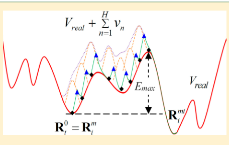
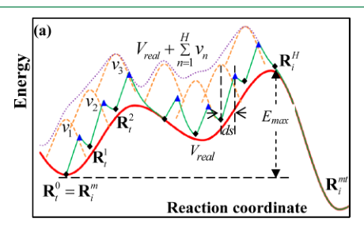
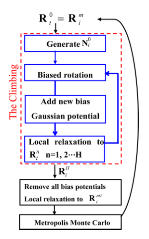
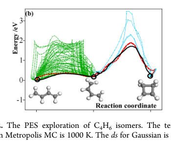
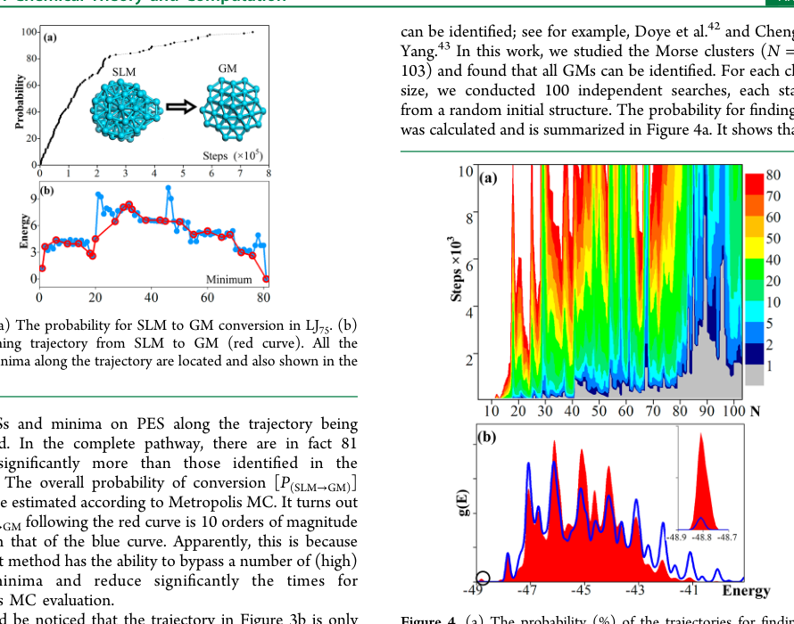
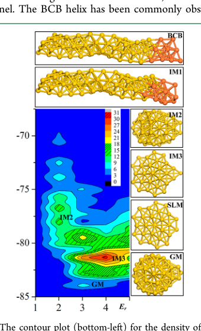
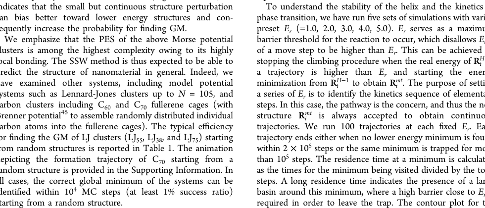
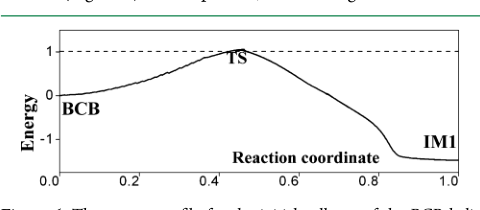

# Stochastic Surface Walking Method for Structure Prediction and Pathway Searching

## Metadata / 元数据

- **Journal / 期刊：** *Journal of Chemical Theory and Computation*
- **Published / 发表：** 2013-03-12
- **DOI：** 10.1021/ct301010b
- **Zotero key：** RQ8D5E27
- **Collection / 集合：** 07LASP
- **Source / 来源：** Zotero 本地可选取文本 PDF（8 页）。

## Why this paper / 为什么选这篇

**English:** This six-marker legacy-priority paper is a compact but unusually practical bridge between global structure search and reaction-pathway discovery. Its core distinction is methodological: SSW aims to retain pathway information while crossing high barriers, unlike methods that only seek a global minimum. That makes it a useful design reference for reaction-network exploration before committing expensive DFT/MLIP refinement, and it rotates the sequence from yesterday's TiO2 OER mechanism to a reusable PES-search workflow.

**中文：** 这篇具有六个旧标记的优先回填文献，以紧凑却高度实用的方式连接全局结构搜索与反应路径发现。其核心方法学区别在于：SSW 试图在跨越高势垒时保留路径信息，而不是仅寻找全局最低点。因此，在投入昂贵的 DFT/MLIP 精修之前，它可作为探索反应网络的工作流参考；也使阅读序列从昨日的 TiO₂ 析氧机制轮换到可复用的势能面搜索方法。

## Terminology / 术语表

| English | 中文 | Note / 说明 |
|---|---|---|
| potential energy surface (PES) | 势能面（PES） | 以原子坐标为变量的势能地形；极小值和鞍点分别对应稳定构型与过渡状态。 |
| stochastic surface walking (SSW) | 随机表面行走（SSW） | 本文提出的、以偏置势驱动爬升与 Monte Carlo 接受相结合的势能面搜索框架。 |
| global minimum (GM) | 全局最低点（GM） | 给定势能面上能量最低的构型。 |
| bias-potential-driven dynamics | 偏置势驱动动力学 | 通过附加偏置势推动体系越过高能垒的构型探索策略。 |
| Metropolis Monte Carlo (MC) | Metropolis 蒙特卡罗（MC） | 按能量差和温度接受或拒绝新构型的随机采样准则。 |
| Broyden dimer method | Broyden 二聚体方法 | 利用二聚体转动估计低曲率方向、用于爬升的局部搜索方法。 |
| transition state (TS) | 过渡状态（TS） | 反应路径上的一阶鞍点，连接反应物与产物极小值。 |
| minimum energy pathway (MEP) | 最小能量路径（MEP） | 连接两个极小值并穿过相应过渡状态的低能反应通道。 |
| limited-memory BFGS (l-BFGS) | 有限记忆 BFGS（l-BFGS） | 适用于大自由度优化的拟牛顿局部弛豫算法。 |

## Reading guide / 阅读提示

**English:** First separate the two targets: a global minimum is a thermodynamic object, whereas a transition pathway is kinetic information. Then follow the proposed climbing-and-relaxing loop (Scheme 2), checking which parts are random proposal, bias-driven crossing, local optimization, and Metropolis acceptance. Finally, read the benchmark examples as evidence of sampling performance, not as proof that any one pathway is unique or universally preferred.

**中文：** 先区分两类目标：全局最低点是热力学对象，而过渡路径提供动力学信息。随后沿着作者提出的“爬升—弛豫”循环（方案 2）阅读，明确哪些步骤属于随机提议、偏置驱动越垒、局部优化和 Metropolis 接受。最后把基准例子视为采样性能证据，而非某一条路径唯一或普适占优的证明。

## Page / Section Index

- [p.1](#page-1)
- [p.2](#page-2)
- [p.3](#page-3)
- [p.4](#page-4)
- [p.5](#page-5)
- [p.6](#page-6)
- [p.7](#page-7)

## Related Reading / 延伸阅读

**English:** No strongly recommended related paper today. This foundational method paper is most useful when read on its own terms before making a narrow comparison with a specific enhanced-sampling or structure-search implementation.

**中文：** 今日没有强制推荐的延伸论文。应先按本文自身的方法学逻辑阅读这篇奠基性工作，再针对具体体系与某一增强采样或结构搜索实现作窄范围比较。

# Bilingual Reader / 逐段中英文对照

## Page 1

**Source:** p.1 S001

**Original:** * S Supporting Information

**中文:** * S 支持信息

**Source:** p.1 S002

**Original:** ABSTRACT: We propose an unbiased general-purpose potential energy surface (PES) searching method for both the structure and the pathway prediction of a complex system. The method is based on the idea of bias-potential-driven dynamics and Metropolis Monte Carlo. A central feature of the method is able to perturb smoothly a structural configuration toward a new configuration and simultaneously has the ability to surmount the high barrier in the path. We apply the method for locating the global minimum (GM) of short-ranged Morse clusters up to 103 atoms starting from a random structure without using extra information from the system. In addition to GM searching, the method can identify the pathways for chemical reactions with large dimensionality, as demonstrated in a nanohelix transformation containing 222 degrees of freedoms.

**中文:** 摘要：我们提出了一种无偏通用势能面（PES）搜索方法，用于复杂系统的结构和路径预测。该方法基于偏置势驱动动力学和大都会蒙特卡罗的思想。该方法的一个中心特征是能够平稳地将结构配置扰动为新的配置，同时具有克服路径中的高障碍的能力。我们应用该方法从随机结构开始定位最多 103 个原子的短程莫尔斯簇的全局最小值 (GM)，而不使用系统的额外信息。除了 GM 搜索之外，该方法还可以识别大维化学反应的路径，如包含 222 个自由度的纳米螺旋变换所示。

**Source:** p.1 S003

**Original:** 1. INTRODUCTION

**中文:** 1. 简介

**Source:** p.1 S004

**Original:** Structure prediction and pathway searching are the main theme of modern computational simulation, which are essential for understanding the thermodynamics and kinetics properties of materials. While molecular dynamics (MD) has been widely utilized as a general tool for exploring the PES and simulating chemical reactions, its predictive power drops substantially for systems with large dimensionality or high barriers, such as those in protein folding or carbon nanotube growth. The traditional simulated annealing (SA) method1 based on MD can overcome the barrier of structural transformation via elevating the system temperature and aims to find the structural minimum by subsequent quenching. However, the SA method is not efficient for identifying energy minima that are not favorable in free energy or even not present at high temperatures. An efficient theoretical approach that can explore PES at low temperatures is thus highly desirable, which must, at least, be able to surmount high barriers. For studying systems with high kinetic barriers, one popular approach is to determine the associated transition states (TS) and the reaction pathway between the interested local minima.2−15 This often involves intensive intuition for guessing the likely pathways (according to the initial and the final states)4−6 and the computation of the Hessian,9 which becomes impractical for large systems, where gradient-only methods are required.7,8 To overcome these drawbacks, some alternative approaches have been designed, such as reduced gradient following, the anharmonic downward distortion following, and the artificial force induced reaction.10−15 A survey of the TSsearching methods was recently reviewed by Schlegel.2 The other class of methods can also enhance the sampling of the

**中文:** 结构预测和路径搜索是现代计算模拟的主题，对于理解材料的热力学和动力学性质至关重要。虽然分子动力学 (MD) 已被广泛用作探索 PES 和模拟化学反应的通用工具，但对于大维或高势垒的系统（例如蛋白质折叠或碳纳米管生长中的系统），其预测能力大幅下降。传统的基于MD的模拟退火（SA）方法可以通过提高系统温度来克服结构转变的障碍，并旨在通过后续淬火找到结构最小值。然而，SA 方法对于识别在自由能中不利甚至在高温下不存在的能量最小值而言效率不高。因此，非常需要一种能够在低温下探索 PES 的有效理论方法，它至少必须能够克服高障碍。对于研究具有高动力学势垒的系统，一种流行的方法是确定相关的过渡态 (TS) 和感兴趣的局部最小值之间的反应路径。2−15 这通常需要强烈的直觉来猜测可能的路径（根据初始和最终状态）4−6 和 Hessian,9 的计算，这对于需要仅梯度方法的大型系统来说变得不切实际。7,8 为了克服这些缺点，已经设计了一些替代方法，例如减少梯度跟随，非谐波向下失真跟随，以及人为力引起的反应。10−15 Schlegel 最近审查了 TS 搜索方法的调查。2 另一类方法也可以增强对 TS 搜索方法的采样。

**Source:** p.1 S005

**Original:** Article

**中文:** 文章

**Source:** p.1 S006

**Original:** high barrier events by enforcing constraints (e.g., bias potential) along a predefined reaction direction,16−19 such as metadynamics and umbrella sampling. As seen from Scheme 1, these

**中文:** 通过沿着预定义的反应方向施加约束（例如，偏置电位）来控制高势垒事件，16−19 例如元动力学和伞式采样。从方案1可以看出，这些

**Source:** p.1 S007

**Original:** aThe dotted lines indicate the transformed PES as treated by BH20

**中文:** a虚线表示经BH20处理的转化PES

**Source:** p.1 S008

**Original:** and GA (Lamarckian type26) methods; the crossed area indicates the filling of the energy wells by added potentials as utilized in metadynamics.16

**中文:** 和 GA（拉马克 26 型）方法；交叉区域表示通过元动力学中使用的附加电势填充能量井。 16

**Source:** p.1 S009

**Original:** targeted MD based methods can only visit other faraway minima (the white region) after all the nearby minima (the crossed region) have been filled by added bias potentials. This makes these techniques not ideal for a fast PES sampling over a large dimensionality, and instead they are often utilized for finding the pathway of a single reaction process where a priori knowledge on the constraint is known.

**中文:** 基于定向 MD 的方法只能在所有附近的最小值（交叉区域）被添加的偏置电位填充后才能访问其他遥远的最小值（白色区域）。这使得这些技术对于大维度上的快速 PES 采样来说并不理想，相反，它们通常用于寻找已知约束先验知识的单个反应过程的路径。

### Scheme 1. 方案 1. 一维 PESa 原理图

**Placed near:** p.1 S009

**Source:** p.1 C001

**Original caption:** Scheme 1. A Schematic 1-D PESa

**中文图注:** 方案 1. 一维 PESa 原理图

**Reading note / 阅读提示：** Read this visual with the adjacent evidence and stated model conditions; it is placed at the first substantive extracted mention. / 请结合邻近证据与作者明确的模型条件解读该图表；它已放在首次实质讨论位置。

## Page 2

**Source:** p.2 S010

**Original:** By contrast, the so-called global minimum (GM) searching methods, such as basin-hopping (BH)20−22 and genetic algorithms (GAs),23−26 are targeted to find the GM, the most stable structure on PES, while discarding totally the pathway information. The BH method introduced by the Wales group is particularly powerful for structure prediction in many applications, ranging from clusters to biomolecules.20−22,27,28

**中文:** 相比之下，所谓的全局最小值（GM）搜索方法，例如盆地跳跃（BH）20−22 和遗传算法（GAs），23−26 的目标是找到 GM（PES 上最稳定的结构），同时完全丢弃路径信息。威尔士小组引入的 BH 方法对于从簇到生物分子的许多应用中的结构预测特别强大。20−22,27,28

**Source:** p.2 S011

**Original:** These methods transform the original PES, with only the information on the minimum configuration being preserved, as depicted by the dotted lines in Scheme 1. In these methods, an aggressive (random) structural deformation is a must to escape from deep energy traps on PES. A natural consequence of the aggressive structural deformation is that it can destroy indiscriminately the bondings in the current structural configuration, including those preferred bonding motifs, and thus extra constraints are often needed as input to treat covalent bonding molecular systems.29

**中文:** 这些方法改变了原始的PES，仅保留了最小构型的信息，如方案1中的虚线所示。在这些方法中，为了逃离PES上的深层能量陷阱，必须进行积极的（随机）结构变形。侵略性结构变形的自然后果是，它可以不加区别地破坏当前结构配置中的键合，包括那些优选的键合基序，因此通常需要额外的约束作为输入来处理共价键合分子系统。 29

**Source:** p.2 S012

**Original:** In this work, we propose a new unbiased general purpose PES searching method, namely the stochastic surface walking method (SSW), inspired by our previous work for continuous TS searching using the biased potential driven constrained Broyden dimer method (BP-CBD).30,31 The SSW method proposed here is based on the idea of bias-potential-driven dynamics17 and Metropolis Monte Carlo (MC),32 which manipulates smoothly the structural configuration from one minimum to another on PES and relies on Metropolis MC to accept or refuse each move. The method can explore a complex PES with high efficiency without the need for a priori knowledge on the system such as the structure motif of materials. The minimum structures, both local and global, can be obtained from SSW searching trajectories, while the information on the reaction pathways connecting the minima is also preserved. We demonstrate the method in both small molecular systems and large nanostructures for structure and pathway prediction using either first principles density functional theory (DFT) or empirical potential calculations.

**中文:** 在这项工作中，我们提出了一种新的无偏通用 PES 搜索方法，即随机表面行走方法 (SSW)，其灵感来自我们之前使用偏置电势驱动约束 Broyden 二聚体方法 (BP-CBD) 进行连续 TS 搜索的工作。 30,31 这里提出的 SSW 方法基于偏置电势驱动动力学 17 和 Metropolis Monte Carlo (MC) 的思想，32 平滑地操纵 PES 上的结构配置从一个最小值到另一个最小值并依赖 Metropolis MC 接受或拒绝每一步行动。该方法可以高效地探索复杂的PES，而不需要系统的先验知识，例如材料的结构基序。从SSW搜索轨迹中可以获得局部和全局的最小结构，同时也保留了连接最小值的反应路径的信息。我们使用第一性原理密度泛函理论 (DFT) 或经验势计算在小分子系统和大型纳米结构中演示了用于结构和路径预测的方法。

**Source:** p.2 S013

**Original:** 2. METHOD Each step in SSW (a MC step) comprises three independent parts, namely, (i) the climbing, (ii) the relaxation, and (iii) the Metropolis MC. One such a step is called a MC step. The illustration in Figure 1 is such a step containing the climbing and the relaxation on a simplified 1D-PES from one minimum to another. The climbing procedure lies at the heart of the SSW method and is elaborated below in detail.

**中文:** 2. 方法 SSW 中的每个步骤（MC 步骤）由三个独立的部分组成，即（i）攀登、（ii）放松和（iii）Metropolis MC。这样的一个步骤称为 MC 步骤。图 1 中的说明就是这样一个步骤，包含在简化的 1D-PES 上从一个最小值到另一个最小值的爬升和松弛。攀爬过程是 SSW 方法的核心，下面将详细阐述。

**Source:** p.2 S014

**Original:** The Climbing. The climbing procedure of the SSW is a bias-potential-driven climbing and local optimization process. In the procedure, one needs first to generate a random direction Ni 0 at the current minimum Ri m, where “i” is the index of the current MC step. Next, according to Ni 0, Ri m is gradually dragged to a high energy configuration Ri H. To enable an unbiased exploration of PES, the initial direction Ni 0 is a randomly generated function of the ionic coordinates. In the SSW method, we generate Ni 0 by combining two randomly generated direction Ni g and Ni l, as eq 1.

**中文:** 攀登。 SSW的爬升过程是一个偏置势驱动的爬升和局部优化过程。在该过程中，首先需要在当前最小值Ri m 处生成随机方向Ni 0 ，其中“i”是当前MC步骤的索引。接下来，根据Ni 0 ，Ri m 逐渐被拖动到高能构型Ri H 。为了能够对PES进行无偏探索，初始方向Ni 0 是离子坐标的随机生成的函数。在SSW方法中，我们通过组合两个随机生成的方向Ni g和Ni l来生成Ni 0，如式1所示。

**Source:** p.2 S015

**Original:** λ λ = + | + | N N N N N ( )/ i i g i l i g i l 0 (1)

**中文:** λ λ = + | + | N N N N N ( )/ i i 吉 吉 吉 0 (1)

**Source:** p.2 S016

**Original:** where the mixing parameter λ controls the relative portion of these two displacement directions. In this work, λ is a random value from 0.1 to 1.5 in each step. Specifically, we set Ni g as a randomly generated normalized vector, the distribution of which satisfies the Maxwell−Boltzmann velocity distribution at 300 K, as utilized in the standard molecular dynamics method for generating initial random velocity. As Ni g distributes over a group of atoms, it mainly consists of soft global move. On the other hand, Ni l describes the stifflocal move by design, and in our implementation it was set as a bond formation mode between two non-neighboring atoms as utilized previously.31

**中文:** 其中混合参数 λ 控制这两个位移方向的相对部分。在这项工作中，每一步中 λ 是 0.1 到 1.5 之间的随机值。具体来说，我们将 Ni g 设置为随机生成的归一化向量，其分布满足 300 K 时的麦克斯韦-玻尔兹曼速度分布，如标准分子动力学方法中用于生成初始随机速度的那样。由于Ni g 分布在一组原子上，因此它主要由软全局移动组成。另一方面，Ni l 通过设计描述了刚性局部移动，在我们的实现中，它被设置为两个不相邻原子之间的键形成模式，如之前所使用的。 31

**Source:** p.2 S017

**Original:** For example, a bond formation mode Ni l associated with the atom A (e.g., the first atom in system) and the atom B (the second atom in system) can be derived as eq 2, using their coordinates qA and qB. Unlike the previous BP-CBD method where a known atomic pair is provided to indicate the desired reaction direction, in the SSW method the atom pair is chosen randomly provided that the two atoms are not in close contact (i.e., their distance > 3 Å).

**中文:** 例如，与原子A(例如，系统中的第一个原子)和原子B(系统中的第二个原子)相关的键形成模式N11可以使用它们的坐标qA和qB导出为等式2。与之前提供已知原子对来指示所需反应方向的 BP-CBD 方法不同，在 SSW 方法中，只要两个原子不紧密接触（即它们的距离 > 3 Å），原子对是随机选择的。

**Source:** p.2 S018

**Original:** ⎜ ⎜ ⎜ ⎜

**中文:** ⎜⎜⎜⎜

**Source:** p.2 S019

**Original:** ⎟ ⎟ ⎟ ⎟

**中文:** ⎟⎟⎟⎟

**Source:** p.2 S020

**Original:** ⎟ ⎟ ⎟ ⎟

**中文:** ⎟⎟⎟⎟

**Source:** p.2 S021

**Original:** ⎜ ⎜ ⎜ ⎜

**中文:** ⎜⎜⎜⎜

**Source:** p.2 S022

**Original:** q N

**中文:** qN

**Source:** p.2 S023

**Original:** 0 0 i l

**中文:** 0 0 我l

**Source:** p.2 S024

**Original:** (2)

**中文:** (2)

**Source:** p.2 S025

**Original:** Once Ni 0 is ready, a biased dimer rotation method is utilized to refine this randomly generated mode. The biased dimer rotation method has been utilized previously for identifying the TS of reaction in BP-CBD method.30,31 It was found that the biased rotation algorithm is essential to retaining the key message from Ni 0 and can also take into account the other useful information from the real PES. The details of the method can be found in the BP-CBD method,31 and here it is only briefly introduced, as eqs 3−6.

**中文:** 一旦 Ni 0 准备好，就利用偏向二聚体旋转方法来完善这种随机生成的模式。偏向二聚体旋转方法之前已用于识别 BP-CBD 方法中反应的 TS。30,31 研究发现，偏向旋转算法对于保留 Ni 0 的关键信息至关重要，并且还可以考虑来自真实 PES 的其他有用信息。该方法的细节可以在BP-CBD方法中找到，31这里仅简单介绍，如式3−6。

**Source:** p.2 S026

**Original:** = + ·ΔR R R Nt 1 0 (3)

**中文:** = +·ΔR R R Nt 1 0 (3)

**Source:** p.2 S027

**Original:** = − • Δ C R F F N ( ) t 0 1

**中文:** = − • Δ C R F F N ( ) t 0 1

**Source:** p.2 S028

**Original:** (4)

**中文:** (4)

**Source:** p.2 S029

**Original:** = + V V V R N 1 real (5)

**中文:** = + V V V R N 1 实数 (5)

**Source:** p.2 S030

**Original:** = − · − • = − · Δ · • V a a R R R N N N 2 [( ) ] 2 ( ) N i t i 1 0 0 2 0 2

**中文:** = − · − • = − · Δ · • V a a R R R N N N 2 [( ) ] 2 ( ) N i t i 1 0 0 2 0 2

**Source:** p.2 S031

**Original:** (6)

**中文:** (6)

**Source:** p.2 S032

**Original:** In the dimer rotation,33 one needs to define two images separated by a fixed distance of ΔR (e.g., ΔR = 0.005 Å) on PES, namely R0 and R1 (eq 3). The rotation of the dimer vector N according to their force (F0 and F1) will provide the local curvature information (C in eq 4). The dimer rotation is a numerical way to identify one eigenvector of the Hessian.7,8,33

**中文:** 在二聚体旋转中，33需要在 PES 上定义以固定距离 ΔR（例如 ΔR = 0.005 Å）分隔的两个图像，即 R0 和 R1（式 3）。二聚体向量 N 根据其力（F0 和 F1）进行旋转将提供局部曲率信息（等式 4 中的 C）。二聚体旋转是一种识别 Hessian 特征向量的数值方法。7,8,33

**Source:** p.2 S033

**Original:** For the biased rotation proposed by us previously,31 the

**中文:** 对于我们之前提出的有偏旋转，31

**Source:** p.2 S034

**Original:** dx.doi.org/10.1021/ct301010b | J. Chem. Theory Comput. 2013, 9, 1838−1845 1839

**中文:** dx.doi.org/10.1021/ct301010b | J.化学。理论计算。 2013, 9, 1838−1845 1839

### Figure 1. 图 1. 1D-PES 中的 SSW 方法的图示

**Placed near:** p.2 S034

**Source:** p.2 C002

**Original caption:** Figure 1. An illustration of the SSW method in 1D-PES. The red, orange, purple, and green curves represent the real PES (Vreal), the Gaussian functions (vn, n = 1, 2, ...H), the modified PES, and the searching trajectory, respectively.

**中文图注:** 图 1. 1D-PES 中的 SSW 方法的图示。红色、橙色、紫色和绿色曲线分别代表真实的 PES (Vreal)、高斯函数 (vn, n = 1, 2, ...H)、修改后的 PES 和搜索轨迹。

**Reading note / 阅读提示：** Read this visual with the adjacent evidence and stated model conditions; it is placed at the first substantive extracted mention. / 请结合邻近证据与作者明确的模型条件解读该图表；它已放在首次实质讨论位置。

## Page 3

**Source:** p.3 S035

**Original:** potential of R1 is modified as eq 5, where VN is the bias potential added to the real PES Vreal of R1 that is a quadratic function of coordinates R1 along Ni 0 (eq 6). As long as the parameter a (eq 6) is large enough, the biased rotation can guarantee the rotation of the dimer will not deviate far away from Ni 0. The force due to the bias potential can be evaluated straightforwardly31 for constraining the dimer rotation. On moving from Ri m to a high energy configuration Ri H, a modified PES Vm‐to‐H is utilized, as shown in eq 7, in which a series of bias Gaussian potential vn (n is the index of the bias potential, n = 1, 2, ...H) is added one by one consecutively along the direction Ni n.

**中文:** R1 的电势被修改为等式 5，其中 VN 是添加到 R1 的实际 PES Vreal 的偏置电势，它是沿 Ni 0 的坐标 R1 的二次函数（等式 6）。只要参数a（eq 6）足够大，偏向旋转就可以保证二聚体的旋转不会偏离Ni 0 太远。可以直接评估偏向电位产生的力31以约束二聚体旋转。从 Ri m 移动到高能构型 Ri H 时，采用了改进的 PES Vm-to-H，如式 7 所示，其中一系列偏置高斯势 vn （n 是偏置势的索引，n = 1, 2, ...H）沿 Ni n 方向逐个连续相加。

**Source:** p.3 S036

**Original:** = +

**中文:** = +

**Source:** p.3 S037

**Original:** V V v

**中文:** 电压VV

**Source:** p.3 S038

**Original:** ‐ ‐ =

**中文:** ‐‐=

**Source:** p.3 S039

**Original:** m H n

**中文:** mHn

**Source:** p.3 S040

**Original:** to real 1

**中文:** 到真实1

**Source:** p.3 S041

**Original:** H 1 2

**中文:** H 1 2

**Source:** p.3 S042

**Original:** n n t t n i n

**中文:** 恩恩恩恩恩恩

**Source:** p.3 S043

**Original:** = + × − − ·

**中文:** = + × − − ·

**Source:** p.3 S044

**Original:** R R N exp[ (( ) )

**中文:** R R N exp[ (( ) )

**Source:** p.3 S045

**Original:** V w

**中文:** 电压

**Source:** p.3 S046

**Original:** real 1

**中文:** 真实1

**Source:** p.3 S047

**Original:** 2 (7)

**中文:** 2（7）

**Source:** p.3 S048

**Original:** /(2 )]

**中文:** /(2)]

**Source:** p.3 S049

**Original:** ⎣ ⎢ ⎤

**中文:** ⎣ ⎢ ⎤

**Source:** p.3 S050

**Original:** t t n i n

**中文:** ttn

**Source:** p.3 S051

**Original:** 1 2

**中文:** 1 2

**Source:** p.3 S052

**Original:** ∑ = + · − − ·

**中文:** Σ = + · − − ·

**Source:** p.3 S053

**Original:** F F R R N

**中文:** F F R R N

**Source:** p.3 S054

**Original:** exp (( ) )

**中文:** 指数 (( ) )

**Source:** p.3 S055

**Original:** ⎦ ⎥ w ds

**中文:** ⎦ ⎥ w ds

**Source:** p.3 S056

**Original:** tot real

**中文:** 总实数

**Source:** p.3 S057

**Original:** n n

**中文:** 恩恩

**Source:** p.3 S058

**Original:** t t n i n

**中文:** ttn

**Source:** p.3 S059

**Original:** − · ·

**中文:** −··

**Source:** p.3 S060

**Original:** R R N

**中文:** RRN

**Source:** p.3 S061

**Original:** ( )

**中文:** ( )

**Source:** p.3 S062

**Original:** i n

**中文:** 在

**Source:** p.3 S063

**Original:** 2 (8)

**中文:** 2 (8)

**Source:** p.3 S064

**Original:** Ni n is always updated from the initial random direction Ni 0 using the biased dimer rotation method mentioned above. In eq 7, the w and the ds are the height and the width of Gaussian function vn; Rt n represents the nth local minima along the movement trajectory on the modified PES that is created after adding n Gaussian functions. The PES at Rt n is defined by Vm‐to‐n = Vreal + ∑k=1 n vk. To summarize, the movement from Ri m to Ri H is a repeated procedure containing (i) updating the direction Ni n at Rt n−1, (ii) adding a new Gaussian function vn and displacing Rt n−1 along the direction Ni n by a magnitude of ds (Rt n−1 + Ni n·ds), and (iii) local relaxing to Rt n on the modified PES (the energy minimization is constrained by the added potentials). The force for the local optimization on the modified PES can be evaluated according to eq 8. The other detail on the climbing process has been described in the biased translation algorithm in the BP-CBD method,31 which is aimed for moving a configuration from IS to a TS region. The Gaussian width ds is a critical parameter controlling the step length of surface walking. A typical value ranges from 0.2 to 0.6 Å, being 10% to 40% of the bond length of chemical bonding. With a large ds, a large scope of PES can be explored rapidly, but it is at the expense of the resolution on the reaction pathway between minima. The max number of Gaussian potentials (H) is also a system-dependent parameter. In this work, unless specifically mentioned, we set it as 14, which is equivalent to an overall displacement of 4−5 Å per MC step. Obviously, the overall efficiency of the SSW method depends on the choice of ds and H. As for the SSW method applying to a complex PES (e.g., with multiple funnels and high barrier) with H = 14, typically 70∼80% of computational efforts (energy and gradient evaluation) are spent on the climbing process because of the repeated procedure in adding bias potential and relaxing, and the remaining 20∼30% is in the relaxation step to the minimum. As we will show in the examples (section 3), the smooth perturbation in the climbing, although it is computa-

**中文:** Ni n 总是使用上述偏向二聚体旋转方法从初始随机方向Ni 0 更新。式7中，w和ds分别为高斯函数vn的高度和宽度； Rt n 表示在添加 n 个高斯函数后创建的修改后的 PES 上沿着运动轨迹的第 n 个局部最小值。 Rt n 处的 PES 定义为 Vm-to-n = Vreal + Σk=1 n vk。总而言之，从 Ri m 到 Ri H 的移动是一个重复的过程，其中包含 (i) 更新 Rt n−1 处的方向 Ni n，(ii) 添加新的高斯函数 vn 并将 Rt n−1 沿方向 Ni n 位移 ds (Rt n−1 + Ni n·ds) 的量级，以及 (iii) 在修改后的 PES 上局部松弛至 Rt n（能量最小化受到添加电势的约束）。修改后的 PES 上的局部优化力可以根据等式 8 进行评估。攀爬过程的其他细节已在 BP-CBD 方法中的偏置平移算法中描述，31 旨在将配置从 IS 移动到 TS 区域。高斯宽度 ds 是控制表面行走步长的关键参数。典型值范围为 0.2 至 0.6 Å，为化学键合键长的 10% 至 40%。 ds 越大，可以快速探索大范围的 PES，但这是以牺牲极小值之间反应路径的分辨率为代价的。高斯势的最大数量 (H) 也是一个与系统相关的参数。在这项工作中，除非特别提到，我们将其设置为 14，相当于每个 MC 步骤的总体位移 4−5 Å。显然，SSW方法的整体效率取决于ds和H的选择。对于应用于H = 14的复杂PES（例如，具有多个漏斗和高势垒）的SSW方法，由于添加偏置电位和松弛的重复过程，通常70∼80%的计算工作（能量和梯度评估）花费在爬升过程上，剩余的20∼30%处于最小松弛步骤。正如我们将在示例（第 3 节）中所示，爬升过程中的平滑扰动，尽管它是计算出来的

**Source:** p.3 S065

**Original:** tionally intensive, helps to increase greatly the probability for visiting low energy structures, and thus the method overall is efficient for complex systems. Overall Algorithm. We have illustrated the whole procedure of the SSW method in Scheme 2 and the algorithm can be described as follows: Step 1: Generate an initial random direction Ni 0 at the current minimum Ri m. Set n = 1 and Rt 0 = Ri m. Step 2: Refine Ni 0 to Ni n by using biased dimer rotation method. Step 3: Add the nth Gaussian function to the PES and displace Rt n−1 by a magnitude of ds along Ni n. Step 4: Relax locally the structure to a new minimum Rt n on the modified PES and make n = n + 1. The limited memory BFGS (l-BFGS) method34 is utilized for the structural optimization. Step 5: Stop the climbing procedure if (i) the number of the Gaussian, “n,” is larger than the maximum Gaussian number (H) or (ii) the energy of the local minimum Rt n is lower than the energy of the initial Ri m; otherwise, repeat steps 2−4. Step 6: Remove all the added bias potentials and optimize the current structure to a new minimum Ri mt on the real PES. The l-BFGS method34 is utilized for the structural optimization. Step 7: According to the Metropolis Monte Carlo scheme, the probability P of accepting the new configuration Ri mt by making Ri+1 m = Ri mt is

**中文:** 思想密集，有助于大大增加访问低能量结构的概率，因此该方法总体上对于复杂系统是有效的。总体算法。我们在方案2中说明了SSW方法的整个过程，该算法可以描述如下： 步骤1：在当前最小值Ri m 处生成初始随机方向Ni 0 。设置 n = 1 且 Rt 0 = Ri m。步骤2：采用偏向二聚体旋转法将Ni 0 精制为Ni n 。步骤 3：将第 n 个高斯函数添加到 PES 中，并沿 Ni n 将 Rt n−1 位移 ds 大小。步骤 4：在修改后的 PES 上将结构局部松弛到新的最小 Rt n，并使 n = n + 1。有限内存 BFGS (l-BFGS) 方法 34 用于结构优化。步骤5：如果(i)高斯数“n”大于最大高斯数(H)或(ii)局部最小值Rt n 的能量低于初始Ri m 的能量，则停止爬升过程；否则，重复步骤 2−4。步骤 6：去除所有添加的偏置电位，并将当前结构优化至真实 PES 上的新的最小 Ri mt。 l-BFGS 方法34 用于结构优化。步骤7：根据Metropolis Monte Carlo方案，通过使Ri+1 m = Ri mt接受新配置Ri mt的概率P为

**Source:** p.3 S066

**Original:** = − > ⎧

**中文:** = − > ⎧

**Source:** p.3 S067

**Original:** i m i mt i mt i m

**中文:** 我我我我我我我

**Source:** p.3 S068

**Original:** E E RT E E R R R R exp[ ( ) ( ) / ], when ( ) ( )

**中文:** E E RT E E R R R R exp[ ( ) ( ) / ], 当 ( ) ( )

**Source:** p.3 S069

**Original:** ⎨ ⎪

**中文:** ⎨ ⎪

**Source:** p.3 S070

**Original:** ⎩ ⎪ P

**中文:** ⎩ ⎪ P

**Source:** p.3 S071

**Original:** 1, otherwise

**中文:** 1、否则

**Source:** p.3 S072

**Original:** (9)

**中文:** (9)

**Source:** p.3 S073

**Original:** where E(X) is the energy of the structure X. Step 8: Make i = i + 1 and repeat the steps 1−7. It should be noticed that all saddle points (TSs) are no longer located explicitly in the SSW method. This is because (i) by using reduced ds, the barrier of the pathway can be estimated reasonably well without knowing the TS (see examples below) and (ii) TSs can always be located exactly afterward when

**中文:** 其中 E(X) 是结构 X 的能量。 步骤 8：使 i = i + 1 并重复步骤 1−7。应该注意的是，所有鞍点 (TS) 不再在 SSW 方法中明确定位。这是因为 (i) 通过使用减少的 ds，可以在不知道 TS 的情况下很好地估计路径的障碍（参见下面的示例），并且 (ii) 始终可以在之后准确定位 TS

**Source:** p.3 S074

**Original:** dx.doi.org/10.1021/ct301010b | J. Chem. Theory Comput. 2013, 9, 1838−1845 1840

**中文:** dx.doi.org/10.1021/ct301010b | J.化学。理论计算。 2013, 9, 1838−1845 1840

### Scheme 2. 方案2 SSW方法的总体算法

**Placed near:** p.3 S074

**Source:** p.3 C003

**Original caption:** Scheme 2. The Overall Algorithm of the SSW Method

**中文图注:** 方案2 SSW方法的总体算法

**Reading note / 阅读提示：** Read this visual with the adjacent evidence and stated model conditions; it is placed at the first substantive extracted mention. / 请结合邻近证据与作者明确的模型条件解读该图表；它已放在首次实质讨论位置。

## Page 4

**Source:** p.4 S075

**Original:** reaction pathways are known. As only lowest energy pathways are vital kinetically, to determine TSs for all reaction channels is tedious and unnecessary. The current SSW method has some similarities to the previous methods using TS searching methods (e.g., eigenvector-following35,36) to explore the PES in the sense that the pathways linking the minima are present in the searching trajectory. However, the SSW method does not locate TS explicitly. By adding bias potentials consecutively, the PES has been coarse-grained, and the minimum reached in one MC step of SSW searching can be several minima away from the initial minimum. By applying to various examples, we will show that the SSW method is efficient for a range of complex PES systems, including covalent molecules and model clusters such as Lennard-Jones clusters (demonstrated previously in the discrete path sampling framework37,38) and short-ranged Morse clusters. The success of the SSW method for exploring PES rapidly lies with two aspects: (i) the SSW saves the computation efforts for not locating the TS exactly, as addressed above; (ii) the SSW can bypass effectively the high energy minima without visiting them explicitly. This is found to be important for finding the GM in a complex PES, e.g., those of double funnels (see below section 3.2 for detail). Two important features of the SSW method should be pointed out. First, it can provide directly useful information on kinetics, including the barrier height and reaction pathway. From the searching trajectory, a series of structures (Rt n) along the pathway can be obtained (see Figure 1), and the highest energy point (Emax, as labeled in Figure 1) is a good indication for the barrier height of the reaction provided that the ds of Gaussian is not too large. Second, the probability for one reaction to occur depends no longer exponentially on its barrier. In the SSW method, whether a reaction occurs depends only on whether its associated normal mode is selected by the random mode generation procedure.

**中文:** 反应途径是已知的。由于只有最低能量途径在动力学上才至关重要，因此确定所有反应通道的 TS 是繁琐且不必要的。当前的 SSW 方法与以前使用 TS 搜索方法（例如特征向量跟随 35,36）探索 PES 的方法有一些相似之处，因为连接最小值的路径存在于搜索轨迹中。然而，SSW方法并没有明确定位TS。通过连续添加偏置电位，PES已经粗粒度化，并且SSW搜索的一个MC步骤中达到的最小值可以远离初始最小值几个最小值。通过应用各种示例，我们将证明 SSW 方法对于一系列复杂的 PES 系统是有效的，包括共价分子和模型簇，例如 Lennard-Jones 簇（之前在离散路径采样框架中演示过37,38）和短程 Morse 簇。 SSW方法在快速探索PES方面的成功在于两个方面：（i）SSW节省了如上所述的无法准确定位TS的计算量； (ii) SSW 可以有效地绕过高能量最小值，而无需明确访问它们。人们发现这对于在复杂的 PES（例如双漏斗的 PES）中寻找 GM 很重要（详细信息请参见下面的 3.2 节）。应该指出SSW方法的两个重要特征。首先，它可以提供直接有用的动力学信息，包括势垒高度和反应路径。从搜索轨迹中，可以获得沿路径的一系列结构（Rt n）（见图1），并且只要高斯的ds不太大，最高能量点（Emax，如图1中标记）可以很好地指示反应的势垒高度。其次，一种反应发生的概率不再与其势垒呈指数关系。在SSW方法中，反应是否发生仅取决于随机模式生成过程是否选择了其相关的正常模式。

**Source:** p.4 S076

**Original:** 3. RESULTS AND DISCUSSION

**中文:** 3 结果与讨论

**Source:** p.4 S077

**Original:** 3.1. C4H6 Conformation. To illustrate the SSW method, we first apply the method to a simple molecular system, C4H6 isomers, where first principles DFT calculations at the GGAPBE level39 are utilized to obtain the energy and the force. A single run of 90 steps was performed starting from transbutadiene, the most stable isomer. In total, we identify four isomers in 90 steps, being transand cis-butadiene, cyclobutene, and a high energy radical. The trajectory connecting the lowest three minima is plotted in Figure 2. There are 61 times for trans-to-cis butadiene chain rotation (green curves). The second most common conversion (five times) is the ring-closing reaction from cis-butadienes to cyclobutene. The trajectories to form the high energy radical (three times) are only of minor contribution. It is clear that while the low barrier chain rotation still dominates the isomer conversion, the sampling of the high barrier ring-closing reaction is now much more efficient. It is noticed that the lowest Emax for cis-to-trans transformation is 0.36 eV and that for cis/trans-to-cyclo transformation is 1.75 eV (shown by the red curve) from the searching trajectory, which are in good agreement with those determined exactly (0.33 and 1.56 eV) by TS location. Within a short run, one can identify all three lowest energy isomers and also estimate the barriers leading to them. It might be mentioned that there are many other isomers for C4H6 that are however much less stable than the three

**中文:** 3.1. C4H6 构象。为了说明 SSW 方法，我们首先将该方法应用于简单的分子系统 C4H6 异构体，其中利用 GGAPBE 级别的第一原理 DFT 计算来获得能量和力。从最稳定的异构体反丁二烯开始，进行了 90 个步骤的单次运行。总共，我们通过 90 个步骤鉴定了四种异构体，即反式和顺式丁二烯、环丁烯和高能自由基。连接最低三个最小值的轨迹如图 2 所示。反式丁二烯链旋转至顺式丁二烯链有 61 次（绿色曲线）。第二个最常见的转化（五次）是从顺式丁二烯到环丁烯的闭环反应。形成高能自由基（三次）的轨迹仅起到很小的作用。很明显，虽然低势垒链旋转仍然主导异构体转化，但高势垒闭环反应的采样现在效率更高。值得注意的是，从搜索轨迹来看，顺式到反式变换的最低 Emax 为 0.36 eV，顺式/反式到环式变换的最低 Emax 为 1.75 eV（如红色曲线所示），这与 TS 位置精确确定的值（0.33 和 1.56 eV）非常吻合。在短期内，人们可以识别所有三种能量最低的异构体，并估计导致它们的障碍。可能要提到的是，C4H6 还有许多其他异构体，但它们的稳定性比这三种异构体要差得多。

**Source:** p.4 S078

**Original:** presented in Figure 2. By increasing ds to 0.4 Å and the total MC step to 150, we performed a second run and then identified five other isomers, including buta-1,2-diene, methylenecyclopropane, bicyclo[1.1.0]butane, 3-methylcycloprop-1-ene, and 1methylcycloprop-1-ene. Each of them appears only once out of 150 MC steps, indicating that a high barrier is present to generate these unstable isomers. 3.2. Lennard-Jones 75 Cluster. The Lennard-Jones cluster with 75 atoms (LJ75), the PES of which is known to have double funnels,20,40 was then utilized to test the ability of our method for surmounting high barrier events while identifying the low energy structures. The potential is described by

**中文:** 如图 2 所示。通过将 ds 增加到 0.4 Å，总 MC 步长增加到 150，我们进行了第二次运行，然后鉴定了其他五种异构体，包括 1,2-二烯丁烷、亚甲基环丙烷、双环[1.1.0]丁烷、3-甲基环丙-1-烯和 1-甲基环丙-1-烯。它们中的每一个仅在 150 个 MC 步骤中出现一次，表明存在产生这些不稳定异构体的高势垒。 3.2.伦纳德-琼斯 75 星团。然后利用具有 75 个原子的 Lennard-Jones 簇 (LJ75)（已知其 PES 具有双漏斗）20,40 来测试我们的方法在识别低能结构的同时克服高势垒事件的能力。潜力描述为

**Source:** p.4 S079

**Original:** i j ij ij LJ 12 6

**中文:** ij ij ij LJ 12 6

**Source:** p.4 S080

**Original:** ∑ σ σ = ε −

**中文:** Σ σ σ = ε −

**Source:** p.4 S081

**Original:** < V r r 4 [( / ) ( / ) ]

**中文:** < V r r 4 [( / ) ( / ) ]

**Source:** p.4 S082

**Original:** (10)

**中文:** (10)

**Source:** p.4 S083

**Original:** where ε and σ are the pair equilibrium well depth and separation, respectively (we set ε = 1 and σ = 2.7). The identification of the GM of LJ75 is hard because the funnel associated with GM (a Marks’ decahedron) is much narrower than that of the second lowest minimum (SLM, a Mackey icosahedron), and both the high barrier (∼10 ε) and the large spatial gap (∼100 σ) are present between SLM and GM.37 By starting from the SLM, the trajectories for converting SLM to GM were collected, and the results are shown in Figure 3, which are averaged over 100 independent runs, each with 106 steps. The MC temperature is 0.8 and the Gaussian ds is 0.6. A minimum is reached when the maximal force on each coordinate is less than 0.04 ε/σ. We found that 1.10 × 105 steps are required to achieve a 50% probability for finding the GM (0.53 × 105 on average) and 7.43 × 105 steps for ∼100% (1.69 × 105 on average). On average, each MC step requires evaluation 378 times for the energy and gradient, in which 78% is spent in the climbing and 22% for relaxing to the minimum. The large number of the averaged simulation steps is mainly due to the repeated SLM-to-SLM trajectories, although the shortest trajectory for the SLM-to-GM conversion contains as low as 23 MC steps. It is intriguing how the SSW method surmounts the high barrier and walks through the large structural gap in between SLM and GM. To answer this, we selected one short trajectory (23 minima) from SLM to GM, as shown by the red curve in Figure 3b, and compared it with the complete pathway (the blue curve) with

**中文:** 其中ε和σ分别是对平衡井深度和间距（我们设置ε = 1和σ = 2.7）。 LJ75 的 GM 识别很困难，因为与 GM（马克斯十面体）相关的漏斗比第二最低最小值（SLM，麦基二十面体）的漏斗窄得多，并且 SLM 和 GM 之间存在高势垒（∼10 ε）和大空间间隙（∼100 σ）。 37 从 SLM 开始，收集了将 SLM 转换为 GM 的轨迹，并结果如图 3 所示，是 100 次独立运行的平均值，每次运行有 106 个步骤。 MC温度为0.8，高斯ds为0.6。当每个坐标上的最大力小于 0.04 ε/σ 时，达到最小值。我们发现需要 1.10 × 105 步才能以 50% 的概率找到 GM（平均为 0.53 × 105），而需要 7.43 × 105 步才能找到 GM（平均为 1.69 × 105）。平均每个MC步骤需要对能量和梯度进行378次评估，其中78%用于攀爬，22%用于放松到最低限度。大量平均模拟步骤主要是由于重复的 SLM 到 SLM 轨迹，尽管 SLM 到 GM 转换的最短轨迹包含低至 23 个 MC 步骤。有趣的是，SSW 方法如何克服高障碍，并跨越 SLM 和 GM 之间巨大的结构差距。为了回答这个问题，我们选择了从 SLM 到 GM 的一条短轨迹（23 个最小值），如图 3b 中的红色曲线所示，并将其与完整路径（蓝色曲线）进行比较：

**Source:** p.4 S084

**Original:** dx.doi.org/10.1021/ct301010b | J. Chem. Theory Comput. 2013, 9, 1838−1845 1841

**中文:** dx.doi.org/10.1021/ct301010b | J.化学。理论计算。 2013, 9, 1838−1845 1841

### Figure 2. 图 2. C4H6 异构体的 PES 探索

**Placed near:** p.4 S084

**Source:** p.4 C004

**Original caption:** Figure 2. The PES exploration of C4H6 isomers. The temperature utilized in Metropolis MC is 1000 K. The ds for Gaussian is 0.1 Å, and the max number of Gaussian potentials is 25. The x axis is the reaction coordinate along the structural vector defined by the three lowest minima. The lowest energy curve from the searching trajectories is highlighted by the red color. For comparison, the lowest energy pathway is shown as the black curve that is determined by the steepestdescent optimization starting from the located TSs toward nearby minima.

**中文图注:** 图 2. C4H6 异构体的 PES 探索。 Metropolis MC 中使用的温度为 1000 K。高斯的 ds 为 0.1 Å，高斯势的最大数量为 25。x 轴是沿由三个最低最小值定义的结构向量的反应坐标。搜索轨迹中的最低能量曲线以红色突出显示。为了进行比较，最低能量路径显示为黑色曲线，该曲线由从定位的 TS 开始向附近最小值的最速下降优化确定。

**Reading note / 阅读提示：** Read this visual with the adjacent evidence and stated model conditions; it is placed at the first substantive extracted mention. / 请结合邻近证据与作者明确的模型条件解读该图表；它已放在首次实质讨论位置。

## Page 5

**Source:** p.5 S085

**Original:** all the TSs and minima on PES along the trajectory being determined. In the complete pathway, there are in fact 81 minima, significantly more than those identified in the trajectory. The overall probability of conversion [P(SLM→GM)] can then be estimated according to Metropolis MC. It turns out that PSLM→GM following the red curve is 10 orders of magnitude larger than that of the blue curve. Apparently, this is because the current method has the ability to bypass a number of (high) energy minima and reduce significantly the times for Metropolis MC evaluation. It should be noticed that the trajectory in Figure 3b is only one possible pathway linking SLM with GM, which should be distinguished from the kinetically fastest pathway or the lowest energy pathway that have already been characterized by Wales et al.37,38 In the current case, we are aiming to test whether the SSW can overcome the high barrier between SLM and GM, and thus no attempts have been made to sample all important trajectories (100 trajectories from Figure 3a is too limited in the 225 (= 3 × 75) dimensional space) to evaluate the overall conversion rate, which will be far more time-consuming and has already been done by Wales et al. using a discrete path sampling method based on the information on all minima and the TSs linking them. Nevertheless, the trajectory in Figure 3b shows a similar highest energy position (∼10 ε) along the pathway to that in the lowest energy pathway.37,38

**中文:** 确定沿轨迹的所有 TS 和 PES 最小值。在完整的路径中，实际上有 81 个最小值，明显多于轨迹中确定的最小值。然后可以根据 Metropolis MC 估计转换的总体概率 [P(SLM→GM)]。事实证明，红色曲线的 PSLM→GM 比蓝色曲线大 10 个数量级。显然，这是因为当前的方法能够绕过许多（高）能量最小值并显着减少 Metropolis MC 评估的时间。应该注意的是，图 3b 中的轨迹只是连接 SLM 和 GM 的一种可能路径，应与 Wales 等人已经描述的动力学最快路径或最低能量路径区分开来。37,38 在当前情况下，我们的目标是测试 SSW 是否可以克服 SLM 和 GM 之间的高障碍，因此没有尝试对所有重要轨迹进行采样（图 3a 中的 100 个轨迹在225（= 3 × 75）维空间）来评估整体转化率，这将更加耗时，并且威尔士等人已经完成了。使用基于所有最小值和连接它们的 TS 的信息的离散路径采样方法。尽管如此，图 3b 中的轨迹显示了与最低能量路径类似的最高能量位置 (∼10 ε)。 37,38

**Source:** p.5 S086

**Original:** 3.3. Structure Prediction of Morse Clusters. One potential application of the SSW method is to search for the GM of materials, in particular those with a complex PES. For this purpose, we applied the method for searching the GM of the short-ranged Morse potential clusters, as described by eq 11 with ρ0 = 14 (we set ε = 1 and r0 = 2.7). This interatomic potential mimics strong local bonding such as those encountered in carbon materials. The MC temperature is 0.8, and the Gaussian ds is 0.6. A minimum is reached when the maximal force on each coordinate is less than 0.04 ε/σ.

**中文:** 3.3.莫尔斯簇的结构预测。 SSW 方法的一个潜在应用是寻找材料的 GM，特别是那些具有复杂 PES 的材料。为此，我们应用了搜索短程莫尔斯势簇 GM 的方法，如方程 11 所示，其中 ρ0 = 14（我们设置 ε = 1 和 r0 = 2.7）。这种原子间势模仿了碳材料中遇到的强局部键合。 MC温度为0.8，高斯ds为0.6。当每个坐标上的最大力小于 0.04 ε/σ 时，达到最小值。

**Source:** p.5 S087

**Original:** ∑ = ε − ρ ρ

**中文:** Σ = ε − ρ ρ

**Source:** p.5 S088

**Original:** − − V e (e 2) M i j

**中文:** − − V e (e 2) M i j

**Source:** p.5 S089

**Original:** r r r r (1 / ) (1 / ) ij ij 0 0 0 0

**中文:** r r r r (1 / ) (1 / ) ij ij 0 0 0 0

**Source:** p.5 S090

**Original:** (11)

**中文:** (11)

**Source:** p.5 S091

**Original:** The GM problem of these Morse clusters has been studied previously, and due to the great complexity of the PES, the unbiased searching of all GMs was not achieved even for small clusters with atom number N < 80.41 Recent studies showed that by including structural motif information, all the minima

**中文:** 这些莫尔斯簇的GM问题之前已经被研究过，并且由于PES的高度复杂性，即使对于原子数N<80.41的小簇，也无法实现所有GM的无偏搜索最近的研究表明，通过包含结构基序信息，所有的最小值

**Source:** p.5 S092

**Original:** can be identified; see for example, Doye et al.42 and Cheng and Yang.43 In this work, we studied the Morse clusters (N = 5 to 103) and found that all GMs can be identified. For each cluster size, we conducted 100 independent searches, each starting from a random initial structure. The probability for finding GM was calculated and is summarized in Figure 4a. It shows that the

**中文:** 可以被识别；例如，参见 Doye 等人42 以及 Cheng 和 Yang。43 在这项工作中，我们研究了莫尔斯簇（N = 5 到 103），发现所有 GM 都可以被识别。对于每个簇大小，我们进行了 100 次独立搜索，每次都从随机初始结构开始。计算发现 GM 的概率并总结在图 4a 中。这表明

**Source:** p.5 S093

**Original:** probability drops with the increase of the cluster size in general. The 29-atom cluster (M29) is the first challenging case, in which the probability to find GM is 25% within 10 000 MC steps. The clusters with more than 80 atoms are considerably more difficult: for M89, only one trajectory out of 100 finds the GM within 10 000 steps. On average, the energy and gradient are evaluated 443 ± 20 times in each MC step for the systems with more than 30 atoms, 80% of which is in the climbing and 20% in relaxing to the minimum. We noted that the standard BH methods, although efficient for finding the GM of LennardJones clusters, meet a great difficulty for large short-ranged Morse clusters;41 for example, for M80, the GM cannot be found within 10 000 steps in 100 trajectories using the standard BH method, while in the SSW the GM can be reached within 2000 steps (8 out of 100 trajectories). The overall efficiency of the SSW method for finding the GM of M80 starting from 100 random structures is reported in Table 1, which has been compared with three typical LJ clusters. Interestingly, we notice that it is easier to find the GM of M80 compared to that of LJ75 using the SSW method, which indicates that the SSW method is particularly useful for the corrugated PES as presented by Morse clusters. The LJ75 cluster is more difficult with the criterion of achieving a high success ratio of finding GM because the GM locates at the narrower funnel, and a huge structural separation and a high barrier are present between two funnels, as addressed above.

**中文:** 一般来说，概率随着簇大小的增加而下降。 29 原子簇 (M29) 是第一个具有挑战性的情况，其中在 10 000 MC 步骤内找到 GM 的概率为 25%。具有超过 80 个原子的簇要困难得多：对于 M89，100 条轨迹中只有一条在 10 000 步内找到 GM。平均而言，对于超过 30 个原子的系统，每个 MC 步骤中的能量和梯度被评估 443 ± 20 次，其中 80% 处于爬升状态，20% 处于松弛至最小值状态。我们注意到，标准 BH 方法虽然对于找到 LennardJones 簇的 GM 很有效，但对于大型短程 Morse 簇遇到了很大的困难；41 例如，对于 M80，使用标准 BH 方法无法在 100 条轨迹的 10 000 步内找到 GM，而在 SSW 中，可以在 2000 步内找到 GM（100 条轨迹中的 8 条）。表 1 报告了 SSW 方法从 100 个随机结构开始寻找 M80 GM 的总体效率，并与三个典型的 LJ 簇进行了比较。有趣的是，我们注意到使用 SSW 方法比 LJ75 更容易找到 M80 的 GM，这表明 SSW 方法对于 Morse 簇呈现的波纹 PES 特别有用。 LJ75星团更难达到找到GM的高成功率标准，因为GM位于较窄的漏斗处，并且如上所述，两个漏斗之间存在巨大的结构分离和高势垒。

**Source:** p.5 S094

**Original:** dx.doi.org/10.1021/ct301010b | J. Chem. Theory Comput. 2013, 9, 1838−1845 1842

**中文:** dx.doi.org/10.1021/ct301010b | J.化学。理论计算。 2013, 9, 1838−1845 1842

### Figure 3. 图 3.(a) LJ75 中 SLM 向 GM 转换的概率

**Placed near:** p.5 S094

**Source:** p.5 C005

**Original caption:** Figure 3. (a) The probability for SLM to GM conversion in LJ75. (b) One searching trajectory from SLM to GM (red curve). All the involved minima along the trajectory are located and also shown in the blue curve.

**中文图注:** 图 3.(a) LJ75 中 SLM 向 GM 转换的概率。 (b) 从 SLM 到 GM 的一条搜索轨迹（红色曲线）。沿轨迹所有涉及的最小值均已定位并显示在蓝色曲线中。

**Reading note / 阅读提示：** Read this visual with the adjacent evidence and stated model conditions; it is placed at the first substantive extracted mention. / 请结合邻近证据与作者明确的模型条件解读该图表；它已放在首次实质讨论位置。

## Page 6

**Source:** p.6 S095

**Original:** ave. total MC stepsa

**中文:** 大道总 MC 步骤a

**Source:** p.6 S096

**Original:** ave. total force calc. times per MCb runs

**中文:** 大道总力计算每次 MCb 运行的次数

**Source:** p.6 S097

**Original:** system EGM/ε 100% suc. rat. 50% suc. rat.

**中文:** 系统 EGM/ε 100% 成功鼠。 50%成功。鼠。

**Source:** p.6 S098

**Original:** LJ55 −297.24847 76.5 38.2 364 1000 LJ38 −173.92843 1.71 × 103 5.03 × 102 376 1000 LJ75 −397.49233 1.07 × 105 2.29 × 104 396 100 M80 −340.81137 4.74 × 104 5.84 × 103 460 100 aThe averaged total MC steps to achieve a 100% or 50% success ratio. bThe averaged total the energy and gradient evaluation times in one MC step.

**中文:** LJ55 -297.24847 76.5 38.2 364 1000 LJ38 -173.92843 1.71 × 103 5.03 × 102 376 1000 LJ75 -397.49233 1.07 × 105 2.29 × 104 396 100 M80 −340.81137 4.74 × 104 5.84 × 103 460 100 a 达到 100% 或 50% 成功率的平均总 MC 步骤。 b 一个 MC 步骤中能量和梯度评估时间的平均总和。

**Source:** p.6 S099

**Original:** Quantitatively, the efficiency of a theoretical method for finding GM can be measured by calculating the probability for visiting a minimum (at energy Ej), P(Ej). In Figure 4b, we showed the calculated probability density, g(E) (P(E) = g(E) dE), of the M16 cluster based on the Wang−Landau (WL) flat histogram algorithm.44 In the WL algorithm, the density of states (DOS) is generated by performing a set of random walks in energy space with a probability proportional to the reciprocal of the density of states. By modifying the estimated DOSs in a systematic way, a flat histogram over the allowed range of energy can be produced, and the DOSs will simultaneously converge to the true value. In our simulation, we focus on the first 700 minima which are visited more than 10 times in the first WL iteration. Six WL iterations are performed to converge the DOS. Figure 4b compares the DOSs of g(E) using two different methods for generating new structures in the move step. The first is the SSW method that utilizes small but continuous structural perturbations. The second method applies one large random displacement along each coordinate with the maximum step size being 40% of the equilibrium distance, as typically utilized in the BH method. We found that the SSW method has a lower population at the high energy states but a higher population at low energy states compared to that with the large displacement. Specifically, GM is 10 times more frequently visited in our method (Figure 4b insert). It indicates that the small but continuous structure perturbation can bias better toward lower energy structures and consequently increase the probability for finding GM. We emphasize that the PES of the above Morse potential clusters is among the highest complexity owing to its highly local bonding. The SSW method is thus expected to be able to predict the structure of nanomaterial in general. Indeed, we have examined other systems, including model potential systems such as Lennard-Jones clusters up to N = 105, and carbon clusters including C60 and C70 fullerene cages (with Brenner potential45 to assemble randomly distributed individual carbon atoms into the fullerene cages). The typical efficiency for finding the GM of LJ clusters (LJ55, LJ38, and LJ75) starting from random structures is reported in Table 1. The animation depicting the formation trajectory of C70 starting from a random structure is provided in the Supporting Information. In all cases, the correct global minimum of the systems can be identified within 104 MC steps (at least 1% success ratio) starting from a random structure. 3.4. Pathway for Nanostructure Deformation. Because the SSW trajectory follows the landscape of PES, it can naturally be used to identify the most likely reaction channels

**中文:** 定量地，寻找 GM 的理论方法的效率可以通过计算访问最小值（能量 Ej）P(Ej) 的概率来测量。在图 4b 中，我们显示了基于 Wang−Landau (WL) 平坦直方图算法计算出的 M16 簇的概率密度 g(E) (P(E) = g(E) dE)。 44 在 WL 算法中，通过在能量空间中执行一组随机游走来生成状态密度 (DOS)，其概率与状态密度的倒数成正比。通过系统地修改估计的 DOS，可以在允许的能量范围内生成平坦的直方图，并且 DOS 将同时收敛到真实值。在我们的模拟中，我们关注前 700 个最小值，这些最小值在第一次 WL 迭代中被访问超过 10 次。执行六次 WL 迭代来收敛 DOS。图 4b 比较了在移动步骤中使用两种不同方法生成新结构的 g(E) 的 DOS。第一种是 SSW 方法，利用小但连续的结构扰动。第二种方法沿每个坐标应用一个大的随机位移，最大步长为平衡距离的 40%，如 BH 方法中通常使用的那样。我们发现，与大位移相比，SSW 方法在高能态下的布居数较低，但在低能态下的布居数较高。具体来说，在我们的方法中，GM 的访问频率是原来的 10 倍（图 4b 插入）。这表明小而连续的结构扰动可以更好地偏向较低能量的结构，从而增加发现 GM 的概率。我们强调，由于其高度局部键合，上述莫尔斯势簇的 PES 属于最高复杂度之一。因此，SSW 方法有望能够预测纳米材料的一般结构。事实上，我们已经研究了其他系统，包括模型势系统，例如高达 N = 105 的 Lennard-Jones 簇，以及包括 C60 和 C70 富勒烯笼的碳簇（具有布伦纳势 45 将随机分布的单个碳原子组装到富勒烯笼中）。表 1 报告了从随机结构开始寻找 LJ 团簇（LJ55、LJ38 和 LJ75）GM 的典型效率。该动画描绘了从随机结构开始的 C70 的形成轨迹。支持信息中提供了随机结构。在所有情况下，可以从随机结构开始在 104 个 MC 步骤（至少 1% 的成功率）内识别系统的正确全局最小值。 3.4.纳米结构变形途径。由于 SSW 轨迹遵循 PES 的景观，因此它自然可以用于识别最可能的反应通道

**Source:** p.6 S100

**Original:** and predict the product distribution for complex systems. Here, we demonstrate our methods for the phase transformation of a Boerdijk−Coxeter−Bernal (BCB) nanohelix,46 which can be considered as 17 interlinked tetrahedron clusters, containing 74 particles and 222 degrees of freedom in total, as shown Figure 5, top panel. The BCB helix has been commonly observed for

**中文:** 并预测复杂系统的产品分布。在这里，我们展示了 Boerdijk−Coxeter−Bernal (BCB) 纳米螺旋的相变方法，46 可以被视为 17 个互连的四面体簇，总共包含 74 个粒子和 222 个自由度，如图 5 上图所示。 BCB 螺旋通常被观察到

**Source:** p.6 S101

**Original:** the self-assembly of semiconducting nanoparticles or metal atoms into nanowires under specific synthetic conditions.47,48 A special ligand or solution environment is generally required to stabilize the helix pattern. The interaction potential between particles utilized is the Lennard-Jones potential, as described by eq 10. To understand the stability of the helix and the kinetics of phase transition, we have run five sets of simulations with varied preset Er (=1.0, 2.0, 3.0, 4.0, 5.0). Er serves as a maximum barrier threshold for the reaction to occur, which disallows Emax of a move step to be higher than Er. This can be achieved by stopping the climbing procedure when the real energy of Rt H in a trajectory is higher than Er and starting the energy minimization from Rt H−1 to obtain Ri mt. The purpose of setting a series of Er is to identify the kinetics sequence of elementary steps. In this case, the pathway is the concern, and thus the new structure Ri mt is always accepted to obtain continuous trajectories. We run 100 trajectories at each fixed Er. Each trajectory ends either when no lower energy minimum is found within 2 × 105 steps or the same minimum is trapped for more than 105 steps. The residence time at a minimum is calculated as the times for the minimum being visited divided by the total steps. A long residence time indicates the presence of a large basin around this minimum, where a high barrier close to Er is required in order to leave the trap. The contour plot for the density of the residence time against the potential energy and Er is plotted in Figure 5 (bottom-left) together with the snapshots for the structural evolution of BCB to a cluster.

**中文:** 在特定合成条件下将半导体纳米颗粒或金属原子自组装成纳米线。47,48 通常需要特殊的配体或溶液环境来稳定螺旋模式。所用粒子之间的相互作用势为 Lennard-Jones 势，如方程式 10 所示。为了了解螺旋的稳定性和相变动力学，我们使用不同的预设 Er（=1.0、2.0、3.0、4.0、5.0）运行了五组模拟。 Er 作为反应发生的最大障碍阈值，不允许移动步骤的 Emax 高于 Er。这可以通过当轨迹中 Rt H 的实际能量高于 Er 时停止爬升过程并从 Rt H−1 开始能量最小化以获得 Ri mt 来实现。设置一系列 Er 的目的是确定基本步骤的动力学顺序。在这种情况下，路径是关注点，因此总是接受新结构 Ri mt 以获得连续轨迹。我们在每个固定的 Er 处运行 100 条轨迹。当在 2 × 105 步内没有找到更低的能量最小值时，或者在超过 105 步内捕获相同的最小值时，每个轨迹都会结束。最小停留时间的计算方式为最小访问次数除以总步数。较长的停留时间表明在该最小值附近存在一个大盆地，其中需要靠近 Er 的高势垒才能离开陷阱。图 5（左下）绘制了停留时间密度相对于势能和 Er 的等值线图，以及 BCB 向团簇结构演化的快照。

**Source:** p.6 S102

**Original:** dx.doi.org/10.1021/ct301010b | J. Chem. Theory Comput. 2013, 9, 1838−1845 1843

**中文:** dx.doi.org/10.1021/ct301010b | J.化学。理论计算。 2013, 9, 1838−1845 1843

### Figure 4. 图 4. (a) 使用 SSW 方法找到莫尔斯簇 GM 的轨迹概率 (%)

**Placed near:** p.6 S102

**Source:** p.5 C006

**Original caption:** Figure 4. (a) The probability (%) of the trajectories for finding the GM of Morse clusters using the SSW method. (b) The probability density (g(E)) for visiting minima with two different methods for the move step. Red: using the SSW method. Blue: using large steps of displacement (see text).

**中文图注:** 图 4. (a) 使用 SSW 方法找到莫尔斯簇 GM 的轨迹概率 (%)。 (b) 使用两种不同的移动步骤方法访问最小值的概率密度 (g(E))。红色：使用 SSW 方法。蓝色：使用大位移步长（见文本）。

**Reading note / 阅读提示：** Read this visual with the adjacent evidence and stated model conditions; it is placed at the first substantive extracted mention. / 请结合邻近证据与作者明确的模型条件解读该图表；它已放在首次实质讨论位置。

### Table 1. 表 1. 从随机结构开始无偏搜索模型系统 GM 的 SSW 方法的典型效率

**Placed near:** p.6 S102

**Source:** p.6 C007

**Original caption:** Table 1. Typical Efficiency of SSW Method for the Unbiased Searching of GM of Model Systems Starting from Random Structures

**中文图注:** 表 1. 从随机结构开始无偏搜索模型系统 GM 的 SSW 方法的典型效率

**Reading note / 阅读提示：** Read this visual with the adjacent evidence and stated model conditions; it is placed at the first substantive extracted mention. / 请结合邻近证据与作者明确的模型条件解读该图表；它已放在首次实质讨论位置。

## Page 7

**Source:** p.7 S103

**Original:** Our simulation shows that although the LJ-BCB74 structure is thermodynamically very unstable compared to the aggregated clusters (exothermic by 83.97), it is a kinetically trapped state: to destroy the helix structure, an Er of about 1.0 is required as only 6 out of 100 trajectories can leave the BCB basin with Er = 1.0. For Er from 2.0 to 5.0, the BCB structure can be destroyed easily, typically within nine steps. From the trajectories with Er = 1.0, the minimum (IM1) next to the BCB helix with lower energy is as shown in Figure 5, where the ending part of BCB containing three tetrahedra collapses first. Using the trajectories obtained, it is facile to identify exactly the pathway for the initial collapse of the BCB helix by using the BP-CBD method.31 Our calculation shows that the barrier to destroy the BCB helix is 1.037 ε (Figure 6). In the process, the minor groove at the end

**中文:** 我们的模拟表明，虽然与聚集团簇相比，LJ-BCB74 结构在热力学上非常不稳定（放热 83.97），但它是一种动力学俘获状态：要破坏螺旋结构，需要大约 1.0 的 Er，因为 100 个轨迹中只有 6 个可以在 Er = 1.0 的情况下离开 BCB 盆地。对于从 2.0 到 5.0 的 Er，BCB 结构很容易被破坏，通常在九个步骤内。从 Er = 1.0 的轨迹来看，能量较低的 BCB 螺旋旁边的最小值 (IM1) 如图 5 所示，其中包含三个四面体的 BCB 末端部分首先塌陷。利用获得的轨迹，可以通过 BP-CBD 方法轻松准确地识别 BCB 螺旋初始崩溃的路径。31 我们的计算表明，破坏 BCB 螺旋的势垒为 1.037 ε（图 6）。在此过程中，末端的小凹槽

**Source:** p.7 S104

**Original:** of BCB (highlighted as red atoms) is occupied by new particles, and the sharp corner disappears. It is indicated that the least coordinated particle drives the structure deformation, and the ending tetrahedra are the weakest link in the BCB helix. By tracing the trapped intermediate states that have a large residence time, the simulation with varied Er can provide rich information on kinetics. Upon increasing Er to 2.0, a significant number of minima are found along the pathways from BCB to GM, implying that an energy height of 2.0 is about the barrier of the elementary reactions to clustering and an Er value in between 1.0 to 2.0 should be used to trap the intermediate structures for the BCB collapse. At Er = 2.0, the intermediate (IM2) at the energy of −78.06 (with respect to BCB) is the major product, being an incomplete icosahedron, structurally similar to GM (Figure 5). The major product (IM3) shifts downward in energy to −81.32 when Er is 3.0 and 4.0, and it is an incomplete decahedron, structurally similar to SLM (Figure 5). Further increasing Emax, the simulation becomes less likely to be trapped in any of the minimum as the barrier separating the minima can now be overcome. As a result, above Er = 4.0, all trajectories can converge to GM. From our analyses, for the BCB to cluster transformation, the SLM is the kinetically preferred product, while the GM is the thermodynamically preferred and can be reached above Er = 4.0.

**中文:** BCB（突出显示为红色原子）被新粒子占据，尖角消失。结果表明，最不配位的粒子驱动结构变形，末端四面体是BCB螺旋中最薄弱的环节。通过追踪具有较长停留时间的俘获中间态，不同 Er 的模拟可以提供丰富的动力学信息。当 Er 增加到 2.0 时，沿着从 BCB 到 GM 的路径发现了大量的最小值，这意味着 2.0 的能量高度大约是基元反应成簇的势垒，并且 1.0 到 2.0 之间的 Er 值应该用于捕获 BCB 塌缩的中间结构。当 Er = 2.0 时，能量为 -78.06（相对于 BCB）的中间体 (IM2) 是主要产物，是不完整的二十面体，结构与 GM 相似（图 5）。当Er为3.0和4.0时，主产物（IM3）的能量向下移动至-81.32，并且它是一个不完整的十面体，结构与SLM类似（图5）。进一步增加 Emax，模拟变得不太可能陷入任何最小值，因为现在可以克服分隔最小值的障碍。结果，在 Er = 4.0 以上，所有轨迹都可以收敛到 GM。根据我们的分析，对于 BCB 到簇的转变，SLM 是动力学上的首选产物，而 GM 是热力学上的首选产物，并且可以达到 Er = 4.0 以上。

**Source:** p.7 S105

**Original:** 4. CONCLUSION To recap, this work describes an automated and efficient method for the PES exploration of complex systems with high barriers. We demonstrate our method in a number of problems, including the search for minima of nanostructures and molecules, both local and global, and the identification of the reaction pathways leading to them. It should be emphasized that the SSW method requires only the coordinates, the energy, and its first derivative (forces) as the input and thus can be

**中文:** 4. 结论 回顾一下，这项工作描述了一种自动化且有效的方法，用于对具有高障碍的复杂系统进行 PES 探索。我们在许多问题上展示了我们的方法，包括寻找局部和全局纳米结构和分子的最小值，以及识别导致它们的反应途径。需要强调的是，SSW 方法只需要坐标、能量及其一阶导数（力）作为输入，因此可以

### Figure 6. 图 6. BCB 螺旋初始塌陷的能量分布（从图 5 中的 BCB 到 IM1）

**Placed near:** p.7 S105

**Source:** p.7 C009

**Original caption:** Figure 6. The energy profile for the initial collapse of the BCB helix (from BCB to IM1 in Figure 5). The pathway is obtained from the searching trajectories and refined by the BP-CBD method that determines the TS exactly. The reaction coordinate is along the BCBIM1 vector by setting the BCB coordinate to 0 and IM1 to 1.

**中文图注:** 图 6. BCB 螺旋初始塌陷的能量分布（从图 5 中的 BCB 到 IM1）。该路径是从搜索轨迹中获得的，并通过准确确定 TS 的 BP-CBD 方法进行细化。通过将 BCB 坐标设置为 0，将 IM1 设置为 1，反应坐标沿着 BCBIM1 矢量。

**Reading note / 阅读提示：** Read this visual with the adjacent evidence and stated model conditions; it is placed at the first substantive extracted mention. / 请结合邻近证据与作者明确的模型条件解读该图表；它已放在首次实质讨论位置。

