# Accurate Molecular Van Der Waals Interactions from Ground-State Electron Density and Free-Atom Reference Data

## Metadata / 元数据

- **Journal / 期刊：** *Physical Review Letters*
- **Published / 发表：** 2009-02-20
- **DOI：** 10.1103/PhysRevLett.102.073005
- **Zotero key：** NH2XNN8X
- **Collection / 集合：** 05DFT
- **Source / 来源：** Zotero 本地可选文本 PDF（4 页，双栏版式）。

## Why this paper / 为什么选这篇

**English:** This six-marker legacy-priority backfill is the foundational density-dependent pairwise dispersion correction behind the TS family. It is valuable before interpreting adsorption, hydration, layered materials, or weakly bound surface complexes: it separates the ground-state-density-dependent ingredients from free-atom reference inputs and makes the functional-specific damping calibration explicit.

**中文：** 这篇具有六个旧标记的回填优先文献，是 TS 系列电子密度依赖两体色散校正的奠基工作。在解释吸附、水合、层状材料或弱束缚表面复合物时尤其值得先读：它区分了依赖基态电子密度的部分与自由原子参考输入，并明确指出短程阻尼仍需要依赖泛函的校准。

## Terminology / 术语表

| English | 中文 | Note / 说明 |
|---|---|---|
| van der Waals (vdW) interaction | 范德华（vdW）相互作用 | 由瞬时电荷涨落诱导的色散吸引；常规半局域 DFT 难以描述其长程尾部。 |
| C6 coefficient | C₆ 色散系数 | 控制两体色散能主导项 R⁻⁶ 的原子/分子参数。 |
| Tkatchenko-Scheffler (TS) scheme | Tkatchenko-Scheffler（TS）方案 | 利用 DFT 电子密度与自由原子参考数据确定环境依赖 C₆ 和 vdW 半径的方法。 |
| Hirshfeld partitioning | Hirshfeld 分区 | 按自由原子电子密度权重把总电子密度分配给各原子的方案。 |
| effective volume | 有效体积 | 由分区电子密度积分得到，用于缩放原子极化率、C₆ 系数和 vdW 半径。 |
| polarizability | 极化率 | 电子云在外电场下发生形变的能力；与色散相互作用强度相关。 |
| damping function | 阻尼函数 | 在短程抑制两体 R⁻⁶ 修正，避免与交换-相关泛函产生不合理双计数。 |
| DFT-D correction | DFT-D 色散修正 | 向 DFT 能量加入经验或半经验原子对色散项的修正路线。 |

## Reading guide / 阅读提示

**English:** Read in three passes. First, separate the long-range $C_6R^{-6}$ model from the short-range damping choice; only the first is claimed to be density-derived. Second, follow Eqs. (7)–(11): Hirshfeld effective volume rescales a free-atom response to an atom-in-a-molecule response. Third, judge the $C_6$ and S22 benchmarks separately; they demonstrate useful accuracy, not an unrestricted guarantee for metals, strong correlation, or all many-body dispersion effects.

**中文：** 建议分三遍读。第一遍先分清长程 $C_6R^{-6}$ 模型和短程阻尼选择；前者才是本文声称由电子密度导出的部分。第二遍追踪式（7）–（11）：Hirshfeld 有效体积将自由原子响应缩放为分子中原子响应。第三遍把 $C_6$ 与 S22 基准分别判断；它们表明方法有实用精度，却不构成对金属、强关联或所有多体色散效应的无条件保证。

## Page / Section Index

- [p.1](#page-1)
- [p.2](#page-2)
- [p.3](#page-3)
- [p.4](#page-4)

## Equation Index

- [E001 · Eq. (1)](#E001) — p.1
- [E002 · Eq. (2)](#E002) — p.2
- [E003 · Eq. (3)](#E003) — p.2
- [E004 · Eq. (4)](#E004) — p.2
- [E005 · Eq. (5)](#E005) — p.2
- [E006 · Eq. (6)](#E006) — p.2
- [E007 · Eq. (7)](#E007) — p.2
- [E008 · Eq. (8)](#E008) — p.2
- [E009 · Eq. (9)](#E009) — p.2
- [E010 · Eq. (10)](#E010) — p.2
- [E011 · Eq. (11)](#E011) — p.3
- [E012 · Eq. (12)](#E012) — p.4

## 公式索引

- [E001 · 式（1）](#E001) — p.1
- [E002 · 式（2）](#E002) — p.2
- [E003 · 式（3）](#E003) — p.2
- [E004 · 式（4）](#E004) — p.2
- [E005 · 式（5）](#E005) — p.2
- [E006 · 式（6）](#E006) — p.2
- [E007 · 式（7）](#E007) — p.2
- [E008 · 式（8）](#E008) — p.2
- [E009 · 式（9）](#E009) — p.2
- [E010 · 式（10）](#E010) — p.2
- [E011 · 式（11）](#E011) — p.3
- [E012 · 式（12）](#E012) — p.4

## Related Reading / 延伸阅读

**English:** No strongly recommended related paper today. This compact foundational article should first be read on its own terms; a comparison with many-body dispersion or a surface-adsorption benchmark is useful only when a concrete calculation question arises.

**中文：** 今日没有强制推荐的延伸论文。应先按这篇简洁奠基论文自身的逻辑读完；当出现具体计算问题时，再有针对性地比较多体色散或表面吸附基准研究。

# Bilingual Reader / 逐段中英文对照

## Page 1

**Source:** p.1 S001

**Original:** Accurate Molecular Van Der Waals Interactions from Ground-State Electron Density and Free-Atom Reference Data

**中文:** 根据基态电子密度和自由原子参考数据精确的分子范德华相互作用

**Source:** p.1 S002

**Original:** Alexandre Tkatchenko and Matthias Scheffler Fritz-Haber-Institut der Max-Planck-Gesellschaft, Faradayweg 4-6, 14195, Berlin, Germany (Received 3 November 2008; published 20 February 2009)

**中文:** Alexandre Tkatchenko 和 Matthias Scheffler Fritz-Haber-Institut der Max-Planck-Gesellschaft, Faradayweg 4-6, 14195, Berlin, 德国（2008 年 11 月 3 日收稿；2009 年 2 月 20 日出版）

**Source:** p.1 S003

**Original:** We present a parameter-free method for an accurate determination of long-range van der Waals interactions from mean-field electronic structure calculations. Our method relies on the summation of interatomic C6 coefficients, derived from the electron density of a molecule or solid and accurate reference data for the free atoms. The mean absolute error in the C6 coefficients is 5.5% when compared to accurate experimental values for 1225 intermolecular pairs, irrespective of the employed exchangecorrelation functional. We show that the effective atomic C6 coefficients depend strongly on the bonding environment of an atom in a molecule. Finally, we analyze the van der Waals radii and the damping function in the C6R6 correction method for density-functional theory calculations.

**中文:** 我们提出了一种无参数方法，可以通过平均场电子结构计算准确确定长程范德华相互作用。我们的方法依赖于原子间 C6 系数的总和，这些系数源自分子或固体的电子密度以及自由原子的准确参考数据。与 1225 个分子间对的准确实验值相比，无论采用何种交换相关函数，C6 系数的平均绝对误差为 5.5%。我们表明，有效原子 C6 系数很大程度上取决于分子中原子的键合环境。最后，我们分析了密度泛函理论计算中C6R 6 校正方法中的范德华半径和阻尼函数。

**Source:** p.1 S004

**Original:** DOI: 10.1103/PhysRevLett.102.073005 PACS numbers: 31.15.eg, 71.15.Mb, 87.15.A

**中文:** DOI：10.1103/PhysRevLett.102.073005 PACS 编号：31.15.eg、71.15.Mb、87.15.A

**Source:** p.1 S005

**Original:** tained by fitting to experimental C6 coefficients and/or post-Hartree-Fock binding energy data. Furthermore, we note that the damping function will also correct (or affect) other properties of the employed xc functional at short distances. Though a correction of present-day xc functionals is necessary, it is not satisfactorily handled by such an approach. Several methods exist to determine the C6 coefficients either from ground-state orbitals [8,9,15] or timedependent DFT (TDDFT) [16,17]. Unfortunately, the errors are quite large (15%–20% on average and maximum deviation of 40%–60%) [8,15,16]. The origin of such errors is related to the grossly overestimated polarizability in DFT-XCA [18,19]. In this Letter, we develop and assess a scheme to determine the C6 coefficients and vdW radii from the mean-field ground-state electron density (DFT-XCA or HF) for molecules and solids. It is largely independent of the employed DFT-XCA approximation [tested here for local-density approximation (LDA), Perdew-Burke-Ernzerhof (PBE), and Becke-Lee-Yang-Parr (BLYP) functionals], and it shows a mean absolute error of 5.5% for intermolecular C6 coefficients on a database of experimental dipole oscillator strength distribution (DOSD) data of Meath and coworkers for 1225 complexes (see, e.g., Refs. [5,8,20,21]). The DOSD for a given molecule is the (differential) dipole oscillator strength df=dE, as a function of excitation energy E, from the electronic absorption threshold E0 to very high energies. Many important molecular dipole properties can be evaluated as integrals involving the DOSD [22]. The critical idea of our method is to use the electron density to compute the relative and not the absolute polarizability of an atom in a molecule. The method includes charge polarization effects in a transparent way, as shown for different atomic hybridization states and hydrogen bonding. In order to develop our method, we start with the exact expression (Casimir-Polder integral) for the leading isotropic C6 term describing the vdW interaction between two atoms or molecules A and B (Hartree atomic units used

**中文:** 通过拟合实验 C6 系数和/或 Hartree-Fock 后结合能数据来获得。此外，我们注意到阻尼函数还将纠正（或影响）短距离处所使用的 xc 函数的其他属性。尽管对当前的 xc 泛函进行修正是必要的，但这种方法并不能令人满意地处理它。有几种方法可以根据基态轨道 [8,9,15] 或依赖于时间的 DFT (TDDFT) [16,17] 确定 C6 系数。不幸的是，误差相当大（平均 15%–20%，最大偏差为 40%–60%）[8,15,16]。此类误差的根源与 DFT-XCA 中严重高估的极化率有关 [18,19]。在这封信中，我们开发并评估了一种方案，用于根据分子和固体的平均场基态电子密度（DFT-XCA 或 HF）确定 C6 系数和 vdW 半径。它在很大程度上独立于所采用的 DFT-XCA 近似[此处针对局域密度近似 (LDA)、Perdew-Burke-Ernzerhof (PBE) 和 Becke-Lee-Yang-Parr (BLYP) 泛函进行了测试]，并且在 Meath 及其同事的实验偶极振子强度分布 (DOSD) 数据数据库中显示分子间 C6 系数的平均绝对误差为 5.5% 1225个复合物（参见例如参考文献[5,8,20,21]）。给定分子的 DOSD 是（微分）偶极子振荡器强度 df=dE，作为激发能 E 的函数，从电子吸收阈值 E0 到非常高的能量。许多重要的分子偶极子特性可以作为涉及 DOSD 的积分来评估 [22]。我们方法的关键思想是使用电子密度来计算分子中原子的相对极化率而不是绝对极化率。该方法包括电荷极化效应以透明的方式，如不同的原子杂化状态和氢键所示。为了开发我们的方法，我们从描述两个原子或分子 A 和 B 之间 vdW 相互作用的主要各向同性 C6 项的精确表达式（Casimir-Polder 积分）开始（使用 Hartree 原子单位）

**Source:** p.1 S006

**Original:** Noncovalent forces, such as hydrogen bonding and van der Waals (vdW) interactions, are crucial for the formation, stability, and function of molecules and materials. At present, ubiquitous vdW interactions [1] can only be accounted for properly by high-level quantum-chemical wave function or by the Quantum Monte Carlo (QMC) method. In contrast, the correct long-range interaction tail, e.g., for separated molecules, is absent from all popular local-density or gradient corrected exchange-correlation (xc) functionals of density-functional theory (called DFTXCA in what follows), as well as from the Hartree-Fock (HF) approximation [2,3]. Many encouraging concepts and methods have been proposed to include vdW interactions in DFT calculations [4–9]. Ultimately, a functional which is able to account for vdW interactions in a ‘‘seamless’’ manner is desirable. The Chalmers-Rutgers approach [4,10] is a step in that direction, but at this point, the performance is not certain and, for example, errors are as large as 70% for the binding energy of rare-gas dimers—prototypical vdW systems [10]. A popular remedy for the missing vdW interaction in present-day DFT consists of adding a pairwise interatomic C6R6 term (EvdW) to the DFT energy [5,6,11–14],

**中文:** 非共价力，例如氢键和范德华 (vdW) 相互作用，对于分子和材料的形成、稳定性和功能至关重要。目前，普遍存在的 vdW 相互作用 [1] 只能通过高级量子化学波函数或量子蒙特卡罗 (QMC) 方法来正确解释。相比之下，所有流行的密度泛函理论的局部密度或梯度校正交换相关 (xc) 泛函（在下文中称为 DFTXCA）以及 Hartree-Fock (HF) 近似中均不存在正确的长程相互作用尾部（例如，对于分离的分子）[2,3]。人们提出了许多令人鼓舞的概念和方法，将 vdW 相互作用纳入 DFT 计算中 [4-9]。最终，需要一个能够以“无缝”方式解释 vdW 交互的函数。 Chalmers-Rutgers 方法 [4,10] 是朝这个方向迈出的一步，但目前性能还不确定，例如，稀有气体二聚体（典型的 vdW 系统）的结合能误差高达 70% [10]。对于当今 DFT 中缺失的 vdW 相互作用，一种流行的补救措施包括在 DFT 能量中添加成对的原子间 C6R 6 项 (EvdW) [5,6,11–14]，

**Source:** p.1 S007

**Original:** A;B fdampðRAB; R0 A; R0 BÞC6ABR6 AB; (1)

**中文:** 公式（1）的数学符号与变量保持原文；请结合相邻段落的定义理解其物理含义。

**Source:** p.1 S008

**Original:** where RAB is the distance between atoms A and B, C6AB is the corresponding C6 coefficient, R0 A and R0 B are the vdW radii. The R6 AB singularity at small distances is eliminated by the short-ranged damping function fdampðRAB; R0 A; R0 BÞ. Obviously, at the medium and short range, this approach can only work together with xc functionals that underestimate the binding energy. In particular, Grimme has proven such schemes to be accurate for a range of molecular systems [6,12]. A serious shortcoming of the C6R6 schemes is their empirical nature, since the parameters do not depend on the electronic structure, but are rather ob-

**中文:** 其中RAB是原子A和B之间的距离，C6AB是相应的C6系数，R0 A和R0 B是vdW半径。小距离处的 R 6 AB 奇点通过短程阻尼函数 fdampðRAB 消除； R0 A; R0 BÞ。显然，在中、短范围内，这种方法只能与低估结合能的 xc 泛函一起使用。特别是，Grimme 已经证明此类方案对于一系列分子系统都是准确的 [6,12]。 C6R 6 方案的一个严重缺点是它们的经验性质，因为参数不依赖于电子结构，而是相当困难。

## Page 2

**Source:** p.2 S009

**Original:** 0 Aði!ÞBði!Þd!; (2)

**中文:** 公式（2）的数学符号与变量保持原文；请结合相邻段落的定义理解其物理含义。

**Source:** p.2 S010

**Original:** where A=Bði!Þ is the frequency-dependent polarizability of A and B evaluated at imaginary frequencies. We retain only the leading term in the Pade ́ series [24] for A=Bði!Þ, yielding for 1 Að!Þ

**中文:** 其中 A=Bði!Þ 是在虚数频率下评估的 A 和 B 的频率相关极化率。对于 A=Bði!Þ，我们仅保留 Pade ́ 系列 [24] 中的首项，产生 1 Að!Þ

**Source:** p.2 S011

**Original:** 1 Að!Þ 1⁄4 0 A=1⁄21  ð!=AÞ2; (3)

**中文:** 公式（3）的数学符号与变量保持原文；请结合相邻段落的定义理解其物理含义。

**Source:** p.2 S012

**Original:** where 0 A is the static polarizability of A and A is an effective frequency. Substituting 1ði!Þ of Eq. (3) for ði!Þ in Eq. (2) yields the London formula [25],

**中文:** 其中 0 A 是 A 的静态极化率，A 是有效频率。代入方程 1ði!Þ (3) 方程中的 ði!Þ (2) 得出伦敦公式 [25]，

**Source:** p.2 S013

**Original:** C6AB 1⁄4 3 2 1⁄2AB=ðA þ BÞ0 A0 B: (4)

**中文:** 公式（4）的数学符号与变量保持原文；请结合相邻段落的定义理解其物理含义。

**Source:** p.2 S014

**Original:** For A 1⁄4 B, we obtain

**中文:** 对于 A 1⁄4 B，我们得到

**Source:** p.2 S015

**Original:** with a corresponding expression for B. Combining Eqs. (4) and (5), we arrive at a formula for C6AB which depends only on homonuclear parameters C6AA, C6BB, 0 A, and 0 B,

**中文:** 以及 B 的相应表达式。结合方程。 (4) 和 (5)，我们得出 C6AB 的公式，该公式仅取决于同核参数 C6AA、C6BB、0 A 和 0 B，

**Source:** p.2 S016

**Original:** 0 A 0 B C6BB : (6)

**中文:** 公式（6）的数学符号与变量保持原文；请结合相邻段落的定义理解其物理含义。

**Source:** p.2 S017

**Original:** For the free-atom reference values of 0 A and C6AA, we rely on the database of Chu and Dalgarno [16], which reports self-interaction corrected TDDFT values scaled to reproduce accurate all-order many-body calculations for rare gases, alkalis, and alkaline earth atoms. The accuracy of the free-atom results is presumed to be better than 3% for 0 A and C6AA for nonmetallic elements (1% for rare gases, alkalis, and alkaline earth atoms). Using these homonuclear values along with Eq. (6), we obtain a mean absolute relative error (MARE) of just 2.7% on a database of 70 heteronuclear C6 coefficients between light elements, rare gases, alkalis, and alkaline earth atoms from accurate many-body calculations [26–28]. The almost perfect correlation is shown in Fig. 1. Let us now define the C6 coefficient for an atom inside a molecule or a solid. This requires the definition of the effective volume, referenced to the free atom in vacuo. We take advantage of the direct relation between polarizability and volume [29], and employ the Hirshfeld partitioning of the electron density for the latter [8,30],

**中文:** 对于 0 A 和 C6AA 的自由原子参考值，我们依赖 Chu 和 Dalgarno [16] 的数据库，该数据库报告了自相互作用校正的 TDDFT 值，经过缩放可以重现稀有气体、碱金属和碱土原子的精确全阶多体计算。对于非金属元素 0 A 和 C6AA，自由原子结果的准确度预计优于 3%（对于稀有气体、碱金属和碱土原子为 1%）。使用这些同核值以及方程。 (6)，我们通过精确的多体计算，在轻元素、稀有气体、碱金属和碱土原子之间的 70 个异核 C6 系数的数据库上获得了仅为 2.7% 的平均绝对相对误差 (MARE) [26-28]。图 1 显示了几乎完美的相关性。现在让我们定义分子或固体内原子的 C6 系数。这需要定义有效体积，以真空中的自由原子为参考。我们利用极化率和体积之间的直接关系[29]，并对后者采用电子密度的赫什菲尔德分配[8,30]，

### Fig. 1

**Placed near:** p.2 S017

**Source:** p.2 C001

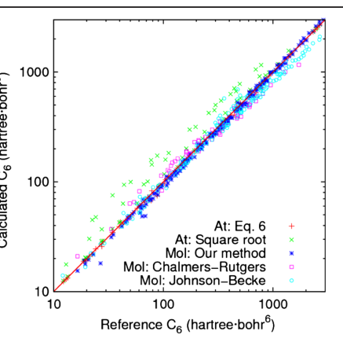

**Original caption:** FIG. 1 (color online). Comparison of the C6 coefficients for atom-atom interaction (At) and atom-molecule and moleculemolecule interaction (Mol). The reference results for atom-atom interaction are from accurate wave function calculations [26– 28]. For molecules, DOSD results are taken as a reference [5,8,20,21]. Our results (only 211 values out of 1225 are shown) are compared to those of Chalmers-Rutgers collaboration [15] and Johnson-Becke [8]. The only outliers for our method are cases involving the H2 molecule (20–44% deviation).

**中文图注:** 如图。 1（在线彩色）。原子-原子相互作用 (At) 以及原子-分子和分子分子相互作用 (Mol) 的 C6 系数的比较。原子间相互作用的参考结果来自精确的波函数计算[26-28]。对于分子，DOSD结果作为参考[5,8,20,21]。我们的结果（1225 个值中仅显示了 211 个值）与 Chalmers-Rutgers 合作 [15] 和 Johnson-Becke [8] 的结果进行了比较。我们的方法唯一的异常值是涉及 H2 分子的情况（20-44% 偏差）。

**Reading note / 阅读提示：** Inspect this visual with the adjacent derivation or benchmark; placement follows its first substantive mention. / 请结合相邻推导或基准结果解读该图表；其位置对应首次实质讨论。

**Source:** p.2 S018

**Original:** eff A free A 1⁄4 Veff A Vfree A 1⁄4 R r3wAðrÞnðrÞd3r R r3nfree A ðrÞd3r

**中文:** 公式（9）的数学符号与变量保持原文；请结合相邻段落的定义理解其物理含义。

**Source:** p.2 S019

**Original:** wAðrÞ 1⁄4 nfree A ðrÞ P B nfree B ðrÞ ; (8)

**中文:** 公式（8）的数学符号与变量保持原文；请结合相邻段落的定义理解其物理含义。

**Source:** p.2 S020

**Original:** where i A is the proportionality constant between volume and polarizability for the free-atom and atom-in-amolecule, wAðrÞ is the Hirshfeld atomic partitioning weight for the atom A, r3 is the cube of the distance from

**中文:** 其中 i A 是自由原子和分子内原子的体积和极化率之间的比例常数，wAðrÞ 是原子 A 的赫什菲尔德原子分配重量，r3 是距离的立方

**Source:** p.2 C001

**Original caption:** FIG. 1 (color online). Comparison of the C6 coefficients for atom-atom interaction (At) and atom-molecule and moleculemolecule interaction (Mol). The reference results for atom-atom interaction are from accurate wave function calculations [26– 28]. For molecules, DOSD results are taken as a reference [5,8,20,21]. Our results (only 211 values out of 1225 are shown) are compared to those of Chalmers-Rutgers collaboration [15] and Johnson-Becke [8]. The only outliers for our method are cases involving the H2 molecule (20–44% deviation).

**中文图注:** 如图。 1（在线彩色）。原子-原子相互作用 (At) 以及原子-分子和分子分子相互作用 (Mol) 的 C6 系数的比较。原子间相互作用的参考结果来自精确的波函数计算[26-28]。对于分子，DOSD结果作为参考[5,8,20,21]。我们的结果（1225 个值中仅显示了 211 个值）与 Chalmers-Rutgers 合作 [15] 和 Johnson-Becke [8] 的结果进行了比较。我们的方法唯一的异常值是涉及 H2 分子的情况（20-44% 偏差）。

**Source:** p.2 S021

**Original:** the nucleus of an atom A, nðrÞ is the total electron density, nfree A ðrÞ is the electron density of the free atom A, and the sum goes over all atoms in the system. Both nðrÞ and nfree A ðrÞ are calculated from DFT-XCA. The effective coefficient Ceff 6AA for an atom in a molecule is determined in the following way from Eqs. (4) and (5):

**中文:** 原子 A 的原子核，nðrÞ 是总电子密度，nfree A ðrÞ 是自由原子 A 的电子密度，系统中所有原子的总和。 nðrÞ 和 nfree A ðrÞ 都是根据 DFT-XCA 计算的。分子中原子的有效系数 Ceff 6AA 通过以下方式从方程式确定： （4）和（5）：

**Source:** p.2 S022

**Original:** Ceff 6AA 1⁄4 eff A free A

**中文:** Ceff 6AA 1⁄4 eff A 无 A

**Source:** p.2 S023

**Original:** We assume the proportionality constant eff A free A ðfree A eff A Þ2 to be

**中文:** 我们假设比例常数 eff A free A ð free A eff A Þ2 为

**Source:** p.2 S024

**Original:** unity and prove this choice to be remarkably good for a large variety of molecules. Indeed, this approximation breaks down only for the smallest H2 molecule, with deviation of 44% for the C6 coefficient. Already for molecules such as N2 and CO2, the error is less than 10%. Since the static polarizability of a molecule cannot be expressed as a linear combination of atomic polarizabilities in general, and thus free A =eff A  1, eff A =free A , and ðfree A =eff A Þ2

**中文:** 统一并证明这种选择对于多种分子来说非常有好处。事实上，这种近似仅适用于最小的 H2 分子，C6 系数的偏差为 44%。对于 N2 和 CO2 等分子，误差已低于 10%。由于分子的静态极化率一般不能表示为原子极化率的线性组合，因此 free A = eff A 1, eff A = free A , ð free A = eff A Þ2

**Source:** p.2 S025

**Original:** are inversely proportional. Since the C6 coefficients are additive [22,31], the intermolecular C6 coefficient, Cmol 6 , is given by the sum of all interatomic contributions

**中文:** 成反比。由于 C6 系数是可加的 [22,31]，因此分子间 C6 系数 Cmol 6 由所有原子间贡献的总和给出

**Source:** p.2 S026

**Original:** where M1 and M2 refers to the first and the second molecule, respectively. To assess the accuracy of our scheme, it was benchmarked on a database of 1225 intermolecular C6 coefficients, derived from pseudo DOSD data of Meath and coworkers (see, e.g., Refs. [5,8,20,21]). The database con-

**中文:** 其中M1和M2分别指第一个和第二个分子。为了评估我们方案的准确性，它以 1225 个分子间 C6 系数的数据库为基准，这些系数源自 Meath 和同事的伪 DOSD 数据（参见参考文献 [5,8,20,21]）。数据库连接

## Page 3

**Source:** p.3 S027

**Original:** tains the C6 coefficients for the interaction between 8 atoms and 42 molecules (organic and inorganic, from small dimers to C8H18). The geometry of every molecule was fully relaxed using the FHI-AIMS [32] code together with LDA, PBE, and BLYP functionals. The atomic Ceff 6 coefficients were calculated from Eq. (9) using the DFT density and then the molecular Cmol 6 coefficients were computed using Eq. (10). The correlation between the calculated C6 coefficients and reference results is shown in Fig. 1 and compared with other methods for obtaining the C6 coefficients from the ground-state density. With a MARE of 5.5%, we note that our scheme is a factor of 2–3 more accurate than existing methods [8,9,15]. Furthermore, if the H2 molecule is excluded from the database, the MARE drops down to 4.5%. The C6 coefficients vary only slightly for different exchange-correlation (xc) functionals. The MARE in the C6 coefficients between LDA and PBE is 1.4% (maximum deviation of 3.8%), while for BLYP and PBE it is 0.68% (maximum deviation of 2.1%). Clearly, the difference in the electron density between xc functionals is compensated when computing the ratio in Eq. (7). In Table I, we show the values of the C6 coefficients for various atoms in the DOSD database. It is encouraging that the C6 coefficients correspond very closely to those empirically fitted by Wu and Yang [5] for different hybridization states of C and O atoms. This further indicates that our scheme correctly accounts for different atomic environments without the need of empirical parameters. The largest variations occur for carbon and silicon, due to various possible hybridization states for these elements. In order to further illustrate the change in the atomic C6 coefficients as a function of molecular bonding and geometry, we show the case of the hydrogen-bonded water dimer in Fig. 2. As the H2O molecules approach to form a hydrogen bond, the polarizabilities and the C6 coefficients of all atoms are modified. The hydrogen involved in the hydrogen bond becomes significantly more polarizable along with the donor oxygen. On the other hand, the acceptor oxygen becomes less polarizable along with the attached hydrogens. The plot in Fig. 2 was done for a fixed water dimer geometry to illustrate that the change in the C6 coefficients is a purely electronic effect. Relaxing the geometries for every O-O distance yields a similar plot for distances larger than the equilibrium one. We carried out preliminary tests of our scheme for solids, calculating the C6 coefficient of the carbon atom in a graphene sheet and in a diamond crystal at experimental geometries. For carbon in a graphene sheet, we get a value of 33.0, close to the expected value of 30.3 for the sp2 hybridization in benzene. For diamond, we get a value of 38.6, significantly larger than 24.1 for the sp3 hybridization in methane. Our method can in principle treat all elements, including ions, on the same footing. Most problematic cases are those where the concept of atoms-in-molecules cannot be applied. Clearly, a pairwise summation of C6R6 interactions

**中文:** 包含 8 个原子和 42 个分子（有机和无机，从小二聚体到 C8H18）之间相互作用的 C6 系数。使用 FHI-AIMS [32] 代码以及 LDA、PBE 和 BLYP 泛函，可以完全放松每个分子的几何形状。原子 Ceff 6 系数由方程式计算得出。 (9) 使用DFT密度，然后使用方程计算分子Cmol 6 系数。 （10）。计算的C6系数与参考结果之间的相关性如图1所示，并与其他从基态密度获得C6系数的方法进行了比较。我们注意到，我们的方案的 MARE 为 5.5%，比现有方法准确 2-3 倍 [8,9,15]。此外，如果 H2 分子从数据库中排除，MARE 会下降至 4.5%。对于不同的交换相关 (xc) 泛函，C6 系数仅略有不同。 LDA 和 PBE 之间的 C6 系数中的 MARE 为 1.4%（最大偏差为 3.8%），而 BLYP 和 PBE 为 0.68%（最大偏差为 2.1%）。显然，在计算等式中的比率时，xc 泛函之间的电子密度差异得到了补偿。 （7）。在表 I 中，我们显示了 DOSD 数据库中各种原子的 C6 系数值。令人鼓舞的是，C6 系数与 Wu 和 Yang [5] 针对不同情况根据经验拟合的系数非常接近。C和O原子的杂化态。这进一步表明我们的方案正确地考虑了不同的原子环境，而不需要经验参数。由于碳和硅的各种可能的杂化状态，这些元素的变化最大。为了进一步说明原子 C6 系数随分子键和几何形状的变化，我们在图 2 中展示了氢键水二聚体的情况。当 H2O 分子接近形成氢键时，所有原子的极化率和 C6 系数都发生了变化。氢键中涉及的氢与供体氧一起变得更加极化。另一方面，受体氧与连接的氢一起变得不易极化。图 2 中的绘图是针对固定的水二聚体几何形状绘制的，以说明 C6 系数的变化纯粹是电子效应。放宽每个 O-O 距离的几何形状，对于大于平衡距离的距离，会产生类似的图。我们对我们的固体方案进行了初步测试，计算了石墨烯片和金刚石晶体中实验几何形状的碳原子的 C6 系数。对于石墨烯片中的碳，我们得到的值为 33.0，接近苯中 sp2 杂化的预期值 30.3。对于钻石来说，我们得到的值为 38.6，明显大于甲烷中 sp3 杂化的 24.1。我们的方法原则上可以同等对待所有元素，包括离子。最有问题的情况是无法应用分子中原子概念的情况。显然，C6R 6 相互作用的成对求和

### Table I

**Placed near:** p.3 S027

**Source:** p.3 C002

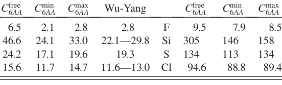

**Original caption:** TABLE I. Free-atom C6 coefficients (hartree  bohr6) from Chu and Dalgarno [16] along with atom-in-a-molecule (minimum and maximum) C6 coefficients for various atoms computed for molecules from the DOSD database. For CNOH atoms, these values are compared to empirical results of Wu and Yang [5] for different hybridization states.

**中文图注:** 表 I. 来自 Chu 和 Dalgarno [16] 的自由原子 C6 系数 (hartree bohr6) 以及根据 DOSD 数据库为分子计算的各种原子的分子内原子（最小和最大）C6 系数。对于 CNOH 原子，这些值与 Wu 和 Yang [5] 对于不同杂化状态的经验结果进行了比较。

**Reading note / 阅读提示：** Inspect this visual with the adjacent derivation or benchmark; placement follows its first substantive mention. / 请结合相邻推导或基准结果解读该图表；其位置对应首次实质讨论。

### Fig. 2

**Placed near:** p.3 S027

**Source:** p.3 C003

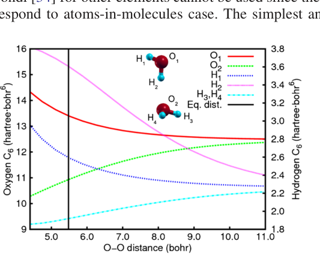

**Original caption:** FIG. 2 (color online). Dependence of the atomic C6 coefficients on the O-O distance in the water dimer. Note the two different scales on both sides for H and O atoms.

**中文图注:** 如图。 2（在线彩色）。原子 C6 系数对水二聚体中 O-O 距离的依赖性。注意 H 和 O 原子两侧的两个不同比例。

**Reading note / 阅读提示：** Inspect this visual with the adjacent derivation or benchmark; placement follows its first substantive mention. / 请结合相邻推导或基准结果解读该图表；其位置对应首次实质讨论。

**Source:** p.3 C002

**Original caption:** TABLE I. Free-atom C6 coefficients (hartree  bohr6) from Chu and Dalgarno [16] along with atom-in-a-molecule (minimum and maximum) C6 coefficients for various atoms computed for molecules from the DOSD database. For CNOH atoms, these values are compared to empirical results of Wu and Yang [5] for different hybridization states.

**中文图注:** 表 I. 来自 Chu 和 Dalgarno [16] 的自由原子 C6 系数 (hartree bohr6) 以及根据 DOSD 数据库为分子计算的各种原子的分子内原子（最小和最大）C6 系数。对于 CNOH 原子，这些值与 Wu 和 Yang [5] 对于不同杂化状态的经验结果进行了比较。

**Source:** p.3 S028

**Original:** Cfree 6AA Cmin 6AA Cmax 6AA Wu-Yang Cfree 6AA Cmin 6AA Cmax 6AA H 6.5 2.1 2.8 2.8 F 9.5 7.9 8.5 C 46.6 24.1 33.0 22.1—29.8 Si 305 146 158 N 24.2 17.1 19.6 19.3 S 134 113 134 O 15.6 11.7 14.7 11.6—13.0 Cl 94.6 88.8 89.4

**中文:** Cfree 6AA Cmin 6AA Cmax 6AA 五阳 Cfree 6AA Cmin 6AA Cmax 6AA H 6.5 2.1 2.8 2.8 F 9.5 7.9 8.5 C 46.6 24.1 33.0 22.1—29.8 Si 305 146 158 N 24.2 17.1 19.6 19.3 S 134 113 134 O 15.6 11.7 14.7 11.6—13.0 Cl 94.6 88.8 89.4

**Source:** p.3 S029

**Original:** can fail qualitatively for metallic low-dimensional systems due to nonadditive higher-order effects [33]. Our scheme can be further generalized to higher-order van der Waals coefficients (C8, etc.) since approximations similar to the London formula are known [22]. The Axilrod-Teller-Muto three-body term [22] can also be calculated since it involves an integral similar to the Casimir-Polder one. Let us now briefly discuss the coupling of the above long-range scheme for correcting DFT-XCA calculations for shorter distances. For this, the damping function fdampðRAB; R0 A; R0 BÞ in Eq. (1) must be defined. The vdW radii, R0 A=B, are not experimental observables, unlike the C6 coefficients. However, a rigorous theoretical definition does exist: the vdW radius corresponds to half of the distance between two atoms where the Pauli repulsion balances the London dispersion attraction [34]. Using the definition of the effective atomic volume in Eq. (7), the vdW radius of an atom in a molecule becomes

**中文:** 由于非加性高阶效应，金属低维系统可能会在质量上失败[33]。我们的方案可以进一步推广到高阶范德华系数（C8 等），因为类似于伦敦公式的近似值是已知的 [22]。 Axilrod-Teller-Muto 三体项 [22] 也可以计算，因为它涉及类似于 Casimir-Polder 积分的积分。现在让我们简要讨论一下上述远程方案的耦合，用于校正较短距离的 DFT-XCA 计算。为此，阻尼函数 fdampðRAB； R0 A；方程式中的 R0 BÞ (1) 必须定义。与 C6 系数不同，vdW 半径 R0 A=B 不是实验可观测量值。然而，严格的理论定义确实存在：vdW 半径对应于泡利斥力平衡伦敦色散吸引力的两个原子之间距离的一半[34]。使用方程中有效原子体积的定义。 (7) 分子中原子的 vdW 半径变为

**Source:** p.3 S030

**Original:** According to the above definition, the free-atom vdW radii, R0 free, for rare-gas atoms correspond to the equilibrium distance of rare-gas dimers. Unfortunately, the vdW radii of Bondi [34] for other elements cannot be used since they correspond to atoms-in-molecules case. The simplest an-

**中文:** 根据上述定义，稀有气体原子的自由原子 vdW 半径（不含 R0）对应于稀有气体二聚体的平衡距离。不幸的是，不能使用 Bondi [34] 的其他元素的 vdW 半径，因为它们对应于分子中原子的情况。最简单的一个——

**Source:** p.3 C003

**Original caption:** FIG. 2 (color online). Dependence of the atomic C6 coefficients on the O-O distance in the water dimer. Note the two different scales on both sides for H and O atoms.

**中文图注:** 如图。 2（在线彩色）。原子 C6 系数对水二聚体中 O-O 距离的依赖性。注意 H 和 O 原子两侧的两个不同比例。

## Page 4

**Source:** p.4 S031

**Original:** satz for defining consistent free-atom vdW radii comes from the electron density for the (spherical) free atoms. The electron density contour value corresponding to the vdW radius can be determined for the rare-gas atoms and then used to define R0 free for other elements in the same row of the periodic table. We used the above ansatz for the light elements (CNOH), to illustrate the performance of our nonempirical C6 scheme with DFT. We use a Fermi-type damping function [5],

**中文:** 用于定义一致的自由原子 vdW 半径的 satz 来自（球形）自由原子的电子密度。可以确定稀有气体原子对应于 vdW 半径的电子密度等值线值，然后用于定义元素周期表同一行中其他元素的 R0 free。我们使用上述轻元素 (CNOH) 的 ansatz，来说明我们的非经验 C6 方案与 DFT 的性能。我们使用费米型阻尼函数 [5]，

**Source:** p.4 S032

**Original:** fdampðRAB; R0 ABÞ 1⁄4 1 1 þ exp1⁄2dð RAB sRR0 AB  1Þ ; (12)

**中文:** 公式（12）的数学符号与变量保持原文；请结合相邻段落的定义理解其物理含义。

**Source:** p.4 S033

**Original:** where R0 AB 1⁄4 R0 A þ R0 B, d and sR are free parameters. The d parameter adjusts the damping function steepness. Our analysis indicates that the results change negligibly for 12 < d < 45. A small value of d affects covalently bonded systems, whereas a large value yields kinked binding energy curves. The choice of d 1⁄4 20 turned out to satisfy both constraints as tested for binding energy curves of raregases and vdW-bonded organic molecule dimers (CH4 and benzene), as also shown by Grimme in previous work [12]. Therefore, the scaling coefficient sR remains as a single empirical parameter which determines the onset of the vdW correction for a particular xc functional in terms of the distance [14]. We use the S22 database of Jurecka et al. [35] to obtain the sR parameter [36]. The database reports converged CCSD(T) binding energies for 22 different dimers with varying interaction strength, from a weakly vdW-bonded CH4 dimer (23 meV) to a hydrogen-bonded uracil dimer (0.9 eV). The performance of our scheme, when coupled with the PBE functional, is significantly better than for highly empirical C6R6 approaches [6,12,14]. The mean absolute error (MAE) of our approach on the S22 database is 13 meV (20, 13, and 6 meV on hydrogen-bonded, vdW-bonded and mixed systems, respectively). This can be compared to 20 meV (29, 20, and 9 meV) when using empirical C6 coefficients and vdW radii from Ref. [14]. It is especially encouraging that the overestimation of the hydrogen-bonded systems is significantly reduced due to larger effective vdW radii for atoms involved in hydrogen bonds. Since the atomic C6 coefficients are functionals of the electron density [Eq. (9)], the potential due to the energy expression in Eq. (1) should enter the Kohn-Sham equations in DFT calculations. However, we do not expect a self-consistent treatment to give major changes as also noticed in Ref. [10]. This aspect will be addressed in future work. In summary, we have presented an accurate nonempirical method to obtain molecular C6 coefficients from ground-state electron density and reference values for the free atoms. Our scheme can also be used to improve the description of weakly bonded systems in DFT for a range of xc functionals. A. T. acknowledges the Alexander von Humboldt (AvH) foundation for funding.

**中文:** 其中 R0 AB 1⁄4 R0 A + R0 B、d 和 sR 是自由参数。 d 参数调整阻尼函数的陡度。我们的分析表明，当 12 < d < 45 时，结果变化可以忽略不计。d 值较小会影响共价键合系统，而较大值会产生扭结的结合能曲线。 d 1⁄4 20 的选择结果满足了稀有气体和 vdW 键合有机分子二聚体（CH4 和苯）结合能曲线测试的两个约束，正如 Grimme 在之前的工作中所表明的那样 [12]。因此，缩放系数 sR 仍然是一个单一的经验参数，它决定了特定 xc 函数在距离方面的 vdW 校正的开始时间 [14]。我们使用 Jurecka 等人的 S22 数据库。 [35]获得sR参数[36]。该数据库报告了 22 种具有不同相互作用强度的不同二聚体的 CCSD(T) 结合能，从弱 vdW 键合的 CH4 二聚体 (23 meV) 到氢键键合的尿嘧啶二聚体 (0.9 eV)。当与 PBE 泛函结合时，我们的方案的性能明显优于高度经验的 C6R 6 方法 [6,12,14]。我们的方法在 S22 数据库上的平均绝对误差 (MAE) 为 13 meV（在氢键、vdW 键和混合系统上分别为 20、13 和 6 meV）。当使用经验 C6 系数和 vdW 半径时，这可以与 20 meV（29、20 和 9 meV）进行比较来自参考文献。 [14]。尤其令人鼓舞的是，由于参与氢键的原子的有效 vdW 半径更大，因此氢键系统的高估显着减少。由于原子 C6 系数是电子密度的函数 [Eq. (9)]，由式(9)中的能量表达式产生的电势。 (1)在DFT计算中应输入Kohn-Sham方程。然而，我们并不期望自洽的治疗能够带来重大改变，正如参考文献中也注意到的那样。 [10]。这方面将在今后的工作中予以解决。总之，我们提出了一种准确的非经验方法，可以从基态电子密度和自由原子的参考值获得分子 C6 系数。我们的方案还可用于改进 DFT 中对一系列 xc 泛函的弱键合系统的描述。 A.T. 感谢亚历山大·冯·洪堡 (AvH) 基金会的资助。

## Page 1

**Source:** p.1 E001

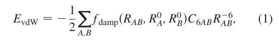

**Low-confidence transcription / 低置信度转写（请以原图为准）：**

$$
E_{vdW}=-\frac{1}{2}\sum_{A,B} f_{damp}(R_{AB},R_A^0,R_B^0)C_{6AB}R_{AB}^{-6}
$$

**中文说明：** 公式（1）的数学符号与变量保持原文；请结合相邻段落的定义理解其物理含义。

## Page 2

**Source:** p.2 E002

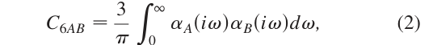

**Low-confidence transcription / 低置信度转写（请以原图为准）：**

$$
C_{6AB}=\frac{3}{\pi}\int_0^\infty\alpha_A(i\omega)\alpha_B(i\omega)d\omega
$$

**中文说明：** 公式（2）的数学符号与变量保持原文；请结合相邻段落的定义理解其物理含义。

**Source:** p.2 E003

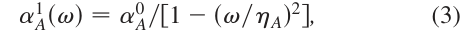

**Low-confidence transcription / 低置信度转写（请以原图为准）：**

$$
\alpha_A^1(\omega)=\alpha_A^0/[1-(\omega/\eta_A)^2]
$$

**中文说明：** 公式（3）的数学符号与变量保持原文；请结合相邻段落的定义理解其物理含义。

**Source:** p.2 E004

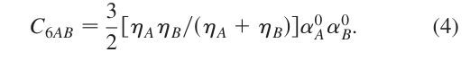

**Low-confidence transcription / 低置信度转写（请以原图为准）：**

$$
C_{6AB}=\frac{3}{2}\frac{\eta_A\eta_B}{\eta_A+\eta_B}\alpha_A^0\alpha_B^0
$$

**中文说明：** 公式（4）的数学符号与变量保持原文；请结合相邻段落的定义理解其物理含义。

**Source:** p.2 E005

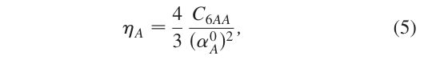

**Low-confidence transcription / 低置信度转写（请以原图为准）：**

$$
\eta_A=\frac{4}{3}\frac{C_{6AA}}{(\alpha_A^0)^2}
$$

**中文说明：** 公式（5）的数学符号与变量保持原文；请结合相邻段落的定义理解其物理含义。

**Source:** p.2 E006

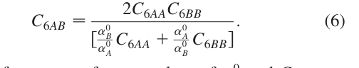

**Low-confidence transcription / 低置信度转写（请以原图为准）：**

$$
C_{6AB}=\frac{2C_{6AA}C_{6BB}}{[\frac{\alpha_B^0}{\alpha_A^0}C_{6AA}+\frac{\alpha_A^0}{\alpha_B^0}C_{6BB}]}
$$

**中文说明：** 公式（6）的数学符号与变量保持原文；请结合相邻段落的定义理解其物理含义。

**Source:** p.2 E007

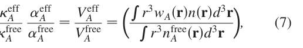

**Low-confidence transcription / 低置信度转写（请以原图为准）：**

$$
\frac{\kappa_A^{eff}}{\kappa_A^{free}}=\frac{\alpha_A^{eff}}{\alpha_A^{free}}=\frac{V_A^{eff}}{V_A^{free}}=(\frac{\int r^3w_A(\mathbf r)n(\mathbf r)d^3r}{\int r^3n_A^{free}(\mathbf r)d^3r})
$$

**中文说明：** 公式（7）的数学符号与变量保持原文；请结合相邻段落的定义理解其物理含义。

**Source:** p.2 E008

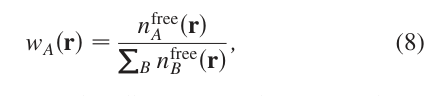

**Low-confidence transcription / 低置信度转写（请以原图为准）：**

$$
w_A(\mathbf r)=\frac{n_A^{free}(\mathbf r)}{\sum_B n_B^{free}(\mathbf r)}
$$

**中文说明：** 公式（8）的数学符号与变量保持原文；请结合相邻段落的定义理解其物理含义。

**Source:** p.2 E009

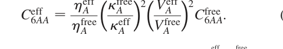

**Low-confidence transcription / 低置信度转写（请以原图为准）：**

$$
C_{6AA}^{eff}=\frac{\eta_A^{eff}}{\eta_A^{free}}(\frac{\kappa_A^{free}}{\kappa_A^{eff}})^2(\frac{V_A^{eff}}{V_A^{free}})^2C_{6AA}^{free}
$$

**中文说明：** 公式（9）的数学符号与变量保持原文；请结合相邻段落的定义理解其物理含义。

**Source:** p.2 E010

**Low-confidence transcription / 低置信度转写（请以原图为准）：**

$$
C_6^{mol}=\sum_{A\in M_1}\sum_{B\in M_2}C_{6AB}^{eff}
$$

**中文说明：** 公式（10）的数学符号与变量保持原文；请结合相邻段落的定义理解其物理含义。

## Page 3

**Source:** p.3 E011

**Low-confidence transcription / 低置信度转写（请以原图为准）：**

$$
R_{eff}^0=(\frac{V^{eff}}{V^{free}})^{1/3}R_{free}^0
$$

**中文说明：** 公式（11）的数学符号与变量保持原文；请结合相邻段落的定义理解其物理含义。

## Page 4

**Source:** p.4 E012

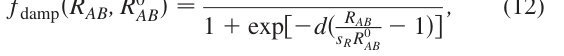

**Low-confidence transcription / 低置信度转写（请以原图为准）：**

$$
f_{damp}(R_{AB},R_{AB}^0)=\frac{1}{1+\exp[-d(\frac{R_{AB}}{s_RR_{AB}^0}-1)]}
$$

**中文说明：** 公式（12）的数学符号与变量保持原文；请结合相邻段落的定义理解其物理含义。

