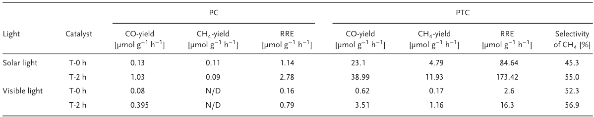
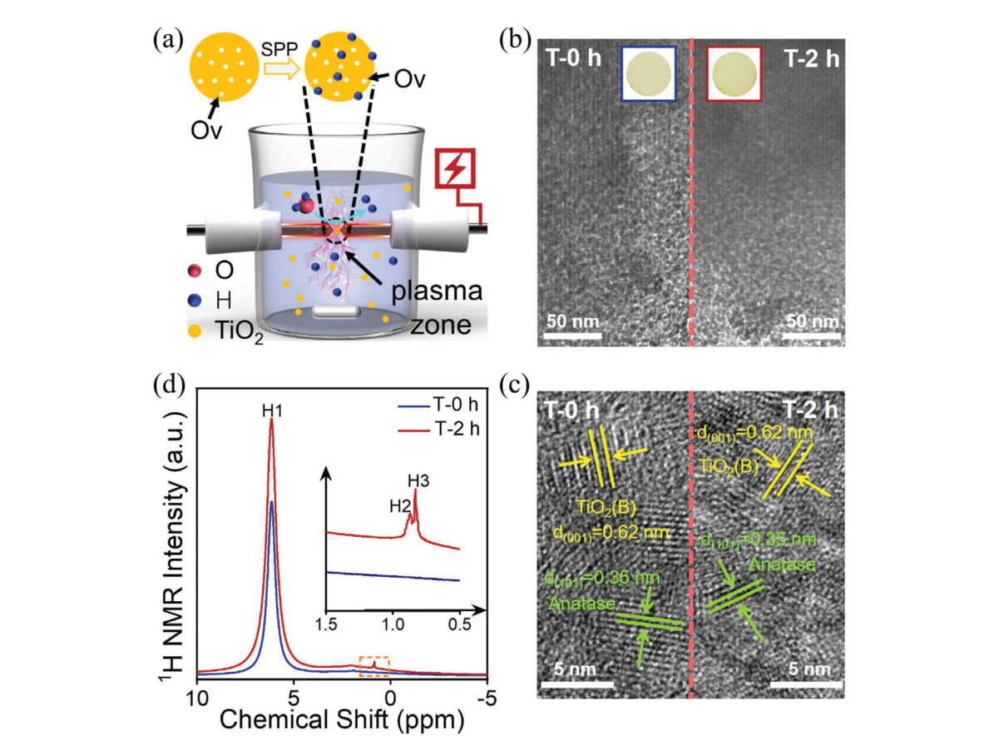
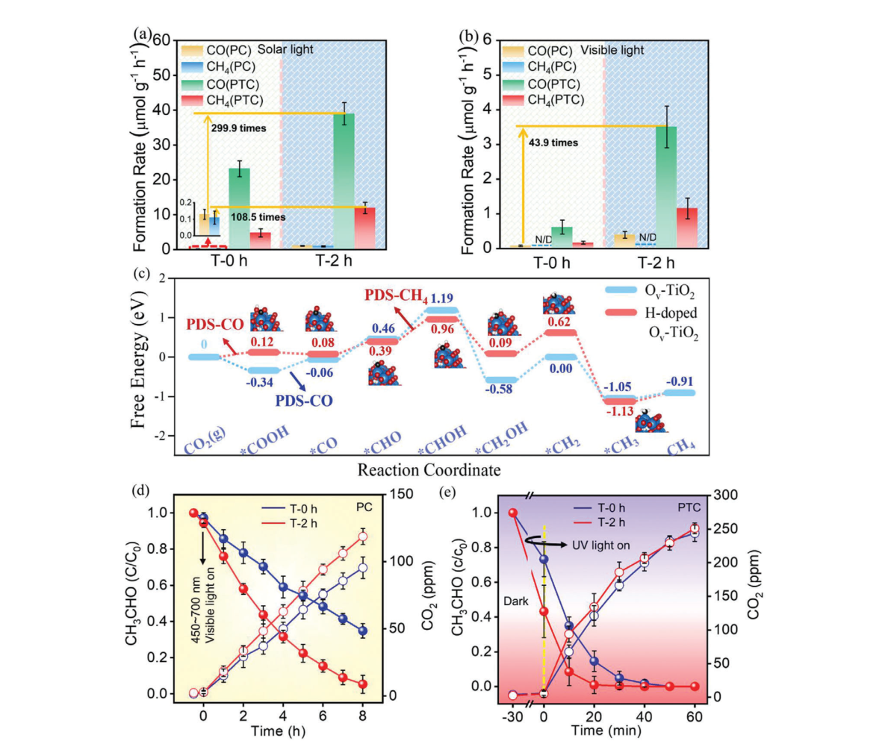
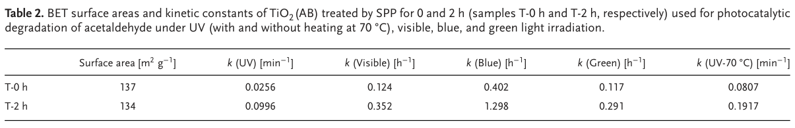
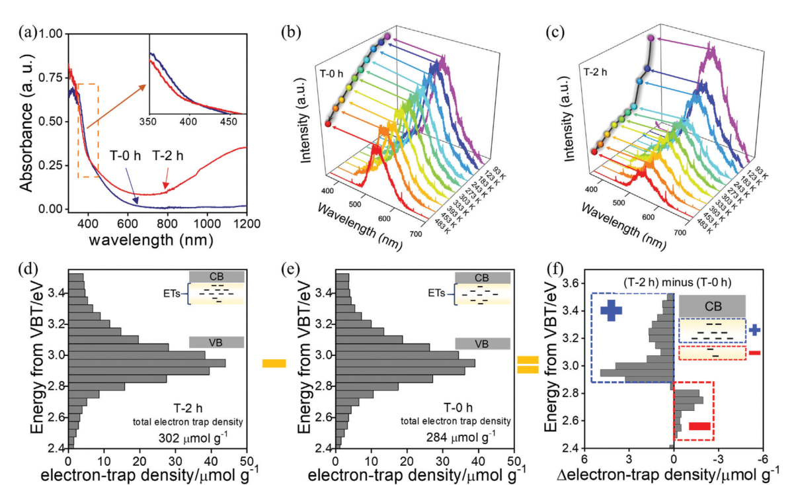
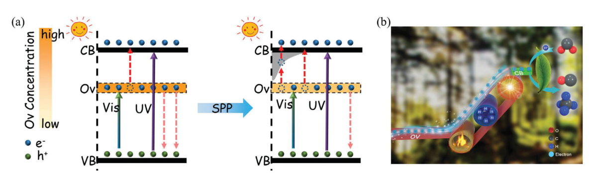
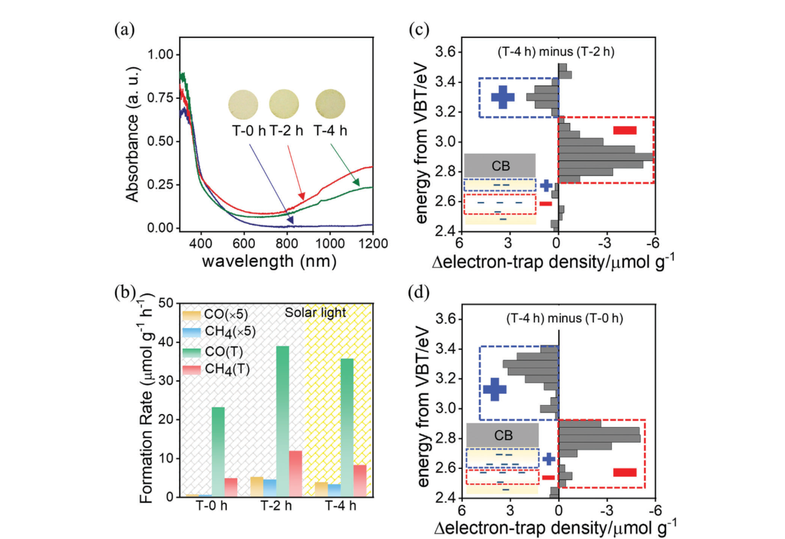
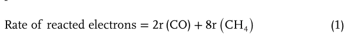
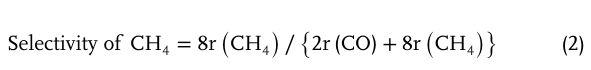

# Enhanced Solar Photothermal Catalysis over Solution Plasma Activated TiO2

## Metadata / 元数据

- **Journal / 期刊：** *Advanced Science*
- **Published / 发表：** 2020-06-11
- **DOI：** 10.1002/advs.202000204
- **Zotero key：** FKLUFB4I
- **Collection / 集合：** 02课题/光热催化研究
- **Source / 来源：** Zotero 本地可选文本 PDF（11 页、双栏）。

## Why this paper / 为什么选这篇

**English:** This eligible six-marker legacy-priority backfill connects defect engineering in TiO₂ with a mechanistic photothermal-catalysis claim: shallow hydrogen-related states are proposed to bridge electrons out of deep oxygen-vacancy traps. It is useful for separating an observed activity increase from the specific carrier-transport mechanism that would need independent support.

**中文：** 这篇符合条件的六标记旧文献，把 TiO₂ 缺陷工程与一个可检验的光热催化机理连接起来：作者提出浅层、与氢有关的缺陷态可充当通道，使电子离开深层氧空位陷阱。它适合训练我们区分“活性提高”这一现象与仍需独立证据支持的具体载流子传输机制。

## Terminology / 术语表

| English | 中文 | Note / 说明 |
|---|---|---|
| solution plasma process (SPP) | 溶液等离子体处理（SPP） | 在液相中以放电产生的活性物种处理材料。 |
| oxygen vacancy (Ov) | 氧空位（Ov） | TiO₂ 中由缺氧形成的缺陷；文中区分其深能级作用。 |
| shallow donor | 浅施主 | 能级靠近导带、较易热激发的电子供体缺陷。 |
| photothermal catalysis | 光热催化 | 光照与升温协同改变载流子与反应速率的催化过程。 |
| electron trap density | 电子陷阱密度 | 用于表征可俘获光生电子缺陷态数量的量。 |
| temperature-programmed desorption (TPD) | 程序升温脱附（TPD） | 随温度升高监测脱附物种以分析表面/晶格氧。 |

## Reading guide / 阅读提示

**English:** First identify the defect hierarchy: deep Ov traps versus the proposed shallower hydrogen-related levels. Then read Figures 2–4 together: activity, spectroscopy, and the carrier-transfer sketch are complementary evidence, not identical measurements. Finally, treat the DFT free-energy diagram as support for a reaction-energy comparison, while keeping it distinct from the experimental defect and charge-separation observations.

**中文：** 先识别缺陷层级：深层 Ov 陷阱与作者提出的较浅氢相关能级。随后把图 2–4 连起来读：活性、光谱与载流子转移示意图是互补证据，并非同一种测量。最后，将 DFT 自由能图作为反应能比较的支持，同时与实验的缺陷和电荷分离观察保持区分。

## Page / Section Index

- [p.1](#page-1)
- [p.2](#page-2)
- [p.3](#page-3)
- [p.4](#page-4)
- [p.5](#page-5)
- [p.6](#page-6)
- [p.7](#page-7)
- [p.8](#page-8)
- [p.9](#page-9)
- [p.10](#page-10)
- [p.11](#page-11)

## Equation Index / 公式索引

- [E001 · Eq. (1)](#E001) — p.5, reacted-electron rate / 反应电子速率
- [E002 · Eq. (2)](#E002) — p.5, CH₄ selectivity / CH₄ 选择性

## Related Reading / 延伸阅读

**English:** No strongly recommended related paper today. The immediate reading task is to test the paper’s own defect-to-carrier-transfer evidence chain before adding broadly similar TiO₂ photocatalysis studies.

**中文：** 今日没有强制推荐的延伸论文。应先核对本文自身从缺陷到载流子转移的证据链，再加入泛泛相似的 TiO₂ 光催化研究。

# Bilingual Reader / 逐段中英文对照

## Page 1

**Source:** p.1 S001

**Original:** Enhanced Solar Photothermal Catalysis over Solution Plasma Activated TiO2

**中文:** 溶液等离子体活化 TiO2 的增强型太阳能光热催化

**Source:** p.1 S002

**Original:** Solar-driven photocatalytic processes attract substantial attention because they offer significant energy savings and because of their environmental friendliness.[1–5] Recently developed solar-induced photothermal catalysis demonstrated significantly better results than solar-induced photocatalysis alone,[6–9] especially when performed using semiconductor

**中文:** 太阳能驱动的光催化过程因其显着的节能效果和环境友好性而受到广泛关注。[1-5]最近开发的太阳能诱导光热催化比单独的太阳能诱导光催化效果明显更好，[6-9]尤其是在使用半导体进行时

**Source:** p.1 S003

**Original:** Dr. F. Yu, Prof. C. Wang, Dr. Y. Li, Dr. H. Ma, R. Wang, Prof. Y. Liu, Prof. X. Zhang Key Laboratory of UV-Emitting Materials and Technology of Chinese Ministry of Education Northeast Normal University Changchun 130024, China E-mail: wangch100@nenu.edu.cn; xtzhang@nenu.edu.cn

**中文:** 余芳博士、王成教授、李勇博士、马宏博士、王荣教授、刘勇教授、张X教授 东北师范大学紫外发光材料与技术教育部重点实验室 长春 130024 E-mail: wangch100@nenu.edu.cn; xtzhang@nenu.edu.cn

**Source:** p.1 S004

**Original:** The ORCID identification number(s) for the author(s) of this article can be found under https://doi.org/10.1002/advs.202000204 © 2020 The Authors. Published by WILEY-VCH Verlag GmbH & Co. KGaA, Weinheim. This is an open access article under the terms of the Creative Commons Attribution License, which permits use, distribution and reproduction in any medium, provided the original work is properly cited.

**中文:** 本文作者的 ORCID 识别号可以在 https://doi.org/10.1002/advs.202000204 © 2020 作者找到。由位于魏因海姆的 WILEY-VCH Verlag GmbH & Co. KGaA 出版。这是根据知识共享署名许可条款的开放获取文章，允许在任何媒体中使用、分发和复制，前提是正确引用原始作品。

**Source:** p.1 S005

**Original:** DOI: 10.1002/advs.202000204

**中文:** DOI：10.1002/advs.202000204

**Source:** p.1 S006

**Original:** www.advancedscience.com

**中文:** www.advancedscience.com

**Source:** p.1 S007

**Original:** oxide catalysts enriched with defects.[10–13]

**中文:** 富含缺陷的氧化物催化剂。[10–13]

**Source:** p.1 S008

**Original:** The defect at surface can facilitate the adsorption and activation of substrate molecules to boost the sluggish reaction thermodynamics and kinetics.[14,15]

**中文:** 表面缺陷可以促进底物分子的吸附和活化，从而促进缓慢反应的热力学和动力学[14,15]。

**Source:** p.1 S009

**Original:** Defects may also activate lattice oxygen, which participates in the photothermal coupling catalysis.[16–18] The electrons can be trapped at defects and thermally released to the surface, which, in turn, improves charge utilization and accelerates reaction rate at the surface. These advantages of defects are the major factors behind the recent renewed interest to semiconductor oxide photocatalysts in solar-induced photothermal processes. Defect engineering has been intensively investigated on TiO2 materials in past decades for pursuing visible light photocatalysis. Oxygen vacancies (Ov) are the most exploited defects of TiO2, which as the native defects of oxides, can be easily incorporated into the lattice of TiO2 by annealing in oxygen-deficient atmosphere or as a co-product of anion or cation doping.[19] Enriched Ov can redshift the absorption spectra of TiO2 and changes its color from white.[20–24] However, the Ov levels, ≈0.75 eV below the conduction band bottom of TiO2, are deep levels and work more likely as recombination centers,[25,26] which impairs the photocatalytic activity of colored TiO2. Hydrogen-doping are another important

**中文:** 缺陷还可能激活晶格氧，参与光热耦合催化。[16-18]电子可以被捕获在缺陷处并热释放到表面，从而提高电荷利用率并加速表面反应速率。这些缺陷的优点是最近人们对太阳能诱导光热过程中的半导体氧化物光催化剂重新产生兴趣的主要因素。过去几十年来，为了追求可见光光催化，人们对 TiO2 材料的缺陷工程进行了深入研究。氧空位（Ov）是TiO2最常被利用的缺陷，它作为氧化物的固有缺陷，可以通过在缺氧气氛中退火或作为阴离子或阳离子掺杂的副产物很容易地结合到TiO2的晶格中。 [19]富集的 Ov 可以使 TiO2 的吸收光谱红移，并将其颜色从白色改变。[20-24] 然而，Ov 能级（低于 TiO2 导带底部约 0.75 eV）是深能级，更有可能作为复合中心，[25,26] 这会损害有色 TiO2 的光催化活性。氢掺杂是另一个重要因素

**Source:** p.1 S010

**Original:** Prof. N. Suzuki, Prof. C. Terashima, Prof. A. Fujishima Photocatalysis International Research Center Research Institute for Science & Technology Tokyo University of Science 2641 Yamazaki Noda, Chiba 278-8510, Japan Prof. B. Ohtani Graduate School of Environmental Science Hokkaido University Sapporo 060-0810, Japan Prof. T. Ochiai Materials Analysis Group Kawasaki Technical Support Department Local Independent Administrative Agency Kanagawa Institute of industrial Science and Technology (KISTEC) Kanagawa 213-0012, Japan

**中文:** N. Suzuki 教授、C. Terashima 教授、A. Fujishima 光催化教授 国际科学技术研究中心 东京科学大学 2641 Yamazaki Noda, Chiba 278-8510, Japan Prof. B. Ohtani 教授 北海道大学环境科学研究生院 Sapporo 060-0810, Japan T. Ochiai 教授 材料分析小组 川崎技术支持部 地方独立行政机构神奈川工业科学技术研究所 (KISTEC) 日本神奈川县 213-0012

**Source:** p.1 S011

**Original:** Fei Yu, Changhua Wang,* Yingying Li, He Ma, Rui Wang, Yichun Liu, Norihiro Suzuki, Chiaki Terashima, Bunsho Ohtani, Tsuyoshi Ochiai, Akira Fujishima, and Xintong Zhang*

**中文:** 于飞、王昌华、* 李莹莹、马禾、王锐、刘一春、铃木典宏、寺岛千秋、大谷文翔、落合刚、藤岛彰和张新童*

**Source:** p.1 S012

**Original:** Colored wide-bandgap semiconductor oxides with abundant mid-gap states have long been regarded as promising visible light responsive photocatalysts. However, their catalytic activities are hampered by charge recombination at deep level defects, which constitutes the critical challenge to practical applications of these oxide photocatalysts. To address the challenge, a strategy is proposed here that includes creating shallow-level defects above the deep-level defects and thermal activating the migration of trapped electrons out of the deep-level defects via these shallow defects. A simple and scalable solution plasma processing (SPP) technique is developed to process the presynthesized yellow TiO2 with numerous oxygen vacancies (Ov), which incorporates hydrogen dopants into the TiO2 lattice and creates shallow-level defects above deep level of Ov, meanwhile retaining the original visible absorption of the colored TiO2. At elevated temperature, the SPP-treated TiO2 exhibits a 300 times higher conversion rate for CO2 reduction under solar light irradiation and a 7.5 times higher removal rate of acetaldehyde under UV light irradiation, suggesting the effectiveness of the proposed strategy to enhance the photoactivity of colored wide-bandgap oxides for energy and environmental applications.

**中文:** 具有丰富的中带隙态的彩色宽带隙半导体氧化物长期以来被认为是有前途的可见光响应光催化剂。然而，它们的催化活性受到深能级缺陷的电荷复合的阻碍，这对这些氧化物光催化剂的实际应用构成了严峻的挑战。为了应对这一挑战，这里提出了一种策略，包括在深能级缺陷上方创建浅能级缺陷，并通过这些浅缺陷热激活捕获电子从深能级缺陷中迁移出来。开发了一种简单且可扩展的溶液等离子体处理（SPP）技术来处理具有大量氧空位（Ov）的预先合成的黄色TiO2，该技术将氢掺杂剂纳入TiO2晶格并在Ov深层之上产生浅层缺陷，同时保留有色TiO2的原始可见光吸收。在高温下，SPP处理的TiO2在太阳光照射下的CO2还原转化率提高了300倍，在紫外光照射下乙醛的去除率提高了7.5倍，这表明所提出的策略在增强有色宽带隙氧化物在能源和环境应用中的光活性方面是有效的。

**Source:** p.1 S013

**Original:** Adv. Sci. 2020, 7, 2000204 2000204 (1 of 11) © 2020 The Authors. Published by WILEY-VCH Verlag GmbH & Co. KGaA, Weinheim

**中文:** 副词。科学。 2020, 7, 2000204 2000204 (1 of 11) © 2020 作者。出版者：WILEY-VCH Verlag GmbH & Co. KGaA，魏因海姆

## Page 2

**Source:** p.2 S014

**Original:** 21983844, 2020, 16, Downloaded from https://advanced.onlinelibrary.wiley.com/doi/10.1002/advs.202000204, Wiley Online Library on [23/07/2026]. See the Terms and Conditions (https://onlinelibrary.wiley.com/terms-and-conditions) on Wiley Online Library for rules of use; OA articles are governed by the applicable Creative Commons License

**中文:** 21983844, 2020, 16, 从 https://advanced.onlinelibrary.wiley.com/doi/10.1002/advs.202000204, Wiley Online Library 下载，日期：[23/07/2026]。有关使用规则，请参阅 Wiley 在线图书馆的条款和条件 (https://onlinelibrary.wiley.com/terms-and-conditions)；开放获取文章受适用的知识共享许可证管辖

**Source:** p.2 S015

**Original:** means to modify TiO2 photocatalysts.[27–29] Hydrogen is a shallow donor in TiO2, with defect levels closer to the conduction band of TiO2 than Ov.[30–33] Hydrogen-doping is reported to enhance the photocatalytic activity of TiO2, and even produces black TiO2 under severe conditions by the formation of amorphous TiO2:H or defect complex.[34] It is interesting to note that incorporating shallow hydrogen-donor levels above Ov deep levels might be a promising way to enhance the photocatalysis over Ov-TiO2, by which the trapped electrons can be extracted out of Ov deep levels via the shallow levels bridge, and the enhancement should be more remarkable for the photothermal catalysis due to the thermal activation of electron extraction. However, up to now few reports have investigated the synergistic effect of Ov and hydrogen dopants on enhancing the visible light photocatalysis of TiO2. And to the best knowledge of us, almost no report has dealt with the synergistic effect of Ov and hydrogen dopants on solar photothermal catalysis over TiO2. Herein, we report that the solar photothermal catalysis over colored Ov-rich TiO2 is indeed enhanced by incorporating shallow donor levels of hydrogen. We employ a novel solution plasma processing (SPP) to do hydrogen doping of Ov-rich TiO2. Plasmain-liquid can produce high flux of hydrogen radicals via H2O splitting at the open end of the discharge zone of SPP.[35,36] In comparison with conventional plasma-in-gas, SPP can be performed at room temperature and normal pressure,[37–39] without the direct use of dihydrogen. The Ov-rich TiO2 treated is a home-made yellow-colored TiO2, named as TiO2(AB), which is a mixture of anatase and TiO2(B) phases with anatase-TiO2(B) heterojunction for efficient charge separation.[40] As-synthesized TiO2(AB) phase absorbed visible light up to 700 nm due to the presence of rich Ov. SPP treatment realized hydrogen doping into this Ov-TiO2, which retained its visible light absorption and promoted charge separation. Activity of SPP-treated TiO2(AB) in relationship to acetaldehyde degradation and CO2 reduction was significantly enhanced under both UV and visible light irradiation. Particularly, CO2 conversion rate can be enhanced by two orders of magnitude for photothermal catalytic reduction of CO2. We believe that SPP technique demonstrated in this work can be employed as a general strategy to activate other Ov-rich widebandgap semiconductor oxides, which are colored but weak in visible light photocatalysis, for solar photothermal catalysis applications. Our goal was to incorporate as many oxygen vacancies into TiO2 as possible because TiO2 enriched with oxygen vacancies (Ov) is a prerequisite for achieving simultaneously strong visible light absorption. Thus, we synthesized TiO2 with oxygen vacancies by a solvothermal method and then treated the resulting product with SPP to incorporate hydrogen doping into this TiO2 (Figure 1a). Ov locates at a deep energy level, the gap between Ov and conduction band of TiO2 is too wide to allow thermal excitation of trapped electron at Ov in photothermal catalysis. Thus, the role of the second step, SPP post-treatment, is to introduce shallow energy level via hydrogen doping and fine-tune the gap between Ov and conduction band of TiO2. As-synthesized yellow TiO2 (Figure 1b, left, inset) demonstrated extended light absorption up to 700 nm (Figure 3a), which is a key to high catalytic activity under visible light. Transmission Electron Microscope (TEM) (Figure 1b, left) shows that as-synthesized TiO2 had uniform particle sizes ≈10 nm in di-

**中文:** [27-29]氢是TiO2中的浅供体，其缺陷水平比Ov更接近TiO2的导带。[30-33]据报道，氢掺杂可以增强TiO2的光催化活性，甚至在恶劣条件下通过形成无定形TiO2:H或缺陷复合物产生黑色TiO2。[34]有趣的是，在Ov深能级之上加入浅氢供体能级可能是增强Ov-TiO2光催化作用的一种有前途的方法，通过浅能级桥可以将捕获的电子从Ov深能级中提取出来，并且由于电子提取的热激活，对于光热催化的增强应该更加显着。然而，到目前为止，很少有报道研究Ov和氢掺杂剂对增强TiO2可见光光催化的协同作用。据我们所知，几乎没有报道涉及 Ov 和氢掺杂剂对 TiO2 太阳光热催化的协同作用。在此，我们报告说，通过掺入浅供体水平的氢，确实增强了对有色富 Ov TiO2 的太阳光热催化作用。我们采用新颖的溶液等离子体处理 (SPP) 对富含 Ov 的 TiO2 进行氢掺杂。等离子体液体可以通过在开放端的 H2O 分裂产生高通量的氢自由基[35,36]与传统的气体等离子体相比，SPP可以在室温和常压下进行，[37-39]而不需要直接使用氢气。经处理的富含 Ov 的 TiO2 是自制的黄色 TiO2，命名为 TiO2(AB)，它是锐钛矿相和 TiO2(B) 相的混合物，具有锐钛矿-TiO2(B) 异质结，可实现有效的电荷分离。 [40]由于存在丰富的 Ov，合成的 TiO2(AB) 相吸收高达 700 nm 的可见光。 SPP处理实现了Ov-TiO2的氢掺杂，保留了其可见光吸收并促进了电荷分离。在紫外线和可见光照射下，SPP 处理的 TiO2(AB) 与乙醛降解和 CO2 还原相关的活性显着增强。特别是光热催化还原CO2时，CO2转化率可提高两个数量级。我们相信，本工作中演示的SPP技术可以作为激活其他富Ov宽带隙半导体氧化物的通用策略，这些氧化物是有色的，但可见光光催化作用较弱，用于太阳能光热催化应用。我们的目标是在 TiO2 中加入尽可能多的氧空位，因为富含氧空位 (Ov) 的 TiO2 是同时实现强可见光吸收的先决条件。由此，我们合成了TiO2通过溶剂热法产生氧空位，然后用 SPP 处理所得产品，将氢掺杂到 TiO2 中（图 1a）。 Ov 位于深能级，Ov 与 TiO2 导带之间的间隙太宽，无法在光热催化中热激发 Ov 处的捕获电子。因此，第二步，SPP后处理的作用是通过氢掺杂引入浅能级，并微调Ov和TiO2导带之间的间隙。合成的黄色 TiO2（图 1b，左，插图）表现出高达 700 nm 的光吸收范围（图 3a），这是可见光下高催化活性的关键。透射电子显微镜 (TEM)（图 1b，左）显示合成的 TiO2 在二氧化钛中具有均匀的粒径 ≈10 nm。

**Source:** p.2 S016

**Original:** ameters. High Resolution Transmission Electron Microscope (HRTEM) (Figure 1c), X-ray diffraction (XRD) and Raman (Figure S1, Supporting Information) analyses confirmed that the resulting sample consisted of anatase and TiO2(B) phases. This TiO2(AB) had high surface area (136 m2 g−1) as well as high porosity with the average pore size equal to 3.5 nm (Figure S2, Supporting Information). Electron Spin Resonance (ESR) spectrum showed a signal at g = 2.003 (Figure S3, Supporting Information), which is related to the interaction of surface Ov with adsorbed atmospheric O2.[21,25] This confirms the presence of Ov in the as-synthesized yellow TiO2(AB). Thus, prior to SPP treatment, TiO2(AB) synthesized by solvothermal method contained abundant oxygen vacancies. Yang and coworkers also reported that creating Ov activated new catalytic sites and/or promoted the exposure of active sites. Accordingly, the catalytic performance with augmented reaction sites by the introduction of Ov vacancies will exceed that of the pristine catalyst.[15]

**中文:** 安米。高分辨率透射电子显微镜 (HRTEM)（图 1c）、X 射线衍射 (XRD) 和拉曼（图 S1，支持信息）分析证实所得样品由锐钛矿相和 TiO2(B) 相组成。这种 TiO2(AB) 具有高表面积 (136 m2 g−1) 和高孔隙率，平均孔径等于 3.5 nm（图 S2，支持信息）。电子自旋共振 (ESR) 谱显示 g = 2.003 处的信号（图 S3，支持信息），该信号与表面 Ov 与吸附的大气 O2 的相互作用有关。[21,25] 这证实了合成后的黄色 TiO2(AB) 中存在 Ov。因此，在SPP处理之前，溶剂热法合成的TiO2(AB)含有丰富的氧空位。 Yang 和同事还报告说，创建 Ov 可以激活新的催化位点和/或促进活性位点的暴露。因此，通过引入 Ov 空位来增加反应位点的催化性能将超过原始催化剂。 [15]

**Source:** p.2 S017

**Original:** To understand structural changes occurring with TiO2(AB) after SPP treatment, it was characterized using combination of techniques. After SPP, TiO2(AB) became darker (Figure 1b, right, inset), however, TEM showed no obvious changes in dispersion and size of TiO2(AB) particles (Figure 1b, right). HRTEM (Figure 1c), XRD, Raman and BET (Figures S1 and S2, Supporting Information) analyses also showed no obvious changes in phase, structural and chemical composition of the sample as well as in its surface area. Therefore, SPP treatment is mild, nondestructive for the bulk structure, but probably modifies the surface structure. This is expected to enhance solar-induced photocatalytic and photothermal catalytic activity of TiO2(AB), which will be discussed below (Vide infra). Compared the ESR spectra of TiO2(AB) before and after SPP treatment (Figure S3, Supporting Information), the signal originated from Ov decreases after SPP treatment. This indicates the decrease of Ov content in TiO2(AB).[41] As reported, plasma-inliquid can instantaneously generate high temperature radiation (up to 104–105 K), which can eliminate some Ov.[37] Herein, it is believed that the instant high temperature in liquid plasma contributes to the decrease of Ov content during the SPP treatment. In high resolution of X-ray photoelectron spectroscopy (XPS) spectra of Ti 2p (Figure S4a, Supporting Information), a slight shift higher binding energy from 458.75 to 458.80 eV has been detected. Compared the high resolution XPS spectra of O 2p before and after SPP treatment (Figure S4b, Supporting Information), the peak located at 530.14 eV can be assigned to Ti-O for as-synthesized yellow TiO2(AB). After SPP treatment, there is a subtle shift to 530.16 eV of Ti-O. Additionally, the peak assigned to Ti-OH synchronously shifts to higher binding energy. Moreover, the relative content of Ti-OH is increased from 26.68% to 30.64%, indicating that H is effectively doped into the lattice.[42]

**中文:** 为了了解 SPP 处理后 TiO2(AB) 发生的结构变化，使用多种技术对其进行了表征。 SPP 后，TiO2(AB) 颜色变深（图 1b，右插图），然而，TEM 显示 TiO2(AB) 颗粒的分散度和尺寸没有明显变化（图 1b，右）。 HRTEM（图 1c）、XRD、拉曼和 BET（图 S1 和 S2，支持信息）分析也显示样品的相、结构和化学成分及其表面积没有明显变化。因此，SPP 处理是温和的，对整体结构无损，但可能会改变表面结构。预计这将增强 TiO2(AB) 的太阳能诱导光催化和光热催化活性，这将在下面讨论（参见下文）。比较 SPP 处理前后 TiO2(AB) 的 ESR 光谱（图 S3，支持信息），来自 Ov 的信号在 SPP 处理后减弱。这表明TiO2(AB)中Ov含量下降。[41]据报道，液态等离子体可以瞬间产生高温辐射（高达104-105 K），这可以消除一些Ov。[37]在此，据信液体等离子体中的瞬时高温有助于SPP处理期间Ov含量的降低。在 Ti 2p 的高分辨率 X 射线光电子能谱 (XPS) 光谱中（图 S4a，支持信息），检测到结合能从 458.75 eV 轻微转变为 458.80 eV。比较 SPP 处理前后 O 2p 的高分辨率 XPS 光谱（图 S4b，支持信息），位于 530.14 eV 的峰可以归属于合成的黄色 TiO2(AB) 的 Ti-O。 SPP 处理后，Ti-O 的电压发生微妙的变化，达到 530.16 eV。此外，分配给 Ti-OH 的峰同步转移到更高的结合能。此外，Ti-OH的相对含量从26.68%增加到30.64%，表明H有效地掺杂到晶格中。 [42]

**Source:** p.2 S018

**Original:** To further address this point, solid 1H NMR measurements were conducted (Figure 1d). Both samples show a large peak of H1 at chemical shift of 6.15 ppm which attributed to the characteristic bridging proton.[27,29,43] The slightly larger line width in TiO2(AB) after SPP treatment may be caused by the incorporation of H atoms at bridging sites at the disordered phase produced during the SPP treatment process. Additionally, the stronger peak at 6.15 ppm suggests stronger hydrogen-bonded bridging hydroxyl groups in TiO2(AB) after SPP treatment.[28] In contrast to pristine TiO2(AB), TiO2(AB) after SPP treatment shows that two ad-

**中文:** 为了进一步解决这一点，进行了固体 1H NMR 测量（图 1d）。两个样品在化学位移为 6.15 ppm 处均显示出 H1 的大峰，这归因于特征桥联质子。[27,29,43] SPP 处理后 TiO2(AB) 中线宽稍大，可能是由于 SPP 处理过程中产生的无序相桥接位点处掺入了 H 原子所致。此外，6.15 ppm 处的更强峰表明 SPP 处理后 TiO2(AB) 中的氢键桥接羟基更强。[28]与原始的 TiO2(AB) 相比，SPP 处理后的 TiO2(AB) 表明两种 ad-

**Source:** p.2 S019

**Original:** Adv. Sci. 2020, 7, 2000204 2000204 (2 of 11) © 2020 The Authors. Published by WILEY-VCH Verlag GmbH & Co. KGaA, Weinheim

**中文:** 副词。科学。 2020, 7, 2000204 2000204 (2 of 11) © 2020 作者。出版者：WILEY-VCH Verlag GmbH & Co. KGaA，魏因海姆

## Page 3

**Source:** p.3 S020

**Original:** ditional sharp resonances of H2 and H3 at chemical shifts of 0.82 ppm and 0.87 ppm are observed on the baseline. The additional signals can be assigned to the terminal and internal hydroxyl groups of TiO2, respectively, which are associated with hydrogen located in TiO2(AB) as a result of hydrogenation. In combination with above analysis, the SPP treatment not only gives rise to a slight decrease of Ov, but also realize hydrogen doping into TiO2(AB). The introduced H-doped into TiO2(AB) lattice can make the color darker, which had same phenomenon in the previous studied about H-doped TiO2.[31,43]

**中文:** 在基线上观察到 H2 和 H3 在 0.82 ppm 和 0.87 ppm 化学位移处的第二次尖锐共振。附加信号可分别分配给 TiO2 的末端和内部羟基，这些羟基与氢化后位于 TiO2(AB) 中的氢相关。结合上述分析，SPP处理不仅使Ov略有下降，而且实现了TiO2(AB)的氢掺杂。在TiO2(AB)晶格中引入H掺杂可以使颜色变深，这与之前关于H掺杂TiO2的研究也有同样的现象。[31,43]

**Source:** p.3 S021

**Original:** To evaluate feasibility of SPP treatment as a strategy to enhance TiO2(AB) catalytic activity and to test applicability of the resulting TiO2(AB), we conducted two reactions: 1) degradation of gaseous acetaldehyde and 2) reduction of CO2 using irradiation by UV, visible, solar, blue, and green light. Photocatalytic tests were performed at room temperature. Photothermal catalytic tests were performed at different temperatures depending on the reaction enthalpy. Degradation of gaseous acetaldehyde is an exothermic reaction, thus, elevated temperatures are not favorable for the direct reaction to proceed. Therefore, photothermal catalytic reactions involving gaseous acetaldehyde were performed at 343 K. Because CO2 reduction is an endothermic reaction,

**中文:** 为了评估 SPP 处理作为增强 TiO2(AB) 催化活性的策略的可行性并测试所得 TiO2(AB) 的适用性，我们进行了两个反应：1) 气态乙醛的降解和 2) 使用紫外线、可见光、太阳光、蓝光和绿光照射还原 CO2。光催化测试在室温下进行。根据反应焓在不同温度下进行光热催化测试。气态乙醛的降解是一个放热反应，因此升高温度不利于直接反应的进行。因此，涉及气态乙醛的光热催化反应在343 K下进行。由于CO2还原是吸热反应，

**Source:** p.3 S022

**Original:** 21983844, 2020, 16, Downloaded from https://advanced.onlinelibrary.wiley.com/doi/10.1002/advs.202000204, Wiley Online Library on [23/07/2026]. See the Terms and Conditions (https://onlinelibrary.wiley.com/terms-and-conditions) on Wiley Online Library for rules of use; OA articles are governed by the applicable Creative Commons License

**中文:** 21983844, 2020, 16, 从 https://advanced.onlinelibrary.wiley.com/doi/10.1002/advs.202000204, Wiley Online Library 下载，日期：[23/07/2026]。有关使用规则，请参阅 Wiley 在线图书馆的条款和条件 (https://onlinelibrary.wiley.com/terms-and-conditions)；开放获取文章受适用的知识共享许可证管辖

**Source:** p.3 S023

**Original:** its temperature during photothermal tests was maintained at 393 K.[18]

**中文:** 光热测试期间其温度保持在 393 K。[18]

**Source:** p.3 S024

**Original:** Photo- and photothermal catalytic reduction of CO2 was tested under solar and visible light irradiation. Reaction rates, at which CO and CH4 were generated over differently prepared catalysts, are shown in Figure 2a,b and Table 1. During the photocatalytic reaction performed using solar light, as-prepared TiO2(AB) (named T-0 h) demonstrated some activity judging by the amount of generated CO and CH4. These rates were 7.9 and 8.2 times higher, respectively, when CO2 reduction reaction was performed over TiO2(AB) treated by SPP for 2 h (named T-2 h). Thus, T-2 h enhanced its catalytic activity toward photoinduced reduction of CO2. Both samples, T-0 h and T-2 h, demonstrated activity during photothermal catalytic reactions induced by solar light. Activities of T-0 h and T-2 h were on the different order of magnitude as their activities during corresponding photocatalytic reactions. Apparently, CO and CH4 formation rates over T-2 h were 300 and 108 times higher during photothermal reactions, respectively, than those during photocatalytic reaction over T-0 h. Compared with other TiO2, the yield of CO and CH4 are at a high level (Table S1, Supporting Information). Besides CO and CH4, other

**中文:** 在太阳光和可见光照射下测试了二氧化碳的光催化和光热催化还原。在不同制备的催化剂上生成 CO 和 CH4 的反应速率如图 2a、b 和表 1 所示。在使用太阳光进行光催化反应期间，根据生成的 CO 和 CH4 的量判断，制备的 TiO2(AB)（命名为 T-0 h）表现出一定的活性。当在 SPP 处理的 TiO2(AB) 上进行 CO2 还原反应 2 小时（称为 T-2 小时）时，这些速率分别高出 7.9 和 8.2 倍。因此，T-2 h 增强了其光诱导 CO2 还原的催化活性。 T-0 h 和 T-2 h 两个样品在太阳光诱导的光热催化反应中均表现出活性。 T-0 h和T-2 h的活性与它们在相应光催化反应期间的活性处于不同的数量级。显然，光热反应过程中 T-2 小时内 CO 和 CH4 的形成速率分别是 T-0 小时内光催化反应过程中的 300 倍和 108 倍。与其他TiO2相比，CO和CH4的产率处于较高水平（表S1，支持信息）。除 CO 和 CH4 外，其他

### Table 1

**Placed near:** p.3 S024

**Source:** p.4 C003

**Original caption:** Table 1. Photo- and photothermal catalytic activities (PC and PTC, respectively) of CO2 conversion over TiO2(AB) treated by SPP for 0 and 2 h (samples T-0 h and T-2 h, respectively) upon a) 100 mW cm−2 solar and b) visible (λ≥420 nm) light irradiation (N/D: not detected). Rate of reacted electrons (RRE) is equal to 2 r (CO) +8 r (CH4).

**中文图注:** 表 1. 在 a) 100 mW cm−2 太阳光和 b) 可见光 (λ≥420 nm) 光照射下（N/D：未检测到），经 SPP 处理 0 和 2 小时（分别为样品 T-0 小时和 T-2 小时）的 TiO2(AB) 上的 CO2 转化的光催化活性（分别为 PC 和 PTC）。反应电子率 (RRE) 等于 2 r (CO) + 8 r (CH4)。

**Reading note / 阅读提示：** Inspect the panels, axes, legends, labels and table footnotes with the nearby text. / 请结合相邻文字核对面板、坐标轴、图例、标签和表格脚注。

**Source:** p.3 C001

**Original caption:** Figure 1. a) Schematic Illustration of the SPP Technique. b) TEM and c) HRTEM images of TiO2(AB) treated by SPP for 0 and 2 h (samples T-0 h and T-2 h, respectively). d) 1H NMR spectra of T-0 h and T-2 h, respectively.

**中文图注:** 图 1.a) SPP 技术示意图。 b) TEM 和 c) 经过 SPP 处理 0 和 2 小时的 TiO2(AB) 的 HRTEM 图像（分别为样品 T-0 小时和 T-2 小时）。 d) 分别为T-0 h和T-2 h的1H NMR谱。

**Source:** p.3 S025

**Original:** Adv. Sci. 2020, 7, 2000204 2000204 (3 of 11) © 2020 The Authors. Published by WILEY-VCH Verlag GmbH & Co. KGaA, Weinheim

**中文:** 副词。科学。 2020, 7, 2000204 2000204（11 中的 3）© 2020 作者。出版者：WILEY-VCH Verlag GmbH & Co. KGaA，魏因海姆

### Figure 1

**Placed near:** p.3 S025

**Source:** p.3 C001

**Original caption:** Figure 1. a) Schematic Illustration of the SPP Technique. b) TEM and c) HRTEM images of TiO2(AB) treated by SPP for 0 and 2 h (samples T-0 h and T-2 h, respectively). d) 1H NMR spectra of T-0 h and T-2 h, respectively.

**中文图注:** 图 1.a) SPP 技术示意图。 b) TEM 和 c) 经过 SPP 处理 0 和 2 小时的 TiO2(AB) 的 HRTEM 图像（分别为样品 T-0 小时和 T-2 小时）。 d) 分别为T-0 h和T-2 h的1H NMR谱。

**Reading note / 阅读提示：** Inspect the panels, axes, legends, labels and table footnotes with the nearby text. / 请结合相邻文字核对面板、坐标轴、图例、标签和表格脚注。

## Page 4

**Source:** p.4 S026

**Original:** 21983844, 2020, 16, Downloaded from https://advanced.onlinelibrary.wiley.com/doi/10.1002/advs.202000204, Wiley Online Library on [23/07/2026]. See the Terms and Conditions (https://onlinelibrary.wiley.com/terms-and-conditions) on Wiley Online Library for rules of use; OA articles are governed by the applicable Creative Commons License

**中文:** 21983844, 2020, 16, 从 https://advanced.onlinelibrary.wiley.com/doi/10.1002/advs.202000204, Wiley Online Library 下载，日期：[23/07/2026]。有关使用规则，请参阅 Wiley 在线图书馆的条款和条件 (https://onlinelibrary.wiley.com/terms-and-conditions)；开放获取文章受适用的知识共享许可证管辖

**Source:** p.4 C002

**Original caption:** Figure 2. Photo- and photothermal catalytic activities of CO2 conversion over TiO2(AB) treated with SPP for 0 and 2 h (samples T-0 h and T-2 h, respectively) upon a) 100 mW cm−2 solar and b) visible (λ≥420 nm) light irradiation (N/D: not detected); c) Free energy diagrams for CO2 reduction to CH4 by the thermochemical model on Ov-TiO2 and H-doped Ov-TiO2. Insets are the corresponding structures of reaction intermediates for H-doped Ov-TiO2, where the blue, red, black, and white balls represent Ti, O, C, and H atoms, respectively. PDS: potential determining steps. Acetaldehyde degradation and CO2 evolution over T-0 h and T-2 h: d) under visible light at room temperature and e) under UV light with heating at 70 °C.

**中文图注:** 图 2. 经过 SPP 处理 0 和 2 小时（分别为样品 T-0 小时和 T-2 小时）的 TiO2(AB) 在 a) 100 mW cm−2 太阳光和 b) 可见光 (λ≥420 nm) 光照射下的 CO2 转化的光和光热催化活性（N/D：未检测到）； c) 通过 Ov-TiO2 和 H 掺杂 Ov-TiO2 的热化学模型将 CO2 还原为 CH4 的自由能图。插图是H掺杂Ov-TiO2反应中间体的相应结构，其中蓝色、红色、黑色和白色球分别代表Ti、O、C和H原子。 PDS：潜在的确定步骤。 T-0 小时和 T-2 小时内的乙醛降解和 CO2 释放：d) 室温下可见光下，e) 70 °C 加热下紫外光下。

**Source:** p.4 C003

**Original caption:** Table 1. Photo- and photothermal catalytic activities (PC and PTC, respectively) of CO2 conversion over TiO2(AB) treated by SPP for 0 and 2 h (samples T-0 h and T-2 h, respectively) upon a) 100 mW cm−2 solar and b) visible (λ≥420 nm) light irradiation (N/D: not detected). Rate of reacted electrons (RRE) is equal to 2 r (CO) +8 r (CH4).

**中文图注:** 表 1. 在 a) 100 mW cm−2 太阳光和 b) 可见光 (λ≥420 nm) 光照射下（N/D：未检测到），经 SPP 处理 0 和 2 小时（分别为样品 T-0 小时和 T-2 小时）的 TiO2(AB) 上的 CO2 转化的光催化活性（分别为 PC 和 PTC）。反应电子率 (RRE) 等于 2 r (CO) + 8 r (CH4)。

**Source:** p.4 S027

**Original:** Light Catalyst CO-yield [μmol g−1 h−1] CH4-yield [μmol g−1 h−1] RRE [μmol g−1 h−1] CO-yield [μmol g−1 h−1] CH4-yield [μmol g−1 h−1] RRE [μmol g−1 h−1] Selectivity of CH4 [%]

**中文:** 光催化剂 CO 产量 [μmol g−1 h−1] CH4 产量 [μmol g−1 h−1] RRE [μmol g−1 h−1] CO 产量 [μmol g−1 h−1] CH4 产量 [μmol g−1 h−1] RRE [μmol g−1 h−1] CH4 选择性 [%]

**Source:** p.4 S028

**Original:** Solar light T-0 h 0.13 0.11 1.14 23.1 4.79 84.64 45.3

**中文:** 太阳光 T-0 小时 0.13 0.11 1.14 23.1 4.79 84.64 45.3

**Source:** p.4 S029

**Original:** T-2 h 1.03 0.09 2.78 38.99 11.93 173.42 55.0

**中文:** T-2 小时 1.03 0.09 2.78 38.99 11.93 173.42 55.0

**Source:** p.4 S030

**Original:** Visible light T-0 h 0.08 N/D 0.16 0.62 0.17 2.6 52.3

**中文:** 可见光 T-0 h 0.08 N/D 0.16 0.62 0.17 2.6 52.3

**Source:** p.4 S031

**Original:** T-2 h 0.395 N/D 0.79 3.51 1.16 16.3 56.9

**中文:** T-2 小时 0.395 N/D 0.79 3.51 1.16 16.3 56.9

**Source:** p.4 S032

**Original:** Adv. Sci. 2020, 7, 2000204 2000204 (4 of 11) © 2020 The Authors. Published by WILEY-VCH Verlag GmbH & Co. KGaA, Weinheim

**中文:** 副词。科学。 2020, 7, 2000204 2000204 (4 of 11) © 2020 作者。出版者：WILEY-VCH Verlag GmbH & Co. KGaA，魏因海姆

### Figure 2

**Placed near:** p.4 S032

**Source:** p.4 C002

**Original caption:** Figure 2. Photo- and photothermal catalytic activities of CO2 conversion over TiO2(AB) treated with SPP for 0 and 2 h (samples T-0 h and T-2 h, respectively) upon a) 100 mW cm−2 solar and b) visible (λ≥420 nm) light irradiation (N/D: not detected); c) Free energy diagrams for CO2 reduction to CH4 by the thermochemical model on Ov-TiO2 and H-doped Ov-TiO2. Insets are the corresponding structures of reaction intermediates for H-doped Ov-TiO2, where the blue, red, black, and white balls represent Ti, O, C, and H atoms, respectively. PDS: potential determining steps. Acetaldehyde degradation and CO2 evolution over T-0 h and T-2 h: d) under visible light at room temperature and e) under UV light with heating at 70 °C.

**中文图注:** 图 2. 经过 SPP 处理 0 和 2 小时（分别为样品 T-0 小时和 T-2 小时）的 TiO2(AB) 在 a) 100 mW cm−2 太阳光和 b) 可见光 (λ≥420 nm) 光照射下的 CO2 转化的光和光热催化活性（N/D：未检测到）； c) 通过 Ov-TiO2 和 H 掺杂 Ov-TiO2 的热化学模型将 CO2 还原为 CH4 的自由能图。插图是H掺杂Ov-TiO2反应中间体的相应结构，其中蓝色、红色、黑色和白色球分别代表Ti、O、C和H原子。 PDS：潜在的确定步骤。 T-0 小时和 T-2 小时内的乙醛降解和 CO2 释放：d) 室温下可见光下，e) 70 °C 加热下紫外光下。

**Reading note / 阅读提示：** Inspect the panels, axes, legends, labels and table footnotes with the nearby text. / 请结合相邻文字核对面板、坐标轴、图例、标签和表格脚注。

## Page 5

**Source:** p.5 S033

**Original:** products such as C2H4, C2H6, C3H6, and C3H8 can be detected (Figure S5, Supporting Information). However, in comparison with CO and CH4, the yields of other products are very trace. CO2 reduction by H2O vapor mainly produces CO and CH4 and whereas CO2 reduction by H2O liquid mainly produces CH3OH. In our work, the photothermal catalytic reduction of CO2 is performed in H2O vapor. CO and CH4 are main products, which is in consistence with previously reported (Table S2, Supporting Information). More importantly, an m/z of 29 is definitely detected, which can be solely produced via reduction of 13CO2 (Figure S6, Supporting Information). To further analyze CO2 reduction efficiency and the selectivity of products, rate of the reacted electrons (RREs) and the selectivity of CH4 were calculated taking into account formed products:[44]

**中文:** 可以检测到 C2H4、C2H6、C3H6 和 C3H8 等产品（图 S5，支持信息）。然而，与CO和CH4相比，其他产品的收率非常微弱。 H2O蒸气还原CO2主要产生CO和CH4，而H2O液体还原CO2主要产生CH3OH。在我们的工作中，CO2 的光热催化还原是在 H2O 蒸气中进行的。 CO和CH4是主要产物，这与之前报道的一致（表S2，支持信息）。更重要的是，明确检测到 m/z 为 29，这只能通过 13CO2 还原产生（图 S6，支持信息）。为了进一步分析 CO2 还原效率和产物选择性，考虑到形成的产物，计算了反应电子速率 (RRE) 和 CH4 选择性：[44]

**Source:** p.5 S034

**Original:** Rate of reacted electrons = 2r (CO) + 8r (CH4

**中文:** 反应电子的速率 = 2r (CO) + 8r (CH4

**Source:** p.5 S035

**Original:** Selectivity of CH4 = 8r ( CH4

**中文:** CH4 的选择性 = 8r ( CH4

**Source:** p.5 S036

**Original:** ) ∕ { 2r (CO) + 8r ( CH4

**中文:** ) ∕ { 2r (CO) + 8r ( CH4

**Source:** p.5 S037

**Original:** Rate of reacted electrons over T-2 h during photothermal catalysis (equal to 173.42 μmol g−1 h−1) was 152 times higher than rate over T-0 h photocatalyst (Table 1). Thus, SPP treatment of yellow defective TiO2(AB) is an efficient strategy capable to enhance both photo- and photothermal catalytic properties. SPP treatment enhanced photothermal catalytic properties of TiO2(AB) more than its photocatalytic properties. The yield of CO and CH4 is too low to accurately evaluate the selectivity in the photocatalytic test. Accordingly, the selectivity is not discussed in the case of photocatalysis. As for the photothermal catalytic test, the solution plasma treatment of TiO2 improves CH4 selectivity from 45.3% to 55.0% under solar light and 52.3% to 56.9% under visible light, respectively. In spite of the improved selectivity over solution plasma activated TiO2, the increased magnitude is slight and inferior to the increase in rate of reaction electrons. Herein, it is difficult to conclude that solution plasma treatment can simultaneously improve the reaction rate and product selectivity of CO2 reduction. It should be noted that this work studies pure TiO2 and turns to no cocatalyst. In our previous work,[18] we also compared the selectivity of Ov-TiO2 in photocatalytic and photothermal catalytic reduction of CO2. The results similarly revealed that the selectivity of CH4 can be hardly improved over pure TiO2. However, the grafting of cocatalyst (e.g., CoOx, CuOx) can significantly improve the CH4 selectivity in photothermal catalytic reduction of CO2. The selectivity of CH4 is expected to be significantly improved in the future work on cocatalyst loaded TiO2 rather than pure TiO2. Photo- and photothermal catalytic reactions upon exposure to visible light were studied to understand contribution of visible light spectrum to the reaction outcome upon exposure to full solar irradiance spectrum. Activities of the catalysts upon their exposure to the visible light showed the same trend as upon exposure to the full solar spectrum (Figure 2b). Under visible light, CO was the main product during photocatalytic reduction of CO2. Formation rate of CO over T-2 h increased up to 4.9 times in comparison to the catalyst reaction performed over T-0 h. Photothermal catalytic reactions resulted in simultaneous formation of CO and CH4 upon exposure to the visible light. Formation rates of CO and CH4 over T-2 h were 43.9 and 21.7 times higher, respec-

**中文:** 光热催化过程中 T-2 小时的反应电子速率（等于 173.42 μmol g−1 h−1）比 T-0 小时光催化剂的反应速率高 152 倍（表 1）。因此，SPP 处理黄色缺陷 TiO2(AB) 是一种能够增强光催化和光热催化性能的有效策略。 SPP处理对TiO2(AB)光热催化性能的增强程度超过其光催化性能。 CO和CH4的产率太低，无法准确评估光催化测试中的选择性。因此，在光催化的情况下不讨论选择性。在光热催化测试中，TiO2 的溶液等离子体处理将 CH4 选择性分别从太阳光下的 45.3% 提高到 55.0%，在可见光下从 52.3% 提高到 56.9%。尽管选择性比溶液等离子体激活的 TiO2 有所提高，但增加的幅度很小，并且不如反应电子速率的增加。在此，很难得出溶液等离子体处理可以同时提高CO2还原反应速率和产物选择性的结论。值得注意的是，这项工作研究的是纯 TiO2，没有使用任何助催化剂。在我们之前的工作中，[18]我们还比较了Ov-TiO2在光催化和光热催化还原CO2中的选择性。结果同样表明CH4的选择性可以是与纯 TiO2 相比几乎没有改善。然而，助催化剂（例如CoOx、CuOx）的接枝可以显着提高光热催化还原CO2中CH4的选择性。在未来负载助催化剂的 TiO2（而不是纯 TiO2）的研究中，CH4 的选择性预计将得到显着提高。研究了暴露于可见光时的光催化和光热催化反应，以了解可见光谱对暴露于全太阳辐照光谱时反应结果的贡献。催化剂暴露于可见光时的活性与暴露于全太阳光谱时表现出相同的趋势（图2b）。在可见光下，CO是光催化还原CO2过程中的主要产物。与 T-0 小时内进行的催化剂反应相比，T-2 小时内 CO 的形成速率增加了 4.9 倍。暴露在可见光下时，光热催化反应会同时形成 CO 和 CH4。 T-2 小时内 CO 和 CH4 的形成率分别高出 43.9 倍和 21.7 倍

**Source:** p.5 S038

**Original:** 21983844, 2020, 16, Downloaded from https://advanced.onlinelibrary.wiley.com/doi/10.1002/advs.202000204, Wiley Online Library on [23/07/2026]. See the Terms and Conditions (https://onlinelibrary.wiley.com/terms-and-conditions) on Wiley Online Library for rules of use; OA articles are governed by the applicable Creative Commons License

**中文:** 21983844, 2020, 16, 从 https://advanced.onlinelibrary.wiley.com/doi/10.1002/advs.202000204, Wiley Online Library 下载，日期：[23/07/2026]。有关使用规则，请参阅 Wiley 在线图书馆的条款和条件 (https://onlinelibrary.wiley.com/terms-and-conditions)；开放获取文章受适用的知识共享许可证管辖

**Source:** p.5 S039

**Original:** tively, in comparison to the reactions performed using T-0 h photocatalyst. The stability of T-2 h toward CO2 reduction is evaluated in ten cycles (Figure S7, Supporting Information). As can be seen, the yield of CO and CH4 is decreased before the 5th cycle. However, the yield is maintained at a stable level after the 5th cycle, suggesting the good stability for practical application. Moreover, the spent photocatalyst of T-2 h was characterized by XRD, Raman, XPS and ESR (Figures S8–10, Supporting Information). No obvious structural change can be observed after cycling tests, again confirming the good stability of T-2 h. The better stability of T-2 h may benefit from hydrogen doping. As is reported, the hydrogen doped oxides can be of good stability due to the formation of stable Ov-H. The Ov-H binding is more stable than either interstitial hydrogen or oxygen vacancy.[45,46]

**中文:** 与使用 T-0 h 光催化剂进行的反应相比。 T-2 h 对 CO2 还原的稳定性在十个循环中进行评估（图 S7，支持信息）。可以看出，CO和CH4的产率在第5个循环之前有所下降。然而，在第5次循环后，产率保持在稳定水平，表明实际应用具有良好的稳定性。此外，T-2 h 的废光催化剂通过 XRD、拉曼、XPS 和 ESR 进行了表征（图 S8-10，支持信息）。循环测试后未观察到明显的结构变化，再次证实了T-2 h的良好稳定性。 T-2 h更好的稳定性可能得益于氢掺杂。据报道，由于形成稳定的Ov-H，氢掺杂氧化物具有良好的稳定性。 Ov-H 结合比间隙氢或氧空位更稳定。[45,46]

**Source:** p.5 S040

**Original:** This tends to avoid the filling of oxygen vacancy by atmospheric oxygen. To investigate the reactivity fundamental of the H-doped Ov-TiO2 in photocatalytic CO2 reduction, the theory calculations of reaction pathway were performed. We construct two stable structural models: (101) surfaces of anatase TiO2 with oxygen vacancies (Ov-TiO2) and (101) surfaces of H-doped anatase TiO2 with oxygen vacancies (H-doped Ov-TiO2), referring to previous studies (Figure S11–S13, Supporting Information).[47,48] Figure 2c shows the calculated diagrams of stepwise Gibbs free energy for CO2 reduction into CH4. With regard to the reaction pathway from CO2 to CO, the Ov-TiO2 and H-doped Ov-TiO2 display different potential determining steps (PDS). That is, the PDS of Ov-TiO2 is from *COOH to *CO with an energy barrier of 0.28 eV, while the PDS of H-doped Ov-TiO2 is from CO2 to *COOH with an energy barrier of 0.12 eV. By comparison, the lower energy barrier of PDS for CO product over H-doped Ov-TiO2 indicates a faster reaction rate than that of Ov-TiO2. Moreover, the initial step over H-doped Ov-TiO2 is of positive energy barrier, suggesting the increased reaction rate at elevated temperature. On the contrary, the initial step over Ov-TiO2 is of negative energy barrier, which is thermodynamically unfavorable for enhanced reaction rate at elevated temperature. On the basis of above lower energy barrier and endothermic reaction characteristics over H-doped Ov-TiO2, it is reasonable to understand the more significant promotion of CO production over H-doped Ov-TiO2 in photothermal catalysis. With regard to the reaction pathway from CO2 to CH4, hydrogenation of *CHO to *CHOH is of the highest energy barrier and becomes the potential determining steps over both Ov-TiO2 and H-doped Ov-TiO2. By further comparison, H-doped Ov-TiO2 exhibits lower energy barrier (0.57 eV) than that of Ov-TiO2 (0.73 eV). Therefore, the lower energy barrier of PDS for CH4 can better explain the enhanced CH4 yield over H-doped Ov-TiO2 than Ov-TiO2 in photothermal catalytic experiment. In order to further unravel the reaction mechanism at the atomic level, we also calculate and discuss the transition state for *CHO by adding *H to *CHOH (PDS-CH4) over both Ov-TiO2 and H-doped Ov-TiO2 (Figure S14, Supporting Information). The activation energy (Ea) of H-doped Ov-TiO2 is 0.86 eV, which is much lower than that of Ov-TiO2 (2.29 eV). This decreased energy barrier of H-doped Ov-TiO2 agrees with the result that H-doped Ov-TiO2 is more conducive to CO2 reduction reaction in comparison with Ov-TiO2. Acetaldehyde degradation and CO2 evolution over TiO2(AB) with (for 2 h) and without SPP treatment are performed.

**中文:** 这往往会避免氧空位被大气氧填充。为了研究H掺杂Ov-TiO2在光催化CO2还原中的反应基础，进行了反应路径的理论计算。我们构建了两个稳定的结构模型：（101）带有氧空位的锐钛矿型TiO2表面（Ov-TiO2）和（101）带有氧空位的H掺杂锐钛矿型TiO2表面（H-掺杂Ov-TiO2），参考之前的研究（图S11-S13，支持信息）。[47,48]图2c显示了CO2还原为逐步吉布斯自由能的计算图。甲烷。对于从CO2到CO的反应路径，Ov-TiO2和H掺杂Ov-TiO2表现出不同的电位决定步骤（PDS）。即，Ov-TiO2 的PDS 是从*COOH 到*CO，能垒为0.28 eV，而H 掺杂Ov-TiO2 的PDS 是从CO2 到*COOH，能垒为0.12 eV。相比之下，PDS 对于 CO 产物的能垒比 H 掺杂的 Ov-TiO2 更低，表明反应速率比 Ov-TiO2 更快。此外，H掺杂Ov-TiO2的初始步骤具有正能垒，表明高温下反应速率增加。相反，Ov-TiO2 上的初始步骤具有负能垒，这在热力学上不利于提高高温下的反应速率。在上述较低能量的基础上通过观察 H 掺杂 Ov-TiO2 的势垒和吸热反应特性，可以合理地理解 H 掺杂 Ov-TiO2 在光热催化中对 CO 生成有更显着的促进作用。对于从CO2到CH4的反应途径，*CHO到*CHOH的氢化具有最高的能垒，并且成为Ov-TiO2和H掺杂Ov-TiO2的潜在决定步骤。通过进一步比较，H掺杂的Ov-TiO2表现出比Ov-TiO2（0.73 eV）更低的能垒（0.57 eV）。因此，PDS对CH4的较低能垒可以更好地解释光热催化实验中H掺杂Ov-TiO2比Ov-TiO2提高CH4产率。为了进一步揭示原子水平上的反应机理，我们还通过在 Ov-TiO2 和 H 掺杂的 Ov-TiO2 上添加 *H 到 *CHOH (PDS-CH4) 来计算和讨论 *CHO 的过渡态（图 S14，支持信息）。 H掺杂Ov-TiO2的活化能（Ea）为0.86 eV，远低于Ov-TiO2的活化能（2.29 eV）。 H掺杂Ov-TiO2能垒的降低与H掺杂Ov-TiO2比Ov-TiO2更有利于CO2还原反应的结果一致。在经过（2 小时）和未经 SPP 处理的 TiO2(AB) 上进行乙醛降解和 CO2 释放。

**Source:** p.5 S041

**Original:** Adv. Sci. 2020, 7, 2000204 2000204 (5 of 11) © 2020 The Authors. Published by WILEY-VCH Verlag GmbH & Co. KGaA, Weinheim

**中文:** 副词。科学。 2020, 7, 2000204 2000204 (5 of 11) © 2020 作者。出版者：WILEY-VCH Verlag GmbH & Co. KGaA，魏因海姆

## Page 6

**Source:** p.6 S042

**Original:** 21983844, 2020, 16, Downloaded from https://advanced.onlinelibrary.wiley.com/doi/10.1002/advs.202000204, Wiley Online Library on [23/07/2026]. See the Terms and Conditions (https://onlinelibrary.wiley.com/terms-and-conditions) on Wiley Online Library for rules of use; OA articles are governed by the applicable Creative Commons License

**中文:** 21983844, 2020, 16, 从 https://advanced.onlinelibrary.wiley.com/doi/10.1002/advs.202000204, Wiley Online Library 下载，日期：[23/07/2026]。有关使用规则，请参阅 Wiley 在线图书馆的条款和条件 (https://onlinelibrary.wiley.com/terms-and-conditions)；开放获取文章受适用的知识共享许可证管辖

**Source:** p.6 C004

**Original caption:** Table 2. BET surface areas and kinetic constants of TiO2(AB) treated by SPP for 0 and 2 h (samples T-0 h and T-2 h, respectively) used for photocatalytic degradation of acetaldehyde under UV (with and without heating at 70 °C), visible, blue, and green light irradiation.

**中文图注:** 表 2. 经过 SPP 处理 0 和 2 小时（分别为样品 T-0 小时和 T-2 小时）的 TiO2(AB) 的 BET 表面积和动力学常数，用于在 UV（加热和不加热 70 °C）、可见光、蓝光和绿光照射下光催化降解乙醛。

**Source:** p.6 S043

**Original:** Surface area [m2 g−1] k (UV) [min−1] k (Visible) [h−1] k (Blue) [h−1] k (Green) [h−1] k (UV-70 °C) [min−1]

**中文:** 表面积 [m2 g−1] k (UV) [min−1] k (可见光) [h−1] k (蓝色) [h−1] k (绿色) [h−1] k (UV-70 °C) [min−1]

**Source:** p.6 S044

**Original:** T-0 h 137 0.0256 0.124 0.402 0.117 0.0807

**中文:** T-0 小时 137 0.0256 0.124 0.402 0.117 0.0807

**Source:** p.6 S045

**Original:** T-2 h 134 0.0996 0.352 1.298 0.291 0.1917

**中文:** T-2 小时 134 0.0996 0.352 1.298 0.291 0.1917

**Source:** p.6 S046

**Original:** deep and located 0.75–1.18 eV below the conduction band. We believe that this broad band in the near-infrared region observed in UV–vis spectrum of T-2 h originated from the freshly formed levels in the bandgap by hydrogen doping. Moreover, this hydrogen doping introduces continuous electron transition energy levels after SPP. UV–vis spectrum of T-2 h was also blueshifted relative to the spectrum of T-0 h, which probably occurred because of improved crystallinity after SPP treatment. Instantaneous exposure to high temperature of plasma-in-liquid can help to quickly achieve localized crystallization of TiO2(AB). To confirm this hypothesis, we used HRTEM to analyze unannealed TiO2(AB) nanoparticles with weak crystallization, which were exposed to SPP for 8 h (Figure S22, Supporting Information). Lattice fringes and FFT images of unannealed TiO2(AB) before SPP were not very clear (Figure S22a, Supporting Information), which indicates weak crystallization.[26] HRTEM of unannealed TiO2(AB) treated by SPP for 8 h demonstrated much clear lattice fringes and sharp FFT images (Figure S22b, Supporting Information), which confirmed that SPP treatment indeed improved crystallinity of TiO2(AB) and annihilate some Ov. To further confirm, we also collect the Raman spectra of the weak crystallized TiO2 before and after solution plasma treatment (Figure S23, Supporting Information). The Raman bands of weak crystallized TiO2 exhibit stronger signal after solution plasma treatment, indicating the improved crystallinity by solution plasma. Thus, SPP treatment is proven effective for slight decrease of Ov content and introduction of shallow energy level via hydrogen doping. Temperature dependent photoluminescence (PL) was used to study distribution of defects.[50–52] Typically, PL intensity directly correlates with location of defects in TiO2. Contributions of different defects to PL spectra can be clearly seen at elevated temperatures. Difference in PL intensity at any given temperature depends on competition between charge separation at shallow energy state and charge combination at deep energy states. Thus, as temperature increases, electrons trapped by shallow energy state of hydrogen dopant tend to migrate to the surface, and electrons trapped by deep energy state of Ov recombine with holes.[53,54] PL spectrum of T-0 h showed gradual intensity decrease as temperature increased from 93 to 483 K, which indicates that hydrogen dopant predominated over Ov (Figure 3b). T-2 h showed a drastic decrease of PL intensity from 93 to 243 K and a more gradual decrease from 243 to 483 K, implying an obvious change of defect distribution (Figure 3c). This sudden PL intensity decrease reflects high content of hydrogen dopant in T-2 h especially in comparison to T-0 h. Reversed double-beam photoacoustic spectroscopy (RDBPAS) was conducted to further understand defect distribution in TiO2(AB). RDB-PAS can measure energy-resolved distribution of electron traps (ERDT) and provide valuable information on their density and content.[55–57] Electron trap density during

**中文:** 深且位于导带下方 0.75–1.18 eV 处。我们认为，在 T-2 h 的紫外可见光谱中观察到的近红外区域的宽带源于氢掺杂在带隙中新形成的能级。此外，这种氢掺杂在 SPP 之后引入了连续的电子跃迁能级。 T-2 h 的紫外可见光谱相对于 T-0 h 的光谱也发生蓝移，这可能是由于 SPP 处理后结晶度提高而发生的。瞬间暴露于液体等离子体的高温有助于快速实现TiO2(AB)的局部结晶。为了证实这一假设，我们使用 HRTEM 分析了结晶较弱的未退火 TiO2(AB) 纳米粒子，并将其暴露于 SPP 8 小时（图 S22，支持信息）。 SPP 之前未退火的 TiO2(AB) 的晶格条纹和 FFT 图像不是很清晰（图 S22a，支持信息），这表明结晶较弱。 [26]经过 SPP 处理 8 小时的未退火 TiO2(AB) 的 HRTEM 显示出非常清晰的晶格条纹和清晰的 FFT 图像（图 S22b，支持信息），这证实了 SPP 处理确实提高了 TiO2(AB) 的结晶度并消除了一些 Ov。为了进一步证实，我们还收集了溶液等离子体处理前后弱结晶 TiO2 的拉曼光谱（图 S23，支持信息）。拉曼溶液等离子体处理后，弱结晶 TiO2 的谱带表现出更强的信号，表明溶液等离子体改善了结晶度。因此，SPP处理被证明对于略微降低Ov含量和通过氢掺杂引入浅能级是有效的。温度依赖性光致发光 (PL) 用于研究缺陷分布。[50–52] 通常，PL 强度与 TiO2 中的缺陷位置直接相关。在高温下可以清楚地看到不同缺陷对 PL 光谱的贡献。任何给定温度下 PL 强度的差异取决于浅能态下的电荷分离和深能态下的电荷组合之间的竞争。因此，随着温度升高，氢掺杂剂浅能态俘获的电子倾向于迁移到表面，而Ov深能态俘获的电子则与空穴复合。[53,54]T-0 h的PL光谱显示，随着温度从93 K升高到483 K，强度逐渐降低，这表明氢掺杂剂在Ov上占主导地位（图3b）。 T-2 h 显示 PL 强度从 93 K 急剧下降到 243 K，并从 243 K 逐渐下降到 483 K，这意味着缺陷分布发生了明显变化（图 3c）。这种突然的 PL 强度下降反映了 T-2 小时内氢掺杂剂的高含量，特别是与 T-0 小时相比。反转进行双束光声光谱（RDBPAS）以进一步了解TiO2（AB）中的缺陷分布。 RDB-PAS可以测量电子陷阱的能量分辨分布（ERDT）并提供有关其密度和含量的有价值的信息。[55–57]

**Source:** p.6 S047

**Original:** Apparent rate constants (k) of acetaldehyde degradation are listed in Table 2. During photocatalytic reaction T-2 h demonstrated faster acetaldehyde removal rate and CO2 evolution than T-0 h (Figure 2c and Figure S15, Supporting Information). Thus, T-2 h provided an enhanced acetaldehyde degradation, which was observed upon exposure to UV, visible, blue and green light. Compared with commercial P25, the acetaldehyde removal rate of T-2 h is faster in both UV and visible light (Figure S16, Supporting Information). The ESR analysis is studied under UV and visible light irradiation, respectively. This signal can be enhanced under UV and visible light irradiation, respectively, indicating sample T-2 h can be active under not only UV but also visible light irradiation (Figure S17, Supporting Information). As observed in the photoactivity test (Figure S15a and Figure 2c, Supporting Information), the sample T-2 h is active under both UV and visible light irradiation. The enhanced ESR signal under UV and visible light irradiation agrees with the as-observed catalytic activity of T-2 h under UV and visible light irradiation, respectively. Apparent rate constant for the photothermal catalytic reaction with T-2 h was 7.5 times higher than the constant for the photocatalytic reaction with T-0 h as a catalyst (Table 2). The surface temperature of T-0 h and T-2 h were closed to the heating temperature. This indicates that the higher performance of T-2 h is not contributed by the thermal effect from light source (Figure S18, Supporting Information).[49] Acetaldehyde removal over T-2 h in the dark was 60% during the first 30 min (Figure S19, Supporting Information), which indicates an enhanced oxidation capacity of lattice oxygen in TiO2 treated by SPP. Stability of SPP treated TiO2(AB) was also evaluated via UV light photocatalysis (Figure S20, Supporting Information). Photocatalytic activity of T-0 h after five cycling tests decreased by 75% while T-2 h maintained its initial photocatalytic activity. T-2 h demonstrated no activity loss after exposure to air for 80 d and after additional six cycling tests, which demonstrates excellent stability of SPP-treated TiO2(AB). We also measured apparent quantum efficiency (AQE) during the photocatalytic acetaldehyde degradation to determine solar energy conversion efficiency at different single wavelengths. AQEs for acetaldehyde degradation at 365 nm were 4.1% and 12.8% when T-0 h and T-2 h were used, respectively (Figure S21, Supporting Information). AQE of acetaldehyde degradation in the visible light region with T-2 h as a catalyst was ≈1%. Thus, based on all results mentioned above on CO2 reduction and acetaldehyde degradation, SPP treatment of TiO2(AB) resulted in very active photo- and photothermal catalyst functioning upon exposure to both solar and visible light. Change of color observed for TiO2(AB) after SPP treatment (Figure 1b) can be more accurately characterized by UV–vis absorption spectra. Unlike T-0 h, absorption spectrum of T-2 h demonstrated broad absorption in the near-infrared region (Figure 3a). As is well reported, energy level of Ov in TiO2 is

**中文:** 乙醛降解的表观速率常数 (k) 列于表 2 中。在光催化反应期间，T-2 h 表现出比 T-0 h 更快的乙醛去除速率和 CO2 释放（图 2c 和图 S15，支持信息）。因此，T-2 h 提供了增强的乙醛降解，这是在暴露于紫外光、可见光、蓝光和绿光时观察到的。与商用 P25 相比，T-2 h 在紫外光和可见光下的乙醛去除率更快（图 S16，支持信息）。分别在紫外光和可见光照射下研究ESR分析。该信号可以分别在紫外线和可见光照射下增强，表明样品 T-2 h 不仅在紫外线照射下而且在可见光照射下都可以具有活性（图 S17，支持信息）。正如在光活性测试中观察到的（图 S15a 和图 2c，支持信息），样品 T-2 h 在紫外线和可见光照射下均具有活性。紫外线和可见光照射下增强的 ESR 信号分别与在紫外线和可见光照射下观察到的 T-2 h 催化活性一致。以T-2 h为催化剂的光热催化反应的表观速率常数比以T-0 h为催化剂的光催化反应的表观速率常数高7.5倍（表2）。 T-0 h和T-2 h的表面温度接近加热温度。这表明T-2 h的较高性能不是由光源的热效应贡献的（图S18，支持信息）。 [49]在黑暗中的 T-2 小时内，前 30 分钟乙醛去除率为 60%（图 S19，支持信息），这表明经过 SPP 处理的 TiO2 中晶格氧的氧化能力增强。 SPP 处理的 TiO2(AB) 的稳定性也通过紫外光催化进行了评估（图 S20，支持信息）。经过五次循环测试后，T-0 h 的光催化活性下降了 75%，而 T-2 h 则保持了最初的光催化活性。 T-2 h 表明，暴露在空气中 80 d 以及另外六次循环测试后没有活性损失，这表明 SPP 处理的 TiO2(AB) 具有出色的稳定性。我们还测量了光催化乙醛降解过程中的表观量子效率（AQE），以确定不同单波长下的太阳能转换效率。当使用 T-0 h 和 T-2 h 时，365 nm 处乙醛降解的 AQE 分别为 4.1% 和 12.8%（图 S21，支持信息）。以T-2 h为催化剂，可见光区乙醛降解的AQE约为1%。因此，基于上述关于 CO2 还原和乙醛降解的所有结果，TiO2(AB) 的 SPP 处理产生了非常活跃的光和光热催化剂在暴露于太阳光和可见光的情况下发挥作用。 SPP 处理后观察到的 TiO2(AB) 颜色变化（图 1b）可以通过紫外-可见吸收光谱更准确地表征。与 T-0 h 不同，T-2 h 的吸收光谱在近红外区域表现出广泛的吸收（图 3a）。据报道，TiO2 中 Ov 的能级为

### Table 2

**Placed near:** p.6 S047

**Source:** p.6 C004

**Original caption:** Table 2. BET surface areas and kinetic constants of TiO2(AB) treated by SPP for 0 and 2 h (samples T-0 h and T-2 h, respectively) used for photocatalytic degradation of acetaldehyde under UV (with and without heating at 70 °C), visible, blue, and green light irradiation.

**中文图注:** 表 2. 经过 SPP 处理 0 和 2 小时（分别为样品 T-0 小时和 T-2 小时）的 TiO2(AB) 的 BET 表面积和动力学常数，用于在 UV（加热和不加热 70 °C）、可见光、蓝光和绿光照射下光催化降解乙醛。

**Reading note / 阅读提示：** Inspect the panels, axes, legends, labels and table footnotes with the nearby text. / 请结合相邻文字核对面板、坐标轴、图例、标签和表格脚注。

**Source:** p.6 S048

**Original:** Adv. Sci. 2020, 7, 2000204 2000204 (6 of 11) © 2020 The Authors. Published by WILEY-VCH Verlag GmbH & Co. KGaA, Weinheim

**中文:** 副词。科学。 2020, 7, 2000204 2000204（第 6 期，共 11 期）© 2020 作者。出版者：WILEY-VCH Verlag GmbH & Co. KGaA，魏因海姆

## Page 7

**Source:** p.7 S049

**Original:** 21983844, 2020, 16, Downloaded from https://advanced.onlinelibrary.wiley.com/doi/10.1002/advs.202000204, Wiley Online Library on [23/07/2026]. See the Terms and Conditions (https://onlinelibrary.wiley.com/terms-and-conditions) on Wiley Online Library for rules of use; OA articles are governed by the applicable Creative Commons License

**中文:** 21983844, 2020, 16, 从 https://advanced.onlinelibrary.wiley.com/doi/10.1002/advs.202000204, Wiley Online Library 下载，日期：[23/07/2026]。有关使用规则，请参阅 Wiley 在线图书馆的条款和条件 (https://onlinelibrary.wiley.com/terms-and-conditions)；开放获取文章受适用的知识共享许可证管辖

**Source:** p.7 C005

**Original caption:** Figure 3. a) Ultraviolet–visible absorption spectra of TiO2(AB) treated with SPP for 0 and 2 h (samples T-0 h and T-2 h, respectively). Insert shows enlarged 350–450 nm region. Temperature-dependent photoluminescence of b) T-0 h and c) T-2 h. Reversed double-beam photoacoustic spectroscopy of d) T-2 h and e) T-0 h. Numbers shown on the graphs in “<>” denote total density of the trapped electrons (in μmol g−1); trapped electrons: ETs. f) Reversed double-beam photoacoustic spectroscopy of Δelectron-trap-density between T-2 h and T-0 h samples.

**中文图注:** 图 3.a) 用 SPP 处理 0 和 2 小时的 TiO2(AB) 的紫外-可见吸收光谱（分别为样品 T-0 小时和 T-2 小时）。插图显示放大的 350–450 nm 区域。 b) T-0 h 和 c) T-2 h 的温度依赖性光致发光。 d) T-2 h 和 e) T-0 h 的反向双光束光声光谱。图中“<>”中显示的数字表示捕获电子的总密度（单位为μmol g−1）；俘获电子：ET。 f) T-2 h 和 T-0 h 样品之间 Δ 电子陷阱密度的反向双束光声光谱。

**Source:** p.7 S050

**Original:** provide insight on dynamic properties of photoinduced charge carriers in semiconductors, including generation, separation, and recombination of photogenerated charges.[58,59] TPV spectra showed stronger photovoltaic response from the system containing T-2 h than from the T-0 h (Figure S24, Supporting Information). Time to achieve maximum photovoltage value in the system containing T-2 h was longer than for T-0 h, which demonstrates better charge separation ability of TiO2(AB) catalyst treated by SPP. Such behavior is very beneficial for catalytic activity enhancement upon exposure of the system to solar light. All the results mentioned above support our hypothesis that SPP treatment caused defect redistribution, which significantly enhanced TiO2(AB) catalytic activity under solar irradiation. TiO2(AB) treated by SPP demonstrated strong visible light absorption and high charge separation capability, which are also very beneficial for improving TiO2(AB) catalytic ability. These two phenomena should equally enhance TiO2(AB) activity during photo- and photothermal catalytic reactions. However, higher activity over SPP modified TiO2(AB) was observed for photothermal catalytic reactions than for photocatalytic ones. Better performance in photothermal reactions is very likely because of electrons near shallow energy state released at high temperatures. The higher content of shallow energy state, the easier it is for the electrons to be released from their traps. All these freshly freed electrons accelerate surface reduction of adsorbed species.

**中文:** 提供有关半导体中光生电荷载流子动态特性的见解，包括光生电荷的产生、分离和重组。[58,59] TPV 光谱显示，包含 T-2 h 的系统的光伏响应比 T-0 h 的系统更强（图 S24，支持信息）。在含有T-2 h的体系中达到最大光电压值的时间比T-0 h的体系长，这表明经SPP处理的TiO2(AB)催化剂具有更好的电荷分离能力。这种行为对于系统暴露在太阳光下时催化活性的增强非常有益。上述所有结果都支持我们的假设，即 SPP 处理导致缺陷重新分布，从而显着增强了 TiO2(AB) 在太阳照射下的催化活性。经过SPP处理的TiO2(AB)表现出较强的可见光吸收和较高的电荷分离能力，这对于提高TiO2(AB)的催化能力也非常有利。这两种现象应该同样增强 TiO2(AB) 在光催化和光热催化反应中的活性。然而，SPP 修饰的 TiO2(AB) 的光热催化反应活性高于光催化反应。由于高温下释放的接近浅能态的电子，很可能在光热反应中表现出更好的性能。浅层含量较高能量状态越高，电子就越容易从陷阱中释放出来。所有这些新释放的电子都会加速吸附物质的表面还原。

**Source:** p.7 S051

**Original:** catalytic reaction over T-2 h was higher than over T-0 h (Figure 3d,e). This implies that more electron traps existed in T-2 h than in T-0 h. Differential electron trap density (Δelectron-trapdensity, calculated by subtracting value for T-0 h from the value for T-2 h) provides additional information on defect distribution along different energy levels in TiO2(AB). Positive Δelectrontrap-density was observed at shallow levels near the conduction band (Figure 3f). Since hydrogen dopant is typically located at shallow levels, positive value of Δelectron-trap-density strongly supports introduction of hydrogen dopant after SPP treatment. Negative Δelectron-trap-density is located at deep levels far from the conduction band. Ov are located at deep levels, and negative Δelectron-trap-density strongly supports lower content of Ov after SPP treatment. The darkening of TiO2(AB) after SPP treatment is induced by introduction of hydrogen dopant. As shown in Figure 3a, the absorption spectrum of darker TiO2(AB), T-2 h, display broad absorption in the near-infrared region, suggesting SPP can introduce additional intermediate level between conduction band and oxygen vacancy of TiO2. Meanwhile, the reversed double-beam photoacoustic spectroscopy (RDB-PAS) shown in Figure 3f reveals the introduction of shallow level near the conduction band. The combined analysis demonstrates that the darkening of TiO2(AB) originates from hydrogen doping. Behavior of photogenerated charges during catalytic reactions involving different TiO2 materials was analyzed using transient surface photovoltage (TPV) technique. This technique can

**中文:** T-2 小时内的催化反应高于 T-0 小时内的催化反应（图 3d、e）。这意味着 T-2 h 中存在比 T-0 h 更多的电子陷阱。微分电子陷阱密度（Δ电子陷阱密度，通过从 T-2 h 的值减去 T-0 h 的值计算）提供了有关 TiO2(AB) 中沿不同能级的缺陷分布的附加信息。在导带附近的浅层观察到正Δ电子陷阱密度（图3f）。由于氢掺杂剂通常位于浅能级，因此 Δ 电子陷阱密度的正值强烈支持 SPP 处理后引入氢掺杂剂。负Δ电子陷阱密度位于远离导带的深能级。 Ov 位于深层，负 Δ 电子陷阱密度强烈支持 SPP 处理后 Ov 含量较低。 SPP 处理后 TiO2(AB) 的颜色变暗是由氢掺杂剂的引入引起的。如图 3a 所示，较暗的 TiO2(AB) T-2 h 的吸收光谱在近红外区域显示出广泛的吸收，表明 SPP 可以在 TiO2 的导带和氧空位之间引入额外的中间能级。同时，图3f所示的反双束光声光谱（RDB-PAS）揭示了导带附近浅能级的引入。综合分析表明，TiO2(AB) 的变暗源于氢掺杂。使用瞬态表面光电压（TPV）技术分析了涉及不同 TiO2 材料的催化反应期间光生电荷的行为。这项技术可以

**Source:** p.7 S052

**Original:** Adv. Sci. 2020, 7, 2000204 2000204 (7 of 11) © 2020 The Authors. Published by WILEY-VCH Verlag GmbH & Co. KGaA, Weinheim

**中文:** 副词。科学。 2020, 7, 2000204 2000204（第 7 期，共 11 期）© 2020 作者。出版者：WILEY-VCH Verlag GmbH & Co. KGaA，魏因海姆

### Figure 3

**Placed near:** p.7 S052

**Source:** p.7 C005

**Original caption:** Figure 3. a) Ultraviolet–visible absorption spectra of TiO2(AB) treated with SPP for 0 and 2 h (samples T-0 h and T-2 h, respectively). Insert shows enlarged 350–450 nm region. Temperature-dependent photoluminescence of b) T-0 h and c) T-2 h. Reversed double-beam photoacoustic spectroscopy of d) T-2 h and e) T-0 h. Numbers shown on the graphs in “<>” denote total density of the trapped electrons (in μmol g−1); trapped electrons: ETs. f) Reversed double-beam photoacoustic spectroscopy of Δelectron-trap-density between T-2 h and T-0 h samples.

**中文图注:** 图 3.a) 用 SPP 处理 0 和 2 小时的 TiO2(AB) 的紫外-可见吸收光谱（分别为样品 T-0 小时和 T-2 小时）。插图显示放大的 350–450 nm 区域。 b) T-0 h 和 c) T-2 h 的温度依赖性光致发光。 d) T-2 h 和 e) T-0 h 的反向双光束光声光谱。图中“<>”中显示的数字表示捕获电子的总密度（单位为μmol g−1）；俘获电子：ET。 f) T-2 h 和 T-0 h 样品之间 Δ 电子陷阱密度的反向双束光声光谱。

**Reading note / 阅读提示：** Inspect the panels, axes, legends, labels and table footnotes with the nearby text. / 请结合相邻文字核对面板、坐标轴、图例、标签和表格脚注。

## Page 8

**Source:** p.8 S053

**Original:** 21983844, 2020, 16, Downloaded from https://advanced.onlinelibrary.wiley.com/doi/10.1002/advs.202000204, Wiley Online Library on [23/07/2026]. See the Terms and Conditions (https://onlinelibrary.wiley.com/terms-and-conditions) on Wiley Online Library for rules of use; OA articles are governed by the applicable Creative Commons License

**中文:** 21983844, 2020, 16, 从 https://advanced.onlinelibrary.wiley.com/doi/10.1002/advs.202000204, Wiley Online Library 下载，日期：[23/07/2026]。有关使用规则，请参阅 Wiley 在线图书馆的条款和条件 (https://onlinelibrary.wiley.com/terms-and-conditions)；开放获取文章受适用的知识共享许可证管辖

**Source:** p.8 C006

**Original caption:** Figure 4. a) Schematic illustration of the electron–hole separation mechanism for T-0 h and T-2 h samples during photocatalysis driven by UV and visible light irradiation. b) Schematic illustration of electron transfer from Ov to CB under solar light irradiation with thermal assist.

**中文图注:** 图 4.a) 紫外和可见光照射驱动的光催化过程中 T-0 h 和 T-2 h 样品的电子-空穴分离机制示意图。 b) 在热辅助太阳光照射下电子从 Ov 转移到 CB 的示意图。

**Source:** p.8 S054

**Original:** Thermal oxidation of acetaldehyde in the dark (Figure S19, Supporting Information) implies very strong oxidation ability of lattice oxygen, which is also induced by Ov presence. To verify this assumption, we recorded oxygen TPD spectra (Figure S25, Supporting Information). Thermal escape of lattice oxygen observed for the T-2 h was detected at lower temperature than for the T-0 h. Stronger signal from T-2 h indicates higher amount of escaped lattice oxygen. Thus, T-2 h material possessed lattice oxygen with lower activity than T-0 h. H doping in T-2 h makes it very prone to oxidative half-reactions, which perform better in photothermal catalysis.[60,61] As a result, such excellent photothermal catalytic activity of T-2 h can be attributed to the synergy between strong visible light absorption, high charge separation capability, thermal release of trapped electrons and thermal oxidation of the absorbed species by lattice oxygen. Schematic of the mechanism of enhanced catalytic activity of SPP-treated TiO2(AB) under solar light is shown in Figure 4. Assynthesized TiO2(AB) contained deep energy states of oxygen vacancies. In this defected phase, photogenerated electrons transition either from the valence band to the conduction band under UV light or to the defect level of oxygen vacancies under visible light. However, oxygen vacancies tend to recombine photogenerated electrons and holes. Despite the strong visible light absorption, serious charge recombination at Ov limits TiO2 photo- and photothermal catalytic activity. After SPP, TiO2(AB) contained less Ov and newly formed hydrogen dopant. Such redistribution of defects results in formation of continuous energy levels below the conduction band, which trap more electrons, promoting charge separation and supporting visible light absorption. At the same time, activation of lattice oxygen is accelerated, and release of electrons trapped by Ov is enhanced. All these processes significantly enhance photo- and photothermal catalytic activity under solar light. We also studied discharge time and Ov content in TiO2(AB) to understand how solution plasma interacts with TiO2(AB). To study how SPP discharge time affects final TiO2 properties, assynthesized T-0 h was SPP-treated for 4 h (named T-4 h). XRD, Raman, HRTEM, and XPS analyses showed no obvious changes in phase composition as SPP-treatment time increased (Figures S26 and S27, Supporting Information). UV–vis spectra showed weaker adsorption for T-4 h in the visible to near-infrared spectrum region in comparison with the T-2 h (Figure 5a). However, degree of blueshift of intrinsic absorption is enhanced. RDB-PAS

**中文:** 乙醛在黑暗中的热氧化（图 S19，支持信息）意味着晶格氧的氧化能力非常强，这也是由 Ov 的存在引起的。为了验证这一假设，我们记录了氧气 TPD 光谱（图 S25，支持信息）。在 T-2 小时观察到的晶格氧热逃逸是在比 T-0 小时更低的温度下检测到的。 T-2 h 的信号越强表明逃逸的晶格氧含量越高。因此，T-2 h材料具有比T-0 h活性更低的晶格氧。 T-2 h中的H掺杂使其很容易发生氧化半反应，从而在光热催化中表现出更好的性能。[60,61]因此，T-2 h如此优异的光热催化活性可归因于强可见光吸收、高电荷分离能力、捕获电子的热释放和吸收物质被晶格氧热氧化之间的协同作用。 SPP处理的TiO2(AB)在太阳光下增强催化活性的机制示意图如图4所示。合成的TiO2(AB)含有深能态的氧空位。在这种缺陷相中，光生电子在紫外光下从价带跃迁到导带，或者在可见光下从价带跃迁到氧空位的缺陷能级。然而，氧空位倾向于重新结合光生电子和洞。尽管可见光吸收强，但 Ov 处严重的电荷复合限制了 TiO2 的光催化和光热催化活性。 SPP后，TiO2(AB)含有较少的Ov和新形成的氢掺杂剂。这种缺陷的重新分布导致在导带下方形成连续的能级，从而捕获更多的电子，促进电荷分离并支持可见光吸收。同时，晶格氧的活化加速，Ov捕获的电子释放增强。所有这些过程都显着增强了太阳光下的光催化和光热催化活性。我们还研究了 TiO2(AB) 中的放电时间和 Ov 含量，以了解溶液等离子体如何与 TiO2(AB) 相互作用。为了研究 SPP 放电时间如何影响最终的 TiO2 性能，将合成的 T-0 h 进行 SPP 处理 4 h（命名为 T-4 h）。 XRD、拉曼、HRTEM 和 XPS 分析显示，随着 SPP 处理时间的增加，相组成没有明显变化（图 S26 和 S27，支持信息）。紫外可见光谱显示，与 T-2 h 相比，T-4 h 在可见光到近红外光谱区域的吸附较弱（图 5a）。然而，本征吸收的蓝移程度增强。 RDB-PAS

### Figure 4

**Placed near:** p.8 S054

**Source:** p.8 C006

**Original caption:** Figure 4. a) Schematic illustration of the electron–hole separation mechanism for T-0 h and T-2 h samples during photocatalysis driven by UV and visible light irradiation. b) Schematic illustration of electron transfer from Ov to CB under solar light irradiation with thermal assist.

**中文图注:** 图 4.a) 紫外和可见光照射驱动的光催化过程中 T-0 h 和 T-2 h 样品的电子-空穴分离机制示意图。 b) 在热辅助太阳光照射下电子从 Ov 转移到 CB 的示意图。

**Reading note / 阅读提示：** Inspect the panels, axes, legends, labels and table footnotes with the nearby text. / 请结合相邻文字核对面板、坐标轴、图例、标签和表格脚注。

**Source:** p.8 S055

**Original:** showed smaller electron trap density as SPP treatment time increased: densities for T-2 h and T-4 h were 310 and 281 μmol g−1, respectively (Figure S28, Supporting Information). Δelectrontrap-density between T-4 h and T-2 h demonstrated that hydrogen dopant at the shallow level increased and Ov at the deep level decreased (Figure 5c). Δelectron-trap-density between T-4 h and T-0 h revealed similar decreasing trend at the deep level (Figure 5d) while amount of hydrogen dopant at the shallow level demonstrated slight decrease. Both T-4 h and T-2 h exhibited increased hydrogen dopant and decreased Ov in comparison to T-0 h. Relative to T-2 h, contents of hydrogen dopant and Ov in the T-4 h were lower. ESR intensity of our SPP-treated TiO2(AB) catalysts decreased gradually as SPP-treatment time increased confirming decreased concentration of Ov (Figure S29, Supporting Information). T-4 h showed worse performance during photothermal catalytic reduction of CO2 than T-2 h judging by the amount of CO or CH4 formed under solar (Figure 5b) and visible light (Figure S30, Supporting Information). The same trend was observed for the photothermal catalytic acetaldehyde degradation (Figure S31, Supporting Information). Lower photothermal catalytic activity of the T-4 h was very likely because of lower content of defects. Thus, SPP-treatment time is the major factor responsible for defect distribution between the gap of Ov and conduction band of TiO2(AB). The optimal SPP treatment time for hydrogen doping can be understood by a balance between elimination of defects at deep level and introduction of hydrogen dopants at shallow level of Ov-TiO2 in solution plasma process. The solution plasma process is accompanied by instant high temperature and flux of hydrogen radical. The instant high temperature is beneficial for elimination of defects, which is verified by improved crystallinity of SPP treated weaker crystallized TiO2 (Figures S22 and S23, Supporting Information). In addition, the electron-trap-density determined by RDB-PAS is decreased from 302 μmol g−1 over T2 h to 281 μmol g−1 over T-4 h. The combined results confirm the role of elimination of defects by solution plasma. The flux of hydrogen radical is beneficial for introduction of hydrogen dopant. As shown in Figure 3f, the Δelectron-trap-density between T-2 h and T-0 h reveals the introduction of shallow defect level. Furthermore, the Δelectron-trap-density between T-2 h and T-4 h shown in Figure 5c reveals the diminishing of defects at shallow level with the prolonging of solution plasma treatment. Therefore, the optimal SPP treatment time of 2 h can be explained by balance

**中文:** 随着 SPP 处理时间的增加，电子陷阱密度变小：T-2 小时和 T-4 小时的密度分别为 310 和 281 μmol g−1（图 S28，支持信息）。 T-4 h 和 T-2 h 之间的 Δ 电子陷阱密度表明，浅层的氢掺杂剂增加，深层的 Ov 减少（图 5c）。 T-4 h 和 T-0 h 之间的 Δ 电子陷阱密度在深层显示出类似的下降趋势（图 5d），而浅层的氢掺杂剂量则略有下降。与 T-0 h 相比，T-4 h 和 T-2 h 均表现出氢掺杂量增加和 Ov 降低。相对于T-2 h，T-4 h中氢掺杂剂和Ov的含量较低。随着 SPP 处理时间的增加，我们的 SPP 处理的 TiO2(AB) 催化剂的 ESR 强度逐渐降低，证实了 Ov 浓度的降低（图 S29，支持信息）。根据太阳能（图 5b）和可见光（图 S30，支持信息）下形成的 CO 或 CH4 的量来判断，T-4 h 在光热催化还原 CO2 过程中表现出比 T-2 h 更差的性能。光热催化乙醛降解也观察到相同的趋势（图 S31，支持信息）。 T-4 h 较低的光热催化活性很可能是由于缺陷含量较低。因此，SPP 处理时间是造成缺陷的主要因素Ov 能隙与 TiO2(AB) 导带之间的分布。氢掺杂的最佳SPP处理时间可以通过溶液等离子体工艺中Ov-TiO2深层缺陷的消除和浅层氢掺杂剂的引入之间的平衡来理解。溶液等离子体过程伴随着瞬间的高温和氢自由基的通量。瞬时高温有利于消除缺陷，这一点通过 SPP 处理的较弱结晶 TiO2 的结晶度提高得到了证实（图 S22 和 S23，支持信息）。此外，RDB-PAS 测定的电子陷阱密度从 T2 小时内的 302 μmol g−1 减少到 T-4 小时内的 281 μmol g−1 。综合结果证实了溶液等离子体消除缺陷的作用。氢自由基的通量有利于氢掺杂剂的引入。如图3f所示，T-2 h和T-0 h之间的电子陷阱密度Δ揭示了浅缺陷能级的引入。此外，图 5c 所示的 T-2 h 和 T-4 h 之间的 Δ 电子陷阱密度表明，随着溶液等离子体处理的延长，浅层缺陷逐渐减少。因此，最佳SPP处理时间2 h可以用平衡来解释

**Source:** p.8 S056

**Original:** Adv. Sci. 2020, 7, 2000204 2000204 (8 of 11) © 2020 The Authors. Published by WILEY-VCH Verlag GmbH & Co. KGaA, Weinheim

**中文:** 副词。科学。 2020, 7, 2000204 2000204 (8 of 11) © 2020 作者。出版者：WILEY-VCH Verlag GmbH & Co. KGaA，魏因海姆

## Page 9

**Source:** p.9 S057

**Original:** 21983844, 2020, 16, Downloaded from https://advanced.onlinelibrary.wiley.com/doi/10.1002/advs.202000204, Wiley Online Library on [23/07/2026]. See the Terms and Conditions (https://onlinelibrary.wiley.com/terms-and-conditions) on Wiley Online Library for rules of use; OA articles are governed by the applicable Creative Commons License

**中文:** 21983844, 2020, 16, 从 https://advanced.onlinelibrary.wiley.com/doi/10.1002/advs.202000204, Wiley Online Library 下载，日期：[23/07/2026]。有关使用规则，请参阅 Wiley 在线图书馆的条款和条件 (https://onlinelibrary.wiley.com/terms-and-conditions)；开放获取文章受适用的知识共享许可证管辖

**Source:** p.9 C007

**Original caption:** Figure 5. a) Ultraviolet–visible absorption spectra of TiO2(AB) treated by SPP for T-0 h, T-2 h, and T-4 h. Circles around each sample name is a photograph of the actual sample color. b) Photocatalytic and photothermal catalytic activities of CO2 conversion over T-x upon exposure to solar light. Reversed double-beam photoacoustic spectroscopy of Δelectron-trap-density c) between T-4 h and T-2 h and d) between T-4 h and T-0 h.

**中文图注:** 图 5.a) 经过 SPP 处理 T-0 h、T-2 h 和 T-4 h 的 TiO2(AB) 的紫外-可见吸收光谱。每个样品名称周围的圆圈是实际样品颜色的照片。 b) 暴露在太阳光下 T-x 上 CO2 转化的光催化和光热催化活性。 T-4 h 和 T-2 h 之间以及 d) T-4 h 和 T-0 h 之间Δ电子陷阱密度 c) 的反向双束光声光谱。

**Source:** p.9 S058

**Original:** times higher than 450–0 h, respectively. In other word, the solution plasma treatment effectively promotes CO2 reduction over anatase TiO2. Accordingly, besides TiO2(AB), the solution plasma also works well in activation of TiO2 with single anatase phase for photothermal catalytic reaction of CO2. To demonstrate applicability of SPP treatment to other semiconductor oxides for photo- and photothermal catalysis, we treated ZnO, WO3, and Ta2O5. Their extensive characterization demonstrated no changes in their phase compositions (Figures S36 and S37, Supporting Information) and no noticeable shifts of the intrinsic band edges (Figure S38, Supporting Information) after SPP treatment. Photo- and photothermal degradation of acetaldehyde using these SPP-treated oxides as catalysts demonstrated enhanced activity for all of them (Figure S39, Supporting Information). Thus, SPP can be universally applied to activate and to enhance catalytic properties of variety of semiconductor oxides. In summary, we developed a strategy to activate TiO2 to be used as a catalyst for solar-induced photo- and photothermal degradation of acetaldehyde and CO2 reduction. This strategy involved synthesis of TiO2 with rich oxygen vacancies using hydrothermal method followed by hydrogen doping in SPP. UV–vis absorption, temperature-dependent PL, RDB-PAS, and ESR spectra demonstrated that SPP increased hydrogen dopant

**中文:** 分别比 450-0 小时高出几倍。换句话说，溶液等离子体处理比锐钛矿型 TiO2 更能有效促进 CO2 还原。因此，除了TiO2(AB)之外，溶液等离子体对于单锐钛矿相TiO2的活化也能很好地用于CO2的光热催化反应。为了证明 SPP 处理对其他半导体氧化物光催化和光热催化的适用性，我们处理了 ZnO、WO3 和 Ta2O5。它们的广泛表征表明，SPP 处理后，其相组成没有变化（图 S36 和 S37，支持信息），并且本征带边缘没有明显的变化（图 S38，支持信息）。使用这些 SPP 处理的氧化物作为催化剂对乙醛进行光降解和光热降解，证明它们的活性均增强（图 S39，支持信息）。因此，SPP可普遍应用于激活和增强各种半导体氧化物的催化性能。总之，我们开发了一种激活 TiO2 的策略，将其用作太阳能诱导的乙醛光降解和光热降解以及 CO2 还原的催化剂。该策略涉及使用水热法合成具有丰富氧空位的 TiO2，然后在 SPP 中掺杂氢。紫外可见吸收、温度依赖性 PL、RDB-PAS 和 ESR 光谱表明 SPP 增加了氢掺杂剂

**Source:** p.9 S059

**Original:** between elimination of defects at deep level and introduction of hydrogen dopants at shallow level of Ov-TiO2 in solution plasma process. To prepare single phase Ov-TiO2, a pure anatase phase was obtained by annealing at 450 °C, while other conditions kept the same as TiO2(AB). The solution plasma treatment on anatase TiO2 was lasted for 2 h, which is the same as that TiO2(AB). For simplicity, the as-calcined sample at 450 °C is named as 450–0 h. The 450–0 h sample subjected to solution plasma treatment for 2 h is named as 450–2 h. HRTEM, XRD, and Raman analysis (Figure S32, Supporting Information) confirm the single phase of anatase and solution plasma treatment does not brings significant structural change of TiO2, which is similarly revealed by aforementioned study on solution plasma treated TiO2(AB). XPS comparison (Figure S33, Supporting Information) on 450– 0 h and 450–2 h exhibits hardly observed shift of binding energy, further confirming the insignificant structural change. ESR analysis (Figure S34, Supporting Information) demonstrates a slight decrease of signal intensity related to oxygen vacancy after solution plasma treatment, which is in consistence with the regular on solution plasma treated TiO2(AB). The photothermal catalytic results toward reduction of CO2 over 450–0 h and 450–2 h under solar light are shown in Figure S35 (Supporting Information). The evolution rate of CO and CH4 over 450–2 h is 1.40 and 1.44

**中文:** 在溶液等离子体工艺中消除 Ov-TiO2 深层缺陷和在浅层引入氢掺杂剂之间的关系。为了制备单相Ov-TiO2，通过450℃退火获得纯锐钛矿相，其他条件与TiO2(AB)相同。锐钛矿型TiO2的溶液等离子体处理持续2h，与TiO2(AB)相同。为简单起见，将 450 °C 下的煅烧样品命名为 450–0 h。将经过溶液等离子体处理2 h的450–0 h样品命名为450–2 h。 HRTEM、XRD 和拉曼分析（图 S32，支持信息）证实单相锐钛矿和溶液等离子体处理不会带来 TiO2 的显着结构变化，上述对溶液等离子体处理的 TiO2(AB) 的研究也同样揭示了这一点。 450-0 小时和 450-2 小时的 XPS 比较（图 S33，支持信息）几乎没有观察到结合能的变化，进一步证实了不显着的结构变化。 ESR 分析（图 S34，支持信息）表明，溶液等离子体处理后与氧空位相关的信号强度略有下降，这与溶液等离子体处理 TiO2(AB) 的常规情况一致。在太阳光下 450–0 小时和 450–2 小时内光热催化还原 CO2 的结果如图 S35（支持信息）所示。这450-2小时内CO和CH4的演化率为1.40和1.44

**Source:** p.9 S060

**Original:** Adv. Sci. 2020, 7, 2000204 2000204 (9 of 11) © 2020 The Authors. Published by WILEY-VCH Verlag GmbH & Co. KGaA, Weinheim

**中文:** 副词。科学。 2020, 7, 2000204 2000204 (9 of 11) © 2020 作者。出版者：WILEY-VCH Verlag GmbH & Co. KGaA，魏因海姆

### Figure 5

**Placed near:** p.9 S060

**Source:** p.9 C007

**Original caption:** Figure 5. a) Ultraviolet–visible absorption spectra of TiO2(AB) treated by SPP for T-0 h, T-2 h, and T-4 h. Circles around each sample name is a photograph of the actual sample color. b) Photocatalytic and photothermal catalytic activities of CO2 conversion over T-x upon exposure to solar light. Reversed double-beam photoacoustic spectroscopy of Δelectron-trap-density c) between T-4 h and T-2 h and d) between T-4 h and T-0 h.

**中文图注:** 图 5.a) 经过 SPP 处理 T-0 h、T-2 h 和 T-4 h 的 TiO2(AB) 的紫外-可见吸收光谱。每个样品名称周围的圆圈是实际样品颜色的照片。 b) 暴露在太阳光下 T-x 上 CO2 转化的光催化和光热催化活性。 T-4 h 和 T-2 h 之间以及 d) T-4 h 和 T-0 h 之间Δ电子陷阱密度 c) 的反向双束光声光谱。

**Reading note / 阅读提示：** Inspect the panels, axes, legends, labels and table footnotes with the nearby text. / 请结合相邻文字核对面板、坐标轴、图例、标签和表格脚注。

## Page 10

**Source:** p.10 S061

**Original:** content and decreased content of oxygen vacancies. Moreover, SPP technology does not cause any structural or chemical changes and allows initial material to maintain its strong visible light absorption. TPV spectra demonstrated enhanced charge separation of the resulting TiO2 after redistribution of defects. Because of this enhanced charge separation and visible light absorption, catalytic activity was significantly improved. It was confirmed by the catalytic acetaldehyde degradation and CO2 reduction under visible and solar light. This was also demonstrated for both photo- and photothermal-catalytic reactions. For the best SPP effect, initial material needs to be rich with oxygen vacancies. We demonstrated applicability of SPP treatment to variety of semiconductor oxides used as catalysts for solar-induced photo- and photothermal reactions.

**中文:** 含量和氧空位含量降低。此外，SPP技术不会引起任何结构或化学变化，并允许初始材料保持其强大的可见光吸收能力。 TPV 光谱表明，缺陷重新分布后所得 TiO2 的电荷分离得到增强。由于电荷分离和可见光吸收的增强，催化活性显着提高。在可见光和太阳光下催化乙醛降解和二氧化碳还原证实了这一点。光催化反应和光热催化反应也证明了这一点。为了获得最佳的 SPP 效果，初始材料需要富含氧空位。我们证明了 SPP 处理对用作太阳能诱导光和光热反应催化剂的各种半导体氧化物的适用性。

**Source:** p.10 S062

**Original:** Experimental Section

**中文:** 实验部分

**Source:** p.10 S063

**Original:** Synthesis of TiO2 (AB): A portion of 0.8 mL TiCl4 was added into 45 mL of ice water and stirred until a clear colorless solution was obtained. Then, 5 mL of 25% NH3·H2O, 60 mL of deionized water, and 10 mL of 30% H2O2 were added and mixed until a clear yellow solution formed. A portion of 0.5 g glycolic acid was added to this yellow solution, which was then heated at 80 °C for 390 min to remove excess H2O2 and NH3. The resulting yellowish gel was mixed with 50 mL of deionized water. pH value of the resulting yellow suspension was adjusted to 2.0 by H2SO4. The suspension was transferred into two 50 mL autoclaves and heated at 160 °C for 50 min. After the hydrothermal reaction completion, the resulting product was centrifuged, washed several times with ethanol and deionized water, dried at 80 °C, and finally annealed at 370 °C for 1 h. The resulting material was named TiO2(AB), and it was composed of anatase and TiO2(B). The two materials were also synthesized using the same procedure but with a 450 °C final calcination step and without any calcination. The sample of 450 °C is a monophase of anatase. The sample of without any calcination is a weak crystallized TiO2. Solution Plasma Process: SPP was performed as described in detail elsewhere.[39] A 0.4 g portion of each material was placed into a reactor containing 200 mL of KCl solution with 300 μS cm−1 electrical conductivity. A tungsten rod, 3 mm in diameter, and a tungsten tube (with 3 and 1 mm outer and inner diameters, respectively) were used as electrodes. Each electrode was inserted into a silicone plug and placed in the middle part of the reactor. The distance between two electrode tips was < 0.5 mm. N2 was introduced into the reactor through the hollow tungsten electrode. Plasma was generated by a bipolar-DC pulsed power supply (Kurita, Japan). The pulse width and frequency were 2.0 μs and 20 kHz, respectively. The temperature of solution (which was 10 °C) was controlled by a water chiller. Discharge time was 2 h. Samples underwent SPP treatment were marked as T-x, where “T” stands for TiO2(AB) and “x” represents discharge time. All samples were dried at 60 °C.

**中文:** TiO2 (AB) 的合成： 将一部分 0.8 mL TiCl4 添加到 45 mL 冰水中，搅拌直至获得澄清无色溶液。然后加入5 mL 25% NH3·H2O、60 mL 去离子水和10 mL 30% H2O2，混合直至形成澄清黄色溶液。将一部分 0.5 g 乙醇酸添加到该黄色溶液中，然后在 80 °C 下加热 390 分钟以除去过量的 H2O2 和 NH3。将所得淡黄色凝胶与50mL去离子水混合。用H 2 SO 4 将所得黄色悬浮液的pH值调节至2.0。将悬浮液转移至两个50mL高压釜中并在160℃下加热50分钟。水热反应完成后，将所得产物离心，用乙醇和去离子水洗涤数次，在80℃下干燥，最后在370℃下退火1h。所得材料被命名为TiO2(AB)，它由锐钛矿和TiO2(B)组成。这两种材料也使用相同的程序合成，但最终煅烧步骤为 450 °C，并且没有任何煅烧。 450℃的样品是锐钛矿的单相。未经任何煅烧的样品是弱结晶的TiO2。溶液等离子体工艺：按照其他地方详细描述的方法进行 SPP。[39]将每种材料的 0.4 g 部分放入含有 200 mL 电导率 300 μS cm−1 的 KCl 溶液的反应器中。使用直径 3 mm 的钨棒和钨管（外径和内径分别为 3 mm 和 1 mm）作为电极。将每个电极插入硅胶塞中并放置在反应器的中部。两个电极尖端之间的距离< 0.5 mm。 N2通过空心钨电极引入反应器中。等离子体由双极直流脉冲电源（日本栗田）产生。脉冲宽度和频率分别为2.0μs和20kHz。溶液温度（10°C）由冷水机控制。放电时间为2小时。经过SPP处理的样品标记为T-x，其中“T”代表TiO2(AB)，“x”代表放电时间。所有样品均在 60 °C 下干燥。

**Source:** p.10 S064

**Original:** Supporting Information

**中文:** 支持信息

**Source:** p.10 S065

**Original:** Supporting Information is available from the Wiley Online Library or from the author.

**中文:** 支持信息可从 Wiley 在线图书馆或作者处获取。

**Source:** p.10 S066

**Original:** This work was supported by the Natural Science Foundation of China (Grant Nos. 91833303, 51072032, 51102001, and 51872044), Jilin Province Science and Technology Development Project (Grant No. 20180101175JC) and the 111 Project (Grant No. B13013), Jilin Provincial Education Department Project (Grant No. JJKH20201162KJ), and the Fundamental Research

**中文:** 该工作得到了国家自然科学基金（批准号：91833303、51072032、51102001、51872044）、吉林省科技发展项目（批准号：20180101175JC）和111项目（批准号：B13013）、吉林省教育厅项目（批准号： No. JJKH20201162KJ），及基础研究

**Source:** p.10 S067

**Original:** 21983844, 2020, 16, Downloaded from https://advanced.onlinelibrary.wiley.com/doi/10.1002/advs.202000204, Wiley Online Library on [23/07/2026]. See the Terms and Conditions (https://onlinelibrary.wiley.com/terms-and-conditions) on Wiley Online Library for rules of use; OA articles are governed by the applicable Creative Commons License

**中文:** 21983844, 2020, 16, 从 https://advanced.onlinelibrary.wiley.com/doi/10.1002/advs.202000204, Wiley Online Library 下载，日期：[23/07/2026]。有关使用规则，请参阅 Wiley 在线图书馆的条款和条件 (https://onlinelibrary.wiley.com/terms-and-conditions)；开放获取文章受适用的知识共享许可证管辖

**Source:** p.10 S068

**Original:** Funds for the Central Universities (Grant No. 2412019FZ039). The authors sincerely acknowledge the Sakura Science Program granted by the Japan Science and Technology Agency (JST) and the help of Dr. Haruki Nagakawa on RDB-PAS measurements.

**中文:** 中央高校基金（批准号：2412019FZ039）。作者衷心感谢日本科学技术振兴机构 (JST) 资助的樱花科学计划以及 Haruki Nagakawa 博士在 RDB-PAS 测量方面的帮助。

**Source:** p.10 S069

**Original:** Conflict of Interest

**中文:** 利益冲突

**Source:** p.10 S070

**Original:** The authors declare no conflict of interest.

**中文:** 作者声明不存在利益冲突。

**Source:** p.10 S071

**Original:** oxygen vacancies, photothermal catalysis, solar energy, solution plasma

**中文:** 氧空位、光热催化、太阳能、溶液等离子体

**Source:** p.10 S072

**Original:** Received: January 15, 2020 Revised: May 25, 2020 Published online: June 11, 2020

**中文:** 收稿日期: 2020年1月15日 修改日期: 2020年5月25日 在线发布日期: 2020年6月11日

**Source:** p.10 S073

**Original:** Adv. Sci. 2020, 7, 2000204 2000204 (10 of 11) © 2020 The Authors. Published by WILEY-VCH Verlag GmbH & Co. KGaA, Weinheim

**中文:** 副词。科学。 2020, 7, 2000204 2000204 (10 of 11) © 2020 作者。出版者：WILEY-VCH Verlag GmbH & Co. KGaA，魏因海姆

## Page 11

**Source:** p.11 S074

**Original:** 21983844, 2020, 16, Downloaded from https://advanced.onlinelibrary.wiley.com/doi/10.1002/advs.202000204, Wiley Online Library on [23/07/2026]. See the Terms and Conditions (https://onlinelibrary.wiley.com/terms-and-conditions) on Wiley Online Library for rules of use; OA articles are governed by the applicable Creative Commons License

**中文:** 21983844, 2020, 16, 从 https://advanced.onlinelibrary.wiley.com/doi/10.1002/advs.202000204, Wiley Online Library 下载，日期：[23/07/2026]。有关使用规则，请参阅 Wiley 在线图书馆的条款和条件 (https://onlinelibrary.wiley.com/terms-and-conditions)；开放获取文章受适用的知识共享许可证管辖

**Source:** p.11 S075

**Original:** Adv. Sci. 2020, 7, 2000204 2000204 (11 of 11) © 2020 The Authors. Published by WILEY-VCH Verlag GmbH & Co. KGaA, Weinheim

**中文:** 副词。科学。 2020, 7, 2000204 2000204 (11 of 11) © 2020 作者。出版者：WILEY-VCH Verlag GmbH & Co. KGaA，魏因海姆

## Page 5

**Source:** p.5 E001

**Low-confidence transcription / 低置信度转写（请以原图为准）：**

$$
\\mathrm{Rate\\ of\\ reacted\\ electrons}=2r(\\mathrm{CO})+8r(\\mathrm{CH_4})
$$

**中文说明：** 公式（1）的数学符号与变量保持原文；请结合相邻段落的定义理解其物理含义。

**Source:** p.5 E002

**Low-confidence transcription / 低置信度转写（请以原图为准）：**

$$
\\mathrm{Selectivity\\ of\\ CH_4}=8r(\\mathrm{CH_4})/[2r(\\mathrm{CO})+8r(\\mathrm{CH_4})]
$$

**中文说明：** 公式（2）的数学符号与变量保持原文；请结合相邻段落的定义理解其物理含义。

